# Advanced SAPUI5 Development

*Source: https://learning.sap.com/courses/advanced-sapui5-development*

## Contents

- **Advanced SAPUI5 Development**
  - Start learning
  - Applying Router Configuration for a Full-Screen Application
  - Using Local Data
  - Implementing Navigation in a Full-screen application
  - Enforcing Responsiveness in a Full-screen application
  - Quiz
  - Implementing List-Detail Application
  - Implementing the Root View for a List-Detail Application
  - Adapting Router Configuration for a List-Detail Application
  - Building the List View for a List-Detail Application
  - Building the Detail View for a List-Detail Application
  - Implementing View Synchronization
  - Implementing Mobile Behavior for the FlexibleColumnLayout Control
  - Quiz
  - Working with UI5-Controls
  - Creating Custom Controls
  - Creating Control and Component Libraries
  - Quiz
  - Using metadata to implement UI5 controls
  - Introducing the Flexible Programming Model
  - Quiz
  - Ensuring Software quality in UI5
  - Performing Integration Tests with One-Page Acceptance (OPA5) Tests
  - Quiz
  - Version Control - Working in Teams
  - Working with Branches
  - Quiz


---

## Advanced SAPUI5 Development

### Start learning

*Source: https://learning.sap.com/courses/advanced-sapui5-development/designing-a-full-screen-application_d32759a4-f312-4539-9b52-a0999fa4fcb7*

Objective
After completing this lesson, you will be able to design a full-screen application using sap.m.App.
## Understanding the basic application design of a fullscreen application
The Model View Controller (MVC) concept is used in SAPUI5 to separate the representation of information from the user interaction. This separation facilitates development and the changing of parts independently. In general, when you are implementing the information architecture of an application, it consists of more than one page. Apps are composed of several pages. Based on user interaction, the user will navigate from one view to multiple related views. An example of this is as follows: the user will navigate from an overview view to one or more views where other related types of information are displayed.
### The sap.m.App
SAPUI5 supports this pattern by providing the control, _sap.m.App_. The default type of transition when navigating is "slide". Other predefined options are "fade", "flip", and "show".
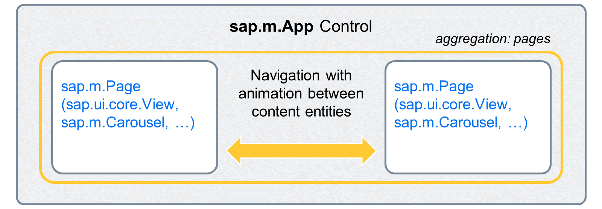
The figure illustrates the technical design of the _sap.m.App_ control. _sap.m.App_ inherits the navigation capabilities from the  _sap.m.NavContainer_ control. Although the _sap.m.App_ control provides functionality for navigation, it is not recommended that you use this approach for productive applications (see routing).
### Typical MVC Approach
The separation of concerns is also a very important concept, even when it comes to implementing SAPUI5 views.
Watch this video to know more about a typical MVC approach.
The recommended application design is to have one XML that only contains the implementation of the _sap.m.App_ control as a root control. The remaining Views (also XML Views) are used for the pages.
The _sap.m.App_ control provides an aggregation called pages. The controls aggregated by the pages aggregation of _sap.m.App_ receive navigation events like beforeShow. These navigation events are documented in the pseudo interface,  _sap.m.NavContainerChild_.
### The index.html File
The starting point of each SAPUI5 application is the index.html file.
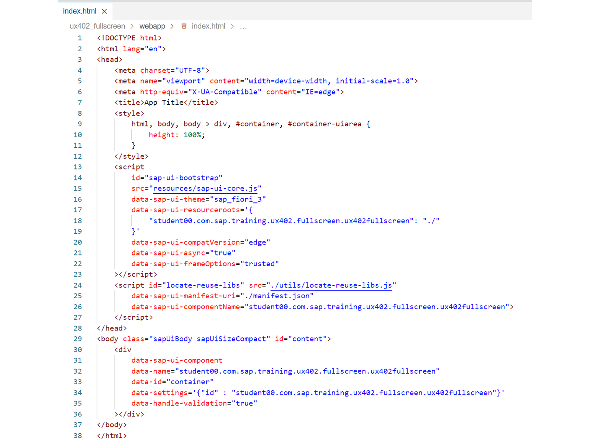
The index.html file contains the SAPUI5-bootstrapping implementation. The SAPUI5 bootstrap script in your page initialize SAPUI5 runtime automatically as soon as the script is loaded and executed by the browser. The html-body contains all the necessary implementation details for loading the SAPUI5-component using the namespace.
### The App.view.xml File
Each application contains a view implementation that contains the _sap.m.App_ as the central control. This view is shown right after the application has been loaded on the client. As you can see in the following figure, the App.view.xml file contains a _sap.ui.core.mvc.View_ control. The control itself only contains the _sap.m.App_ control with an assigned id.
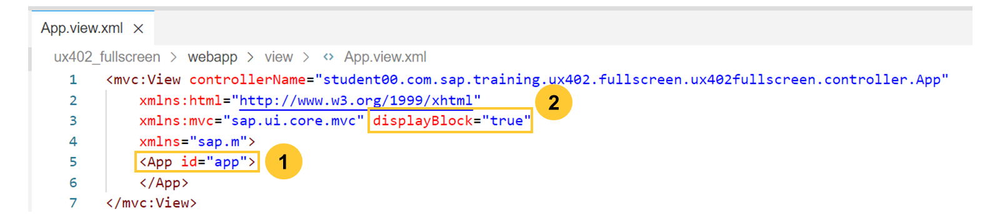
The description is as follows:
  * The App view only contains the empty **App** tag (1).
  * The App view is specified in the Application Descriptor (_manifest.json_) as the root View that will be opened.
  * The pages will be added automatically into the App control according to the current URL by the router.
  * The router identifies the App control by means of the id.
  * The displayBlock="true" prevents vertical scrollbars appearing with Views that are set to 100% height (2).

### Example Page of Carrier.view.xml
As already discussed, it is good practice to separate the different aspects of our application in different view implementations. The following figure shows you a view implementation related to displaying a list of carriers provided by an OData-service.
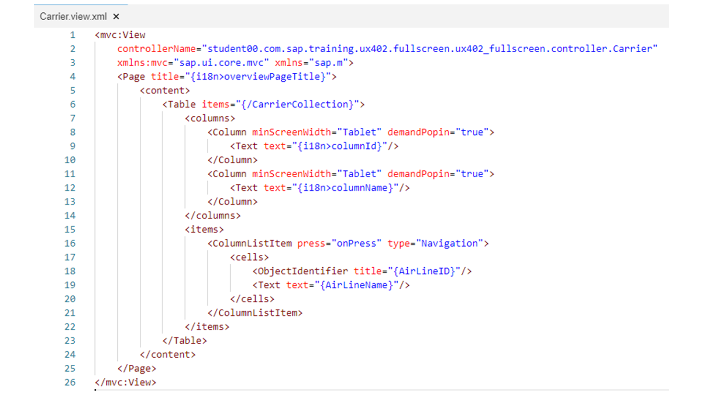
_sap.m.Page_ provides a basic container for an application screen.
_sap.m.Page_ provides an aggregation with the name content. The aggregation takes to 0..n controls. In the implementation above, an sap.m.Table control is added to the content aggregation for the purposes of displaying a list of entities from the entity set CarrierCollection.
## Explore the design of a Full-screen Application
### Business Example
In the following exercise, you will explore the design of a Full-screen Application with SAPUI5.
### Prerequisites
  1. Before you start this exercise, you should have already downloaded the prepared files from Github : <https://github.com/SAP-samples/sapui5-development-advanced-learning-journey>
  2. In the following exercises, SAP Business Application Studio is used as the development environment. It is assumed that you already have access to this development tool.
If this is not yet the case, you can gain access to the SAP Business Application Studio free of charge using the free tier model for SAP Business Technology Platform (SAP BTP). To do this, read this tutorial [Get an Account on SAP BTP to Try Out Free Tier Service Plans](https://developers.sap.com/tutorials/btp-free-tier-account.html) on how to create a free account on SAP BTP. Based on this, the video [SAP Business Application Studio Free Tier Model Onboarding](https://www.youtube.com/watch?v=-g7LZHqcbDQ) shows you the necessary steps to set up the free tier plan for SAP Business Application Studio.
  3. You might also want to setup your browser to allow all popups, if possible. If you are not allowed to change those settings, you will be notified each time you preview your application in Business Application Studio and have to select _Open_ in the displayed dialog.

Note
SAP Business Technology Platform and its tools are cloud services. Due to the nature of cloud software, step procedures and naming of fields and buttons may differ from the exercise solution.
### Steps
  1. Import the fullscreen.tar project into your Business Application Studio.
    1. Locate the fullscreen.tar file in your training files.
    2. Log into the training SAP Business Application Studio as shown in a previous training.
    3. Select the menu _File_ → _Open Folder..._.
    4. Select or Enter the **/home/user/projects/** folder and choose _OK_.
    5. Select the menu _File_ → _Import Project.._.
    6. Select the fullscreen.tar file and choose _OK_.
  2. Look at the views and controllers.
What is the name of the main application control?
What is the _App_ view displaying?
What is the _Carrier_ view displaying?
What is the _Flights_ view displaying?
What is the _NotFound_ view displaying?
    1. Expand the view sub folder.
The main application control is named App.
    2. Open the _App_ view.
The _App_ view is only containing the sap.m.App control.
    3. Open the _Carrier_ View.
The _Carrier_ view is displaying a table listing carriers from the UX_C_Carrier_TP entity.
    4. Open the _Flights_ view.
The _Flights_ view is displaying a table listing flights from the to_flights association of a carrier id.
    5. Open the _NotFound_ view.
The _NotFound_ view is displaying a message with a Go Back button to navigate back to previous screen..
    6. Expand the controller sub folder and open the files.
For the moment no script is provided for the views, except for the NotFound view which contains the script to manage navigation to the previous screen.


### Applying Router Configuration for a Full-Screen Application

*Source: https://learning.sap.com/courses/advanced-sapui5-development/implementing-router-configuration_a90df07d-7729-4716-a776-c0aa6ac16847*

Objective
After completing this lesson, you will be able to apply router configuration for a full-screen application.
## Implementing the Routing for a Full-screen Application
### Routing and Navigation
As discussed, the SAPUI5 allows you to build single-page apps where the navigation is done by changing the hash. In this lesson, we will learn how to configure and implement the navigation for a full-screen application.
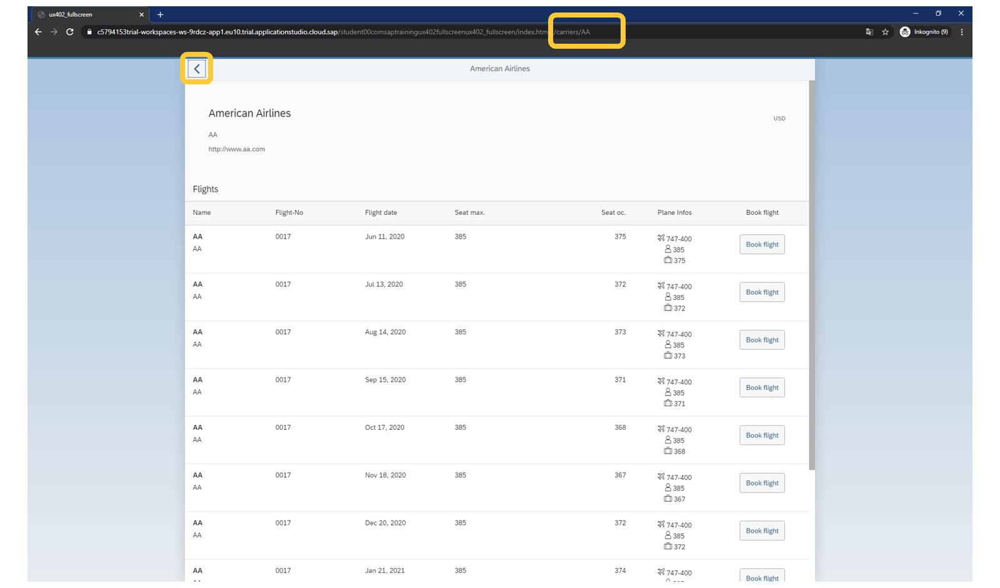
As you have learned, a route is used to notify your application that the hash has changed to a certain value. The pattern of the route is matched against the hash. If the pattern matches, the route provides the data passed over the hash to a defined handler.
### Root View Configuration
In the manifest.json file, in the "sap.ui5" section, there should be a "rootView" section defining the entry point of the application. In most cases, the _App_ view.
The id of the _app_ control is also provided.
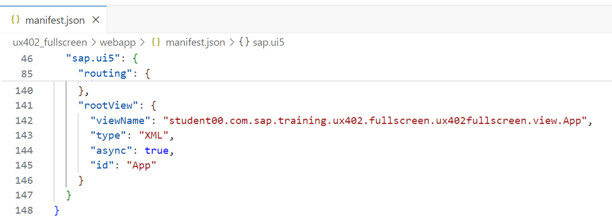
### URL Patterns for Routes
Remember, whenever a hash is added to a URL, the router checks whether there is a route with a matching pattern. The first matching route is taken and the corresponding target view is called. The data provided with the hash are passed on to the target.
The pattern parameter of a route defines the string that is matched against the hash.
Let's review in details the different kinds of patterns:
  * Hardcoded parts
  * Mandatory parameters
  * Optional parameters
  * Mandatory query parameters
  * Optional query parameters

#### URL Patterns for Routes
| Pattern type  | Example  |   |
| --- | --- | --- |
| hardcoded parts  | "carrier/settings"  |  This pattern will only match if the hash of the browser is carrier/settings. No arguments will be passed to the events of the Route.  |
| mandatory parameters  | "carrier/{carrierid}"  |  {carrierid} is a mandatory parameter. For example, the following hashes would match: carrier/AA. The matched event of the Route will get AA passed as carrierid in its arguments. The hash carrier/ will not match.  |
| optional parameters  | "carrier/{carrierid}/showtab/:tabid:"  |  :tabid: is an optional parameter For example, the following hashes would match: carrier/AA/bookings  |
| mandatory query parameters  | "carrier{?query}"  |  {?query} allows you to pass queries with any parameters For example, the following hashes would match: carrier?first=value1 carrier?first=value1&second=value2  |
| optional query parameters  | "carrier/{carrierid}/flights:?query:"  |  :?query: is an optional query parameter. For example, the following hashes would match: carrier/AA/flights?from=New York carrier/AA/flights  |
### Routing applied to a Full-screen Application
In this video lets look at routing in a full screen application.
## Explore the routing configuration of a Full-screen Application
### Business Example
In the following exercise, you will explore the routing configuration of a Full-screen Application with SAPUI5.
### Prerequisites
You should have completed the previous exercise to import the full screen application.
### Steps
  1. Look at the routing configuration and check everything is in place for a full-screen application navigation.
What is the root View?
Look at the controlAggregation, controlId and clearControlAggregation properties.
How many targets? How many routes? Why?
What is the pattern to open the Flights view?
    1. Open the manifest.json file.
    2. Look for the rootView section.
The rootView is the _App_ view.
    3. Look for the routing section.
    4. Check the config section.
The controlAggregation is pages, the controlID is App and the clearControlAggregation is set to false.
    5. Check the routes and targets section.
There are three targets (overview, flights and notFound) and two routes (for overview and flights). The notFound target is used in the config section, as a bypass.
    6. Note the route pattern to open the _Flights_ view.
The pattern to open the Flights view is: carriers/{carrid}
  2. Preview the application.
What does happen if you try to enter a flights view pattern manually? (for example by adding **& /carriers/AA** at the end of the current URL).
What does happen if you enter a wrong pattern? (for example **& /carrier** at the end of the default URL).
    1. Right-click on the webapp folder and choose _Preview Application_.
    2. Select _start local..._
A list of carriers should be displayed.
    3. Change the URL to enter a valid pattern, for example, add **& /carriers/AA**.
The _Flights_ view displays but with no data. No binding has been set yet with the data service.
    4. Change the URL to enter a wrong pattern, for example, change to **& /carrier/AA**.
The _NotFound_ view displays. If you choose the _Go Back_ button, you return to the _Flights_ view.


### Using Local Data

*Source: https://learning.sap.com/courses/advanced-sapui5-development/using-local-data*

Objective
After completing this lesson, you will be able to use Local Data to design and test application.
## Remote vs. Local OData Services
### Scenario
As a Business Process owner, you are asked to continually improve the user experience in your area of responsibility.
Creating user interfaces is a critical aspect of the user experience. In this training, you will learn how to develop SAPUI5 user interfaces to facilitate a greater user experience.
But the major part of an application resides in its business logic, which is provided by the OData Service.
### Remote Data Use Case
#### The following are some basics about remote data use cases:
  * Most applications will be built using remote data:
In other words, the model will access data that resides on a server such as an SAP system and accessed through an SAP Gateway OData service.
  * Someone will create an OData service(s) consisting of the following:
    * Collections
    * Properties
    * Associations
  * The code that you write in the SAPUI5 application will make use of these entities.

### Local Data Use Case
#### There are a variety of reasons a developer may want to create and use local data during the development cycle:
  * Sometimes, a developer has to work offline.
  * A developer is impacted by poor development server performance.
  * Developers want to perform a quick test without creating the live entities needed on the backend server (Gateway).
  * Technically, what is being shown here could be used in a production application as well.
  * Production applications could fetch some of their data from local files instead of enduring the overhead of making remote requests:
For example, local data could be used for lookup tables/lists.

### Accessing the Metadata
If you are working offline, for example, you won't be able to directly reference the OData Service in your project. But you still need to get the structure(metadata) of the service that will be used by the UI.
In order to add this service metadata to your project, you first need to access it.
Watch the following video to learn how to access an OData Service metadata:
### Adding the Metadata to the Project
Once you have the metadata file, you can add it to your project.
Watch the following video to learn how to import this metadata into your project:
### Editing the Metadata
Sometimes, when you are implementing an OData-Service based application, the service implementation is not finished or even did not start yet. To create or to adapt an existing metadata file, SAP Business Application Studio provides a text editor with intellisense.
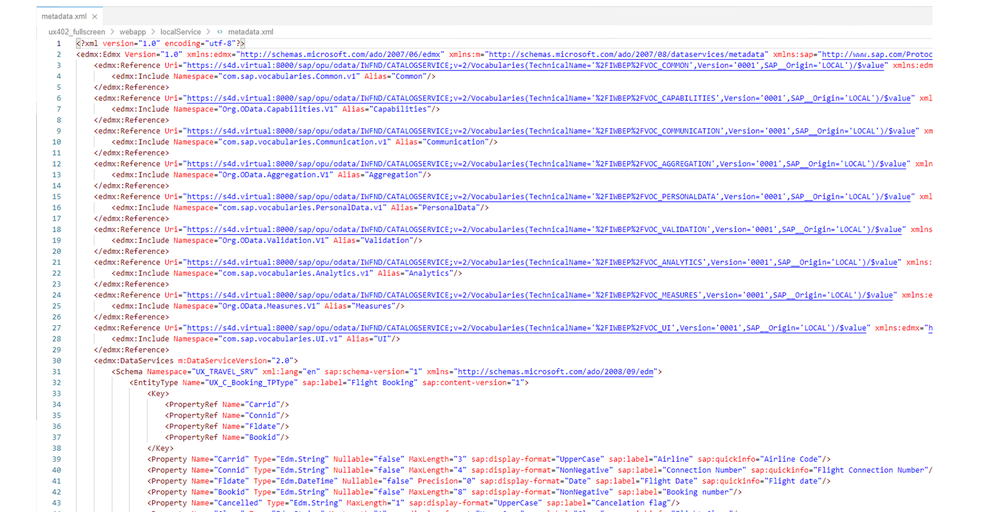
### Getting Local Data
Getting the metadata is one thing, but you might want to be able to test your application with real data.
You can then query the OData Service to get some data and import this data into your project. This data file then needs to be in JSON format.
Watch the following video to see how to query data in JSON format:
Then watch the following video to learn how to best add the data file into your project:
## Explore the data model of an existing application
### Business Example
In the following exercise, you will explore the data model of a Full-screen Application with SAPUI5.
### Prerequisites
You should have completed the first exercise of this unit to import the full screen application.
### Steps
  1. Explore the service metadata.
What are the entity sets provided by this OData Service ?
    1. Expand the localService sub folder.
    2. Open the metadata.xml file. Look for the EntityType tags and note their names.
Note
The four entity sets provided are the following :
UX_C_Booking_TP
UX_C_Carrier_TP
UX_C_Connection_TP
UX_C_Flight_TP
  2. Explore the data files.
For which entities are the sample data provided?
    1. Expand the data sub folder.
    2. Look at the three provided files.
Note
The sample data is provided for the following entity sets :
UX_C_Carrier_TP
UX_C_Connection_TP
UX_C_Flight_TP


### Implementing Navigation in a Full-screen application

*Source: https://learning.sap.com/courses/advanced-sapui5-development/implementing-navigation_c27bc9ec-a109-4008-9d32-bcf795e7a42a*

Objective
After completing this lesson, you will be able to implement views and navigation for a full-screen application.
## Implementing Navigation
After routing configuration, we will now take a look at how to use the router with the configured routes.
### Implementing the Carrier View
The starting point of our full-screen application is the Carrier view.
In this video lets take a look at how to implement this carrier view:
The _sap.m.Page_ holds an aggregation with the name content. The content aggregation is of type, _sap.ui.core.Control_. In the sample shown above, an _sap.m.Table_ control (1) is added to the content aggregation. The table is bound to an entity, _CarrierCollection_. For each entity of the collection, an object of type _ColumnListItem_ (2) is created and added to the table.
### Implementing the Flights Detail View
The Flights view displays master data for a flight sap.m.ObjectHeader control. The data comes from a relative data binding that is set on the view level as we have seen in the controller before.
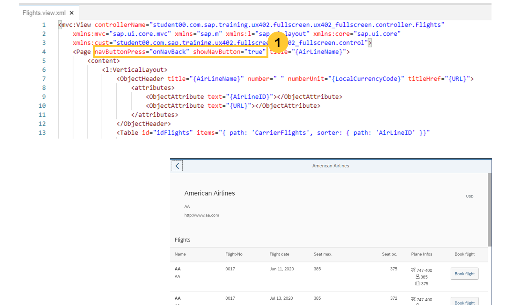
The Flights view implementation shows the details of the selected carrier and the list of flights for the selected carrier in a table. To provide the functionality for navigating back to the carrier view, we add the property _showNavButton_ with the value, true, to the page object.
To handle the back navigation, we assign an event handler for the _navButtonPress_ event (1). The event handler is implemented inside the flights controller.
### Implementation of the Back Button on the Flights Page
To enable the back navigation from the Flights view to the Carrier view, we have to add a corresponding event handler.
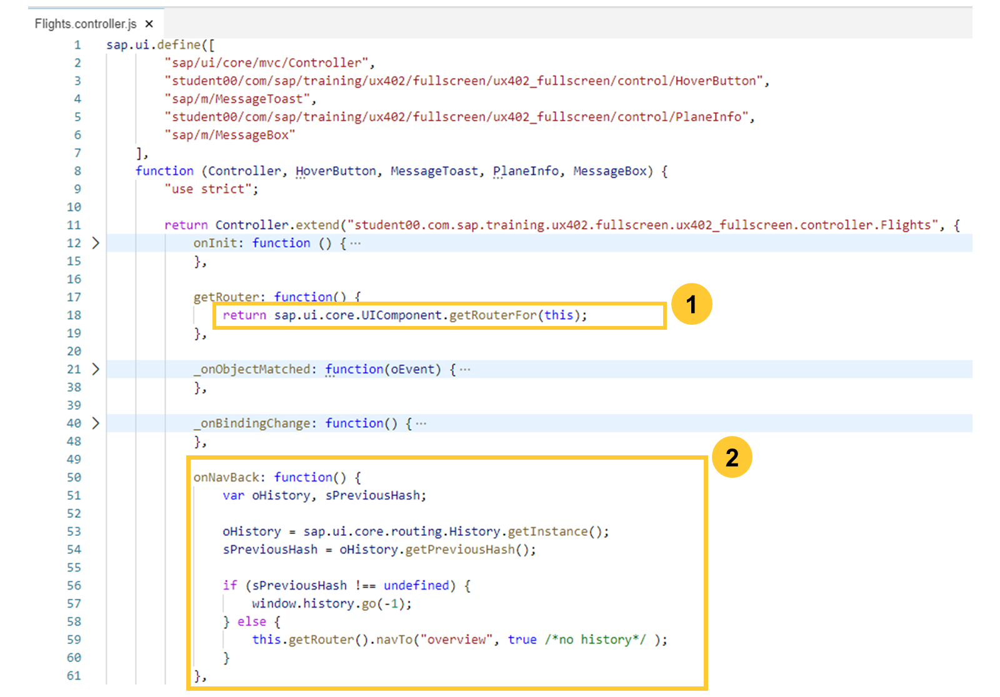
  1. Implement a function that returns the router instance for your component. It is also possible to use this.getOwnerComponent().getRouter().
  2. Implement the event handler function **onNavBack**.
This functions checks if there is a previous hash value in the app history, if so, redirect to the previous hash via the browser’s native History API. If not, use the Router to navigate to the route overview which is the carriers overview view.
The function **navTo** of the router is invoked using the name of the route and a boolean parameter indicating if a browser history entry should be created.
     * **true** : the hash is replaced (no browser history entry)
     * **false** : the hash is set (browser history entry)

### Display the NotFound Page for Invalid Carrier ID
As introduced in previous lessons, we have to make sure that the application is able to handle invalid hashes. To react to invalid hashes, we have to extend the element binding in the Flights.controller.js.
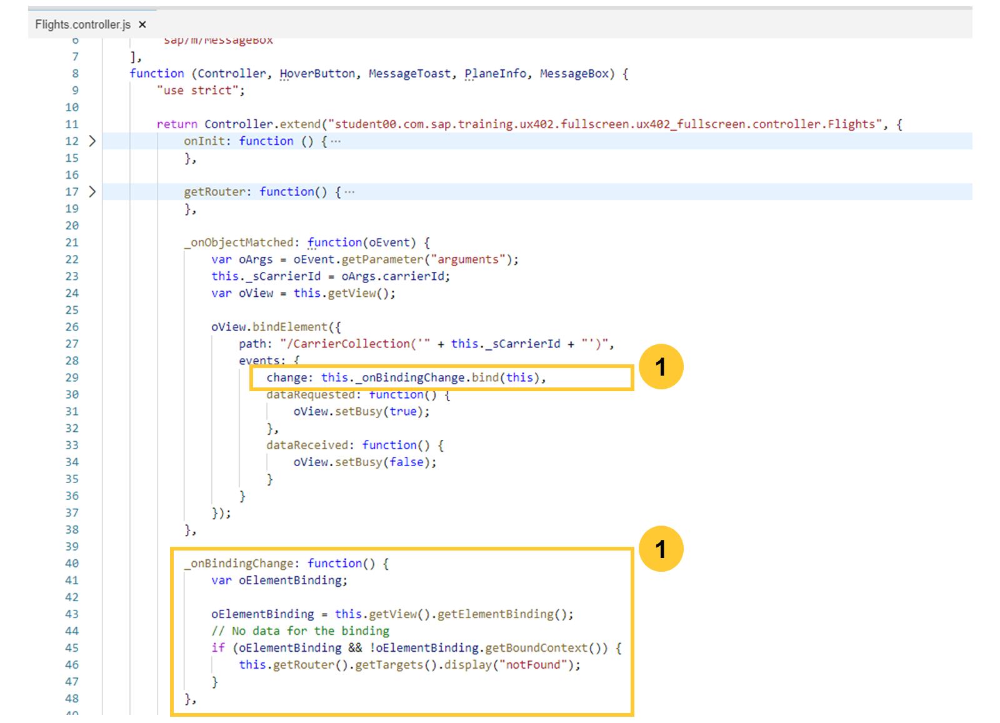
  1. To react on the change event of the binding operation you can attach an event handler. You can display targets manually without referencing them in a navigation route. Good examples for this are temporary errors, switching to an edit page for a business object, or going to a "Settings" page.
  2. Inside the _onBindingChange() handler we get a reference to the Targets helper object of the router and simply call display("notFound").
The view associated to the target with the name notFound from the routing configuration will be displayed by the router without changing the hash.
The sap.m.routing.Targets object is retrieved by calling getTargets() on the router. However, you could also get a reference to the sap.m.routing.Targets object by calling this.getOwnerComponent().getRouter().getTargets() or this.getOwnerComponent().getTargets().

## Implementing Navigation in a Full-screen application
### Business Example
In the following exercise, you will learn how to implement navigation in a Full-screen Application with SAPUI5.
Note
SAP Business Technology Platform and its tools are cloud services. Due to the nature of cloud software, step procedures and naming of fields and buttons may differ from the exercise solution.
### Prerequisites
You should have completed the first exercise of this unit to import the full screen application.
### Task 1: Add a Control for Navigation
We now want to react to the selection of a carrier from the carriers table. Therefore, implement an event handler for the press event of the ColumnListItem element. Name the function onPress. Read the property Carridfrom the selected item. Furthermore, set the type attribute of the ColumnListItem element to Navigation. In this task, we will adjust the Carrier.view.xml file.
#### Steps
  1. Open the Carrier.view.xml file and assign an event handler function with the name onPress to the press event of the ColumnListItem element.
    1. Add the press attribute to the ColumnListItem :
Code Snippet
Copy codeSwitch to dark mode

```

1

press="onPress"

```

  2. Add the attribute type to the ColumnListItem element and assign the value Navigation to the attribute. Then save your changes.
    1. Add the type attribute to the ColumnListItem:
Code Snippet
Copy codeSwitch to dark mode

```

1

type="Navigation"

```

    2. Save your changes. You now should have the following code:
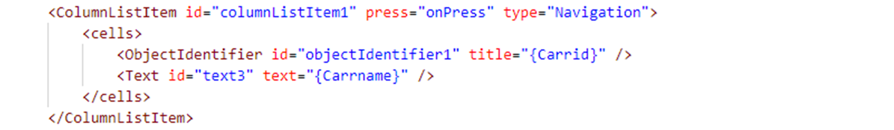

### Task 2: Implement the Carrier View Behavior for Navigation
In the following task, you must implement the onPress function in the Carrier view controller. The onPress function reads the property Carrid from the event initiator. After reading the property, the route flights will be invoked and the id of the airline/carrier is passed as argument to the route.
#### Steps
  1. Open the Carrier.controller.js file and remove the onInit function.
    1. Open the Carrier.controller.js file.
    2. Remove the onInit function.
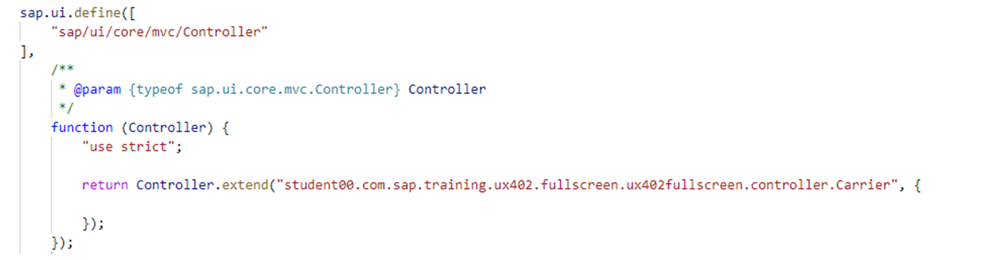
  2. Implement a function getRouter in the view controller of the carrier view. The function should return the reference to the router object of the component.
    1. Use the following code:
Code Snippet
Copy codeSwitch to dark mode

```

1234

getRouter: function () {
    return sap.ui.core.UIComponent.getRouterFor(this);
}

```

  3. Add an event handler function with the name onPress to the controller implementation of the carrier view controller. The function takes one argument with the name oEvent.
    1. Add a function with the name onPress. The function should take one argument called oEvent. Use the following code:
Code Snippet
Copy codeSwitch to dark mode

```

123

 onPress: function(oEvent) {

}

```

  4. Read the property Carrid from the binding context of the event initiator and store the value in a local variable, sCarrid.
    1. Declare a variable with the name oItem and assign the event-source object to the variable.
    2. Declare a variable with the name oCtx and assign the binding context from the event source object to the variable.
    3. Declare a variable sCarrid. Read the value of the property Carrid from the oCtx-Object using the function getProperty and assign the result to the variable sCarrid.
    4. Your implementation inside the onPress function should look like the following:
Code Snippet
Copy codeSwitch to dark mode

```

1234

var oItem = oEvent.getSource();
var oCtx = oItem.getBindingContext();
var sCarrid = oCtx.getProperty("Carrid");

```

  5. Navigate to the Flights view using the route flights. Pass the value of sCarrid to the route as an argument using the property carrierId. Use the navTo function of the router for triggering the navigation.
    1. Use the following code after the variables definition :
Code Snippet
Copy codeSwitch to dark mode

```

1234

this.getRouter().navTo("flights", {
  carrid: sCarrid
}, false);

```

    2. Your controller implementation should look like the following:
    3. Save your changes. You now should have the following code:
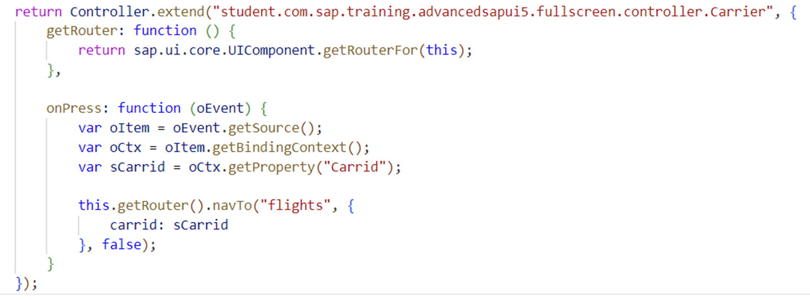

### Task 3: Implement the Flights View Behavior for Navigation
#### Steps
  1. Implement a function getRouter in the view controller of the flights view. The function should return the reference to the router object of the component.
    1. Open the Flights.controller.js file.
    2. Add a getRouter function using the following code (don't forget to add a coma after the onInit function):
Code Snippet
Copy codeSwitch to dark mode

```

1234

getRouter: function () {
return sap.ui.core.UIComponent.getRouterFor(this);
}

```

  2. Implement the onInit function of the Flights controller. Register a function _onObjectMatched for the route flights. The function will be implemented in one of the next steps.
    1. Locate the onInit function.
    2. Create a variable with the name oRouterand assign a reference to router. Use the following code:
Code Snippet
Copy codeSwitch to dark mode

```

1

var oRouter = this.getRouter();

```

    3. Register the function _onObjectMatched when the route flights is matched. Enter the following code:
Code Snippet
Copy codeSwitch to dark mode

```

1

oRouter.getRoute("flights").attachMatched(this._onObjectMatched, this);

```

    4. You now should have the following code:
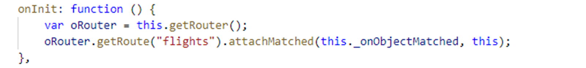
  3. Implement the function _onObjectMatched. The function should read the property carrierId from the event parameter arguments and bind the view to the selected carrier. Register the _onBindingChange function for the change event. Then register anonymous event handler functions for the events dataRequestedand dataReceived. When the event dataRequested occurs, the view should be set into the busy mode, and when dataReceivedoccurs, the busy mode should be set to false. In this step, create a function _onObjectMatched with one invocation parameter called oEvent. Then retrieve the parameter with the name arguments from the event object, read the property Carrid and store the value in a local variable _sCarrierId. In addition, get the view and assign it to the local variable oView.
    1. Create a function _onObjectMatched with one invocation parameter called oEvent. Add the following code after the getRouter function (don't forget to add a coma) :
Code Snippet
Copy codeSwitch to dark mode

```

123

_onObjectMatched: function (oEvent) {

}

```

    2. Retrieve the parameter with the name arguments from the event object. Assign it to a variable called oArgs. Add the following code to the function:
Code Snippet
Copy codeSwitch to dark mode

```

1

var oArgs = oEvent.getParameter("arguments");

```

    3. Read the property carrierId from the oArgs object and assign the result to a member variable called _sCarrierId. Add the following code:
Code Snippet
Copy codeSwitch to dark mode

```

1

this._sCarrierId = oArgs.carrid;

```

    4. Get a reference to the view object and assign the reference to a local variable called oView. Add the following code:
Code Snippet
Copy codeSwitch to dark mode

```

1

var oView = this.getView();

```

  4. Call the function bindElement on the view object. Pass a literal object to the function.
    1. Enter the following code:
Code Snippet
Copy codeSwitch to dark mode

```

123

oView.bindElement({

});

```

  5. Add the property path to the literal object and assign the binding to the selected Carrier using the _sCarrierId variable.
    1. Add the following code to the bindElement function:
Code Snippet
Copy codeSwitch to dark mode

```

1

path: "/UX_C_Carrier_TP('" + this._sCarrierId + "')",

```

  6. Add a property events to the literal object. Assign another literal object to the property.
    1. Add the following code after the path property specification:
Code Snippet
Copy codeSwitch to dark mode

```

123

events: {

}

```

  7. Call the _onBindingChange function for the event change. The function will be implemented in a later step.
    1. Add the following code to the events definition:
Code Snippet
Copy codeSwitch to dark mode

```

1

change: this._onBindingChange.bind(this),

```

  8. Add a function for the event dataRequested and implement the function in a way that the view is set to busy.
    1. Add the following code after the change event specification:
Code Snippet
Copy codeSwitch to dark mode

```

1234

dataRequested: function () {
  oView.setBusy(true);
},

```

  9. Add a function for the event dataReceived and implement the function in a way that the view is set to not busy.
    1. Add the following code after the dataRequested event specification:
Code Snippet
Copy codeSwitch to dark mode

```

1234

dataReceived: function () {
  oView.setBusy(false);
}

```

    2. You now should have the following code:
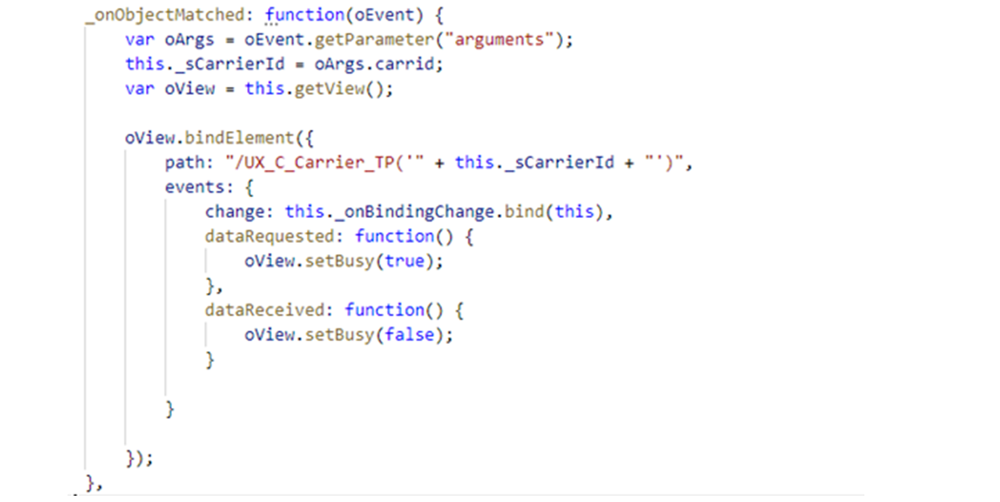
  10. Add a function _onBindingChange to the controllers implementation. Get the element binding from the view. If the element binding has no bound context, the NotFound view should be displayed. Get a reference to the target's helper object of the router and call display("notFound").
    1. Enter the following code after the _onObjectMatched function implementation:
Code Snippet
Copy codeSwitch to dark mode

```

1234567891011

_onBindingChange: function () {
  var oElementBinding;

  oElementBinding = this.getView().getElementBinding();

  // No data for the binding
  if (oElementBinding && !oElementBinding.getBoundContext()) {
    this.getRouter().getTargets().display("notFound");
  }
},

```

  11. Add a function onNavBack to the controllers implementation. If the previous hash is undefined, use the navTo function of the router with the overview route. Then save your changes.
    1. Add the following code after the _onBindingChange function implementation:
Code Snippet
Copy codeSwitch to dark mode

```

12345678910111213

onNavBack: function () {
  var oHistory, sPreviousHash;

  oHistory = sap.ui.core.routing.History.getInstance();
  sPreviousHash = oHistory.getPreviousHash();

  if (sPreviousHash !== undefined) {
    window.history.go(-1);
  } else {
    this.getRouter().navTo("overview", true /*no history*/);
  }
}

```

    2. Save all of your changes.

### Task 4: Test your Application
Be aware that since we are not testing the application in a real SAP Fiori environment you will get errors in the console if you use Dev Tools to debug your application. Please, dismiss any message about resource preload.
#### Steps
  1. Test your application. Choose a carrier to see the corresponding flights. The Flights view should be displayed.
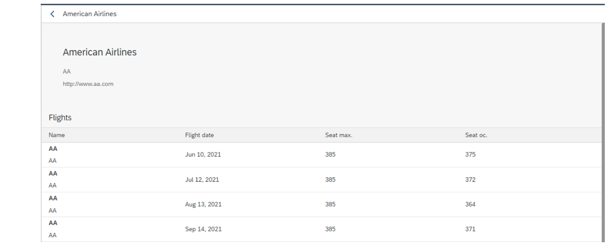
    1. Perform this step in the way it was shown in a previous exercise.
  2. Try to navigate to a URL for which no route exists. The NotFound view should be displayed.
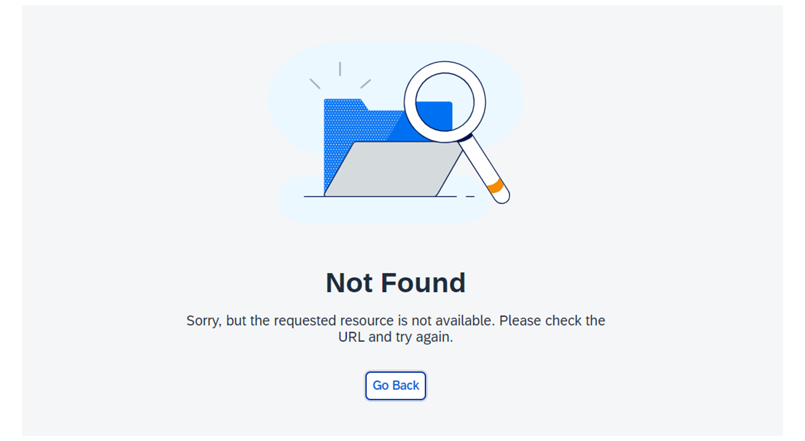
    1. In the URL field of your browser, exchange the carrier id at the end with something that does not exist (like XX for example) and press Enter (on your keyboard).
    2. The Not Found view should display.


### Enforcing Responsiveness in a Full-screen application

*Source: https://learning.sap.com/courses/advanced-sapui5-development/developing-a-full-screen-application_c046dc57-0c33-4c42-8d97-c2d25065a920*

Objective
After completing this lesson, you will be able to enforce responsiveness in a full-screen application.
## Responsive UI Controls
One of the main advantages of SAPUI5 is that it offers UI controls already designed for responsiveness.
Controls available in the sap.**m** library are indeed designed for **mobility**.
For example, the sap.m.Table control provides a set of sophisticated and easy-to-use functions for responsive table design. The sap.m.Column used as aggregation in the Table control allows to define column specific properties that will manage responsiveness. Here are some of those properties :
  * **minScreenWidth**
Defines the minimum screen width to show or hide this column. By default column is always shown. The responsive behavior of the sap.m.Table is determined by this property. As an example by setting minScreenWidth property to "40em" (or "640px" or "Tablet") shows this column on tablet (and desktop) but hides on mobile.
  * **demandPopin**
According to your minScreenWidth settings, the column can be hidden in different screen sizes. Setting this property to true, shows this column as pop-in instead of hiding it. Meaning the columns to hide will be displayed below the actual table row, one below the other.

An alternative would be to set the **autoPopinMode** of the table to true and manage each column **importance** property.
Combined with alignment properties and the **width** property to fix a specific size for a column, no matter what the screen size is, it ensures that the data will be displayed correctly whatever device is used.
## Add responsiveness to a Full-screen application
In the following exercise, you will check and enforce responsiveness in a Full-screen Application with SAPUI5.
Note
SAP Business Technology Platform and its tools are cloud services. Due to the nature of cloud software, step procedures and naming of fields and buttons may differ from the exercise solution.
### Prerequisites
You should have completed the previous exercise to implement navigation in the full screen application.
If not, you can find the intermediate state of the fullscreen application in your solutions files. It is called fullscreen_stage1.
### Task 1: Test your Application for Responsiveness
#### Steps
  1. Run the application, _fullscreen_.
    1. Perform this step as shown in a previous exercise.
  2. With the help of Chrome DevTools, choose the large screen size of 1142 x 764 to preview how the application might look in a desktop browser. Select a carrier from the list of carriers and notice that the table for the flights has plenty of room for each field.
    1. Press F12 (on your keyboard) to access Chrome DevTools.
    2. Choose _Toggle device toolbar_.

    3. Set the screen size to 1142 x 764 and press Enter (on your keyboard).

    4. Select a carrier from the list of carriers. Take note that the table for the flights has plenty of room for each field.
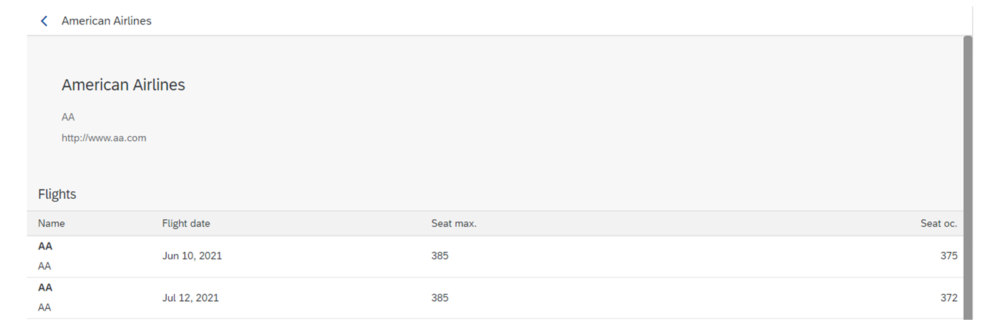
  3. With the help of Chrome DevTools, choose a smaller screen size of 324 x 480 to preview how the application might look on a mobile browser. Take note that the table for the flights has adjusted poorly to the new size.
    1. Set the screen size to 324 x 480 and press Enter (on your keyboard).

    2. Notice that the table for the flights has adjusted poorly to the new size. Text fields are wrapped and difficult to read.
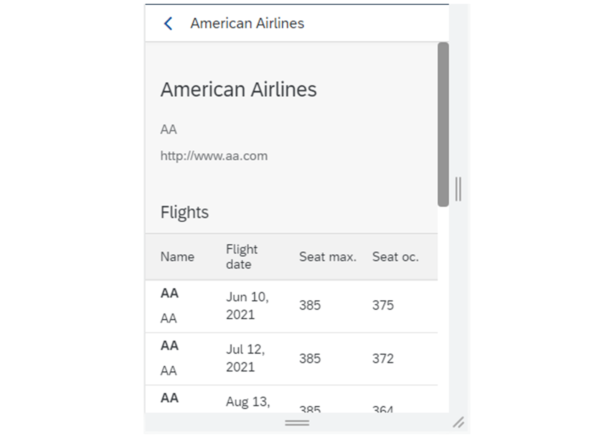

### Task 2: Adjust the Carrier View for a Mobile Device
#### Steps
  1. Open the Carrier.view.xml file and add to each of the Column elements the following attributes. Then save your changes.
#### Attribute-value Pairs for the Column Elements
| Attribute  | Value  |
| --- | --- |
| minScreenWidth  | **Tablet**  |
| demandPopin  | **true**  |
    1. Open the Carrier.view.xml file.
    2. Add the following code to each Column definition:
Code Snippet
Copy codeSwitch to dark mode

```

1

minScreenWidth="Tablet" demandPopin="true"

```

    3. For additional information about demandPopin visit the following URL: <https://sapui5.netweaver.ondemand.com/sdk/#/api/sap.m.Column%23controlProperties>
    4. Save your changes. You now should have the following code:
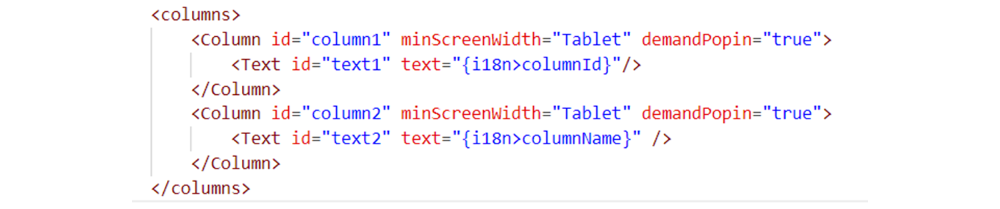

### Task 3: Adjust the Flights View for a Mobile Device
#### Steps
  1. Open the Flights.view.xml file.
    1. Perform this step as shown in a previous exercise.
  2. Add the following attribute to the first element of type, Column:
#### Attribute-value Pair for the first Column Element
| Attribute  | Value  |
| --- | --- |
| width  | **12em**  |
    1. Add the following code to the first Column definition:
Code Snippet
Copy codeSwitch to dark mode

```

1

width="12em"

```

  3. Add the following attribute to the last element of typeColumn:
#### Attribute-value pair for the last Column element
| Attribute  | Value  |
| --- | --- |
| hAlign  | **Right**  |
    1. Add the following code to the last Column definition:
Code Snippet
Copy codeSwitch to dark mode

```

1

hAlign="Right"

```

  4. Add the following attributes to the other elements of type Column. Then save your changes.
#### Attribute-value Pairs for the second, third and fourth Column Elements
| Attribute  | Value  |
| --- | --- |
| minScreenWidth  | **Tablet**  |
| demandPopin  | **true**  |
    1. Add the following code to the other two Column definition:
Code Snippet
Copy codeSwitch to dark mode

```

1

minScreenWidth="Tablet" demandPopin="true"

```

    2. Save your changes. You now should have the following code:
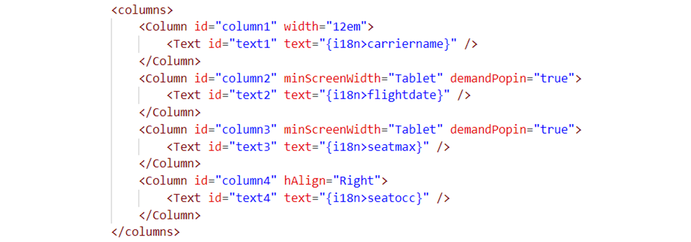

### Task 4: Test your Application Again
#### Steps
  1. Start your application for the test.
    1. Perform this step as shown in a previous exercise.
  2. With the help of Chrome DevTools, choose the large screen size of 1142 x 764 to preview how the application would look in a desktop browser. Then select a carrier from the list of carriers. Take note that the table for the flights has plenty of room for each field.
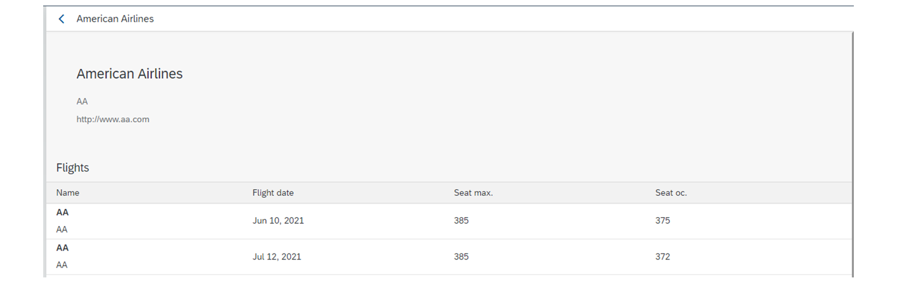
    1. Press F12 (on your keyboard) to access Chrome DevTools.
    2. Set the screen size to 1142 x 764.

    3. Select a carrier from the list of carriers.
    4. Notice that the table for the flights has plenty of room for each field.
  3. With the help of Chrome DevTools, choose a smaller screen size of 324 x 700 to preview how the application will look on a mobile browser. Notice that the table for the flights has adjusted well to the new size.
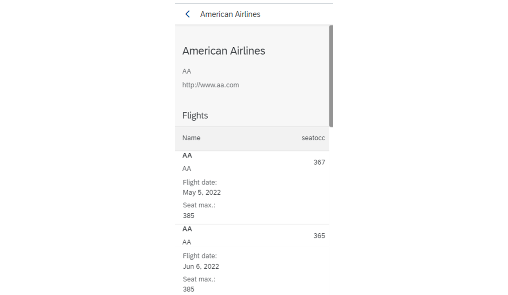
    1. Set the screen size to 324 x 700.

    2. Notice the table for the flights has adjusted well to the new size.
    3. Close and stop the application.
  4. Since we will further develop your fullscreen project in a following exercise, you can save the current state of the project by downloading it. Select the _fullscreen_ project and from the context menu, choose _Download_.

[Continue to quiz](https://learning.sap.com/courses/advanced-sapui5-development/implementing-full-screen-application)


### Quiz

*Source: https://learning.sap.com/courses/advanced-sapui5-development/implementing-full-screen-application*

It's time to put what you've learned to the test, get 8 right to pass this unit.
1.
### In the main view, which function is used to navigate to the detailed page ?
Choose the correct answer.
this.getRouter().getRoute(…).attachMatched(…)
this.getRouter().attachRouteMatched(…)
this.getRouter().navTo()
2.
### What query option is needed to access the data of an entity in the JSON format?
Choose the correct answer.
$json
$format=json
format=json
3.
### From which control does the sap.m.App control inherit navigation capabilities?
Choose the correct answer.
sap.m.NavigationContainer
sap.m.NavContainer
sap.ui.core.NavContainer
4.
### what is the recommended design for views in a full-screen application ?
Choose the correct answer.
One XML file for the sap.m.App root control and one for each of the pages.
One XML file containing the sap.m.App root control and its pages.
One XML file for the main view, containing the sap.m.App root control, and one for each of the remaining pages.
5.
### Where is the best place to store local data when using the SAP Business Application Studio?
Choose the correct answer.
In the models folder.
In the localService/mockdata folder.
In the test folder.
6.
### When do you need to work with local data?
There are two correct answers.
When working with static data.
When performance is poor in the productive system.
To perform a quick test without creating live entities on the backend server.
When you want to reduce the complexity of your application.
7.
### Where do you define the routes for your application ?
Choose the correct answer.
In the component.jsfile
In the root view file.
In the manifest.jsonfile
8.
### which of those elements are part of the routingconfiguration ?
There are three correct answers.
targets
config
pages
routes
rootView
9.
### Which of the following events are to be implemented in the detailed view controller ?
There are two correct answers.
onPress
_onBindingChange
onNavBack
onSelectionChange
10.
### In a sap.m.Table control, in which column property do you specify if the column should be displayed or hidden depending on the screen size?
There are two correct answers.
In the importanceproperty
In the minScreenWidth property
In the demandPopinproperty
In the visible property
Submit answers[Next unit](https://learning.sap.com/courses/advanced-sapui5-development/designing-a-list-detail-application_a8654105-93dc-4fca-aa5c-d9e9d5d4f8c3)


### Implementing List-Detail Application

*Source: https://learning.sap.com/courses/advanced-sapui5-development/designing-a-list-detail-application_a8654105-93dc-4fca-aa5c-d9e9d5d4f8c3*

Objective
After completing this lesson, you will be able to design a list-detail application using sap.f.FlexibleColumnLayout.
## Understanding the basic application design of a list-detail application
In SAPUI5 you can also implement the list-detail pattern. Apps following this pattern operate with a layout divided into two or three areas: a list area and two detail areas. The list area displays the items available to the user. The first detail area displays the details of an item selected in the list area. Sometimes this area contains, besides other data, a list of items. The user can select an item from this list to get more information in the second detail area.
In this unit, we will focus only on the design and implementation aspects that are different to the previous unit, Implementing Full-screen Application.
### The sap.f.FlexibleColumnLayout Control
For some use cases, it is very important to have a fluid navigation between pages, above the usual page-by-page navigation. Consequently, SAPUI5 provides the _sap.f.FlexibleColumnLayout_ control. The flexible column layout offers different layouts with up to three columns. Users can expand the column they want to focus on, switch between different layouts, and view the rightmost column in full screen mode.
In this video, take a look at the usage of _sap.f.FlexibleColumnLayout_ with the three columns.
### MVC Approach
The application design of an application using the _sap.f.FlexibleColumnLayout_ controls will also start with a view that is usually named App. Unlike the full-screen application, however, the App-view implementation does not only contain a control of the type _sap.m.App_. The _sap.f.FlexbileColumnLayout_ will be added to the _sap.m.App_.
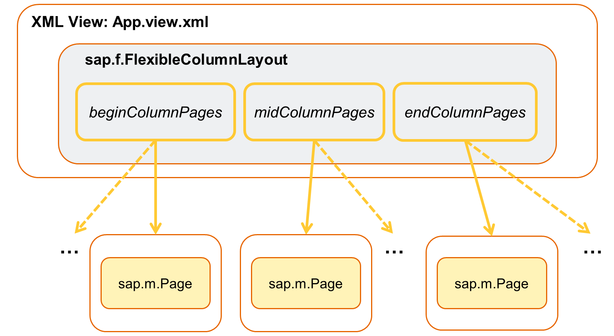
The _beginColumnPages_ , _midColumnPages_ and _endColumnPages_ aggregations of the Layout control aggregates the content entities.
The content entities can be of type _sap.f.DynamicPage_ , _sap.ui.core.View_ , _sap.m.Carousel_ , or any other control with fullscreen/page semantics.
### Using the List-Detail Pattern

When to use the list-detail pattern:
    You need to review and process different items quickly with minimal navigation.

When not to use the list-detail pattern:

  * You need to offer complex filters for the list of items.
  * You need to see different attributes for each item in the list, and compare these values across items.
  * You want to display a single object. Do not use the list to display different facets of the same object.


### Implementing the Root View for a List-Detail Application

*Source: https://learning.sap.com/courses/advanced-sapui5-development/implementing-the-root-view-for-a-list-detail-application*

Objective
After completing this lesson, you will be able to implement the root view of a List-Detail application.
## The Flexible Column Layout
As described in the previous lessons, an application should implement a root view - usually named App - that acts as central starting point of the view composition.
Watch this video to know more about implementing the App View for a List-Detail application.
Settings
### App View Xml
The following figure will show you the implementation of the App.view.xml file.
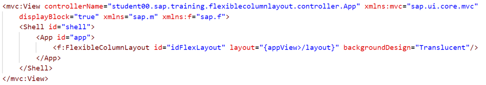
### App View Controller
As described in the video, a model is used to control the behavior of the _sap.f.FlexbileColumnLayout_ control. It is a very common practice to instantiate and initialize the model in the onInit function of the App view controller.
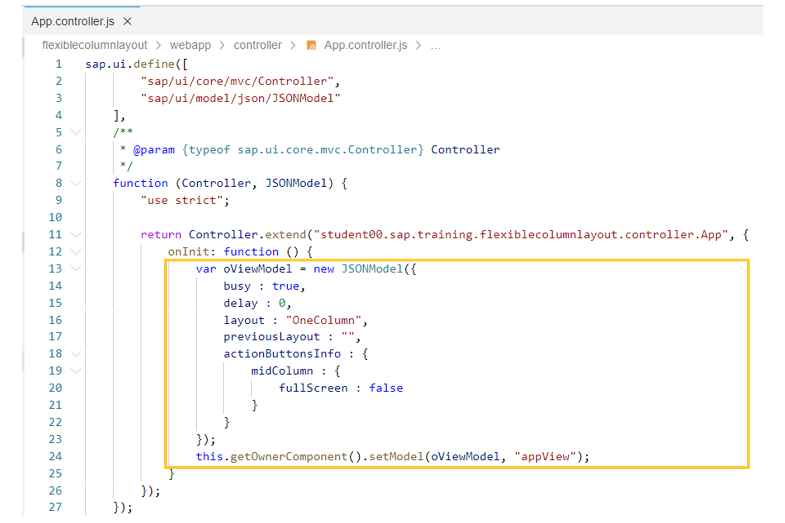
## Implement the root view of a List-Detail application
### Business Example
In this unit exercises, you learn how to implement a List-detail Application with SAPUI5. You'll start with a full-screen application and change it to a list detail one.
First, you'll implement the root view of the application.
### Prerequisites
Before you start this exercise, you should have downloaded the prepared files from Github: <https://github.com/SAP-samples/sapui5-development-advanced-learning-journey>..
Note
SAP Business Technology Platform and its tools are cloud services. Due to the nature of cloud software, step procedures and naming of fields and buttons may differ from the exercise solution.
### Task 1: Import and Review the Base List-Detail Application
#### Steps
  1. Import the listdetail.tar project into your Business Application Studio.
    1. Locate the listdetail.tar file in your training files.
    2. Log into the training SAP Business Application Studio as shown in a previous training.
    3. Select the menu _File_ → _Open Folder..._.
    4. Select or Enter the **/home/user/projects/** folder and choose _OK_.
    5. Select the menu _File_ → _Import Project.._.
    6. Select the listdetail.tar file and choose _OK_.
  2. Preview the application. For the moment it is the same as the previous full-screen application
    1. Right-click on the webapp folder and choose _Preview Application_.
    2. Select _start local..._
A list of carriers should be displayed.

### Task 2: Define the Main View of the Application
#### Steps
  1. Open the Application main view and add an sap.f.FlexibleColumnLayout element inside the App element with the listed properties and values:
| Attribute  | Value  |
| --- | --- |
| id  | **layout**  |
| layout  | **{mainView >/layout}**  |
| backgroundDesign  | **Translucent**  |
    1. Open the App.view.xml file in the _view_ folder of your project.
    2. Add the sap.f namespace with the prefix f to the App.view.xml file. Add following code after xmlns="sap.m":
Code Snippet
Copy codeSwitch to dark mode

```

1

xmlns:f="sap.f"

```

    3. Add an sap.f.FlexibleColumnLayout element inside the App element with the given attribute-value pairs :
Code Snippet
Copy codeSwitch to dark mode

```

123456

<f:FlexibleColumnLayout
  id="layout"
  layout="{mainView>/layout}"
  backgroundDesign="Translucent">
</f:FlexibleColumnLayout>

```

    4. Save your changes. Your code should now look like the following:
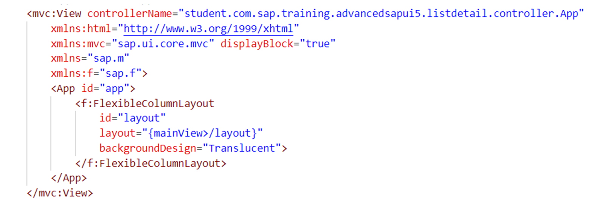

### Task 3: Implement the Application Controller for Flexible Column Layout
In this task, you implement the controller of the _App_ view to link the JSON model for layout to the Application.
#### Steps
  1. Open the App.controller.js file. Add sap/ui/model/JSONModel to the namespace.
    1. Open the App.controller.js file located in the _controller_ folder of your project.
    2. Update the code as follows :
Code Snippet
Copy codeSwitch to dark mode

```

12345678

sap.ui.define(
    [
        "sap/ui/core/mvc/Controller",
        "sap/ui/model/json/JSONModel"
    ],
    function(BaseController, JSONModel) {
...

```

  2. Implement the onInit function. Create an JSON-Model with an attribute layout and assign the created Model to the App view.
    1. Add the following code into the onInit function:
Code Snippet
Copy codeSwitch to dark mode

```

123456

  var oViewModel = new JSONModel({
    layout : "OneColumn"
  });

  this.getView().setModel(oViewModel, "mainView");

```

#### Result
Note
You won't be able to test the changes yet. Your application should still work as before.


### Adapting Router Configuration for a List-Detail Application

*Source: https://learning.sap.com/courses/advanced-sapui5-development/implementing-router-configuration_ec1ccbd2-4775-41f0-b94f-d43f01060c6c*

Objective
After completing this lesson, you will be able to adapt router configuration for a list-detail application.
## Adapting Router Configuration
When designing routing for a List-Detail application, one important change is the content of the Config section of the routing.
Here are the three important properties that you must change:
  * The _controlId_ must contain the id of the control that is used as a root control for displaying the UI-aspects. In an implementation using the _FlexibleColumnLayout_ control, the _controlId_ property contains the id of the _sap.f.FlexibleColumnLayout_ controls, which is embedded in the _sap.m.App_ control.
  * The _controlAggregation_ attribute must contain the name of the default aggregation of the control defined by the controlId property. The specified aggregation will be filled when a new UI aspect is displayed.
  * The _clearControlAggregation_ attribute has to be set to true, to allow each selection to replace (and not append) the previous one in the mid pane.


Another configuration that might slightly change when using the List-Detail pattern is the targets section.

The _controlAggregation_ at the target level will overwrite the _controlAggregation_ property at the routing config object for this specific target. As you can see in the figure, the value _midColumnPages_ is assigned to the _controlAggregation_ of the _NotFound_ and _Carrier_ target configuration. This means that the views of the targets will be displayed in the _midColumnPages_ aggregation of the _sap.f.FlexibleColumnLayout_ at runtime.
## Adapt router configuration for a List-Detail application
### Business Example
In this exercise, you learn how to adapt the router configuration for a List-detail Application with SAPUI5.
Note
SAP Business Technology Platform and its tools are cloud services. Due to the nature of cloud software, step procedures and naming of fields and buttons may differ from the exercise solution.
### Prerequisites
You need to have completed the previous exercise to implement the root view of the application.
### Steps
  1. Check the routing configuration and modify it so that the following routing configuration parameters are configured correctly.
#### Routing Configuration
| Configuration Parameter  | Values  |
| --- | --- |
| controlAggregation  | **beginColumnPages**  |
| controlId  | **layout**  |
| clearControlAggregation  | **true**  |
| bypassed target  | ["overview","notFound"]  |
    1. Open the manifest.json file.
    2. Locate the routing configuration config.
    3. Make sure that the listed configuration parameters are included.
    4. Your implementation should look like the following:
Code Snippet
Copy codeSwitch to dark mode

```

123456789101112131415161718

 "config": {
        "routerClass": "sap.m.routing.Router",
        "viewType": "XML",
        "async": true,
        "viewPath": "student.com.sap.training.advancedsapui5.listdetail.view",
        "controlAggregation": "beginColumnPages",
        "controlId": "layout",
        "clearControlAggregation": true,
        "transition": "slide",
        "bypassed": {
          "target": [
            "overview",
            "notFound"
          ]
        }
      },

```

  2. Check the overview target and add the following attributes. Additionally, remove the clearControlAggregation configuration parameter.
#### List Target
| Attribute  | Value  |
| --- | --- |
| viewLevel  | **1**  |
| controlAggregation  | **beginColumnPages**  |
    1. Find the overview target and check to ensure that it has all the listed attributes and values.
    2. Remove the clearControlAggregation configuration parameter.
    3. Your implementation should look like the following code:
Code Snippet
Copy codeSwitch to dark mode

```

1234567891011

"overview": {
          "viewType": "XML",
          "transition": "slide",
          "ControlAggregation": "beginColumnPages",
          "viewLevel": 1,
          "viewId": "Carrier",
          "viewName": "Carrier"
        },

```

  3. Find the flights target and add the listed attribute and value.
#### flights Target
| Configuration Parameter  | Value  |
| --- | --- |
| controlAggregation  | **midColumnPages**  |
    1. Find the flights target and check to ensure that it has all the listed attributes and values.
    2. Your implementation should look like the following code:
Code Snippet
Copy codeSwitch to dark mode

```

123456789

 "flights": {
          "viewType": "XML",
          "transition": "slide",
          "viewId": "Flights",
          "viewName": "Flights",
          "viewLevel": 2,
          "controlAggregation": "midColumnPages"
        },

```

  4. Find theflights route and add the overview target to the route.
    1. Find the flights route and add the overview target to it.
    2. Your code should look like the following:
Code Snippet
Copy codeSwitch to dark mode

```

1234567891011

,
 {
          "name": "flights",
          "pattern": "carriers/{carrid}",
          "titleTarget": "",
          "greedy": false,
          "target": [
            "overview",
            "flights"
          ]
        }

```

  5. Find the notfound target and add the listed attribute and value.
#### flights Target
| Configuration Parameter  | Value  |
| --- | --- |
| controlAggregation  | **midColumnPages**  |
    1. Find the notfound target and check to ensure that it has all the listed attributes and values.
    2. Your implementation should look like the following code:
Code Snippet
Copy codeSwitch to dark mode

```

1234567

 "notFound": {
          "viewId": "NotFound",
          "viewName": "NotFound",
          "transition": "show",
          "controlAggregation": "midColumnPages"
        }

```

### Result
The List should still display when you preview the application but you cannot navigate to the details anymore for the moment.
Be aware that since we are not testing the application in a real SAP Fiori environment you will get errors in the console if you use Dev Tools to debug your application. Please, dismiss any message about resource preload.


### Building the List View for a List-Detail Application

*Source: https://learning.sap.com/courses/advanced-sapui5-development/building-the-list-view-for-a-list-detail-application*

Objective
After completing this lesson, you will be able to build the List view for a List-Detail application.
## The DynamicPage control
After the implementation of the application foundation, we can go further with the implementation of the views. We start with the list view, the view that should be shown after the initial start of the application. We will use the _sap.f.DynamicPage_ to implement the basic layout.
Watch this video to know more about the structure of the _sap.f.DynamicPage_ control used in the List View.
### Reasons to use DynamicPage controls
  * You need to have a title, that is always visible and a header, that has configurable Expanding/Snapping functionality. If you don't need the Expanding/Snapping functionality it is better to use the sap.m.Page as a lighter control.
  * You're displaying a sap.m.FlexBox with non-adaptive content (doesn't stretch to fill the available space), it is recommended to set the fitContainer property of the FlexBox to false. If you are displaying a sap.ui.table.Table, keep in mind that it is non-adaptive and may cause unpredicted behavior for the DynamicPage on smaller screen sizes, such as mobile.
  * The snapping of the DynamicPageTitle is not supported in the following case: When the DynamicPage has a scroll bar, the control usually scrolls to the snapping point - the point, where the DynamicPageHeader is scrolled out completely. However, when there is a scroll bar, but not enough content to reach the snapping point, the snapping is not possible using scrolling.
  * You are using sap.ui.layout.form.Form, sap.m.Panel, sap.m.Table and sap.m.List controls in the content of DynamicPage, you need to adjust their left text offset if you want to achieve vertical alignment between the sap.f.DynamicPageHeader`s content and DynamicPage`s content. For more information, see the documentation for the content aggregation.

### The DynamicPage Responsive Behavior
The responsive behavior of the DynamicPage depends on the behavior of the content that is displayed. To adjust the DynamicPage content padding, the sapUiContentPadding, sapUiNoContentPadding, and sapUiResponsiveContentPadding CSS classes can be used.
This Image shows the implementation of the Overview view using the sap.f.DynamicPage:
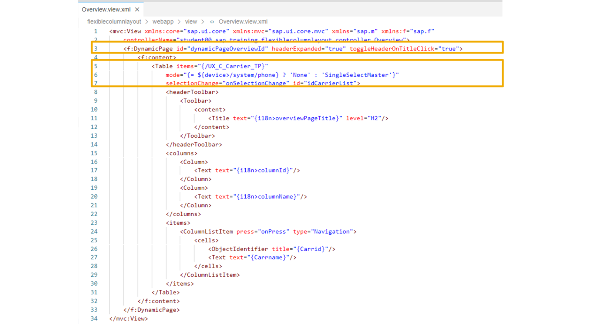
## Build the List view for the List-Detail application
### Business Example
In this exercise, you define the list view content for your application. The view will implement a sap.f.DynamicPage object. The page will show a list of Carriers fetched from the entity set UX_C_Carrier_TP.
Note
SAP Business Technology Platform and its tools are cloud services. Due to the nature of cloud software, step procedures and naming of fields and buttons may differ from the exercise solution.
### Prerequisites
You need to have completed the previous exercise to adapt the router configuration.
### Steps
  1. Open the Carrier.view.xml file, remove the page element and add the namespace sap.f with the XML-alias f.
    1. Update the code as follows:
Code Snippet
Copy codeSwitch to dark mode

```

123456

<mvc:View controllerName="student.com.sap.training.advancedsapui5.listdetail.controller.Carrier"
    xmlns:mvc="sap.ui.core.mvc"
    displayBlock="true"
    xmlns="sap.m"
    xmlns:f="sap.f">

```

  2. Add an sap.f.DynamicPage element with sap.f.content aggregation to the view with the following properties.
| Property  | Value  |
| --- | --- |
| id  | **dynamicPageOverviewId**  |
| headerExpanded  | **true**  |
| toggleHeaderOnTitleClick  | **true**  |
    1. Add the following code inside the View definition:
Code Snippet
Copy codeSwitch to dark mode

```

123456

<f:DynamicPage id="dynamicPageOverviewId" headerExpanded="true" toggleHeaderOnTitleClick="true">
  <f:content>

  </f:content>
</f:DynamicPage>

```

  3. Create an sap.m.List control inside the sap.f.content aggregation and assign the following values to the List element:
#### Attribute-value Pairs for the sap.m.List Control
| Attribute  | Value  |
| --- | --- |
| id  | **list**  |
| items  | **{/UX_C_Carrier_TP}**  |
| busyIndicatorDelay  | **0**  |
| growing  | **true**  |
| growingThreshold  | **20**  |
| growingScrollToLoad  | **true**  |
| mode  | **SingleSelectMaster**  |
| selectionChange  |  **onSelect**  |
    1. Add the following code inside the content aggregation:
Code Snippet
Copy codeSwitch to dark mode

```

12345678910

<List id="list"
      items="{/UX_C_Carrier_TP}"
      busyIndicatorDelay="0"
      growing="true"
      growingThreshold="10"
      growingScrollToLoad="true"
      mode="SingleSelectMaster"
      selectionChange="onSelect">

</List>

```

  4. Add the items aggregation to the sap.m.List control and add a control type of sap.m.ObjectListItem to the items aggregation with the following attributes:
#### Attribute-value Pairs for the sap.m.ObjectListItem Element
| Attribute  | Value  |
| --- | --- |
| id  | **objectListItem**  |
| title  | **{Carrname}**  |
| intro  | **{Carrid}**  |
| type  | **Inactive**  |
    1. Extend your code with the following implementation inside the List element:
Code Snippet
Copy codeSwitch to dark mode

```

12345678

<items>
  <ObjectListItem
    id="objectListItem"
    title="{Carrname}"
    intro="{Carrid}"
    type="Inactive">
  </ObjectListItem>
</items>

```

    2. Your implementation should now look like the following:
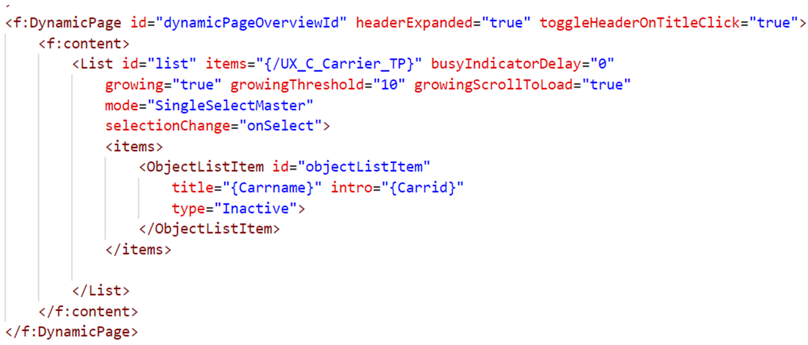
  5. Preview the application. A list of carriers should display.
    1. Preview the application as shown before. A list of carriers should display.


### Building the Detail View for a List-Detail Application

*Source: https://learning.sap.com/courses/advanced-sapui5-development/implementing-views-and-controller_ce148675-21ba-44c7-98e2-50b5ff8f47da*

Objective
After completing this lesson, you will be able to build the Detail view for a List-Detail application.
## Implement Views for List-Detail Application
After the implementation of the Overview-page, we want to implement the details. The details page should display the details of the selected carrier from the list page, and additionally, the flights and connections of the carrier. The page should look like what is shown in the following figure and can be achieved by using the _sap.uxap.ObjectPageLayout_.
Watch this video to know more about the structure of _sap.uxap.ObjectPageLayout_ control used in the Detail View.
### Use Cases
Use the **ObjectPageLayout** if:
  * The users need to see, edit, or create an item with all its details.
  * Users need to get an overview of an object and interact with different parts of the object.

### Implementation Example
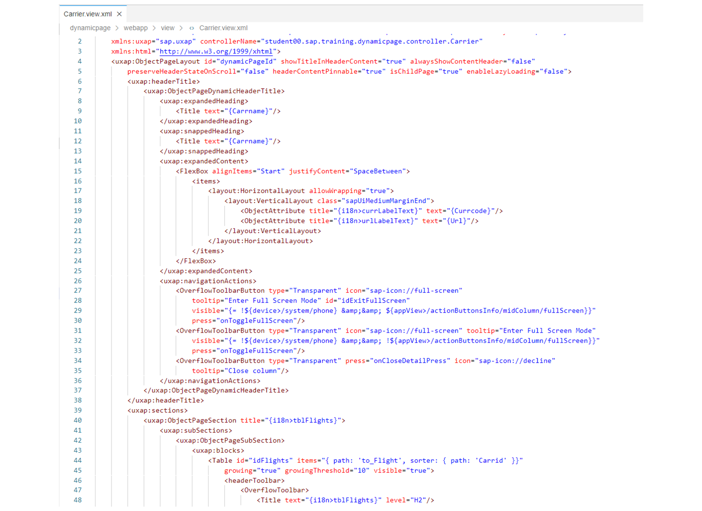
The figure shows parts of the Carrier-view implementation. You can see the implementation of the aggregations _headerTitle_ and _sections_.
## Build the Detail view for the List-Detail application
### Business Example
In this exercise, you define the detail view content for your application. The view should show the details of the selected carrier using the sap.uxap.ObjectPageDynamicHeaderTitle element and sap.uxap.headerContent aggregation. The table that will be implemented shows the available flights for the selected carrier.
Note
SAP Business Technology Platform and its tools are cloud services. Due to the nature of cloud software, step procedures and naming of fields and buttons may differ from the exercise solution.
### Prerequisites
You need to have completed the previous exercise to build the List View.
### Steps
  1. Open the Flights.view.xml file and add the namespaces sap.uxap with the XML alias ux.
    1. Update the code as follows:
Code Snippet
Copy codeSwitch to dark mode

```

123456789

<mvc:View controllerName="student.com.sap.training.advancedsapui5.listdetail.controller.Flights"
    xmlns:mvc="sap.ui.core.mvc" displayBlock="true"
    xmlns="sap.m"
    xmlns:l="sap.ui.layout"
    xmlns:ux="sap.uxap">

</mvc:View>

```

  2. Add an sap.uxap.ObjectPageLayout element to the view. Add the attribute id with the value objectPageLayout.
    1. Add the following code at the beginning of the View definition:
Code Snippet
Copy codeSwitch to dark mode

```

123

<ux:ObjectPageLayout id="objectPageLayout">

</ux:ObjectPageLayout>

```

  3. Add an sap.uxap.headerTitle, sap.uxap.headerContent and sap.uxap.sections aggregation to the sap.uxap.ObjectPageLayout control.
    1. Add the following code inside the ObjectPageLayout element:
Code Snippet
Copy codeSwitch to dark mode

```

123456789

<ux:headerTitle>

</ux:headerTitle>
<ux:headerContent>

</ux:headerContent>
<ux:sections>

</ux:sections>

```

  4. Add an sap.uxap.ObjectPageDynamicHeaderTitle control to the headerTitle aggregation. For the attribute id, add the value objectPageDynamicHeader.
    1. Add the following code inside the headerTitle element:
Code Snippet
Copy codeSwitch to dark mode

```

123

<ux:ObjectPageDynamicHeaderTitle id="objectPageDynamicHeader">

</ux:ObjectPageDynamicHeaderTitle>

```

  5. Add an sap.uxap.expandedHeading aggregation to the sap.uxap.ObjectPageDynamicHeaderTitle control.
    1. Add the following code inside the ObjectPageDynamicHeaderTitle element:
Code Snippet
Copy codeSwitch to dark mode

```

123

<ux:expandedHeading>

</ux:expandedHeading>

```

  6. Add an sap.m.Title control to the sap.uxap.expandedHeading aggregation with the listed attributes and values.
#### Attribute-value Pairs for the sap.m.ObjectAttribute Elements
| Attribute  | Value  |
| --- | --- |
| id  | **title1**  |
| text  | **{Carrname}**  |
| level  | **H2**  |
    1. Add the following code inside the expandedHeading element:
Code Snippet
Copy codeSwitch to dark mode

```

1234

<Title
id="fltitle"
text="{Carrname}"
level="H2"/>

```

    2. The headerTitlesection should now look like the following:
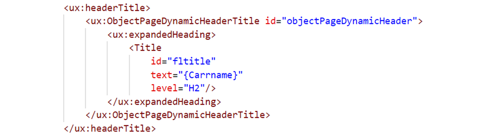
  7. Add an sap.m.FlexBox control to the sap.uxap.headerContent with the listed attributes and values.
| Attribute  | Value  |
| --- | --- |
| id  | **flexbox**  |
| wrap  | **Wrap**  |
    1. Add the following code inside the headerContent element:
Code Snippet
Copy codeSwitch to dark mode

```

123

<FlexBox wrap="Wrap" id="flexBox">

</FlexBox>

```

  8. Add an sap.f.Avatar and a sap.ui.layout.VerticalLayout control to the sap.m.Flex control with the listed attributes and values.
| Element  | Attribute  | Value  |
| --- | --- | --- |
| 1  | id  | **avatar**  |
| src  | **sap-icon://flight**  |
| 2  | id  | **verticallayout1**  |
| class  | **sapUiSmallMarginBeginEnd**  |
    1. Add the following code inside the FlexBox element:
Code Snippet
Copy codeSwitch to dark mode

```

1234

<Avatar id="avatar" src="sap-icon://flight"/>
<l:VerticalLayout id="verticalLayout1" class="sapUiSmallMarginBeginEnd">

</l:VerticalLayout>

```

  9. Add two sap.m.Label controls to the sap.ui.layout.VerticalLayout control with the listed attributes and values:
| Element  | Attribute  | Value  |
| --- | --- | --- |
| 1  | id  | **label1**  |
| text  | **{Carrid}**  |
| 2  | id  | **label2**  |
| text  | **{Url}**  |
    1. Add the following code into the VerticalLayout element:
Code Snippet
Copy codeSwitch to dark mode

```

12

<Label id="label1" text="{Carrid}"/>
<Label id="label2" text="{Url}"/>

```

    2. Your code for the headerContent should now look like the following:
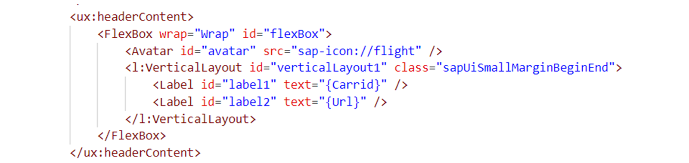
  10. Add an sap.uxap.ObjectPageSection control to thesap.uxap.sections aggregation. Add the value objectPageSection to the attribute id.
    1. Add the following code inside the sections element:
Code Snippet
Copy codeSwitch to dark mode

```

123

<ux:ObjectPageSection id="objectPageSection">

</ux:ObjectPageSection>

```

  11. Add an sap.uxap.ObjectPageSubSection control to the sap.uxap.ObjectPageSection control. Add the value objectPageSubSection to the attribute id.
    1. Add the following code inside the ObjectPageSection element:
Code Snippet
Copy codeSwitch to dark mode

```

123

<ux:ObjectPageSubSection id="objectPageSubSection1">

</ux:ObjectPageSubSection>

```

  12. Cut and paste the sap.m.Table control into the sap.uxap.ObjectPageSubSection aggregation.
    1. Cut / Paste the table element and its content inside the ObjectPageSubSection element:
Code Snippet
Copy codeSwitch to dark mode

```

123456

<Table id="idFlights" items="{path: 'to_Flight', sorter: {path: 'Carrid'}}"
                            mode="SingleSelectMaster"
                            growing="true"
                            growingThreshold="10">
[...]
</Table>

```

  13. Remove the remaining _Page_ element and its content.
    1. Remove the rest of the Page element code:
Code Snippet
Copy codeSwitch to dark mode

```

123

<Page id="idFlightsPage".....
...
</Page>

```

### Result
You won't be able to test the detail view yet. You need to do next exercise on view synchronization first.


### Implementing View Synchronization

*Source: https://learning.sap.com/courses/advanced-sapui5-development/implementing-view-synchronization_f59c0f24-7102-4743-8c76-8b0d5c83023b*

Objective
After completing this lesson, you will be able to implement synchronization functionality between list and detail view.
## Implementing Navigation
### Implementing Navigation
The basic navigation principals are also used when you implement an application using the sap.f.FlexibleColumnLayout - for example, using the router object or registering the event handler for attachMatched. The difference is that we have to extend it with the sap.f.FlexibleColumnLayoutcontrols.
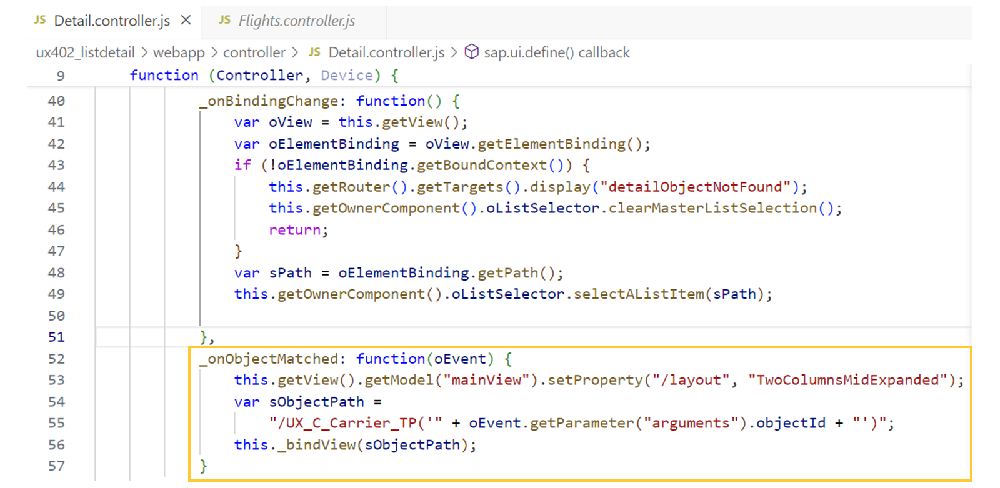
The figure shows the difference to the already known navigation handling inside the controller of the navigation target. As you can see in the implementation, the model with id mainView is fetched from the component. In the same line of code, the layout is set to TwoColumnsMidExpanded. This will show the second column of the sap.f.FlexibleColumnLayout to the user.
## Synchronizing the List and the Detail Views
The end user will usually select an item on the list to display the details. If so, everything works as expected. The navigation is triggered, the details of the selected item are displayed in the detail view, and the selected item is marked as selected in the list. But what happens if the user changes the hash directly in the address bar of the browser?
Obviously, if the hash is valid, the details are displayed but the item in the list will not be marked as selected. Furthermore, if the hash is invalid, the NotFound view is displayed but a previously selected item is still marked as selected. To make this happen, we have to implement a synchronization functionality between the detail and the list view.
In this video we will take a look at how to implement a synchronization functionality.
Settings
## Provide view synchronisation for the List-Detail application
### Business Example
In this exercise, you implement the List and Detail view synchronization.
Note
SAP Business Technology Platform and its tools are cloud services. Due to the nature of cloud software, step procedures and naming of fields and buttons may differ from the exercise solution.
### Prerequisites
You need to have completed the previous exercise to build the Detail View.
### Task 1: Provide View Synchronization Functionality
In this task, you implement view synchronization by creating a class with the name **ListSelector**. The ListSelector implementation should be placed in the controller folder of your project. The ListSelector.js file is provided in the course templates folder.
#### Steps
  1. Upload the ListSelector.js file into your project.
    1. Open the context menu of the _controller_ folder and choose _Upload_.
    2. Select the ListSelector.js file from your Templates folder.
  2. Observe the content of the ListSelector.js file and answer the following questions.
From which object is the ListSelector class derived ?
The master List controller, on initialization, will call the setBoundMasterList function. What does it do ?
The master List controller then will wait for the _oWhenListLoadingIsDone_ promise to be fulfilled before displaying the first carrier detail view. Why ?
What does the SelectAListItem function do?
    1. Look at the ListSelector.js file.
the ListSelector class is derived from the BaseObject class.
the setBoundMasterList function sets the _oList variable to the carrier list and resolves the _oWhenListHasBeenSet promise.
The function called when the __oWhenListHasBeenSet_ promise has been fulfilled waits for the **dataReceived** event to be triggered on the binding object and then, if there are some data, sets the list and oFirstListItem parameters of the resolve function. The master list controller will then be able to display the first element detail view.
  3. To make sure that the ListSelector can be referenced from each part of the application, we must create an instance of the ListSelector at a more global level. Therefore, create an instance of the ListSelector inside the Component.js file and make sure that the instance is a member variable of the component. Then save your changes.
    1. Open the Component.js file located in the _controller_ folder of your project.
    2. Add a reference to the ListSelector in the Component.js file as follows:
Code Snippet
Copy codeSwitch to dark mode

```

12345678

sap.ui.define([
        "sap/ui/core/UIComponent",
        "sap/ui/Device",
        "student/com/sap/training/advancedsapui5/listdetail/model/models",
        "student/com/sap/training/advancedsapui5/listdetail/controller/ListSelector"
    ],
    function (UIComponent, Device, models, ListSelector) {

```

    3. In the init function of the Component, declare a member variable named oListSelector and assign an ListSelector instance to the variable. Then save your changes.
Code Snippet
Copy codeSwitch to dark mode

```

123

// instantiation of the listselector
this.oListSelector = new ListSelector();

```

    4. Your init function should now look like this:
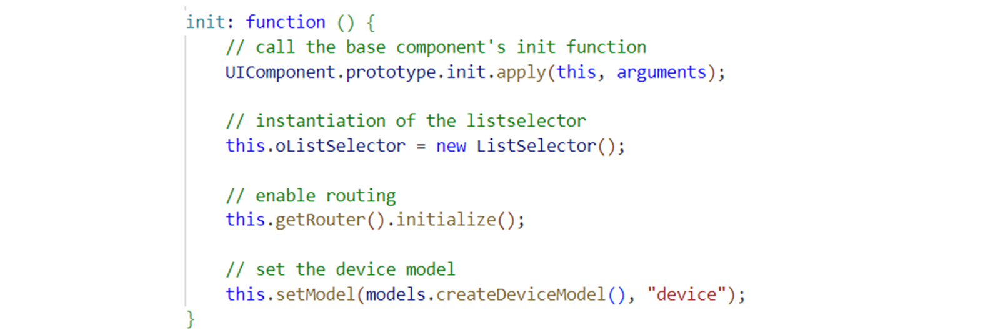

### Task 2: Implement the Base Controller
In this task, you implement a base controller class .This class provides to all controllers some functionalities for reuse (for routing, view synchronization, and backward navigation).
#### Steps
  1. Upload the BaseController.js file into your project.
    1. Open the context menu of the _controller_ folder and choose _Upload_.
    2. Select the BaseController.js file from your Templates folder.
  2. Look at the getListSelector function. It returns the reference of the oListSelector object from the component.

### Task 3: Implement the List Controller
In this task, you implement the controller of the List view for navigation.
#### Steps
  1. Open the Carrier.controller.js file. Define that the controller should be derived from the BaseController. Remove the two functions used for full screen navigation.
    1. Open the Carrier.controller.js file located in the controller folder of your project.
    2. Update the code as follows:
Code Snippet
Copy codeSwitch to dark mode

```

1234567891011

sap.ui.define([
    "student/com/sap/training/advancedsapui5/listdetail/controller/BaseController"
],
    function (Controller) {
        "use strict";

        return Controller.extend("student.com.sap.training.advancedsapui5.listdetail.controller.Carrier", {

        });
    });

```

  2. Implement a _navigateToCarrierDetails function. The function takes two arguments. Name the first argument sCarrierId and the second bReplace. The function should navigate to the carrierdetails route and pass a sCarrierId value as a parameter.
    1. Add the following code:
Code Snippet
Copy codeSwitch to dark mode

```

123456

_navigateToCarrierDetails : function(sCarrierId,bReplace) {
  this.getRouter().navTo("flights", {
    carrid: sCarrierId
  }, bReplace);
},

```

  3. Add a _showDetail function. The function takes one argument. Name the argument oItem. This variable will contain during runtime the item selected by the user from the master list. Read the property Carrid from the oItemand store it in a variable sCarrierId. Check also if the app is running on a mobile device or not. Store the result in a local variable bReplace. Invoke the _navigateToCarrierDetails function and pass both variables as an argument.
    1. After the _navigateToCarrierDetails implementation, add the _showDetail function with an oItem argument as follows:
Code Snippet
Copy codeSwitch to dark mode

```

123

_showDetail: function(oItem) {

},

```

    2. Check whether the app is running on a mobile device or on a desktop and store the result in a local variable. Then read the Carrid property from the bindingContext of the oItem object and store it in a variable. Pass both variables to the _navigateToCarrierDetails function. Add the following code into the _showDetail function:
Code Snippet
Copy codeSwitch to dark mode

```

123

var sCarrierId = oItem.getBindingContext().getProperty("Carrid");
this._navigateToCarrierDetails(sCarrierId,true);

```

  4. Implement the event handler for the select event of the list. The assign function to handle the event was called onSelect. Invoke the _showDetail method and pass the selected item to the function. The selection behavior of the table depends on whether the app is running on a mobile device or not.
    1. Add the following code after the _showDetail implementation:
Code Snippet
Copy codeSwitch to dark mode

```

1234

onSelect: function(oEvent) {
  this._showDetail(oEvent.getParameter("listItem") || oEvent.getSource());
},

```

  5. Implement an onBypassed function. This function should handle the case that when the router bypasses the target. Inside the function, invoke the removeSelections function on the list object.
    1. Add the following code after the onSelect implementation:
Code Snippet
Copy codeSwitch to dark mode

```

1234

onBypassed: function() {
  this._oList.removeSelections(true);
},

```

  6. Add an _onListMatched function to the implementation. The function takes no argument. The function will be called when the list route is invoked by the router. React on the case when the promise oWhenListLoadingIsDone is resolved. If the promise is resolved, the details of the first item from the master list should be displayed inside the details view.
    1. Add the following code after the onBypassed implementation :
Code Snippet
Copy codeSwitch to dark mode

```

123456789

_onListMatched: function() {
  this.getListSelector().oWhenListLoadingIsDone.then(
    function(mParams) {
      var sObjectId = mParams.oFirstListItem.getBindingContext().getProperty("Carrid");
      this._navigateToCarrierDetails(sObjectId,true);
    }.bind(this)
  );
}

```

  7. Implement the onInit function. Get a reference to the master list of your view and store the reference in a variable named oList. Assign the reference to oList to a member variable named _oList. Add a eventhandler for onBeforeFirstShow of the view using addEventDelegate-function and invoke the setBoundMasterList of the ListSelector and pass the reference to the oList object to the function. Implement a behavior when the masterlist route is invoked by the router. If this is the case, the _onListMatched function should be invoked. Implement a behavior when the router bypasses the list route, register the onBypassed function when this event occurs. Then save your changes.
    1. Add the following code at the beginning:
Code Snippet
Copy codeSwitch to dark mode

```

123456789101112

 onInit: function () {
                var oList = this.byId("list");
                this._oList = oList;
                this.getView().addEventDelegate({
                    onBeforeFirstShow: function () {
                        this.getOwnerComponent().oListSelector.setBoundMasterList(this._oList);
                    }.bind(this)
                });
                this.getRouter().getRoute("Overview").attachPatternMatched(this._onListMatched, this);
                this.getRouter().attachBypassed(this.onBypassed, this);
            },

```

    2. Save your changes.

### Task 4: Implement the Detail Controller
In this task, you implement the controller of the Detail view for navigation.
#### Steps
  1. Open the Flights.controller.js file. Define that the controller should be derived from the BaseController. You can now remove the getrouter and onNavBack functions since we're using those of the Base Controller.
    1. Open the Flights.controller.js file located in the _controller_ folder of your project.
    2. Update the code as follows:
Code Snippet
Copy codeSwitch to dark mode

```

12345

sap.ui.define([
  "student/com/sap/training/advancedsapui5/listdetail/controller/BaseController"
],
  function (Controller) {

```

    3. Remove the getrouter function.
    4. Remove the onNavBack function.
  2. Modify the _onBindingChange function. If the view Is not bound to an entity, the selection on the master list should be cleared. To clear the selection, call the function clearListSelection on the ListSelector. If the view is bound to an entity, get the binding path of the entity and invoke the selectAListItem function from the ListSelector. Pass the binding path as an argument.
    1. Your code should look like the following:
Code Snippet
Copy codeSwitch to dark mode

```

123456789101112

_onBindingChange: function() {
  var oView = this.getView();
  var oElementBinding = oView.getElementBinding();
  if (!oElementBinding.getBoundContext()) {
    this.getRouter().getTargets().display("notFound");
    this.getOwnerComponent().oListSelector.clearMasterListSelection();
    return;
  }
  var sPath = oElementBinding.getPath();
  this.getOwnerComponent().oListSelector.selectAListItem(sPath);
}

```

  3. Modify the function named _onObjectMatched. Change the layout attribute of the mainView Model to TwoColumnsMidExpanded to adjust the layout behavior of your sap.f.flexibleColumnLayout. Remove the dataRequested and dataReceived events from the bindElement call. The Busy property of the view will have to be managed differently because the OData service will not be called each time the selection changes.
    1. Your code should now look like the following::
Code Snippet
Copy codeSwitch to dark mode

```

123456789101112131415

  _onObjectMatched: function (oEvent) {
        var oArgs = oEvent.getParameter("arguments");
        this._sCarrierId = oArgs.carrid;
        var oView = this.getView();

        oView.getModel("mainView").setProperty("/layout", "TwoColumnsMidExpanded");

        oView.bindElement({
          path: "/UX_C_Carrier_TP('" + this._sCarrierId + "')",
          events: {
            change: this._onBindingChange.bind(this)
          }
        });
      },

```

  4. Modify the onInit function. Get the OData Model reference to attach the RequestSent and RequestCompleted events and set the Busy property of the view.
    1. Update the code of the onInit function as follows:
Code Snippet
Copy codeSwitch to dark mode

```

12345678910111213

onInit: function () {
        var oRouter = this.getRouter();
        oRouter.getRoute("flights").attachMatched(this._onObjectMatched, this);

        var oModel = this.getOwnerComponent().getModel();
        oModel.attachRequestSent(function (oEvent) {
          this.getView().setBusy(true);
        }, this);
        oModel.attachRequestCompleted(function (oEvent) {
          this.getView().setBusy(false);
        }, this);
      },

```

    2. Save your changes.

### Task 5: Test your Application
#### Steps
  1. Test your application. Choose a carrier to see the corresponding connections.
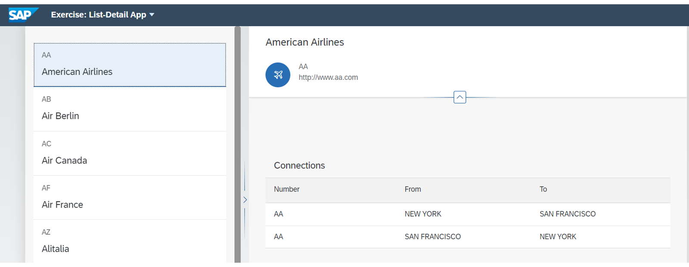
    1. Perform this step as shown in a previous exercise.
  2. Try to navigate to a hash for which no route exists. The NotFound view should be displayed.
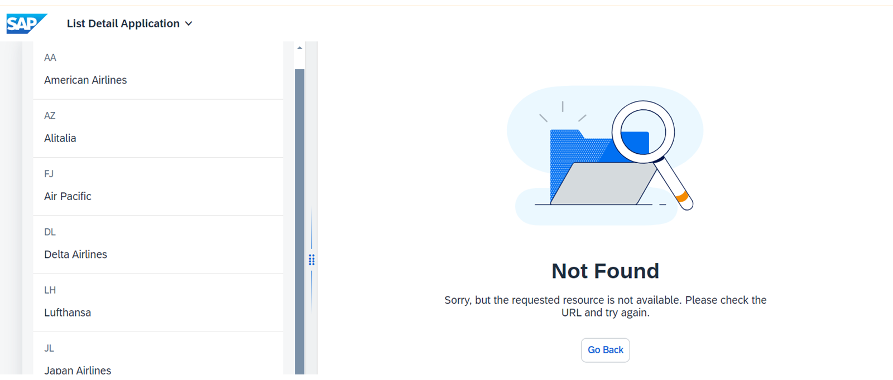
    1. Change the URL in your browser to something not corresponding to a route, for example **Carrier/AA** instead of **Carriers/AA**.


### Implementing Mobile Behavior for the FlexibleColumnLayout Control

*Source: https://learning.sap.com/courses/advanced-sapui5-development/working-with-the-device-api_ef7d4c23-45f2-4582-9378-a3ea76fcf853*

Objective
After completing this lesson, you will be able to implement Mobile Behavior for the FlexibleColumnLayout Control.
## Device Adaptation
### The Device Model
The _sap.f.FlexibleColumnLayout_ control comes with default responsive behavior but, depending on the device, the controls used inside may behave differently when they are used on a desktop or on a mobile.
By introducing a device model, you can bind control properties to the device's capabilities. The SAPUI5 template of SAP Business Application Studio generates the code for setting up a device model for you.
Watch this video to know more about the Device Model.
### Implementing the List View
To use the device model in a view implementation, bind the attribute of the control to the property of the model.

  * The List's **mode (1)** property and the ObjectListItem's **type (2)** property control how items are selectable.
  * On a phone device, the selection should be through the item (list mode "None", list item type "Active"), otherwise it should be through the List itself (list mode "SingleSelectMaster", list item type "Inactive").

The selectionChange event is only fired on a desktop or on a tablet device in the landscape mode. The event handler function will have access to the selected item by the _listItem_ event parameter.
On a phone or tablet in portrait mode, the Press event on the selected list item will be thrown. The event handler function has access to the selected item using the getSource method on the event object provided to the event handler function.
The necessary case distinction can be implemented by means of the device model and the expression binding syntax.
### Implementing the List View Controller
As discussed in a previous unit, each view has its own controller implementation. We provide two event handler functions in the Overview.controller.js implementation to support the two different scenarios based on the device on which the application is executed.

  1. For the **onPress** event handler, the Carrid property is fetched by accessing the source binding context.
  2. For the **onSelectionChange** event handler, you get the binding context from the listitem parameter.
  3. In both cases, you then trigger the navigation to the details view. For this purpose, you get a reference to the router using the getRouter function inherited by the base controller and call the navTo function.

### Managing the FlexibleColumnLayout Behavior on a phone.
In order to use the FlexibleColumnLayout on a phone, where only one column can be displayed at a time, you might need to implement a close feature on the middle column.
For this, you can add a button in the Object Page Header by using the following code:

The handleClose method should set the layout back to OneColumn and navigate to the _Overview_ target.
The code could then look like the following:

## Add mobile behavior to the List-Detail application
### Business Example
In this exercise, you implement changes in your List-Detail application so that it works differently when executed on a desktop, tablet or on a phone device.
Since only one view can be displayed at a time on a phone, you need to apply changes to the synchronization code and offer a close button in the detail view to go back to the list view.
Note
SAP Business Technology Platform and its tools are cloud services. Due to the nature of cloud software, step procedures and naming of fields and buttons may differ from the exercise solution.
### Prerequisites
You need to have completed the previous exercise to implement synchronization.
Note
Otherwise, you can import the 2-listdetail stage1.tar file from the solutions.
### Steps
  1. Add the Device model to the list view controller.
    1. Open the Carrier.controller.js file.
    2. Add the sap/ui/Device reference in the controller definition. Your code should look like the following:
Code Snippet
Copy codeSwitch to dark mode

```

123456

sap.ui.define([
    "student/com/sap/training/advancedsapui5/listdetail/controller/BaseController",
    "sap/ui/Device"
],
    function (Controller, Device) {
        "use strict";

```

  2. Modify the _showDetail method to send true as second parameter of _navigateToCarrierDetails function only if the device is not a phone,
    1. Add a new bReplace variable at the beginning of the _showDetail method, with !Device.system.phone as value.
Code Snippet
Copy codeSwitch to dark mode

```

1

var bReplace = !Device.system.phone;

```

    2. Change the parameter of _navigateToCarrierDetails from true to bReplace.
Code Snippet
Copy codeSwitch to dark mode

```

1

this._navigateToCarrierDetails(sCarrierId,bReplace);

```

  3. Add mobile behavior to the _DynamicPage_ of the List View. Modify the mode property to **'None'** and the list item type property to **'Active'** if on a phone device. Don't forget to map the press event to the onSelect method.
    1. Open the Carrier.view.xml file.
    2. Modify the mode property as follows:
Code Snippet
Copy codeSwitch to dark mode

```

1

 mode="{= ${device>/system/phone} ? 'None' : 'SingleSelectMaster'}"

```

    3. Modify the list item type property as follows:
Code Snippet
Copy codeSwitch to dark mode

```

1

type="{= ${device>/system/phone} ? 'Active' : 'Inactive'}"

```

    4. Add the following after the type property to map the item press user action to the onSelect method :
Code Snippet
Copy codeSwitch to dark mode

```

1

press="onSelect"

```

  4. Make sure that on opening, the list will display, by preventing the display of the first element. Use the Mode property of the List to check which device is used.
    1. Open the Carrier.controller.js file.
    2. Modify the _onListMatched function as follows:
Code Snippet
Copy codeSwitch to dark mode

```

12345678910111213

 _onListMatched: function() {
                this.getListSelector().oWhenListLoadingIsDone.then(
                  function(mParams) {

                    if (mParams.list.getMode() === "None") {
                      return;
                    }

                    var sObjectId = mParams.oFirstListItem.getBindingContext().getProperty("Carrid");
                    this._navigateToCarrierDetails(sObjectId,true);
                  }.bind(this)
                );
            }

```

  5. Add a Close button to your Detail view for phone display.
    1. Open the Flights.view.xml file.
    2. Add the following code inside the _ObjectPageDynamicHeaderTitle_ aggregation of the Flight view, after the _expandedHeading_ aggregation :
Code Snippet
Copy codeSwitch to dark mode

```

1234

<ux:navigationActions>
	<OverflowToolbarButton type="Transparent" icon="sap-icon://decline" press="handleClose"
                                tooltip="Close middle column" visible="{=${device>/system/phone}}"/>
</ux:navigationActions>

```

    3. Open the Flights.controller.js file.
    4. Add the handleClose event to the Flights view controller, with the following code:
Code Snippet
Copy codeSwitch to dark mode

```

12345

 handleClose: function () {
        var oView = this.getView();
        oView.getModel("mainView").setProperty("/layout", "OneColumn");
        this.getRouter().navTo("Overview",{}, true);
      }

```

  6. Test your application with the Chrome Dev Tools to check behavior when emulating a phone display.
Note
Once in the Dev Tools, be sure to change the URL back to the overview route and refresh your browser (maybe several times) to apply the display changes.

[Continue to quiz](https://learning.sap.com/courses/advanced-sapui5-development/implementing-list-detail-application)


### Quiz

*Source: https://learning.sap.com/courses/advanced-sapui5-development/implementing-list-detail-application*

It's time to put what you've learned to the test, get 8 right to pass this unit.
1.
### The FlexibleColumnLayout element is a control of the main list view.
Choose the correct answer.
True
False
2.
### Where can you find the device JSON Model that the SAPUI5 template of SAP Business Application Studio provides ?
Choose the correct answer.
In the models.jsfile
In the component.jsfile
In the manifest.jsonfile
3.
### What are the two controls that can be used to implement list-detail views ?
Choose the correct answer.
A sap.f.DynamicPage for the list view and a sap.f.FlexibleColumnLayout for the details view.
A sap.f.DynamicPage for the list view and a sap.uxap.ObjectPageLayout for the details view.
A sap.f.FlexibleColumnLayout for the list view and a sap.uxap.ObjectPageLayout for the details view.
4.
### What is the main control used to implement a list-detail application ?
Choose the correct answer.
sap.f.DynamicPage
sap.f.FlexibleColumnLayout
sap.ui.layout.VerticalLayout
sap.ui.layout.HorizontalLayout
5.
### What is the difference when implementing navigation in a list-detail application compared to a full-screen application ?
Choose the correct answer.
There are no differences.
Navigation is implemented differently, using the sap.f.FlexibleColumnLayout controls.
Navigation is implemented in the same way, but extended with sap.f.FlexibleColumnLayoutcontrols.
6.
### On a phone device, the selection should be through the item (list mode "None", list item type "Active"), otherwise it should be through the List itself (list mode "SingleSelectMaster", list item type "Inactive").
Choose the correct answer.
True
False
7.
### Which differences are there when implementing routing configuration for a list-detail application compared to a full-screen application ?
There are two correct answers.
For list-detail applications, the controlid property of the config parameter is the id of the FlexibleColumnLayout control.
For list-detail applications, you don't need to specify a NotFound view.
For list-detail applications, the targets need a transition property to specify how you transition from one view to the other.
For list-detail applications, the targets need a controlAggregation property to specify the exact display location of the view.
8.
### In which part of the DynamicPage control are the action buttons displayed?
Choose the correct answer.
The DynamicPageHeader
The DynamicPageTitle
The Content Area
9.
### When is the use of a list-detail pattern not recommended?
There are two correct answers.
When you want to offer complex filters for the master list of items.
When you want to display a single object.
When you want to display different facets of the same object, data, or both.
10.
### Which methods should be implemented in the ListSelector ?
There are three correct answers.
A method to try and select a list item using the passed binding path.
A method to display an error message in case of invalid entry.
A method to remove selections from the list - for example, when an invalid hash is provided.
A method to pass the reference of the list control, to set the list on which the other functions will be invoked.
Submit answers[Next unit](https://learning.sap.com/courses/advanced-sapui5-development/extending-standard-controls_a98398b4-0412-4253-a520-b896ca4fb067)


### Working with UI5-Controls

*Source: https://learning.sap.com/courses/advanced-sapui5-development/extending-standard-controls_a98398b4-0412-4253-a520-b896ca4fb067*

Objective
After completing this lesson, you will be able to use the capabilities of the standard controls in the SAPUI5 framework.
## Extension of Standard Controls
Sometimes, the needs of the customer go beyond the capabilities of existing SAPUI5 controls. If this is the case, developers can extend existing controls and elements to fulfill customer needs.
Before we start with a detailed look on how to extend an existing SAPUI5 control, let's understand what makes a control a control.
#### What is a Control?

Conceptually:
    A control is a UI component (usually a visible one) that can react to the activities of the user and expose properties, methods, and events to the application (and other controls) using JS API.

Technically, a UI5 control at design time consists of:

The **Control API** definition that defines the properties, events, methods, and sometimes the associations and aggregations.
The **Control Renderer** that is responsible for creating the HTML string that defines the structure of the control.
The **Control Behavior** , which is the JavaScript code taking care of the control interactivity, reacting to user events, firing control events, handling method calls, and property changes.
The **Control Style** that defines the visuals of the control (usually a control that has different visual designs, bundled as "Themes").
### Control API
The control API is represented by the keyword **metadata**.
Control metadata consists of properties, events, aggregations, and associations. Let's now look at each of these in more detail.
### Control Metadata - Properties
The control properties are made up of a name and a type, and optionally, a default value. Valid types are string (default), boolean, int or float for numeric properties, int[ ] (for example, array of int) and sap.ui.core. CSSSize for a property that holds (for example, px) or rem values for size.
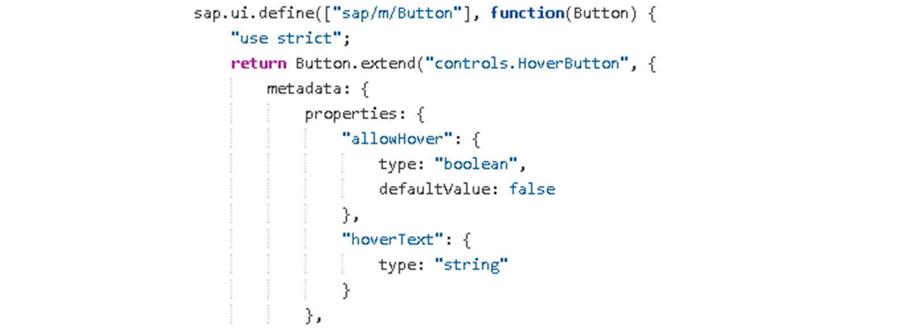
### Control Metadata - Events
The control events are defined by their name only.
Methods for registering, de-registering, and firing the event are created by the framework. For example, _attachHover_ , _detachHover_ and _fireHover_.
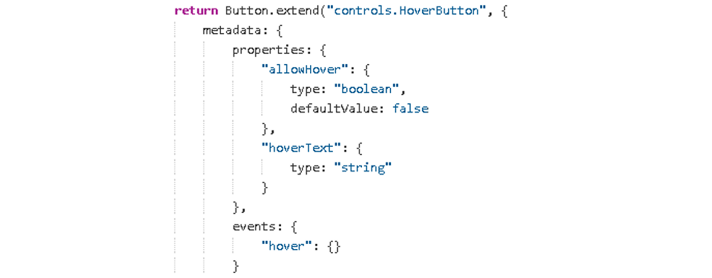
### Control Metadata - Aggregations and Associations
SAPUI5 also knows composite UI-controls. To implement a composite UI-control, the control developer has to define aggregations or associations to other controls.

Aggregations

Aggregations are defined by their name and a configuration object. It is a relationship between two controls. It shows a parent/child relationship. For example, table rows (parent) and cells (children) The name of the aggregation has to be a string value written in plural. The below image shows how to define an aggregation.
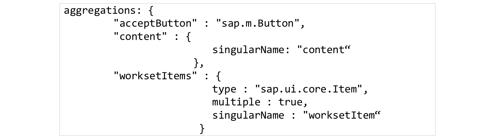
  * **Type** The type property contains the subclass of the control. If type is all you want to set, you can do so as a string instead of the configuration object.
  * **Multiple** The property defines the cardinality and can contain the values 0..1 or 0..n. The default is 0..n.
  * **singularName** This property contains the name of the aggregation in singular. The framework will provide methods like addWorksetItem.

Associations
    An association is a relationship between two controls. It is not a parent/child relationship. It represents a loose coupling. For example, a label is associated with a text field.
### Control Behavior
After adding the metadata, you add method implementations to the control.
### Rules for Control Method Naming
  * Do not use names of methods provided in superclass. This would result in overriding the superclass methods.
  * Private methods are identified by name starting with a underscore, for example, _checkForZero. All other methods are considered public.
  * Do not use names starting with get…, set…, insert…, add…, remove… or indexOf… as they could collide with automatically generated methods of the properties or aggregations.
  * Method names with special meanings are as follows:
    * on…: are used for event handlers.
    * init: are used to initialize the control, after its instantiation. This is a private method only called by the SAPUI5 core.
    * renderer: used for the function that creates the control’s HTML.

Event handler methods are called automatically. For example, if you hover the mouse on top of a control, the system automatically fires the onmouseover event.
You can find the automatically managed events in the API reference .[sap/ui/events/ControlEvents](https://ui5.sap.com/#/api/module:sap/ui/events/ControlEvents%23overview)
Inside the event handler method, we have access to getters and setters of properties. Those are automatically provided by the framework.
Our example extended button control has an _allowHover_ property. As a result of that, you should understand that the framework creates the _getAllowHover( )_ method as seen in the code below.

To handle the event at runtime, you should know that the framework creates a method with "on" in front of the event name.
Our extended control has an event named "hover", so we must use the onHover method.
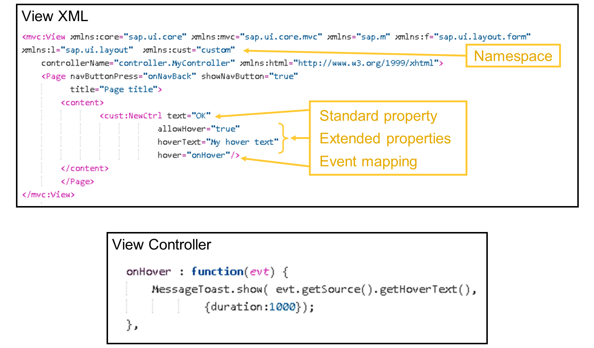
### Control Rendering

The Control Renderer

  * The renderer is responsible for creating the HTML structure for the control.
  * A renderer is assigned to the render method of the control.
  * It is static, so you cannot use "this". _Control_ instance and _RenderManager_ instance are given to the method.
  * The renderer method has access to the control’s property getters and setters, as well as to any aggregations and associations defined by the control.

The RenderManager

_RenderManager_ collects and concatenates string fragments and places them in the DOM at the appropriate position by using its methods such as the following:
  * _openStart_ - Opens the start tag of an HTML element,
  * _openEnd_ - Ends an open tag started with openStart,
  * _style_ - Adds a style name-value pair to the style collection of the last open HTML element. This is only valid when it is called between openStart/voidStart and openEnd/voidEnd.

### Referencing the Control Renderer
The UI-control definition takes a reference to the renderer class.
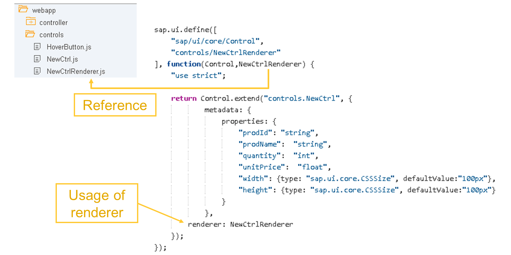
### Sample: Control Renderer
The following figure shows you (in a sample implementation) the anatomy of a renderer implementation.
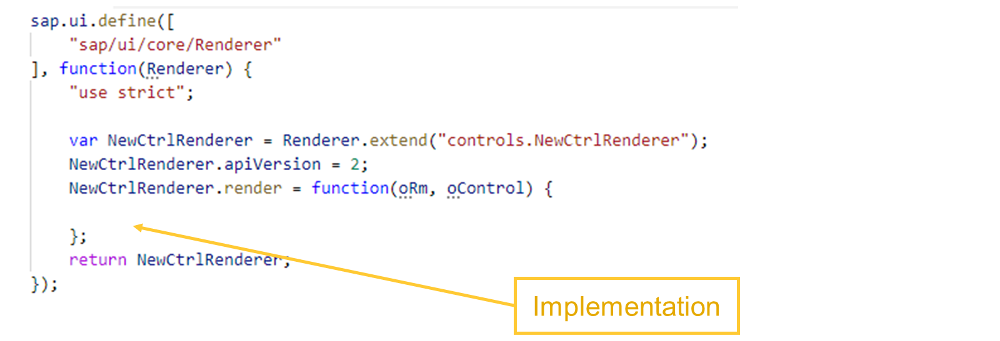
As of SAPUI5 1.67, the RenderManager provides a set of new APIS to describe the structure of the DOM that can be used by the control renderers. To use the new API, assign the property **apiVersion** with the value 2 to your Renderer implementation.
### Render Function Implementation
The following figure shows a sample implementation of the render method. The method has access to the RenderManager instance and to the control that should be rendered.
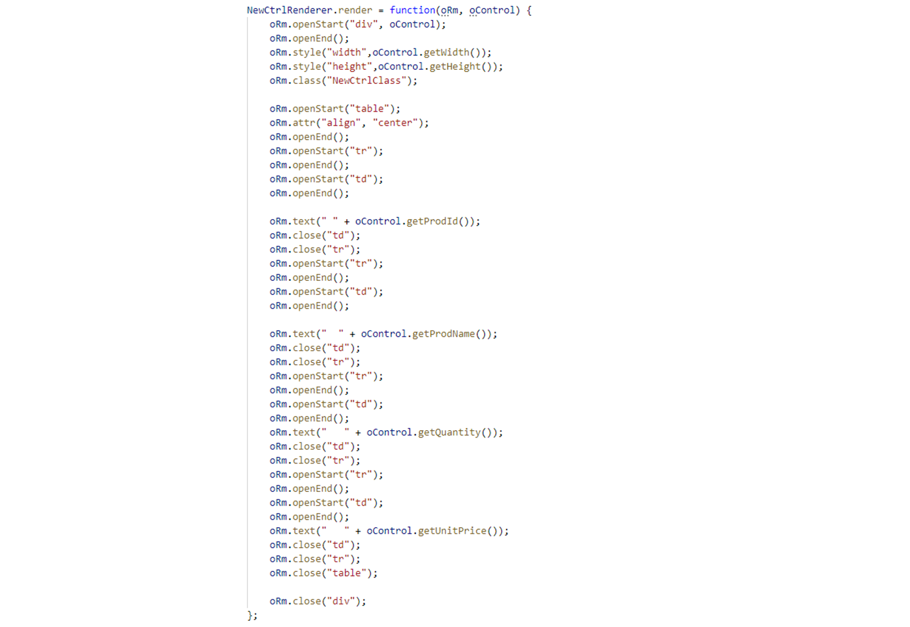
## Extend an Existing Control
### Business Example
In this exercise, you will extend one of the standard SAPUI5 controls to add functionality. The Button control will be extended and the new control added to the Flights table. The control will be modified to add a hover event and display text that is controlled through a custom property on the control. To save some time, you will adjust the _fullscreen_ application.
Note
SAP Business Technology Platform and its tools are cloud services. Due to the nature of cloud software, step procedures and the naming of fields and buttons may differ from the exercise solution.
### Prerequisites
You need to have completed the previous exercises to implement a fullscreen application.
Note
You can import the 1-Fullscreen complete.tar file from the solutions if you want.
### Task 1: Extend the Button Control
In this step, you will create the JavaScript file that contains the new _HoverButton_ control, extension of a sap.m.Button control.
#### Steps
  1. Open the SAP Business Application Studio.
  2. Open the _fullscreen_ project from the previous exercises.
    1. Perform this step as shown in a previous exercise.
  3. Create a new folder with the name **control** in the _webapp_ folder of your project _fullscreen_ and add a file with the name **HoverButton.js** to the newly created folder.
    1. Select your project _webapp_ folder and from the context menu, choose _New Folder_.
    2. In the entry field, enter the name **control** as the folder name and choose the _Enter_ key (on your keyboard).
    3. Select the newly created folder and from the context menu, choose _New File_.
    4. In the new entry field, enter **HoverButton.js** as file name and choose the _Enter_ key (on your keyboard).
  4. In the HoverButton.js file, extend the standard Buttoncontrol from the _sap.m_ library, and name the extension HoverButtonin the student.com.sap.training.advancedsapui5.fullscreen.control namespace.
    1. Enter the following code in the HoverButton.js file:
Code Snippet
Copy codeSwitch to dark mode

```

12345678910111213

sap.ui.define([
  "sap/m/Button"
],

  function (Button) {
    "use strict";

    return Button.extend("student.com.sap.training.advancedsapui5.fullscreen.control.HoverButton", {
    });
  }
);

```

  5. Define the metadata and add the properties allowHover and hoverText with the following attributes and value assignments to the metadata:
#### Property-value pairs for allowHover
| Property  | Value  |
| --- | --- |
| type  | **boolean**  |
| defaultValue  | **false**  |
#### Property-value pair for hoverText
| Property  | Value  |
| --- | --- |
| type  | **string**  |
    1. Enter the following code in the extend function:
Code Snippet
Copy codeSwitch to dark mode

```

123456789101112

metadata: {
  properties: {
    "allowHover": {
      type: "boolean",
      defaultValue: false
    },
    "hoverText": {
      type: "string"
    }
  }
},

```

  6. Add a new custom event called hover with empty brackets {} as the value.
    1. Enter the following code after the properties definition:
Code Snippet
Copy codeSwitch to dark mode

```

12345

,
events: {
  "hover": {}
}

```

  7. Add an onmouseover function after the metadata.
    1. Enter the following code after the metadata definition :
Code Snippet
Copy codeSwitch to dark mode

```

1234

onmouseover: function(evt) {

}

```

  8. In the onmouseover function, check if allowHover is true, and if it is, fire the hover event.
Hint
Remember that the properties will have getter and setter methods created by the framework. Events will have the fire method created, for example firePress, for an event named press.
    1. Enter the following code inside the onmouseover function:
Code Snippet
Copy codeSwitch to dark mode

```

1234

if (this.getAllowHover()) {
  this.fireHover();
}

```

  9. Add a renderer with empty brackets {} as the value. Then save your changes.
Note
There should be no syntax errors. If you have an event parameter for the onmouseover method, you can ignore the error that it is unused.
    1. Enter the following code after the onmouseover definition:
Code Snippet
Copy codeSwitch to dark mode

```

123

,
renderer: {}

```

    2. Save your changes. Your HoverButton implementation should now look like the following:
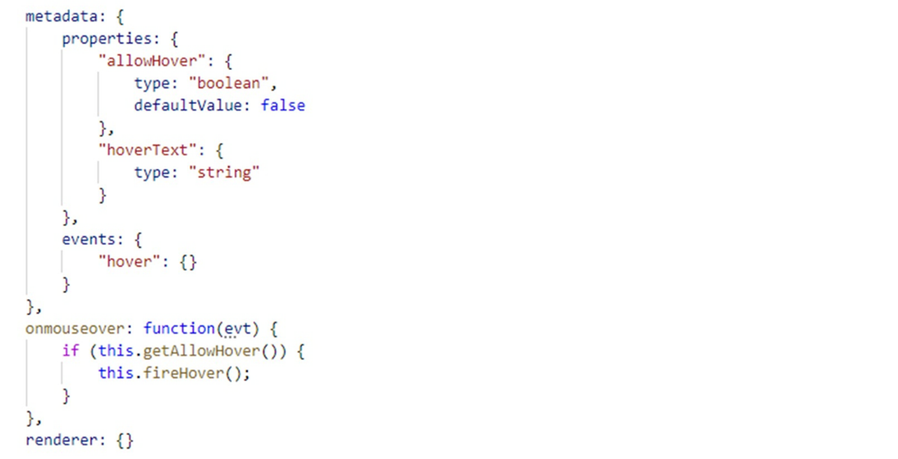

### Task 2: Add the HoverButton Control to the Application
#### Steps
  1. Open the Flights.view.xml file. In order to use the new HoverButton control, an XML namespace must be added to the view so that it can address the control properly. At the top of the Flights.view.xml file, several namespaces are defined pointing to SAP provided libraries. Add a new XML namespace with the prefix of cust pointing to the namespace where the HoverButton control is located.
    1. Enter the following code after xmlns:l="sap.ui.layout" :
Code Snippet
Copy codeSwitch to dark mode

```

1

xmlns:cust="student.com.sap.training.advancedsapui5.fullscreen.control"

```

  2. As a last element of the columns aggregation, add a new mobile enabled Column element with the following attributes and values:
#### Attribute-value Pairs for the Column Element
| Attribute  | Value  |
| --- | --- |
| id  | **flbooking**  |
| minScreenWidth  | **Tablet**  |
| demandPopin  | **true**  |
| hAlign  | **Center**  |
    1. Enter the following code after the column4 declaration:
Code Snippet
Copy codeSwitch to dark mode

```

12345

<Column id="flbooking" minScreenWidth="Tablet" demandPopin="true" hAlign="Center">

</Column>

```

  3. Add a new sap.m.Text element with the following attribute to the new Column element:
#### Attribute-value Pair for the Text Element
| Attribute  | Value  |
| --- | --- |
| id  | **flbookingtext**  |
| text  | **{i18n >bookaction}**  |
    1. Enter the following code inside the column definition:
Code Snippet
Copy codeSwitch to dark mode

```

1

<Text id="flbookingtext" text="{i18n>bookaction}"/>

```

  4. As a last element of the cells aggregation, add a HoverButton element with the following attributes and values. Now, save your changes.
#### Attribute-value Pairs for the HoverButton Element
| Attribute  | Value  |
| --- | --- |
| text  | **{i18n >bookaction}**  |
| allowHover  | **true**  |
| hoverText  | **{=${Seatsmax} - ${Seatsocc}}**  |
| hover  | **onHover**  |
| id  | **hoverButton1**  |
Note
The HoverButton is placed in a project specific namespace.
    1. Enter the following code after the flseatsocctext element:
Code Snippet
Copy codeSwitch to dark mode

```

12345

<cust:HoverButton id="hoverButton1" text="{i18n>bookaction}"
      allowHover="true"
      hoverText="{=${Seatsmax} - ${Seatsocc}}"
      hover="onHover"
/>

```

    2. Save your changes.
  5. Add the following key-value pair to the i18n.properties file:
#### Key-value Pair within the i18n.properties File
| Key  | Value  |
| --- | --- |
| bookaction  | Book flight  |
    1. Perform this step as shown in a previous exercise.
  6. Run the application.
Note
Be aware that since we are not testing the application in a real SAP Fiori environment you will get errors in the console if you use Dev Tools to debug your application. Please, dismiss any message about resource preload.
    1. Perform this step, as shown in a previous exercise.
  7. Verify that the application runs properly and that a new Button is shown in each row of the Flights table. The functionality for the hover has not been implemented yet so there are no added features at this point.
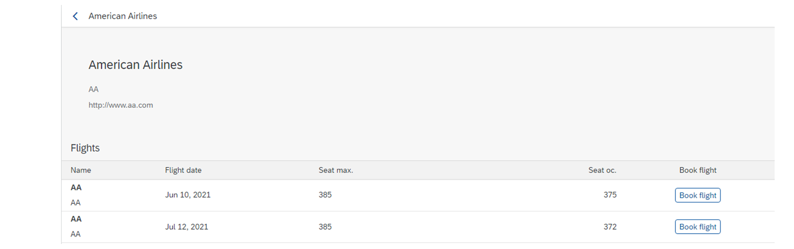
    1. Choose a carrier in the Carriers table.
    2. Verify that the application runs properly and that a new Button is shown in each row of the Flights table.

### Task 3: Implement the Hover Action
#### Steps
  1. Open the i18n.properties file and add the following key-value pair (with a leading blank at the value) to the file. Now, save your changes.
#### Key-value Pair within the i18n.properties File
| Key  | Value  |
| --- | --- |
| msgSeatsAv  | seats are available  |
    1. Open the i18n.properties file and enter the following code:
Code Snippet
Copy codeSwitch to dark mode

```

123

#MSG
msgSeatsAv=seats are available

```

    2. Save your changes.
  2. The HoverButton control that was added has the hover method set to call a method called **onHover**. This method is not yet implemented by the application. Open the Flights.controller.js file and add a new dependency to the sap.m.MessageToast control.
    1. Open the Flights.controller.js file located in the _controller_ folder of your project.
    2. Update the code as follows :
Code Snippet
Copy codeSwitch to dark mode

```

1234567

sap.ui.define([
    "sap/ui/core/mvc/Controller",
    "sap/m/MessageToast"
],
function (Controller, MessageToast) {
    "use strict";

```

  3. Add the onHover function to the controller implementation. The function takes one argument with the name, evt.
    1. Enter the following code after the onNavBack function implementation :
Code Snippet
Copy codeSwitch to dark mode

```

1234

,
onHover: function(evt) {

}

```

  4. In the onHover method, add code to display a MessageToast with the HoverButton controls hoverText displayed for 1000 milliseconds. Read the hoverText from the source of the event. Use the i18n capabilities of UI5. Now, save your changes.
    1. Enter the following code inside the onHover function:
Code Snippet
Copy codeSwitch to dark mode

```

123

var sText = this.getOwnerComponent().getModel("i18n").getProperty("msgSeatsAv");
MessageToast.show(evt.getSource().getHoverText() + " " + sText, {duration: 1000});

```

  5. Start the application.
    1. Perform this step as shown in a previous exercise.
  6. Select a carrier and navigate to the Flights table.
    1. Perform this step as shown in a previous exercise.
  7. Hover over the button in the table. A _MessageToast_ dialog box with the available seats for booking appears.

    1. Hover over the button in the table.
    2. A _MessageToast_ dialog box with the available seats for booking appears.
  8. Since we will further develop your fullscreen project in a following exercise, you can save the current state of the project by downloading it. Select the _fullscreen_ project and from the context menu, choose _Download_.


### Creating Custom Controls

*Source: https://learning.sap.com/courses/advanced-sapui5-development/creating-custom-controls_d03c403b-4360-49b7-8fd1-fbf5d2696a18*

Objective
After completing this lesson, you will be able to implement custom controls using the SAPUI5 framework.
## Custom Controls
### Developing Your Own Controls
Sometimes, requirements go beyond the possibilities of extending standard controls. In other cases, it is necessary to implement a reusable custom control by combining existing controls. Using SAPUI5, it is also possible to implement your own customer-specific controls, so-called custom controls. In this lesson, you will learn how to implement such custom controls.
### Creating Custom Controls
When you are able to extend an existing control, creating a custom control is not really that different. When you create a custom control, you simply change what the control is extending and then you have to implement the renderer fully on your own.
Watch this video to know more.
Settings
### Control vs. Element
As you already know, SAPUI5 offers more than just basic controls. In addition, the SAPUI5 framework does provide more complex controls with dependencies to other controls. The framework also has visual aspects called elements. An element in SAPUI5 cannot be used by itself, it has to be used in combination with a control. They live in a parent-child dependency. The control in the relationship is the parent and the element is the child. The parent knows, for example, how to display or render the child during runtime.
The following rules are applied to elements :
  * sap.ui.core.Element is base class of sap.ui.core.Control
  * It does have an API but not a renderer.
  * It is not meant to be used as a standalone.
  * Typically, it is aggregated by a control (for example, MenuItems in a Menu).
  * The control does the rendering and uses the Element as data container.

An Element is the most basic building block for UI5 UIs. An Element has a state like a ManagedObject and it has a unique ID by which the framework remembers it. It can have an associated DOM, but it cannot render itself. Only [Controls](https://ui5.sap.com/api/sap.ui.core.Control) can render themselves and also take care of rendering Elements, which they aggregate as children. If an Element has been rendered, its related DOM gets the same ID as the Element and thereby can be retrieved through API.
### Working with elements
The following figure shows you how to use elements during aggregation binding.
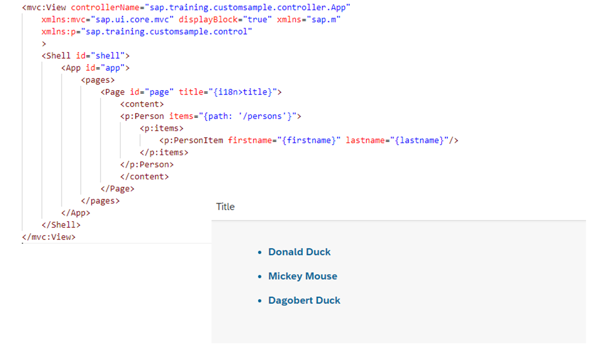
The code shown in the following figure shows you the implementation and relationship of a control and an element.
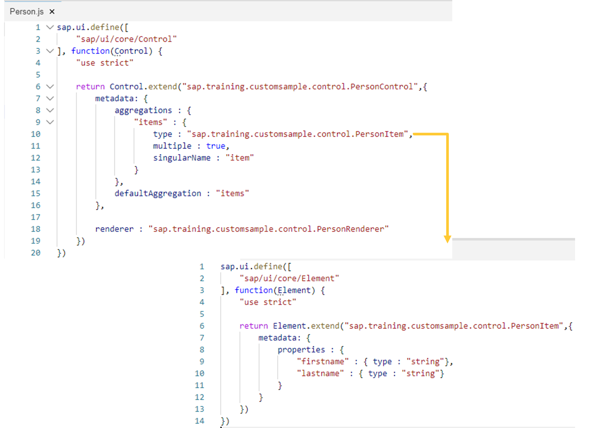
The code shown in the following figure shows you how to access the list of PersonItem-elements.
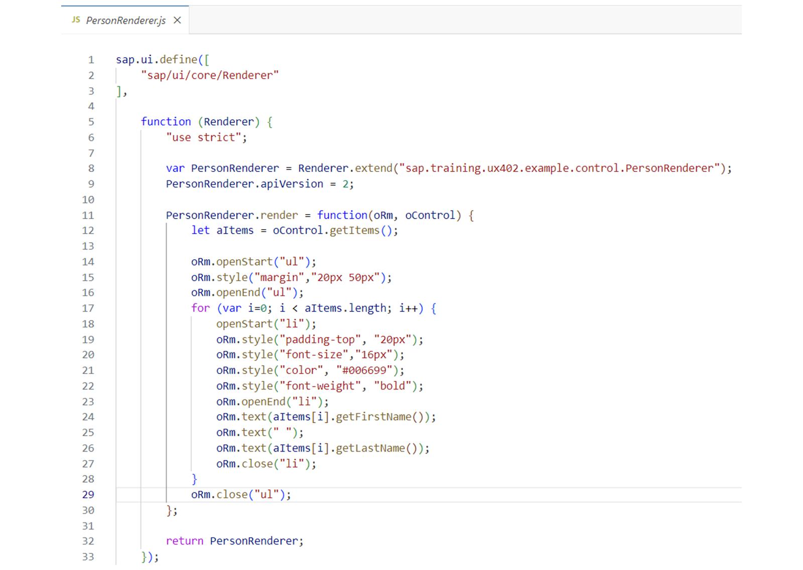
## Create a Custom Control
### Business Example
In this exercise, you will extend the _fullscreen_ application by adding a custom control. The control shows data about the plane in the Flights table, including the following:
  * Maximum number of passengers
  * Current number of passengers booked

This is shown in the following figure:
Note
SAP Business Technology Platform and its tools are cloud services. Due to the nature of cloud software, step procedures, and the naming of fields and buttons may differ from the exercise solution.
### Prerequisites
You need to have completed the previous exercise on implementing a full-screen application. The solutions show the application after completion of exercise on extending controls but this part is not needed for the following exercise.
Note
You can download either the 1-Fullscreen complete.tar or the 3-controlextend.tar files in the solution to start with if you want.
### Task 1: Create the Custom Control
#### Steps
  1. Open the SAP Business Application Studio.
  2. In the _control_ folder of the _fullscreen_ (or _controlextend_) project, create a new file named **PlaneInfo.js**.
    1. Perform this step as shown in a previous exercise.
  3. In the PlaneInfo.js file, create a custom control named **PlaneInfo** by extending the sap.ui.core.Control.
    1. Use the following code:
Code Snippet
Copy codeSwitch to dark mode

```

1234567891011121314

sap.ui.define([
    "sap/ui/core/Control"
  ],

    function (Control) {
      "use strict";

      return Control.extend("student.com.sap.training.advancedsapui5.fullscreen.control.PlaneInfo", {

      });
    }
  );

```

  4. Add a metadata section. Add the following properties to the metadata definition and assign the given type as a type attribute. Then save your changes.
#### Properties within the Metadata Section of the PlaneInfo.js File
| Property  | Type  |
| --- | --- |
| seatsMax  | string  |
| seatsOcc  | string  |
    1. Enter the following code inside the extend function:
Code Snippet
Copy codeSwitch to dark mode

```

1234567891011

metadata:{
  properties: {
    "seatsMax" : {
      type: "string"
    },
    "seatsOcc" : {
      type: "string"
    }
  }
}

```

    2. Save your changes.

### Task 2: Implement the Renderer
It is necessary to implement the renderer for the PlaneInfo control. The renderer follows the naming standards for renderer.
#### Steps
  1. In the _control_ folder of the _fullscreen_ (or _controlextend_) project, create a new file named **PlaneInfoRenderer.js**.
    1. Perform this step as shown in a previous exercise.
  2. In the PlaneInfoRenderer.js file, create a custom control named **PlaneInfoRenderer** by extending the base sap.ui.core.Renderer, assign the extended object to a variable named PlaneInfoRenderer, and return the created object to the caller.
    1. Use the following code:
Code Snippet
Copy codeSwitch to dark mode

```

123456789101112

sap.ui.define([
    "sap/ui/core/Renderer"
  ],

    function (Renderer) {
      "use strict";

      var PlaneInfoRenderer = Renderer.extend("student.com.sap.training.advancedsapui5.fullscreen.control.PlaneInfoRenderer");
      return PlaneInfoRenderer;
    }
);

```

  3. To enable the incremental DOM-like API, set the apiVersion of the PlaneInfoRenderer object to **2**.
    1. Add the following code before the return PlaneInfoRenderer statement :
Code Snippet
Copy codeSwitch to dark mode

```

1

PlaneInfoRenderer.apiVersion = 2;

```

  4. Add a function render to the PlaneInfoRenderer object created in step 2. The function takes two arguments. Name the first argument **oRm**. It will contain a reference to the RenderManager at runtime. Name the second argument **oControl**. This variable will contain a reference to the control that the renderer should render. Add code to the render function to render the control. The HTML table control should have three rows of data from the PlaneInfo control properties: seatsMax and seatsOcc. Do not put in the icons at this point (as seen at the beginning of the exercise). Now, save your changes.
Hint
The table being rendered is an HTML table, not an SAPUI5 table. The data from the PlaneInfo control can be accessed from the oControl object passed in using the automatically generated getter methods.
    1. Use the RenderManager passed in to write out an opening div and write the control data for the oControl object passed in. Use the openStart function of the RenderManager.
    2. Write an HTML table control with three rows of data from the PlaneInfo control properties: seatsMax and seatsOcc. Do not put in the icons at this point (as seen at the beginning of the exercise). Use the openStart, openEnd, close, attr, and text functions of the RenderManager.
    3. Close the table and the div. Use the close function of the RenderManager.
    4. The implementation should look like the following code:
Code Snippet
Copy codeSwitch to dark mode

```

12345678910111213141516171819202122232425

PlaneInfoRenderer.render = function(oRm, oControl) {
  oRm.openStart("div",oControl);
  oRm.openEnd();
  oRm.openStart("table");
  oRm.attr("align", "center");
  oRm.openEnd();
  oRm.openStart("tr");
  oRm.openEnd();
  oRm.openStart("td");
  oRm.openEnd();
  oRm.text(" "+oControl.getSeatsMax());
  oRm.close("td");
  oRm.close("tr");
  oRm.openStart("tr");
  oRm.openEnd();
  oRm.openStart("td");
  oRm.openEnd();
  oRm.text(" "+oControl.getSeatsOcc());
  oRm.close("td");
  oRm.close("tr");
  oRm.close("table");
  oRm.close("div");

}

```

Note
For less code, you could use method chaining.
    5. Save your changes.

### Task 3: Add the PlaneInfoRenderer to the PlaneInfo Control
#### Steps
  1. Open the PlaneInfo.js file and add a reference to the new PlaneInfoRenderer to the implementation.
    1. Open the PlaneInfo.js file located in the _control_ folder of your project.
    2. Update the code as follows:
Code Snippet
Copy codeSwitch to dark mode

```

12345678

sap.ui.define([
    "sap/ui/core/Control",
    "student/com/sap/training/advancedsapui5/fullscreen/control/PlaneInfoRenderer"
  ],

    function (Control, PlaneInfoRenderer) {
      "use strict";

```

  2. Add an attribute renderer to the implementation and assign the PlaneInfoRenderer reference to it.
    1. Add the following code after the metadata definition:
Code Snippet
Copy codeSwitch to dark mode

```

12

,
renderer: PlaneInfoRenderer

```

    2. Save your changes.

### Task 4: Add the PlaneInfo Control to the Application
#### Steps
  1. Open the i18n.properties file and add the following key-value pair. Now, save your changes.
#### Key-value Pair within the i18n.properties File
| Key  | Value  |
| --- | --- |
| planeInfo  | Plane Infos  |
    1. Perform this step as shown in a previous exercise.
  2. Open the Flights.view.xml file. Before the last Column element, add a new mobile-enabled Column element with the following attributes to the columns aggregation:
#### Attribute-value Pairs for the Column Element within the Flights.view.xml File
| Attribute  | Value  |
| --- | --- |
| id  | **flplaneinfo**  |
| minScreenWidth  | **Tablet**  |
| demandPopin  | **true**  |
| hAlign  | **Center**  |
    1. Open the Flights.view.xml file.
    2. Add the following code between flseatocccolumn and flbooking elements:
Code Snippet
Copy codeSwitch to dark mode

```

123

<Column id="flplaneinfo" minScreenWidth="Tablet" demandPopin="true" hAlign="Center">

</Column>

```

  3. Add a sap.m.Text element with the following attribute and value to the newly created Column element:
#### Attribute-value Pair for the Text Element within the Flights.view.xml File
| Attribute  | Value  |
| --- | --- |
| id  | **flplaneinfotext**  |
| text  | **{i18n >planeInfo}**  |
    1. Add the following code inside the new Column definition :
Code Snippet
Copy codeSwitch to dark mode

```

1

<Text id="flplaneinfotext" text="{i18n>planeInfo}"/>

```

  4. Before the HoverButton element of the cells aggregation, add a PlaneInfo element with the following attributes and values. Bear in mind that PlaneInfo is placed in a project specific namespace. Now, save your changes.
#### Attribute-value Pairs for the PlaneInfo Element within the Flights.view.xml File
| Attribute  | Value  |
| --- | --- |
| seatsMax  | **{Seatsmax}**  |
| seatsOcc  | **{Seatsocc}**  |
| id  | **planeInfo1**  |
    1. Add the following code in the cells aggregation, before the HoverButton definition:
Code Snippet
Copy codeSwitch to dark mode

```

1234

<cust:PlaneInfo id="planeInfo1"
      seatsMax="{Seatsmax}"
      seatsOcc="{Seatsocc}"
/>

```

    2. Save your changes.
  5. Run the application.
Note
Be aware that since we are not testing the application in a real SAP Fiori environment you will get errors in the console if you use Dev Tools to debug your application. Please, dismiss any message about resource preload.
    1. Perform this step as shown in a previous exercise.
  6. Verify that the row in the Flights table now shows the PlaneInfo control with the three pieces of data. If the control does not display or the application fails to load, open Chrome DevTools and look at the HTML code generated.

    1. Choose a carrier in the Carriers table.
    2. Verify that the row in the Flights table now shows the PlaneInfo control with the three pieces of data.
    3. Adjust the _PlaneInfoRenderer.js_ file as needed to get the HTML correct. Use Chrome DevTools as needed to look at the HTML code that is inserted by the custom control. This may take several attempts.

### Task 5: Add Icons to the PlaneInfo Control
#### Steps
  1. Open the PlaneInfoRenderer.js file.
    1. Perform this step as shown in a previous exercise.
  2. To show clearly what the numbers mean, add icons before the numbers of the PlaneInfo table. Show the listed icons at the appropriate position. Use the icon function of the RenderManager. It takes the URL of the icon as a parameter. The URL prefix for the SAP icons is sap-icon://.
#### Icons within the PlaneInfoRenderer.js File
| Icon  | Infront Of  |
| --- | --- |
| **person-placeholder**  | seatsMax  |
| **suitcase**  | seatsOcc  |
    1. Open the PlaneInfoRenderer.js file.
    2. Add the following code before oRm.text(" "+oControl.getSeatsMax()); :
Code Snippet
Copy codeSwitch to dark mode

```

1

oRm.icon("sap-icon://person-placeholder");

```

    3. Add the following code before oRm.text(" "+oControl.getSeatsOcc()); :
Code Snippet
Copy codeSwitch to dark mode

```

1

oRm.icon("sap-icon://suitcase");

```

  3. Run the application.
    1. Perform this step as shown in a previous exercise.
  4. Verify that the icons are appearing on the _PlaneInfo_ control. You may need a few spaces after the icon to move the numbers away from the icon slightly.

    1. Choose a carrier in the Carriers table.
    2. Verify that the icons are appearing on the _PlaneInfo_ control.
  5. You can now close the browser tab in which your application is running.
  6. Since we will further develop your fullscreen project in a following exercise, you can save the current state of the project by downloading it. Select the _fullscreen_ project and from the context menu, choose _Download_.


### Creating Control and Component Libraries

*Source: https://learning.sap.com/courses/advanced-sapui5-development/creating-control-and-component-libraries_de1fb2af-9117-471a-b160-505770bdaf85*

Objective
After completing this lesson, you will be able to recognize the structure of a custom library.
## Implementing Custom Libraries
Creating reusable building blocks is necessary to increase development speed and provide the same intuitive and consistent experience across the enterprise.
A custom library provides reuse functionality and UI controls without copy and paste.
This list enumerates the basic advantages of control libraries:
  * Reuse controls/functionality in different applications
  * Provide automatic support for theming
  * Provide automatic support for right-to-left languages
  * Can be installed on the ABAP-platform
  * Can be installed in the SAP Business Technology Platform

Let's now look at the structure of a custom library together with additional information on library.js and manifest.json.
Settings
## Encapsulate Controls in a Custom Library
The characteristics of controls in a custom library are as follows:
  * Multiple controls can be added to a library
  * The full qualified classname must match the one defined in the library.js
  * Standard JavaScript can be used
  * Defined as a JavaScript module with name, dependencies and factory functionsap.ui.define([...], function() {...});

At the end, you must implement the controls that are going to be encapsulated in the UI library.
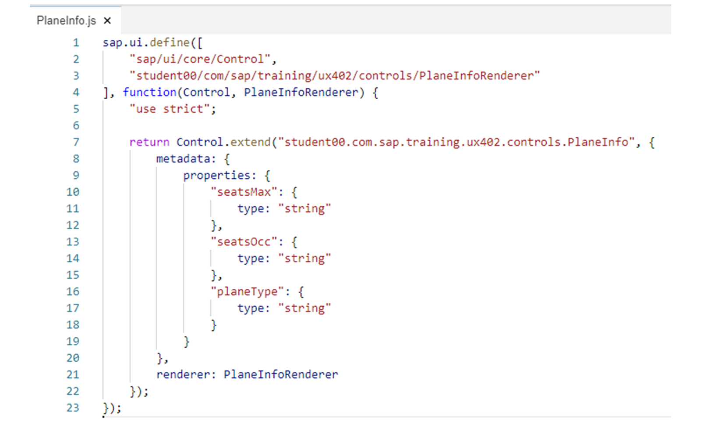
When you are finished with the development, you have to deploy the UI library project to your on-premise or cloud system.
After deployment, the UI library shows up in transaction SICF.
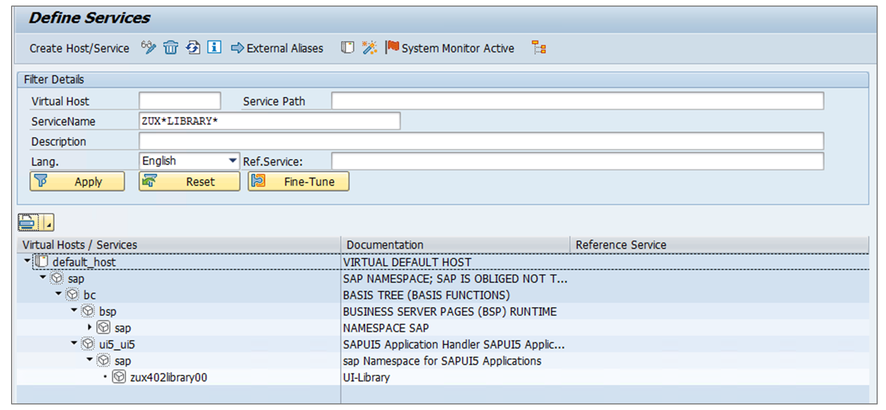
## Implement a Reusable UI Library
### Business Example
In this exercise, you will build a reusable UI Library and you will use this library in the _fullscreen_ application.
Note
SAP Business Technology Platform and its tools are cloud services. Due to the nature of cloud software, step procedures and naming of fields and buttons may differ from the exercise solution.
### Prerequisites
You should have completed the last exercise on custom controls.
Note
You can import the solutions with the 3-customcontrol.tar file.
### Task 1: Create a Yarn Workspace
In order to test the use of a library without having to deploy this library and the project into a backend server, we can use yarn workspaces.
#### Steps
  1. Log into your SAP Business Application Studio.
    1. Perform this step as done in a previous exercise.
  2. Install the following npm packages (globally) to your development environment : yarn, yoman and generator-ui5-library.
    1. Open a new terminal window.
Hint
You can use the _Terminal_ → _New Terminal_ menu option.
    2. Globally install the yarn package by executing the following code:
Code Snippet
Copy codeSwitch to dark mode

```

1

npm install -location=global yarn

```

    3. Globally install the yoman package by executing the following code:
Code Snippet
Copy codeSwitch to dark mode

```

1

npm install -location=global yo

```

    4. Globally install the generator-ui5-library package by executing the following code:
Code Snippet
Copy codeSwitch to dark mode

```

1

npm install -location=global generator-ui5-library

```

  3. Create a new _library_test_ folder in your _projects_ folder and add a _packages_ sub-folder and a package.json file with the following code:
Code Snippet
Copy codeSwitch to dark mode

```

123456789101112

{
 "name": "library_test",
 "version": "1.0.0",
 "description": "",
 "keywords": [],
 "author": "",
 "license": "ISC",
 "private": true,
 "workspaces": [
     "packages/*"
 ]
}

```

    1. Make sure you are in your projects folder.
Hint
To be absolutely sure, you can use the _View_ → _Command Palette_ menu option and search for the File: Open Folder... command. Then select your _projects_ folder and select _Go_.
    2. Click into the blank space in the _EXPLORER_ , to make sure you have not selected an existing project, and create a new folder by selecting the _New Folder..._ icon.
    3. Enter **library_test** as the folder name and press the Enter key (on your keyboard).
    4. Make sure that your new folder is selected and click again on the _New Folder..._ icon.
    5. Enter **packages** as the folder name and press the Enter key (on your keyboard).
    6. Select the _library_test_ folder (it should be underlined) and select the _New File..._ icon.
    7. Enter **package.json** as the file name and press the Enter key (on your keyboard). You should now see the following structure:
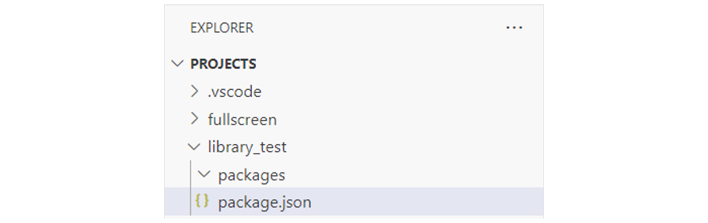
    8. Enter the given code in the package.json file.

### Task 2: Create the Reusable UI Library
#### Steps
  1. Generate a new library inside the _packages_ folder using the yoman ui5-library command and following information:
#### Library Creation Wizard
| Question  | Answer  |
| --- | --- |
| How do you want to name this library?  | **uicontrols**  |
| Which namespace do you want to use?  | **student.com.sap.training.advancedsapui5**  |
| Which framework do you want to use?  | **SAPUI5**  |
| Which framework version do you want to use?  | **1.126.0**  |
| Who is the author of the library?  | keep default value  |
| Would you like to create a new directory for the library?  |  **Y** (Yes)  |
Note
If you are asked to migrate your library project, go and start the migration.
    1. Select the new _packages_ folder and select the _Open in Integrated Terminal_ option in the contextual menu.
    2. Enter the following command: yo ui5-library.
    3. Enter **uicontrols** for the library name.
    4. Enter **student.com.sap.training.advancedsapui5** for the namespace.
    5. Select **SAPUI5** for the framework.
    6. Enter **1.126.0** as framework version.
    7. Keep the default values for author and create a new directory.
  2. If you prefer to display the whole folder tree structure, you can change the settings of your Explorer and deselect the compact folder option.
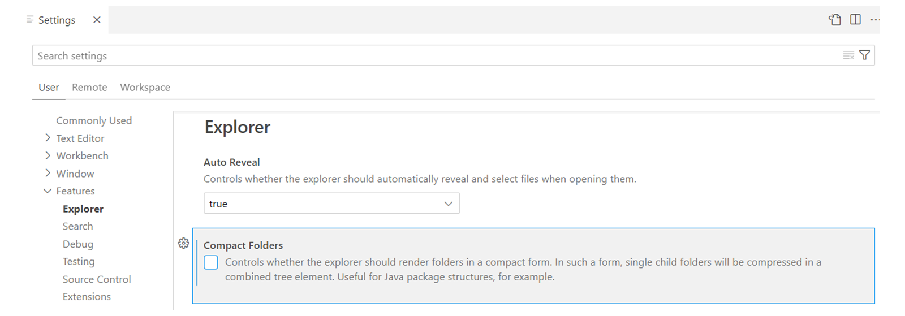
    1. Go to the _File_ → _Preferences_ → _Settings_ menu option.
    2. Select _Features/Explorer_ in the left pane.
    3. Deselect the _Compact Folders_ option.
    4. Close the _Settings_ tab.
  3. Copy the HoverButton.js, PlaneInfo.js, and PlaneInfoRenderer.js files from the _fullscreen_ (or _customcontrol_) project into the _uicontrols_ folder. Change the namespace of the HoverButton.js, PlaneInfo.js and PlaneInfoRenderer.js files from student.com.sap.training.advancedsapui5.fullscreen.control to **student.com.sap.training.advancedsapui5.uicontrols**. Be sure to update all of the namespace references.
    1. Open the _control_ folder of the _fullscreen_ (or _customcontrol_) project and select the HoverButton.js, PlaneInfo.js, and PlaneInfoRenderer.js files.
    2. Press _Ctrl + C_ (on your keyboard) to copy the selected files.
    3. Select the _uicontrols_ folder of the new library and press _Ctrl + V_ on your keyboard.
Note
You'll find this folder in the library_test>packages>student.com.sap.training.advancedsapui5.uicontrols>src>student>com>sap>training>advancedsapui5 folder.
    4. Open the HoverButton.js file and change the namespace like in the following code:
Code Snippet
Copy codeSwitch to dark mode

```

123456789

sap.ui.define([
  "sap/m/Button"
],

  function (Button) {
  "use strict";

  return Button.extend("student.com.sap.training.advancedsapui5.uicontrols.HoverButton", {

```

    5. Open the PlaneInfo.js file and adjust the namespace and the referenced namespace for _PlaneInfoRenderer_. Use the following code:
Code Snippet
Copy codeSwitch to dark mode

```

12345678910

sap.ui.define([
  "sap/ui/core/Control",
  "student/com/sap/training/advancedsapui5/uicontrols/PlaneInfoRenderer"
],

  function (Control, PlaneInfoRenderer) {
    "use strict";

    return Control.extend("student.com.sap.training.advancedsapui5.uicontrols.PlaneInfo", {

```

    6. Open the PlaneInfoRenderer.js file and update the namespace.
Code Snippet
Copy codeSwitch to dark mode

```

123456789

sap.ui.define([
  "sap/ui/core/Renderer"
],

  function (Renderer) {
    "use strict";

    var PlaneInfoRenderer = Renderer.extend("student.com.sap.training.advancedsapui5.uicontrols.PlaneInfoRenderer");

```

  4. Extend the library.js file. Add the following entries to the controls list:
#### New Controls for the initLibrary Function within the library.js File
| Parameter  | Value  |
| --- | --- |
| controls  |  Code Snippet Copy codeSwitch to dark mode
```

123

"student.com.sap.training.advancedsapui5.uicontrols.PlaneInfo",
"student.com.sap.training.advancedsapui5.uicontrols.HoverButton",
"student.com.sap.training.advancedsapui5.uicontrols.PlaneInfoRenderer"
```
 |
    1. Open the library.js file.
    2. Add the three controls to the control list. Your code should look like the following:
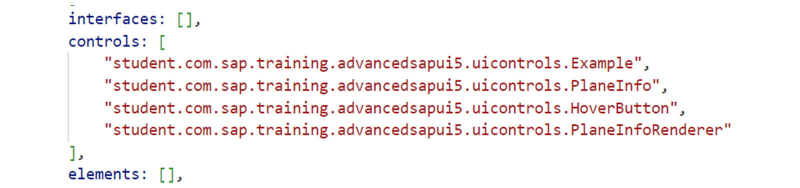

## Custom Library Usage
A dependency is defined in the _manifest.json_ file of the application that uses the UI library. The dependency triggers the get response of the _library.js_ file from the dependent UI library.
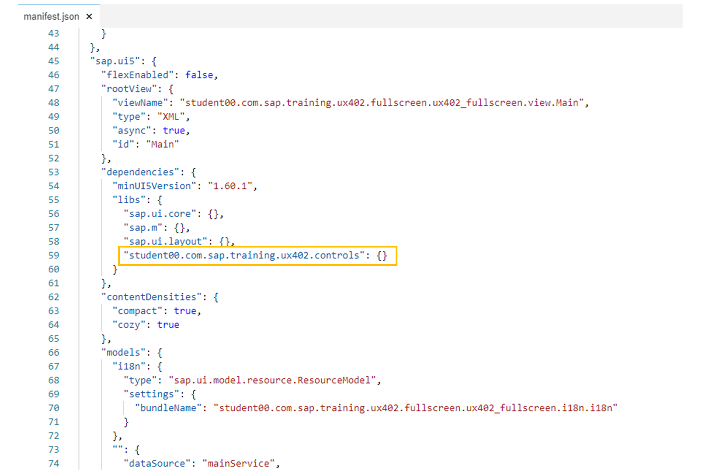
## Use a custom library
In this exercise you will learn how to use the control library created in the previous exercise.
### Prerequisites
You need to have completed previous exercise on library creation. If not, you can import the solution.
### Task 1: Copy and Adapt the fullscreen Application
In the next step, you must copy and change the _fullscreen_ application to consume the created library.
#### Steps
  1. Copy the whole _fullscreen_ (or _customcontrol_) project folder inside the _packages_ folder.
Note
The copy can take some time.
    1. Select the _fullscreen_ (or _customcontrol_) project folder and press _Ctrl + C_ (on your keyboard) to copy the selected files.
    2. Select the _packages_ folder under _library_test_ and press _Ctrl + V_ on your keyboard.
  2. Open the manifest.json file of the _fullscreen_ project and add a dependency to the student.com.sap.training.advancedsapui5.uicontrols library. Then save your changes.
    1. Open the manifest.json file of your copied _fullscreen_ project.
    2. Navigate to the sap.ui5 configuration.
    3. Add the dependency to the student.com.sap.training.advancedsapui5.uicontrols library in the dependencies configuration section like in the following code:
Code Snippet
Copy codeSwitch to dark mode

```

12345678910

"sap.ui5": {
  "flexEnabled": false,
  "dependencies": {
    "minUI5Version": "1.102.1",
    "libs": {
      ...
      "student.com.sap.training.advancedsapui5.uicontrols" : {}
    }
  },

```

    4. Save your changes.
  3. Change the namespace of the cust XML alias in the Flights.view.xml file to the new student.com.sap.training.advancedsapui5.uicontrols namespace.
    1. Open the Flights.view.xml file, located in the _view_ folder, with the Code Editor and change the namespace of the cust xml alias to student.com.sap.training.advancedsapui5.uicontrols. Your code should look like the following:
Code Snippet
Copy codeSwitch to dark mode

```

123456

<mvc:View controllerName="student.com.sap.training.advancedsapui5.fullscreen.controller.Flights"
    xmlns:mvc="sap.ui.core.mvc" displayBlock="true"
    xmlns="sap.m" xmlns:l="sap.ui.layout"
    xmlns:cust="student.com.sap.training.advancedsapui5.uicontrols">

```

    2. Save your changes.
  4. Add the uicontrols library reference to the package.json file.
    1. Open the package.json file of the _fullscreen_ copied project.
    2. Add "uicontrols":"1.0.0" to the "dependencies":{} section as in the following code:
Code Snippet
Copy codeSwitch to dark mode

```

1234

"main": "webapp/index.html",
"dependencies": {
  "uicontrols":"1.0.0"
},

```

  5. Delete the _control_ folder of your copied _fullscreen_ project.
    1. Select the library_test/packages/fullscreen/webapp/control folder
    2. Press _Delete_.
  6. Resolve local dependencies by executing **yarn** command in the _library_test_ workspace.
    1. Select the _library_test_ folder and choose _Open in Integrated Terminal_ from the contextual menu.
    2. Enter the **yarn** command and press the Enter key (on your keyboard).
  7. Test your application in Google Chrome. Check also with Chrome DevTools to ensure that the new library is used.
Note
Be aware that since we are not testing the application in a real SAP Fiori environment you will get errors in the console if you use Dev Tools to debug your application. Please, dismiss any message about resource preload.
    1. Preview your fullscreen application, as shown in previous exercises.
    2. In the displayed application, choose a carrier from the list of available carriers.
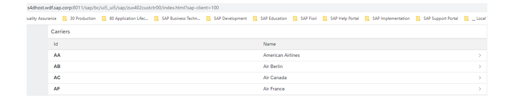
    3. The carrier details and the available flights are displayed as they are shown in the following figure.
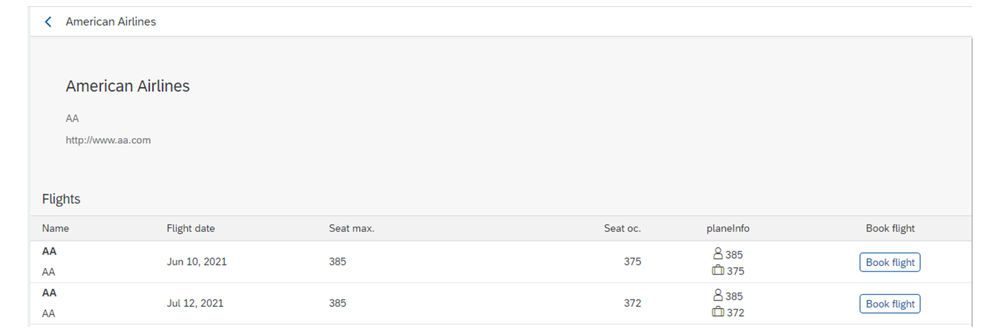
    4. Press F12 (on your keyboard) to access Chrome DevTools. Select the _Sources_ tab in Chrome DevTools. You will see that the new library is used by the application.
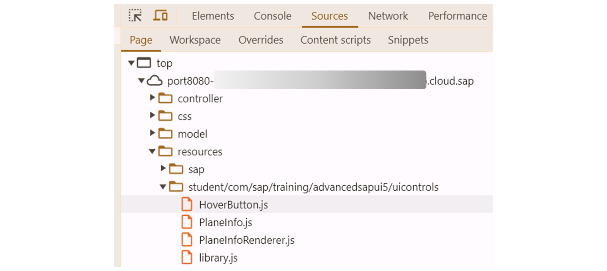

[Continue to quiz](https://learning.sap.com/courses/advanced-sapui5-development/working-with-ui5-controls)


### Quiz

*Source: https://learning.sap.com/courses/advanced-sapui5-development/working-with-ui5-controls*

It's time to put what you've learned to the test, get 7 right to pass this unit.
1.
### Which of the following aspects are true for an SAPUI5 UI element?
There are three correct answers.
A UI element has an API.
A UI element does not have a renderer.
A UI element has a renderer.
A UI element can have events.
2.
### Which function must be called inside a control renderer to add the control ID to the DOM tree and support eventing?
Choose the correct answer.
writeClasses
writeIcon
writeControlData
write
3.
### How can a renderer access the associated elements?
Choose the correct answer.
The developer must implement an appropriate function to access the elements.
SAPUI5 provides functions to access all properties, associations, and aggregations.
The developer must define a property method in the control metadata and declare the access control.
4.
### What method is called inside the library.js file?
Choose the correct answer.
sap.ui.getCore().registerLibrary
sap.ui.getCore().initLibrary
sap.ui.getCore().loadLibrary
sap.ui.getCore().runLibrary
5.
### What is the base class for all UI controls in SAPUI5?
Choose the correct answer.
sap.ui.Control
sap.ui.core.Control
sap.ui.base.Control
sap.ui.Element
6.
### Which of the following statements are true with regard to implementing your own renderer?
There are three correct answers.
Implement the render function inside the control.
Implement a renderer class, derived from sap.ui.core.Renderer, in a separate file.
Implement the renderer using AMD syntax.
Assign a reference to the renderer property of the UI control.
7.
### You want to define a property with the name width to enhance a standard UI5 control. The property should hold the current width of the UI control. What is the best approach to defining the type of such a property?
Choose the correct answer.
Define the property width of the type string.
Define the property width of the typesap.ui.core.Integer.
Define the property width of the type sap.ui.core.CSSSize.
Define the property width of the type sap.ui.core.type.CSSSize.
8.
### Which file contains the initialization code for the UI library?
Choose the correct answer.
library.load.js
library.js
loadlibrary.js
lib.dll
Submit answers[Next unit](https://learning.sap.com/courses/advanced-sapui5-development/working-with-sapui5-smart-controls)


### Using metadata to implement UI5 controls

*Source: https://learning.sap.com/courses/advanced-sapui5-development/working-with-sapui5-smart-controls*

Objective
After completing this lesson, you will be able to work with Smart Controls.
## Introduction to Smart Controls
### Introduction to Smart Controls
Occasionally, implementing SAPUI5 applications can become a repetitive task. Some applications may have a different use case and OData service but have exactly the same UI. Moreover, a lot of metadata comes with the backend OData service, for example, internationalization or field length, and if these metadata could be used from SAPUI5 controls, it would save a lot of developing time.
Smart Controls do use these metadata to provide powerful functionality. They are a specific category of SAPUI5 controls that have some special features in addition to the standard SAPUI5 features and thus make it easier to use the control in certain scenarios. Smart controls are part of the _sap.ui.comp_ library and are focusing strongly on SAP Fiori elements.
The namespace _sap.ui.comp_ contains the following control types:
  * SmartField
  * SmartTable and SmartList
  * SmartFilterBar
  * SmartChart and SmartMicrochart
  * SmartVariants
  * SmartGroup

SAP will continue to maintain the library and all of its controls in the future. However, there will be no development of new features unless specifically requested by SAP Fiori elements.
### Implementing the OData Service
OData Service can be implemented using the SAP Gateway Builder or ABAP CDS (for example, leveraging the SAP RESTful Application Programming Model).
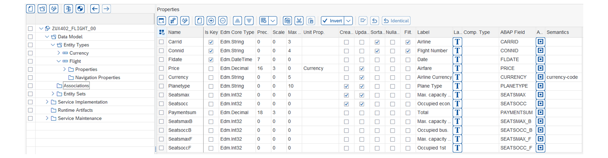
The figure shows the properties of an entity with the name Flight. As you can see, each property of the entity has various attributes. As the figure shows for some attributes, the attribute Sortable and Filterable is ticked. The property Currency is bound to the _currency-code_ semantic. This information can be used at runtime in the application to provide certain features - for example, a value help at the _Currency_ field.
### Checking OData Service Implementation
Navigate through the following simulation to learn how to check the OData service implementation.
Exercise[Start Exercise](https://learnsap.enable-now.cloud.sap/pub/mmcp/index.html?show=project!PR_45474AB690E5880:uebung)
## Using Smart Controls
### Working with SmartForm Controls
Now, we will take a closer look at smart controls, starting with SmartForms.
The SmartForm control displays form content and can be used in combination with SmartField controls and OData metadata annotations along with additional configuration. The control allows you to create a form with minimal effort. Depending on their user authorizations, the form enables users to do the following:
  * Switch from display to edit mode
  * Add and group fields
  * Rename field labels
  * Implement a user input check

SmartForms only define the layout, that is, the form. In order to be able to display data, we have to use sap.ui.comp.smartfield.SmartField controls.

SmartForm Controls consist of

  * groups (sap.ui.comp.smartform.Group)
  * group elements (sap.ui.comp.smartform.GroupElement)

The SmartForm control aggregates groups, and a group aggregates group elements. The group elements themselves aggregate elements of type sap.ui.core.Control

Group Elements are
    collections of controls that are displayed along with a label.
Typically, a group element consists of exactly one control and the respective label. 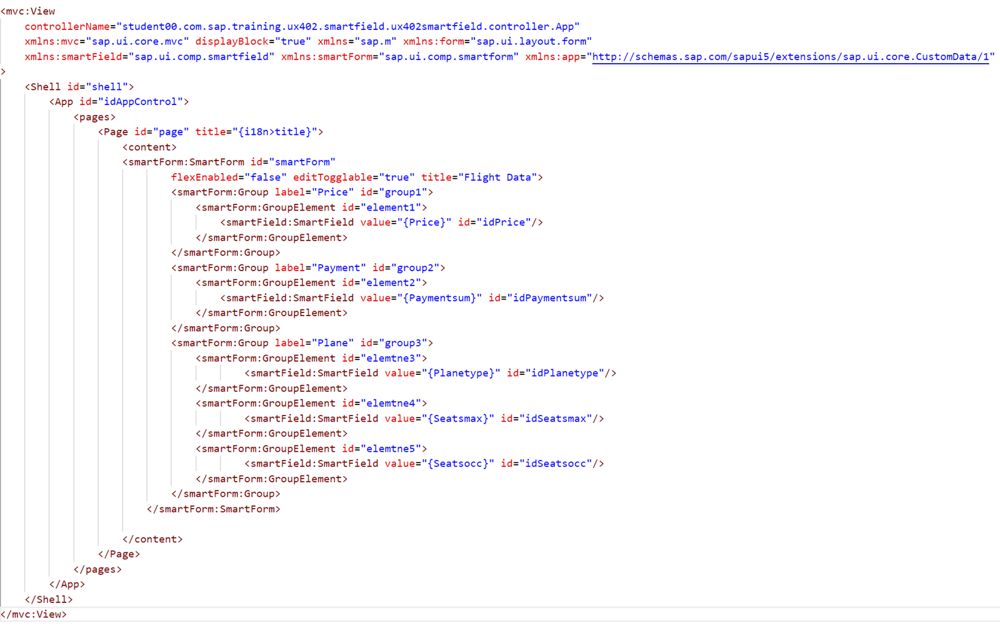
The figure shows the implementation of a SAPUI5 view using SmartControls. As you can see inside the sap.ui.core.mvc.View implementation, we have XML-Aliases for the SAPUI5 namespaces of sap.ui.comp.smartfield and sap.ui.comp.smartform. The SmartField-Controls are bound to fields of the underlying OData service.
At runtime, the above view looks as follows. Take note that you have the above implementation in mind, especially the Price andPaymentsum fields.
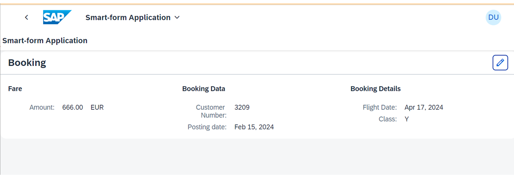
As you can see from this figure, the _Airfare_ and the _Total_ fields do not simply show the price, they also display the currency. These values are displayed because the semantic information of the OData-service is used. The switch-to-edit button is visible in the UI. This is because the editTogglable was set to true in the view implementation.
When you select the button, the UI will provide the possibility to change data.
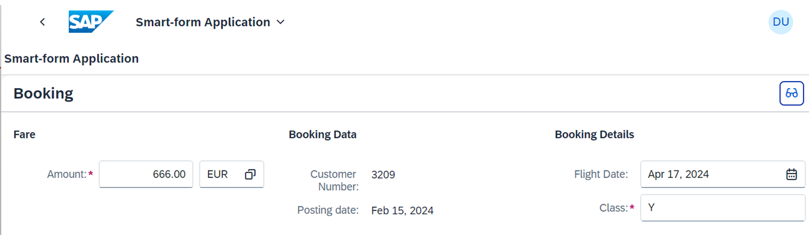
In the display above, not all fields are editable in the form. The information about what field can be changed is also fetched from the OData Service.
### Using SmartField Controls
SmartField Controls
  * Provide an efficient way to add input-enabled fields.
  * Automatically adjust to the metadata of the underlying OData service, for example, by doing the following:
    * Hosting controls for editing and displaying the values of OData properties.
    * Providing value help automatically.
    * Performing input checks.
  * Implement field control and support message handling.

SmartField controls can be used in different scenarios:
  * As a standalone control, for example, in XML views.
  * In combination with a SmartForm control.
  * In combination with a SmartTable control.

They are used in particular as cell editor in editing scenarios.
Navigate through the following simulation to learn how to use smartfield controls.
Exercise[Start Exercise](https://learnsap.enable-now.cloud.sap/pub/mmcp/index.html?show=project!PR_59922D797D83278C:uebung)
### The SmartTable Control
The SmartTable control
  * Is a wrapper control around any SAPUI5 table.
  * Analyzes the $metadata document of an OData service and renders a table for a specific entitySet.
  * Allows the consuming application to build list patterns in an efficient and consistent way and therefore makes it easy for the user to create tables without much effort.

The _SmartTable_ control offers you additional built-in features, such as a row count and the ability to export to a spreadsheet application.
Navigate through the following simulation to learn how to implement a smart table
Exercise[Start Exercise](https://learnsap.enable-now.cloud.sap/pub/mmcp/index.html?show=project!PR_C2CB0A84440B4698:uebung)


### Introducing the Flexible Programming Model

*Source: https://learning.sap.com/courses/advanced-sapui5-development/introducing-the-flexible-programming-model*

Objective
After completing this lesson, you will be able to understand the Flexible Programming Model.
## The Flexible Programming Model
The Smart Controls are one way of developing a User Interface with a minimum of code on the UI front, using the metadata provided by the OData Service.
But **the Smart Controls only work with OData V2 services**. If you have OData V4 Services, you can use **Flexible Model Programming**.
You'll find information about this method in following courses: [Developing an SAP Fiori elements App on a CAP Odata V4 Service](https://learning.sap.com/courses/developing-an-sap-fiori-elements-app-based-on-a-cap-odata-v4-service)
[Getting Started with creating an SAP Fiori Elements App Based on an OData V4 RAP service.](https://learning.sap.com/courses/getting-started-with-creating-an-sap-fiori-elements-app-based-on-an-odata-v4-rap-service)
[Continue to quiz](https://learning.sap.com/courses/advanced-sapui5-development/using-metadata-to-implement-ui5-controls)


### Quiz

*Source: https://learning.sap.com/courses/advanced-sapui5-development/using-metadata-to-implement-ui5-controls*

It's time to put what you've learned to the test, get 3 right to pass this unit.
1.
### What can be used to create User Interfaces using the OData V4 Services metadata ?
There are two correct answers.
SAP Fiori Elements Floorplans
Flexible Model Programming
Smart Fields
Flexible Column Layout
2.
### Where do you define the column list of a smartTable ?
Choose the correct answer.
In a smartFieldaggregation
In a UI.LineItemannotation
In a smartFormaggregation
In a UI.DataFieldannotation
3.
### You can use Smart Controls with any version of OData Services
Choose the correct answer.
True
False
Submit answers[Next unit](https://learning.sap.com/courses/advanced-sapui5-development/performing-unit-tests-with-qunit_a0276b9b-1753-423c-b4a6-5e42376d0c8b)


### Ensuring Software quality in UI5

*Source: https://learning.sap.com/courses/advanced-sapui5-development/performing-unit-tests-with-qunit_a0276b9b-1753-423c-b4a6-5e42376d0c8b*

Objective
After completing this lesson, you will be able to run unit tests with Qunit.
## Unit Test with QUnit
Watch this short video to learn about unit testing.
The following figure provides an overview of QUnit.
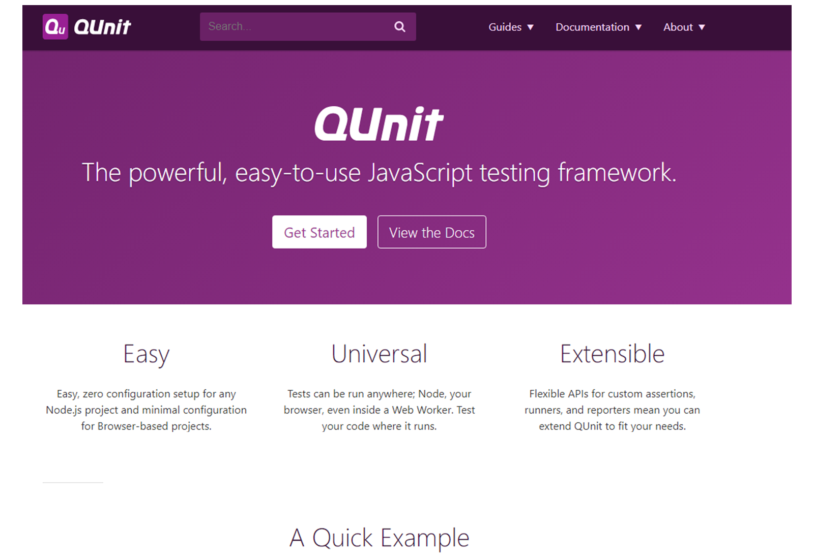
QUnit is a JavaScript unit and integration test framework. It is capable of testing any generic JavaScript code, the framework supports asynchronous tests out-of-the-box. It can be found at the following: <http://api.qunitjs.com/>
## QUnit Test Example
QUnit uses a set of top-level functions to provide semantic meaning in unit tests.
Just like most of the unit test frameworks, it follows an arrange-act-assert pattern, a common test pattern employed during unit testing. Its purpose is to make a clear distinction between the set up for the test, the action that is to be tested, and the evaluation of the results.
Let's take a look at the important constructs.
#### Summary of Important Constructs
| Construct  | Usage  |
| --- | --- |
| module  | module(string) - defines a module.  |
| test  | test(string, function) - defines a test.  |
| ok  | ok(boolean, string) - validates to true or false.  |
| equal  | equal(value1, value2, message) - compares two values, using the double-equal comparator.  |
| deepEqual  | deepEqual(value1, value2, message) - compares two values based on their content, not just their identity.  |
| strictEqual  | strictEqual(value1, value2, message) - strictly compares two values, using the triple-equal comparator.  |
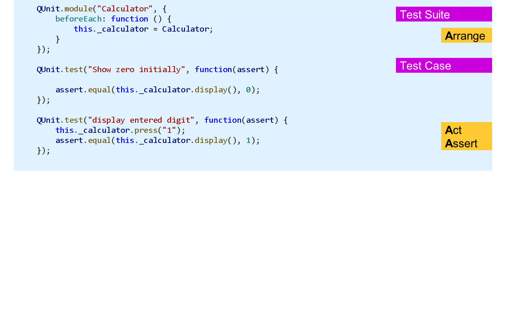
## Test Page
The following figure shows the code for an app that is about to be tested.
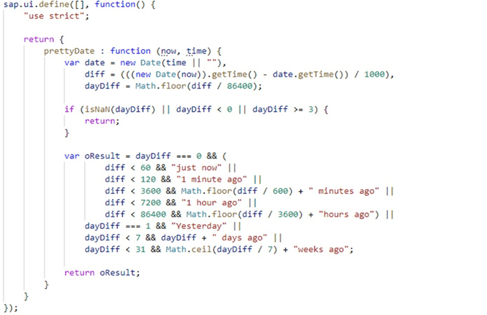
View the following video to learn about the test folder of an SAPUI5 project that is generated by SAP Business Application Studio, the details related to setting it up, and some examples.
Settings
## Configuration of Unit Test Run
When you are using the SAPUI5 project template, which is provided by SAP Business Application Studio, all relevant aspects are generated to start the application under test mode using the unitTests.qunit.html file located in the unit-subfolder. To launch the application under the test start, Preview Application, from the menu in the project explorer of SAP Business Application Studio, or to open the file package.json located in the project, hover over the unit-tests-script and choose start script.
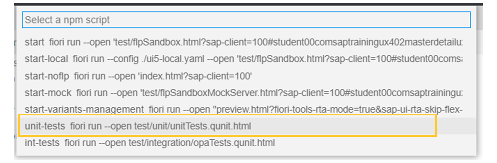
## Results of Unit Test Run
When the unit test is fully complete, a results screen is displayed. The following figure shows the results of the unit test run.
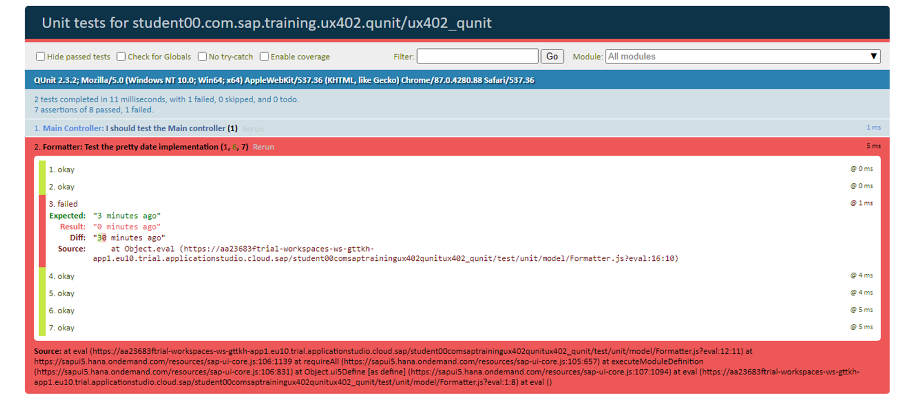
## Write Unit Tests
### Business Example
In this exercise, you will write a unit test for a formatter.
Note
SAP Business Technology Platform and its tools are cloud services. Due to the nature of cloud software, step procedures and naming of fields and buttons may differ from the exercise solution.
### Task 1: Create an SAP Fiori Freestyle Project
#### Steps
  1. Open your SAP Business Application Studio.
  2. Create a new SAP Fiori Freestyle project using the following information:
#### SAP Fiori Freestyle Project Information
| Field  | Value  |
| --- | --- |
| Template Type  | _SAP Fiori Generator_  |
| Template  | _Basic_  |
| Data source  | **None**  |
| View name  | **Main**  |
| Module name  | **qunit**  |
| Application title  | **Unit Tests**  |
| Application namespace  | **student.com.sap.training.advancedsapui5**  |
| Description  | **A Unit-test Application.**  |
| Project folder path  | **/home/user/projects**  |
Leave other fields and radio buttons on default value.
    1. Perform this step as shown in a previous exercise.

### Task 2: Create the Function you will Test
You want to create a function to display dates in a pretty format.
#### Steps
  1. Add a file with the name Formatter.js into the _webapp/model_ folder and implement the Formatter.js file, as shown in the following figure. Then save your work.
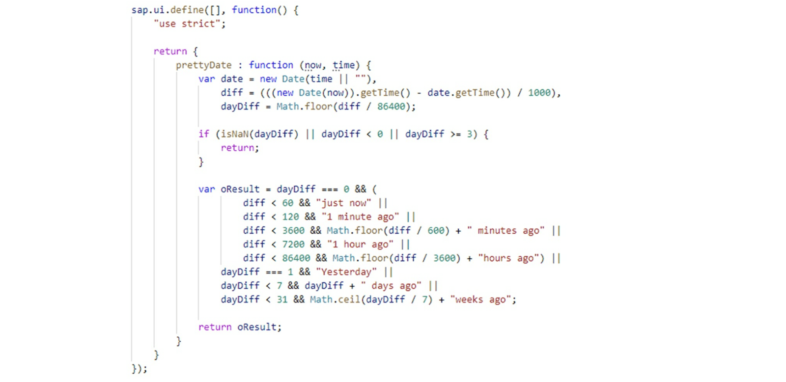
Note
if you prefer, you can upload the Formatter.js file located under _Templates_ folder in the files you got from Github.
    1. Create or upload the Formatter.js file as shown in previous exercises.
    2. Write or Explore the code. You can use the following:
Code Snippet
Copy codeSwitch to dark mode

```

1234567891011121314151617181920212223242526272829

sap.ui.define([], function() {
  "use strict";

  return {
    prettyDate : function (now, time) {
      var date = new Date(time || ""),
      diff = (((new Date(now)).getTime() - date.getTime()) / 1000),
      dayDiff = Math.floor(diff / 86400);

      if (isNaN(dayDiff) || dayDiff < 0 || dayDiff >= 3) {
        return;
      }

      var oResult = dayDiff === 0 && (
        diff < 60 && "just now" ||
        diff < 120 && "1 minute ago" ||
        diff < 3600 && Math.floor(diff / 600) + " minutes ago" ||
        diff < 7200 && "1 hour ago" ||
        diff < 86400 && Math.floor(diff / 3600) + "hours ago") ||
        dayDiff === 1 && "Yesterday" ||
        dayDiff < 7 && dayDiff + " days ago" ||
        dayDiff < 31 && Math.ceil(dayDiff / 7) + "weeks ago";

      return oResult;
    }
  }
});

```

### Task 3: Create the Unit Test
#### Steps
  1. Add a folder with the name **model** to the _webapp/test/unit_ folder.
    1. Perform this step as shown in a previous exercise.
  2. Add a file with the name **Formatter.js** to the _webapp/test/unit/model_ folder.
    1. Perform this step as shown in a previous exercise.
  3. Define a SAPUI5 module and add the dependency to the Formatter that you created in step 6.
    1. Add the following lines of code:
Code Snippet
Copy codeSwitch to dark mode

```

123456

sap.ui.define([
  "student/com/sap/training/advancedsapui5/qunit/model/Formatter"
], function(Formatter) {
  "use strict";
});

```

  4. Add a QUnit module to the newly created SAPUI5 module. Use the QUnit.module function. As the module description, use Formatter and use the beforeEach hook to create a _formatter member variable with reference to the Formatter.
    1. Add the following lines of code after "use strict"; statement:
Code Snippet
Copy codeSwitch to dark mode

```

123456

QUnit.module("Formatter", {
  beforeEach: function () {
    this._formatter = Formatter;
  }
});

```

  5. In the Formatter.js file, which is located in the _webapp/test/unit/model_ folder, define a test case with the QUnit.test function. Use Test the pretty date implementation as the test case description. In the assigned function, create a variable with the name **now**. Assign the value 2008/01/28 22:25:00 to the now variable. Use the equal function of the assertion object to check if the date in the now variable is equal to the expected values in the following table. Print out the mentioned assertion messages.
Hint
You will use the prettyDate function of the Formatter as first argument of the equal function and the listed assertion messages as the second argument of the equal function.
#### Expected Values and Corresponding Assertion Messages
| Expected Value  | Assertion Message  |
| --- | --- |
| 2008/01/28 22:25:00  | just now  |
| 2008/01/28 22:24:00  | 1 minute ago  |
| 2008/01/28 22:22:00  | 3 minute ago  |
| 2008/01/28 21:25:00  | 1 hour ago  |
| 2008/01/27 22:25:00  | Yesterday  |
| 2008/01/26 22:25:00  | 2 days ago  |
| 2007/01/26 22:25:00  | undefined  |
    1. Add the following lines of code after the QUnit.module function call:
Code Snippet
Copy codeSwitch to dark mode

```

12345678910111213

QUnit.test("Test the pretty date implementation", function(assert) {

  var now= "2008/01/28 22:25:00";
  assert.equal(this._formatter.prettyDate(now,"2008/01/28 22:25:00" ), "just now");
  assert.equal(this._formatter.prettyDate(now,"2008/01/28 22:24:00" ), "1 minute ago");
  assert.equal(this._formatter.prettyDate(now,"2008/01/28 22:22:00" ), "3 minutes ago");
  assert.equal(this._formatter.prettyDate(now,"2008/01/28 21:25:00" ), "1 hour ago");
  assert.equal(this._formatter.prettyDate(now,"2008/01/27 22:25:00" ), "Yesterday");
  assert.equal(this._formatter.prettyDate(now,"2008/01/26 22:25:00" ), "2 days ago");
  assert.equal(this._formatter.prettyDate(now,"2007/01/26 22:25:00" ), undefined);

});

```

    2. Save your work. Your Formatter.js file should now look like the following:
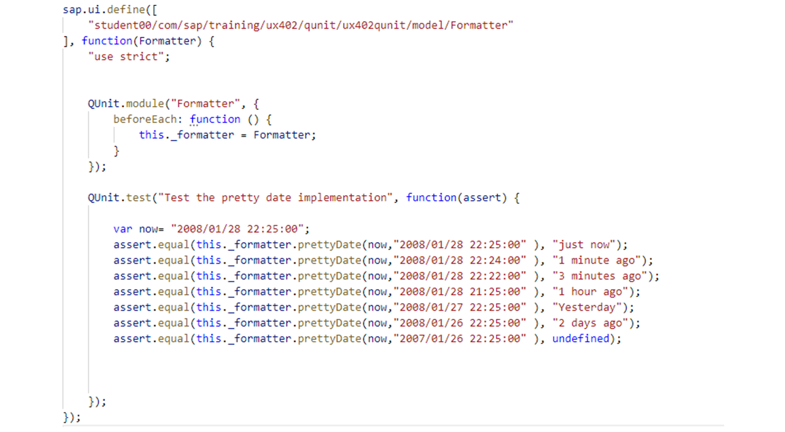

### Task 4: Adjust namespaces
#### Steps
  1. Open the AllTests.js file and replace the given namespace with student/com/sap/training/advancedsapui5/qunit/test/unit/controller/Main.controller and student/com/sap/training/advancedsapui5/qunit/test/unit/model/Formatter.
    1. Open the AllTests.js file located in the _unit_ folder of your project.
    2. Replace the given code with the following lines of code:
Code Snippet
Copy codeSwitch to dark mode

```

12345678

sap.ui.define([
  "student/com/sap/training/advancedsapui5/qunit/test/unit/controller/Main.controller",
  "student/com/sap/training/advancedsapui5/qunit/test/unit/model/Formatter"
], function () {
  "use strict";
});

```

  2. Open the webapp/test/unit/controller/Main.controller.js file and adjust the namespaces. Replace the given namespace with student/com/sap/training/advancedsapui5/qunit/controller/Main.controller.
  3. Open the webapp/test/unit/unitTests.qunit.js file and adjust the actual namespace. Replace the given namespace with student/com/sap/training/advancedsapui5/qunit/test/unit/AllTests.
  4. Open the webapp/test/unit/unitTests.qunit.html file and adjust the resource roots configuration.
    1. Locate the data-sap-ui-resourceroots value allocation (probably at around line 9 – 15). Replace the value allocation with following:"student.com.sap.training.advancedsapui5/qunit": "../../"

### Task 5: Run the Test
#### Steps
  1. Run your unit-tests and check the result.
    1. Open the context menu on your project folder _qunit_.
    2. Select _Preview Application_.
    3. Choose the option _unit-tests fiori run –open text/unit/unitTests.qunit.html_.
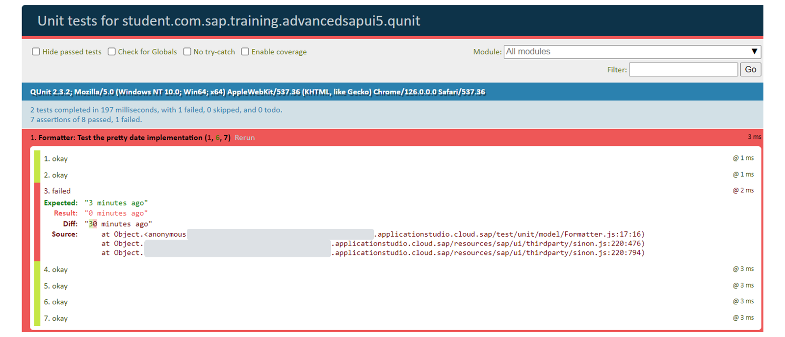


### Performing Integration Tests with One-Page Acceptance (OPA5) Tests

*Source: https://learning.sap.com/courses/advanced-sapui5-development/performing-integration-tests-with-one-page-acceptance-opa5-tests_da92f900-b08f-4ec2-bd3d-5c7184ce6927*

Objective
After completing this lesson, you will be able to perform integration tests with OPA5.
## Integration Tests with OPA5
Watch this short video to learn about OPA5, its advantages, and limitations.
## OPA5 and Bootstrapping
As we have already seen in the QUnit-lesson, the start of the OPA-tests is also implemented using a different html-file. The file is called the opaTests.qunit.html file and contains the bootstrapping code for the execution of OPA-tests. The bootstrapping file is generated by the SAP Business Applicaton Studio during project generation.
Let us now look at bootstrapping, library loading, and test initiation.
Settings
Note
You usually have various tests in a UI5 project. Tests are usually separated by their context - for example, tests like make sure that when a list item is selected, the details of the selected item are shown and tested (when the status of the item has a specific value, a specific icon is shown). These different tests are usually connected to a journey. A journey consists of a series of integration tests that belong to the same context such as navigating through the app. Similar to the QUnit test implementation, OPA5 uses QUnit, that is why we first set up a QUnit module Navigation that will be displayed on our result page. The journey is implemented in the file, NavigationJourney. Of course you may have also files with different names containing a journey implementation.
## OPA5: Anatomy of a Test Case
Each test case scenario is implemented in a different JavaScript file.
The following two figures describe the anatomy of an OPA5 test case.
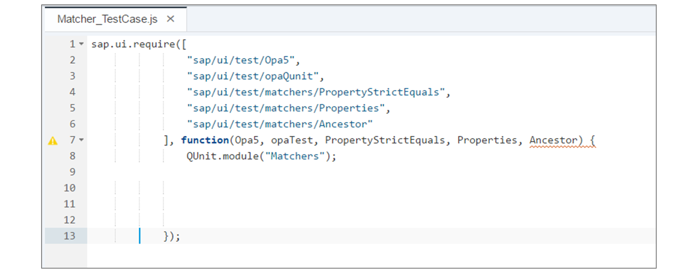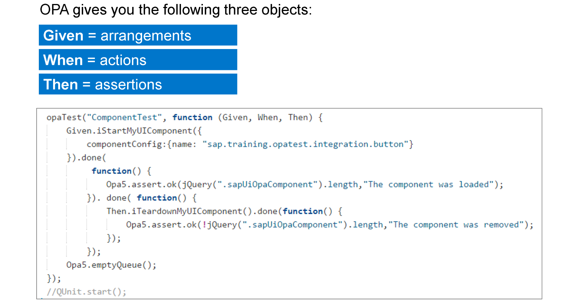
The above figure shows a test implementation. The test case is set to check whether or not the component with the namespace sap.training.optest.integration.button can be loaded or not.
The function opaTest is the main aspect for defining integration tests with OPA. Its parameters define a test name and a callback function that gets executed with the following OPA5 helper objects to write meaningful tests that read like a user story.
  * Given: On the given object, we can call arrangement functions like iStartMyUIComponent to load our app in a separate iFrame for integration testing.
  * When: Contains custom actions that we can execute to get the application into a state that allows us to test the expected behavior.
  * Then: Contains custom assertions that check a specific constellation in the application and the teardown function that removes our iFrame again.

## OPA5 Control Retrieval by ID
The OPA5 framework provides us different possibilities to get a reference to a UI control on the view. One option is to get a reference by the id of the control. The following figure shows the key aspects involved in the retrieval of a control by ID.
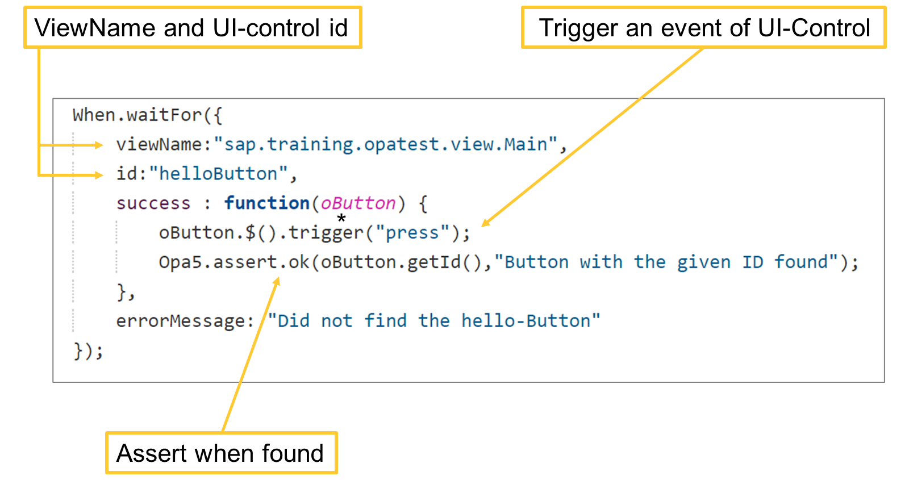
Note
Ensure that each control inside the view implementation has a stable id. Inter alia using stable id's will ensure that your tests will work. To learn more about stable id, refer to the SAPUI5 documentation, <https://ui5.sap.com/#/topic/79e910e6a0d949c7acb051b33170bebc>.
## OPA5 Control Retrieval without ID
Besides the retrieval of a UI control by id, it is also possible to use so called matchers. The following figure shows matchers retrieving a control without an ID but using a matcher. In this case, a sap.ui.test.matchers.PropertyStrictEquals is used. We want to get all controls of type sap.m.Button, where the property text contains the value Press me. You can find more matcher implementations in the namespace sap.ui.test.matchers of the SAPUI5-API-documentation (<https://ui5.sap.com/#/api/sap.ui.test.matchers>).
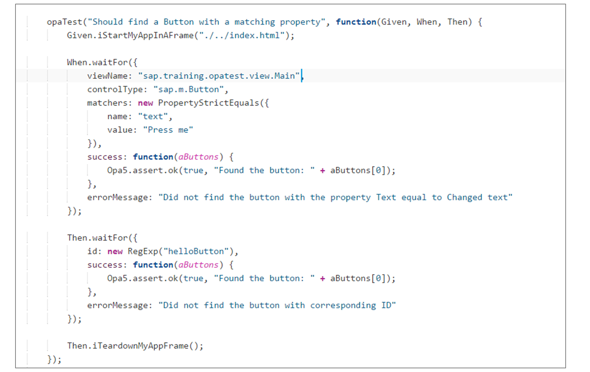
## Write OPA Tests
In this demonstration, you will write OPA tests.
Caution
Please be aware that depending on the environment you use for the demonstration, you might get some errors. This needs to be performed directly on a PC. It might not work in a virtual environment such as the training landscape.
### Steps
  1. Import the opa.tar project into your Business Application Studio.
    1. Locate the CHECKopa.tar file in your training files.
    2. Select the menu _File_ → _Open Folder..._.
    3. Select or Enter the **/home/user/projects/** folder and choose _OK_.
    4. Select the menu _File_ → _Import Project.._.
    5. Select the CHECKopa.tar file and choose _OK_.
  2. Run your application. Choose the _Press me_ button. A dialog appears with the message **Button pressed**.
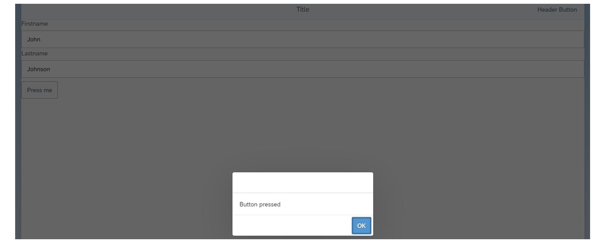
    1. Open the context menu on your project folder (CHECKopa).
    2. Select _Preview Application_.
    3. Choose _start fiori run –open ".."_ on the opened dialog.
    4. If prompt, select _Open_ on the dialog in the bottom right corner.
  3. Implement a test function with the name iShouldFindAButton in the webapp/test/integration/pages/Main.js file and check if the Main-view implemented in the previous task contains a control with the id helloButton.
#### Attribute-value Pairs for this.waitFor
| Attribute  | Value  |
| --- | --- |
| viewName  | **sViewName**  |
| id  | **helloButton**  |
| success  | Callback function with one parameter named **oButton**  |
| errorMessage  | **Did not find the hello­button**  |
| timeout  | **3**  |
    1. Open the webapp/test/integration/pages/Main.js file.
    2. Implement the iShouldFindAButton function after the iShouldSeeThePageView function, using the following code:
Code Snippet
Copy codeSwitch to dark mode

```

123456789101112

iShouldFindAButton: function () {
  return this.waitFor({
    viewName: sViewName,
    id: "helloButton",
    success: function (oButton) {

    },
    errorMessage: "Did not find the hello-Button",
    timeout: "3"
  });
}

```

    3. Implement the success function. Trigger the press event on the passed oButton object and print out an assertion of type ok. Use the following code:
Code Snippet
Copy codeSwitch to dark mode

```

123

oButton.$().trigger("press");
Opa5.assert.ok(oButton.getId(), "Button with the given ID found");

```

    4. Save your work. Your implementation should now look like the following:
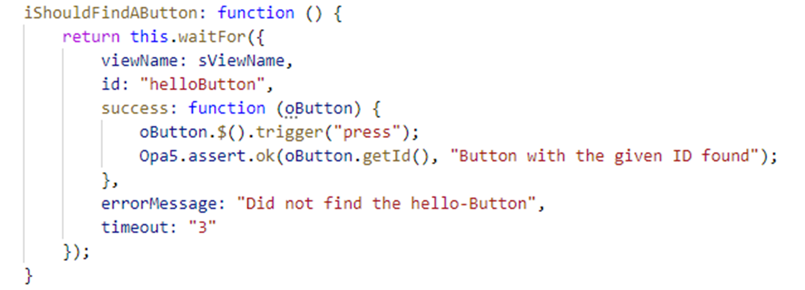
  4. Add the assertion iShouldFindAButton to the webapp/test/integration/NavigationJourney.js file.
    1. Open the NavigationJourney.js file and add theiShouldFindAButton as a new assertion. Add the following code after the iShouldSeeThePageView() assertion:
Code Snippet
Copy codeSwitch to dark mode

```

1

Then.onTheViewPage.iShouldFindAButton();

```

    2. Save your changes. Your code should look like the following:
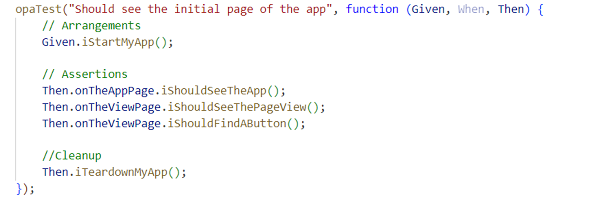
  5. Start your application in _int-tests_ mode. A new browser tab opens and the test case starts. When the test is complete, you can expand the test result to get more details. The results screen should look like the one shown in the following figure.
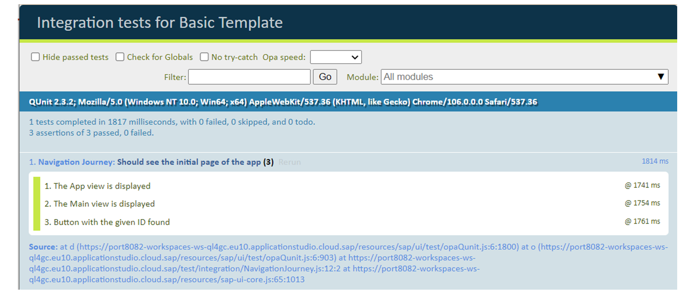
    1. Open the context menu on our project folder (CHECKopa).
    2. Select _Preview Application_.
    3. Choose _int-tests fiori run –open ".."_ on the opened dialog.
    4. If prompted, choose _Open_ on the dialog in the bottom right corner.
    5. A new browser tab opens, and the test case starts. When the test is complete, you can expand the test result to get more details.

[Continue to quiz](https://learning.sap.com/courses/advanced-sapui5-development/ensuring-software-quality-in-ui5)


### Quiz

*Source: https://learning.sap.com/courses/advanced-sapui5-development/ensuring-software-quality-in-ui5*

It's time to put what you've learned to the test, get 3 right to pass this unit.
1.
### Which of the following statements are true with respect to QUnit?
There are three correct answers.
Supports only synchronous testing out of the box.
QUnit is a JavaScript unit and integration test framework.
Supports asynchronous tests out-of-the-box.
Is capable of testing any generic JavaScript code.
2.
### Does QUnit support SAPUI5 view tests?
Choose the correct answer.
Yes, you can implement a test class to test UI aspects of SAPUI5.
No, for UI tests you must use OPA5.
You can use the QUnit-extensions, called Selenium, to test SAPUI5 controls.
3.
### Which of the following statements are true with regard to OPA5?
There are three correct answers.
Can be used for user interaction tests.
Can be used for SAPUI5 integration tests.
Is a view controller test framework.
Provides the possibility to test navigation.
Submit answers[Next unit](https://learning.sap.com/courses/advanced-sapui5-development/working-with-git_de59cb29-ed41-43a4-b17e-cc48e7e6a6d4)


### Version Control - Working in Teams

*Source: https://learning.sap.com/courses/advanced-sapui5-development/working-with-git_de59cb29-ed41-43a4-b17e-cc48e7e6a6d4*

Objective
After completing this lesson, you will be able to use GIT as a version control system for tracking changes in files.
## GIT Version Control System
In software projects, it Is important to track changes on files. A version control system helps you to track these changes. A version control is a system that records changes to a file or set of files over time so that you can recall specific versions. GIT is such a version control system. The SAP Business Application Studio comes with a built in GIT-Client to interact with the GIT-system. The GIT-system may be installed on premise or a cloud service like <http://github.com>. Lets take a look at the features, the states and the workflow:
### Features
  * GIT works like a set of snapshots, with every commit GIT takes a snapshot of the current state of the underlying files. For unchanged files, only a reference to the file is stored.
  * GIT is a free and open source distributed version control system.
  * GIT is designed to handle small to very large projects, It is designed for speed and efficiency.
  * GIT supports local branching and staging.
  * With GIT, most operations require local files and resources only, almost every operation can be done offline.
  * GIT uses checksums based on SHA-1 hashes.

### GIT States
  * **Committed:** The data is safely stored in the local database.
  * **Modified:** Files were changed but not yet committed to the local database.
  * **Changed:** Files were marked as modified in the current version and go into the next commit snapshot.

### GIT Workflow
  * **Working Tree:** Modify files in the working tree.
  * **Staging Area:** Staging Area: Stage the files/add snapshots of files to the staging areas.
  * **GIT Repository:** Perform a Commit. Takes the files from the staging area and stores the snapshot permanently in the local GIT repository.

For more information, visit <https://git-scm.com>
### GIT Procedure
The procedures for getting started with GIT repositories are provided in the following figure.
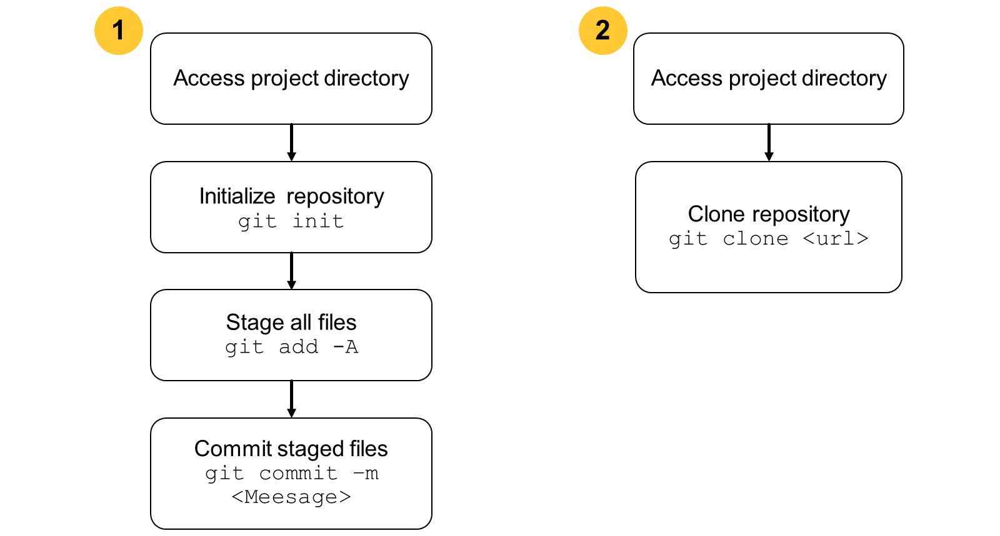
The figure shows you the two options regarding how to start with GIT repositories:
  1. Import an existing directory into GIT.
  2. Clone an existing GIT repository from a server.

Watch this video to learn about GIT Working Directories.
Settings
## Work with a Local GIT Repository
### Business Example
In this exercise, you will learn how to work with a local Git Repository.
Note
SAP BTP Platform and SAP Business Application Studio are cloud services. Due to the nature of cloud software, the naming of fields and buttons, as well as the content of the steps, may differ from the exercise solution provided here.
### Steps
  1. Open your training SAP Business Application Studio.
  2. Create a new SAP Fiori Freestyle project using the following information.
#### SAP Fiori Freestyle Project Information
| Field  | Value  |
| --- | --- |
| Template  | _SAP Fiori application_  |
| Template Type  | **SAP Fiori**  |
| Template  | _Basic_  |
| Data source  | **None**  |
| View name  | **Main**  |
| Module name  | **repository**  |
| Application title  | **Repository-integration**  |
| Application namespace  | **student.com.sap.training.advancedsapui5**  |
| Description  |  **A Fiori Application**.  |
| Project folder path  | **/home/user/projects**  |
Leave other fields and radio buttons as default values.
    1. Perform this step as shown in a previous exercise.
  3. Open the terminal for the _repository_ folder. Initialize the local GIT repository by executing the following command: git init.
    1. Open the terminal for the _repository_ folder by choosing _Open in Integrated Terminal_ in the contextual menu.
    2. Initialize the local GIT repository by executing the given command.
  4. Stage all changes over the Git view for the first commit. The Git view is located on the left side menu in the form of a _branch_ symbol. If you open it, you will see all changes. You can stage all changes by choosing the three dots symbol and in the dropdown menu, _Changes_ → _Stage All Changes_.
    1. From the left side menu of the SAP Business Application Studio, choose the _branch_ symbol _(Source Control_) to open the Git view.
    2. Check the commit section of the Git view (located under the _Message_ input field). The files are marked as untracked (U) and located under _Changes_.
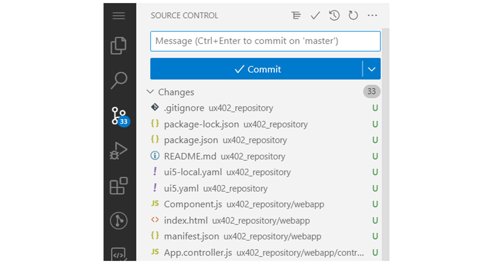
    3. Now stage all changes for the first commit. For the staging, select the three dots symbol (_Views and More actions…_) and choose _Changes_ → _Stage All Changes_.
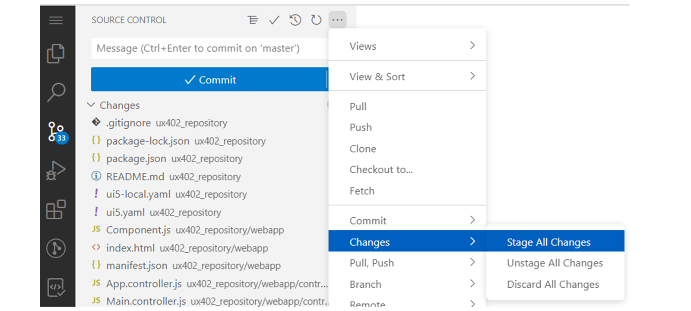
    4. Check the commit section of the Git view. As you can see, the files are now marked as added (A) and located under _Staged Changes_.
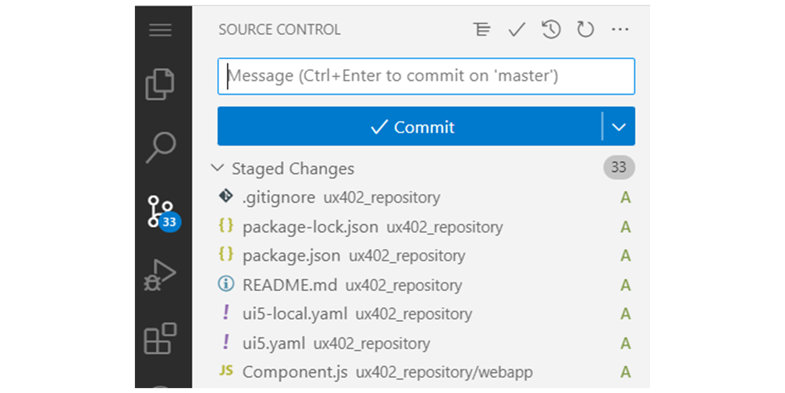
  5. Commit the files that you have staged in your local Git repository. Use the Git view for the commit and _Initial Commit_ as commit message. You can then go back to the _Explorer_ pane.
    1. Commit the files that you have staged in your local Git repository. For the commit, just type in **Initial Commit** into the _Message_ input field of the Git view and select the _Commit_ button or choose the checkmark symbol.
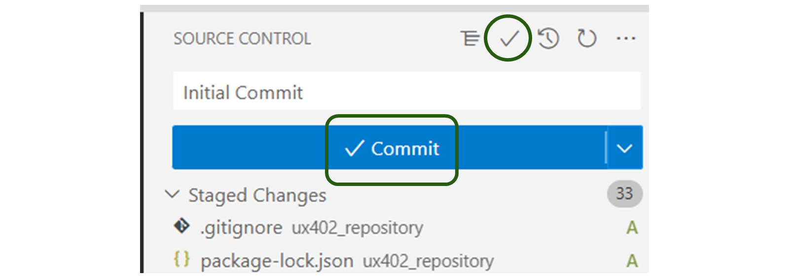
    2. There will be zero changes within the Git view:
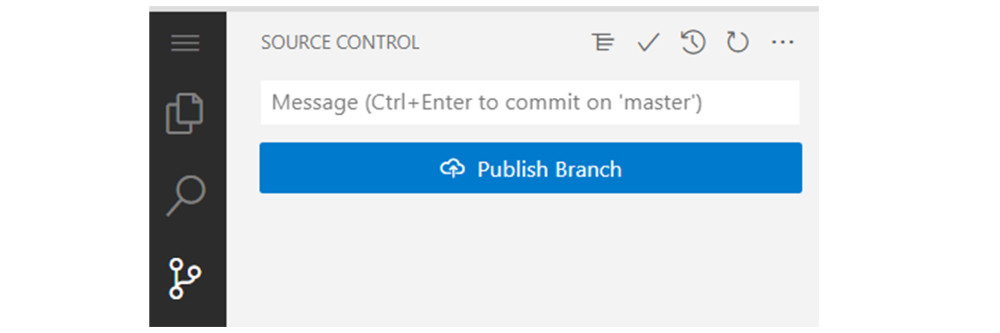
    3. Go back to the _Explorer_ pane.
  6. Add the listed view of type XML in the view folder and the corresponding controller of type JavaScript in the controller folder of your project. To create the files, use _Copy_ and _Paste_ in the context menu of the _Main.view.xml_ and _Main.controller.js_ files. Rename them to the listed view and controller file names. In the created _Detail.view.xml_ file, you need to change part of the controllerName attribute from Main to Detail and remove the displayBlock attribute. Then change the value of the title attribute of the Page element to the string Title. A string is sufficient for this exercise, you do not need to use i18n. In the created _Detail.controller.js_ file, you need to change part of the controller name in the extend function from Main to Detail.
#### View and Controller File Names
| View file name  | Controller file name  |
| --- | --- |
| **Detail.view.xml**  | **Detail.controller.js**  |
    1. Add the _Detail.view.xml_ file in the view folder and the corresponding _Detail.controller.js_ file in the controller folder of your project. Use _Copy_ then _Paste_ in the context menu of the _Main.view.xml_ and _Main.controller.js_ files to create the files. Now, rename them.
    2. In the created _Detail.view.xml_ file, you need to change part of the controllerName attribute from Main to Detail and remove the displayBlock attribute. Then change the value of the title attribute of the Page element to the string Title. A string is sufficient for this exercise, you do not need to use i18n.
Code Snippet
Copy codeSwitch to dark mode

```

12345678910

<mvc:View controllerName="student.com.sap.training.advancedsapui5.repository.controller.Detail"
     xmlns:mvc="sap.ui.core.mvc"
     xmlns="sap.m">
  <Page id="page" title="Title">
    <content />
  </Page>
</mvc:View>

```

    3. In the created _Detail.controller.js_ file, you need to change part of the controller name in the extend function from Main to Detail. The last part of the string should look like the following:
Code Snippet
Copy codeSwitch to dark mode

```

12

repository.controller.Detail", {

```

  7. Stage your changes and commit them with the commit message, _Detail view and controller added_ , and come back to the _Explorer_ pane.
    1. Open the Git view and check the commit section. As you can see, the _Detail.controller.js_ and _Detail.view.xml_ files are marked now as _untracked_ (U) and located under _Changes_.
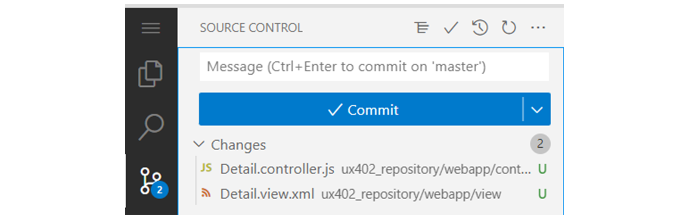
    2. Now, stage all changes. For the staging, select the three dots symbol (_Views and More actions_ …) and then on _Changes_ → _Stage All Changes_. Alternatively, you can stage the files individually by selecting the _+_ symbol (_Stage Changes_) for every file. Now, the files should be marked as added (A) and located under _Staged Changes_.
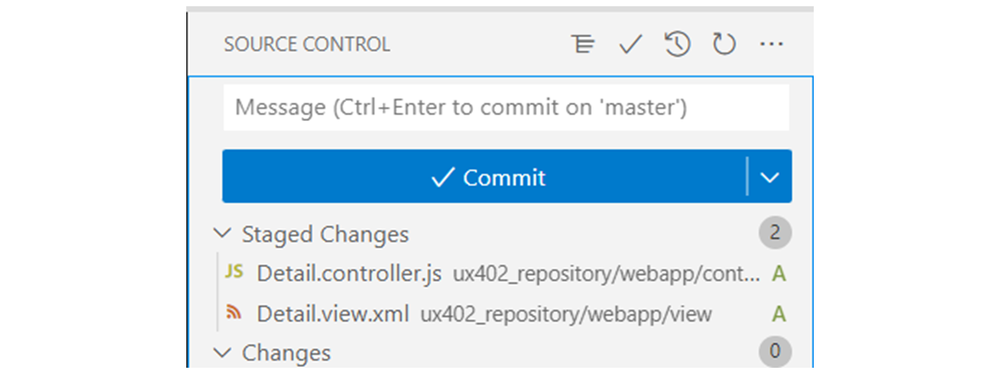
    3. Commit the files that you have staged in your local Git repository. For the commit, just enter **Detail view and controller added** into the _Message_ input field of the Git view and select the _Commit_ button or choose the checkmark symbol. Now, there should be zero changes.
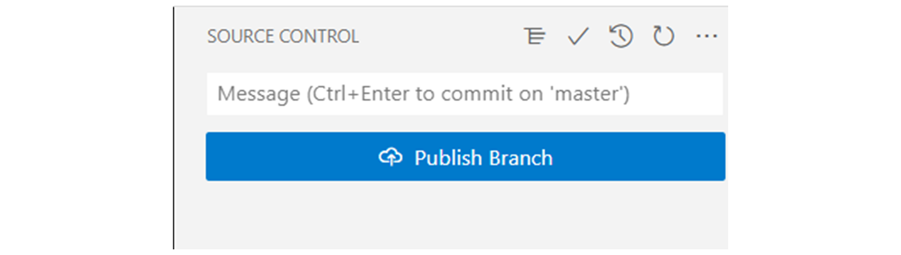
    4. Come back to the _Explorer_ pane.
  8. Open the _Detail.view.xml_ file and assign the value Detail to the title attribute of the Page element. For this exercise, there is no need to use i18n, just assign the value Detail as a string. Then save your changes.
    1. Open the _Detail.view.xml_ file.
    2. Change the value of the title attribute of the Page element to Detail:
Code Snippet
Copy codeSwitch to dark mode

```

123456

<Page id="page" title="Detail">
  <content />
</Page>

```

    3. Save your changes.
  9. Stage your changes and commit them with the Commit message, **Detail view title changed**.
    1. Open the Git view. As you can see, the _Detail.view.xml_ file is now marked as modified (M) and located under _Changes_.
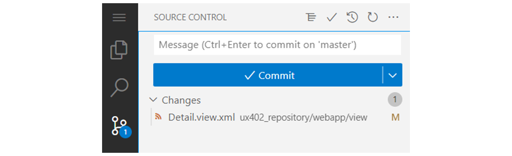
    2. Now, stage the changes. For the staging, you can select the _+_ symbol (_Stage Changes_) for the _Detail.view.xml_ file. When this action is complete, the _Detail.view.xml_ file should still be marked as modified (M) but is now located under _Staged Changes_.
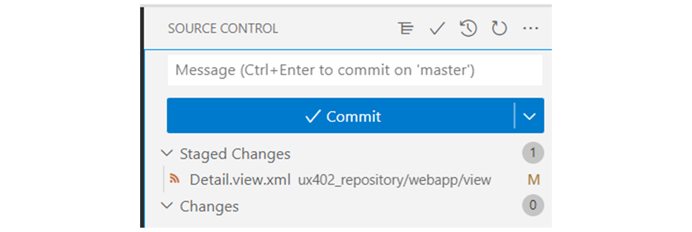
    3. Commit the files that you have staged in your local Git repository. For the commit, enter **Detail view title changed** in the _Message_ input field of the Git view and select the _Commit_ button or select the checkmark symbol. Now, there should be zero changes.
  10. Select the _Git: View history (Git log)_ icon to see the history of commits. You should see all three commits done in this exercise:
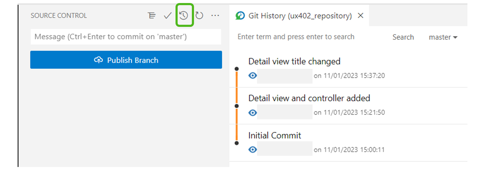

## Work with a Remote Git Repository
### Business Example
In this exercise, you will learn how to create and work with a remote Git repository.
As we have seen in previous exercise, SAP Business Application Studio has a local repository for GIT. However, the recommendation is always to have the work saved in remote repositories. Remote repository can be public or private (also knows as Corporate GIT).
For this exercise, we will focus on using the Public GIT in particular GitHub <https://github.com/>. You can use any other if you already have an account or are familiar with the tool.
Note
SAP BTP Platform and SAP Business Application Studio are cloud services. Due to the nature of cloud software, the naming of fields and buttons, as well as the content of the steps, may differ from the exercise solution provided here.
### Steps
  1. If you do not have a GitHub account, visit <https://github.com/> and create one. Make sure that you are using a valid email address. Furthermore, make sure that you are able to access the email account.
    1. Go to <https://github.com/> and choose _Sign up_.
    2. Follow the account creation process step by step.
  2. Go to <https://github.com/> and log into your account. Then create a new repository with the following information:
#### Repository Information
| Field  | Value  |
| --- | --- |
| Repository name  | trainingrepository  |
| Description  | Repository for training  |
| Repository visibility  | Private  |
    1. In the upper-right corner of any page, use the _plus(+)_ dropdown menu, and select _New repository_.
    2. Enter **trainingrepository** as the _Repository name_.
    3. Enter **Repository for training** as the _Description_.
    4. Choose _Private_ as repository visibility.
    5. Choose _Create repository_.
  3. Create a personal access token with the listed information. After the creation of the personal access token, ensure you copy and save it because you will not be able to see it again and you will need to insert it into a file of the SAP Business Application Studio. You can create the personal access token in the _Developer settings_ of your GitHub account.
#### Personal Access Token Information
| Field  | Value  |
| --- | --- |
| Note  | training  |
| Select scope  | repo, delete_repo and write:discussion  |
    1. Open the personal settings of your account by clicking on your account in the upper right corner, and choose _Settings_ from the dropdown menu.
    2. Choose _Developer settings_.
    3. Choose _Personal access tokens_.
    4. Choose _Tokens (classic)_.
    5. Choose _Generate new token_ → _Generate new token (classic)_.
    6. Enter **training** at _Note_ and select _repo_ , _delete_repo_ and _write:discussion_ at _Select scopes_. Choose _Generate token_.
    7. Make sure to copy and save your new personal access token now because you will not be able to see it again; you will need to insert it into a file of the SAP Business Application Studio.
  4. Open the SAP Business Application Studio.
  5. Open the terminal for the _repository_ folder. Set your email address and username for your Git account by executing the following commands:
     * git config --global user.email "<your github email address >"
     * git config --global user.name "<your github username>"
    1. Open the terminal for the _repository_ folder. Set your email address and username by executing the listed commands.
  6. In order to save the personal access token within the SAP Business Application Studio, create a **.netrc** file within the _/home/user_ folder with the listed information. Only one space is required between the key and the value.
#### Content of the .netrc File
| Key  | Value  |
| --- | --- |
| machine  | github.com  |
| login  | <Your GitHub email address>  |
| password  | <Your personal access token from step 2>  |
    1. Choose _File_ → _Open Folder…_.
    2. Enter **/home/user/** and choose _OK_.
    3. Choose the _New File_ icon.
    4. Enter **.netrc** and press the Enter key (on your keyboard).
    5. Enter the listed key-value pairs. There is no need to use **:** or **=** for the key-value pairs. Only one space is required between the key and the value.
    6. It will look like what we see in the following figure:
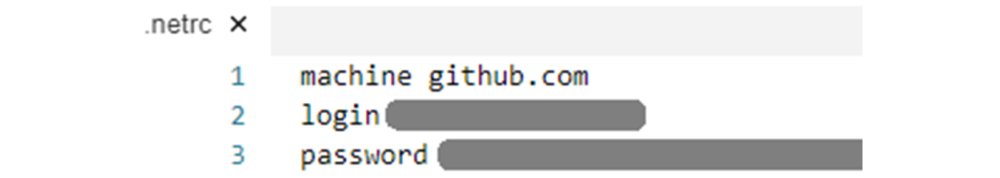
    7. Save your changes.
  7. Open the _repository_ workspace. Open the terminal for the _repository_ folder and assign the new remote Git repository to your project. To assign the new remote Git repository to your project, you can use the following command with the URL of your _trainingrepository_ remote Git repository, which can be found on GitHub: git remote add origin https://<Git-Host-URL>/<full-path-to-repository>
    1. Choose _File_ → _Open Recent …_ to go back to your projects.
    2. From the context menu of the _repository_ folder, choose _Open in Integrated Terminal_.
    3. Within the terminal, execute the following command with the URL of your _trainingrepository_ remote Git repository, which can be found on GitHub: git remote add origin https://<Git-Host-URL>/<full-path-to-repository>
  8. Push the changes from your local Git repository to the remote Git repository. You can use the _Push to…_ action from the Git view.
Note
If a window appears on the bottom right of your screen asking for periodical git Fetch, answer _No_.
    1. Open the Git view.
    2. Choose the three dots symbol (_Views and More Actions…_) and choose _Pull, Push_ → _Push to…_
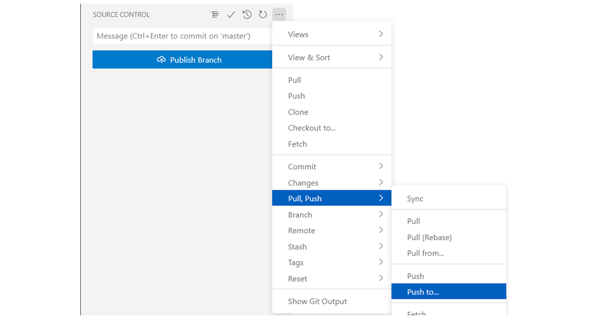
    3. In the input field, choose _origin_.
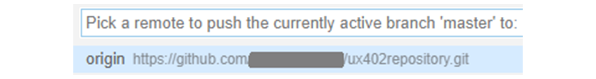
    4. If the following window appears, answer/select _No_.
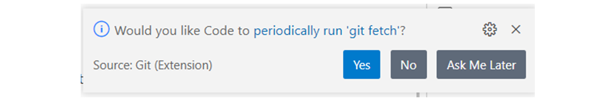
  9. Check the content of your remote Git repository on GitHub.
    1. Go to <https://github.com/> and log into your account.
    2. Open your remote Git repository, _trainingrepository_.
    3. Observe the content of your repository.
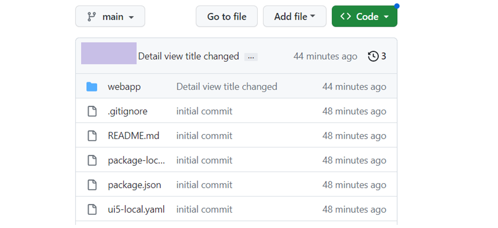
    4. To see the three commits, choose the clock symbol.
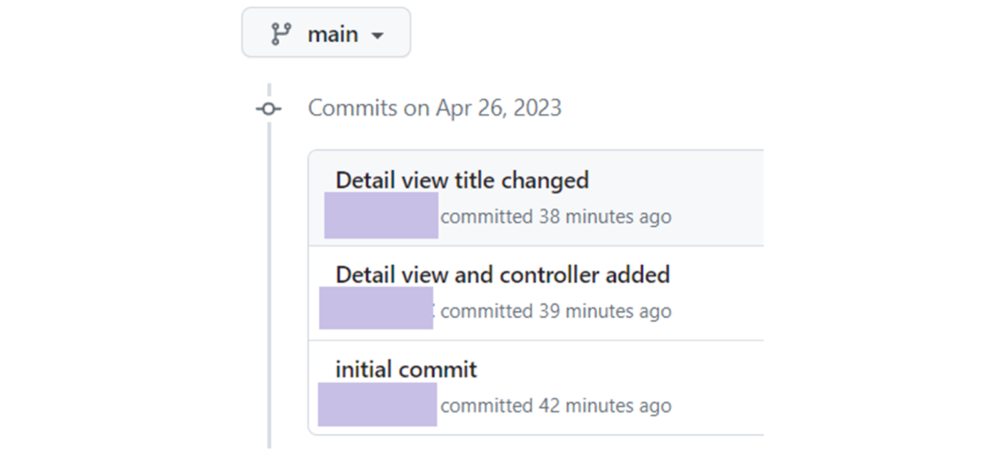


### Working with Branches

*Source: https://learning.sap.com/courses/advanced-sapui5-development/working-with-branches_f65b97a1-6936-44f2-a56b-9aa5ba5076ca*

Objective
After completing this lesson, you will be able to use Git branches for starting an independent line of development.
## Branches in GIT
Git provides a concept called branch. The default branch is called main branch. The main branch contains usually the code of the current productive running code line.
  * serves as an abstraction for the staging and commit process.
  * works with an independent working directory and staging area.
  * is a reference to a commit.

### GIT Usage
  * git branch List all branches in the repository.
  * git branch <branch name> Create a new branch.
  * git branch –d <branch name> Delete a branch.

### Different Branch Types
Different branch types are used to represent different development activities as indicated by the example branches in this image:
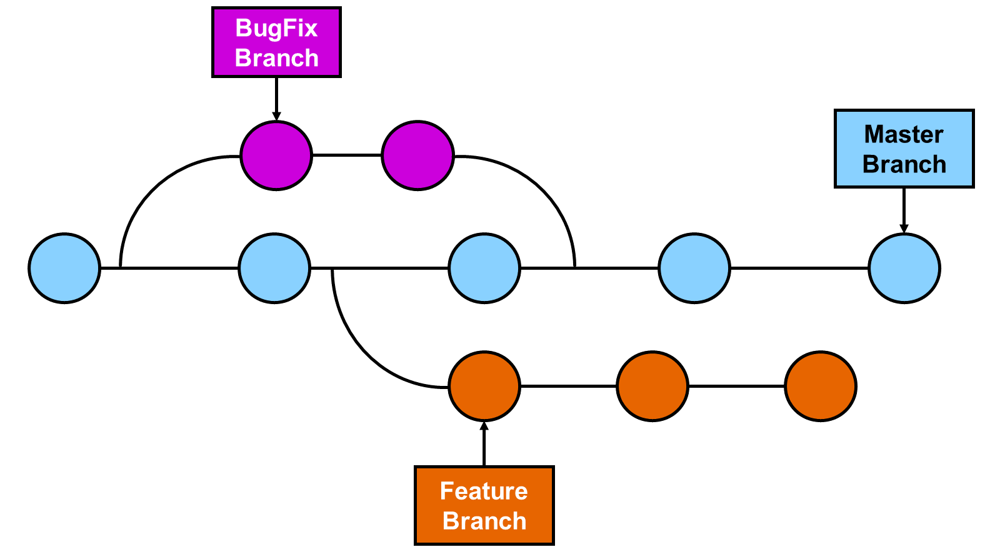
### git Checkout
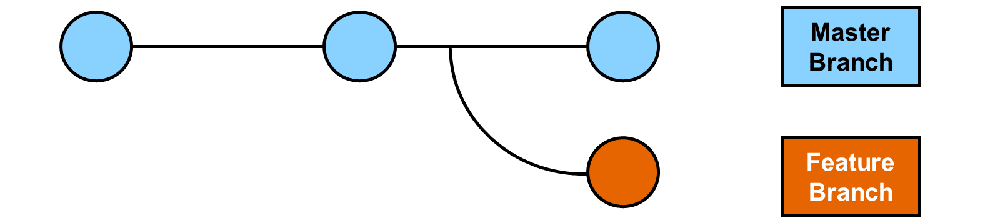
git checkout allows switching between different branches. The following are examples of usage:
  * git checkout <yourbranch> Switch to a branch.
  * git checkout –b <yourbranch> Create and checkout a new branch.
  * git checkout –b <newbranch> <existingbranch> Create and checkout a branch from an existing branch.

### git Merge
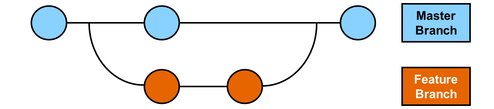
git merge <yourbranch>Merge a branch into the current branch.
## Work with Git Branches
### Business Example
In this exercise, you will learn how to work with branches.
Note
SAP BTP Platform and SAP Business Application Studio are cloud services. Due to the nature of cloud software, the naming of fields and buttons, as well as the content of the steps, may differ from the exercise solution provided here.
### Task 1: Create and Work with a Feature Branch
#### Steps
  1. Open the SAP Business Application Studio.
  2. Create a new branch with the name **featureA**. You can create and check out branches directly through the _Git: Checkout_ command over the command palette of the SAP Business Application Studio.
    1. Open the command palette, by choosing _View_ → _Find Command…_ or by pressing F1 (on your keyboard) and type into the opened input field **Git**. (A dynamic list with the Git commands will appear).
    2. Execute the command _Git: Checkout to..._
    3. Choose _Create new branch…_

    4. Enter **featureA** into the input field and press the Enter key (on your keyboard).

    5. Open the Git view and observe that the new branch is selected now.

  3. Add a new folder with the name **util** to your _epository_ project _webapp_ folder.
    1. From the context menu of your _repository_ project _webapp_ folder, choose _New Folder_.
    2. Enter **util** and press the Enter key (on your keyboard).
  4. Add a new file with the name **Formatter.js** to the newly created folder _util_. Then save your changes and close the file.
    1. From the context menu of your _util_ folder, choose _New File_.
    2. Enter **Formatter.js** and press the Enter key (on your keyboard).
    3. Save your changes and close the file.
    4. Check to ensure that the artefacts are created correctly. Your folder and file structure should now look like what we see in the following figure.
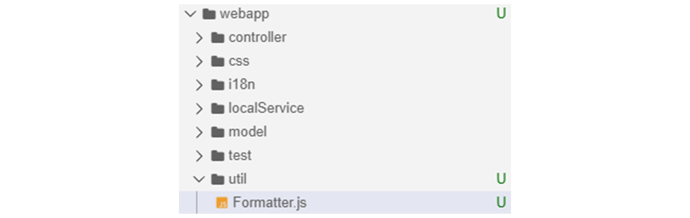
  5. Stage and commit your changes to the local Git repository. Use **Formatter added** as the commit message.
    1. Open the Git view and look at the commit section. As you can see, the _Formatter.js_ file is now marked as _unstaged (U)_ and located under _Changes_.
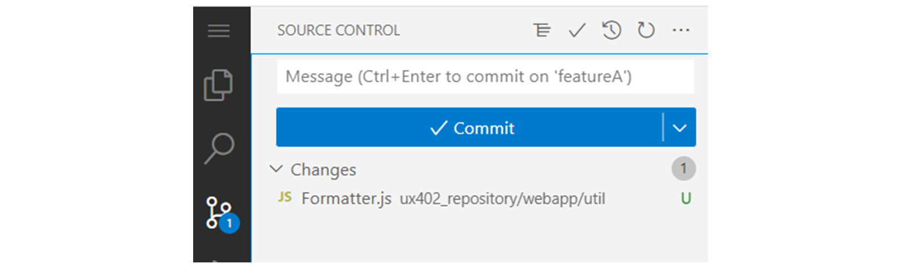
    2. Now, stage all changes. You can stage the Formatter.js file directly by choosing its _+_ symbol (Stage Changes). Now the _Formatter.js_ file should be marked as _staged (A)_ and located under _Staged Changes_.
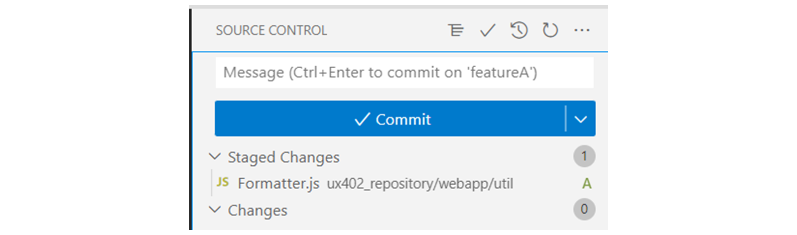
    3. Commit the files that you have staged in your local Git repository. For the commit, enter **Formatter** added in the _Message_ input field of the Git view and select the _Commit_ button or click on the checkmark symbol. Now, there should be zero changes.
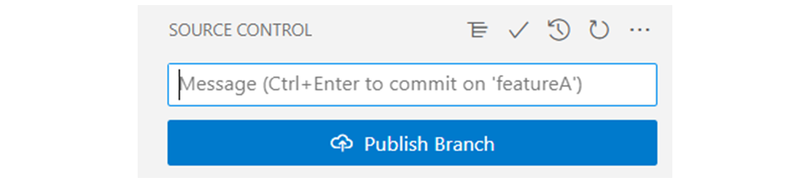
  6. Switch to the _main_ branch by using the _Git: Checkout to_ command. Then merge the _featureA_ branch and the _main_ branch. For the merge, use the _Merge…_ action from the Git view.
    1. Open the command palette, by choosing _View_ → _Find Command…_ or pressing F1 (on your keyboard).
    2. Execute the command, _Git: Checkout to..._
    3. Choose _main_.
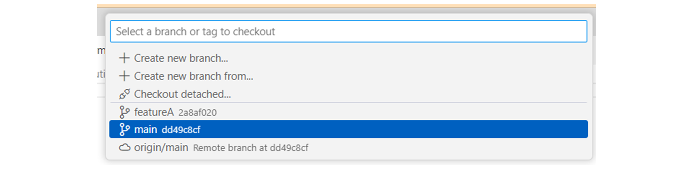
    4. Check the folder structure and the artefacts of your project. As you can see in the main branch, the new _util_ folder and the _Formatter.js_ file are not displayed.

    5. Open the Git view. For the merge, select the three dots symbol (_Views and More actions…_) and choose _Branch_ → _Merge Branch…_
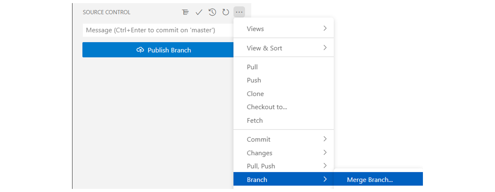
    6. Choose the _featureA_ branch.

    7. Check the artefacts of your project, which should appear as it is shown in the following figure.
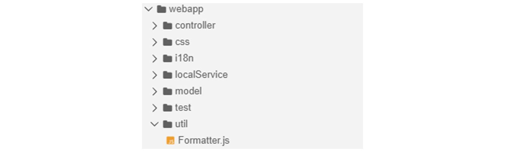
  7. Perform a Push request to add the changes to the master branch of your remote Git repository. Use the _Push to…_ action from the Git view.
Caution
If multiple people are working on a remote Git repository, you should Pull before you Push, but in this case it is not necessary.
    1. Open the Git view.
    2. Choose the three dots symbol (_Views and More Actions…_) and then choose _Pull, Push_ → _Push to…_

    3. In the input field, choose _origin_.

  8. Check the content of your remote Git repository on GitHub.
    1. Visit <https://github.com/> and log into your account.
    2. Open your remote Git repository _trainingrepository_.
    3. Observe the content of your repository.
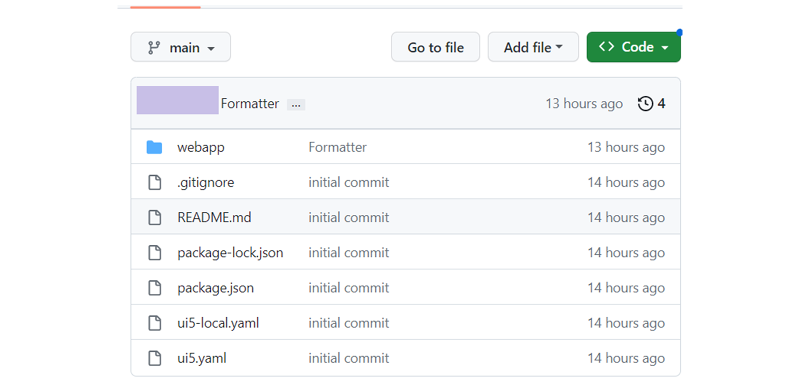
    4. To see the four commits, click on the _clock_ symbol.
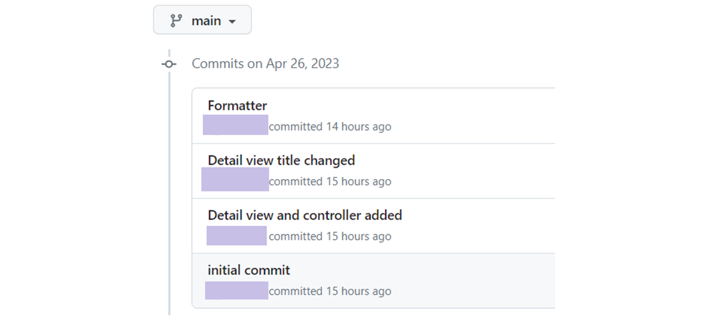

[Continue to quiz](https://learning.sap.com/courses/advanced-sapui5-development/version-control-working-in-teams)


### Quiz

*Source: https://learning.sap.com/courses/advanced-sapui5-development/version-control-working-in-teams*

It's time to put what you've learned to the test, get 4 right to pass this unit.
1.
### Which of the following statements are true about the merge functionality in GIT?
Choose the correct answer.
A merge deletes the content of a branch.
Allows the merging of two local branches into one local branch.
Allows integration of a branch into another branch.
2.
### Which of the following best describes a commit?
Choose the correct answer.
With every commit, GIT create a new branch.
With every commit, GIT takes a snapshot of the current state of the underlying files.
With every commit, a new local repository is created.
A commit in GIT is a local operation.
3.
### In which state are the files in GIT when a remote repository is cloned for the first time?
Choose the correct answer.
Staged and modified
Tracked and unmodified
Tracked and staged
Modified and tracked
4.
### What is a GIT branch?
Choose the correct answer.
A GIT branch represents a local working copy of the main development line.
A GIT branch always represents the main development line.
A GIT branch represents an independent line of development.
A GIT branch is the SAP implementation of GIT.
5.
### Which of the following are the main states of a file in GIT?
There are three correct answers.
Committed
Changed
Released
Modified
Submit answers[Go to Course](https://learning.sap.com/courses/advanced-sapui5-development)
