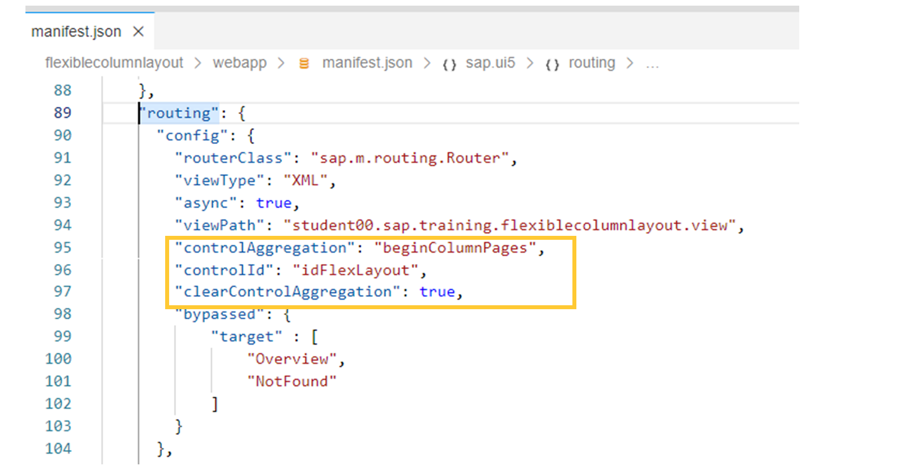
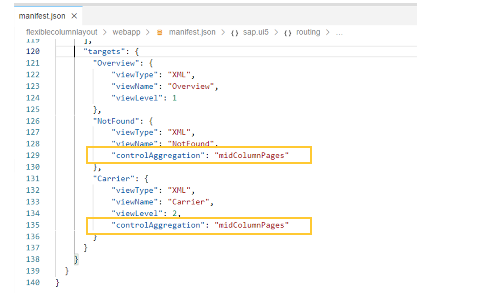

# Adapting Router Configuration for a List-Detail Application

*Source: https://learning.sap.com/courses/advanced-sapui5-development/implementing-router-configuration_ec1ccbd2-4775-41f0-b94f-d43f01060c6c*

Objective
After completing this lesson, you will be able to adapt router configuration for a list-detail application.
## Adapting Router Configuration
When designing routing for a List-Detail application, one important change is the content of the Config section of the routing.
Here are the three important properties that you must change:
  * The _controlId_ must contain the id of the control that is used as a root control for displaying the UI-aspects. In an implementation using the _FlexibleColumnLayout_ control, the _controlId_ property contains the id of the _sap.f.FlexibleColumnLayout_ controls, which is embedded in the _sap.m.App_ control.
  * The _controlAggregation_ attribute must contain the name of the default aggregation of the control defined by the controlId property. The specified aggregation will be filled when a new UI aspect is displayed.
  * The _clearControlAggregation_ attribute has to be set to true, to allow each selection to replace (and not append) the previous one in the mid pane.


Another configuration that might slightly change when using the List-Detail pattern is the targets section.

The _controlAggregation_ at the target level will overwrite the _controlAggregation_ property at the routing config object for this specific target. As you can see in the figure, the value _midColumnPages_ is assigned to the _controlAggregation_ of the _NotFound_ and _Carrier_ target configuration. This means that the views of the targets will be displayed in the _midColumnPages_ aggregation of the _sap.f.FlexibleColumnLayout_ at runtime.
## Adapt router configuration for a List-Detail application
### Business Example
In this exercise, you learn how to adapt the router configuration for a List-detail Application with SAPUI5.
Note
SAP Business Technology Platform and its tools are cloud services. Due to the nature of cloud software, step procedures and naming of fields and buttons may differ from the exercise solution.
### Prerequisites
You need to have completed the previous exercise to implement the root view of the application.
### Steps
  1. Check the routing configuration and modify it so that the following routing configuration parameters are configured correctly.
#### Routing Configuration
| Configuration Parameter  | Values  |
| --- | --- |
| controlAggregation  | **beginColumnPages**  |
| controlId  | **layout**  |
| clearControlAggregation  | **true**  |
| bypassed target  | ["overview","notFound"]  |
    1. Open the manifest.json file.
    2. Locate the routing configuration config.
    3. Make sure that the listed configuration parameters are included.
    4. Your implementation should look like the following:
Code Snippet
Copy codeSwitch to dark mode

```

123456789101112131415161718

 "config": {
        "routerClass": "sap.m.routing.Router",
        "viewType": "XML",
        "async": true,
        "viewPath": "student.com.sap.training.advancedsapui5.listdetail.view",
        "controlAggregation": "beginColumnPages",
        "controlId": "layout",
        "clearControlAggregation": true,
        "transition": "slide",
        "bypassed": {
          "target": [
            "overview",
            "notFound"
          ]
        }
      },

```

  2. Check the overview target and add the following attributes. Additionally, remove the clearControlAggregation configuration parameter.
#### List Target
| Attribute  | Value  |
| --- | --- |
| viewLevel  | **1**  |
| controlAggregation  | **beginColumnPages**  |
    1. Find the overview target and check to ensure that it has all the listed attributes and values.
    2. Remove the clearControlAggregation configuration parameter.
    3. Your implementation should look like the following code:
Code Snippet
Copy codeSwitch to dark mode

```

1234567891011

"overview": {
          "viewType": "XML",
          "transition": "slide",
          "ControlAggregation": "beginColumnPages",
          "viewLevel": 1,
          "viewId": "Carrier",
          "viewName": "Carrier"
        },

```

  3. Find the flights target and add the listed attribute and value.
#### flights Target
| Configuration Parameter  | Value  |
| --- | --- |
| controlAggregation  | **midColumnPages**  |
    1. Find the flights target and check to ensure that it has all the listed attributes and values.
    2. Your implementation should look like the following code:
Code Snippet
Copy codeSwitch to dark mode

```

123456789

 "flights": {
          "viewType": "XML",
          "transition": "slide",
          "viewId": "Flights",
          "viewName": "Flights",
          "viewLevel": 2,
          "controlAggregation": "midColumnPages"
        },

```

  4. Find theflights route and add the overview target to the route.
    1. Find the flights route and add the overview target to it.
    2. Your code should look like the following:
Code Snippet
Copy codeSwitch to dark mode

```

1234567891011

,
 {
          "name": "flights",
          "pattern": "carriers/{carrid}",
          "titleTarget": "",
          "greedy": false,
          "target": [
            "overview",
            "flights"
          ]
        }

```

  5. Find the notfound target and add the listed attribute and value.
#### flights Target
| Configuration Parameter  | Value  |
| --- | --- |
| controlAggregation  | **midColumnPages**  |
    1. Find the notfound target and check to ensure that it has all the listed attributes and values.
    2. Your implementation should look like the following code:
Code Snippet
Copy codeSwitch to dark mode

```

1234567

 "notFound": {
          "viewId": "NotFound",
          "viewName": "NotFound",
          "transition": "show",
          "controlAggregation": "midColumnPages"
        }

```

### Result
The List should still display when you preview the application but you cannot navigate to the details anymore for the moment.
Be aware that since we are not testing the application in a real SAP Fiori environment you will get errors in the console if you use Dev Tools to debug your application. Please, dismiss any message about resource preload.
