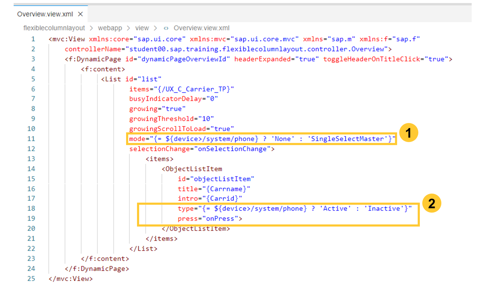
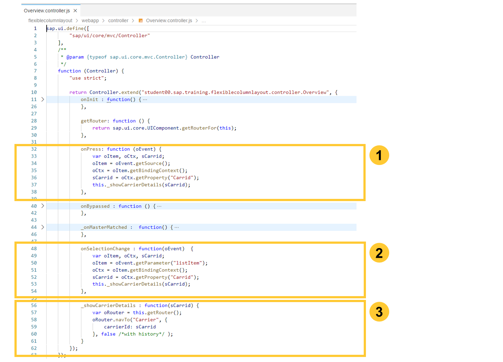
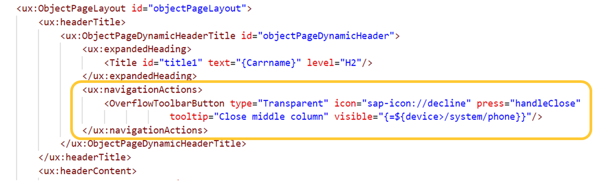
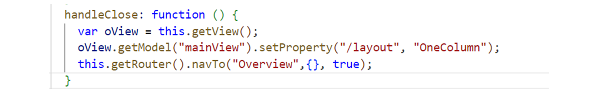

# Implementing Mobile Behavior for the FlexibleColumnLayout Control

*Source: https://learning.sap.com/courses/advanced-sapui5-development/working-with-the-device-api_ef7d4c23-45f2-4582-9378-a3ea76fcf853*

Objective
After completing this lesson, you will be able to implement Mobile Behavior for the FlexibleColumnLayout Control.
## Device Adaptation
### The Device Model
The _sap.f.FlexibleColumnLayout_ control comes with default responsive behavior but, depending on the device, the controls used inside may behave differently when they are used on a desktop or on a mobile.
By introducing a device model, you can bind control properties to the device's capabilities. The SAPUI5 template of SAP Business Application Studio generates the code for setting up a device model for you.
Watch this video to know more about the Device Model.
### Implementing the List View
To use the device model in a view implementation, bind the attribute of the control to the property of the model.

  * The List's **mode (1)** property and the ObjectListItem's **type (2)** property control how items are selectable.
  * On a phone device, the selection should be through the item (list mode "None", list item type "Active"), otherwise it should be through the List itself (list mode "SingleSelectMaster", list item type "Inactive").

The selectionChange event is only fired on a desktop or on a tablet device in the landscape mode. The event handler function will have access to the selected item by the _listItem_ event parameter.
On a phone or tablet in portrait mode, the Press event on the selected list item will be thrown. The event handler function has access to the selected item using the getSource method on the event object provided to the event handler function.
The necessary case distinction can be implemented by means of the device model and the expression binding syntax.
### Implementing the List View Controller
As discussed in a previous unit, each view has its own controller implementation. We provide two event handler functions in the Overview.controller.js implementation to support the two different scenarios based on the device on which the application is executed.

  1. For the **onPress** event handler, the Carrid property is fetched by accessing the source binding context.
  2. For the **onSelectionChange** event handler, you get the binding context from the listitem parameter.
  3. In both cases, you then trigger the navigation to the details view. For this purpose, you get a reference to the router using the getRouter function inherited by the base controller and call the navTo function.

### Managing the FlexibleColumnLayout Behavior on a phone.
In order to use the FlexibleColumnLayout on a phone, where only one column can be displayed at a time, you might need to implement a close feature on the middle column.
For this, you can add a button in the Object Page Header by using the following code:

The handleClose method should set the layout back to OneColumn and navigate to the _Overview_ target.
The code could then look like the following:

## Add mobile behavior to the List-Detail application
### Business Example
In this exercise, you implement changes in your List-Detail application so that it works differently when executed on a desktop, tablet or on a phone device.
Since only one view can be displayed at a time on a phone, you need to apply changes to the synchronization code and offer a close button in the detail view to go back to the list view.
Note
SAP Business Technology Platform and its tools are cloud services. Due to the nature of cloud software, step procedures and naming of fields and buttons may differ from the exercise solution.
### Prerequisites
You need to have completed the previous exercise to implement synchronization.
Note
Otherwise, you can import the 2-listdetail stage1.tar file from the solutions.
### Steps
  1. Add the Device model to the list view controller.
    1. Open the Carrier.controller.js file.
    2. Add the sap/ui/Device reference in the controller definition. Your code should look like the following:
Code Snippet
Copy codeSwitch to dark mode

```

123456

sap.ui.define([
    "student/com/sap/training/advancedsapui5/listdetail/controller/BaseController",
    "sap/ui/Device"
],
    function (Controller, Device) {
        "use strict";

```

  2. Modify the _showDetail method to send true as second parameter of _navigateToCarrierDetails function only if the device is not a phone,
    1. Add a new bReplace variable at the beginning of the _showDetail method, with !Device.system.phone as value.
Code Snippet
Copy codeSwitch to dark mode

```

1

var bReplace = !Device.system.phone;

```

    2. Change the parameter of _navigateToCarrierDetails from true to bReplace.
Code Snippet
Copy codeSwitch to dark mode

```

1

this._navigateToCarrierDetails(sCarrierId,bReplace);

```

  3. Add mobile behavior to the _DynamicPage_ of the List View. Modify the mode property to **'None'** and the list item type property to **'Active'** if on a phone device. Don't forget to map the press event to the onSelect method.
    1. Open the Carrier.view.xml file.
    2. Modify the mode property as follows:
Code Snippet
Copy codeSwitch to dark mode

```

1

 mode="{= ${device>/system/phone} ? 'None' : 'SingleSelectMaster'}"

```

    3. Modify the list item type property as follows:
Code Snippet
Copy codeSwitch to dark mode

```

1

type="{= ${device>/system/phone} ? 'Active' : 'Inactive'}"

```

    4. Add the following after the type property to map the item press user action to the onSelect method :
Code Snippet
Copy codeSwitch to dark mode

```

1

press="onSelect"

```

  4. Make sure that on opening, the list will display, by preventing the display of the first element. Use the Mode property of the List to check which device is used.
    1. Open the Carrier.controller.js file.
    2. Modify the _onListMatched function as follows:
Code Snippet
Copy codeSwitch to dark mode

```

12345678910111213

 _onListMatched: function() {
                this.getListSelector().oWhenListLoadingIsDone.then(
                  function(mParams) {

                    if (mParams.list.getMode() === "None") {
                      return;
                    }

                    var sObjectId = mParams.oFirstListItem.getBindingContext().getProperty("Carrid");
                    this._navigateToCarrierDetails(sObjectId,true);
                  }.bind(this)
                );
            }

```

  5. Add a Close button to your Detail view for phone display.
    1. Open the Flights.view.xml file.
    2. Add the following code inside the _ObjectPageDynamicHeaderTitle_ aggregation of the Flight view, after the _expandedHeading_ aggregation :
Code Snippet
Copy codeSwitch to dark mode

```

1234

<ux:navigationActions>
	<OverflowToolbarButton type="Transparent" icon="sap-icon://decline" press="handleClose"
                                tooltip="Close middle column" visible="{=${device>/system/phone}}"/>
</ux:navigationActions>

```

    3. Open the Flights.controller.js file.
    4. Add the handleClose event to the Flights view controller, with the following code:
Code Snippet
Copy codeSwitch to dark mode

```

12345

 handleClose: function () {
        var oView = this.getView();
        oView.getModel("mainView").setProperty("/layout", "OneColumn");
        this.getRouter().navTo("Overview",{}, true);
      }

```

  6. Test your application with the Chrome Dev Tools to check behavior when emulating a phone display.
Note
Once in the Dev Tools, be sure to change the URL back to the overview route and refresh your browser (maybe several times) to apply the display changes.

[Continue to quiz](https://learning.sap.com/courses/advanced-sapui5-development/implementing-list-detail-application)
