# Developing an SAP Fiori Elements App Based on a CAP OData V4 Service

*Source: https://learning.sap.com/courses/developing-an-sap-fiori-elements-app-based-on-a-cap-odata-v4-service*

## Contents

- **Developing an SAP Fiori Elements App Based on a CAP OData V4 Service**
  - Start learning
  - Getting Started with SAP Fiori Elements: Understanding OData and Annotations
  - Outlining the Benefits of SAP Fiori Elements for OData V4
  - Using the SAP Cloud Application Programming Model (CAP)
  - Getting Started
  - Quiz
  - Getting an Overview of SAP Fiori Tools
  - Creating a Second App Using the Application Generator
  - Quiz
  - Understanding SAP Fiori Elements Templates
  - Examining List Report and Object Page Features
  - Taking a Closer Look at the Apps Used in the Training
  - Quiz
  - Configuring the General Features of List Reports and Object Pages
  - Adjusting the Standard SAP Fiori Elements UI Texts
  - Quiz
  - Configuring the List Report Filter Bar
  - Hiding the Filter Bar
  - Quiz
  - Examining Actions Available on the List Report
  - Creating App-Specific Actions
  - Quiz
  - Configuring the Content of Table Columns
  - Configuring Micro Charts to Visualize Key Figures
  - Configuring Contact Quick Views in a Table
  - Quiz
  - Using Multiple Views in the List Report
  - Creating Multiple Views Using Multiple Table Mode
  - Quiz
  - Shaping the Header Area of the Object Page
  - Enriching the Object Page Header with Micro Charts
  - Using the Singleton Entity
  - Quiz
  - Configuring the Body of the Object Page
  - Enriching Value Help with Dependent Filtering
  - Suppressing Optional Information on Demand
  - Configuring Side Effects
  - Quiz
  - Applying Dynamic Field Control and Validating User Input on the Object Page
  - Verifying the User Input
  - Quiz
  - Discovering the Flexibility of the Programming Model for SAP Fiori Elements for OData V4
  - Using Extension Points
  - Using Building Blocks
  - Using Controller Extensions
  - Adding a Custom Micro Chart
  - Using the Flexibility of the Programming Model for Freestyle SAPUI5 Apps
  - Quiz
  - Illustrating the Navigation Concept in SAP Fiori Elements for OData V4
  - Configuring External Navigation
  - Quiz
  - Discovering the Analytical List Page
  - Adding a Chart to the List Report
  - Creating Visual Filters
  - Quiz
  - German
  - Spanish
  - French
  - Japanese
  - Korean
  - Portuguese
  - Chinese


---

## Developing an SAP Fiori Elements App Based on a CAP OData V4 Service

### Start learning

*Source: https://learning.sap.com/courses/developing-an-sap-fiori-elements-app-based-on-a-cap-odata-v4-service/using-sap-fiori-elements-get-to-know-the-benefits_d488aac7-06c1-4867-9a8b-817436004f92*

Objective
After completing this lesson, you will be able to explain the benefits of using SAP Fiori elements.
## Benefits of SAP Fiori Elements
Development Efficiency
  * Developers can focus on business logic and back-end services
  * Write less JavaScript UI code
  * Less development and maintenance costs
  * Extend selectively with freestyle SAPUI5 when you need custom features, while keeping the benefits of an annotation-driven UI

Enterprise Readiness
  * Deliver high-quality SAP Fiori applications for end users
  * Produce enterprise-ready SAPUI5 applications (accessibility support, internationalization, multi-device support, translation support, storing and restoring of application state, UI performance, security, and more)
  * Create applications that are consistent and enterprise-ready yet still tailored to unique requirements.
  * Benefit from continuous input from partners, customers, and SAP product teams to keep the most relevant design options available at runtime.

UX Consistency
  * Predefined floorplans that suit most business scenarios
  * Complies with the latest SAP Fiori design specifications for SAPUI5-based web apps
  * Includes a uniform layout, navigation, filtering, search, message handling, and more, across your SAP Fiori elements apps

Rich Tool Support
  * SAP Fiori tools assists you with the configuration of your SAP Fiori elements app.
  * SAP Fiori tools are available as extensions in the app development environment such as Visual Studio Code or SAP Business Application Studio.

### Further Reading
  * [SAP Fiori Elements](https://experience.sap.com/fiori-design-web/smart-templates/#:~:text=SAP%20Fiori%20elements%20is%20a,latest%20SAP%20Fiori%20design%20guidelines)
  * [When to use Fiori elements to reduce development time and costs](https://blogs.sap.com/2019/08/08/when-to-use-fiori-elements-to-reduce-development-time-and-costs/)
  * [Developing Apps with SAP Fiori Elements](https://sapui5.hana.ondemand.com/sdk/#/topic/03265b0408e2432c9571d6b3feb6b1fd)


### Getting Started with SAP Fiori Elements: Understanding OData and Annotations

*Source: https://learning.sap.com/courses/developing-an-sap-fiori-elements-app-based-on-a-cap-odata-v4-service/getting-started-with-sap-fiori-elements-understanding-odata-and-annotations_e936f375-fc74-4ed6-9820-11d3020f424c*

Objective
After completing this lesson, you will be able to explain why SAP Fiori elements uses OData protocol and annotations.
## OData and Annotations
SAP uses OData as a standard remote protocol for new client applications, especially for web browser-based UIs and native mobile apps, to access structured data from the database. The highly efficient OData services provide effective access to the exact data requested by the application.
OData is a standard protocol for creating and consuming data. The OData protocol sits on top of HTTP and defines how apps exchange data with the back end.
Watch the following video to learn more about the OData protocol and how to use it to query and manipulate data.
The OData URL has three significant parts:
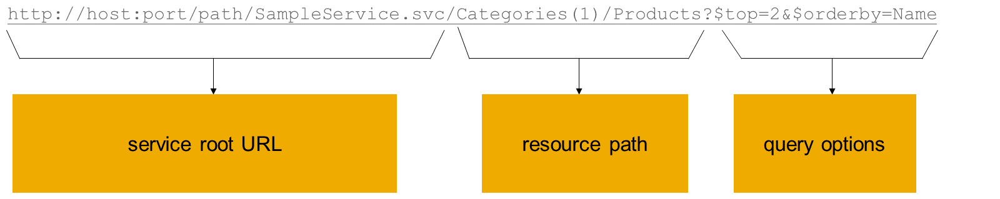
Watch the following video to learn about the SAP Fiori elements architecture:
Settings
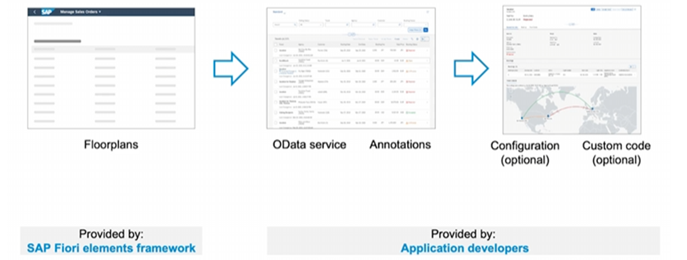
### Summary
In this lesson, you have familiarized yourself with the OData protocol and annotations. You have also learned about the SAP Fiori elements architecture. You have seen that SAP Fiori elements generates apps using a specific floorplan, service metadata, and annotations at runtime.
Thus, you can develop an app with less or no JavaScript UI code. If your app needs a feature to suit a specific business scenario, you can also use additional configuration to customize your app.
### Further Reading
[Developing Apps with SAP Fiori Elements](https://sapui5.hana.ondemand.com/sdk/#/topic/03265b0408e2432c9571d6b3feb6b1fd)


### Outlining the Benefits of SAP Fiori Elements for OData V4

*Source: https://learning.sap.com/courses/developing-an-sap-fiori-elements-app-based-on-a-cap-odata-v4-service/outlining-the-benefits-of-sap-fiori-elements-for-odata-v4_a019eb1a-0749-4ce6-bb32-536821baec74*

Objective
After completing this lesson, you will be able to identify the advantages of OData V4 and SAP Fiori elements for OData V4.
## The Benefits of OData V4
OData V4 is standardized by OASIS and approved as an ISO/IEC International Standard. With OData V4, you can experience improved efficiency of the business applications. It lets you leverage the new analytical capabilities to perform complex tasks with less programming. As a result, you can reduce the amount of data transferred and the number of calls required because some calls can be combined.
OData V4 has multiple benefits over OData V2. Some of them are:
  * Better metadata compression, thus saving 10% to 60% of the data volume.
  * More sophisticated queries, sorting and filter mechanisms, and multi-level expands are supported, thus reducing the number of calls and data volume being transferred.
  * Addition of advanced analytical capabilities to the set of possible queries.
  * Ability of the client to access multiple services at the same time.
  * Improved data types that suit the needs of business applications.

## Comparison Between SAP Fiori Elements for OData V4 and SAP Fiori Elements for OData V2
The SAP Fiori elements framework supports both OData V4 and OData V2. SAP recommends using SAP Fiori elements floorplans for OData V4 if your system landscape allows it.
As of SAPUI5 1.84, the libraries of SAP Fiori elements floorplans for OData V4 are generally available for all customers and partners.
The floorplans of SAP Fiori elements for OData V4 have the same look and feel as those of OData V2, thus ensuring UX consistency. As a result, end users will not perceive any visual differences between apps built on SAP Fiori elements floorplans for OData V4 or V2.
Additionally, with OData V4, SAP Fiori elements introduces more flexibility in its programming model, enabling application developers to extend the standard floorplans in a UX-consistent and development-efficient way. Each standard floorplan is composed of building blocks—such as tables, filter bars, and forms. These building blocks are used behind the scenes when you build SAP Fiori elements apps with standard floorplans for recurring layouts, and you can also use the same building blocks to create custom layouts. In both cases, you can further extend the app with freestyle SAPUI5 to meet unique requirements and add custom features.
### Further Reading
  * [What’s New in OData Version 4.01](https://docs.oasis-open.org/odata/new-in-odata/v4.01/new-in-odata-v4.01.html)
  * [SAP Fiori Elements Now Supports OData V4](https://blogs.sap.com/2020/11/27/sap-fiori-elements-now-support-odata-v4/)


### Using the SAP Cloud Application Programming Model (CAP)

*Source: https://learning.sap.com/courses/developing-an-sap-fiori-elements-app-based-on-a-cap-odata-v4-service/using-the-sap-cloud-application-programming-model-cap-_ae6a9177-5c6f-44dd-9a55-05c2cd574412*

Objective
After completing this lesson, you will be able to explain the use of the SAP Cloud Application Programming Model.
## The SAP Cloud Application Programming Model
To create an SAP Fiori elements app, you first have to create an OData service. It can be based on an existing data model, or you can create a new data model. Then, you will need to add the corresponding annotations to it. When you're done, you can generate your app using the App Generator provided by SAP Fiori tools.
As cloud development becomes increasingly relevant, app developers are looking for the best way to develop cloud applications. Now they can build cloud-based business applications within the SAP ecosystem.
The SAP Cloud Application Programming Model (CAP) helps you along the way. It is a framework of languages, libraries, and tools, combining both open source and SAP technologies.
With CAP, you can quickly and efficiently build enterprise services and applications in a full-stack development approach. There are two CAP runtimes you can choose from: Node.js and Java.
We will use CAP throughout this e-learning course.
Note
For the ABAP environment, you can use the ABAP RESTful Application Programming Model. For more information, see [ABAP RESTful Application Programming Model](https://help.sap.com/docs/btp/sap-business-technology-platform/abap-restful-application-programming-model).
### Next Steps
For more information, see
  * [The CAP Cookbook](https://cap.cloud.sap/docs/guides/)
  * [Introducing the Cloud Application Programming Model (CAP)](https://blogs.sap.com/2018/06/05/introducing-the-new-application-programming-model-for-sap-cloud-platform/)


### Getting Started

*Source: https://learning.sap.com/courses/developing-an-sap-fiori-elements-app-based-on-a-cap-odata-v4-service/getting-started_e9e6df20-b8a7-4af8-bd47-6d50c7c4a6ee*

Objective
After completing this lesson, you will be able to get a free account on SAP BTP, create a dev space for business applications. and clone the initial CAP project to your workspace.
## Create a Free Trial Account on SAP BTP
SAP Business Technology Platform (SAP BTP) is a technology platform that brings together data and analytics, artificial intelligence, application development, automation and integration. In this lesson, you will create a free trial account on SAP BTP and set up SAP Business Application Studio for development of SAP Fiori elements projects with CAP. You will not use any other tools from SAP BTP in this course.
### Prerequisites
You must complete the steps below before continuing with the rest of the course.
### Steps
  1. Create your free trial account on SAP BTP by following the steps described in this tutorial: [Get a Free Account on SAP BTP Trial](https://developers.sap.com/tutorials/hcp-create-trial-account.html).
The SAP BTP Trial offering contains many of the most important services and tools for development on the platform.
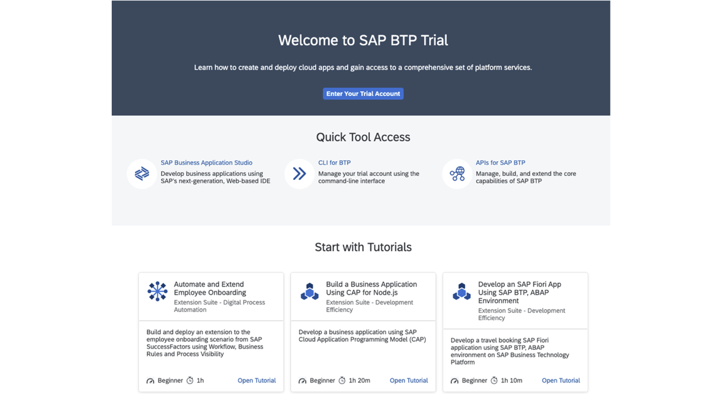

## Application Development Environment
In this training you will use SAP Business Application Studio as a development environment. SAP Business Application Studio is the integrated development environment (IDE) included with SAP Build Code. As an alternative you can use Visual Studio Code (VS Code).
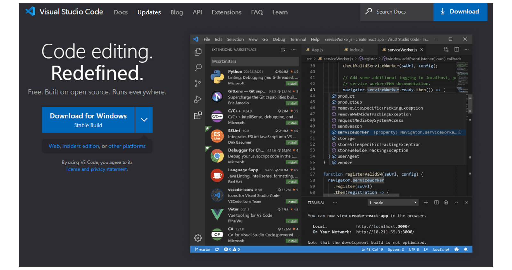
You can download it from <https://code.visualstudio.com/>.
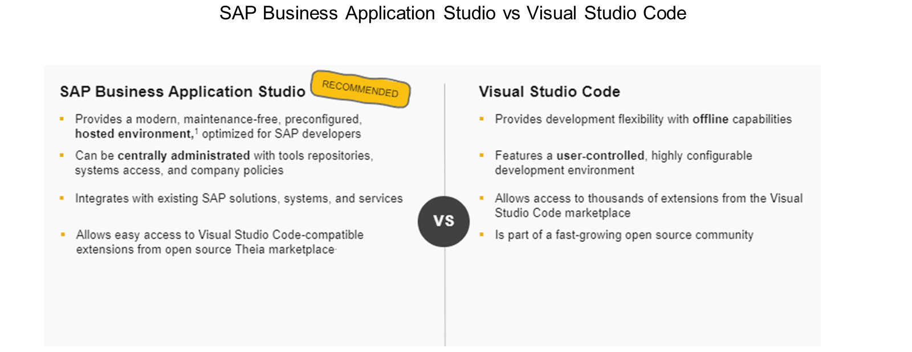
## Set Up SAP Business Application Studio for Development and Create a Development Space
You need to set up SAP Business Application Studio before continuing with the other lessons.
### Prerequisites
You have completed the exercise Create a Free Trial Account on SAP BTP in the unit Getting an Overview of SAP Fiori Elements for OData V4 (lesson: Getting Started).
### Steps
  1. Set up SAP Business Application Studio for development by following the steps in this tutorial: [Set Up SAP Business Application Studio for Development](https://developers.sap.com/tutorials/appstudio-onboarding.html).
  2. Create a development space in SAP Business Application Studio for developing business applications. Follow the steps in this tutorial: [Create a Dev Space for Business Applications](https://developers.sap.com/tutorials/appstudio-devspace-create.html).
Note
Make sure you choose Full Stack Cloud Application as the application type.

## Clone the Initial Application Project, Set Up and Run the Application in SAP Business Application Studio
GitHub is a popular cloud-based Git repository for software projects. The exercise files for this course, along with their solutions, are stored on GitHub. For more information, see [GitHub](https://github.com/). To work on the exercises in SAP Business Application Studio, you need to clone the project first.
### Task Flow
You will first clone the initial project from the GitHub repository to your SAP Business Application Studio instance. Then, you will perform the initial set up so you can run the app in SAP Business Application Studio.
### Prerequisites
You have completed the exercises Set Up SAP Business Application Studio for Development and Create a Development Space in the unit Getting an Overview of SAP Fiori Elements for OData V4 (lesson: Getting Started).
### Steps
  1. After your dev space is up and running, navigate to it by clicking on its name. SAP Business Application Studio opens.
  2. Clone the initial application project from [fiori-elements-v4-cap-advanced](https://github.com/SAP-samples/fiori-elements-v4-cap-advanced.git).
    1. In SAP Business Application Studio, open the command palette using **Ctrl** + **Shift** + **P** (Windows/Linux) or **Command** + **Shift** + **P** (Mac). In the popover, choose **SAP Business Application Studio: Git Clone**.
    2. Enter the GitHub URL: <https://github.com/SAP-samples/fiori-elements-v4-cap-advanced.git>.
  3. Select _/home/user/projects/_ as the folder to clone the project into.
  4. Open the cloned project from _File > Open folder_ and select _projects_.
  5. Switch to the initial-app-state branch.
    1. Open the terminal by selecting _Open in Terminal_ from the context menu of the cloned project name.
    2. Execute the command git checkout initial-app-state in the terminal.
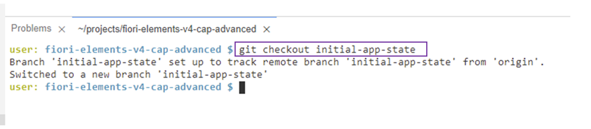
Note
Alternatively, you can follow these steps to switch to the initial-app-state branch:
      1. Select _main_ from the bottom bar.
      2. In the middle of the screen, a dialog will appear titled _Select a branch or tag to checkout_.
      3. Start typing the branch name until it is displayed.
      4. Select the branch.
      5. A popup will then appear with the message _Your local changes will be overwritten by checkout_.
      6. Select the _Stash and Checkout_ option.
  6. Execute npm install in the terminal.

#### Result
This will install all the dependencies of your project that are listed in the package.json and package-lock.json file, into a new folder called node_modules within the root of your project. Ignore any messages about deprecated dependencies, as long as there are no errors in the log.
  7. In the terminal, start a CAP server by typing cds watch.
The CAP server serves all the CAP sources from your project. It also keeps track of all the files in your projects and restarts the server whenever you make a change in your project. Your changes will immediately be served; you don't have to do anything else.
  8. Open the app in the browser by clicking _Open in a New Tab_ in the popup window in the bottom right corner.
  9. In the page that opens, select /travel_processor/webapp/index.html under _Web Applications_.
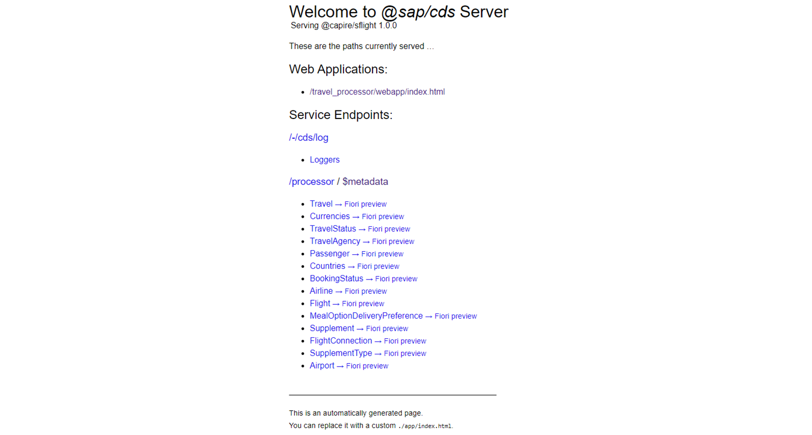
#### Result
The app starts in the browser.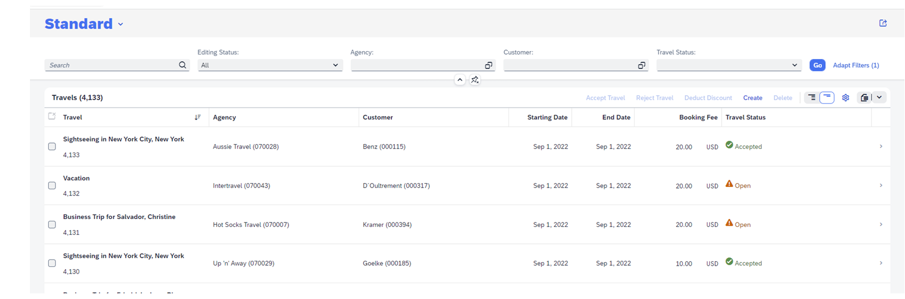

### Result
You have set up the development environment you will need to complete other lessons in this course.
You have created a BTP trial account, set up SAP Business Application Studio for development and created a dev space. You have also cloned the initial project from the GitHub repository. The app is now running in the browser.
You are now ready to start with the training exercises.
### Next Steps
For more information, see [Preview an SAP Fiori Elements CAP Project.](https://help.sap.com/docs/SAP_FIORI_tools/17d50220bcd848aa854c9c182d65b699/1dc179a7f74d48c7816e90b867058887.html)
## Overview of All Simulations
We have provided a list of all simulations used in this training for your reference. The simulations allow you to experience the look and feel of the solution and explore the supported SAP Fiori elements features. The simulations serve as an entry point for the exercises that you can do by yourself in SAP Business Application Studio, where you can explore the features and functions in depth. All the solutions for the exercises are available on [GitHub](https://github.com/SAP-samples/fiori-elements-v4-cap-advanced/tree/initial-app-state).
The overview provided below is for your reference only. You don’t need to navigate through all simulations at this point in the training. The individual simulations are referenced again in those parts of the training where they fit best. The overview is intended as a central point of entry in case you ever want to access any simulation directly.
Please note the following: When you click on a simulation, it opens in the same browser window. Therefore, we recommend not to close the browser window but to always leave the simulation using the exit button available on the UI.
Below you will find a list of all simulations.
Demo[Start Demo](https://learnsap.enable-now.cloud.sap/pub/mmcp/index.html?show=slide!SL_39DCA07275C5AAA9)
[Continue to quiz](https://learning.sap.com/courses/developing-an-sap-fiori-elements-app-based-on-a-cap-odata-v4-service/getting-an-overview-of-sap-fiori-elements-for-odata-v4_34213e40-71b3-33c8-a315-7cf7d28e9ee8)


### Quiz

*Source: https://learning.sap.com/courses/developing-an-sap-fiori-elements-app-based-on-a-cap-odata-v4-service/getting-an-overview-of-sap-fiori-elements-for-odata-v4_34213e40-71b3-33c8-a315-7cf7d28e9ee8*

It's time to put what you've learned to the test, get 8 right to pass this unit.
1.
### As an app developer, you provide semantic information for the OData service using annotations.
Choose the correct answer.
True
False
2.
### The SAP Fiori elements framework supports both OData V2 and OData V4.
Choose the correct answer.
True
False
3.
### What will the following URL request http://host/service/Travel?$select=Description,TotalPrice&$filter=Description eq 'Vacation' ?
Choose the correct answer.
The data of the Travel entity restricted to the key fields, Description and TotalPrice fields.
The key fields, Description and TotalPrice of the Travel entity will be displayed, for which Description='Vacation'.
4.
### SAP Fiori elements is based on the SAPUI5 framework.
Choose the correct answer.
True
False
5.
### Which mandatory building blocks are combined by SAP Fiori elements to generate an application?
There are three correct answers.
OData service
Annotations
Floorplans
Configuration
Custom code
6.
### What does the OData $metadata file contain?
Choose the correct answer.
App business data
A machine-readable description of the service data model
7.
### Templates are provided by app developers.
Choose the correct answer.
True
False
8.
### What will the following URL http://host/service/Travel request?
Choose the correct answer.
The metadata for the Travel entity
The app data for the Travel entity
9.
### What will the following URL http://host/service/Travel?$select=Description request?
Choose the correct answer.
The data of the Travel entity restricted to the key fields and a Description field
The data containing all the fields of the Travel entity
10.
### Transformations from OData annotations to XML views happen every time the user opens an app.
Choose the correct answer.
True
False
Submit answers[Next unit](https://learning.sap.com/courses/developing-an-sap-fiori-elements-app-based-on-a-cap-odata-v4-service/using-sap-fiori-tools-to-boost-your-app-development_e8fc3ad0-c57e-476a-a191-21a1c41cb521)


### Getting an Overview of SAP Fiori Tools

*Source: https://learning.sap.com/courses/developing-an-sap-fiori-elements-app-based-on-a-cap-odata-v4-service/using-sap-fiori-tools-to-boost-your-app-development_e8fc3ad0-c57e-476a-a191-21a1c41cb521*

Objective
After completing this lesson, you will be able to use SAP Fiori tools to create and develop SAP Fiori elements applications in a simple and efficient way.
## SAP Fiori Tools Extension Pack
SAP Fiori tools extension pack is available for both SAP Business Application Studio and Visual Studio Code. SAP Fiori tools is enabled by default in SAP Business Application Studio for several dev spaces, such asSAP Fiori or Full Stack Cloud Application. To use SAP Fiori tools in Visual Studio code, you must download the SAP Fiori tools extension pack from [SAP Fiori Tools - Extension Pack](https://marketplace.visualstudio.com/items?itemName=SAPSE.sap-ux-fiori-tools-extension-pack).
Watch the following video for an overview of SAP Fiori tools:
SAP Fiori tools guides developers through the full development cycle.
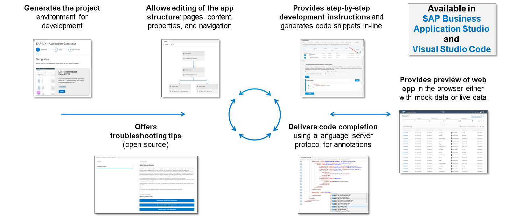
## SAP Fiori Tools: Develop and Preview Application
Watch the following video to know more about developing and previewing an application using SAP Fiori tools:
You can launch the Page Map in multiple ways. For more information, see [Define Application Structure](https://help.sap.com/docs/SAP_FIORI_tools/17d50220bcd848aa854c9c182d65b699/bae38e6216754a76896b926a3d6ac3a9.html).
## SAP Fiori Tools: Annotation Language Support in CAP CDS Files
While the page editor lets you configure your application in a schematic view and automatically generates the necessary annotations or manifest settings, SAP CDS language support assists you when you manually add annotations in the code. It provides code suggestions, validates the existing code, and contains short vocabulary descriptions for annotations and their structured elements.
You can also benefit from the page editor and SAP CDS language support as the page editor) provides the _Edit in source code_ button next to each element in the Outline pane and the Properties pane. Using this button, you can easily navigate to the required section of the code, and then manually update it with the assistance features of SAP CDS language support. Watch the following video to learn more about the annotation language support in CAP CDS files:
## SAP Fiori Tools: Guided Development
You can choose guided development to add various features to your SAP Fiori elements applications. Once you have selected the parameters relevant to your project, guided development generates the code snippet and adds it to the required file in your project. Watch the following video to know more about guided development:
## SAP Fiori Tools: Guided Answers
Guided Answers is an interactive documentation designed to help troubleshoot issues, navigate processes, and guide users through tasks via a series of questions.
Watch the following video to know more about guided answers:
### Summary
In this lesson, you have learned how SAP Fiori tools supports you throughout the development cycle of creating SAP Fiori elements applications; beginning with generating the application and previewing it in a browser, to adding UI features such as filter fields, tables, forms, charts, and finally deploying the application. This way, you can reduce the efforts and costs involved in the creation of SAP Fiori elements apps.
### Further Reading
  * [SAP Fiori Tools - Extension Pack - Visual Studio Marketplace](https://marketplace.visualstudio.com/items?itemName=SAPSE.sap-ux-fiori-tools-extension-pack)
  * [SAP Fiori tools](https://help.sap.com/docs/SAP_FIORI_tools)
  * [Getting Started with SAP Fiori Tools](https://help.sap.com/docs/SAP_FIORI_tools/17d50220bcd848aa854c9c182d65b699/2d8b1cb11f6541e5ab16f05461c64201.html)
  * [Application Information](https://help.sap.com/docs/SAP_FIORI_tools/17d50220bcd848aa854c9c182d65b699/c3e0989caf6743a88a52df603f62a52a.html)


### Creating a Second App Using the Application Generator

*Source: https://learning.sap.com/courses/developing-an-sap-fiori-elements-app-based-on-a-cap-odata-v4-service/creating-a-second-app-using-the-application-generator_dddee177-70e0-43a8-a384-7fc40739e452*

Objective
After completing this lesson, you will be able to create an SAP Fiori elements app based on a CAP service and configure basic features such as table columns and form fields.
## Create the Display Customers App
In this exercise, you will create another app _Display Customers_ in the existing CAP project. This app displays the detailed information of customers. The main entity is the Passenger entity. To create the app, you will use the SAP Fiori tools - Application Generator.
This app is used in the exercises of Unit 12 Discovering the Flexible Programming Model of SAP Fiori Elements for OData V4 and Unit 13 Illustrating the Navigation Concept in SAP Fiori elements for OData V4.
Note
While there is a separate file for the annotations returned from the back end in SAP Fiori elements for OData V2, the $metadata file in SAP Fiori elements for OData V4 includes both metadata and back-end annotations.
### Prerequisites
You have completed the exercise Clone the Initial Application Project, Set Up and Run the Application in SAP Business Application Studio in the unit Getting an Overview of SAP Fiori Elements for OData V4 (lesson: Getting Started). Alternatively, you can check out its solution branch: [SAP-samples/fiori-elements-v4-cap-advanced at initial-app-state](https://github.com/SAP-samples/fiori-elements-v4-cap-advanced/tree/initial-app-state).
### Watch the Simulation and Perform the Steps
This exercise contains a simulation that takes you through all the steps described below. You can follow the simulation and perform the steps using your own trial account.
Exercise[Start Exercise](https://learnsap.enable-now.cloud.sap/pub/mmcp/index.html?show=project!PR_C359C30EFF6FC6BB:uebung)
### Steps
  1. Open your CAP project in SAP Business Application Studio.
  2. Select the _Menu_ icon, then _File > New Project from Template_, and then select _SAP Fiori application_ to create another app based on the same CAP service.
  3. On the _SAP Fiori application_ page, select the template _List Report Page_.
  4. On the _Data Source and Service Selection_ page, perform the following steps:
    1. From the _Data source_ dropdown, choose **Use a Local CAP Project**.
    2. From the _Choose your CAP project_ dropdown, choose **fiori-elements-v4-cap-advanced**.
    3. From the _OData service_ dropdown, choose **TravelService (Node.js)**.
  5. On the _Entity Selection_ page, perform the following steps:
    1. From the _Main entity_ dropdown, choose **Passenger**.
    2. From the _Navigation entity_ dropdown, choose **to_Booking**.
  6. On the _Project Attributes_ page, perform the following steps:
    1. In the _Module name_ field, enter **customer**.
    2. In the _Application title_ field, enter **Customers**.
    3. In the _Application namespace_ field, enter **sap.fe.cap**.
    4. In the _Description_ field, enter **Display Customers**.
    5. From the _Minimum SAPUI5 Version_ dropdown, choose the highest available version of 1.120, for example, **1.120.6.**
    6. Under _Add FLP configuration_ select _Yes_.
  7. On the _Deployment Configuration_ page, keep the suggested settings.
  8. On the _Fiori Launchpad Configuration_ page, perform the following steps:
    1. In the _Semantic Object_ field, enter **Customer**.
    2. In the _Action_ field, enter **display**.
    3. In the _Title_ field, enter **Display Passenger**.
#### Result
You can see that the _Application Information_ page appears. It displays the details of the _Display Customers_ app with useful links.
  9. Open the preview of the application in the browser.
    1. On the _Application Information_ page, select _Preview Application_.
    2. From the _projects_ dropdown, choose **watch-customer cds watch**.
  10. Navigate through the _Display Customers_ app
    1. Select _Go_. The page displays the customer details.
    2. Select the required customer to view additional information.

### Result
You have created a _Display Customers_ app utilizing the same CAP service. You have used SAP Fiori tools - Application Generator.
## Adjust the List Report of the Display Customers App
In this exercise, you will use the Page Editor provided by SAP Fiori tools. It allows you to easily configure features such as filter fields, table columns, and fields in sections for your app. This tool supports features based on annotations and manifest.json settings.
### Prerequisites
You have completed the exercise Create the Display Customers App in the unit Getting an Overview of SAP Fiori Tools (lesson: Creating a Second App Using the Application Generator).
### Watch the Simulation and Perform the Steps
This exercise contains a simulation that takes you through all the steps described below. You can follow the simulation and perform the steps using your own trial account.
Exercise[Start Exercise](https://learnsap.enable-now.cloud.sap/pub/mmcp/index.html?show=project!PR_C34F21AEB12CB999:uebung)
### Steps
  1. Open your CAP project in SAP Business Application Studio.
  2. Select the _Menu_ icon.
  3. Select _View_ → _Command Palette..._.
  4. From the _projects_ dropdown, choose **Fiori: Open Application Info**.
  5. Choose **customer Customers**. The _Application Information_ of the _Display Customers_ app appears.
  6. Under _Pages_ , select _ListReport_. The _Page Editor_ appears.
  7. Add the filter fields in the filter bar.
    1. Under _Filter Bar_ , select the _Add_ icon corresponding to the _Filter Fields_. The _Add Filter Fields_ dialog appears.
    2. From the _Filter Field_ dropdown, choose **City** , **CountryCode_code** , and **PostalCode**.
    3. Select _Add_. The three fields are now added to the _Filter Fields_ of _PassengerList_.
    4. To change the position of the _Country Code_ field, select the move-up arrow next to the field.
  8. Delete the existing columns.
    1. Under _Tables_ , expand _Columns_.
    2. Select the Delete icon corresponding to the required column. The _Delete Confirmation_ dialog appears.
    3. Select _Delete_.
  9. Add new columns.
    1. Select the Add icon corresponding to _Columns_.
    2. Choose **Add Basic Columns**. The _Add Basic Columns_ dialog appears.
    3. From the _Columns_ dropdown, select the required columns.
    4. Select _Add_.
  10. To view the annotations of the _City_ column, select _Navigate to source code_. You can see that a new @UI.LineItem annotation is added by the tool for the selected columns.
  11. Launch the preview of the application in a browser window.
    1. In the left pane, under _Projects_ , right-click on _fiori-elemens-v4-cap-advanced_.
    2. Select _Open in integrated Terminal_. The _Terminal_ appears.
    3. Enter cds watch.
    4. Select _Open in a New Tab_. The _Welcome to @sap/cds Server_ page appears.
    5. Under _Web Applications_ , select **/customer/webapp/index.html**. The _Display Customers_ app appears in the browser window.
    6. Select _Go_.
#### Result
You can see the newly added filter fields and the columns in the app.
  12. To view the $metadata file of the service, on the _Welcome to @sap/cds Server_ page, under _Service Endpoints:_ , select _$metadata_.
#### Result
The $metadata file of the service opens. Here, you can find the metadata information and all annotations of your CAP project in XML format.

### Result
You have learned how to add filter fields and columns to your application. You have also seen the $metadata file which contains the metadata and annotations of the service.
Note
  * You can find the solution for this exercise on [GitHub](https://github.com/SAP-samples/fiori-elements-v4-cap-advanced).
  * The solution branch is [solution/generate-and-adjust-list-report-customer-app](https://github.com/SAP-samples/fiori-elements-v4-cap-advanced/tree/solution/generate-and-adjust-list-report-customer-app).
  * You can see the code changes compared to the previous branch on [GitHub](https://github.com/SAP-samples/fiori-elements-v4-cap-advanced/compare/initial-app-state..solution/generate-and-adjust-list-report-customer-app).

## Adjust the Object Page of the Display Customers App
In this exercise, you will continue working with the Page Editor.
You will configure the object page of the _Display Customers_ app. The Application Generator adds some fields to the _General Information_ section of the object page by default. You will delete the technical fields that are not needed and change the sequence of the remaining fields on the UI. Additionally, you will create a header section and add the most important information such as a telephone number and email address of the customer.
### Prerequisites
You have completed the exercise Adjust the List Report of the Display Customers App in the unit Getting an Overview of SAP Fiori Tools (lesson: Creating a Second App Using the Application Generator). Alternatively, you can also check out its solution branch: [solution/generate-and-adjust-list-report-customer-app](https://github.com/SAP-samples/fiori-elements-v4-cap-advanced/tree/solution/generate-and-adjust-list-report-customer-app) .
### Watch the Simulation and Perform the Steps
This exercise contains a simulation that takes you through all the steps described below. You can follow the simulation and perform the steps using your own trial account.
Exercise[Start Exercise](https://learnsap.enable-now.cloud.sap/pub/mmcp/index.html?show=project!PR_C3F9F54A856B37B3:uebung)
### Steps
  1. Open SAP Business Application Studio.
  2. In the left pane, select Projects\app\customer.
  3. Right-click on customer.
  4. Select _Show Page Map_. The _Page Map_ appears.
  5. On the _Object Page_ , select the _Edit_ icon. The object page structure appears.
  6. Add _FullName_ , _EmailAddress_ , and _PhoneNumber_ to an object page header section.
    1. Under _Header_ , select the Add icon corresponding to the _Header Sections_.
    2. Choose **Add Form Section**. The _Add Form Section_ dialog appears.
    3. In the _Label_ field, enter **Contact Details** as the name of the header.
    4. Select _Add_.
    5. Expand _Contact Details_.
    6. Expand _Form_.
    7. Select the _Add_ icon corresponding to the _Fields_.
    8. Choose **Add Basic Fields**. The _Add Basic Fields_ dialog appears.
    9. From the _Fields_ dropdown, select the fields to add to the header section.
    10. Click _Add_.
#### Result
You have added a header section and the three fields to it.
  7. Under _Sections_ , expand _General Information_.
  8. Expand _Form_.
  9. Remove the technical fields (_CreatedBy_ , _ChangedOn_ , and _ChangedBy_) from _Sections_.
    1. Select a field to be deleted.
    2. Select the _Delete_ icon. The _Delete confirmation_ dialog appears.
  10. To change the sequence of the fields, select the move-up or move-down arrows next to the field.
  11. To open the source code, select the _Navigate to source code_ icon next to the _Street_ field. The annotations.cds file opens.
#### Result
You can see that the Page Editor has added the records to the @UI.FieldGroup annotation for the fields you've added to the _General Information_ section.
  12. To see the annotation created for the header section, select the _Navigate to source code_ icon next to _Contact Details_. The annotation.cds file opens.
#### Result
You can see the @UI.HeaderFacets annotation added by the Page Editor to the _Passenger_ entity.
  13. Define the header name.
    1. Select _Header_.
    2. In the right pane, under the _Header_ section, in the _Type Name_ field, enter **Customer** as the name of the header.
    3. Select _Edit in source file_.
    4. Select _Apply_.
    5. In the _Type Name Plural_ field, enter **Customers** as the title of the list report table.
    6. Select _Edit in source file_.
    7. Select _Apply_.
    8. Under the _Title_ field, from the dropdown, choose **FullName**.
    9. To view the source code, select _Edit in source file_ next to _FullName_.
  14. Open the _Display Customers_ app in the browser window.
    1. In the _Display Customers_ app, select _Go_. The page displays the list of customers.
    2. Select any customer.
#### Result
You can see the full name of the customer as the title of the object page.

### Result
You have learned to configure the object page using the Page Editor.
### Next Steps
For more information, see [Configure Page Elements](https://help.sap.com/docs/SAP_FIORI_tools/17d50220bcd848aa854c9c182d65b699/047507c86afa4e96bb3d284adb9f4726.html).
Note
  * You can find the solution for this exercise on [GitHub](https://github.com/SAP-samples/fiori-elements-v4-cap-advanced).
  * The solution branch is [solution/configure-object-page-customer-app](https://github.com/SAP-samples/fiori-elements-v4-cap-advanced/tree/solution/configure-object-page-customer-app).
  * You can see the code changes compared to the previous branch on [GitHub](https://github.com/SAP-samples/fiori-elements-v4-cap-advanced/compare/solution/generate-and-adjust-list-report-customer-app..solution/configure-object-page-customer-app).

[Continue to quiz](https://learning.sap.com/courses/developing-an-sap-fiori-elements-app-based-on-a-cap-odata-v4-service/getting-an-overview-of-sap-fiori-tools_291a80e6-e9b5-3b6a-88be-9dac06a590f1)


### Quiz

*Source: https://learning.sap.com/courses/developing-an-sap-fiori-elements-app-based-on-a-cap-odata-v4-service/getting-an-overview-of-sap-fiori-tools_291a80e6-e9b5-3b6a-88be-9dac06a590f1*

It's time to put what you've learned to the test, get 3 right to pass this unit.
1.
### SAP Fiori tools extension pack is available for both Visual Studio Code and for SAP Business Application Studio.
Choose the correct answer.
True
False
2.
### You can create just one SAP Fiori elements application in your CAP project.
Choose the correct answer.
True
False
3.
### SAP Fiori tools supports you in doing the following:
There are five correct answers.
Generating an SAP Fiori elements application
Configuring tables and forms in your SAP Fiori elements application
Adding annotations to your application
Previewing your application in the browser during the development
Deploying your application
Creating your CAP service
Submit answers[Next unit](https://learning.sap.com/courses/developing-an-sap-fiori-elements-app-based-on-a-cap-odata-v4-service/getting-an-overview-of-the-available-templates_b22c0190-714a-47e6-8609-e7fd6fe9bc49)


### Understanding SAP Fiori Elements Templates

*Source: https://learning.sap.com/courses/developing-an-sap-fiori-elements-app-based-on-a-cap-odata-v4-service/getting-an-overview-of-the-available-templates_b22c0190-714a-47e6-8609-e7fd6fe9bc49*

Objective
After completing this lesson, you will be able to distinguish the available SAP Fiori elements templates.
## SAP Fiori Elements Templates (or Floorplans)
SAP Fiori elements provides templates for common business use cases. Most business scenarios include providing an overview of business data, listing business objects, and managing or processing these business objects.
You can use these templates for your SAPUI5 applications without having to write a line of code. SAP Fiori elements apps are based on app metadata, OData annotations, and settings in the manifest.json file. The application determines what data is displayed on the UI, but it is the templates that determines how the data is displayed on the UI.
You can easily create apps using the SAP Fiori elements templates. Let's take a look at the templates available in SAP Fiori elements.
### Overview Pages
The overview page template provides a data overview for a certain business area or role. Information is visualized in card format. The user can view, filter, and act on data efficiently. There are different types of cards to represent different types of content. A card serves as a typical entry point for a business process.
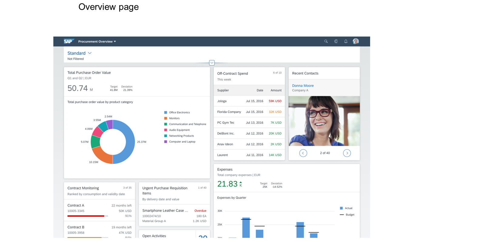
### List Report Page
The list report page is the most commonly used template. It creates an SAP Fiori elements application containing a list report and an object page.
The list report allows the user to filter and sort a large set of items in a list format. It combines powerful functions for filtering large lists with different ways of displaying the resulting list of items. It is often an entry point for navigating to the item details. The item details are shown on the object page. The list report is usually used in conjunction with an object page.
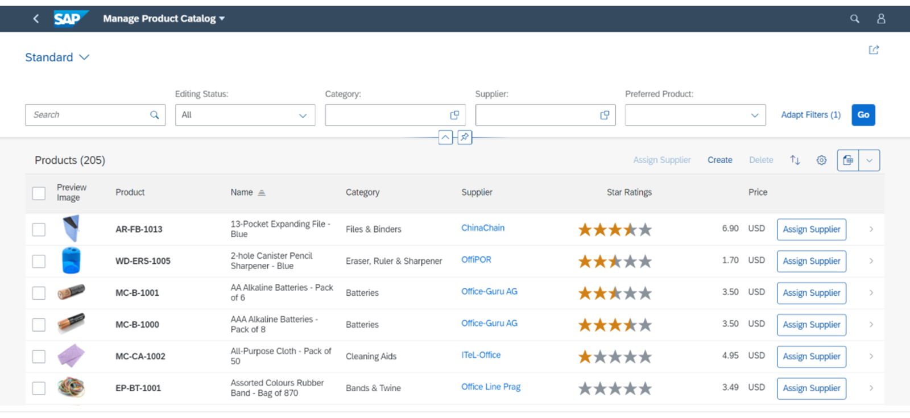
There are other variations of the list report: the worklist page and the analytical list page. You can either create a worklist page or an analytical list page from a template, or you can modify the list report accordingly.
The analytical list page adds analytical capabilities like charts and visual filters to your apps. They help you to visualize and analyze your data from different perspectives, drill down into the data, and act on transactional content.

The worklist page allows you to process a list of tasks. You can work through a list of items, review the details, and take necessary actions. The filter bar is hidden as there is no need for sophisticated filtering.

### Object Page
The object page is used to display and categorize the relevant information about a business object. This information can consist of text, charts, graphs, images, or any other form of data. The categorized content can be accessed quickly using anchor navigation or tab navigation, and users can switch from display to edit mode to change the content. The object page comes with a flexible, responsive layout, and a dynamic page header that can adapt to displaying simple and complex business objects.
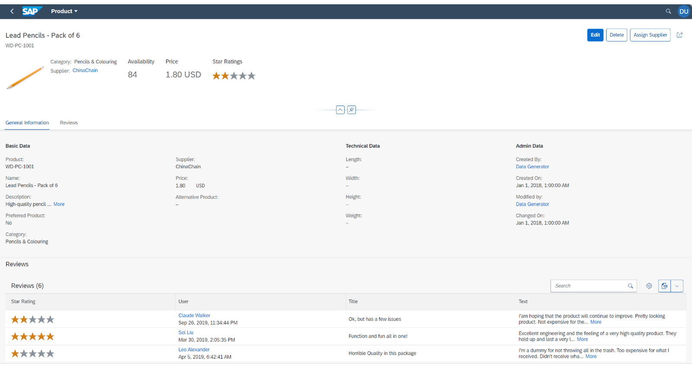
### SAP Fiori Elements Boosts Your Productivity
SAP Fiori elements provides enterprise-ready app templates. SAP Fiori elements ensures that the apps created using the templates comply with the latest SAP Fiori design guidelines and includes uniform layout, navigation, search, and filtering. Thus, you achieve UX consistency in your apps when using SAP Fiori elements.
By using the templates, SAP Fiori elements lets developers focus on the business logic and back-end services without having to worry about writing UI code. Thus, the development and maintenance effort can be reduced.
### Summary
You have learned about the various SAP Fiori elements templates or floorplans.


### Examining List Report and Object Page Features

*Source: https://learning.sap.com/courses/developing-an-sap-fiori-elements-app-based-on-a-cap-odata-v4-service/examining-list-report-and-object-page-features_f4eed58a-6c42-430f-9eda-1b0f49c065f3*

Objective
After completing this lesson, you will be able to identify the main elements of the list report and object page.
## List Report and Object Page Features
In this lesson, you will take a closer look at the list report and object page features. You will also learn how to use the feature map to see the available features.
Watch the following video to get started with the list report and object page features:
Note
In this video, you can see that the app is using an old theme of SAPUI5 named Belize theme. For more information about the available SAPUI5 themes, see [Supported Combinations of Themes and Libraries](https://sapui5.hana.ondemand.com/sdk/#/topic/da0d2e78e5414e199507cd6365d3add2.html).
Watch the following video to learn how to use SAP Fiori elements feature map and navigate through the documentation:
For more information about the SAP Fiori elements feature map and the supported features, see [SAP Fiori Elements Feature Map](https://sapui5.hana.ondemand.com/sdk/#/topic/62d3f7c2a9424864921184fd6c7002eb).
### Summary
You have learned about the list report, which is usually used in conjunction with the object page. The list report allows users to work with a large list of items. It has powerful functions that enable you to filter complex lists. It also provides multiple ways to display the filtered list of items. You have also learned where to check the availability of SAP Fiori elements features.
### Further Reading
  * [Using SAP Fiori Elements Floorplans](https://sapui5.hana.ondemand.com/sdk/#/topic/797c3239b2a9491fa137e4998fd76aa7)
  * [Feature Showcase Apps and Samples](https://sapui5.hana.ondemand.com/#/topic/521405cc719e4e699a25366461a516cb)
  * [Developing Apps with SAP Fiori Elements](https://sapui5.hana.ondemand.com/#/topic/03265b0408e2432c9571d6b3feb6b1fd)


### Taking a Closer Look at the Apps Used in the Training

*Source: https://learning.sap.com/courses/developing-an-sap-fiori-elements-app-based-on-a-cap-odata-v4-service/taking-a-closer-look-at-the-apps-used-in-the-training_fb813e5d-7cec-4719-b192-a71a826314b8*

Objective
After completing this lesson, you will be able to discover essential apps and features in your training journey.
## Discover the Manage Travels App
In this lesson, you will explore the _Manage Travels_ app that is mainly used throughout the training, in addition to the _Display Customers_ app. Furthermore, you will also gain insights into the structure of the CAP project, which you've previously cloned. This exploration involves taking a closer look at the files where you will extend your data model or implement the back-end methods in the following exercises. You will also see the files of your SAP Fiori elements apps.
### Watch the Simulation and Perform the Steps
This exercise contains a simulation that takes you through all the steps described below. You can follow the simulation and perform the steps using your own trial account.
Exercise[Start Exercise](https://learnsap.enable-now.cloud.sap/pub/mmcp/index.html?show=project!PR_2491F5D4E50E3BE:uebung)
Note
To launch the app preview in the browser window, select either cds run or cds watch. In the following exercises, you will use cds watch to immediately update the preview after making some changes in the project.
## Get to Know the Structure of the CAP Project Used in the Training
### Usage Scenario
In this lesson, you will examine the structure of the CAP project that you've previously cloned.
### Watch the Simulation and Perform the Steps
This exercise contains a simulation that takes you through all the steps described below. You can follow the simulation and perform the steps using your own trial account.
Exercise[Start Exercise](https://learnsap.enable-now.cloud.sap/pub/mmcp/index.html?show=project!PR_5BCD7458EF646C95:uebung)
### Steps
  1. Open SAP Business Application Studio.
  2. In the Explorer view, under _Projects_ , expand _fiori-elements-v4-cap-advanced_.
  3. Expand _app_. You can see the two folders, _customer_ and _travel_processor,_ corresponding to the two apps, _Display Customer_ and _Manage Travels_ , respectively.
  4. Explore the _customer_ folder.
    1. Expand _customer_.
    2. To see the application files of SAP Fiori elements, expand _webapp_.
    3. Select _i18n_ → _i18n.properties_. The _i18n.properties_ file opens. It contains the UI texts for translation.
    4. Select _localService_ → _metadata.xml_. The _metadata.xml_ file opens. It contains the metadata information of the service in XML format.
    5. Select _test_. The _test_ folder contains the initial files for the tests. You need to implement the tests if you have added some custom JavaScript code or custom controls to your SAP Fiori elements application.
    6. Select _manifest.json_. The _manifest.json_ file is the main configuration file for your app settings.
    7. Select _annotations.cds_. The annotations.cds file opens. It contains the annotations in CDS format.
  5. Explore the _travel_processor_ folder.
    1. Expand _travel_processor_.
    2. Expand _webapp_. The webapp folder also has the same structure as that of the _customer_ folder.
    3. Select _manifest.json_. The _manifest.json_ file is the main configuration file for the _Manage Travels_ app.
    4. Select _capabilities.cds_. In the capabilities.cds file, you can see that the service is draft-enabled and that semantic keys are specified in the file.
    5. Select _field-control.cds_. The field-control.cds file contains the annotations that influence the availability and editability of the fields and actions on the UI.
    6. Select _labels.cds_. The labels.cds file contains the label annotations for the fields.
    7. Select _layouts.cds_. The layouts.cds file contains the main UI annotations such as the @UI.Identification and @UI.LineItem.
    8. Select _value-helps.cds_. The value-helps.cds file contains the value help definition for the _Manage Travels_ app. It also has the value help definitions of the filter bar and the table fields in Edit mode.
    9. Select _service.cds_. The service.cds file contains the references to all files containing CDS annotations.
  6. Explore the data modeling of the CAP service.
    1. Select _db_ → _schema.cds_. The schema.cds file contains the definition of the entities and the relations between them. Some of them are associated to other entities such as TravelStatus, to_Agency, to_Customer, and to_Booking. Some of the entities are defined in the master-data.cds file.
    2. Select _master-data.cds_. The master-data.cds file contains the definition of master data entities such as _Airline_ , _Airport_ , and _Supplement_.
    3. Select _common.cds_. In the common.cds file, sap.common.Currencies is extended and the technical fields are mapped. These technical fields are added to the entities which are denoted as managed.
    4. Select _data_ → _sap.fe.cap.travel-Travel.csv_. The data folder contains CSV files with initial data for each entity of the service. For example, the sap.fe.cap.travel-Travel.csv file contains all fields of the Travel entity.
    5. Expand _srv_. The srv folder contains the entities and actions for the services.
    6. Select _travel-service.js_. The _travel-service.js_ file contains the Node.js methods for the service. These methods are invoked during runtime by CAP.
  7. Start the CDS server.
    1. In the Explorer view, under _Projects_ , right-click on _fiori-elements-v4-cap-advanced_.
    2. Select _Open in Integrated Terminal_. The _Terminal_ view opens.
    3. Enter **cds watch**.
    4. Select _Open in a New Tab_. The _Welcome to @sap/cds Server_ appears.
    5. Select _Service Endpoints_ → _/processor_ → _$metadata_. The $metadata file opens in XML format. It contains the metadata of your service as well as the annotations. You can also see the definition of the Travel entity in XML format.

### Result
In this exercise, you have examined the structure of the CAP project you are going to use in this training. You have seen the data modeling, which includes entities and associations, as well as the service layer where entities and actions are exposed, and the necessary Node.js methods are implemented.
​Each app requires at least one annotation file. In the CAP projects, the annotations are typically written in CAP CDS format. These CDS annotations are then transformed into OData annotations in XML format and are available, along with the metadata information, in the generated $metadata file. The SAP Fiori elements framework utilizes the data from the $metadata file to generate the user interfaces (UIs).
### Next Steps
You can also create a data model using the low-code functionality. For more information, see [Create a Data Model and Expose It as a Service](https://developers.sap.com/tutorials/appstudio-lcap-create-db-service.html#b5d3a126-e7bf-4cc3-8447-808969888b20).
## Get an Overview of the Features Which Will Be Implemented in the Training
### Explore the Features Which will Be Implemented
You will explore the features that you will implement in the _Manage Travels_ and _Display Customers_ apps.
### Watch the Simulation
This exercise contains a simulation that takes you through all the steps described below. You can follow the simulation and perform the steps using your own trial account.
Exercise[Start Exercise](https://learnsap.enable-now.cloud.sap/pub/mmcp/index.html?show=project!PR_391C705BBB699490:uebung)
[Continue to quiz](https://learning.sap.com/courses/developing-an-sap-fiori-elements-app-based-on-a-cap-odata-v4-service/understanding-sap-fiori-elements-templates_b0bacf78-6cda-3d60-bddf-8f7b015f315e)


### Quiz

*Source: https://learning.sap.com/courses/developing-an-sap-fiori-elements-app-based-on-a-cap-odata-v4-service/understanding-sap-fiori-elements-templates_b0bacf78-6cda-3d60-bddf-8f7b015f315e*

It's time to put what you've learned to the test, get 6 right to pass this unit.
1.
### Use the feature showcase to answer the following question (https://github.com/SAP-samples/fiori-elements-feature-showcase). Variant management in the list report is enabled by default. How can you disable it?
Choose the correct answer.
By adding the following setting to the manifest.json file: "variantManagement": "None".
You cannot disable it.
By adding the annotation noVariantManagement: true.
2.
### Use the SAP Fiori elements feature map to answer the question. Can a micro chart be included in a table column?
Choose the correct answer.
Yes
No
3.
### Use the SAP Fiori elements feature map to answer the question. Is it possible to use images and icons in the list report and on the object page?
Choose the correct answer.
True
False
4.
### SAP Fiori elements provides a number of templates you can choose from.
Choose the correct answer.
True
False
5.
### Which of the following are SAP Fiori elements templates?
There are two correct answers.
List Report Page
Object Report
Overview Page (OVP)
6.
### Use the SAP Fiori elements feature map to answer the question. Which kinds of micro charts are supported in the list report and object page?
There are five correct answers.
Line micro chart
Bullet micro chart
Area micro chart
Radial micro chart
Flexible column micro chart
Stacked bar micro chart
7.
### Use the feature showcase to answer the following question (https://github.com/SAP-samples/fiori-elements-feature-showcase). A confirmation popover will appear for critical actions if you do the following:
Choose the correct answer.
Add the following annotation: @Common.IsActionCritical : true.
Add the setting isActionCritical: true to the manifest.json file.
Submit answers[Next unit](https://learning.sap.com/courses/developing-an-sap-fiori-elements-app-based-on-a-cap-odata-v4-service/configuring-the-flexible-column-layout_b5066855-aa7c-4943-a64b-64050ccfea75)


### Configuring the General Features of List Reports and Object Pages

*Source: https://learning.sap.com/courses/developing-an-sap-fiori-elements-app-based-on-a-cap-odata-v4-service/configuring-the-flexible-column-layout_b5066855-aa7c-4943-a64b-64050ccfea75*

Objective
After completing this lesson, you will be able to enable the flexible column layout on the UI for your app.
## The Flexible Column Layout
In SAP Fiori elements, the flexible column layout allows you to view both the list report and the object page in the same screen, without navigating back and forth between them.
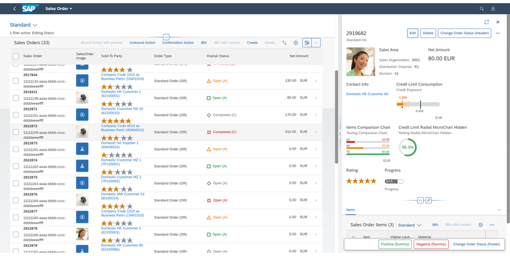
You can also display two object pages next to a list report. Each page is displayed in its own column, and you can adjust the column width if necessary.
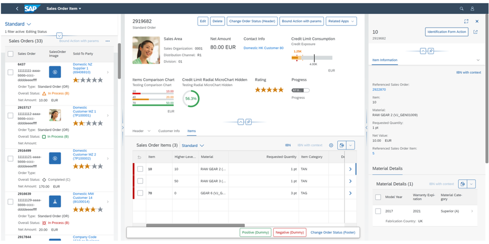
The flexible column layout can be configured manually in the manifest.json file. You can also configure the layout using the Page Map. For more information, please refer to the SAP Fiori elements documentation: [Enabling the Flexible Column Layout](https://sapui5.hana.ondemand.com/sdk/#/topic/e762257125b34513b0859faa1610b09e)
## Enable the Flexible Column Layout
In this exercise, you will first configure different options for the flexible column layout. Then, you will check the results on the UI.
### Prerequisites
You have completed the exercise Adjust the Object Page of the Display Customers App in the unit Getting an Overview of SAP Fiori Tools (lesson: Creating a Second App using the Application Generator). Alternatively, you can check out its solution branch: [configure-object-page-customer-app](https://github.com/SAP-samples/fiori-elements-v4-cap-advanced/tree/solution/configure-object-page-customer-app).
### Watch the Simulation and Perform the Steps
This exercise contains a simulation that takes you through all the steps described below. You can follow the simulation and perform the steps using your own trial account.
Exercise[Start Exercise](https://learnsap.enable-now.cloud.sap/pub/mmcp/index.html?show=project!PR_2676850464C0CFB0:uebung)
### Steps
  1. Open your project in SAP Business Application Studio.
  2. Open the Page Map.
    1. Right-click on _travel_processor_.
    2. Select _Show Page Map_.
  3. Configure the flexible column layout in the _Page Map_.
    1. Select the _Flexible Column Layout_ option.
    2. Scroll down to _Select Layout for 2 Columns_ and select _Mid-Expanded_.
    3. In _Select Layout for 3 Columns_ , select _End-Expanded_.
  4. The flexible column layout is now enabled. Switch back to the app to see how it works.
    1. Select _Travel_ to navigate to its object page.
    2. Note how the object page opens next to the list report on the same screen. As you've selected the _Mid-Expanded_ layout, the object page is wider than the list report.
    3. Select a _Booking_ to navigate to its subobject page. The subobject page opens next to the object page. As you've selected the _End-Expanded_ layout, the last column is wider than the first two columns.

### Result
In this lesson, you have learned how to enable and configure the flexible column layout.
Note
  * You can find the solution for this exercise on [GitHub](https://github.com/SAP-samples/fiori-elements-v4-cap-advanced/tree/solution/flexible-column-layout).
  * The solution branch is [solution/flexible-column-layout](https://github.com/SAP-samples/fiori-elements-v4-cap-advanced/tree/solution/flexible-column-layout).
  * You can see the code changes compared to the previous branch on [GitHub](https://github.com/SAP-samples/fiori-elements-v4-cap-advanced/compare/solution/configure-object-page-customer-app..solution/flexible-column-layout).


### Adjusting the Standard SAP Fiori Elements UI Texts

*Source: https://learning.sap.com/courses/developing-an-sap-fiori-elements-app-based-on-a-cap-odata-v4-service/adjusting-the-standard-sap-fiori-elements-ui-texts_d774f6f4-4765-4ac8-8f42-ab7b75930355*

Objective
After completing this lesson, you will be able to adapt standard SAP Fiori elements UI texts.
## Replacement of Standard UI Texts
An SAP Fiori elements application generates various controls such as tables, buttons, and fields at runtime, based on the predefined templates, annotations, and settings.
SAP Fiori elements provides standard texts for UI controls. Standard texts are available in the generic framework (for example, the button texts for delete or create actions) and belong to the template components (for example, list report and object page).
However, you can replace some standard UI texts for apps that you have created with SAP Fiori elements to suit the application-specific needs.
For example, an application with a button named _Create a Travel_ improves the user experience more than a button named _Create_.
For more information about the texts that can be overwritten, see [Localization of UI Texts](https://sapui5.hana.ondemand.com/sdk/#/topic/b8cb649973534f08a6047692f8c6830d).
## Change the Standard UI Texts
In this exercise, you will adapt the standard UI texts provided by SAP Fiori elements with custom UI texts.
### Task Flow
In the Manage Travels application, you will adapt the standard UI text that appears on the Delete confirmation dialog when you try to delete multiple items.
### Prerequisites
You have completed the exercise Adjust the Object Page of the Display Customers App in the unit Getting an Overview of SAP Fiori Tools (lesson: Creating a Second App using the Application Generator).Alternatively, you can check out its solution branch: [configure-object-page-customer-app](https://github.com/SAP-samples/fiori-elements-v4-cap-advanced/tree/solution/configure-object-page-customer-app). Note that the flexible column layout configured in the previous exercise Enable the Flexible Column Layout has been disabled for this exercise and all upcoming exercises of this training. You can keep the flexible column layout enabled if you wish.
### Watch the Simulation and Perform the Steps
This exercise contains a simulation that guides you through the list of steps below. Performing these steps allows you to follow the simulation in your trial account.
Exercise[Start Exercise](https://learnsap.enable-now.cloud.sap/pub/mmcp/index.html?show=project!PR_85652254A3B5E586:uebung)
### Steps
  1. Replace the standard UI text used in the confirmation popup for deleting several items in the list report.
    1. Open _SAP Business Application Studio_.
    2. In the _Explorer_ window, select the Projects/webapp/i18n folder.
    3. Create a new file named customTravel.properties. For that right-click on _i18n_ and select _New File_. Enter customTravel.properties.
Note
The file name must end with .properties.
    4. Add the following application-specific text to the customTravel.properties file:
Code Snippet
Copy codeSwitch to dark mode

```

1

C_TRANSACTION_HELPER_CONFIRM_DELETE_WITH_OBJECTTITLE_PLURAL=Do you really want to delete these travels?

```

Note
You can overwrite the standard UI texts provided by SAP Fiori elements with your application-specific texts. You must add the new UI text to the custom resource bundle. Use the technical key specified by SAP Fiori elements for a certain UI text. These keys are provided in the documentation of SAP Fiori elements. For more information, see [Localization of UI Texts](https://ui5.sap.com/#/topic/b8cb649973534f08a6047692f8c6830d).
    5. Register your newly created _i18n_ file in manifest.json. For that add the following code snippet to the manifest.json file under _sap.ui5_ > _routing_ > _targets_ > _TravelList_ > _options_ > _settings_ :
Code Snippet
Copy codeSwitch to dark mode

```

1

"enhanceI18n" : "i18n/customTravel.properties",

```

  2. Check the adapted UI text that appears on the _Delete_ confirmation dialog for deleting several items.
    1. Open the _Manage Travels_ application.
    2. Select the items in the _Travels_ table that you want to delete.
    3. Choose _Delete_ to delete the selected items.
#### Result
The _Delete_ confirmation dialog now appears with the adapted UI text, _Do you really want to delete these travels?_

### Result
You have replaced the standard UI text provided by SAP Fiori elements with a custom text.
Note
  * You can find the solution for this exercise on [GitHub](https://github.com/SAP-samples/fiori-elements-v4-cap-advanced/tree/solution/change-standard-ui-texts).
  * The solution branch is [solution/change-standard-ui-texts](https://github.com/SAP-samples/fiori-elements-v4-cap-advanced/tree/solution/change-standard-ui-texts).
  * You can see the code changes compared to the previous branch on [GitHub.](https://github.com/SAP-samples/fiori-elements-v4-cap-advanced/compare/solution/configure-object-page-customer-app..solution/change-standard-ui-texts)

[Continue to quiz](https://learning.sap.com/courses/developing-an-sap-fiori-elements-app-based-on-a-cap-odata-v4-service/configuring-the-general-features-of-list-reports-and-object-pages_7ee3e1d6-a7a0-3374-9696-eecf2c843a7e)


### Quiz

*Source: https://learning.sap.com/courses/developing-an-sap-fiori-elements-app-based-on-a-cap-odata-v4-service/configuring-the-general-features-of-list-reports-and-object-pages_7ee3e1d6-a7a0-3374-9696-eecf2c843a7e*

It's time to put what you've learned to the test, get 5 right to pass this unit.
1.
### In the flexible column layout, the list report, object page, and subobject page can be displayed on one screen next to each other.
Choose the correct answer.
True
False
2.
### Standard UI texts are provided by SAP Fiori elements.
Choose the correct answer.
True
False
3.
### In which file can you, as an app developer, maintain your app-specific UI texts?
Choose the correct answer.
In the i18n_en.properties file.
In the i18n_de.properties file.
In the i18n.properties file.
4.
### You can enable the flexible column layout by doing the following:
There are two correct answers.
Using the Page Map.
Adding a corresponding annotation.
Manually adding a corresponding setting to the manifest.json file.
5.
### In the flexible column layout, the column width is flexible and can be configured. You can adapt its width on the UI.
Choose the correct answer.
True
False
6.
### App developers are allowed to change any standard UI texts in their SAP Fiori elements apps.
Choose the correct answer.
True
False
Submit answers[Next unit](https://learning.sap.com/courses/developing-an-sap-fiori-elements-app-based-on-a-cap-odata-v4-service/adding-fields-to-the-filter-bar_e7c5b6ac-dc2c-44a5-8ee0-a1c7922da00c)


### Configuring the List Report Filter Bar

*Source: https://learning.sap.com/courses/developing-an-sap-fiori-elements-app-based-on-a-cap-odata-v4-service/adding-fields-to-the-filter-bar_e7c5b6ac-dc2c-44a5-8ee0-a1c7922da00c*

Objective
After completing this lesson, you will be able to configure the value help dialog for the semantic fields of type Date.
## Add Fields to the List Report Filter Bar
The filter bar on top of the list report allows you to filter entries using the specified parameters. You can add new fields to the filter bar, enabling new parameters. For example, you can only show entries that start and finish on a certain date.
You can configure the filter bar fields by adding com.sap.vocabularies.UI.v1.SelectionFields to your annotation file.
You can also use SAP Fiori tools. You can choose between two options:
  1. Use the guide _Add and edit filter fields_ from guided development. You will look at this option in this exercise.
  2. Open the Page Map and add a filter field there. You have already covered this in the unit Getting an Overview of SAP Fiori Tools (lesson: Creating a Second App using the Application Generator).

### Task Flow
You will first check how the list report looks before the changes. Then, you will use guided development to add the filter fields. Finally, you will check the results.
### Prerequisites
You have completed the exercise Change the Standard UI Texts in the unit Configuring the General Features of List Reports and Object Pages (lesson: Adjusting the Standard SAP Fiori Elements UI Texts). Alternatively, you can check out its solution branch: [solution/change-standard-ui-texts](https://github.com/SAP-samples/fiori-elements-v4-cap-advanced/tree/solution/change-standard-ui-texts).
### Watch the Simulation and Perform the Steps
This exercise contains a simulation that takes you through all the steps described below. You can follow the simulation and perform the steps using your own trial account.
Exercise[Start Exercise](https://learnsap.enable-now.cloud.sap/pub/mmcp/index.html?show=project!PR_B6F1E7C7813E1A2:uebung)
### Steps
  1. Open _Adapt Filters_ in the list report. You can see the **End Date** and **Starting Date** fields in the popup menu. Select _Cancel_.
  2. Add the fields using guided development.
    1. Switch to SAP Business Application Studio and choose travel_processor > Open Guided Development. Enter **filter** in the search field to narrow down the number of guides displayed.
    2. Select _Add and edit filter fields_ and choose _Start Guide_.
    3. Select **app/travel_processor/layouts.cds** from the **CDS File** dropdown menu, **TravelService** from the **Service** menu and **Travel** from the **Entity** menu.
    4. Choose _Add selection field_ and select **BeginDate** from the **Property** menu.
    5. Scroll up to add another field. Choose _Add selection field_ and select **EndDate** from the **Property** menu.
    6. Scroll down to see the CAP CDS @UI.SelectionFields annotation for your layouts.cds file. Select _Insert Snippet_ to add it.
    7. Open the schema.cds file to see the code that has been added.
  3. Check the results.
    1. Switch to the app preview. You can see the **Starting Date** and **End Date** fields that have been added to the filter bar.
    2. Note how you can see calendar dates, single dates like **Today** or **Tomorrow** and date ranges in the dropdown menus for both fields.
  4. Check the mapping of the CAP CDS Date type to OData Edm.Date type. The fields BeginDate and EndDate are of type Date, which is a [CAP CDS built-in type](https://cap.cloud.sap/docs/cds/types). You can see the CAP CDS types for each property in the schema.cds file. The CAP CDS type Date is mapped to the OData EDM type Edm.Date, as you can see in the $metadata file.

### Result
Below you can see the definition of the Travel entity in the schema.cds file and the corresponding OData representation of the Travel entity.
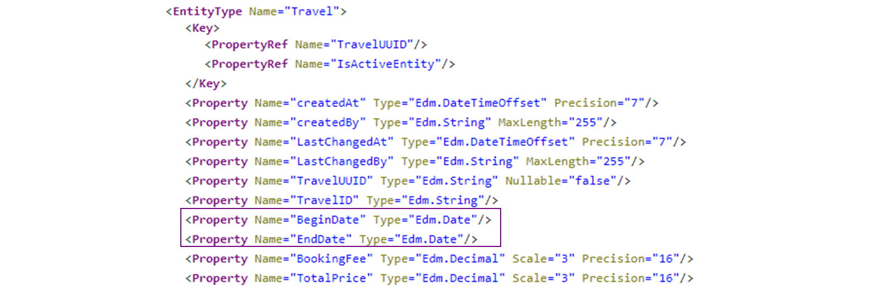
For other examples of mapping CAP CDS types to OData types, see [OData type mapping](https://cap.cloud.sap/docs/advanced/odata#type-mapping).
You have seen that Edm.Date-based fields are rendered with a calendar in the value help dropdown menu out of the box. Semantic operators, such as **yesterday** and **today** , are enabled by default in the value help dropdown menu because the @Capabilites.FilterRestrictions annotation was part of your service from the very beginning.
In this lesson, you have learned how to add new filter fields using guided development.
Note
  * You can find the solution for this exercise on [GitHub](https://github.com/SAP-samples/fiori-elements-v4-cap-advanced).
  * The solution branch is [solution/add-semantic-fields-to-filterbar](https://github.com/SAP-samples/fiori-elements-v4-cap-advanced/tree/solution/add-semantic-fields-to-filterbar).
  * You can find the link to the direct comparison of the branch to the previous one on [GitHub](https://github.com/SAP-samples/fiori-elements-v4-cap-advanced/compare/solution/change-standard-ui-texts..solution/add-semantic-fields-to-filterbar).


### Hiding the Filter Bar

*Source: https://learning.sap.com/courses/developing-an-sap-fiori-elements-app-based-on-a-cap-odata-v4-service/hiding-the-filter-bar_d63a9e05-85ff-41f9-a9bb-0890c86d4369*

Objective
After completing this lesson, you will be able to create a worklist from the list report.
## The Worklist
The worklist floorplan is a simplified list report without a filter bar. It displays a collection of items that are to be processed by the user. The processing of the items includes reviewing details of the list items and taking actions. This differs from the list report floorplan, which focuses on finding and acting on relevant items from a large dataset.
You can create a worklist page using the SAP Fiori application generator. You can also hide the filter bar in the list report to create a worklist. To hide the filter bar, you can either change the setting directly in the manifest.json file or use the Page Map to make the necessary changes to the manifest.json file.
### Further Reading
  * [Worklist](https://sapui5.hana.ondemand.com/sdk/#/topic/d1d588f1061b4bac96a1facb80d3f3a2)
  * [Configuring Filter Bars](https://sapui5.hana.ondemand.com/sdk/#/topic/4bd7590569c74c61a0124c6e370030f6.html)
  * [SAP Fiori Design Guidelines](https://experience.sap.com/fiori-design-web/)

## Hide the Filter Bar in the List Report
### Context
In this exercise, you will modify the list report to create a worklist. You can do this in SAP Business Application Studio.
### Task Flow
In the Manage Travels application, you will hide the filter bar available in the list report.
### Prerequisites
You have completed the exercise Add Fields to the List Report Filter Bar in the unit Configuring the List Report Filter Bar (lesson: Adding Fields to the Filter Bar). Alternatively, you can check out its solution branch: [solution/add-semantic-fields-to-filterbar](https://github.com/SAP-samples/fiori-elements-v4-cap-advanced/tree/solution/add-semantic-fields-to-filterbar).
### Watch the Steps and Perform the Simulation
This exercise contains a simulation that takes you through all the steps described below. You can follow the simulation and perform the steps using your own trial account.
Exercise[Start Exercise](https://learnsap.enable-now.cloud.sap/pub/mmcp/index.html?show=project!PR_2E9E3ACD13F5AA9C:uebung)
### Steps
  1. Open the _Manage Travels_ application in SAP Business Application Studio.
    1. In the Explorer view, select Projects/app.
    2. Right-click on app and select Show Page Map. The Page Map of the Travels application appears.
  2. Hide the filter bar of the list report.
    1. On the list report page, select the _Edit_ option. The TravelList Page Editor appears.
    2. Select _Filter Bar_. The filter bar properties appear on the right pane.
    3. Under _Hide Filter Bar_ , from the dropdown, select _True_.
  3. In the Explorer view, select Projects/app/webapp/manifest.json. In the manifest.json file, the following code appears under settings:
Code Snippet
Copy codeSwitch to dark mode

```

1

"hideFilterBar": true

```

  4. View the worklist in the _Manage Travels_ application.
    1. Open the _Manage Travels_ application.
    2. Refresh the browser tab on which the _Manage Travels_ application is displayed.
#### Result
You can see that the filter bar is hidden.

### Result
In this lesson, you have learned that you can disable the filter bar of the list report. By doing so, you have modified the list report to a worklist.
Note
  * You can find the files for this solution on [GitHub](https://github.com/SAP-samples/fiori-elements-v4-cap-advanced).
  * The solution branch is [solution/hide-filter-bar](https://github.com/SAP-samples/fiori-elements-v4-cap-advanced/tree/solution/hide-filter-bar).
  * You can see the code changes compared to the previous branch on [GitHub](https://github.com/SAP-samples/fiori-elements-v4-cap-advanced/compare/solution/add-semantic-fields-to-filterbar..solution/hide-filter-bar).

[Continue to quiz](https://learning.sap.com/courses/developing-an-sap-fiori-elements-app-based-on-a-cap-odata-v4-service/configuring-the-list-report-filter-bar_6dc70eef-8ee4-3119-8891-e9e2cdb08cd3)


### Quiz

*Source: https://learning.sap.com/courses/developing-an-sap-fiori-elements-app-based-on-a-cap-odata-v4-service/configuring-the-list-report-filter-bar_6dc70eef-8ee4-3119-8891-e9e2cdb08cd3*

It's time to put what you've learned to the test, get 2 right to pass this unit.
1.
### How can you add a default filter bar field to your list report application?
There are three correct answers.
By using the Page Map.
By using guided development.
By adding an @UI.LineItem annotation.
By adding an @UI.SelectionFields annotation.
2.
### How can you hide a filter bar?
Choose the correct answer.
Using the Page Map
By adding an @UI.HideFilterBar annotation
Submit answers[Next unit](https://learning.sap.com/courses/developing-an-sap-fiori-elements-app-based-on-a-cap-odata-v4-service/applying-generic-actions-provided-by-sap-fiori-elements_ee9f52af-318a-4979-a8b5-929c5edebbee)


### Examining Actions Available on the List Report

*Source: https://learning.sap.com/courses/developing-an-sap-fiori-elements-app-based-on-a-cap-odata-v4-service/applying-generic-actions-provided-by-sap-fiori-elements_ee9f52af-318a-4979-a8b5-929c5edebbee*

Objective
After completing this lesson, you will be able to influence the visibility and enablement of the Delete and Create actions.
## Generic Actions
### What are Actions?
Actions trigger either an interaction with the back end (calling the OData service) or they initiate an external navigation to another app. You can see actions displayed as buttons on the apps.
### Placement of Actions in Apps
The SAP Fiori design guidelines define where the actions can be placed as buttons on the UI. According to the guidelines, actions must be placed close to the information they act upon. An example can be placing the actions on the toolbar of the table or chart in the list report. Another example would be placing the global actions in the header area of the object page.
For more information about actions, see [Actions](https://sapui5.hana.ondemand.com/sdk/#/topic/cbf16c599f2d4b8796e3702f7d4aae6c).
For more information about the action placement, see [Action Placement](https://experience.sap.com/fiori-design-web/action-placement/).
### Generic Actions
SAP Fiori elements provides generic actions, such as:
  * Trigger external navigation to related apps.
  * Create a new item.
  * Delete a single item or multiple items.
  * Edit an existing item.

In the list report, the _Create_ and _Delete_ actions are placed in the table toolbar.
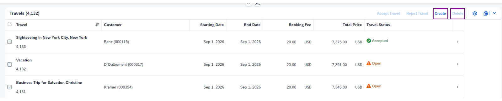
On the object page, the _Edit_ and _Delete_ actions are global actions placed in the header area.
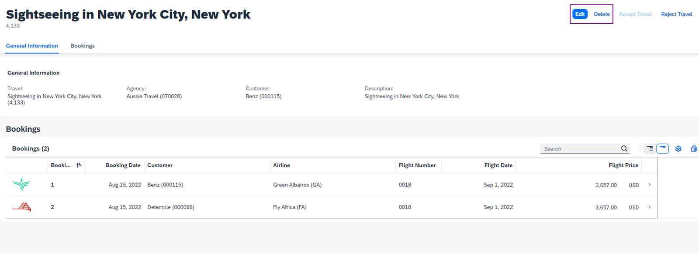
The  _Delete_ button is an action on the table and is enabled only if the user selects an item.
### Visibility of the _Delete_ and _Create_ Buttons
You can control the visibility of the _Delete_ button by using the @UI.DeleteHidden annotation. Its value can be a Boolean value (true or false), or a path that points to a Boolean property of an entity. If the value of the property is true, then the _Delete_ button is hidden; if it's false, it's visible.
Code Snippet
Copy codeSwitch to dark mode

```

12345

annotate TravelService.Travel with @UI : {
  DeleteHidden : true
}

```

Similarly, you can control the visibility of the _Create_ button using the @UI.CreateHidden annotation. Its value can be a Boolean value (true or false), or a path that points to a Boolean property of an entity. If the value of the property is true, then the _Create_ button is hidden; if it's false, it's visible.
Code Snippet
Copy codeSwitch to dark mode

```

12345

annotate TravelService.Travel with @UI : {
  CreateHidden : true
}

```

### Disable the _Delete_ Button
Instead of hiding the _Delete_ button, you can choose to disable it in the app by using the @Capabilities.DeleteRestrictions annotation. You can set its Deletable property to true or false. If the value of this property is true, the _Delete_ button is enabled for all items; if it's false, it's disabled for all items.
Code Snippet
Copy codeSwitch to dark mode

```

12345678

annotate TravelService.Travel with @(
Capabilities.DeleteRestrictions : {
$Type : 'Capabilities.DeleteRestrictionsType',
Deletable: false
}
);

```

You can also disable the delete action for specific items by assigning a path to the Deletable property that points to a particular Boolean property of the entity.
Code Snippet
Copy codeSwitch to dark mode

```

12345678

annotate TravelService.Travel with @(
Capabilities.DeleteRestrictions : {
$Type : 'Capabilities.DeleteRestrictionsType',
Deletable: TravelStatus.insertDeleteRestriction
}
);

```

The items in the _Manage Travels_ app have various statuses such as _Open_ , _Accepted_ , and _Canceled_.
You can see that for the status _Open_ the value for insertDeleteRestriction is true, and for the statuses _Accepted_ and _Canceled_ the value is false. This means that for travels with the status _Accepted_ and _Canceled_ , the _Delete_ action is disabled.
You can see the values for the insertDeleteRestriction in the sap.fe.cap.travel-TravelStatus.csv.
Code Snippet
Copy codeSwitch to dark mode

```

123456

code;name;criticality;fieldControl;createDeleteHidden;insertDeleteRestriction
O;Open;2;7;0;1
A;Accepted;3;1;1;0
X;Canceled;0;7;1;0

```

For more information about enabling or disabling of the _Create_ button, see [Adding Actions to Tables](https://sapui5.hana.ondemand.com/sdk/#/topic/b623e0bbbb2b4147b2d0516c463921a0.html).
## Make the Delete Action Unavailable for Accepted and Canceled Travels
### Context
In this exercise, you will learn to disable the _Delete_ action based on some conditions.
### Task Flow
In the _Manage Travels_ app, you can see that the _Delete_ action is displayed in the table toolbar of the list report. You will disable the delete action for travels with the travel status Accepted and Canceled.
### Prerequisites
First, you have to enable the filter bar again, because it was hidden in the previous exercise Hide the Filter Bar in the List Report in the unit Configuring the List Report Filter Bar (lesson: Hiding the Filter Bar). Alternatively, you can check out the branch: [solution/add-semantic-fields-to-filterbar](https://github.com/SAP-samples/fiori-elements-v4-cap-advanced/tree/solution/add-semantic-fields-to-filterbar).
### Watch the Steps and Perform the Simulation
This exercise contains a simulation that takes you through all the steps described below. You can follow the simulation and perform the steps using your own trial account.
Exercise[Start Exercise](https://learnsap.enable-now.cloud.sap/pub/mmcp/index.html?show=project!PR_65FF40DB97656B95:uebung)
### Steps
  1. Open SAP Business Application Studio.
  2. In the _Explorer_ view, select _Projects_ → _schema.cds_. The entity TravelStatus has a definition for all three travel statuses _Open_ , _Accepted_ , and _Canceled_. The entity also has a property named insertDeleteRestriction with the value Boolean.
  3. Open the TravelStatus.csv file. You can see that the insertDeleteRestriction has the value 1 for the Open status and 0 for the Accepted and Canceled statuses.
  4. Select the schema.cds file. Add the following annotation to it:
Code Snippet
Copy codeSwitch to dark mode

```

123456

annotate Travel with @(
   Capabilities.DeleteRestrictions : {
       $Type : 'Capabilities.DeleteRestrictionsType',
      Deletable: TravelStatus.insertDeleteRestriction
   }
);

```

Note that the Deletable property is bound to the value of the insertDeleteRestriction property of the TravelStatus entity.
  5. View the _Delete_ action in the _Manage Travels_ application.
    1. Open the _Manage Travels_ application.
    2. Select any travels with the travel statuses _Accepted_ and _Canceled_.
#### Result
The _Delete_ action is disabled for travels with the travel statuses _Accepted_ and _Canceled_.
    3. Select a travel with the travel status _Open_.
#### Result
The _Delete_ action is enabled for travels with the travel status _Open_.

### Result
The generic actions such as _Delete_ and _Create_ are provided by SAP Fiori elements. As an app developer, you can choose to control their visibility. You can also hide or disable the actions for some instances of the object (entity).
Note
  * You can find the files for this solution on [GitHub](https://github.com/SAP-samples/fiori-elements-v4-cap-advanced).
  * The solution branch is [solution/make-delete-action-unavailable-for-accepted-travels](https://github.com/SAP-samples/fiori-elements-v4-cap-advanced/tree/solution/make-delete-action-unavailable-for-accepted-travels).
  * You can see the code changes compared to the previous branch on [GitHub](https://github.com/SAP-samples/fiori-elements-v4-cap-advanced/compare/solution/add-semantic-fields-to-filterbar..solution/make-delete-action-unavailable-for-accepted-travels).


### Creating App-Specific Actions

*Source: https://learning.sap.com/courses/developing-an-sap-fiori-elements-app-based-on-a-cap-odata-v4-service/creating-app-specific-actions_af7b882c-aca4-4c12-9cbf-02e568901501*

Objective
After completing this lesson, you will be able to create actions with parameters.
## App-Specific Actions
In SAP Fiori elements, you can use generic actions such as _Delete_ and _Create_. If your app needs actions beyond this scope, you can create your own application-specific actions.
App-specific actions can be either annotation-based actions or custom actions.
### Annotation-Based Actions
Annotation-based actions are created using corresponding annotations. They can be used in the following cases:
  * User confirmation is required, for example for critical actions. A popover dialog opens, and the user has to confirm the action. For more information, see [Adding Confirmation Popovers for Actions](https://sapui5.hana.ondemand.com/sdk/#/topic/87130de10c8a44269c605b0322df6b1a.html).
  * Additional user input is required. Some values may already be filled in.
  * The action triggers a back-end call through an OData service, such as _Approve_.
  * The action triggers navigation, for example to a different app. For more information, see [Configuring Navigation.](https://sapui5.hana.ondemand.com/sdk/#/topic/a42427550b72436a8bdf53045b06effb)

### Custom Actions
Custom actions can be created if the action you need cannot be covered by annotation-based actions. They are created using extension points which need to be registered in the manifest.json file. For more information, see [Adding Custom Actions Using Extension Points](https://sapui5.hana.ondemand.com/sdk/#/topic/7619517a92414e27b71f02094bd08d06.html).
### Visibility of Annotation-Based Actions
You can change the visibility of annotation-based actions with the @Core.OperationAvailable annotation.
The annotation can either have a static value (Boolean true or false) or a dynamic value (a path pointing to a property). If the value is static and set to true, the action will always be available, regardless of which item is selected. If the value is dynamic, the action can be enabled or disabled dynamically, depending on a certain condition.
Have a look at the following CAP CDS annotation:
Code Snippet
Copy codeSwitch to dark mode

```

12345

actions {
   deductDiscount @(
    Core.OperationAvailable : { $edmJson: { $Eq: [{ $Path: 'in/TravelStatus_code'}, 'O']}}
  );
}

```

In this example, the action deductDiscount will only be available for items with the TravelStatus'O' (open). The value for the annotation Core.OperationAvailable is a dynamic expression enclosed in { $edmJson: { … }}.
For more information about dynamic expressions in OData Version 4, see [OData Common Schema Definition Language (CSDL) JSON Representation Version 4.01 (oasis-open.org)](http://docs.oasis-open.org/odata/odata-csdl-json/v4.01/odata-csdl-json-v4.01.html#_Toc38466479).
The CDS compiler translates the expression into the corresponding XML code. The annotation above is translated to the following OData representation:
Code Snippet
Copy codeSwitch to dark mode

```

12345678

<Annotations Target="TravelService.deductDiscount(TravelService.Travel)">
	<Annotation Term="Core.OperationAvailable">
	  <Eq>
	    <Path>in/TravelStatus_code</Path>
	      <String>O</String>
	  </Eq>
	</Annotation>
</Annotations>

```

For more information about CAP CDS and dynamic expressions, see: [Dynamic Expressions](https://cap.cloud.sap/docs/advanced/odata#dynamic-expressions).
## Create an Application-Specific Action with a Mandatory Parameter
In addition to generic actions common to all SAP Fiori elements apps, you can also create app-specific actions.
In this exercise, you will create an annotation-based action for the _Travels_ table. It will deduct a discount from both the booking fee and the total price. The action will have a mandatory parameter: the discount percentage with the default value of 5. The action will be added to the table toolbar in the list report.
### Task Flow
In this exercise, you will first create the deductDiscount action and implement it. The action will only apply to travels with the travel status _Open_. Then, you will use the Page Editor to add the action to the table toolbar in the list report. Finally, you will test the newly created action.
### Prerequisites
You have completed the exercise Make the Delete Action Unavailable for Accepted and Canceled Travels in the unit Examining Actions Available on the List Report (lesson: Applying Generic Actions Provided by SAP Fiori Elements). Alternatively, you can check out its solution branch: [solution/make-delete-action-unavailable-for-accepted-travels](https://github.com/SAP-samples/fiori-elements-v4-cap-advanced/tree/solution/make-delete-action-unavailable-for-accepted-travels).
### Watch the Simulation and Perform the Steps
This exercise contains a simulation displaying all the steps. You can follow the simulation with your own trial account.
Exercise[Start Exercise](https://learnsap.enable-now.cloud.sap/pub/mmcp/index.html?show=project!PR_216A48765613BBB0:uebung)
### Steps
  1. Create the action and implement it.
    1. Open the travel-service.cds file in SAP Business Application Studio.
    2. Add the definition of the new action deductDiscount. Note that it has a mandatory parameter, and its default value is five percent.
Add the following code snippet to the actions section of the travel-service.cds file:
Code Snippet
Copy codeSwitch to dark mode

```

1

action deductDiscount(@(UI.ParameterDefaultValue : 5)percent: Percentage not null @mandatory ) returns Travel;

```

    3. Open the travel-service.js file to implement the action. The action will update both the TotalPrice and BookingFee properties if the _Travel Status_ is not 'A' (Accepted) and the _Booking Fee_ is not null.
Add the following code snippet to the srv/travel-service.js file:
Code Snippet
Copy codeSwitch to dark mode

```

123456789101112131415161718

  this.on ('deductDiscount', async req => {
    let discount = req.data.percent / 100
    let succeeded = await UPDATE (req.subject)
      .where `TravelStatus_code != 'A'`
      .and `BookingFee is not null`
      .with (`
        TotalPrice = round (TotalPrice - BookingFee * ${discount}, 3),
        BookingFee = round (BookingFee - BookingFee * ${discount}, 3)
      `)
    if (!succeeded) { //> let's find out why...
      let travel = await SELECT.one `TravelID as ID, TravelStatus_code as status, BookingFee` .from (req.subject)
      if (!travel) throw req.reject (404, `Travel "${travel.ID}" does not exist; may have been deleted meanwhile.`)
      if (travel.status === 'A') req.reject (400, `Travel "${travel.ID}" has been approved already.`)
      if (travel.BookingFee == null) throw req.reject (404, `No discount possible, as travel "${travel.ID}" does not yet have a booking fee added.`)
    } else {
      return this.read(req.subject)
    }
  })

```

  2. Restrict the availability of the action to travels with the _Open_ travel status.
    1. Open the field-control.cds file and add the @Core.OperationAvailable annotation to the deductDiscount action.
Add the following code snippet to the app/travel_processor/field-control.cds file:
Code Snippet
Copy codeSwitch to dark mode

```

123

deductDiscount @(
    Core.OperationAvailable : { $edmJson: { $Eq: [{ $Path: 'in/TravelStatus_code'}, 'O']}}
  );

```

    2. The action will now only be available if the _Travel Status_ is 'O' (Open).
  3. Open the Page Editor to add the changes.
    1. Go to _List Report_ > _Toolbar_ and add the TravelService.deductDiscount action to the table toolbar.
    2. Select the action you've just added. Note that you can change its settings in the pane on the right.
    3. Select the _Label_ annotation to generate a text key in the i18n.properties file.
  4. Return to the app to check your newly created action.
    1. The action _Deduct Discount_ now appears in the table toolbar.
    2. Select a travel with the _Accepted_ travel status. Note that the action is not available.
    3. Now select a travel with the _Open_ travel status. The action is now available and can be applied.
    4. Apply the _Deduct Discount_ action to the selected travel. Both the _Booking Fee_ and _Total Price_ have now been decreased by the specified amount.

### Result
In this lesson, you have added an app-specific action to the table toolbar and restricted the availability of the action for specific items.
Note
  * You can find the solution for this exercise on [GitHub](https://github.com/SAP-samples/fiori-elements-v4-cap-advanced).
  * The solution branch is [solution/create-action-with-a-mandatory-parameter](https://github.com/SAP-samples/fiori-elements-v4-cap-advanced/tree/solution/create-action-with-a-mandatory-parameter).
  * You can find the link to the direct comparison of the branch to the previous one on [GitHub](https://github.com/SAP-samples/fiori-elements-v4-cap-advanced/compare/solution/make-delete-action-unavailable-for-accepted-travels..solution/create-action-with-a-mandatory-parameter).

### Next Steps
For more information, see [Actions in the List Report](https://sapui5.hana.ondemand.com/sdk/#/topic/993e99eae4414b73bc7afef9518c79bf.html).
[Continue to quiz](https://learning.sap.com/courses/developing-an-sap-fiori-elements-app-based-on-a-cap-odata-v4-service/examining-actions-available-on-the-list-report_e8e764b6-ba66-3cf7-becd-07af6f2c5dfa)


### Quiz

*Source: https://learning.sap.com/courses/developing-an-sap-fiori-elements-app-based-on-a-cap-odata-v4-service/examining-actions-available-on-the-list-report_e8e764b6-ba66-3cf7-becd-07af6f2c5dfa*

It's time to put what you've learned to the test, get 4 right to pass this unit.
1.
### What does the following annotation do? Annotate TravelService.Travel with @UI: {DeleteHidden: true}
Choose the correct answer.
It makes the Create button disappear.
It hides the Delete button for some object instances.
It hides the Delete button for all object instances.
It disables the Delete button for all object instances.
2.
### What does the following annotation do? Annotate TravelService.Travel with @(Capabilities.DeleteRestrictions: {$Type: 'Capablities.DeleteRestrictionsType', Deletable:false});
Choose the correct answer.
It disables the Delete action for all object instances.
It disables all actions.
It hides the Delete action for all object instances.
It disables the Delete action for some object instances.
3.
### What can table toolbar actions do?
There are two correct answers.
They can initiate the internal navigation to the object page.
They can initiate an interaction with the back end.
They can trigger an external navigation.
4.
### The Create, Delete, and Edit actions are:
Choose the correct answer.
App-specific actions.
Generic actions.
5.
### What does the following annotation do? Annotate TravelService.Travel with @(Capabilities.DeleteRestrictions: {$Type: 'Capabilities.DeleteRestrictionsType', Deletable: TravelStatus.insertDeleteRestriction})
Choose the correct answer.
It hides the Delete action for some object instances.
It disables the Delete action for some object instances.
It disables all actions for some object instances.
Submit answers[Next unit](https://learning.sap.com/courses/developing-an-sap-fiori-elements-app-based-on-a-cap-odata-v4-service/creating-a-visual-representation-of-a-progress-indicator_e09671c3-25f7-4813-ab24-394c905ede50)


### Configuring the Content of Table Columns

*Source: https://learning.sap.com/courses/developing-an-sap-fiori-elements-app-based-on-a-cap-odata-v4-service/creating-a-visual-representation-of-a-progress-indicator_e09671c3-25f7-4813-ab24-394c905ede50*

Objective
After completing this lesson, you will be able to display a progress indicator in a table column.
## Visual Representation of a Progress Indicator
You can visualize your content as a table both in the list report and on the object page. There are different types of tables you can use, based on your use case. The default and recommended table type is the responsive table, as it is supported by all devices. For an aggregate-based service, the default table type is the analytical table. For more information about the table types, see [Setting the Table Type](https://sapui5.hana.ondemand.com/sdk/#/topic/7f844f1021cd4791b8f7408eac7c1cec).
SAP Fiori elements makes it possible to present your table content in a visually appealing manner. In addition to text, you can configure the table cells to display micro charts, a rating indicator, a progress indicator, a contact quick view which displays additional information, images, and more.
For more information, see [Configuring Tables](https://sapui5.hana.ondemand.com/sdk/#/topic/f4eb70f4808b48adb6ea03a4017aba24).
## Add a Progress Indicator Column to the Table
You can add a visual progress indicator to a table. This gives you a quick overview of the current status of a table entry.
### Task Flow
In this exercise, you will first add a new property called _Progress_ to a _Travel_ entity.
Then, you will implement a method for updating the _Progress_ property when the _Travel_ is created or changed.
You will also add the _Progress_ property to the _Travel_ entity's .csv file to populate the initial data.
Finally, you will use the Page Editor to configure a new progress indicator column in the list report table.
### Prerequisites
You have completed the exercise Create an Application-Specific Action with a Mandatory Parameter in the unit Examining Actions Available on the List Report (lesson: Creating App-Specific Actions). Alternatively, you can check out its solution branch: [solution/create-action-with-a-mandatory-parameter](https://github.com/SAP-samples/fiori-elements-v4-cap-advanced/tree/solution/create-action-with-a-mandatory-parameter)
### Watch the Simulation and Perform the Steps
This exercise contains a simulation that takes you through all the steps described below. You can follow the simulation and perform the steps using your own trial account.
Exercise[Start Exercise](https://learnsap.enable-now.cloud.sap/pub/mmcp/index.html?show=project!PR_AD1958B9AD100B3:uebung)
### Steps
  1. Add the _Progress_ property to the _Travel_ entity.
    1. Open the db/schema.cds file in the file explorer. Here you can define the properties for the entities and the associations between the entities.
    2. Add the _Progress_ property to line 20 in the schema.cds file by pasting the following code snippet:
Code Snippet
Copy codeSwitch to dark mode

```

1

Progress : Integer @readonly;

```

  2. Implement a method for updating the _Progress_ property.
    1. Open the srv/travel-service.js file. Here you can implement the method for updating the _Progress_ property.
    2. Add the following code snippet to the file:
Code Snippet
Copy codeSwitch to dark mode

```

1234567891011121314151617181920212223

/**
   * Calculate the progress of the travel booking.
   */

  // Travel is new (0 bookings) = 10%
  // Travel contains at least one booking = 50%
  // Travel contains at least two bookings = 65%
  // Supplement target reached + 5 % per booking, max 90%
  // Travel is accepted = 100% -> see acceptTravel
  // Travel is rejected = 0% -> see rejectTravel
 this.before ('SAVE', 'Travel', async req => {
    if (!req.event === 'CREATE' && !req.event === 'UPDATE') return //only calculate if create or update
    let score = 10
    const { TravelUUID } = req.data
    const res = await SELECT .from(Booking.drafts) .where `to_Travel_TravelUUID = ${TravelUUID}`
    if (res.length >= 1) score += 40
    if (res.length >= 2) score += 15
    res.forEach(element => {
      if (element.TotalSupplPrice > 70) score += 5
    });
    if (score > 90) score = 90;
    req.data.Progress = score
  })

```

    3. This adds the implementation of the method for updating the _Travel Progress_. The method is triggered by selecting the _Save_ button on the UI. At this moment, CAP will convert the draft into an active document.
The _Travel Progress_ is calculated as follows:
       * Creating the travel brings the progress to 10%.
       * Adding a booking brings the progress to 50%.
       * Adding another booking brings the progress to 65%.
       * Each booking can have supplements. If the booking's supplement target is reached, the progress increases by 5% per booking, to a maximum of 90%.
       * If the travel is accepted, the progress is set to 100%.
       * If the travel is rejected, the progress is set to 0%.
    4. Add the following code snippet to the Action Implementations section of srv/travel-service.js:
Code Snippet
Copy codeSwitch to dark mode

```

123456789101112

  this.on ('acceptTravel', async req => {
    await UPDATE (req.subject) .with ({TravelStatus_code:'A'})
    return this._update_progress(req.subject, 100)
  })
  this.on ('rejectTravel', async req => {
    await UPDATE (req.subject) .with ({TravelStatus_code:'X'})
    return this._update_progress(req.subject, 0)
  })

  this._update_progress = async function (travel, progress){
    return await UPDATE (travel) . with({Progress : progress})
  }

```

    5. This creates a new method called _update_progress for updating the _Progress_ property. This method is called when the acceptTravel and rejectTravel actions are executed.
  3. Add the new property to the travel's .csv file.
    1. In file explorer, select db/data/sap.fe.cap.travel-Travel.csv. Here you can add the _Progress_ property with the corresponding values.
    2. To implement the changes faster, copy the sap.fe.cap.travel-Travel.csv from this solution's [GitHub branch](https://github.com/SAP-samples/fiori-elements-v4-cap-advanced/blob/solution/add-progress-indicator-to-table-column/db/data/sap.fe.cap.travel-Travel.csv) and replace your local version of the file with it. It already contains the _Progress_ property with the corresponding data.
  4. Add the new progress indicator to the table column using the Page Editor.
    1. Select _Edit_ on the list report page.
    2. Expand the _Columns_ property.
    3. Select the plus icon to add a new property.
    4. Select _Add Progress_ Columns.
    5. In the pop-up, expand the _Columns_ dropdown menu.
    6. Select _Progress_ as it is the property you added to the _Travel_ entity.
  5. You can see that a new column called _Progress_ has been added to _Columns_. On the right, you can edit settings.
    1. Try changing the column title, for example, to _Progress of Travel_.
    2. Select the globe icon to add the label text to i18n.properties for translation.
    3. You will be prompted to generate a text key in the i18n file. Select _Apply_ to confirm.
  6. Check the _Target_ property; it is filled in 100%. Choose the _Navigate to Source Code_ icon in the _Progress of Travel_ column. This shows the added annotations.
    1. The layouts.cds file has the UI relevant annotations. The added i18n annotation is highlighted.
    2. Ctrl+left click on the @UI.DataPoint#Progress annotation in the file. You have navigated to the definition of the @UI.DataPoint annotation with the qualifier Progress1. The value is the Progress property we previously added to the travel.
  7. Navigate to the _App_ window. If necessary, select _Show More per Row_ to display all table columns. You can now see that the _Progress of Travel_ is displayed for existing travels.
  8. Check the results.
    1. Create a new travel.
    2. In the _Agency_ text box, select _Input Help_ to open a dropdown menu with the existing values.
    3. Select the second entry from the top.
    4. In the _Customer_ text box, select _Input Help_ to open a dropdown menu with the existing values.
    5. Select the third entry from the top.
    6. Select the _Create_ button at the bottom of the screen.
    7. You can see the newly created travel with a _Progress of Travel_ column. The _Progress of Travel_ stands at 10%. You can see the progress 10 of 100 in the tool tip.

### Result
You have added a new column _Progress of Travel_ to the table in the list report page.
Note
  * You can find the solution for this exercise on [GitHub](https://github.com/SAP-samples/fiori-elements-v4-cap-advanced).
  * The solution branch is [solution/add-progress-indicator-to-table-column](https://github.com/SAP-samples/fiori-elements-v4-cap-advanced/tree/solution/add-progress-indicator-to-table-column).
  * A direct comparison of this branch with the previous exercise is available on [GitHub](https://github.com/SAP-samples/fiori-elements-v4-cap-advanced/compare/solution/create-action-with-a-mandatory-parameter..solution/add-progress-indicator-to-table-column).

### Next Steps
For more information, see [Configuring Tables](https://sapui5.hana.ondemand.com/sdk/#/topic/f4eb70f4808b48adb6ea03a4017aba24).


### Configuring Micro Charts to Visualize Key Figures

*Source: https://learning.sap.com/courses/developing-an-sap-fiori-elements-app-based-on-a-cap-odata-v4-service/configuring-micro-charts-to-visualize-key-figures_cf7dc7e4-98d4-4c0b-84f9-626f43ced1c3*

Objective
After completing this lesson, you will be able to visualize semantically-colored representations of the customer-defined key figures and thresholds.
## Micro Charts
You can visualize a number of data points as micro charts in table cells, both in the list report and on the object page. They are non-interactive. You can display changes in the data in an easy and condensed way. You can choose from different types of micro charts, such as area, bullet, line, radial, and stacked bar micro charts.
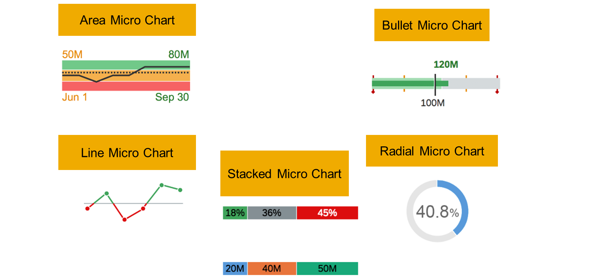
A micro chart will not display any title, description, measure labels or footers while used in a table column. By default, the micro chart has a size "XS". You can change the size by adding a corresponding setting to the manifest.json file. For more information, see [Adding a Micro Chart to a Table](https://sapui5.hana.ondemand.com/sdk/#/topic/b8312a4adde54f33a89480dbe12d8632). You can use SAP Fiori tools to create a new column containing a micro chart. You can choose between using guided development (the _Add a Smart Micro Chart to a Table_ guide) and the Page Editor.
## Add a Bullet Micro Chart to the Table Column
You may want to provide an overview of the total amount of supplements per booking without having to navigate to each booking's detailed page. To do this, you can use a bullet micro chart.
The micro chart is displayed in the booking table on the object page. It has a predefined target and two thresholds. Its bar chart will show a different color, depending on the value for each booking. This provides a quick overview of the values for each booking without having to navigate to the sub-object page.
### Task Flow
First, you will introduce and implement a new property in the _Booking_ entity called _Total Amount of Supplements_.
Then, you'll use the application modeler to add a new column containing a bullet micro chart to the _Booking_ table.
Finally, you will update the .csv file containing the initial app data to include the new property and add the relevant values for existing bookings.
### Prerequisites
You have completed the exercise Add a Progress Indicator Column to the Table in the unit Configuring the Content of Table Columns (lesson: Creating a Visual Representation of a Progress Indicator). Alternatively, you can check out its solution branch: [solution/add-progress-indicator-to-table-column](https://github.com/SAP-samples/fiori-elements-v4-cap-advanced/tree/solution/add-progress-indicator-to-table-column).
### Watch the Simulation and Perform the Steps
This exercise contains a simulation that takes you through all the steps described below. You can follow the simulation and perform the steps using your own trial account.
Exercise[Start Exercise](https://learnsap.enable-now.cloud.sap/pub/mmcp/index.html?show=project!PR_F304F32DE571C4A3:uebung)
### Steps
  1. Open the selected travel's object page.
  2. Switch to SAP Business Application Studio and add the following code snippet to the Booking entity definition (line 37 of db/schema.cds):
Code Snippet
Copy codeSwitch to dark mode

```

1

TotalSupplPrice : Decimal(16, 3);

```

This adds a new property TotalSupplPrice to the entity Booking. It displays the total price of all supplements in the booking.
  3. Open srv/travel-service.js to implement a method called _update_totals_supplement; this will update the TotalSupplPrice property:
Code Snippet
Copy codeSwitch to dark mode

```

12345678

 /**
   * Update the Booking's TotalSupplPrice
   */
this._update_totals_supplement = async function (booking) {
    const { totals } = await SELECT.one `coalesce (sum (Price),0) as totals` .from (BookingSupplement.drafts) .where
     `to_Booking_BookingUUID = ${booking}`
    return  UPDATE (Booking.drafts, booking) .with({TotalSupplPrice: totals})
}

```

  4. Update the method this.after ( 'UPDATE', 'BookingSupplement.drafts') in travel-service.js:
Code Snippet
Copy codeSwitch to dark mode

```

123456789101112

/**
   * Update the Travel's TotalPrice when a Supplement's Price is modified.
   */
 this.after ('UPDATE', 'BookingSupplement.drafts', async (_,req) => { if ('Price' in req.data) {
    // We need to fetch the Travel's UUID for the given Supplement target
    const { booking } = await SELECT.one `to_Booking_BookingUUID as booking`
      .from (BookingSupplement.drafts).where({BookSupplUUID:req.data.BookSupplUUID})
    const { travel } = await SELECT.one `to_Travel_TravelUUID as travel` .from (Booking.drafts)
      .where `BookingUUID = ${booking} `
    await this._update_totals_supplement (booking)
    return this._update_totals4 (travel)
  }})

```

  5. Use the page editor to add a new column with a bullet micro chart to the table on the object page.
    1. Select _webapp > Show Page Map_ and click the pencil icon on _Object Page_.
    2. Expand _Bookings > Table > Columns_ and select the plus icon to add a new column. Choose _Chart Column_ and _Bullet_ as the chart type.
    3. Choose _TotalSupplPrice_ as a _Value_ and enter 120 as the _Maximum Value_. Select _Add_.
    4. Note that a new column _TotalSupplPrice_ has been added. Change its title to _Supplements_ and select the globe icon to add the text to i18n.properties.
    5. Select _Edit in source file_ to check the annotations generated by the page editor.
    6. You can see the generated annotations @UI.DataPoint and @UI.Chart. Add the values as shown in the code snippet below:
Code Snippet
Copy codeSwitch to dark mode

```

123456789101112131415161718192021222324252627

annotate TravelService.Booking with @(
    UI.DataPoint #TotalSupplPrice: {
        Value                 : TotalSupplPrice,
        MinimumValue          : 0,
        MaximumValue          : 120,
        TargetValue           : 100,
        Visualization         : #BulletChart,
        //  Criticality : TotalSupplPrice, // it has precedence over criticalityCalculation => in order to have the criticality color do not use it
        CriticalityCalculation: {
            $Type                 : 'UI.CriticalityCalculationType',
            ImprovementDirection  : #Maximize,
            DeviationRangeLowValue: 20,
            ToleranceRangeLowValue: 75
        }
    },
    UI.Chart #TotalSupplPrice    : {
        ChartType        : #Bullet,
        Title            : 'total supplements',
        AxisScaling      : {$Type: 'UI.ChartAxisScalingType', },
        Measures         : [TotalSupplPrice, ],
        MeasureAttributes: [{
            DataPoint: '@UI.DataPoint#TotalSupplPrice',
            Role     : #Axis1,
            Measure  : TotalSupplPrice,
        }, ],
    }
);

```

  6. Open sap.fe.travel-Booking.csv. This file contains initial app data for the entity Booking. As you have added a new property TotalSupplPrice to this entity, you also have to update this file with a new column TotalSupplPrice. The column will contain the values for existing bookings.
    1. Copy and replace the sap.fe.cap.travel-Booking.csv file from the Github repository at [db/data/sap.fe.cap.travel-Booking.csv](https://github.com/SAP-samples/fiori-elements-v4-cap-advanced/blob/solution/add-bullet-micro-chart-to-table/db/data/sap.fe.cap.travel-Booking.csv). This file contains the TotalSupplPricecolumn with the updated values.
  7. Switch back to the app window and check the results.
    1. Select a travel to navigate to its object page.
    2. You can see the new column in the _Bookings_ table. It displays the total sum of Supplements per booking visualized as a bullet micro chart.

### Result
You have learned how to add and configure a bullet micro chart to a table column.
Note
  * You can find the solution for this exercise on [GitHub](https://github.com/SAP-samples/fiori-elements-v4-cap-advanced).
  * The solution branch is [solution/add-bullet-micro-chart-to-table](https://github.com/SAP-samples/fiori-elements-v4-cap-advanced/tree/solution/add-bullet-micro-chart-to-table).
  * A direct comparison of this branch with the previous exercise is available on [GitHub](https://github.com/SAP-samples/fiori-elements-v4-cap-advanced/compare/solution/add-progress-indicator-to-table-column..solution/add-bullet-micro-chart-to-table).


### Configuring Contact Quick Views in a Table

*Source: https://learning.sap.com/courses/developing-an-sap-fiori-elements-app-based-on-a-cap-odata-v4-service/configuring-contact-quick-views-in-a-table_ec64ed54-d2cb-4888-b6d0-5eacd3ddba1c*

Objective
After completing this lesson, you will be able to enable additional contact information for a field in a table on demand.
## Contact Quick Views in a Table
You can display additional contact information on demand both in a table and in the object page section. It is displayed in a popover called _Contact Quick View_.
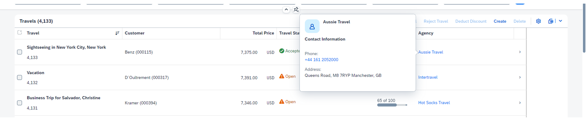
You can display email, fax, address, or telephone number in a contact quick view.
## Add a Contact Quick View to the Table
A contact quick view is a popover providing a quick way to check the contact's address and phone number.
### Prerequisites
You have completed the exercise Add a Bullet Micro Chart to the Table Column in the unit Configuring the Content of Table Columns (lesson: Configuring Micro Charts to Visualize Key Figures). Alternatively, you can check out its solution branch: [solution/add-bullet-micro-chart-to-table](https://github.com/SAP-samples/fiori-elements-v4-cap-advanced/tree/solution/add-bullet-micro-chart-to-table).
### Task Flow
In this exercise, you will first add a _Contact Name_ column to the _Travels_ table. Then, you will add the details for the _Contact Quick View_. Finally, you will check the results.
### Watch the Simulation and Perform the Steps
This exercise contains a simulation displaying all the steps. You can follow the simulation with your own trial account.
Exercise[Start Exercise](https://learnsap.enable-now.cloud.sap/pub/mmcp/index.html?show=project!PR_867E8717A40452AC:uebung)
### Steps
  1. Use the application modeler to add a new contact column to the _Travels_ table.
    1. Select _webapp > Show Page Map_ and click the pencil icon on _List Report_.
    2. Expand _Columns_ and select the plus icon to add a new column. Choose _Add Contact Column_ and _to_Agency/Name_ as the column name.
    3. Select the _Add_.
  2. You have added the _Contact Name_ column. You can edit its settings on the right side of the screen.
    1. Change its label to _Agency_.
    2. Scroll down to add details for the _Contact Quick View_.
    3. Select _Add Phone_ and choose _Phone number_.
    4. Select _Add Address_ and choose _Street_ , _City_ , _PostalCode_ , and _CountryCode_code_.
  3. Switch to the app window to check the new column with the quick contact view.
    1. Select _Show More per Row_ if necessary.
    2. The contact quick view opens. You can see detailed contact information such as _Phone_ and _Address_.
  4. You can also see the annotations which have been generated by the application modeler.
    1. The information for the popover is defined in the @Communication.Contact annotation.
Code Snippet
Copy codeSwitch to dark mode

```

1234567891011121314151617

annotate TravelService.TravelAgency with @(Communication.Contact #contact: {
    $Type: 'Communication.ContactType',
    fn   : Name,
    tel  : [{
        $Type: 'Communication.PhoneNumberType',
        type : #work,
        uri  : PhoneNumber,
    }, ],
    adr  : [{
        $Type   : 'Communication.AddressType',
        type    : #work,
        street  : Street,
        locality: City,
        code    : PostalCode,
        country : CountryCode_code,
    }, ],
});

```

    2. This annotation is added to the @UI.LineItem annotation of the travel entity.
Code Snippet
Copy codeSwitch to dark mode

```

12345

{
       $Type : 'UI.DataFieldForAnnotation',
       Target: 'to_Agency/@Communication.Contact#contact',
       Label : 'Agency',
 }

```

### Result
In this lesson, you have learned how to add additional contact information for a table field. The added information will be displayed on demand as a popover.
Note
  * You can find the solution for this exercise on [GitHub](https://github.com/SAP-samples/fiori-elements-v4-cap-advanced).
  * The solution branch is [solution/add-quick-contact-view-to-table](https://github.com/SAP-samples/fiori-elements-v4-cap-advanced/tree/solution/add-quick-contact-view-to-table).
  * A direct comparison of this branch with the previous exercise is available on [GitHub](https://github.com/SAP-samples/fiori-elements-v4-cap-advanced/compare/solution/add-bullet-micro-chart-to-table..solution/add-quick-contact-view-to-table).

[Continue to quiz](https://learning.sap.com/courses/developing-an-sap-fiori-elements-app-based-on-a-cap-odata-v4-service/configuring-the-content-of-table-columns_e01dae6d-b870-30b3-b813-6be831dde709)


### Quiz

*Source: https://learning.sap.com/courses/developing-an-sap-fiori-elements-app-based-on-a-cap-odata-v4-service/configuring-the-content-of-table-columns_e01dae6d-b870-30b3-b813-6be831dde709*

It's time to put what you've learned to the test, get 3 right to pass this unit.
1.
### Micro charts are interactive charts.
Choose the correct answer.
True
False
2.
### You can configure a contact quick view column by:
There are two correct answers.
Manually adding some settings to the manifest.json file.
Using the Page Map.
Manually adding a @Communication.Contact annotation for the popup and referencing it in the @UI.LineItem annotation.
3.
### You can configure the progress indicator column by:
There are two correct answers.
Using the Page Map or Guided Development.
Configuring the annotation @UI.ProgressIndicator manually and referencing it in the corresponding @UI.LineItem annotation of the table.
Configuring the annotation @UI.DataPoint manually and referencing it in the corresponding @UI.LineItem annotation of the table.
Submit answers[Next unit](https://learning.sap.com/courses/developing-an-sap-fiori-elements-app-based-on-a-cap-odata-v4-service/configuring-multiple-views-using-single-table-mode_f66bbb36-20de-4d26-a25a-f27048a5b78a)


### Using Multiple Views in the List Report

*Source: https://learning.sap.com/courses/developing-an-sap-fiori-elements-app-based-on-a-cap-odata-v4-service/configuring-multiple-views-using-single-table-mode_f66bbb36-20de-4d26-a25a-f27048a5b78a*

Objective
After completing this lesson, you will be able to configure several table views using single table mode in the list report.
## Multiple Views Using Single Table Mode
By default, the list report contains one table displaying the data for one business object.
For more complex scenarios you may need to provide multiple views of a table displaying one business object. Each view can display different pre-filtered states.
Technically, the UI contains just a single table instance with one table toolbar. Table-level view management is also available, but Fiori Design Guidelines strongly advise against it. For more information, see [List Report – Content Area](https://experience.sap.com/fiori-design-web/list-report-content-area-fiori-elements/).
A segmented button is used to switch between the views. If more than three views are present, selection control is shown instead.
You can enable the display of the number of total rows in the view by adding the showCounts setting to the manifest.json file. For more information, see [Defining Multiple Views on a List Report Table - Single Table Mode](https://sapui5.hana.ondemand.com/sdk/#/topic/0d390fed360c4c58a0f0619338938de1.html).
You can either use Configure Multiple Views guide from Guided Development for step-by-step instructions or the Page Editor to support you in creating multiple views.
## Create Multiple Table Views Using Single Table Mode
To make a list report table easier to navigate, you can create different views. When a view is selected, only entries that meet the parameters defined in the view will be displayed. As this is one table with different filters, it is known as single table mode.
In this exercise, you will create three table views based on _Travel Status_ : _Open_ , _Accepted_ and _Canceled_.
### Task Flow
In this exercise, you will first define the @UI.SelectionVariant annotations for the three views. Then, you will add these annotations as quick variant selection paths using the Page Map. It will add these annotations to the manifest.json file. Finally, you will check the results.
### Prerequisites
You have completed the exercise Add a Contact Quick View to the Table in the unit Configuring the Content of Table Columns (lesson: Configuring Contact Quick Views in a Table). Alternatively, you can check out its solution branch: [solution/add-quick-contact-view-to-table](https://github.com/SAP-samples/fiori-elements-v4-cap-advanced/tree/solution/add-quick-contact-view-to-table).
### Watch the Simulation and Perform the Steps
This exercise contains a simulation displaying all the steps. You can follow the simulation with your own trial account.
Exercise[Start Exercise](https://learnsap.enable-now.cloud.sap/pub/mmcp/index.html?show=project!PR_9AD75061D9ACE385:uebung)
### Steps
  1. Define the@UI.SelectionVariant annotations for the three views.
    1. Open the layouts.cds file in SAP Business Application Studio.
    2. Add the @UI.SelectionVariant annotation with the qualifiercanceled to the Travel target entity. It will select the entries with TravelStatus_code='X', that is, _Canceled_.
Code Snippet
Copy codeSwitch to dark mode

```

1234567891011121314151617181920

annotate TravelService.Travel with @UI: {
    SelectionVariant #canceled: {
        $Type           : 'UI.SelectionVariantType',
        ID              : 'canceled',
        Text            : 'canceled',
        Parameters      : [

        ],
        FilterExpression: '',
        SelectOptions   : [{
            $Type       : 'UI.SelectOptionType',
            PropertyName: TravelStatus_code,
            Ranges      : [{
                $Type : 'UI.SelectionRangeType',
                Sign  : #I,
                Option: #EQ,
                Low   : 'X',
            }, ],
        }, ],
    },

```

    3. Add the second @UI.SelectionVariant annotation with the qualifier open. This will select the entries with TravelStatus_code='O', that is, _Opened_.
Code Snippet
Copy codeSwitch to dark mode

```

1234567891011121314151617181920212223

SelectionVariant#open  : {
         $Type : 'UI.SelectionVariantType',
         ID : 'open',
         Text : 'open',
         Parameters : [

         ],
         FilterExpression : '',
         SelectOptions : [
             {
                 $Type : 'UI.SelectOptionType',
                 PropertyName : TravelStatus_code,
                 Ranges : [
                     {
                         $Type : 'UI.SelectionRangeType',
                         Sign : #I,
                         Option : #EQ,
                         Low : 'O',
                     },
                 ],
             },
         ],
     },

```

    4. Add the third @UI.SelectionVariant annotation with the qualifier accepted. This will select the entries with TravelStatus_code='A', which means _Accepted_.
Code Snippet
Copy codeSwitch to dark mode

```

1234567891011121314151617181920

    SelectionVariant #accepted: {
        $Type           : 'UI.SelectionVariantType',
        ID              : 'accepted',
        Text            : 'accepted',
        Parameters      : [

        ],
        FilterExpression: '',
        SelectOptions   : [{
            $Type       : 'UI.SelectOptionType',
            PropertyName: TravelStatus_code,
            Ranges      : [{
                $Type : 'UI.SelectionRangeType',
                Sign  : #I,
                Option: #EQ,
                Low   : 'A',
            }, ],
        }, ],
    }
};

```

    5. Close the layouts.cds file.
  2. Add these annotations as quick variant selection paths.
    1. Select _Webapp >Show Page Map_.
    2. Add the annotation paths for _Open_ , _Accepted_ , and _Canceled_ travels.
  3. Check the results.
    1. All three annotation paths now appear in the _Quick Variant Selection_.
    2. They also have been added to manifest.json.
    3. You can now see three buttons in your app: _Open_ , _Accepted_ , and _Canceled_.

### Result
You have learned how to add multiple views using single table mode to the list report.
Note
  * You can find the solution for this exercise on [GitHub](https://github.com/SAP-samples/fiori-elements-v4-cap-advanced).
  * The solution branch is [solution/create-multiple-table-views-single-table-mode](https://github.com/SAP-samples/fiori-elements-v4-cap-advanced/tree/solution/create-multiple-table-views-single-table-mode).
  * You can see the code changes compared to the previous branch on [GitHub](https://github.com/SAP-samples/fiori-elements-v4-cap-advanced/compare/solution/add-quick-contact-view-to-table..solution/create-multiple-table-views-single-table-mode).

### Next Steps
For more information, see
  * [Multiple Views on List Report Tables](https://ui5.sap.com//#/topic/a37df408044e41ef84e67207c8658d4f)
  * [Defining Multiple Views on a List Report Table - Single Table Mode](https://ui5.sap.com//#/topic/0d390fed360c4c58a0f0619338938de1.html)


### Creating Multiple Views Using Multiple Table Mode

*Source: https://learning.sap.com/courses/developing-an-sap-fiori-elements-app-based-on-a-cap-odata-v4-service/creating-multiple-views-using-multiple-table-mode_aa0befbd-0bf8-492e-be4f-9fbe4dfc4c1b*

Objective
After completing this lesson, you will be able to configure multiple views using multiple table mode in the list report.
## Multiple Views Using Multiple Table Mode
In the previous lesson, you learned how to add several views as a single table mode to the list report. In this lesson, you will learn about multiple table mode. In multiple table mode SAP Fiori elements creates a separate table instance for each view. It allows you to define different table toolbars and different table columns for each view. You can also have a separate table variant management for each view.
Note
SAP Fiori design guidelines don’t recommend using table variant management. For more information, see [List Report – Content Area](https://experience.sap.com/fiori-design-web/list-report-content-area-fiori-elements/).
Each view is displayed as a tab on the table. An icon tab bar is rendered above the table for switching between the views. Only the table on the currently selected tab is visible.
Besides tables, you can also apply multiple table mode on charts.
For step-by-step instructions, use the Configure Multiple Views aid from guided development. You can also use the Page Editor to create multiple views.
### Further Reading
  * [Multiple Views on List Report Tables](https://sapui5.hana.ondemand.com/sdk/#/topic/a37df408044e41ef84e67207c8658d4f)
  * [Defining Multiple Views on a List Report Table](https://sapui5.hana.ondemand.com/sdk/#/topic/37aeed74e17a42caa2cba3123f0c15fc.html)

## Create Multiple Table Views Using Multiple Table Mode
### Usage Scenario
Using the multiple table mode, you want to visualize the data displayed on the Travels table based on its travel status. The columns and toolbar actions can differ in each table view.
### Task Flow
In this exercise, you will perform the following tasks:
  * Create three different table views of the table.
  * Add an @UI.SelectionPresentationVariant annotation for each table view.
  * Define columns and actions for each table view.

### Prerequisites
You have completed the exercise Add a Contact Quick View to the Table in the unit Configuring the Content of Table Columns (lesson: Configuring Contact Quick Views in a Table). You also need to undo the changes made in the exercise Create Multiple Table Views Using Single Table Mode before starting this exercise. Alternatively, you can check out the solution branch of the exercise Add a Contact Quick View to a Table[solution/add-quick-contact-view-to-table](https://github.com/SAP-samples/fiori-elements-v4-cap-advanced/tree/solution/add-quick-contact-view-to-table).
### Watch the Simulation and Perform the Steps
This exercise contains a simulation that takes you through all the steps described below. You can follow the simulation and perform the steps using your own trial account.
Exercise[Start Exercise](https://learnsap.enable-now.cloud.sap/pub/mmcp/index.html?show=project!PR_3690F4A2C872F5A2:uebung)
### Steps
  1. Open your CAP project in SAP Business Application Studio.
    1. In the _Explorer_ view, select Projects\fiori-elements-v4-cap-advanced\app\travel_processor\webapp.
    2. Right-click on _webapp_ and select _Show Page Map_. The Page Map of the Manage Travels application appears.
  2. Create table views.
    1. On the list report page, choose the _Edit_ option. The TravelList Page Editor appears.
    2. Select _Views_.
    3. Click the _Add_ icon to add a new table view.
    4. Select _Add Table View_. The Add Table View dialog appears.
    5. Select _Add_ to add the new table view.
    6. Repeat steps c to e to create another table view.
  3. Define the labels for the table views.
    1. Select the required table view.
    2. In the right pane, under _View Label_ , enter the name of the table view as Open.
    3. Click the _Edit in source file_ icon next to the label of the table view.
    4. Select _Apply_ to rename the existing value.
    5. Repeat steps a to d to define the labels of other table views as Accepted and Canceled.
  4. Configure the @UI.SelectionPresentationVariant annotation of the table view, Open.
    1. Select the table view, Open.
    2. In the right pane, under Presentation Variant: Annotation, select the _Edit in source code_ icon. The layout.cds file opens, and you can see the code generated for @UI.SelectionPresentationVariant.
    3. Complete the code by defining the SelectOptions property.
Code Snippet
Copy codeSwitch to dark mode

```

12345678910111213141516171819

annotate TravelService.Travel with @(
    UI.SelectionPresentationVariant #tableView : {
        $Type              : 'UI.SelectionPresentationVariantType',
        PresentationVariant: ![@UI.PresentationVariant],
        SelectionVariant   : {
            $Type        : 'UI.SelectionVariantType',
            SelectOptions: [{
                $Type       : 'UI.SelectOptionType',
                PropertyName: TravelStatus_code,
                Ranges      : [{
                    $Type : 'UI.SelectionRangeType',
                    Sign  : #I,
                    Option: #EQ,
                    Low   : 'O',
                }, ],
            }],
        },
        Text               : '{i18n>Open}',
    },

```

Note
The code snippet for the table view, Open is partially generated by the Page Map. You must explicitly add the code for the SelectOptions property in the SelectionVariant.
In the code snippet, the @UI.LineItem annotation is not referenced under PresentationVariant/Visualizations property because you have not defined any columns or actions for the Open table view. Thus, the Open table view uses the default @UI.LineItem annotation without any qualifier.
  5. Configure the @UI.SelectionPresentationVariant annotation of the table view, Accepted.
    1. Select the table view, Accepted.
    2. Perform steps b to c of step 4.
Code Snippet
Copy codeSwitch to dark mode

```

12345678910111213141516171819202122

 UI.SelectionPresentationVariant #tableView1: {
        $Type              : 'UI.SelectionPresentationVariantType',
        PresentationVariant: {
            $Type         : 'UI.PresentationVariantType',
            Visualizations: ['@UI.LineItem#tableView', ],
        },
        SelectionVariant   : {
            $Type        : 'UI.SelectionVariantType',
            SelectOptions: [{
                $Type       : 'UI.SelectOptionType',
                PropertyName: TravelStatus_code,
                Ranges      : [{
                    $Type : 'UI.SelectionRangeType',
                    Sign  : #I,
                    Option: #EQ,
                    Low   : 'A',
                }, ],
            }],
        },
        Text               : '{i18n>Accepted}',
    }
);

```

  6. Configure the @UI.SelectionPresentationVariant of the table view, Canceled
    1. Select the table view, Canceled.
    2. Perform steps b and c of step 4.
Code Snippet
Copy codeSwitch to dark mode

```

12345678910111213141516171819202122

 UI.SelectionPresentationVariant #tableView2: {
        $Type              : 'UI.SelectionPresentationVariantType',
        PresentationVariant: {
            $Type         : 'UI.PresentationVariantType',
            Visualizations: ['@UI.LineItem#tableView1', ],
        },
        SelectionVariant   : {
            $Type        : 'UI.SelectionVariantType',
            SelectOptions: [{
                $Type       : 'UI.SelectOptionType',
                PropertyName: TravelStatus_code,
                Ranges      : [{
                    $Type : 'UI.SelectionRangeType',
                    Sign  : #I,
                    Option: #EQ,
                    Low   : 'X',
                }, ],
            }],
        },
        Text               : '{i18n>Canceled}',
    }
);

```

  7. Configure actions for the table view, Accepted.
    1. On the TravelList Page Map, click to expand the Accepted table view. The Table Toolbar appears.
    2. Click Table Toolbar.
    3. Select Actions and click the _Add_ icon.
    4. Click Add Actions. The Add Action dialog appears.
    5. From the Actions drop-down, select TravelService.rejectTravel.
    6. Click Add.
  8. Configure columns for the table view, Accepted.
    1. Select Columns and click the add icon.
    2. Select Add Basic Columns. The Add Basic Column dialog appears.
    3. From the Columns dropdown, select the required columns.
    4. Click Add to add the columns to the table view. The following code snippet shows the @UI.LineItem annotation generated by the Page Editor.
Code Snippet
Copy codeSwitch to dark mode

```

1234567891011121314151617181920212223

  UI.LineItem #tableView : [
        {
            $Type : 'UI.DataFieldForAction',
            Action : 'TravelService.rejectTravel',
            Label : 'rejectTravel',
        },
        {
            $Type : 'UI.DataField',
            Value : Description,
        },
        {
            $Type : 'UI.DataField',
            Value : LastChangedAt,
        },
        {
            $Type : 'UI.DataField',
            Value : TravelID,
        },
        {
            $Type : 'UI.DataField',
            Value : to_Customer_CustomerID,
        },],

```

Note
The Page Editor has generated a new @UI.LineItem annotation (with the qualifier #tableView) because you have defined the columns and actions for the Accepted table view. The @UI.LineItem annotation is referenced under PresentationVariant/Visualizations of the corresponding @UI.SelectionPresentationVariant annotation.
  9. Configure columns for the table view, Canceled
    1. On the TravelList Page Map, click to expand the Canceled table view. The Table Toolbar appears.
    2. Select Columns and click the add icon.
    3. Select Add Basic Columns. The Add Basic Column dialog appears.
    4. From the Columns drop-down, select the required columns.
    5. Click _Add_ to add the columns to the table view. The following code snippet shows the @UI.LineItem annotation generated by the Page Editor.
Code Snippet
Copy codeSwitch to dark mode

```

123456789101112131415161718192021222324

annotate TravelService.Travel with @(
    UI.LineItem #tableView1                    : [
        {
            $Type: 'UI.DataField',
            Value: Description,
        },
        {
            $Type: 'UI.DataField',
            Value: LastChangedAt,
        },
        {
            $Type: 'UI.DataField',
            Value: TravelID,
        },
        {
            $Type: 'UI.DataField',
            Value: to_Agency_AgencyID,
        },
        {
            $Type: 'UI.DataField',
            Value: to_Customer_CustomerID,
        },
    ],

```

Note
The Page Map has generated the @UI.LineItem annotation with the qualifier #tableView1. The @UI.LineItem annotation is referenced under PresentationVariant/Visualizations of the corresponding @UI.SelectionPresentationVariant annotation.
  10. Check the table views on the Travels app.
    1. Open the Travels app. You can see the newly created table views displayed as tabs. By default, the Open tab is selected.
    2. On the Travels table, select the check box corresponding to the required travels.
    3. Select Reject Travel.
    4. Click the Accepted tab. The table displays only the selected columns and the travel entries with the travel status Accepted.
    5. Click Canceled. The table displays only the selected columns and travel entries that has travel status as Canceled.

### Result
You have enabled the multiple table mode on list report table.
Note
  * You can find the solution for this exercise on [GitHub](https://github.com/SAP-samples/fiori-elements-v4-cap-advanced).
  * The solution branch is [solution/create-multiple-table-views-multiple-table-mode](https://github.com/SAP-samples/fiori-elements-v4-cap-advanced/tree/solution/create-multiple-table-views-multiple-table-mode).
  * You can see the code changes compared to the previous branch on [GitHub](https://github.com/SAP-samples/fiori-elements-v4-cap-advanced/compare/solution/add-quick-contact-view-to-table..solution/create-multiple-table-views-multiple-table-mode).

[Continue to quiz](https://learning.sap.com/courses/developing-an-sap-fiori-elements-app-based-on-a-cap-odata-v4-service/using-multiple-views-in-the-list-report_ab22f486-7a2c-3d0e-89eb-99a5be56f1e5)


### Quiz

*Source: https://learning.sap.com/courses/developing-an-sap-fiori-elements-app-based-on-a-cap-odata-v4-service/using-multiple-views-in-the-list-report_ab22f486-7a2c-3d0e-89eb-99a5be56f1e5*

It's time to put what you've learned to the test, get 2 right to pass this unit.
1.
### In multiple views using multiple table mode, technically, there is just one table instance with one table toolbar and one table variant (if activated).
Choose the correct answer.
True
False
2.
### You can configure multiple views by:
There are four correct answers.
Using Guided Development.
Manually adding an @UI.LineItem and @UI.MultipleViews annotation.
Using the Page Map.
Manually adding an @UI.SelectionVariant or @UI.SelectionPresentationVariant, or an @UI.PresentationVariant annotation for each view and declaring their paths in the manifest.json file.
Manually adding an @UI.LineItem annotation and referencing it in the @UI.SelectionPresentationVariant or @UI.PresentationVariant annotation and declaring their paths in the manifest.json file.
Submit answers[Next unit](https://learning.sap.com/courses/developing-an-sap-fiori-elements-app-based-on-a-cap-odata-v4-service/placing-key-figures-in-the-header-area_c9dca7b8-25e4-4b3d-b7f0-3b7e01b35c27)


### Shaping the Header Area of the Object Page

*Source: https://learning.sap.com/courses/developing-an-sap-fiori-elements-app-based-on-a-cap-odata-v4-service/placing-key-figures-in-the-header-area_c9dca7b8-25e4-4b3d-b7f0-3b7e01b35c27*

Objective
After completing this lesson, you will be able to populate the object page header with the most important data.
## The Object Page Header
The object page displays the detailed information about an object. It can contain multiple sections such as tables, charts, and forms.
The top section of the object page is called the object page header. It can consist of a title, a description, an image, some actions, and contains a number of header sections known as facets. Header facets are containers. You can add different types of micro charts, progress indicator, rating indicator and key figures into the header facets. For more information about header facets, see [Header Facets](https://sapui5.hana.ondemand.com/sdk/#/topic/17dbd5b7a61e4cdcb079062e976cd63f).
The key figures are represented by the @UI.DataPoint annotation. Usually, the data point is a number but can also be a text, for example, a status value. For more information about data points, see [Data Points](https://sapui5.hana.ondemand.com/sdk/#/topic/c2a389a11a704b00886440031a3d43f9).
## Add Travel Status, Total Price, and the Deduct Discount Action to the Header Area
In this exercise, you will learn to configure the key figures and actions in the header area of the object page. You can use either the guided development aid named Add a Header Facet Using Data Points or the Page Editor for configuring the header facets by using data points.
### Usage Scenario
The user must be able to execute the action Deduct Discount on the object page similar to the list report. They must see the two key figures Total Price and Travel Status prominently on the object page header.
### Task Flow
You will first add the action Deduct Discount to the object page header. You may have already created and implemented this action in your CAP service, and used it in the list report table toolbar in one of the previous exercises. You can use the Page Editor to configure it.
Next, you can learn to add two key figures Total Price and Travel Status as the data point header sections. The Page Editor can also help you to achieve this.
### Prerequisites
You have completed the exercise Create Multiple Table Views Using Single Table Mode in the unit Using Multiple Views in the List Report (lesson: Configuring Multiple Views Using Single Table Mode). Alternatively, you can check out its solution branch: [solution/create-multiple-table-views-single-table-mode](https://github.com/SAP-samples/fiori-elements-v4-cap-advanced/tree/solution/create-multiple-table-views-single-table-mode).
### Watch the Simulation and Perform the Steps
This exercise contains a simulation that takes you through all the steps described below. You can follow the simulation and perform the steps using your own trial account.
Exercise[Start Exercise](https://learnsap.enable-now.cloud.sap/pub/mmcp/index.html?show=project!PR_EC175727B917FC9C:uebung)
### Steps
  1. Add the action Deduct Discount.
    1. Open your CAP project in SAP Business Application Studio.
    2. In the Explorer view, select Projects\fiori-elements-v4-cap-advanced\app\travel_processor\webapp.
    3. Right-click on _webapp_.
    4. Select _Show Page Map_. The _Page Map-travel_ appears.
    5. Select the _Edit_ icon of the object page. The page map of _TravelObjectPage_ appears.
    6. Under _Header_ , select _Actions_.
    7. Under _Actions_ , select the _Add_ icon. The _Add Actions_ dialog appears.
    8. From the _Actions_ drop-down, choose **TravelService.deductDiscount**.
    9. Select _Add_. The action _deductDiscount_ is added.
    10. In the right pane, under _Label_ , enter the label name **Deduct Discount**.
    11. Select the globe icon corresponding to the label name.
    12. Select _Apply_. The label text is added to the i18n.properties file.
  2. Add the data point header Travel Status.
    1. Switch back to the SAP Business Application Studio. The Page Editor is still open.
    2. Under _Header_ , select _Header Sections_.
    3. Select the _Add_ icon.
    4. Choose **Add Data Point Section**. The _Add Data Point Section_ dialog appears.
    5. From the _Value Source Property_ drop-down, choose **TravelStatus_code**.
    6. Select _Add_.
    7. In the right pane, under _Label_ , enter the label name **Travel Status**.
    8. Select the globe icon corresponding to the label name.
    9. Select _Apply_. The label text is added to the i18n.properties file.
    10. Under _Criticality_ , from the drop-down, chose **criticality**.
  3. Add the data point header Total Price.
    1. Switch back to the SAP Business Application Studio. The Page Editor is still open.
    2. Under _Header_ , select _Header Sections_.
    3. Select the _Add_ icon.
    4. Choose **Add Data Point Section**. The _Add Data Point Section_ dialog appears.
    5. From the _Value Source Property_ drop-down, choose **TotalPrice**.
    6. Select _Add_.
    7. In the right pane, under _Label_ , enter the label name **Total Price**.
    8. Select the globe icon corresponding to the label name.
    9. Select _Apply_.

### Result
You have learned to visualize the key figures as data point sections in the object page header. You have also added the application-specific action to the header.
Note
  * You can find the solution for this exercise on [GitHub](https://github.com/SAP-samples/fiori-elements-v4-cap-advanced).
  * The solution branch is [solution/put-travel-status-total-price-deduct-discount-to-header-area-op](https://github.com/SAP-samples/fiori-elements-v4-cap-advanced/tree/solution/put-travel-status-total-price-deduct-discount-to-header-area-op).
  * You can see the code changes compared to the previous branch on [GitHub](https://github.com/SAP-samples/fiori-elements-v4-cap-advanced/compare/solution/create-multiple-table-views-single-table-mode..solution/put-travel-status-total-price-deduct-discount-to-header-area-op).

### Next Steps
For more information, see
  * [Object Page Elements](https://sapui5.hana.ondemand.com/sdk/#/topic/645e27ae85d54c8cbc3f6722184a24a1)
  * [Displaying Actions on the Object Page](https://sapui5.hana.ondemand.com/sdk/#/topic/f65e8b196335457cbfc891418ec25cfd)
  * [Setting Up the Object Page Header](https://sapui5.hana.ondemand.com/sdk/#/topic/cce93e6f067a4133a8430c4f5d7b8fc7)
  * [Object Page Floorplan](https://experience.sap.com/fiori-design-web/object-page/)


### Enriching the Object Page Header with Micro Charts

*Source: https://learning.sap.com/courses/developing-an-sap-fiori-elements-app-based-on-a-cap-odata-v4-service/enriching-the-object-page-header-with-micro-charts_b41281e3-2997-4e04-96c9-2ad1258006cf*

Objective
After completing this lesson, you will be able to configure the bullet micro chart and progress indicator as object page header sections.
## Add the Bullet Micro Chart and the Progress Indicator to the Header Area
### Usage Scenario
The user must be able to see the progress indicator for each travel in the object page header, similar to that in the list report. Additionally, the user must be able to see the total supplements for each booking in the header of the subobject page.
### Task Flow
In this exercise, you will first add the progress indicator for a travel to the header section. You may have already created and implemented the method for calculating and updating the progress for a travel in your CAP service. You have added the progress indicator as a table column in one of the previous exercises. Here, you will use the Page Editor to add it to the travel object page as a header section. You can use the guided development aid named Add a header facet using Data Points as well.
Next, you will add a bullet micro chart. The bullet micro chart will display the total of supplements for each booking, as a header section in the subobject page. You can use the Page Editor to add the bullet micro chart.
### Prerequisites
You have completed the exercise Add Travel Status, Total Price, and the Deduct Discount Action to the Header Area in the unit Shaping the Header Area of the Object Page (lesson: Placing Key Figures in the Header Area). Alternatively, you can check out its solution branch: [solution/put-travel-status-total-price-deduct-discount-to-header-area-op](https://github.com/SAP-samples/fiori-elements-v4-cap-advanced/tree/solution/put-travel-status-total-price-deduct-discount-to-header-area-op).
### Watch the Simulation and Perform the Steps
This exercise contains a simulation that takes you through all the steps described below. You can follow the simulation and perform the steps using your own trial account.
Exercise[Start Exercise](https://learnsap.enable-now.cloud.sap/pub/mmcp/index.html?show=project!PR_E91837E1B55818B0:uebung)
### Steps
  1. Add the progress indicator to the header.
    1. Open your CAP project in Business Application Studio.
    2. In the Explorer view, select Projects\fiori-elements-v4-cap-advanced\app\travel_processor\webapp.
    3. Right-click on _webapp_.
    4. Select _Show Page Map_. The _Page Map-travel_ appears.
    5. Select the _Edit_ icon of the object page. The Page Map of _TravelObjectPage_ appears.
    6. Expand _Header Sections_. You can see the available header sections: _Travel Status_ and _Total Price_.
    7. Select the Add icon corresponding to the _Header Sections_.
    8. Choose _Add Progress Section_. The _Add Progress Section_ dialog appears.
    9. From the _Value Source Property_ dropdown, choose **Progress**.
    10. Select _Add_.
    11. In the right pane, under _Label_ , enter the label name **Progress of Travel**.
    12. Select the globe icon corresponding to the label name.
    13. Select _Apply_. The label text is added to the i18n.properties file.
  2. Add the bullet micro chart to the header of the subobject page.
    1. Switch back to the SAP Business Application Studio. The Page Editor is open.
    2. Select _Page Map_ to go back to the Page Map.
    3. Select the _Edit_ icon of the subobject page. The page map of _BookingObjectPage_ appears.
    4. Select the _Add_ icon corresponding to the _Header Sections_.
    5. Choose _Add Micro Chart Section_. The _Add Chart Header Section_ appears.
    6. From the _Chart Type_ dropdown, select **Bullet**.
    7. Select _Add_.
    8. From the _Value_ dropdown, choose **TotalSupplPrice**.
    9. From the _Maximum Value_ dropdown, enter the value **120**.
    10. Select _Add_.
    11. In the right pane, under _Label_ , enter the label name **Total Supplements**.
    12. Select the globe icon corresponding to the label name.
    13. Select _Apply_. The label text is added to the i18n.properties file.
    14. Select _Edit in source file_. The layout.cds file opens.
    15. Add the TargetValue: 100 property to the @UI.DataPoint annotation.
    16. Add the values DeviationRangeLowValue: 20 and ToleranceRangeLowValue: 75 for the CriticalityCalulation.

### Result
You have learned to add a progress indicator to the header section of the _Travel_ object page. You have also learned to add a bullet micro chart to the header section of the _Booking_ object page (subobject page).
Note
  * You can find the solution for this exercise on [GitHub](https://github.com/SAP-samples/fiori-elements-v4-cap-advanced).
  * The solution branch is [solution/add-bullet-micro-chart-and-progress-indicator-to-op](https://github.com/SAP-samples/fiori-elements-v4-cap-advanced/tree/solution/add-bullet-micro-chart-and-progress-indicator-to-op).
  * You can see the code changes compared to the previous branch on [GitHub](https://github.com/SAP-samples/fiori-elements-v4-cap-advanced/compare/solution/put-travel-status-total-price-deduct-discount-to-header-area-op..solution/add-bullet-micro-chart-and-progress-indicator-to-op).

### Next Steps
For more information, see
  * [Header Facets](https://sapui5.hana.ondemand.com/sdk/#/topic/17dbd5b7a61e4cdcb079062e976cd63f)
  * [Progress Indicator Facet](https://sapui5.hana.ondemand.com/sdk/#/topic/3b5e01c647f44ea98655b8c08feba780)
  * [Micro Chart Facet](https://sapui5.hana.ondemand.com/sdk/#/topic/e219fd0c85b842c69ac3a514e712ece5)


### Using the Singleton Entity

*Source: https://learning.sap.com/courses/developing-an-sap-fiori-elements-app-based-on-a-cap-odata-v4-service/using-the-singleton-entity_fbea2947-c372-4bed-8d20-b61ceb327d4f*

Objective
After completing this lesson, you will be able to explain how you can create and use the singleton entity in your apps.
## The Singleton Entity
A singleton is a special one-element entity introduced in OData V4. It can be referred by its name from the service root, without having to know its key and without requiring an entity set.
You can annotate an entity with @odata.singleton or @odata.singleton.nullable to use it as a singleton in your service in CAP projects.
Code Snippet
Copy codeSwitch to dark mode

```

123456789

service myService {
  @odata.singleton entity MySingleton {
    key id : String; // can be omitted
    prop1 : String;
    prop2 : Boolean;
  }
}

```

In your CAP CDS annotations, you can reference properties from the singleton entity by using the $edmjson inline mechanism.
Let us consider a typical use case for singletons in self service apps. Here, you might want to load the user context describing the user's authorizations and default settings. In this case, the back end can simply use the log on ID of the user to send the relevant data through the corresponding singleton, exposing the user context.
Check another example of the use cases for singleton entities in SAP Fiori elements applications for OData V4 "Using Singletons to influence the visibility of the Create, Delete and Edit Buttons". For more information, see [Actions](https://sapui5.hana.ondemand.com/sdk/#/topic/cbf16c599f2d4b8796e3702f7d4aae6c.html).
Note
$edmJson is supported only with CDS compiler 2.3.0 or higher.
For more information about using the $edmjson inline mechanism in CAP CDS annotations, see Dynamic Expressions section in [Serving OData APIs.](https://cap.cloud.sap/docs/advanced/odata)
## Use the Singleton Entity for Constant Values of the Bullet Micro Chart
### Usage Scenario
In this exercise, you will see one of the use cases for using a singleton entity in SAP Fiori elements application for OData V4. Instead of assigning constant values to annotation properties, like you did in the previous exercise for the bullet micro chart, you will reference values from the singleton entity. Thus, you will modify the previous exercise in which you have added a bullet micro chart to the subobject page header.
Next, you will put the static boolean values into the corresponding CSV file for the singleton entity. With the use of singletons, you reduce the amount of metadata, and have all the constant values in one singleton file.
### Task Flow
In this lesson, you will define a new entity called SupplementScope in your CAP data model. The annotation @odata.singleton will make it a singleton entity.
Next, you will create a corresponding CSV file for the SupplementScope entity and will add values for the entity's properties. Then, you will reference singleton properties in the annotations by using the inline $edmjson mechanism.
### Prerequisites
You have completed the exercise Add the Bullet Micro Chart and the Progress Indicator to the Header Area in the unit Shaping the Header Area of the Object Page (lesson: Enriching the Object Page Header with Micro Charts). Alternatively, you can check out its solution branch: [solution/add-bullet-micro-chart-and-progress-indicator-to-op](https://github.com/SAP-samples/fiori-elements-v4-cap-advanced/tree/solution/add-bullet-micro-chart-and-progress-indicator-to-op).
### Watch the Simulation and Perform the Steps
This exercise contains a simulation that takes you through all the steps described below. You can follow the simulation and perform the steps using your own trial account.
Exercise[Start Exercise](https://learnsap.enable-now.cloud.sap/pub/mmcp/index.html?show=project!PR_7B30DC2B62FED084:uebung)
### Steps
  1. Open your CAP project in SAP Business Application Studio.
  2. Define the new entity SupplementScope and annotate it with @odata.singleton.
    1. To open _Search files by names_ , press Ctrl+P on your keyboard.
    2. Choose **schema.cds fiori-elements-v4-cap-advanced/db**. The schema.cds file opens.
    3. Add the following code snippet to the schema.cds file:
Code Snippet
Copy codeSwitch to dark mode

```

123456789

@odata.singleton
entity SupplementScope {
  MinimumValue : Integer @Common.Label: 'Minimum Value';
  MaximumValue : Integer @Common.Label: 'Maximum Value';
  TargetValue : Integer @Common.Label: 'Target Value';
  DeviationRangeLowValue : Integer @Common.Label: 'Deviation Range Threshold';
  ToleranceRangeLowValue : Integer @Common.Label: 'Tolerance Range Threshold';
}

```

  3. Create a corresponding .csv file for the singleton entity and fill it with data.
    1. In the _Explorer_ view, select Projects\db\data.
    2. Expand _data_.
    3. Right-click on _data_.
    4. Select _New File..._.
    5. Enter the name of the new entity as sap.fe.cap.travel-SupplementScope.csv.
    6. Add the following properties and the corresponding values to the file:
Code Snippet
Copy codeSwitch to dark mode

```

123

DeviationRangeLowValue;ToleranceRangeLowValue;MinimumValue;MaximumValue;TargetValue
20;75;0;120;100

```

  4. Add the singleton entity SupplementScope to the service definition.
    1. To open _Search files by names_ , press Ctrl+P on your keyboard.
    2. Choose **travel-service.cds**. The travel-service.cds file opens.
    3. Add the following code snippet to the travel-service.cds file.
Code Snippet
Copy codeSwitch to dark mode

```

1

entity SupplementScope as projection on my.SupplementScope;

```

  5. Replace the constant values in the @UI.DataPoint annotation with the corresponding paths to the singleton properties.
    1. In the _Explorer_ view, select Projects\app\travel_processor\webapp.
    2. In the _Explorer_ view, select Projects\app\travel_processor\webapp.
    3. Right-click on _webapp_.
    4. Select _Show Page Map_. The Page Map of the _Travel_ application appears.
    5. Select the _Edit_ icon of the subobject page. The Page Map of the _BookingObjectPage_ appears.
    6. Expand the _Header Sections_.
    7. Select _Total Supplements_.
    8. In the right pane, select _Edit in source file_. The layout.cds file appears.
    9. To replace the existing constant values with the corresponding paths that refer to the singleton entity, add the following code snippet in the @UI.DataPoint annotation:
Code Snippet
Copy codeSwitch to dark mode

```

1234567891011121314151617

annotate TravelService.Booking with @(
  UI.DataPoint #TotalSupplPrice1: {
      Value : TotalSupplPrice,
      MinimumValue : {$edmJson: {$Path: '/SupplementScope/MinimumValue'}},
      MaximumValue : {$edmJson: {$Path: '/SupplementScope/MaximumValue'}},
      TargetValue : {$edmJson: {$Path: '/SupplementScope/TargetValue'}},
      Visualization : #BulletChart,
      // Criticality : TotalSupplPrice, // it has precedence over criticalityCalculation => in order to have the   criticality       color do not use it
     CriticalityCalculation: {
          $Type : 'UI.CriticalityCalculationType',
          ImprovementDirection : #Maximize,
          DeviationRangeLowValue: {$edmJson: {$Path: '/SupplementScope/DeviationRangeLowValue'}},
          ToleranceRangeLowValue: {$edmJson: {$Path: '/SupplementScope/ToleranceRangeLowValue'}}
    }
},

```

  6. Check the newly created singleton entity in the $metadata file.
    1. Open the _Welcome to @sap/cds Server_ page.
    2. Select _/processor/$metadata_.
#### Result
In the $metadata document, you can see that the new singleton entity SupplementScope is added to the EntityContainer. You can also see the @UI.DataPoint annotation in XML format.
  7. View the bullet micro chart on the header section.
    1. Open the _Manage Travels_ app on the browser.
    2. Under _Bookings_ , select the first row.
#### Result
You can see the bullet micro chart on the object page header.

### Result
In this lesson, you have learned to use a singleton entity in your SAP Fiori elements applications for OData V4.
Note
  * You can find the solution for this exercise on [GitHub](https://github.com/SAP-samples/fiori-elements-v4-cap-advanced).
  * The solution branch is [solution/use-singleton-for-bullet-micro-chart-on-op](https://github.com/SAP-samples/fiori-elements-v4-cap-advanced/tree/solution/use-singleton-for-bullet-micro-chart-on-op).
  * You can see the code changes compared to the previous branch on [GitHub](https://github.com/SAP-samples/fiori-elements-v4-cap-advanced/compare/solution/add-bullet-micro-chart-and-progress-indicator-to-op..solution/use-singleton-for-bullet-micro-chart-on-op).

### Next Steps
For more information, see
  * [Singletons](https://cap.cloud.sap/docs/advanced/odata#singletons)
  * [Actions](https://sapui5.hana.ondemand.com/sdk/#/topic/cbf16c599f2d4b8796e3702f7d4aae6c)

[Continue to quiz](https://learning.sap.com/courses/developing-an-sap-fiori-elements-app-based-on-a-cap-odata-v4-service/shaping-the-header-area-of-the-object-page_f8ebc9e1-d934-3c8b-91ab-855a5c419339)


### Quiz

*Source: https://learning.sap.com/courses/developing-an-sap-fiori-elements-app-based-on-a-cap-odata-v4-service/shaping-the-header-area-of-the-object-page_f8ebc9e1-d934-3c8b-91ab-855a5c419339*

It's time to put what you've learned to the test, get 3 right to pass this unit.
1.
### You can add sections to the object page header containing:
There are three correct answers.
A table
A key figure
A micro chart
An action
A chart
2.
### You can add a singleton entity to your service by:
Choose the correct answer.
Inserting it directly to the $metadata file.
Annotating it with the @odata.singleton annotation.
3.
### To add a bullet micro chart to the object page header you can:
There are two correct answers.
Maintain the @UI.Chart and @UI.DataPoint annotations and add a record to the @UI.HeaderFacets annotation referencing the @UI.Chart annotation.
Maintain the @UI.MicroChart annotation and add a record to the @UI.HeaderFacets annotation referencing the @UI.MicroChart annotation.
You can use the Page Editor which will generate all the annotations you need for that.
Submit answers[Next unit](https://learning.sap.com/courses/developing-an-sap-fiori-elements-app-based-on-a-cap-odata-v4-service/adapting-input-fields_ffee63a6-16ca-4abf-ac1c-58c88cfa6f22)


### Configuring the Body of the Object Page

*Source: https://learning.sap.com/courses/developing-an-sap-fiori-elements-app-based-on-a-cap-odata-v4-service/adapting-input-fields_ffee63a6-16ca-4abf-ac1c-58c88cfa6f22*

Objective
After completing this lesson, you will be able to adjust input fields using the Page Editor.
## Add Date Fields and a Multiline Input Field to the Object Page Subsection
### Usage Scenario
You want to add two date fields to the subsection and they must have a calendar in the value help dialog. Also, you want to extend the single input field to a multiline input field. In addition, add a placeholder text which is shown if the field is empty.
### Task Flow
In this exercise, you will perform the following tasks using the Page Editor:
  * Add two fields of the type date to the subsection of the object page.
  * Change the type of the input field and add a placeholder text that is displayed when the field is empty.

### Prerequisites
You have completed the exercise Use the Singleton Entity for Constant Values of the Bullet Micro Chart in the unit Shaping the Header Area of the Object Page (lesson: Using the Singleton Entity). Alternatively, you can check out its solution branch: [solution/use-singleton-for-bullet-micro-chart-on-op](https://github.com/SAP-samples/fiori-elements-v4-cap-advanced/tree/solution/use-singleton-for-bullet-micro-chart-on-op).
### Watch the Simulation and Perform the Steps
This exercise contains a simulation that takes you through all the steps described below. You can follow the simulation and perform the steps using your own trial account.
Exercise[Start Exercise](https://learnsap.enable-now.cloud.sap/pub/mmcp/index.html?show=project!PR_EC8E61E48573E2AE:uebung)
### Steps
  1. Open your CAP project in SAP Business Application Studio.
    1. In the Explorer view, select Projects\app\webapp.
    2. Right-click on webapp and select Show Page Map. The Page Map of the Travels application appears.
    3. Choose the Edit icon of the Travel object page. The Page Editor of the TravelObjectPage appears.
  2. Add two date fields in the General Information subsection.
    1. In the Page Layout, under Sections, expand General Information.
    2. Expand Subsections\General Information\Form\Fields.
    3. Choose _Add_.
    4. Choose _Add Basic Fields_. The _Add Basic Field_ dialog appears.
    5. From the dropdown, select BeginDate and EndDate.
    6. Choose Add. The fields End Date and Starting Date appear in the control tree of the Page Editor.
Note
In the right pane, the user can see the settings that they can change for the selected field.
  3. Change the type of the _Description_ field to multiline. Add a placeholder text to it.
    1. Perform step 1 and sub-steps a to b of step 2.
    2. Choose Description.
    3. In the right pane, under Display Type, choose the dropdown.
    4. Select Text Area.
    5. Choose the Edit in source code icon. The layout.cds file appears. The @UI.MultiLineText annotation is generated by the Page Editor.
    6. Add the @UI.Placeholder annotation to the @UI.MultiLineText annotation.
Code Snippet
Copy codeSwitch to dark mode

```

1234

annotate TravelService.Travel with {
    Description @UI.MultiLineText: true
                @UI.Placeholder  : '{i18n>DescrPlcehlder}'
}

```

    7. In the Explorer view, select Projects\\_i18n\i18n.properties. The i18n.properties file opens. Add the following placeholder text to the file:
Code Snippet
Copy codeSwitch to dark mode

```

1

DescrPlcehlder=Put your description for the travel

```

  4. View the two date fields in the Manage Travels application.
    1. Open the Manage Travels application. In the General Information subsection, you can see the fields End Date and Starting Date.
    2. Choose _Edit_.
    3. Choose the calendar icon corresponding to the End Date field.
#### Result
The calendar is automatically added as a value help to the input fields of type Date.
Note
You can see in the [solution](https://github.com/SAP-samples/fiori-elements-v4-cap-advanced/tree/solution/add-date-multiline-text-placeholder) branch for this exercise that the Page Editor has added two values of type UI.DataField to the existing annotation for the subsection ( @UI.FieldGroup#TravelData).
  5. View the multiline input field and placeholder text for the Description field.
    1. Open the Manage Travels application.
    2. Choose _Edit_.
#### Result
The single input field is extended to multi-line text field. Also, if the text field is empty, you can see the replaced with the newly added placeholder text, Put your travel description here.

### Result
In this lesson, you have learned to add a field to a section or subsection on the object page with the help of the Page Editor. You can also change the settings for the fields such as a field label, a field type, and add restrictions using the Page Editor.
Note
  * You can find the solution for this exercise on [GitHub](https://github.com/SAP-samples/fiori-elements-v4-cap-advanced).
  * The solution branch is [solution/add-date-multiline-text-placeholder](https://github.com/SAP-samples/fiori-elements-v4-cap-advanced/tree/solution/add-date-multiline-text-placeholder).
  * You can see the code changes compared to the previous branch on [GitHub](https://github.com/SAP-samples/fiori-elements-v4-cap-advanced/compare/solution/use-singleton-for-bullet-micro-chart-on-op..solution/add-date-multiline-text-placeholder).

### Next Steps
For more information, see
  * [Configuring Object Page Features](https://sapui5.hana.ondemand.com/sdk/#/topic/d26d3dd85f43441192e9c8b210746bf1)
  * [Configuring Fields](https://sapui5.hana.ondemand.com/sdk/#/topic/4b50f214f2444de7b092684f4529f29a)


### Enriching Value Help with Dependent Filtering

*Source: https://learning.sap.com/courses/developing-an-sap-fiori-elements-app-based-on-a-cap-odata-v4-service/enriching-value-help-with-dependent-filtering_abc805bb-ac75-4263-a543-87ca99cb5bea*

Objective
After completing this lesson, you will be able to set up filter dependency between fields.
## Value Help and Dependent Filtering
You can define which fields to display on the value help dialog by using the annotation @Common.ValueList. This is applicable to filter fields and the fields with value help in _Edit_ and _Create_ mode. For example, fields of a table in an object page, fields in sections or subsections.
Consider the following sample code:
Code Snippet
Copy codeSwitch to dark mode

```

123456789101112

annotate my.Booking {
 to_Carrier @Common.ValueList: {
    CollectionPath : 'Airline',
    Label : '',
    Parameters : [
      {$Type: 'Common.ValueListParameterInOut', LocalDataProperty: to_Carrier_AirlineID, ValueListProperty: 'AirlineID'},
      {$Type: 'Common.ValueListParameterDisplayOnly', ValueListProperty: 'Name'},
      {$Type: 'Common.ValueListParameterDisplayOnly', ValueListProperty: 'CurrencyCode_code'}
    ]
  };
}

```

In the sample code, for the entity Booking, the value help of the entity Airline has the value CollectionPath: 'Airline'. The first parameter of the entity Airline, maps the main entity property to_Carrier_AirlineID to the value help entity property AirlineID. The other two parameters, Name and CurrencyCode_code are a part of the entity Airline, and are of type Common.ValueListParameterDisplayOnly. They are used only for display in the value help dialog. The properties in Parameters of the type @Common.ValueList annotation are displayed in the value help dialog.

Let's familiarize the other three types of parameters.
  * Parameter type: Common.ValueListParameterIn
These parameters influence the filtering of value help of the annotated field.
Code Snippet
Copy codeSwitch to dark mode

```

123456789101112

annotate my.Booking {
  ConnectionID @Common.ValueList: {
    CollectionPath : 'Flight',
    Label : '',
    Parameters : [
      {$Type: 'Common.ValueListParameterInOut', LocalDataProperty: to_Carrier_AirlineID,    ValueListProperty: 'AirlineID'},
      {$Type: 'Common.ValueListParameterInOut', LocalDataProperty: ConnectionID, ValueListProperty: 'ConnectionID'},
{$Type: 'Common.ValueListParameterIn', LocalDataProperty: FlightDate,  ValueListProperty: 'FlightDate'},
 ….
]
}

```

In the preceding sample code, for the Booking entity, the annotated field is ConnectionID. The FlightDate is of the parameter type Common.ValueListParameterIn. It means that if a user has selected the flight date from the _Flight Date_ field, then this value is used to filter the values displayed in the value help dialog for the _Flight Number_(ConnectionID) field.
  * Parameter type: Common.ValueListParameterOut
Code Snippet
Copy codeSwitch to dark mode

```

123456789101112

annotate my.Booking {
  ConnectionID @Common.ValueList: {
    CollectionPath : 'Flight',
    Label : '',
    Parameters : [
      {$Type: 'Common.ValueListParameterInOut', LocalDataProperty: to_Carrier_AirlineID,    ValueListProperty: 'AirlineID'},
      {$Type: 'Common.ValueListParameterInOut', LocalDataProperty: ConnectionID, ValueListProperty: 'ConnectionID'},
{$Type: 'Common.ValueListParameterOut', LocalDataProperty: FlightDate,  ValueListProperty: 'FlightDate'},
 ….
]
}

```

In the preceding sample code, for the Booking entity, the annotated field is ConnectionID. The FlightDate is of the parameter type Common.ValueListParameterOut. It means that if a user selects an airline from the value help dialog of the ConnectionID field, then the _Flight Date_ field gets auto-populated with the corresponding value.
In contrast to the parameter type Common.ValueListParameterIn, this value isn't used to filter the value help dialog of the ConnenctionID field.
  * Parameter type:Common.ValueListParameterInOut
It is a combination of both In and Out parameter features.
Code Snippet
Copy codeSwitch to dark mode

```

1234567891011

annotate my.Booking {
  ConnectionID @Common.ValueList: {
    CollectionPath : 'Flight',
    Label : '',
    Parameters : [
      {$Type: 'Common.ValueListParameterInOut', LocalDataProperty: to_Carrier_AirlineID,    ValueListProperty: 'AirlineID'},
      {$Type: 'Common.ValueListParameterInOut', LocalDataProperty: ConnectionID, ValueListProperty: 'ConnectionID'},
 ….
]
}

```

In the preceding sample code, you can see that there is dependent filtering. For example, if you select the airline **European Airlines (EA)** from the _Airline_ field, this value is set as a filter value for the _Flight Number_ (ConnectionID) value help dialog and displays the flights for the selected airline only. This is the feature of the In parameter.
If a user selects a value from the value help dialog for the field ConnectionID, then the _Airline_ field gets auto-populated with the corresponding entry. Similarly, if you select a flight number in the _Flight Number_ , the _Airline_ field gets auto-populated with the corresponding information.


## Add Dependent Filtering to the Value Help of the Fields
### Usage Scenario
In the _Bookings_ table of the _Manage Travels_ app, you want to add dependent filtering to the value help of _Flight Number_.
This means in the _Bookings_ table, if you select a flight number from the _Flight Number_ field, then the fields _Flight Date_ , _Flight Price_ , and _Currency_ get auto-populated with the corresponding values. Similarly, if you select the flight date from the _Flight Date_ field, then the corresponding flights are auto-populated in the _Flight Number_ field, if any. Here, the Flight Date is set as a filter for the _Flight Number_ in the value help dialog.
### Task Flow
In this exercise, you will extend the existing configuration of the _Flight Number_ value help. Currently its value help contains _Flight Date_ , _Flight Price_ , and _Currency_ as display-only parameters. These fields are displayed in the value help dialog but they are not auto-populated after the flight number has been selected from the _Flight Number_ field. To achieve dependent filtering, you must change the parameter type of _FlightDate_ , _Price_ , and _CurrencyCode_code_ to Common.ValueListParameterInOut.
### Prerequisites
You have completed the exercise Add Date Fields and a Multiline Input Field to the Object Page Subsection in the unit Configuring the Body of the Object Page (lesson: Adapting Input Fields). Alternatively, you can check out its solution branch: [solution/add-date-multiline-text-placeholder](https://github.com/SAP-samples/fiori-elements-v4-cap-advanced/tree/solution/add-date-multiline-text-placeholder).
### Watch the Simulation and Perform the Steps
This exercise contains a simulation that takes you through all the steps described below. You can follow the simulation and perform the steps using your own trial account.
Exercise[Start Exercise](https://learnsap.enable-now.cloud.sap/pub/mmcp/index.html?show=project!PR_D37F77D31611B3A2:uebung)
### Steps
  1. Open your CAP project in SAP Business Application Studio.
  2. Open the page editor and go to _Flight Number_ column of the Bookings table on the object page.
    1. Select travel-processor in the _Explorer_ view and choose _Show Page Map_ from the context menu.
    2. Select _Configure Page_ on the object page of the _Travel_ entity.
    3. Select _Flight Number_ under _Sections_ > _Bookings_ > _Table_ > _Columns_.
  3. Open the dialog to configure value help properties for _Flight Number_.
    1. In the right window, select _Edit Properties for Value Help_.
  4. _Define Value Help Properties for Flight Number_ dialog opens. In its _Result List_ section maintain the following values.
    1. For _FlightDate_ select _InOut_ as a Dependency and _FlightDate_ as the local value.
    2. For _Price_ select _InOut_ as a Dependency and _FlightPrice_ as the local value.
    3. For _CurrencyCode_code_ select _InOut_ as a Dependency and _CurrencyCode_code_ as the local value.
    4. Select _Apply_.
  5. Check the dependent filtering behavior on the value help of an object page table on the app.
    1. Open the _Manage Travels_ app.
    2. Choose _Edit_. The edit version of the page appears.
    3. Choose _Create_ to create a new booking entry.
    4. From the _Flight Number_ field, choose the input help to open the drop-down list with valid values. The _Select_ value help dialog appears with the list of airline details.
    5. Choose the required airline.
#### Result
You can see that the _Flight Date_ field is auto-populated with the required information.
    6. Select Show More Per Row icon.
#### Result
You can see that the _Flight Price_ and the Currency fields are auto-populated with the required information.

### Result
You have now enabled dependent filtering for the value help of fields in the object page table. Similarly, you can enable dependent filtering for the value help of fields in the list report filter bar.
Note
  * You can find the solution for this exercise on [GitHub](https://github.com/SAP-samples/fiori-elements-v4-cap-advanced).
  * The solution branch is [solution/add-value-help-for-dependent-filtering](https://github.com/SAP-samples/fiori-elements-v4-cap-advanced/tree/solution/add-value-help-for-dependent-filtering).
  * You can see the code changes compared to the previous branch on [GitHub](https://github.com/SAP-samples/fiori-elements-v4-cap-advanced/compare/solution/add-date-multiline-text-placeholder..solution/add-value-help-for-dependent-filtering).

### Next Steps
For more information, see
  * [Field Help](https://sapui5.hana.ondemand.com/sdk/#/topic/a5608eabcc184aee99e1a7d88b28816c.html)
  * [In / Out Mappings in the ValueList Annotation](https://sapui5.hana.ondemand.com/sdk/#/topic/4de40b31324e4876a8421f6f642e0140.html)


### Suppressing Optional Information on Demand

*Source: https://learning.sap.com/courses/developing-an-sap-fiori-elements-app-based-on-a-cap-odata-v4-service/suppressing-optional-information-on-demand_f8b1a28c-c499-402b-a4e5-04d40da734c5*

Objective
After completing this lesson, you will be able to help the user identify the most important information by initially hiding the additional information.
## Display the Travel Administrative Data Subsection on Demand (by Adding the Show More Button)
To help users focus on the most important information, you may sometimes choose to hide additional information at first. When it is hidden, the _Show More_ button will appear instead. Selecting the button will reveal the additional information.
### Task Flow
In this exercise, you will use the Page Editor to create a new subsection in the _General Information_ section of the _Travel Object_ page. It will contain the following fields: _Created On_ , _Changed On_ , and _Created By_. Finally, you will enable the _Display on Demand_ setting for this subsection.
### Prerequisites
You have completed the exercise Add Dependent Filtering to the Value Help of the Fields in the unit Configuring the Body of the Object Page (lesson: Enriching Value Help with Dependent Filtering). Alternatively, you can check out its solution branch: [solution/add-value-help-for-dependent-filtering](https://github.com/SAP-samples/fiori-elements-v4-cap-advanced/tree/solution/add-value-help-for-dependent-filtering).
### Watch the Simulation and Perform the Steps
This exercise contains a simulation that takes you through all the steps described below. You can follow the simulation and perform the steps using your own trial account.
Exercise[Start Exercise](https://learnsap.enable-now.cloud.sap/pub/mmcp/index.html?show=project!PR_A672285177D6389C:uebung)
### Steps
  1. Create a subsection.
    1. Select fiori-elements-V4-cap-advanced from _Projects_ and choose _Show Page Map_ from the context menu.
    2. Open the object page of the _Travel_ entity and add a new subsection at _General Information_ > _Subsection_ > _Add Form Section_.
    3. In the _Add Form Section_ window, enter **Travel Administrative Data** as a label text. Then choose the button next to the _Label_ field. This will generate a text key in the i18n file and will replace the existing label with the newly generated key.
    4. Expand your new subsection.
  2. Add fields to your subsection.
    1. In your new subsection, choose _Form_ > _Fields_ > _Add Basic Fields_.
    2. Select the following fields from the dropdown menu: createdAt, createdBy, and LastChangedAt and choose _Add_.
    3. Your new fields are now visible in the _Travel Administrative Data_ subsection.
  3. Make the subsection visible on demand.
    1. Select the _Travel Administrative Data_ subsection.
    2. In the right window, enable the _Display on Demand_ setting.
  4. Return to the app to check the results.
    1. Open the app. Note that the _Travel Administrative Data_ subsection is hidden and there's a _Show More_ button.
    2. Select the _Show More_ button; the subsection is now visible. Select _Show Less_ to hide it again.
  5. You can also check the code generated by the Page Editor.
    1. An @UI.FieldGroup annotation with the i18nTravelAdministrativeData qualifier has been added to the Travel entity.
Sample code:
Code Snippet
Copy codeSwitch to dark mode

```

1234567891011121314151617

annotate TravelService.Travel with @(UI.FieldGroup #i18nTravelAdministrativeData: {
    $Type: 'UI.FieldGroupType',
    Data : [
        {
            $Type: 'UI.DataField',
            Value: createdAt,
        },
        {
            $Type: 'UI.DataField',
            Value: LastChangedAt,
        },
        {
            $Type: 'UI.DataField',
            Value: createdBy,
        },
    ],
});

```

    2. A new reference facet has been added to the object page.
Sample code
Code Snippet
Copy codeSwitch to dark mode

```

1234567

                {
                    $Type               : 'UI.ReferenceFacet',
                    Label               : '{i18n>TravelAdministrativeData}',
                    ID                  : 'i18nTravelAdministrativeData',
                    Target              : '@UI.FieldGroup#i18nTravelAdministrativeData',
                    ![@UI.PartOfPreview]: false,
                }

```

The annotation [@UI.PartOfPreview] : false means the subsection will only be displayed if the user selects the _Show More_ button.
In this exercise, you have made an entire subsection (reference facet) visible on demand. You can also hide fields inside a reference facet. In this case, the _Show Details_ and _Hide Details_ buttons will be displayed. For more information, see [Showing and Hiding Content in Object Page Facets](https://sapui5.hana.ondemand.com/sdk/#/topic/9fcea86d8ffd48459dd053eb5255a046).

### Result
You have learned how to use the Page Editor to add a new section or subsection and hide it using the _Display on Demand_ setting. You can also hide separate fields inside a section or subsection.
Note
  * You can find the solution for this exercise on [GitHub](https://github.com/SAP-samples/fiori-elements-v4-cap-advanced).
  * The solution branch is [solution/add-show-more-button-on-op](https://github.com/SAP-samples/fiori-elements-v4-cap-advanced/tree/solution/add-show-more-button-on-op).
  * You can see the code changes compared to the previous branch on [GitHub](https://github.com/SAP-samples/fiori-elements-v4-cap-advanced/compare/solution/add-value-help-for-dependent-filtering..solution/add-show-more-button-on-op).

### Next Steps
For more information, see:
  * [Defining and Adapting Sections](https://sapui5.hana.ondemand.com/sdk/#/topic/facfea09018d4376acaceddb7e3f03b6)
  * [Showing and Hiding Content in Object Page Facets](https://sapui5.hana.ondemand.com/sdk/#/topic/9fcea86d8ffd48459dd053eb5255a046)


### Configuring Side Effects

*Source: https://learning.sap.com/courses/developing-an-sap-fiori-elements-app-based-on-a-cap-odata-v4-service/configuring-side-effects_a7e5f948-c568-4cb9-acb4-37073eb958fa*

Objective
After completing this lesson, you will be able to configure side effects to immediately update specific UI fields after some changes in the UI.
## Side Effects on the Object Page
When using the _Edit_ and _Create_ modes, certain user actions or updates in one field may require immediate updates in other UI elements.
For example, when a user selects a book in a bookshop app, its price is shown in the _Price_ field. When they select another book, the _Price_ field should display the new price immediately. This means you would need to get the corresponding value from the back end and update the appropriate field in the user interface.
In SAP Fiori elements, these actions are known as side effects. You can use the @Common.SideEffects annotation to indicate that changes in some UI elements (known as source entities or source properties) should trigger a request to update other UI elements (target entities or target properties).
There are some default side effects which apply to all apps. For example, if a user creates a new entity or a draft version in the list report or object page, the list binding of the parent page is refreshed to show the new item. These side effects apply automatically, and you don't need to annotate them. For more information, see [Side Effects](https://sapui5.hana.ondemand.com/sdk/#/topic/18b17bdd49d1436fa9172cbb01e26544.html).
Note that the side effects request will not be triggered if there are any validation errors in the user interface. In this case, the errors should be resolved first.
For more examples of side effects you can add to your app, see [Side Effect Annotations: Examples](https://sapui5.hana.ondemand.com/sdk/#/topic/61cf21d50ed34cbf888713496c618904.html).
## Use Side Effects to Update the Total Price Immediately After Adding Another Booking
Certain actions in the user interface can affect other UI elements. You can use side effects to specify that these actions should immediately trigger an update in the corresponding field.
### Task Flow
In this exercise, you will add a new booking to an existing travel and note the application's behavior. Then, you will use SAP Business Application Studio to add the necessary annotations. Finally, you will check the results.
### Prerequisites
You have completed the exercise Display the Travel Administrative Data Subsection on Demand (by Adding the "Show More" Button) in the unit Configuring the Body of the Object Page (lesson: Suppressing Optional Information in Demand). Alternatively, you can check out its solution branch: [solution/add-show-more-button-on-op](https://github.com/SAP-samples/fiori-elements-v4-cap-advanced/tree/solution/add-show-more-button-on-op).
### Watch the Simulation and Perform the Steps
This exercise contains a simulation that takes you through all the steps described below. You can follow the simulation and perform the steps using your own trial account.
Exercise[Start Exercise](https://learnsap.enable-now.cloud.sap/pub/mmcp/index.html?show=project!PR_A179B5489DAE5FA3:uebung)
### Steps
  1. Add a new booking to the travel and check the application's behavior.
    1. Select the pin icon on the top of the page and choose _Edit_.
    2. Select _Create_.
    3. Open the _Input Help_ for the new booking and select an item from the list.
    4. Note that the draft has been updated with the new booking but the _Total Price_ in the object page header remains unchanged.
    5. Save the draft. Note that the _Total Price_ is only updated after the new version has been saved.
  2. Add side effects to the booking.
    1. Open layouts.cds in SAP Business Application Studio.
    2. Annotate TravelService.Travel with @Common.SideEffects.
Code Snippet
Copy codeSwitch to dark mode

```

1234

annotate TravelService.Travel @(Common.SideEffects #ReactonItemCreationOrDeletion: {
    SourceEntities  : [to_Booking],
    TargetProperties: ['TotalPrice']
});

```

  3. Check the results.
    1. Add a new booking like you did in the first step.
    2. Note that the _Total Price_ field is updated immediately.
    3. Save the draft. Note that the _Total Price_ does not change anymore as it was already updated.

### Result
In this lesson, you have learned to add and use side effects to update the total travel price immediately after adding a new booking.
Note
  * You can find the solution for this exercise on [GitHub](https://github.com/SAP-samples/fiori-elements-v4-cap-advanced).
  * The solution branch is [solution/use-side-effects-to-update-total-price](https://github.com/SAP-samples/fiori-elements-v4-cap-advanced/tree/solution/use-side-effects-to-update-total-price).
  * You can see the code changes compared to the previous branch on [GitHub](https://github.com/SAP-samples/fiori-elements-v4-cap-advanced/compare/solution/add-show-more-button-on-op..solution/use-side-effects-to-update-total-price).

### Next Steps
For more information, see:
  * [Side Effects](https://sapui5.hana.ondemand.com/sdk/#/topic/18b17bdd49d1436fa9172cbb01e26544)
  * [Side Effect Annotations: Examples](https://sapui5.hana.ondemand.com/sdk/#/topic/61cf21d50ed34cbf888713496c618904.html)

[Continue to quiz](https://learning.sap.com/courses/developing-an-sap-fiori-elements-app-based-on-a-cap-odata-v4-service/configuring-the-body-of-the-object-page_d3752eb3-9474-3552-9737-3d7f604c1b4e)


### Quiz

*Source: https://learning.sap.com/courses/developing-an-sap-fiori-elements-app-based-on-a-cap-odata-v4-service/configuring-the-body-of-the-object-page_d3752eb3-9474-3552-9737-3d7f604c1b4e*

It's time to put what you've learned to the test, get 5 right to pass this unit.
1.
### What property of the @Common.SideEffects annotation will you select to reference the field/fields which should trigger the update of other fields if changed?
Choose the correct answer.
SourceEntities
SourceProperties
TargetEntities
TargetProperties
2.
### The calendar is automatically added as a value help to the fields of type Date.
Choose the correct answer.
True
False
3.
### Which annotation is used to configure value help for a field?
Choose the correct answer.
@Common.ValueList
@Common.ValueHelp
4.
### What property of the @Common.SideEffects annotation will you select to reference the fields which should be updated?
Choose the correct answer.
SourceEntities
SourceProperties
TargetEntities
TargetProperties
5.
### You cannot display separate fields on the object page on demand.
Choose the correct answer.
True
False
6.
### As an SAP Fiori elements application developer, what should you do to trigger the immediate update of the field price if the value of the field product changes?
Choose the correct answer.
I will implement a GET request to fetch a new price.
I will annotate my entity with an @Common.SideEffects annotation so that SAP Fiori elements can fetch the price of a new product.
Submit answers[Next unit](https://learning.sap.com/courses/developing-an-sap-fiori-elements-app-based-on-a-cap-odata-v4-service/dynamically-affecting-the-visibility-and-editability-of-ui-elements_dc77e765-a36d-4054-ba1d-d1fc9ab3ddfd)


### Applying Dynamic Field Control and Validating User Input on the Object Page

*Source: https://learning.sap.com/courses/developing-an-sap-fiori-elements-app-based-on-a-cap-odata-v4-service/dynamically-affecting-the-visibility-and-editability-of-ui-elements_dc77e765-a36d-4054-ba1d-d1fc9ab3ddfd*

Objective
After completing this lesson, you will be able to influence the visibility and editability of some UI elements.
## Dynamic Field Control
In the lesson Suppressing Optional Information on Demand, you learned how to hide sections, subsections and separate fields on the object page. In this case, the _Show More_ or _Show Less_ buttons appear in the app; selecting them displays the sections.
You can also hide some content on the object page either permanently or based on some condition. In this case, the user will not be able to open this content; it will not appear in the object page. For example, you may want to hide the _Starting Date_ and _End Date_ fields for canceled travels as they are not relevant in this situation.
To do this, you can use the @UI.Hidden annotation. It has a boolean value that can either be static (true or false for all object instances) or dependent on some other property that can have different values for different object instances.
In addition to hiding fields, you can also control other field properties such as making them read only or mandatory. You can do it either in the Page Map or directly with the corresponding annotations. For more information, see [Further Features of the Field](https://sapui5.hana.ondemand.com/sdk/#/topic/f49a0f7eaafe444daf4cd62d48120ad0).
## Hide the Starting Date and End Date for Travels with the Canceled Travel Status
There are two date fields in the _General Information_ subsection: _Starting Date_ and _End Date_. You will hide them for travels with travel status _Canceled_.
### Task Flow
In this exercise, you will add a new property cancelRestrictions to the TravelStatus entity. This will indicate that certain restrictions apply for these travels: its value will be true for _Canceled_ travels and false for _Open_ and _Accepted_ travels.
Then, you will add an @UI.Hidden annotation to both date fields: _Starting Date_ and _End Date_. It will hide the fields based on the value of the cancelRestrictions property created before.
### Prerequisites
You have completed the exercise Use Side Effects to Update the Total Price Immediately After Adding Another Booking in the unit Configuring the Body of the Object Page (lesson: Configuring Side Effects). Alternatively, you can check out its solution branch: [solution/use-side-effects-to-update-total-price](https://github.com/SAP-samples/fiori-elements-v4-cap-advanced/tree/solution/use-side-effects-to-update-total-price).
### Watch the Simulation and Perform the Steps
This exercise contains a simulation displaying all the steps. You can follow the simulation with your own trial account.
Exercise[Start Exercise](https://learnsap.enable-now.cloud.sap/pub/mmcp/index.html?show=project!PR_91FCB10F64DA59BA:uebung)
### Steps
  1. Add a new property to indicate the canceled travels.
    1. Open the schema.cds file from your project in SAP Business Application Studio.
    2. Add a cancelRestrictions property to the TravelStatus entity.
Sample code:
Code Snippet
Copy codeSwitch to dark mode

```

1

cancelRestrictions: Boolean; // is true for cancelled travels

```

    3. Open the sap.fe.cap.travel-TravelStatus.csv file from the db>data folder.
    4. Add a new property: cancelRestrictions and its corresponding values: 1 (true) for Canceled, 0 (false) for Open and Accepted.
  2. Add @UI.Hidden annotations to the layouts.cds file.
    1. Annotate the BeginDate and EndDate properties with ![@UI.Hidden]: TravelStatus.cancelRestrictions.
  3. Return to the app to check the results.
    1. Select a travel and choose _Reject Travel_.
    2. Open its object page. Note how the _Starting Date_ and _End Date_ fields are not displayed for this travel as its _Travel Status_ is _Canceled_.

### Result
In this lesson you learned how to hide some content on the Object Page with the help of the @UI.Hidden annotation based on some static or dynamic Boolean value.
Note
  * You can find the files for this solution on [GitHub](https://github.com/SAP-samples/fiori-elements-v4-cap-advanced).
  * The solution branch is [solution/hide-starting-and-end-dates-for-canceled-travels](https://github.com/SAP-samples/fiori-elements-v4-cap-advanced/tree/solution/hide-starting-and-end-dates-for-canceled-travels).
  * You can see the code changes compared to the previous branch on [GitHub](https://github.com/SAP-samples/fiori-elements-v4-cap-advanced/compare/solution/use-side-effects-to-update-total-price..solution/hide-starting-and-end-dates-for-canceled-travels).

### Next Steps
For more information, see
  * [Hiding Features Using the UI.Hidden Annotation](https://sapui5.hana.ondemand.com/sdk/#/topic/ca00ee45fe344a73998f482cb2e669bb)
  * [Different Representations of a Field](https://sapui5.hana.ondemand.com/sdk/#/topic/c18ada4bc56e427a9a2df2d1898f28a5)
  * [Further Features of the Field](https://sapui5.hana.ondemand.com/sdk/#/topic/f49a0f7eaafe444daf4cd62d48120ad0)


### Verifying the User Input

*Source: https://learning.sap.com/courses/developing-an-sap-fiori-elements-app-based-on-a-cap-odata-v4-service/verifying-the-user-input_e7f23ca9-d9f8-4bc6-906a-97e5c11b9b21*

Objective
After completing this lesson, you will be able to help users see if their input is incorrect.
## User Input Validation
As a user creates a new business object item or changes an existing one by selecting the _Edit_ button on the object page, the system creates a draft which is automatically saved in the background. The message _Draft updated_ is displayed in the footer after each update of the draft. It is allowed to update draft while it is still incomplete and inconsistent. In order to activate the draft (that is to save the draft as an active document), the input should be consistent. For that, there are different validation checks which can be done.
For more information about draft handling, see [Draft Handling](https://sapui5.hana.ondemand.com/sdk/#/topic/ed9aa41c563a44b18701529c8327db4d.html).
### Client Side Validations
Client side validations, as the name suggests, are executed on the front end and are done and visualized immediately after the focus leaves the input field. For example, a user can enter the wrong date format or more characters than the field length allows. The field is marked red and a message button appears in the footer of the object page ( bottom left). It displays the number of errors and, when choosing it, a message popover opens and displays the messages. They are displayed as long as the errors are not corrected.
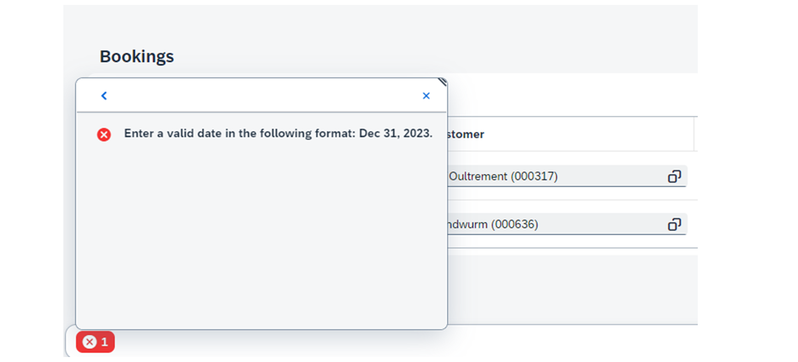
You can also navigate to the corresponding field and see the same error message there.

### Back-end validations
Other input consistency checks may require some validations in the back end. Usually such validations are triggered as a user chooses the _Save_ button on the object page (correspondingly the _Apply_ button on the subobject page).
The app is responsible for preparing such consistency checks in the back end.
For example, CAP runtimes automatically validate user input in the fields which correspond to the properties annotated with @assert.integrity, @assert.target, and some others. Check the CAP documentation for the complete list of supported input validation annotations [Input Validation](https://cap.cloud.sap/docs/guides/providing-services#input-validation).
SAP Fiori elements automatically displays messages that are sent from the back end as part of the request-response cycle. The messages for subitems are also displayed.
Messages referring to the state of an instance, for example input consistency checks, are called state messages. They are displayed in the Edit mode on the object page and the subobject page in the same popover as the client side validation messages. The messages are displayed on the UI as long as the inconsistencies are not corrected. The state messages can be persisted in the back end.
For the sake of completeness we have to mention the transition messages which can also be sent from the back end.
They are 'transient' in nature and do not affect the state of the object. They refer only to the last action that was executed. These messages are not relevant for the user input validation. These messages can be displayed in the list report or on the object page in the display mode. For more information, see [Using Messages](https://sapui5.hana.ondemand.com/sdk/#/topic/239b1922758645e7b451e01ded7f56bc).
For more annotations for User Input validation with CAP, see [Common Annotations](https://cap.cloud.sap/docs/cds/annotations).
## Add the Validation for the Field Agency on the Object Page
### Usage Scenario
In the Manage Travels app, you want to prevent users from adding an incorrect agency name. To achieve this, you want to add a validation so that an error is displayed each time when the user tries to save a travel entry with an agency name that doesn't exist in the database.
### Task Flow
In this exercise, you will add an annotation that validates the user input for the field Agency.
In the CAP CDS data model, to_Agency is a managed to-one association in the Travel entity to the TravelAgency entity. So, a CAP validation will be triggered for to_Agency during Create and Edit events. In UI terms, this is when the user selects _Save_ to save the travel entry on the object page.
### Prerequisites
You have completed the exercise Hide the Starting Date and End Date for Travels with the Canceled Travel Status in the unit Applying Dynamic Field Control and Validating User Input on the Object Page (lesson: Dynamically Affecting the Visibility and Editability of UI Elements). Alternatively, you can check out its solution branch: [solution/hide-starting-and-end-dates-for-canceled-travels](https://github.com/SAP-samples/fiori-elements-v4-cap-advanced/tree/solution/hide-starting-and-end-dates-for-canceled-travels).
### Watch the Simulation and/or Perform the Steps
This exercise provides a simulation that guides you through the list of steps below. Performing these steps allows you to follow the simulation in your trial account.
Exercise[Start Exercise](https://learnsap.enable-now.cloud.sap/pub/mmcp/index.html?show=project!PR_49C4C18FC5DA0F91:uebung)
### Steps
  1. Open your CAP project in SAP Business Application Studio.
  2. In the Explorer view, under Projects, select db/data/schema.cds.
  3. Open the schema.cds file.
  4. In the Travel entity, add the @assert.target annotation for to_Agency.
It is a managed to-one association to the TravelAgency entity. The annotation checks if the user input for the _Agency_ field has a corresponding entry in the associated or referenced target table for the TravelAgency entity.
  5. Perform the following steps to check.
    1. Open the Manage Travels app.
    2. Click _Edit_.
    3. Enter a value in the _Agency_ field. This value must not exist in the reference table.
    4. Click _Save_.

### Result
You cannot save the document as the value entered in the Agency field is incorrect.
Note
  * You can find the project files for this exercise on [GitHub](https://github.com/SAP-samples/fiori-elements-v4-cap-advanced).
  * The solution branch is [solution/add-validation-for-field-agency-on-op](https://github.com/SAP-samples/fiori-elements-v4-cap-advanced/tree/solution/add-validation-for-field-agency-on-op).
  * You can find the link to the direct comparison of the branch to the previous one on [GitHub](https://github.com/SAP-samples/fiori-elements-v4-cap-advanced/compare/solution/hide-starting-and-end-dates-for-canceled-travels..solution/add-validation-for-field-agency-on-op).

[Continue to quiz](https://learning.sap.com/courses/developing-an-sap-fiori-elements-app-based-on-a-cap-odata-v4-service/applying-dynamic-field-control-and-validating-user-input-on-the-object-page_2799f50f-80b6-30ff-8a19-8e37eb2ec9f3)


### Quiz

*Source: https://learning.sap.com/courses/developing-an-sap-fiori-elements-app-based-on-a-cap-odata-v4-service/applying-dynamic-field-control-and-validating-user-input-on-the-object-page_2799f50f-80b6-30ff-8a19-8e37eb2ec9f3*

It's time to put what you've learned to the test, get 2 right to pass this unit.
1.
### Which annotation will you use to hide some fields on the object page?
Choose the correct answer.
@Common.Hidden
@UI.Hidden
@Hide.Fields
2.
### The app developers must take care of the display of back end messages in the UI.
Choose the correct answer.
True
False
Submit answers[Next unit](https://learning.sap.com/courses/developing-an-sap-fiori-elements-app-based-on-a-cap-odata-v4-service/getting-an-overview-of-the-flexible-programming-model_fc9ea1ee-20a8-4add-b3f9-c8c8e3701ae0)


### Discovering the Flexibility of the Programming Model for SAP Fiori Elements for OData V4

*Source: https://learning.sap.com/courses/developing-an-sap-fiori-elements-app-based-on-a-cap-odata-v4-service/getting-an-overview-of-the-flexible-programming-model_fc9ea1ee-20a8-4add-b3f9-c8c8e3701ae0*

Objective
After completing this lesson, you will be able to identify the main components of the flexible programming model.
## The Flexibility of the Programming Model
In the previous units of this course, you have mostly used SAP Fiori tools to configure the features of SAP Fiori elements. Under the hood, these tools have added UI annotations and manifest.json settings to your app, but you haven't written any UI code so far. These tools are designed to cover most business scenarios you may come across.
At times, however, you may need more flexibility, introducing some custom code or custom controller logic. SAP Fiori elements supports this through the flexibility built into its programming model. This flexibility has been available starting with SAPUI5 version 1.94.
When extending your SAP Fiori elements apps using the flexibility of the programming model, you may be sure that your extensions remain stable as SAP Fiori elements evolves.
Settings
You can use the _SAP Fiori development portal_ to interactively explore all the available SAP Fiori elements features and capabilities, both standard and extension possibilities. With live editing, you can do the following:
  * Change annotations and instantly see how they alter the user interface.
  * Test different configuration combinations.
  * Discover how metadata drives UI behavior.
  * Explore safely in a sandbox environment, isolated from your own projects.

How to access the _SAP Fiori development portal_ :
  1. Open the _UI5 Demo Kit_ at <https://sapui5.hana.ondemand.com/>.
  2. In the top navigation, select _Resources_.
  3. In the _Development Tools_ section, select _SAP Fiori development portal_.
Note
In some places, it may still appear under its former name, _flexible programming model explorer_.

The _SAP Fiori development portal_ groups everything you need into four main areas, each supporting a different aspect of SAP Fiori app development.
  * _Building Blocks_ : This section covers the core UI components—from the basic _field_ used in most applications to advanced elements such as _tables_ and _charts_. Each standard floorplan consists internally of building blocks. Every building block comes with built-in, enterprise-grade features you’d otherwise spend months building yourself.
  * _Global Patterns_ : These are the behind-the-scenes essentials - non-visual building blocks that make your app production-ready: draft saving, in-app and cross-app navigation, and solid error handling. Use them to deliver the reliability users expect from SAP solutions.
  * _Standard Floorplans_ : Need a proven layout quickly? This area offers ready-made page types for common scenarios (like List Report and Object Page). They’re based on years of UX research, giving you consistency and speed. You’ll also see where you can plug in extensions with SAP Fiori elements. If your app is close to a standard floorplan, extending it using extension points is the fastest way to the finish line.
  * _Custom Pages_ : For unique requirements, this section explains how to assemble visual and non-visual building blocks to craft custom layouts without losing enterprise features or annotation-based advantages.

The extension capabilities for SAP Fiori elements for OData V4 applications include:
  * EXTENSION POINTS. They are "hooks" for the SAP Fiori elements framework. They are containers which you can use to implement your own UI, such as custom sections or custom pages.
  * BUILDING BLOCKS. They are reusable pieces of code provided by SAP Fiori elements, such as the _table_ building block. You can use them in your own extension points.
  * CONTROLLER EXTENSIONS. They are methods that let you override or augment standard logic with custom code - for example, implementing event handlers, lifecycle hooks, validations, and navigation or edit-flow behavior. SAP Fiori elements provides the Extension API, which offers comprehensive capabilities for extending list report and object page applications. Use the Extension API as the sole, supported interface for extending list report and object page applications. Do not access or manipulate internal methods or controls directly, as they are not public APIs and can change without notice, which will break your application during future upgrades.

### Summary
In this lesson, you have learned that the SAP Fiori elements programming model for OData V4 is flexible enough to add custom logic and UI controls beyond the standard features. By using the documented extension points and the Extension API provided in the _SAP Fiori development portal_ , your extensions remain stable, upgrade-safe, and consistent with the framework.
### Further Reading
[SAP Fiori Development Portal](https://sapui5.hana.ondemand.com/test-resources/sap/fe/core/fpmExplorer/index.html)
[Introducing the SAP Fiori Development Portal: Your Gateway to Rapid SAP Fiori App Creation (1 of 6)](https://community.sap.com/t5/technology-blog-posts-by-sap/introducing-the-sap-fiori-development-portal-your-gateway-to-rapid-sap/ba-p/14236768)
[Get familiar with SAP Fiori Development Portal and the Power of the Building Blocks (2 of 6)](https://community.sap.com/t5/technology-blog-posts-by-sap/get-familiar-with-sap-fiori-development-portal-and-the-power-of-the/ba-p/14240041)
[Extension API for list reports in SAP Fiori elements for OData V4](https://sapui5.hana.ondemand.com/sdk/#/api/sap.fe.templates.ListReport.ExtensionAPI)
[Extension API for object pages on SAP Fiori elements for OData V4](https://sapui5.hana.ondemand.com/sdk/#/api/sap.fe.templates.ObjectPage.ExtensionAPI)


### Using Extension Points

*Source: https://learning.sap.com/courses/developing-an-sap-fiori-elements-app-based-on-a-cap-odata-v4-service/using-extension-points_d613eea6-2548-4db3-a7c1-2ef9b52653b5*

Objective
After completing this lesson, you will be able to integrate front-end components that are not available with annotations.
## Extension Points
SAP Fiori elements framework is based on SAPUI5 technology. You may be familiar with the [Model View Controller](https://sapui5.hana.ondemand.com/sdk/#/topic/91f233476f4d1014b6dd926db0e91070.html) concept in SAPUI5.
In the _view_ , you can define the UI controls to be used in the UI.
The _controller_ contains methods that define how models and views interact.
A _model_ holds the data and provides methods to retrieve the data from the database and to set and update the data.
Thus, in a freestyle SAPUI5 app, you have to define the views and implement the methods needed in the controllers, for example, an event handler for a button if a user selects a button.
SAP Fiori elements framework generates views at runtime based on the predefined floorplans and your app-specific metadata and annotations. Thus, in the standard SAP Fiori elements applications, you do not have any static views or controllers in your project in the development environment.
If you use the extension points, a static xml fragment has to be added to the webapp/ext folder of your project. If needed, a controller will also be added. The Page Editor can generate both files, including an ext folder if not present yet.
Extension points are containers provided by SAP Fiori elements framework, which hook into the standard SAP Fiori elements runtime. There, you can add your specific UI controls or behaviors using the standard SAPUI5 programming model based on HTML5 and JavaScript.
In custom extensions, you can provide features that SAP Fiori elements does not offer, for example, process diagrams or maps.
Note: you can find the list of all extension points provided by SAP Fiori elements at [Overview of Extension Points](https://sapui5.hana.ondemand.com/test-resources/sap/fe/core/fpmExplorer/index.html#/customElements/customElementsOverview)
## Add a Custom Column to the Table on the Object Page of the Manage Travels App
If the standard floorplans don't quite fit, you can use the extension points provided by SAP Fiori elements. There you can add your own code.
In this exercise, you will add a custom column to the _Booking Supplements_ table on the subobject page. It will help the users choose when to serve their in-flight meal. To do this, you will create a custom column and add the SegmentedButton control to it.
For more information, see the API reference at [sap.m.SegmentedButton - API Reference - Demo Kit - SAPUI5 SDK (ondemand.com)](https://sapui5.hana.ondemand.com/#/api/sap.m.SegmentedButton%23overview).
### Task Flow
You will first add a new property to your CAP data model to ensure the UI-side selection is persisted in the back end. Then, you will use the Page Editor to add a custom column in the UI.
Next, you will add the SegmentedButton control. Finally, you will implement a method in the controller extension for updating the new property.
For more information and samples, see [sap.m.SegmentedButton - Samples - Demo Kit - SAPUI5 SDK (ondemand.com)](https://sapui5.hana.ondemand.com/#/entity/sap.m.SegmentedButton).
### Prerequisites
You have completed the exercise Add the Validation for the Field Agency on the Object Page in the unit Applying Dynamic Field Control and Validating User Input on the Object Page (lesson: Verifying the User Input). Alternatively, you can check out its solution branch: [solution/add-validation-for-field-agency-on-op](https://github.com/SAP-samples/fiori-elements-v4-cap-advanced/tree/solution/add-validation-for-field-agency-on-op).
### Watch the Simulation and Perform the Steps
This exercise contains a simulation displaying all the steps. You can follow the simulation with your own trial account.
Exercise[Start Exercise](https://learnsap.enable-now.cloud.sap/pub/mmcp/index.html?show=project!PR_2AF481F33141F497:uebung)
### Steps
  1. Add a new property to the Booking entity which will persist the choice of the meal time.
    1. Open the db/schema.cds file.
    2. Add the following code snippet at the end of the file:
Code Snippet
Copy codeSwitch to dark mode

```

1

entity MealOptionDeliveryPreference: CodeList { key code : String enum { SoonAfterTakeoff = 'S'; Midflight = 'M'; Late = 'L'; } default 'M' };

```

    3. Add a new property DeliveryPreference to the BookingSupplement entity which is an association to the previously defined MealOptionDeliveryPreference entity. It will persist the user choice.
Code Snippet
Copy codeSwitch to dark mode

```

1

DeliveryPreference : Association to MealOptionDeliveryPreference;

```

  2. Create a new file sap.fe.cap.travel-MealOptionDeliveryPreference.csv in the db/data folder and add the following code snippet to it:
Code Snippet
Copy codeSwitch to dark mode

```

1

code;name;descr S;SoonAfterTakeoff;Delivery as early as possible after the take-off M;Midflight;Not too early not too late L;Late;Late in the flight while still allowing you to finish the meal or drink before the landing

```

  3. Add a custom column to the _Booking Supplements_ table on the subobject page using the Page Editor.
    1. Open the Page Editor for the travel_processor app.
    2. Select _Booking Object Page_ > _Booking Supplements_ > _Table_ > _Columns_ > _Add Custom Column_.
    3. Add _Serving Time of Meals_ to the header text of the new column.
    4. Select the globe icon and _Apply_ to add localization.
    5. Add ServingTimeOfMeals to the _Column Fragment Name_.
    6. Choose _Product Price_ from the _Anchor Column_ dropdown menu.
    7. Select _True_ in _Generate Event Handler Controller_.
    8. A new custom column _Serving Time of Meals_ has been added to the _Columns_ section.
  4. Add the XML code for the custom column content to the app/travel_processor/webapp/ext/fragment/ServingTimeOfMeals.fragment.xml. This file has been generated by the Page Editor and includes some initial XML code.
    1. Substitute the XML code with this code snippet:
Code Snippet
Copy codeSwitch to dark mode

```

1

<core:FragmentDefinition xmlns:core="sap.ui.core" xmlns="sap.m"> <SegmentedButton core:require="{handler: 'sap/fe/cap/travel/ext/fragment/ServingTimeOfMeals'}" id="SB1" selectionChange="handler.onSelectionChange" enabled="{ui>/isEditable}" selectedKey="{= ${DeliveryPreference_code}}"> <items> <SegmentedButtonItem id="_IDGenSegmentedButtonItem1" text="{i18n>early}" key="S" /> <SegmentedButtonItem id="_IDGenSegmentedButtonItem2" text="{i18n>mid}" key="M" /> <SegmentedButtonItem id="_IDGenSegmentedButtonItem3" text="{i18n>late}" key="L" /> </items> </SegmentedButton> </core:FragmentDefinition>

```

As you can see in the API documentation, sap.m.SegmentedButton control has an aggregation items of type sap.m.SegmentedButtonItem. The latter is derived from the sap.ui.core.Item and you can use any of its artifacts, like properties. In the code snippet above you have used its key and text properties.
You can use a selectionChange event of sap.m.SegmentedButton in the XML fragment and bind it to the method which you will implement in your custom controller. The method will update the property in the back end after the selection changes on the UI side.
You can see two properties of sap.m.SegmentedButton being used in the XML fragment: enabled and selectedKey. The selectedKey property of sap.m.SegmentedButton is bound to the value of DeliveryPreference_code you introduced in the back end. It influences which key of the segmented button is selected.
Enabled is another property of the sap.m.SegmentedButton. In the code snippet above the enabled, control property is bound to the value of the ui model's property isEditable. The Ui model is an SAPUI5 JSON model containing UI information. It is managed by SAP Fiori elements. You are not allowed to change its values but you may access it from your custom fragments and custom controllers and you may evaluate its public property isEditable. If it is set to true, the application is in edit mode. In this case, the segmented button is enabled.
  5. In the file explorer, open the app/travel_processor/webapp/i18n/i18n.properties file and paste the texts for the threeSegmentedButtonItems you previously added to the XML fragment.
Code Snippet
Copy codeSwitch to dark mode

```

1

#XCOL: Custom column header text servingTimeOfMeals=Serving Time of Meals #XTIT: Delivery preference of the Meal during the flight deliveryPreference=Delivery Preference #XTIT: Early time of meal delivery during the flight early=early #XTIT: Mid time of meal delivery during the flight mid=mid #XTIT: Later time of meal delivery during the flight late=late

```

  6. Open app/travel_processor/webapp/ext/fragment/ServingTimeOfMeals.js and paste this code snippet:
Code Snippet
Copy codeSwitch to dark mode

```

1

sap.ui.define([ "sap/m/MessageToast" ], function(MessageToast) { 'use strict'; return { onSelectionChange: function(oEvent) { var sNewDeliveryPreferenceCode = oEvent.getParameter("item").getKey(); var oSegmBtn = oEvent.getSource(); oSegmBtn.getBindingContext().setProperty("DeliveryPreference_code", sNewDeliveryPreferenceCode); } }; });

```

The method onSelectionChange will be called once the segmented button selection changes.
  7. Switch to the app. You can see a new column in the _Booking Supplements_ table. It is read-only in the display mode.
    1. Navigate to the object page to change to the _Edit_ mode.
    2. Select _Edit_ on the top right of the object page.
    3. Select the first row in the _Bookings_ table.
    4. Select "early" for the first meal and "late" for the second meal.
    5. Select _Apply_ on the bottom right of the subobject page.
    6. Select _Save_ on the object page.
  8. Select the first row in the _Bookings_ table. Notice that your selection of meal times has been saved and you have added a custom column to the subobject page table.
The Page Editor helps you position your custom control on the page by selecting an anchor element and positioning your custom element in respect to it (before or after). The Page Editor adds the corresponding settings to the manifest.json file. The code snippet below has been generated by the Page Editor.
Code Snippet
Copy codeSwitch to dark mode

```

1

 "controlConfiguration": { "to_BookSupplement/@com.sap.vocabularies.UI.v1.LineItem": { "columns": { "ServingTimeOfMeals": { "header": "{i18n>servingTimeOfMeals}", "position": { "anchor": "DataField::Price", "placement": "After" }, "template": "sap.fe.cap.travel.ext.fragment.ServingTimeOfMeals" } } } }

```

### Result
You have learned how to use extension points in your SAP Fiori elements applications.
Note
  * You can find the solution for this exercise on [GitHub](https://github.com/SAP-samples/fiori-elements-v4-cap-advanced).
  * The solution branch is [solution/add-custom-column-to-table-on-op](https://github.com/SAP-samples/fiori-elements-v4-cap-advanced/tree/solution/add-custom-column-to-table-on-op).
  * You can find the link to the direct comparison of the branch to the previous one on [GitHub](https://github.com/SAP-samples/fiori-elements-v4-cap-advanced/compare/solution/add-validation-for-field-agency-on-op..solution/add-custom-column-to-table-on-op).

### Next Steps
For more information, see
  * [Example: Adding Columns to a Responsive Table in the List Report](https://sapui5.hana.ondemand.com/#/topic/28e95702b5854b938ac51c4bc2d078ab)
  * [Extension Points for Tables](https://sapui5.hana.ondemand.com/#/topic/d525522c1bf54672ae4e02d66b38e60c)


### Using Building Blocks

*Source: https://learning.sap.com/courses/developing-an-sap-fiori-elements-app-based-on-a-cap-odata-v4-service/using-building-blocks_b5fa3bd3-11de-428f-b6fc-e0668d2266ff*

Objective
After completing this lesson, you will be able to use building blocks provided by SAP Fiori elements to extend your apps with minimal custom coding.
## Building Blocks
Building blocks are reusable pieces of code that are consistently implemented in the SAP Fiori elements framework. If you use them, you can be sure that your app follows the SAP Fiori design guidelines and that the standard features, like draft handling or side effects, will be automatically supported in your building blocks. They are metadata driven, just like the floorplans.
Building blocks can also be used outside of the floorplans. You can use them in your custom applications, or in your custom extensions.
Building blocks are not SAPUI5 controls, but rather a set of templating instructions that are used to create a specific control tree, depending on the bound data structures.
Check the list of all available building blocks: [Overview of Building Blocks](https://sapui5.hana.ondemand.com/test-resources/sap/fe/core/fpmExplorer/index.html#/buildingBlocks/buildingBlockOverview)
You may also check [sap.fe.macros](https://sapui5.hana.ondemand.com/sdk/#/api/sap.fe.macros), a library of building blocks provided by SAP Fiori elements.
## Create a Table Using the Table Building Block in the Display Customers App
You may use a custom section when some parts of your UI cannot be built using annotations.
In this exercise, you want to display customer's own bookings as an object page table, in the _Display Customers_ app. Additionally, a message strip should be displayed above the table (this will be implemented in the next exercise). Thus, you will create a custom section using the Page Editor and add a table building block to it.
### Task Flow
You will first use the Page Editor to create a custom section on the app's object page. Then, you will add a custom table building block to it.
### Prerequisites
You have completed the exercise Add a Custom Column to the Table on the Object Page of the Manage Travels App in the unit Discovering the Flexibility of the Programming Model for SAP Fiori Elements for OData V4 (lesson: Using Extension Points). Alternatively, you can check out its solution branch: [solution/add-custom-column-to-table-on-op](https://github.com/SAP-samples/fiori-elements-v4-cap-advanced/tree/solution/add-custom-column-to-table-on-op).
### Watch the Simulation and Perform the Steps
This exercise contains a simulation displaying all the steps. You can follow the simulation with your own trial account.
Exercise[Start Exercise](https://learnsap.enable-now.cloud.sap/pub/mmcp/index.html?show=project!PR_B056F2022779AE:uebung)
### Steps
  1. Start the preview for the _Display Customers_ app. Select the first customer in the table.
You will add a table building block with customer's own bookings to the object page. The table will be added into a custom section. The custom section will be placed after the _General Information_ section.
  2. In SAP Business Application Studio, create a custom section by using the Page Editor.
    1. Right click on the _customer_ folder.
    2. Select the _Show Page Map_ option to open the Page Editor.
    3. Edit the passenger object page by clicking on the pencil icon.
    4. Click on the plus icon in _Section_.
    5. Choose _Add Custom Section_.
    6. Add _Own Bookings_ to the _Custom Section Title_.
    7. Click on the globe icon to add localization, and select _Apply_.
    8. Add bookings to the _fragment name_.
    9. Expand the _Anchor Section_ dropdown and choose _General Information_.
    10. Select the _Add_ button.
You can see that a _custom section_ called _Own Bookings_ has appeared under _Sections_ of the object page.
  3. Expand customer>webapp>ext in the file explorer. You can see that the Page Editor has generated the ext folder which includes the Bookings.fragment.xml file.
  4. Open the Bookings.fragment.xml file. You can see some pre-generated xml code in the file.
Add the following code snippet to it:
Code Snippet
Copy codeSwitch to dark mode

```

1

<core:FragmentDefinition xmlns:core="sap.ui.core" xmlns="sap.m" xmlns:macros="sap.fe.macros"> <macros:Table metaPath="to_Booking/@com.sap.vocabularies.UI.v1.PresentationVariant" header="Bookings" personalization="Column" readOnly="{ui>/isEditable}" id="OwnBookingsTable" > </macros:Table> </core:FragmentDefinition>

```

  5. Switch to the app window to see the new table.
     * Select the first customer from the table.
     * Navigate to the object page. You can see the custom section _Own Bookings_ containing a _Bookings_ table.
     * Select the _Own Bookings_ tab.
You can see that you can navigate to the custom section by selecting _Own Bookings_ in the anchor bar. Note that the table building block looks and behaves identical to an annotation-based table.

### Result
In this exercise you have created a custom section with the help of the Page Editor and added the table building block to it.
Note
  * You can find the solution for this exercise on [GitHub](https://github.com/SAP-samples/fiori-elements-v4-cap-advanced).
  * The solution branch is [solution/add-table-building-block](https://github.com/SAP-samples/fiori-elements-v4-cap-advanced/tree/solution/add-table-building-block).
  * You can find the link to the direct comparison of the branch to the previous one on [Github](https://github.com/SAP-samples/fiori-elements-v4-cap-advanced/compare/solution/add-custom-column-to-table-on-op..solution/add-table-building-block).

### Next Steps
For more information, see:
  * [Video series on flexible programming model for SAP Fiori elements](https://blogs.sap.com/2022/12/08/video-series-on-flexible-programming-model-for-sap-fiori-elements/)
  * [The Table Building Block](https://sapui5.hana.ondemand.com/#/topic/3801656db27b4b7a9099b6ed5fa1d769)


### Using Controller Extensions

*Source: https://learning.sap.com/courses/developing-an-sap-fiori-elements-app-based-on-a-cap-odata-v4-service/using-controller-extensions_f47e841f-2dd8-4b88-ba5e-39c0eedd983e*

Objective
After completing this lesson, you will be able to apply controller extensions provided by SAP Fiori elements to add your custom JavaScript code.
## Function Imports
The Open Data Protocol (OData) includes the standard CRUD (Create, Read, Update and Delete) operations that map to the HTTP methods POST, GET, PUT/MERGE and DELETE.
In addition, OData supports further service operations (function imports) that can be invoked by the HTTP methods GET or POST for anything that cannot be mapped to the standard CRUD operations. You can implement the additional service operations in your back end.
In this training, you use CAP as your back end and you will create a function import within your CAP data model.
When you add a definition of the function import to your CAP data model, it becomes a part of the service metadata. You will find it in the $metadata document.
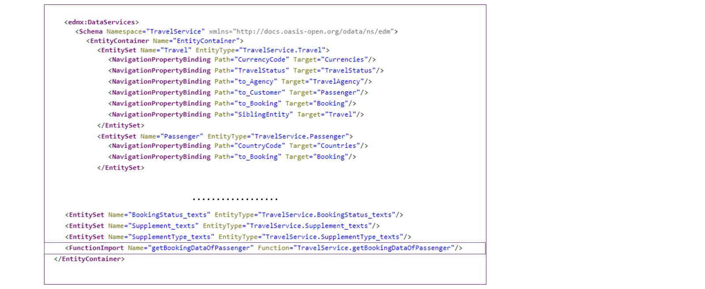
The screenshot above shows that the function import is added to the service container alongside the entity sets of the service.
In the same $metadata document, you can find the API of the function import.

As soon as the function import is part of $metadata, it can be used on the client side in your SAP Fiori elements application.
## Controller Extensions
SAP Fiori elements for OData V4 provides a collection of controller extensions. They expose methods which you can override. Check a list of available controller extensions at [API reference for controller extensions](https://sapui5.hana.ondemand.com/sdk/#/api/sap.fe.core.controllerextensions).
For example, class [sap.fe.core.controllerextensions.EditFlow](https://sapui5.hana.ondemand.com/#/api/sap.fe.core.controllerextensions.EditFlow%23methods) offers hooks into the edit flow of your SAP Fiori elements application.
In this lesson, you will use the onAfterBinding method of [sap.fe.core.controllerextensions.Routing](https://sapui5.hana.ondemand.com/#/api/sap.fe.core.controllerextensions.Routing) controller extension to call the function import. You will then evaluate its return value and display a message strip (if necessary) at the right point of time, that is, after a page is bound but not yet rendered.
## Add Message Strips to the Object Page of the Display Customers App
In your _Display Customers_ app, you may want to notify the user if there are any bookings with the status _New_. To do this, you will display the corresponding message above the _Own Bookings_ table on the object page.
In the previous exercise, you have already created a custom section and added the _Table_ building block to it. Now, you will add a message strip to the table. You will also see an option to add a message to the whole object page.
### Task Flow
The table displaying the customer's bookings uses paging to restrict the data exchange load: only the first ten lines are loaded. This means you cannot analyze all the bookings on the UI side; this should be done in the back end instead. To do this, you will create a function import in the back end.
You will first add a controller extension to your _Display Customers_ app using the Page Map.
Next, you will extend your CAP service with a new function. It will check the back end for any bookings with the status _New_ for the selected customer.
After that, you will be able to call this function in your front end using the controller extension. If there are any bookings with the status 'new', a message strip will be shown above the table, displaying a warning.
Finally, you will add an information message to the whole object page, in case there are any bookings with the status _New_.
### Prerequisites
You have completed the exercise Create a Table Using the Table Building Block in the Display Customers App in the unit Discovering the Flexibility of the Programming Model for SAP Fiori Elements for OData V4 (lesson: Using Building Blocks). Alternatively, you can check out its solution branch: [solution/add-table-building-block](https://github.com/SAP-samples/fiori-elements-v4-cap-advanced/tree/solution/add-table-building-block).
### Watch the Simulation and Perform the Steps
This exercise contains a simulation displaying all the steps. You can follow the simulation with your own trial account.
Exercise[Start Exercise](https://learnsap.enable-now.cloud.sap/pub/mmcp/index.html?show=project!PR_5B3D0509B0C6E780:uebung)
### Steps
  1. Add a controller extension to your app.
    1. Open the object page of the _Display Customers_ app and switch to SAP Business Application Studio.
    2. Open the webapp folder and select _Show Page Map >Object Page>Add Controller Extension_.
    3. Add _PassengerOPExtend_ as the controller name.
    4. You have now added a new controller extension.
  2. Extend your CAP service with a new function.
    1. Open schema.cds and paste the following code snippet into the file:
Code Snippet
Copy codeSwitch to dark mode

```

1

type BookingData: { HasNewBookings: Boolean }

```

This adds a new type BookingData in your data model.
    2. Open travel-service.cds and add the following function definition to it:
Code Snippet
Copy codeSwitch to dark mode

```

1

// Function import used in Controller Extension 'PassengerOPExtend.js' to calculate booking data function getBookingDataOfPassenger(CustomerID: String) returns my.BookingData;

```

This adds a new function getBookingDataOfPassenger.
    3. Open travel-service.js and add the following code snippet:
Code Snippet
Copy codeSwitch to dark mode

```

1

 /** * Function import handler: getBookingDataOfPassenger * @param CustomerID * @returns BookingData */ this.on('getBookingDataOfPassenger', async (req) => { const { CustomerID } = req.data const allCustomerBookings = await SELECT `BookingStatus_code as status`.from (Booking) .where `to_Customer_CustomerID = ${CustomerID}` const bookingData = { HasNewBookings: false } bookingData.HasNewBookings = allCustomerBookings.some((booking) => { return booking.status === 'N'; }) return bookingData });

```

You have added the implementation of the getBookingDataOfPassenger function.
It takes CustomerID as a parameter and checks the data base for bookings with the status _New_ per _Customer_.
  3. Add a function to the controller extension.
    1. Open the controller extension file PassengerOPExtend.controller.js and add the following code snippet:
Code Snippet
Copy codeSwitch to dark mode

```

1

 sap.ui.define(['sap/ui/core/mvc/ControllerExtension',"sap/ui/core/message/Message","sap/ui/core/MessageType", ], function (ControllerExtension, Message, MessageType) { 'use strict'; return ControllerExtension.extend('sap.fe.cap.customer.ext.controller.PassengerOPExtend', { // this section allows to extend lifecycle hooks or hooks provided by Fiori elements override: { /** * Called when a controller is instantiated and its View controls (if available) are already created. * Can be used to modify the View before it is displayed, to bind event handlers and do other one-time initialization. * @memberOf sap.fe.cap.customer.ext.controller.PassengerOPExtend */ onInit: function () { // you can access the Fiori elements extensionAPI via this.base.getExtensionAPI var oModel = this.base.getExtensionAPI().getModel(); }, routing: { onAfterBinding: async function (oBindingContext) { } } } }); });

```

You have added the onAfterBinding function of the routing object (class sap.fe.core.controllerControllerextensions.Routing).
    2. Add the following code snippet to the onAfterBinding function:
Code Snippet
Copy codeSwitch to dark mode

```

1

 onAfterBinding: async function (oBindingContext) { const oExtensionAPI = this.base.getExtensionAPI(), oModel = oExtensionAPI.getModel(), sFunctionName = "getBookingDataOfPassenger", oFunction = oModel.bindContext(`/${sFunctionName}(...)`), oBookingTableAPI = oExtensionAPI.byId("fe::CustomSubSection::Bookings--OwnBookingsTable"), oWarningMessage = new Message({ type: MessageType.Warning, message: await oExtensionAPI.getModel("i18n").getResourceBundle().getText("bookingsNew") }), oInfoMessage = new Message({ type: MessageType.Info, message: await oExtensionAPI.getModel("i18n").getResourceBundle().getText("bookingsAttention") }); // Request OData function with current CustomerID const oCustomer = await oBindingContext.requestObject(oBindingContext.getPath()); oFunction.setParameter("CustomerID", oCustomer.CustomerID); await oFunction.execute(); const oContext = oFunction.getBoundContext(); if (this.message !== undefined) { oBookingTableAPI.removeMessage(this.message); } if (oContext.getProperty("HasNewBookings")) { this.message = oBookingTableAPI.addMessage(oWarningMessage); oExtensionAPI.showMessages([oInfoMessage]); } }

```

You have added some code to onAfterBinding. With this code, you have accessed the back-end function getBookingDataOfPassenger in the [SAPUI5 OData V4 Model](https://sapui5.hana.ondemand.com/sdk/#/topic/5de13cf4dd1f4a3480f7e2eaaee3f5b8), got the table API of the table building block, and created a warning message.
You have also created a message of type _Info_. If the HasNewBookings parameter of the back-end function is true, the info message is added to the whole object page using the object page controller's extensionAPI.
    3. Open the i18n file in the file explorer and add the following code snippet:
Code Snippet
Copy codeSwitch to dark mode

```

1

#XMSG: Warning message on object page bookingsNew=There are new bookings that have not yet been accepted. #XMSG: Info message on object page bookingsAttention=Some bookings require your attention

```

You have just added the warning and the information message texts to the i18n.properties file.
    4. Switch to the app window. You can see the warning message for Theresia Buccholm's bookings as some of these have the _New_ status. You can also see an info message in the object page header.

### Result
In this exercise you have added two message strips: one to the table building block and one to the whole object page. To achieve that, you have created and implemented a function in the CAP service that checks if there are any bookings with the status _New_ for the given customer. On the front-end side (in the controller extension), you have implemented the function call and added the messages if needed.
Note
  * You can find the solution for this exercise on [GitHub](https://github.com/SAP-samples/fiori-elements-v4-cap-advanced).
  * The solution branch is [solution/add-message-strips](https://github.com/SAP-samples/fiori-elements-v4-cap-advanced/tree/solution/add-message-strips).
  * You can find the link to the direct comparison of the branch to the previous one on [Github](https://github.com/SAP-samples/fiori-elements-v4-cap-advanced/compare/solution/add-table-building-block..solution/add-message-strips).


### Adding a Custom Micro Chart

*Source: https://learning.sap.com/courses/developing-an-sap-fiori-elements-app-based-on-a-cap-odata-v4-service/adding-a-custom-micro-chart_e266e9d1-fcde-4aa1-9a79-65bec1c62ef4*

Objective
After completing this lesson, you will be able to create a custom micro chart displaying values calculated in the back end.
## Add a Custom Micro Chart to the Object Page Header of the Display Customers App
You may want to get a quick overview of all the bookings for one passenger. The information should be presented in a visually appealing way in the object page header of the Display Customers app, next to the _Contact Details_ section. The user would see at a glance how many bookings have the status "open", or "canceled", or "new".
To achieve this, you can use the comparison micro chart.
### Task flow
First, you will implement a method in the back end to calculate the number of bookings with different statuses. Then, you will create a local JSON model on the front end to retrieve the corresponding numbers from the back end. Next, you will add a custom header section next to the _Contact Details_ section. Note that this has to be done manually. Finally, you will create the micro chart itself.
### Prerequisites
You have completed the exercise Add Message Strips to the Object Page of the Display Customers App in the unit Discovering the Flexibility of the Programming Model for SAP Fiori Elements for OData V4 (lesson: Using Controller Extensions). Alternatively, you can check out its solution branch: [solution/add-message-strips](https://github.com/SAP-samples/fiori-elements-v4-cap-advanced/tree/solution/add-message-strips).
### Watch the Simulation and Perform the Steps
This exercise contains a simulation displaying all the steps. You can follow the simulation with your own trial account.
Exercise[Start Exercise](https://learnsap.enable-now.cloud.sap/pub/mmcp/index.html?show=project!PR_8034E5D68FD43DBF:uebung)
### Steps
  1. Implement the method in the back end.
    1. You have already defined the BookingData type in the previous exercise. Now, you will change this type to reflect different booking statuses.
    2. Open the SAP Business Application Studio and choose schema.cds. Add the following code snippet to the BookingData type:
Code Snippet
Copy codeSwitch to dark mode

```

1

type BookingData: { TotalBookingsCount: Integer; NewBookingsCount: Integer; AcceptedBookingsCount: Integer; CancelledBookingsCount: Integer; }

```

    3. Open travel-service.cds. You can see the definition of the getBookingDataOfPassenger function you created in the previous exercise. You will also use it in this exercise.
    4. Open travel-service.js. It contains the implementation of the getBookingDataOfPassenger function from the previous exercise. You will enhance it in this exercise.
    5. Add the following code snippet to travel-service.js (overwrite the existing code from the previous exercise):
Code Snippet
Copy codeSwitch to dark mode

```

1

/** * Function import handler: getBookingDataOfPassenger * @param CustomerID * @returns BookingData */ this.on('getBookingDataOfPassenger', async (req) => { const { CustomerID } = req.data const allCustomerBookings = await SELECT `BookingStatus_code as status`.from (Booking) .where `to_Customer_CustomerID = ${CustomerID}` const bookingData = { TotalBookingsCount: 0, NewBookingsCount: 0, AcceptedBookingsCount: 0, CancelledBookingsCount: 0 } allCustomerBookings.forEach((booking) => { bookingData.TotalBookingsCount++ switch (booking.status) { case 'N': bookingData.NewBookingsCount++ break case 'B': bookingData.AcceptedBookingsCount++ break case 'X': bookingData.CancelledBookingsCount++ break default: break } }) return bookingData; });

```

This enhances the getBookingDataOfPassenger method so that it calculates the number of different booking statuses in the back end.
  2. Create a JSON model in the front end.
    1. As you have adjusted the back-end function, you now also have to adapt the front end method that calls this function. Open PassengerOPExtend.controller.js in SAP Business Application Studio and edit the code as follows:
Code Snippet
Copy codeSwitch to dark mode

```

1

sap.ui.define(['sap/ui/core/mvc/ControllerExtension',"sap/ui/core/message/Message","sap/ui/core/MessageType", "sap/ui/model/json/JSONModel", ], function (ControllerExtension, Message, MessageType, JSONModel) { 'use strict';

```

You have declared sap.ui.model.json.JSONModel which you'll use in your controller extension method.
    2. Add the following code snippet to onAfterBinding. Place it after the declaration of oInfoMessage.
Code Snippet
Copy codeSwitch to dark mode

```

1

 const oPassengerBookingsModel = new JSONModel({ totalBookingsCount: 0, newBookingsCount: 0, acceptedBookingsCount: 0, cancelledBookingsCount: 0 }); this.base.getView().setModel(oPassengerBookingsModel, "passengerBookingsModel");

```

This creates a JSONModel and adds it to your view with its given name "passengerBookingsModel".
    3. Add the following code snippet to onAfterBinding. Put it after the line const oContext = oFunction.getBoundContext(); :
Code Snippet
Copy codeSwitch to dark mode

```

1

 oPassengerBookingsModel.setProperty("/totalBookingsCount", oContext.getProperty("TotalBookingsCount")); oPassengerBookingsModel.setProperty("/newBookingsCount", oContext.getProperty("NewBookingsCount")); oPassengerBookingsModel.setProperty("/acceptedBookingsCount", oContext.getProperty("AcceptedBookingsCount")); oPassengerBookingsModel.setProperty("/cancelledBookingsCount", oContext.getProperty("CancelledBookingsCount"));

```

This binds the properties of your JSONModel to the corresponding properties of the return parameter of the function import.
    4. Adjust the last code block of onAfterBinding as follows:
Code Snippet
Copy codeSwitch to dark mode

```

1

 if (oContext.getProperty("NewBookingsCount") > 0) { this.message = oBookingTableAPI.addMessage(oWarningMessage); oExtensionAPI.showMessages([oInfoMessage]); }

```

  3. Add a custom header section.
    1. Open manifest.json and add the following code under "PassengerObjectPage"/"options"/"settings"/"content":
Code Snippet
Copy codeSwitch to dark mode

```

1

 "header": { "facets": { "CustomHeaderFacetContentBased1": { "template": "sap.fe.cap.customer.ext.fragment.BookingStatus", "title": "{i18n>bookingStatus}", "visible": "true", "position": { "placement": "After", "anchor": "ContactDetails" } } } },

```

You have declared a new custom header facet next to the _Contact Details_ header facet.
    2. Open i18n>i18n.properties. Here, you can add some text to the UI that should be translated.
    3. Add the following code snippet:
Code Snippet
Copy codeSwitch to dark mode

```

1

#XTIT: Custom header title bookingStatus=Booking Status

```

This adds the title of your custom header section.
  4. Create the micro chart.
    1. Right-click on the fragment folder and choose _New File_.
    2. Create a new file called BookingStatus.fragment.xml and add the following code for your micro chart:
Code Snippet
Copy codeSwitch to dark mode

```

1

<core:FragmentDefinition xmlns:core="sap.ui.core" xmlns="sap.m" xmlns:macros="sap.fe.macros" xmlns:mc="sap.suite.ui.microchart"> <VBox id="BookingStatusOverview" displayInline="true"> <mc:ComparisonMicroChart size="S" maxValue="{passengerBookingsModel>/totalBookingsCount}"> <mc:data> <mc:ComparisonMicroChartData title="{i18n>bookingStatusNew}" value="{passengerBookingsModel>/newBookingsCount}" color="sapUiChartPaletteSemanticCritical" /> <mc:ComparisonMicroChartData title="{i18n>bookingStatusAccepted}" value="{passengerBookingsModel>/acceptedBookingsCount}" color="sapUiChartPaletteSemanticGood" /> <mc:ComparisonMicroChartData title="{i18n>bookingStatusCancelled}" value="{passengerBookingsModel>/cancelledBookingsCount}" color="sapUiChartPaletteSemanticBad" /> </mc:data> </mc:ComparisonMicroChart> </VBox> </core:FragmentDefinition>

```

You have added asap.m.VBox. It is the container for sap.suite.ui.microchart.ComparisonMicroChart. For more information, check the [API reference](https://sapui5.hana.ondemand.com/sdk/#/api/sap.m.VBox).
    3. You have bound the micro chart data to the corresponding properties of theJSONModel. You have also added the three label texts for the micro chart. For more information, check the [API reference](https://sapui5.hana.ondemand.com/#/api/sap.suite.ui.microchart.ComparisonMicroChart).
    4. You can see errors for the micro chart and its data items saying that IDs are missing. Use a quickfix to generate the necessary IDs.
    5. Finally, add the three label texts to the i18n.properties file:
Code Snippet
Copy codeSwitch to dark mode

```

1

#XTIT: Custom header title bookingStatus=Booking Status #XTIT: Custom micro chart legend bookingStatusNew=New #XTIT: Custom micro chart legend bookingStatusAccepted=Accepted #XTIT: Custom micro chart legend bookingStatusCancelled=Cancelled

```

  5. Check the results.
    1. Switch to the app window.
    2. You can see the newly added Booking Status section with the comparison micro chart in the object page header, next to the _Contact Details_ section.

### Result
In this exercise, you have learned how you can manually add a custom header facet (section) to the object page. You have extended the function import to calculate the number of bookings with different statuses.
Note
  * You can find the solution for this exercise on [GitHub](https://github.com/SAP-samples/fiori-elements-v4-cap-advanced).
  * The solution branch is [solution/add-custom-micro-chart-to-object-page-header](https://github.com/SAP-samples/fiori-elements-v4-cap-advanced/tree/solution/add-custom-micro-chart-to-object-page-header).
  * You can find the link to the direct comparison of the branch to the previous one on [Github](https://github.com/SAP-samples/fiori-elements-v4-cap-advanced/compare/solution/add-message-strips..solution/add-custom-micro-chart-to-object-page-header).

### Next Steps
For more information, see:
  * [Extension Points for Object Page Header Facets](https://sapui5.hana.ondemand.com/sdk/#/topic/61cf0ee828824903907464c80dd0d88c.html)
  * [sap.suite.ui.microchart.ComparisonMicroChart](https://sapui5.hana.ondemand.com/#/entity/sap.suite.ui.microchart.ComparisonMicroChart)


### Using the Flexibility of the Programming Model for Freestyle SAPUI5 Apps

*Source: https://learning.sap.com/courses/developing-an-sap-fiori-elements-app-based-on-a-cap-odata-v4-service/using-the-flexible-programming-model-for-your-freestyle-applications_d55be297-c526-4b8c-a6eb-75677d09c43d*

Objective
After completing this lesson, you will be able to use the flexible programming model for your freestyle applications.
## The Flexible Programming Model for Freestyle Applications
You may have a very specific use case that cannot be built using the standard SAP Fiori elements and the flexible programming model. In this case, we still recommend creating your app as an SAP Fiori elements app.
You can generate your app using the app generator by selecting a _Custom Page_ (flexible programming model floorplan). This way, you will get all the FPM features and you will be able to use SAP Fiori tools.
[Continue to quiz](https://learning.sap.com/courses/developing-an-sap-fiori-elements-app-based-on-a-cap-odata-v4-service/discovering-the-flexible-programming-model-of-sap-fiori-elements-for-odata-v4_ac7e42d9-bfbc-3197-af4a-3c20b4fd5717)


### Quiz

*Source: https://learning.sap.com/courses/developing-an-sap-fiori-elements-app-based-on-a-cap-odata-v4-service/discovering-the-flexible-programming-model-of-sap-fiori-elements-for-odata-v4_ac7e42d9-bfbc-3197-af4a-3c20b4fd5717*

It's time to put what you've learned to the test, get 5 right to pass this unit.
1.
### If an application nearly matches a standard floorplan but requires minor changes, what is the most efficient approach to development?
Choose the correct answer.
Create a custom page using the building blocks.
Use the floorplan's designated extension points to add or alter specific sections of the UI.
Modify the underlying source code of the standard floorplan to directly incorporate the required changes.
2.
### The extension points are
There are three correct answers.
containers where you can add your custom SAPUI5 controls.
hooks into SAP Fiori elements runtime.
containers where you can add building blocks.
templates you can use in your custom apps.
3.
### Building blocks are
There are two correct answers.
containers where you can implement your own UI.
reusable artifacts provided by SAP Fiori elements.
meta data driven
SAPUI5 controls
4.
### You may override any method in SAP Fiori elements framework, in order to enhance your app.
Choose the correct answer.
True
False
5.
### To add a custom micro chart to the object page header, you have to add a custom header facet as its container.
Choose the correct answer.
True
False
6.
### You can use building blocks on custom pages.
Choose the correct answer.
True
False
Submit answers[Next unit](https://learning.sap.com/courses/developing-an-sap-fiori-elements-app-based-on-a-cap-odata-v4-service/examining-internal-and-external-navigation_afe50cc3-c65c-44df-8cea-1ec20c58636f)


### Illustrating the Navigation Concept in SAP Fiori Elements for OData V4

*Source: https://learning.sap.com/courses/developing-an-sap-fiori-elements-app-based-on-a-cap-odata-v4-service/examining-internal-and-external-navigation_afe50cc3-c65c-44df-8cea-1ec20c58636f*

Objective
After completing this lesson, you will be able to explain the concept of internal and external navigation in SAP Fiori elements applications.
## SAP Fiori Launchpad
The SAP Fiori launchpad environment is a runtime shell that hosts SAP Fiori applications and provides the applications with services such as navigation, personalization, embedded support, and application configuration.
According to [Fiori for Web Design Guidelines](https://experience.sap.com/fiori-design-web/home-page/), the SAP Fiori launchpad home page must be used for all SAP Fiori apps. It is the main entry point to SAP Fiori apps on mobile and desktop devices.
The SAP Fiori launchpad home page displays tiles and links to launch the apps. It can also show additional information. It is role-based, displaying tiles according to the user's role.
For more information about the SAP Fiori launchpad home page, see <https://experience.sap.com/fiori-design-web/home-page/>
### Local Sandbox Environment
When developing apps in SAP Business Application Studio or Visual Studio Code, you may want to test the app to app navigation. As the SAP Fiori launchpad is not available there, we need a local sandbox environment simulating the SAP Fiori launchpad. This allows you to check if you have completed the necessary steps to make the navigation work from the application side.
In this tutorial, we have implemented a small local sandbox environment simulating the SAP Fiori launchpad. It is used for app-to-app navigation for the exercises of this unit and shouldn't be used for production. This environment uses the internal server module of CAP that allows extending the standard CAP bootstrapping sequence with a custom server.js file. In this file, we load further HTML and JSON files required for building the sandbox SAP Fiori launchpad. In addition, we use the semantic object entries placed at /sap.app/crossNavigation/inbounds/… in the application manifest files (webapp/manifest.json).
There is an option to maintain a semantic object and an action during the app generation process (the step _Fiori Launchpad Configuration_).
These entries are then inserted into the manifest.json file by the Template Wizard.
To learn more about the local sandbox environment, see:
  * [Bootstrapping Servers and Service Providers](https://cap.cloud.sap/docs/node.js/cds-serve)
  * [Run Your Own Applications in the Sandbox](https://help.sap.com/doc/saphelp_nw75/7.5.5/en-US/59/ea851d55e04c69a5ae07b15a3eda1b/content.htm?no_cache=true)
  * [Local Configuration File for the Launchpad Sandbox](https://help.sap.com/doc/saphelp_nw75/7.5.5/en-US/c9/1d091226804dd2b727de4375f0cf1f/content.htm?no_cache=true)

### Production Environment
In the production environment, an administrator would have to set up the SAP Fiori launchpad and configure the navigation targets as described in [Configuring Navigation](https://help.sap.com/docs/SAP_NETWEAVER_750/cc1c7615ee2f4a699a9272453379006c/bd8ae3d327ab4541bcce8e7353c046fc.html?version=7.5.17) and [Setting up Navigation](https://help.sap.com/docs/SAP_NETWEAVER_750/cc1c7615ee2f4a699a9272453379006c/03dbca33e25b44398e13be2f77082e79.html?version=7.5.17).
In this unit, you will explore the different options how you can configure the navigation between your apps.
## Navigation Inside the Application (Internal Navigation)
In the previous exercises, you have seen internal navigation, that is, navigation inside one app. Examples include navigation from the list report to its object page or from the object page to the subobject page. You can use the _Page Map_ to configure internal navigation and add new pages or remove existing ones. You can also add a custom page. For more information, see [Define Application Structure](https://help.sap.com/docs/SAP_FIORI_tools/17d50220bcd848aa854c9c182d65b699/bae38e6216754a76896b926a3d6ac3a9.html).
Other configuration options include navigation after executing an action, navigation between entities of an app and in-page navigation. For more information, see [Configuring Internal Navigation](https://ui5.sap.com/#/topic/2c65f07f44094012a511d6bd83f50f2d.html).
## Navigation Between Applications (External Navigation)
Besides navigation inside an app, you can also build a navigation flow connecting different apps. It is called external navigation.
There are several configuration options for external navigation:
  * Navigation using links. This is used to open other objects or lists. Links can be used both in the list report and on the object page (in forms or tables).
  * Navigation using line items in a table. This is used to display additional details of an item. This will replace the standard internal navigation with external navigation to another app. For more information, see [Changing Navigation to Object Page](https://ui5.sap.com/#/topic/8bd546e27a5f41cea6e251ba04534d70).
  * Navigation using a button action.

For more information about external navigation, check the [SAP Fiori for Web Design Guidelines](https://experience.sap.com/fiori-design-web/navigation/).
Note
To use external navigation, you need the SAP Fiori launchpad.
## Intents
Navigation inside the SAP Fiori launchpad environment is based on abstract representations called intents. They are resolved to specific navigation targets at runtime.
Each intent consists of a semantic object and an action. It may also have semantic object parameters. Semantic objects represent business entities such as a product, a travel, or a customer. Actions are operations which the user can perform on a semantic object, such as display or manage. This allows you to build groups of apps that perform different actions on the same business entity, such as display travels or manage travels.
An intent can be resolved differently based on the role of the user that triggers the navigation.
For more information, see [Configuring Navigation](https://help.sap.com/docs/SAP_NETWEAVER_750/cc1c7615ee2f4a699a9272453379006c/bd8ae3d327ab4541bcce8e7353c046fc.html?version=7.5.17).
An administrator configures the apps as navigation targets. For more information, see [Setting up Navigation](https://help.sap.com/docs/SAP_NETWEAVER_750/cc1c7615ee2f4a699a9272453379006c/03dbca33e25b44398e13be2f77082e79.html?version=7.5.17).
### Further Reading
[Configuring Navigation](https://ui5.sap.com/#/topic/a42427550b72436a8bdf53045b06effb)


### Configuring External Navigation

*Source: https://learning.sap.com/courses/developing-an-sap-fiori-elements-app-based-on-a-cap-odata-v4-service/configuring-external-navigation_dd4d7f6f-7857-4604-b993-70012c702c3f*

Objective
After completing this lesson, you will be able to configure the navigation to another application.
## Configuration of External Navigation
To configure navigation between two apps, you need to set up navigation targets and configure the navigation in the source app (outbound navigation).
There are several options how you can configure the navigation from a source app.
  1. As a button in the table tool bar. To do this, add an @UI.DataFieldForIntentBasedNavigation annotation containing a combination of a semantic object and action.
  2. You can replace the standard internal navigation to the object or subobject page in manifest.json. For more information, see [Changing Navigation to Object Page](https://ui5.sap.com/#/topic/8bd546e27a5f41cea6e251ba04534d70).
  3. You can configure links both in forms and tables (in the list report and on the object page). To do this, you can use the @Common.SemanticObject annotation.
For more information, see [Navigation from an App (Outbound Navigation)](https://ui5.sap.com/#/topic/d782acf8bfd74107ad6a04f0361c5f62.html).
  4. In SAP Fiori elements for OData V4 apps, you can configure external navigation from the header facet title of an object page. For more information, see [Navigation from Header Facet Title](https://sapui5.hana.ondemand.com/sdk/#/topic/fa0ca22de375490a84aa3375b617592f).

## Transition of the Navigation Context to the Target App
The navigation context of the source app is passed to the target app.
For example, if a user has selected some values in the filter bar and then navigates to the target app, the values in the filter bar will be passed to the target app and they will be displayed in its filter bar (if it exists in the target app). If the navigation context matches several items of the target app, the list report is displayed. If the unique object of the target app can be identified (that is, all the values of key fields are provided in the navigation context), the object or subobject page of the target app is displayed.
SAP Fiori launchpad can also pass other values to the target app, such as FLP target mapping default values. For more information, see [Navigation to an App (Inbound Navigation)](https://ui5.sap.com/#/topic/c337d8bde8c544598969c8e4edaab262).
## Navigate to the Display Customers App from the Manage Travels App by Pressing the Toolbar Button
You want to provide the ability to navigate from your _Manage Travels_ app to the detailed customer page, which is another app called _Display Customers_.
### Task Flow
You will first open the apps in the local sandbox environment. Then, you will add the button and check the results.
### Prerequisites
You have completed the exercise Add a Custom Micro Chart to the Object Page Header of the Display Customers App in the unit Discovering the Flexibility of the Programming Model for SAP Fiori Elements for OData V4 (lesson: Adding a Custom Micro Chart). Alternatively, you can check out its solution branch: [solution/add-custom-micro-chart-to-object-page-header](https://github.com/SAP-samples/fiori-elements-v4-cap-advanced/tree/solution/add-custom-micro-chart-to-object-page-header).
### Watch the Simulation and Perform the Steps
This exercise contains a simulation displaying all the steps. You can follow the simulation with your own trial account.
Exercise[Start Exercise](https://learnsap.enable-now.cloud.sap/pub/mmcp/index.html?show=project!PR_BF451ABD036597B5:uebung)
### Steps
  1. Open the sandbox environment.
    1. Execute cds watch and navigate to the _Welcome_ page of the @sap/cds server. In the production environment, the app should run within the SAP Fiori launchpad. In this exercise, we will use the sandbox environment to simulate it.
    2. Add /sandbox/index.html to the URL of the current page to open the sandbox environment.
    3. You can see the simulated SAP Fiori launchpad with two tiles representing the apps.
    4. Select the _Travels_ tile. You have opened the _Manage Travels_ app in the sandbox environment.
  2. Add a navigation button to the _Manage Travels_ app.
    1. Open layouts.cds in SAP Business Application Studio and add the following record to the @UI.LineItem annotation for the Travel entity:
Code Snippet
Copy codeSwitch to dark mode

```

1

 { $Type : 'UI.DataFieldForIntentBasedNavigation', SemanticObject : 'Customer', Action : 'display', Label : '{i18n>DisplayCustomers}', RequiresContext : false, Mapping : [ { $Type : 'Common.SemanticObjectMappingType', LocalProperty : to_Customer_CustomerID, SemanticObjectProperty : 'CustomerID', } ] }

```

You have added an annotation of type UI.DataFieldForIntentBasedNavigation. You have declared the semantic object 'Customer' and the action 'display'. The combination of the semantic object and action is the intent which will be the target of this navigation.
    2. Open the manifest.json file of the _Display Customers_ app. You can see that the semantic object 'Customer' and the action 'display' are defined for the inbound navigation of the _Display Customers_ app.
    3. Open the i18n.properties file and add the new UI text for the DisplayCustomers button.
Code Snippet
Copy codeSwitch to dark mode

```

1

DisplayCustomers=Display Customers

```

    4. Note that the UI.DataFieldForIntentBasedNavigation record contains a mapping property. It is used to map the key property CustomerID of the target entity (Passenger) to the foreign key property to_Customer_CustomerID of the source entity (Travel).
  3. Check the results.
    1. Open the _Manage Travels_ app. You can see the _Display Customers_ button has been added to the tool bar on top of the _Travels_ table.
    2. Select the _Display Customers_ button. You have navigated to the list report of the _Display Customers_ app.
    3. Check the customer list and navigate back.
    4. Now select a travel and then select _Display Customers_. You have navigated directly to the object page for the selected customer.

### Result
In this lesson you have learned how to configure external navigation via a list report tool bar button.
Note
  * You can find the solution for this exercise on [GitHub](https://github.com/SAP-samples/fiori-elements-v4-cap-advanced).
  * The solution branch is [solution/add-toolbar-button-to-navigate-to-customer-app](https://github.com/SAP-samples/fiori-elements-v4-cap-advanced/tree/solution/add-toolbar-button-to-navigate-to-customer-app).
  * You can find the link to the direct comparison of the branch to the previous one on [Github](https://github.com/SAP-samples/fiori-elements-v4-cap-advanced/compare/solution/add-custom-micro-chart-to-object-page-header..solution/add-toolbar-button-to-navigate-to-customer-app).

Note
  * You can also skip the Mapping property of the @UI.DataFieldForIntentBasedNavigation annotation.
  * You can find the solution branch without the Mapping property on: [GitHub](https://github.com/SAP-samples/fiori-elements-v4-cap-advanced/tree/solution/add-toolbar-button-without-semantic-mapping).
  * You can find the link with the comparison of the solution branch without the Mapping property and the solution branch containing the Mapping property on [GitHub](https://github.com/SAP-samples/fiori-elements-v4-cap-advanced/compare/solution/add-toolbar-button-to-navigate-to-customer-app..solution/add-toolbar-button-without-semantic-mapping?diff=split).

### Next Steps
For more information, see:
  * [Configuring External Navigation](https://ui5.sap.com/#/topic/1d4a0f94bfee48d1b50ca8084a76beec)
  * [Navigation from an App (Outbound Navigation)](https://ui5.sap.com/#/topic/d782acf8bfd74107ad6a04f0361c5f62)

## Associations in CAP
In this section you will learn the difference between managed and unmanaged associations in CAP CDS. This information will help you better understand the annotation syntax in the exercise which follows.
In the database model, associations need to be mapped to foreign-key relationships. CAP CDS supports both unmanaged and managed associations.
Unmanaged associations have to use the existing properties of the source and target entity. In this case, CAP does not generate any properties, and it's not possible to use other associations. The ON clause may contain any kind of join conditions referring to available foreign key properties. The following example demonstrates how you can associate the entity Customer with the key property CustomerID to the entity Booking with the foreign key property to_Customer_CustomerID:
Code Snippet
Copy codeSwitch to dark mode

```

1234

entity Booking { ...
  to_Customer_CustomerID : String(6);
  to_Customer        : Association to Passenger on to_Customer.CustomerID = to_Customer_CustomerID;
}

```

For managed associations, a foreign key constraint is automatically generated. That constraint ties the foreign key properties of the source entity (automatically added for a managed association) to the respective primary key properties of the target entity (already given):
Code Snippet
Copy codeSwitch to dark mode

```

123

entity Booking { ...
  to_Customer: Association to Passenger;
}

```

When you compare managed association to unmanaged, you can find two convenient shortcuts:
  1. The Booking entity no longer has the foreign key property that was named to_Customer_CustomerID
  2. The association to_Customer no longer has an ON clause

When CAP generates the OData metadata document at runtime, you'll see that the API still contains both a referential constraint representing the ON clause and the foreign key property to_Customer_CustomerID:
Code Snippet
Copy codeSwitch to dark mode

```

1234567891011

<EntityType Name="Booking">
    <Key>
        <PropertyRef Name="BookingUUID"/>
        <PropertyRef Name="IsActiveEntity"/>
    </Key>
    ...
    <NavigationProperty Name="to_Customer" Type="TravelService.Passenger">
        <ReferentialConstraint Property="to_Customer_CustomerID" ReferencedProperty="CustomerID"/>
    </NavigationProperty>
    <Property Name="to_Customer_CustomerID" Type="Edm.String" MaxLength="6"/>
</EntityType>

```

Keep in mind the difference between the managed and unmanaged associations and what is generated at runtime. In particular, you'll find that a few annotations which you would expect at foreign key property level, need to be maintained at association level. For managed associations foreign key properties are only available at runtime. The example below shows annotating the to_Customer_CustomerID field of the entity Booking with the text LastName of the associated customer when using a managed association:
Code Snippet
Copy codeSwitch to dark mode

```

123

annotate Booking with { ...
  to_Customer @Common.Text: to_Customer.LastName;
}

```

When using an unmanaged association, the foreign key property is already available at the source entity at the design time:
Code Snippet
Copy codeSwitch to dark mode

```

123

annotate Booking with { ...
  to_Customer_CustomerID @Common.Text: to_Customer.LastName;
}

```

### Next Steps
For more information, see:
  * [The Nature of Models](https://cap.cloud.sap/docs/cds/models)
  * [CDS Associations](https://help.sap.com/docs/SAP_HANA_PLATFORM/09b6623836854766b682356393c6c416/6fcd6e5883f04de5b618a6d91141afb4.html?version=2.0.02)
  * [CDS Association Syntax Options](https://help.sap.com/docs/SAP_HANA_PLATFORM/4505d0bdaf4948449b7f7379d24d0f0d/809a42308d814b7ea1c8369e55591515.html)
  * [SAP Cloud Platform Backend service: Tutorial [3]: CDS : how to define associations (1)](https://blogs.sap.com/2019/02/20/sap-cloud-platform-backend-service-tutorial-3-cds-how-to-define-associations-1/)
  * [SAP Cloud Platform Backend service: Tutorial [3]: CDS : how to define associations (2)](https://blogs.sap.com/2019/02/21/sap-cloud-platform-backend-service-tutorial-4-cds-how-to-define-associations-2/)

## Navigate to the Display Customers App from the Manage Travels App via a Link
You may want to display customer names in the list report table as links. The links should trigger the external navigation to the corresponding object page of the customer app displaying the customer's details.
### Task Flow
You will first open the apps in the local sandbox environment. Then, you will add the links and check the results.
### Prerequisites
You have completed the exercise Navigate to the Display Customers App from the Manage Travels App by Pressing the Toolbar Button in the unit Illustrating the Navigation Concept in SAP Fiori Elements for OData V4 (lesson: Configuring External Navigation). Alternatively, you can check out its solution branch: [solution/add-toolbar-button-to-navigate-to-customer-app](https://github.com/SAP-samples/fiori-elements-v4-cap-advanced/tree/solution/add-toolbar-button-to-navigate-to-customer-app).
### Watch the Simulation and Perform the Steps
This exercise contains a simulation displaying all the steps. You can follow the simulation with your own trial account.
Exercise[Start Exercise](https://learnsap.enable-now.cloud.sap/pub/mmcp/index.html?show=project!PR_32D9D0352892909D:uebung)
### Steps
  1. Open the app.
    1. Add /sandbox/index.html to the end of the URL of the sap/cds server welcome page. This opens local sandbox environment that simulates SAP Fiori launchpad for testing the external navigation.
    2. Select the _Travels_ tile to open the _Manage Travels_ app.
  2. Add the links.
    1. You will add links to the customer names. These links will trigger navigation to the _Display Customers_ app, showing the corresponding object page.
    2. Open layouts.cds in the SAP Business Application Studio.
    3. Add the following code snippet:
Code Snippet
Copy codeSwitch to dark mode

```

1234567891011

annotate TravelService.Travel with {
    @(Common: {
        SemanticObject: 'Customer',
        SemanticObjectMapping: [
            {
                LocalProperty : to_Customer_CustomerID,
                SemanticObjectProperty: 'CustomerID'
            }
        ]})
        to_Customer
    };

```

You have added the @Common.Semantic Object and @Common.SemanticObjectMapping annotations to the association to_Customer. Note that this is a managed association that represents the local foreign key property to_Customer_CustomerID.
  3. Check the results.
    1. Open manifest.json. You can see the Customer semantic object in the crossNavigation/inbounds section. It is used by the local sandbox environment.
    2. Switch to the application window. You can see the list report of the _Manage Travels_ app. It is running in the local sandbox environment simulating SAP Fiori launchpad. You can see that the customers' names are displayed as links now.

### Result
In this lesson you learned how to easily configure table cells to be displayed as links which trigger external navigation to another app.
Note
  * You can find the solution for this exercise on [GitHub](https://github.com/SAP-samples/fiori-elements-v4-cap-advanced).
  * The solution branch is [solution/add-link-to-navigate-to-customer-app](https://github.com/SAP-samples/fiori-elements-v4-cap-advanced/tree/solution/add-link-to-navigate-to-customer-app).
  * You can find the link to the direct comparison of the branch to the previous one on [Github](https://github.com/SAP-samples/fiori-elements-v4-cap-advanced/compare/solution/add-toolbar-button-to-navigate-to-customer-app..solution/add-link-to-navigate-to-customer-app).

Note
  * You can also skip the @Common.SemanticObjectMapping annotation.
  * You can find the solution branch without the @Common.SemanticObjectMapping annotation on: [GitHub](https://github.com/SAP-samples/fiori-elements-v4-cap-advanced/tree/solution/add-link-by-annotating-target-property).
  * You can find the link with the comparison of the solution branch without the @Common.SemanticObjectMapping annotation and the solution branch containing the @Common.SemanticObjectMapping annotation on [GitHub](https://github.com/SAP-samples/fiori-elements-v4-cap-advanced/compare/solution/add-link-to-navigate-to-customer-app..solution/add-link-by-annotating-target-property).

### Next Steps
For more information, see [Navigation from an App (Outbound Navigation)](https://ui5.sap.com/#/topic/d782acf8bfd74107ad6a04f0361c5f62.html).
[Continue to quiz](https://learning.sap.com/courses/developing-an-sap-fiori-elements-app-based-on-a-cap-odata-v4-service/illustrating-the-navigation-concept-in-sap-fiori-elements-for-odata-v4_23b49588-7d8b-3d71-9c10-049d123d1307)


### Quiz

*Source: https://learning.sap.com/courses/developing-an-sap-fiori-elements-app-based-on-a-cap-odata-v4-service/illustrating-the-navigation-concept-in-sap-fiori-elements-for-odata-v4_23b49588-7d8b-3d71-9c10-049d123d1307*

It's time to put what you've learned to the test, get 3 right to pass this unit.
1.
### You can use the @Common.SemanticObject annotation to configure external navigation using a toolbar button.
Choose the correct answer.
True
False
2.
### What is an intent?
Choose the correct answer.
It is an URL the user would like to navigate to.
It is a combination of a semantic object and an action.
3.
### It is not possible to override the standard internal navigation from the list report to its object page with the external navigation to the object page of another app.
Choose the correct answer.
True
False
Submit answers[Next unit](https://learning.sap.com/courses/developing-an-sap-fiori-elements-app-based-on-a-cap-odata-v4-service/examining-the-analytical-list-page_bfcfe9ae-c714-4213-8f44-323ca5598dc1)


### Discovering the Analytical List Page

*Source: https://learning.sap.com/courses/developing-an-sap-fiori-elements-app-based-on-a-cap-odata-v4-service/examining-the-analytical-list-page_bfcfe9ae-c714-4213-8f44-323ca5598dc1*

Objective
After completing this lesson, you will be able to explain the main features of the analytical list page which come on top of the list report.
## Overview of the Analytical List Page
You can use SAP Fiori elements to build apps that require visualization and reporting of data using filters, interactive charts, and other data points such as KPIs (Key Performance Indicators).
With the combination of transactional and analytical data using chart and table visualization, you can quickly view the data you need. This hybrid view allows an interesting interplay between the chart and table representations.
The analytical list page (ALP) offers a unique way to analyze data step-by-step from different perspectives, drill-down the data to investigate a root cause, and to act on transactional content. All this can be done seamlessly on one page. The purpose of the analytical list page is to identify interesting areas within data sets or significant single instances using data visualization and business intelligence.
Visualizations can help users to recognize facts and situations, and reduce the number of interaction steps needed to gain insights or identify significant single instances. Chart visualization increases the joy of use, and enable the users to spot relevant data faster.
The main target group are users who work on transactional content. They benefit from fully transparent business object data and direct access to business actions. In addition, they have access to analytical views and functions without having to switch between systems. These include KPIs, a visual filter where filter values are enriched by measures and visualizations, and a combination of table view or chart view with drill-in capabilities (hybrid view). Users can interact with the chart to dig deep into the data. The visualization enables them to identify spikes, deviations and abnormalities quickly, and to take appropriate action right away.
For more information about design guidelines, see [Analytical List Page](https://experience.sap.com/fiori-design-web/analytical-list-page/).
For more information about analytical list page, you can also see [Analytical List Page](https://ui5.sap.com/#/topic/3d33684b08ca4490b26a844b6ce19b83).


### Adding a Chart to the List Report

*Source: https://learning.sap.com/courses/developing-an-sap-fiori-elements-app-based-on-a-cap-odata-v4-service/adding-a-chart-to-the-list-report_d228124b-1918-40be-b386-16d9e5af6897*

Objective
After completing this lesson, you will be able to enable an entity to support aggregation and add a chart to the list report.
## Transformation Aggregation
For the charts to work, the entity set must support aggregation. SAP Fiori elements supports the transformation aggregation methods such as standard aggregation and custom aggregation.
### Transformation Aggregation that Uses Standard Aggregation Methods
To enable the analytical capabilities the entity must be annotated with @Aggregation.ApplySupported. The collection of the @Analytics.AggregatedProperty annotation must list all the aggregatable measures or aggregation methods that are used. For more information, see [Transformation Aggregation](http://docs.oasis-open.org/odata/odata-data-aggregation-ext/v4.0/cs01/odata-data-aggregation-ext-v4.0-cs01.html#_Toc378326290). For more information on the CAP documentation, see [Transformations](https://cap.cloud.sap/docs/advanced/odata#transformations).
## Add a Chart to the List Report of the Manage Travels App
### Usage Scenario
In this exercise, the objective is to add aggregate capabilities to the service so that you can add analytical capabilities to the list report page and make it an analytical list page.
The user will be able to see the total number of distinct travels grouped by Customer country. The user can also filter the table by selecting visualization in the chart.
### Task Flow
First, you will enhance Travel service with the CDS @Aggregation.ApplySupported annotation, in which you can define GroupableProperties and AggregatableProperties. Once the service is enhanced, you can use the _Add Chart_ functionality in the Page Editor. Finally, you can add the i18n labels to the chart using the Page Editor.
### Prerequisites
You have to check out the branch [solution/initial-app-state-for-analytics](https://github.com/SAP-samples/fiori-elements-v4-cap-advanced/tree/solution/initial-app-state-for-analytics).
Note
To enable all features in the analytical list page in the Node.js runtime, we've switched on the new OData parser (odata_new_parser: true), which is still experimental.
Some features such as grouping in the analytical table is not available if you use the ALP with the standard OData parser. For more information, see [SAP Fiori Analytical List Page for SFlight](https://cap.cloud.sap/docs/releases/archive/2022/oct22#alp-sflight).
### Watch the Simulation and Perform the Steps
This exercise contains a simulation that takes you through all the steps described below. You can follow the simulation and perform the steps using your own trial account.
Exercise[Start Exercise](https://learnsap.enable-now.cloud.sap/pub/mmcp/index.html?show=project!PR_52BAAD89821998A8:uebung)
### Steps
  1. Open your CAP project in SAP Business Application Studio.
  2. Annotate the Travel entity with the CDS @Aggregation.ApplySupported annotation to enable the analytical capabilities of the service.
    1. Select _Search Projects_.
    2. Choose **Go to File**.
    3. Choose **travel-service.cds**. The _travel-service.cds_ file opens.
    4. Annotate theTravel entity with the following annotation:
Code Snippet
Copy codeSwitch to dark mode

```

12345678910111213141516171819202122232425

annotate TravelService.Travel with @Aggregation.ApplySupported: {
  Transformations       : [
    'aggregate',
    'topcount',
    'bottomcount',
    'identity',
    'concat',
    'groupby',
    'filter',
    'expand',
    'search'
  ],
  Rollup                : #None,
  PropertyRestrictions  : true,
  GroupableProperties   : [
    to_Customer_CustomerID,
    to_Agency_AgencyID,
    TravelStatus_code,
    BeginDate,
    PassengerCountry,
  ],
  AggregatableProperties: [
    {Property: TravelID, }
  ],
};

```

  3. Add the chart to the list report.
    1. In the Explorer view, select Projects\fiori-elements-v4-cap-advanced\app\travel_processor.
    2. Right-click on _travel_processor_.
    3. Select _Show Page Map_. The _Page Map-travel_ appears.
    4. Select the _Edit_ icon of the list report page. The Page Map of _TravelList_ appears.
    5. Select _Add Chart_. The _Add Analytical Chart_ dialog appears.
    6. From the _Chart Type_ dropdown, choose **Column**.
    7. From the _Dimension_ dropdown, choose **PassengerCountry**.
    8. From the _Measure_ button, choose **Create new measure**.
    9. From the _Aggregation Method_ dropdown, choose **Count Distinct Values**.
    10. Select _Add_.
  4. Define the label names for _Measures_ and _Dimensions_.
    1. On the _TravelList_ Page Map, select _Chart_.
    2. In the right pane, under _Title_ , enter the chart title as **Travels by Customer Country**.
    3. Select the globe icon corresponding to the chart title.
    4. Select _Apply_. The chart title is added to the i18n.properties file.
    5. Under _Measures_ , _Measure 1_ → _Label_ , select the globe icon.
    6. Select _Apply_. The existing label name is substituted by **i18n >Travels**.
    7. Under _Dimensions_ ,_Dimension 1_ → _Label_ , select the globe icon.
    8. Add the label name **Customer Country**.
    9. Select _Apply_. The dimension label is added to the i18n.properties file.
Note
You can configure additional dimensions by selecting the _Default_ toggle button.
  5. View the chart and group table data based on the chart.
    1. On the _Travels by Customer Country_ , select a bar chart. The count of the data on the _Travels_ table is refined based on the selected bar chart.
    2. Select the _View By_ icon.
    3. From the dropdown, choose **Customer**.
    4. Select the bar chart. The _Travels_ table displays the travels only of the selected customer.

### Result
You have successfully added a chart to the list report of the _Manage Travels_ app.
Note
  * You can find the files for this solution on [GitHub.](https://github.com/SAP-samples/fiori-elements-v4-cap-advanced).
  * The solution branch is [solution/add-chart-to-listreport](https://github.com/SAP-samples/fiori-elements-v4-cap-advanced/tree/solution/add-chart-to-listreport).
  * You can see the code changes compared to the previous branch on [GitHub](https://github.com/SAP-samples/fiori-elements-v4-cap-advanced/compare/solution/initial-app-state-for-analytics..solution/add-chart-to-listreport).

### Next Steps
For more information, see
  * [Analytical List Page](https://ui5.sap.com/#/topic/3d33684b08ca4490b26a844b6ce19b83)
  * [Configuring Charts](https://sapui5.hana.ondemand.com/sdk/#/topic/653ed0f4f0d743dbb33ace4f68886c4e.html)


### Creating Visual Filters

*Source: https://learning.sap.com/courses/developing-an-sap-fiori-elements-app-based-on-a-cap-odata-v4-service/creating-visual-filters_f382a86d-2a99-4098-b283-40253b9f46f9*

Objective
After completing this lesson, you will be able to configure visual filters in the list report.
## Visual Filters
The visual filter bar offers a unique way to filter large data sets through visualizations. This helps the users to recognize facts and situations, while reducing the number of interaction steps needed to gain insights or to identify significant single instances. The visual filter bar allows users to combine measures with filter values. For example, a "Product" might have the filter value "Product Name" and the measure might typically be "Revenue", "Cost", or "Quantity". If you opt for the measure "Revenue", the chart would show the "Revenue by Product", thus enabling the user to filter the data by choosing a particular product name and its revenue.
Chart visualization increases the joy of use and helps users to see relevant data more quickly. For filtering, the visual filter bar uses all of the three types of interactive chart: line chart, bar chart, and donut chart. For more information, see [interactive chart](https://experience.sap.com/fiori-design-web/interactive-chart/): [bar chart](https://experience.sap.com/fiori-design-web/interactive-bar-chart/), [line chart](https://experience.sap.com/fiori-design-web/interactive-line-chart/) and [donut chart](https://experience.sap.com/fiori-design-web/interactive-donut-chart/).
For more information about the design guidelines, see [Visual Filter Bar](https://experience.sap.com/fiori-design-web/visual-filter-bar/).
The best practice when using visual filters is to have visual filters for each compact filter.
## Add Visual Filters to the List Report of the Manage Travels App
### Usage Scenario
In this exercise, our objective is to add three visual filters, Customer, Agency, and Begin Date, with the help of the Page Editor. The user can then filter the table by selecting a visualization in the chart.
### Task Flow
With the help of the Page Editor, first you will add the visual filters Customer and Agency as they are already used as compact filters in the app. Then, you will add another visual filter Begin Date with a line chart as line charts are only enabled for date fields. To achieve this, we must remove the filter restrictions on the _Begin Date_ field.
### Prerequisites
You have completed the exercise Adding a Chart to the List Report in the unit Discovering the Analytical List Page (lesson: Discovering the Analytical List Page. Alternatively, you can check out its solution branch: [solution/add-chart-to-listreport](https://github.com/SAP-samples/fiori-elements-v4-cap-advanced/tree/solution/add-chart-to-listreport).
### Watch the Simulation and Perform the Steps
This exercise contains a simulation that takes you through all the steps described below. You can follow the simulation and perform the steps using your own trial account.
Exercise[Start Exercise](https://learnsap.enable-now.cloud.sap/pub/mmcp/index.html?show=project!PR_B89BF9EA51EB0C94:uebung)
### Steps
  1. Open your CAP project in the SAP Business Application Studio.
  2. In the Explorer view, select Projects\fiori-elements-v4-cap-advanced\app\travel_processor.
  3. Right-click on _travel_processor_.
  4. Select _Show Page Map_. The Page Map of the _Manage Travel_ app appears.
  5. On the _List Report_ , select the _Edit_ icon. The Page Map of the TravelList page appears.
  6. Under _Filter Bar_ , select the _Add_ icon corresponding to the _Filter Fields_.
  7. Add the filter bar Agency to the visual filters.
    1. Choose **Add Visual Filter**. The _Add Visual Filter_ dialog appears.
    2. From the _Filter Field_ dropdown, choose **to_Agency_AgencyID**.
    3. From the _Value Source Property_ dropdown, choose **to_Agency_AgencyID**.
    4. Select _Add_.
  8. Add the filter bar Customer to the visual filters.
    1. Select the _Add_ icon corresponding to _Visual Filters_.
    2. From the _Filter Field_ dropdown, choose **to_Customer_CustomerID**.
    3. From the _Value Source Property_ dropdown, choose **to_Customer_CustomerID**.
    4. Select _Add_.
  9. Remove the restriction on the BeginDate property.
    1. Select _projects_.
    2. From the list of options, choose **Go to File**.
    3. From the list of options, choose **schema.cds**. The _schema.cds_ file opens.
    4. Remove the BeginDate property from the @Capabilities.FilterRestrictions annotation.
  10. Add the filter bar Begin Date to the visual filters.
    1. Select _Page Editor - travel_. The Page Map of the _travel_ appears.
    2. On the _List Report_ , select the _Edit_ icon. The Page Map of the _TravelList_ page appears.
    3. Select the _Add_ icon corresponding to _Visual Filters_.
    4. From the _Filter Field_ dropdown, choose **BeginDate**.
    5. From the _Value Source Property_ dropdown, choose **BeginDate**.
    6. From the _Chart Type_ , choose **Line**.
    7. Select _Add_.
  11. View all three visual filters on the app.
    1. Open the app in the new tab on the web browser.
    2. On the right, select the _Visual Filters_ icon. You can see the three visual filters, _Travel by Agency_ , _Travel by Customer_ , and _Travel by Starting Date_ in the filter bar.
    3. On the _Travel by Agency_ , select the first component in the bar chart.
    4. Select _Go_.
    5. On the _Travel by Customer_ , select the first component in the bar chart.
    6. Select _Go_. You can see the data corresponding to the selected chart in the _Travels by Customer Country_ and _Travels_ table.
    7. On the _Travel by Starting Date_ , select the first component in the line chart.
    8. Select _Go_. You can see the data corresponding to the selected chart in the _Travels by Customer Country_ and _Travels_ table.
    9. On the _Travel by Customer Country_ , select a bar chart. You can see that the data in the _Travels_ table is filtered based on the selected bar chart.

### Result
You have added three visual filters to the app.
Note
  * You can find the files for this solution on [GitHub](https://github.com/SAP-samples/fiori-elements-v4-cap-advanced).
  * The solution branch is [solution/add-visual-filters](https://github.com/SAP-samples/fiori-elements-v4-cap-advanced/tree/solution/add-visual-filters).
  * You can see the code changes compared to the previous branch on [GitHub](https://github.com/SAP-samples/fiori-elements-v4-cap-advanced/compare/solution/add-chart-to-listreport..solution/add-visual-filters).

### Next Steps
For more information, see
  * [Visual Filters](https://ui5.sap.com/#/topic/1714720cae984ad8b9d9111937e7cd38)
  * [Visual Filter Bar](https://experience.sap.com/fiori-design-web/visual-filter-bar/)

[Continue to quiz](https://learning.sap.com/courses/developing-an-sap-fiori-elements-app-based-on-a-cap-odata-v4-service/discovering-the-analytical-list-page_2327de06-26e4-34e9-bd94-9164b0fb802f)


### Quiz

*Source: https://learning.sap.com/courses/developing-an-sap-fiori-elements-app-based-on-a-cap-odata-v4-service/discovering-the-analytical-list-page_2327de06-26e4-34e9-bd94-9164b0fb802f*

It's time to put what you've learned to the test, get 3 right to pass this unit.
1.
### When adding a chart to an Analytical List Page, which property should you define to specify the data source for the chart?
Choose the correct answer.
Chart Title
Chart Type
Chart Dimensions
Chart Measures
2.
### Which property of the @UI.Chart annotation specifies the chart type in the Analytical List Page?
Choose the correct answer.
Title
Type
Dimensions
Measures
3.
### Which of the following is true about visual filters in the Analytical List Page?
Choose the correct answer.
Visual filters are only available in read-only mode and cannot be adjusted.
Visual filters allow users to interactively filter data based on specific criteria.
Visual filters can only be applied to charts and not tables.
4.
### Charts are interactive on analytical list pages.
Choose the correct answer.
True
False
Submit answers[Go to Course](https://learning.sap.com/courses/developing-an-sap-fiori-elements-app-based-on-a-cap-odata-v4-service)


### German

*Source: https://learning.sap.com/courses/developing-an-sap-fiori-elements-app-based-on-a-cap-odata-v4-service-de*

* Free

  * Course

### Developing an SAP Fiori Elements App Based on a CAP OData V4 Service | DE

## About this course
Roles, products and skills:
Developer
After completing this course, developers will learn all about the key advantages of using SAP Fiori elements and experience the latest and greatest features available with SAP Fiori tools.
SAP Business Application Studio serves as the development environment where our exercises provide hands-on experience in creating your data model and OData service with CAP.
Step-by-step instructions show you how to configure advanced features in the list report and object page templates, such as adding micro charts to a table or to the object page header, or implementing application-specific actions. Other features that are developed during the training are multiple table views, side effects, and external navigation - to name only a few. the learner will get to know the benefits of using the flexible programming model if you need to extend your SAP Fiori elements application with some custom code.
See More
## Course information
## Learn
Unit 1
### [Einen Überblick über SAP Fiori Elements für OData V4 erhalten](https://learning.sap.com/courses/developing-an-sap-fiori-elements-app-based-on-a-cap-odata-v4-service-de/null)
  * 5 Lessons
  * 1 hr 7 min

1
Unit 2
### [Überblick über die SAP-Fiori-Werkzeuge](https://learning.sap.com/courses/developing-an-sap-fiori-elements-app-based-on-a-cap-odata-v4-service-de/null)
  * 2 Lessons
  * 48 min

2
Unit 3
### [SAP-Fiori-Elements-Vorlagen verstehen](https://learning.sap.com/courses/developing-an-sap-fiori-elements-app-based-on-a-cap-odata-v4-service-de/null)
  * 3 Lessons
  * 45 min

3
Unit 4
### [Konfigurieren der allgemeinen Funktionen von List Reports und Object Pages](https://learning.sap.com/courses/developing-an-sap-fiori-elements-app-based-on-a-cap-odata-v4-service-de/null)
  * 2 Lessons
  * 25 min

4
Unit 5
### [Filterleiste des List Report konfigurieren](https://learning.sap.com/courses/developing-an-sap-fiori-elements-app-based-on-a-cap-odata-v4-service-de/adding-fields-to-the-filter-bar_e7c5b6ac-dc2c-44a5-8ee0-a1c7922da00c)
  * 2 Lessons
  * 13 min

5
Unit 6
### [Untersuchen der im List Report verfügbaren Aktionen](https://learning.sap.com/courses/developing-an-sap-fiori-elements-app-based-on-a-cap-odata-v4-service-de/applying-generic-actions-provided-by-sap-fiori-elements_ee9f52af-318a-4979-a8b5-929c5edebbee)
  * 2 Lessons
  * 45 min

6
Unit 7
### [Inhalt von Tabellenspalten konfigurieren](https://learning.sap.com/courses/developing-an-sap-fiori-elements-app-based-on-a-cap-odata-v4-service-de/creating-a-visual-representation-of-a-progress-indicator_e09671c3-25f7-4813-ab24-394c905ede50)
  * 3 Lessons
  * 35 min

7
Unit 8
### [Mehrere Sichten im List Report verwenden](https://learning.sap.com/courses/developing-an-sap-fiori-elements-app-based-on-a-cap-odata-v4-service-de/configuring-multiple-views-using-single-table-mode_f66bbb36-20de-4d26-a25a-f27048a5b78a)
  * 2 Lessons
  * 28 min

8
Unit 9
### [Kopfbereich der Objektseite gestalten](https://learning.sap.com/courses/developing-an-sap-fiori-elements-app-based-on-a-cap-odata-v4-service-de/placing-key-figures-in-the-header-area_c9dca7b8-25e4-4b3d-b7f0-3b7e01b35c27)
  * 3 Lessons
  * 38 min

9
Unit 10
### [Text der Objektseite konfigurieren](https://learning.sap.com/courses/developing-an-sap-fiori-elements-app-based-on-a-cap-odata-v4-service-de/adapting-input-fields_ffee63a6-16ca-4abf-ac1c-58c88cfa6f22)
  * 4 Lessons
  * 48 min

10
Unit 11
### [Dynamische Feldsteuerung anwenden und Benutzereingaben auf der Objektseite validieren](https://learning.sap.com/courses/developing-an-sap-fiori-elements-app-based-on-a-cap-odata-v4-service-de/dynamically-affecting-the-visibility-and-editability-of-ui-elements_dc77e765-a36d-4054-ba1d-d1fc9ab3ddfd)
  * 2 Lessons
  * 30 min

11
Unit 12
### [Die Flexibilität des Programmiermodells für SAP Fiori Elements für OData V4 entdecken](https://learning.sap.com/courses/developing-an-sap-fiori-elements-app-based-on-a-cap-odata-v4-service-de/null)
  * 6 Lessons
  * 1 hr

12
Unit 13
### [Navigationskonzept in SAP Fiori Elements für OData V4 veranschaulichen](https://learning.sap.com/courses/developing-an-sap-fiori-elements-app-based-on-a-cap-odata-v4-service-de/null)
  * 2 Lessons
  * 44 min

13
Unit 14
### [Analytische Listenseite entdecken](https://learning.sap.com/courses/developing-an-sap-fiori-elements-app-based-on-a-cap-odata-v4-service-de/examining-the-analytical-list-page_bfcfe9ae-c714-4213-8f44-323ca5598dc1)
  * 3 Lessons
  * 33 min

14
### Available in
[English](https://learning.sap.com/courses/developing-an-sap-fiori-elements-app-based-on-a-cap-odata-v4-service "Switch to English version")[Spanish](https://learning.sap.com/courses/developing-an-sap-fiori-elements-app-based-on-a-cap-odata-v4-service-es "Switch to Spanish version")[French](https://learning.sap.com/courses/developing-an-sap-fiori-elements-app-based-on-a-cap-odata-v4-service-fr "Switch to French version")[Japanese](https://learning.sap.com/courses/developing-an-sap-fiori-elements-app-based-on-a-cap-odata-v4-service-jp "Switch to Japanese version")[Korean](https://learning.sap.com/courses/developing-an-sap-fiori-elements-app-based-on-a-cap-odata-v4-service-ko "Switch to Korean version")[Portuguese](https://learning.sap.com/courses/developing-an-sap-fiori-elements-app-based-on-a-cap-odata-v4-service-br "Switch to Portuguese version")[Chinese](https://learning.sap.com/courses/developing-an-sap-fiori-elements-app-based-on-a-cap-odata-v4-service-zh "Switch to Chinese version")
* * *
### Prerequisites
Building side-by-side extensions on SAP BTP:
<https://learning.sap.com/learning-journey/build-side-by-side-extensions-on-sap-btp>
* * *


### Spanish

*Source: https://learning.sap.com/courses/developing-an-sap-fiori-elements-app-based-on-a-cap-odata-v4-service-es*

* Free

  * Course

### Developing an SAP Fiori Elements App Based on a CAP OData V4 Service | ES

## About this course
Roles, products and skills:
Developer
After completing this course, developers will learn all about the key advantages of using SAP Fiori elements and experience the latest and greatest features available with SAP Fiori tools.
SAP Business Application Studio serves as the development environment where our exercises provide hands-on experience in creating your data model and OData service with CAP.
Step-by-step instructions show you how to configure advanced features in the list report and object page templates, such as adding micro charts to a table or to the object page header, or implementing application-specific actions. Other features that are developed during the training are multiple table views, side effects, and external navigation - to name only a few. the learner will get to know the benefits of using the flexible programming model if you need to extend your SAP Fiori elements application with some custom code.
See More
## Course information
## Learn
Unit 1
### [Obtener un resumen de los elementos de SAP Fiori para OData V4](https://learning.sap.com/courses/developing-an-sap-fiori-elements-app-based-on-a-cap-odata-v4-service-es/null)
  * 5 Lessons
  * 1 hr 7 min

1
Unit 2
### [Obtener un resumen de las herramientas de SAP Fiori](https://learning.sap.com/courses/developing-an-sap-fiori-elements-app-based-on-a-cap-odata-v4-service-es/null)
  * 2 Lessons
  * 48 min

2
Unit 3
### [Comprender las plantillas de elementos de SAP Fiori](https://learning.sap.com/courses/developing-an-sap-fiori-elements-app-based-on-a-cap-odata-v4-service-es/null)
  * 3 Lessons
  * 45 min

3
Unit 4
### [Configuración de las funciones generales de informes de lista y páginas de objeto](https://learning.sap.com/courses/developing-an-sap-fiori-elements-app-based-on-a-cap-odata-v4-service-es/null)
  * 2 Lessons
  * 25 min

4
Unit 5
### [Configuración de la barra de filtros del informe de lista](https://learning.sap.com/courses/developing-an-sap-fiori-elements-app-based-on-a-cap-odata-v4-service-es/adding-fields-to-the-filter-bar_e7c5b6ac-dc2c-44a5-8ee0-a1c7922da00c)
  * 2 Lessons
  * 13 min

5
Unit 6
### [Examinar las acciones disponibles en el informe de lista](https://learning.sap.com/courses/developing-an-sap-fiori-elements-app-based-on-a-cap-odata-v4-service-es/applying-generic-actions-provided-by-sap-fiori-elements_ee9f52af-318a-4979-a8b5-929c5edebbee)
  * 2 Lessons
  * 45 min

6
Unit 7
### [Configuración del contenido de las columnas de tabla](https://learning.sap.com/courses/developing-an-sap-fiori-elements-app-based-on-a-cap-odata-v4-service-es/creating-a-visual-representation-of-a-progress-indicator_e09671c3-25f7-4813-ab24-394c905ede50)
  * 3 Lessons
  * 35 min

7
Unit 8
### [Uso de varias vistas en el informe de lista](https://learning.sap.com/courses/developing-an-sap-fiori-elements-app-based-on-a-cap-odata-v4-service-es/configuring-multiple-views-using-single-table-mode_f66bbb36-20de-4d26-a25a-f27048a5b78a)
  * 2 Lessons
  * 28 min

8
Unit 9
### [Cómo dar forma al área de cabecera de la página de objeto](https://learning.sap.com/courses/developing-an-sap-fiori-elements-app-based-on-a-cap-odata-v4-service-es/placing-key-figures-in-the-header-area_c9dca7b8-25e4-4b3d-b7f0-3b7e01b35c27)
  * 3 Lessons
  * 38 min

9
Unit 10
### [Configuración del cuerpo de la página de objeto](https://learning.sap.com/courses/developing-an-sap-fiori-elements-app-based-on-a-cap-odata-v4-service-es/adapting-input-fields_ffee63a6-16ca-4abf-ac1c-58c88cfa6f22)
  * 4 Lessons
  * 48 min

10
Unit 11
### [Aplicar el control de campo dinámico y validar la entrada de usuario en la página de objeto](https://learning.sap.com/courses/developing-an-sap-fiori-elements-app-based-on-a-cap-odata-v4-service-es/dynamically-affecting-the-visibility-and-editability-of-ui-elements_dc77e765-a36d-4054-ba1d-d1fc9ab3ddfd)
  * 2 Lessons
  * 30 min

11
Unit 12
### [Descubrimiento de la flexibilidad del modelo de programación para elementos de SAP Fiori para OData V4](https://learning.sap.com/courses/developing-an-sap-fiori-elements-app-based-on-a-cap-odata-v4-service-es/null)
  * 6 Lessons
  * 1 hr

12
Unit 13
### [Ilustración del concepto de navegación en elementos de SAP Fiori para OData V4](https://learning.sap.com/courses/developing-an-sap-fiori-elements-app-based-on-a-cap-odata-v4-service-es/null)
  * 2 Lessons
  * 44 min

13
Unit 14
### [Descubrir la página de lista analítica](https://learning.sap.com/courses/developing-an-sap-fiori-elements-app-based-on-a-cap-odata-v4-service-es/examining-the-analytical-list-page_bfcfe9ae-c714-4213-8f44-323ca5598dc1)
  * 3 Lessons
  * 33 min

14
### Available in
[English](https://learning.sap.com/courses/developing-an-sap-fiori-elements-app-based-on-a-cap-odata-v4-service "Switch to English version")[German](https://learning.sap.com/courses/developing-an-sap-fiori-elements-app-based-on-a-cap-odata-v4-service-de "Switch to German version")[French](https://learning.sap.com/courses/developing-an-sap-fiori-elements-app-based-on-a-cap-odata-v4-service-fr "Switch to French version")[Japanese](https://learning.sap.com/courses/developing-an-sap-fiori-elements-app-based-on-a-cap-odata-v4-service-jp "Switch to Japanese version")[Korean](https://learning.sap.com/courses/developing-an-sap-fiori-elements-app-based-on-a-cap-odata-v4-service-ko "Switch to Korean version")[Portuguese](https://learning.sap.com/courses/developing-an-sap-fiori-elements-app-based-on-a-cap-odata-v4-service-br "Switch to Portuguese version")[Chinese](https://learning.sap.com/courses/developing-an-sap-fiori-elements-app-based-on-a-cap-odata-v4-service-zh "Switch to Chinese version")
* * *
### Prerequisites
Building side-by-side extensions on SAP BTP:
<https://learning.sap.com/learning-journey/build-side-by-side-extensions-on-sap-btp>
* * *


### French

*Source: https://learning.sap.com/courses/developing-an-sap-fiori-elements-app-based-on-a-cap-odata-v4-service-fr*

* Free

  * Course

### Developing an SAP Fiori Elements App Based on a CAP OData V4 Service | FR

## About this course
Roles, products and skills:
Developer
After completing this course, developers will learn all about the key advantages of using SAP Fiori elements and experience the latest and greatest features available with SAP Fiori tools.
SAP Business Application Studio serves as the development environment where our exercises provide hands-on experience in creating your data model and OData service with CAP.
Step-by-step instructions show you how to configure advanced features in the list report and object page templates, such as adding micro charts to a table or to the object page header, or implementing application-specific actions. Other features that are developed during the training are multiple table views, side effects, and external navigation - to name only a few. the learner will get to know the benefits of using the flexible programming model if you need to extend your SAP Fiori elements application with some custom code.
See More
## Course information
## Learn
Unit 1
### [Vue d'ensemble des éléments SAP Fiori pour OData V4](https://learning.sap.com/courses/developing-an-sap-fiori-elements-app-based-on-a-cap-odata-v4-service-fr/null)
  * 5 Lessons
  * 1 hr 7 min

1
Unit 2
### [Vue d'ensemble des outils SAP Fiori](https://learning.sap.com/courses/developing-an-sap-fiori-elements-app-based-on-a-cap-odata-v4-service-fr/null)
  * 2 Lessons
  * 48 min

2
Unit 3
### [Compréhension des modèles d'éléments SAP Fiori](https://learning.sap.com/courses/developing-an-sap-fiori-elements-app-based-on-a-cap-odata-v4-service-fr/null)
  * 3 Lessons
  * 45 min

3
Unit 4
### [Configuration des fonctionnalités générales des rapports de liste et des pages d'objets](https://learning.sap.com/courses/developing-an-sap-fiori-elements-app-based-on-a-cap-odata-v4-service-fr/null)
  * 2 Lessons
  * 25 min

4
Unit 5
### [Configuration de la barre de filtres de rapport de liste](https://learning.sap.com/courses/developing-an-sap-fiori-elements-app-based-on-a-cap-odata-v4-service-fr/adding-fields-to-the-filter-bar_e7c5b6ac-dc2c-44a5-8ee0-a1c7922da00c)
  * 2 Lessons
  * 13 min

5
Unit 6
### [Examen des actions disponibles dans le rapport de liste](https://learning.sap.com/courses/developing-an-sap-fiori-elements-app-based-on-a-cap-odata-v4-service-fr/applying-generic-actions-provided-by-sap-fiori-elements_ee9f52af-318a-4979-a8b5-929c5edebbee)
  * 2 Lessons
  * 45 min

6
Unit 7
### [Configuration du contenu des colonnes de table](https://learning.sap.com/courses/developing-an-sap-fiori-elements-app-based-on-a-cap-odata-v4-service-fr/creating-a-visual-representation-of-a-progress-indicator_e09671c3-25f7-4813-ab24-394c905ede50)
  * 3 Lessons
  * 35 min

7
Unit 8
### [Utilisation de plusieurs vues dans le rapport de liste](https://learning.sap.com/courses/developing-an-sap-fiori-elements-app-based-on-a-cap-odata-v4-service-fr/configuring-multiple-views-using-single-table-mode_f66bbb36-20de-4d26-a25a-f27048a5b78a)
  * 2 Lessons
  * 28 min

8
Unit 9
### [Façonnage de la zone d'en-tête de la page d'objet](https://learning.sap.com/courses/developing-an-sap-fiori-elements-app-based-on-a-cap-odata-v4-service-fr/placing-key-figures-in-the-header-area_c9dca7b8-25e4-4b3d-b7f0-3b7e01b35c27)
  * 3 Lessons
  * 38 min

9
Unit 10
### [Configuration du corps de la page d'objet](https://learning.sap.com/courses/developing-an-sap-fiori-elements-app-based-on-a-cap-odata-v4-service-fr/adapting-input-fields_ffee63a6-16ca-4abf-ac1c-58c88cfa6f22)
  * 4 Lessons
  * 48 min

10
Unit 11
### [Application du pilotage dynamique des zones et validation de la saisie utilisateur sur la page d'objet](https://learning.sap.com/courses/developing-an-sap-fiori-elements-app-based-on-a-cap-odata-v4-service-fr/dynamically-affecting-the-visibility-and-editability-of-ui-elements_dc77e765-a36d-4054-ba1d-d1fc9ab3ddfd)
  * 2 Lessons
  * 30 min

11
Unit 12
### [Découverte de la flexibilité du modèle de programmation pour les éléments SAP Fiori pour OData V4](https://learning.sap.com/courses/developing-an-sap-fiori-elements-app-based-on-a-cap-odata-v4-service-fr/null)
  * 6 Lessons
  * 1 hr

12
Unit 13
### [Illustration du concept de navigation dans les éléments SAP Fiori pour OData V4](https://learning.sap.com/courses/developing-an-sap-fiori-elements-app-based-on-a-cap-odata-v4-service-fr/null)
  * 2 Lessons
  * 44 min

13
Unit 14
### [Découverte de la page de liste analytique](https://learning.sap.com/courses/developing-an-sap-fiori-elements-app-based-on-a-cap-odata-v4-service-fr/examining-the-analytical-list-page_bfcfe9ae-c714-4213-8f44-323ca5598dc1)
  * 3 Lessons
  * 33 min

14
### Available in
[English](https://learning.sap.com/courses/developing-an-sap-fiori-elements-app-based-on-a-cap-odata-v4-service "Switch to English version")[German](https://learning.sap.com/courses/developing-an-sap-fiori-elements-app-based-on-a-cap-odata-v4-service-de "Switch to German version")[Spanish](https://learning.sap.com/courses/developing-an-sap-fiori-elements-app-based-on-a-cap-odata-v4-service-es "Switch to Spanish version")[Japanese](https://learning.sap.com/courses/developing-an-sap-fiori-elements-app-based-on-a-cap-odata-v4-service-jp "Switch to Japanese version")[Korean](https://learning.sap.com/courses/developing-an-sap-fiori-elements-app-based-on-a-cap-odata-v4-service-ko "Switch to Korean version")[Portuguese](https://learning.sap.com/courses/developing-an-sap-fiori-elements-app-based-on-a-cap-odata-v4-service-br "Switch to Portuguese version")[Chinese](https://learning.sap.com/courses/developing-an-sap-fiori-elements-app-based-on-a-cap-odata-v4-service-zh "Switch to Chinese version")
* * *
### Prerequisites
Building side-by-side extensions on SAP BTP:
<https://learning.sap.com/learning-journey/build-side-by-side-extensions-on-sap-btp>
* * *


### Japanese

*Source: https://learning.sap.com/courses/developing-an-sap-fiori-elements-app-based-on-a-cap-odata-v4-service-jp*

* Free

  * Course

### Developing an SAP Fiori Elements App Based on a CAP OData V4 Service | JP

## About this course
Roles, products and skills:
Developer
After completing this course, developers will learn all about the key advantages of using SAP Fiori elements and experience the latest and greatest features available with SAP Fiori tools.
SAP Business Application Studio serves as the development environment where our exercises provide hands-on experience in creating your data model and OData service with CAP.
Step-by-step instructions show you how to configure advanced features in the list report and object page templates, such as adding micro charts to a table or to the object page header, or implementing application-specific actions. Other features that are developed during the training are multiple table views, side effects, and external navigation - to name only a few. the learner will get to know the benefits of using the flexible programming model if you need to extend your SAP Fiori elements application with some custom code.
See More
## Course information
## Learn
Unit 1
### [OData V4 の SAP Fiori エレメントの概要の把握](https://learning.sap.com/courses/developing-an-sap-fiori-elements-app-based-on-a-cap-odata-v4-service-jp/null)
  * 5 Lessons
  * 1 hr 7 min

1
Unit 2
### [SAP Fiori ツールの概要の把握](https://learning.sap.com/courses/developing-an-sap-fiori-elements-app-based-on-a-cap-odata-v4-service-jp/null)
  * 2 Lessons
  * 48 min

2
Unit 3
### [SAP Fiori エレメントテンプレートの理解](https://learning.sap.com/courses/developing-an-sap-fiori-elements-app-based-on-a-cap-odata-v4-service-jp/null)
  * 3 Lessons
  * 45 min

3
Unit 4
### [一覧レポートおよびオブジェクトページの一般機能の設定](https://learning.sap.com/courses/developing-an-sap-fiori-elements-app-based-on-a-cap-odata-v4-service-jp/null)
  * 2 Lessons
  * 25 min

4
Unit 5
### [一覧レポートフィルタバーの設定](https://learning.sap.com/courses/developing-an-sap-fiori-elements-app-based-on-a-cap-odata-v4-service-jp/adding-fields-to-the-filter-bar_e7c5b6ac-dc2c-44a5-8ee0-a1c7922da00c)
  * 2 Lessons
  * 13 min

5
Unit 6
### [リストレポートで使用可能なアクションの調査](https://learning.sap.com/courses/developing-an-sap-fiori-elements-app-based-on-a-cap-odata-v4-service-jp/applying-generic-actions-provided-by-sap-fiori-elements_ee9f52af-318a-4979-a8b5-929c5edebbee)
  * 2 Lessons
  * 45 min

6
Unit 7
### [テーブル列のコンテンツの設定](https://learning.sap.com/courses/developing-an-sap-fiori-elements-app-based-on-a-cap-odata-v4-service-jp/creating-a-visual-representation-of-a-progress-indicator_e09671c3-25f7-4813-ab24-394c905ede50)
  * 3 Lessons
  * 35 min

7
Unit 8
### [一覧レポートでの複数のビューの使用](https://learning.sap.com/courses/developing-an-sap-fiori-elements-app-based-on-a-cap-odata-v4-service-jp/configuring-multiple-views-using-single-table-mode_f66bbb36-20de-4d26-a25a-f27048a5b78a)
  * 2 Lessons
  * 28 min

8
Unit 9
### [オブジェクトページのヘッダ領域の形成](https://learning.sap.com/courses/developing-an-sap-fiori-elements-app-based-on-a-cap-odata-v4-service-jp/placing-key-figures-in-the-header-area_c9dca7b8-25e4-4b3d-b7f0-3b7e01b35c27)
  * 3 Lessons
  * 38 min

9
Unit 10
### [オブジェクトページの本文の設定](https://learning.sap.com/courses/developing-an-sap-fiori-elements-app-based-on-a-cap-odata-v4-service-jp/adapting-input-fields_ffee63a6-16ca-4abf-ac1c-58c88cfa6f22)
  * 4 Lessons
  * 48 min

10
Unit 11
### [オブジェクトページの動的項目管理の適用およびユーザ入力のチェック](https://learning.sap.com/courses/developing-an-sap-fiori-elements-app-based-on-a-cap-odata-v4-service-jp/dynamically-affecting-the-visibility-and-editability-of-ui-elements_dc77e765-a36d-4054-ba1d-d1fc9ab3ddfd)
  * 2 Lessons
  * 30 min

11
Unit 12
### [OData V4 の SAP Fiori エレメントのプログラミングモデルの柔軟性の理解](https://learning.sap.com/courses/developing-an-sap-fiori-elements-app-based-on-a-cap-odata-v4-service-jp/null)
  * 6 Lessons
  * 1 hr

12
Unit 13
### [OData V4 の SAP Fiori エレメントのナビゲーションコンセプトの説明](https://learning.sap.com/courses/developing-an-sap-fiori-elements-app-based-on-a-cap-odata-v4-service-jp/null)
  * 2 Lessons
  * 44 min

13
Unit 14
### [分析一覧ページの発見](https://learning.sap.com/courses/developing-an-sap-fiori-elements-app-based-on-a-cap-odata-v4-service-jp/examining-the-analytical-list-page_bfcfe9ae-c714-4213-8f44-323ca5598dc1)
  * 3 Lessons
  * 33 min

14
### Available in
[English](https://learning.sap.com/courses/developing-an-sap-fiori-elements-app-based-on-a-cap-odata-v4-service "Switch to English version")[German](https://learning.sap.com/courses/developing-an-sap-fiori-elements-app-based-on-a-cap-odata-v4-service-de "Switch to German version")[Spanish](https://learning.sap.com/courses/developing-an-sap-fiori-elements-app-based-on-a-cap-odata-v4-service-es "Switch to Spanish version")[French](https://learning.sap.com/courses/developing-an-sap-fiori-elements-app-based-on-a-cap-odata-v4-service-fr "Switch to French version")[Korean](https://learning.sap.com/courses/developing-an-sap-fiori-elements-app-based-on-a-cap-odata-v4-service-ko "Switch to Korean version")[Portuguese](https://learning.sap.com/courses/developing-an-sap-fiori-elements-app-based-on-a-cap-odata-v4-service-br "Switch to Portuguese version")[Chinese](https://learning.sap.com/courses/developing-an-sap-fiori-elements-app-based-on-a-cap-odata-v4-service-zh "Switch to Chinese version")
* * *
### Prerequisites
Building side-by-side extensions on SAP BTP:
<https://learning.sap.com/learning-journey/build-side-by-side-extensions-on-sap-btp>
* * *


### Korean

*Source: https://learning.sap.com/courses/developing-an-sap-fiori-elements-app-based-on-a-cap-odata-v4-service-ko*

* Free

  * Course

### Developing an SAP Fiori Elements App Based on a CAP OData V4 Service | KO

## About this course
Roles, products and skills:
Developer
After completing this course, developers will learn all about the key advantages of using SAP Fiori elements and experience the latest and greatest features available with SAP Fiori tools.
SAP Business Application Studio serves as the development environment where our exercises provide hands-on experience in creating your data model and OData service with CAP.
Step-by-step instructions show you how to configure advanced features in the list report and object page templates, such as adding micro charts to a table or to the object page header, or implementing application-specific actions. Other features that are developed during the training are multiple table views, side effects, and external navigation - to name only a few. the learner will get to know the benefits of using the flexible programming model if you need to extend your SAP Fiori elements application with some custom code.
See More
## Course information
## Learn
Unit 1
### [OData V4용 SAP Fiori 요소의 개요 이해](https://learning.sap.com/courses/developing-an-sap-fiori-elements-app-based-on-a-cap-odata-v4-service-ko/null)
  * 5 Lessons
  * 1 hr 7 min

1
Unit 2
### [SAP Fiori 툴의 개요](https://learning.sap.com/courses/developing-an-sap-fiori-elements-app-based-on-a-cap-odata-v4-service-ko/null)
  * 2 Lessons
  * 48 min

2
Unit 3
### [SAP Fiori 요소 템플릿 이해](https://learning.sap.com/courses/developing-an-sap-fiori-elements-app-based-on-a-cap-odata-v4-service-ko/null)
  * 3 Lessons
  * 45 min

3
Unit 4
### [리스트 리포트 및 오브젝트 페이지의 일반 기능 구성](https://learning.sap.com/courses/developing-an-sap-fiori-elements-app-based-on-a-cap-odata-v4-service-ko/null)
  * 2 Lessons
  * 25 min

4
Unit 5
### [리스트 리포트 필터 바 구성](https://learning.sap.com/courses/developing-an-sap-fiori-elements-app-based-on-a-cap-odata-v4-service-ko/adding-fields-to-the-filter-bar_e7c5b6ac-dc2c-44a5-8ee0-a1c7922da00c)
  * 2 Lessons
  * 13 min

5
Unit 6
### [목록 보고서에서 사용할 수 있는 작업 검사](https://learning.sap.com/courses/developing-an-sap-fiori-elements-app-based-on-a-cap-odata-v4-service-ko/applying-generic-actions-provided-by-sap-fiori-elements_ee9f52af-318a-4979-a8b5-929c5edebbee)
  * 2 Lessons
  * 45 min

6
Unit 7
### [테이블 열의 내용 구성](https://learning.sap.com/courses/developing-an-sap-fiori-elements-app-based-on-a-cap-odata-v4-service-ko/creating-a-visual-representation-of-a-progress-indicator_e09671c3-25f7-4813-ab24-394c905ede50)
  * 3 Lessons
  * 35 min

7
Unit 8
### [리스트 리포트에서 여러 뷰 사용](https://learning.sap.com/courses/developing-an-sap-fiori-elements-app-based-on-a-cap-odata-v4-service-ko/configuring-multiple-views-using-single-table-mode_f66bbb36-20de-4d26-a25a-f27048a5b78a)
  * 2 Lessons
  * 28 min

8
Unit 9
### [오브젝트 페이지의 헤더 영역 구성](https://learning.sap.com/courses/developing-an-sap-fiori-elements-app-based-on-a-cap-odata-v4-service-ko/placing-key-figures-in-the-header-area_c9dca7b8-25e4-4b3d-b7f0-3b7e01b35c27)
  * 3 Lessons
  * 38 min

9
Unit 10
### [오브젝트 페이지 본문 구성](https://learning.sap.com/courses/developing-an-sap-fiori-elements-app-based-on-a-cap-odata-v4-service-ko/adapting-input-fields_ffee63a6-16ca-4abf-ac1c-58c88cfa6f22)
  * 4 Lessons
  * 48 min

10
Unit 11
### [오브젝트 페이지에서 동적 필드 컨트롤 적용 및 사용자 입력 유효성 확인](https://learning.sap.com/courses/developing-an-sap-fiori-elements-app-based-on-a-cap-odata-v4-service-ko/dynamically-affecting-the-visibility-and-editability-of-ui-elements_dc77e765-a36d-4054-ba1d-d1fc9ab3ddfd)
  * 2 Lessons
  * 30 min

11
Unit 12
### [OData V4용 SAP Fiori 요소의 프로그래밍 모델의 유연성 발견](https://learning.sap.com/courses/developing-an-sap-fiori-elements-app-based-on-a-cap-odata-v4-service-ko/null)
  * 6 Lessons
  * 1 hr

12
Unit 13
### [OData V4용 SAP Fiori 요소의 탐색 개념 설명](https://learning.sap.com/courses/developing-an-sap-fiori-elements-app-based-on-a-cap-odata-v4-service-ko/null)
  * 2 Lessons
  * 44 min

13
Unit 14
### [분석 리스트 페이지 검색](https://learning.sap.com/courses/developing-an-sap-fiori-elements-app-based-on-a-cap-odata-v4-service-ko/examining-the-analytical-list-page_bfcfe9ae-c714-4213-8f44-323ca5598dc1)
  * 3 Lessons
  * 33 min

14
### Available in
[English](https://learning.sap.com/courses/developing-an-sap-fiori-elements-app-based-on-a-cap-odata-v4-service "Switch to English version")[German](https://learning.sap.com/courses/developing-an-sap-fiori-elements-app-based-on-a-cap-odata-v4-service-de "Switch to German version")[Spanish](https://learning.sap.com/courses/developing-an-sap-fiori-elements-app-based-on-a-cap-odata-v4-service-es "Switch to Spanish version")[French](https://learning.sap.com/courses/developing-an-sap-fiori-elements-app-based-on-a-cap-odata-v4-service-fr "Switch to French version")[Japanese](https://learning.sap.com/courses/developing-an-sap-fiori-elements-app-based-on-a-cap-odata-v4-service-jp "Switch to Japanese version")[Portuguese](https://learning.sap.com/courses/developing-an-sap-fiori-elements-app-based-on-a-cap-odata-v4-service-br "Switch to Portuguese version")[Chinese](https://learning.sap.com/courses/developing-an-sap-fiori-elements-app-based-on-a-cap-odata-v4-service-zh "Switch to Chinese version")
* * *
### Prerequisites
Building side-by-side extensions on SAP BTP:
<https://learning.sap.com/learning-journey/build-side-by-side-extensions-on-sap-btp>
* * *


### Portuguese

*Source: https://learning.sap.com/courses/developing-an-sap-fiori-elements-app-based-on-a-cap-odata-v4-service-br*

* Free

  * Course

### Developing an SAP Fiori Elements App Based on a CAP OData V4 Service | BR

## About this course
Roles, products and skills:
Developer
After completing this course, developers will learn all about the key advantages of using SAP Fiori elements and experience the latest and greatest features available with SAP Fiori tools.
SAP Business Application Studio serves as the development environment where our exercises provide hands-on experience in creating your data model and OData service with CAP.
Step-by-step instructions show you how to configure advanced features in the list report and object page templates, such as adding micro charts to a table or to the object page header, or implementing application-specific actions. Other features that are developed during the training are multiple table views, side effects, and external navigation - to name only a few. the learner will get to know the benefits of using the flexible programming model if you need to extend your SAP Fiori elements application with some custom code.
See More
## Course information
## Learn
Unit 1
### [Obter uma visão geral dos elementos do SAP Fiori para OData V4](https://learning.sap.com/courses/developing-an-sap-fiori-elements-app-based-on-a-cap-odata-v4-service-br/null)
  * 5 Lessons
  * 1 hr 7 min

1
Unit 2
### [Obter uma visão geral das ferramentas do SAP Fiori](https://learning.sap.com/courses/developing-an-sap-fiori-elements-app-based-on-a-cap-odata-v4-service-br/null)
  * 2 Lessons
  * 48 min

2
Unit 3
### [Compreender modelos de elementos do SAP Fiori](https://learning.sap.com/courses/developing-an-sap-fiori-elements-app-based-on-a-cap-odata-v4-service-br/null)
  * 3 Lessons
  * 45 min

3
Unit 4
### [Configurar as funcionalidades gerais de relatórios de lista e páginas de objeto](https://learning.sap.com/courses/developing-an-sap-fiori-elements-app-based-on-a-cap-odata-v4-service-br/null)
  * 2 Lessons
  * 25 min

4
Unit 5
### [Configuração da barra de filtros do list report](https://learning.sap.com/courses/developing-an-sap-fiori-elements-app-based-on-a-cap-odata-v4-service-br/adding-fields-to-the-filter-bar_e7c5b6ac-dc2c-44a5-8ee0-a1c7922da00c)
  * 2 Lessons
  * 13 min

5
Unit 6
### [Examinar ações disponíveis no relatório de lista](https://learning.sap.com/courses/developing-an-sap-fiori-elements-app-based-on-a-cap-odata-v4-service-br/applying-generic-actions-provided-by-sap-fiori-elements_ee9f52af-318a-4979-a8b5-929c5edebbee)
  * 2 Lessons
  * 45 min

6
Unit 7
### [Configuração do conteúdo de colunas de tabela](https://learning.sap.com/courses/developing-an-sap-fiori-elements-app-based-on-a-cap-odata-v4-service-br/creating-a-visual-representation-of-a-progress-indicator_e09671c3-25f7-4813-ab24-394c905ede50)
  * 3 Lessons
  * 35 min

7
Unit 8
### [Utilização de várias visões no relatório de lista](https://learning.sap.com/courses/developing-an-sap-fiori-elements-app-based-on-a-cap-odata-v4-service-br/configuring-multiple-views-using-single-table-mode_f66bbb36-20de-4d26-a25a-f27048a5b78a)
  * 2 Lessons
  * 28 min

8
Unit 9
### [Moldar a área do cabeçalho da página do objeto](https://learning.sap.com/courses/developing-an-sap-fiori-elements-app-based-on-a-cap-odata-v4-service-br/placing-key-figures-in-the-header-area_c9dca7b8-25e4-4b3d-b7f0-3b7e01b35c27)
  * 3 Lessons
  * 38 min

9
Unit 10
### [Configuração do corpo da página do objeto](https://learning.sap.com/courses/developing-an-sap-fiori-elements-app-based-on-a-cap-odata-v4-service-br/adapting-input-fields_ffee63a6-16ca-4abf-ac1c-58c88cfa6f22)
  * 4 Lessons
  * 48 min

10
Unit 11
### [Aplicação do controle de campo dinâmico e validação da entrada do usuário na página do objeto](https://learning.sap.com/courses/developing-an-sap-fiori-elements-app-based-on-a-cap-odata-v4-service-br/dynamically-affecting-the-visibility-and-editability-of-ui-elements_dc77e765-a36d-4054-ba1d-d1fc9ab3ddfd)
  * 2 Lessons
  * 30 min

11
Unit 12
### [Descobrindo a flexibilidade do modelo de programação para elementos do SAP Fiori para OData V4](https://learning.sap.com/courses/developing-an-sap-fiori-elements-app-based-on-a-cap-odata-v4-service-br/null)
  * 6 Lessons
  * 1 hr

12
Unit 13
### [Ilustração do conceito de navegação em elementos SAP Fiori para OData V4](https://learning.sap.com/courses/developing-an-sap-fiori-elements-app-based-on-a-cap-odata-v4-service-br/null)
  * 2 Lessons
  * 44 min

13
Unit 14
### [Descobrindo a página de lista analítica](https://learning.sap.com/courses/developing-an-sap-fiori-elements-app-based-on-a-cap-odata-v4-service-br/examining-the-analytical-list-page_bfcfe9ae-c714-4213-8f44-323ca5598dc1)
  * 3 Lessons
  * 33 min

14
### Available in
[English](https://learning.sap.com/courses/developing-an-sap-fiori-elements-app-based-on-a-cap-odata-v4-service "Switch to English version")[German](https://learning.sap.com/courses/developing-an-sap-fiori-elements-app-based-on-a-cap-odata-v4-service-de "Switch to German version")[Spanish](https://learning.sap.com/courses/developing-an-sap-fiori-elements-app-based-on-a-cap-odata-v4-service-es "Switch to Spanish version")[French](https://learning.sap.com/courses/developing-an-sap-fiori-elements-app-based-on-a-cap-odata-v4-service-fr "Switch to French version")[Japanese](https://learning.sap.com/courses/developing-an-sap-fiori-elements-app-based-on-a-cap-odata-v4-service-jp "Switch to Japanese version")[Korean](https://learning.sap.com/courses/developing-an-sap-fiori-elements-app-based-on-a-cap-odata-v4-service-ko "Switch to Korean version")[Chinese](https://learning.sap.com/courses/developing-an-sap-fiori-elements-app-based-on-a-cap-odata-v4-service-zh "Switch to Chinese version")
* * *
### Prerequisites
Building side-by-side extensions on SAP BTP:
<https://learning.sap.com/learning-journey/build-side-by-side-extensions-on-sap-btp>
* * *


### Chinese

*Source: https://learning.sap.com/courses/developing-an-sap-fiori-elements-app-based-on-a-cap-odata-v4-service-zh*

* Free

  * Course

### Developing an SAP Fiori Elements App Based on a CAP OData V4 Service | ZH

## About this course
Roles, products and skills:
Developer
After completing this course, developers will learn all about the key advantages of using SAP Fiori elements and experience the latest and greatest features available with SAP Fiori tools.
SAP Business Application Studio serves as the development environment where our exercises provide hands-on experience in creating your data model and OData service with CAP.
Step-by-step instructions show you how to configure advanced features in the list report and object page templates, such as adding micro charts to a table or to the object page header, or implementing application-specific actions. Other features that are developed during the training are multiple table views, side effects, and external navigation - to name only a few. the learner will get to know the benefits of using the flexible programming model if you need to extend your SAP Fiori elements application with some custom code.
See More
## Course information
## Learn
Unit 1
### [获取 OData V4 的 SAP Fiori 元素概览](https://learning.sap.com/courses/developing-an-sap-fiori-elements-app-based-on-a-cap-odata-v4-service-zh/null)
  * 5 Lessons
  * 1 hr 7 min

1
Unit 2
### [获取 SAP Fiori 工具的概览](https://learning.sap.com/courses/developing-an-sap-fiori-elements-app-based-on-a-cap-odata-v4-service-zh/null)
  * 2 Lessons
  * 48 min

2
Unit 3
### [了解 SAP Fiori 元素模板](https://learning.sap.com/courses/developing-an-sap-fiori-elements-app-based-on-a-cap-odata-v4-service-zh/null)
  * 3 Lessons
  * 45 min

3
Unit 4
### [配置清单报表和对象页面的常规功能。](https://learning.sap.com/courses/developing-an-sap-fiori-elements-app-based-on-a-cap-odata-v4-service-zh/null)
  * 2 Lessons
  * 25 min

4
Unit 5
### [配置列表报表过滤器栏](https://learning.sap.com/courses/developing-an-sap-fiori-elements-app-based-on-a-cap-odata-v4-service-zh/adding-fields-to-the-filter-bar_e7c5b6ac-dc2c-44a5-8ee0-a1c7922da00c)
  * 2 Lessons
  * 13 min

5
Unit 6
### [清单报表中可用的检查操作](https://learning.sap.com/courses/developing-an-sap-fiori-elements-app-based-on-a-cap-odata-v4-service-zh/applying-generic-actions-provided-by-sap-fiori-elements_ee9f52af-318a-4979-a8b5-929c5edebbee)
  * 2 Lessons
  * 45 min

6
Unit 7
### [配置表列的内容](https://learning.sap.com/courses/developing-an-sap-fiori-elements-app-based-on-a-cap-odata-v4-service-zh/creating-a-visual-representation-of-a-progress-indicator_e09671c3-25f7-4813-ab24-394c905ede50)
  * 3 Lessons
  * 35 min

7
Unit 8
### [在清单报表中使用多个视图](https://learning.sap.com/courses/developing-an-sap-fiori-elements-app-based-on-a-cap-odata-v4-service-zh/configuring-multiple-views-using-single-table-mode_f66bbb36-20de-4d26-a25a-f27048a5b78a)
  * 2 Lessons
  * 28 min

8
Unit 9
### [塑造对象页面的标题区域](https://learning.sap.com/courses/developing-an-sap-fiori-elements-app-based-on-a-cap-odata-v4-service-zh/placing-key-figures-in-the-header-area_c9dca7b8-25e4-4b3d-b7f0-3b7e01b35c27)
  * 3 Lessons
  * 38 min

9
Unit 10
### [配置对象页面的正文](https://learning.sap.com/courses/developing-an-sap-fiori-elements-app-based-on-a-cap-odata-v4-service-zh/adapting-input-fields_ffee63a6-16ca-4abf-ac1c-58c88cfa6f22)
  * 4 Lessons
  * 48 min

10
Unit 11
### [在对象页面上应用动态字段控制并验证用户输入。](https://learning.sap.com/courses/developing-an-sap-fiori-elements-app-based-on-a-cap-odata-v4-service-zh/dynamically-affecting-the-visibility-and-editability-of-ui-elements_dc77e765-a36d-4054-ba1d-d1fc9ab3ddfd)
  * 2 Lessons
  * 30 min

11
Unit 12
### [了解面向 OData V4 的 SAP Fiori 元素的编程模型的灵活性](https://learning.sap.com/courses/developing-an-sap-fiori-elements-app-based-on-a-cap-odata-v4-service-zh/null)
  * 6 Lessons
  * 1 hr

12
Unit 13
### [介绍 OData V4 的 SAP Fiori 元素中的导航概念](https://learning.sap.com/courses/developing-an-sap-fiori-elements-app-based-on-a-cap-odata-v4-service-zh/null)
  * 2 Lessons
  * 44 min

13
Unit 14
### [发现分析列表页面](https://learning.sap.com/courses/developing-an-sap-fiori-elements-app-based-on-a-cap-odata-v4-service-zh/examining-the-analytical-list-page_bfcfe9ae-c714-4213-8f44-323ca5598dc1)
  * 3 Lessons
  * 33 min

14
### Available in
[English](https://learning.sap.com/courses/developing-an-sap-fiori-elements-app-based-on-a-cap-odata-v4-service "Switch to English version")[German](https://learning.sap.com/courses/developing-an-sap-fiori-elements-app-based-on-a-cap-odata-v4-service-de "Switch to German version")[Spanish](https://learning.sap.com/courses/developing-an-sap-fiori-elements-app-based-on-a-cap-odata-v4-service-es "Switch to Spanish version")[French](https://learning.sap.com/courses/developing-an-sap-fiori-elements-app-based-on-a-cap-odata-v4-service-fr "Switch to French version")[Japanese](https://learning.sap.com/courses/developing-an-sap-fiori-elements-app-based-on-a-cap-odata-v4-service-jp "Switch to Japanese version")[Korean](https://learning.sap.com/courses/developing-an-sap-fiori-elements-app-based-on-a-cap-odata-v4-service-ko "Switch to Korean version")[Portuguese](https://learning.sap.com/courses/developing-an-sap-fiori-elements-app-based-on-a-cap-odata-v4-service-br "Switch to Portuguese version")
* * *
### Prerequisites
Building side-by-side extensions on SAP BTP:
<https://learning.sap.com/learning-journey/build-side-by-side-extensions-on-sap-btp>
* * *
