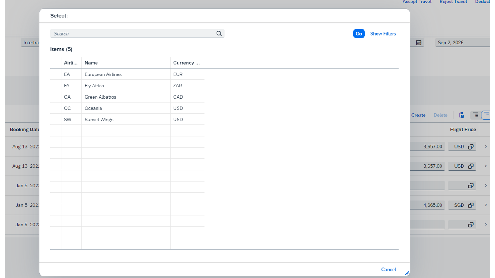
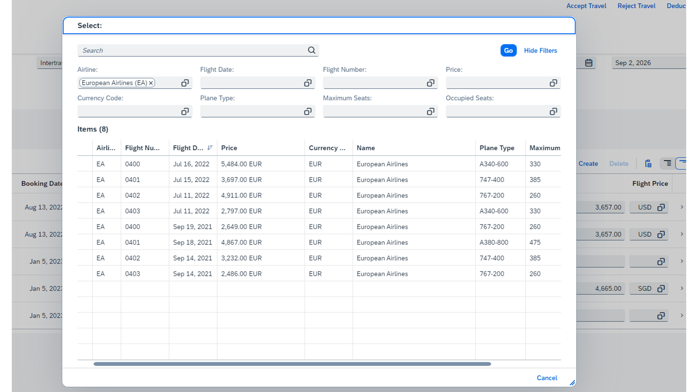

# Enriching Value Help with Dependent Filtering

*Source: https://learning.sap.com/courses/developing-an-sap-fiori-elements-app-based-on-a-cap-odata-v4-service/enriching-value-help-with-dependent-filtering_abc805bb-ac75-4263-a543-87ca99cb5bea*

Objective
After completing this lesson, you will be able to set up filter dependency between fields.
## Value Help and Dependent Filtering
You can define which fields to display on the value help dialog by using the annotation @Common.ValueList. This is applicable to filter fields and the fields with value help in _Edit_ and _Create_ mode. For example, fields of a table in an object page, fields in sections or subsections.
Consider the following sample code:
Code Snippet
Copy codeSwitch to dark mode

```

123456789101112

annotate my.Booking {
 to_Carrier @Common.ValueList: {
    CollectionPath : 'Airline',
    Label : '',
    Parameters : [
      {$Type: 'Common.ValueListParameterInOut', LocalDataProperty: to_Carrier_AirlineID, ValueListProperty: 'AirlineID'},
      {$Type: 'Common.ValueListParameterDisplayOnly', ValueListProperty: 'Name'},
      {$Type: 'Common.ValueListParameterDisplayOnly', ValueListProperty: 'CurrencyCode_code'}
    ]
  };
}

```

In the sample code, for the entity Booking, the value help of the entity Airline has the value CollectionPath: 'Airline'. The first parameter of the entity Airline, maps the main entity property to_Carrier_AirlineID to the value help entity property AirlineID. The other two parameters, Name and CurrencyCode_code are a part of the entity Airline, and are of type Common.ValueListParameterDisplayOnly. They are used only for display in the value help dialog. The properties in Parameters of the type @Common.ValueList annotation are displayed in the value help dialog.

Let's familiarize the other three types of parameters.
  * Parameter type: Common.ValueListParameterIn
These parameters influence the filtering of value help of the annotated field.
Code Snippet
Copy codeSwitch to dark mode

```

123456789101112

annotate my.Booking {
  ConnectionID @Common.ValueList: {
    CollectionPath : 'Flight',
    Label : '',
    Parameters : [
      {$Type: 'Common.ValueListParameterInOut', LocalDataProperty: to_Carrier_AirlineID,    ValueListProperty: 'AirlineID'},
      {$Type: 'Common.ValueListParameterInOut', LocalDataProperty: ConnectionID, ValueListProperty: 'ConnectionID'},
{$Type: 'Common.ValueListParameterIn', LocalDataProperty: FlightDate,  ValueListProperty: 'FlightDate'},
 ….
]
}

```

In the preceding sample code, for the Booking entity, the annotated field is ConnectionID. The FlightDate is of the parameter type Common.ValueListParameterIn. It means that if a user has selected the flight date from the _Flight Date_ field, then this value is used to filter the values displayed in the value help dialog for the _Flight Number_(ConnectionID) field.
  * Parameter type: Common.ValueListParameterOut
Code Snippet
Copy codeSwitch to dark mode

```

123456789101112

annotate my.Booking {
  ConnectionID @Common.ValueList: {
    CollectionPath : 'Flight',
    Label : '',
    Parameters : [
      {$Type: 'Common.ValueListParameterInOut', LocalDataProperty: to_Carrier_AirlineID,    ValueListProperty: 'AirlineID'},
      {$Type: 'Common.ValueListParameterInOut', LocalDataProperty: ConnectionID, ValueListProperty: 'ConnectionID'},
{$Type: 'Common.ValueListParameterOut', LocalDataProperty: FlightDate,  ValueListProperty: 'FlightDate'},
 ….
]
}

```

In the preceding sample code, for the Booking entity, the annotated field is ConnectionID. The FlightDate is of the parameter type Common.ValueListParameterOut. It means that if a user selects an airline from the value help dialog of the ConnectionID field, then the _Flight Date_ field gets auto-populated with the corresponding value.
In contrast to the parameter type Common.ValueListParameterIn, this value isn't used to filter the value help dialog of the ConnenctionID field.
  * Parameter type:Common.ValueListParameterInOut
It is a combination of both In and Out parameter features.
Code Snippet
Copy codeSwitch to dark mode

```

1234567891011

annotate my.Booking {
  ConnectionID @Common.ValueList: {
    CollectionPath : 'Flight',
    Label : '',
    Parameters : [
      {$Type: 'Common.ValueListParameterInOut', LocalDataProperty: to_Carrier_AirlineID,    ValueListProperty: 'AirlineID'},
      {$Type: 'Common.ValueListParameterInOut', LocalDataProperty: ConnectionID, ValueListProperty: 'ConnectionID'},
 ….
]
}

```

In the preceding sample code, you can see that there is dependent filtering. For example, if you select the airline **European Airlines (EA)** from the _Airline_ field, this value is set as a filter value for the _Flight Number_ (ConnectionID) value help dialog and displays the flights for the selected airline only. This is the feature of the In parameter.
If a user selects a value from the value help dialog for the field ConnectionID, then the _Airline_ field gets auto-populated with the corresponding entry. Similarly, if you select a flight number in the _Flight Number_ , the _Airline_ field gets auto-populated with the corresponding information.


## Add Dependent Filtering to the Value Help of the Fields
### Usage Scenario
In the _Bookings_ table of the _Manage Travels_ app, you want to add dependent filtering to the value help of _Flight Number_.
This means in the _Bookings_ table, if you select a flight number from the _Flight Number_ field, then the fields _Flight Date_ , _Flight Price_ , and _Currency_ get auto-populated with the corresponding values. Similarly, if you select the flight date from the _Flight Date_ field, then the corresponding flights are auto-populated in the _Flight Number_ field, if any. Here, the Flight Date is set as a filter for the _Flight Number_ in the value help dialog.
### Task Flow
In this exercise, you will extend the existing configuration of the _Flight Number_ value help. Currently its value help contains _Flight Date_ , _Flight Price_ , and _Currency_ as display-only parameters. These fields are displayed in the value help dialog but they are not auto-populated after the flight number has been selected from the _Flight Number_ field. To achieve dependent filtering, you must change the parameter type of _FlightDate_ , _Price_ , and _CurrencyCode_code_ to Common.ValueListParameterInOut.
### Prerequisites
You have completed the exercise Add Date Fields and a Multiline Input Field to the Object Page Subsection in the unit Configuring the Body of the Object Page (lesson: Adapting Input Fields). Alternatively, you can check out its solution branch: [solution/add-date-multiline-text-placeholder](https://github.com/SAP-samples/fiori-elements-v4-cap-advanced/tree/solution/add-date-multiline-text-placeholder).
### Watch the Simulation and Perform the Steps
This exercise contains a simulation that takes you through all the steps described below. You can follow the simulation and perform the steps using your own trial account.
Exercise[Start Exercise](https://learnsap.enable-now.cloud.sap/pub/mmcp/index.html?show=project!PR_D37F77D31611B3A2:uebung)
### Steps
  1. Open your CAP project in SAP Business Application Studio.
  2. Open the page editor and go to _Flight Number_ column of the Bookings table on the object page.
    1. Select travel-processor in the _Explorer_ view and choose _Show Page Map_ from the context menu.
    2. Select _Configure Page_ on the object page of the _Travel_ entity.
    3. Select _Flight Number_ under _Sections_ > _Bookings_ > _Table_ > _Columns_.
  3. Open the dialog to configure value help properties for _Flight Number_.
    1. In the right window, select _Edit Properties for Value Help_.
  4. _Define Value Help Properties for Flight Number_ dialog opens. In its _Result List_ section maintain the following values.
    1. For _FlightDate_ select _InOut_ as a Dependency and _FlightDate_ as the local value.
    2. For _Price_ select _InOut_ as a Dependency and _FlightPrice_ as the local value.
    3. For _CurrencyCode_code_ select _InOut_ as a Dependency and _CurrencyCode_code_ as the local value.
    4. Select _Apply_.
  5. Check the dependent filtering behavior on the value help of an object page table on the app.
    1. Open the _Manage Travels_ app.
    2. Choose _Edit_. The edit version of the page appears.
    3. Choose _Create_ to create a new booking entry.
    4. From the _Flight Number_ field, choose the input help to open the drop-down list with valid values. The _Select_ value help dialog appears with the list of airline details.
    5. Choose the required airline.
#### Result
You can see that the _Flight Date_ field is auto-populated with the required information.
    6. Select Show More Per Row icon.
#### Result
You can see that the _Flight Price_ and the Currency fields are auto-populated with the required information.

### Result
You have now enabled dependent filtering for the value help of fields in the object page table. Similarly, you can enable dependent filtering for the value help of fields in the list report filter bar.
Note
  * You can find the solution for this exercise on [GitHub](https://github.com/SAP-samples/fiori-elements-v4-cap-advanced).
  * The solution branch is [solution/add-value-help-for-dependent-filtering](https://github.com/SAP-samples/fiori-elements-v4-cap-advanced/tree/solution/add-value-help-for-dependent-filtering).
  * You can see the code changes compared to the previous branch on [GitHub](https://github.com/SAP-samples/fiori-elements-v4-cap-advanced/compare/solution/add-date-multiline-text-placeholder..solution/add-value-help-for-dependent-filtering).

### Next Steps
For more information, see
  * [Field Help](https://sapui5.hana.ondemand.com/sdk/#/topic/a5608eabcc184aee99e1a7d88b28816c.html)
  * [In / Out Mappings in the ValueList Annotation](https://sapui5.hana.ondemand.com/sdk/#/topic/4de40b31324e4876a8421f6f642e0140.html)
