# Developing UIs with SAPUI5

*Source: https://learning.sap.com/courses/developing-uis-with-sapui5-1*

## Contents

- **Developing UIs with SAPUI5**
  - Start learning
  - Bootstrapping SAPUI5
  - Quiz
  - Modularizing SAPUI5 Applications
  - Quiz
  - Working with Views and Controllers
  - Working with View Controllers
  - Quiz
  - Structuring Applications via Components
  - Using the Declarative API
  - Quiz
  - Implementing the UI
  - Using Densities for Controls
  - Quiz
  - Dealing with Fragments as Reusable UI Parts
  - Quiz
  - Models and Data Binding
  - Implementing Aggregation Binding
  - Implementing Element Binding
  - Using Data Types
  - Implementing and Using Formatter Functions
  - Sorting and Filtering
  - Using Expression Binding
  - Adapting Applications to Different Device Types
  - Quiz
  - Localization
  - Quiz
  - OData Model
  - Creating New Entities through an OData Model
  - Quiz
  - Routing and Navigation
  - Navigating to Routes with Hard-Coded Patterns
  - Routing Back
  - Catching Invalid Hashes
  - Navigating to Routes with Mandatory Parameters
  - Quiz


---

## Developing UIs with SAPUI5

### Start learning

*Source: https://learning.sap.com/courses/developing-uis-with-sapui5-1/getting-started-with-sapui5-development_b2b142f9-fb05-4a51-bdae-a107ab360021*

Objective
After completing this lesson, you will be able to set up SAP Business Application Studio
## Working with SAP Business Application Studio
### Dev Spaces
The following units and lessons discuss the basic concepts of SAPUI5 development. To deepen the individual learning contents, there are always exercises with practical programming tasks at the end of the respective topics. In these exercises, a complex scenario is built up step by step. The simple _Hello World_ application that is created at the beginning will be expanded throughout the course into a comprehensive application that incorporates all the concepts discussed such as models, data binding, internationalization, and navigation.

The exercises will be implemented in the SAP Business Application Studio. To do this, a dev space will first be created (see the figure, _Creating a Dev Space_).
A dev space is a development environment containing the tools, capabilities, and resources you need to develop your application in SAP Business Application Studio.
There are different dev space types available. For the exercise scenario, a dev space of type SAP Fiori is required. It is designed to develop SAP Fiori applications based on various environments, including Cloud Foundry, ABAP Cloud, and SAP S/4HANA. A dev space of type SAP Fiori contains, among other things, the SAP Fiori Tools extension, which includes the templates, CLI, and code completion needed to create SAP Fiori applications.
### Git Source Control
In SAP Business Application Studio, you can create projects from scratch using the project wizard, or import existing projects from the file system.
In addition, SAP Business Application Studio enables you to connect to the Git source control system and interact with Git remote repositories.
Note
It is recommended to always connect your projects to a Git repository for long-term persistence.
For detailed information on working with Git, see the SAP Business Application Studio documentation.
All Git tasks can be performed using the terminal in SAP Business Application Studio. To open a terminal, select the path _Terminal_ → _New Terminal_ from the hamburger menu in the upper-left corner.

In addition to the terminal, SAP Business Application Studio also provides a Git source control view to execute Git commands through a graphical user interface (see the figure, _Cloning Repositories_).
For the exercise scenario to be implemented in the training course, you will not create a new project from scratch using one of the available project templates in SAP Business Application Studio. Instead, for simplicity, the starting point for the exercises will be provided via a Git remote repository that you will clone at the beginning.
You can clone the source project, for example, via the Git source control view or via the _Clone from Git_ tile on the _Get Started_ page (see the figure, _Cloning Repositories_).
The main branch of the remote repository to be cloned contains the starting point for the exercise scenario. For each exercise, the remote repository also contains an additional branch with the sample solution for the exercise. The names of the branches can be found at the beginning of each exercise.
If you want to skip an exercise while working through the exercise scenario, you can use the associated sample solution branch as the basis for the subsequent exercise.
### Previewing an Application
Once you have finished coding, several options to preview an application are available in SAP Business Application Studio.
You can start a preview by running npm scripts from the terminal or by using the Run Control function in the _Run and Debug_ pane.
In addition to the predefined Launch Configurations found in the _Run and Debug_ pane, you can also create additional Launch Configurations from there that define how your project is executed.

It is also possible to start a preview from the context menu. Right-click on any subfolder in your project and select _Preview Application_ from the context menu that appears (see the figure, _Starting a Preview from Context Menu_). You are then provided with the following options, among others:
  * start-noflp
This starts the application via the HTML page index.html. The application is not embedded in an SAP Fiori launchpad sandbox.
  * start-mock
This starts the application by using a mock server to reflect an OData endpoint. This way, you can test an application without connecting to a live OData service.

In the training course, the exercises are initially tested using the start-noflp option. Later, an OData model is integrated into the scenario, which is used to call an OData service that is implemented in an ABAP back-end. Since this ABAP back-end cannot be made available for the course, the start-mock option is used to test the OData model. The start-mock option simulates access to the back-end data.
## Output 'Hello World' via an HTML Page in a Prepared SAPUI5 Project
### Business Scenario
In this exercise, you first create a _dev space_ for the SAP Business Application Studio. Then, you clone a prepared SAPUI5 project from a Git repository into this _dev space_. Finally, you adapt the HTML page from the copied SAPUI5 project to output **Hello World** in the browser.
| _Template:_  | Git Repository: <https://github.com/SAP-samples/sapui5-development-learning-journey.git>, Branch: **main**  |
| --- | --- |
| _Model solution:_  | Git Repository: <https://github.com/SAP-samples/sapui5-development-learning-journey.git>, Branch: **sol/1_hello_world**  |
Note
In the following exercises, SAP Business Application Studio is used as the development environment. It is assumed that you already have access to this development tool.
If this is not yet the case, you can gain access to the SAP Business Application Studio free of charge via the free tier model for SAP Business Technology Platform (SAP BTP). To do this, read tutorial [Get an Account on SAP BTP to Try Out Free Tier Service Plans](https://developers.sap.com/tutorials/btp-free-tier-account.html) on how to create a free account on SAP BTP. Based on this, video [SAP Business Application Studio Free Tier Model Onboarding](https://www.youtube.com/watch?v=-g7LZHqcbDQ) shows the necessary steps to set up the free tier plan for SAP Business Application Studio.
### Task 1: Create an SAP Fiori Dev Space
#### Steps
  1. If not already done, start the SAP Business Application Studio.
  2. Create an _SAP Fiori dev space_ with the name **UX400**.
    1. Choose _Create Dev Space_.
    2. Enter **UX400** as _Dev Space name_.
    3. Choose **SAP Fiori** as the application type.
    4. Choose the _Create Dev Space_ button.
  3. Open your SAP Fiori dev space _UX400_.
Note
Immediately after creation, the new dev space is in the state STARTING. You must wait until it is in the state RUNNING before you can open it. This may take some time.
After a period of idle time, the dev space is automatically stopped. A stopped dev space can be restarted with the dev space manager.
    1. Click the name _UX400_ of the new dev space as soon as it is in the state RUNNING.
#### Result
The SAP Fiori dev space _UX400_ opens and the _Get Started_ page appears.

### Task 2: Clone a Prepared SAPUI5 Project
#### Steps
  1. Clone the prepared SAPUI5 project from Git using the following URL: <https://github.com/SAP-samples/sapui5-development-learning-journey.git>.
    1. In SAP Business Application Studio, click the _Clone from Git_ tile on the _Get Started_ page.
Note
If the _Get Started_ page is not displayed, it can be opened using the following menu path: _Help_ → _Get Started_.
    2. In the _Provide repository URL_ field that appears, type <https://github.com/SAP-samples/sapui5-development-learning-journey.git> and press _Enter_.
#### Result
A copy of the specified Git repository is created for use in SAP Business Application Studio.
    3. To open the _sapui5-development-learning-journey_ project you just created, Select _Open_ in the pop-up.
#### Result
The _sapui5-development-learning-journey_ project opens in SAP Business Application Studio.
  2. Download the required project dependencies using command **npm install**.
    1. Select _Terminal_ → _New Terminal_ from the SAP Business Application Studio menu.
    2. In the terminal window that appears, type **npm install** and press _Enter_ :
Code snippet
Copy code

```

```

#### Result
The required project dependencies are downloaded to a folder named _node_modules_ in the project directory.

### Task 3: Output 'Hello World' via the index.html Page in the Prepared SAPUI5 Project
#### Steps
  1. Open the _index.html_ page in the editor.
    1. In the _Explorer_ view of the SAP Business Application Studio, double-click _webapp_ → _index.html_ in the project structure of the _sapui5-development-learning-journey_ project.
#### Result
The _index.html_ page opens in an editor window.
  2. Add a <title> tag as a child to the <head> tag and use it to set the title of the HTML page to **Exercise Application**.
Further, add a <div> tag as a child to the <body> tag and output **Hello World** over it on the HTML page.
    1. The _index.html_ page should now look like this:

  3. Test run your application by starting it from the SAP Business Application Studio.
    1. Right-click on any subfolder in your _sapui5-development-learning-journey_ project and select _Preview Application_ from the context menu that appears.
    2. Select the npm script named _start-noflp_ in the dialog that appears.
#### Result
The application will now display in a new tab.
Hint
If the application does not appear in a new tab, please check your pop-up blocker settings.
    3. In the opened application, check if the adjustments you made to the _index.html_ page are displayed.


### Bootstrapping SAPUI5

*Source: https://learning.sap.com/courses/developing-uis-with-sapui5-1/bootstrapping-sapui5_a5b2d3e2-530e-4a47-9756-321b5edf152a*

Objective
After completing this lesson, you will be able to load and initialize the SAPUI5 library to use SAPUI5 features
## Bootstrapping
### Standard Bootstrap File
To use SAPUI5, you must load and initialize the SAPUI5 library.

The figure, _Bootstrapping SAPUI5_ , shows a typical bootstrap script tag used to load the sap-ui-core.js file. When this script tag is included in a page, the SAPUI5 runtime will automatically be initialized as soon as the script is loaded and executed by the browser.
Note
If you run your application standalone, the bootstrap script is added to your HTML page. In an SAP Fiori launchpad environment, the launchpad executes the bootstrap and no additional HTML page is needed to display the application.
SAPUI5 provides several bootstrap files for different use cases. sap-ui-core.js is the standard bootstrap file, which is recommended to use for typical use cases. It already contains jQuery, jquery-ui-position and only the minimum required parts of the core library (sap.ui.core).
### Load Options
SAPUI5 can either be loaded locally with a relative path from an SAP Web server (see the figure, _Bootstrapping SAPUI5_) or externally from a Content Delivery Network (CDN).
You can point to a specific version in a CDN, which allows you to select a fixed version for bootstrapping. To do this, assign a versioned URL like the following to the src attribute in the bootstrap script:
XML
Copy codeSwitch to dark mode

```

1

https://ui5.sap.com/1.96.16/resources/sap-ui-core.js

```

The segment of the URL after the host name is used to specify the desired version.
Alternatively, you can use the default version of the SAPUI5 libraries which has the following generic URL:
Code Snippet
Copy codeSwitch to dark mode

```

1

https://ui5.sap.com/resources/sap-ui-core.js

```

Caution
The default version is constantly being upgraded and this might have an impact on the stability of your application. Use this version for testing purposes only.
### Configuration Options
The SAPUI5 runtime can be configured using so-called configuration options. The complete list of configuration options available in SAPUI5 can be found in the [API Reference](https://ui5.sap.com/#/api) in the _Demo Kit_ under sap.ui.core.Configuration.
SAPUI5 supports different possibilities to provide values for the available configuration options. Among other things, configuration options can be set via the bootstrap script tag. For this purpose, attributes are added to the script tag whose names are composed of the name of the respective configuration option and the prefix data-sap-ui-.
In the script tag in the figure, _Bootstrapping SAPUI5_ , the following configuration options are used:
  * theme
The configuration option theme defines the theme that shall be used.
  * libs
The configuration option libs defines a list of libraries that shall be loaded initially.
Note
An SAPUI5 library bundles a set of controls and related types. There are predefined standard libraries, such as sap.m and sap.ui.layout.
  * compatVersion
Applications must set this configuration option to edge. Other version definitions are deprecated. This ensures that the latest SAPUI5 features are used.

## Application Script
The bootstrap script can be followed by an application script that is used to implement the SAPUI5 application. In the application script, controls such as buttons or input UI elements can be created.
Watch the video to learn how to add a Text UI element to the HTML page via an application script.
Settings
## Bootstrap SAPUI5
### Business Scenario
In the last exercise, you output **Hello World** via a <div> tag on an HTML page, for which SAPUI5 has not yet been used. In this exercise, you will now load SAPUI5 into the browser and initialize it. Then you will display **Hello World** on the HTML page using the SAPUI5 UI element sap.m.Text.
| _Template:_  | Git Repository: <https://github.com/SAP-samples/sapui5-development-learning-journey.git>, Branch: **sol/1_hello_world**  |
| --- | --- |
| _Model solution:_  | Git Repository: <https://github.com/SAP-samples/sapui5-development-learning-journey.git>, Branch: **sol/2_bootstrapping**  |
### Task 1: Add a Bootstrap Script
#### Steps
  1. Make sure that the _index.html_ file is open in the editor.
    1. To open the _index.html_ file in the editor, proceed as follows: In the _Explorer_ view of the SAP Business Application Studio, double-click _webapp_ → _index.html_ in the project structure of the _sapui5-development-learning-journey_ project.
  2. Add the following <script> tag as a child to the <head> tag to load and initialize SAPUI5:
JavaScript
Copy codeSwitch to dark mode

```

1234567

<script
  id="sap-ui-bootstrap"
  src="resources/sap-ui-core.js"
  data-sap-ui-theme="sap_fiori_3"
  data-sap-ui-libs="sap.m"
  data-sap-ui-compatVersion="edge"
></script>

```

Note
The src attribute of the <script> tag tells the browser where to find the SAPUI5 core library – it initializes the SAPUI5 runtime and loads additional resources, such as the sap.m library that is specified in the data-sap-ui-libs attribute and that contains the UI controls needed for the application.
In addition, sap_fiori_3 is set as default theme and the compatibility version is defined as edge to make use of the most recent functionality of SAPUI5.
    1. Make sure that the _index.html_ page now looks like this:


### Task 2: Add a Text UI Element
#### Steps
  1. Delete the _Hello World_ <div> tag you created in the previous exercise from the <body> of the HTML page.
    1. The <body> of the HTML page should now be empty again:
Code Snippet
Copy codeSwitch to dark mode

```

12

<body>
</body>

```

  2. Add the class="sapUiBody" and id="content" attributes to the <body> tag.
Note
The class sapUiBody adds additional theme-dependent styles for displaying SAPUI5 apps.
    1. The <body> tag should now look like this:
Code Snippet
Copy codeSwitch to dark mode

```

12

<body >
</body>

```

  3. Now create a sap.m.Text UI element with the text **Hello Word** and place it in the _< body>_ of the HTML page using the id of the <body>. For this purpose, create the following <script> tag as another child of the <head> tag directly behind the bootstrap script created above:
JavaScript
Copy codeSwitch to dark mode

```

1234

<script>
  var oText = new sap.m.Text({text: "Hello World"});
  oText.placeAt("content");
</script>

```

    1. The <head> and <body> of the HTML page should now look like this:

  4. Test run your application by starting it from the SAP Business Application Studio.
    1. Right-click on any subfolder in your _sapui5-development-learning-journey_ project and select _Preview Application_ from the context menu that appears.
    2. Select the npm script named _start-noflp_ in the dialog that appears.
#### Result
The application now displays in a new tab.
Hint
If the application does not appear in a new tab, please check your pop-up blocker settings.
    3. In the opened application, check if the **Hello World** text of the sap.m.Text UI element is displayed on the HTML page.

[Continue to quiz](https://learning.sap.com/courses/developing-uis-with-sapui5-1/loading-and-initializing-sapui5)


### Quiz

*Source: https://learning.sap.com/courses/developing-uis-with-sapui5-1/loading-and-initializing-sapui5*

It's time to put what you've learned to the test, get 2 right to pass this unit.
1.
### What kind of dev space is needed to develop SAPUI5 applications?
Choose the correct answer.
Basic
SAP Mobile Application
Full Stack Cloud Application
SAP Fiori
2.
### What is the name of the standard bootstrap file recommended for typical use cases?
Choose the correct answer.
preload.js
sap-ui-core.js
sap-m.js
init-default.js
Submit answers[Next unit](https://learning.sap.com/courses/developing-uis-with-sapui5-1/defining-and-using-modules_ab210fc5-edce-4dfb-920e-4ec152db33f0)


### Modularizing SAPUI5 Applications

*Source: https://learning.sap.com/courses/developing-uis-with-sapui5-1/defining-and-using-modules_ab210fc5-edce-4dfb-920e-4ec152db33f0*

Objective
After completing this lesson, you will be able to modularize SAPUI5 applications
## Modularization
The SAPUI5 framework provides built-in support for application modularization. That is, instead of defining and loading a large bundle of JavaScript code, an application can be split into smaller parts that can then be loaded at runtime when they are needed.
Watch the video to understand important features of this modularization concept.
For details, see the [API Reference](https://ui5.sap.com/#/api) in the _Demo Kit_ and the example in the following section.
## Module Definition
As mentioned previously, an SAPUI5 module is defined by calling the sap.ui.define method. The implementation made via sap.ui.define determines the so-called export value of a module. This export value is typically a JavaScript object that represents the value of a module from a usage perspective. Usually, the export value is determined via a function.
The typical use of sap.ui.define is a single top level call to this method in a JavaScript file. When a module is requested for the first time, the JavaScript file is loaded and executed, which in turn executes the top level call to sap.ui.define.
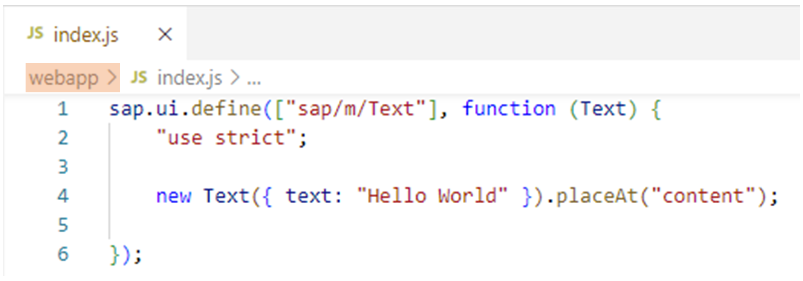
The figure, _Simple Module Definition_ , shows a simple example of a module definition. In the index.js file, which is stored in the webapp folder of the project, the sap.ui.define method is called.
The sap.ui.define method can be passed an array. Each entry in this dependencies array then represents the name of another module on which the currently defined module depends. The name of a used SAPUI5 module as well as the name of the currently defined module consists of a non-empty sequence of name segments. The individual segments are separated by a forward slash ('/').
The module defined in the example uses the sap.m.Text control in its implementation. Thus it is dependent on the corresponding module through which the sap.m.Text control is implemented. This module is named sap/m/Text and is added to the dependencies array.
Note
SAPUI5 controls are consistently implemented as modules. The module names are derived from the class names of the controls by replacing the dot in the class name ('.') with a forward slash ('/'). In the [API Reference](https://ui5.sap.com/#/api) in the _Demo Kit_ , you can find the module name belonging to a control in the header of the respective control documentation.
All modules listed in the dependencies array are loaded before the export value of the currently defined module is determined. For this purpose, the export value of each required module is passed as a parameter to a factory function, which in turn is handed over to the sap.ui.define method. The factory function is called as soon as all required modules have been loaded. The order of the factory function parameters matches the order of the modules in the dependencies array. The names for the parameters of the factory function are arbitrary. As a rule, however, the last name segment from the module name is used as parameter name.
In the example shown, the factory function passed to sap.ui.define has a parameter named Text. This parameter is used to reference the export value of the sap/m/Text module from the dependencies array. If the module defined in the example is used for the first time, the factory function is only called when the sap/m/Text module is available in the browser. In the implementation of the factory function, the Text control can then be accessed via the Text parameter.
Usually, the factory function returns a value such as a JavaScript object via the return statement. This value then represents the export value for the module. In the example shown, no value is returned. For simplicity, only the text _Hello World_ is added to a UI area via the Text control.
Note
The use strict; literal expression used in the implementation of the factory function was introduced in JavaScript 1.8.5 (ECMAScript 5). It instructs the browser to execute the code in what is called strict mode. Strict mode helps identify potential coding problems early in the development cycle. For example, it means ensuring that variables are declared before they are used. Strict mode helps avoid common JavaScript pitfalls and is therefore a good practice to use.
## Loading of Modules
In the bootstrap script shown in the figure, _Asynchronous Loading of Modules_ , the default bootstrap file sap-ui-core.js is loaded from the resources folder. By default, SAPUI5 therefore loads all modules relative to this folder. This works for modules that are part of the SAPUI5 delivery. However, it fails for those modules that are created by the developer in an SAPUI5 project.
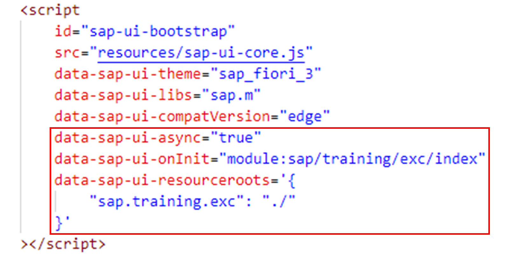
### Configuration Option resourceroots
Using the resourceroots configuration option, it is possible to redirect requests for application-specific modules to the corresponding Web application. To set this configuration option, for example, the attribute data-sap-ui-resourceroots can be added to the bootstrap script. The value of the configuration option is a map of resource locations keyed by a corresponding module Id prefix.
In the example shown, the module Id prefix sap.training.exc is assigned to the current folder, that is, the folder that contains the file in which the bootstrap script shown is located. In the example, this is the webapp folder.
The module discussed above is implemented in a file named index.js, which is stored in the webapp folder. With the module Id prefix defined here, this results in the following Id to request this module:
XML
Copy codeSwitch to dark mode

```

1

sap/training/exc/index

```

Here sap/training/exc points to the webapp folder, and in this folder is the file index.js. The file extension .js is not specified and is automatically added during loading.
### Configuration Option async
For SAPUI5 libraries like sap.ui.core or sap.m there are so-called library preload files named library-preload.js. These preload files contain all modules of the respective library.
Adding the attribute data-sap-ui-async=true to the bootstrap script enables the module loader to load single modules as well as library preload files asynchronously.
### Configuration Option onInit
The attribute data-sap-ui-onInit can be used in the bootstrap script to define code that is executed after initialization. In doing so, modules are indicated by the prefix module:.
In the example shown, the sap/training/exc/index module discussed above is loaded and executed (asynchronously) after the framework has been initialized.
## Work with Modules
### Business Scenario
In this exercise, you will move the logic for creating and placing the **Hello World** Text UI element that you implemented in the previous exercise out of the HTML page and into a separate module. You will then call this module declaratively from the index.html page.
| _Template:_  | Git Repository: <https://github.com/SAP-samples/sapui5-development-learning-journey.git>, Branch: **sol/2_bootstrapping**  |
| --- | --- |
| _Model solution:_  | Git Repository: <https://github.com/SAP-samples/sapui5-development-learning-journey.git>, Branch: **sol/3_modules**  |
### Task 1: Delete the <script> Tag
#### Steps
  1. Make sure that the index.html page is open in the editor.
  2. Delete the <script> tag used to create and place the **Hello World** Text UI element in the file.
    1. Delete the following lines:
JavaScript
Copy codeSwitch to dark mode

```

1234

<script>
  var oText = new sap.m.Text({text: "Hello World"});
  oText.placeAt("content");
</script>

```

#### Result
The <head> tag of the HTML page should now look like this:
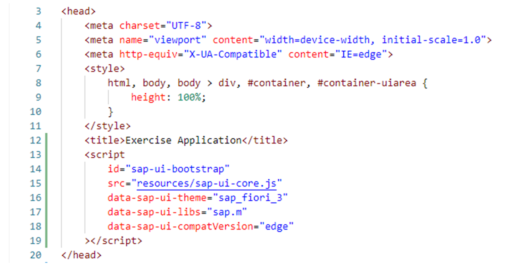
### Task 2: Implement a Module
#### Steps
  1. Create a new file named index.js in the webapp folder.
    1. Open the context menu for the webapp folder in the project structure.
    2. Select _New File_.
    3. In the field that appears, type **index.js** and press _Enter_.
#### Result
The index.js file is created and displays in the editor.
  2. Add the following code to the index.js file to define a module through which the **Hello World** Text UI element is created and placed on the HTML page:
JavaScript
Copy codeSwitch to dark mode

```

123456

sap.ui.define(["sap/m/Text"], function (Text) {
  "use strict";

  new Text({ text: "Hello World" }).placeAt("content");

});

```

#### Result
The index.js file should be implemented as follows:
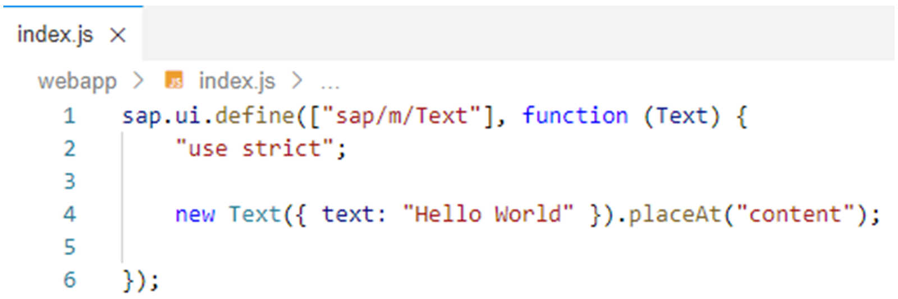
### Task 3: Load the Module Declaratively
#### Steps
  1. Make sure the index.html page is open in the editor.
  2. Add the following attributes to the bootstrap script:
XML
Copy codeSwitch to dark mode

```

123

data-sap-ui-async="true"
data-sap-ui-onInit="module:sap/training/exc/index"
data-sap-ui-resourceroots='{"sap.training.exc": "./"}'

```

Note
The added configuration tells SAPUI5 that resources in the _sap.training.exc_ namespace are in the same directory as index.html. The namespace is used to initially load the index.js module. For performance reasons, SAPUI5 is enabled to load modules and library-preload files asynchronously.
    1. The <head> tag of the HTML page should now look like this:
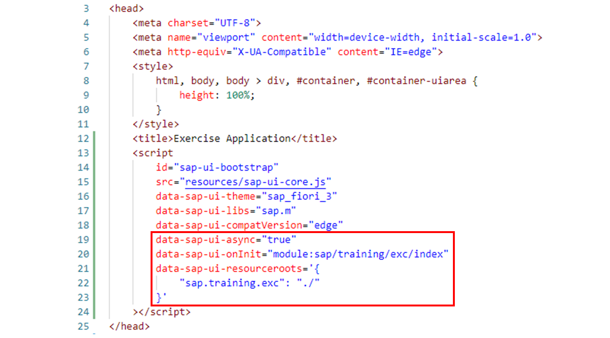
  3. Test run your application by starting it from the SAP Business Application Studio.
    1. Right-click on any subfolder in your _sapui5-development-learning-journey_ project and select _Preview Application_ from the context menu that appears.
    2. Select the npm script named _start-noflp_ in the dialog that appears.
    3. In the opened application, check if the **Hello World** text of the sap.m.Text UI element is displayed on the HTML page.

[Continue to quiz](https://learning.sap.com/courses/developing-uis-with-sapui5-1/modularizing-sapui5-applications)


### Quiz

*Source: https://learning.sap.com/courses/developing-uis-with-sapui5-1/modularizing-sapui5-applications*

It's time to put what you've learned to the test, get 1 right to pass this unit.
1.
### Which JavaScript method do you need to call to define a module?
Choose the correct answer.
sap.ui.declare
jQuery.sap.require
sap.ui.define
jQuery.sap.define
Submit answers[Next unit](https://learning.sap.com/courses/developing-uis-with-sapui5-1/working-with-xml-views_dfec8eb9-8b04-46b3-84fb-58a0ce10a22b)


### Working with Views and Controllers

*Source: https://learning.sap.com/courses/developing-uis-with-sapui5-1/working-with-xml-views_dfec8eb9-8b04-46b3-84fb-58a0ce10a22b*

Objective
After completing this lesson, you will be able to create and use XML views
## Model View Controller (MVC)
The Model View Controller (MVC) concept is used in SAPUI5 to separate the presentation of information from user interaction. This separation facilitates the development and modification of an application.
Watch the video to understand the roles assigned to model, view, and controller in MVC.
The relationship between views and models will be covered later in the course.
## View Types
For the implementation of views, SAPUI5 provides predefined view types.
These are listed in the figure _Supported View Types_.

XML views and JSON views are declarative views in which the UI is described in XML format or JSON format. The implementation is done in a file or as an XML or JSON string.
A typed view, on the other hand, is implemented programmatically using JavaScript. This means that the view is defined using a separate view class.
Note
It is recommended to use XML views because XML views enforce a clear separation of the UI definition from the application logic (which must be implemented in the controller). This makes the code more readable and easier to support.
Therefore, this training course focuses exclusively on XML views, which are used throughout the examples and exercises. For information on JSON views and typed views, see the documentation.
## XML Views
### View Names
If you define an XML view using an XML string, no file is required.
If, on the other hand, you define an XML view in a file, which is more common, the file name ends with .view.xml. For example, in the figure, _Simple XML View_ , the file name is App.view.xml.

Typically, views are stored in the view folder of the project structure. The file name together with the location of the file in the project structure and the module Id prefix determine the name of the view. This view name corresponds to the SAPUI5 module name, via which the view can later be loaded and instantiated (see below).
**Example**
Suppose in the index.html file of the project, the following attribute is specified in the bootstrap script:
XML
Copy codeSwitch to dark mode

```

1

data-sap-ui-resourceroots='{"sap.training.exc": "./"}'

```

This registers the webapp folder of the project as a resource location, which is assigned to the module Id prefix sap.training.exc. If the App.view.xml file shown in the figure is now stored in the webapp/view folder of the project, this results in the following view name:
Code Snippet
Copy codeSwitch to dark mode

```

1

sap.training.exc.view.App

```

The prefix sap.training.exc of this view name refers to the webapp folder. The view segment following sap.training.exc specifies the view subfolder as the location of the file, and the last segment in the view name represents the file name, whereby the suffix .view.xml is automatically added later when the view is loaded by SAPUI5.
### View Implementation
Each control used in an XML view is represented by an XML tag with the name of the control.
The <View> tag is used as the root node in an XML view. This tag corresponds to the sap.ui.core.mvc.View control. The names of the SAPUI5 control libraries used in the view and the corresponding subpackages are thereby mapped to XML namespaces via xmlns attributes of the <View> tag.
Note
A control can be in a subpackage of a control library. For example, sap.ui.core.mvc.View is in the sap.ui.core library, but the full package name is sap.ui.core.mvc. You must specify this subpackage as an XML namespace even if sap.ui.core were already defined as a namespace.
In the example shown, two namespace mappings are required: View comes from the package sap.ui.core.mvc, and the Text control used comes from the sap.m library (compare the _API Reference_ in the _Demo Kit_).
The sap.ui.core.mvc namespace is defined with the alias mvc, so the <View> tag is prefixed with this mvc alias.
Note
Technically, you can define any alias for a namespace. However, the convention is to use the last part of the package name (that is,mvc in the example).
One of the required namespaces can be defined as the default namespace (xmlns="..."). The control tags for this namespace then do not need a prefix.
In the example, a sap.m.Text control is placed on the view. The <Text> tag used for this does not contain a prefix, because the sap.m library is mapped to the default namespace.
Property values for controls in XML views are specified as attributes of the XML tag of the control. The name of the attribute corresponds to the name of the property. For example, the text property of a sap.m.Text control is specified as text="value".
Note
The names of the properties available for a control can be looked up in the _API Reference_. They are listed there for the corresponding control in the _Properties_ section. The existing properties are also displayed in the SAP Business Application Studio using the _Auto Completion_ functionality in the editor.
## View Instantiation
To instantiate an XML view, SAPUI5 provides the factory method create in the class sap.ui.core.mvc.XMLView. In the example shown in the figure _Instantiating an XML View_ , the module in which the XML view is created is therefore dependent on the sap/ui/core/mvc/XMLView module.

The create method is passed an object with the required configuration options. A complete list of all available options can be found in the _API Reference_ in the _Demo Kit_.
In the example shown, the following two properties are used:
  * id
The id property can be used to specify an Id for the view instance. If the id property is not passed, an Id will be generated by SAPUI5.
  * viewName
The viewName property is used to pass the name of the XML view to be loaded (see above). As discussed, the file suffix .view.xml is automatically added by SAPUI5.

The create method loads views asynchronously via the module system. The advantage of asynchronous loading over synchronous loading is that the UI does not freeze for the duration of the loading process and the functionalities are not blocked during view initialization.
Since the loading process is asynchronous, the create method does not return the view instance itself, but a Promise that resolves with the view instance.
Therefore, on the returned Promise, as shown in the example, call the then method to register a callback function for the success case. This function is called as soon as the view instance is available, and the instance is passed to it via the interface (oView).
In the implementation of the callback function, the view instance can be added to a UI area by calling the placeAt method.
## Create and Use an XML View
### Business Scenario
In this exercise, you will create an XML view with a **Hello World** Text UI element. Then you delete the code that creates a **Hello World** Text UI element and places it on the HTML page in the module you created in the previous exercise. Instead, you will instantiate the XML view there and place it on the HTML page.
| _Template:_  | Git Repository: <https://github.com/SAP-samples/sapui5-development-learning-journey.git>, Branch: **sol/3_modules**  |
| --- | --- |
| _Model solution:_  | Git Repository: <https://github.com/SAP-samples/sapui5-development-learning-journey.git>, Branch: **sol/4_views**  |
### Task 1: Implement an XML View
#### Steps
  1. Create a new file named App.view.xml in the subfolder view of the webapp folder.
    1. Open the context menu for the webapp/view folder in the project structure.
    2. Select _New File_.
    3. In the field that appears, type **App.view.xml** and press _Enter_.
#### Result
The App.view.xml file is created and displays in the editor.
  2. Add the following code to the App.view.xml file to define an XML view with a **Hello World** Text UI element:
XML
Copy codeSwitch to dark mode

```

1234567

<mvc:View 
  xmlns:mvc="sap.ui.core.mvc"
  xmlns="sap.m">

  <Text text="Hello World"/>

</mvc:View>

```

#### Result
The XML view should be implemented as follows:

### Task 2: Instantiate the XML View
#### Steps
  1. Make sure the index.js module is open in the editor.
  2. Delete the code that creates a **Hello World** Text UI element and places it on the HTML page in the index.js module.
    1. Delete the following line:
JavaScript
Copy codeSwitch to dark mode

```

1

new Text({ text: "Hello World" }).placeAt("content");

```

#### Result
The index.js module should now look like this:
  3. Modify the implementation of the index.js module as follows to instantiate the XML view created above and place it on the HTML page:
JavaScript
Copy codeSwitch to dark mode

```

1234567891011

sap.ui.define(["sap/ui/core/mvc/XMLView"], function (XMLView) {
  "use strict";

  XMLView.create({
    id: "App",
    viewName: "sap.training.exc.view.App"
  }).then(function (oView) {
    oView.placeAt("content");
  });

});

```

Note
Pay attention to the changed dependency array and parameter of the factory function. index.js now depends on sap/ui/core/mvc/XMLView instead of sap/m/Text.
#### Result
The index.js file should be implemented as follows:
  4. Test run your application by starting it from the SAP Business Application Studio.
    1. Right-click on any subfolder in your _sapui5-development-learning-journey_ project and select _Preview Application_ from the context menu that appears.
    2. Select the npm script named _start-noflp_ in the dialog that appears.
    3. In the opened application, check if the XML view with the **Hello World** text of the sap.m.Text UI element is displayed on the HTML page.


### Working with View Controllers

*Source: https://learning.sap.com/courses/developing-uis-with-sapui5-1/working-with-view-controllers_c4691c5c-320a-4097-bb54-6f50364ebc38*

Objective
After completing this lesson, you will be able to use view controllers
## Referencing a Controller
### Assigning a View Controller
To assign a controller to an XML view, the attribute controllerName can be used in the <View> tag (see the figure _Referencing a Controller_). The name of the controller class is entered as the value of the attribute.

SAPUI5 loads the controller via the module system.
The XML view shown in the figure is taken from a project in which the webapp folder is registered in the bootstrap script as resource location. For this purpose, the module Id prefix sap.training.exc is assigned to the webapp folder via the data-sap-ui-resourceroots attribute in the bootstrap script.
The controller name sap.training.exc.controller.App is therefore resolved as follows: The prefix sap.training.exc points to the webapp folder. The controller segment following sap.training.exc specifies the controller subfolder as the location of the file to load. The last segment in the controller name represents the file name, whereby the suffix .controller.js is automatically appended. That is, SAPUI5 ultimately loads the file App.controller.js from the controller subfolder.
Note
It generally follows that the file containing the view controller implementation must have the suffix .controller.js.
Typically, view controllers are stored in the controller folder of the project structure. More information about the implementation of a view controller follows in the next section.
### Event Handlers
Many controls can trigger events. For example, a sap.m.Button triggers the event press when the user clicks or taps the control. Which events are supported can be looked up in the _API Reference_ in the _Events_ section for the respective control.
In an XML view, event handlers can be attached to events. To do this, an attribute with the name of the event is added to the corresponding control tag, for example, a press attribute to a <Button> tag. The attribute value is then the name of the event handler.
Event handler names that begin with a dot ('.') are assumed to represent a method in the controller. They are resolved by removing the leading dot and calling the method with the resulting name on the controller instance. So, in the example shown, the method onSayHello is called on the view controller when the user clicks or taps the button.
## Controller Implementation
The figure, _Simple Controller_ , shows the file with the implementation of the controller that is referenced by the view discussed above.
As explained previously, the file is named App.controller.js and is stored in the webapp/controller folder of the project.

View controllers are implemented as separate modules via sap.ui.define and are usually created as subclasses of sap.ui.core.mvc.Controller. Therefore, in the example shown, the module sap/ui/core/mvc/Controller has been added to the dependency array and a parameter named Controller has been inserted in the interface of the factory function.
In the implementation of the factory function, a new subclass of sap.ui.core.mvc.Controller is created by calling the extend method. This subclass is set as the value of the module via the return statement.
The first parameter of the extend method is the name of the controller class to be created. In the example, this is sap.training.exc.controller.App. This class name matches the controller name specified in the <View> tag of the XML view as the value of the controllerName attribute.
The second parameter of the extend method is an object literal that contains the information with which to enrich the created subclass. In the example, the object literal contains the method onSayHello, which acts as an event handler for the press event of the button on the view (see above). The method displays an information dialog with the text _Hello World_ by calling the information method of the sap.m.MessageBox class. For this reason, the controller module created via sap.ui.define is dependent on sap/m/MessageBox in addition to sap/ui/core/mvc/Controller. The information method shows, besides the text, an info icon and an OK button on the dialog.
In addition to the possibility to define own methods and properties for a controller, SAPUI5 also provides several lifecyle hooks that are borrowed from the superclass sap.ui.core.mvc.Controller. For example, the borrowed onInit method can be implemented on the own controller to perform an initial setup. If available, this method is called by SAPUI5 once per view instance when the view is instantiated, and the controls have already been created. The method can be used to modify the view before it is displayed, bind event handlers, and perform other one-time initializations.
## Create and Use a View Controller
### Business Scenario
In this exercise, you will place a button on the XML view that you created in the previous exercise. To react to the button click, you add a controller to the XML view and implement the corresponding event handler method there.
| _Template:_  | Git Repository: <https://github.com/SAP-samples/sapui5-development-learning-journey.git>, Branch: **sol/4_views**  |
| --- | --- |
| _Model solution:_  | Git Repository: <https://github.com/SAP-samples/sapui5-development-learning-journey.git>, Branch: **sol/5_controllers**  |
### Task 1: Add a Button to the View
#### Steps
  1. Make sure the App.view.xml view file is open in the editor.
  2. Remove the **Hello World** Text UI element from the view.
    1. Delete the following line:
XML
Copy codeSwitch to dark mode

```

1

<Text text="Hello World"/>

```

  3. Instead, add the following line to the view to create a button labeled **Say Hello** that, when pressed, will call the event handler method onSayHello in the view controller:
XML
Copy codeSwitch to dark mode

```

1

<Button text="Say Hello" press=".onSayHello"/>

```

Note
The event handler method does not exist at the moment. It will be created in the next exercise step.
#### Result
The XML view should now look like this:
  4. Add the following attribute to the <mvc:View> tag to define the name of the controller that should be instantiated and used for the view:
XML
Copy codeSwitch to dark mode

```

1

controllerName="sap.training.exc.controller.App"

```

Note
The view controller does not exist at the moment. It will be created in the next exercise step.

#### Result
The XML view should now look like this:

### Task 2: Implement a View Controller
#### Steps
  1. Create a new file named App.controller.js in the subfolder controller of the webapp folder.
    1. Open the context menu for the webapp/controller folder in the project structure.
    2. Select _New File_.
    3. In the field that appears, type **App.controller.js** and press _Enter_.
#### Result
The App.controller.js file is created and displays in the editor.
  2. Add the following code to the App.controller.js file to implement the required view controller with the onSayHello method:
Note
A dialog with the text **Hello World** is to be displayed via the onSayHello event handler method. For this purpose, the information() method of sap.m.MessageBox is called. The view controller therefore also depends on the MessageBox module, which is why it is listed in the dependency array and as a parameter of the factory function.
JavaScript
Copy codeSwitch to dark mode

```

123456789101112131415

sap.ui.define([
  "sap/ui/core/mvc/Controller",
  "sap/m/MessageBox"
],
  function (Controller, MessageBox) {
    "use strict";

    return Controller.extend("sap.training.exc.controller.App", {

      onSayHello: function () {
        MessageBox.information("Hello World");
      }

    });
  });

```

#### Result
The App.controller.js file should be implemented as follows:
  3. Test run your application by starting it from the SAP Business Application Studio.
    1. Right-click on any subfolder in your _sapui5-development-learning-journey_ project and select _Preview Application_ from the context menu that appears.
    2. Select the npm script named _start-noflp_ in the dialog that appears.
    3. In the opened application, check if the button is displayed and the **Hello World** dialog appears when the button is clicked.

[Continue to quiz](https://learning.sap.com/courses/developing-uis-with-sapui5-1/working-with-views-and-controllers)


### Quiz

*Source: https://learning.sap.com/courses/developing-uis-with-sapui5-1/working-with-views-and-controllers*

It's time to put what you've learned to the test, get 3 right to pass this unit.
1.
### Which view type does SAP recommend?
Choose the correct answer.
XML view
JSON view
Typed view
2.
### What lifecycle hook method can be implemented on a view controller to perform an initial setup?
Choose the correct answer.
onSetup
setup
onInit
init
3.
### Which class is normally used as the base class when implementing an SAPUI5 view controller?
Choose the correct answer.
sap.ui.core.mvc.Controller
sap.ui.view.Controller
sap.m.Controller
sap.ui.layout.Controller
Submit answers[Next unit](https://learning.sap.com/courses/developing-uis-with-sapui5-1/configuring-and-instantiating-components_f4d569d4-8c84-44f3-8d07-8dce7fd0aa31)


### Structuring Applications via Components

*Source: https://learning.sap.com/courses/developing-uis-with-sapui5-1/configuring-and-instantiating-components_f4d569d4-8c84-44f3-8d07-8dce7fd0aa31*

Objective
After completing this lesson, you will be able to implement and use components
## Components
Components are independent and reusable parts used in SAPUI5 applications. They facilitate the encapsulation of closely related parts of an application. This makes the structure of an application and its code easier to understand and to maintain.
SAPUI5 provides the following two types of components:
  * _Faceless components_ (class: sap.ui.core.Component)
Faceless components have no user interface and are used for coding when no UI elements are needed, such as for a service that provides data from a back-end system.
  * _UI components_ (class: sap.ui.core.UIComponent)
UI components extend faceless components and add rendering functionality to the component. They represent a screen area or element on the UI along with the respective settings and metadata. This component type will be covered in the course.

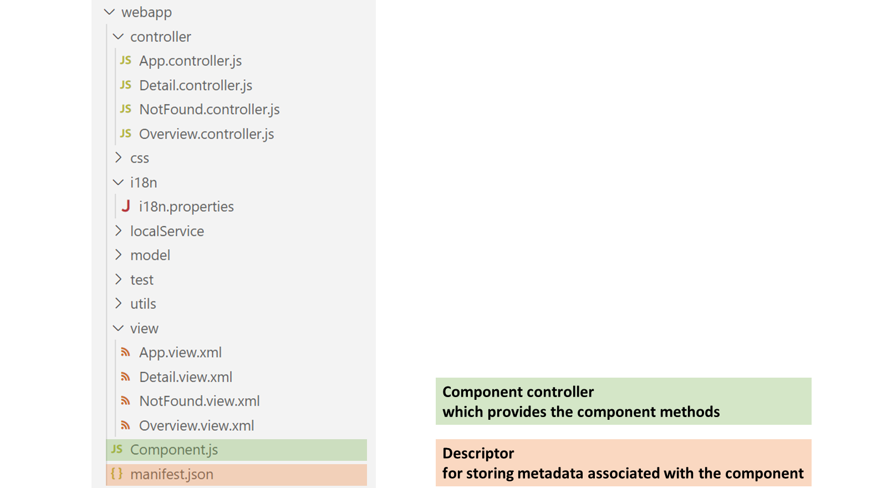
A component has a component controller (Component.js) and a descriptor (manifest.json). Only the component controller is mandatory, but it is recommended to also use the descriptor file. The descriptor then contains the component metadata, and also expresses the component dependencies and configuration (see below).
All required and optional resources of a component are organized in a unique namespace. The namespace of the component equals the component name.
Optional resources of a component are, for example, CSS, js, or i18n files, views, and controllers.
The figure, _Structure of a Component_ , gives an example of the folder structure of a component.
## Descriptor
The descriptor provides a central, machine-readable, and easy-to-access location for storing metadata associated with a component.
The data of the descriptor is stored in JSON format in the manifest.json file.
The existence of the manifest.json file must be declared in the metadata defined in the Component.js file (see below). The declaration in the component metadata makes the component load the manifest.json file and read the relevant entries for SAPUI5.
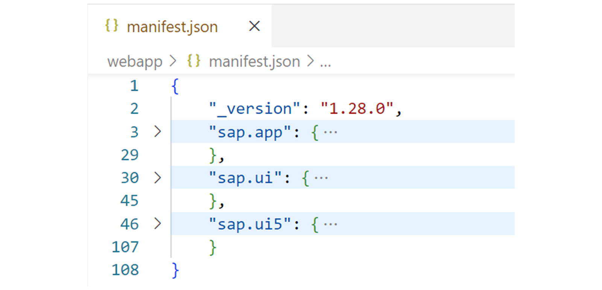
The content of the descriptor is structured using namespaces, amongst others, the sap.app, sap.ui, and sap.ui5 namespaces (see the figure _Structure of the Descriptor_):
  * The sap.app namespace provides application-specific attributes.
  * The sap.ui namespace provides UI-specific attributes.
  * The sap.ui5 namespace provides SAPUI5-specific attributes.

Each new SAPUI5 version implies a new version of the descriptor. This descriptor format version is described by the value of the mandatory _version property at root level of the descriptor (see the figure _Structure of the Descriptor_). How the value of this property is exactly related to the SAPUI5 version, and the descriptor version can be found in the documentation.
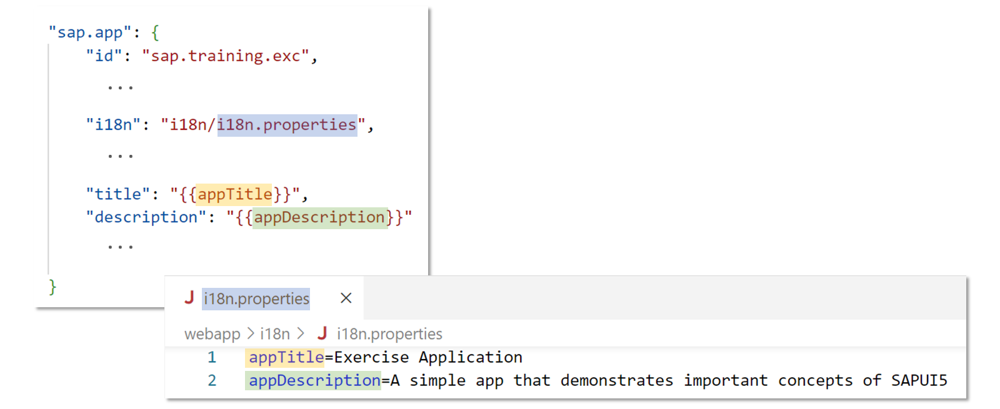
The figure, _sap.app Namespace_ , shows some attributes from the sap.app namespace. A complete listing of all attributes can be found in the documentation.
The id attribute is a mandatory attribute that must be provided in dot notation and specifies a unique Id for the project. It must match the namespace provided in the corresponding Component.js file.
If the component controller is created there, for example, via
JavaScript
Copy codeSwitch to dark mode

```

1

UIComponent.extend("sap.training.exc.Component", { . . . });

```

the id attribute must have the value sap.training.exc.
The title and description of the project are maintained using the title and description attributes of the sap.app namespace. To make the attribute values language dependent, a key value is specified in double curly braces: {{key}}
The specified keys are maintained in a file with the extension .properties. The i18n attribute can then be used to specify the URL to this file. The URL is interpreted relative to the manifest.json file. The way in which the maintained texts can be made available in other languages will be discussed later in the course.
The texts referenced in the descriptor for title and description can be read by the SAP Fiori launchpad, for example.
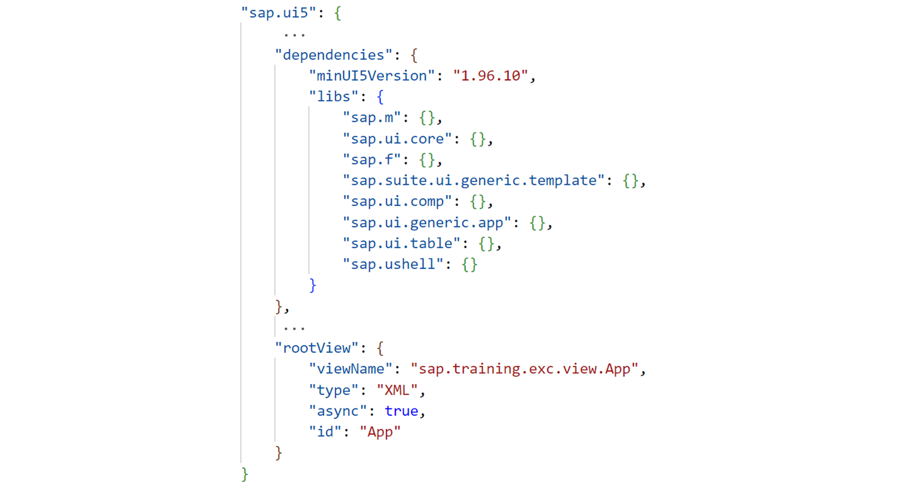
The figure, _sap.ui5 Namespace_ , shows some attributes from the sap.ui5 namespace.
The dependencies attribute contains the external dependencies to libraries and components that are loaded by the SAPUI5 core during the initialization phase of the component. Everything referenced here can be used directly in the component's code.
The libs property contains the libraries that the SAPUI5 core should load for use in the component. In the example, among others, the sap.ui.core and the sap.m library are loaded initially.
The minUI5Version property specifies the minimum SAPUI5 version that the component requires. Since SAPUI5 does not currently enforce the use of the correct version, minUI5Version is used for informational purposes only. If the minimum SAPUI5 version criterion is not met, a warning is issued in the console log.
The rootView attribute specifies the root view to open. The value of this attribute can be the view name as a string for XML views, or the view configuration object with viewName for the view name and type for the view type, id, async and other properties of sap.ui.core.mvc.View.
In the example shown, the XML view with the module name sap.training.exc.view.App is set as the root view of the component. It is loaded asynchronously via the module system and has the id App. This means that when the component is instantiated and embedded in the UI, the App view is automatically displayed as the initial view.
## Using Components
To render UI components, you must wrap them in a sap/ui/core/ComponentContainer. You cannot use the placeAt method to place UI components directly in a page.
The component container separates the application and the nested component. It is an SAPUI5 control that can be nested at any place within the SAPUI5 control tree.
To load and create a UI component, you can use the following options:
  * Create a new component instance asynchronously before creating the container using the create method of sap.ui.core.Component. The separately created component instance can then be passed to the constructor of sap.ui.core.ComponentContainer.
  * Create a new component instance asynchronously when creating the container using the constructor of sap.ui.core.ComponentContainer (see the following example).

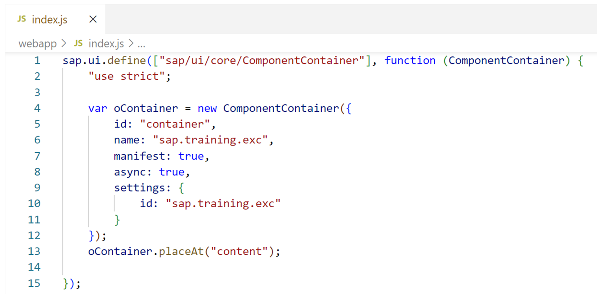
In the figure, _Creating a Component Instance_ , a component instance is instantiated together with the component container. For this reason, the module in which instantiation takes place is dependent on sap/ui/core/ComponentContainer. The constructor of ComponentContainer is passed a settings object with the following properties:
  * id
This property is used to pass the Id for the component container instance to be created.
  * name
The name property contains the name of the component to be instantiated.
  * manifest
Via manifest: true the so called "manifest first" function is used. This allows SAPUI5 to load and evaluate the manifest.json descriptor before the component controller. This is recommended because it improves the performance of the initial load. The loading process can be parallelized and optimized this way. After the descriptor is loaded, the component factory can load the dependencies (SAPUI5 libraries and other dependent components) in parallel with the component preload.
  * async
async: true is used to specify that the component should be created asynchronously.
  * settings
The settings object is passed to the component instance when it is created. In the example, it is used to set the component instance Id.

After the component container is created, the placeAt method is called on it to add it to a UI area.
## Encapsulate an Application as a Component
### Business Scenario
In this exercise, you will rebuild the application from the previous exercise into an SAPUI5 component. The application descriptor (manifest.json file) and the component controller (Component.js file) required for this are already included in the project. For the encapsulation, you will make some adjustments in these files. Finally, you will instantiate the component and embed it in the HTML page.
| _Template:_  | Git Repository: <https://github.com/SAP-samples/sapui5-development-learning-journey.git>, Branch: **sol/5_controllers**  |
| --- | --- |
| _Model solution:_  | Git Repository: <https://github.com/SAP-samples/sapui5-development-learning-journey.git>, Branch: **sol/6_components**  |
### Task 1: Adjust the Application Descriptor
#### Steps
  1. Open the manifest.json file from the webapp folder in the editor.
  2. Set the id property from the sap.app namespace to the value **sap.training.exc** to specify the ID for the project.
    1. Modify the content of line 4 in the manifest.json file as follows:
XML
Copy codeSwitch to dark mode

```

1

 "id": "",

```

  3. Set the rootView property from the sap.ui5 namespace to the value **sap.training.exc.view.App** to specify the _App_ view from the project as the root view that shall be opened.
    1. Modify the content of line 102 in the manifest.json file as follows:
XML
Copy codeSwitch to dark mode

```

1

 "viewName": "",

```

### Task 2: Maintain the Title and the Description of the Component
#### Steps
  1. Open the i18n.properties file from the webapp/i18n folder in the editor.
  2. Add the following lines there to maintain a language dependent title as well as a language dependent description for the component:
XML
Copy codeSwitch to dark mode

```

123

### App Descriptor
appTitle=Exercise Application
appDescription=A simple app that demonstrates important concepts of SAPUI5

```

Note
The appTitle and appDescription keys are used in the manifest.json file (properties sap.app/title and sap.app/description) to set the title and description for the component.

#### Result
The i18n.properties file should now look like this:
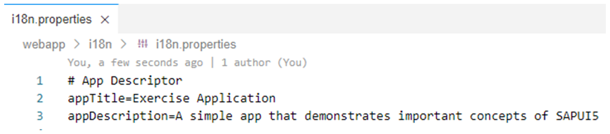
### Task 3: Adapt the Bootstrap Script
#### Steps
  1. Open the index.html page from the webapp folder in the editor.
  2. Delete the following attribute in the bootstrap script:
XML
Copy codeSwitch to dark mode

```

1

data-sap-ui-libs="sap.m"

```

Note
The libraries that are required by the component and therefore need to be loaded by SAPUI5 are specified in the application descriptor of the component (property sap.ui5/dependencies). The sap.m library is listed there, so it does not need to be loaded by the bootstrap script anymore.

#### Result
The bootstrap script should now look like this:
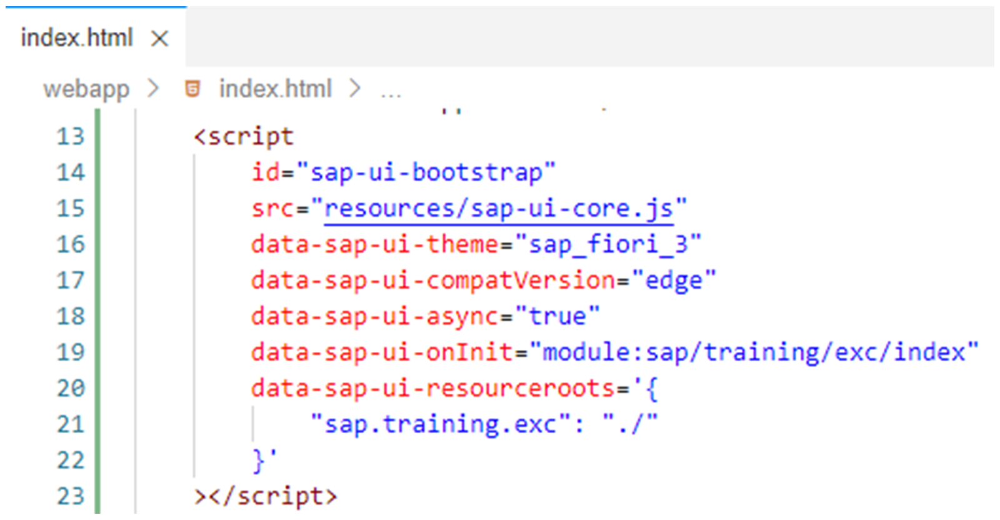
### Task 4: Edit the Component Controller
#### Steps
  1. Open the Component.js file from the webapp folder in the editor.
  2. Add the following code to the component controller implementation to ensure that the application descriptor manifest.json is loaded and used:
JavaScript
Copy codeSwitch to dark mode

```

12345678

metadata: {
  manifest: "json"
},

init: function () {
  // call the base component's init function
  UIComponent.prototype.init.apply(this, arguments);
}

```

Note
The init() method is called by the framework when the component is instantiated. Later, you will implement necessary initializations for the component in this method. It is obligatory to make a super call to the init() function of the base class in the overridden init() method.

#### Result
The Component.js file should now look like this:
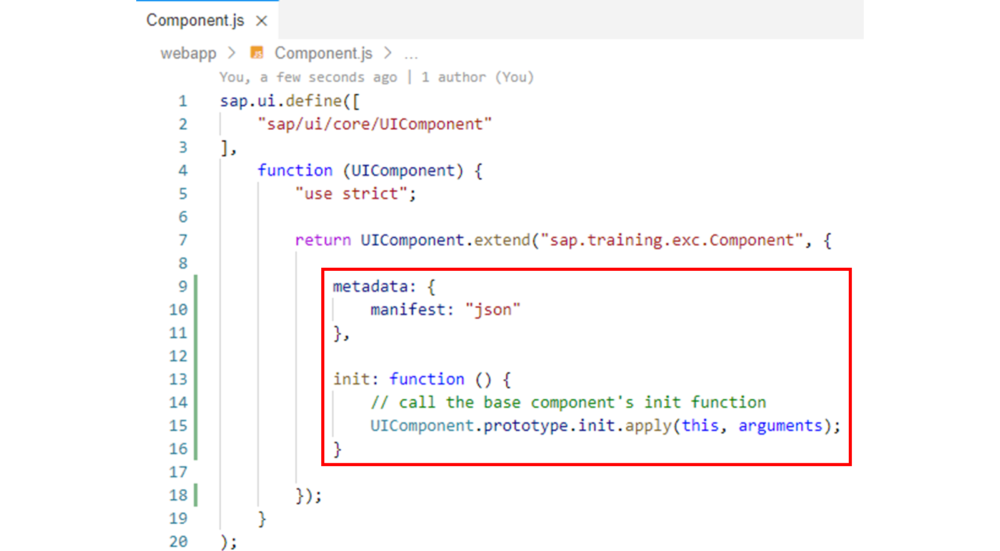
### Task 5: Instantiate the Component
#### Steps
  1. Make sure the index.js module is open in the editor.
  2. Delete the code that instantiates the XML view and places it on the HTML page in the index.js module.
    1. Delete the following lines:
JavaScript
Copy codeSwitch to dark mode

```

123456

XMLView.create({
  id: "App",
  viewName: "sap.training.exc.view.App"
}).then(function (oView) {
  oView.placeAt("content");
});

```

Note
Instead of the XML view, you will instantiate the component in the next step and place it on the HTML page. The component instance will then display the _App_ view as the root view.
#### Result
The index.js module should now look like this: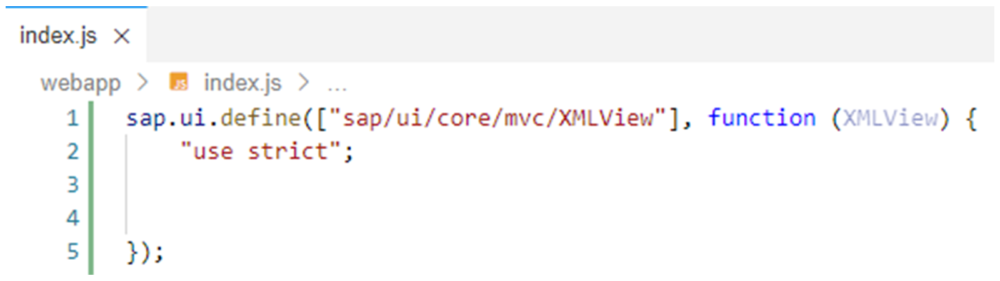
  3. Now modify the implementation of the index.js module as follows to instantiate the component and place it on the HTML page:
JavaScript
Copy codeSwitch to dark mode

```

123456789101112131415

sap.ui.define(["sap/ui/core/ComponentContainer"], function (ComponentContainer) {
  "use strict";

  var oContainer = new ComponentContainer({
      id: "container",
      name: "sap.training.exc",
      manifest: true,
      async: true,
      settings: {
        id: "sap.training.exc"
      }
  });
  oContainer.placeAt("content");

});

```

Note
Pay attention to the changed dependency array and parameter of the factory function. index.js now depends on sap/ui/core/ComponentContainer instead of sap/ui/core/mvc/XMLView.
#### Result
The index.js file should be implemented as follows: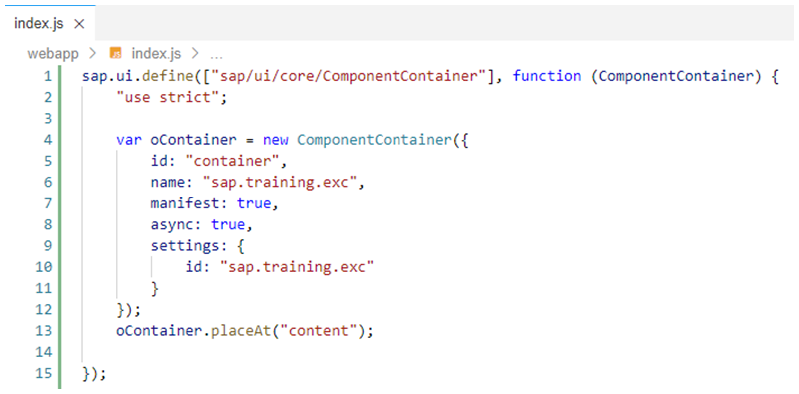
  4. Test run your application by starting it from the SAP Business Application Studio.
    1. Right-click on any subfolder in your _sapui5-development-learning-journey_ project and select _Preview Application_ from the context menu that appears.
    2. Select the npm script named _start-noflp_ in the dialog that appears.
    3. In the opened application, check if the component is displayed with the _App_ view as the root view.


### Using the Declarative API

*Source: https://learning.sap.com/courses/developing-uis-with-sapui5-1/using-the-declarative-api_d6b46253-61e2-41f2-9ed0-55e3261d9c23*

Objective
After completing this lesson, you will be able to embed components declaratively in HTML pages
## Declarative API for Initial Components
With the declarative sap/ui/core/ComponentSupport API, it is possible to define the initially started component directly in the HTML markup. This provides an alternative to the imperative way with JavaScript.
The declarative component support is not activated by default but must be enabled via the bootstrap. To do this, the following attribute must be added to the bootstrap script to load the ComponentSupport module (see the figure _Using the Declarative API_):
XML
Copy codeSwitch to dark mode

```

1

data-sap-ui-onInit="module:sap/ui/core/ComponentSupport"

```


The run function of sap/ui/core/ComponentSupport is called automatically once the module has been loaded. It scans the DOM for HTML elements containing a special data attribute named data-sap-ui-component. All DOM elements marked with this data attribute will be regarded as container elements into which a sap/ui/core/ComponentContainer is inserted.
Additional data attributes are then used to define the constructor arguments of the created component container instance. In the example shown, the following data attributes are specified:
  * data-id
This attribute is used to pass the Id for the component container instance to be created.
  * data-name
The data-name attribute contains the name of the component to be instantiated.
  * data-settings
The object specified for the data-settings attribute is passed to the component instance when it is created. In the example, it is used to set the component instance Id.

Note
The ComponentSupport module enforces asynchronous module loading of the component with "manifest first". This means that the manifest.json file is loaded before evaluating the component to optimize loading behavior (see above).
## Define the Initially Started Component Directly in the HTML Markup
### Business Scenario
In this exercise, you use the declarative API for initial components to declare the component defined in the previous exercise in the <body> of the HTML page. This automatically instantiates the component through the framework and embeds it in the HTML page. The coding from the previous exercise that instantiated the component and placed it on the HTML page is then no longer required and is deleted.
| _Template:_  | Git Repository: <https://github.com/SAP-samples/sapui5-development-learning-journey.git>, Branch: **sol/6_components**  |
| --- | --- |
| _Model solution:_  | Git Repository: <https://github.com/SAP-samples/sapui5-development-learning-journey.git>, Branch: **sol/7_declarative_API_for_components**  |
### Task 1: Remove the Instantiation of the Component
#### Steps
  1. Delete the index.js module from the webapp folder.
    1. Open the context menu for the index.js file in the project structure.
    2. Select Delete Permanently.
    3. Confirm by selecting _Delete_.

### Task 2: Declare the Component in the <body> of the HTML Page
#### Steps
  1. Make sure that the index.html page is open in the editor.
  2. Delete the following attribute from the bootstrap script as the index.js module was deleted in the previous step:
XML
Copy codeSwitch to dark mode

```

1

data-sap-ui-onInit="module:sap/training/exc/index"

```

  3. Add the following attribute to the bootstrap script to enable the ComponentSupport module:
XML
Copy codeSwitch to dark mode

```

1

data-sap-ui-onInit="module:sap/ui/core/ComponentSupport"

```

#### Result
The bootstrap script should now look like this:
  4. Add the following <div> tag to the <body> of the HTML page to instantiate the component when the onInit event is fired:
XML
Copy codeSwitch to dark mode

```

123456

<div
    data-sap-ui-component
    data-id="container"
    data-name="sap.training.exc"
    data-settings='{"id" : "sap.training.exc"}'
></div>

```

#### Result
The <body> of the HTML page should now look like this:
  5. Test run your application by starting it from the SAP Business Application Studio.
    1. Right-click on any subfolder in your _sapui5-development-learning-journey_ project and select _Preview Application_ from the context menu that appears.
    2. Select the npm script named _start-noflp_ in the dialog that appears.
    3. In the opened application, check if the component is displayed with the _App_ view as the root view.

[Continue to quiz](https://learning.sap.com/courses/developing-uis-with-sapui5-1/structuring-applications-via-components)


### Quiz

*Source: https://learning.sap.com/courses/developing-uis-with-sapui5-1/structuring-applications-via-components*

It's time to put what you've learned to the test, get 3 right to pass this unit.
1.
### Which SAPUI5 module provides the functionality to find components declared in an HTML page and create the component instances, which are then inserted into a component container?
Choose the correct answer.
sap/ui/core/ComponentSupport
sap/ui/core/ComponentModule
sap/ui/core/ComponentAPI
sap/ui/core/ComponentMarkup
2.
### To load and render a component in an HTML page, a special data attribute must be specified on the corresponding DOM element. What is the name of this marker attribute to be added?
Choose the correct answer.
data-sap-ui-container
data-sap-ui-component
data-sap-ui-area
data-sap-ui-section
3.
### In which file is the component controller implemented?
Choose the correct answer.
Component.json
manifest.json
Component.js
manifest.js
4.
### Which control is used to embed a UI component in a control tree?
Choose the correct answer.
sap.ui.core.ComponentBox
sap.ui.core.ComponentConnector
sap.ui.core.ComponentArea
sap.ui.core.ComponentContainer
Submit answers[Next unit](https://learning.sap.com/courses/developing-uis-with-sapui5-1/structuring-the-ui-with-controls_b072eddd-a5cf-495f-ac69-aa2c9fb76b5a)


### Implementing the UI

*Source: https://learning.sap.com/courses/developing-uis-with-sapui5-1/structuring-the-ui-with-controls_b072eddd-a5cf-495f-ac69-aa2c9fb76b5a*

Objective
After completing this lesson, you will be able to create UIs using the Shell, App, Page, Panel and SimpleForm controls
## Simple Form
Before implementing a form, let's first try to understand the structure of a form.
Watch the video to understand the structure of a form.
Settings
### Implementing a Simple Form
Now that you have understood the overall structure of a form, we will look at the implementation of a form using the SimpleForm control.
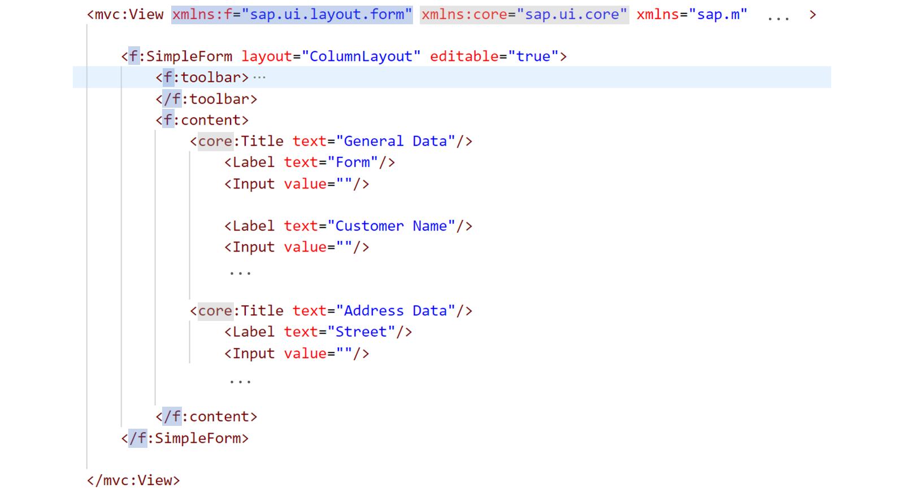
The libraries sap.ui.layout.form and sap.ui.core are required for working with the SimpleForm control. The names of these libraries must therefore be mapped to XML namespaces in an XML view. In the example in the figure, Using the SimpleForm Control, the prefixes f and core, respectively, are used for the mapping.
The layout property of the <f:SimpleForm> tag specifies the form layout that is used to render the form content. There are several layouts available. It is recommended to use the ColumnLayout, as its responsiveness uses the space available in the best way possible.
If editable controls are used as content, the editable property of the <f:SimpleForm> tag must be set to true, otherwise to false. If the editable property is set incorrectly, there will be visual issues like wrong label alignment or wrong spacing between the controls.
The content of the form is specified via the content aggregation. It is structured in the following way:
  * Add a sap.ui.core.Title element (or Toolbar control) to start a new group (FormContainer).
  * Add a Label control to start a new row (FormElement).
  * Add controls such as input and text fields as needed. They will be assigned to the row (FormElement) that started with the last label.

### Adding a Toolbar
Let's look at how to add a toolbar to a form.
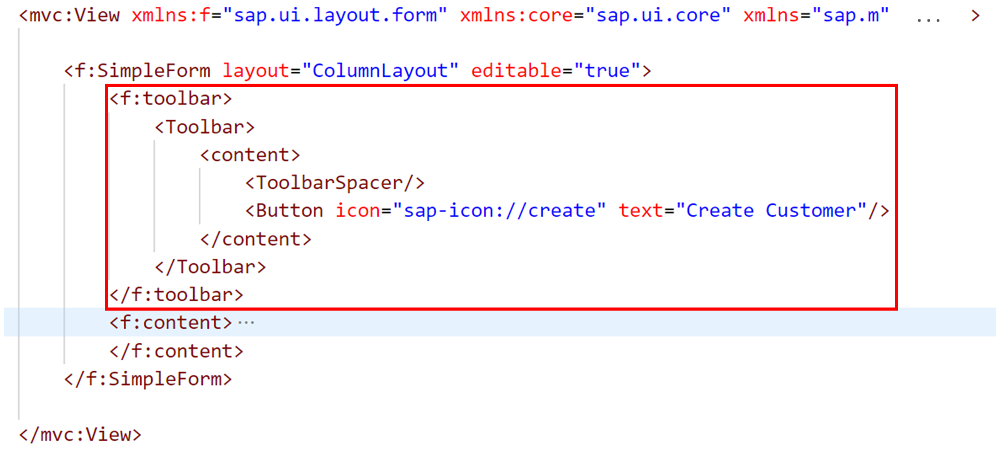
The toolbar aggregation can be used to optionally add a toolbar to the SimpleForm control. In the example shown in the figure, _Adding a Toolbar_ , a sap.m.Toolbar control is added to this aggregation. The controls to be displayed in the toolbar are placed in its content aggregation.
The ToolbarSpacer used adds horizontal spacing between the elements of a sap.m.Toolbar. This will cause the button to be displayed at the end of the line.
In addition to the text _Create Customer_ , an icon is also displayed on the button. The prefix sap-icon:// indicates that the icon comes from the icon font delivered with SAPUI5. It contains more than 500 icons.
Note
You can look up other icons using the [Icon Explorer](https://ui5.sap.com/#/tools) tool in the _Demo Kit_.
For more details about the SimpleForm control, see the documentation.
## Panel
### Adding a Panel
The sap.m.Panel control provides a container for grouping and displaying information.
It consists of a title bar that can be used to display a header text, an optional header toolbar, an optional info toolbar, and a content area.
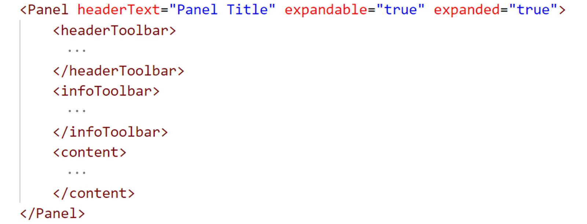
The expandable property (default value: false) can be used to specify whether the content and the info toolbar (if present) of the panel can be collapsed and expanded.
The expanded property (default value: false) specifies whether the panel is initially expanded or not.
The headerToolbar aggregation allows the use of a custom toolbar as header for the panel. The header toolbar is visible in both expanded and collapsed state. It can be used to add extra controls for user interactions in the header.
The infoToolbar aggregation allows the use of a custom toolbar as information bar for the panel. The info toolbar is placed below the header and is visible only in expanded state. It can be used to show extra information to the user.
The content aggregation determines the content of the panel. It can contain any number of controls of any type.
For more information about the panel, see the documentation.
## Page
### Adding a Page
The sap.m.Page control is a container control that holds one whole screen of an application. It is often used as the root control of a view (see the following figure).
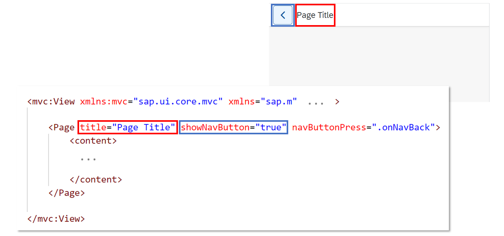
The page has three distinct areas: a header, a content area, and a footer.
The topmost area of the page is occupied by the header. The title property of the page can be used to set a title that will appear in the header bar.
A navigation button is displayed on the left side of the header bar if the showNavButton property is set to true. When the navigation button is pressed, the navButtonPress event is fired. In the example in the figure, the event handler onNavPress is attached to the event to be able to react to the button click.
The content aggregation determines the content of the page. It occupies the main part of the page and can contain any number of controls of any type.
The footer is optional and occupies the bottom part of the page.
For more information about the page control, see the documentation.
## App and Shell
Applications often consist of multiple pages, where the user can go to detail pages and back again. SAPUI5 supports this pattern by providing the control sap.m.App. The App control inherits the navigation capabilities from the sap.m.NavContainer control.
When developing an SAPUI5 application, the App control is often used as the root element. It adds certain header tags to the HTML page that are necessary for proper display and offers functionality to navigate between pages with animations. The content entities between which sap.m.App navigates can be of type sap.m.Page, sap.ui.core.mvc.View or any other control with full-screen/page semantics. To display the corresponding pages, they are added to the pages aggregation of the App control.
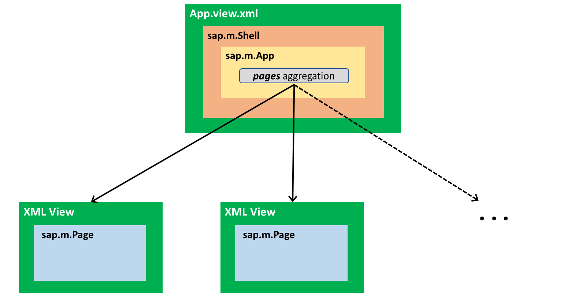
SAPUI5 gives the developer a lot of freedom to define the design of an application based on the App control. A typical design is to use one view per page to be displayed. The figure, _Typical Approach_ , shows such an application design, which is also used in the exercise scenario.
In this approach, a so-called App view is created (App.view.xml), which contains an empty <App> tag. This App view is specified in the application descriptor manifest.json as the root view of the component to be opened.
The pages to be displayed are implemented as XML views, with each XML view using a sap.m.Page control as its root element. The XML views are then added to the pages aggregation of the App control using the router. This will be discussed later in the course.
In the App view, place the <App> tag inside an sap.m.Shell container.
The use of the Shell container is to control the width of the application on a desktop. On large monitors, a full width rendering of an application can be too wide. Placing the App control inside a Shell container gives you the appropriate left and right vertical margins.
The Shell control provides more options to customize the application, like setting a custom background image or color, and setting a custom logo. Check the _API Reference_ and the _Samples_ in the _Demo Kit_ for more details.
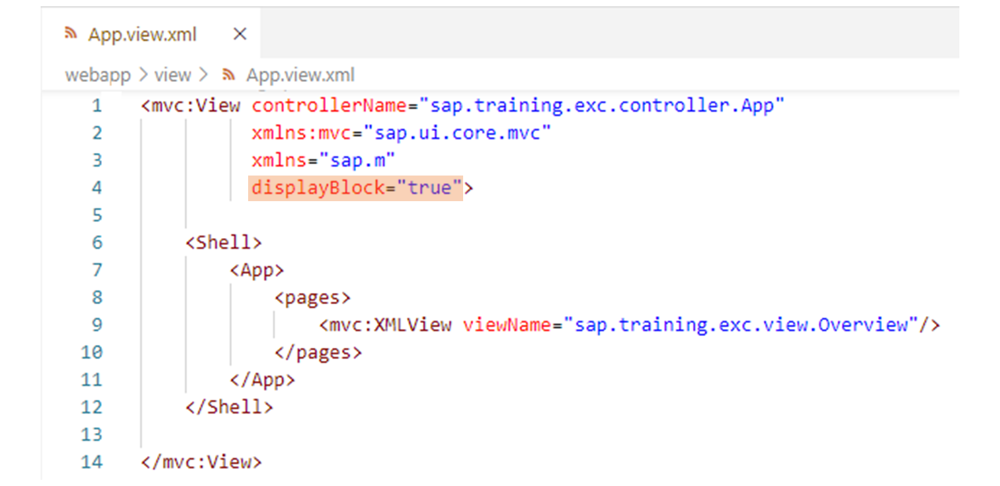
The figure, _The App View_ , shows the App view implementation discussed above in the App.view.xml file.
In the <mvc:View> tag, the attribute displayBlock="true" has been added. This prevents vertical scrollbars appearing with views that are set to 100% height.
Contrary to the description above, the <App> tag is not empty. Instead, an XML view named sap.training.exc.view.Overview is statically embedded in the pages aggregation via the <mvc:XMLView> tag. This is only a preliminary implementation. In the unit on _Routing and Navigation_ , it will be explained how to embed views dynamically via the router. Then it will also be possible to implement navigation between views, that is, to exchange views dynamically in the pages aggregation.
## Add a UI with a Form
### Business Scenario
In this exercise, you will add a form for creating new flight customers to the application. You embed the SimpleForm UI element used for this purpose in a Panel UI element, which in turn is to be contained in a Page UI element.
The nesting of SimpleForm, Panel, and Page UI element is implemented in a separate XML view. You refer to this view from the existing App view. There, the new view is to be embedded in the pages aggregation of the App UI element, which in turn is to be contained in a Shell.
The figure, _UI with Form_ , shows the nested structure of the UI.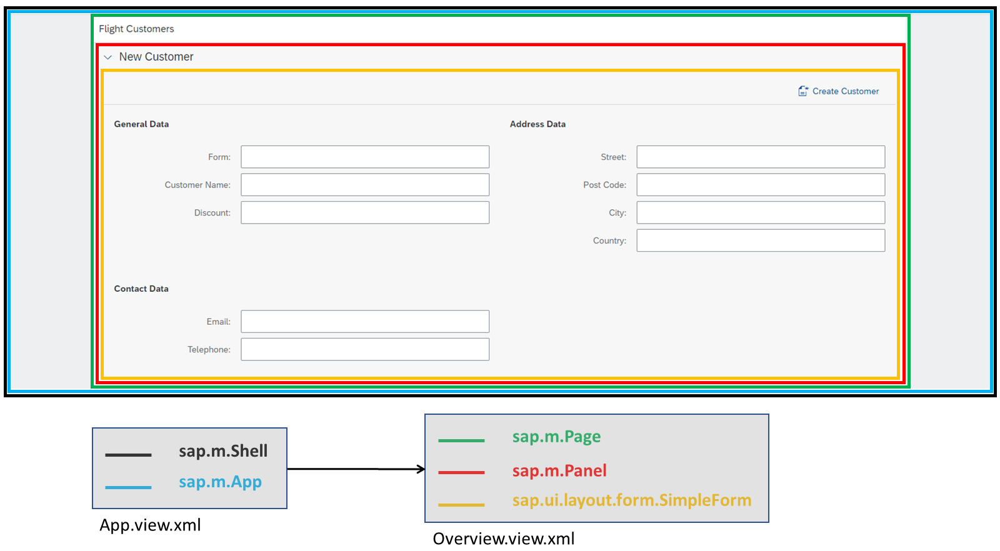
| _Template:_  | Git Repository: <https://github.com/SAP-samples/sapui5-development-learning-journey.git>, Branch: **sol/7_declarative_API_for_components**  |
| --- | --- |
| _Model solution:_  | Git Repository: <https://github.com/SAP-samples/sapui5-development-learning-journey.git>, Branch: **sol/8_SimpleForm**  |
### Task 1: Implement the View with the Form
#### Steps
  1. Open the Overview.view.xml file from the webapp/view folder in the editor.
Note
For simplicity, the XML view file in which the form will be implemented is already included in the project. Also the corresponding view controller file Overview.controller.js is already present in the webapp/controller folder.
  2. Add the following attributes to the <mvc:View> tag to declare the XML namespaces required for the view implementation:
XML
Copy codeSwitch to dark mode

```

12

xmlns:f="sap.ui.layout.form"
xmlns:core="sap.ui.core"

```

#### Result
The Overview view should now look like this: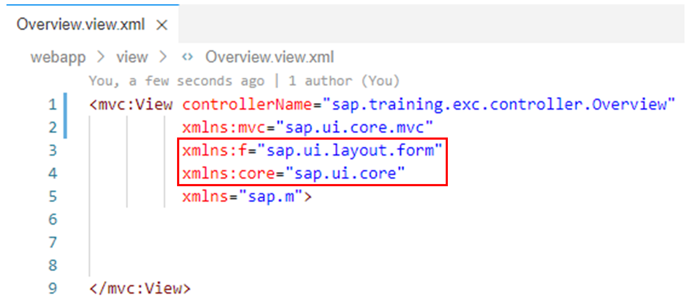
  3. Insert the following coding into the <mvc:View> tag to define a sap.m.Page on the view with a sap.m.Panel, which in turn contains the desired sap.ui.layout.form.SimpleForm.
Note
The functionality of the _Create Customer_ button in the toolbar of the form will only be implemented in a later exercise via an event handler.
XML
Copy codeSwitch to dark mode

```

1234567891011121314151617181920212223242526272829303132333435363738394041

<Page title="Flight Customers">
  <content>
    <Panel headerText="New Customer" expandable="true" expanded="true">
      <content>
        <f:SimpleForm layout="ColumnLayout" editable="true">
          <f:toolbar>
            <Toolbar>
              <content>
                <ToolbarSpacer/>
                <Button icon="sap-icon://create" text="Create Customer"/>
              </content>
            </Toolbar>
          </f:toolbar>
          <f:content>
            <core:Title text="General Data"/>
            <Label text="Form"/>
            <Input value=""/>
            <Label text="Customer Name"/>
            <Input value=""/>
            <Label text="Discount"/>
            <Input value=""/>
            <core:Title text="Address Data"/>
            <Label text="Street"/>
            <Input value=""/>
            <Label text="Post Code"/>
            <Input value=""/>
            <Label text="City"/>
            <Input value=""/>
            <Label text="Country"/>
            <Input value=""/> 
            <core:Title text="Contact Data"/>
            <Label text="Email"/>    
            <Input value=""/>
            <Label text="Telephone"/>
            <Input value=""/>     
          </f:content>
        </f:SimpleForm>
      </content>
    </Panel>
  </content>
</Page>

```

#### Result
The Overview view should now look like this:
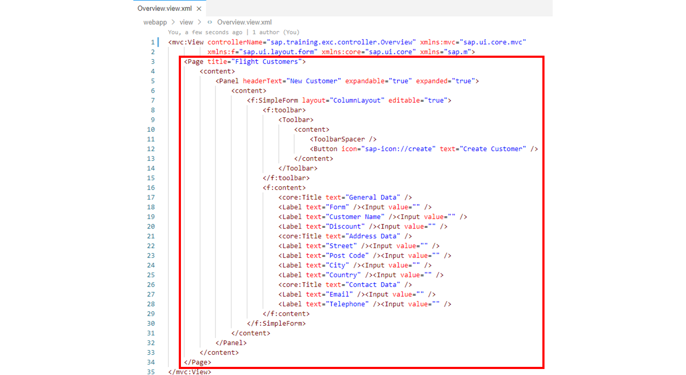
### Task 2: Refer to the Form View from the App View
#### Steps
  1. Open the App.view.xml file from the webapp/view folder in the editor.
  2. Add the following attribute to the <mvc:View> tag to make the full-screen height of the view work properly:
XML
Copy codeSwitch to dark mode

```

1

displayBlock="true"

```

#### Result
The App view should now look like this: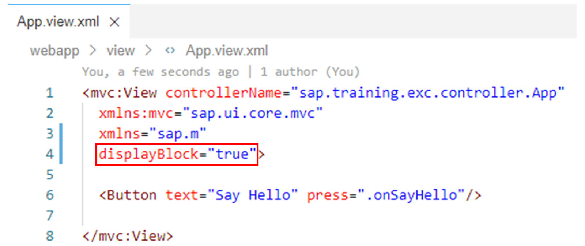
  3. Delete the _Say Hello_ button from the App view.
    1. Delete the following line:
XML
Copy codeSwitch to dark mode

```

1

<Button text="Say Hello" press=".onSayHello"/>

```

  4. Insert the following code into the<mvc:View> tag to embed the Overview view in the pages aggregation of a sap.m.App UI element, which in turn is wrapped in a sap.m.Shell:
XML
Copy codeSwitch to dark mode

```

1234567

<Shell>
  <App>
    <pages>
      <mvc:XMLView viewName="sap.training.exc.view.Overview"/>
    </pages>
  </App>
</Shell>

```

#### Result
The App view should now look like this:
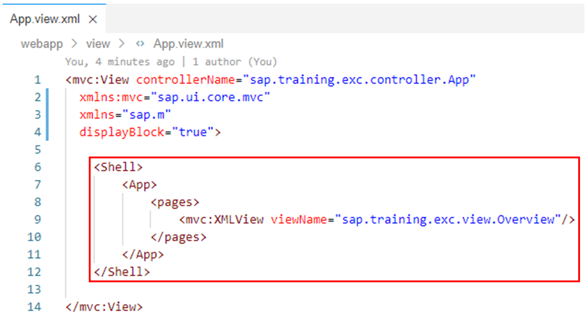
### Task 3: Adjust the App View Controller
#### Steps
  1. Open the App.controller.js file from the webapp/controller folder in the editor.
Note
Since the _Say Hello_ button on the App view was deleted in the previous step, all button-related code is now deleted from the view controller.
  2. Delete the onSayHello event handler method from the view controller.
    1. Delete the following lines:
JavaScript
Copy codeSwitch to dark mode

```

123

onSayHello: function () {
  MessageBox.information("Hello World");
}

```

  3. Remove module sap/m/MesssageBox from the dependency array and the corresponding interface parameter MessageBox from the factory function of the view controller.
#### Result
The view controller should now look like this: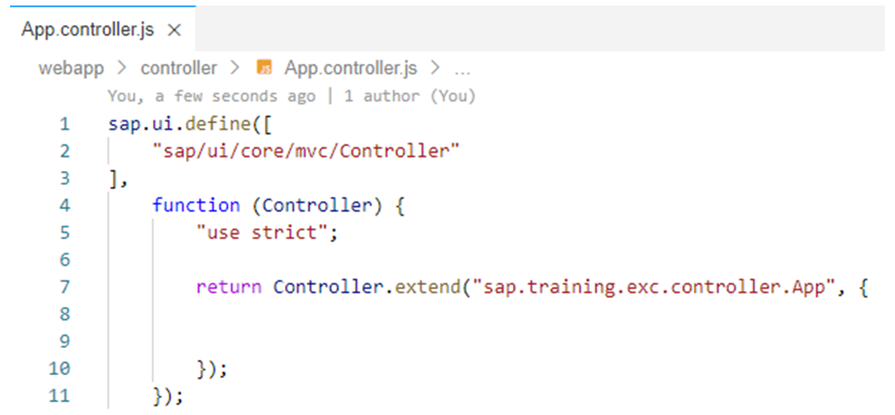
  4. Test run your application by starting it from the SAP Business Application Studio.
    1. Right-click on any subfolder in your _sapui5-development-learning-journey_ project and select _Preview Application_ from the context menu that appears.
    2. Select the npm script named _start-noflp_ in the dialog that appears.
    3. In the opened application, check if the component with the form is displayed as expected.


### Using Densities for Controls

*Source: https://learning.sap.com/courses/developing-uis-with-sapui5-1/using-densities-for-controls_ef068942-3030-474f-9436-4be3626f1f70*

Objective
After completing this lesson, you will be able to use content densities to adapt applications to different device types
## Content Densities
The devices on which applications developed with SAPUI5 are executed run on different operating systems and have very different screen sizes.
SAPUI5 provides different content densities for certain controls that allow an application to adapt to the device by displaying larger controls for touch-enabled devices and a smaller, more compact design for devices that are operated with the mouse.
In SAPUI5, the following content densities are available, among others:
  * Cozy
  * Compact

Watch the video to explore more about cozy and compact densities.
Settings
## Setting Densities
The default design for all controls belonging to the sap.m library is the Cozy density (larger dimensions and spacings). If your application only uses the sap.m library, you can skip setting the content density explicitly if the Cozy density is exactly what you require. However, controls belonging to other libraries may also support a Cozy design (such as sap.ui.table.Table) but the default might be different (such as Compact density). For this reason, if your application uses controls belonging to different libraries, it is strongly recommended to set the desired content density explicitly.
The content densities Cozy and Compact are triggered by the CSS classes sapUiSizeCozy and sapUiSizeCompact respectively.
You set the appropriate CSS class on the container that you want to switch to the content density in question, not on the control itself. It is recommended that you set it at a high level, since in most cases you will want to set it for the entire application. Once you set the CSS class at a particular level, it cascades down, meaning you can't override it in the lower levels of your code.
For example, to display a view with all contained UI elements with the Compact content density, you can implement the following:
Code Snippet
Copy codeSwitch to dark mode

```

123

<mvc:View class="sapUiSizeCompact" ... >
  ...
</mvc:View>

```

It is also possible to apply the relevant content density only under certain circumstances, for example, for devices that do not support touch interaction. In this case, add the CSS class dynamically to the UI instead of statically.
To specify a content density depending on certain properties of the device on which the application runs, the Device API (sap.ui.Device) can be used.
The Device API provides information about device specifics, like the operating system along with its version, the browser and browser version, screen size, current orientation and support for specific features such as, touch event support, orientation change, and so on. (For detailed information about the Device API, see the _API Reference_ for the sap.ui.Device namespace.)
### Implementing a Helper Method on the Component Controller

The figure, _Helper Method on the Component Controller_ , shows how the CSS class required for the content density can be determined with the help of the Device API. For this purpose, a helper method called getContentDensityClass is created on the component controller, which checks via the sap.ui.Device.support.touch field of the Device API whether the device on which the application is running has touch support. The Device API is loaded via the dependency array of the component controller. If the device has touch support, the method returns the CSS class sapUiSizeCozy, otherwise the CSS class sapUiSizeCompact.
### Setting the CSS Class for a View

The getContentDensityClass helper method can be called, for example, in the controller of the component's root view to set the appropriate CSS class for the entire application. The coding required for this is shown in the figure _Setting the CSS Class for a View_.
In the onInit initialization method of the view controller, the controller's getOwnerComponent method is used to access the component controller. On this, the getContentDensityClass helper method discussed above is called, which returns the CSS class depending on the touch support of the device. The CSS class obtained is then added to the view via the addStyleClass method.
## Specifying the Supported Densities
The sap.ui5 namespace of the application descriptor manifest.json has the mandatory attribute contentDensities. This attribute contains an object that is used to maintain the content density modes that the application supports (see the figure, _Supported Content Densities_ , for an example).

When the application is invoked through the SAP Fiori launchpad (FLP), the FLP reads the supported content densities from the application descriptor and sets the appropriate content density class for the <body> tag. On devices with mouse and touch support, the FLP also allows the user to configure the desired content density.
If you determine and set the CSS class for the content density of an application dynamically as described above, you should avoid that the application and the FLP set different content density classes in case the application is also started in the FLP. In the above example, you could do this by extending the helper method getContentDensityClass as follows: If the FLP has already set a content density CSS class, the helper method should return an empty string. The JavaScript coding required for such an extension can be found in the documentation.
## Further Platform Adaptations
In addition to the CSS classes for specifying the content density, SAPUI5 provides further CSS based options for adapting an application to the device on which it runs.
To determine a control’s visibility in a device-dependent way, you can use the following CSS classes:
  * sapUiVisibleOnlyOnDesktop
  * sapUiHideOnDesktop
  * sapUiVisibleOnlyOnTablet
  * sapUiHideOnTablet
  * sapUiVisibleOnlyOnPhone
  * sapUiHideOnPhone

The names of the CSS classes are self-explanatory; for each device type, you have a corresponding class that you can use to either explicitly hide or show a control.
Thus, the panel in the figure, _CSS Based Device Adaptation_ , is displayed only on tablets and desktops, but not on phones.

SAPUI5 gives you the option to add space between controls by adding margins. A margin clears an area around its respective control, outside of its border.
If your application is supposed to run on phone, tablet and desktop, it may be useful to choose margins depending on the available screen width. SAPUI5 provides the CSS class sapUiResponsiveMargin that does just that. It works with media queries to determine the available screen width and adapts the margins to it.
In the figure, _CSS Based Device Adaptation_ , the margins of the panel are made dependent on the available screen width by adding the CSS class sapUiResponsiveMargin.
Detailed information about further margin and padding classes can be found in the documentation.
## Adjust the Content Density
### Business Scenario
In this exercise, you adapt the application to the user's device. You set the content density depending on whether the browser used supports touch events. In addition, you use standard SAPUI5 CSS classes to implement a device-specific layout.
| _Template:_  | Git Repository: <https://github.com/SAP-samples/sapui5-development-learning-journey.git>, Branch: **sol/8_SimpleForm**  |
| --- | --- |
| _Model solution:_  | Git Repository: <https://github.com/SAP-samples/sapui5-development-learning-journey.git>, Branch: **sol/9_content_density**  |
### Task 1: Implement a Method on the Component Controller to Determine the Required Content Density CSS Class
#### Steps
  1. Open the Component.js file from the webapp folder in the editor.
  2. Add the sap/ui/Device module to the dependency array of the component controller and a corresponding parameter named Device to the factory function.
Note
The Device API module is needed in the component controller to query the touch support of the user device in the next step.
#### Result
The component controller should now look like this:
  3. Now add the following helper method to the component controller which queries the Device API for touch support of the user device and returns the CSS class sapUiSizeCozy if touch interaction is supported and sapUiSizeCompact for all other cases:
JavaScript
Copy codeSwitch to dark mode

```

12345678910

getContentDensityClass: function () {
  if (!this._sContentDensityClass) {
    if (Device.support.touch) {
      this._sContentDensityClass = "sapUiSizeCozy";
    } else {
      this._sContentDensityClass = "sapUiSizeCompact";
    }
  }
  return this._sContentDensityClass;
}

```

#### Result
The component controller should now look like this:

### Task 2: Add the Determined Content Density CSS Class to the App View
#### Steps
  1. Open the controller of the App view (webapp/controller/App.controller.js file) in the editor.
  2. Add the following initialization method to the view controller to set the Content Density CSS Class returned by the helper method implemented above for the root view of the component:
JavaScript
Copy codeSwitch to dark mode

```

123

onInit: function () {
  this.getView().addStyleClass(this.getOwnerComponent().getContentDensityClass());
}

```

#### Result
The controller of the App view should now look like this:

### Task 3: Maintain the Supported Content Densities in the Application Descriptor
#### Steps
  1. Open the application descriptor manifest.json from the webapp folder in the editor.
  2. Change the value of the sap.ui5/contentDensities/compact property from **false** to **true** to indicate that the component supports the content density mode _compact_.
Note
The sap.ui5/contentDensities/cozy property already has a value of true.
    1. Modify the content of line 62 in the manifest.json file as follows:
JSON
Copy codeSwitch to dark mode

```

1

"compact": ,

```

#### Result
The sap.ui5/contentDensities property in the application descriptor should now look like the following:

### Task 4: Make the Visibility as well as the Margins of the sap.m.Panel on the Overview View Device-Specific
#### Steps
  1. Open the Overview.view.xml file from the webapp/view folder in the editor.
  2. Add the following attributes to the <Panel> tag:
XML
Copy codeSwitch to dark mode

```

1

class="sapUiResponsiveMargin sapUiHideOnPhone" width="auto"

```

Note
The CSS class sapUiResponsiveMargin makes the margins dependent on the screen width that is available. The width is set to **auto** since the margin would otherwise be added to the default width of 100% and exceed the page size. The CSS class sapUiHideOnPhone specifies that the panel should not be displayed on small screens (phones).
#### Result
The <Panel> tag on the Overview view should now look like this:
  3. Test run your application by starting it from the SAP Business Application Studio.
Check the following points:
     * Make sure that the layout of the form is adapted to the available screen size.
     * Make sure that the margin of the panel is responsive and adjusts to the screen size of the device.
     * Make sure that the panel is not displayed on small screens (phones).
     * Make sure that the component supports the content densities _compact_ and _cozy_.
Note
You can change the size of the browser window to simulate the presentation of the component on large (desktop), mid-sized (tablet PC), and small (phones) screens.
However, changing the window size does not let you test the different content densities, because touch support cannot be simulated in this way.
To test the different content densities, you can use the device toolbar in the developer tools of the Google Chrome, Firefox, or Microsoft Edge browser: Start your application and, in the developer tools (F12), call the device toolbar with the key combination _Ctrl + Shift + M_. You can use the device toolbar to select a device you want to emulate. After you select the device, you have to refresh the browser (F5), to ensure that the onInit() method of the App view controller is called, where the content density is set specifically for the device type.
Note
Do not pay attention to the errors displayed in the console when in the developer tools. This is due to some code prepared for future exercises that is then not yet complete.
    1. Right-click on any subfolder in your _sapui5-development-learning-journey_ project and select _Preview Application_ from the context menu that appears.
    2. Select the npm script named _start-noflp_ in the dialog that appears.
    3. In the opened application, check if the component is displayed as expected.

[Continue to quiz](https://learning.sap.com/courses/developing-uis-with-sapui5-1/implementing-the-ui)


### Quiz

*Source: https://learning.sap.com/courses/developing-uis-with-sapui5-1/implementing-the-ui*

It's time to put what you've learned to the test, get 3 right to pass this unit.
1.
### Which of the following hierarchies represents the control tree of a typical SAPUI5 application?
Choose the correct answer.
ComponentContainer → Shell → XMLView → App → XMLView → Page
ComponentContainer → Page → XMLView → Shell → App → XmlView
ComponentContainer → App → XMLView → Shell → XMLView → Page
ComponentContainer → XMLView → Shell → App → XMLView → Page
2.
### Which of the following are SAPUI5 controls provided for implementing forms?
There are two correct answers.
sap.ui.layout.form.SimpleForm
sap.ui.layout.form.BasicForm
sap.ui.layout.form.Form
sap.ui.layout.Form
3.
### Which of the following are SAPUI5 CSS classes used to trigger specific content densities?
There are two correct answers.
sapUiSizeTouch
sapUiSizeDesktop
sapUiSizeCozy
sapUiSizeCompact
Submit answers[Next unit](https://learning.sap.com/courses/developing-uis-with-sapui5-1/implementing-and-instantiating-xml-fragments_bd9dc4a9-7c9f-40dc-967e-ff555716c0f1)


### Dealing with Fragments as Reusable UI Parts

*Source: https://learning.sap.com/courses/developing-uis-with-sapui5-1/implementing-and-instantiating-xml-fragments_bd9dc4a9-7c9f-40dc-967e-ff555716c0f1*

Objective
After completing this lesson, you will be able to work with dialogs defined as XML fragment
## Reusable UI Parts
UI parts that are to be used in several views cannot be easily defined. They either have to be created as new controls, or they have to be created as views. Creating them as new controls results in a development overhead, while creating them as separate views results in a runtime overhead.
To solve this problem, fragments were introduced. They support reuse and view modularization without adding overhead.
Watch this video to learn more about the main characteristics of fragments.
Note
Instead of defining fragments in a separate file, they can also be defined inline and instantiated immediately. In general, however, the inline definition of fragments plays only a minor role.
## XML Fragments
Only XML fragments are covered in this course because they are the most common. For JavaScript fragments and HTML fragments, see the documentation.
XML fragments are similar to XML views, but have no <View> tag as root element.
An example for the definition of an XML fragment is shown in the figure _Simple XML Fragment_.

The file containing the definition of an XML fragment has the extension *.fragment.xml. It is loaded by the SAPUI5 runtime via its SAPUI5 module name (see below).
In the example, the <core:FragmentDefinition> tag is used as the root element of the fragment. Without this <core:FragmentDefinition> tag, the fragment would contain the Text control and the Button control as root controls. However, this is not possible because XML documents must always have exactly one root node.
The <core:FragmentDefinition> tag has no representation in HTML at runtime; its child elements are added directly where the fragment is placed.
In cases where the fragment contains only one root control, the use of the <core:FragmentDefinition> tag is optional.
The press event of the button in the example is bound to the event handler onDoSomething of a controller. This means that this fragment must be instantiated with a controller that has this method.
## Fragment Instantiation
### Instantiating Fragments in XML Views
The example in the figure, _Declarative Use of Fragments_ , displays an XML view that includes the XML fragment shown above via the <core:Fragment> tag.

The fragmentName attribute of this tag contains the SAPUI5 module name of the fragment used.
The type attribute is used to pass the type of the fragment. This means that fragments of any type can be embedded in an XML view, not only XML fragments, but also JavaScript and HTML fragments.
With the help of the optional id attribute an Id for the fragment instance can be passed. This Id is used as a prefix for the Ids of all controls in the fragment instance. This way, duplicate id errors can be avoided if a fragment is embedded twice in the same view, for example.
Note
For details regarding unique Ids, see the documentation.
The implemented fragment reference ultimately works like an import statement that includes the fragment's content controls into the view.
When a fragment is embedded in an XML view, the view's controller is automatically set as the fragment's controller as well. Since in the example discussed here the fragment contains a button whose press event is bound to the event handler onDoSomething, this method must be present in the controller of the embedding view.
### Instantiating Fragments via API
SAPUI5 provides two options to instantiate fragments via API.

If a fragment is to be instantiated within a view controller (more precisely, in a controller that extends sap.ui.core.mvc.Controller), the loadFragment method can be used. It is available in any view controller. The method passes to the created fragment the view controller as fragment controller. That is, the (event handler) methods referenced in the fragment are called on the view controller.
An example of the use of loadFragment will be discussed later.
Outside of controllers, the generic method sap.ui.core.Fragment.load can be used for instantiation. Among other things, this method can be passed a JavaScript object that is to be used as a fragment controller. Any object can act as a fragment controller here, provided it has the methods required by the fragment.
For more information on the two methods mentioned, see the _API Reference_ in the Demo Kit.
## Dialogs as Fragments
Dialogs are special because they open on top of the regular application content and thus do not belong to a special view. In addition, dialogs can be used in more than one view of an application.
Views do not support the implementation of such dialogs, but fragments are very suitable for defining dialogs and other popup controls that are not part of the normal page UI structure.
To use fragments for defining popups, just let the fragment's root control be a dialog or similar control.

The figure, _Dialog as XML Fragment_ , shows a simple dialog defined using an XML fragment.
The root control of the fragment is a sap.m.Dialog UI element. This control is used to prompt the user for an action or confirmation. When the dialog is opened in the application, it interrupts the current application processing because it is the only focused UI element and the main screen is blocked.
The content of a dialog is fully customizable and is defined using the content aggregation. In the example, for simplicity, the dialog contains only a Text UI element with the text _Hello World_.
The beginButton aggregation can be used to define an action button that will be displayed in the footer area of the dialog. In the example, it is a button with the text _Ok_ , whose press event is bound to the event handler onCloseDialog.
The dialog will later be instantiated via a view controller, where the view controller will be set as fragment controller. This means that the view controller must have a method onCloseDialog, which will be used to close the opened dialog.
The value dialog is specified for the id attribute of the Dialog UI element in the example. This Id will later be used to access the created dialog instance in the view controller.
## Using Dialogs Defined as Fragments
In order to open the dialog shown above in a view controller, the corresponding fragment must first be loaded.
This can be done using the loadFragment method, which is available in any view controller (see above). The anyControllerMethod in the figure _Opening and Closing a Dialog_ shows how the loadFragment method can be used.

The loadFragment method is passed the module name of the fragment to be loaded (in the example sap.training.exc.view.Dialog). By default, loadFragment assumes that the fragment is an XML fragment. Other fragment types can be passed to the method via the property type.
The loadFragment method returns a Promise that resolves with the fragment content, that is, with the Dialog instance. In the example, the Promise pDialog returned by loadFragment is stored as a controller property (this.pDialog). With the help of this controller property, the if statement ensures that the loadFragment method is called only once, the first time anyControllerMethod is processed. This is because after the first processing of anyControllerMethod, this.pDialog is no longer initial and thus the if block is no longer processed.
As said, the Promise resolves with the fragment content, that is, with the Dialog instance. On this Dialog instance, the open method is called to open the dialog.
The loadFragment method passes the view controller as fragment controller to the loaded fragment. The event handler onCloseDialog referenced by the button in the XML fragment in the example must therefore be implemented on the view controller (see figure _Opening and Closing a Dialog_).
The loadFragment method ensures that the Ids used in the fragment are prefixed with the Id of the view instance to avoid duplicate Id issues. This leads to the fact that the controls used in the fragment can be accessed via the byId method of the controller. For this purpose, the control Id assigned in the fragment is passed to the byId method. In the example, the created Dialog instance is accessed in this way and the close method is called on it to close the open dialog again.
## Synchronizing the Content Density
A dialog is opened in a special part of the DOM called the static area. Thus, it is not part of the view through which it is opened. As a result, the content density CSS class set for the view is not automatically forwarded to the dialog. The corresponding style class of the view must therefore be passed to the dialog manually.
The sap/ui/core/syncStyleClass function can be used to do this, as shown in the figure _Forwarding the Content Density to a Dialog_.

In the figure, the sap/ui/core/syncStyleClass function has been added to the dependency array of the corresponding view controller and the factory function has been extended by the parameter syncStyleClass.
The synchronization of the style class is done in the method anyControllerMethod, which is used to load the XML fragment and open the dialog, as described above. In order to pass the content density to the dialog, the highlighted coding has been added to this method.
The added code registers a callback function that is executed when the loading of the fragment could be completed successfully. The dialog instance is passed to this callback function.
By calling the bind method on the added callback function, it is achieved that the this keyword in the implementation of the callback function has the value which is passed to the bind method. That is, this references the view controller within the callback function.
In the callback function, the sap/ui/core/syncStyleClass function is used to apply the content density set for the view to the dialog instance. For this purpose, the content density currently used in the application is queried via the getContentDensityClass method of the component controller.
Note
The getContentDensity method must have been created by the developer beforehand and implemented accordingly (see above).
For details on how to use the sap/ui/core/syncStyleClass function, see the _API Reference_ in the _Demo Kit_.
In order to chain the then method, the callback function returns the dialog instance oDialog. This ensures that this instance is passed to the next registered fulfill callback.
## Implement a Popup Using a Fragment
### Business Scenario
In this exercise, you will implement a popup with an info text and an _Ok_ button to close it using an XML fragment. The dialog box should be displayed when the user presses the _Create Customer_ button on the _Overview_ view. You will apply the content density CSS class that you set in the previous exercise to the dialog box as well.
| _Template:_  | Git Repository: <https://github.com/SAP-samples/sapui5-development-learning-journey.git>, Branch: **sol/9_content_density**  |
| --- | --- |
| _Model solution:_  | Git Repository: <https://github.com/SAP-samples/sapui5-development-learning-journey.git>, Branch: **sol/10_fragments**  |
### Task 1: Create an XML Fragment with the Definition of the Dialog Box
#### Steps
  1. Create a new file named Dialog.fragment.xml in the subfolder view of the webapp folder.
    1. Open the context menu for the webapp/view folder in the project structure.
    2. Select _New File_.
    3. In the field that appears, type **Dialog.fragment.xml** and press _Enter_.
#### Result
The Dialog.fragment.xml file is created and displays in the editor.
  2. Add the following code to the Dialog.fragment.xml file to define a dialog box using the XML fragment:
XML
Copy codeSwitch to dark mode

```

12345678910111213141516

<core:FragmentDefinition
  xmlns="sap.m"
  xmlns:core="sap.ui.core">
  <Dialog
    id="dialog"
    title="Info" type="Message">
      <content>
        <Text text="Customer data is later saved via an OData service."/>
      </content>
      <beginButton>
        <Button
          text="Ok"
          press=".onCloseDialog"/>
      </beginButton>
  </Dialog>
</core:FragmentDefinition>

```

Note
The dialog box displays the text "_Customer data is later saved via an OData service_ " to the user. In addition, it has an _Ok_ button that the user can use to close the popup again. For this purpose, the event handler method onCloseDialog registered for the press event of the _Ok_ button will be implemented later. Please also note the Id dialog of the sap.m.Dialog UI element. This Id will be used later in the onCloseDialog event handler method to access the popup.

#### Result
The XML fragment should be implemented as follows:

### Task 2: Register an Event Handler for the press Event of the Button on the _Overview_ View
#### Steps
  1. Open the Overview.view.xml file from the webapp/view folder in the editor.
  2. Add attribute press=".onSave" to the <Button> tag of the _Create Customer_ button to register an event handler named onSave on the press event of this button.
Note
In the next step, you will implement this event handler on the view controller to open the popup created above.

#### Result
The _Create Customer_ button should now be implemented as follows:

### Task 3: Implement the Registered Event Handler on the View Controller to Open the Popup
#### Steps
  1. Open the Overview.controller.js file from the webapp/controller folder in the editor.
  2. Add the onSave event handler method registered with the _Create Customer_ button in the previous step to the view controller. Implement this method as follows to open in it the popup defined above:
JavaScript
Copy codeSwitch to dark mode

```

12345678910

onSave: function () {
  if (!this.pDialog) {
    this.pDialog = this.loadFragment({
      name: "sap.training.exc.view.Dialog"
    });
  }
  this.pDialog.then(function (oDialog) {
    oDialog.open();
  });
}

```

Note
If the dialog in the fragment does not exist yet, the fragment is instantiated by calling the loadFragment() method.
The loading Promise of the dialog fragment is stored on the view controller instance. This makes it possible to handle the opening of the dialog asynchronously on each click of the _Create Customer_ button.

#### Result
The view controller should now look like this:

### Task 4: Implement the Method to Close the Dialog on the View Controller
#### Steps
  1. Make sure that the Overview.controller.js view controller is open in the editor.
  2. Add the onCloseDialog event handler method, registered above for the _Ok_ button on the popup, to the view controller. Implement this method as follows to close the popup through it again:
JavaScript
Copy codeSwitch to dark mode

```

123

onCloseDialog: function () {
  this.byId("dialog").close();
}

```

Note
The event handler method closes the popup by accessing the dialog through its Id. It is not necessary to chain to the pDialog Promise, since the event handler is only called from within the loaded dialog itself.

#### Result
The view controller should now look like this:

### Task 5: Apply the Content Density for the Dialog
#### Steps
  1. Make sure that the Overview.controller.js view controller is open in the editor.
  2. Add the sap/ui/core/syncStyleClass module to the dependency array of the view controller and a corresponding parameter named syncStyleClass to the factory function of the view controller.
#### Result
The view controller should now look like this:
  3. Use the sap/ui/core/syncStyleClass module in the onSave event handler method to forward the content density to the popup. To do this, adjust the implementation of the event handler method as follows:
JavaScript
Copy codeSwitch to dark mode

```

12345678910111213

onSave: function () {
  if (!this.pDialog) {
    this.pDialog = this.loadFragment({
      name: "sap.training.exc.view.Dialog"
    }).then(function (oDialog) {
      syncStyleClass(this.getOwnerComponent().getContentDensityClass(), this.getView(), oDialog);
      return oDialog;
    }.bind(this));
  }
  this.pDialog.then(function (oDialog) {
    oDialog.open();
  });
}

```

Note
The popup is not part of the Overview view, but is opened in a special part of the DOM, the static area. Therefore, the content density class defined in the App view is not known to the popup, so the style class of the app is manually synchronized with the popup.
#### Result
The onSave event handler method should now look like this:
  4. Test run your application by starting it from the SAP Business Application Studio.
Check the following points:
     * Make sure that the popup opens when you press the _Create Customer_ button.
     * Make sure that the popup is closed when you press the _Ok_ button on the dialog box.
     * Make sure that the content densities _compact_ and _cozy_ are passed through to the dialog box. The _Ok_ button on the dialog box should be displayed larger for _cozy_ than for _compact_.
Note
To test the different content densities, you can use the device toolbar in the developer tools of the Google Chrome, Firefox, or Microsoft Edge browser: Start your application and, in the developer tools (F12), call the device toolbar with the key combination _Ctrl + Shift + M_. You can use the device toolbar to select a device you want to emulate. After you select the device, you have to refresh the browser (F5), to ensure that the onInit() method of the App view controller is called, where the content density is set specifically for the device type.
Note
Do not pay attention to the errors displayed in the console when in the developer tools. This is due to some code prepared for future exercises that is then not yet complete.
    1. Right-click on any subfolder in your _sapui5-development-learning-journey_ project and select _Preview Application_ from the context menu that appears.
    2. Select the npm script named _start-noflp_ in the dialog that appears.
    3. In the opened application, check if the component works as expected.

[Continue to quiz](https://learning.sap.com/courses/developing-uis-with-sapui5-1/dealing-with-fragments-as-reusable-ui-parts)


### Quiz

*Source: https://learning.sap.com/courses/developing-uis-with-sapui5-1/dealing-with-fragments-as-reusable-ui-parts*

It's time to put what you've learned to the test, get 2 right to pass this unit.
1.
### Which fragment types does SAPUI5 provide?
There are three correct answers.
XML fragments
JSON fragments
HTML fragments
JavaScript fragments
2.
### Which of the following method calls can be used to instantiate a fragment in a view controller?
Choose the correct answer.
this.getFragment()
this.createFragment()
this.load()
this.loadFragment()
Submit answers[Next unit](https://learning.sap.com/courses/developing-uis-with-sapui5-1/working-with-models_e8a80842-2cb6-48e3-86b3-321d324f8f2f)


### Models and Data Binding

*Source: https://learning.sap.com/courses/developing-uis-with-sapui5-1/working-with-models_e8a80842-2cb6-48e3-86b3-321d324f8f2f*

Objective
After completing this lesson, you will be able to add a JSON model to an application and use it via property binding
## Models
A model in the Model View Controller concept holds the data and provides methods to retrieve the data and to set and update data.
Watch this video to know more about predefined models.
This class covers the JSON model, the resource model, and the OData V4 model. If you need information about the XML model or the OData V2 model, please refer to the documentation.
## JSON Model
### Instantiating a JSON Model
The JSON model is implemented using the sap.ui.model.json.JSONModel class.

The figure, _Creating a Model Instance_ , shows how to instantiate a JSON model in the onInit initialization method of a view controller.
After the instance is created, there are several ways to get data into the model. In addition to data binding (see below), data can also be set and changed in the model via API:
  * The setData method sets the data passed as JS Object tree to the model:
JavaScript
Copy codeSwitch to dark mode

```

1234

oModel.setData({
  CustomerName: "SAP SE",
  City: "Walldorf"
});

```

  * The loadData method loads JSON-encoded data from the passed URL using a GET HTTP request and stores the resulting JSON data in the model:
JavaScript
Copy codeSwitch to dark mode

```

1

oModel.loadData("model/data.json");

```

The getData method, on the other hand, returns the current data of the model.
### Assigning the Model to the UI
You must assign a model instance to the UI before you can bind controls to it.
For this purpose, you can use the setModel method, which is available on every control. The first parameter passed to this method is the model to be set. The second (optional) parameter can be used to define a name for the model. If the name is omitted, this will set the so-called default model without a name.

In the figure, _Setting the Model for the View_ , the instantiated JSON model is assigned to the view via the setModel method. As model name, customer is used.
The name of the model will be specified later during data binding (see below).
Naming models makes it possible to not only use one model for an application, but to define different areas in an application with different models. You can even assign models to individual controls. You can also define nested models, for example, a JSON model for the application and an OData model for a table control contained in the application.
When you specify a model for a section or control, it is propagated to all aggregated child controls. So, if you set a model for a container control, all controls contained (aggregated) in that container will have access to that model.
In the shown example, all controls placed on the view can access the model.

As explained previously, JavaScript can be used to instantiate (JSON) models and assign them to the UI.
However, models can also be defined declaratively via the manifest.json application descriptor. They are then automatically created and destroyed along the life-cycle of the component.
To define a model declaratively for a component, an entry is added to the models property from the sap.ui5 namespace. The key of this entry represents the model name, where an empty string ("") stands for the default model. The type property of the entry is used to set the name of the model class and the uri property can be used to specify the relative path to the model data within the component.
The figure, _Declarative Approach_ , shows an example that instantiates a JSON model that loads its data from the data.json file. This file is located in the model folder of the project. The instantiated model is set as the default model (without a name) for the component and is thus available in all views of the component.
## Data Binding
### Binding Path
Watch the video to understand the concept of binding path and binding content.
### Binding Controls to a Model
To bind controls to a model, various so-called binding types are available. In the example shown in the figure _Binding Syntax_ , property binding is used. Property binding makes it possible to initialize and update the properties of a control automatically based on the model data.

In the example, both the value property of the Input UI element and the text property of the Text UI element are bound to the CustomerName model property. To reference this model property the binding syntax {/path/to/data} is used.
Generally, the specified path can be either absolute or relative. Absolute binding paths start with a slash, relative binding paths start with a name token and are resolved relative to the binding context of the bound control. In the example, an absolute path is used, meaning that the CustomerName model property is not relative to a binding context yet to be defined, but is located at the top level of the model data.
If a model has been assigned a name, this model name must be specified at the beginning of the binding, followed by a '>'. Therefore, in the example, the absolute path /CustomerName is preceded by customer>, where customer is the model name. For the default model (model without a name), the path to the data is specified directly without any additional prefix.
The text property of the Text UI element in the example is not only bound to the CustomerName model property. The corresponding binding also contains additional static text. Such a composite binding is also called a calculated field. To use this feature, the SAPUI5 application must run with the complex binding syntax. This can be achieved by setting the configuration option data-sap-ui-compatVersion="edge" via the bootstrap script.
By default, the JSON model uses the so-called _two-way_ binding mode. This means that controls are automatically updated when model data changes. And vice versa, changes in the controls automatically cause an update of the corresponding model data.
For example, if the user enters a value in the input field shown, this value is automatically transferred to the CustomerName model property ("view to model"). The current content of the CustomerName model property is embedded in the text displayed via the Text UI element ("model to view"). If the value of the model property is changed via program code, the changed value is automatically displayed on the UI ("model to view").
## Binding Modes
The binding mode defines how a model is bound to the UI. The two-way binding mode was already discussed, which is used by default for the JSON model.
SAPUI5 provides the following binding modes:
  * **One-way**
This means a binding from the model to the view. Each value change in the model updates all corresponding bindings in the view.
  * **Two-way**
This means a binding from the model to the view and from the view to the model. Any change in the model automatically updates all corresponding bindings in the view, and any change in the view automatically updates the corresponding model data.
  * **One-time**
The values for the view are read only once from the model.

**Default Binding Modes**
When a model instance is created, the instance has a default binding mode. All bindings of the model instance have this binding mode as their default.

The figure, _Supported Binding Modes and Default Binding Modes_ , shows which binding modes are supported by the respective data models within SAPUI5 and which default values are used.
You can overwrite the default binding mode after model creation. To change the default binding mode, call the setDefaultBindingMode method on the model instance.
## Add a JSON Model to the Application
### Business Scenario
In this exercise, you will create a JSON model and bind it to the input fields of the form on the Overview view. You will also adapt the info text on the popup that appears over the _Create Customer_ button to display the customer name entered in the form.
| _Template:_  | Git Repository: <https://github.com/SAP-samples/sapui5-development-learning-journey.git>, Branch: **sol/10_fragments**  |
| --- | --- |
| _Model solution:_  | Git Repository: <https://github.com/SAP-samples/sapui5-development-learning-journey.git>, Branch: **sol/11_JSON_model**  |
### Task 1: Instantiate a JSON Model in the Initialization Method of the Overview View Controller
#### Steps
  1. Open the Overview.controller.js file from the webapp/controller folder in the editor.
  2. Add the sap/ui/model/json/JSONModel module to the dependency array of the view controller and a corresponding parameter named JSONModel to the factory function of the view controller.
#### Result
The view controller should now look like this:
  3. Add the onInit initialization method to the view controller. Implement this method as follows to instantiate a JSON model and set it under the name **customer** for the Overview view.
JavaScript
Copy codeSwitch to dark mode

```

1234

onInit: function () {
  var oModel = new JSONModel();
  this.getView().setModel(oModel, "customer");
}

```

#### Result
The view controller should now look like this:

### Task 2: Bind the Input Fields of the Form on the Overview View to the JSON Model
#### Steps
  1. Open the Overview.view.xml file from the webapp/view folder in the editor.
  2. Bind the input fields of the form to the JSON model created above. For this purpose, change the value of the value attribute of all <Input> tags as follows:
| **Old**  | **New**  |
| --- | --- |
|  XML Copy codeSwitch to dark mode
```

12

<Label text="Form" />
<Input value="" />

```
 |  XML Copy codeSwitch to dark mode
```

12

<Label text="Form" />
<Input value="{customer>/Form}" />

```
 |
|  XML Copy codeSwitch to dark mode
```

12

<Label text="Customer Name" />
<Input value="" />

```
 |  XML Copy codeSwitch to dark mode
```

12

<Label text="Customer Name" />
<Input value="{customer>/CustomerName}" />

```
 |
|  XML Copy codeSwitch to dark mode
```

12

<Label text="Discount" />
<Input value="" />

```
 |  XML Copy codeSwitch to dark mode
```

12

<Label text="Discount" />
<Input value="{customer>/Discount}" />

```
 |
|  XML Copy codeSwitch to dark mode
```

12

<Label text="Street" />
<Input value="" />

```
 |  XML Copy codeSwitch to dark mode
```

12

<Label text="Street" />
<Input value="{customer>/Street}" />

```
 |
|  XML Copy codeSwitch to dark mode
```

12

<Label text="Post Code" />
<Input value="" />

```
 |  XML Copy codeSwitch to dark mode
```

12

<Label text="Post Code" />
<Input value="{customer>/PostCode}" />

```
 |
|  XML Copy codeSwitch to dark mode
```

12

<Label text="City" />
<Input value="" />

```
 |  XML Copy codeSwitch to dark mode
```

12

<Label text="City" />
<Input value="{customer>/City}" />

```
 |
|  XML Copy codeSwitch to dark mode
```

12

<Label text="Country" />
<Input value="" />

```
 |  XML Copy codeSwitch to dark mode
```

12

<Label text="Country" />
<Input value="{customer>/Country}" />

```
 |
|  XML Copy codeSwitch to dark mode
```

12

<Label text="Email" />
<Input value="" />

```
 |  XML Copy codeSwitch to dark mode
```

12

<Label text="Email" />
<Input value="{customer>/Email}" />

```
 |
|  XML Copy codeSwitch to dark mode
```

12

<Label text="Telephone" />
<Input value="" />

```
 |  XML Copy codeSwitch to dark mode
```

12

<Label text="Telephone" />
<Input value="{customer>/Telephone}" />

```
 |
Note
Since the JSON model is named _customer_ , all bindings start with the prefix _customer >_. The following identifier defines the name of the bound model property (for example, _CustomerName_).

#### Result
The Overview view should now look like this:

### Task 3: Display the Customer Name Entered by the User via the Info Text on the Popup
#### Steps
  1. Open the Dialog.fragment.xml file from the webapp/view folder in the editor.
  2. Change the info text displayed via the Text UI element so that the content of model property customer>/CustomerName appears on the popup. To do this, replace the text _"Customer data is later saved via an OData service."_ with the text **"Customer {customer >/CustomerName} is later saved via an OData service."**.
#### Result
The XML fragment should now look like this:
  3. Test run your application by starting it from the SAP Business Application Studio.
Make sure that the customer name entered in the form is output via the info text on the popup.
    1. Right-click on any subfolder in your _sapui5-development-learning-journey_ project and select _Preview Application_ from the context menu that appears.
    2. Select the npm script named _start-noflp_ in the dialog that appears.
    3. In the opened application, check if the component works as expected.


### Implementing Aggregation Binding

*Source: https://learning.sap.com/courses/developing-uis-with-sapui5-1/implementing-aggregation-binding_ec3df9a2-1115-43bf-a863-cec775ae0a48*

Objective
After completing this lesson, you will be able to implement aggregation binding
## Binding Types
In the previous lesson, you learned about the _property binding_ binding type in the context of the JSON model.
Besides property binding, there are two other binding types in SAPUI5: aggregation binding and element binding.
Watch the video to learn about the three binding types.
Aggregations of a control can only be bound to lists defined in the model, that is, to arrays in a JSON model or an entity set in an OData model.
## Aggregation Binding Using Template Controls
As mentioned previously, to bind an aggregation, you create a template or provide a factory function.

This section shows how to work with a template control in an XML view. In the example shown here, the entries from an array are to be displayed via a sap.m.Table UI element (see figure _Model Data_).

The columns aggregation is used to define the three columns of the table with their headers (see the figure _Data Binding_). No data binding is used for this yet.
For the display of the data, a binding to the items aggregation of the sap.m.Table UI element is applied. The items aggregation defines the entries displayed in the table.
The items="{/Customers}" attribute of the <Table> tag is used to pass the elements of the Customers array from the JSON model to the items aggregation of the table. The absolute binding path /Customers is needed for this purpose.
The aggregation binding requires the definition of a template that is cloned for each element of the passed array. For each clone that is created, the binding context is thereby set to the respective array element, so that all bindings of the template are resolved relative to the array element.
The template can be found in the nested items element in the figure _Data Binding_. It is a sap.m.ColumnListItem control that creates a new row for the table. This row displays customer name, street as well as city from the respective array element.
Note
The binding paths used within the sap.m.ColumnListItem control are all relative, as they are resolved relative to the array element for which the template is cloned.
## Use Aggregation Binding
### Business Scenario
In this exercise, you will add a table to the Overview view to display existing customers. To do this, you use a file prepared in the project that contains the customer data in JSON format. You make this data available to the application via a JSON model and display it through aggregation binding via the Table UI element.
| _Template:_  | Git Repository: <https://github.com/SAP-samples/sapui5-development-learning-journey.git>, Branch: **sol/11_JSON_model**  |
| --- | --- |
| _Model solution:_  | Git Repository: <https://github.com/SAP-samples/sapui5-development-learning-journey.git>, Branch: **sol/12_aggregation_binding**  |
### Task 1: Add an Automatically Instantiated JSON Model with the Prepared Customer Data to the Component
#### Steps
  1. Open the prepared data.json file from the webapp/model folder and familiarize yourself with the structure of the customer data it contains.
The customer information is contained in an array called Customers, where each customer object has the following properties: CustomerNumber, Form, CustomerName, Street, PostCode, City, Country, Email, Telephone, and Discount.
Furthermore, for each customer there is an array called _Bookings, which contains flight bookings of the respective customer.

  2. Now open the manifest.json application descriptor from the webapp folder in the editor.
  3. Add the following property to the models property from the sap.ui5 namespace to make the customer data explored above available to the component via an automatically instantiated, unnamed JSON model:
JSON
Copy codeSwitch to dark mode

```

1234

"": {
  "type": "sap.ui.model.json.JSONModel",
  "uri": "model/data.json"
}

```

#### Result
The models section of the application descriptor should now look like this:

### Task 2: Add a Table with the Customer Data from the JSON Model to the Overview View
#### Steps
  1. Open the Overview.view.xml file from the webapp/view folder in the editor.
  2. Add the following table definition directly after the </Panel> tag to display the customer data from the JSON model:
XML
Copy codeSwitch to dark mode

```

1234567891011121314151617181920212223

<Table headerText="Customers" growing="true" growingThreshold="5"
    class="sapUiResponsiveMargin" width="auto" items="{/Customers}">
  <columns>
    <Column><header><Text text="Customer Name"/></header></Column>
    <Column><header><Text text="Street"/></header></Column>
    <Column><header><Text text="Post Code"/></header></Column>
    <Column><header><Text text="City"/></header></Column>
    <Column><header><Text text="Country"/></header></Column>
    <Column><header><Text text="Email"/></header></Column>
  </columns>
  <items>
    <ColumnListItem>
      <cells>
        <ObjectIdentifier title="{CustomerName}"/>
        <Text text="{Street}"/>
        <Text text="{PostCode}"/>
        <Text text="{City}"/>
        <Text text="{Country}"/>
        <Text text="{Email}"/>
      </cells>
    </ColumnListItem>
  </items>
</Table>

```

Note
     * The attribute growing="true" of the Table UI element enables the growing feature of the table to load more items by requesting from the model. The number of items to be requested from the model for each grow is defined by the growingThreshold attribute.
     * The booking data also contained in the model data will be displayed in the next exercise via another table.
     * In a later exercise, the JSON model used here will be replaced by an OData model to display customer data from a back-end system via an OData service on the UI.
#### Result
The Overview view should now look like this:
  3. Test run your application by starting it from the SAP Business Application Studio.
Make sure that the customer data is displayed in the table on the Overview view.
    1. Right-click on any subfolder in your _sapui5-development-learning-journey_ project and select _Preview Application_ from the context menu that appears.
    2. Select the npm script named _start-noflp_ in the dialog that appears.
    3. In the opened application, check if the component works as expected.


### Implementing Element Binding

*Source: https://learning.sap.com/courses/developing-uis-with-sapui5-1/implementing-element-binding_a35e50ad-f826-4981-990b-39a4a5064509*

Objective
After completing this lesson, you will be able to implement element binding
## Element Binding
The last of the three binding types to be discussed is element binding.
Element binding plays a role especially in list-detail scenarios. Therefore, a corresponding example will be discussed here.
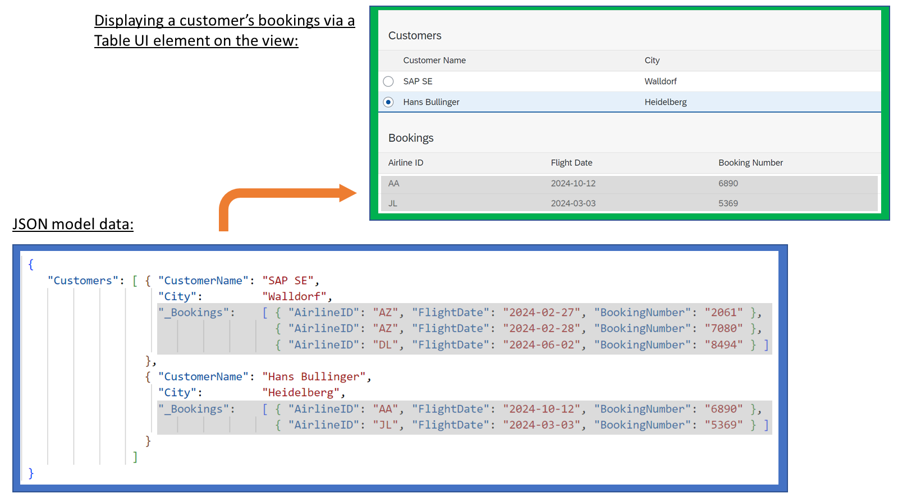
In the previous lesson on aggregation binding, the elements of an array named Customers were displayed on a view via a Table UI element. For the element binding, the JSON model data is extended: each customer in the Customers array gets an additional property _Bookings. This property is an array and contains the bookings belonging to the customer (see the figure _Example Scenario_).
Via a second table on the UI, the bookings belonging to a customer are to be displayed, that is, as soon as the user selects an entry in the customer table, the corresponding bookings should appear in the booking table. This behavior is implemented via element binding.
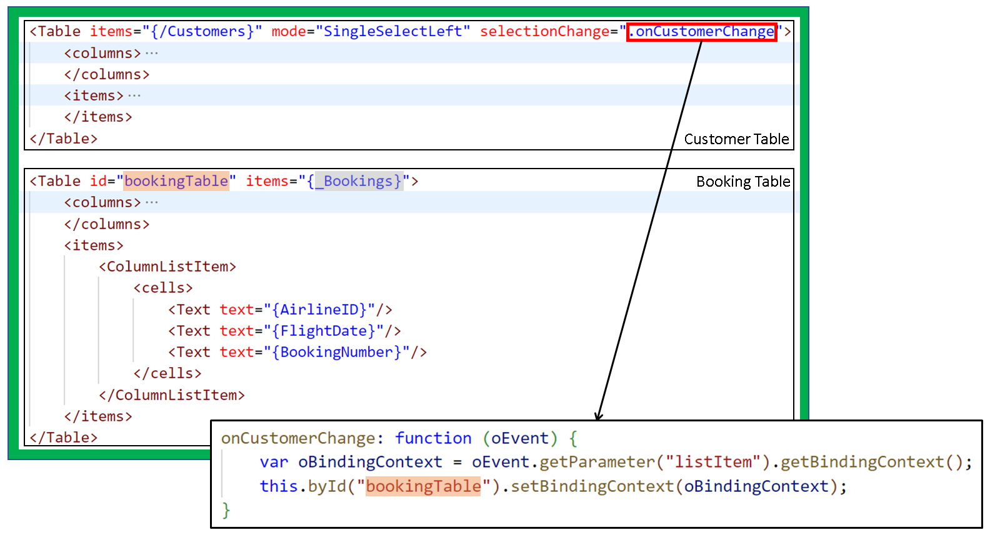
The items aggregation of the booking table is bound to the _Bookings property via the items="{_Bookings}" attribute (see the figure _Providing the Binding Context_). Since a relative path is used for the binding, the bookings table cannot display any data yet because the binding context for this relative path is missing.
The missing binding context is provided by the onCustomerChange event handler. This event handler is registered on the selectionChange event of the customer table, that is, the event handler is called every time the user selects a new customer in the customer table. They can do this via a radio button that is displayed on the left side in the customer table (mode="SingleSelectLeft").
In the event handler implementation, the listItem event parameter is queried from the oEvent event object. The parameter provides the column list item for the customer that the user has selected. For this list item belonging to the selected customer, the associated binding context is retrieved via the getBindingContext method.
The requested binding context is set for the booking table, which is accessed in the event handler via its Id. Thus, the relative path _Bookings can now be resolved to an absolute path (/Customers/0/_Bookings or /Customers/1/_Bookings) and the bookings belonging to the selected customer are displayed in the table.
## Use Element Binding
### Business Scenario
In the previous exercise, you created a JSON model and displayed the customer data in it using a table on the Overview view. In this exercise, you create another table on the Overview view to display the flight bookings of a customer. The booking data needed for this is already available in the application via the JSON model created in the last exercise, since each customer object has an array called _Bookings that contains the respective flight bookings. When the user selects a customer in the customer table, the booking table is to display the associated flight bookings. You will use element binding to implement this behavior.
| _Template:_  | Git Repository: <https://github.com/SAP-samples/sapui5-development-learning-journey.git>, Branch: **sol/12_aggregation_binding**  |
| --- | --- |
| _Model solution:_  | Git Repository: <https://github.com/SAP-samples/sapui5-development-learning-journey.git>, Branch: **sol/13_element_binding**  |
### Task 1: Add a Table for the Booking Data from the JSON Model to the Overview View
#### Steps
  1. Open the Overview.view.xml file from the webapp/view folder in the editor.
  2. Insert the following table definition immediately after the </Table> tag of the customer table to display the booking data belonging to a customer:
XML
Copy codeSwitch to dark mode

```

123456789101112131415161718192021222324

<Table id="bookingTable" headerText="Bookings" items="{_Bookings}"
      growing="true" growingThreshold="5" class="sapUiResponsiveMargin" width="auto">
  <columns>
    <Column><header><Text text="Airline ID"/></header></Column>
    <Column><header><Text text="Connection Number"/></header></Column>
    <Column><header><Text text="Flight Date"/></header></Column>
    <Column><header><Text text="Class"/></header></Column>
    <Column><header><Text text="Foreign Currency Payment"/></header></Column>
    <Column><header><Text text="Cancellation Status"/></header></Column>
  </columns>
  <items>
    <ColumnListItem>
      <cells>
        <ObjectIdentifier title="{AirlineID}"/>
        <ObjectIdentifier title="{ConnectionNumber}"/> 
        <ObjectIdentifier title="{FlightDate}"/>
        <Text text="{Class}"/>
        <ObjectNumber number="{ForeignCurrencyPayment}"
              unit="{ForeignCurrency}"/>
        <Text text="{IsCancelled}"/>
      </cells>
    </ColumnListItem>
  </items>
</Table>

```

Note
     * The booking table is bound to the _Bookings property of a customer with its items aggregation. Please note that a relative binding path must be used for this.
     * The used bookingTable Id will be needed later in the view controller to access the table in JavaScript.
     * You can look up the names of the model properties used for binding the table columns in the data.json file from the webapp/model folder.

#### Result
The Overview view should now look like this:
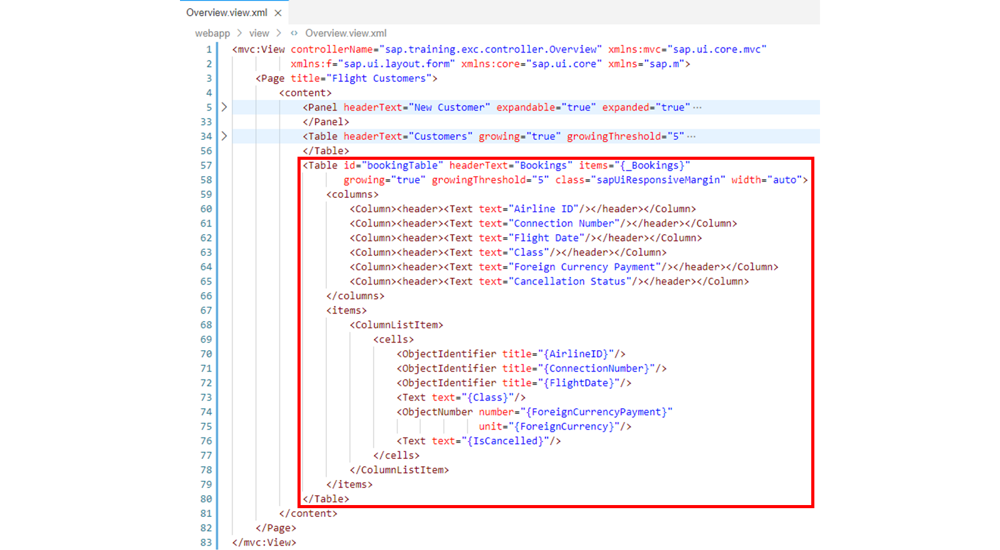
### Task 2: Register an Event Handler on the selectionChange Event of the Customer Table
#### Steps
  1. Make sure that the Overview.view.xml file is open in the editor.
  2. Add the attributes mode="SingleSelectLeft" and selectionChange=".onCustomerChange" to the <Table> tag for the customer table.
Note
     * Via mode="SingleSelectLeft" you achieve that only one customer in the table can be selected via a left-positioned selector.
     * Via selectionChange=".onCustomerChange" you register a method - which still has to be implemented - for the event that the user changes the selected customer in the table.

#### Result
The implementation of the customer table should now look like this:
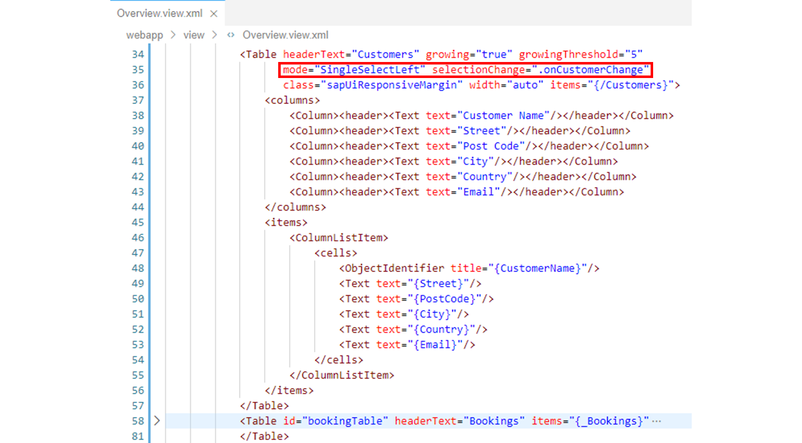
### Task 3: Implement the Registered Event Handler in the Overview View Controller
#### Steps
  1. Open the Overview.controller.js file from the webapp/controller folder in the editor.
  2. Add the onCustomerChange event handler method, registered above for the selectionChange event of the customer table, to the view controller. Implement this method as follows to set the binding context for the booking table:
JavaScript
Copy codeSwitch to dark mode

```

1234

onCustomerChange: function (oEvent) {
  var oBindingContext = oEvent.getParameter("listItem").getBindingContext();
  this.byId("bookingTable").setBindingContext(oBindingContext);
}

```

#### Result
The view controller should now look like this: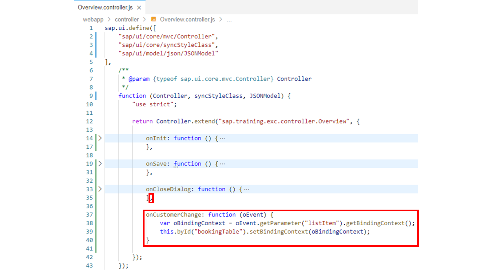
  3. Test run your application by starting it from the SAP Business Application Studio.
Make sure that when a customer is selected, the associated flight bookings are displayed in the booking table.
    1. Right-click on any subfolder in your _sapui5-development-learning-journey_ project and select _Preview Application_ from the context menu that appears.
    2. Select the npm script named _start-noflp_ in the dialog that appears.
    3. In the opened application, check if the component works as expected.


### Using Data Types

*Source: https://learning.sap.com/courses/developing-uis-with-sapui5-1/using-data-types_d37f74ff-4075-405e-a0ca-7c05baf8bf7b*

Objective
After completing this lesson, you will be able to use data types to format and validate data
## Formatting, Parsing, and Validating Data
Watch the video to learn about formatters and data types.
In this lesson, we will first discuss data types. The formatters will follow in the next lesson.
## Simple Types
As mentioned previously, data types allow you to format model data for display on the UI as well as parse and validate user input.
The currently available data types all inherit from the sap.ui.model.SimpleType class. For a complete list of all these simple types, see the _API Reference_ under the sap.ui.model.type namespace.
In this training course, the following three simple types are briefly introduced in examples: sap.ui.model.type.Integer, sap.ui.model.type.Date and sap.ui.model.type.Currency.
In addition to the simple types supplied by SAP, it is also possible to define your own custom data types. For this purpose, a subclass of SimpleType has to be created. In this subclass, a custom implementation for the methods formatValue, parseValue, and validateValue from the SimpleType class is made.
The following parameters can be passed via the constructor of a simple type:
  * formatOptions: Format options define how a value should be formatted and displayed on the UI.
  * constraints: Constraints define how a value entered on the UI should look. The entered value is validated against the specified constraints.

Simple types can be specified in data binding to define the data type of the model data. The complex binding syntax is used in XML views for this purpose.
If an entered value cannot be parsed successfully or is not within the defined constraints, an exception is raised. This results in the entered value not being transferred to the model.
### Data Type Integer

The Integer data type represents an integer value.
In the example in the figure _The Integer Data Type_ , the Input UI element is bound via complex binding syntax to the Discount property from the model named customer. The type property in the binding specifies the sap.ui.model.type.Integer data type, and the constraints property defines that only values between 0 and 100 are allowed. So if the user enters a negative value or a value greater than 100, it will not be transferred to the model.
Likewise, an entered value that cannot be parsed as an integer (for example, "abc") will not be transferred to the model.
### Data Type Date
The Date data type represents a date without time.
This type transforms a given value in the model into a formatted date string and the other way round.

In the example shown in the figure _The Date Data Type_ , the _Bookings array from the model data is output via a table on the UI. Each booking from the array contains a FlightDate property, which is displayed as a separate column in the table. For the binding of this table column the complex binding syntax is used as above.
The type property in the binding specifies the data type sap.ui.model.type.Date. Via formatOptions the data format of the flight date in the model data is specified with the provided pattern in the source property. Such a pattern could also be used to define the output format. However, the use of a style ("short, "medium", "long" or "full") is preferred because it automatically uses a local-dependent date pattern.
The Date type supports the following validation constraints:
  * maximum (expects a date presented in the source-pattern format)
  * minimum (expects a date presented in the source-pattern format)

For more information, see the _API Reference_ for sap.ui.model.type.Date.
### Data Type Currency
The Currency data type is a composite type. It consists of the parts "amount" (of type number or string) and "currency" (of type string).

In the example shown in the figure _The Currency Data Type_ , the _Bookings array from the model data is output via a table on the UI. Each booking from the array has two properties ForeignCurrencyPayment and ForeignCurrency. An ObjectNumber UI element displays the values of these two properties in one table column as an amount with currency.
For the binding of the number property complex binding syntax is used to specify sap.ui.model.type.Currency as type for the model data.
The parts array also specified in the binding contains the two paths to the values required by the Currency data type (amount and currency).
Additionally, the showMeasure formatting option is set to false. This hides the currency code in the number property , because it is passed on to the ObjectNumber control as a separate property unit.
As a result, the Currency data type provides currency code based formatting of the ForeignCurrencyPayment model property. For example, currency amounts in Euro (EUR) are displayed with 2 decimals, while amounts in Japanese Yen (JPY) have no decimals.
For more information, see the _API Reference_ for sap.ui.model.type.Currency.
## Validation Handling
If you press _Enter_ or move the focus to a different UI control, SAPUI5 executes the parse and validation function belonging to the corresponding data type.
If parse or validation exceptions occur due to incorrect user input, these errors are not automatically displayed on the UI.
You can use the message manager for reporting these error messages back to the user. To do it, you must register the corresponding UI elements with the message manager. There are several ways to do this.
You can activate automatic message generation via the message manager in the sap.ui5 section of the manifest.json application descriptor or as a parameter when instantiating a component. You can also activate it for individual controls by registering the controls in the message manager using the registerObject method.

In the example shown in the figure _Validation Handling Using the Message Manager_ , the handleValidation property in the application descriptor is used to enable validation handling by the message manager for the component.
As a result, parse and validation errors are handled by the message manager for all UI elements used in the component. That is, any parse and validation error messages generated based on the user input are picked up by the message manager, which in turn passes the error message back to the correct UI element for display.
A field in error has a red border. The error message itself is only displayed when the field has focus.
## Work with Data Types
### Business Scenario
In this exercise, you will add validations and formatting to the application. To do this, you will first enable automatic message creation for input validation using the application descriptor. Then, you will add Simple Types to some of the data bindings you have already created to validate or format data.
| _Template:_  | Git Repository: <https://github.com/SAP-samples/sapui5-development-learning-journey.git>, Branch: **sol/13_element_binding**  |
| --- | --- |
| _Model solution:_  | Git Repository: <https://github.com/SAP-samples/sapui5-development-learning-journey.git>, Branch: **sol/14_data_types**  |
### Task 1: Enable Validation Handling by the Message Manager for the Component
#### Steps
  1. Open the manifest.json application descriptor from the webapp folder in the editor.
  2. Add the following property somewhere in the sap.ui5 namespace to enable validation handling by the message manager for the component:
JSON
Copy codeSwitch to dark mode

```

1

"handleValidation": true

```

#### Result
The sap.ui5 namespace should now look similar to the following:

### Task 2: Validate and Format Application Data using Simple Types
#### Steps
  1. Open the Overview.view.xml file from the webapp/view folder in the editor.
  2. Adapt the data binding for the _Discount_ input element in the form as follows:
| **Old**  | **New**  |
| --- | --- |
|  XML Copy codeSwitch to dark mode
```
1
<Input value="{customer>/Discount}"/>
```
 |  XML Copy codeSwitch to dark mode
```

123456

<Input
  value="{
    path: 'customer>/Discount',
    type: 'sap.ui.model.type.Integer',
    constraints: {minimum: 0, maximum: 100}
  }"/>
```
 |
Note
With regard to input validation, the adapted data binding causes the message manager to display an error in the following situations:
     * If the user input cannot be parsed as an integer.
     * If the entered integer value is not between 0 and 100.
#### Result
The form should now look like this:
  3. Adapt the data binding for the _Flight Date_ column in the booking table as follows:
| **Old**  | **New**  |
| --- | --- |
|  XML Copy codeSwitch to dark mode
```
1
<ObjectIdentifier title="{FlightDate}"/>
```
 |  XML Copy codeSwitch to dark mode
```

123456789

<ObjectIdentifier
  title="{
    path: 'FlightDate',
    type: 'sap.ui.model.type.Date',
    formatOptions: {
      source: {pattern: 'yyyy-MM-dd'},
      style: 'medium'
    }
  }"/>
```
 |
Note
The adapted data binding transforms the content of the FlightDate model property into a formatted date string. In the data.json file from the webapp/model folder, the flight date is stored as a string, for example "2024-02-27". This is converted to the format "Feb 27, 2024" via the data binding.
#### Result
The booking table should now look like this:
  4. Adapt the data binding for the _Foreign Currency Payment_ column in the booking table as follows:
| **Old**  | **New**  |
| --- | --- |
|  XML Copy codeSwitch to dark mode
```

123

<ObjectNumber
  number="{ForeignCurrencyPayment}"
  unit="{ForeignCurrency}"/>
```
 |  XML Copy codeSwitch to dark mode
```

12345678910

<ObjectNumber
  number="{
    parts: [
      {path: 'ForeignCurrencyPayment'},
      {path: 'ForeignCurrency'}
    ],
    type: 'sap.ui.model.type.Currency',
    formatOptions: {showMeasure: false}
  }"
  unit="{ForeignCurrency}"/>
```
 |
Note
The added Currency data type provides a formatting of the ForeignCurrencyPayment model property based on the currency code. For example, currency amounts in Euro (EUR) are displayed with 2 decimals, while amounts in Japanese Yen (JPY) have no decimals.
Additionally, the showMeasure formatting option is set to false. This hides the currency code in the number property , because it is passed on to the ObjectNumber control as a separate property unit.
#### Result
The booking table should now look like this:
  5. Test run your application by starting it from the SAP Business Application Studio.
Make sure that the validation and formatting features outlined above are now present in the application.
    1. Right-click on any subfolder in your _sapui5-development-learning-journey_ project and select _Preview Application_ from the context menu that appears.
    2. Select the npm script named _start-noflp_ in the dialog that appears.
    3. In the opened application, check if the component works as expected.


### Implementing and Using Formatter Functions

*Source: https://learning.sap.com/courses/developing-uis-with-sapui5-1/implementing-and-using-formatter-functions_c7f9608b-de6f-44a4-b022-98cab121a6d2*

Objective
After completing this lesson, you will be able to implement and use formatter functions to convert model data into an external format
## Creating Formatter Functions
SAPUI5 provides two different options to convert model data to an external format for visual representation: data types and formatter functions.
While data types provide the possibility to format, parse and validate data, formatter functions allow one-way conversion only.
A formatter function has a single parameter, which is the value which needs to be formatted to an external representation.
A formatter function can be used not only to format a value, but also to do type conversion or calculate results from a given value.
Note
When using formatter functions, the binding is automatically switched to "one-way". So you can’t use a formatter function for "two-way" scenarios.
Formatter functions can be defined in a separate module or locally in a view controller.
Note
It is recommended to use a separate module file that groups the formatters and makes them globally available in the application.
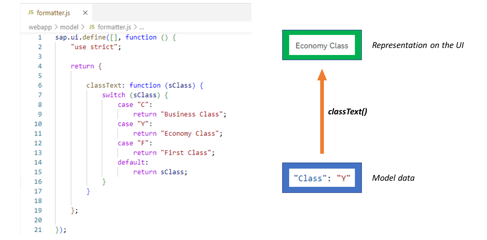
The coding example in the figure _Defining a Formatter Function_ shows the definition of a formatter function called classText. It is created in a separate module that is implemented in the formatter.js file. The classText formatter translates keys used in the model data into texts that are understandable to the user. For example, for the key value "Y", the text "Economy Class" is returned.
## Using Formatter Functions
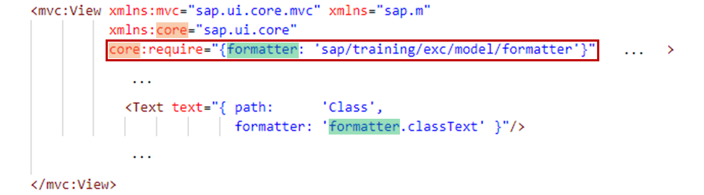
The figure, _Using a Formatter Function_ , shows how a formatter function defined in a separate module can be used in an XML view.
To do this, it must first be ensured that the module containing the formatter function is loaded. This is achieved by requiring the formatter module by its module name in the <mvc:View> tag, as shown in the figure.
The loaded module is assigned to the alias formatter. The name of this alias is arbitrary, the crucial thing is that the alias can be used as a variable in the binding.
To specify the formatter function in the binding, the complex binding syntax is used. The model property to be formatted is specified via the path property, and the formatter function is assigned to the formatter property via the following syntax:
XML
Copy codeSwitch to dark mode

```

1

<alias of the formatter module>.<name of the formatter function>.

```

So in the example, the content of the Class model property is passed to the classText formatter function . The string returned by this formatter function is then displayed on the UI via the Text control.
Note
In addition to custom formatter functions, you can also use predefined formatter functions for standard use cases, such as sap/base/strings/formatMessage.
## Implement a Formatter Function
### Business Scenario
In the booking table, the booked class of a flight is currently displayed using the values C, Y, and F respectively. In this exercise, you will implement a formatter function to convert these technical values from the Class model property into a meaningful text for the user. For C, the text _Business Class_ , for Y, the text _Economy Class_ , and for F, the text _First Class_ should be set. Then you will integrate the implemented formatter function into the data binding of the corresponding table column in order to format the flight class accordingly.
| _Template:_  | Git Repository: <https://github.com/SAP-samples/sapui5-development-learning-journey.git>, Branch: **sol/14_data_types**  |
| --- | --- |
| _Model solution:_  | Git Repository: <https://github.com/SAP-samples/sapui5-development-learning-journey.git>, Branch: **sol/15_formatters**  |
### Task 1: Create the Formatter Function
#### Steps
  1. Create a new file named formatter.js in the subfolder model of the webapp folder.
    1. Open the context menu for the webapp/model folder in the project structure.
    2. Select _New File_.
    3. In the field that appears, type **formatter.js** and press _Enter_.
#### Result
The formatter.js file is created and displays in the editor.
  2. Add the following code to the formatter.js file to create a formatter function named classText that transforms passed values from the model into meaningful texts.
JavaScript
Copy codeSwitch to dark mode

```

123456789101112131415161718192021

sap.ui.define([], function () {
  "use strict";

  return {

    classText: function (sClass) {
      switch (sClass) {
        case "C":
          return "Business Class";
        case "Y":
          return "Economy Class";
        case "F":
          return "First Class";
        default:
          return sClass;
      }
    }

  };

});

```

#### Result
The formatter function should be implemented as follows:
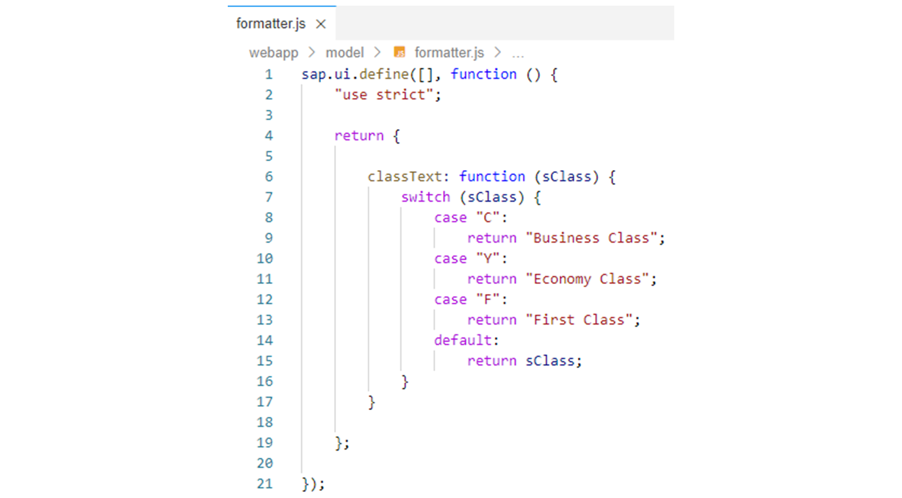
### Task 2: Use the Formatter Function for the Display of the Flight Class
#### Steps
  1. Open the Overview.view.xml file from the webapp/view folder in the editor.
  2. Add the following attribute to the <mvc:View> tag:
XML
Copy codeSwitch to dark mode

```

1

core:require="{formatter: 'sap/training/exc/model/formatter'}"

```

Note
The additional attribute ensures that the module with the classText formatter function is loaded and assigns it to the formatter alias.
#### Result
The <mvc:View> tag should now be similar to the following: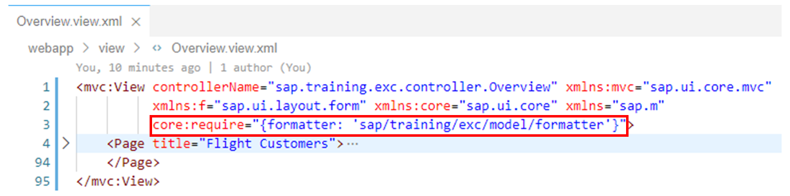
  3. Adapt the data binding for the flight class column (model property Class) in the booking table as follows to transfer the content of the Class model property to the external representation via the formatter function:
| **Old**  | **New**  |
| --- | --- |
|  XML Copy codeSwitch to dark mode
```
1
<Text text="{Class}"/>
```
 |  XML Copy codeSwitch to dark mode
```

1234

<Text text="{
  path: 'Class',
  formatter: 'formatter.classText'
}"/>
```
 |
#### Result
The data binding for the flight class column in the booking table should now look like this: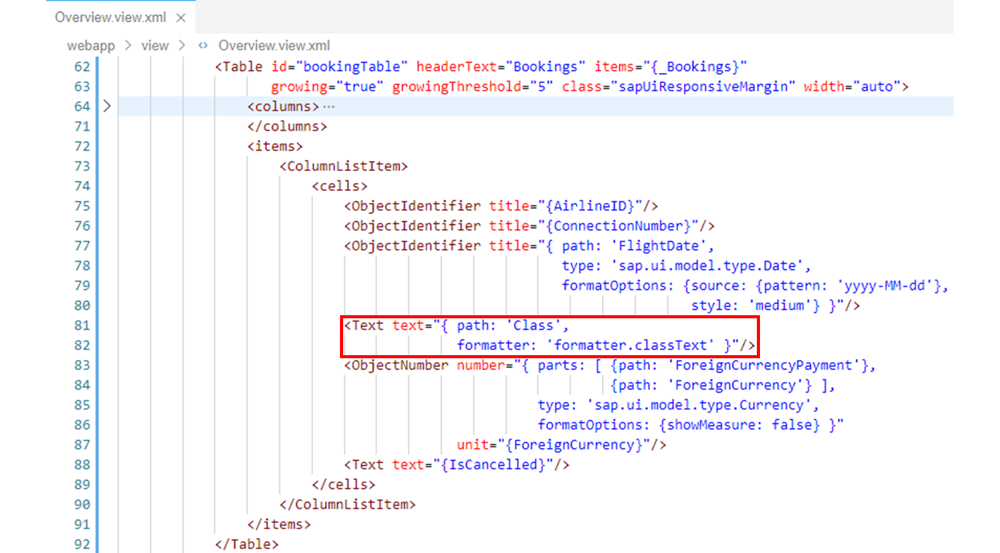
  4. Test run your application by starting it from the SAP Business Application Studio.
Make sure that the technical values from the data model (C, Y, or F) are no longer displayed in the flight class column of the booking table, but the meaningful texts from the formatter function.
    1. Right-click on any subfolder in your _sapui5-development-learning-journey_ project and select _Preview Application_ from the context menu that appears.
    2. Select the npm script named _start-noflp_ in the dialog that appears.
    3. In the opened application, check if the component works as expected.


### Sorting and Filtering

*Source: https://learning.sap.com/courses/developing-uis-with-sapui5-1/sorting-and-filtering_c49a908a-4cef-4234-bcfd-a32d0f03e7de*

Objective
After completing this lesson, you will be able to use the capabilities offered by SAPUI5 to sort and filter model data
## Initial Sorting and Filtering
With the aggregation binding, sort and filter criteria can be provided for the initial display of the data. In XML views, the complex binding syntax is employed for this purpose.
Watch this video to learn more about sorting and filtering for initial display of data.
## Sorting and Filtering API
### Filtering
To filter data manually after the aggregation binding is complete, you can access the corresponding binding object and call the filter method on it. The method applies a new set of filters to the data represented by the queried binding. The filters passed are objects of class sap/ui/model//Filter.

The example in the figure _Using the filter Method_ shows the view controller method filterCustomers, which is used to filter the data in the customer table.
First, this method instantiates a Filter object that filters the model data for those customers that contain the string "SAP" in the CustomerName property.
The created Filter object is added to an array via the push method.
Then the customer table on the view is retrieved via its Id, and the binding object for its items aggregation is queried. Finally, the filter method is called on the binding object and the array with the Filter object is passed to it.
As a result, only those customers are displayed in the customer table on the UI whose customer name contains the string "SAP".
### Sorting
To sort data manually after the aggregation binding is complete, you can access the corresponding binding object and call the sort method on it. The sort method sorts the data represented by the queried binding according to the passed sorter object. Instead of a single sorter also an array of sorters can be passed to the sort method. In this case they are processed in the sequence in which they are contained in the array. The sorters passed are objects of class sap/ui/model/Sorter.

The example in the figure _Using the sort Method_ shows the view controller method sortCustomers, which is used to sort the data in the customer table.
First, this method instantiates a Sorter object that sorts the model data in descending order by the City property. The second (optional) parameter of the constructor specifies the sort direction. Its default value is false, which means an ascending sort.
The created Sorter object is added to an array via the push method.
Then the customer table on the view is retrieved via its Id, and the binding object for its items aggregation is queried. Finally, the sort method is called on the binding object and the array with the Sorter object is passed to it.
As a result, the customer table on the UI is sorted by City in descending order.
## Sort and Filter Table Data
### Business Scenario
In this exercise, you will implement an initial sort for the table with the customer data: The customers are to be sorted in ascending order by the city and, as a second sort criterion, in ascending order by the customer name. In addition, the data should be grouped by the city.
Then you add a filter option to the customer table. For this purpose, you create a toolbar with a search field for the table. When searching, the content of the customer table should be updated so that only the customers whose name matches the search term are displayed. To achieve this, you will implement a corresponding event handler method for the search field.
| _Template:_  | Git Repository: <https://github.com/SAP-samples/sapui5-development-learning-journey.git>, Branch: **sol/15_formatters**  |
| --- | --- |
| _Model solution:_  | Git Repository: <https://github.com/SAP-samples/sapui5-development-learning-journey.git>, Branch: **sol/16_filtering_and_sorting**  |
### Task 1: Sort and Group the Data in the Customer Table Initially
#### Steps
  1. Open the Overview.view.xml file from the webapp/view folder in the editor.
  2. Implement declaratively that the entries in the customer table are initially sorted and grouped as follows: The customers are to be sorted in ascending order by city and, as a second sort criterion, in ascending order by customer name. In addition, the data should be grouped by the city.
To do this, change the data binding specified via the items attribute in the <Table> tag for the customer table as follows:
| **Old**  | **New**  |
| --- | --- |
|  XML Copy codeSwitch to dark mode
```
1
items="{/Customers}"
```
 |  XML Copy codeSwitch to dark mode
```

123456

items="{
  path: '/Customers',
  sorter: [
    {path: 'City', group: true},
    {path: 'CustomerName'} ]
}"
```
 |

#### Result
The data binding for the customer table should now look like this:

### Task 2: Implement a Filter Option with regard to the Customer Name
#### Steps
  1. Make sure that the Overview.view.xml file is open in the editor.
  2. In the next step, you will add a header toolbar to the customer table. However, if the headerToolbar aggregation used for this is set for the table, SAPUI5 ignores the headerText property. Therefore, delete the headerText="Customers" attribute from the <Table> tag for the customer table. You will use the header toolbar to set a title for the table again in the next step.
#### Result
The <Table> tag for the customer table should now look similar to the following:
  3. Now add the following headerToolbar aggregation to the customer table to create a toolbar with a table title and a search field:
XML
Copy codeSwitch to dark mode

```

1234567

<headerToolbar>
  <Toolbar>
    <Title text="Customers"/>
    <ToolbarSpacer/>
    <SearchField width="40%" search=".onFilterCustomers"/>
  </Toolbar>
</headerToolbar>

```

Note
The title serves as a replacement for the header text deleted above. The search field allows the user to enter a filter value, whereby the content of the customer table is to be updated so that only customers whose name matches the filter value entered are displayed in the table. For this purpose, the onFilterCustomers event handler method, which is yet to be implemented, is registered for the search event of the search field.
#### Result
The customer table with the added toolbar should now look like this:
  4. In the implementation of the onFilterCustomers event handler method registered above, the customer table will be accessed. For this purpose, specify an Id for the _Table_ UI element by adding the attribute id="customerTable" to the <Table> tag for the customer table.
#### Result
The <Table> tag for the customer table should now look similar to the following:
  5. Now open the Overview.controller.js file from the webapp/controller folder in the editor.
  6. For the implementation of the onFilterCustomers event handler method on the view controller the modules sap/ui/model/Filter and sap/ui/model/FilterOperator are needed. Add these two modules to the dependency array of the view controller and the corresponding parameters named Filter and FilterOperator to the factory function of the view controller.
#### Result
The view controller should now look like this:
  7. Now add the onFilterCustomers event handler method registered for the search event of the search field to the view controller. Implement this method as follows to filter the table content by the customer name:
JavaScript
Copy codeSwitch to dark mode

```

1234567891011

onFilterCustomers: function (oEvent) {
  var aFilter = [];
  var sQuery = oEvent.getParameter("query");
  if (sQuery && sQuery.length > 0) {
    aFilter.push(new Filter("CustomerName", FilterOperator.Contains, sQuery));
  }

  var oTable = this.byId("customerTable");
  var oBinding = oTable.getBinding("items");
  oBinding.filter(aFilter);
}

```

Note
The search event defines a query parameter that contains the search string that the user entered in the search field. This query parameter is accessed by calling getParameter("query") on the oEvent parameter.
If the search string is not empty, a new filter object is constructed and added to the still empty array of filters. The defined filter searches for the passed search string in the CustomerName model property. The FilterOperator.Contains filter operator used in this process is not case sensitive.
The customer table is accessed using the Id you specified in the view. On the table control, the binding of the items aggregation is accessed to filter it with the newly constructed filter object. This automatically filters the table by the search string so that only the matching items are displayed when the search is triggered.
However, if the query parameter is empty, the binding will be filtered with an empty array. This ensures that you see all table entries again.
#### Result
The view controller should now contain the following additional method:
  8. Test run your application by starting it from the SAP Business Application Studio.
Make sure that the entries in the customer table are initially sorted and grouped. Also make sure that the table content can be filtered by customer name using the search field in the toolbar.
    1. Right-click on any subfolder in your _sapui5-development-learning-journey_ project and select _Preview Application_ from the context menu that appears.
    2. Select the npm script named _start-noflp_ in the dialog that appears.
    3. In the opened application, check if the component works as expected.


### Using Expression Binding

*Source: https://learning.sap.com/courses/developing-uis-with-sapui5-1/using-expression-binding_f526aa89-c886-4747-b74a-224648380e76*

Objective
After completing this lesson, you will be able to use expression binding to format the output on a view
## Expression Binding
Expression binding is an enhancement of the SAPUI5 binding syntax, which allows for providing expressions instead of formatter functions.
Using expression binding saves the overhead of defining a function and is recommended if the formatter function has a trivial implementation like a comparison of values.
To use expression binding, you need to enable complex binding syntax for the application.
Note
Complex binding syntax is automatically enabled when the attribute data-sap-ui-compatVersion="edge" is added to the bootstrap script.

An expression binding is specified in an XML view by one of the following two options:
  * {= expression}
This variant uses one-way binding. This allows the automatic recalculation if the model values change.
  * {:= expression}
This variant uses one-time binding, meaning that the value is calculated only once. This variant needs less resources because no change listeners to the model have to be maintained.

The syntax of the expression is similar to JavaScript syntax, but you can only use a subset of the JavaScript expression syntax. Among others, the following syntax elements are available:
  * Strict equality operators:
===, !==
  * Relational operators:
<, >, <=, >=
  * Conditional operator:
?
  * Binary logical operators:
&&, ||
  * Global symbols:
For example, undefined

Additionally, you can embed values from the model layer into an expression by using the following syntax:
XML
Copy codeSwitch to dark mode

```

1

${binding}

```

binding can either be a simple path, or a complex binding.
For embedded bindings with standard data types such as String, members and member methods can be accessed with the . operator as in the following example:
XML
Copy codeSwitch to dark mode

```

1

${/CustomerName}.length

```

Note
Some characters that are used by operators need to be escaped in XML views, for example && needs to be escaped with &&.
Examples of expression binding can be found in the figure _Using Expression Binding_.
## Use Expression Binding
### Business Scenario
In this exercise, you will assign a value to the enabled property of the _Create Customer_ button on the Overview view using expression binding: only if the form field for the customer name contains a value, the enabled property should have the value true, that is, the button should be enabled, otherwise it should be disabled. Furthermore, you will use expression binding to format the content of the _Cancellation Status_ column in the booking table using icons from the SAPUI5 icon font.
| _Template:_  | Git Repository: <https://github.com/SAP-samples/sapui5-development-learning-journey.git>, Branch: **sol/16_filtering_and_sorting**  |
| --- | --- |
| _Model solution:_  | Git Repository: <https://github.com/SAP-samples/sapui5-development-learning-journey.git>, Branch: **sol/17_expression_binding**  |
### Task 1: Set the enabled Property of the _Create Customer_ Button Depending on the Value of the Input Field for the Customer Name
#### Steps
  1. Open the Overview.view.xml file from the webapp/view folder in the editor.
  2. Add the attribute valueLiveUpdate="true" to the Input UI element for the customer name.
Note
This causes the value of the value property of the Input UI element to be updated after each keystroke. Otherwise, the value would not be updated until the input field is exited or the _Enter_ key is pressed.
#### Result
The form for the customer data should now look like this:
  3. Now add the enabled attribute to the _Create Customer_ button. Assign it the value true or false as follows to ensure that the button is only enabled if the form field for the customer name contains a value:
XML
Copy codeSwitch to dark mode

```

1

enabled="{= ${customer>/CustomerName} !== undefined && ${customer>/CustomerName}.length > 0 }"

```

Note
Because of the valueLiveUpdate attribute you added to the customer name field above, the button will be enabled as soon as you enter the first character in the empty customer name field. Conversely, the button will be disabled as soon as you delete the last character in the customer name field.
#### Result
The _Create Customer_ button should now look like this:

### Task 2: Format the Cancellation Status in the Booking Table Using Icons from the SAPUI5 Icon Font
#### Steps
  1. Make sure that the Overview.view.xml file is open in the editor.
  2. The cancellation status is currently displayed in the booking table via a Text UI element. This shows the content of the IsCancelled model property, which contains an **X** if a booking was cancelled.
Using expression binding, the sap-icon://cancel icon from the SAPUI5 icon font should now be displayed if a booking has been cancelled. For non-cancelled bookings, the sap-icon://accept icon should be displayed.
For this reformatting, delete <Text text="{IsCancelled}"/> from the cells aggregation and replace it with the following Icon UI element. In addition to the icons, the tooltips _cancelled_ and _not cancelled_ are also set.
XML
Copy codeSwitch to dark mode

```

12

<core:Icon src="{= ${IsCancelled} === 'X' ? 'sap-icon://cancel' : 'sap-icon://accept' }"
           tooltip="{= ${IsCancelled} === 'X' ? 'cancelled' : 'not cancelled' }"/>

```

Note
The available icons can be looked up via the [Icon Explorer](https://ui5.sap.com/test-resources/sap/m/demokit/iconExplorer/webapp/index.html) tool in the [SAPUI5 Demo Kit](https://ui5.sap.com/).
#### Result
The booking table should now look like this:
  3. Test run your application by starting it from the SAP Business Application Studio.
Make sure that the _Create Customer_ button is enabled only when the customer name input field contains a value. Also make sure the cancellation status in the booking table is now displayed via icons with tooltip.
    1. Right-click on any subfolder in your _sapui5-development-learning-journey_ project and select _Preview Application_ from the context menu that appears.
    2. Select the npm script named _start-noflp_ in the dialog that appears.
    3. In the opened application, check if the component works as expected.


### Adapting Applications to Different Device Types

*Source: https://learning.sap.com/courses/developing-uis-with-sapui5-1/adapting-applications-to-different-device-types_a0e82bfa-56b0-4288-9fd3-eb8b7cc14b97*

Objective
After completing this lesson, you will be able to use a device model to adapt applications to different device types
## Controls with Built-In Device Adaptation
SAPUI5 comes with several controls that are already able to react to the available screen real estate and resolution by themselves. Some require particular properties to be set, and with some, everything just works out of the box.
Such controls with built-in device adaptation are for example sap.m.SplitApp, sap.m.ResponsivePopover, sap.m.OverflowToolbar, and sap.m.PullToRefresh.
The forms sap.ui.layout.form.SimpleForm and sap.ui.layout.form.Form can also adapt to the available screen size. It is recommended to set the sap.ui.layout.form.ColumnLayout for them, as its responsiveness allows the available space to be used in the best way possible.
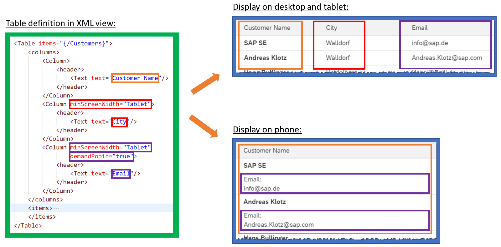
One control that is widely used across all kinds of different applications is sap.m.Table (also called the "Responsive Table"), which has several features you can use for device adaptation. On smaller devices, for example, you can set certain properties that will make particular columns pop in instead of being displayed as a normal column, or show and hide columns completely.
For example, you can set a minScreenWidth for the columns. This will cause columns to only show up if a certain screen width is matched. You can define this minScreenWidth in px or rem, but here you can also use the standard categories that come from the Device API (Phone, Tablet, or Desktop). Setting the additional property demandPopin to true for a column will also react to the minScreenWidth you specify. In such a case, the column will be shown as a popin on smaller screens, instead of being completely hidden.
In the example in the figure _Responsive Table_ , three columns are defined in an XML view for a sap.m.Table: Customer Name, City and Email.
No minScreenWidth attribute is set for the Customer Name column. It is therefore displayed on all device types, i.e. desktops, tablets and phones.
For the City column, the minScreenWidth="Tablet" attribute is specified. This column is therefore displayed only on tablets and desktops, but not on phones.
In the Email column, the attribute demandPopin="true" has been added to the attribute minScreenWidth="Tablet". As a result, this column does not disappear completely on phones, but is displayed there as a popin (see the figure). On tablets and desktops, the Email column is displayed in the same way as the City column.
## Device Model
### Instantiating a Device Model
Depending on the capabilities of the device running an application, the functionality and design of an application may vary.
For example, on a desktop device, it is not necessary to display a back button on a detail view in a list-detail scenario because the list and detail views are displayed simultaneously. On a phone, on the other hand, where there is navigation between list and detail view, such a back button is required. To control the visibility of the back button, a device model can be used.
A device model is based on the Device API (sap.ui.Device). This API provides information about device specifics, like the operating system along with its version, the browser and browser version, screen size, current orientation and support for specific features such as, touch event support, orientation change, and so on. For more information, see the API reference for the sap.ui.Device namespace.
With a device model, you can make most properties of the Device API available as a JSON model.
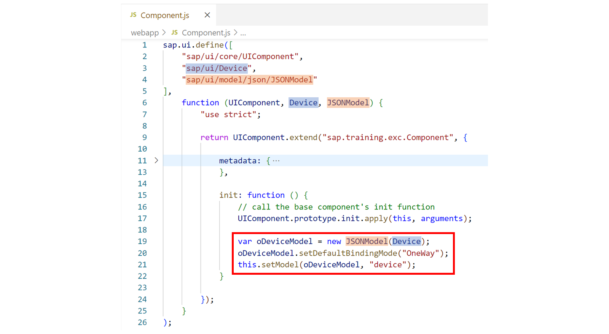
Typically, a device model is created in the initialization method of the component controller Component.js, as shown in the figure _Creating a Device Model in the Component Controller_.
To create a device model, dependencies to modules sap/ui/Device and sap/ui/model/json/JSONModel are added to the component controller. The device model is then instantiated in the controller's initialization method by simply passing the loaded Device module to the constructor function of the JSON model. The binding mode is set to OneWay since the device model is read-only. The device model is set as a named model (name: device) for the component.
### Using a Device Model
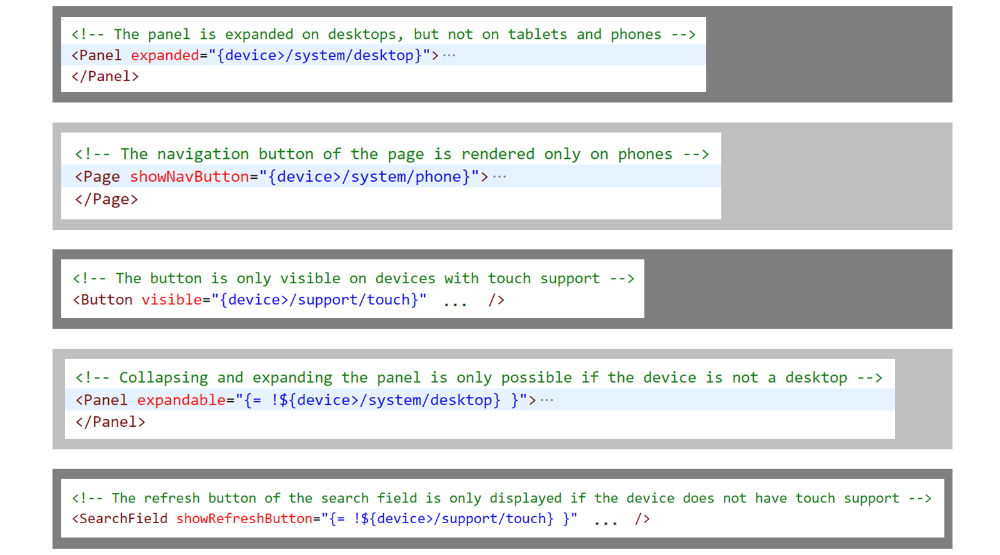
After the device model has been created, the properties from the Device API (such as /system/desktop) can be used in the data binding to adapt controls to the current platform. The figure, _Binding Control Properties to Device Capabilities_ , shows some examples of how this is achieved.
Note
Do not forget to prefix the binding path with the name of the device model ("device") plus a ">" character.
If property values from the Device API are to be negated, the expression binding syntax can be used as shown in the figure.
## Adapt the Application to Different Devices
### Business Scenario
In this exercise, you will adapt the display of the panel on the Overview view to different devices: On desktops, the panel should be expanded and it should not be possible to collapse it. On all other devices, however, the panel should be initially collapsed with the option to expand it. To implement this behavior, you will create a device model.
You will also adapt the display of the columns in the two tables on a device-specific basis: you will specify which columns should be displayed on which devices and whether columns should be displayed as pop-ins instead of being hidden.
| _Template:_  | Git Repository: <https://github.com/SAP-samples/sapui5-development-learning-journey.git>, Branch: **sol/17_expression_binding**  |
| --- | --- |
| _Model solution:_  | Git Repository: <https://github.com/SAP-samples/sapui5-development-learning-journey.git>, Branch: **sol/18_device_adaptation**  |
### Task 1: Create a Device Model in the Component Controller
#### Steps
  1. Open the Component.js component controller from the webapp folder in the editor.
  2. Add the sap/ui/model/json/JSONModel module to the dependency array of the component controller and a corresponding parameter named JSONModel to the factory function.
#### Result
The component controller should now look like this: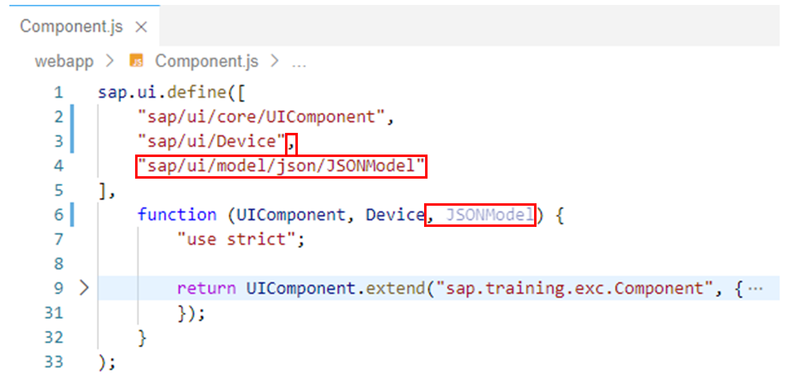
  3. Now add the following code at the end of the init() initialization method to instantiate the device model and set it under the device name for the component:
JavaScript
Copy codeSwitch to dark mode

```

1234

 // set device model
var oDeviceModel = new JSONModel(Device);
oDeviceModel.setDefaultBindingMode("OneWay");
this.setModel(oDeviceModel, "device");

```

Note
Make sure to add the coding after the call of the base component's init() method.
To create the device model, the already declared Device module is passed to the constructor of JSONModel. This makes most of the SAPUI5 Device API properties available as a JSON model.
The binding mode is set to OneWay because the device model is read-only.
The model is set as a named model for the component so that it can be referenced in the data binding under the name device, as you will do in the next step.

#### Result
The init() method of the component controller should now look like this:
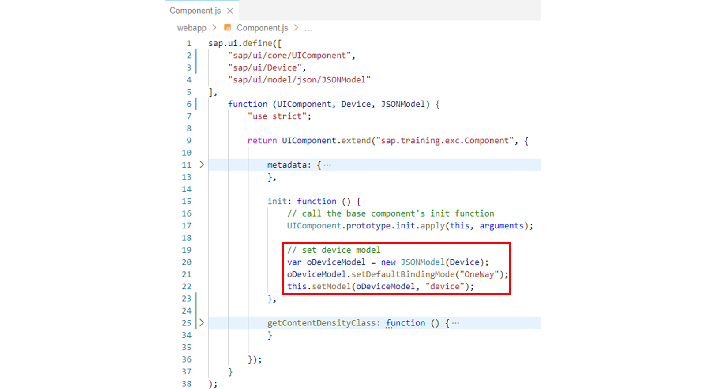
### Task 2: Set the expandable and expanded Properties of the Panel Depending on the Device
#### Steps
  1. Open the Overview.view.xml file from the webapp/view folder in the editor.
  2. Adapt the display of the _New Customer_ panel on the view to different devices: On desktops, the panel should be expanded and it should not be possible to collapse it. On all other devices, however, the panel should be initially collapsed with the option to expand it.
To do this, bind the expanded attribute of the panel to the device model as follows:
XML
Copy codeSwitch to dark mode

```

1

expanded="{device>/system/desktop}"

```

Accordingly, bind the expandable attribute of the panel to the device model using expression binding syntax as follows:
XML
Copy codeSwitch to dark mode

```

1

expandable="{= !${device>/system/desktop} }"

```

#### Result
The _New Customer_ panel should now look like this:
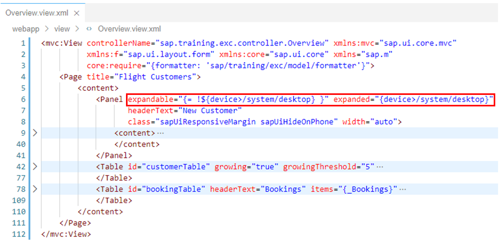
### Task 3: Make the Display of the Table Columns Device Specific
#### Steps
  1. Make sure that the Overview.view.xml file is open in the editor.
  2. In the customer table, add the following attribute to the <Column> tags for _Street_ and _Post Code_ to display these columns on desktops, but hide them on tablets and phones:
XML
Copy codeSwitch to dark mode

```

1

minScreenWidth="Desktop"

```

Further, in the customer table, add the following attribute to the <Column> tag for _Country_ to display this column on tablets and desktops, but hide it on phones:
XML
Copy codeSwitch to dark mode

```

1

minScreenWidth="Tablet"

```

Finally, add the following attributes to the <Column> tag for _Email_ to display this column on tablets and desktops. On phones, the column will be displayed as a pop-in instead of being hidden:
XML
Copy codeSwitch to dark mode

```

1

minScreenWidth="Tablet" demandPopin="true"

```

#### Result
The definition of the columns of the customer table should now look like this: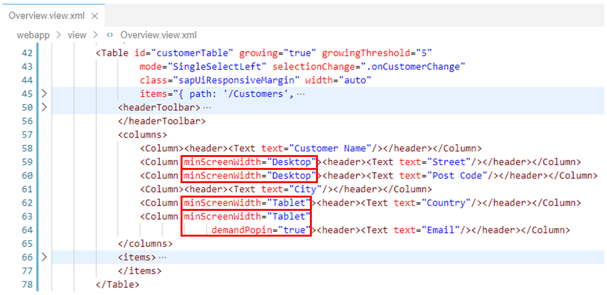
  3. In the booking table, add the following attributes to the <Column> tag for _Class_ to display this column on desktops. On tablets and phones, the column will be displayed as a pop-in instead of being hidden:
XML
Copy codeSwitch to dark mode

```

1

minScreenWidth="Desktop" demandPopin="true"

```

Finally, in the booking table, add the following attributes to the <Column> tags for _Foreign Currency Payment_ and _Cancellation Status_ to display these columns on tablets and desktops. On phones, the columns will be displayed as a pop-in instead of being hidden:
XML
Copy codeSwitch to dark mode

```

1

minScreenWidth="Tablet" demandPopin="true"

```

#### Result
The definition of the columns of the booking table should now look like this: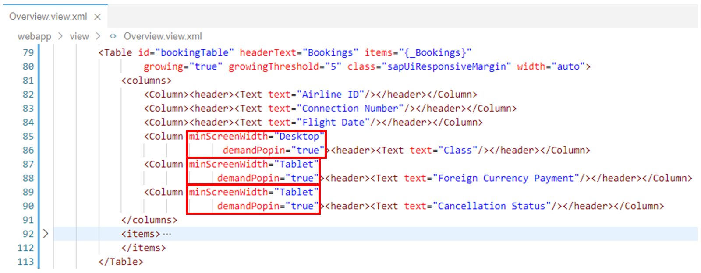
  4. Test run your application by starting it from the SAP Business Application Studio.
Make sure that the _New Customer_ panel is expanded on desktops and it is not possible to collapse it. On all other devices, the panel should be initially collapsed with the option to expand it.
Note
Please note that the panel is hidden on phones because of the sapUiHideOnPhone CSS class assigned. Therefore, you should use a tablet as a comparison to the desktop.
To test the difference between desktop and tablet, you can use the device toolbar in the developer tools of the Google Chrome, Firefox or Microsoft Edge browser: Start your application and, in the developer tools (F12), call the device toolbar with the key combination _Ctrl + Shift + M_. You can use the device toolbar to select a device you want to emulate. After you select the device, you have to refresh the browser (F5), to ensure that the init() method of the component controller is called, where the device model is initialized.
Note
Do not pay attention to the errors displayed in the console when in the developer tools. This is due to some code prepared for future exercises that is then not yet complete.
Also make sure that the columns of the two tables are displayed in a device-specific way.
Note
To test the responsive behavior of the tables, it is sufficient - in contrast to the display of the panel - to change the size of the browser window. This allows you to simulate the display of the tables on desktops, tablets and phones.
    1. Right-click on any subfolder in your _sapui5-development-learning-journey_ project and select _Preview Application_ from the context menu that appears.
    2. Select the npm script named _start-noflp_ in the dialog that appears.
    3. In the opened application, check if the component works as expected.

[Continue to quiz](https://learning.sap.com/courses/developing-uis-with-sapui5-1/models-and-data-binding)


### Quiz

*Source: https://learning.sap.com/courses/developing-uis-with-sapui5-1/models-and-data-binding*

It's time to put what you've learned to the test, get 8 right to pass this unit.
1.
### Which statements about filtering are correct?
There are two correct answers.
Element binding can be used to specify filter criteria for the initial display of the data.
To filter data for initial display, the filter property is used in the complex binding syntax.
To filter data manually using the API, the filter method of the corresponding binding object is called.
Filters are objects of the sap.ui.model.Filter class.
When filtering manually via the API, exactly one filter object can be set at a time.
2.
### Which binding types does SAPUI5 provide?
There are three correct answers.
Aggregation binding
Entity binding
Property binding
Attribute binding
Element binding
Table binding
3.
### Which of the following functionalities are provided by the simple types delivered with SAPUI5?
There are three correct answers.
Parsing user input
Formatting model data for the UI
Reporting error messages on the UI
Validating user input
4.
### Which of the following are predefined model types in SAPUI5?
There are two correct answers.
OData V3 model
Resource model
XML model
HTML model
5.
### What is the default binding mode of a JSON model?
Choose the correct answer.
One-time
One-way
Two-way
6.
### What is the name of the event fired by a sap.m.Table when the selection is changed via user interaction?
Choose the correct answer.
itemSelected
selectionChange
itemChange
selectedItem
7.
### Which statements about sorting are correct?
There are two correct answers.
Element binding can be used to specify sort criteria for the initial display of the data.
To sort data for initial display, the sorter property is used in the complex binding syntax.
To sort data manually using the API, the sorter method of the corresponding binding object is called.
Sorters are objects of the sap.ui.model.Sorter class.
When sorting manually via the API, exactly one sorter object can be set at a time.
8.
### Which XML attribute, when added to the SAPUI5 bootstrap script, enables the use of expression binding, including one-way and one-time binding?
Choose the correct answer.
data-sap-ui-compatVersion="edge"
Specifies the data-sap-ui-async attribute to true.
Enables the data-sap-ui-theme attribute with a compatible value.
9.
### Which property in the complex binding syntax is used to specify a formatter function for the data binding?
Choose the correct answer.
formatOptions
type
formatter
path
Submit answers[Next unit](https://learning.sap.com/courses/developing-uis-with-sapui5-1/working-with-a-resource-model_da9e4eef-3a80-4db7-b23f-e318ffd6a5e7)


### Localization

*Source: https://learning.sap.com/courses/developing-uis-with-sapui5-1/working-with-a-resource-model_da9e4eef-3a80-4db7-b23f-e318ffd6a5e7*

Objective
After completing this lesson, you will be able to internationalize an application by using translatable texts
## Resource Bundles
Watch the video to understand how language-specific UIs are implemented through a resource model.
Settings
### Using Localized Texts
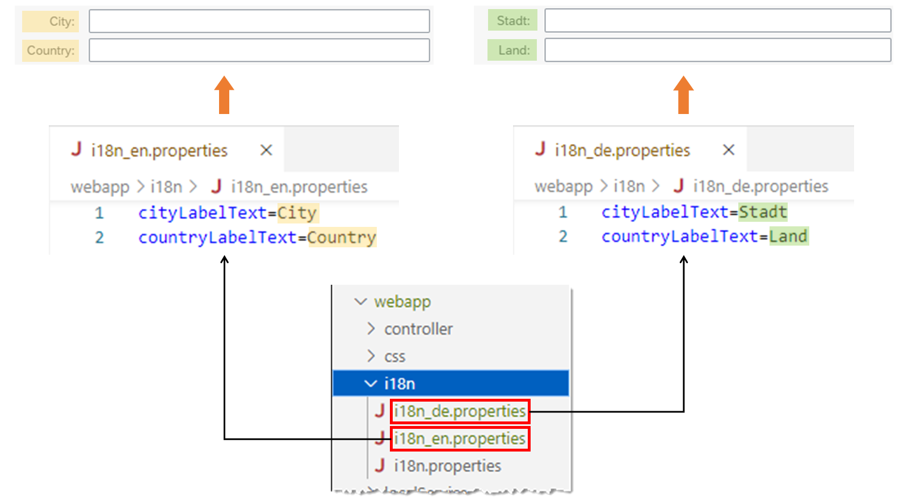
Resource bundle files are stored in an SAPUI5 project in the i18n folder, which is located under the webapp folder.
The figure, _Using Localized Texts_ , shows a resource bundle with base name i18n, which consists of three files i18n.properties, i18n_en.properties, and i18n_de.properties. All three files are located in the i18n folder of the project. The i18n_en.properties file contains the English texts _City_ and _Country_ for the two keys cityLabelText and countryLabelText. The _i18n_de.properties_ file, on the other hand, contains the German texts _Stadt_ and _Land_ for these keys.
With the help of a resource model, the application can now bind the label texts seen on the UI to the texts from the resource bundle. For this purpose, the language-independent keys are used for the binding. Details on this are discussed in the next section.
If the application now runs with en as language code / locale, the texts to be displayed are taken from the i18n_en.properties file. If, on the other hand, de is used as the language code / locale, the German texts are displayed accordingly.
## Resource Model
### Model Instantiation
Via a resource model, localized texts can be used in data binding. The resource model is a wrapper for resource bundles that exposes the localized texts as a model for data binding. You use the resource model to bind texts for control properties to language-dependent resource bundle properties.
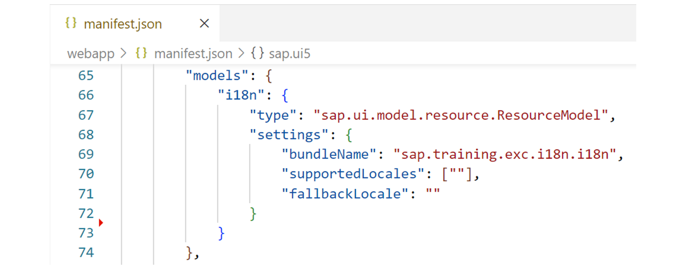
The resource model is implemented via the sap.ui.model.resource.ResourceModel class. A corresponding model instance can be created either by calling the constructor of this class in JavaScript or declaratively via the application descriptor. The figure, _Instantiating a Resource Model_ , shows the declarative way via an entry in the models property of the sap.ui5 namespace.
The entry creates a resource model that is set under the model name i18n for the component. The bundle name references the .properties base file of the resource bundle to be used. It is specified as SAPUI5 module name in dot notation and is resolved to a path as with normal SAPUI5 modules, to which ".properties" is then appended. In the example, the file i18n.properties in the i18n folder of the SAPUI5 project is specified, since the resource root of the project was set to sap.training.exc.
The two properties supportedLocales and fallbackLocale can be used to control the loading of resource bundle files and avoid '404 Not Found' network responses as follows: Assuming SAPUI5 determines de_DE as the current language code / locale of the application. Without using the two properties, the following fallback chain would be used in the example: To load the language-dependent text for a used key, the file i18n_de_DE.properties would first be requested from the server. If this is not found or the used key is not present there, the file i18n_de.properties would be requested next (without region suffix). If this is not found or the key used is not present there, the i18n_en.properties file would be requested next. If no value for the key can be identified via this request either, the raw file, i18n.properties, is finally requested from the server.
Via supportedLocales a list of locales can be specified to restrict the fallback chain. The empty string ("") represents the raw file. The fallbackLocale property can be used to specify the locale to be used after all derived locales have been tried unsuccessfully and before the raw file is used. This property has en as default value. To prevent a generic fallback, the empty string is used ("").
So the values used here for supportedLocales ("") and fallbackLocale ("") ensure that only the raw file without fallback is requested by the browser.
### Data Binding
After the resource model has been instantiated, you have a model containing the resource bundle texts as data.
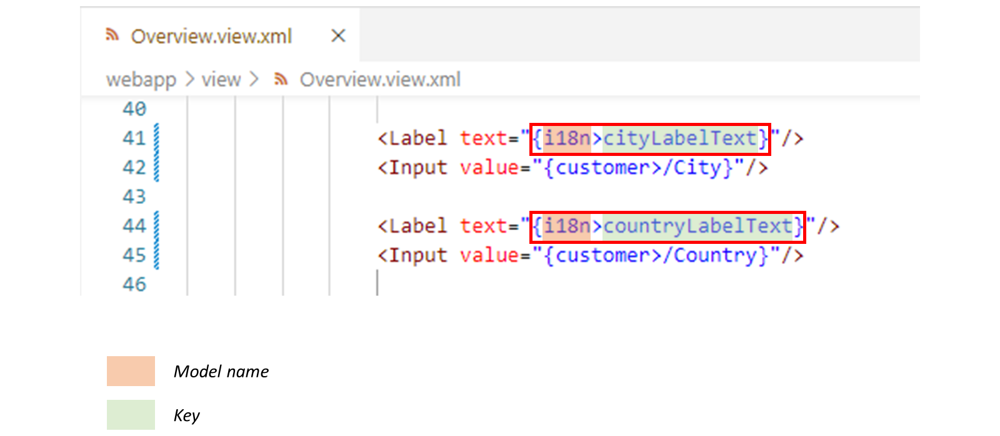
In contrast to other models, binding paths for a resource model must not start with a slash; they are absolute by default, and there is no further structure. Each key in the underlying resource bundle is a valid binding path.
In the example shown in the figure _Data Binding_ , keys cityLabelText and countryLabelText from the resource bundle are used to define language-dependent labels for the two input fields. Since the model was given the name i18n when it was declared in the application descriptor, the binding paths must be prefixed with i18n> accordingly.
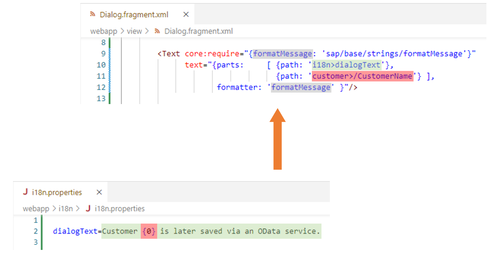
The texts used in a resource bundle may contain placeholders of the form {integer}. Such placeholders can be replaced in the data binding using the sap/base/strings/formatMessage function.
The sap/base/strings/formatMessage function expects the pattern string with the placeholders as the first parameter. The second parameter is an array containing the values to be used instead of the placeholders. Each occurrence of {0} is replaced by the value at index position 0 of the array, each occurrence of {1} is replaced by the value at index position 1 of the array, and so on. The function returns the appropriately formatted string as result.
The figure, _Replacing Placeholders_ , shows an example of how the sap/base/strings/formatMessage function can be used in data binding to replace placeholders. The shown i18n.properties resource bundle file contains a language-dependent text for the key dialogText, in which the placeholder {0} is used.
The text is to be displayed using a Text UI element, where the placeholder is to be replaced with the customer name.
To do this, the core:require attribute is used in the <Text> tag to ensure that the sap/base/strings/formatMessage module is loaded (core is the alias for the previously defined sap.ui.core namespace). The loaded module is assigned the alias formatMessage.
A binding object is passed to the text attribute of the Text UI element. There the loaded function is set as formatter function for the binding via its assigned alias. The parts array is used to pass the pattern string via the i18n>dialogText path and a value for the placeholder via the customer>/CustomerName path. The passed placeholder value is the content of the property CustomerName of the model named customer.
The formatMessage function ensures that the text from the resource bundle is displayed on the UI with the inserted customer name.
## Module sap/base/i18n/ResourceBundle
SAPUI5 provides two options to access localized texts in applications: In addition to data binding via a resource model, the sap/base/i18n/ResourceBundle module is available. This module provides an API to access localized texts that are contained in a resource bundle.
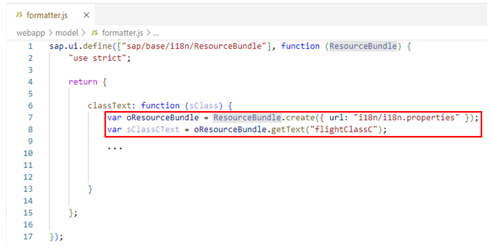
Use the module's create method to create an instance of sap/base/i18n/ResourceBundle. The url parameter of this method can be used to pass the URL pointing to the base .properties file of the resource bundle.
The create method returns either an instance of sap/base/i18n/ResourceBundle or a promise on that resource bundle when requesting the resource bundle asynchronously. To load the resource bundle asynchronously, the async parameter of the create method must be passed with the value true.
Analogous to the constructor of the resource model, the create method also has the parameters supportedLocales and fallbackLocale. For details, see the API reference in the Demo Kit.
The resource bundle underlying a resource model can also be accessed directly from the resource model instead of using the create method of the sap/base/i18n/ResourceBundle module. For this purpose, the resource model provides the getResourceBundle method. This method returns the resource bundle underlying the model (instance of sap/base/i18n/ResourceBundle) or a promise resolving with it in asynchronous case. To load the resource bundle asynchronously via the resource model, the async parameter of the constructor must be passed with the value true when instantiating the resource model.
The getText method of the resource bundle returns a locale-specific string value for the given key. The method has an optional second parameter that can be used to pass an array. If such an array is passed, any placeholder in the found locale-specific string value of the form {n} (with n being an integer) is replaced by the corresponding value from the array with index n.
The figure, Using sap/base/i18n/ResourceBundle, shows an example of how to use the module. In the classText method depicted, an instance of the module is created via its create method, specifying i18n/i18n.properties as the base file of the resource bundle. Then the getText method is called to retrieve the locale-specific text for key flightClassC from the resource bundle.
## Use Translatable Texts
### Business Scenario
In the previous exercises, you hard-coded all the texts that are displayed on the UI in the corresponding files. In this exercise, you will now move these texts on the Overview view, in the formatter function, and in the XML fragment to a resource bundle file so that they can be accessed through a resource model. Through this process of internationalization, the texts can be translated into other languages.
| _Template:_  | Git Repository: <https://github.com/SAP-samples/sapui5-development-learning-journey.git>, Branch: **sol/18_device_adaptation**  |
| --- | --- |
| _Model solution:_  | Git Repository: <https://github.com/SAP-samples/sapui5-development-learning-journey.git>, Branch: **sol/19_resource_model**  |
### Task 1: Add a Resource Model to the Component
#### Steps
  1. Open the manifest.json application descriptor from the webapp folder in the editor.
  2. In the application descriptor, look for the following entry contained in the models property in the sap.ui5 namespace:
JSON
Copy codeSwitch to dark mode

```

123456

"i18n": {
  "type": "sap.ui.model.resource.ResourceModel",
  "settings": {
    "bundleName": "<...>"
  }
}

```

Note
This declaration automatically instantiates a resource model named i18n for the component.
  3. Specify the resource bundle to use for the resource model by replacing "<...>" with **"sap.training.exc.i18n.i18n"** for the bundleName property.
Note
The bundle name now refers to the i18n.properties file from the i18n folder, which already exists in the project.
#### Result
The declaration of the resource model should now look like this: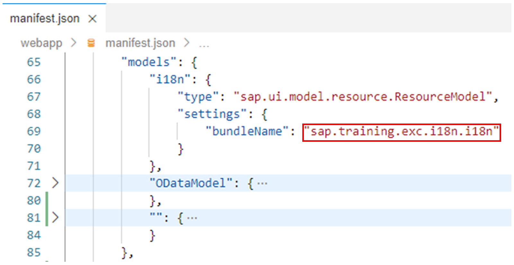
  4. In addition to the bundleName property, add the following two properties to the settings property:
JSON
Copy codeSwitch to dark mode

```

12

"supportedLocales": [""],
"fallbackLocale": ""

```

Note
For simplicity, the exercise scenario works only with the i18n.properties file. No other language-specific i18n_*.properties files are created in addition to this raw file. The values set here for supportedLocales and fallbackLocale therefore ensure that only the raw file is requested by the browser without any fallback.

#### Result
The declaration of the resource model should now look like this:
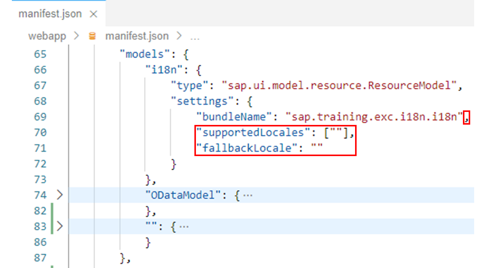
### Task 2: Replace the Hard-Coded Texts on the Overview View with Translatable Texts
#### Steps
  1. Open the i18n.properties resource bundle file from the i18n folder in the editor.
  2. For the hard-coded texts used on the Overview view, add the following key-value pairs to the resource bundle file:
JSON
Copy codeSwitch to dark mode

```

1234567891011121314151617181920212223242526

### Overview View
overviewPageTitle=Flight Customers
customerPanelHeader=New Customer
newCustomerButtonText=Create Customer
generalDataFormContainerTitle=General Data
addressDataFormContainerTitle=Address Data
contactDataFormContainerTitle=Contact Data
formLabelText=Form
nameLabelText=Customer Name
discountLabelText=Discount
streetLabelText=Street
postcodeLabelText=Post Code
cityLabelText=City
countryLabelText=Country
emailLabelText=Email
phoneLabelText=Telephone
customerTableHeader=Customers
bookingTableHeader=Bookings
airlineColumnHeader=Airline ID
connectionColumnHeader=Connection Number
fldateColumnHeader=Flight Date
classColumnHeader=Class
paymentColumnHeader=Foreign Currency Payment
cancellationColumnHeader=Cancellation Status
cancelledTooltip=cancelled
notCancelledTooltip=not cancelled

```

Note
In the next steps, you will replace the hard-coded texts on the Overview view using the keys defined here from the resource model.
#### Result
The i18n.properties resource bundle file should now look like this: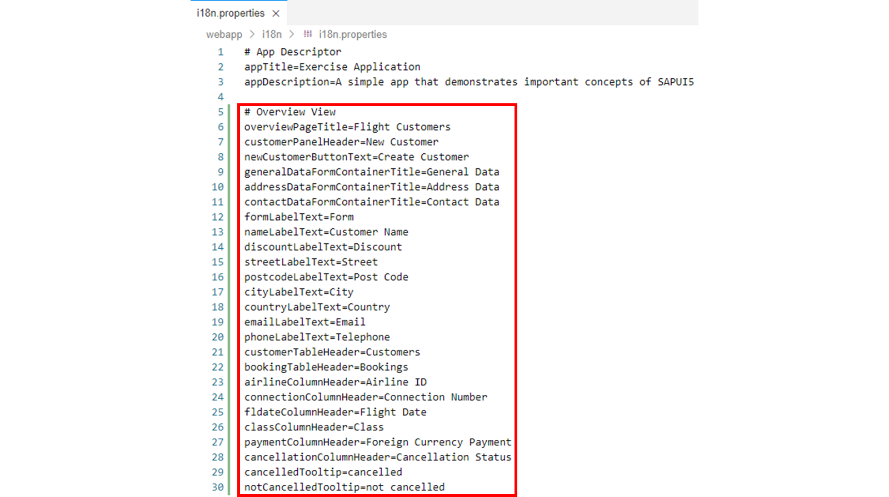
  3. Open the Overview.view.xml file from the webapp/view folder in the editor.
  4. Now replace the value of the title attribute in the <Page> tag with **{i18n >overviewPageTitle}**.
Note
In the new value, i18n is the name assigned to the resource model in the application descriptor, while overviewPageTitle is the key from the resource bundle file.
#### Result
The <Page> tag should now look like this: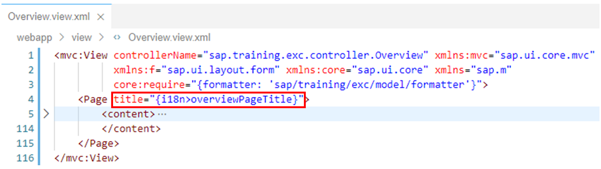
  5. Replace the value of the headerText attribute in the <Panel> tag with **{i18n >customerPanelHeader}**.
#### Result
The <Panel> tag should now look like this: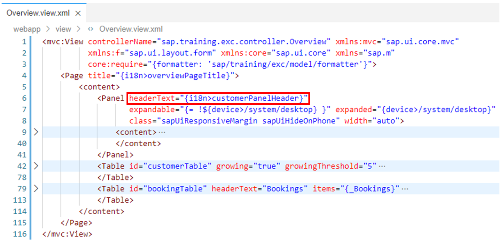
  6. Replace the value of the text attribute in the <Button> tag with **{i18n >newCustomerButtonText}**.
#### Result
The <Button> tag should now look like this: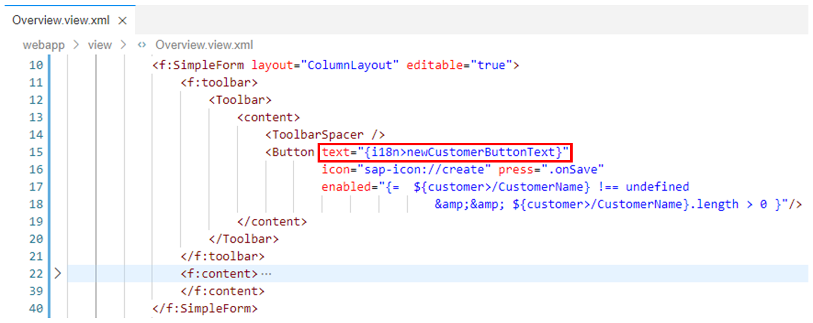
  7. Replace the texts hard-coded in the form for creating a new customer as shown in the following table:
| **Old**  | **New Attribute Value**  |
| --- | --- |
| <core:Title text="General Data"/>  | **i18n >generalDataFormContainerTitle**  |
| <Label text="Form"/>  | **i18n >formLabelText**  |
| <Label text="Customer Name"/>  | **i18n >nameLabelText**  |
| <Label text="Discount"/>  | **i18n >discountLabelText**  |
| <core:Title text="Address Data"/>  | **i18n >addressDataFormContainerTitle**  |
| <Label text="Street"/>  | **i18n >streetLabelText**  |
| <Label text="Post Code"/>  | **i18n >postcodeLabelText**  |
| <Label text="City"/>  | **i18n >cityLabelText**  |
| <Label text="Country"/>  | **i18n >countryLabelText**  |
| <core:Title text="Contact Data"/>  | **i18n >contactDataFormContainerTitle**  |
| <Label text="Email"/>  | **i18n >emailLabelText**  |
| <Label text="Telephone"/>  | **i18n >phoneLabelText**  |
#### Result
The form should now look like this: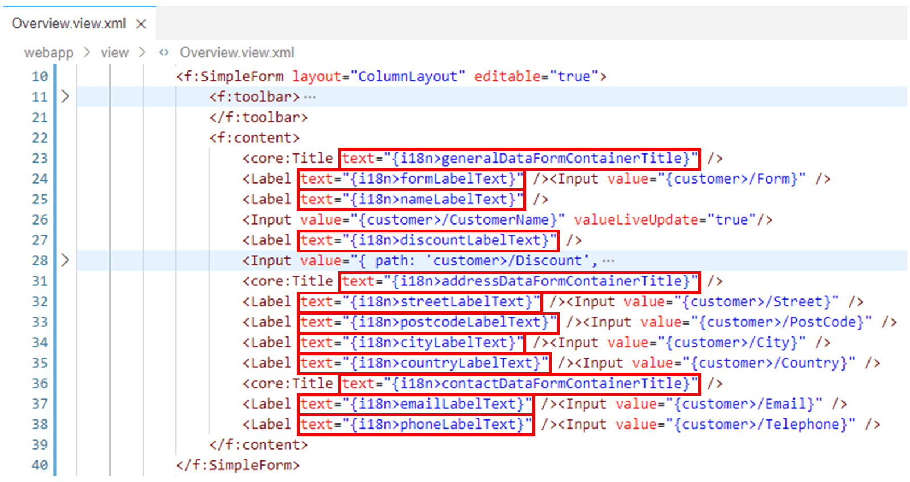
  8. Replace the texts hard-coded in the customer table as shown in the following table:
| **Old**  | **New Attribute Value**  |
| --- | --- |
| <Title text="Customers"/>  | **i18n >customerTableHeader**  |
| <Text text="Customer Name"/>  | **i18n >nameLabelText**  |
| <Text text="Street"/>  | **i18n >streetLabelText**  |
| <Text text="Post Code"/>  | **i18n >postcodeLabelText**  |
| <Text text="City"/>  | **i18n >cityLabelText**  |
| <Text text="Country"/>  | **i18n >countryLabelText**  |
| <Text text="Email"/>  | **i18n >emailLabelText**  |
#### Result
The customer table should now look like this: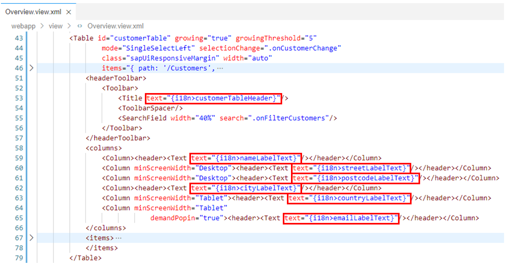
  9. Finally, replace the texts hard-coded in the booking table as shown in the following table:
| **Old**  | **New Attribute Value**  |
| --- | --- |
| <Table headerText="Bookings" ...>  | **i18n >bookingTableHeader**  |
| <Text text="Airline ID"/>  | **i18n >airlineColumnHeader**  |
| <Text text="Connection Number"/>  | **i18n >connectionColumnHeader**  |
| <Text text="Flight Date"/>  | **i18n >fldateColumnHeader**  |
| <Text text="Class"/>  | **i18n >classColumnHeader**  |
| <Text text="Foreign Currency Payment"/>  | **i18n >paymentColumnHeader**  |
| <Text text="Cancellation Status"/>  | **i18n >cancellationColumnHeader**  |
| <core:Icon tooltip="{= ${IsCancelled} === 'X' ? 'cancelled' : 'not cancelled' }" .../>  | **${IsCancelled} === 'X' ? ${i18n >cancelledTooltip} : ${i18n>notCancelledTooltip}**  |

#### Result
The booking table should now look like this:
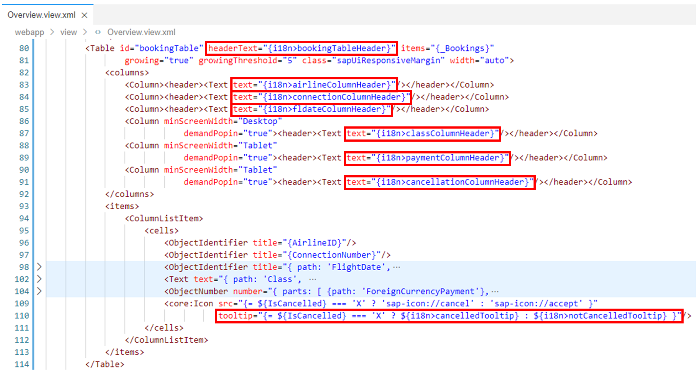
### Task 3: Replace the Hard-Coded Texts in the Formatter Function with Translatable Texts
#### Steps
  1. The classText formatter function created in a previous exercise returns the texts _Business Class_ , _Economy Class_ , or _First Class_ , depending on the content of the Class model property.
Add the following key-value pairs to the i18n.properties file to make these texts translatable:
JSON
Copy codeSwitch to dark mode

```

1234

# Formatter
flightClassC=Business Class
flightClassY=Economy Class
flightClassF=First Class

```

#### Result
The i18n.properties resource bundle file should now look like this: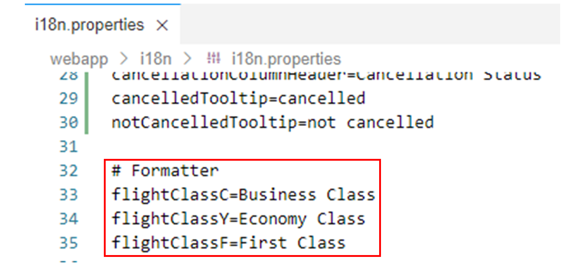
  2. Open the formatter.js file from the webapp/model folder in the editor.
  3. Add the sap/base/i18n/ResourceBundle module to the dependency array of the formatter module and a corresponding parameter named ResourceBundle to the factory function.
Note
The ResourceBundle module is used in the next step to load the resource bundle and access the texts created above.
#### Result
The formatter module should now look like this: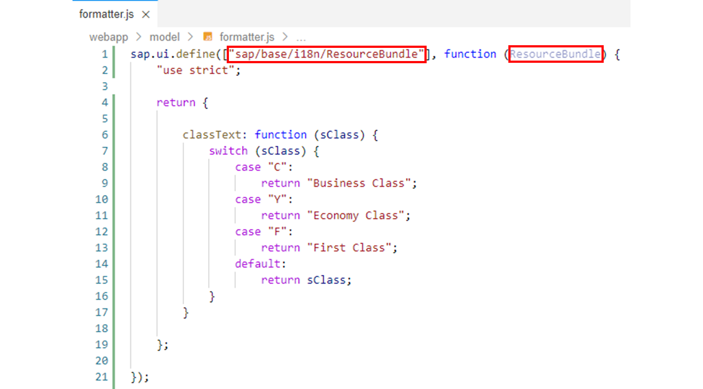
  4. Modify the implementation of the classText formatter function as follows to load the resource bundle and access the texts created above from it via their respective keys:
JavaScript
Copy codeSwitch to dark mode

```

1234567891011121314

classText: function (sClass) {
  var oResourceBundle = ResourceBundle.create({ url: "i18n/i18n.properties" });

  switch (sClass) {
    case "C":
      return oResourceBundle.getText("flightClassC");
    case "Y":
      return oResourceBundle.getText("flightClassY");
    case "F":
      return oResourceBundle.getText("flightClassF");
    default:
      return sClass;
  }
}

```

#### Result
The classText formatter function should now look like this:
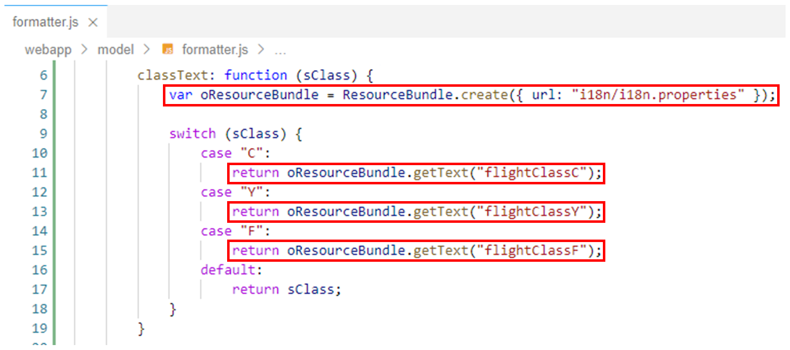
### Task 4: Replace the Hard-Coded Info Text on the Popup with a Translatable Text
#### Steps
  1. Finally, the following text on the popup, implemented in a previous exercise via the Dialog.fragment.xml file, should be made translatable:
XML
Copy codeSwitch to dark mode

```

12

<Text
  text="Customer {customer>/CustomerName} is later saved via an OData service."/>

```

To do this, add the following key-value pair to the i18n.properties file:
JSON
Copy codeSwitch to dark mode

```

12

# Fragment
dialogText=Customer {0} is later saved via an OData service.

```

Note
In the next steps, you will display this text on the popup via the resource model, replacing the {0} placeholder with the current customer name.
#### Result
The i18n.properties resource bundle file should now look like this: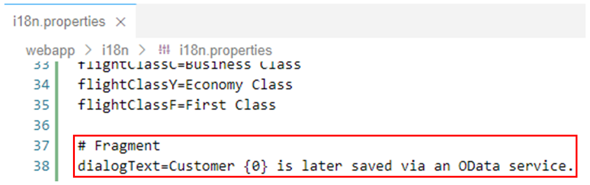
  2. Open the Dialog.fragment.xml file from the webapp/view folder in the editor.
  3. Modify the Text UI element on the popup as follows to use the text you just created from the resource model for the display, replacing the {0} placeholder with the current customer name:
XML
Copy codeSwitch to dark mode

```

1234567

<Text
  core:require="{formatMessage: 'sap/base/strings/formatMessage'}"
  text="{
          parts: [
                    {path: 'i18n>dialogText'},
                    {path: 'customer>/CustomerName'} ],
          formatter: 'formatMessage' }"/>

```

#### Result
The implementation of the popup should now look like this: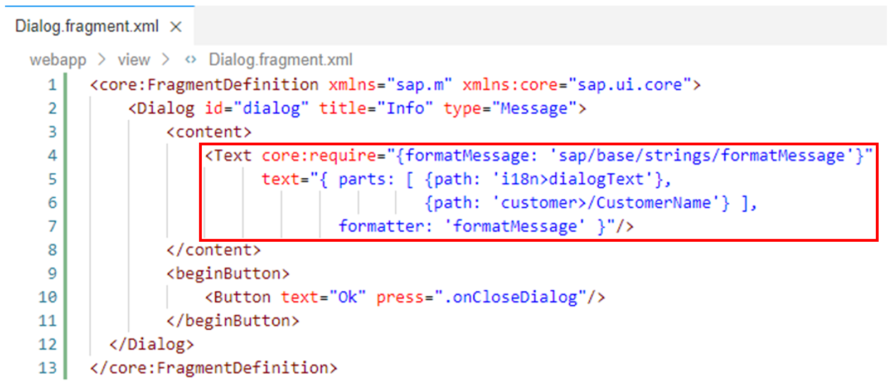
  4. Test run your application by starting it from the SAP Business Application Studio.
Make sure that the UI has not changed from the previous exercise from the user's point of view: All texts on the Overview view including the flight class in the booking table as well as the text on the popup should be displayed unchanged. However, the texts now come from the resource bundle and are translatable.
    1. Right-click on any subfolder in your _sapui5-development-learning-journey_ project and select _Preview Application_ from the context menu that appears.
    2. Select the npm script named _start-noflp_ in the dialog that appears.
    3. In the opened application, check if the component works as expected.

[Continue to quiz](https://learning.sap.com/courses/developing-uis-with-sapui5-1/localization)


### Quiz

*Source: https://learning.sap.com/courses/developing-uis-with-sapui5-1/localization*

It's time to put what you've learned to the test, get 3 right to pass this unit.
1.
### What options does SAPUI5 provide to access texts from a resource bundle in an application?
There are two correct answers.
Aggregation binding
Module sap/base/i18n/ResourceModel
Module sap/base/i18n/ResourceBundle
Data binding via a resource model
2.
### You have created a resource model for an SAPUI5 component using neither the supportedLocales parameter nor the fallbackLocale parameter. Assume that SAPUI5 determines de_DE as the locale for the application at runtime. In this case, which is the locale fallback chain used by SAPUI5 when loading resource bundle files (where "" stands for the raw file)?
Choose the correct answer.
"de_DE" → "de" → ""
"de_DE" → "de" → "en" → ""
"de_DE" → "de" → "" → "en"
"de" → "de_DE" → ""
3.
### Which parameter is used to pass the SAPUI5 module name of the base .properties file to a ResourceModel?
Choose the correct answer.
bundle
bundleName
bundleUrl
url
Submit answers[Next unit](https://learning.sap.com/courses/developing-uis-with-sapui5-1/reading-data-through-an-odata-model_e7de231b-e1ae-46f9-a298-14da24ef940b)


### OData Model

*Source: https://learning.sap.com/courses/developing-uis-with-sapui5-1/reading-data-through-an-odata-model_e7de231b-e1ae-46f9-a298-14da24ef940b*

Objective
After completing this lesson, you will be able to read data from an OData service via an SAPUI5 OData model
## OData Model
The OData model enables binding of controls to data from OData services.
Watch the video to learn about the SAPUI5 OData model.
Settings
The OData V4 model covered in this course supports the following:
  * Read access
  * Deleting and creating entities
  * Updating properties of OData entities (in entity sets and contained entities) via two-way-binding
  * Operation (function and action) execution
  * Grouping data requests in a batch request
  * Server-side sorting and filtering

## Model Instantiation
An OData V4 model instance can be created in JavaScript using the constructor of the sap.ui.model.odata.v4.ODataModel class. A map with parameters must be passed to the constructor. This map must contain at least the parameters serviceUrl and synchronizationMode.
The value for serviceUrl is the root URL of the service to request data from. The path part of the URL must end with a forward slash according to the OData V4 specification.
The parameter synchronizationMode controls synchronization between different bindings which refer to the same data for the case data changes in one binding. This parameter must be set to _'None'_ which means bindings are not synchronized at all; all other values are not supported and lead to an error.
Note
For more information, see the documentation of the constructor of the sap.ui.model.odata.v4.ODataModel class in the API reference in the Demo Kit.

Alternatively, an OData V4 (as well as V2) model can also be instantiated declaratively via the manifest.json application descriptor. The example shows the parts of the application descriptor that are relevant for this.
In the sap.app namespace the dataSources attribute is used to specify an OData service that is used in the component. As key of the data source mainService is used, whereby the name of the key is arbitrary. The mainService data source contains important information – over which URL the service can be called as well as that it is an OData V4 service.
The models attribute in the sap.ui5 namespace is then used to specify an OData model that consumes the OData V4 service from the mainService data source. This OData V4 model is automatically instantiated and set for the component. No name is used for the model, since an empty string ("") is specified as the key.
The settings object in the definition of the OData model is passed to the constructor of the sap.ui.model.odata.v4.ODataModel class. It contains the synchronizationMode parameter described previously.
In addition, the following parameters are used:
  * operationMode
This parameter defines the operation mode for filtering and sorting. _"Server"_ means that these operations are executed on the server by appending corresponding URL parameters ($filter, $orderby). Each change in filtering or sorting triggers a new request to the server.
  * earlyRequests
This Boolean parameter determines whether the Service Metadata Document ($metadata), additional annotations files and the security token are requested at the earliest convenience.
  * autoExpandSelect
This Boolean parameter determines whether the OData model's bindings automatically generate $select and $expand system query options. If set to true, SAPUI5 only selects data needed for the UI, so that you get a minimal response size and improved performance.

Note
For more information, see the documentation of the constructor of the sap.ui.model.odata.v4.ODataModel class in the API reference in the Demo Kit.
If you select an OData service for the application when running through the wizard for creating a new SAPUI5 project in the SAP Business Application Studio, a corresponding data source and an OData model referencing it are automatically added to the application descriptor.
## Bindings
### Binding Types
Bindings connect SAPUI5 view elements to model data, allowing changes in the model to be reflected in the view element and vice versa.

Every resource path (relative to the service root URL, no query options) is a valid data binding path within the OData model if a leading slash is added. For example, you can use _/UX_Customer(00505604-4e85-1edd-818f-21e64b9cd2cf)_ to access an entity instance with key _00505604-4e85-1edd-818f-21e64b9cd2cf_.
### Absolute and Relative Bindings
Bindings are called absolute if their path starts with a forward slash "/"; otherwise they are called relative. Relative bindings are initial, meaning that they have no data as long as they have no context. They obtain a context either from a list binding where the context represents an entity for a certain index in an entity collection, or from a context binding where the context represents the one entity of the context binding.
The binding that created the context is called the parent binding of the relative binding; the relative binding is a child binding of its parent binding.

The figure, Absolute and Relative Bindings, shows an absolute list binding: A table's items aggregation is bound to the UX_Customer entity set using the path **/UX_Customer**. The columns define relative bindings with paths **CustomerName** , **Street** , **PostCode** , **City** , **Country** , and **Email** , with the absolute list binding as parent binding.
## OData Requests
### Generated Requests
An absolute binding creates a data service request to read data once data is requested by a bound control or a child control with a relative binding. The read URL path is the model's service URL concatenated with the binding's path.

In the example shown, the following OData request is generated to retrieve the data for the table:
To the service URL (/sap/ux_ui_customer_o4/srvd/sap/ux_ui_customer/0001/), which was specified when the model was instantiated (see above), the binding path used for the items aggregation (/UX_Customer) is appended. This results in the URL to request the UX_Customer entity set via the service.
Query options are also derived from the binding of the table and appended to the generated URL:
Since the table has the growing feature enabled, only the first 5 entities are requested from the OData service during the initial request. This is implemented through $skip=0&$top=5. If the user requests additional data, a subsequent request is generated with $skip=5&$top=5 to retrieve the next 5 entities and so on.
The sort order defined in the binding for the table is also applied to the OData request via $orderby=City,CustomerName.
Note
To use server-side sorting and filtering, the operation mode of the OData model must be set to Server. This can be done via the operationMode model parameter in the application descriptor (see above). Without this operation mode, the sorting defined in the binding of the table will result in an error.
Finally, only those properties are requested via $select that are also displayed in the table.
Note
In order for the OData V4 model to automatically compute $select as well as $expand query options for service requests from binding paths specified for control properties, the autoExpandSelect flag must be set during model construction (see above). Without this flag, all properties of a customer would be requested in the example.
The CustomerGuid property is selected even though it is not bound to the UI. It is automatically selected because it is the key property of the customer.
### Filtering
The OData V4 model also supports server-side filtering of lists.

In the example, the user can filter the content of a table with customer data via a search field. The filtering of the data is implemented in the event handler shown. In it, a sap.ui.model.Filter object is created that filters the table content with respect to the content of the CustomerName property. Only those customers are displayed whose customer name contains the value entered by the user (sQuery). In the example, **SAP** was entered as filter value.
To set the filter object, the list binding object for the items aggregation of the table is retrieved. The filter object is passed to this object via the filter method. This in turn leads to an OData request, that applies the filter over $filter=contains(CustomerName,'SAP').
Note
Keep in mind that for server-side sorting and filtering, the operation mode of the OData model must be set to Server. This can be done via the operationMode model parameter in the application descriptor (see above). Without this operation mode, the filtering implemented in the event handler method will result in an error.
### Context Binding

The example implements a master-detail scenario with two tables. Customers are displayed in the upper of the two tables. This table is bound to the UX_Customer entity set with its items aggregation. The absolute binding path used here ensures that a corresponding OData request is generated to populate the table with data (see above).
In the lower table, the existing bookings for the selected customer are to be displayed. For this purpose, this table is bound to the _Bookings navigation property of the customer. However, a relative binding path is used here, so that no OData request is generated for data retrieval as long as there is no context for this binding.
As soon as a customer is selected in the customer table, the binding context of the booking table is set to the currently selected customer via the associated onCustomerChange event handler. This allows the relative path used in the binding to be completed to an absolute path and a corresponding OData request to be generated for filling the booking table.
## Add an OData Model to the Application
### Business Scenario
The data currently displayed in the customer table and the booking table comes from a JSON model that you created in a previous exercise. In this exercise, you will delete this JSON model and instead use an OData model that provides the data for the two tables.
Note
For simplicity, you will not call the OData service in the back-end system to test the exercise. Instead, a so-called mock server will be used to simulate access to the remote system. The data displayed during the simulated access is already included in the project. It can be found in the UX_Customer.json and UX_Booking.json files, which are located in the webapp/localService/data folder.
To use the mock server, the preview of the application is not started via the start-noflp script as before, but via the start-mock script. This applies to all outstanding exercises and is included in the exercise descriptions accordingly.
| _Template:_  | Git Repository: <https://github.com/SAP-samples/sapui5-development-learning-journey.git>, Branch: **sol/19_resource_model**  |
| --- | --- |
| _Model solution:_  | Git Repository: <https://github.com/SAP-samples/sapui5-development-learning-journey.git>, Branch: **sol/20_OData_model_(read)**  |
### Task 1: Add an Automatically Instantiated OData Model to the Component
#### Steps
  1. Open the manifest.json application descriptor from the webapp folder in the editor.
  2. In the application descriptor, look for the following entry contained in the sap.app namespace:
JSON
Copy codeSwitch to dark mode

```

1234567891011

"dataSources": {
  "mainService": {
    "uri": "/sap/opu/odata4/sap/ux_ui_customer_o4/srvd/sap/ux_ui_customer/0001/",
    "type": "OData",
    "settings": {
      "annotations": [],
      "localUri": "localService/metadata.xml",
      "odataVersion": "4.0"
    }
  }
}

```

Note
The entry specifies that the component uses an OData v4 service with the declared URL. The key for this data source is named mainService and is required below to consume this OData service via an OData model.
  3. Now find the following entry contained in the models property in the sap.ui5 namespace:
JSON
Copy codeSwitch to dark mode

```

123456789

"ODataModel": {
  "dataSource": "<...>",
  "settings": {
    "synchronizationMode": "None",
    "operationMode": "Server",
    "autoExpandSelect": true,
    "earlyRequests": true
  }
}

```

Note
This declaration defines a model that is automatically instantiated and set with the name ODataModel for the component.
  4. Change the name of the model above from ODataModel to an empty string ("") to set the model as the unnamed default model for the component.
#### Result
The declaration of the model should now look like this:
  5. For the dataSource property, replace "<...>" with **"mainService"** to reference the OData service specified above for the mainService key as the data source for the model.
#### Result
The declaration of the OData model should now look like this:
  6. The JSON model previously used as a data provider is now no longer needed. Therefore delete the following entry from the models property:
JSON
Copy codeSwitch to dark mode

```

1234

"": {
  "type": "sap.ui.model.json.JSONModel",
  "uri": "model/data.json"
}

```

#### Result
The models property should now look like this:

### Task 2: Bind the Customer Table to the Data from the OData Service
#### Steps
  1. Open the Overview.view.xml file from the webapp/view folder in the editor.
  2. Change the data binding for the items aggregation of the customer table as follows: Replace the value /Customers of the path property with the value **/UX_Customer**.
Note
The structure of the data from the OData service is very similar to the structure of the data from the previously used JSON model. The only relevant difference is that the customers in the JSON model were stored in an array called Customers, while the corresponding entity set in the OData service used is called UX_Customer. Apart from that, the two models match in the property names used and also with regard to the relation between customers and bookings from a UI perspective. Therefore, no further adjustments are necessary to populate the two tables with data via the OData service.
The data model underlying the OData service can be explored in the service metadata document. This document is included in the project and can be found in the metadata.xml file in the webapp/localService folder.
#### Result
The data binding of the customer table should now look like this:
  3. Test run your application by starting it from the SAP Business Application Studio.
Caution
As mentioned above, the OData service is not called in the back-end system for testing. Instead, access to the remote system is simulated via a mock server. To do this, use the npm script called **start-mock** to start the application instead of the _start-noflp_ script used previously.
(If you have access to the back-end system, you can use the _start-noflp_ script.)
Make sure that the customer table is populated with data and when a customer is selected, the associated bookings are displayed in the booking table.
Note
The data used for the simulated OData call is essentially the same as the data from the JSON model used previously. The data provided by the back-end system may differ.
    1. Right-click on any subfolder in your _sapui5-development-learning-journey_ project and select _Preview Application_ from the context menu that appears.
    2. Select the npm script named _start-mock_ in the dialog that appears.
    3. In the opened application, check if the component works as expected.


### Creating New Entities through an OData Model

*Source: https://learning.sap.com/courses/developing-uis-with-sapui5-1/creating-new-entities-through-an-odata-model_aba01a3c-b613-4526-b4fa-c72a05596e2a*

Objective
After completing this lesson, you will be able to create new entities for an OData service via an SAPUI5 OData model
## Batch Control
### Group IDs
The OData V4 model sends requests in the following cases:
  * Implicit read requests to retrieve data for a binding
For example, a list binding with the absolute path /UX_Customer triggers a GET UX_Customer to read data.
  * Implicit update requests via two-way binding
For example, update a customer’s name through a property binding with the relative path CustomerName, which has a context with path /UX_Customer(00505604-4e85-1edd-818f-21e64b9cd2cf) triggering PATCH UX_Customer(00505604-4e85-1edd-818f-21e64b9cd2cf) with the customer name's value as JSON payload.
  * Explicit requests triggered through API calls like ODataListBinding.refresh() or ODataContextBinding.execute()

For each of these cases, it is possible to specify a _Group ID_ of type string that allows you to group multiple operations into a single HTTP request payload (batch request).

A _Group ID_ has one of the following submit modes to control the use of batch requests:
  * **sap.ui.model.odata.v4.SubmitMode.API**
Requests associated with this submit mode are sent in a batch request via sap.ui.model.odata.v4.ODataModel#submitBatch().
  * **sap.ui.model.odata.v4.SubmitMode.Auto**
Requests associated with this submit mode are sent in a batch request which is triggered automatically before rendering.
  * **sap.ui.model.odata.v4.SubmitMode.Direct**
Requests associated with this submit mode are sent directly without batch.

The following _Group IDs_ are possible:
  * $auto and $auto.*
Predefined batch _Group ID_ , which is the default if no _Group ID_ is specified. You can use different $auto.*_Group IDs_ to use different batch requests. The suffix can be any non-empty string consisting of alphanumeric characters from the basic Latin alphabet, including the underscore. They have the submit mode **sap.ui.model.odata.v4.SubmitMode.Auto**.
  * $direct
Predefined batch _Group ID_ , which has the submit mode **sap.ui.model.odata.v4.SubmitMode.Direct**.
  * Application Group IDs
An Application Group ID is a non-empty string consisting of alphanumeric characters from the basic Latin alphabet, including the underscore. By default, an Application Group ID has the submit mode **sap.ui.model.odata.v4.SubmitMode.API**.
On construction of the OData model, it is possible to define different submit modes for Application Group IDs. This is useful when you want to separate requests requiring short processing time on the server from those requiring long processing time, so that responses to "fast" requests are visible earlier on the UI.

### Usage of Group IDs in XML Views
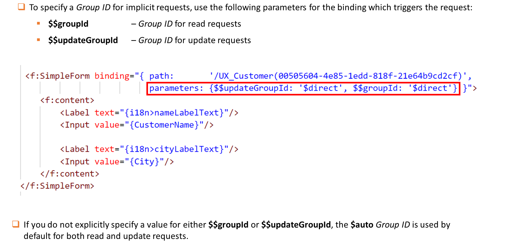
In the example shown in the figure, _Usage of Group IDs in XML Views_ , the binding context of the form is set to /UX_Customer(00505604-4e85-1edd-818f-21e64b9cd2cf) via the binding attribute of the <SimpleForm> tag. In addition, the _Group ID_ for read and update requests is set to $direct ($$updateGroupId and $$groupId parameters). Therefore, the data for the form, that is, name and city of the customer with Id 00505604-4e85-1edd-818f-21e64b9cd2cf, is read directly without batch. Likewise, updates for the name and the city through two-way binding are sent directly without batch.
The default for the _Group ID_ of the OData model is $auto. The value of _Group ID_ is used as default for the _Update Group ID_ of the OData model.
On instantiation of the OData model, you can also provide both a _Group ID_ and an _Update Group ID_ ; if specified, these values are used as defaults if the corresponding binding parameters are not explicitly set.
For explicit requests, the _Group ID_ can be specified as an optional parameter to the corresponding API method. The _Group ID_ or _Update Group ID_ of the binding is used as a default.
## Creating an Entity
In the example shown in the figure, _Creating an Entity - Example_ , a new customer is created when the _Create Customer_ button on the UI is pressed.

The sample application uses a table with Id customerTable on the UI, via whose items aggregation the customer entity set is displayed. For this entity set, a new entity is to be created.
The getBinding method is used in the event handler of the _Create Customer_ button to query the binding object for the items aggregation of the UI table. This binding object is of type sap.ui.model.odata.v4.ODataListBinding. The create method of this list binding creates a new customer entity and inserts it at the beginning of the list. The method is passed the data for the entity to be created. The customer data is not shown in the coding example. For example, it can come from a form that the user has filled in.
For creating a new entity, the _Update Group ID_ of the list binding is used. In the example, neither the $$groupId parameter nor the $$updateGroupId parameter is explicitly set for the list binding, so by default the $auto _Update Group ID_ is used for the create operation. That is, the customer is created in the back-end via a corresponding batch request, which is automatically triggered before rendering.
The create method returns the context object for the newly created entity. It is of type sap.ui.model.odata.v4.Context. The created method of this context object returns a promise that is resolved without data when the entity represented by the context has been created in the back-end. The function registered for this case can be used, for example, to display a success message.
## Implement an OData Create Operation
### Business Scenario
When pressing the _Create Customer_ button on the Overview view, a popup currently displays with the info text that the customer will be created later via an OData service. In this exercise, you will implement this create operation. To do this, you will first delete the implementation of the popup and the info text used there. Then you will reimplement the event handler method for the _Create Customer_ button so that a new customer is created via the OData service already integrated in the application.
| _Template:_  | Git Repository: <https://github.com/SAP-samples/sapui5-development-learning-journey.git>, Branch: **sol/20_OData_model_(read)**  |
| --- | --- |
| _Model solution:_  | Git Repository: <https://github.com/SAP-samples/sapui5-development-learning-journey.git>, Branch: **sol/21_OData_model_(create)**  |
### Task 1: Delete the Implementation of the Popup as well as the Used Info Text
#### Steps
  1. The implementation of the popup can be found in the Dialog.fragment.xml file. Delete this file from the webapp/view folder.
    1. Open the context menu for the Dialog.fragment.xml file in the project tree.
    2. Choose _Delete Permanently_.
    3. Confirm in the dialog by choosing _Delete_.
  2. Open the i18n.properties resource bundle file from the i18n folder in the editor.
  3. Delete the following key-value pair from the file, which is now no longer needed:
JSON
Copy codeSwitch to dark mode

```

12

### Fragment
dialogText=Customer {0} is later saved via an OData service.

```

### Task 2: Create a New Customer via the OData Service when the Button is Pressed
#### Steps
  1. In the next steps, you will implement the creation of a new customer via the OData service. In doing so, a corresponding translatable message will be displayed on the UI in case of success. For this purpose, create the following key-value pair in the i18n.properties resource bundle file:
JSON
Copy codeSwitch to dark mode

```

1

customerCreatedMessage=Customer successfully created

```

#### Result
The i18n.properties resource bundle file should now look like this: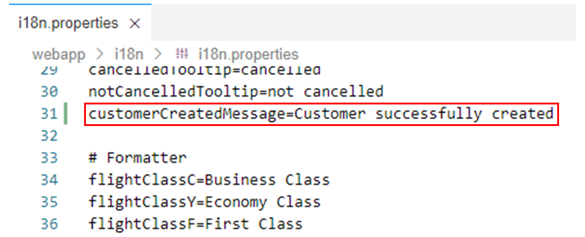
  2. Now open the Overview.controller.js file from the webapp/controller folder in the editor.
  3. The success message created above is to be displayed via a message toast on the UI. For this purpose, add the sap/m/MessageToast module to the dependency array of the view controller and a corresponding parameter named MessageToast to the factory function.
#### Result
The view controller should now look like this: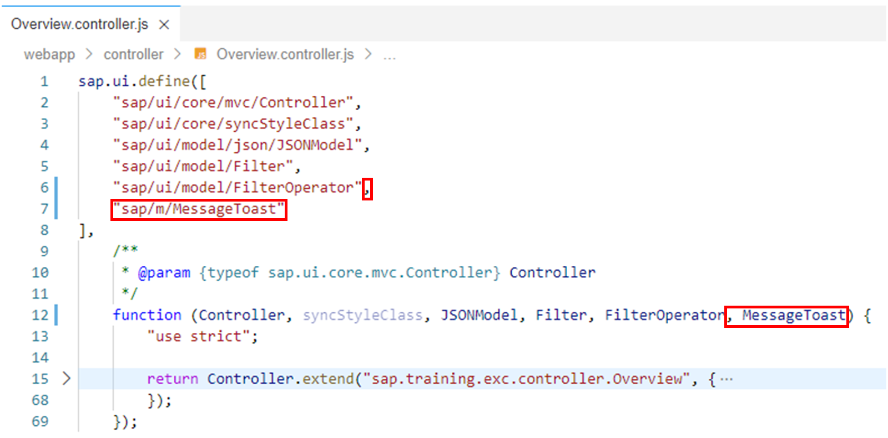
  4. Replace the current implementation of the onSave event handler method with the following coding:
JavaScript
Copy codeSwitch to dark mode

```

123456789101112131415161718

var oModelData = this.getView().getModel("customer").getData();
var oResourceBundle = this.getView().getModel("i18n").getResourceBundle();

if (oModelData.Discount === undefined) { oModelData.Discount = 0; }

this.byId("customerTable").getBinding("items").create({
  "Form": oModelData.Form,
  "CustomerName": oModelData.CustomerName,
  "Discount": oModelData.Discount + "",
  "Street": oModelData.Street,
  "PostCode": oModelData.PostCode,
  "City": oModelData.City,
  "Country": oModelData.Country,
  "Email": oModelData.Email,
  "Telephone": oModelData.Telephone
}).created().then(function () {
  MessageToast.show(oResourceBundle.getText("customerCreatedMessage"));
});

```

Note
The coding creates a new customer entity with the data entered in the form. After the creation is finished, the success message from the resource bundle is displayed as a message toast.
#### Result
The onSave event handler method should now look like this: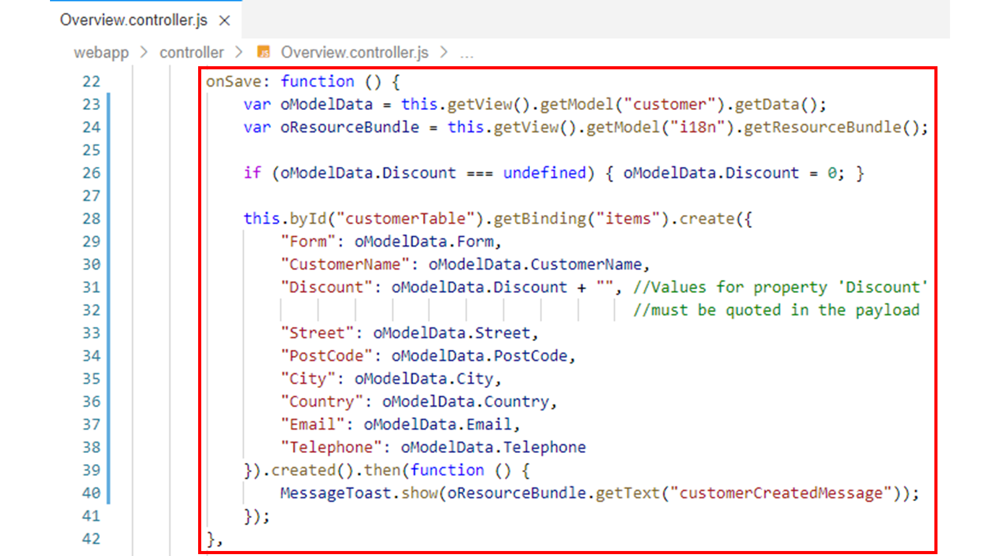
  5. Test run your application by starting it from the SAP Business Application Studio.
Caution
As in the previous exercise, the OData service is not called in the back-end system for testing. Instead, access to the remote system is simulated via a mock server. To do this, use the npm script called **start-mock** to start the application instead of the _start-noflp_ script used previously.
Make sure that when you press the _Create Customer_ button, a new customer is created with the data entered in the form. The success message should appear as a message toast and the customer should be automatically added to the customer table.
Note
Be aware that the customer data is not really persisted via the mock server. That is, if you restart the application, all newly created customers will be lost. (Be also aware that, if you are connected to a back-end system, the data will be persisted in the system.)
    1. Right-click on any subfolder in your _sapui5-development-learning-journey_ project and select _Preview Application_ from the context menu that appears.
    2. Select the npm script named _start-mock_ in the dialog that appears.
    3. In the opened application, check if the component works as expected.

[Continue to quiz](https://learning.sap.com/courses/developing-uis-with-sapui5-1/odata-model)


### Quiz

*Source: https://learning.sap.com/courses/developing-uis-with-sapui5-1/odata-model*

It's time to put what you've learned to the test, get 3 right to pass this unit.
1.
### You develop an SAPUI5 component with an OData v4 model. The entity set UX_Customer from the consumed OData service is displayed on an XML view of this component via a sap.m.Table. Create requests based on the list binding for this table should be sent directly to the server without batch. Which of the following bindings do you use to achieve this?
Choose the correct answer.
<table></table><table></table>
<table></table><table></table>
2.
### What binding mode does the OData v4 model use by default?
Choose the correct answer.
One-time
One-way
Two-way
3.
### Which of the following are valid SAPUI5 Group IDs?
There are two correct answers.
$direct
$api
$batch
$auto
4.
### Which OData versions does SAPUI5 currently support?
There are two correct answers.
OData v1
OData v2
OData v3
OData v4
Submit answers[Next unit](https://learning.sap.com/courses/developing-uis-with-sapui5-1/enabling-the-routing_e04193e3-59fd-4cd9-ae26-68f6ef67af90)


### Routing and Navigation

*Source: https://learning.sap.com/courses/developing-uis-with-sapui5-1/enabling-the-routing_e04193e3-59fd-4cd9-ae26-68f6ef67af90*

Objective
After completing this lesson, you will be able to create an initial routing configuration in the application descriptor
## Routing Overview
SAPUI5 offers hash-based navigation, which allows you to build single-page apps where the navigation is done by changing the hash. In this way, the browser does not have to reload the page.
Hash-based navigation enables bookmarks and deep links to pages inside an app; this means that you can start the app and resume the bookmarked state.
Watch this video to know about the principle of routing.
## Routing Configuration
In the application descriptor, the routing configuration is found in the routing property of the sap.ui5 namespace. It consists of the following three sections: config, routes, and targets.

The config section contains the global router configuration and default values that apply for all routes and targets.
In the example shown, the properties viewType and viewPath are used to specify that by default all views used are of type XML and that the view names used are preceded by the prefix sap.training.exc.view. This means that later, when defining the targets, it is sufficient to specify only _Overview_ as view name, for example, in order to uniquely identify the XML view sap.training.exc.view.Overview as target view.
The routerClass property defines which router is used. The possible values for routerClass are sap.ui.core.routing.Router, sap.m.routing.Router, and any other subclasses of sap.ui.core.routing.Router. Compared to sap.ui.core.routing.Router, the sap.m.routing.Router is optimized for mobile apps because it not only loads the targets and places them in the corresponding container, but also triggers the animations during navigation. The following animations are available, which can be set via the transition property: slide (default), flip, fade, and show
The controlId property determines the control that is used as the parent to insert the target views or components. The controlAggregation property defines the aggregation of that control to which the views or components are added.
The async property defines whether targets are loaded asynchronously.

Each route defines a name, a pattern, and optionally one or more targets to which to navigate when the route has been matched. The pattern is used to determine the browser hash that matches the route. The specified target must be defined in the targets section.
A target defines the view or component that is displayed. It is associated with one or more routes or it can be displayed manually from within the app. Whenever a target is displayed, the corresponding view or component is loaded and added to the specified aggregation (controlAggregation property) of the specified control (controlId property).
Using the viewLevel property of a target, you can define the navigation direction. For example, the navigation from a lower view level to a higher view level leads to forward navigation. This is, for example, important for flip and slide transitions, where the slide animation should go from left to right or vice versa.
In the example shown, a route named overview is defined for which the target named overview is displayed if the browser hash is empty. The overview target loads the XML view sap.training.exc.view.Overview.
## Initializing the Router
The router needs to be initialized by the component. To do this, get a reference to the router in the init method of the Component.js component controller and call the initialize method on it.

After initialization, the routing configuration in manifest.json is automatically enabled in the application: the current URL is evaluated and the corresponding views are automatically displayed.
## Configure the Routing
### Business Scenario
In the following exercises, the scenario is extended by a navigation option: When the user selects a customer in the customer table, a new view with details about the selected customer is to be displayed.
To be able to implement this navigation, you have to adapt the structure of the application: Until now, the component has used the App view as root view, which in turn contains an App UI element in whose pages aggregation the Overview is statically embedded. For navigation, however, the embedding of views in the pages aggregation must be done dynamically. The navigation is implemented in such a way that the views are exchanged in the pages aggregation through the router.
In this exercise, you will first restructure the application so that the Overview view is no longer statically embedded in the pages aggregation of the App UI element, but dynamically via routing configuration. In the following exercises, you will then implement the actual navigation on this basis.
| _Template:_  | Git Repository: <https://github.com/SAP-samples/sapui5-development-learning-journey.git>, Branch: **sol/21_OData_model_(create)**  |
| --- | --- |
| _Model solution:_  | Git Repository: <https://github.com/SAP-samples/sapui5-development-learning-journey.git>, Branch: **sol/22_routing_configuration**  |
### Task 1: Remove the Overview View from the pages Aggregation of the App UI Element
#### Steps
  1. Open the App.view.xml file from the webapp/view folder in the editor.
  2. Delete the following lines in the implementation of the view to remove the static embedding of the Overview view in the pages aggregation of the App UI element:
XML
Copy codeSwitch to dark mode

```

123

<pages>
  <mvc:XMLView viewName="sap.training.exc.view.Overview"/>
</pages>

```

#### Result
The App view should now look like this:
  3. Add the id="app" attribute to the <App> tag to set an Id for the App UI element.
Note
The Id will be used later in the routing configuration to specify the App UI element as the parent to insert views.

#### Result
The App view should now look similar to the following:

### Task 2: Configure the Routing in the Application Descriptor
#### Steps
  1. Open the manifest.json application descriptor from the webapp folder in the editor.
  2. In the application descriptor, look for the routing property in the sap.ui5 namespace:
JSON
Copy codeSwitch to dark mode

```

123456789101112

"routing": {
  "config": {
    "routerClass": "sap.m.routing.Router",
    "viewType": "XML",
    "async": true,
    "viewPath": "sap.training.exc.view",
    "controlAggregation": "pages",
    "controlId": "<...>"
  },
  "routes": [],
  "targets": {}
}

```

Note
The three properties config, routes, and targets in the routing section define the routing and navigation structure of the application.
  3. Replace the "<...>" value of the controlId property with **"app"** , which is the Id assigned above for the App UI element.
Note
According to this configuration, the router will now add views to the pages aggregation of the App UI element.
#### Result
The routing configuration should now look like this:
  4. Now add the following object to the routes array:
JSON
Copy codeSwitch to dark mode

```

1234567

{
  "name": "overview",
  "pattern": "",
  "target": [
    "overview"
  ]
}

```

Note
This defines a route called overview, for which the target named overview is displayed when the hash of the browser is empty. The referenced overview target is defined in the next step.
#### Result
The routing configuration should now look like this:
  5. Finally, add the following property to the targets object:
JSON
Copy codeSwitch to dark mode

```

12345

"overview": {
  "viewId": "overview",
  "viewName": "Overview",
  "viewLevel": 1
}

```

Note
This defines that the overview target referenced above will be used to load the Overview view.

#### Result
The routing configuration should now look like this:

### Task 3: Initialize the Router
#### Steps
  1. Open the Component.js file from the webapp folder in the editor.
  2. Add the following code to the end of the init method of the component controller:
JavaScript
Copy codeSwitch to dark mode

```

12

// enable routing
this.getRouter().initialize();

```

Note
The routing configuration done above causes the router to load the Overview view into the pages aggregation of the App UI element when the hash of the browser is empty. To enable this configuration for the application, the router is initialized here.
#### Result
The initialization method of the component controller should now look like this:
  3. Test run your application by starting it from the SAP Business Application Studio.
Caution
Use the **start-mock** npm script to start the application if you are not connected to the back-end system.
Make sure that the application works unchanged from the user's point of view: The Overview view is displayed in the browser. However, unlike the previous implementation, the Overview view is now embedded in the pages aggregation of the App UI element via routing.
    1. Right-click on any subfolder in your _sapui5-development-learning-journey_ project and select _Preview Application_ from the context menu that appears.
    2. Select the npm script named _start-mock_ in the dialog that appears.
    3. In the opened application, check if the component works as expected.


### Navigating to Routes with Hard-Coded Patterns

*Source: https://learning.sap.com/courses/developing-uis-with-sapui5-1/navigating-to-routes-with-hard-coded-patterns_cdcbec57-0d70-4f27-bc9e-d741721d4ca3*

Objective
After completing this lesson, you will be able to navigate to a route that has a hard-coded pattern
## Hard-Coded Routing Patterns
Whenever a hash is added to a URL, the router checks whether there is a route with a matching pattern. SAPUI5 provides different types of routing patterns for configuring a route.

In the example shown, a route named detail is defined for which the target named detail is displayed, which in turn is used to load a view named Detail.
To define the route, the hard-coded pattern detail is used. This pattern only matches if the hash of the browser is _detail_ and no data is passed on to the events of the route.
## Method for Navigation
Use the router's navTo method to navigate to a specific route by setting the browser's hash accordingly.
To access the router instance from a view controller, you can use the controller's getOwnerComponent method, to get access to the owner component, which provides the getRouter method.
The navTo method has the following parameters:
  * sName - name of the route
  * oParameters (optional) - the parameters for the route
  * oComponentTargetInfo (optional) - information for route name and parameters of the router in nested components
  * bReplace (optional) - if set to true, the hash is replaced, and there will be no entry in the browser history. If set to false (default), the hash is set and the entry is stored in the browser history.

### Accessing the Router Instance and Triggering the Navigation

In the example shown, the navTo method of the router is used in an event handler method of a view controller to navigate to the route named detail. This sets the pattern _detail_ of the detail route (see above) to the browser's hash. SAPUI5 then reacts to the browser's hashchange event to find the route that matches that hash. This results in the target of the detail route - in the end, the Detail view - being displayed in the browser.
## Navigate to a Route with a Hard-Coded Pattern
### Business Scenario
After you have set up the routing for the application in the last exercise, you will now implement a basic navigation based on this.
The ultimate goal is to implement the following scenario: When the user selects an entry in the customer table, they are to be navigated to a view called Detail, which is used to display additional information about the selected customer.
As a first step for the implementation of this scenario, you will set up the basic navigation from the Overview view to the Detail view in this exercise. No customer data will be displayed on the Detail view yet.
| _Template:_  | Git Repository: <https://github.com/SAP-samples/sapui5-development-learning-journey.git>, Branch: **sol/22_routing_configuration**  |
| --- | --- |
| _Model solution:_  | Git Repository: <https://github.com/SAP-samples/sapui5-development-learning-journey.git>, Branch: **sol/23_routing_with_hard-coded_patterns**  |
### Task 1: Implement the Detail View
Note
For simplicity, the project already contains the files Detail.view.xml and Detail.controller.js needed for the implementation of the Detail view. However, there are no UI elements on the view yet and the controller implementation is also still empty. For this exercise, only a Page UI element with a translatable title is needed on the Detail view. You will implement this in the next steps.
#### Steps
  1. Open the i18n.properties resource bundle file from the i18n folder in the editor.
  2. Add the following key-value pair to the i18n.properties file to define a translatable title for the Page UI element to be created in the next step:
JSON
Copy codeSwitch to dark mode

```

12

### Detail View
detailPageTitle=Customer Details

```

#### Result
The i18n.properties resource bundle file should now look like this:
  3. Now open the Detail.view.xml file from the webapp/view folder in the editor.
  4. Add the following code to the view to display a (still empty) page with the title created above:
XML
Copy codeSwitch to dark mode

```

12345

<Page title="{i18n>detailPageTitle}">
  <content>

  </content>
</Page>

```

#### Result
The Detail view should now look like this:

### Task 2: Create the Route and the Target Needed for the Navigation
#### Steps
  1. Open the manifest.json application descriptor from the webapp folder in the editor.
  2. In the application descriptor, find the routing property in the sap.ui5 namespace:
JSON
Copy codeSwitch to dark mode

```

1234567891011121314151617181920212223242526

"routing": {
  "config": {
    "routerClass": "sap.m.routing.Router",
    "viewType": "XML",
    "async": true,
    "viewPath": "sap.training.exc.view",
    "controlAggregation": "pages",
    "controlId": "app"
  },
  "routes": [
    {
      "name": "overview",
      "pattern": "",
      "target": [
        "overview"
      ]
    }
  ],
  "targets": {
    "overview": {
      "viewId": "overview",
      "viewName": "Overview",
      "viewLevel": 1
    }
  }
}

```

  3. Add the following object to the routes array to define a route called detail, for which the target named detail is displayed when the hash of the browser equals detail:
JSON
Copy codeSwitch to dark mode

```

1234567

{
  "name": "detail",
  "pattern": "detail",
  "target": [
    "detail"
  ]
}

```

Note
The referenced detail target is defined in the next step.
#### Result
The routing configuration should now look like this:
  4. Finally, add the following property to the targets object to specify that the detail target referenced above will be used to load the Detail view:
JSON
Copy codeSwitch to dark mode

```

12345

"detail": {
  "viewId": "detail",
  "viewName": "Detail",
  "viewLevel": 2
}

```

#### Result
The routing configuration should now look like this:

### Task 3: Trigger the Navigation when a Customer is Selected
The routing configuration done above causes the router to load the Detail view into the pages aggregation of the App UI element when the hash of the browser equals detail. Therefore, in the following steps, you will set the browser's hash to this value via the navTo method of the router when the user selects a customer from the customer table.
#### Steps
  1. Open the Overview.view.xml file from the webapp/view folder in the editor.
  2. Add the following two attributes to the <ColumnListItem> tag in the customer table:
XML
Copy codeSwitch to dark mode

```

1

type="Navigation" press=".onNavToDetails"

```

Note
The Navigation type indicates that the table rows are navigable to display additional information. When selecting a row, the onNavToDetails event handler method is called, which is implemented in the next step and in which the navigation is triggered.
#### Result
The customer table should now look like this:
  3. Now open the Overview.controller.js file from the webapp/controller folder in the editor.
  4. Add the onNavToDetails event handler method to the view controller as follows to trigger navigation to the Detail view:
JavaScript
Copy codeSwitch to dark mode

```

1234

onNavToDetails: function () {
  var oRouter = this.getOwnerComponent().getRouter();
  oRouter.navTo("detail");
}

```

Note
In the implementation of the method, the router instance is accessed. On it, the navTo method is called to navigate to the detail route specified in the routing configuration. This sets the detail pattern to the browser's hash, which causes the Detail view to be displayed.
#### Result
The view controller should now have the following additional method:
  5. Test run your application by starting it from the SAP Business Application Studio.
Caution
Use the **start-mock** npm script to start the application if you are not connected to the back-end system.
Make sure that the Detail view (which is empty) is displayed when a customer is selected in the customer table.
Note
Please keep in mind that the navigation from the Detail view back to the Overview view is not supported yet. This will be implemented in the next exercise.
    1. Right-click on any subfolder in your _sapui5-development-learning-journey_ project and select _Preview Application_ from the context menu that appears.
    2. Select the npm script named _start-mock_ in the dialog that appears.
    3. In the opened application, check if the component works as expected.


### Routing Back

*Source: https://learning.sap.com/courses/developing-uis-with-sapui5-1/routing-back_c9b9f625-a6c1-4b54-9d32-8196143d5ee5*

Objective
After completing this lesson, you will be able to implement navigation back to an initial page
## Back Navigation
To navigate back in an application, the user can use the browser's native _Back_ button. However, this _Back_ button always uses the browser history for navigating back. This means that if you start the application with a certain hash value in the browser and then press the _Back_ button, the application is exited via this button.

To change this behavior, a separate _Back_ button is implemented for the application in the example shown. In the implementation of the corresponding onNavBack event handler method, the sap/ui/core/routing/History module is used to access the navigation history of the SAPUI5 application. The getPreviousHash method of the history object is employed to check if there is a previous hash value in the app history. If so, the application navigates to this previous hash via the browser's native history API. In this case, the functionality of the app's _Back_ button matches the functionality of the native browser _Back_ button.
However, if there is no previous hash, the application navigates to the route named overview via the router. That is, it navigates to another page within the application, while using the native browser _Back_ button in this case would exit the application.
The second parameter when calling the navTo method is an empty object as no additional parameters are passed to the route. The third parameter has the value true and makes sure that the hash is replaced, so that there will be no entry in the browser history.
## Add Back Navigation
### Business Scenario
In the last exercise, you implemented the navigation from the Overview view to the Detail view. In this exercise, you will set up the corresponding back navigation: from the Detail view to the Overview view.
| _Template:_  | Git Repository: <https://github.com/SAP-samples/sapui5-development-learning-journey.git>, Branch: **sol/23_routing_with_hard-coded_patterns**  |
| --- | --- |
| _Model solution:_  | Git Repository: <https://github.com/SAP-samples/sapui5-development-learning-journey.git>, Branch: **sol/24_back_navigation**  |
### Task 1: Add a Button to the Detail View for Back Navigation
#### Steps
  1. Open the Detail.view.xml file from the webapp/view folder in the editor.
  2. Add the following two attributes to the <Page> tag to display a back button and register an event handler that is called when the back button is pressed:
XML
Copy codeSwitch to dark mode

```

1

showNavButton="true" navButtonPress=".onNavBack"

```

Note
The onNavBack event handler method will be implemented in the following steps.

#### Result
The Detail view should now look like this:

### Task 2: Implement the Button Event Handler in the View Controller
#### Steps
  1. Open the Detail.controller.js file from the webapp/controller folder in the editor.
  2. To manage the navigation history in the implementation of the onNavBack event handler method, add the sap/ui/core/routing/History module to the dependency array of the view controller and a corresponding parameter named History to the factory function.
#### Result
The view controller should now look like this:
  3. Now implement the onNavBack event handler method as follows on the view controller to display the Overview view when the back button is pressed:
JavaScript
Copy codeSwitch to dark mode

```

1234567891011

onNavBack: function () {
  var oHistory = History.getInstance();
  var sPreviousHash = oHistory.getPreviousHash();

  if (sPreviousHash !== undefined) {
    window.history.go(-1);
  } else {
    var oRouter = this.getOwnerComponent().getRouter();
    oRouter.navTo("overview", {}, true);
  }
}

```

Note
In the implementation of the event handler, the browser history is used to return to the previous page if a navigation step has already taken place in the application. If no navigation has yet taken place within the application, the router is used to navigate to the Overview view. That is, even if the application was started directly by calling the Detail view, the back button leads to the Overview view and not to a page outside the application.
#### Result
The view controller should now look like this:
  4. Test run your application by starting it from the SAP Business Application Studio.
Caution
Use the **start-mock** npm script to start the application if you are not connected to the back-end system.
Make sure that it is now possible to navigate back from the Detail view to the Overview view.
    1. Right-click on any subfolder in your _sapui5-development-learning-journey_ project and select _Preview Application_ from the context menu that appears.
    2. Select the npm script named _start-mock_ in the dialog that appears.
    3. In the opened application, check if the component works as expected.


### Catching Invalid Hashes

*Source: https://learning.sap.com/courses/developing-uis-with-sapui5-1/catching-invalid-hashes_a2850f11-106a-4342-bced-05fd82a1610f*

Objective
After completing this lesson, you will be able to display a notification view if a hash is entered for which there is no matching route
## Invalid Hashes
If a user tries to access an invalid pattern that does not match any of the configured routes, they should be notified that something went wrong.

To implement this feature, the bypassed property is available in the routing configuration. Using this property, you specify the navigation target that is used whenever no navigation pattern is matched. If you use this setting, you also have to define a corresponding target in the targets section.

In the example shown, the routing configuration in the application descriptor has been extended by adding the bypassed property. It tells the router to display the notFound target in case no route matches the current hash.
The notFound target is configured in the targets section. It loads the XML view sap.training.exc.view.NotFound without animation (show transition) into the pages aggregation of the UI control with the app Id.
Note
To display routing related error messages on a view, you can use the sap.m.MessagePage control.
## Catch Invalid Hashes
### Business Scenario
In the previous exercises, you configured two routes. Using the configuration you made, the Overview view is displayed if the hash of the browser is empty. In addition, if the hash of the browser equals detail, the Detail view is displayed.
In this exercise, you will implement a view called NotFound, which is to be displayed via appropriate configuration if a hash is entered for which there is no matching route. The NotFound view should display an error message and a link that allows the user to navigate from the NotFound view to the Overview view.
| _Template:_  | Git Repository: <https://github.com/SAP-samples/sapui5-development-learning-journey.git>, Branch: **sol/24_back_navigation**  |
| --- | --- |
| _Model solution:_  | Git Repository: <https://github.com/SAP-samples/sapui5-development-learning-journey.git>, Branch: **sol/25_invalid_hashes**  |
### Task 1: Implement the NotFound View
Note
For simplicity, the project already contains the files NotFound.view.xml and NotFound.controller.js needed for the implementation of the NotFound view. However, there are no UI elements on the view yet and the controller implementation is also still empty.
In this task of the exercise, you will add a MessagePage UI element to the NotFound view with a translatable title and a translatable error message. You will implement this in the next steps.
In the last task of this exercise, you will also add a link to the NotFound view that allows the user to navigate to the Overview view.
#### Steps
  1. Open the i18n.properties resource bundle file from the i18n folder in the editor.
  2. Add the following key-value pairs to the i18n.properties file to define a translatable title and a translatable error message for the MessagePage UI element to be created in the next step:
JSON
Copy codeSwitch to dark mode

```

123

### NotFound View
notFoundPageTitle=Not Found
notFoundPageText=Sorry, but the requested resource is not available.

```

#### Result
The i18n.properties resource bundle file should now look like this:
  3. Open the NotFound.view.xml file from the webapp/view folder in the editor.
  4. Add the following code to the view to display a message page with the title and the text created above:
XML
Copy codeSwitch to dark mode

```

12345

<MessagePage
    title="{i18n>notFoundPageTitle}"
    text="{i18n>notFoundPageText}">

</MessagePage>

```

#### Result
The NotFound view should now look like this:

### Task 2: Configure the Routing for the NotFound View
#### Steps
  1. Open the manifest.json application descriptor from the webapp folder in the editor.
  2. In the application descriptor, find the routing property in the sap.ui5 namespace:
JSON
Copy codeSwitch to dark mode

```

1234567891011121314151617181920212223242526272829303132333435363738

"routing": {
  "config": {
    "routerClass": "sap.m.routing.Router",
    "viewType": "XML",
    "async": true,
    "viewPath": "sap.training.exc.view",
    "controlAggregation": "pages",
    "controlId": "app"
  },
  "routes": [
    {
      "name": "overview",
      "pattern": "",
      "target": [
        "overview"
      ]
    },
    {
      "name": "detail",
      "pattern": "detail",
      "target": [
        "detail"
      ]
    }
  ],
  "targets": {
    "overview": {
      "viewId": "overview",
      "viewName": "Overview",
      "viewLevel": 1
    },
    "detail": {
      "viewId": "detail",
      "viewName": "Detail",
      "viewLevel": 2
    }
  }
}

```

  3. Add the following property to the config section to specify the navigation target that is used whenever no navigation pattern is matched:
JSON
Copy codeSwitch to dark mode

```

12345

"bypassed": {
  "target": [
    "notFound"
  ]
}

```

Note
The referenced notFound target is defined in the next step.
#### Result
The routing configuration should now look like this:
  4. Finally, add the following property to the targets object to specify that the notFound target referenced above will be used to load the NotFound view:
JSON
Copy codeSwitch to dark mode

```

12345

"notFound": {
  "viewId": "notFound",
  "viewName": "NotFound",
  "transition": "show"
}

```

#### Result
The routing configuration should now look like this:

### Task 3: Implement the Navigation from the NotFound View to the Overview View
#### Steps
  1. Add the following key-value pair to the i18n.properties resource bundle file:
JSON
Copy codeSwitch to dark mode

```

1

navToOverviewLinkText=Show Overview Page

```

Note
The key-value pair provides the translatable text for the link on the NotFound view that you will create in the next step. This link will allow the user to navigate from the NotFound view to the Overview view.
#### Result
The i18n.properties resource bundle file should now look like this:
  2. Now add the customDescription aggregation to the <MessagePage> tag on the NotFound view as follows to display a link with the text created above on the page:
XML
Copy codeSwitch to dark mode

```

123

<customDescription>
  <Link text="{i18n>navToOverviewLinkText}" press=".onNavToOverview"/>
</customDescription>

```

Note
The onNavToOverview event handler registered here for pressing the link will be implemented in the next step.
#### Result
The NotFound view should now look like this:

  3. Now open the NotFound.controller.js file from the webapp/controller folder in the editor.
  4. Implement the onNavToOverview event handler method as follows on the NotFound view controller to display the Overview view when the link is pressed:
JavaScript
Copy codeSwitch to dark mode

```

1234

onNavToOverview: function () {
  var oRouter = this.getOwnerComponent().getRouter();
  oRouter.navTo("overview", {}, true);
}

```

#### Result
The view controller should now look like this:
  5. Test run your application by starting it from the SAP Business Application Studio.
Caution
Use the **start-mock** npm script to start the application if you are not connected to the back-end system.
Make sure that the NotFound view is displayed if a hash is entered for which there is no matching route (for example, foo). Also make sure that the user can navigate from the NotFound view to the Overview view via the link displayed there.
    1. Right-click on any subfolder in your _sapui5-development-learning-journey_ project and select _Preview Application_ from the context menu that appears.
    2. Select the npm script named _start-mock_ in the dialog that appears.
    3. In the opened application, check if the component works as expected.


### Navigating to Routes with Mandatory Parameters

*Source: https://learning.sap.com/courses/developing-uis-with-sapui5-1/navigating-to-routes-with-mandatory-parameters_e6978588-dc8c-4e23-8dfe-34edf19b278a*

Objective
After completing this lesson, you will be able to navigate to a route that has a mandatory parameter
## Routes with Mandatory Parameters
Suppose that when the user selects an entity (for example, customer, sales order) on an initial view, the application is to navigate to another view where details about the selected entity are displayed. To implement such a master-detail scenario, you can pass the data of the selected entity (for example, the associated Id) to the detail view via one or more parameters of the route. The parameter(s) can then be used by the detail view to identify the entity and fetch and display additional information.
SAPUI5 supports routes with mandatory and optional parameters, which are both defined in the pattern of a route. You specify a mandatory parameter for the pattern by placing the parameter in curly brackets.

In the example shown, a mandatory parameter named customerId is defined for the detail route. This makes, for example, the hashes detail/5 and detail/(00505604-4e85-1edd-818f-21e64b9cd2cf) match the route, while the hash detail/ does not. The patternMatched event of the route (see the next section) is then passed 5 or (00505604-4e85-1edd-818f-21e64b9cd2cf) as customerId in its arguments parameter.
## Parameter Handling
The parameters of a route are set using the navTo method of the router. After the name of the route to be navigated to, a configuration object with the parameter values for the route is passed to this method as the second parameter.
The router always makes sure that mandatory parameters as specified in the route's pattern are set; otherwise an error is thrown.

In the example shown, the router's navTo method is called in an event handler of the initial view to navigate to the route named detail. This route has the mandatory parameter customerId, which is supplied with a value via the object passed as the second parameter.
In the example, it is omitted how the Id of the customer is determined. For example, it could be obtained via the binding context of the UI element selected by the user.
Using the code shown, the hash of the browser is set to detail/<value of customerId parameter>.
In the view that is being navigated to, the passed customer Id must now be extracted again in order to be able to fetch and display additional information about the customer.

In the example shown, the Route object for the detail route is queried in the onInit initialization method of the detail view controller via the getRoute method of the router. On this object, the attachPatternMatched method is called. This registers the _onObjectMatched method of the view controller to the patternMatched event of the route. That is, the _onObjectMatched method is called if and only if the current URL hash matches the pattern of the route. In this case, the value of the customerId parameter is extracted in the _onObjectMatched method.
The context of the _onObjectMatched event handler method (its this) is bound to the Route object of the detail route by default. Therefore, the attachPatternMatched method is passed the view controller (this) as second parameter to bind the context of the _onObjectMatched method to the view controller. This allows the view controller to be accessed via this in the implementation of the _onObjectMatched method.
The patternMatched event has a parameter called arguments. This parameter is a key-value pair object that contains the parameters defined in the route resolved with the corresponding information from the current URL hash. In the implementation of the _onObjectMatched method, this event parameter is accessed and the value for the customerId parameter is extracted from it.
In the sample code, it is omitted how to proceed with the obtained Id. For example, using this.getView().bindElement(), the binding context of the view could be set to the selected customer to display additional information about it.
## Navigate to a Route with a Mandatory Parameter
### Business Scenario
In the previous exercises, you added navigation from the Overview view to the Detail view to the scenario. So far, however, no customer-specific data is displayed on the Detail view. This will be implemented in this exercise: Additional data for the customer selected on the Overview view is to be displayed on the Detail view.
To do this, you will first add fields for customer-specific data to the UI of the Detail view. Then you will add a mandatory parameter to the detail route and use it to pass the Id of the customer selected on the Overview view to the Detail view during navigation. Finally, you will use the passed Id in the detail view controller to set the binding context for the Detail view. This allows the relative binding paths used on the view to be resolved and the corresponding customer data to be displayed on the view.
| _Template:_  | Git Repository: <https://github.com/SAP-samples/sapui5-development-learning-journey.git>, Branch: **sol/25_invalid_hashes**  |
| --- | --- |
| _Model solution:_  | Git Repository: <https://github.com/SAP-samples/sapui5-development-learning-journey.git>, Branch: **sol/26_routing_with_parameters**  |
### Task 1: Extend the UI of the Detail View
#### Steps
  1. Open the i18n.properties resource bundle file from the i18n folder in the editor.
  2. Add the following key-value pairs to the i18n.properties file to define translatable labels for the customer fields that will be added in the next step:
JSON
Copy codeSwitch to dark mode

```

12345678

customerNumberTitle=Customer Number
streetTitle=Street
postcodeTitle=Post Code
cityTitle=City
countryTitle=Country
emailTitle=Email
phoneTitle=Telephone
discountTitle=Discount

```

#### Result
The i18n.properties resource bundle file should now look like this:
  3. Open the Detail.view.xml file from the webapp/view folder in the editor.
  4. Add the following object header to the content aggregation of the Page UI element to display fields with customer specific data on the view:
XML
Copy codeSwitch to dark mode

```

123456789101112131415161718

<ObjectHeader
  responsive="true"
  fullScreenOptimized="true"
  title="{Form} {CustomerName}">
  <attributes>
    <ObjectAttribute title="{i18n>customerNumberTitle}" text="{CustomerNumber}"/>
    <ObjectAttribute title="{i18n>streetTitle}" text="{Street}"/>
    <ObjectAttribute title="{i18n>postcodeTitle}" text="{PostCode}"/>
    <ObjectAttribute title="{i18n>cityTitle}" text="{City}"/>
    <ObjectAttribute title="{i18n>countryTitle}" text="{Country}"/>
    <ObjectAttribute title="{i18n>emailTitle}" text="{Email}"/>
    <ObjectAttribute title="{i18n>phoneTitle}" text="{Telephone}"/>
    <ObjectAttribute title="{i18n>discountTitle}" text="{ path: 'Discount',
                                                          type: 'sap.ui.model.type.Float',
                                                          formatOptions: {minFractionDigits: 2, maxFractionDigits: 2}
                                                         } %"/>
  </attributes>
</ObjectHeader>

```

Note
Relative paths are used here for binding the customer fields. As long as the context for this binding is not set, these paths cannot be resolved and hence no data can be displayed. In the next steps, you will therefore provide the corresponding binding context.

#### Result
The Detail view should now look like this:

### Task 2: Pass the Id of the Customer Selected on the Overview View to the Detail View via a Mandatory Parameter of the detail Route
#### Steps
  1. Open the manifest.json application descriptor from the webapp folder in the editor.
  2. In the application descriptor, find the routes property in the routing configuration section of the sap.ui5 namespace:
JSON
Copy codeSwitch to dark mode

```

12345678910111213141516

"routes": [
  {
    "name": "overview",
    "pattern": "",
    "target": [
      "overview"
    ]
  },
  {
    "name": "detail",
    "pattern": "detail",
    "target": [
      "detail"
    ]
  }
]

```

  3. Change the value of the pattern property in the detail route to the following new value:
JSON
Copy codeSwitch to dark mode

```

1

"pattern": "detail/{customerId}"

```

Note
With this, you add a mandatory parameter called customerId to the detail route. This parameter is used in the next step to pass the Id of the customer selected in the customer table on the Overview view to the Detail view.
#### Result
The routing configuration should now look like this:
  4. Open the Overview.controller.js file from the webapp/controller folder in the editor.
  5. Modify the implementation of the onNavToDetails event handler in the view controller as follows to trigger navigation to the Detail view and fill the customerId parameter of the detail route defined above with the Id of the selected customer:
JavaScript
Copy codeSwitch to dark mode

```

123456789

onNavToDetails: function (oEvent) {
  var oItem = oEvent.getSource();
  var oRouter = this.getOwnerComponent().getRouter();

  oRouter.navTo("detail", {
    customerId: oItem.getBindingContext().getPath().substring("/UX_Customer".length)
  });
}

```

Note
The oEvent parameter added to the onNavToDetails event handler is used to query the control that triggered the press event. The getSource method returns the ColumnListItem object from the customer table that was selected by the user. This item is used to get the Id of the associated customer by means of the binding. The obtained Id is then set for the customerId parameter of the detail route.
For example, the method oItem.getBindingContext().getPath() returns the value /UX_Customer(00505604-4e85-1edd-818f-21e64b9cd2cf) for the customer _SAP SE_. The substring method removes /UX_Customer from this string and sets (00505604-4e85-1edd-818f-21e64b9cd2cf) as the value for the customerId parameter. In this way, the hash of the browser is set to detail/(00505604-4e85-1edd-818f-21e64b9cd2cf).

#### Result
The onNavToDetails event handler method should now look like this:

### Task 3: Use the Customer Id Passed via Routing in the Detail View Controller to Set the Binding Context for the Detail View
#### Steps
  1. Open the Detail.controller.js file from the webapp/controller folder in the editor.
  2. Implement the onInit initialization method of the view controller as follows to register the _onObjectMatched method as an event handler for the patternMatched event of the detail route:
JavaScript
Copy codeSwitch to dark mode

```

1234

onInit: function () {
  var oRouter = this.getOwnerComponent().getRouter();
  oRouter.getRoute("detail").attachPatternMatched(this._onObjectMatched, this);
}

```

Note
The _onObjectMatched method will be implemented in the next step. By registering it here, it will be called automatically when the current URL hash matches the pattern of the detail route.
#### Result
The view controller should now look like this:
  3. Implement the _onObjectMatched method as follows to set the context for the bindings on the Detail view:
JavaScript
Copy codeSwitch to dark mode

```

123

_onObjectMatched: function (oEvent) {
  this.getView().bindElement("/UX_Customer" + oEvent.getParameter("arguments").customerId);
}

```

Note
The oEvent parameter of the _onObjectMatched event handler method is used to query the value set in the Overview view controller for the customerId parameter of the detail route (for example, (00505604-4e85-1edd-818f-21e64b9cd2cf)). From this, the binding path for the corresponding customer is created (for example, /UX_Customer(00505604-4e85-1edd-818f-21e64b9cd2cf)) and this is set as the binding context for the Detail view via the bindElement method. Now all relative bindings on the Detail view can be resolved and the corresponding customer data can be displayed on the view.
#### Result
The view controller should now look like this:
  4. Test run your application by starting it from the SAP Business Application Studio.
Caution
Use the **start-mock** npm script to start the application if you are not connected to the back-end system..
Make sure that the Detail view now displays data of the customer selected in the table on the Overview view.
    1. Right-click on any subfolder in your _sapui5-development-learning-journey_ project and select _Preview Application_ from the context menu that appears.
    2. Select the npm script named _start-mock_ in the dialog that appears.
    3. In the opened application, check if the component works as expected.

[Continue to quiz](https://learning.sap.com/courses/developing-uis-with-sapui5-1/routing-and-navigation)


### Quiz

*Source: https://learning.sap.com/courses/developing-uis-with-sapui5-1/routing-and-navigation*

It's time to put what you've learned to the test, get 5 right to pass this unit.
1.
### You have created a Back button on a view and call the getPreviousHash method of the sap.ui.core.routing.History instance in the implementation of the attached event handler. What value does this method return if there has been no navigation in the application yet?
Choose the correct answer.
"" (empty string)
null
undefined
The pattern from the routing configuration that was assigned to the root view of the component.
2.
### You have specified "detail/{customerId}" in the routing configuration as the value for the pattern property of a route. Which of the following URL hashes match this pattern of the route and therefore result in the patternMatched event being fired?
There are four correct answers.
detail
detail/
detail/456
detail/(00505604-4e85-1edd-818f-21e64b9cd2cf)
detail/abc
/detail/456
detail/456/Orders
3.
### In the application descriptor manifest.json the routing configuration can be found in the routing property of the sap.ui5 namespace. What are the sections that make up this routing configuration?
There are three correct answers.
router
targets
config
hashes
routes
4.
### The router provides a method to navigate to a specific route. What is the name of this method?
Choose the correct answer.
display
goTo
navTo
setRoute
5.
### In the routing configuration, one or more targets can be specified to be displayed if no route of the router matches after changing the hash. What is the name of the property used to specify the corresponding targets?
Choose the correct answer.
bypassed
invalidHash
defaultTarget
noMatch
6.
### The component controller Component.js has a method called init in which initializations necessary for the component are implemented. Which of the following method calls must be added to this init method so that the current URL hash is evaluated and the corresponding views are automatically displayed?
Choose the correct answer.
this.getRouter().initialize();
this.getRouter().setup();
this.getRouter().init();
this.getRouter().registerRoutes();
Submit answers[Go to Course](https://learning.sap.com/courses/developing-uis-with-sapui5-1)
