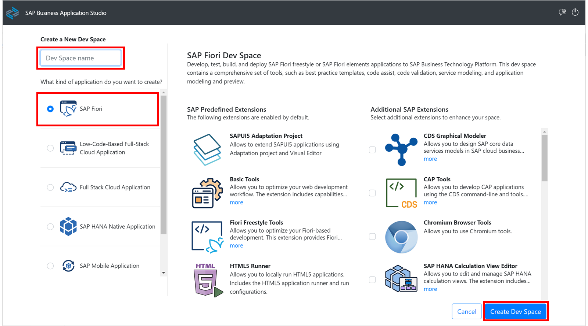
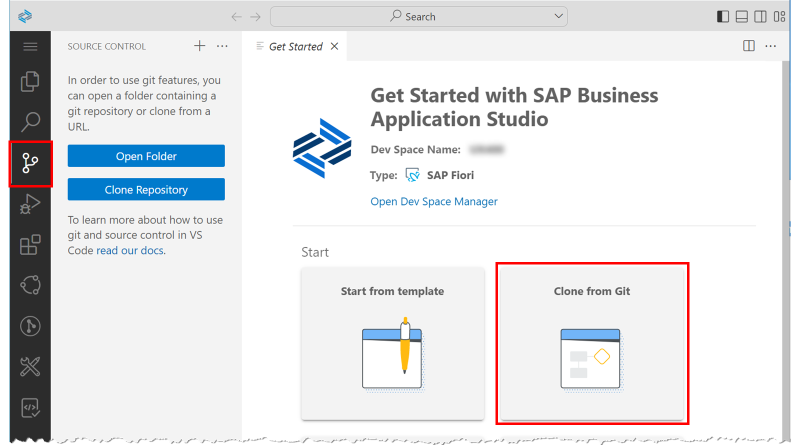
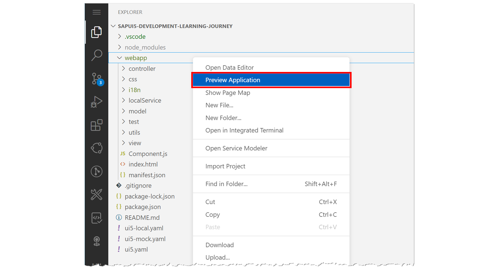
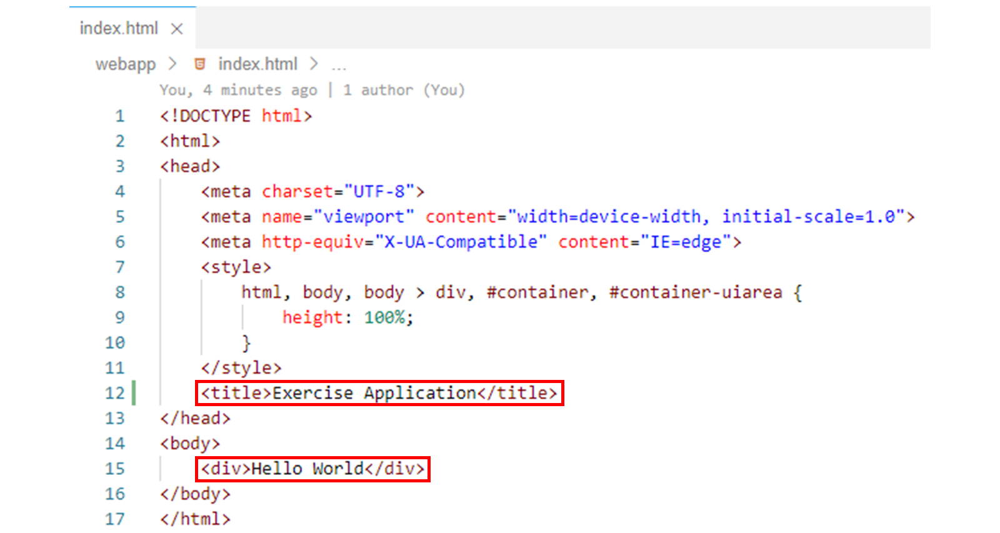

# Start learning

*Source: https://learning.sap.com/courses/developing-uis-with-sapui5-1/getting-started-with-sapui5-development_b2b142f9-fb05-4a51-bdae-a107ab360021*

Objective
After completing this lesson, you will be able to set up SAP Business Application Studio
## Working with SAP Business Application Studio
### Dev Spaces
The following units and lessons discuss the basic concepts of SAPUI5 development. To deepen the individual learning contents, there are always exercises with practical programming tasks at the end of the respective topics. In these exercises, a complex scenario is built up step by step. The simple _Hello World_ application that is created at the beginning will be expanded throughout the course into a comprehensive application that incorporates all the concepts discussed such as models, data binding, internationalization, and navigation.

The exercises will be implemented in the SAP Business Application Studio. To do this, a dev space will first be created (see the figure, _Creating a Dev Space_).
A dev space is a development environment containing the tools, capabilities, and resources you need to develop your application in SAP Business Application Studio.
There are different dev space types available. For the exercise scenario, a dev space of type SAP Fiori is required. It is designed to develop SAP Fiori applications based on various environments, including Cloud Foundry, ABAP Cloud, and SAP S/4HANA. A dev space of type SAP Fiori contains, among other things, the SAP Fiori Tools extension, which includes the templates, CLI, and code completion needed to create SAP Fiori applications.
### Git Source Control
In SAP Business Application Studio, you can create projects from scratch using the project wizard, or import existing projects from the file system.
In addition, SAP Business Application Studio enables you to connect to the Git source control system and interact with Git remote repositories.
Note
It is recommended to always connect your projects to a Git repository for long-term persistence.
For detailed information on working with Git, see the SAP Business Application Studio documentation.
All Git tasks can be performed using the terminal in SAP Business Application Studio. To open a terminal, select the path _Terminal_ → _New Terminal_ from the hamburger menu in the upper-left corner.

In addition to the terminal, SAP Business Application Studio also provides a Git source control view to execute Git commands through a graphical user interface (see the figure, _Cloning Repositories_).
For the exercise scenario to be implemented in the training course, you will not create a new project from scratch using one of the available project templates in SAP Business Application Studio. Instead, for simplicity, the starting point for the exercises will be provided via a Git remote repository that you will clone at the beginning.
You can clone the source project, for example, via the Git source control view or via the _Clone from Git_ tile on the _Get Started_ page (see the figure, _Cloning Repositories_).
The main branch of the remote repository to be cloned contains the starting point for the exercise scenario. For each exercise, the remote repository also contains an additional branch with the sample solution for the exercise. The names of the branches can be found at the beginning of each exercise.
If you want to skip an exercise while working through the exercise scenario, you can use the associated sample solution branch as the basis for the subsequent exercise.
### Previewing an Application
Once you have finished coding, several options to preview an application are available in SAP Business Application Studio.
You can start a preview by running npm scripts from the terminal or by using the Run Control function in the _Run and Debug_ pane.
In addition to the predefined Launch Configurations found in the _Run and Debug_ pane, you can also create additional Launch Configurations from there that define how your project is executed.

It is also possible to start a preview from the context menu. Right-click on any subfolder in your project and select _Preview Application_ from the context menu that appears (see the figure, _Starting a Preview from Context Menu_). You are then provided with the following options, among others:
  * start-noflp
This starts the application via the HTML page index.html. The application is not embedded in an SAP Fiori launchpad sandbox.
  * start-mock
This starts the application by using a mock server to reflect an OData endpoint. This way, you can test an application without connecting to a live OData service.

In the training course, the exercises are initially tested using the start-noflp option. Later, an OData model is integrated into the scenario, which is used to call an OData service that is implemented in an ABAP back-end. Since this ABAP back-end cannot be made available for the course, the start-mock option is used to test the OData model. The start-mock option simulates access to the back-end data.
## Output 'Hello World' via an HTML Page in a Prepared SAPUI5 Project
### Business Scenario
In this exercise, you first create a _dev space_ for the SAP Business Application Studio. Then, you clone a prepared SAPUI5 project from a Git repository into this _dev space_. Finally, you adapt the HTML page from the copied SAPUI5 project to output **Hello World** in the browser.
| _Template:_  | Git Repository: <https://github.com/SAP-samples/sapui5-development-learning-journey.git>, Branch: **main**  |
| --- | --- |
| _Model solution:_  | Git Repository: <https://github.com/SAP-samples/sapui5-development-learning-journey.git>, Branch: **sol/1_hello_world**  |
Note
In the following exercises, SAP Business Application Studio is used as the development environment. It is assumed that you already have access to this development tool.
If this is not yet the case, you can gain access to the SAP Business Application Studio free of charge via the free tier model for SAP Business Technology Platform (SAP BTP). To do this, read tutorial [Get an Account on SAP BTP to Try Out Free Tier Service Plans](https://developers.sap.com/tutorials/btp-free-tier-account.html) on how to create a free account on SAP BTP. Based on this, video [SAP Business Application Studio Free Tier Model Onboarding](https://www.youtube.com/watch?v=-g7LZHqcbDQ) shows the necessary steps to set up the free tier plan for SAP Business Application Studio.
### Task 1: Create an SAP Fiori Dev Space
#### Steps
  1. If not already done, start the SAP Business Application Studio.
  2. Create an _SAP Fiori dev space_ with the name **UX400**.
    1. Choose _Create Dev Space_.
    2. Enter **UX400** as _Dev Space name_.
    3. Choose **SAP Fiori** as the application type.
    4. Choose the _Create Dev Space_ button.
  3. Open your SAP Fiori dev space _UX400_.
Note
Immediately after creation, the new dev space is in the state STARTING. You must wait until it is in the state RUNNING before you can open it. This may take some time.
After a period of idle time, the dev space is automatically stopped. A stopped dev space can be restarted with the dev space manager.
    1. Click the name _UX400_ of the new dev space as soon as it is in the state RUNNING.
#### Result
The SAP Fiori dev space _UX400_ opens and the _Get Started_ page appears.

### Task 2: Clone a Prepared SAPUI5 Project
#### Steps
  1. Clone the prepared SAPUI5 project from Git using the following URL: <https://github.com/SAP-samples/sapui5-development-learning-journey.git>.
    1. In SAP Business Application Studio, click the _Clone from Git_ tile on the _Get Started_ page.
Note
If the _Get Started_ page is not displayed, it can be opened using the following menu path: _Help_ → _Get Started_.
    2. In the _Provide repository URL_ field that appears, type <https://github.com/SAP-samples/sapui5-development-learning-journey.git> and press _Enter_.
#### Result
A copy of the specified Git repository is created for use in SAP Business Application Studio.
    3. To open the _sapui5-development-learning-journey_ project you just created, Select _Open_ in the pop-up.
#### Result
The _sapui5-development-learning-journey_ project opens in SAP Business Application Studio.
  2. Download the required project dependencies using command **npm install**.
    1. Select _Terminal_ → _New Terminal_ from the SAP Business Application Studio menu.
    2. In the terminal window that appears, type **npm install** and press _Enter_ :
Code snippet
Copy code

```

```

#### Result
The required project dependencies are downloaded to a folder named _node_modules_ in the project directory.

### Task 3: Output 'Hello World' via the index.html Page in the Prepared SAPUI5 Project
#### Steps
  1. Open the _index.html_ page in the editor.
    1. In the _Explorer_ view of the SAP Business Application Studio, double-click _webapp_ → _index.html_ in the project structure of the _sapui5-development-learning-journey_ project.
#### Result
The _index.html_ page opens in an editor window.
  2. Add a <title> tag as a child to the <head> tag and use it to set the title of the HTML page to **Exercise Application**.
Further, add a <div> tag as a child to the <body> tag and output **Hello World** over it on the HTML page.
    1. The _index.html_ page should now look like this:

  3. Test run your application by starting it from the SAP Business Application Studio.
    1. Right-click on any subfolder in your _sapui5-development-learning-journey_ project and select _Preview Application_ from the context menu that appears.
    2. Select the npm script named _start-noflp_ in the dialog that appears.
#### Result
The application will now display in a new tab.
Hint
If the application does not appear in a new tab, please check your pop-up blocker settings.
    3. In the opened application, check if the adjustments you made to the _index.html_ page are displayed.
