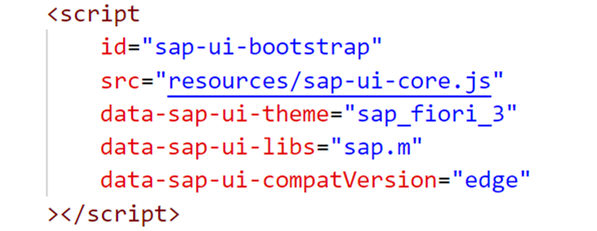
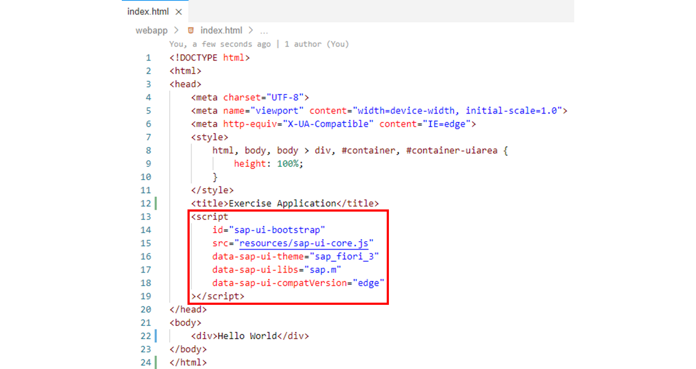
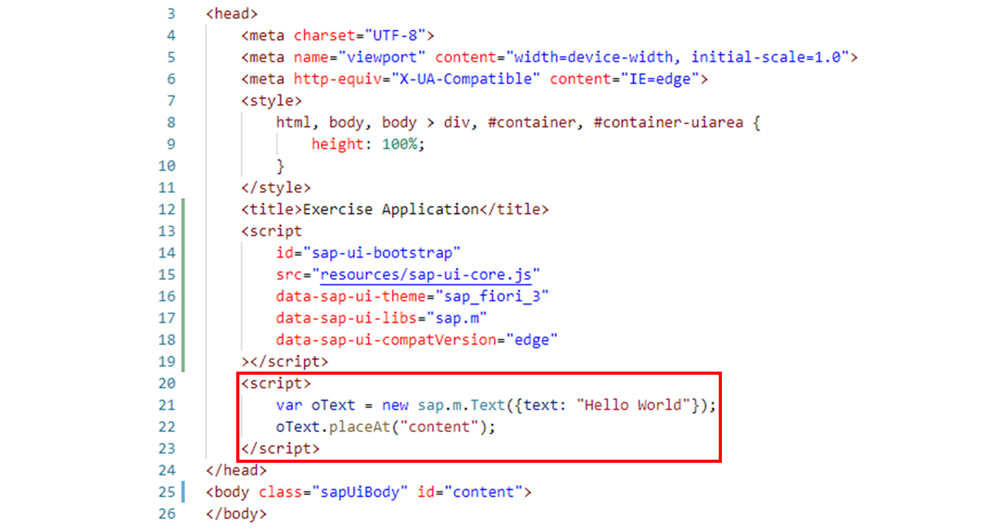

# Bootstrapping SAPUI5

*Source: https://learning.sap.com/courses/developing-uis-with-sapui5-1/bootstrapping-sapui5_a5b2d3e2-530e-4a47-9756-321b5edf152a*

Objective
After completing this lesson, you will be able to load and initialize the SAPUI5 library to use SAPUI5 features
## Bootstrapping
### Standard Bootstrap File
To use SAPUI5, you must load and initialize the SAPUI5 library.

The figure, _Bootstrapping SAPUI5_ , shows a typical bootstrap script tag used to load the sap-ui-core.js file. When this script tag is included in a page, the SAPUI5 runtime will automatically be initialized as soon as the script is loaded and executed by the browser.
Note
If you run your application standalone, the bootstrap script is added to your HTML page. In an SAP Fiori launchpad environment, the launchpad executes the bootstrap and no additional HTML page is needed to display the application.
SAPUI5 provides several bootstrap files for different use cases. sap-ui-core.js is the standard bootstrap file, which is recommended to use for typical use cases. It already contains jQuery, jquery-ui-position and only the minimum required parts of the core library (sap.ui.core).
### Load Options
SAPUI5 can either be loaded locally with a relative path from an SAP Web server (see the figure, _Bootstrapping SAPUI5_) or externally from a Content Delivery Network (CDN).
You can point to a specific version in a CDN, which allows you to select a fixed version for bootstrapping. To do this, assign a versioned URL like the following to the src attribute in the bootstrap script:
XML
Copy codeSwitch to dark mode

```

1

https://ui5.sap.com/1.96.16/resources/sap-ui-core.js

```

The segment of the URL after the host name is used to specify the desired version.
Alternatively, you can use the default version of the SAPUI5 libraries which has the following generic URL:
Code Snippet
Copy codeSwitch to dark mode

```

1

https://ui5.sap.com/resources/sap-ui-core.js

```

Caution
The default version is constantly being upgraded and this might have an impact on the stability of your application. Use this version for testing purposes only.
### Configuration Options
The SAPUI5 runtime can be configured using so-called configuration options. The complete list of configuration options available in SAPUI5 can be found in the [API Reference](https://ui5.sap.com/#/api) in the _Demo Kit_ under sap.ui.core.Configuration.
SAPUI5 supports different possibilities to provide values for the available configuration options. Among other things, configuration options can be set via the bootstrap script tag. For this purpose, attributes are added to the script tag whose names are composed of the name of the respective configuration option and the prefix data-sap-ui-.
In the script tag in the figure, _Bootstrapping SAPUI5_ , the following configuration options are used:
  * theme
The configuration option theme defines the theme that shall be used.
  * libs
The configuration option libs defines a list of libraries that shall be loaded initially.
Note
An SAPUI5 library bundles a set of controls and related types. There are predefined standard libraries, such as sap.m and sap.ui.layout.
  * compatVersion
Applications must set this configuration option to edge. Other version definitions are deprecated. This ensures that the latest SAPUI5 features are used.

## Application Script
The bootstrap script can be followed by an application script that is used to implement the SAPUI5 application. In the application script, controls such as buttons or input UI elements can be created.
Watch the video to learn how to add a Text UI element to the HTML page via an application script.
Settings
## Bootstrap SAPUI5
### Business Scenario
In the last exercise, you output **Hello World** via a <div> tag on an HTML page, for which SAPUI5 has not yet been used. In this exercise, you will now load SAPUI5 into the browser and initialize it. Then you will display **Hello World** on the HTML page using the SAPUI5 UI element sap.m.Text.
| _Template:_  | Git Repository: <https://github.com/SAP-samples/sapui5-development-learning-journey.git>, Branch: **sol/1_hello_world**  |
| --- | --- |
| _Model solution:_  | Git Repository: <https://github.com/SAP-samples/sapui5-development-learning-journey.git>, Branch: **sol/2_bootstrapping**  |
### Task 1: Add a Bootstrap Script
#### Steps
  1. Make sure that the _index.html_ file is open in the editor.
    1. To open the _index.html_ file in the editor, proceed as follows: In the _Explorer_ view of the SAP Business Application Studio, double-click _webapp_ → _index.html_ in the project structure of the _sapui5-development-learning-journey_ project.
  2. Add the following <script> tag as a child to the <head> tag to load and initialize SAPUI5:
JavaScript
Copy codeSwitch to dark mode

```

1234567

<script
  id="sap-ui-bootstrap"
  src="resources/sap-ui-core.js"
  data-sap-ui-theme="sap_fiori_3"
  data-sap-ui-libs="sap.m"
  data-sap-ui-compatVersion="edge"
></script>

```

Note
The src attribute of the <script> tag tells the browser where to find the SAPUI5 core library – it initializes the SAPUI5 runtime and loads additional resources, such as the sap.m library that is specified in the data-sap-ui-libs attribute and that contains the UI controls needed for the application.
In addition, sap_fiori_3 is set as default theme and the compatibility version is defined as edge to make use of the most recent functionality of SAPUI5.
    1. Make sure that the _index.html_ page now looks like this:


### Task 2: Add a Text UI Element
#### Steps
  1. Delete the _Hello World_ <div> tag you created in the previous exercise from the <body> of the HTML page.
    1. The <body> of the HTML page should now be empty again:
Code Snippet
Copy codeSwitch to dark mode

```

12

<body>
</body>

```

  2. Add the class="sapUiBody" and id="content" attributes to the <body> tag.
Note
The class sapUiBody adds additional theme-dependent styles for displaying SAPUI5 apps.
    1. The <body> tag should now look like this:
Code Snippet
Copy codeSwitch to dark mode

```

12

<body >
</body>

```

  3. Now create a sap.m.Text UI element with the text **Hello Word** and place it in the _< body>_ of the HTML page using the id of the <body>. For this purpose, create the following <script> tag as another child of the <head> tag directly behind the bootstrap script created above:
JavaScript
Copy codeSwitch to dark mode

```

1234

<script>
  var oText = new sap.m.Text({text: "Hello World"});
  oText.placeAt("content");
</script>

```

    1. The <head> and <body> of the HTML page should now look like this:

  4. Test run your application by starting it from the SAP Business Application Studio.
    1. Right-click on any subfolder in your _sapui5-development-learning-journey_ project and select _Preview Application_ from the context menu that appears.
    2. Select the npm script named _start-noflp_ in the dialog that appears.
#### Result
The application now displays in a new tab.
Hint
If the application does not appear in a new tab, please check your pop-up blocker settings.
    3. In the opened application, check if the **Hello World** text of the sap.m.Text UI element is displayed on the HTML page.

[Continue to quiz](https://learning.sap.com/courses/developing-uis-with-sapui5-1/loading-and-initializing-sapui5)
