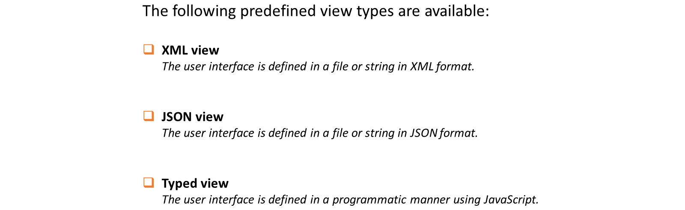
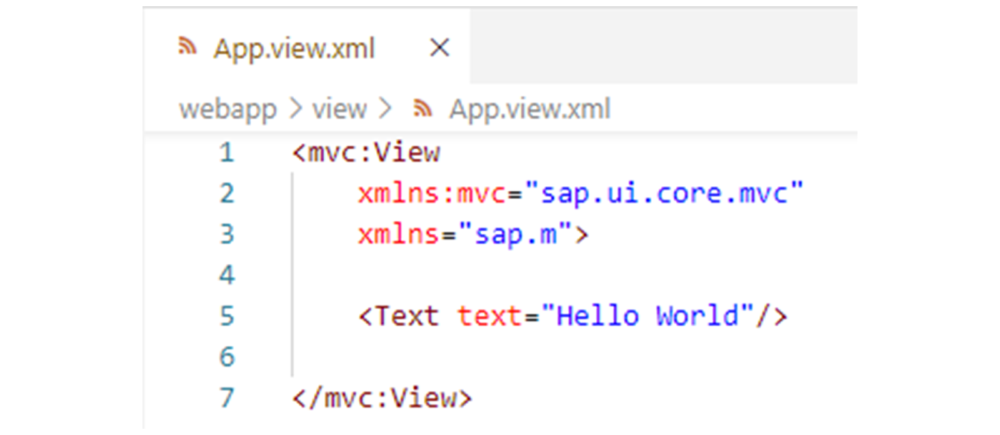
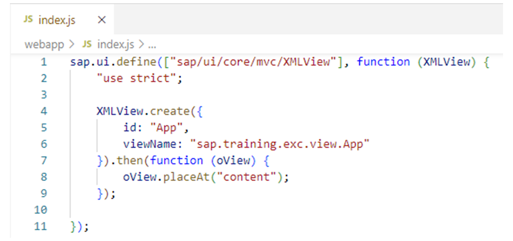
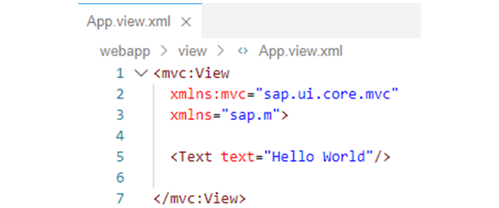
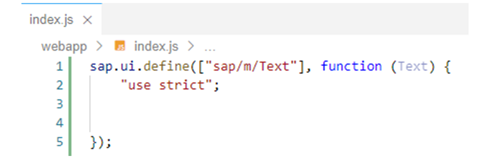
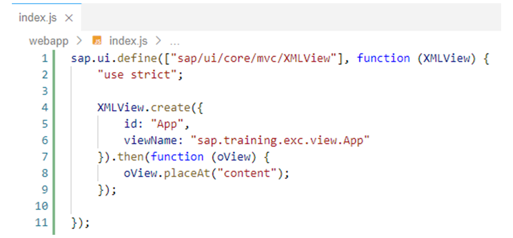

# Working with Views and Controllers

*Source: https://learning.sap.com/courses/developing-uis-with-sapui5-1/working-with-xml-views_dfec8eb9-8b04-46b3-84fb-58a0ce10a22b*

Objective
After completing this lesson, you will be able to create and use XML views
## Model View Controller (MVC)
The Model View Controller (MVC) concept is used in SAPUI5 to separate the presentation of information from user interaction. This separation facilitates the development and modification of an application.
Watch the video to understand the roles assigned to model, view, and controller in MVC.
The relationship between views and models will be covered later in the course.
## View Types
For the implementation of views, SAPUI5 provides predefined view types.
These are listed in the figure _Supported View Types_.

XML views and JSON views are declarative views in which the UI is described in XML format or JSON format. The implementation is done in a file or as an XML or JSON string.
A typed view, on the other hand, is implemented programmatically using JavaScript. This means that the view is defined using a separate view class.
Note
It is recommended to use XML views because XML views enforce a clear separation of the UI definition from the application logic (which must be implemented in the controller). This makes the code more readable and easier to support.
Therefore, this training course focuses exclusively on XML views, which are used throughout the examples and exercises. For information on JSON views and typed views, see the documentation.
## XML Views
### View Names
If you define an XML view using an XML string, no file is required.
If, on the other hand, you define an XML view in a file, which is more common, the file name ends with .view.xml. For example, in the figure, _Simple XML View_ , the file name is App.view.xml.

Typically, views are stored in the view folder of the project structure. The file name together with the location of the file in the project structure and the module Id prefix determine the name of the view. This view name corresponds to the SAPUI5 module name, via which the view can later be loaded and instantiated (see below).
**Example**
Suppose in the index.html file of the project, the following attribute is specified in the bootstrap script:
XML
Copy codeSwitch to dark mode

```

1

data-sap-ui-resourceroots='{"sap.training.exc": "./"}'

```

This registers the webapp folder of the project as a resource location, which is assigned to the module Id prefix sap.training.exc. If the App.view.xml file shown in the figure is now stored in the webapp/view folder of the project, this results in the following view name:
Code Snippet
Copy codeSwitch to dark mode

```

1

sap.training.exc.view.App

```

The prefix sap.training.exc of this view name refers to the webapp folder. The view segment following sap.training.exc specifies the view subfolder as the location of the file, and the last segment in the view name represents the file name, whereby the suffix .view.xml is automatically added later when the view is loaded by SAPUI5.
### View Implementation
Each control used in an XML view is represented by an XML tag with the name of the control.
The <View> tag is used as the root node in an XML view. This tag corresponds to the sap.ui.core.mvc.View control. The names of the SAPUI5 control libraries used in the view and the corresponding subpackages are thereby mapped to XML namespaces via xmlns attributes of the <View> tag.
Note
A control can be in a subpackage of a control library. For example, sap.ui.core.mvc.View is in the sap.ui.core library, but the full package name is sap.ui.core.mvc. You must specify this subpackage as an XML namespace even if sap.ui.core were already defined as a namespace.
In the example shown, two namespace mappings are required: View comes from the package sap.ui.core.mvc, and the Text control used comes from the sap.m library (compare the _API Reference_ in the _Demo Kit_).
The sap.ui.core.mvc namespace is defined with the alias mvc, so the <View> tag is prefixed with this mvc alias.
Note
Technically, you can define any alias for a namespace. However, the convention is to use the last part of the package name (that is,mvc in the example).
One of the required namespaces can be defined as the default namespace (xmlns="..."). The control tags for this namespace then do not need a prefix.
In the example, a sap.m.Text control is placed on the view. The <Text> tag used for this does not contain a prefix, because the sap.m library is mapped to the default namespace.
Property values for controls in XML views are specified as attributes of the XML tag of the control. The name of the attribute corresponds to the name of the property. For example, the text property of a sap.m.Text control is specified as text="value".
Note
The names of the properties available for a control can be looked up in the _API Reference_. They are listed there for the corresponding control in the _Properties_ section. The existing properties are also displayed in the SAP Business Application Studio using the _Auto Completion_ functionality in the editor.
## View Instantiation
To instantiate an XML view, SAPUI5 provides the factory method create in the class sap.ui.core.mvc.XMLView. In the example shown in the figure _Instantiating an XML View_ , the module in which the XML view is created is therefore dependent on the sap/ui/core/mvc/XMLView module.

The create method is passed an object with the required configuration options. A complete list of all available options can be found in the _API Reference_ in the _Demo Kit_.
In the example shown, the following two properties are used:
  * id
The id property can be used to specify an Id for the view instance. If the id property is not passed, an Id will be generated by SAPUI5.
  * viewName
The viewName property is used to pass the name of the XML view to be loaded (see above). As discussed, the file suffix .view.xml is automatically added by SAPUI5.

The create method loads views asynchronously via the module system. The advantage of asynchronous loading over synchronous loading is that the UI does not freeze for the duration of the loading process and the functionalities are not blocked during view initialization.
Since the loading process is asynchronous, the create method does not return the view instance itself, but a Promise that resolves with the view instance.
Therefore, on the returned Promise, as shown in the example, call the then method to register a callback function for the success case. This function is called as soon as the view instance is available, and the instance is passed to it via the interface (oView).
In the implementation of the callback function, the view instance can be added to a UI area by calling the placeAt method.
## Create and Use an XML View
### Business Scenario
In this exercise, you will create an XML view with a **Hello World** Text UI element. Then you delete the code that creates a **Hello World** Text UI element and places it on the HTML page in the module you created in the previous exercise. Instead, you will instantiate the XML view there and place it on the HTML page.
| _Template:_  | Git Repository: <https://github.com/SAP-samples/sapui5-development-learning-journey.git>, Branch: **sol/3_modules**  |
| --- | --- |
| _Model solution:_  | Git Repository: <https://github.com/SAP-samples/sapui5-development-learning-journey.git>, Branch: **sol/4_views**  |
### Task 1: Implement an XML View
#### Steps
  1. Create a new file named App.view.xml in the subfolder view of the webapp folder.
    1. Open the context menu for the webapp/view folder in the project structure.
    2. Select _New File_.
    3. In the field that appears, type **App.view.xml** and press _Enter_.
#### Result
The App.view.xml file is created and displays in the editor.
  2. Add the following code to the App.view.xml file to define an XML view with a **Hello World** Text UI element:
XML
Copy codeSwitch to dark mode

```

1234567

<mvc:View 
  xmlns:mvc="sap.ui.core.mvc"
  xmlns="sap.m">

  <Text text="Hello World"/>

</mvc:View>

```

#### Result
The XML view should be implemented as follows:

### Task 2: Instantiate the XML View
#### Steps
  1. Make sure the index.js module is open in the editor.
  2. Delete the code that creates a **Hello World** Text UI element and places it on the HTML page in the index.js module.
    1. Delete the following line:
JavaScript
Copy codeSwitch to dark mode

```

1

new Text({ text: "Hello World" }).placeAt("content");

```

#### Result
The index.js module should now look like this:
  3. Modify the implementation of the index.js module as follows to instantiate the XML view created above and place it on the HTML page:
JavaScript
Copy codeSwitch to dark mode

```

1234567891011

sap.ui.define(["sap/ui/core/mvc/XMLView"], function (XMLView) {
  "use strict";

  XMLView.create({
    id: "App",
    viewName: "sap.training.exc.view.App"
  }).then(function (oView) {
    oView.placeAt("content");
  });

});

```

Note
Pay attention to the changed dependency array and parameter of the factory function. index.js now depends on sap/ui/core/mvc/XMLView instead of sap/m/Text.
#### Result
The index.js file should be implemented as follows:
  4. Test run your application by starting it from the SAP Business Application Studio.
    1. Right-click on any subfolder in your _sapui5-development-learning-journey_ project and select _Preview Application_ from the context menu that appears.
    2. Select the npm script named _start-noflp_ in the dialog that appears.
    3. In the opened application, check if the XML view with the **Hello World** text of the sap.m.Text UI element is displayed on the HTML page.
