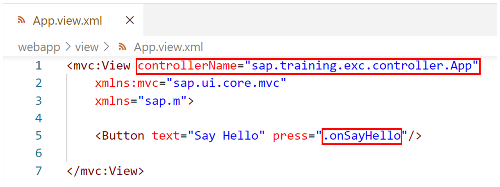
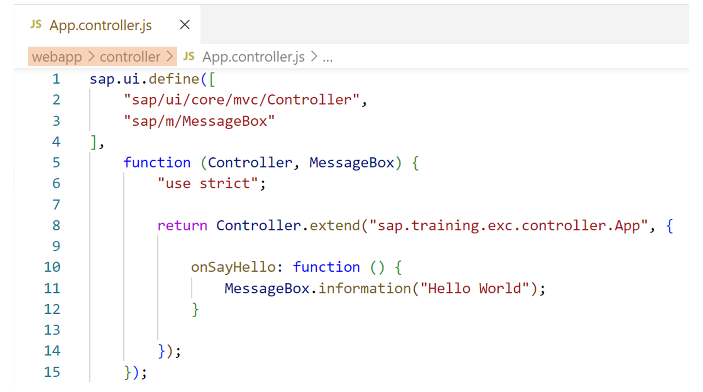
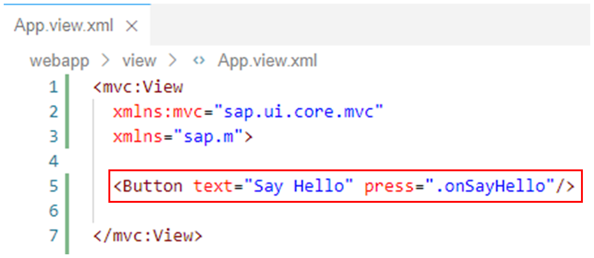
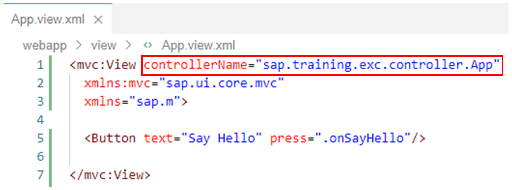
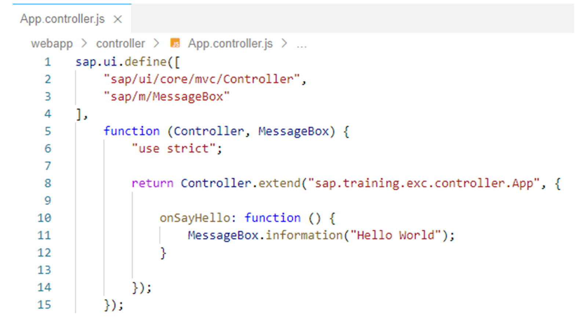

# Working with View Controllers

*Source: https://learning.sap.com/courses/developing-uis-with-sapui5-1/working-with-view-controllers_c4691c5c-320a-4097-bb54-6f50364ebc38*

Objective
After completing this lesson, you will be able to use view controllers
## Referencing a Controller
### Assigning a View Controller
To assign a controller to an XML view, the attribute controllerName can be used in the <View> tag (see the figure _Referencing a Controller_). The name of the controller class is entered as the value of the attribute.

SAPUI5 loads the controller via the module system.
The XML view shown in the figure is taken from a project in which the webapp folder is registered in the bootstrap script as resource location. For this purpose, the module Id prefix sap.training.exc is assigned to the webapp folder via the data-sap-ui-resourceroots attribute in the bootstrap script.
The controller name sap.training.exc.controller.App is therefore resolved as follows: The prefix sap.training.exc points to the webapp folder. The controller segment following sap.training.exc specifies the controller subfolder as the location of the file to load. The last segment in the controller name represents the file name, whereby the suffix .controller.js is automatically appended. That is, SAPUI5 ultimately loads the file App.controller.js from the controller subfolder.
Note
It generally follows that the file containing the view controller implementation must have the suffix .controller.js.
Typically, view controllers are stored in the controller folder of the project structure. More information about the implementation of a view controller follows in the next section.
### Event Handlers
Many controls can trigger events. For example, a sap.m.Button triggers the event press when the user clicks or taps the control. Which events are supported can be looked up in the _API Reference_ in the _Events_ section for the respective control.
In an XML view, event handlers can be attached to events. To do this, an attribute with the name of the event is added to the corresponding control tag, for example, a press attribute to a <Button> tag. The attribute value is then the name of the event handler.
Event handler names that begin with a dot ('.') are assumed to represent a method in the controller. They are resolved by removing the leading dot and calling the method with the resulting name on the controller instance. So, in the example shown, the method onSayHello is called on the view controller when the user clicks or taps the button.
## Controller Implementation
The figure, _Simple Controller_ , shows the file with the implementation of the controller that is referenced by the view discussed above.
As explained previously, the file is named App.controller.js and is stored in the webapp/controller folder of the project.

View controllers are implemented as separate modules via sap.ui.define and are usually created as subclasses of sap.ui.core.mvc.Controller. Therefore, in the example shown, the module sap/ui/core/mvc/Controller has been added to the dependency array and a parameter named Controller has been inserted in the interface of the factory function.
In the implementation of the factory function, a new subclass of sap.ui.core.mvc.Controller is created by calling the extend method. This subclass is set as the value of the module via the return statement.
The first parameter of the extend method is the name of the controller class to be created. In the example, this is sap.training.exc.controller.App. This class name matches the controller name specified in the <View> tag of the XML view as the value of the controllerName attribute.
The second parameter of the extend method is an object literal that contains the information with which to enrich the created subclass. In the example, the object literal contains the method onSayHello, which acts as an event handler for the press event of the button on the view (see above). The method displays an information dialog with the text _Hello World_ by calling the information method of the sap.m.MessageBox class. For this reason, the controller module created via sap.ui.define is dependent on sap/m/MessageBox in addition to sap/ui/core/mvc/Controller. The information method shows, besides the text, an info icon and an OK button on the dialog.
In addition to the possibility to define own methods and properties for a controller, SAPUI5 also provides several lifecyle hooks that are borrowed from the superclass sap.ui.core.mvc.Controller. For example, the borrowed onInit method can be implemented on the own controller to perform an initial setup. If available, this method is called by SAPUI5 once per view instance when the view is instantiated, and the controls have already been created. The method can be used to modify the view before it is displayed, bind event handlers, and perform other one-time initializations.
## Create and Use a View Controller
### Business Scenario
In this exercise, you will place a button on the XML view that you created in the previous exercise. To react to the button click, you add a controller to the XML view and implement the corresponding event handler method there.
| _Template:_  | Git Repository: <https://github.com/SAP-samples/sapui5-development-learning-journey.git>, Branch: **sol/4_views**  |
| --- | --- |
| _Model solution:_  | Git Repository: <https://github.com/SAP-samples/sapui5-development-learning-journey.git>, Branch: **sol/5_controllers**  |
### Task 1: Add a Button to the View
#### Steps
  1. Make sure the App.view.xml view file is open in the editor.
  2. Remove the **Hello World** Text UI element from the view.
    1. Delete the following line:
XML
Copy codeSwitch to dark mode

```

1

<Text text="Hello World"/>

```

  3. Instead, add the following line to the view to create a button labeled **Say Hello** that, when pressed, will call the event handler method onSayHello in the view controller:
XML
Copy codeSwitch to dark mode

```

1

<Button text="Say Hello" press=".onSayHello"/>

```

Note
The event handler method does not exist at the moment. It will be created in the next exercise step.
#### Result
The XML view should now look like this:
  4. Add the following attribute to the <mvc:View> tag to define the name of the controller that should be instantiated and used for the view:
XML
Copy codeSwitch to dark mode

```

1

controllerName="sap.training.exc.controller.App"

```

Note
The view controller does not exist at the moment. It will be created in the next exercise step.

#### Result
The XML view should now look like this:

### Task 2: Implement a View Controller
#### Steps
  1. Create a new file named App.controller.js in the subfolder controller of the webapp folder.
    1. Open the context menu for the webapp/controller folder in the project structure.
    2. Select _New File_.
    3. In the field that appears, type **App.controller.js** and press _Enter_.
#### Result
The App.controller.js file is created and displays in the editor.
  2. Add the following code to the App.controller.js file to implement the required view controller with the onSayHello method:
Note
A dialog with the text **Hello World** is to be displayed via the onSayHello event handler method. For this purpose, the information() method of sap.m.MessageBox is called. The view controller therefore also depends on the MessageBox module, which is why it is listed in the dependency array and as a parameter of the factory function.
JavaScript
Copy codeSwitch to dark mode

```

123456789101112131415

sap.ui.define([
  "sap/ui/core/mvc/Controller",
  "sap/m/MessageBox"
],
  function (Controller, MessageBox) {
    "use strict";

    return Controller.extend("sap.training.exc.controller.App", {

      onSayHello: function () {
        MessageBox.information("Hello World");
      }

    });
  });

```

#### Result
The App.controller.js file should be implemented as follows:
  3. Test run your application by starting it from the SAP Business Application Studio.
    1. Right-click on any subfolder in your _sapui5-development-learning-journey_ project and select _Preview Application_ from the context menu that appears.
    2. Select the npm script named _start-noflp_ in the dialog that appears.
    3. In the opened application, check if the button is displayed and the **Hello World** dialog appears when the button is clicked.

[Continue to quiz](https://learning.sap.com/courses/developing-uis-with-sapui5-1/working-with-views-and-controllers)
