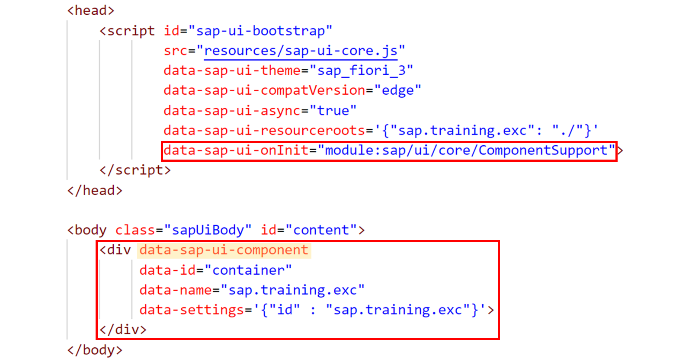
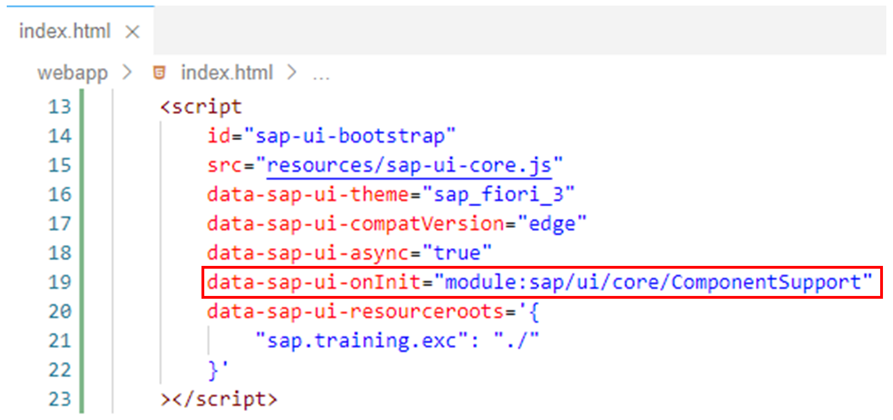
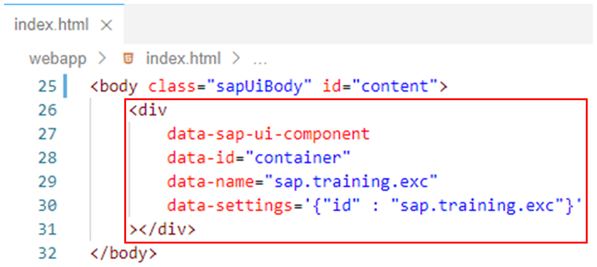

# Using the Declarative API

*Source: https://learning.sap.com/courses/developing-uis-with-sapui5-1/using-the-declarative-api_d6b46253-61e2-41f2-9ed0-55e3261d9c23*

Objective
After completing this lesson, you will be able to embed components declaratively in HTML pages
## Declarative API for Initial Components
With the declarative sap/ui/core/ComponentSupport API, it is possible to define the initially started component directly in the HTML markup. This provides an alternative to the imperative way with JavaScript.
The declarative component support is not activated by default but must be enabled via the bootstrap. To do this, the following attribute must be added to the bootstrap script to load the ComponentSupport module (see the figure _Using the Declarative API_):
XML
Copy codeSwitch to dark mode

```

1

data-sap-ui-onInit="module:sap/ui/core/ComponentSupport"

```


The run function of sap/ui/core/ComponentSupport is called automatically once the module has been loaded. It scans the DOM for HTML elements containing a special data attribute named data-sap-ui-component. All DOM elements marked with this data attribute will be regarded as container elements into which a sap/ui/core/ComponentContainer is inserted.
Additional data attributes are then used to define the constructor arguments of the created component container instance. In the example shown, the following data attributes are specified:
  * data-id
This attribute is used to pass the Id for the component container instance to be created.
  * data-name
The data-name attribute contains the name of the component to be instantiated.
  * data-settings
The object specified for the data-settings attribute is passed to the component instance when it is created. In the example, it is used to set the component instance Id.

Note
The ComponentSupport module enforces asynchronous module loading of the component with "manifest first". This means that the manifest.json file is loaded before evaluating the component to optimize loading behavior (see above).
## Define the Initially Started Component Directly in the HTML Markup
### Business Scenario
In this exercise, you use the declarative API for initial components to declare the component defined in the previous exercise in the <body> of the HTML page. This automatically instantiates the component through the framework and embeds it in the HTML page. The coding from the previous exercise that instantiated the component and placed it on the HTML page is then no longer required and is deleted.
| _Template:_  | Git Repository: <https://github.com/SAP-samples/sapui5-development-learning-journey.git>, Branch: **sol/6_components**  |
| --- | --- |
| _Model solution:_  | Git Repository: <https://github.com/SAP-samples/sapui5-development-learning-journey.git>, Branch: **sol/7_declarative_API_for_components**  |
### Task 1: Remove the Instantiation of the Component
#### Steps
  1. Delete the index.js module from the webapp folder.
    1. Open the context menu for the index.js file in the project structure.
    2. Select Delete Permanently.
    3. Confirm by selecting _Delete_.

### Task 2: Declare the Component in the <body> of the HTML Page
#### Steps
  1. Make sure that the index.html page is open in the editor.
  2. Delete the following attribute from the bootstrap script as the index.js module was deleted in the previous step:
XML
Copy codeSwitch to dark mode

```

1

data-sap-ui-onInit="module:sap/training/exc/index"

```

  3. Add the following attribute to the bootstrap script to enable the ComponentSupport module:
XML
Copy codeSwitch to dark mode

```

1

data-sap-ui-onInit="module:sap/ui/core/ComponentSupport"

```

#### Result
The bootstrap script should now look like this:
  4. Add the following <div> tag to the <body> of the HTML page to instantiate the component when the onInit event is fired:
XML
Copy codeSwitch to dark mode

```

123456

<div
    data-sap-ui-component
    data-id="container"
    data-name="sap.training.exc"
    data-settings='{"id" : "sap.training.exc"}'
></div>

```

#### Result
The <body> of the HTML page should now look like this:
  5. Test run your application by starting it from the SAP Business Application Studio.
    1. Right-click on any subfolder in your _sapui5-development-learning-journey_ project and select _Preview Application_ from the context menu that appears.
    2. Select the npm script named _start-noflp_ in the dialog that appears.
    3. In the opened application, check if the component is displayed with the _App_ view as the root view.

[Continue to quiz](https://learning.sap.com/courses/developing-uis-with-sapui5-1/structuring-applications-via-components)
