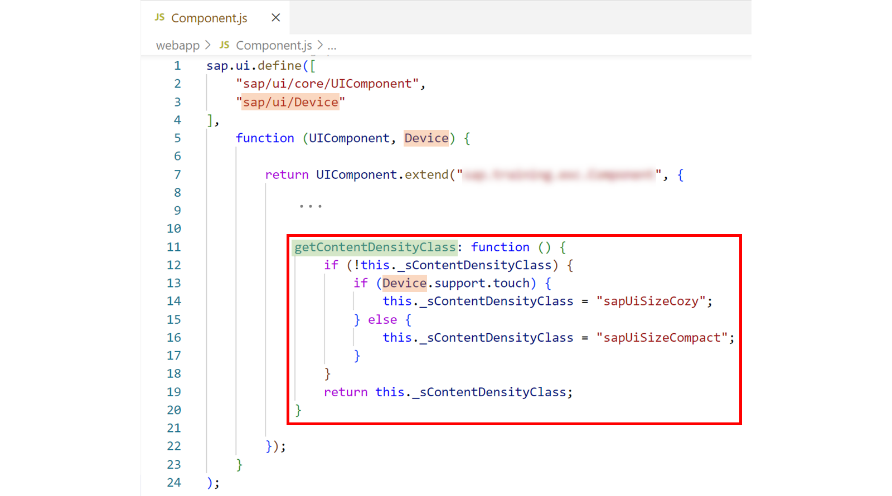
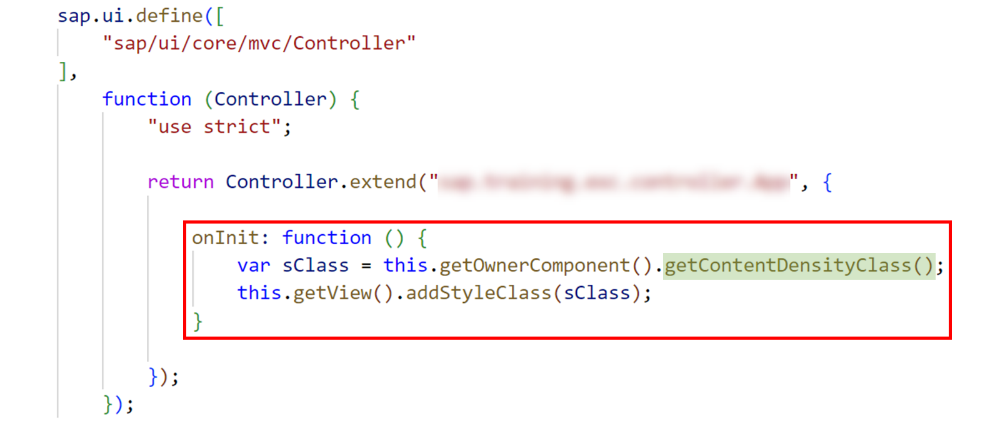
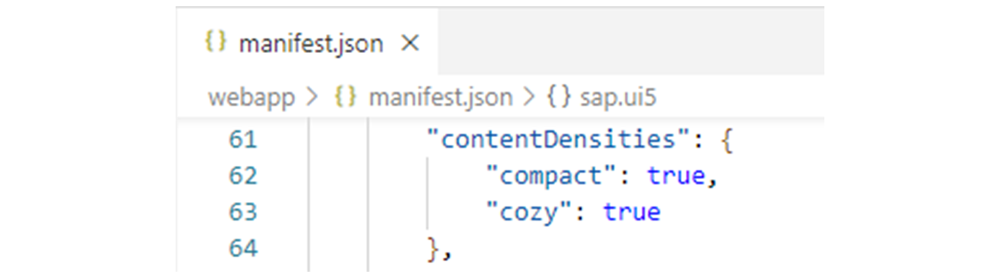
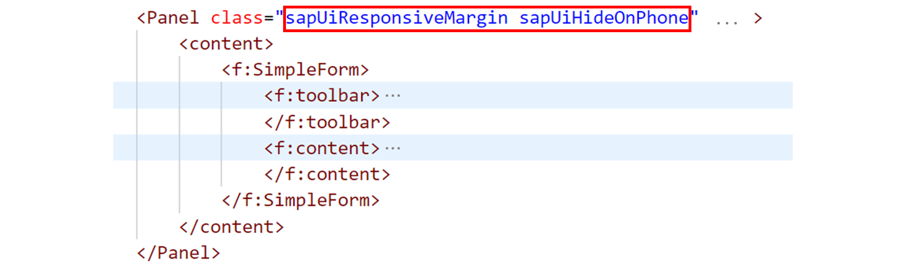
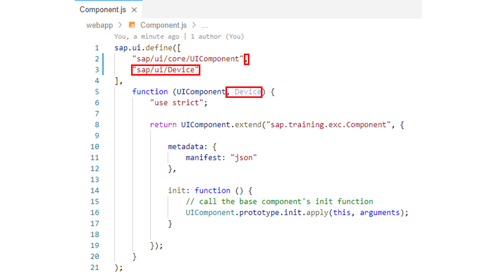
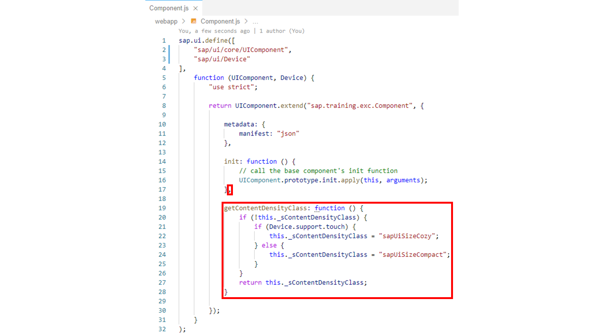
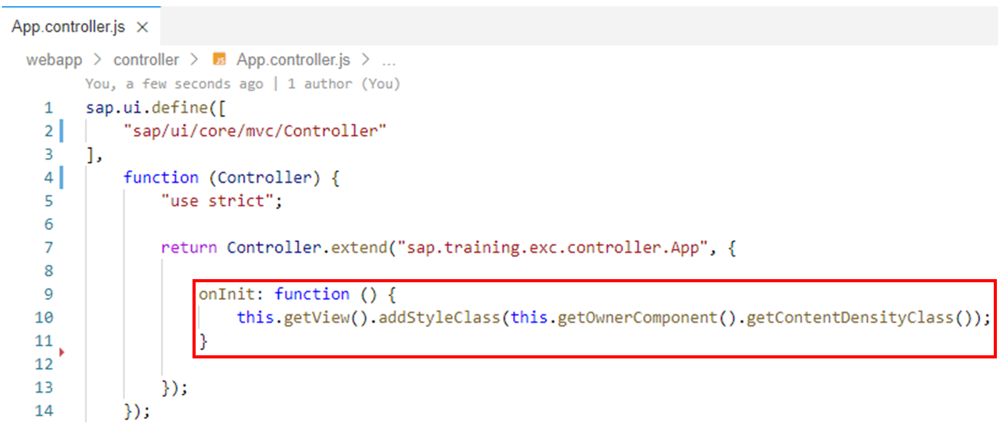
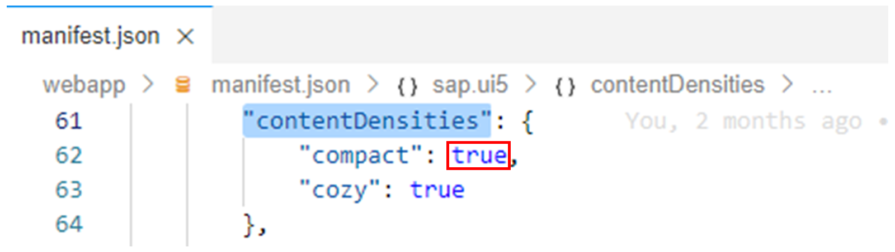
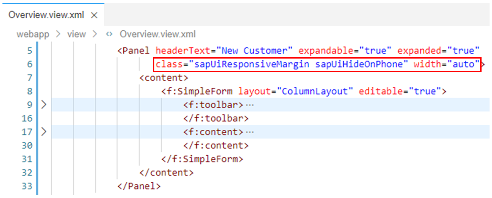

# Using Densities for Controls

*Source: https://learning.sap.com/courses/developing-uis-with-sapui5-1/using-densities-for-controls_ef068942-3030-474f-9436-4be3626f1f70*

Objective
After completing this lesson, you will be able to use content densities to adapt applications to different device types
## Content Densities
The devices on which applications developed with SAPUI5 are executed run on different operating systems and have very different screen sizes.
SAPUI5 provides different content densities for certain controls that allow an application to adapt to the device by displaying larger controls for touch-enabled devices and a smaller, more compact design for devices that are operated with the mouse.
In SAPUI5, the following content densities are available, among others:
  * Cozy
  * Compact

Watch the video to explore more about cozy and compact densities.
Settings
## Setting Densities
The default design for all controls belonging to the sap.m library is the Cozy density (larger dimensions and spacings). If your application only uses the sap.m library, you can skip setting the content density explicitly if the Cozy density is exactly what you require. However, controls belonging to other libraries may also support a Cozy design (such as sap.ui.table.Table) but the default might be different (such as Compact density). For this reason, if your application uses controls belonging to different libraries, it is strongly recommended to set the desired content density explicitly.
The content densities Cozy and Compact are triggered by the CSS classes sapUiSizeCozy and sapUiSizeCompact respectively.
You set the appropriate CSS class on the container that you want to switch to the content density in question, not on the control itself. It is recommended that you set it at a high level, since in most cases you will want to set it for the entire application. Once you set the CSS class at a particular level, it cascades down, meaning you can't override it in the lower levels of your code.
For example, to display a view with all contained UI elements with the Compact content density, you can implement the following:
Code Snippet
Copy codeSwitch to dark mode

```

123

<mvc:View class="sapUiSizeCompact" ... >
  ...
</mvc:View>

```

It is also possible to apply the relevant content density only under certain circumstances, for example, for devices that do not support touch interaction. In this case, add the CSS class dynamically to the UI instead of statically.
To specify a content density depending on certain properties of the device on which the application runs, the Device API (sap.ui.Device) can be used.
The Device API provides information about device specifics, like the operating system along with its version, the browser and browser version, screen size, current orientation and support for specific features such as, touch event support, orientation change, and so on. (For detailed information about the Device API, see the _API Reference_ for the sap.ui.Device namespace.)
### Implementing a Helper Method on the Component Controller

The figure, _Helper Method on the Component Controller_ , shows how the CSS class required for the content density can be determined with the help of the Device API. For this purpose, a helper method called getContentDensityClass is created on the component controller, which checks via the sap.ui.Device.support.touch field of the Device API whether the device on which the application is running has touch support. The Device API is loaded via the dependency array of the component controller. If the device has touch support, the method returns the CSS class sapUiSizeCozy, otherwise the CSS class sapUiSizeCompact.
### Setting the CSS Class for a View

The getContentDensityClass helper method can be called, for example, in the controller of the component's root view to set the appropriate CSS class for the entire application. The coding required for this is shown in the figure _Setting the CSS Class for a View_.
In the onInit initialization method of the view controller, the controller's getOwnerComponent method is used to access the component controller. On this, the getContentDensityClass helper method discussed above is called, which returns the CSS class depending on the touch support of the device. The CSS class obtained is then added to the view via the addStyleClass method.
## Specifying the Supported Densities
The sap.ui5 namespace of the application descriptor manifest.json has the mandatory attribute contentDensities. This attribute contains an object that is used to maintain the content density modes that the application supports (see the figure, _Supported Content Densities_ , for an example).

When the application is invoked through the SAP Fiori launchpad (FLP), the FLP reads the supported content densities from the application descriptor and sets the appropriate content density class for the <body> tag. On devices with mouse and touch support, the FLP also allows the user to configure the desired content density.
If you determine and set the CSS class for the content density of an application dynamically as described above, you should avoid that the application and the FLP set different content density classes in case the application is also started in the FLP. In the above example, you could do this by extending the helper method getContentDensityClass as follows: If the FLP has already set a content density CSS class, the helper method should return an empty string. The JavaScript coding required for such an extension can be found in the documentation.
## Further Platform Adaptations
In addition to the CSS classes for specifying the content density, SAPUI5 provides further CSS based options for adapting an application to the device on which it runs.
To determine a control’s visibility in a device-dependent way, you can use the following CSS classes:
  * sapUiVisibleOnlyOnDesktop
  * sapUiHideOnDesktop
  * sapUiVisibleOnlyOnTablet
  * sapUiHideOnTablet
  * sapUiVisibleOnlyOnPhone
  * sapUiHideOnPhone

The names of the CSS classes are self-explanatory; for each device type, you have a corresponding class that you can use to either explicitly hide or show a control.
Thus, the panel in the figure, _CSS Based Device Adaptation_ , is displayed only on tablets and desktops, but not on phones.

SAPUI5 gives you the option to add space between controls by adding margins. A margin clears an area around its respective control, outside of its border.
If your application is supposed to run on phone, tablet and desktop, it may be useful to choose margins depending on the available screen width. SAPUI5 provides the CSS class sapUiResponsiveMargin that does just that. It works with media queries to determine the available screen width and adapts the margins to it.
In the figure, _CSS Based Device Adaptation_ , the margins of the panel are made dependent on the available screen width by adding the CSS class sapUiResponsiveMargin.
Detailed information about further margin and padding classes can be found in the documentation.
## Adjust the Content Density
### Business Scenario
In this exercise, you adapt the application to the user's device. You set the content density depending on whether the browser used supports touch events. In addition, you use standard SAPUI5 CSS classes to implement a device-specific layout.
| _Template:_  | Git Repository: <https://github.com/SAP-samples/sapui5-development-learning-journey.git>, Branch: **sol/8_SimpleForm**  |
| --- | --- |
| _Model solution:_  | Git Repository: <https://github.com/SAP-samples/sapui5-development-learning-journey.git>, Branch: **sol/9_content_density**  |
### Task 1: Implement a Method on the Component Controller to Determine the Required Content Density CSS Class
#### Steps
  1. Open the Component.js file from the webapp folder in the editor.
  2. Add the sap/ui/Device module to the dependency array of the component controller and a corresponding parameter named Device to the factory function.
Note
The Device API module is needed in the component controller to query the touch support of the user device in the next step.
#### Result
The component controller should now look like this:
  3. Now add the following helper method to the component controller which queries the Device API for touch support of the user device and returns the CSS class sapUiSizeCozy if touch interaction is supported and sapUiSizeCompact for all other cases:
JavaScript
Copy codeSwitch to dark mode

```

12345678910

getContentDensityClass: function () {
  if (!this._sContentDensityClass) {
    if (Device.support.touch) {
      this._sContentDensityClass = "sapUiSizeCozy";
    } else {
      this._sContentDensityClass = "sapUiSizeCompact";
    }
  }
  return this._sContentDensityClass;
}

```

#### Result
The component controller should now look like this:

### Task 2: Add the Determined Content Density CSS Class to the App View
#### Steps
  1. Open the controller of the App view (webapp/controller/App.controller.js file) in the editor.
  2. Add the following initialization method to the view controller to set the Content Density CSS Class returned by the helper method implemented above for the root view of the component:
JavaScript
Copy codeSwitch to dark mode

```

123

onInit: function () {
  this.getView().addStyleClass(this.getOwnerComponent().getContentDensityClass());
}

```

#### Result
The controller of the App view should now look like this:

### Task 3: Maintain the Supported Content Densities in the Application Descriptor
#### Steps
  1. Open the application descriptor manifest.json from the webapp folder in the editor.
  2. Change the value of the sap.ui5/contentDensities/compact property from **false** to **true** to indicate that the component supports the content density mode _compact_.
Note
The sap.ui5/contentDensities/cozy property already has a value of true.
    1. Modify the content of line 62 in the manifest.json file as follows:
JSON
Copy codeSwitch to dark mode

```

1

"compact": ,

```

#### Result
The sap.ui5/contentDensities property in the application descriptor should now look like the following:

### Task 4: Make the Visibility as well as the Margins of the sap.m.Panel on the Overview View Device-Specific
#### Steps
  1. Open the Overview.view.xml file from the webapp/view folder in the editor.
  2. Add the following attributes to the <Panel> tag:
XML
Copy codeSwitch to dark mode

```

1

class="sapUiResponsiveMargin sapUiHideOnPhone" width="auto"

```

Note
The CSS class sapUiResponsiveMargin makes the margins dependent on the screen width that is available. The width is set to **auto** since the margin would otherwise be added to the default width of 100% and exceed the page size. The CSS class sapUiHideOnPhone specifies that the panel should not be displayed on small screens (phones).
#### Result
The <Panel> tag on the Overview view should now look like this:
  3. Test run your application by starting it from the SAP Business Application Studio.
Check the following points:
     * Make sure that the layout of the form is adapted to the available screen size.
     * Make sure that the margin of the panel is responsive and adjusts to the screen size of the device.
     * Make sure that the panel is not displayed on small screens (phones).
     * Make sure that the component supports the content densities _compact_ and _cozy_.
Note
You can change the size of the browser window to simulate the presentation of the component on large (desktop), mid-sized (tablet PC), and small (phones) screens.
However, changing the window size does not let you test the different content densities, because touch support cannot be simulated in this way.
To test the different content densities, you can use the device toolbar in the developer tools of the Google Chrome, Firefox, or Microsoft Edge browser: Start your application and, in the developer tools (F12), call the device toolbar with the key combination _Ctrl + Shift + M_. You can use the device toolbar to select a device you want to emulate. After you select the device, you have to refresh the browser (F5), to ensure that the onInit() method of the App view controller is called, where the content density is set specifically for the device type.
Note
Do not pay attention to the errors displayed in the console when in the developer tools. This is due to some code prepared for future exercises that is then not yet complete.
    1. Right-click on any subfolder in your _sapui5-development-learning-journey_ project and select _Preview Application_ from the context menu that appears.
    2. Select the npm script named _start-noflp_ in the dialog that appears.
    3. In the opened application, check if the component is displayed as expected.

[Continue to quiz](https://learning.sap.com/courses/developing-uis-with-sapui5-1/implementing-the-ui)
