# Dealing with Fragments as Reusable UI Parts

*Source: https://learning.sap.com/courses/developing-uis-with-sapui5-1/implementing-and-instantiating-xml-fragments_bd9dc4a9-7c9f-40dc-967e-ff555716c0f1*

Objective
After completing this lesson, you will be able to work with dialogs defined as XML fragment
## Reusable UI Parts
UI parts that are to be used in several views cannot be easily defined. They either have to be created as new controls, or they have to be created as views. Creating them as new controls results in a development overhead, while creating them as separate views results in a runtime overhead.
To solve this problem, fragments were introduced. They support reuse and view modularization without adding overhead.
Watch this video to learn more about the main characteristics of fragments.
Note
Instead of defining fragments in a separate file, they can also be defined inline and instantiated immediately. In general, however, the inline definition of fragments plays only a minor role.
## XML Fragments
Only XML fragments are covered in this course because they are the most common. For JavaScript fragments and HTML fragments, see the documentation.
XML fragments are similar to XML views, but have no <View> tag as root element.
An example for the definition of an XML fragment is shown in the figure _Simple XML Fragment_.
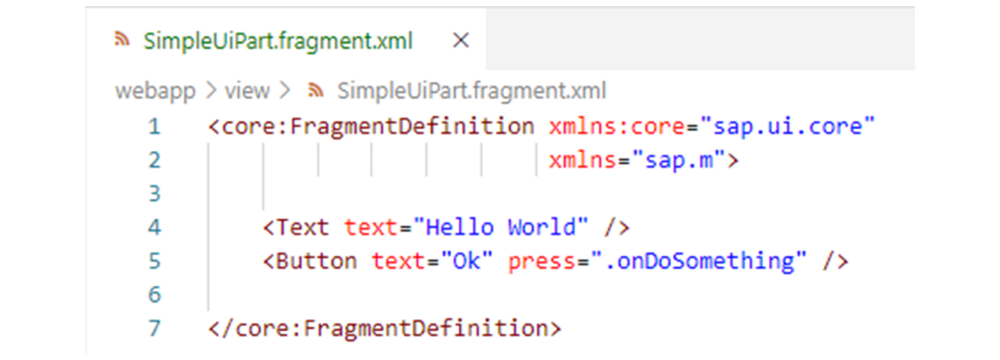
The file containing the definition of an XML fragment has the extension *.fragment.xml. It is loaded by the SAPUI5 runtime via its SAPUI5 module name (see below).
In the example, the <core:FragmentDefinition> tag is used as the root element of the fragment. Without this <core:FragmentDefinition> tag, the fragment would contain the Text control and the Button control as root controls. However, this is not possible because XML documents must always have exactly one root node.
The <core:FragmentDefinition> tag has no representation in HTML at runtime; its child elements are added directly where the fragment is placed.
In cases where the fragment contains only one root control, the use of the <core:FragmentDefinition> tag is optional.
The press event of the button in the example is bound to the event handler onDoSomething of a controller. This means that this fragment must be instantiated with a controller that has this method.
## Fragment Instantiation
### Instantiating Fragments in XML Views
The example in the figure, _Declarative Use of Fragments_ , displays an XML view that includes the XML fragment shown above via the <core:Fragment> tag.
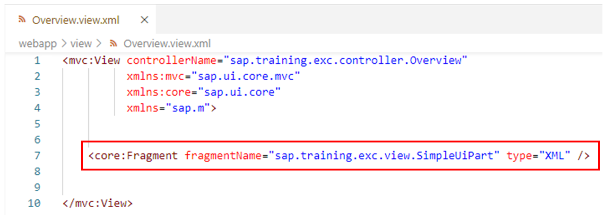
The fragmentName attribute of this tag contains the SAPUI5 module name of the fragment used.
The type attribute is used to pass the type of the fragment. This means that fragments of any type can be embedded in an XML view, not only XML fragments, but also JavaScript and HTML fragments.
With the help of the optional id attribute an Id for the fragment instance can be passed. This Id is used as a prefix for the Ids of all controls in the fragment instance. This way, duplicate id errors can be avoided if a fragment is embedded twice in the same view, for example.
Note
For details regarding unique Ids, see the documentation.
The implemented fragment reference ultimately works like an import statement that includes the fragment's content controls into the view.
When a fragment is embedded in an XML view, the view's controller is automatically set as the fragment's controller as well. Since in the example discussed here the fragment contains a button whose press event is bound to the event handler onDoSomething, this method must be present in the controller of the embedding view.
### Instantiating Fragments via API
SAPUI5 provides two options to instantiate fragments via API.

If a fragment is to be instantiated within a view controller (more precisely, in a controller that extends sap.ui.core.mvc.Controller), the loadFragment method can be used. It is available in any view controller. The method passes to the created fragment the view controller as fragment controller. That is, the (event handler) methods referenced in the fragment are called on the view controller.
An example of the use of loadFragment will be discussed later.
Outside of controllers, the generic method sap.ui.core.Fragment.load can be used for instantiation. Among other things, this method can be passed a JavaScript object that is to be used as a fragment controller. Any object can act as a fragment controller here, provided it has the methods required by the fragment.
For more information on the two methods mentioned, see the _API Reference_ in the Demo Kit.
## Dialogs as Fragments
Dialogs are special because they open on top of the regular application content and thus do not belong to a special view. In addition, dialogs can be used in more than one view of an application.
Views do not support the implementation of such dialogs, but fragments are very suitable for defining dialogs and other popup controls that are not part of the normal page UI structure.
To use fragments for defining popups, just let the fragment's root control be a dialog or similar control.
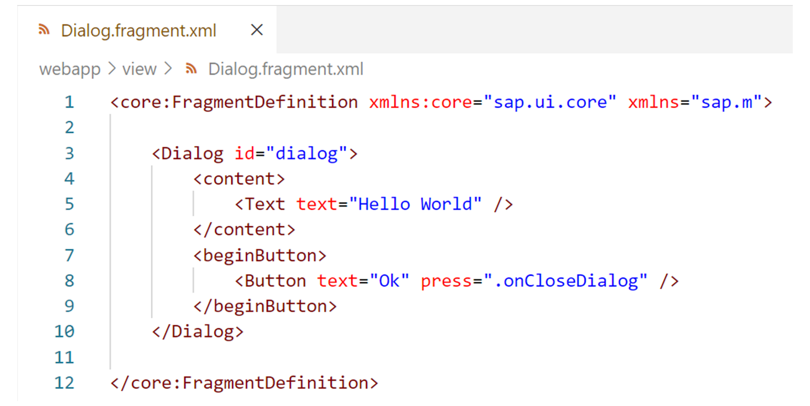
The figure, _Dialog as XML Fragment_ , shows a simple dialog defined using an XML fragment.
The root control of the fragment is a sap.m.Dialog UI element. This control is used to prompt the user for an action or confirmation. When the dialog is opened in the application, it interrupts the current application processing because it is the only focused UI element and the main screen is blocked.
The content of a dialog is fully customizable and is defined using the content aggregation. In the example, for simplicity, the dialog contains only a Text UI element with the text _Hello World_.
The beginButton aggregation can be used to define an action button that will be displayed in the footer area of the dialog. In the example, it is a button with the text _Ok_ , whose press event is bound to the event handler onCloseDialog.
The dialog will later be instantiated via a view controller, where the view controller will be set as fragment controller. This means that the view controller must have a method onCloseDialog, which will be used to close the opened dialog.
The value dialog is specified for the id attribute of the Dialog UI element in the example. This Id will later be used to access the created dialog instance in the view controller.
## Using Dialogs Defined as Fragments
In order to open the dialog shown above in a view controller, the corresponding fragment must first be loaded.
This can be done using the loadFragment method, which is available in any view controller (see above). The anyControllerMethod in the figure _Opening and Closing a Dialog_ shows how the loadFragment method can be used.
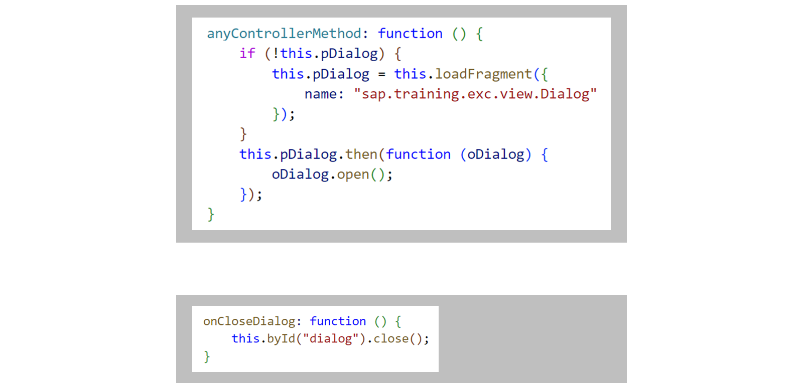
The loadFragment method is passed the module name of the fragment to be loaded (in the example sap.training.exc.view.Dialog). By default, loadFragment assumes that the fragment is an XML fragment. Other fragment types can be passed to the method via the property type.
The loadFragment method returns a Promise that resolves with the fragment content, that is, with the Dialog instance. In the example, the Promise pDialog returned by loadFragment is stored as a controller property (this.pDialog). With the help of this controller property, the if statement ensures that the loadFragment method is called only once, the first time anyControllerMethod is processed. This is because after the first processing of anyControllerMethod, this.pDialog is no longer initial and thus the if block is no longer processed.
As said, the Promise resolves with the fragment content, that is, with the Dialog instance. On this Dialog instance, the open method is called to open the dialog.
The loadFragment method passes the view controller as fragment controller to the loaded fragment. The event handler onCloseDialog referenced by the button in the XML fragment in the example must therefore be implemented on the view controller (see figure _Opening and Closing a Dialog_).
The loadFragment method ensures that the Ids used in the fragment are prefixed with the Id of the view instance to avoid duplicate Id issues. This leads to the fact that the controls used in the fragment can be accessed via the byId method of the controller. For this purpose, the control Id assigned in the fragment is passed to the byId method. In the example, the created Dialog instance is accessed in this way and the close method is called on it to close the open dialog again.
## Synchronizing the Content Density
A dialog is opened in a special part of the DOM called the static area. Thus, it is not part of the view through which it is opened. As a result, the content density CSS class set for the view is not automatically forwarded to the dialog. The corresponding style class of the view must therefore be passed to the dialog manually.
The sap/ui/core/syncStyleClass function can be used to do this, as shown in the figure _Forwarding the Content Density to a Dialog_.
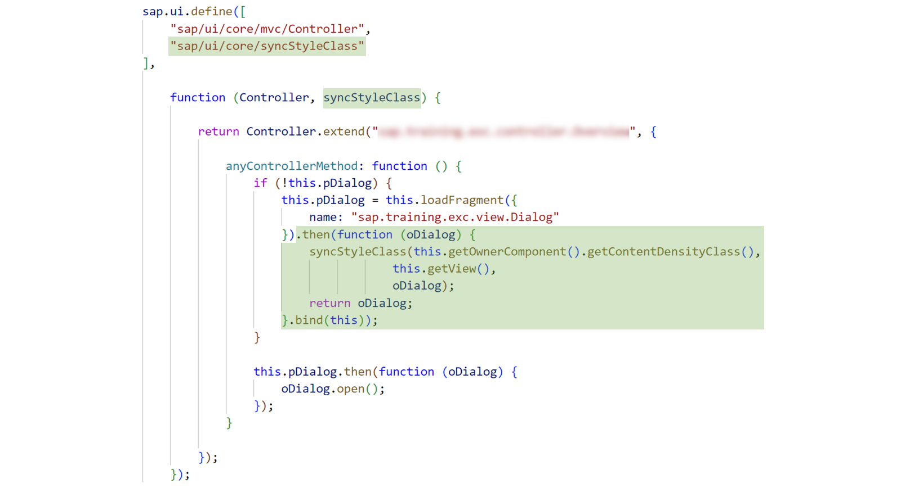
In the figure, the sap/ui/core/syncStyleClass function has been added to the dependency array of the corresponding view controller and the factory function has been extended by the parameter syncStyleClass.
The synchronization of the style class is done in the method anyControllerMethod, which is used to load the XML fragment and open the dialog, as described above. In order to pass the content density to the dialog, the highlighted coding has been added to this method.
The added code registers a callback function that is executed when the loading of the fragment could be completed successfully. The dialog instance is passed to this callback function.
By calling the bind method on the added callback function, it is achieved that the this keyword in the implementation of the callback function has the value which is passed to the bind method. That is, this references the view controller within the callback function.
In the callback function, the sap/ui/core/syncStyleClass function is used to apply the content density set for the view to the dialog instance. For this purpose, the content density currently used in the application is queried via the getContentDensityClass method of the component controller.
Note
The getContentDensity method must have been created by the developer beforehand and implemented accordingly (see above).
For details on how to use the sap/ui/core/syncStyleClass function, see the _API Reference_ in the _Demo Kit_.
In order to chain the then method, the callback function returns the dialog instance oDialog. This ensures that this instance is passed to the next registered fulfill callback.
## Implement a Popup Using a Fragment
### Business Scenario
In this exercise, you will implement a popup with an info text and an _Ok_ button to close it using an XML fragment. The dialog box should be displayed when the user presses the _Create Customer_ button on the _Overview_ view. You will apply the content density CSS class that you set in the previous exercise to the dialog box as well.
| _Template:_  | Git Repository: <https://github.com/SAP-samples/sapui5-development-learning-journey.git>, Branch: **sol/9_content_density**  |
| --- | --- |
| _Model solution:_  | Git Repository: <https://github.com/SAP-samples/sapui5-development-learning-journey.git>, Branch: **sol/10_fragments**  |
### Task 1: Create an XML Fragment with the Definition of the Dialog Box
#### Steps
  1. Create a new file named Dialog.fragment.xml in the subfolder view of the webapp folder.
    1. Open the context menu for the webapp/view folder in the project structure.
    2. Select _New File_.
    3. In the field that appears, type **Dialog.fragment.xml** and press _Enter_.
#### Result
The Dialog.fragment.xml file is created and displays in the editor.
  2. Add the following code to the Dialog.fragment.xml file to define a dialog box using the XML fragment:
XML
Copy codeSwitch to dark mode

```

12345678910111213141516

<core:FragmentDefinition
  xmlns="sap.m"
  xmlns:core="sap.ui.core">
  <Dialog
    id="dialog"
    title="Info" type="Message">
      <content>
        <Text text="Customer data is later saved via an OData service."/>
      </content>
      <beginButton>
        <Button
          text="Ok"
          press=".onCloseDialog"/>
      </beginButton>
  </Dialog>
</core:FragmentDefinition>

```

Note
The dialog box displays the text "_Customer data is later saved via an OData service_ " to the user. In addition, it has an _Ok_ button that the user can use to close the popup again. For this purpose, the event handler method onCloseDialog registered for the press event of the _Ok_ button will be implemented later. Please also note the Id dialog of the sap.m.Dialog UI element. This Id will be used later in the onCloseDialog event handler method to access the popup.

#### Result
The XML fragment should be implemented as follows:
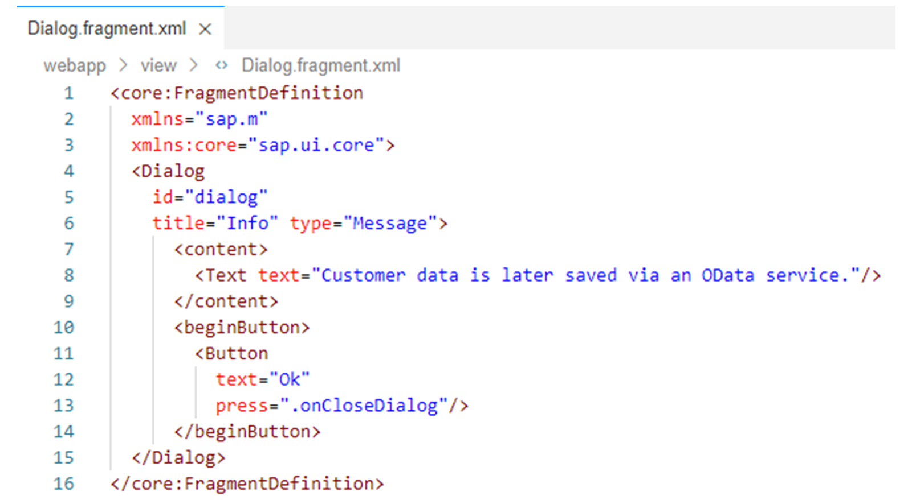
### Task 2: Register an Event Handler for the press Event of the Button on the _Overview_ View
#### Steps
  1. Open the Overview.view.xml file from the webapp/view folder in the editor.
  2. Add attribute press=".onSave" to the <Button> tag of the _Create Customer_ button to register an event handler named onSave on the press event of this button.
Note
In the next step, you will implement this event handler on the view controller to open the popup created above.

#### Result
The _Create Customer_ button should now be implemented as follows:
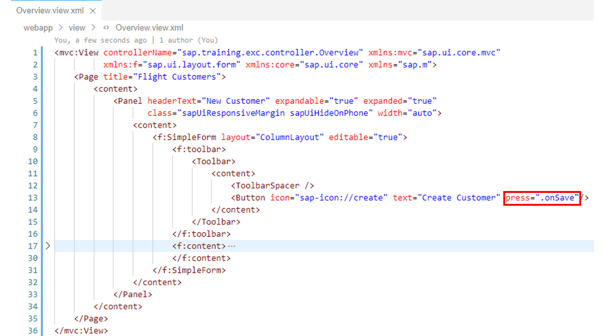
### Task 3: Implement the Registered Event Handler on the View Controller to Open the Popup
#### Steps
  1. Open the Overview.controller.js file from the webapp/controller folder in the editor.
  2. Add the onSave event handler method registered with the _Create Customer_ button in the previous step to the view controller. Implement this method as follows to open in it the popup defined above:
JavaScript
Copy codeSwitch to dark mode

```

12345678910

onSave: function () {
  if (!this.pDialog) {
    this.pDialog = this.loadFragment({
      name: "sap.training.exc.view.Dialog"
    });
  }
  this.pDialog.then(function (oDialog) {
    oDialog.open();
  });
}

```

Note
If the dialog in the fragment does not exist yet, the fragment is instantiated by calling the loadFragment() method.
The loading Promise of the dialog fragment is stored on the view controller instance. This makes it possible to handle the opening of the dialog asynchronously on each click of the _Create Customer_ button.

#### Result
The view controller should now look like this:
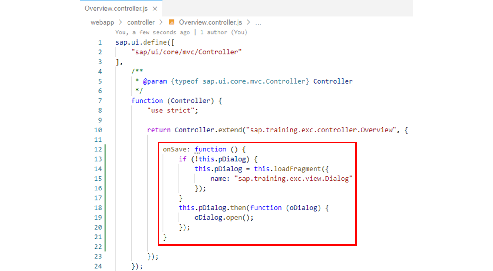
### Task 4: Implement the Method to Close the Dialog on the View Controller
#### Steps
  1. Make sure that the Overview.controller.js view controller is open in the editor.
  2. Add the onCloseDialog event handler method, registered above for the _Ok_ button on the popup, to the view controller. Implement this method as follows to close the popup through it again:
JavaScript
Copy codeSwitch to dark mode

```

123

onCloseDialog: function () {
  this.byId("dialog").close();
}

```

Note
The event handler method closes the popup by accessing the dialog through its Id. It is not necessary to chain to the pDialog Promise, since the event handler is only called from within the loaded dialog itself.

#### Result
The view controller should now look like this:
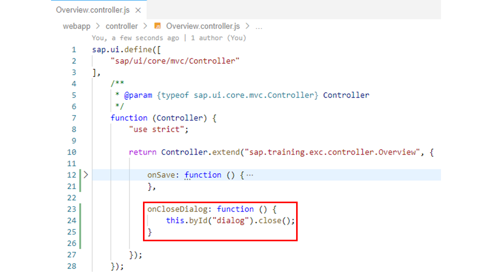
### Task 5: Apply the Content Density for the Dialog
#### Steps
  1. Make sure that the Overview.controller.js view controller is open in the editor.
  2. Add the sap/ui/core/syncStyleClass module to the dependency array of the view controller and a corresponding parameter named syncStyleClass to the factory function of the view controller.
#### Result
The view controller should now look like this: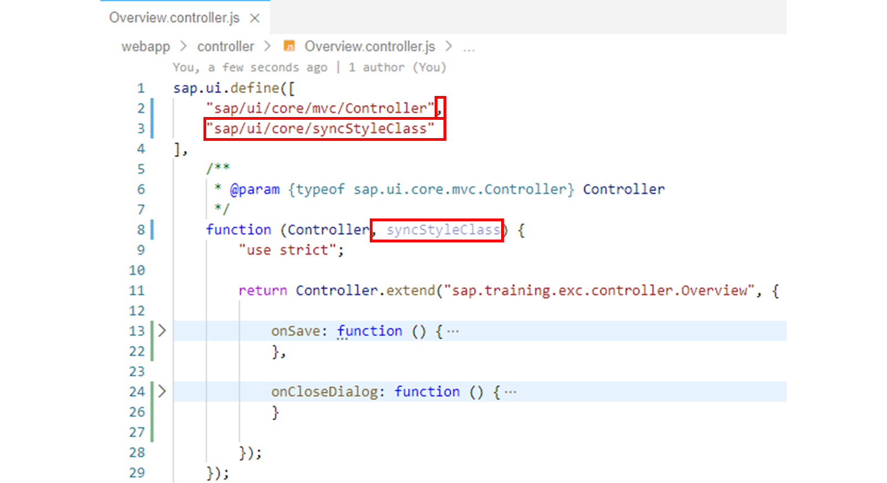
  3. Use the sap/ui/core/syncStyleClass module in the onSave event handler method to forward the content density to the popup. To do this, adjust the implementation of the event handler method as follows:
JavaScript
Copy codeSwitch to dark mode

```

12345678910111213

onSave: function () {
  if (!this.pDialog) {
    this.pDialog = this.loadFragment({
      name: "sap.training.exc.view.Dialog"
    }).then(function (oDialog) {
      syncStyleClass(this.getOwnerComponent().getContentDensityClass(), this.getView(), oDialog);
      return oDialog;
    }.bind(this));
  }
  this.pDialog.then(function (oDialog) {
    oDialog.open();
  });
}

```

Note
The popup is not part of the Overview view, but is opened in a special part of the DOM, the static area. Therefore, the content density class defined in the App view is not known to the popup, so the style class of the app is manually synchronized with the popup.
#### Result
The onSave event handler method should now look like this: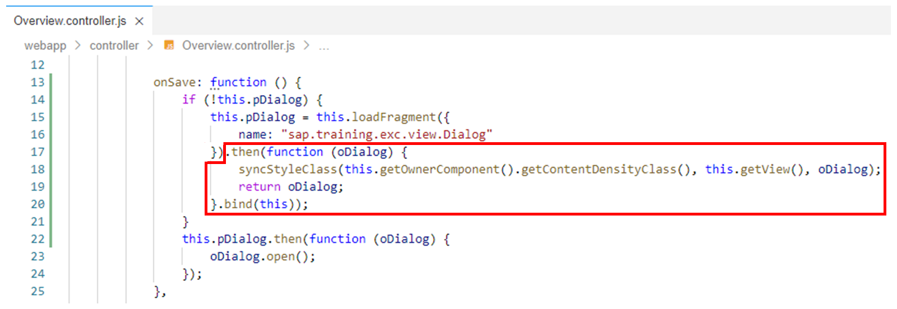
  4. Test run your application by starting it from the SAP Business Application Studio.
Check the following points:
     * Make sure that the popup opens when you press the _Create Customer_ button.
     * Make sure that the popup is closed when you press the _Ok_ button on the dialog box.
     * Make sure that the content densities _compact_ and _cozy_ are passed through to the dialog box. The _Ok_ button on the dialog box should be displayed larger for _cozy_ than for _compact_.
Note
To test the different content densities, you can use the device toolbar in the developer tools of the Google Chrome, Firefox, or Microsoft Edge browser: Start your application and, in the developer tools (F12), call the device toolbar with the key combination _Ctrl + Shift + M_. You can use the device toolbar to select a device you want to emulate. After you select the device, you have to refresh the browser (F5), to ensure that the onInit() method of the App view controller is called, where the content density is set specifically for the device type.
Note
Do not pay attention to the errors displayed in the console when in the developer tools. This is due to some code prepared for future exercises that is then not yet complete.
    1. Right-click on any subfolder in your _sapui5-development-learning-journey_ project and select _Preview Application_ from the context menu that appears.
    2. Select the npm script named _start-noflp_ in the dialog that appears.
    3. In the opened application, check if the component works as expected.

[Continue to quiz](https://learning.sap.com/courses/developing-uis-with-sapui5-1/dealing-with-fragments-as-reusable-ui-parts)
