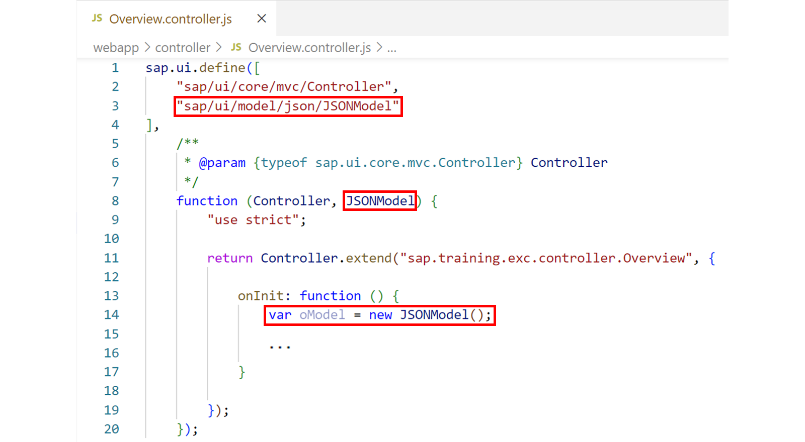
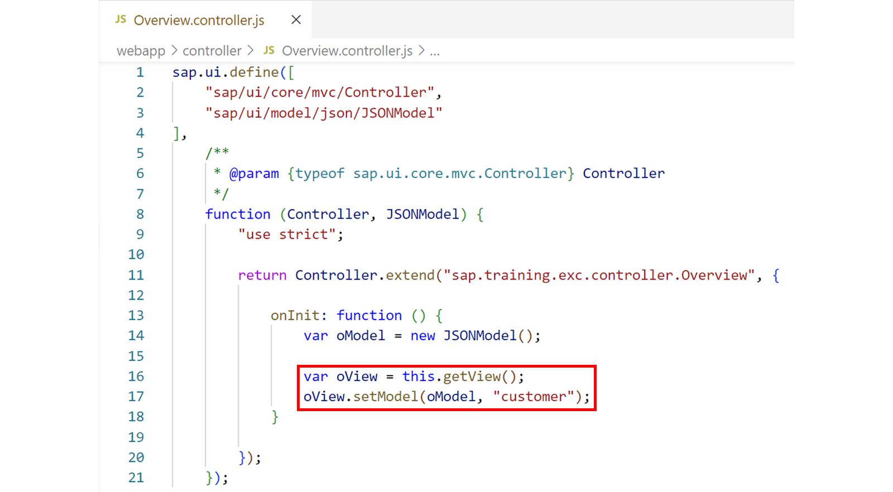
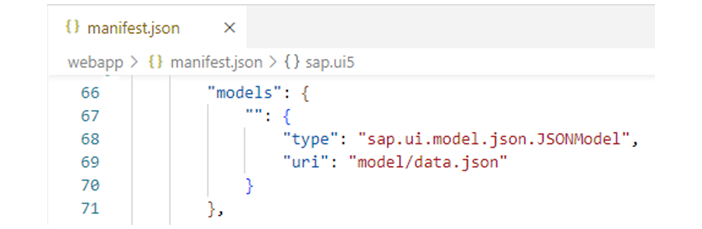
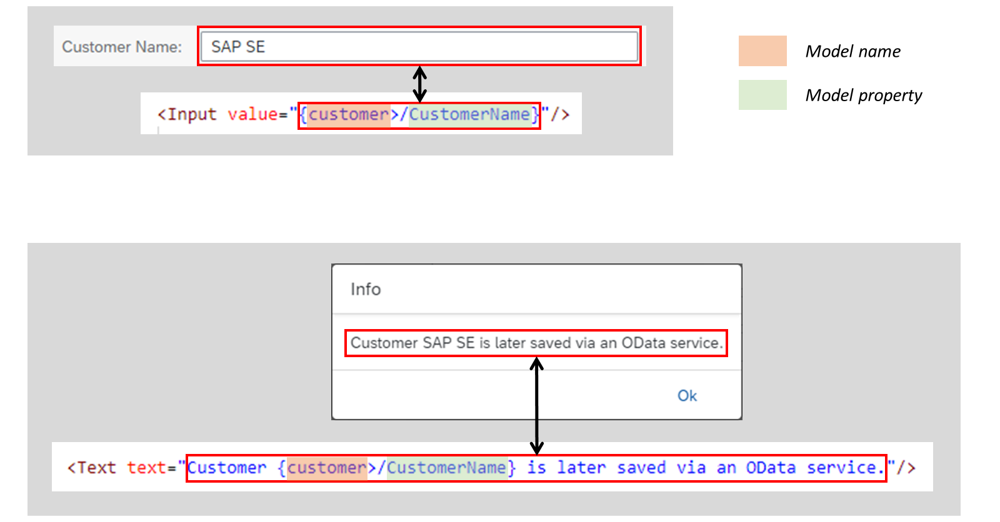
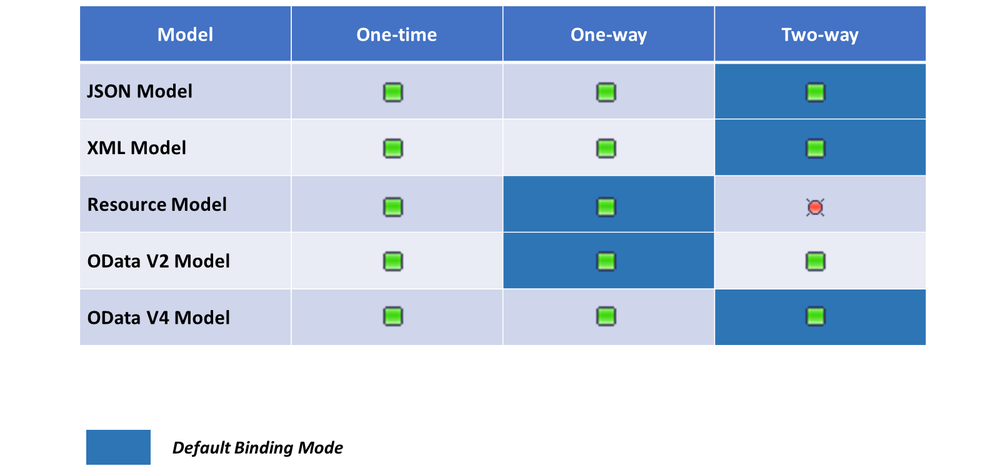
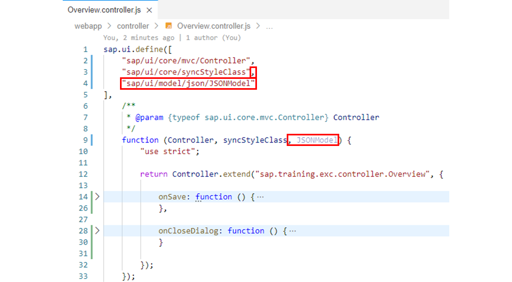
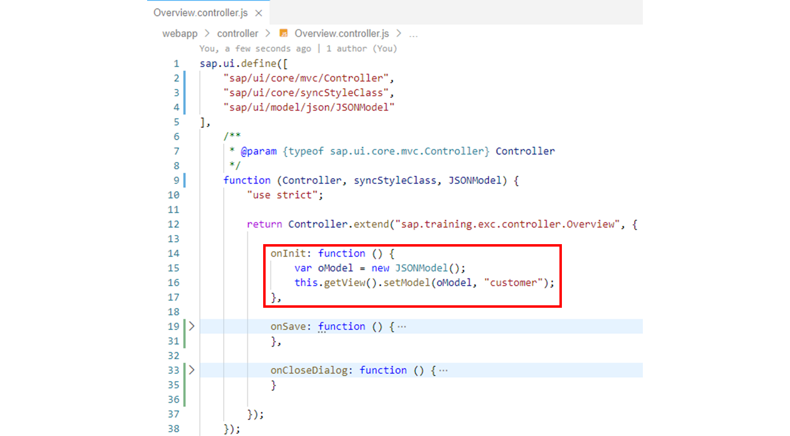
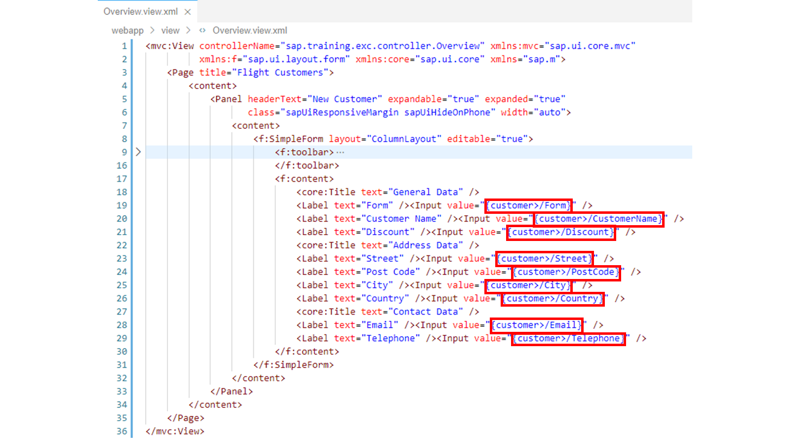
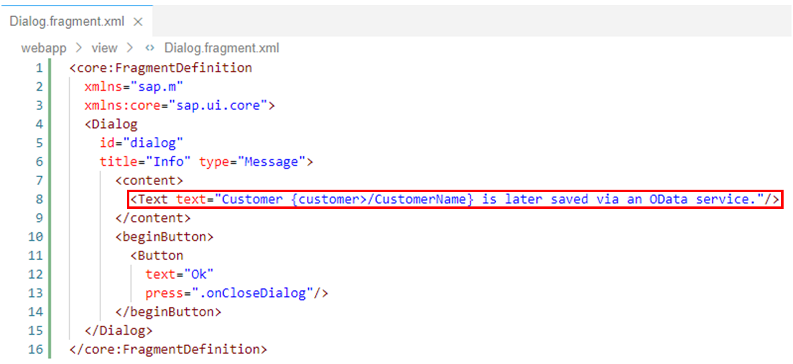

# Models and Data Binding

*Source: https://learning.sap.com/courses/developing-uis-with-sapui5-1/working-with-models_e8a80842-2cb6-48e3-86b3-321d324f8f2f*

Objective
After completing this lesson, you will be able to add a JSON model to an application and use it via property binding
## Models
A model in the Model View Controller concept holds the data and provides methods to retrieve the data and to set and update data.
Watch this video to know more about predefined models.
This class covers the JSON model, the resource model, and the OData V4 model. If you need information about the XML model or the OData V2 model, please refer to the documentation.
## JSON Model
### Instantiating a JSON Model
The JSON model is implemented using the sap.ui.model.json.JSONModel class.

The figure, _Creating a Model Instance_ , shows how to instantiate a JSON model in the onInit initialization method of a view controller.
After the instance is created, there are several ways to get data into the model. In addition to data binding (see below), data can also be set and changed in the model via API:
  * The setData method sets the data passed as JS Object tree to the model:
JavaScript
Copy codeSwitch to dark mode

```

1234

oModel.setData({
  CustomerName: "SAP SE",
  City: "Walldorf"
});

```

  * The loadData method loads JSON-encoded data from the passed URL using a GET HTTP request and stores the resulting JSON data in the model:
JavaScript
Copy codeSwitch to dark mode

```

1

oModel.loadData("model/data.json");

```

The getData method, on the other hand, returns the current data of the model.
### Assigning the Model to the UI
You must assign a model instance to the UI before you can bind controls to it.
For this purpose, you can use the setModel method, which is available on every control. The first parameter passed to this method is the model to be set. The second (optional) parameter can be used to define a name for the model. If the name is omitted, this will set the so-called default model without a name.

In the figure, _Setting the Model for the View_ , the instantiated JSON model is assigned to the view via the setModel method. As model name, customer is used.
The name of the model will be specified later during data binding (see below).
Naming models makes it possible to not only use one model for an application, but to define different areas in an application with different models. You can even assign models to individual controls. You can also define nested models, for example, a JSON model for the application and an OData model for a table control contained in the application.
When you specify a model for a section or control, it is propagated to all aggregated child controls. So, if you set a model for a container control, all controls contained (aggregated) in that container will have access to that model.
In the shown example, all controls placed on the view can access the model.

As explained previously, JavaScript can be used to instantiate (JSON) models and assign them to the UI.
However, models can also be defined declaratively via the manifest.json application descriptor. They are then automatically created and destroyed along the life-cycle of the component.
To define a model declaratively for a component, an entry is added to the models property from the sap.ui5 namespace. The key of this entry represents the model name, where an empty string ("") stands for the default model. The type property of the entry is used to set the name of the model class and the uri property can be used to specify the relative path to the model data within the component.
The figure, _Declarative Approach_ , shows an example that instantiates a JSON model that loads its data from the data.json file. This file is located in the model folder of the project. The instantiated model is set as the default model (without a name) for the component and is thus available in all views of the component.
## Data Binding
### Binding Path
Watch the video to understand the concept of binding path and binding content.
### Binding Controls to a Model
To bind controls to a model, various so-called binding types are available. In the example shown in the figure _Binding Syntax_ , property binding is used. Property binding makes it possible to initialize and update the properties of a control automatically based on the model data.

In the example, both the value property of the Input UI element and the text property of the Text UI element are bound to the CustomerName model property. To reference this model property the binding syntax {/path/to/data} is used.
Generally, the specified path can be either absolute or relative. Absolute binding paths start with a slash, relative binding paths start with a name token and are resolved relative to the binding context of the bound control. In the example, an absolute path is used, meaning that the CustomerName model property is not relative to a binding context yet to be defined, but is located at the top level of the model data.
If a model has been assigned a name, this model name must be specified at the beginning of the binding, followed by a '>'. Therefore, in the example, the absolute path /CustomerName is preceded by customer>, where customer is the model name. For the default model (model without a name), the path to the data is specified directly without any additional prefix.
The text property of the Text UI element in the example is not only bound to the CustomerName model property. The corresponding binding also contains additional static text. Such a composite binding is also called a calculated field. To use this feature, the SAPUI5 application must run with the complex binding syntax. This can be achieved by setting the configuration option data-sap-ui-compatVersion="edge" via the bootstrap script.
By default, the JSON model uses the so-called _two-way_ binding mode. This means that controls are automatically updated when model data changes. And vice versa, changes in the controls automatically cause an update of the corresponding model data.
For example, if the user enters a value in the input field shown, this value is automatically transferred to the CustomerName model property ("view to model"). The current content of the CustomerName model property is embedded in the text displayed via the Text UI element ("model to view"). If the value of the model property is changed via program code, the changed value is automatically displayed on the UI ("model to view").
## Binding Modes
The binding mode defines how a model is bound to the UI. The two-way binding mode was already discussed, which is used by default for the JSON model.
SAPUI5 provides the following binding modes:
  * **One-way**
This means a binding from the model to the view. Each value change in the model updates all corresponding bindings in the view.
  * **Two-way**
This means a binding from the model to the view and from the view to the model. Any change in the model automatically updates all corresponding bindings in the view, and any change in the view automatically updates the corresponding model data.
  * **One-time**
The values for the view are read only once from the model.

**Default Binding Modes**
When a model instance is created, the instance has a default binding mode. All bindings of the model instance have this binding mode as their default.

The figure, _Supported Binding Modes and Default Binding Modes_ , shows which binding modes are supported by the respective data models within SAPUI5 and which default values are used.
You can overwrite the default binding mode after model creation. To change the default binding mode, call the setDefaultBindingMode method on the model instance.
## Add a JSON Model to the Application
### Business Scenario
In this exercise, you will create a JSON model and bind it to the input fields of the form on the Overview view. You will also adapt the info text on the popup that appears over the _Create Customer_ button to display the customer name entered in the form.
| _Template:_  | Git Repository: <https://github.com/SAP-samples/sapui5-development-learning-journey.git>, Branch: **sol/10_fragments**  |
| --- | --- |
| _Model solution:_  | Git Repository: <https://github.com/SAP-samples/sapui5-development-learning-journey.git>, Branch: **sol/11_JSON_model**  |
### Task 1: Instantiate a JSON Model in the Initialization Method of the Overview View Controller
#### Steps
  1. Open the Overview.controller.js file from the webapp/controller folder in the editor.
  2. Add the sap/ui/model/json/JSONModel module to the dependency array of the view controller and a corresponding parameter named JSONModel to the factory function of the view controller.
#### Result
The view controller should now look like this:
  3. Add the onInit initialization method to the view controller. Implement this method as follows to instantiate a JSON model and set it under the name **customer** for the Overview view.
JavaScript
Copy codeSwitch to dark mode

```

1234

onInit: function () {
  var oModel = new JSONModel();
  this.getView().setModel(oModel, "customer");
}

```

#### Result
The view controller should now look like this:

### Task 2: Bind the Input Fields of the Form on the Overview View to the JSON Model
#### Steps
  1. Open the Overview.view.xml file from the webapp/view folder in the editor.
  2. Bind the input fields of the form to the JSON model created above. For this purpose, change the value of the value attribute of all <Input> tags as follows:
| **Old**  | **New**  |
| --- | --- |
|  XML Copy codeSwitch to dark mode
```

12

<Label text="Form" />
<Input value="" />

```
 |  XML Copy codeSwitch to dark mode
```

12

<Label text="Form" />
<Input value="{customer>/Form}" />

```
 |
|  XML Copy codeSwitch to dark mode
```

12

<Label text="Customer Name" />
<Input value="" />

```
 |  XML Copy codeSwitch to dark mode
```

12

<Label text="Customer Name" />
<Input value="{customer>/CustomerName}" />

```
 |
|  XML Copy codeSwitch to dark mode
```

12

<Label text="Discount" />
<Input value="" />

```
 |  XML Copy codeSwitch to dark mode
```

12

<Label text="Discount" />
<Input value="{customer>/Discount}" />

```
 |
|  XML Copy codeSwitch to dark mode
```

12

<Label text="Street" />
<Input value="" />

```
 |  XML Copy codeSwitch to dark mode
```

12

<Label text="Street" />
<Input value="{customer>/Street}" />

```
 |
|  XML Copy codeSwitch to dark mode
```

12

<Label text="Post Code" />
<Input value="" />

```
 |  XML Copy codeSwitch to dark mode
```

12

<Label text="Post Code" />
<Input value="{customer>/PostCode}" />

```
 |
|  XML Copy codeSwitch to dark mode
```

12

<Label text="City" />
<Input value="" />

```
 |  XML Copy codeSwitch to dark mode
```

12

<Label text="City" />
<Input value="{customer>/City}" />

```
 |
|  XML Copy codeSwitch to dark mode
```

12

<Label text="Country" />
<Input value="" />

```
 |  XML Copy codeSwitch to dark mode
```

12

<Label text="Country" />
<Input value="{customer>/Country}" />

```
 |
|  XML Copy codeSwitch to dark mode
```

12

<Label text="Email" />
<Input value="" />

```
 |  XML Copy codeSwitch to dark mode
```

12

<Label text="Email" />
<Input value="{customer>/Email}" />

```
 |
|  XML Copy codeSwitch to dark mode
```

12

<Label text="Telephone" />
<Input value="" />

```
 |  XML Copy codeSwitch to dark mode
```

12

<Label text="Telephone" />
<Input value="{customer>/Telephone}" />

```
 |
Note
Since the JSON model is named _customer_ , all bindings start with the prefix _customer >_. The following identifier defines the name of the bound model property (for example, _CustomerName_).

#### Result
The Overview view should now look like this:

### Task 3: Display the Customer Name Entered by the User via the Info Text on the Popup
#### Steps
  1. Open the Dialog.fragment.xml file from the webapp/view folder in the editor.
  2. Change the info text displayed via the Text UI element so that the content of model property customer>/CustomerName appears on the popup. To do this, replace the text _"Customer data is later saved via an OData service."_ with the text **"Customer {customer >/CustomerName} is later saved via an OData service."**.
#### Result
The XML fragment should now look like this:
  3. Test run your application by starting it from the SAP Business Application Studio.
Make sure that the customer name entered in the form is output via the info text on the popup.
    1. Right-click on any subfolder in your _sapui5-development-learning-journey_ project and select _Preview Application_ from the context menu that appears.
    2. Select the npm script named _start-noflp_ in the dialog that appears.
    3. In the opened application, check if the component works as expected.
