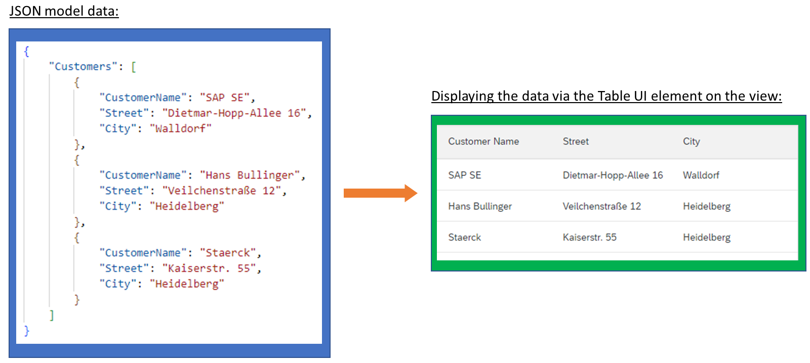
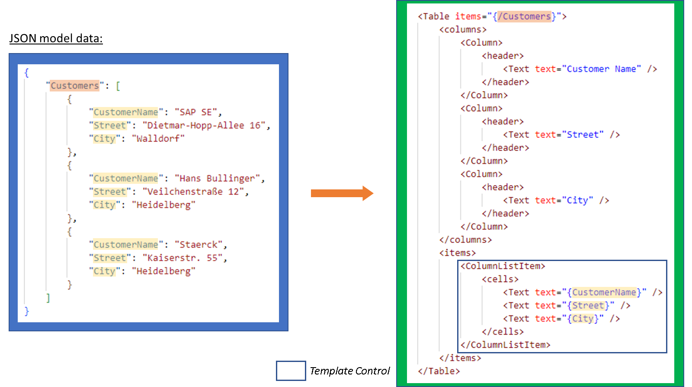
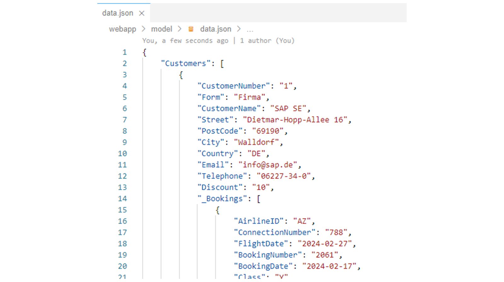
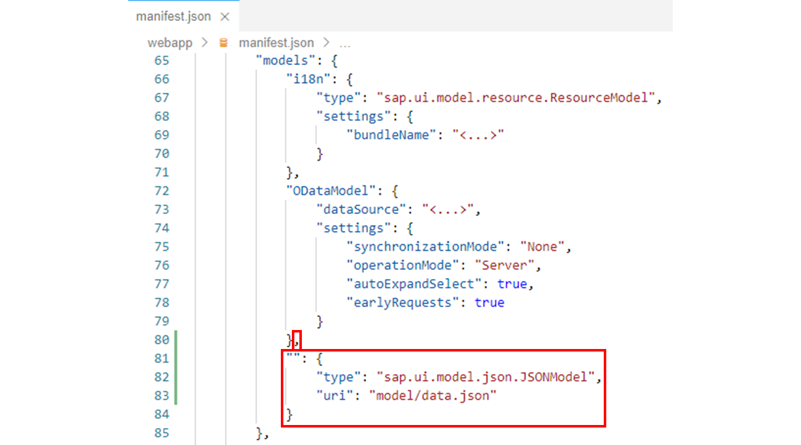
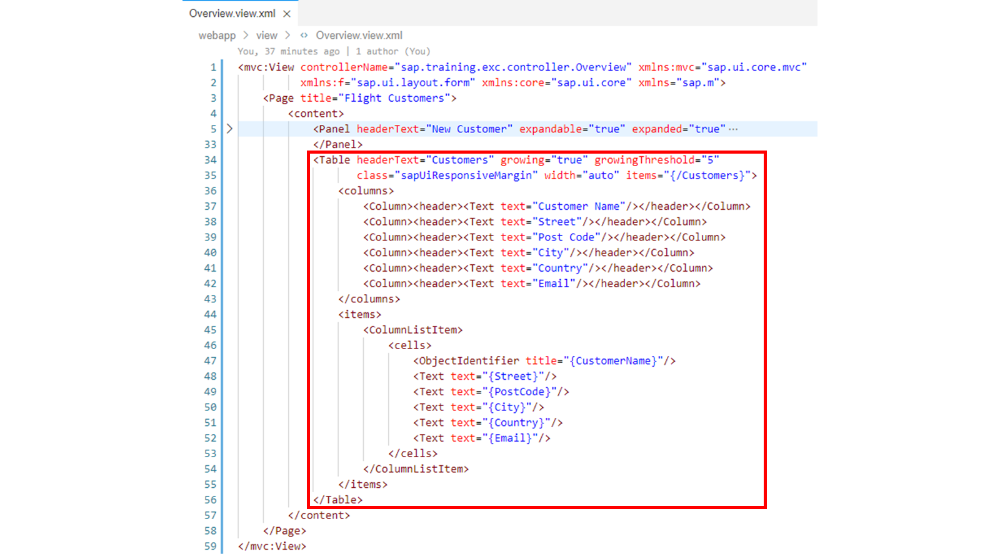

# Implementing Aggregation Binding

*Source: https://learning.sap.com/courses/developing-uis-with-sapui5-1/implementing-aggregation-binding_ec3df9a2-1115-43bf-a863-cec775ae0a48*

Objective
After completing this lesson, you will be able to implement aggregation binding
## Binding Types
In the previous lesson, you learned about the _property binding_ binding type in the context of the JSON model.
Besides property binding, there are two other binding types in SAPUI5: aggregation binding and element binding.
Watch the video to learn about the three binding types.
Aggregations of a control can only be bound to lists defined in the model, that is, to arrays in a JSON model or an entity set in an OData model.
## Aggregation Binding Using Template Controls
As mentioned previously, to bind an aggregation, you create a template or provide a factory function.

This section shows how to work with a template control in an XML view. In the example shown here, the entries from an array are to be displayed via a sap.m.Table UI element (see figure _Model Data_).

The columns aggregation is used to define the three columns of the table with their headers (see the figure _Data Binding_). No data binding is used for this yet.
For the display of the data, a binding to the items aggregation of the sap.m.Table UI element is applied. The items aggregation defines the entries displayed in the table.
The items="{/Customers}" attribute of the <Table> tag is used to pass the elements of the Customers array from the JSON model to the items aggregation of the table. The absolute binding path /Customers is needed for this purpose.
The aggregation binding requires the definition of a template that is cloned for each element of the passed array. For each clone that is created, the binding context is thereby set to the respective array element, so that all bindings of the template are resolved relative to the array element.
The template can be found in the nested items element in the figure _Data Binding_. It is a sap.m.ColumnListItem control that creates a new row for the table. This row displays customer name, street as well as city from the respective array element.
Note
The binding paths used within the sap.m.ColumnListItem control are all relative, as they are resolved relative to the array element for which the template is cloned.
## Use Aggregation Binding
### Business Scenario
In this exercise, you will add a table to the Overview view to display existing customers. To do this, you use a file prepared in the project that contains the customer data in JSON format. You make this data available to the application via a JSON model and display it through aggregation binding via the Table UI element.
| _Template:_  | Git Repository: <https://github.com/SAP-samples/sapui5-development-learning-journey.git>, Branch: **sol/11_JSON_model**  |
| --- | --- |
| _Model solution:_  | Git Repository: <https://github.com/SAP-samples/sapui5-development-learning-journey.git>, Branch: **sol/12_aggregation_binding**  |
### Task 1: Add an Automatically Instantiated JSON Model with the Prepared Customer Data to the Component
#### Steps
  1. Open the prepared data.json file from the webapp/model folder and familiarize yourself with the structure of the customer data it contains.
The customer information is contained in an array called Customers, where each customer object has the following properties: CustomerNumber, Form, CustomerName, Street, PostCode, City, Country, Email, Telephone, and Discount.
Furthermore, for each customer there is an array called _Bookings, which contains flight bookings of the respective customer.

  2. Now open the manifest.json application descriptor from the webapp folder in the editor.
  3. Add the following property to the models property from the sap.ui5 namespace to make the customer data explored above available to the component via an automatically instantiated, unnamed JSON model:
JSON
Copy codeSwitch to dark mode

```

1234

"": {
  "type": "sap.ui.model.json.JSONModel",
  "uri": "model/data.json"
}

```

#### Result
The models section of the application descriptor should now look like this:

### Task 2: Add a Table with the Customer Data from the JSON Model to the Overview View
#### Steps
  1. Open the Overview.view.xml file from the webapp/view folder in the editor.
  2. Add the following table definition directly after the </Panel> tag to display the customer data from the JSON model:
XML
Copy codeSwitch to dark mode

```

1234567891011121314151617181920212223

<Table headerText="Customers" growing="true" growingThreshold="5"
    class="sapUiResponsiveMargin" width="auto" items="{/Customers}">
  <columns>
    <Column><header><Text text="Customer Name"/></header></Column>
    <Column><header><Text text="Street"/></header></Column>
    <Column><header><Text text="Post Code"/></header></Column>
    <Column><header><Text text="City"/></header></Column>
    <Column><header><Text text="Country"/></header></Column>
    <Column><header><Text text="Email"/></header></Column>
  </columns>
  <items>
    <ColumnListItem>
      <cells>
        <ObjectIdentifier title="{CustomerName}"/>
        <Text text="{Street}"/>
        <Text text="{PostCode}"/>
        <Text text="{City}"/>
        <Text text="{Country}"/>
        <Text text="{Email}"/>
      </cells>
    </ColumnListItem>
  </items>
</Table>

```

Note
     * The attribute growing="true" of the Table UI element enables the growing feature of the table to load more items by requesting from the model. The number of items to be requested from the model for each grow is defined by the growingThreshold attribute.
     * The booking data also contained in the model data will be displayed in the next exercise via another table.
     * In a later exercise, the JSON model used here will be replaced by an OData model to display customer data from a back-end system via an OData service on the UI.
#### Result
The Overview view should now look like this:
  3. Test run your application by starting it from the SAP Business Application Studio.
Make sure that the customer data is displayed in the table on the Overview view.
    1. Right-click on any subfolder in your _sapui5-development-learning-journey_ project and select _Preview Application_ from the context menu that appears.
    2. Select the npm script named _start-noflp_ in the dialog that appears.
    3. In the opened application, check if the component works as expected.
