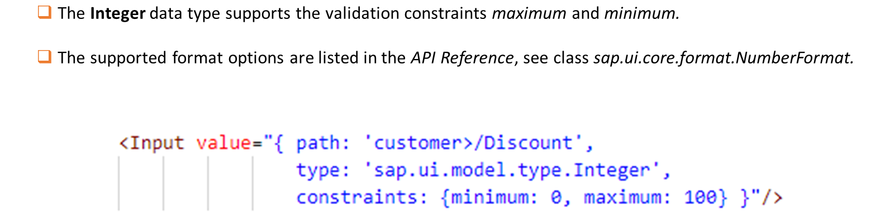
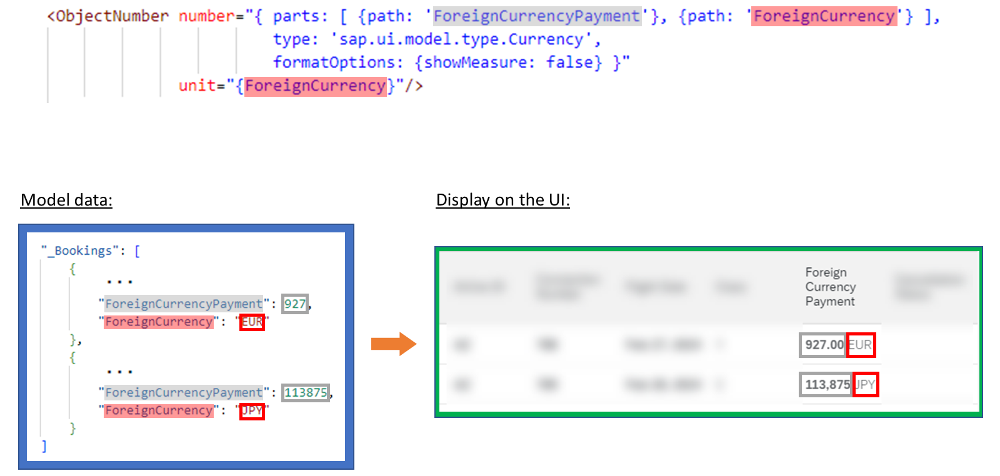
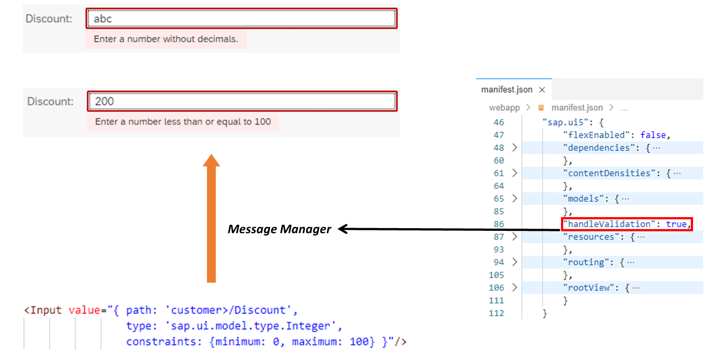
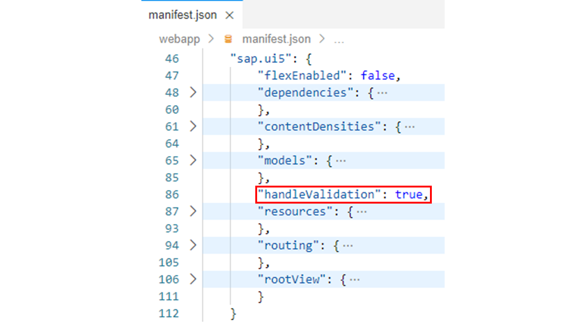
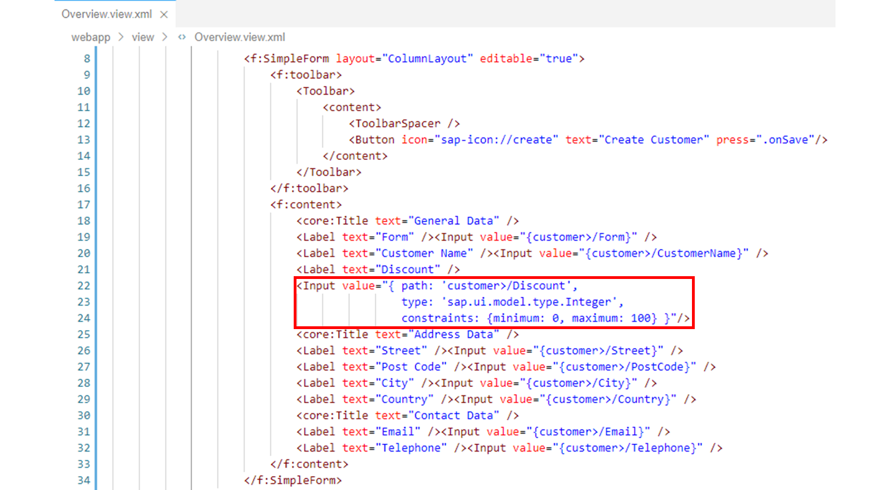
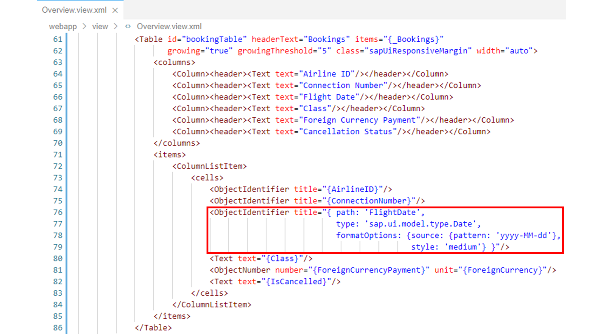
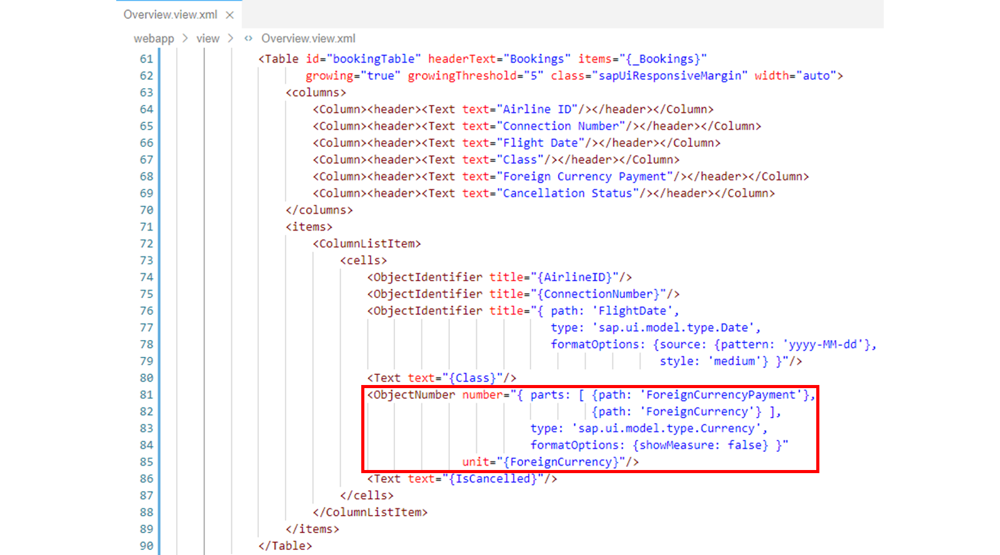

# Using Data Types

*Source: https://learning.sap.com/courses/developing-uis-with-sapui5-1/using-data-types_d37f74ff-4075-405e-a0ca-7c05baf8bf7b*

Objective
After completing this lesson, you will be able to use data types to format and validate data
## Formatting, Parsing, and Validating Data
Watch the video to learn about formatters and data types.
In this lesson, we will first discuss data types. The formatters will follow in the next lesson.
## Simple Types
As mentioned previously, data types allow you to format model data for display on the UI as well as parse and validate user input.
The currently available data types all inherit from the sap.ui.model.SimpleType class. For a complete list of all these simple types, see the _API Reference_ under the sap.ui.model.type namespace.
In this training course, the following three simple types are briefly introduced in examples: sap.ui.model.type.Integer, sap.ui.model.type.Date and sap.ui.model.type.Currency.
In addition to the simple types supplied by SAP, it is also possible to define your own custom data types. For this purpose, a subclass of SimpleType has to be created. In this subclass, a custom implementation for the methods formatValue, parseValue, and validateValue from the SimpleType class is made.
The following parameters can be passed via the constructor of a simple type:
  * formatOptions: Format options define how a value should be formatted and displayed on the UI.
  * constraints: Constraints define how a value entered on the UI should look. The entered value is validated against the specified constraints.

Simple types can be specified in data binding to define the data type of the model data. The complex binding syntax is used in XML views for this purpose.
If an entered value cannot be parsed successfully or is not within the defined constraints, an exception is raised. This results in the entered value not being transferred to the model.
### Data Type Integer

The Integer data type represents an integer value.
In the example in the figure _The Integer Data Type_ , the Input UI element is bound via complex binding syntax to the Discount property from the model named customer. The type property in the binding specifies the sap.ui.model.type.Integer data type, and the constraints property defines that only values between 0 and 100 are allowed. So if the user enters a negative value or a value greater than 100, it will not be transferred to the model.
Likewise, an entered value that cannot be parsed as an integer (for example, "abc") will not be transferred to the model.
### Data Type Date
The Date data type represents a date without time.
This type transforms a given value in the model into a formatted date string and the other way round.

In the example shown in the figure _The Date Data Type_ , the _Bookings array from the model data is output via a table on the UI. Each booking from the array contains a FlightDate property, which is displayed as a separate column in the table. For the binding of this table column the complex binding syntax is used as above.
The type property in the binding specifies the data type sap.ui.model.type.Date. Via formatOptions the data format of the flight date in the model data is specified with the provided pattern in the source property. Such a pattern could also be used to define the output format. However, the use of a style ("short, "medium", "long" or "full") is preferred because it automatically uses a local-dependent date pattern.
The Date type supports the following validation constraints:
  * maximum (expects a date presented in the source-pattern format)
  * minimum (expects a date presented in the source-pattern format)

For more information, see the _API Reference_ for sap.ui.model.type.Date.
### Data Type Currency
The Currency data type is a composite type. It consists of the parts "amount" (of type number or string) and "currency" (of type string).

In the example shown in the figure _The Currency Data Type_ , the _Bookings array from the model data is output via a table on the UI. Each booking from the array has two properties ForeignCurrencyPayment and ForeignCurrency. An ObjectNumber UI element displays the values of these two properties in one table column as an amount with currency.
For the binding of the number property complex binding syntax is used to specify sap.ui.model.type.Currency as type for the model data.
The parts array also specified in the binding contains the two paths to the values required by the Currency data type (amount and currency).
Additionally, the showMeasure formatting option is set to false. This hides the currency code in the number property , because it is passed on to the ObjectNumber control as a separate property unit.
As a result, the Currency data type provides currency code based formatting of the ForeignCurrencyPayment model property. For example, currency amounts in Euro (EUR) are displayed with 2 decimals, while amounts in Japanese Yen (JPY) have no decimals.
For more information, see the _API Reference_ for sap.ui.model.type.Currency.
## Validation Handling
If you press _Enter_ or move the focus to a different UI control, SAPUI5 executes the parse and validation function belonging to the corresponding data type.
If parse or validation exceptions occur due to incorrect user input, these errors are not automatically displayed on the UI.
You can use the message manager for reporting these error messages back to the user. To do it, you must register the corresponding UI elements with the message manager. There are several ways to do this.
You can activate automatic message generation via the message manager in the sap.ui5 section of the manifest.json application descriptor or as a parameter when instantiating a component. You can also activate it for individual controls by registering the controls in the message manager using the registerObject method.

In the example shown in the figure _Validation Handling Using the Message Manager_ , the handleValidation property in the application descriptor is used to enable validation handling by the message manager for the component.
As a result, parse and validation errors are handled by the message manager for all UI elements used in the component. That is, any parse and validation error messages generated based on the user input are picked up by the message manager, which in turn passes the error message back to the correct UI element for display.
A field in error has a red border. The error message itself is only displayed when the field has focus.
## Work with Data Types
### Business Scenario
In this exercise, you will add validations and formatting to the application. To do this, you will first enable automatic message creation for input validation using the application descriptor. Then, you will add Simple Types to some of the data bindings you have already created to validate or format data.
| _Template:_  | Git Repository: <https://github.com/SAP-samples/sapui5-development-learning-journey.git>, Branch: **sol/13_element_binding**  |
| --- | --- |
| _Model solution:_  | Git Repository: <https://github.com/SAP-samples/sapui5-development-learning-journey.git>, Branch: **sol/14_data_types**  |
### Task 1: Enable Validation Handling by the Message Manager for the Component
#### Steps
  1. Open the manifest.json application descriptor from the webapp folder in the editor.
  2. Add the following property somewhere in the sap.ui5 namespace to enable validation handling by the message manager for the component:
JSON
Copy codeSwitch to dark mode

```

1

"handleValidation": true

```

#### Result
The sap.ui5 namespace should now look similar to the following:

### Task 2: Validate and Format Application Data using Simple Types
#### Steps
  1. Open the Overview.view.xml file from the webapp/view folder in the editor.
  2. Adapt the data binding for the _Discount_ input element in the form as follows:
| **Old**  | **New**  |
| --- | --- |
|  XML Copy codeSwitch to dark mode
```
1
<Input value="{customer>/Discount}"/>
```
 |  XML Copy codeSwitch to dark mode
```

123456

<Input
  value="{
    path: 'customer>/Discount',
    type: 'sap.ui.model.type.Integer',
    constraints: {minimum: 0, maximum: 100}
  }"/>
```
 |
Note
With regard to input validation, the adapted data binding causes the message manager to display an error in the following situations:
     * If the user input cannot be parsed as an integer.
     * If the entered integer value is not between 0 and 100.
#### Result
The form should now look like this:
  3. Adapt the data binding for the _Flight Date_ column in the booking table as follows:
| **Old**  | **New**  |
| --- | --- |
|  XML Copy codeSwitch to dark mode
```
1
<ObjectIdentifier title="{FlightDate}"/>
```
 |  XML Copy codeSwitch to dark mode
```

123456789

<ObjectIdentifier
  title="{
    path: 'FlightDate',
    type: 'sap.ui.model.type.Date',
    formatOptions: {
      source: {pattern: 'yyyy-MM-dd'},
      style: 'medium'
    }
  }"/>
```
 |
Note
The adapted data binding transforms the content of the FlightDate model property into a formatted date string. In the data.json file from the webapp/model folder, the flight date is stored as a string, for example "2024-02-27". This is converted to the format "Feb 27, 2024" via the data binding.
#### Result
The booking table should now look like this:
  4. Adapt the data binding for the _Foreign Currency Payment_ column in the booking table as follows:
| **Old**  | **New**  |
| --- | --- |
|  XML Copy codeSwitch to dark mode
```

123

<ObjectNumber
  number="{ForeignCurrencyPayment}"
  unit="{ForeignCurrency}"/>
```
 |  XML Copy codeSwitch to dark mode
```

12345678910

<ObjectNumber
  number="{
    parts: [
      {path: 'ForeignCurrencyPayment'},
      {path: 'ForeignCurrency'}
    ],
    type: 'sap.ui.model.type.Currency',
    formatOptions: {showMeasure: false}
  }"
  unit="{ForeignCurrency}"/>
```
 |
Note
The added Currency data type provides a formatting of the ForeignCurrencyPayment model property based on the currency code. For example, currency amounts in Euro (EUR) are displayed with 2 decimals, while amounts in Japanese Yen (JPY) have no decimals.
Additionally, the showMeasure formatting option is set to false. This hides the currency code in the number property , because it is passed on to the ObjectNumber control as a separate property unit.
#### Result
The booking table should now look like this:
  5. Test run your application by starting it from the SAP Business Application Studio.
Make sure that the validation and formatting features outlined above are now present in the application.
    1. Right-click on any subfolder in your _sapui5-development-learning-journey_ project and select _Preview Application_ from the context menu that appears.
    2. Select the npm script named _start-noflp_ in the dialog that appears.
    3. In the opened application, check if the component works as expected.
