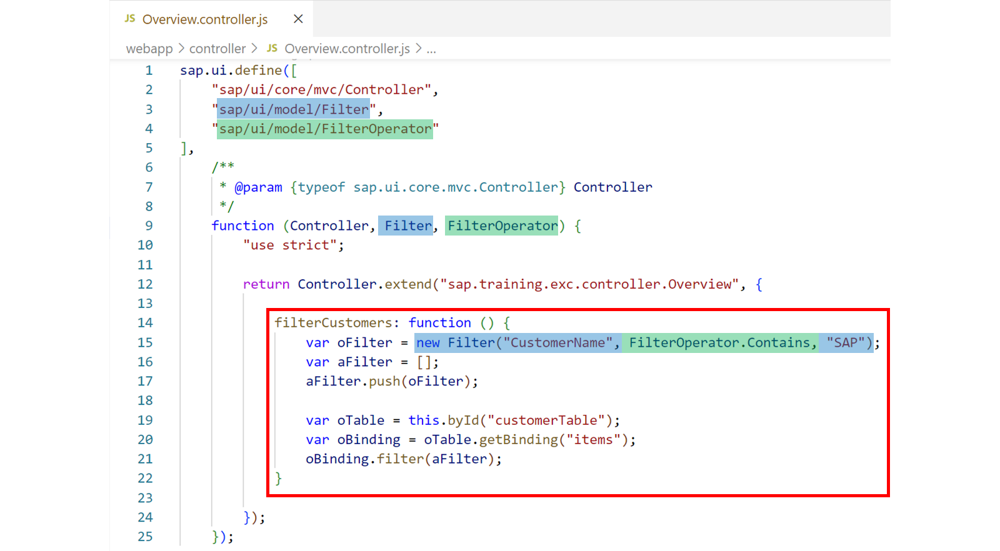
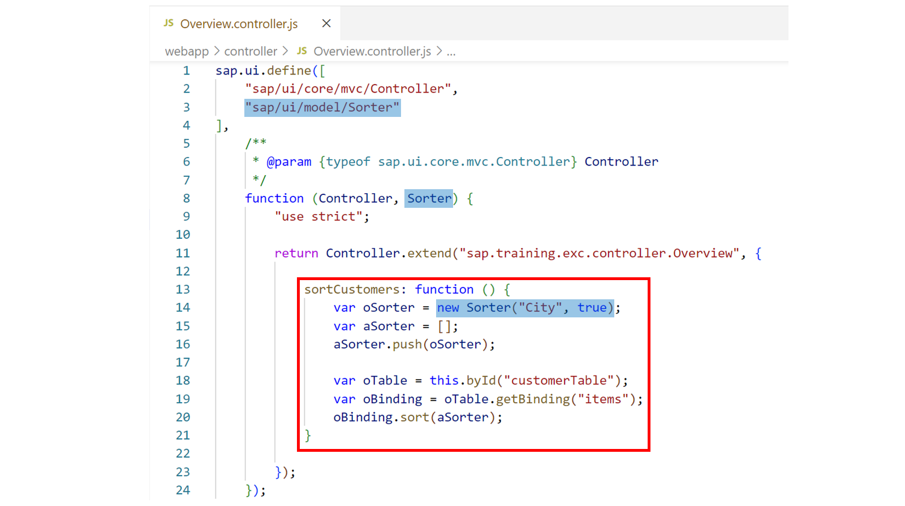
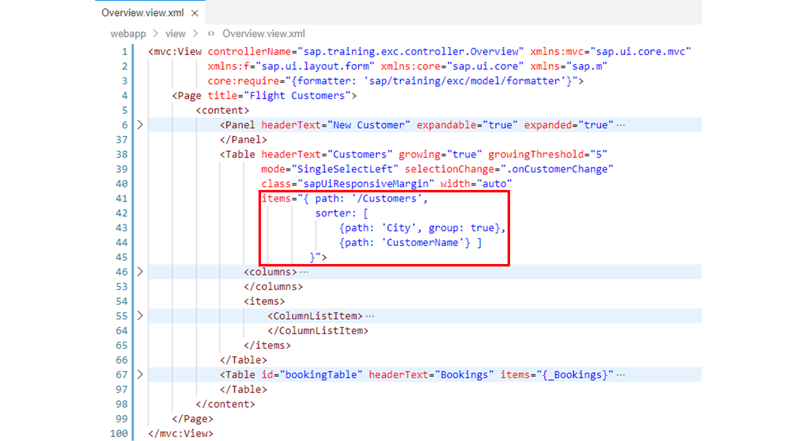
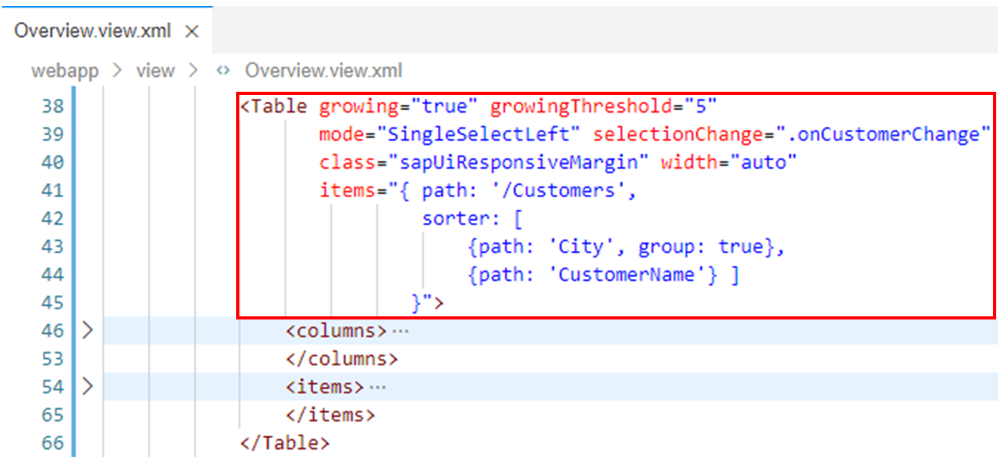
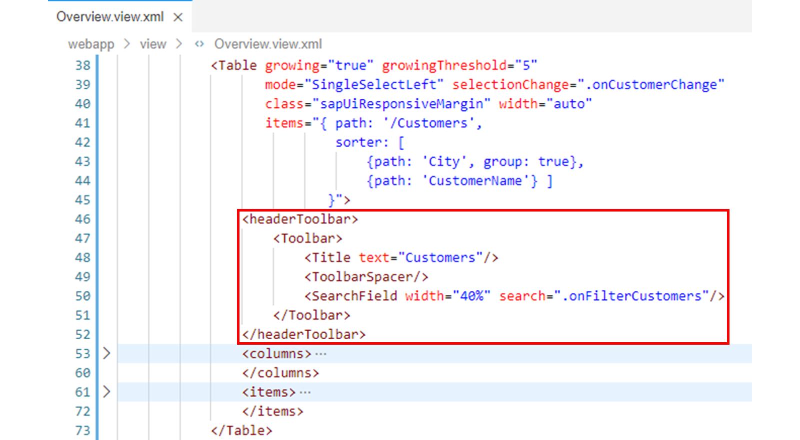
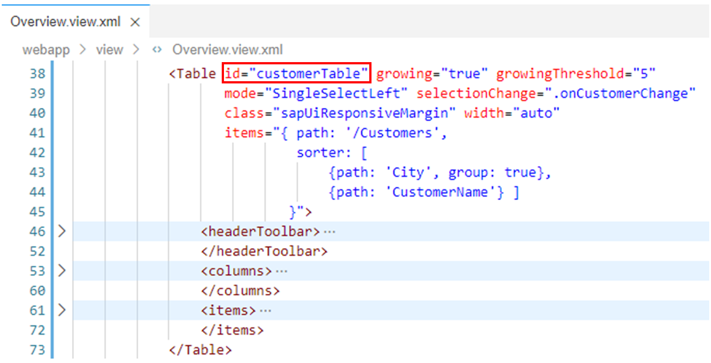
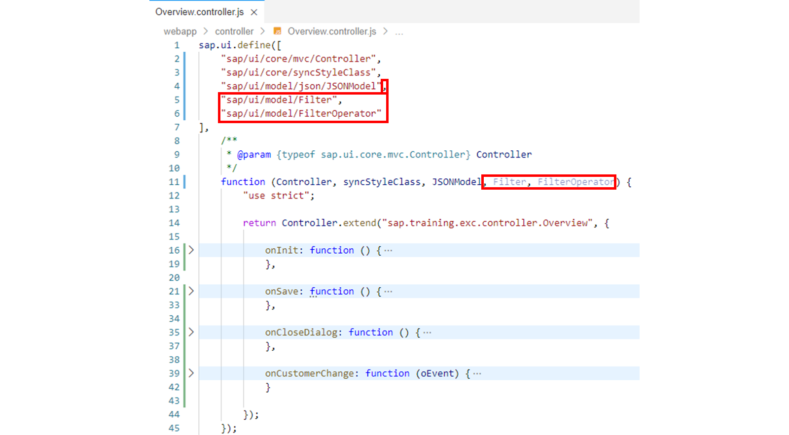
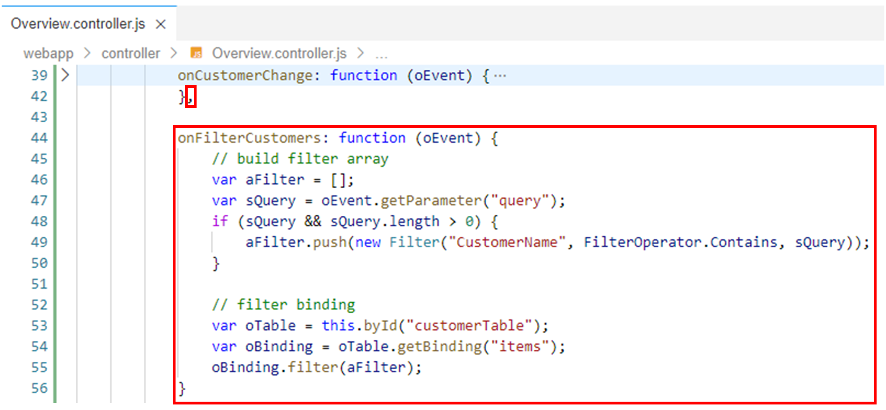

# Sorting and Filtering

*Source: https://learning.sap.com/courses/developing-uis-with-sapui5-1/sorting-and-filtering_c49a908a-4cef-4234-bcfd-a32d0f03e7de*

Objective
After completing this lesson, you will be able to use the capabilities offered by SAPUI5 to sort and filter model data
## Initial Sorting and Filtering
With the aggregation binding, sort and filter criteria can be provided for the initial display of the data. In XML views, the complex binding syntax is employed for this purpose.
Watch this video to learn more about sorting and filtering for initial display of data.
## Sorting and Filtering API
### Filtering
To filter data manually after the aggregation binding is complete, you can access the corresponding binding object and call the filter method on it. The method applies a new set of filters to the data represented by the queried binding. The filters passed are objects of class sap/ui/model//Filter.

The example in the figure _Using the filter Method_ shows the view controller method filterCustomers, which is used to filter the data in the customer table.
First, this method instantiates a Filter object that filters the model data for those customers that contain the string "SAP" in the CustomerName property.
The created Filter object is added to an array via the push method.
Then the customer table on the view is retrieved via its Id, and the binding object for its items aggregation is queried. Finally, the filter method is called on the binding object and the array with the Filter object is passed to it.
As a result, only those customers are displayed in the customer table on the UI whose customer name contains the string "SAP".
### Sorting
To sort data manually after the aggregation binding is complete, you can access the corresponding binding object and call the sort method on it. The sort method sorts the data represented by the queried binding according to the passed sorter object. Instead of a single sorter also an array of sorters can be passed to the sort method. In this case they are processed in the sequence in which they are contained in the array. The sorters passed are objects of class sap/ui/model/Sorter.

The example in the figure _Using the sort Method_ shows the view controller method sortCustomers, which is used to sort the data in the customer table.
First, this method instantiates a Sorter object that sorts the model data in descending order by the City property. The second (optional) parameter of the constructor specifies the sort direction. Its default value is false, which means an ascending sort.
The created Sorter object is added to an array via the push method.
Then the customer table on the view is retrieved via its Id, and the binding object for its items aggregation is queried. Finally, the sort method is called on the binding object and the array with the Sorter object is passed to it.
As a result, the customer table on the UI is sorted by City in descending order.
## Sort and Filter Table Data
### Business Scenario
In this exercise, you will implement an initial sort for the table with the customer data: The customers are to be sorted in ascending order by the city and, as a second sort criterion, in ascending order by the customer name. In addition, the data should be grouped by the city.
Then you add a filter option to the customer table. For this purpose, you create a toolbar with a search field for the table. When searching, the content of the customer table should be updated so that only the customers whose name matches the search term are displayed. To achieve this, you will implement a corresponding event handler method for the search field.
| _Template:_  | Git Repository: <https://github.com/SAP-samples/sapui5-development-learning-journey.git>, Branch: **sol/15_formatters**  |
| --- | --- |
| _Model solution:_  | Git Repository: <https://github.com/SAP-samples/sapui5-development-learning-journey.git>, Branch: **sol/16_filtering_and_sorting**  |
### Task 1: Sort and Group the Data in the Customer Table Initially
#### Steps
  1. Open the Overview.view.xml file from the webapp/view folder in the editor.
  2. Implement declaratively that the entries in the customer table are initially sorted and grouped as follows: The customers are to be sorted in ascending order by city and, as a second sort criterion, in ascending order by customer name. In addition, the data should be grouped by the city.
To do this, change the data binding specified via the items attribute in the <Table> tag for the customer table as follows:
| **Old**  | **New**  |
| --- | --- |
|  XML Copy codeSwitch to dark mode
```
1
items="{/Customers}"
```
 |  XML Copy codeSwitch to dark mode
```

123456

items="{
  path: '/Customers',
  sorter: [
    {path: 'City', group: true},
    {path: 'CustomerName'} ]
}"
```
 |

#### Result
The data binding for the customer table should now look like this:

### Task 2: Implement a Filter Option with regard to the Customer Name
#### Steps
  1. Make sure that the Overview.view.xml file is open in the editor.
  2. In the next step, you will add a header toolbar to the customer table. However, if the headerToolbar aggregation used for this is set for the table, SAPUI5 ignores the headerText property. Therefore, delete the headerText="Customers" attribute from the <Table> tag for the customer table. You will use the header toolbar to set a title for the table again in the next step.
#### Result
The <Table> tag for the customer table should now look similar to the following:
  3. Now add the following headerToolbar aggregation to the customer table to create a toolbar with a table title and a search field:
XML
Copy codeSwitch to dark mode

```

1234567

<headerToolbar>
  <Toolbar>
    <Title text="Customers"/>
    <ToolbarSpacer/>
    <SearchField width="40%" search=".onFilterCustomers"/>
  </Toolbar>
</headerToolbar>

```

Note
The title serves as a replacement for the header text deleted above. The search field allows the user to enter a filter value, whereby the content of the customer table is to be updated so that only customers whose name matches the filter value entered are displayed in the table. For this purpose, the onFilterCustomers event handler method, which is yet to be implemented, is registered for the search event of the search field.
#### Result
The customer table with the added toolbar should now look like this:
  4. In the implementation of the onFilterCustomers event handler method registered above, the customer table will be accessed. For this purpose, specify an Id for the _Table_ UI element by adding the attribute id="customerTable" to the <Table> tag for the customer table.
#### Result
The <Table> tag for the customer table should now look similar to the following:
  5. Now open the Overview.controller.js file from the webapp/controller folder in the editor.
  6. For the implementation of the onFilterCustomers event handler method on the view controller the modules sap/ui/model/Filter and sap/ui/model/FilterOperator are needed. Add these two modules to the dependency array of the view controller and the corresponding parameters named Filter and FilterOperator to the factory function of the view controller.
#### Result
The view controller should now look like this:
  7. Now add the onFilterCustomers event handler method registered for the search event of the search field to the view controller. Implement this method as follows to filter the table content by the customer name:
JavaScript
Copy codeSwitch to dark mode

```

1234567891011

onFilterCustomers: function (oEvent) {
  var aFilter = [];
  var sQuery = oEvent.getParameter("query");
  if (sQuery && sQuery.length > 0) {
    aFilter.push(new Filter("CustomerName", FilterOperator.Contains, sQuery));
  }

  var oTable = this.byId("customerTable");
  var oBinding = oTable.getBinding("items");
  oBinding.filter(aFilter);
}

```

Note
The search event defines a query parameter that contains the search string that the user entered in the search field. This query parameter is accessed by calling getParameter("query") on the oEvent parameter.
If the search string is not empty, a new filter object is constructed and added to the still empty array of filters. The defined filter searches for the passed search string in the CustomerName model property. The FilterOperator.Contains filter operator used in this process is not case sensitive.
The customer table is accessed using the Id you specified in the view. On the table control, the binding of the items aggregation is accessed to filter it with the newly constructed filter object. This automatically filters the table by the search string so that only the matching items are displayed when the search is triggered.
However, if the query parameter is empty, the binding will be filtered with an empty array. This ensures that you see all table entries again.
#### Result
The view controller should now contain the following additional method:
  8. Test run your application by starting it from the SAP Business Application Studio.
Make sure that the entries in the customer table are initially sorted and grouped. Also make sure that the table content can be filtered by customer name using the search field in the toolbar.
    1. Right-click on any subfolder in your _sapui5-development-learning-journey_ project and select _Preview Application_ from the context menu that appears.
    2. Select the npm script named _start-noflp_ in the dialog that appears.
    3. In the opened application, check if the component works as expected.
