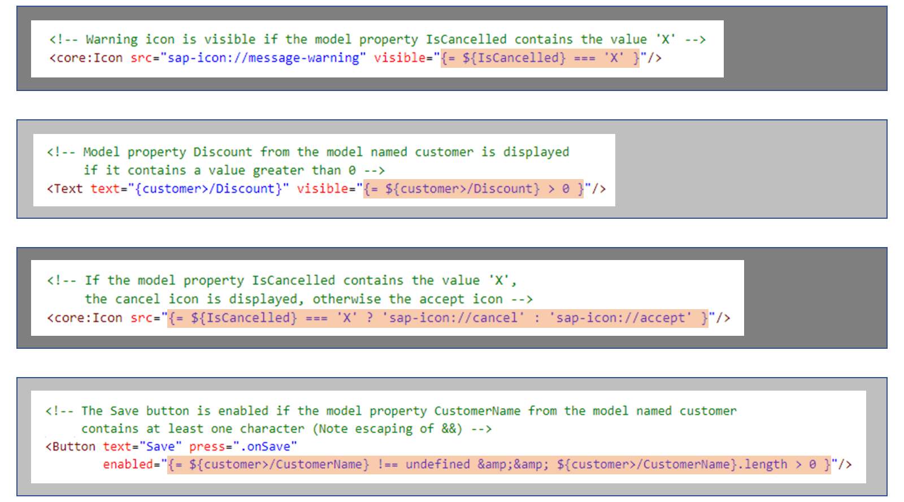
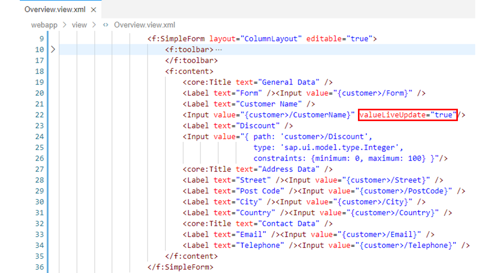
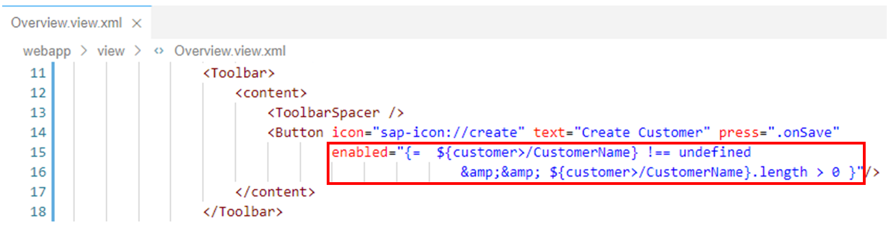
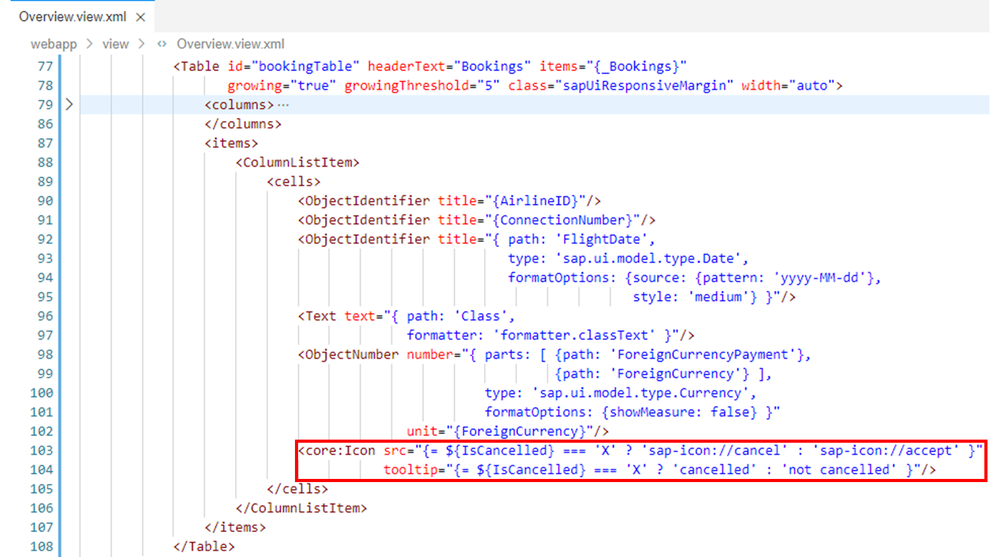

# Using Expression Binding

*Source: https://learning.sap.com/courses/developing-uis-with-sapui5-1/using-expression-binding_f526aa89-c886-4747-b74a-224648380e76*

Objective
After completing this lesson, you will be able to use expression binding to format the output on a view
## Expression Binding
Expression binding is an enhancement of the SAPUI5 binding syntax, which allows for providing expressions instead of formatter functions.
Using expression binding saves the overhead of defining a function and is recommended if the formatter function has a trivial implementation like a comparison of values.
To use expression binding, you need to enable complex binding syntax for the application.
Note
Complex binding syntax is automatically enabled when the attribute data-sap-ui-compatVersion="edge" is added to the bootstrap script.

An expression binding is specified in an XML view by one of the following two options:
  * {= expression}
This variant uses one-way binding. This allows the automatic recalculation if the model values change.
  * {:= expression}
This variant uses one-time binding, meaning that the value is calculated only once. This variant needs less resources because no change listeners to the model have to be maintained.

The syntax of the expression is similar to JavaScript syntax, but you can only use a subset of the JavaScript expression syntax. Among others, the following syntax elements are available:
  * Strict equality operators:
===, !==
  * Relational operators:
<, >, <=, >=
  * Conditional operator:
?
  * Binary logical operators:
&&, ||
  * Global symbols:
For example, undefined

Additionally, you can embed values from the model layer into an expression by using the following syntax:
XML
Copy codeSwitch to dark mode

```

1

${binding}

```

binding can either be a simple path, or a complex binding.
For embedded bindings with standard data types such as String, members and member methods can be accessed with the . operator as in the following example:
XML
Copy codeSwitch to dark mode

```

1

${/CustomerName}.length

```

Note
Some characters that are used by operators need to be escaped in XML views, for example && needs to be escaped with &&.
Examples of expression binding can be found in the figure _Using Expression Binding_.
## Use Expression Binding
### Business Scenario
In this exercise, you will assign a value to the enabled property of the _Create Customer_ button on the Overview view using expression binding: only if the form field for the customer name contains a value, the enabled property should have the value true, that is, the button should be enabled, otherwise it should be disabled. Furthermore, you will use expression binding to format the content of the _Cancellation Status_ column in the booking table using icons from the SAPUI5 icon font.
| _Template:_  | Git Repository: <https://github.com/SAP-samples/sapui5-development-learning-journey.git>, Branch: **sol/16_filtering_and_sorting**  |
| --- | --- |
| _Model solution:_  | Git Repository: <https://github.com/SAP-samples/sapui5-development-learning-journey.git>, Branch: **sol/17_expression_binding**  |
### Task 1: Set the enabled Property of the _Create Customer_ Button Depending on the Value of the Input Field for the Customer Name
#### Steps
  1. Open the Overview.view.xml file from the webapp/view folder in the editor.
  2. Add the attribute valueLiveUpdate="true" to the Input UI element for the customer name.
Note
This causes the value of the value property of the Input UI element to be updated after each keystroke. Otherwise, the value would not be updated until the input field is exited or the _Enter_ key is pressed.
#### Result
The form for the customer data should now look like this:
  3. Now add the enabled attribute to the _Create Customer_ button. Assign it the value true or false as follows to ensure that the button is only enabled if the form field for the customer name contains a value:
XML
Copy codeSwitch to dark mode

```

1

enabled="{= ${customer>/CustomerName} !== undefined && ${customer>/CustomerName}.length > 0 }"

```

Note
Because of the valueLiveUpdate attribute you added to the customer name field above, the button will be enabled as soon as you enter the first character in the empty customer name field. Conversely, the button will be disabled as soon as you delete the last character in the customer name field.
#### Result
The _Create Customer_ button should now look like this:

### Task 2: Format the Cancellation Status in the Booking Table Using Icons from the SAPUI5 Icon Font
#### Steps
  1. Make sure that the Overview.view.xml file is open in the editor.
  2. The cancellation status is currently displayed in the booking table via a Text UI element. This shows the content of the IsCancelled model property, which contains an **X** if a booking was cancelled.
Using expression binding, the sap-icon://cancel icon from the SAPUI5 icon font should now be displayed if a booking has been cancelled. For non-cancelled bookings, the sap-icon://accept icon should be displayed.
For this reformatting, delete <Text text="{IsCancelled}"/> from the cells aggregation and replace it with the following Icon UI element. In addition to the icons, the tooltips _cancelled_ and _not cancelled_ are also set.
XML
Copy codeSwitch to dark mode

```

12

<core:Icon src="{= ${IsCancelled} === 'X' ? 'sap-icon://cancel' : 'sap-icon://accept' }"
           tooltip="{= ${IsCancelled} === 'X' ? 'cancelled' : 'not cancelled' }"/>

```

Note
The available icons can be looked up via the [Icon Explorer](https://ui5.sap.com/test-resources/sap/m/demokit/iconExplorer/webapp/index.html) tool in the [SAPUI5 Demo Kit](https://ui5.sap.com/).
#### Result
The booking table should now look like this:
  3. Test run your application by starting it from the SAP Business Application Studio.
Make sure that the _Create Customer_ button is enabled only when the customer name input field contains a value. Also make sure the cancellation status in the booking table is now displayed via icons with tooltip.
    1. Right-click on any subfolder in your _sapui5-development-learning-journey_ project and select _Preview Application_ from the context menu that appears.
    2. Select the npm script named _start-noflp_ in the dialog that appears.
    3. In the opened application, check if the component works as expected.
