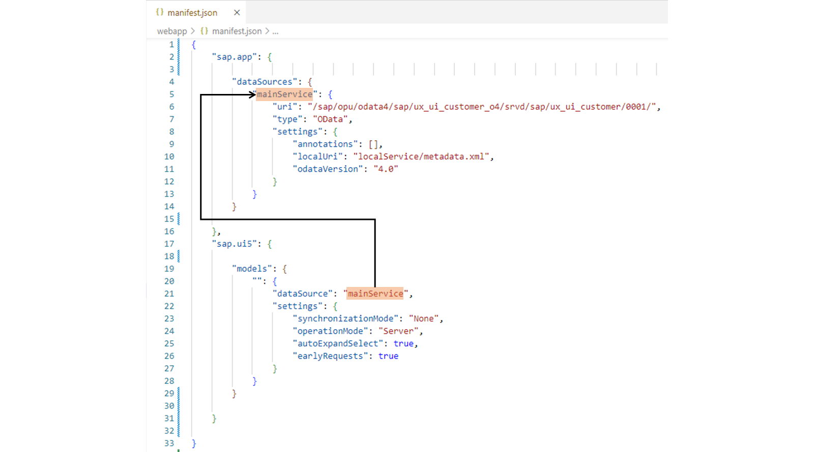
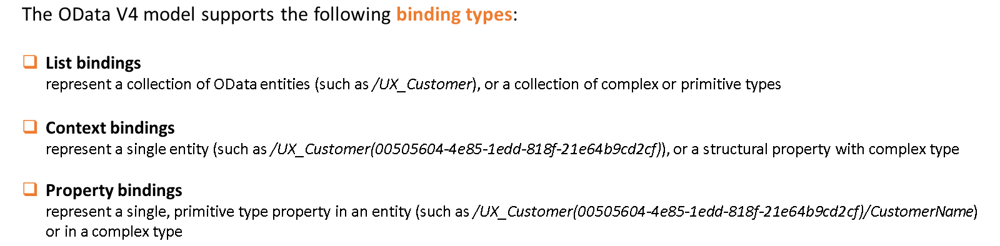
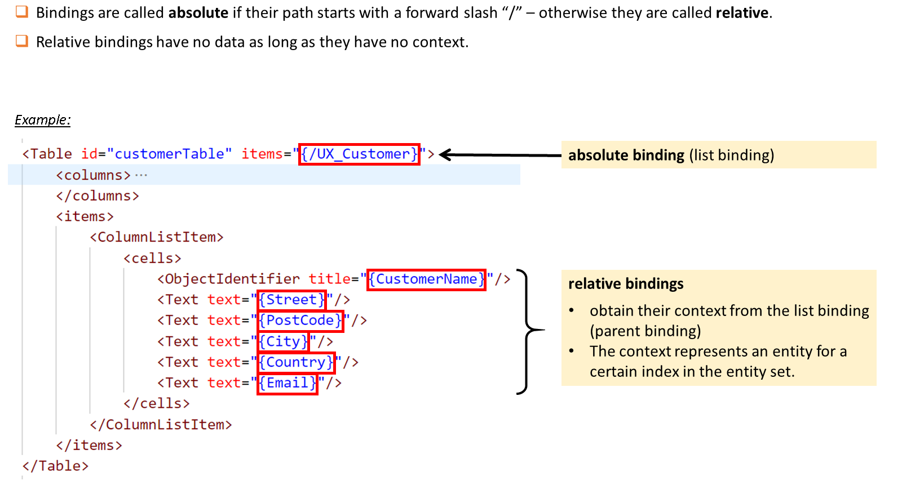
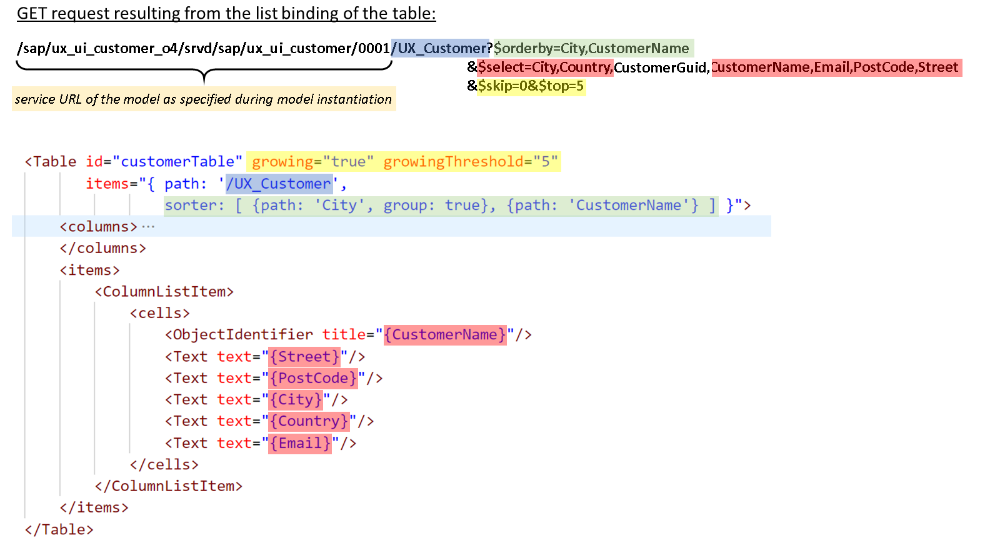
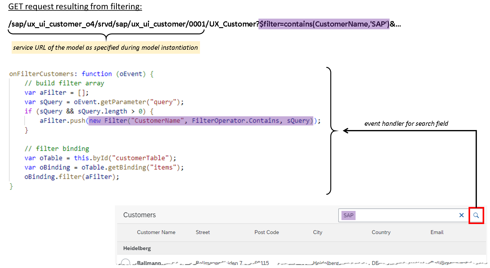
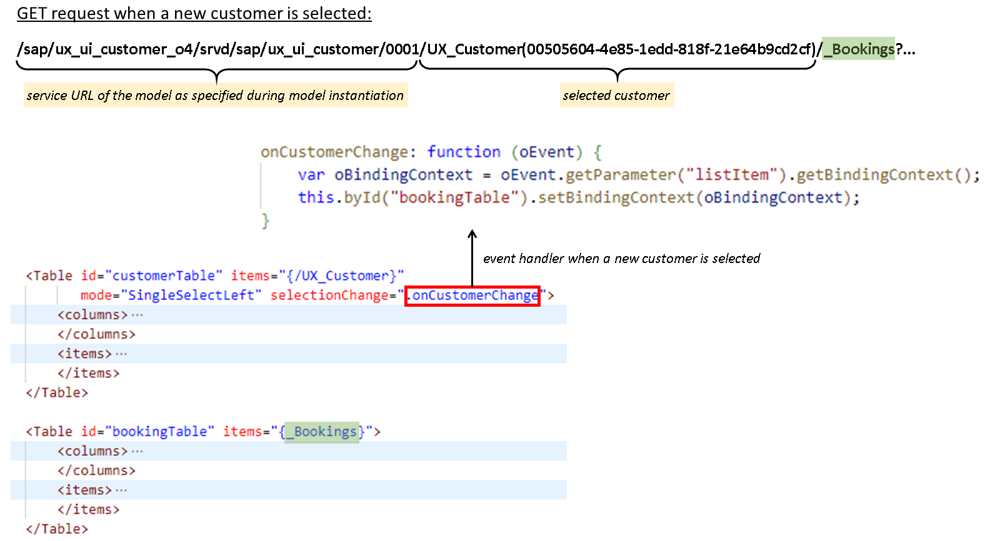
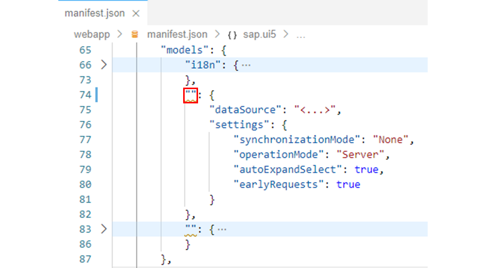
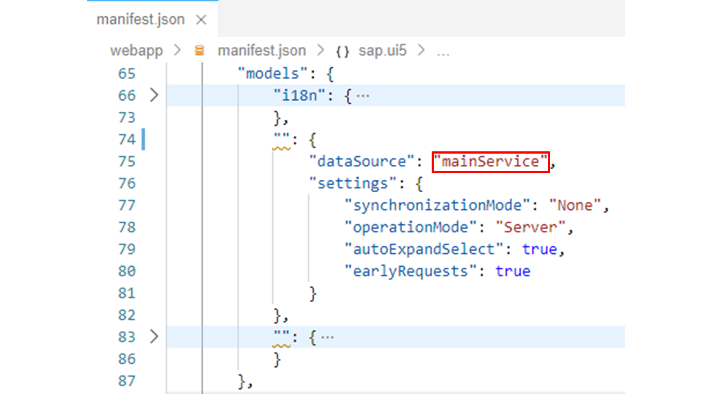
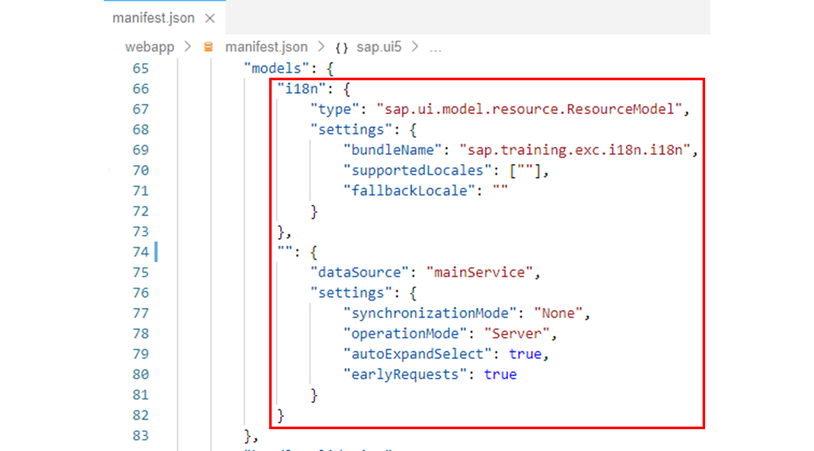
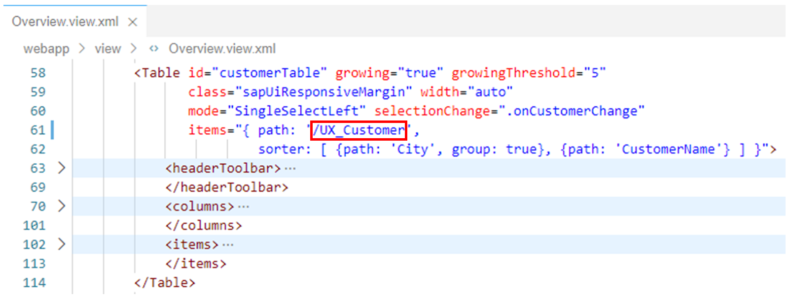

# OData Model

*Source: https://learning.sap.com/courses/developing-uis-with-sapui5-1/reading-data-through-an-odata-model_e7de231b-e1ae-46f9-a298-14da24ef940b*

Objective
After completing this lesson, you will be able to read data from an OData service via an SAPUI5 OData model
## OData Model
The OData model enables binding of controls to data from OData services.
Watch the video to learn about the SAPUI5 OData model.
Settings
The OData V4 model covered in this course supports the following:
  * Read access
  * Deleting and creating entities
  * Updating properties of OData entities (in entity sets and contained entities) via two-way-binding
  * Operation (function and action) execution
  * Grouping data requests in a batch request
  * Server-side sorting and filtering

## Model Instantiation
An OData V4 model instance can be created in JavaScript using the constructor of the sap.ui.model.odata.v4.ODataModel class. A map with parameters must be passed to the constructor. This map must contain at least the parameters serviceUrl and synchronizationMode.
The value for serviceUrl is the root URL of the service to request data from. The path part of the URL must end with a forward slash according to the OData V4 specification.
The parameter synchronizationMode controls synchronization between different bindings which refer to the same data for the case data changes in one binding. This parameter must be set to _'None'_ which means bindings are not synchronized at all; all other values are not supported and lead to an error.
Note
For more information, see the documentation of the constructor of the sap.ui.model.odata.v4.ODataModel class in the API reference in the Demo Kit.

Alternatively, an OData V4 (as well as V2) model can also be instantiated declaratively via the manifest.json application descriptor. The example shows the parts of the application descriptor that are relevant for this.
In the sap.app namespace the dataSources attribute is used to specify an OData service that is used in the component. As key of the data source mainService is used, whereby the name of the key is arbitrary. The mainService data source contains important information – over which URL the service can be called as well as that it is an OData V4 service.
The models attribute in the sap.ui5 namespace is then used to specify an OData model that consumes the OData V4 service from the mainService data source. This OData V4 model is automatically instantiated and set for the component. No name is used for the model, since an empty string ("") is specified as the key.
The settings object in the definition of the OData model is passed to the constructor of the sap.ui.model.odata.v4.ODataModel class. It contains the synchronizationMode parameter described previously.
In addition, the following parameters are used:
  * operationMode
This parameter defines the operation mode for filtering and sorting. _"Server"_ means that these operations are executed on the server by appending corresponding URL parameters ($filter, $orderby). Each change in filtering or sorting triggers a new request to the server.
  * earlyRequests
This Boolean parameter determines whether the Service Metadata Document ($metadata), additional annotations files and the security token are requested at the earliest convenience.
  * autoExpandSelect
This Boolean parameter determines whether the OData model's bindings automatically generate $select and $expand system query options. If set to true, SAPUI5 only selects data needed for the UI, so that you get a minimal response size and improved performance.

Note
For more information, see the documentation of the constructor of the sap.ui.model.odata.v4.ODataModel class in the API reference in the Demo Kit.
If you select an OData service for the application when running through the wizard for creating a new SAPUI5 project in the SAP Business Application Studio, a corresponding data source and an OData model referencing it are automatically added to the application descriptor.
## Bindings
### Binding Types
Bindings connect SAPUI5 view elements to model data, allowing changes in the model to be reflected in the view element and vice versa.

Every resource path (relative to the service root URL, no query options) is a valid data binding path within the OData model if a leading slash is added. For example, you can use _/UX_Customer(00505604-4e85-1edd-818f-21e64b9cd2cf)_ to access an entity instance with key _00505604-4e85-1edd-818f-21e64b9cd2cf_.
### Absolute and Relative Bindings
Bindings are called absolute if their path starts with a forward slash "/"; otherwise they are called relative. Relative bindings are initial, meaning that they have no data as long as they have no context. They obtain a context either from a list binding where the context represents an entity for a certain index in an entity collection, or from a context binding where the context represents the one entity of the context binding.
The binding that created the context is called the parent binding of the relative binding; the relative binding is a child binding of its parent binding.

The figure, Absolute and Relative Bindings, shows an absolute list binding: A table's items aggregation is bound to the UX_Customer entity set using the path **/UX_Customer**. The columns define relative bindings with paths **CustomerName** , **Street** , **PostCode** , **City** , **Country** , and **Email** , with the absolute list binding as parent binding.
## OData Requests
### Generated Requests
An absolute binding creates a data service request to read data once data is requested by a bound control or a child control with a relative binding. The read URL path is the model's service URL concatenated with the binding's path.

In the example shown, the following OData request is generated to retrieve the data for the table:
To the service URL (/sap/ux_ui_customer_o4/srvd/sap/ux_ui_customer/0001/), which was specified when the model was instantiated (see above), the binding path used for the items aggregation (/UX_Customer) is appended. This results in the URL to request the UX_Customer entity set via the service.
Query options are also derived from the binding of the table and appended to the generated URL:
Since the table has the growing feature enabled, only the first 5 entities are requested from the OData service during the initial request. This is implemented through $skip=0&$top=5. If the user requests additional data, a subsequent request is generated with $skip=5&$top=5 to retrieve the next 5 entities and so on.
The sort order defined in the binding for the table is also applied to the OData request via $orderby=City,CustomerName.
Note
To use server-side sorting and filtering, the operation mode of the OData model must be set to Server. This can be done via the operationMode model parameter in the application descriptor (see above). Without this operation mode, the sorting defined in the binding of the table will result in an error.
Finally, only those properties are requested via $select that are also displayed in the table.
Note
In order for the OData V4 model to automatically compute $select as well as $expand query options for service requests from binding paths specified for control properties, the autoExpandSelect flag must be set during model construction (see above). Without this flag, all properties of a customer would be requested in the example.
The CustomerGuid property is selected even though it is not bound to the UI. It is automatically selected because it is the key property of the customer.
### Filtering
The OData V4 model also supports server-side filtering of lists.

In the example, the user can filter the content of a table with customer data via a search field. The filtering of the data is implemented in the event handler shown. In it, a sap.ui.model.Filter object is created that filters the table content with respect to the content of the CustomerName property. Only those customers are displayed whose customer name contains the value entered by the user (sQuery). In the example, **SAP** was entered as filter value.
To set the filter object, the list binding object for the items aggregation of the table is retrieved. The filter object is passed to this object via the filter method. This in turn leads to an OData request, that applies the filter over $filter=contains(CustomerName,'SAP').
Note
Keep in mind that for server-side sorting and filtering, the operation mode of the OData model must be set to Server. This can be done via the operationMode model parameter in the application descriptor (see above). Without this operation mode, the filtering implemented in the event handler method will result in an error.
### Context Binding

The example implements a master-detail scenario with two tables. Customers are displayed in the upper of the two tables. This table is bound to the UX_Customer entity set with its items aggregation. The absolute binding path used here ensures that a corresponding OData request is generated to populate the table with data (see above).
In the lower table, the existing bookings for the selected customer are to be displayed. For this purpose, this table is bound to the _Bookings navigation property of the customer. However, a relative binding path is used here, so that no OData request is generated for data retrieval as long as there is no context for this binding.
As soon as a customer is selected in the customer table, the binding context of the booking table is set to the currently selected customer via the associated onCustomerChange event handler. This allows the relative path used in the binding to be completed to an absolute path and a corresponding OData request to be generated for filling the booking table.
## Add an OData Model to the Application
### Business Scenario
The data currently displayed in the customer table and the booking table comes from a JSON model that you created in a previous exercise. In this exercise, you will delete this JSON model and instead use an OData model that provides the data for the two tables.
Note
For simplicity, you will not call the OData service in the back-end system to test the exercise. Instead, a so-called mock server will be used to simulate access to the remote system. The data displayed during the simulated access is already included in the project. It can be found in the UX_Customer.json and UX_Booking.json files, which are located in the webapp/localService/data folder.
To use the mock server, the preview of the application is not started via the start-noflp script as before, but via the start-mock script. This applies to all outstanding exercises and is included in the exercise descriptions accordingly.
| _Template:_  | Git Repository: <https://github.com/SAP-samples/sapui5-development-learning-journey.git>, Branch: **sol/19_resource_model**  |
| --- | --- |
| _Model solution:_  | Git Repository: <https://github.com/SAP-samples/sapui5-development-learning-journey.git>, Branch: **sol/20_OData_model_(read)**  |
### Task 1: Add an Automatically Instantiated OData Model to the Component
#### Steps
  1. Open the manifest.json application descriptor from the webapp folder in the editor.
  2. In the application descriptor, look for the following entry contained in the sap.app namespace:
JSON
Copy codeSwitch to dark mode

```

1234567891011

"dataSources": {
  "mainService": {
    "uri": "/sap/opu/odata4/sap/ux_ui_customer_o4/srvd/sap/ux_ui_customer/0001/",
    "type": "OData",
    "settings": {
      "annotations": [],
      "localUri": "localService/metadata.xml",
      "odataVersion": "4.0"
    }
  }
}

```

Note
The entry specifies that the component uses an OData v4 service with the declared URL. The key for this data source is named mainService and is required below to consume this OData service via an OData model.
  3. Now find the following entry contained in the models property in the sap.ui5 namespace:
JSON
Copy codeSwitch to dark mode

```

123456789

"ODataModel": {
  "dataSource": "<...>",
  "settings": {
    "synchronizationMode": "None",
    "operationMode": "Server",
    "autoExpandSelect": true,
    "earlyRequests": true
  }
}

```

Note
This declaration defines a model that is automatically instantiated and set with the name ODataModel for the component.
  4. Change the name of the model above from ODataModel to an empty string ("") to set the model as the unnamed default model for the component.
#### Result
The declaration of the model should now look like this:
  5. For the dataSource property, replace "<...>" with **"mainService"** to reference the OData service specified above for the mainService key as the data source for the model.
#### Result
The declaration of the OData model should now look like this:
  6. The JSON model previously used as a data provider is now no longer needed. Therefore delete the following entry from the models property:
JSON
Copy codeSwitch to dark mode

```

1234

"": {
  "type": "sap.ui.model.json.JSONModel",
  "uri": "model/data.json"
}

```

#### Result
The models property should now look like this:

### Task 2: Bind the Customer Table to the Data from the OData Service
#### Steps
  1. Open the Overview.view.xml file from the webapp/view folder in the editor.
  2. Change the data binding for the items aggregation of the customer table as follows: Replace the value /Customers of the path property with the value **/UX_Customer**.
Note
The structure of the data from the OData service is very similar to the structure of the data from the previously used JSON model. The only relevant difference is that the customers in the JSON model were stored in an array called Customers, while the corresponding entity set in the OData service used is called UX_Customer. Apart from that, the two models match in the property names used and also with regard to the relation between customers and bookings from a UI perspective. Therefore, no further adjustments are necessary to populate the two tables with data via the OData service.
The data model underlying the OData service can be explored in the service metadata document. This document is included in the project and can be found in the metadata.xml file in the webapp/localService folder.
#### Result
The data binding of the customer table should now look like this:
  3. Test run your application by starting it from the SAP Business Application Studio.
Caution
As mentioned above, the OData service is not called in the back-end system for testing. Instead, access to the remote system is simulated via a mock server. To do this, use the npm script called **start-mock** to start the application instead of the _start-noflp_ script used previously.
(If you have access to the back-end system, you can use the _start-noflp_ script.)
Make sure that the customer table is populated with data and when a customer is selected, the associated bookings are displayed in the booking table.
Note
The data used for the simulated OData call is essentially the same as the data from the JSON model used previously. The data provided by the back-end system may differ.
    1. Right-click on any subfolder in your _sapui5-development-learning-journey_ project and select _Preview Application_ from the context menu that appears.
    2. Select the npm script named _start-mock_ in the dialog that appears.
    3. In the opened application, check if the component works as expected.
