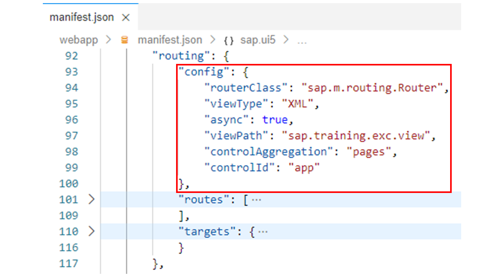
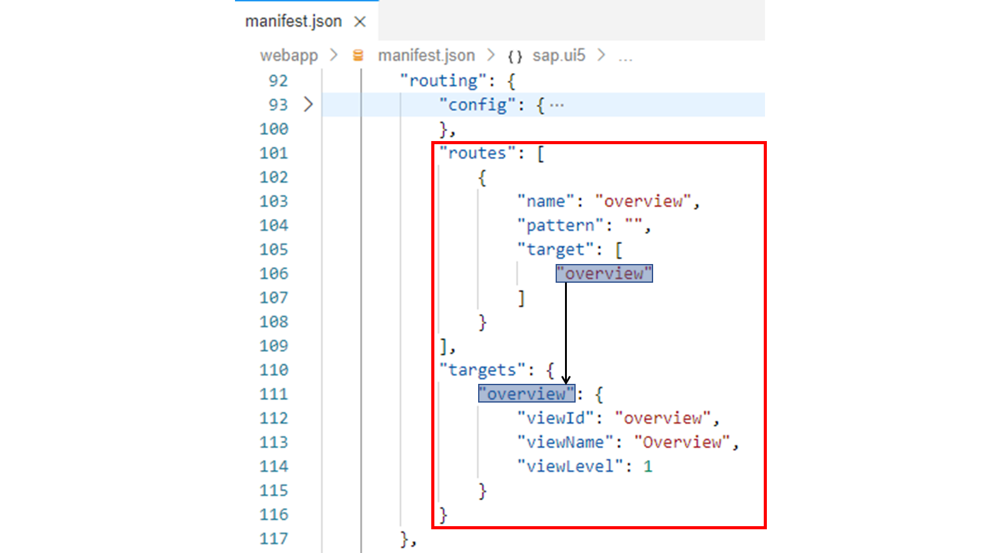
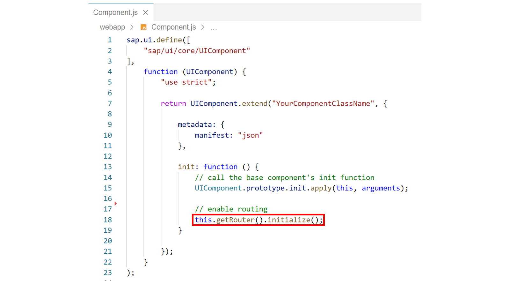
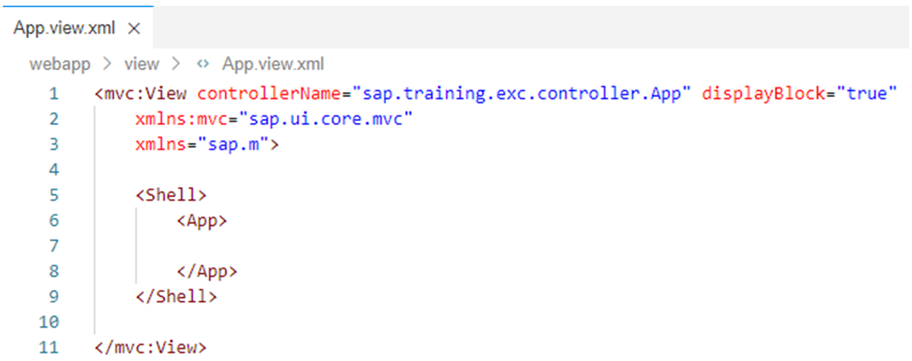
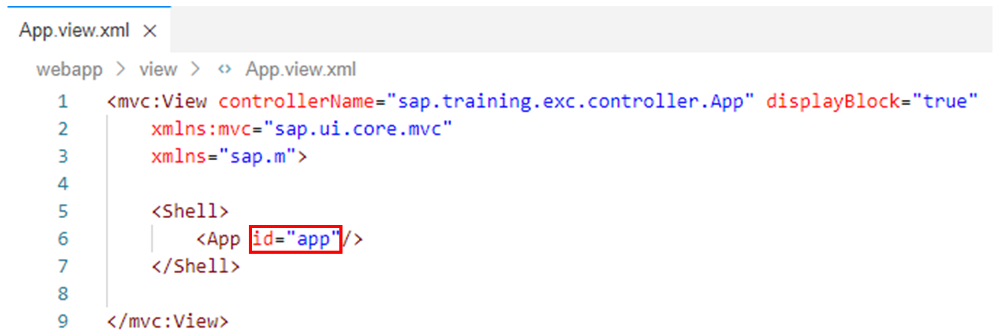
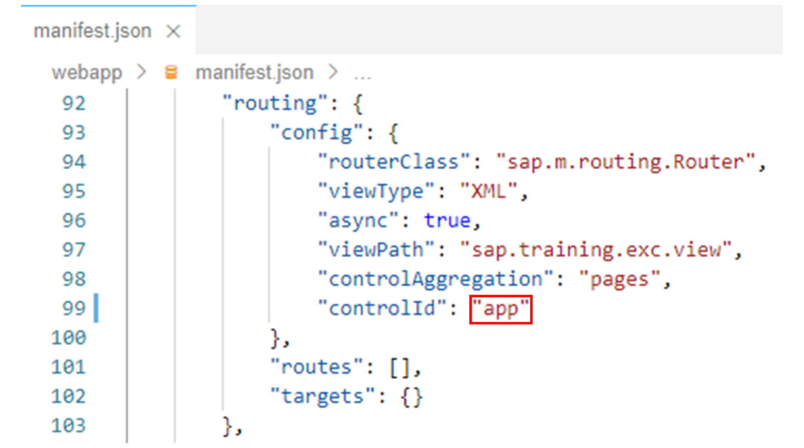
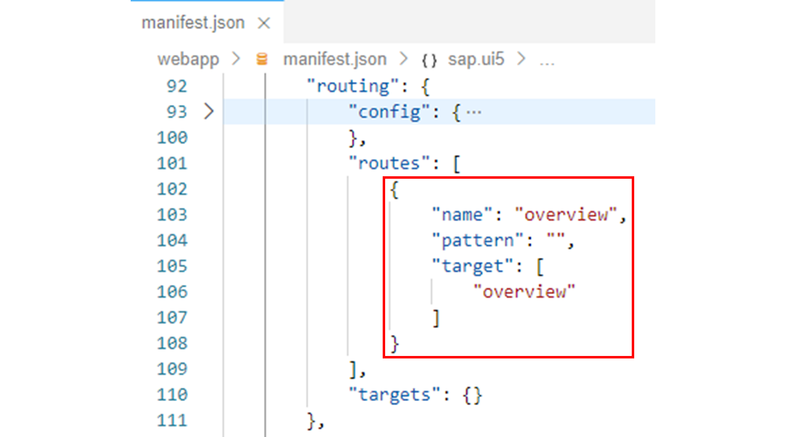
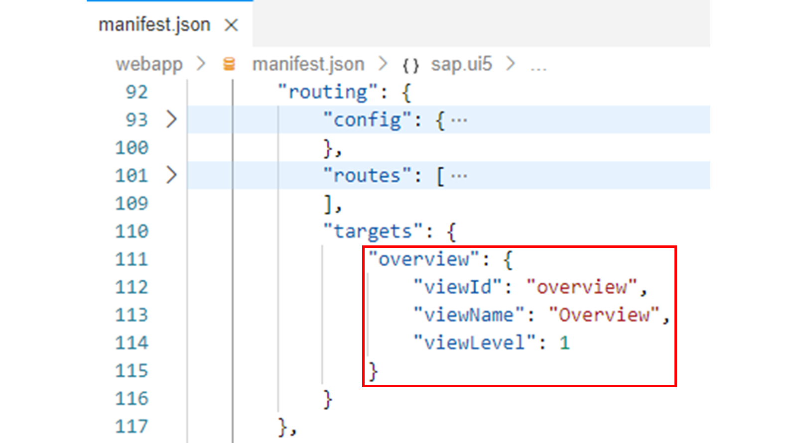
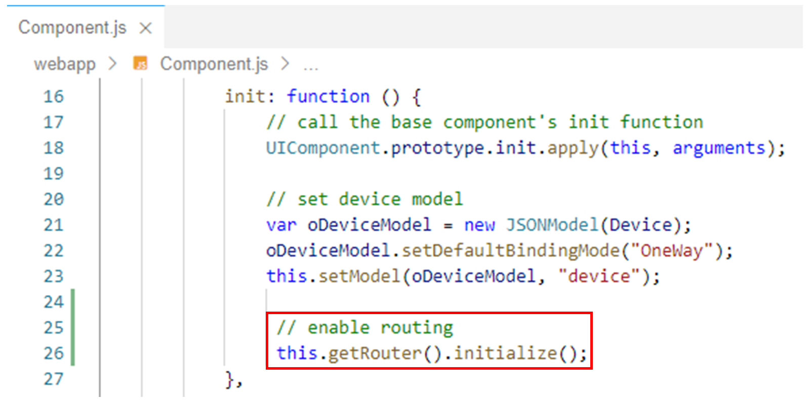

# Routing and Navigation

*Source: https://learning.sap.com/courses/developing-uis-with-sapui5-1/enabling-the-routing_e04193e3-59fd-4cd9-ae26-68f6ef67af90*

Objective
After completing this lesson, you will be able to create an initial routing configuration in the application descriptor
## Routing Overview
SAPUI5 offers hash-based navigation, which allows you to build single-page apps where the navigation is done by changing the hash. In this way, the browser does not have to reload the page.
Hash-based navigation enables bookmarks and deep links to pages inside an app; this means that you can start the app and resume the bookmarked state.
Watch this video to know about the principle of routing.
## Routing Configuration
In the application descriptor, the routing configuration is found in the routing property of the sap.ui5 namespace. It consists of the following three sections: config, routes, and targets.

The config section contains the global router configuration and default values that apply for all routes and targets.
In the example shown, the properties viewType and viewPath are used to specify that by default all views used are of type XML and that the view names used are preceded by the prefix sap.training.exc.view. This means that later, when defining the targets, it is sufficient to specify only _Overview_ as view name, for example, in order to uniquely identify the XML view sap.training.exc.view.Overview as target view.
The routerClass property defines which router is used. The possible values for routerClass are sap.ui.core.routing.Router, sap.m.routing.Router, and any other subclasses of sap.ui.core.routing.Router. Compared to sap.ui.core.routing.Router, the sap.m.routing.Router is optimized for mobile apps because it not only loads the targets and places them in the corresponding container, but also triggers the animations during navigation. The following animations are available, which can be set via the transition property: slide (default), flip, fade, and show
The controlId property determines the control that is used as the parent to insert the target views or components. The controlAggregation property defines the aggregation of that control to which the views or components are added.
The async property defines whether targets are loaded asynchronously.

Each route defines a name, a pattern, and optionally one or more targets to which to navigate when the route has been matched. The pattern is used to determine the browser hash that matches the route. The specified target must be defined in the targets section.
A target defines the view or component that is displayed. It is associated with one or more routes or it can be displayed manually from within the app. Whenever a target is displayed, the corresponding view or component is loaded and added to the specified aggregation (controlAggregation property) of the specified control (controlId property).
Using the viewLevel property of a target, you can define the navigation direction. For example, the navigation from a lower view level to a higher view level leads to forward navigation. This is, for example, important for flip and slide transitions, where the slide animation should go from left to right or vice versa.
In the example shown, a route named overview is defined for which the target named overview is displayed if the browser hash is empty. The overview target loads the XML view sap.training.exc.view.Overview.
## Initializing the Router
The router needs to be initialized by the component. To do this, get a reference to the router in the init method of the Component.js component controller and call the initialize method on it.

After initialization, the routing configuration in manifest.json is automatically enabled in the application: the current URL is evaluated and the corresponding views are automatically displayed.
## Configure the Routing
### Business Scenario
In the following exercises, the scenario is extended by a navigation option: When the user selects a customer in the customer table, a new view with details about the selected customer is to be displayed.
To be able to implement this navigation, you have to adapt the structure of the application: Until now, the component has used the App view as root view, which in turn contains an App UI element in whose pages aggregation the Overview is statically embedded. For navigation, however, the embedding of views in the pages aggregation must be done dynamically. The navigation is implemented in such a way that the views are exchanged in the pages aggregation through the router.
In this exercise, you will first restructure the application so that the Overview view is no longer statically embedded in the pages aggregation of the App UI element, but dynamically via routing configuration. In the following exercises, you will then implement the actual navigation on this basis.
| _Template:_  | Git Repository: <https://github.com/SAP-samples/sapui5-development-learning-journey.git>, Branch: **sol/21_OData_model_(create)**  |
| --- | --- |
| _Model solution:_  | Git Repository: <https://github.com/SAP-samples/sapui5-development-learning-journey.git>, Branch: **sol/22_routing_configuration**  |
### Task 1: Remove the Overview View from the pages Aggregation of the App UI Element
#### Steps
  1. Open the App.view.xml file from the webapp/view folder in the editor.
  2. Delete the following lines in the implementation of the view to remove the static embedding of the Overview view in the pages aggregation of the App UI element:
XML
Copy codeSwitch to dark mode

```

123

<pages>
  <mvc:XMLView viewName="sap.training.exc.view.Overview"/>
</pages>

```

#### Result
The App view should now look like this:
  3. Add the id="app" attribute to the <App> tag to set an Id for the App UI element.
Note
The Id will be used later in the routing configuration to specify the App UI element as the parent to insert views.

#### Result
The App view should now look similar to the following:

### Task 2: Configure the Routing in the Application Descriptor
#### Steps
  1. Open the manifest.json application descriptor from the webapp folder in the editor.
  2. In the application descriptor, look for the routing property in the sap.ui5 namespace:
JSON
Copy codeSwitch to dark mode

```

123456789101112

"routing": {
  "config": {
    "routerClass": "sap.m.routing.Router",
    "viewType": "XML",
    "async": true,
    "viewPath": "sap.training.exc.view",
    "controlAggregation": "pages",
    "controlId": "<...>"
  },
  "routes": [],
  "targets": {}
}

```

Note
The three properties config, routes, and targets in the routing section define the routing and navigation structure of the application.
  3. Replace the "<...>" value of the controlId property with **"app"** , which is the Id assigned above for the App UI element.
Note
According to this configuration, the router will now add views to the pages aggregation of the App UI element.
#### Result
The routing configuration should now look like this:
  4. Now add the following object to the routes array:
JSON
Copy codeSwitch to dark mode

```

1234567

{
  "name": "overview",
  "pattern": "",
  "target": [
    "overview"
  ]
}

```

Note
This defines a route called overview, for which the target named overview is displayed when the hash of the browser is empty. The referenced overview target is defined in the next step.
#### Result
The routing configuration should now look like this:
  5. Finally, add the following property to the targets object:
JSON
Copy codeSwitch to dark mode

```

12345

"overview": {
  "viewId": "overview",
  "viewName": "Overview",
  "viewLevel": 1
}

```

Note
This defines that the overview target referenced above will be used to load the Overview view.

#### Result
The routing configuration should now look like this:

### Task 3: Initialize the Router
#### Steps
  1. Open the Component.js file from the webapp folder in the editor.
  2. Add the following code to the end of the init method of the component controller:
JavaScript
Copy codeSwitch to dark mode

```

12

// enable routing
this.getRouter().initialize();

```

Note
The routing configuration done above causes the router to load the Overview view into the pages aggregation of the App UI element when the hash of the browser is empty. To enable this configuration for the application, the router is initialized here.
#### Result
The initialization method of the component controller should now look like this:
  3. Test run your application by starting it from the SAP Business Application Studio.
Caution
Use the **start-mock** npm script to start the application if you are not connected to the back-end system.
Make sure that the application works unchanged from the user's point of view: The Overview view is displayed in the browser. However, unlike the previous implementation, the Overview view is now embedded in the pages aggregation of the App UI element via routing.
    1. Right-click on any subfolder in your _sapui5-development-learning-journey_ project and select _Preview Application_ from the context menu that appears.
    2. Select the npm script named _start-mock_ in the dialog that appears.
    3. In the opened application, check if the component works as expected.
