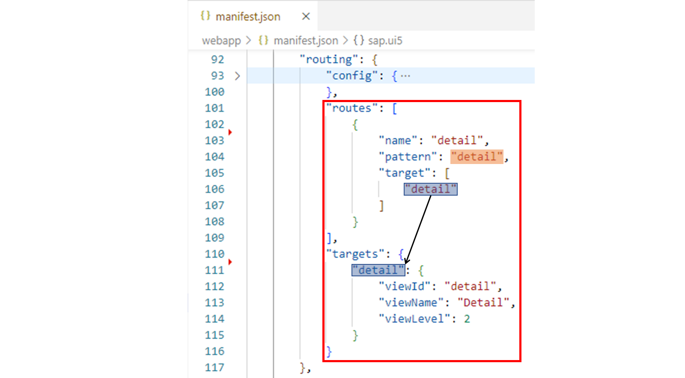
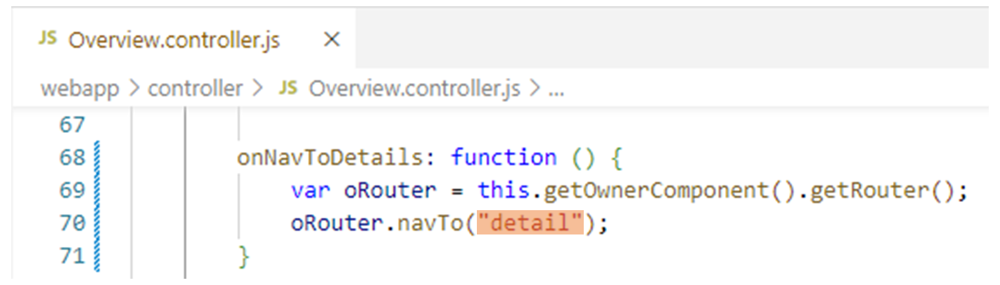
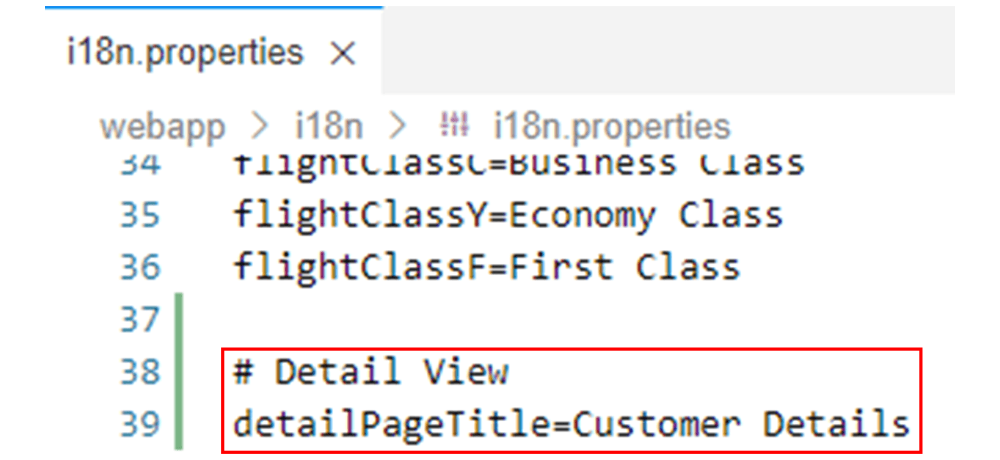
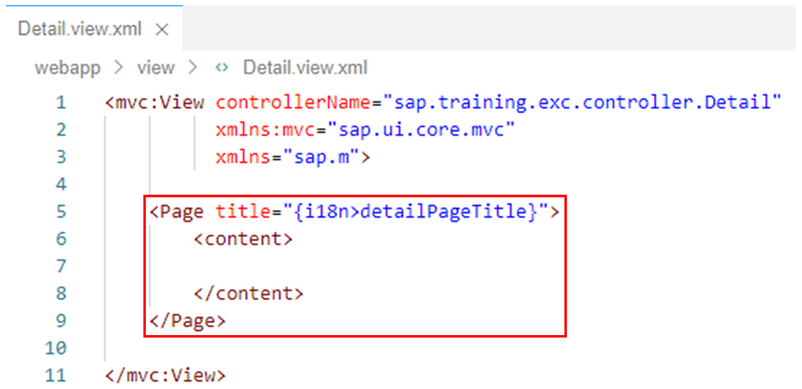
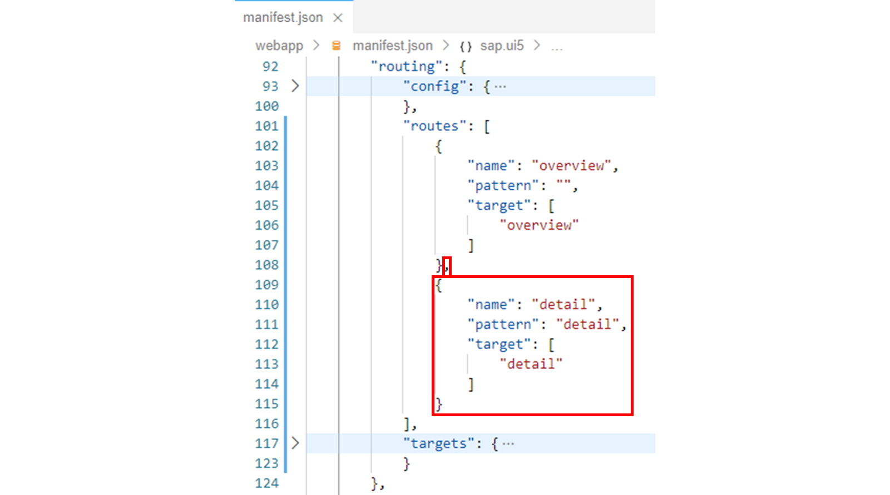
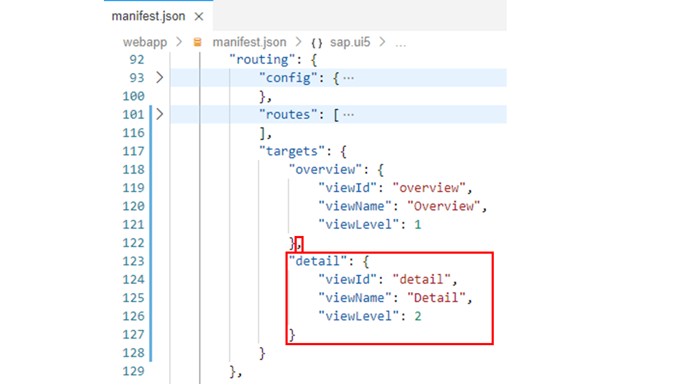
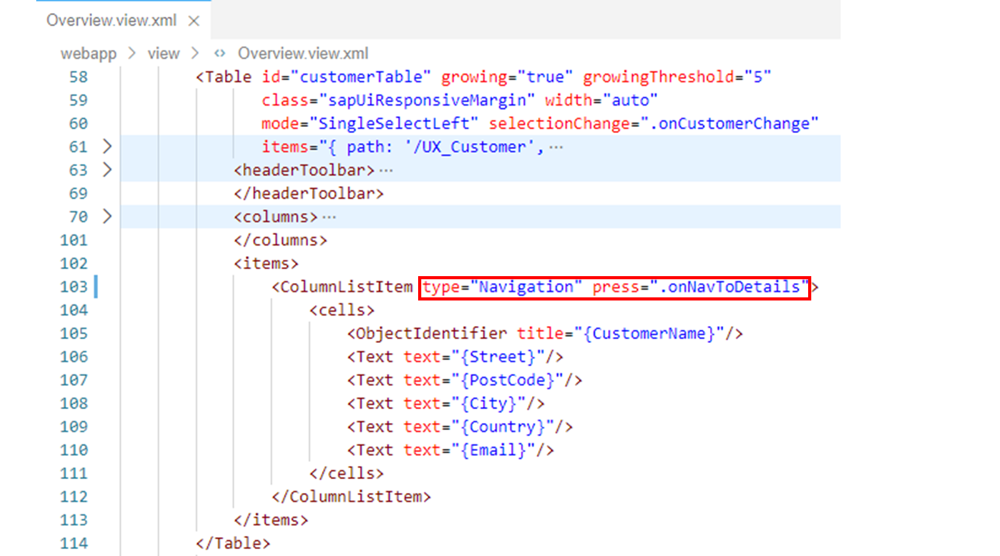
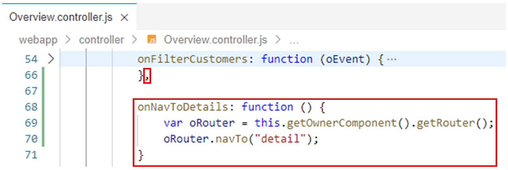

# Navigating to Routes with Hard-Coded Patterns

*Source: https://learning.sap.com/courses/developing-uis-with-sapui5-1/navigating-to-routes-with-hard-coded-patterns_cdcbec57-0d70-4f27-bc9e-d741721d4ca3*

Objective
After completing this lesson, you will be able to navigate to a route that has a hard-coded pattern
## Hard-Coded Routing Patterns
Whenever a hash is added to a URL, the router checks whether there is a route with a matching pattern. SAPUI5 provides different types of routing patterns for configuring a route.

In the example shown, a route named detail is defined for which the target named detail is displayed, which in turn is used to load a view named Detail.
To define the route, the hard-coded pattern detail is used. This pattern only matches if the hash of the browser is _detail_ and no data is passed on to the events of the route.
## Method for Navigation
Use the router's navTo method to navigate to a specific route by setting the browser's hash accordingly.
To access the router instance from a view controller, you can use the controller's getOwnerComponent method, to get access to the owner component, which provides the getRouter method.
The navTo method has the following parameters:
  * sName - name of the route
  * oParameters (optional) - the parameters for the route
  * oComponentTargetInfo (optional) - information for route name and parameters of the router in nested components
  * bReplace (optional) - if set to true, the hash is replaced, and there will be no entry in the browser history. If set to false (default), the hash is set and the entry is stored in the browser history.

### Accessing the Router Instance and Triggering the Navigation

In the example shown, the navTo method of the router is used in an event handler method of a view controller to navigate to the route named detail. This sets the pattern _detail_ of the detail route (see above) to the browser's hash. SAPUI5 then reacts to the browser's hashchange event to find the route that matches that hash. This results in the target of the detail route - in the end, the Detail view - being displayed in the browser.
## Navigate to a Route with a Hard-Coded Pattern
### Business Scenario
After you have set up the routing for the application in the last exercise, you will now implement a basic navigation based on this.
The ultimate goal is to implement the following scenario: When the user selects an entry in the customer table, they are to be navigated to a view called Detail, which is used to display additional information about the selected customer.
As a first step for the implementation of this scenario, you will set up the basic navigation from the Overview view to the Detail view in this exercise. No customer data will be displayed on the Detail view yet.
| _Template:_  | Git Repository: <https://github.com/SAP-samples/sapui5-development-learning-journey.git>, Branch: **sol/22_routing_configuration**  |
| --- | --- |
| _Model solution:_  | Git Repository: <https://github.com/SAP-samples/sapui5-development-learning-journey.git>, Branch: **sol/23_routing_with_hard-coded_patterns**  |
### Task 1: Implement the Detail View
Note
For simplicity, the project already contains the files Detail.view.xml and Detail.controller.js needed for the implementation of the Detail view. However, there are no UI elements on the view yet and the controller implementation is also still empty. For this exercise, only a Page UI element with a translatable title is needed on the Detail view. You will implement this in the next steps.
#### Steps
  1. Open the i18n.properties resource bundle file from the i18n folder in the editor.
  2. Add the following key-value pair to the i18n.properties file to define a translatable title for the Page UI element to be created in the next step:
JSON
Copy codeSwitch to dark mode

```

12

# Detail View
detailPageTitle=Customer Details

```

#### Result
The i18n.properties resource bundle file should now look like this:
  3. Now open the Detail.view.xml file from the webapp/view folder in the editor.
  4. Add the following code to the view to display a (still empty) page with the title created above:
XML
Copy codeSwitch to dark mode

```

12345

<Page title="{i18n>detailPageTitle}">
  <content>

  </content>
</Page>

```

#### Result
The Detail view should now look like this:

### Task 2: Create the Route and the Target Needed for the Navigation
#### Steps
  1. Open the manifest.json application descriptor from the webapp folder in the editor.
  2. In the application descriptor, find the routing property in the sap.ui5 namespace:
JSON
Copy codeSwitch to dark mode

```

1234567891011121314151617181920212223242526

"routing": {
  "config": {
    "routerClass": "sap.m.routing.Router",
    "viewType": "XML",
    "async": true,
    "viewPath": "sap.training.exc.view",
    "controlAggregation": "pages",
    "controlId": "app"
  },
  "routes": [
    {
      "name": "overview",
      "pattern": "",
      "target": [
        "overview"
      ]
    }
  ],
  "targets": {
    "overview": {
      "viewId": "overview",
      "viewName": "Overview",
      "viewLevel": 1
    }
  }
}

```

  3. Add the following object to the routes array to define a route called detail, for which the target named detail is displayed when the hash of the browser equals detail:
JSON
Copy codeSwitch to dark mode

```

1234567

{
  "name": "detail",
  "pattern": "detail",
  "target": [
    "detail"
  ]
}

```

Note
The referenced detail target is defined in the next step.
#### Result
The routing configuration should now look like this:
  4. Finally, add the following property to the targets object to specify that the detail target referenced above will be used to load the Detail view:
JSON
Copy codeSwitch to dark mode

```

12345

"detail": {
  "viewId": "detail",
  "viewName": "Detail",
  "viewLevel": 2
}

```

#### Result
The routing configuration should now look like this:

### Task 3: Trigger the Navigation when a Customer is Selected
The routing configuration done above causes the router to load the Detail view into the pages aggregation of the App UI element when the hash of the browser equals detail. Therefore, in the following steps, you will set the browser's hash to this value via the navTo method of the router when the user selects a customer from the customer table.
#### Steps
  1. Open the Overview.view.xml file from the webapp/view folder in the editor.
  2. Add the following two attributes to the <ColumnListItem> tag in the customer table:
XML
Copy codeSwitch to dark mode

```

1

type="Navigation" press=".onNavToDetails"

```

Note
The Navigation type indicates that the table rows are navigable to display additional information. When selecting a row, the onNavToDetails event handler method is called, which is implemented in the next step and in which the navigation is triggered.
#### Result
The customer table should now look like this:
  3. Now open the Overview.controller.js file from the webapp/controller folder in the editor.
  4. Add the onNavToDetails event handler method to the view controller as follows to trigger navigation to the Detail view:
JavaScript
Copy codeSwitch to dark mode

```

1234

onNavToDetails: function () {
  var oRouter = this.getOwnerComponent().getRouter();
  oRouter.navTo("detail");
}

```

Note
In the implementation of the method, the router instance is accessed. On it, the navTo method is called to navigate to the detail route specified in the routing configuration. This sets the detail pattern to the browser's hash, which causes the Detail view to be displayed.
#### Result
The view controller should now have the following additional method:
  5. Test run your application by starting it from the SAP Business Application Studio.
Caution
Use the **start-mock** npm script to start the application if you are not connected to the back-end system.
Make sure that the Detail view (which is empty) is displayed when a customer is selected in the customer table.
Note
Please keep in mind that the navigation from the Detail view back to the Overview view is not supported yet. This will be implemented in the next exercise.
    1. Right-click on any subfolder in your _sapui5-development-learning-journey_ project and select _Preview Application_ from the context menu that appears.
    2. Select the npm script named _start-mock_ in the dialog that appears.
    3. In the opened application, check if the component works as expected.
