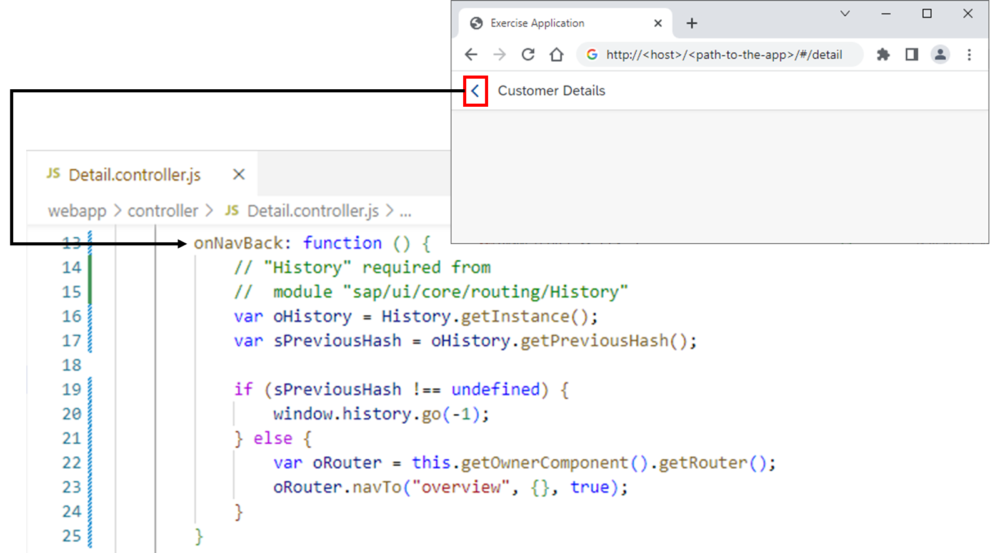
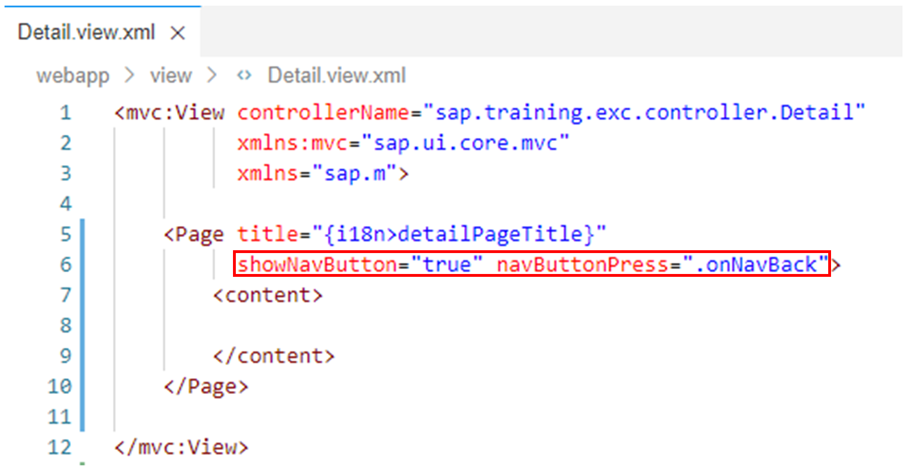
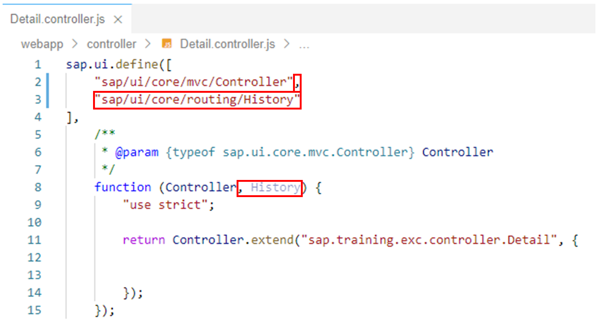
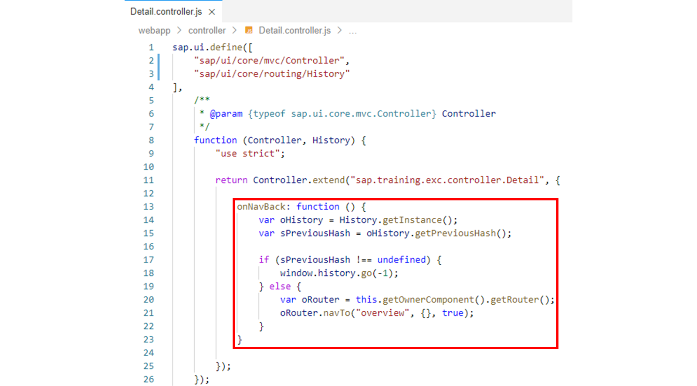

# Routing Back

*Source: https://learning.sap.com/courses/developing-uis-with-sapui5-1/routing-back_c9b9f625-a6c1-4b54-9d32-8196143d5ee5*

Objective
After completing this lesson, you will be able to implement navigation back to an initial page
## Back Navigation
To navigate back in an application, the user can use the browser's native _Back_ button. However, this _Back_ button always uses the browser history for navigating back. This means that if you start the application with a certain hash value in the browser and then press the _Back_ button, the application is exited via this button.

To change this behavior, a separate _Back_ button is implemented for the application in the example shown. In the implementation of the corresponding onNavBack event handler method, the sap/ui/core/routing/History module is used to access the navigation history of the SAPUI5 application. The getPreviousHash method of the history object is employed to check if there is a previous hash value in the app history. If so, the application navigates to this previous hash via the browser's native history API. In this case, the functionality of the app's _Back_ button matches the functionality of the native browser _Back_ button.
However, if there is no previous hash, the application navigates to the route named overview via the router. That is, it navigates to another page within the application, while using the native browser _Back_ button in this case would exit the application.
The second parameter when calling the navTo method is an empty object as no additional parameters are passed to the route. The third parameter has the value true and makes sure that the hash is replaced, so that there will be no entry in the browser history.
## Add Back Navigation
### Business Scenario
In the last exercise, you implemented the navigation from the Overview view to the Detail view. In this exercise, you will set up the corresponding back navigation: from the Detail view to the Overview view.
| _Template:_  | Git Repository: <https://github.com/SAP-samples/sapui5-development-learning-journey.git>, Branch: **sol/23_routing_with_hard-coded_patterns**  |
| --- | --- |
| _Model solution:_  | Git Repository: <https://github.com/SAP-samples/sapui5-development-learning-journey.git>, Branch: **sol/24_back_navigation**  |
### Task 1: Add a Button to the Detail View for Back Navigation
#### Steps
  1. Open the Detail.view.xml file from the webapp/view folder in the editor.
  2. Add the following two attributes to the <Page> tag to display a back button and register an event handler that is called when the back button is pressed:
XML
Copy codeSwitch to dark mode

```

1

showNavButton="true" navButtonPress=".onNavBack"

```

Note
The onNavBack event handler method will be implemented in the following steps.

#### Result
The Detail view should now look like this:

### Task 2: Implement the Button Event Handler in the View Controller
#### Steps
  1. Open the Detail.controller.js file from the webapp/controller folder in the editor.
  2. To manage the navigation history in the implementation of the onNavBack event handler method, add the sap/ui/core/routing/History module to the dependency array of the view controller and a corresponding parameter named History to the factory function.
#### Result
The view controller should now look like this:
  3. Now implement the onNavBack event handler method as follows on the view controller to display the Overview view when the back button is pressed:
JavaScript
Copy codeSwitch to dark mode

```

1234567891011

onNavBack: function () {
  var oHistory = History.getInstance();
  var sPreviousHash = oHistory.getPreviousHash();

  if (sPreviousHash !== undefined) {
    window.history.go(-1);
  } else {
    var oRouter = this.getOwnerComponent().getRouter();
    oRouter.navTo("overview", {}, true);
  }
}

```

Note
In the implementation of the event handler, the browser history is used to return to the previous page if a navigation step has already taken place in the application. If no navigation has yet taken place within the application, the router is used to navigate to the Overview view. That is, even if the application was started directly by calling the Detail view, the back button leads to the Overview view and not to a page outside the application.
#### Result
The view controller should now look like this:
  4. Test run your application by starting it from the SAP Business Application Studio.
Caution
Use the **start-mock** npm script to start the application if you are not connected to the back-end system.
Make sure that it is now possible to navigate back from the Detail view to the Overview view.
    1. Right-click on any subfolder in your _sapui5-development-learning-journey_ project and select _Preview Application_ from the context menu that appears.
    2. Select the npm script named _start-mock_ in the dialog that appears.
    3. In the opened application, check if the component works as expected.
