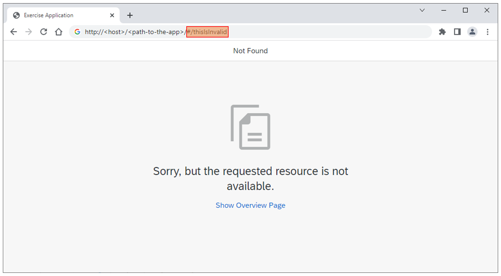
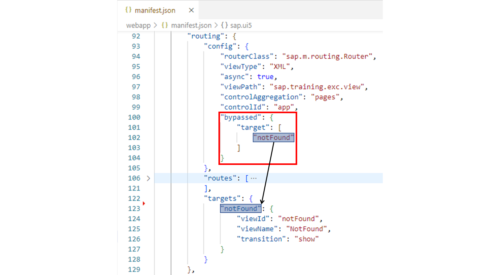
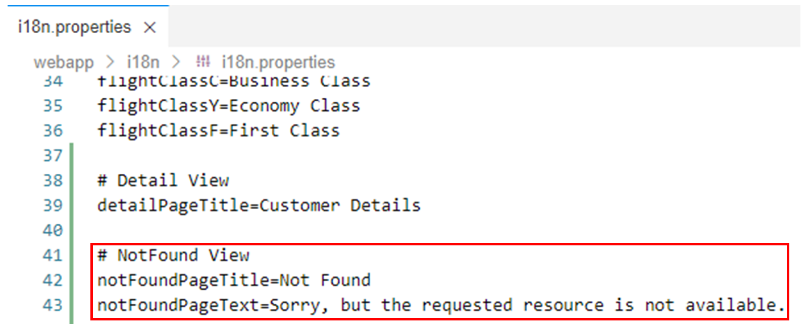
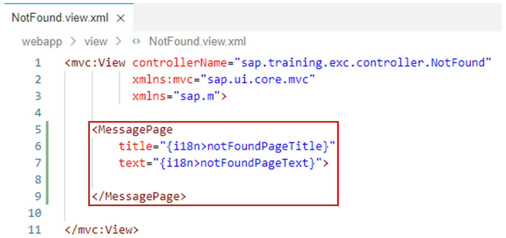
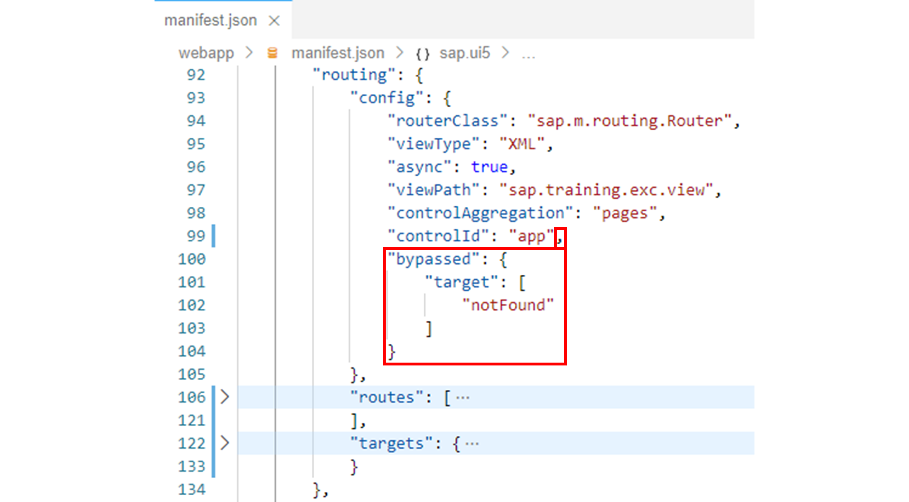
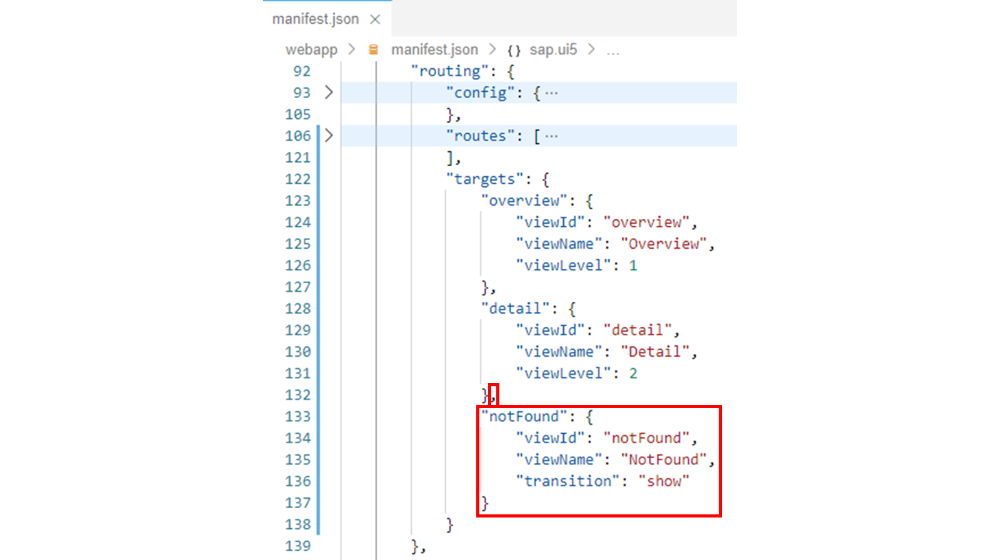
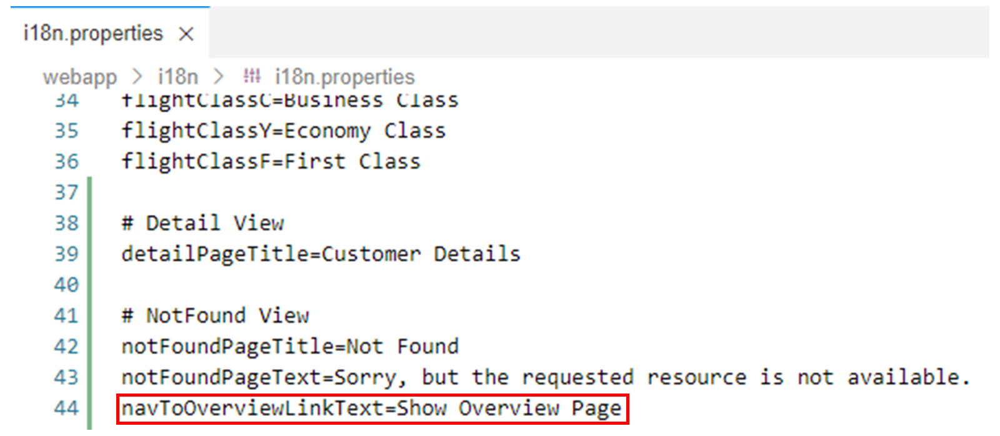
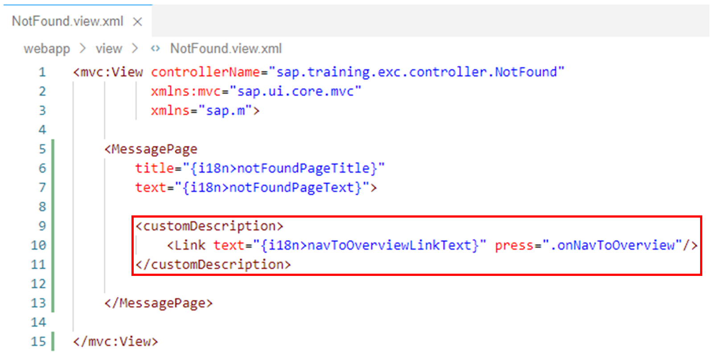
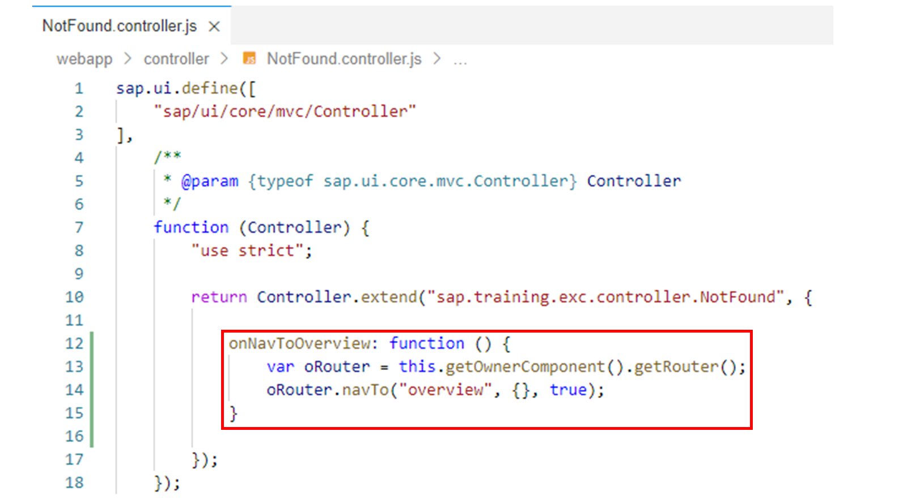

# Catching Invalid Hashes

*Source: https://learning.sap.com/courses/developing-uis-with-sapui5-1/catching-invalid-hashes_a2850f11-106a-4342-bced-05fd82a1610f*

Objective
After completing this lesson, you will be able to display a notification view if a hash is entered for which there is no matching route
## Invalid Hashes
If a user tries to access an invalid pattern that does not match any of the configured routes, they should be notified that something went wrong.

To implement this feature, the bypassed property is available in the routing configuration. Using this property, you specify the navigation target that is used whenever no navigation pattern is matched. If you use this setting, you also have to define a corresponding target in the targets section.

In the example shown, the routing configuration in the application descriptor has been extended by adding the bypassed property. It tells the router to display the notFound target in case no route matches the current hash.
The notFound target is configured in the targets section. It loads the XML view sap.training.exc.view.NotFound without animation (show transition) into the pages aggregation of the UI control with the app Id.
Note
To display routing related error messages on a view, you can use the sap.m.MessagePage control.
## Catch Invalid Hashes
### Business Scenario
In the previous exercises, you configured two routes. Using the configuration you made, the Overview view is displayed if the hash of the browser is empty. In addition, if the hash of the browser equals detail, the Detail view is displayed.
In this exercise, you will implement a view called NotFound, which is to be displayed via appropriate configuration if a hash is entered for which there is no matching route. The NotFound view should display an error message and a link that allows the user to navigate from the NotFound view to the Overview view.
| _Template:_  | Git Repository: <https://github.com/SAP-samples/sapui5-development-learning-journey.git>, Branch: **sol/24_back_navigation**  |
| --- | --- |
| _Model solution:_  | Git Repository: <https://github.com/SAP-samples/sapui5-development-learning-journey.git>, Branch: **sol/25_invalid_hashes**  |
### Task 1: Implement the NotFound View
Note
For simplicity, the project already contains the files NotFound.view.xml and NotFound.controller.js needed for the implementation of the NotFound view. However, there are no UI elements on the view yet and the controller implementation is also still empty.
In this task of the exercise, you will add a MessagePage UI element to the NotFound view with a translatable title and a translatable error message. You will implement this in the next steps.
In the last task of this exercise, you will also add a link to the NotFound view that allows the user to navigate to the Overview view.
#### Steps
  1. Open the i18n.properties resource bundle file from the i18n folder in the editor.
  2. Add the following key-value pairs to the i18n.properties file to define a translatable title and a translatable error message for the MessagePage UI element to be created in the next step:
JSON
Copy codeSwitch to dark mode

```

123

# NotFound View
notFoundPageTitle=Not Found
notFoundPageText=Sorry, but the requested resource is not available.

```

#### Result
The i18n.properties resource bundle file should now look like this:
  3. Open the NotFound.view.xml file from the webapp/view folder in the editor.
  4. Add the following code to the view to display a message page with the title and the text created above:
XML
Copy codeSwitch to dark mode

```

12345

<MessagePage
    title="{i18n>notFoundPageTitle}"
    text="{i18n>notFoundPageText}">

</MessagePage>

```

#### Result
The NotFound view should now look like this:

### Task 2: Configure the Routing for the NotFound View
#### Steps
  1. Open the manifest.json application descriptor from the webapp folder in the editor.
  2. In the application descriptor, find the routing property in the sap.ui5 namespace:
JSON
Copy codeSwitch to dark mode

```

1234567891011121314151617181920212223242526272829303132333435363738

"routing": {
  "config": {
    "routerClass": "sap.m.routing.Router",
    "viewType": "XML",
    "async": true,
    "viewPath": "sap.training.exc.view",
    "controlAggregation": "pages",
    "controlId": "app"
  },
  "routes": [
    {
      "name": "overview",
      "pattern": "",
      "target": [
        "overview"
      ]
    },
    {
      "name": "detail",
      "pattern": "detail",
      "target": [
        "detail"
      ]
    }
  ],
  "targets": {
    "overview": {
      "viewId": "overview",
      "viewName": "Overview",
      "viewLevel": 1
    },
    "detail": {
      "viewId": "detail",
      "viewName": "Detail",
      "viewLevel": 2
    }
  }
}

```

  3. Add the following property to the config section to specify the navigation target that is used whenever no navigation pattern is matched:
JSON
Copy codeSwitch to dark mode

```

12345

"bypassed": {
  "target": [
    "notFound"
  ]
}

```

Note
The referenced notFound target is defined in the next step.
#### Result
The routing configuration should now look like this:
  4. Finally, add the following property to the targets object to specify that the notFound target referenced above will be used to load the NotFound view:
JSON
Copy codeSwitch to dark mode

```

12345

"notFound": {
  "viewId": "notFound",
  "viewName": "NotFound",
  "transition": "show"
}

```

#### Result
The routing configuration should now look like this:

### Task 3: Implement the Navigation from the NotFound View to the Overview View
#### Steps
  1. Add the following key-value pair to the i18n.properties resource bundle file:
JSON
Copy codeSwitch to dark mode

```

1

navToOverviewLinkText=Show Overview Page

```

Note
The key-value pair provides the translatable text for the link on the NotFound view that you will create in the next step. This link will allow the user to navigate from the NotFound view to the Overview view.
#### Result
The i18n.properties resource bundle file should now look like this:
  2. Now add the customDescription aggregation to the <MessagePage> tag on the NotFound view as follows to display a link with the text created above on the page:
XML
Copy codeSwitch to dark mode

```

123

<customDescription>
  <Link text="{i18n>navToOverviewLinkText}" press=".onNavToOverview"/>
</customDescription>

```

Note
The onNavToOverview event handler registered here for pressing the link will be implemented in the next step.
#### Result
The NotFound view should now look like this:

  3. Now open the NotFound.controller.js file from the webapp/controller folder in the editor.
  4. Implement the onNavToOverview event handler method as follows on the NotFound view controller to display the Overview view when the link is pressed:
JavaScript
Copy codeSwitch to dark mode

```

1234

onNavToOverview: function () {
  var oRouter = this.getOwnerComponent().getRouter();
  oRouter.navTo("overview", {}, true);
}

```

#### Result
The view controller should now look like this:
  5. Test run your application by starting it from the SAP Business Application Studio.
Caution
Use the **start-mock** npm script to start the application if you are not connected to the back-end system.
Make sure that the NotFound view is displayed if a hash is entered for which there is no matching route (for example, foo). Also make sure that the user can navigate from the NotFound view to the Overview view via the link displayed there.
    1. Right-click on any subfolder in your _sapui5-development-learning-journey_ project and select _Preview Application_ from the context menu that appears.
    2. Select the npm script named _start-mock_ in the dialog that appears.
    3. In the opened application, check if the component works as expected.
