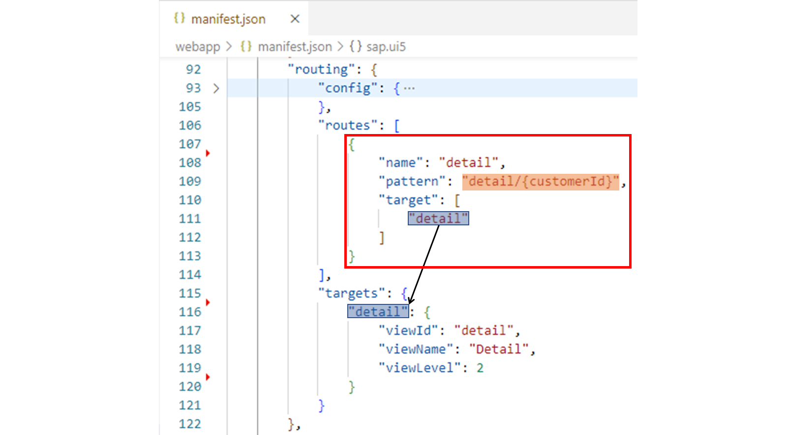
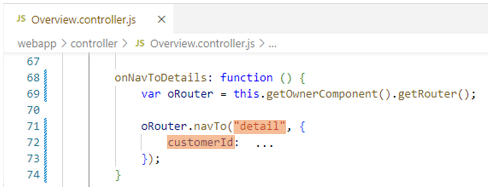
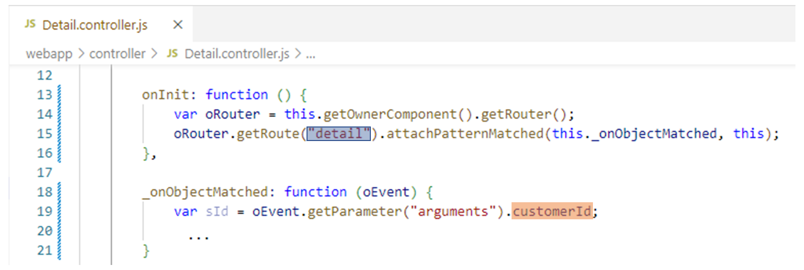
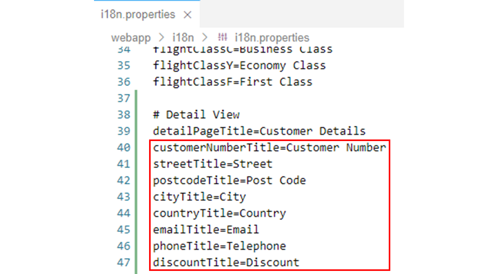
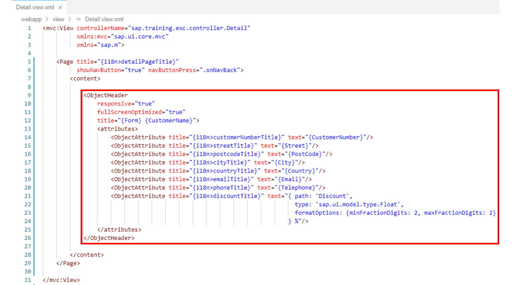
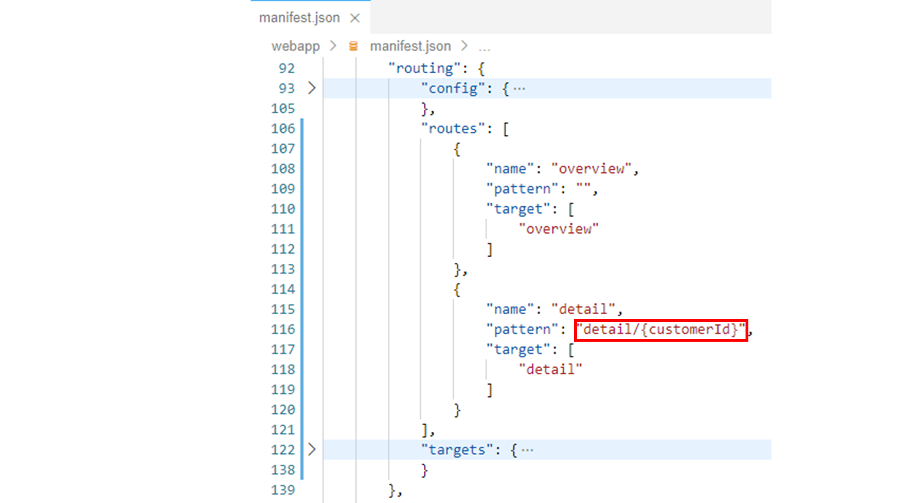
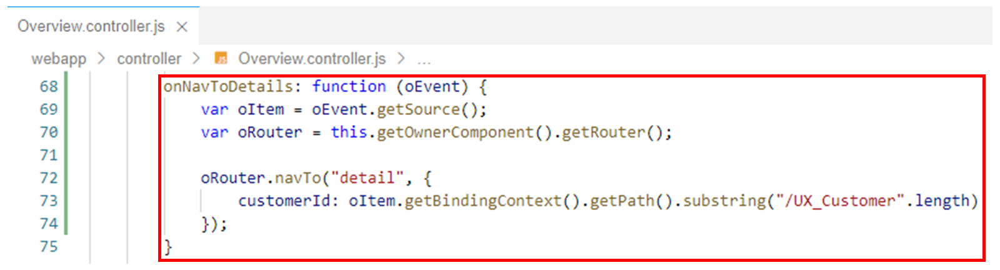
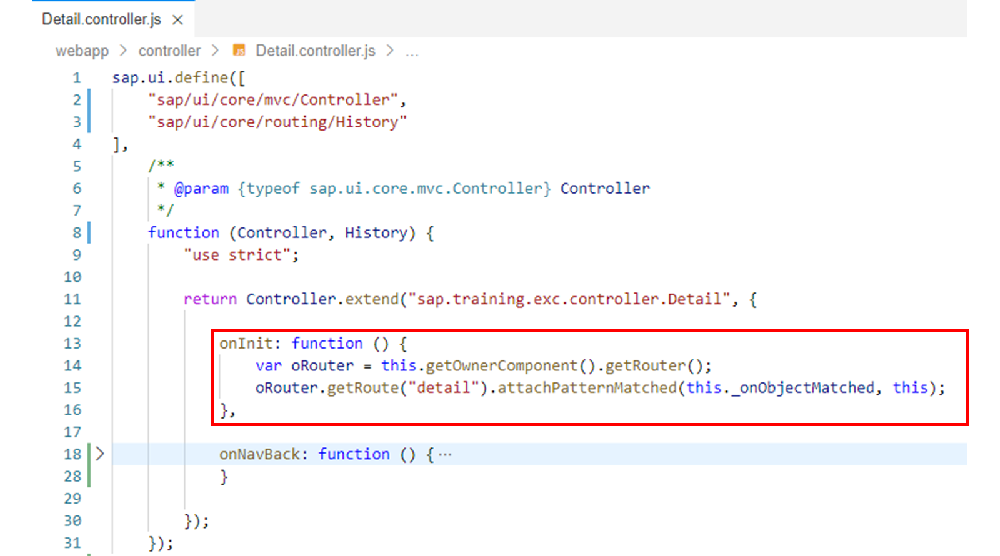
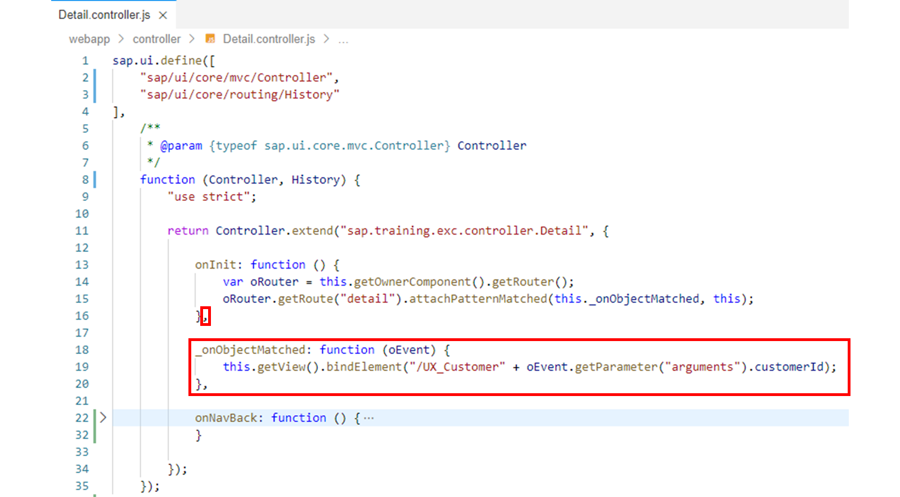

# Navigating to Routes with Mandatory Parameters

*Source: https://learning.sap.com/courses/developing-uis-with-sapui5-1/navigating-to-routes-with-mandatory-parameters_e6978588-dc8c-4e23-8dfe-34edf19b278a*

Objective
After completing this lesson, you will be able to navigate to a route that has a mandatory parameter
## Routes with Mandatory Parameters
Suppose that when the user selects an entity (for example, customer, sales order) on an initial view, the application is to navigate to another view where details about the selected entity are displayed. To implement such a master-detail scenario, you can pass the data of the selected entity (for example, the associated Id) to the detail view via one or more parameters of the route. The parameter(s) can then be used by the detail view to identify the entity and fetch and display additional information.
SAPUI5 supports routes with mandatory and optional parameters, which are both defined in the pattern of a route. You specify a mandatory parameter for the pattern by placing the parameter in curly brackets.

In the example shown, a mandatory parameter named customerId is defined for the detail route. This makes, for example, the hashes detail/5 and detail/(00505604-4e85-1edd-818f-21e64b9cd2cf) match the route, while the hash detail/ does not. The patternMatched event of the route (see the next section) is then passed 5 or (00505604-4e85-1edd-818f-21e64b9cd2cf) as customerId in its arguments parameter.
## Parameter Handling
The parameters of a route are set using the navTo method of the router. After the name of the route to be navigated to, a configuration object with the parameter values for the route is passed to this method as the second parameter.
The router always makes sure that mandatory parameters as specified in the route's pattern are set; otherwise an error is thrown.

In the example shown, the router's navTo method is called in an event handler of the initial view to navigate to the route named detail. This route has the mandatory parameter customerId, which is supplied with a value via the object passed as the second parameter.
In the example, it is omitted how the Id of the customer is determined. For example, it could be obtained via the binding context of the UI element selected by the user.
Using the code shown, the hash of the browser is set to detail/<value of customerId parameter>.
In the view that is being navigated to, the passed customer Id must now be extracted again in order to be able to fetch and display additional information about the customer.

In the example shown, the Route object for the detail route is queried in the onInit initialization method of the detail view controller via the getRoute method of the router. On this object, the attachPatternMatched method is called. This registers the _onObjectMatched method of the view controller to the patternMatched event of the route. That is, the _onObjectMatched method is called if and only if the current URL hash matches the pattern of the route. In this case, the value of the customerId parameter is extracted in the _onObjectMatched method.
The context of the _onObjectMatched event handler method (its this) is bound to the Route object of the detail route by default. Therefore, the attachPatternMatched method is passed the view controller (this) as second parameter to bind the context of the _onObjectMatched method to the view controller. This allows the view controller to be accessed via this in the implementation of the _onObjectMatched method.
The patternMatched event has a parameter called arguments. This parameter is a key-value pair object that contains the parameters defined in the route resolved with the corresponding information from the current URL hash. In the implementation of the _onObjectMatched method, this event parameter is accessed and the value for the customerId parameter is extracted from it.
In the sample code, it is omitted how to proceed with the obtained Id. For example, using this.getView().bindElement(), the binding context of the view could be set to the selected customer to display additional information about it.
## Navigate to a Route with a Mandatory Parameter
### Business Scenario
In the previous exercises, you added navigation from the Overview view to the Detail view to the scenario. So far, however, no customer-specific data is displayed on the Detail view. This will be implemented in this exercise: Additional data for the customer selected on the Overview view is to be displayed on the Detail view.
To do this, you will first add fields for customer-specific data to the UI of the Detail view. Then you will add a mandatory parameter to the detail route and use it to pass the Id of the customer selected on the Overview view to the Detail view during navigation. Finally, you will use the passed Id in the detail view controller to set the binding context for the Detail view. This allows the relative binding paths used on the view to be resolved and the corresponding customer data to be displayed on the view.
| _Template:_  | Git Repository: <https://github.com/SAP-samples/sapui5-development-learning-journey.git>, Branch: **sol/25_invalid_hashes**  |
| --- | --- |
| _Model solution:_  | Git Repository: <https://github.com/SAP-samples/sapui5-development-learning-journey.git>, Branch: **sol/26_routing_with_parameters**  |
### Task 1: Extend the UI of the Detail View
#### Steps
  1. Open the i18n.properties resource bundle file from the i18n folder in the editor.
  2. Add the following key-value pairs to the i18n.properties file to define translatable labels for the customer fields that will be added in the next step:
JSON
Copy codeSwitch to dark mode

```

12345678

customerNumberTitle=Customer Number
streetTitle=Street
postcodeTitle=Post Code
cityTitle=City
countryTitle=Country
emailTitle=Email
phoneTitle=Telephone
discountTitle=Discount

```

#### Result
The i18n.properties resource bundle file should now look like this:
  3. Open the Detail.view.xml file from the webapp/view folder in the editor.
  4. Add the following object header to the content aggregation of the Page UI element to display fields with customer specific data on the view:
XML
Copy codeSwitch to dark mode

```

123456789101112131415161718

<ObjectHeader
  responsive="true"
  fullScreenOptimized="true"
  title="{Form} {CustomerName}">
  <attributes>
    <ObjectAttribute title="{i18n>customerNumberTitle}" text="{CustomerNumber}"/>
    <ObjectAttribute title="{i18n>streetTitle}" text="{Street}"/>
    <ObjectAttribute title="{i18n>postcodeTitle}" text="{PostCode}"/>
    <ObjectAttribute title="{i18n>cityTitle}" text="{City}"/>
    <ObjectAttribute title="{i18n>countryTitle}" text="{Country}"/>
    <ObjectAttribute title="{i18n>emailTitle}" text="{Email}"/>
    <ObjectAttribute title="{i18n>phoneTitle}" text="{Telephone}"/>
    <ObjectAttribute title="{i18n>discountTitle}" text="{ path: 'Discount',
                                                          type: 'sap.ui.model.type.Float',
                                                          formatOptions: {minFractionDigits: 2, maxFractionDigits: 2}
                                                         } %"/>
  </attributes>
</ObjectHeader>

```

Note
Relative paths are used here for binding the customer fields. As long as the context for this binding is not set, these paths cannot be resolved and hence no data can be displayed. In the next steps, you will therefore provide the corresponding binding context.

#### Result
The Detail view should now look like this:

### Task 2: Pass the Id of the Customer Selected on the Overview View to the Detail View via a Mandatory Parameter of the detail Route
#### Steps
  1. Open the manifest.json application descriptor from the webapp folder in the editor.
  2. In the application descriptor, find the routes property in the routing configuration section of the sap.ui5 namespace:
JSON
Copy codeSwitch to dark mode

```

12345678910111213141516

"routes": [
  {
    "name": "overview",
    "pattern": "",
    "target": [
      "overview"
    ]
  },
  {
    "name": "detail",
    "pattern": "detail",
    "target": [
      "detail"
    ]
  }
]

```

  3. Change the value of the pattern property in the detail route to the following new value:
JSON
Copy codeSwitch to dark mode

```

1

"pattern": "detail/{customerId}"

```

Note
With this, you add a mandatory parameter called customerId to the detail route. This parameter is used in the next step to pass the Id of the customer selected in the customer table on the Overview view to the Detail view.
#### Result
The routing configuration should now look like this:
  4. Open the Overview.controller.js file from the webapp/controller folder in the editor.
  5. Modify the implementation of the onNavToDetails event handler in the view controller as follows to trigger navigation to the Detail view and fill the customerId parameter of the detail route defined above with the Id of the selected customer:
JavaScript
Copy codeSwitch to dark mode

```

123456789

onNavToDetails: function (oEvent) {
  var oItem = oEvent.getSource();
  var oRouter = this.getOwnerComponent().getRouter();

  oRouter.navTo("detail", {
    customerId: oItem.getBindingContext().getPath().substring("/UX_Customer".length)
  });
}

```

Note
The oEvent parameter added to the onNavToDetails event handler is used to query the control that triggered the press event. The getSource method returns the ColumnListItem object from the customer table that was selected by the user. This item is used to get the Id of the associated customer by means of the binding. The obtained Id is then set for the customerId parameter of the detail route.
For example, the method oItem.getBindingContext().getPath() returns the value /UX_Customer(00505604-4e85-1edd-818f-21e64b9cd2cf) for the customer _SAP SE_. The substring method removes /UX_Customer from this string and sets (00505604-4e85-1edd-818f-21e64b9cd2cf) as the value for the customerId parameter. In this way, the hash of the browser is set to detail/(00505604-4e85-1edd-818f-21e64b9cd2cf).

#### Result
The onNavToDetails event handler method should now look like this:

### Task 3: Use the Customer Id Passed via Routing in the Detail View Controller to Set the Binding Context for the Detail View
#### Steps
  1. Open the Detail.controller.js file from the webapp/controller folder in the editor.
  2. Implement the onInit initialization method of the view controller as follows to register the _onObjectMatched method as an event handler for the patternMatched event of the detail route:
JavaScript
Copy codeSwitch to dark mode

```

1234

onInit: function () {
  var oRouter = this.getOwnerComponent().getRouter();
  oRouter.getRoute("detail").attachPatternMatched(this._onObjectMatched, this);
}

```

Note
The _onObjectMatched method will be implemented in the next step. By registering it here, it will be called automatically when the current URL hash matches the pattern of the detail route.
#### Result
The view controller should now look like this:
  3. Implement the _onObjectMatched method as follows to set the context for the bindings on the Detail view:
JavaScript
Copy codeSwitch to dark mode

```

123

_onObjectMatched: function (oEvent) {
  this.getView().bindElement("/UX_Customer" + oEvent.getParameter("arguments").customerId);
}

```

Note
The oEvent parameter of the _onObjectMatched event handler method is used to query the value set in the Overview view controller for the customerId parameter of the detail route (for example, (00505604-4e85-1edd-818f-21e64b9cd2cf)). From this, the binding path for the corresponding customer is created (for example, /UX_Customer(00505604-4e85-1edd-818f-21e64b9cd2cf)) and this is set as the binding context for the Detail view via the bindElement method. Now all relative bindings on the Detail view can be resolved and the corresponding customer data can be displayed on the view.
#### Result
The view controller should now look like this:
  4. Test run your application by starting it from the SAP Business Application Studio.
Caution
Use the **start-mock** npm script to start the application if you are not connected to the back-end system..
Make sure that the Detail view now displays data of the customer selected in the table on the Overview view.
    1. Right-click on any subfolder in your _sapui5-development-learning-journey_ project and select _Preview Application_ from the context menu that appears.
    2. Select the npm script named _start-mock_ in the dialog that appears.
    3. In the opened application, check if the component works as expected.

[Continue to quiz](https://learning.sap.com/courses/developing-uis-with-sapui5-1/routing-and-navigation)
