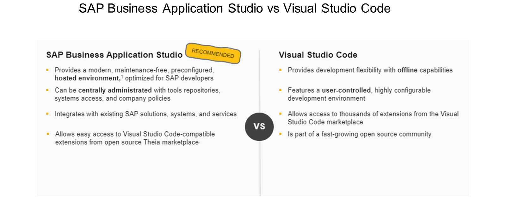
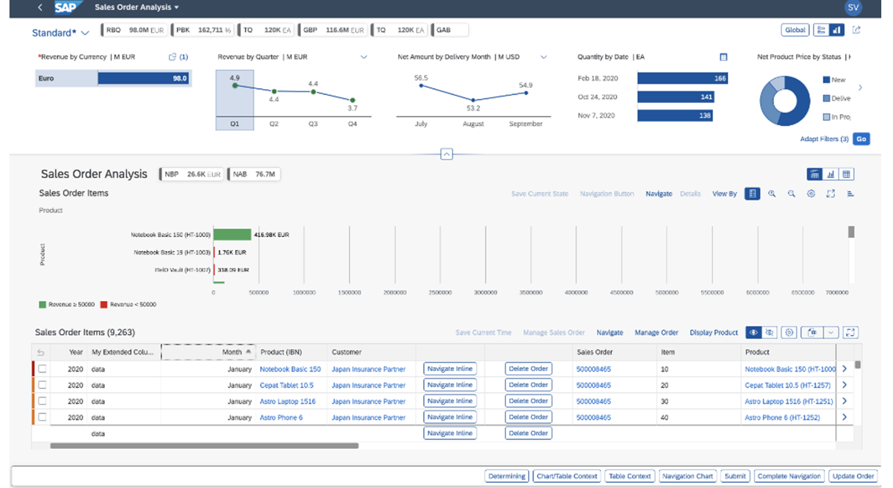
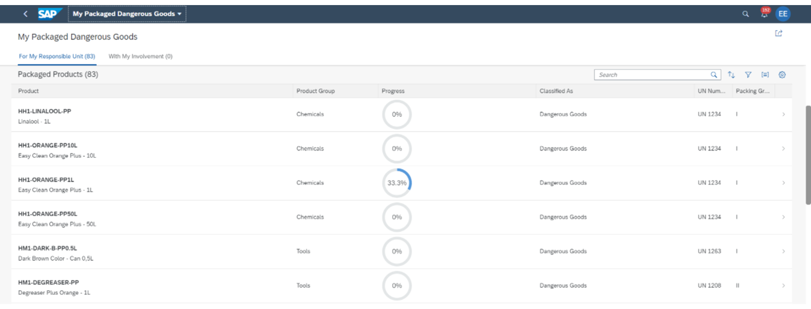

# Getting Started with Creating an SAP Fiori Elements App Based on an OData V4 RAP Service

*Source: https://learning.sap.com/courses/getting-started-with-creating-an-sap-fiori-elements-app-based-on-an-odata-v4-rap-service*

## Contents

- **Getting Started with Creating an SAP Fiori Elements App Based on an OData V4 RAP Service**
  - Start learning
  - Outlining the Benefits of SAP Fiori Elements for OData V4
  - Getting Started with SAP Fiori Elements: Understanding OData and Annotations
  - Getting an Overview of Programming Models for Creating OData Services
  - Quiz
  - Getting an Overview of ABAP RESTful Application Programming Model
  - Creating an OData V4 Service
  - Quiz
  - Configuring ABAP CDS Annotations in the Back End
  - Creating an Object Page
  - Quiz
  - Getting an Overview of SAP Fiori Tools
  - Creating an SAP Fiori Elements App Using the Application Generator
  - Quiz
  - Understanding SAP Fiori Elements Floorplans
  - Examining List Report and Object Pages
  - Quiz
  - Configuring General Settings of List Reports and Object Pages
  - Configuring Initial Load Setting for Your App
  - Quiz
  - Configuring Tables
  - Adding a Table to the Object Page
  - Quiz
  - Getting an Overview of the Navigation Concept in SAP Fiori Elements Apps
  - Configuring Internal Navigation
  - Quiz
  - Configuring Object Pages
  - Configuring Sections of the Object Page Body
  - Quiz
  - Examining the Flexible Programming Model
  - Using Extension Points
  - Using Building Blocks
  - Using the Flexible Programming Model for Your Freestyle Applications
  - Quiz
  - Deploying an SAP Fiori Elements App
  - Deploying an App
  - Quiz
  - German
  - Spanish
  - French
  - Japanese
  - Korean
  - Portuguese
  - Chinese


---

## Getting Started with Creating an SAP Fiori Elements App Based on an OData V4 RAP Service

### Start learning

*Source: https://learning.sap.com/courses/getting-started-with-creating-an-sap-fiori-elements-app-based-on-an-odata-v4-rap-service/using-sap-fiori-elements-get-to-know-the-benefits*

Objective
After completing this lesson, you will be able to explain the benefits of using SAP Fiori Elements.
## Benefits of SAP Fiori Elements
Development Efficiency
  * Developers can focus on business logic and back-end services
  * Write less JavaScript UI code
  * Less development and maintenance costs
  * Extend selectively with freestyle SAPUI5 when you need custom features, while keeping the benefits of an annotation-driven UI

Enterprise Readiness
  * Deliver high-quality SAP Fiori applications for end users
  * Produce enterprise-ready SAPUI5 applications (accessibility support, internationalization, multi-device support, translation support, storing and restoring of application state, UI performance, security, and more)
  * Create applications that are consistent and enterprise-ready yet still tailored to unique requirements.
  * Benefit from continuous input from partners, customers, and SAP product teams to keep the most relevant design options available at runtime.

UX Consistency
  * Predefined floorplans that suit most business scenarios
  * Complies with the latest SAP Fiori design specifications for SAPUI5-based web apps
  * Includes a uniform layout, navigation, filtering, search, message handling, and more, across your SAP Fiori elements apps

Rich Tool Support
  * SAP Fiori tools assists you with the configuration of your SAP Fiori elements app.
  * SAP Fiori tools are available as extensions in the app development environment such as Visual Studio Code or SAP Business Application Studio.

### Further Reading
  * [SAP Fiori Elements](https://experience.sap.com/fiori-design-web/smart-templates/#:~:text=SAP%20Fiori%20elements%20is%20a,latest%20SAP%20Fiori%20design%20guidelines)
  * [When to use Fiori elements to reduce development time and costs](https://blogs.sap.com/2019/08/08/when-to-use-fiori-elements-to-reduce-development-time-and-costs/)
  * [Developing Apps with SAP Fiori Elements](https://sapui5.hana.ondemand.com/sdk/#/topic/03265b0408e2432c9571d6b3feb6b1fd)


### Outlining the Benefits of SAP Fiori Elements for OData V4

*Source: https://learning.sap.com/courses/getting-started-with-creating-an-sap-fiori-elements-app-based-on-an-odata-v4-rap-service/outlining-the-benefits-of-sap-fiori-elements-for-odata-v4*

Objective
After completing this lesson, you will be able to identify the advantages of OData V4 and SAP Fiori Elements for OData V4.
## The Benefits of OData V4
OData V4 is standardized by OASIS and approved as an ISO/IEC International Standard. With OData V4, you can experience improved efficiency of the business applications. It lets you leverage the new analytical capabilities to perform complex tasks with less programming. As a result, you can reduce the amount of data transferred and the number of calls required because some calls can be combined.
OData V4 has multiple benefits over OData V2. Some of them are:
  * Better metadata compression, thus saving 10% to 60% of the data volume.
  * More sophisticated queries, sorting and filter mechanisms, and multi-level expands are supported, thus reducing the number of calls and data volume being transferred.
  * Addition of advanced analytical capabilities to the set of possible queries.
  * Ability of the client to access multiple services at the same time.
  * Improved data types that suit the needs of business applications.

## Comparison Between SAP Fiori Elements for OData V4 and SAP Fiori Elements for OData V2
The SAP Fiori elements framework supports both OData V4 and OData V2. SAP recommends using SAP Fiori elements floorplans for OData V4 if your system landscape allows it.
As of SAPUI5 1.84, the libraries of SAP Fiori elements floorplans for OData V4 are generally available for all customers and partners.
The floorplans of SAP Fiori elements for OData V4 have the same look and feel as those of OData V2, thus ensuring UX consistency. As a result, end users will not perceive any visual differences between apps built on SAP Fiori elements floorplans for OData V4 or V2.
Additionally, with OData V4, SAP Fiori elements introduces more flexibility in its programming model, enabling application developers to extend the standard floorplans in a UX-consistent and development-efficient way. Each standard floorplan is composed of building blocks—such as tables, filter bars, and forms. These building blocks are used behind the scenes when you build SAP Fiori elements apps with standard floorplans for recurring layouts, and you can also use the same building blocks to create custom layouts. In both cases, you can further extend the app with freestyle SAPUI5 to meet unique requirements and add custom features.
### Further Reading
  * [What’s New in OData Version 4.01](https://docs.oasis-open.org/odata/new-in-odata/v4.01/new-in-odata-v4.01.html)
  * [SAP Fiori Elements Now Supports OData V4](https://blogs.sap.com/2020/11/27/sap-fiori-elements-now-support-odata-v4/)


### Getting Started with SAP Fiori Elements: Understanding OData and Annotations

*Source: https://learning.sap.com/courses/getting-started-with-creating-an-sap-fiori-elements-app-based-on-an-odata-v4-rap-service/getting-started-with-sap-fiori-elements-understanding-odata-and-annotations*

Objective
After completing this lesson, you will be able to explain why SAP Fiori Elements uses OData protocol and annotations.
## OData and Annotations
SAP uses OData as a standard remote protocol for new client applications, especially for web browser-based UIs and native mobile apps, to access structured data from the database. The highly efficient OData services provide effective access to the exact data requested by the application.
OData is a standard protocol for creating and consuming data. The OData protocol sits on top of HTTP and defines how apps exchange data with the back end.
Watch the following video to learn more about the OData protocol and how to use it to query and manipulate data.
The OData URL has three significant parts:

Watch the following video to learn about the SAP Fiori elements architecture:

### Summary
In this lesson, you have familiarized yourself with the OData protocol and annotations. You have also learned about the SAP Fiori elements architecture. You have seen that SAP Fiori elements generates apps using a specific floorplan, service metadata, and annotations at runtime.
Thus, you can develop an app with less or no JavaScript UI code. If your app needs a feature to suit a specific business scenario, you can also use additional configuration to customize your app.
### Further Reading
[Developing Apps with SAP Fiori Elements](https://sapui5.hana.ondemand.com/sdk/#/topic/03265b0408e2432c9571d6b3feb6b1fd)


### Getting an Overview of Programming Models for Creating OData Services

*Source: https://learning.sap.com/courses/getting-started-with-creating-an-sap-fiori-elements-app-based-on-an-odata-v4-rap-service/getting-an-overview-of-programming-models-for-creating-odata-services*

Objective
After completing this lesson, you will be able to distinguish the available programming models.
## Programming Models
Watch the following video to get an overview of programming models available for creating OData services.
In this course you will use the ABAP environment on SAP Business Technology Platform. The ABAP environment supports the ABAP RESTful Application Programming Model (RAP). You will use RAP to create an OData Service in ABAP Development Tools (ADT) in Eclipse.
### Next Steps
For more information, see
  * [SAP BTP, ABAP Environment](https://help.sap.com/docs/btp/sap-business-technology-platform/abap-environment)
  * [ABAP RESTful Application Programming Model](https://help.sap.com/docs/btp/sap-business-technology-platform/abap-restful-application-programming-model)
  * [ABAP Programming Model for SAP Fiori](https://help.sap.com/docs/ABAP_PLATFORM/cc0c305d2fab47bd808adcad3ca7ee9d/3b77569ca8ee4226bdab4fcebd6f6ea6.html)
  * [The CAP Cookbook](https://cap.cloud.sap/docs/guides/)

## Overview of All Simulations
We have provided a list of all simulations used in this training for your reference. The simulations allow you to experience the look and feel of the solution and explore the supported SAP Fiori elements features. The simulations serve as an entry point for the exercises that you can do by yourself in ABAP Development Tools and in SAP Business Application Studio, where you can explore the features and functions in depth.
The following overview is for your reference only. You don’t need to navigate through all simulations at this point in the training. The individual simulations are referenced again in those parts of the training where they fit best. The overview is intended as a central point of entry in case you ever want to access any simulation directly.
Note that when you click on a simulation, it opens in the same browser window. Therefore, we recommend not to close the browser window but to always leave the simulation using the exit button available on the UI.
Here you can find a list of all the simulations.
Exercise[Start Exercise](https://learnsap.enable-now.cloud.sap/pub/mmcp/index.html?library=library.txt&show=book!BO_8BC72D3BB2E765AF#slide!SL_BC6277D9CF02AD97)
[Continue to quiz](https://learning.sap.com/courses/getting-started-with-creating-an-sap-fiori-elements-app-based-on-an-odata-v4-rap-service/getting-an-overview-of-sap-fiori-elements-for-odata-v4)


### Quiz

*Source: https://learning.sap.com/courses/getting-started-with-creating-an-sap-fiori-elements-app-based-on-an-odata-v4-rap-service/getting-an-overview-of-sap-fiori-elements-for-odata-v4*

It's time to put what you've learned to the test, get 7 right to pass this unit.
1.
### Which mandatory building blocks are combined by SAP Fiori elements to generate an application?
There are three correct answers.
OData service
Annotations
Floorplans
Configuration
Custom code
2.
### SAP Fiori elements is based on the SAPUI5 framework.
Choose the correct answer.
true
false
3.
### Transformations from OData annotations to XML views happen every time the user opens an app.
Choose the correct answer.
Yes
No
4.
### What does the OData $metadata file contain?
Choose the correct answer.
App business data
A machine-readable description of the service data model
5.
### Floorplans (or templates) are provided by app developers.
Choose the correct answer.
Yes
No
6.
### An SAP Fiori elements app based on an OData V4 service differs in appearance from a similar SAP Fiori elements app based on an OData V2 service.
Choose the correct answer.
True
False
7.
### Using the ABAP RESTful Application Programming Model (RAP) you can only create an OData V4 services.
Choose the correct answer.
True
False
8.
### As an app developer, you provide semantic information for the OData service using annotations.
Choose the correct answer.
True
False
Submit answers[Next unit](https://learning.sap.com/courses/getting-started-with-creating-an-sap-fiori-elements-app-based-on-an-odata-v4-rap-service/getting-started)


### Getting an Overview of ABAP RESTful Application Programming Model

*Source: https://learning.sap.com/courses/getting-started-with-creating-an-sap-fiori-elements-app-based-on-an-odata-v4-rap-service/getting-started*

Objective
After completing this lesson, you will be able to get a free account on SAP Business Technology Platform, prepare the ABAP environment on SAP Business Technology Platform, download Eclipse IDE, add ADT plug-in to Eclipse, connect ADT to your trial account on SAP BTP ABAP environment.
## Set Up Development Environment
In this course, you will use the ABAP environment on SAP Business Technology Platform (SAP BTP). SAP Business Technology Platform is a platform that brings together data and analytics, artificial intelligence, application development, automation, and integration. This exercise will help you in setting up different trial accounts for you to use in the future activities of this course.
Using the ABAP environment on SAP BTP, you will be able to work on the most recent features and improvements of the ABAP platform that gives you access to the latest features and improvements.
### Prerequisites
You must complete the following steps before continuing with the rest of the course.
### Steps
  1. Create your free trial account on SAP BTP by following the steps described in the tutorial [Get a Free Account on SAP BTP Trial](https://developers.sap.com/tutorials/hcp-create-trial-account.html).
  2. Prepare your SAP BTP account for ABAP trial by following the steps described in this tutorial [Create an SAP BTP ABAP Environment Trial User](https://developers.sap.com/tutorials/abap-environment-trial-onboarding.html). Download the generated service key for later use as described in Step 4.
Note that the trial environment is available for a limited period of time and for educational purposes only. Trial users share an instance of the same back-end system and there's no content separation between different users.
  3. Download the Eclipse IDE and add the ABAP Development Tools (ADT) to Eclipse by following the steps described in the tutorial [Download the Eclipse IDE and add the ABAP Development Tools (ADT) Plug-in](https://developers.sap.com/tutorials/abap-install-adt.html)
  4. Create an ABAP cloud project by connecting your ABAP Development Tools (ADT) to SAP BTP ABAP environment by following the steps described in the tutorial [Create an ABAP Cloud Project](https://developers.sap.com/tutorials/abap-environment-create-abap-cloud-project.html)

### Result
You have successfully created a trial account on SAP BTP, and prepare it for ABAP trial. You have downloaded the Eclipse IDE and added the ABAP Development Tools (ADT) plug-in to it. As the last step, you have created an ABAP cloud project in ADT by connecting your ADT to SAP BTP ABAP environment using the generated service key.


### Creating an OData V4 Service

*Source: https://learning.sap.com/courses/getting-started-with-creating-an-sap-fiori-elements-app-based-on-an-odata-v4-rap-service/creating-an-odata-v4-service*

Objective
After completing this lesson, you will be able to generate the RAP artifacts using the ABAP generator class, publish the service, and preview the application in the browser.
## ABAP RESTful Application Programming Model (RAP)
ABAP RESTful Application Programming Model (in short RAP) is the evolutionary successor of the ABAP Programming Model for SAP Fiori. RAP is a programming model for efficient development of SAP HANA-optimized OData services in SAP BTP ABAP Environment and SAP S/4HANA, on premise as well as in the cloud.
RAP consists of a set of concepts, tools, languages, and powerful frameworks that help developers to build innovative, cloud-ready SAP Fiori applications, local and Web APIs. Developers can easily extend SAP standard applications on the ABAP platform, in the cloud as well as on premise.
RAP provides a standardized development flow based on Core Data Services (CDS), the ABAP language, and business services in the modern, Eclipse-based ABAP Development Tools (ADT).
You can develop and model different types of services, local APIs, and business events using RAP.
CDS enables developers to work in the ABAP layer with ABAP Development Tools, while the code execution is pushed down to the database.
For RAP availability, check [State-of-the-Art ABAP Development with the ABAP RESTful Application Programming Model (RAP)](https://pages.community.sap.com/topics/abap/rap).
### Further Reading
  * [ABAP RESTful Application Programming Model](https://help.sap.com/docs/ABAP_PLATFORM_NEW/fc4c71aa50014fd1b43721701471913d/289477a81eec4d4e84c0302fb6835035.html)
  * [Acquiring Core ABAP Skills](https://learning.sap.com/learning-journeys/acquire-core-abap-skills)

## RAP Development Artifacts
Watch the video to get an overview of the most important RAP artifacts.
## Generate RAP Artifacts for Your Service Using the ABAP Generator Class
The focus of this course is on developing SAP Fiori elements apps, rather than the creation of an OData service. For this purpose, a generator was developed for the course that creates all the required RAP development artifacts for you. In this exercise, you will do the following:
  * Open ABAP perspective in Eclipse.
  * Execute the ABAP generator class _ZDMO_CL_FE_TRAVEL_GENERATOR_ that will generate RAP development artifacts in a package with a unique ID.
  * Add the generated package to the favorite packages in the project explorer of the ABAP view.
  * Execute the ABAP data generator class ZFE_DATA_GENERATOR_##### where ##### is the unique ID of the previously generated package.

### Prerequisites
You have completed the exercise Set Up Development Environment in this unit (lesson: Getting Started).
### Watch the Simulation and Perform the Steps
This exercise contains a simulation that takes you through detailed steps. You can find all the steps after the simulation. You can follow the simulation and perform the steps using your own trial account.
Exercise[Start Exercise](https://learnsap.enable-now.cloud.sap/pub/mmcp/index.html?show=project!PR_993CFB0731DF0586:uebung)
### Steps
  1. Open ADT.
  2. Open the _ABAP_ perspective in ADT.
    1. Select _Window_ from the menu bar.
    2. Choose _Perspective_ from the dropdown list.
    3. Choose _Open Perspective_ from the subsequent list.
    4. Choose _Other_ from the list of _Open Perspective_.
    5. Select _ABAP_ from the _Open Perspective_ dialog.
    6. Select _Open_ from the bottom of the _Open Perspective_ dialog. The _ABAP_ perspective is opened. You can see the corresponding icon in the top right corner of the ADT.
  3. Open the _ABAP_ generator class _ZDMO_CL_FE_TRAVEL_GENERATOR_.
    1. Select _Open ABAP Development Object_.
    2. Enter **ZDMO_CL_FE_TRAVEL_GENERATOR** as the search string name of the _ABAP_ generator class in the _Open ABAP Development Object_ dialog.
    3. Select _OK_ from the bottom of the _Open ABAP Development Object_ dialog. The _zdmo_cl_fe_travel_generator_ class opens.
  4. Open the _Console_ view.
    1. Select _Window_ from the menu bar.
    2. Choose _Show View_ from the dropdown list.
    3. Choose _Other_ from the _Show View_ option list.
    4. Expand the _General_ menu from the subsequent _Show View_ dialog.
    5. Choose _Console_ from the expanded view.
    6. Select _Open_ from the bottom of the _Show View_ dialog. The _Console_ view opens.
  5. Generate a package with a unique ID.
    1. Right-click _Global Class_ tab of the _ZDMO_CL_FE_TRAVEL_GENERATOR_ string.
    2. Choose _Run As_ from the subsequent menu.
    3. Choose _1 ABAP Application (Console) F9_ from the subsequent menu. After a minute or so, the package with a unique ID gets generated, and you can see the package name within the ABAP console.
    4. Use the keyboard copy option CTRL+C to copy the name of the generated package.
  6. Add the generated package to your _Favorite Packages_.
    1. Go to the _Project Explorer_ tab.
    2. Expand the available folder. Note that this folder may differ for everyone.
    3. Right-click the _Favorite Packages_ option.
    4. Select _Add Package_ from the subsequent list.
    5. Paste the name of the generated package in the _Select an ABAP Package_ dialog box.
    6. Select _OK_ from the bottom of the _Select an ABAP Package_ dialog box.
  7. View the generated RAP artifacts.
    1. Expand your _Favorite Packages_.
    2. Expand the _ZFE_TRAVEL_######_ package from the subsequent list of packages. Note that the package ID is unique for everyone.
    3. You can see the generated RAP artifacts.
  8. Open the _CDS_ view for a travel entity.
    1. Expand _Core Data Services_ from the generated RAP artifacts list.
    2. Expand _Data Definitions_.
    3. Double-click _ZI_FE_TRAVEL_######_.
  9. Execute the ABAP class ZFE_DATA_GENERATOR_##### to generate application data for your RAP service.
    1. Expand the _Source Code Library_ folder in your package.
    2. In its _Classes_ sub folder you can see the class called _ZFE_DATA_GENERATOR_#####_ where ##### is the unique ID of your package.
    3. Right-click the class name and select from the context menu _Run As- > ABAP Application (Console)_. The corresponding DB tables are filled with the application data.

### Result
You have successfully generated a package with a unique ID containing RAP artifacts. You have also added the package to the list of your _Favorite Packages_. You have generated the application data for your RAP service.
## Publish the OData V4 Service
In this exercise, you will learn how you can publish your OData V4 service.
### Prerequisites
You have completed the exercise Generate RAP Artifacts for your Service using the ABAP Generator Class in this lesson.
### Watch the Simulation and Perform the Steps
This exercise contains a simulation that takes you through detailed steps. You can find all the steps after the simulation. You can follow the simulation and perform the steps using your own trial account.
Exercise[Start Exercise](https://learnsap.enable-now.cloud.sap/pub/mmcp/index.html?show=project!PR_4C2D3A5826681E9E:uebung)
### Steps
  1. You have your generated package with the unique ID containing RAP artifacts open in ADT.
  2. Check the service definition that you generated using the _ABAP_ generator class in the previous exercise.
    1. Find your _Favorite Packages_ and expand _Business Services_ within the _ZFE_TRAVEL_######_.
    2. Expand _Service Definitions_.
    3. Double-click _ZFE_TRAVEL_######_ to open the service definition.
  3. Open the service binding for your OData V4 service.
    1. Expand _Service Bindings_.
    2. Double-click _ZUI_FE_TRAVEL_######_O4_ from the expanded list.
  4. Select _Publish_ to publish the service.
Note
If the service binding is already published, skip this step.

### Result
You successfully published an OData V4 service. Once published, you can see the _Service URL_ and the _Entities and Associations_ exposed by the service.
## Preview Your Service in ABAP Development Tools (ADT)
In this exercise, you will preview the service that you have already published in the previous exercise in a browser.
### Prerequisites
You have completed the exercise Publish the OData V4 Service in this lesson.
### Watch the Simulation and Perform the Steps
This exercise contains a simulation that takes you through detailed steps. You can find all the steps after the simulation. You can follow the simulation and perform the steps using your own trial account.
Exercise[Start Exercise](https://learnsap.enable-now.cloud.sap/pub/mmcp/index.html?show=project!PR_CBCDDB1143AFCB82:uebung)
### Steps
  1. You have the OData service package that you generated in a previous exercise opened in ADT.
  2. Ensure that the _Service Binding: ZUI_FE_TRAVEL_######_O4_ is displayed.
  3. Select _Travel_ from the _Entity Set and Association list_ of _Service Version Details_.
  4. Select _Preview_ once _Travel_ is highlighted. The preview of the service gets launched in your browser.

### Result
You successfully viewed filter bar and a table. Note that you were not able to see any columns, as the corresponding annotations have not been added. You will add filter bar fields and table columns in the upcoming exercises.
## Get an Overview of the Features That Will Be Implemented in the Training
### Watch the Simulation
Here, you will explore the features that you will implement in this training.
Exercise[Start Exercise](https://learnsap.enable-now.cloud.sap/pub/mmcp/index.html?show=project!PR_425039ABD4E93D9D:uebung)
[Continue to quiz](https://learning.sap.com/courses/getting-started-with-creating-an-sap-fiori-elements-app-based-on-an-odata-v4-rap-service/getting-an-overview-of-abap-restful-application-programming-model)


### Quiz

*Source: https://learning.sap.com/courses/getting-started-with-creating-an-sap-fiori-elements-app-based-on-an-odata-v4-rap-service/getting-an-overview-of-abap-restful-application-programming-model*

It's time to put what you've learned to the test, get 2 right to pass this unit.
1.
### To take advantage of SAP HANA for application development, SAP introduced a new data modeling infrastructure known as Core Data Services (CDS).
Choose the correct answer.
true
false
2.
### What is ABAP Development Tools?
Choose the correct answer.
It is a set of tools available in SAP BTP.
It is a plug-in for Eclipse IDE.
It is a set of tools available in SAP BTP ABAP environment.
Submit answers[Next unit](https://learning.sap.com/courses/getting-started-with-creating-an-sap-fiori-elements-app-based-on-an-odata-v4-rap-service/creating-a-list-report)


### Configuring ABAP CDS Annotations in the Back End

*Source: https://learning.sap.com/courses/getting-started-with-creating-an-sap-fiori-elements-app-based-on-an-odata-v4-rap-service/creating-a-list-report*

Objective
After completing this lesson, you will be able to create a metadata extension, add UI annotations for the list report to it.
## Create an ABAP CDS Metadata Extension for a Projection View
In this exercise, you will add an ABAP CDS metadata extension for the projection view of the _Travel_ entity. You can put all the UI relevant annotations in it.
### Prerequisites
You have completed the exercise Publish the OData V4 Service in the unit Getting an Overview of ABAP RESTful Application Programming Model (lesson: Creating an OData V4 Service).
### Watch the Simulation and Perform the Steps
This exercise contains a simulation that takes you through detailed steps. You can find all the steps after the simulation. You can follow the simulation and perform the steps using your own trial account.
Exercise[Start Exercise](https://learnsap.enable-now.cloud.sap/pub/mmcp/index.html?show=project!PR_FD262B3D49876AAB:uebung)
### Steps
  1. You have the OData service package that you generated previously opened in ADT.
  2. Expand _Core Data Services_ within _ZFE_TRAVEL_######_ , where _ZFE_TRAVEL_######_ is the unique ID of your package.
  3. Select and expand _Data Definitions_. You can see the three projection views for which you can create UI annotations.
  4. Double-click _ZC_FE_TRAVEL_######_ from _Data Definitions_. The projection view for the _Travel_ entity opens.
  5. Create a metadata extension for the _Travel_ entity.
    1. Select and right-click _ZC_FE_TRAVEL_######_ .
    2. Choose _New Metadata Extension_. The _New Metadata Extension_ dialog opens.
    3. Ensure that the name of the metadata extension is entered as **ZC_FE_TRAVEL_######** .
    4. Enter the description as **UI annotations for the Travel entity**.
    5. Select _Next_. The _Select Transport Request_ opens.
    6. Select _Next_ again. The _Templates_ are displayed.
    7. Select _Finish_. You can see that a metadata extension has been generated. The annotation _ZC_FE_TRAVEL_######_ is your projection view. You can add all the UI relevant annotations for the _Travel_ entity into this file.
  6. Press CONTROL + SPACE. From the subsequent dropdown, select #CORE(annotation). You have selected #CORE as the value for the @Metadata.layer.
  7. Expand _Metadata Extensions_. You can see the newly created metadata _ZC_FE_TRAVEL_######_ extension in the _Metadata Extension_ folder.

### Result
You successfully created an ABAP CDS metadata extension for _ZC_FE_TRAVEL_######_ ABAP CDS projection view. In the upcoming exercises, you will add all the UI relevant annotations for the _Travel_ entity into this file.
## Add Columns to the List Report Table
In this exercise, you will learn how to add columns to the table displaying travels. To do so, you have to annotate the corresponding fields with the ABAP CDS @UI.lineItem annotation.
### Prerequisites
You have completed the exercise Create an ABAP CDS Metadata Extension for a Projection View in this lesson.
### Watch the Simulation and Perform the Steps
This exercise contains a simulation that takes you through detailed steps. You can find all the steps after the simulation. You can follow the simulation and perform the steps using your own trial account.
Exercise[Start Exercise](https://learnsap.enable-now.cloud.sap/pub/mmcp/index.html?show=project!PR_DF88A47CD0722287:uebung)
### Steps
  1. Open the app preview in your browser. The table is not displaying any columns.
  2. Open the _Travel_ entity projection view in ADT.
    1. You have the OData service package that you generated in a previous exercise opened in ADT.
    2. Select and double-click _ZC_FE_TRAVEL_######_ that is available within the _Data Definitions_. The projection view for the _Travel_ entity opens.
    3. Copy the following fields that you are going to use to add annotations:
       * TravelID
       * AgencyID
       * CustomerID
       * BeginDate
       * EndDate
       * BookingFee
       * TotalPrice
       * OverallStatus
       * LastChangedAt
  3. Paste all the selected fields from the projection view to the metadata extension.
    1. Double-click _ZC_FE_TRAVEL_######_ from within the _Metadata Extensions_.
    2. As shown in the following sample code, paste all the fields from the projection view of the _Travel_ entity for which you want to add the @UI.lineItem annotation.
Code Snippet
Copy codeSwitch to dark mode

```

1234567891011

{
TravelID;
AgencyID;
CustomerID;
BeginDate;
EndDate;
BookingFee;
TotalPrice;
OverallStatus;
LastChangedAt;
}

```

  4. Add the ABAP CDS @UI.lineItem one line above the field.
    1. Start typing @UI.lineItem one line above the field.
    2. Press CTRL + SPACE on your keyboard to see annotation suggestions.
    3. Select and double-click @lineItem: [{}] (annotation).
  5. Add the position property of the @UI.lineItem annotation.
    1. Press CTRL + SPACE on your keyboard.
    2. Select and double-click @position: (annotation).
    3. Enter 10 as the position value. The TravelID field will be displayed as the first column of the table.
    4. Follow these steps for each field. Ensure that you enter the position value in consecutive order for the rest of the fields. In this case, the position value for the second field is 20, for the third field it is 30, and so on.
  6. Click _Activate_ from the menu bar to save and activate your changes.
  7. Open the app preview in your browser to see all the annotated fields.
    1. Expand the _Business Services_ folder from the _Project Explorer_.
    2. Expand the option _Service Bindings_ from within the _Business Services_.
    3. Double-click _ZUI_FE_TRAVEL_######_O4_.
    4. Select _Travel_ from _Entity Set and Association_ of the _Service Version Details_ tab in the opened service binding.
    5. Select _Preview_. The app preview displays all the fields that were annotated with @UI.lineItem as table columns.
  8. Select _Go_. The table data is displayed.
  9. Select and click the first entry in the table. The object page of the selected table entry gets displayed. This object page is empty as the corresponding annotations have not been maintained yet.

### Result
You successfully added columns to the table, where all the annotated fields are displayed. You also successfully viewed the data within the table and navigated to an object page.
Note
You can find the solution for this exercise on [GitHub](https://github.com/SAP-samples/fiori-elements-v4-rap-learning-journey/blob/a1f4aab427dc97fe450c070b41124e98ae5d5f19/Fiori%20Elements%20App%20Based%20on%20an%20V4%20RAP%20Service/unit3ConfiguringAbapCdsAnnotationsInTheBackEnd/lesson1CreatingAListReport/exercise2AddColumnsToTheListReportTable.md).
## Add Filter Fields to the List Report
In this exercise, you will add theTravelID, AgencyID, and CustomerID fields to the filter bar of the list report.
### Prerequisites
You have completed the exercise Add Columns to the List Report Table in this lesson.
### Watch the Simulation and Perform the Steps
This exercise contains a simulation that takes you through detailed steps. You can find all the steps after the simulation. You can follow the simulation and perform the steps using your own trial account.
Exercise[Start Exercise](https://learnsap.enable-now.cloud.sap/pub/mmcp/index.html?show=project!PR_B7DE9D4004B3E299:uebung)
### Steps
  1. You have the metadata extension open for the _Travel_ projection view in ADT.
  2. Annotate TravelID with @UI.selectionField.
    1. Start typing @UI.selection before the TravelID field.
    2. Select and double-click @selectionField: [{}] (annotation) from the subsequent list.
  3. Make TravelID the first filter field on the UI.
    1. Place the cursor within the curly brackets for @UI. selectionField: [{}].
    2. Select and double-click @position: (annotation) from the options.
    3. Enter 10 as the position property of the @UI.selectionField annotation. This way, TravelID becomes the first filter field on the UI.
  4. Annotate the AgencyID and CustomerID with @UI.selectionField in the same way as described for TravelID. Ensure that you enter the position value in consecutive order for the rest of the fields. In this case, the position value for the second field is 20, for the third field it is 30, and so on.
  5. Click _Activate_ from the menu bar to save and activate your changes.
  6. Open the app preview in your browser to see all the annotated filter fields.
    1. Double-click _ZUI_FE_TRAVEL_######_O4_.
    2. Select _Travel_ from the _Entity Set and Association_ of the _Service Version Details_ tab in the opened service binding.
    3. Select _Preview_. The app preview displays the _Travel ID_ , _Agency ID_ , and _Customer ID_ as filter bar fields now. The _Search_ field and _Editing Status_ are added to the filter bar by default.
  7. Select _Go_. The table data is displayed.
  8. Filter the table data from the _Agency ID_ field.
    1. Select the value help option for _Agency ID_.
    2. Choose the first item from the generated list within the _Search and Select_ tab.
    3. Select _OK_.
    4. Select _Go_ from the list report. You can see that the table data is filtered according to the filter criteria you've selected before.

### Result
You successfully added _Travel ID_ , _Agency ID_ and _Customer ID_ to the filter bar of the list report. You filtered data based on the filter criteria you had selected.
Note
You can find the solution for this exercise on [GitHub](https://github.com/SAP-samples/fiori-elements-v4-rap-learning-journey/blob/main/Fiori%20Elements%20App%20Based%20on%20an%20V4%20RAP%20Service/unit3ConfiguringAbapCdsAnnotationsInTheBackEnd/lesson1CreatingAListReport/exercise3AddFilterFieldsToTheListReport.md).
## Add Criticality to the Travel Status Column
In this exercise, you will add criticality color to the _Overall Status_ values. The _Overall Status_ column displays the overall status of the travel, where _O_ is open, _A_ is accepted, and _X_ is canceled. Based on the criticality colors, the accepted status is displayed in green, open status - in orange, and canceled status - in red. You will also add corresponding icons to these values.
### Prerequisites
You have completed the exercise Add Filter Fields to Your List Report in this lesson.
### Watch the Simulation and Perform the Steps
This exercise contains a simulation that takes you through detailed steps. You can find all the steps after the simulation. You can follow the simulation and perform the steps using your own trial account.
Exercise[Start Exercise](https://learnsap.enable-now.cloud.sap/pub/mmcp/index.html?show=project!PR_65FEA6919E7C0696:uebung)
### Steps
  1. The [Highlighting Line Items Based on Criticality](https://ui5.sap.com/#/topic/0d501b16e43d45d0a19ae54a3be883d3) document of SAP Fiori elements is opened. You can see the possible values for criticality.
  2. You have the metadata extension open for the _Travel_ projection view in ADT.
  3. Double-click _ZI_FE_TRAVEL_######_ from within the _Data Definitions_. The ABAP CDS view for the _Travel_ entity is opened. The _OVERALL_STATUS_ field is available in the generated view.
  4. As shown in the following sample code, add a virtual element called OverallStatusCriticality containing the mapped values of the _OVERALL_STATUS_.
Code Snippet
Copy codeSwitch to dark mode

```

123456

case OVERALL_STATUS
   when 'O' then 2
   when 'A' then 3
   when 'X' then 1
   else 0
end   as OverallStatusCriticality,

```

  5. Click _Activate_ from the menu bar to save and activate your changes.
  6. Add the newly created field to the draft table for the _Travel_ entity.
    1. Expand _Behavior Definitions_ from the _Project Explorer_.
    2. Double-click _ZI_FE_TRAVEL_######_. Click _Activate_ from the menu bar.
    3. You can see an error icon for the draft table.
    4. Select the error icon. The error message is expanded.
    5. Double-click on the message. The overallstatuscriticality field is added to the draft table of the _Travel_ entity.
  7. Click _Activate_ again from the menu bar to save and activate your changes.
  8. Add the newly created field to the projection view.
    1. Double-click _ZC_FE_TRAVEL_######_ from the _Project Explorer_.
    2. Scroll down to OverallStatus and add the OverallStatusCriticality field to the projection view.
    3. Click _Activate_ from the menu bar to save and activate your changes.
  9. Add the criticality property as OverallStatusCriticality to the @UI.lineItem annotation for the OverallStatus field.
    1. Double-click _ZC_FE_TRAVEL_######_ from within the _Metadata Extensions_ folder of _Project Explorer_. The metadata extension opens for the _Travel_ entity.
    2. Add the criticality: 'OverallStatusCriticality' property of the @UI.lineItem annotation to OverallStatus. This property is to be added right after the position property. You can annotate it as shown in the following sample code:
Code Snippet
Copy codeSwitch to dark mode

```

12

@UI.lineItem: [{position: ##, criticality: 'OverallStatusCriticality'}]
OverallStatus;

```

    3. Click _Activate_ from the menu bar to save and activate your changes.
  10. The changes in ADT are now complete. Switch to the app preview in your browser.
  11. Select _Go_. The _Overall Status_ column displays the criticality color and overall status values.

### Result
You successfully added the criticality color as well as the criticality icons for the _Overall Status_ column of the _Travel_ entity. You have viewed the changes in your app preview.
Note
You can find the solution for this exercise on [GitHub](https://github.com/SAP-samples/fiori-elements-v4-rap-learning-journey/blob/main/Fiori%20Elements%20App%20Based%20on%20an%20V4%20RAP%20Service/unit3ConfiguringAbapCdsAnnotationsInTheBackEnd/lesson1CreatingAListReport/exercise4AddCriticalityToTheTravelStatusColumn.md).
## Add a Description Text Instead of Codes for the Overall Status
In this exercise, you will replace the codes in the _Overall Status_ column of the list report with meaningful texts.
### Prerequisites
You have completed the exercise Add Criticality to the Travel Status Column in this lesson.
### Watch the Simulation and Perform the Steps
This exercise contains a simulation that takes you through detailed steps. You can find all the steps after the simulation. You can follow the simulation and perform the steps using your own trial account.
Exercise[Start Exercise](https://learnsap.enable-now.cloud.sap/pub/mmcp/index.html?show=project!PR_E846BBAFEAF94CB5:uebung)
### Steps
  1. In ADT, you have _Data Definitions_ open in the _Project Explorer_.
  2. Check the text provider view.
    1. Double-click _ZI_FE_TRAVEL_######_ from within _Data Definitions_.
    2. You can see that the association to the text provider view for TravelStatus is already defined.
    3. Scroll down. You can see that the association _TravelStatus is exposed in the _Travel_ CDS view.
  3. Add the text field from the text provider view to the projection view of the _Travel_ entity.
    1. Ensure that the text provider view is open for travel status by double-clicking _ZI_FE_STAT_######_.
    2. Press the F8 function key to display the text value of the view.
    3. Double-click _ZC_FE_TRAVEL_######_. The projection view of the _Travel_ entity opens.
    4. Add a new field _TravelStatus.TravelStatusText as TravelStatusText containing a travel status text to the projection view.
  4. Annotate OverallStatus with @ObjectModel.text.element in the project view.
    1. You have the projection view of the _Travel_ entity opened.
    2. Add the @ObjectModel.text.element: ['TravelStatusText'] annotation to the OverallStatus field. Note that the @ObjectModel annotation is required by the CDS runtime and is therefore added directly in the projection view and not in the metadata extension.
  5. Click _Activate_ from the menu bar to save and activate your changes.
  6. Switch to the app preview in your browser. You can see the texts in addition to the codes for _Overall Status_ column. You must now hide the codes so that only the required text is visible.
  7. Add the @UI.textArrangement annotation to display just a text without the code.
    1. Expand the _Metadata Extensions_ from the _Project Explorer_ in ADT.
    2. Double-click _ZC_FE_TRAVEL_######_. The metadata extension opens for the _Travel_ projection view.
    3. Focus on the OverallStatus line item.
    4. Add the @UI.textArrangement: #TEXT_ONLY annotation to the OverallStatus. This value ensures that only text is visible on the UI and the code appearing in brackets remains hidden.
  8. Click _Activate_ again from the menu bar to save and activate your changes.
  9. Switch to the app preview in your browser. You can now see that the codes are hidden.

### Result
You successfully added the text to the _Overall Status_ column for _Travel_ entity. You have also hidden the codes of status appearing in brackets.
Note
You can find the solution for this exercise on [GitHub](https://github.com/SAP-samples/fiori-elements-v4-rap-learning-journey/blob/main/Fiori%20Elements%20App%20Based%20on%20an%20V4%20RAP%20Service/unit3ConfiguringAbapCdsAnnotationsInTheBackEnd/lesson1CreatingAListReport/exercise5AddADescriptionTextInsteadOfCodesForTheOverallStatus.md).


### Creating an Object Page

*Source: https://learning.sap.com/courses/getting-started-with-creating-an-sap-fiori-elements-app-based-on-an-odata-v4-rap-service/creating-an-object-page*

Objective
After completing this lesson, you will be able to configure the header area of the object page, add sections to the object page body.
## Add a Title and a Description to the Header Area of the Object Page
In this exercise, you will add a title and a description to the object page. You will also add a title to the list report table.
### Prerequisites
You have completed the exercise Add Description Text Instead of Codes for the Overall Status in the same unit (lesson: Creating a List Report).
### Watch the Simulation and Perform the Steps
This exercise contains a simulation that takes you through detailed steps. You can find all the steps after the simulation. You can follow the simulation and perform the steps using your own trial account.
Exercise[Start Exercise](https://learnsap.enable-now.cloud.sap/pub/mmcp/index.html?show=project!PR_EBEBCE0DD5F73B93:uebung)
### Steps
  1. You have the list report from your previous exercise open in your browser.
  2. Select a travel from the list. The object page opens but only a technical ID of the travel is displayed, as the object page is still empty.
  3. Open ADT and expand the _Metadata Extensions_ folder within _Project Explorer_.
  4. Add a title to the list report table, and a title and description to the object page.
    1. Double-click the metadata extension _ZC_FE_TRAVEL_######_. The metadata extension of the _Travel_ entity opens.
    2. Add the @UI.headerInfo annotation right on top of the file, as shown in the following sample code.
Code Snippet
Copy codeSwitch to dark mode

```

123456

@UI.headerInfo: {
    typeNamePlural: 'Travels',
    typeName: 'Travel',
    title: { type: #STANDARD, value: 'Description'},
    description: { type: #STANDARD, value: 'TravelID'}
}

```

    3. The typeNamePlural property defines the title of the list report. The value of this annotation is a string.
    4. The typeName property for the object page title is displayed in the top center position of the object page. The value of this annotation is a string.
    5. The title property defines what is displayed in the left upper corner of the object page. The value of this property is the _Description_ field of the _Travel_ entity.
    6. The description property of the @UI.headerInfo annotation defines what is displayed underneath the title in the left upper corner of the object page.
  5. Click _Activate_ from the menu bar to save and activate your changes.
  6. Switch to the app preview in your browser. You can see that the title of the list report table has been added.
  7. Select _Go_ from the table. The list report table is displayed.
  8. Select the travel as before. The object page now opens with a title that includes the travel description and travel ID.

### Result
You successfully added the title of the list report table. You have displayed the travel ID and travel description for the object page header. Note that you cannot see Travel as the object page title due to certain restrictions of the ADT app preview. You will be able to see that in a real app once you have generated it in SAP Business Application Studio in one of the following exercises.
Note
You can find the solution for this exercise on [GitHub](https://github.com/SAP-samples/fiori-elements-v4-rap-learning-journey/blob/main/Fiori%20Elements%20App%20Based%20on%20an%20V4%20RAP%20Service/unit3ConfiguringAbapCdsAnnotationsInTheBackEnd/lesson2CreatingAnObjectPage/exercise1AddTitleAndDescriptionToTheHeaderAreaOfTheObjectPage.md).
## Enhance the Header with Price and Status Information of a Specific Travel
In this exercise, you are going to add _Total Price_ and _Overall Status_ to the header of the object page.
### Prerequisites
You have completed the exercise Add a Title and a Description to the Header Area of the Object Page in this lesson.
### Watch the Simulation and Perform the Steps
This exercise contains a simulation that takes you through detailed steps. You can find all the steps after the simulation. You can follow the simulation and perform the steps using your own trial account.
Exercise[Start Exercise](https://learnsap.enable-now.cloud.sap/pub/mmcp/index.html?show=project!PR_4817970A9173D8B1:uebung)
### Steps
  1. You have the list report from your previous exercise open in your browser.
  2. Select a travel. The object page for the travel opens. You are going to add the _Total Price_ and _Overall Status_ as data points to the object page header.
  3. You can now switch to ADT.
  4. Annotate TotalPrice with @UI.dataPoint.
    1. Double-click _ZC_FE_TRAVEL_######_ from the _Metadata Extension_ folder of _Project Explorer_.
    2. Add the @UI.dataPoint annotation for TotalPrice, as shown in the following sample code:
Code Snippet
Copy codeSwitch to dark mode

```

1

@UI.dataPoint: { qualifier: 'PriceData', title: 'Total Price' }

```

  5. Add the @UI.facet annotation and reference the @UI.dataPoint annotation of TotalPrice in it.
    1. In the same metadata extension, add the @UI.facet annotation, as shown in the following sample code, to define a section on the object page. Note that @UI.facet annotation comes directly after annotate view ZC_FE_Travel_###### with {
Code Snippet
Copy codeSwitch to dark mode

```

1234567

@UI.facet: [{
     purpose: #HEADER,
     position: 10,
     type: #DATAPOINT_REFERENCE,
     targetQualifier: 'PriceData'
}]

```

    2. The purpose for this annotation is added as #HEADER so that the section is placed into the object page header.
    3. The position is set as 10 so that it is the first section in the object page header.
    4. The type is defined as #DATAPOINT_REFERENCE, which means it references a @UI.dataPoint annotation.
    5. The targetQualifier identifies the referenced @UI.dataPoint annotation.
  6. Click _Activate_ from the menu bar to save and activate your changes.
  7. Switch to the app preview in your browser to see the changes on the UI. You can see that _Total Price_ is now visible in the object page header.
  8. Switch to ADT.
  9. Add the @UI.dataPoint annotation to OverallStatus in the opened metadata extension, as shown in the following sample code.
Code Snippet
Copy codeSwitch to dark mode

```

1

@UI.dataPoint: { qualifier: 'StatusData', title: 'Status', criticality: 'OverallStatusCriticality' }

```

  10. Add the @UI.facet annotation and reference the @UI.dataPoint annotation of OverallStatus in it.
    1. Add another record of @UI.facet annotation to display the second section in the object page header, as shown in the following sample code.
Code Snippet
Copy codeSwitch to dark mode

```

1234567

,
{
     purpose: #HEADER,
     position: 20,
     type: #DATAPOINT_REFERENCE,
     targetQualifier: 'StatusData'
}

```

    2. Ensure that #HEADER is entered as the purpose.
    3. Set the position as 20 so that it is on the second position in the object page header.
    4. Define the type as #DATAPOINT_REFERENCE, which means it references a @UI.dataPoint annotation.
    5. The targetQualifier identifies the referenced @UI.dataPoint annotation.
  11. Click _Activate_ from the menu bar to save and activate your changes.
  12. Switch to the app preview in your browser to see the changes on the UI. You can see that the _Status_ is now visible in the object page header next to _Total Price_.

### Result
You successfully added two fields, _Total Price_ and _Overall Status_ , as data points to the object page header.
Note
You can find the solution for this exercise on [GitHub](https://github.com/SAP-samples/fiori-elements-v4-rap-learning-journey/blob/main/Fiori%20Elements%20App%20Based%20on%20an%20V4%20RAP%20Service/unit3ConfiguringAbapCdsAnnotationsInTheBackEnd/lesson2CreatingAnObjectPage/exercise2EnhanceTheHeaderWithPriceAndStatusInformationOfASpecificTravel.md).
## Add an Identification Section to the Object Page Body
In this exercise, you will add a section and the identification subsection to the object page body.
### Prerequisites
You have completed the exercise Enhance the Header with Price and Status Information of a Specific Travel in this lesson.
### Watch the Simulation and Perform the Steps
This exercise contains a simulation that takes you through detailed steps. You can find all the steps after the simulation. You can follow the simulation and perform the steps using your own trial account.
Exercise[Start Exercise](https://learnsap.enable-now.cloud.sap/pub/mmcp/index.html?show=project!PR_60FA8E447D033BBA:uebung)
### Steps
  1. You have the list report from your previous exercise open in your browser.
  2. Select a travel. The object page for travel opens. You have to add the first section to the object page body and add an identification subsection to it.
  3. You can now switch to ADT and open the _ZC_FE_TRAVEL_######__Metadata Extension_ from the _Project Explorer_.
  4. Annotate AgencyID with @UI.identification, as shown in the following sample code.
Code Snippet
Copy codeSwitch to dark mode

```

1

@UI.identification: [{position: 10}]

```

  5. Annotate CustomerID with @UI.identification, as shown in the following sample code.
Code Snippet
Copy codeSwitch to dark mode

```

1

@UI.identification: [{position: 20}]

```

  6. Add a new record to @UI.facet annotation, as shown in the following sample code, to create a section in the object page body. This is an empty container, and you can add subsections here.
Code Snippet
Copy codeSwitch to dark mode

```

1234567

,
{
    label: 'General Information',
    type: #COLLECTION,
    id: 'GeneralInfo',
    position: 10
}

```

  7. Add another record to @UI.facet annotation, as shown in the following sample code, for the identification subsection.
Code Snippet
Copy codeSwitch to dark mode

```

123456

,
{
     label: 'General',
     type: #IDENTIFICATION_REFERENCE,
     parentId: 'GeneralInfo'  /*The section id*/
}

```

  8. Reference the section created earlier as the parent section of this subsection by maintaining parentId as GeneralInfo. The new section now becomes the subsection of the _General Information_ section.
  9. Click _Activate_ from the menu bar to save and activate your changes.
  10. Switch to the app preview in your browser to see your changes on the UI. You can see that _General Information_ is a new section, and the identification subsection is visible as _General_ within the new section.

### Result
You successfully created a section and an identification subsection within the object page body.
Note
You can find the solution for this exercise on [GitHub](https://github.com/SAP-samples/fiori-elements-v4-rap-learning-journey/blob/main/Fiori%20Elements%20App%20Based%20on%20an%20V4%20RAP%20Service/unit3ConfiguringAbapCdsAnnotationsInTheBackEnd/lesson2CreatingAnObjectPage/exercise3AddAnIdentificationSectionToTheObjectPageBody.md).
## Add Two Subsections to a Section in the Object Page Body
In this exercise, you will add two subsections to the _General Information_ section of the object page.
### Prerequisites
You have completed the exercise Add an Identification Section to the Object Page Body in this lesson.
### Watch the Simulation and Perform the Steps
This exercise contains a simulation that takes you through detailed steps. You can find all the steps after the simulation. You can follow the simulation and perform the steps using your own trial account.
Exercise[Start Exercise](https://learnsap.enable-now.cloud.sap/pub/mmcp/index.html?show=project!PR_A19ADFB108267B87:uebung)
### Steps
  1. You have the list report from your previous exercise open in your browser.
  2. Select a travel from the list. The object page for the travel opens. You have to add a subsection with prices, and a subsection with date information. You have to place both of these subsections within the _General Information_ section next to the _General_ subsection.
  3. You can now switch to ADT and open the _ZC_FE_TRAVEL_######__Metadata Extension_ from the _Project Explorer_.
  4. Annotate TotalPrice with @UI.fieldGroup, as shown in the following sample code.
Code Snippet
Copy codeSwitch to dark mode

```

1

@UI.fieldGroup: [{qualifier: 'PricesGroup', position: 10}]

```

  5. Annotate BookingFee with @UI.fieldGroup, as shown in the following sample code.
Code Snippet
Copy codeSwitch to dark mode

```

1

@UI.fieldGroup: [{qualifier: 'PricesGroup', position: 20}]

```

  6. Add another record to @UI.facet annotation of type #FIELDGROUP_REFERENCE for the _Prices_ subsection, as shown in the following sample code.
Code Snippet
Copy codeSwitch to dark mode

```

123456789

,
{
    label: 'Prices',
    purpose: #STANDARD,
    position: 20,
    type: #FIELDGROUP_REFERENCE,
    parentId: 'GeneralInfo',
    targetQualifier: 'PricesGroup'
}

```

    1. The label is Prices.
    2. The parentId for this subsection is GeneralInfo, so the subsection appears within the _General Information_ section.
    3. The targetQualifier is PricesGroup.
  7. Annotate BeginDate with @UI.fieldGroup, as shown in the following sample code.
Code Snippet
Copy codeSwitch to dark mode

```

1

@UI.fieldGroup: [{qualifier: 'DatesGroup', position: 10}]

```

  8. Annotate EndDate with @UI.fieldGroup, as shown in the following sample code.
Code Snippet
Copy codeSwitch to dark mode

```

1

@UI.fieldGroup: [{qualifier: 'DatesGroup', position: 20}]

```

  9. Add another record to @UI.facet annotation of type #FIELDGROUP_REFERENCE for the Dates subsection, as shown in the following sample code.
Code Snippet
Copy codeSwitch to dark mode

```

123456789

,
{
    label: 'Dates',
    purpose: #STANDARD,
    position: 30,
    type: #FIELDGROUP_REFERENCE,
    parentId: 'GeneralInfo',
    targetQualifier: 'DatesGroup'
}

```

    1. The label is Dates.
    2. The parentId for this subsection is GeneralInfo, so the subsection appears within the _General Information_ section.
    3. The qualifier for the field group is DatesGroup.
  10. Click _Activate_ from the menu bar to save and activate your changes.
  11. Switch to the app preview in your browser to see your changes on the UI. You can see _Prices_ and _Dates_ as subsections that have been added to the _General Information_ section.

### Result
You successfully added two subsections, _Prices_ and _Dates_ , to the existing _General Information_ section of the object page.
Note
You can find the solution for this exercise on [GitHub](https://github.com/SAP-samples/fiori-elements-v4-rap-learning-journey/blob/main/Fiori%20Elements%20App%20Based%20on%20an%20V4%20RAP%20Service/unit3ConfiguringAbapCdsAnnotationsInTheBackEnd/lesson2CreatingAnObjectPage/exercise4AddTwoSubsectionsToASectionInTheObjectPageBody.md).
## Mapping of ABAP CDS Annotations to XML Format
So far, you have added ABAP CDS annotations to the corresponding metadata extension of your projection view in ADT. Once you publish the service in ADT, an OData service is generated by the runtime. From this point on, the service URL is available and can be used, for example, to generate an SAP Fiori elements app. All the meta descriptions of the data model of your service (including the exposed entities, properties, and associations) is available in the machine-readable $metadata document of the service. All the ABAP CDS annotations are converted automatically by the runtime to XML format and also added to the same $metadata document. In order to view the $metadata document in the browser, you can take the root URL of an OData service and append $metadata at the end. Note that for OData V2 services, annotations are added into a separate annotation file.
After the service has been published, you can still add UI annotations to the metadata extensions. They are added to the $metadata document automatically once you activate your changes in ADT.
## Check Active Annotations for a CDS View and the Corresponding OData Annotations in the Service
In this exercise, you will see how you can look up the active ABAP CDS annotations for a projection view. You will see the service URL and observe how the data model of your service is represented in the $metadata document. You will then go on to check the corresponding OData annotations that have been transformed by the runtime from the corresponding ABAP CDS annotations.
### Prerequisites
You have completed the exercise Add Two Subsections to a Section on the Object Page in this lesson.
### Watch the Simulation and Perform the Steps
This exercise contains a simulation that takes you through detailed steps. You can find all the steps after the simulation. You can follow the simulation and perform the steps using your own trial account.
Exercise[Start Exercise](https://learnsap.enable-now.cloud.sap/pub/mmcp/index.html?show=project!PR_781693AED8EDFC82:uebung)
### Steps
  1. Open the _Data Definitions_ folder within the _Core Data Services_ folder from _Project Explorer_ in ADT.
  2. Right-click _ZC_FE_TRAVEL_######_.
  3. Choose _Open With_ from the subsequent menu.
  4. Choose the _Active Annotations_ option.
  5. All the active annotations for the selected projection view are displayed. You can see @UI.annotations along with other annotations, such as @AccessControl and @ObjectModel.
  6. You can see the definition of the @UI.headerinfo annotation that is defined on the entity level.
  7. Scroll down to see other UI relevant annotations, such as @UI.facet annotation.
  8. From the _Business Services_ folder of _Project Explorer_ , double-click _ZUI_FE_TRAVEL_######_O4_.
  9. From the _Service Binding_ document, select the _Service URL_ available within _Service Version Details_. The service URL opens in your browser.
  10. You can see all the entities of your service. Each entity represents the corresponding projection view. The I_DraftAdministrativeData is automatically added to your service by runtime, as the service is draft enabled.
  11. Remove _?sap-client=100_ from the URL and replace it with _$metadata_. The service metadata is displayed.
  12. Scroll down to the definition of the _Travel_ entity. It represents the corresponding projection view. Each property is a field of the _ZC_FE_TRAVEL_######_ projection view. You can also see the navigation properties such as _BookingFee, _CustomerID. You can also see certain technical properties, such as HasDraftEntity, which are added automatically by the runtime, as the service is draft enabled.
  13. Scroll down to the definition of the @UI.LineItem annotation. You can see a collection of records where each record represents a table column.

### Result
You successfully displayed the active ABAP CDS annotations in ADT. You also observed the mapping of the data model and annotations to the OData entities and annotation in the $metadata document of your service.
[Continue to quiz](https://learning.sap.com/courses/getting-started-with-creating-an-sap-fiori-elements-app-based-on-an-odata-v4-rap-service/configuring-abap-cds-annotations-in-the-back-end)


### Quiz

*Source: https://learning.sap.com/courses/getting-started-with-creating-an-sap-fiori-elements-app-based-on-an-odata-v4-rap-service/configuring-abap-cds-annotations-in-the-back-end*

It's time to put what you've learned to the test, get 3 right to pass this unit.
1.
###  What do you add using @UI.lineItem: [{position: 10*i}]TravelID;?
Choose the correct answer.
A table column displaying TravelID
A filter field for TravelID
The object page header displaying TravelID
2.
### What is usually used for large chunks of UI relevant annotations when creating an OData Service with ABAP RESTful Application Programming Model?
Choose the correct answer.
MIME repository
TXT files
Metadata extensions
ABAP Dictionary
3.
### What does the term "projection" refer to in ABAP RESTful Application Programming Model?
Choose the correct answer.
Creating a flat file with the names of all the database tables
Displaying a flattened view of your data model
Aliasing a subset of objects for a specific business service
Storing a file with the names of all the columns in your data model
4.
### Which statements about a $metadata document of an OData V4 service are correct?
There are three correct answers.
It is unreadable without decoding it.
It contains all the entities, properties, and navigation properties of the service.
Once you add ABAP CDS annotations to the metadata extensions and activate the changes, you will see these annotations in the $metadata.
It contains annotations in the ABAP CDS format.
It is a machine-readable description of the data model.
Submit answers[Next unit](https://learning.sap.com/courses/getting-started-with-creating-an-sap-fiori-elements-app-based-on-an-odata-v4-rap-service/using-sap-fiori-tools-to-boost-your-app-development)


### Getting an Overview of SAP Fiori Tools

*Source: https://learning.sap.com/courses/getting-started-with-creating-an-sap-fiori-elements-app-based-on-an-odata-v4-rap-service/using-sap-fiori-tools-to-boost-your-app-development*

Objective
After completing this lesson, you will be able to use SAP Fiori tools to create and develop SAP Fiori Elements applications in a simple and efficient way.
## SAP Business Application Studio
Once the OData service is available, you can generate and develop an SAP Fiori app using SAP Business Application Studio as a development environment. SAP Business Application Studio is available on SAP Business Technology Platform. You can launch it from your SAP BTP trial account.
Watch the following video to get an overview of SAP Business Application Studio.
As an alternative to the cloud-based SAP Business Application Studio, you can use Visual Studio Code (VS Code) that has to be downloaded.
You can download it from <https://code.visualstudio.com/>.

You will use SAP Business Application Studio for the upcoming exercises.
## SAP Fiori Tools Extension Pack
SAP Fiori tools extension pack is available for both SAP Business Application Studio and Visual Studio Code. SAP Fiori tools is enabled by default in SAP Business Application Studio for several dev spaces, such asSAP Fiori or Full Stack Cloud Application. To use SAP Fiori tools in Visual Studio code, you must download the SAP Fiori tools extension pack from [SAP Fiori Tools - Extension Pack](https://marketplace.visualstudio.com/items?itemName=SAPSE.sap-ux-fiori-tools-extension-pack).
Watch the following video for an overview of SAP Fiori tools:
SAP Fiori tools guides developers through the full development cycle.

## SAP Fiori Tools: Develop and Preview Application
Watch the following video to know more about developing and previewing an application using SAP Fiori tools:
You can launch the Page Map in multiple ways. For more information, see [Define Application Structure](https://help.sap.com/docs/SAP_FIORI_tools/17d50220bcd848aa854c9c182d65b699/bae38e6216754a76896b926a3d6ac3a9.html).
## SAP Fiori Tools: Guided Development
You can choose guided development to add various features to your SAP Fiori elements applications. Once you have selected the parameters relevant to your project, guided development generates the code snippet and adds it to the required file in your project. Watch the following video to know more about guided development:
## SAP Fiori Tools: Guided Answers
Guided Answers is an interactive documentation designed to help troubleshoot issues, navigate processes, and guide users through tasks via a series of questions.
Watch the following video to know more about guided answers:
Settings
### Summary
In this lesson, you have learned how SAP Fiori tools supports you throughout the development cycle of creating SAP Fiori elements applications; beginning with generating the application and previewing it in a browser, to adding UI features such as filter fields, tables, forms, charts, and finally deploying the application. This way, you can reduce the efforts and costs involved in the creation of SAP Fiori elements apps.
### Further Reading
  * [SAP Fiori Tools - Extension Pack - Visual Studio Marketplace](https://marketplace.visualstudio.com/items?itemName=SAPSE.sap-ux-fiori-tools-extension-pack)
  * [SAP Fiori tools](https://help.sap.com/docs/SAP_FIORI_tools)
  * [Getting Started with SAP Fiori Tools](https://help.sap.com/docs/SAP_FIORI_tools/17d50220bcd848aa854c9c182d65b699/2d8b1cb11f6541e5ab16f05461c64201.html)
  * [Application Information](https://help.sap.com/docs/SAP_FIORI_tools/17d50220bcd848aa854c9c182d65b699/c3e0989caf6743a88a52df603f62a52a.html)


### Creating an SAP Fiori Elements App Using the Application Generator

*Source: https://learning.sap.com/courses/getting-started-with-creating-an-sap-fiori-elements-app-based-on-an-odata-v4-rap-service/creating-an-sap-fiori-elements-app-using-the-application-generator*

Objective
After completing this lesson, you will be able to create an app using the App Generator.
## Prepare SAP Business Application Studio for Development
In this exercise, you will create a development space in SAP Business Application Studio. This step is required before you can start working in SAP Business Application Studio. A development space is an environment with the tools, capabilities, and resources required to develop your application.
### Prerequisites
You have created your free trial account on SAP BTP using the details provided in the exercise Getting Started in the unit Getting an Overview of ABAP RESTful Application Programming Model.
### Watch the Simulation and Perform the Steps
This exercise contains a simulation that takes you through detailed steps. You can find all the steps after the simulation. You can follow the simulation and perform the steps using your own trial account.
Exercise[Start Exercise](https://learnsap.enable-now.cloud.sap/pub/mmcp/index.html?show=project!PR_63AC7CC6948251AC:uebung)
### Steps
  1. Open the SAP BTP Cockpit by accessing <https://account.hanatrial.ondemand.com/>.
  2. Select _SAP Business Application Studio_.
  3. Select _Create Dev Space_.
  4. Choose the SAP Fiori option.
  5. Enter a name for your dev space, for example UX406.
  6. Select _Create Dev Space_ from the bottom of the page. You can see that the _UX406_ dev space has been created and is _Starting_.
  7. Launch the dev space by clicking on it when the status changes to _Running_.
  8. Wait for all the tools and templates to be installed once the dev space is launched.

### Result
You successfully created a development space for yourself in SAP Business Application Studio. You will use it in the upcoming exercises.
## Create the Manage Travels App
In this exercise, you will create an app in your development space of SAP Business Application Studio. You will use the travel service that you have created in the previous exercises using ADT. To access the service from SAP Business Application Studio, you have to first log in to Cloud Foundry.
### Prerequisites
You have completed the exercise Prepare SAP Business Application Studio for Development in this lesson. You have also completed the exercise Add Two Subsections to a Section on the Object Page in the unit Configuring ABAP CDS Annotations in the Back end (lesson: Creating an Object Page).
### Watch the Simulation and Perform the Steps
This exercise contains a simulation that takes you through detailed steps. You can find all the steps after the simulation. You can follow the simulation and perform the steps using your own trial account.
Exercise[Start Exercise](https://learnsap.enable-now.cloud.sap/pub/mmcp/index.html?show=project!PR_910C6ACB81A32CAC:uebung)
### Steps
  1. Open the SAP BTP Cockpit using the <https://account.hanatrial.ondemand.com/> link.
  2. Select _Go To Your Trial Account_.
  3. Select _trial_ from the _Subaccounts_ tab of your _Global Account_ view.
  4. Copy the _API Endpoint_ URL mentioned in the _Cloud Foundry Environment_.
  5. Open SAP Business Application Studio.
  6. Open the _Terminal_ within your SAP Business Application Studio.
    1. Select the first icon from the left-hand side menu bar.
    2. Choose the _Terminal_ option.
    3. Choose _New Terminal_ from the subsequent menu. The terminal opens.
  7. Log in to Cloud Foundry.
    1. Enter **cf login** in the terminal after _user $_. Press ENTER on your keyboard.
    2. Paste the _API endpoint_ URL you copied from SAP BTP cockpit in the _Terminal_. Press ENTER on your keyboard.
    3. Add your e-mail address in the _Email_ option. Press ENTER on your keyboard.
    4. Enter your password. Press ENTER on your keyboard. You have logged in to Cloud Foundry.
  8. Generate a project based on your OData service from an existing template.
    1. Select the _New Project from Template_ tab within your development space.
    2. Select the _SAP Fiori generator_ option and select _Start_ from the bottom of the view.
    3. Select _List Report Page_ from the available templates for the _Select Template and Target Location_ step.
    4. Select _Next_ from the bottom of the view.
    5. Select _Connect to a System_ as the _Data Source and Service Selection_ option from the dropdown list that is generated for the _Data Source_ field.
    6. Choose _ABAP Environment on SAP Business Technology Platform_ as the option for the _System_ field.
    7. Choose _default_abap-trial_ as the option for the _ABAP Environment_ field.
    8. To enter the _Service_ name, switch to ADT. Copy _ZUI_FE_TRAVEL_######_O4_ as your service binding name.
    9. Paste the copied service name in the _Service_ field.
    10. Click _Next_ from the bottom of the page.
    11. Choose _Travel_ as the _Main entity_ option for the _Data Source and Service Selection_ section.
    12. Select _Next_ from the bottom of the view.
    13. Select _Main Entity_ as _Travel_ from the _Entity Selection_ view.
    14. Select _Next_ from the bottom of the view.
    15. Maintain the project attributes such as _Module Name_ and _Application Title_.
    16. Scroll down to add the deployment configuration, FLP configuration, or to configure advanced options.
    17. Select _Finish_ from the bottom of the view.
    18. Select the option _Add project to workspace_ from the popup dialog box. The project gets generated, and you can see the _Application Information_.
  9. Select the second icon _EXPLORER_ from the left-hand side menu bar.
  10. Expand the _travels_ option. You can see your travels project in the _EXPLORER_ view.

### Result
You successfully created an SAP Fiori elements app based on your OData service. You selected List Report Page as the template for your app.
## Preview the Application in SAP Business Application Studio
In this exercise, you will preview your application in the browser from SAP Business Application Studio.
### Prerequisites
You have completed the exercise Create the Manage Travels App in this lesson.
### Watch the Simulation and Perform the Steps
This exercise contains a simulation that takes you through detailed steps. You can find all the steps after the simulation. You can follow the simulation and perform the steps using your own trial account.
Exercise[Start Exercise](https://learnsap.enable-now.cloud.sap/pub/mmcp/index.html?show=project!PR_54546D826ED1BBAC:uebung)
### Steps
  1. Open SAP Business Application Studio.
  2. You have the _EXPLORER_ tab open.
  3. Select the _Preview Application_ option from the _Application Information_.
  4. Choose the _start fiori run_ NPM script from the _Preview Options_.
  5. The app preview opens in your browser.
  6. Select the _Go_ option from the list report page.
  7. Select a travel. The object page for the travel opens.
  8. Switch to SAP Business Application Studio. In the terminal, you can see which requests have been sent.
  9. Stop the server by pressing CTRL+C in the terminal.
  10. Once the server stops, you can see another option to start the app preview.
  11. Select the _EXPLORER_ tab from the left-hand side menu.
  12. Right-click the _webapp_ folder from the expanded _travel_ project.
  13. Choose _Preview Application_ from the subsequent menu.
  14. Choose the _start fiori run_ NPM script from the Preview Options.
  15. The app preview opens in your browser.

### Result
You successfully started the app preview in your browser. You also stopped the server and started it again.
[Continue to quiz](https://learning.sap.com/courses/getting-started-with-creating-an-sap-fiori-elements-app-based-on-an-odata-v4-rap-service/getting-an-overview-of-sap-fiori-tools)


### Quiz

*Source: https://learning.sap.com/courses/getting-started-with-creating-an-sap-fiori-elements-app-based-on-an-odata-v4-rap-service/getting-an-overview-of-sap-fiori-tools*

It's time to put what you've learned to the test, get 2 right to pass this unit.
1.
### SAP Fiori tools supports you in doing the following:
There are five correct answers.
Generating an SAP Fiori elements application
Configuring tables and forms in your SAP Fiori elements application
Adding annotations to your application
Previewing your application in the browser during the development
Deploying your application
Creating your RAP service
2.
### SAP Fiori tools extension pack is available for both Visual Studio Code and for SAP Business Application Studio.
Choose the correct answer.
True
False
Submit answers[Next unit](https://learning.sap.com/courses/getting-started-with-creating-an-sap-fiori-elements-app-based-on-an-odata-v4-rap-service/getting-an-overview-of-the-available-templates)


### Understanding SAP Fiori Elements Floorplans

*Source: https://learning.sap.com/courses/getting-started-with-creating-an-sap-fiori-elements-app-based-on-an-odata-v4-rap-service/getting-an-overview-of-the-available-templates*

Objective
After completing this lesson, you will be able to distinguish the available SAP Fiori elements templates.
## SAP Fiori Elements Templates (or Floorplans)
SAP Fiori elements provides templates for common business use cases. Most business scenarios include providing an overview of business data, listing business objects, and managing or processing these business objects.
You can use these templates for your SAPUI5 applications without having to write a line of code. SAP Fiori elements apps are based on app metadata, OData annotations, and settings in the manifest.json file. The application determines what data is displayed on the UI, but it is the templates that determines how the data is displayed on the UI.
You can easily create apps using the SAP Fiori elements templates. Let's take a look at the templates available in SAP Fiori elements.
### Overview Pages
The overview page template provides a data overview for a certain business area or role. Information is visualized in card format. The user can view, filter, and act on data efficiently. There are different types of cards to represent different types of content. A card serves as a typical entry point for a business process.

### List Report Page
The list report page is the most commonly used template. It creates an SAP Fiori elements application containing a list report and an object page.
The list report allows the user to filter and sort a large set of items in a list format. It combines powerful functions for filtering large lists with different ways of displaying the resulting list of items. It is often an entry point for navigating to the item details. The item details are shown on the object page. The list report is usually used in conjunction with an object page.

There are other variations of the list report: the worklist page and the analytical list page. You can either create a worklist page or an analytical list page from a template, or you can modify the list report accordingly.
The analytical list page adds analytical capabilities like charts and visual filters to your apps. They help you to visualize and analyze your data from different perspectives, drill down into the data, and act on transactional content.

The worklist page allows you to process a list of tasks. You can work through a list of items, review the details, and take necessary actions. The filter bar is hidden as there is no need for sophisticated filtering.

### Object Page
The object page is used to display and categorize the relevant information about a business object. This information can consist of text, charts, graphs, images, or any other form of data. The categorized content can be accessed quickly using anchor navigation or tab navigation, and users can switch from display to edit mode to change the content. The object page comes with a flexible, responsive layout, and a dynamic page header that can adapt to displaying simple and complex business objects.

### SAP Fiori Elements Boosts Your Productivity
SAP Fiori elements provides enterprise-ready app templates. SAP Fiori elements ensures that the apps created using the templates comply with the latest SAP Fiori design guidelines and includes uniform layout, navigation, search, and filtering. Thus, you achieve UX consistency in your apps when using SAP Fiori elements.
By using the templates, SAP Fiori elements lets developers focus on the business logic and back-end services without having to worry about writing UI code. Thus, the development and maintenance effort can be reduced.
### Summary
You have learned about the various SAP Fiori elements templates or floorplans.


### Examining List Report and Object Pages

*Source: https://learning.sap.com/courses/getting-started-with-creating-an-sap-fiori-elements-app-based-on-an-odata-v4-rap-service/examining-list-report-and-object-pages*

Objective
After completing this lesson, you will be able to identify the main Elements of the list report and object page.
## List Report and Object Page Features
In this lesson, you will take a closer look at the list report and object page features. You will also learn how to use the feature map to see the available features.
Watch the following video to get started with the list report and object page features:
Note
In this video, you can see that the app is using an old theme of SAPUI5 named Belize theme. For more information about the available SAPUI5 themes, see [Supported Combinations of Themes and Libraries](https://sapui5.hana.ondemand.com/sdk/#/topic/da0d2e78e5414e199507cd6365d3add2.html).
Watch the following video to learn how to use SAP Fiori elements feature map and navigate through the documentation:
For more information about the SAP Fiori elements feature map and the supported features, see [SAP Fiori Elements Feature Map](https://sapui5.hana.ondemand.com/sdk/#/topic/62d3f7c2a9424864921184fd6c7002eb).
### Summary
You have learned about the list report, which is usually used in conjunction with the object page. The list report allows users to work with a large list of items. It has powerful functions that enable you to filter complex lists. It also provides multiple ways to display the filtered list of items. You have also learned where to check the availability of SAP Fiori elements features.
### Further Reading
  * [Using SAP Fiori Elements Floorplans](https://sapui5.hana.ondemand.com/sdk/#/topic/797c3239b2a9491fa137e4998fd76aa7)
  * [Feature Showcase Apps and Samples](https://sapui5.hana.ondemand.com/#/topic/521405cc719e4e699a25366461a516cb)
  * [Developing Apps with SAP Fiori Elements](https://sapui5.hana.ondemand.com/#/topic/03265b0408e2432c9571d6b3feb6b1fd)

[Continue to quiz](https://learning.sap.com/courses/getting-started-with-creating-an-sap-fiori-elements-app-based-on-an-odata-v4-rap-service/understanding-sap-fiori-elements-floorplans)


### Quiz

*Source: https://learning.sap.com/courses/getting-started-with-creating-an-sap-fiori-elements-app-based-on-an-odata-v4-rap-service/understanding-sap-fiori-elements-floorplans*

It's time to put what you've learned to the test, get 5 right to pass this unit.
1.
### Use the SAP Fiori elements feature map to answer the question. Can a micro chart be included in a table column?
Choose the correct answer.
Yes
No
2.
### Which of the following are SAP Fiori elements templates?
There are two correct answers.
List Report Page
Object Report
Overview Page (OVP)
3.
### Use the SAP Fiori elements feature map to answer the question. Is it possible to use images and icons in the list report and on the object page?
Choose the correct answer.
True
False
4.
### Use the SAP Fiori elements feature map to answer the question. Which kinds of micro charts are supported in the list report and object page?
There are five correct answers.
Line micro chart
Bullet micro chart
Area micro chart
Radial micro chart
Flexible column micro chart
Stacked bar micro chart
5.
### SAP Fiori elements provides a number of templates you can choose from.
Choose the correct answer.
True
False
6.
### Object page allow users to work with a large number of items.
Choose the correct answer.
True
False
Submit answers[Next unit](https://learning.sap.com/courses/getting-started-with-creating-an-sap-fiori-elements-app-based-on-an-odata-v4-rap-service/configuring-the-flexible-column-layout)


### Configuring General Settings of List Reports and Object Pages

*Source: https://learning.sap.com/courses/getting-started-with-creating-an-sap-fiori-elements-app-based-on-an-odata-v4-rap-service/configuring-the-flexible-column-layout*

Objective
After completing this lesson, you will be able to enable the flexible column layout on the UI for your app.
## The Flexible Column Layout
In SAP Fiori elements, the flexible column layout allows you to view both the list report and the object page in the same screen, without navigating back and forth between them.

You can also display two object pages next to a list report. Each page is displayed in its own column, and you can adjust the column width if necessary.

The flexible column layout can be configured manually in the manifest.json file. You can also configure the layout using the Page Map. For more information, please refer to the SAP Fiori elements documentation: [Enabling the Flexible Column Layout](https://sapui5.hana.ondemand.com/sdk/#/topic/e762257125b34513b0859faa1610b09e)
## Enable the Flexible Column Layout
In this exercise, you will enable the flexible column layout for your Manage Travels application.
### Prerequisites
You have completed the exercise Create the Manage Travels App in the unit Getting an Overview of SAP Fiori tools (lesson: Creating an SAP Fiori Elements App Using the Application Generator).
### Watch the Simulation and Perform the Steps
This exercise contains a simulation that takes you through detailed steps. You can find all the steps after the simulation. You can follow the simulation and perform the steps using your own trial account.
Exercise[Start Exercise](https://learnsap.enable-now.cloud.sap/pub/mmcp/index.html?show=project!PR_30DAC77EEFBB288D:uebung)
### Steps
  1. Open SAP Business Application Studio.
  2. You have the _EXPLORER_ tab open.
  3. Right-click _webapp_ from your _travels_ project.
  4. Select the _Show Page Map_ option.
  5. The SAP Fiori tools page map opens. You can configure different settings for your app using this tool.
  6. Choose the _Flexible Column Layout_ option from the right-hand side menu.
  7. Select a layout from the following two options:
     * _Select Layout for 2 Columns_
Offers a layout if a list report and an object page are opened.
     * _Select Layout for 3 Columns_
Offers a layout if a list report, an object page, and a subobject page are opened.
  8. Select the _Mid-Expanded_ option from the 2 column layout.
  9. Select the _End-Expanded_ option from the 3 column layout.
  10. You have now configured the _Flexible Column Layout_ with _Mid-Expanded_ for 2 column layout and _End-Expanded_ for 3 column layout.
  11. Switch to the app preview in your browser.
  12. Select the _Go_ option from your list report.
  13. Select a travel. The object page for that travel opens. You can see that the object page opens next to the list report on the same screen.
  14. Select the chevrons present between the list report and object page to expand either of them.
  15. Select the _Close_ option for the object page from the right-hand side.

### Result
You successfully configured the flexible column layout.


### Configuring Initial Load Setting for Your App

*Source: https://learning.sap.com/courses/getting-started-with-creating-an-sap-fiori-elements-app-based-on-an-odata-v4-rap-service/configuring-initial-load-setting-for-your-app*

Objective
After completing this lesson, you will be able to configure the initial load of the table.
## Enable Initial Load for the List Report Table
In this exercise, you will add a setting to your SAP Fiori elements app that will load the table data when the app is opened without clicking _Go_ in your list report.
### Prerequisites
You have completed the exercise Enable the Flexible Column Layout in the same unit (lesson: Configuring the Flexible Column Layout).
### Watch the Simulation and Perform the Steps
This exercise contains a simulation that takes you through detailed steps. You can find all the steps after the simulation. You can follow the simulation and perform the steps using your own trial account.
Exercise[Start Exercise](https://learnsap.enable-now.cloud.sap/pub/mmcp/index.html?show=project!PR_478CAD957AE03B84:uebung)
### Steps
  1. Open SAP Business Application Studio with your _travels_ project.
  2. Right-click _webapp_.
  3. Choose the _Show Page Map_ option from the subsequent menu.
  4. Select the edit icon from _List Report_ to open the _Page Editor_.
  5. Select _Table_ in the _Page Editor_. On the right-hand side, you can configure different settings for the table. One of the settings is _initial load_.
  6. Select the dropdown option within initial load.
  7. Choose _Enabled_ from the list. This option enables the initial load of the table data.
  8. Switch to the app preview in your browser. You can see that the table data is loaded automatically. You do not have to select _Go_ to load the data.

### Result
You successfully configured the initial load of table data in the list report.
[Continue to quiz](https://learning.sap.com/courses/getting-started-with-creating-an-sap-fiori-elements-app-based-on-an-odata-v4-rap-service/configuring-general-settings-of-list-reports-and-object-pages)


### Quiz

*Source: https://learning.sap.com/courses/getting-started-with-creating-an-sap-fiori-elements-app-based-on-an-odata-v4-rap-service/configuring-general-settings-of-list-reports-and-object-pages*

It's time to put what you've learned to the test, get 3 right to pass this unit.
1.
### You can configure the loading behavior of the list report by:
There are two correct answers.
Using the page editor
Adding a corresponding annotation
Adding the setting initialLoad directly to manifest.json
2.
### In the flexible column layout, the column width is flexible and can be configured. You can adapt its width on the UI.
Choose the correct answer.
True
False
3.
### In the flexible column layout the list report, object page, and subobject page can be displayed on one screen next to each other.
Choose the correct answer.
True
False
4.
### You can enable the flexible column layout by doing the following:
There are two correct answers.
Using the Page Map.
Adding a corresponding annotation.
Manually adding a corresponding setting to the manifest.json file.
Submit answers[Next unit](https://learning.sap.com/courses/getting-started-with-creating-an-sap-fiori-elements-app-based-on-an-odata-v4-rap-service/adding-and-editing-table-columns-of-the-list-report-table)


### Configuring Tables

*Source: https://learning.sap.com/courses/getting-started-with-creating-an-sap-fiori-elements-app-based-on-an-odata-v4-rap-service/adding-and-editing-table-columns-of-the-list-report-table*

Objective
After completing this lesson, you will be able to add, edit, delete, or move table columns using the page editor.
## Edit Table Columns of the List Report
In this exercise, you will edit the table columns of the list report. You will do the following:
  * Remove the _Time Stamp_ column.
  * Move the _Overall Status_ column infront of the _Booking Fee_ column.
  * Add a new _Description_ column and placing it after the _Travel ID_ column.

### Prerequisites
You have completed the exercise Enable Initial Load for the List Report Table in the unit Configuring General Settings of List Reports and Object Pages (lesson: Configuring Initial Load Setting for Your App).
### Watch the Simulation and Perform the Steps
This exercise contains a simulation that takes you through detailed steps. You can find all the steps after the simulation. You can follow the simulation and perform the steps using your own trial account.
Exercise[Start Exercise](https://learnsap.enable-now.cloud.sap/pub/mmcp/index.html?show=project!PR_B0BDC57DB91E8194:uebung)
### Steps
  1. Open SAP Business Application Studio.
  2. Right-click _webapp_ from your _travels_ project.
  3. Choose the _Show Page Map_ option from the subsequent menu.
  4. Select the edit icon from _List Report_ to open the _Page Editor_.
  5. Expand _Columns_. You can see all the columns that are currently available in the list report table.
  6. Remove the _Time Stamp_ column.
    1. Select _Time Stamp_ from the _Column_ list. In the right-hand side pane, you can see the settings for the _Time Stamp_ column that you can configure.
    2. Select the delete icon from the highlighted _Time Stamp_ column. The _Delete confirmation_ dialog pops up.
    3. Select _Delete_ from the _Delete confirmation_ dialog. The column is deleted.
  7. Move the _Overall Status_ column before the _Booking Fee_ column.
    1. Select the _Move Up_ icon for the _Overall Status_ column. The column moves up and is placed before _Total Price_.
    2. Select the _Move Up_ icon again for the _Overall Status_ column. It is now placed before the _Booking Fee_ column.
    3. Select the _Edit in source code_ icon to open the annotation.xml. You can see that the @UI.LineItem record for OverallStatus has been moved up and placed before BookingFee.
  8. Add a new _Description_ column and place it after the _Travel ID_ column.
    1. Select the _Columns_ option from the _Page Editor_. The _Columns_ row gets highlighted.
    2. Select the add icon from the end of the highlighted row.
    3. Choose _Add Basics Columns_ from the dropdown list. The _Add Basic Columns_ dialog opens.
    4. Select the dropdown for the _Columns_ field.
    5. Choose _Description_ from the list.
    6. Select _Add_. The _Description_ column is added at the bottom of the list.
    7. Move the _Description_ column up by using the _Move Up_ icon.
    8. Keep moving the column up using the same icon until the _Description_ column is placed directly after the _Travel ID_ column.
    9. Select the _Edit in source code_ icon to open the annotation.xml for the _Description_ column. You can see that the @UI.LineItem record for Description has been added on the second position.
  9. Switch to the app preview in your browser. You can see that a new column _Description_ has been added after the _Travel ID_ column. You can also see that the _Overall Status_ column has been placed before the _Booking Fee_ column.
  10. Select the _Show More per Row_ icon from the table toolbar. You can see that _Time Stamp_ has been removed from the table columns.

### Result
You successfully added and edited certain columns of the list report table using the page editor. You can also do this using the guided development guide Add and Edit Table Columns.
Note
You can find the solution for this exercise on [GitHub](https://github.com/SAP-samples/fiori-elements-v4-rap-learning-journey/blob/main/Fiori%20Elements%20App%20Based%20on%20an%20V4%20RAP%20Service/unit7ConfiguringTables/lesson1AddingAndEditingTableColumnsOfTheListReportTable/exercise1EditTableColumnsOfTheListReport.md).


### Adding a Table to the Object Page

*Source: https://learning.sap.com/courses/getting-started-with-creating-an-sap-fiori-elements-app-based-on-an-odata-v4-rap-service/adding-a-table-to-the-object-page*

Objective
After completing this lesson, you will be able to add a table to your application.
## Add a Bookings Table to the Object Page
In this exercise, you will add a table displaying the bookings of a travel. It will be displayed in a separate section underneath the _General Information_ section on the object page.
### Prerequisites
You have completed the exercise Edit Table Columns of the List Report in the same unit (lesson: Adding and Editing Table Columns of the List Report Table).
### Watch the Simulation and Perform the Steps
This exercise contains a simulation that takes you through detailed steps. You can find all the steps after the simulation. You can follow the simulation and perform the steps using your own trial account.
Exercise[Start Exercise](https://learnsap.enable-now.cloud.sap/pub/mmcp/index.html?show=project!PR_8EDD8363D60D09D:uebung)
### Steps
  1. Open SAP Business Application Studio.
  2. Right-click _webapp_ from your _travels_ project.
  3. Choose the _Show Page Map_ option from the subsequent menu.
  4. Enter _Bookings_ as a section in the object page.
    1. Select the edit icon from _Object Page_ to open the _Page Editor_.
    2. Select the add icon from _Sections_.
    3. Choose _Add Table Section_ from the dropdown list.
    4. Add _Bookings_ as the _Label_ in the subsequent _Add Table Section_ dialog.
    5. Select the global icon within the Label field.
    6. Select _Apply_ from the subsequent popup.
    7. Select the dropdown for the _Value Source_ field.
    8. Select the __Booking_ option.
    9. Select _Add_ from the _Add Table Section_ dialog. You can now see _Bookings_ added as a section after _General Information_ in the _Page Editor_.
  5. Choose the fields that you want to display as the table columns in the _Bookings_ section.
    1. Expand the _Bookings_ section within the _Page Editor_.
    2. Expand _Table_ within the _Bookings_ section.
    3. Select _Columns_.
    4. Select the add icon from the highlighted _Columns_ row.
    5. Select _Add Basic Columns_ from the list.
    6. Select the following columns that can be displayed in the _Bookings_ section:
       * _BookingID_
       * _BookingDate_
       * _CarrierID_
       * _ConnectionID_
       * _CustomerID_
       * _FlightDate_
       * _FlightPrice_
    7. Select _Add_ from the dialog box. You can see all the selected columns are now added within _Bookings_.
  6. Look up the generated annotations for the _Bookings_ section and the table that you have configured in the previous steps.
    1. Select the _Bookings_ section from the _Page Editor_.
    2. Select the _Edit in source code_ icon to open the annotation.xml for the _Bookings_ section. You can see that a new record of the _@UI.Facets_ annotation has been added to display a new section.
    3. The annotation is of type UI.ReferenceFacet. The label references the generated entry in the i18n file. The target references @UI.LineItem, with the qualifier as i18nbookings annotating the Booking entity.
    4. Press CTRL+ LEFT MOUSE CLICK on the UI.LineItem to navigate to the UI.LineItem definition.
    5. Switch to the app preview in your browser. You can see the _Bookings_ section under the _General Information_ section. The _Bookings_ section contains the table with the columns that you have configured.
  7. Display the customer’s last name along with the _Customer ID_.
    1. Switch to SAP Business Application Studio.
    2. Select the _Customer ID_ column from the _Page Editor_.
    3. Select the dropdown for the _Text_ from the right-hand side pane.
    4. Select __Customer/LastName_ option from the list. You have now updated the _Customer ID_ column to display the customer's last name.
  8. Change the column label from _Customer ID_ to _Customer_.
    1. Enter **Customer** in the _Label_ field on the right-hand side pane for the _Customer ID_ column.
    2. Select the global icon from the _Label_ field.
    3. Select _Apply_ from the subsequent popup. You have now changed the column label from _Customer ID_ to _Customer_.
  9. Change the column label from _Airline ID_ to _Airline_.
    1. Select the _Airline ID_ column from the _Page Editor_.
    2. Enter **Airline** in the _Label_ field on the right-hand side pane of the selected column.
    3. Select the global icon from the _Label_ field.
    4. Select _Apply_ from the subsequent popup. The column label is now changed to _Airline_.
  10. Display the airline name in addition to the airline abbreviation
    1. Select the dropdown within the _Text_ field from the right-hand side pane.
    2. Select __Carrier/Name_ from the list.
    3. Select the _Edit in source code_ icon for the _Text_ field to open the annotation.xml file. You can see that a corresponding Common.Text annotation has been added for CarrierID to the local annotation file.
  11. Switch to the app preview in your browser. You can see that the airline name is now displayed in addition to the abbreviation. The column name is now changed to _Airline_. Also, along with the _Customer ID_ , the customer's name is also displayed. The column title has been updated to _Customer_.
  12. Remove the _Customer ID_ from the _Customer_ column.
    1. Switch to SAP Business Application Studio.
    2. Select the _Customer_ column.
    3. Select the dropdown of the _Text Arrangement_ field from the right-hand side pane.
    4. Choose the _Text Only_ option from the list.
    5. Select the _Edit in source code_ icon. You can see that the UI.TextArrangement annotation with TextOnly has been added to Customer ID. This means that only the customer's name is displayed and the ID remains hidden.
    6. Switch to the app preview of your browser. You can see that the customer ID is now hidden.
  13. Add a picture of the airline logo in a new column at the beginning of the bookings table.
    1. Switch to SAP Business Application Studio.
    2. Select _Columns_ from the _Page Editor_.
    3. Select the add icon from the highlighted row.
    4. Select _Add Basic Columns_ from the list.
    5. Select the dropdown from the _Columns_ field of the _Add Basic Column_ dialog box.
    6. Choose _AirlinePicURL_ from the list.
    7. Select _Add_ from the _Add Basic Column_ dialog box. You can see that a new field _Airline Logo_ has been added to the _Columns_ list.
    8. Select the _Move up_ icon for the _Airline Logo_ row to move the column up in the list of columns.
    9. Keep moving the column up the list until _Airline Logo_ is at the top of the _Columns_ list.
    10. Select the _Edit in source code_ icon for _Airline Logo_. You can see that the record for the Airline Logo has been added to UI.LineItem.
    11. Switch to the app preview of your browser. You can see that the _Airline Logo_ column is displayed.
    12. Switch to SAP Business Application Studio.
    13. Select the _Airline Logo_ column from the _Page Editor_.
    14. Remove _Airline Logo_ from the _Label_ field on the right-hand side pane for the column.
    15. Switch to the app preview of your browser. You can see that the _Airline Logo_ column title is now removed.
    16. Choose the _Show More per Row_ icon to view all the relevant details for the _Bookings_.

### Result
You successfully added the bookings table to the object page of the _Manage Travels_ app using the _Page Editor_. You can also do this using the guided development guide Add and Edit Table Columns.
Note
You can find the solution for this exercise on [GitHub](https://github.com/SAP-samples/fiori-elements-v4-rap-learning-journey/blob/main/Fiori%20Elements%20App%20Based%20on%20an%20V4%20RAP%20Service/unit7ConfiguringTables/lesson2AddingATableToTheObjectPage/exercise1AddBookingsTableToTheObjectPage.md).
[Continue to quiz](https://learning.sap.com/courses/getting-started-with-creating-an-sap-fiori-elements-app-based-on-an-odata-v4-rap-service/configuring-tables)


### Quiz

*Source: https://learning.sap.com/courses/getting-started-with-creating-an-sap-fiori-elements-app-based-on-an-odata-v4-rap-service/configuring-tables*

It's time to put what you've learned to the test, get 2 right to pass this unit.
1.
### What does the page editor allow you to do for a list report or an object page table?
There are three correct answers.
Add a new column
Add a new field to the OData service
Change table type
Change the order of columns
2.
### In your app, you cannot remove table columns that have been added in the backend.
Choose the correct answer.
true
false
Submit answers[Next unit](https://learning.sap.com/courses/getting-started-with-creating-an-sap-fiori-elements-app-based-on-an-odata-v4-rap-service/examining-external-and-internal-navigation)


### Getting an Overview of the Navigation Concept in SAP Fiori Elements Apps

*Source: https://learning.sap.com/courses/getting-started-with-creating-an-sap-fiori-elements-app-based-on-an-odata-v4-rap-service/examining-external-and-internal-navigation*

Objective
After completing this lesson, you will be able to explain the concept of internal and external navigation in SAP Fiori Elements applications.
## Navigation Inside the Application (Internal Navigation)
In the previous exercises, you have seen internal navigation, that is, navigation inside one app. Examples include navigation from the list report to its object page or from the object page to the subobject page. You can use the _Page Map_ to configure internal navigation and add new pages or remove existing ones. You can also add a custom page. For more information, see [Define Application Structure](https://help.sap.com/docs/SAP_FIORI_tools/17d50220bcd848aa854c9c182d65b699/bae38e6216754a76896b926a3d6ac3a9.html).
Other configuration options include navigation after executing an action, navigation between entities of an app and in-page navigation. For more information, see [Configuring Internal Navigation](https://ui5.sap.com/#/topic/2c65f07f44094012a511d6bd83f50f2d.html).
## Navigation Between Applications (External Navigation)
Besides navigation inside an app, you can also build a navigation flow connecting different apps. It is called external navigation.
There are several configuration options for external navigation:
  * Navigation using links. This is used to open other objects or lists. Links can be used both in the list report and on the object page (in forms or tables).
  * Navigation using line items in a table. This is used to display additional details of an item. This will replace the standard internal navigation with external navigation to another app. For more information, see [Changing Navigation to Object Page](https://ui5.sap.com/#/topic/8bd546e27a5f41cea6e251ba04534d70).
  * Navigation using a button action.

For more information about external navigation, check the [SAP Fiori for Web Design Guidelines](https://experience.sap.com/fiori-design-web/navigation/).
Note
To use external navigation, you need the SAP Fiori launchpad.
## Intents
Navigation inside the SAP Fiori launchpad environment is based on abstract representations called intents. They are resolved to specific navigation targets at runtime.
Each intent consists of a semantic object and an action. It may also have semantic object parameters. Semantic objects represent business entities such as a product, a travel, or a customer. Actions are operations which the user can perform on a semantic object, such as display or manage. This allows you to build groups of apps that perform different actions on the same business entity, such as display travels or manage travels.
An intent can be resolved differently based on the role of the user that triggers the navigation.
For more information, see [Configuring Navigation](https://help.sap.com/docs/SAP_NETWEAVER_750/cc1c7615ee2f4a699a9272453379006c/bd8ae3d327ab4541bcce8e7353c046fc.html?version=7.5.17).
An administrator configures the apps as navigation targets. For more information, see [Setting up Navigation](https://help.sap.com/docs/SAP_NETWEAVER_750/cc1c7615ee2f4a699a9272453379006c/03dbca33e25b44398e13be2f77082e79.html?version=7.5.17).
### Further Reading
[Configuring Navigation](https://ui5.sap.com/#/topic/a42427550b72436a8bdf53045b06effb)


### Configuring Internal Navigation

*Source: https://learning.sap.com/courses/getting-started-with-creating-an-sap-fiori-elements-app-based-on-an-odata-v4-rap-service/configuring-internal-navigation*

Objective
After completing this lesson, you will be able to configure navigation to the subobject page using the page editor.
## Configure Navigation to the Subobject Page
In this exercise, you will add internal navigation to the subobject page. The navigation will be triggered from the _Bookings_ table to display further details of a corresponding booking.
### Prerequisites
You have completed the exercise Add a Bookings Table to the Object Page in the unit Configuring Tables (lesson: Adding a Table to the Object Page).
### Watch the Simulation and Perform the Steps
This exercise contains a simulation that takes you through detailed steps. You can find all the steps after the simulation. You can follow the simulation and perform the steps using your own trial account.
Exercise[Start Exercise](https://learnsap.enable-now.cloud.sap/pub/mmcp/index.html?show=project!PR_B4BE8C22E319DEA1:uebung)
### Steps
  1. Open SAP Business Application Studio.
  2. Right-click _webapp_ from your _travels_ project.
  3. Choose the _Show Page Map_ option from the subsequent menu.
  4. Select the add icon from the _Object Page_ in _Page Editor_.
  5. Select the _Select Page Type_ field from the _Add Page_ dialog box. You can see that it is possible to add navigation to an object page (subobject page), or to a custom page.
  6. _ObjectPage_ is selected by default in the _Select Page Type_ field.
  7. Select the dropdown icon for the _Navigation_ field.
  8. Choose __Booking (BookingType)_ as the value for the field.
  9. Select _Add_ from the _Add Page_ dialog box. You can see that a new object page (subobject page) has been added to the app in the _Page Editor_.
  10. Switch to the app preview in your browser. You can see that there is now a chevron for each table entry of the _Bookings_ table.
  11. Select the first booking. You have navigated to the subobject page. It opens next to the object page because you configured flexible column layout in one of the previous exercises. The subobject page is still empty, so you can just see the technical ID of the selected booking.

### Result
You successfully added internal navigation to the subobject page that provides the details of a booking.
[Continue to quiz](https://learning.sap.com/courses/getting-started-with-creating-an-sap-fiori-elements-app-based-on-an-odata-v4-rap-service/getting-an-overview-of-the-navigation-concept-in-sap-fiori-elements-apps)


### Quiz

*Source: https://learning.sap.com/courses/getting-started-with-creating-an-sap-fiori-elements-app-based-on-an-odata-v4-rap-service/getting-an-overview-of-the-navigation-concept-in-sap-fiori-elements-apps*

It's time to put what you've learned to the test, get 2 right to pass this unit.
1.
### You can add further subpages either using the page map or manually in the manifest.json file post-generation.
Choose the correct answer.
True
False
2.
### What is an intent?
Choose the correct answer.
It is an URL the user would like to navigate to.
It is a combination of a semantic object and an action.
Submit answers[Next unit](https://learning.sap.com/courses/getting-started-with-creating-an-sap-fiori-elements-app-based-on-an-odata-v4-rap-service/configuring-the-header-area-of-the-object-page)


### Configuring Object Pages

*Source: https://learning.sap.com/courses/getting-started-with-creating-an-sap-fiori-elements-app-based-on-an-odata-v4-rap-service/configuring-the-header-area-of-the-object-page*

Objective
After completing this lesson, you will be able to add elements to the object page header, such as a title, an image, or a section.
## Set Up the Subobject Page Header
In this exercise, you will fill the subobject page, that you created in the previous exercise, with the data relevant to the booking. For now, only the technical ID is displayed on the page since the subobject page is not configured. You will add the following to the page:
  * Booking ID as the page title.
  * Airline logo as an image.
  * Data point sections displaying the name of the airline, departure time, departure airport, arrival time, and destination airport.

### Prerequisites
You have completed the exercise Configure Navigation to the Subobject Page in the unit Getting an Overview of the Navigation Concept in SAP Fiori Elements Apps (lesson: Configuring Internal Navigation).
### Watch the Simulation and Perform the Steps
This exercise contains a simulation that takes you through detailed steps. You can find all the steps after the simulation. You can follow the simulation and perform the steps using your own trial account.
Exercise[Start Exercise](https://learnsap.enable-now.cloud.sap/pub/mmcp/index.html?show=project!PR_577FA1F2779B1E97:uebung)
### Steps
  1. Open SAP Business Application Studio.
  2. Right-click on the _travels_ project of your _EXPLORER_.
  3. Choose the _Show Page Map_ option from the subsequent menu.
  4. Set the booking ID and the airline logo as the page title.
    1. Select the edit icon for the _Travel_BookingObjectPage_ of the _Page Editor_.
    2. Select the _Header_ option for the object page. The right-hand side pane opens where you can manage different settings for the header.
    3. Enter **Booking** as the _Type Name_. This is the name of the subobject page.
    4. Select the global icon from the _Type Name_ field.
    5. Select _Apply_ from the subsequent popup.
    6. Select the dropdown from the _Title_ field.
    7. Choose _BookingID_ from the list.
    8. Select the dropdown from the _Image_ field from the right-hand side pane.
    9. Choose __Carrier/AirlinePicURL_ from the list.
    10. Switch to the app preview in your browser. You can see that the airline logo and the booking ID have been added to the header of the subobject page.
  5. Add data point sections displaying the name of the airline, departure time, departure airport, arrival time, and destination airport to the header.
    1. Select the add option from the _Header Sections_ of _Travel_BookingObjectPage_ in _Page Editor_.
    2. Choose _Add Data Point Section_ from the list.
    3. Select the dropdown icon for the _Value Source Property_ field within the _Add Data Point Section_ dialog box.
    4. Choose the following properties from the __Connection_ list:
       * _AirlineID_Text_
       * _DepartureTime_
       * _DepartureAirport_
       * _ArrivalTime_
       * _DestinationAirport_
    5. Select _Add_ from the _Add Data Point Section_ dialog box. You can see that all the selected properties are listed within the _Header Sections_.
    6. Select _AirlineID_Text_ from the list.
    7. Enter **Airline** as the label within the _Label_ field on the right-hand pane.
    8. Select the global icon from the _Label_ field.
    9. Select _Apply_ from the subsequent popup.
    10. Select _Departure Time_ from the _Header Sections_ list.
    11. Enter **Departure Time** as the label within the _Label_ field on the right-hand pane.
    12. Select the global icon from the _Label_ field.
    13. Select _Apply_ from the subsequent popup.
    14. Select _Departure Airport_ from the _Header Sections_ list.
    15. Enter **Departure Airport** as the label within the _Label_ field on the right-hand pane.
    16. Select the global icon from the _Label_ field.
    17. Select _Apply_ from the subsequent popup.
    18. Select _Arrival Time_ from the _Header Sections_ list.
    19. Enter **Arrival Time** as the label within the _Label_ field on the right-hand pane.
    20. Select the global icon from the _Label_ field.
    21. Select _Apply_ from the subsequent popup.
    22. Select _Destination Airport_ from the _Header Sections_ list.
    23. Enter **Destination Airport** as the label within the _Label_ field on the right-hand pane.
    24. Select the global icon from the _Label_ field.
    25. Select _Apply_ from the subsequent popup.
    26. You have now created the header sections and have maintained their labels.
  6. Select the _Edit in source code_ icon for the _Header_ row of _Travel_BookingObjectPage_.
  7. You can see that the Page Editor has added UI.HeaderInfo annotation for the header.
  8. Select the _Header Sections_ row from the _Page Editor_.
  9. Select the _Edit in source code_ icon for the _Header Sections_.
  10. You can see that the _Page Editor_ has added UI.HeaderFacets records for the five data point sections. Each of them references a corresponding UI.DataPoint annotation.
  11. Scroll down to see the corresponding UI.DataPoint annotations.
  12. Switch to the app preview in your browser. You can see that the five data point sections have been added to the subobject page header.
  13. Select the right chevron to expand the object page.
  14. Select the left chevron to expand the subobject page.
  15. Select the full screen icon from the subobject page to expand it. You have observed the responsive behavior of the subobject page. As the list report is not visible now, the title of the subobject page gets displayed.

### Result
You successfully configured the subobject page header using the _Page Editor_. You can also configure the subobject page using the guided development guides Configure object page header and Add a header facet to an object page using data points.
Note
You can find the solution for this exercise on [GitHub](https://github.com/SAP-samples/fiori-elements-v4-rap-learning-journey/blob/main/Fiori%20Elements%20App%20Based%20on%20an%20V4%20RAP%20Service/unit9ConfiguringObjectPages/lesson1ConfiguringTheHeaderAreaOfTheObjectPage/exercise1SetUpTheSubobjectPageHeader.md).


### Configuring Sections of the Object Page Body

*Source: https://learning.sap.com/courses/getting-started-with-creating-an-sap-fiori-elements-app-based-on-an-odata-v4-rap-service/configuring-sections-of-the-object-page-body*

Objective
After completing this lesson, you will be able to add sections to object pages.
## Add Plane Details Section to the Subobject Page Body
In this exercise, you will add a section to the subobject page body containing the plane details.
### Prerequisites
You have completed the exercise Set Up the Subobject Page Header in the same unit (lesson: Configuring the Header Area of the Object Page).
### Watch the Simulation and Perform the Steps
This exercise contains a simulation that takes you through detailed steps. You can find all the steps after the simulation. You can follow the simulation and perform the steps using your own trial account.
Exercise[Start Exercise](https://learnsap.enable-now.cloud.sap/pub/mmcp/index.html?show=project!PR_2C80F34AEDD19CB6:uebung)
### Steps
  1. Open SAP Business Application Studio.
  2. Right-click _webapp_ from your _travels_ project.
  3. Choose the _Show Page Map_ option from the subsequent menu.
  4. Select the edit icon for the _Travel_BookingObjectPage_ within the _Page Editor_.
  5. Select the _Sections_ row.
  6. Select the add icon for the _Sections_ row.
  7. Choose _Add Identification Section_ from the list.
  8. Enter **Plane Details** in the _Label_ field of the _Add Identification Section_ dialog box. _Plane Details_ are added within the _Sections_ row of the _Page Editor_.
  9. Expand the _Plane Details_ row.
  10. Expand _Form_ within _Plane Details_.
  11. Select _Fields_.
  12. Select the add icon for _Fields_.
  13. Choose _Add Basic Fields_ option from the list.
  14. Select the dropdown icon for the _Fields_ field within the _Add Basic Fields_ dialog box.
  15. Choose __Flight/PlaneType_ , __Flight/MaximumSeats_ , and __Flight/OccupiedSeats_ from the list.
  16. Select _Add_ from the _Add Basic Fields_ dialog box. You can see that all the three fields have been added within _Fields_.
  17. Select the _Edit in source code_ icon for _Maximum Capacity_ to open the file where the annotation has been added to.
  18. You can see the UI.Identification records that have been added by the page editor for all the three fields.
  19. Select the _Plane Details_ row from within the _Sections_.
  20. Select the global icon from the _Label_ field of the right-hand side pane.
  21. Select _Apply_ from the subsequent popup.
  22. Select the _Edit in source code_ icon for the _Plane Details_ row.
  23. You can see the UI.Facets record that has been added by the _Page Editor_. It creates a new section. It references the UI.Identification annotation that defines the content of the section.
  24. Scroll down to see the UI.Identification annotation definition for all the three fields.
  25. Switch to the app preview in your browser. You can see the section in the subobject page body containing plane details.
  26. Select the right chevron to expand the object page.
  27. Select the full screen option for the subobject page to expand it. You have observed the responsive behavior of your app, particularly the full screen mode of the subobject page.

### Result
You successfully added a section to the subobject page body using the page editor. You can also add a new section using the guided development guide Add a new section to an object page.
Note
You can find the solution for this exercise on [GitHub](https://github.com/SAP-samples/fiori-elements-v4-rap-learning-journey/blob/main/Fiori%20Elements%20App%20Based%20on%20an%20V4%20RAP%20Service/unit9ConfiguringObjectPages/lesson2ConfiguringSectionsOfTheObjectPageBody/exercise1AddPlaneDetailsSectionToTheSubobjectPageBody.md).
[Continue to quiz](https://learning.sap.com/courses/getting-started-with-creating-an-sap-fiori-elements-app-based-on-an-odata-v4-rap-service/configuring-object-pages)


### Quiz

*Source: https://learning.sap.com/courses/getting-started-with-creating-an-sap-fiori-elements-app-based-on-an-odata-v4-rap-service/configuring-object-pages*

It's time to put what you've learned to the test, get 2 right to pass this unit.
1.
### It is possible to add a table to the object page header.
Choose the correct answer.
True
False
2.
### Select the correct statements about the subobject page.
There are three correct answers.
The subobject page has the same structure as the object page consisting of a header and a body.
The subobject page is similar to the list report.
You can configure it using the page editor.
You can configure it using the same guides from the guided development as for the object page.
Submit answers[Next unit](https://learning.sap.com/courses/getting-started-with-creating-an-sap-fiori-elements-app-based-on-an-odata-v4-rap-service/getting-an-overview-of-the-flexible-programming-model)


### Examining the Flexible Programming Model

*Source: https://learning.sap.com/courses/getting-started-with-creating-an-sap-fiori-elements-app-based-on-an-odata-v4-rap-service/getting-an-overview-of-the-flexible-programming-model*

Objective
After completing this lesson, you will be able to identify the main components of the flexible programming Model.
## The Flexibility of the Programming Model
In the previous units of this course, you have mostly used SAP Fiori tools to configure the features of SAP Fiori elements. Under the hood, these tools have added UI annotations and manifest.json settings to your app, but you haven't written any UI code so far. These tools are designed to cover most business scenarios you may come across.
At times, however, you may need more flexibility, introducing some custom code or custom controller logic. SAP Fiori elements supports this through the flexibility built into its programming model. This flexibility has been available starting with SAPUI5 version 1.94.
When extending your SAP Fiori elements apps using the flexibility of the programming model, you may be sure that your extensions remain stable as SAP Fiori elements evolves.
Settings
You can use the _SAP Fiori development portal_ to interactively explore all the available SAP Fiori elements features and capabilities, both standard and extension possibilities. With live editing, you can do the following:
  * Change annotations and instantly see how they alter the user interface.
  * Test different configuration combinations.
  * Discover how metadata drives UI behavior.
  * Explore safely in a sandbox environment, isolated from your own projects.

How to access the _SAP Fiori development portal_ :
  1. Open the _UI5 Demo Kit_ at <https://sapui5.hana.ondemand.com/>.
  2. In the top navigation, select _Resources_.
  3. In the _Development Tools_ section, select _SAP Fiori development portal_.
Note
In some places, it may still appear under its former name, _flexible programming model explorer_.

The _SAP Fiori development portal_ groups everything you need into four main areas, each supporting a different aspect of SAP Fiori app development.
  * _Building Blocks_ : This section covers the core UI components—from the basic _field_ used in most applications to advanced elements such as _tables_ and _charts_. Each standard floorplan consists internally of building blocks. Every building block comes with built-in, enterprise-grade features you’d otherwise spend months building yourself.
  * _Global Patterns_ : These are the behind-the-scenes essentials - non-visual building blocks that make your app production-ready: draft saving, in-app and cross-app navigation, and solid error handling. Use them to deliver the reliability users expect from SAP solutions.
  * _Standard Floorplans_ : Need a proven layout quickly? This area offers ready-made page types for common scenarios (like List Report and Object Page). They’re based on years of UX research, giving you consistency and speed. You’ll also see where you can plug in extensions with SAP Fiori elements. If your app is close to a standard floorplan, extending it using extension points is the fastest way to the finish line.
  * _Custom Pages_ : For unique requirements, this section explains how to assemble visual and non-visual building blocks to craft custom layouts without losing enterprise features or annotation-based advantages.

The extension capabilities for SAP Fiori elements for OData V4 applications include:
  * EXTENSION POINTS. They are "hooks" for the SAP Fiori elements framework. They are containers which you can use to implement your own UI, such as custom sections or custom pages.
  * BUILDING BLOCKS. They are reusable pieces of code provided by SAP Fiori elements, such as the _table_ building block. You can use them in your own extension points.
  * CONTROLLER EXTENSIONS. They are methods that let you override or augment standard logic with custom code - for example, implementing event handlers, lifecycle hooks, validations, and navigation or edit-flow behavior. SAP Fiori elements provides the Extension API, which offers comprehensive capabilities for extending list report and object page applications. Use the Extension API as the sole, supported interface for extending list report and object page applications. Do not access or manipulate internal methods or controls directly, as they are not public APIs and can change without notice, which will break your application during future upgrades.

### Summary
In this lesson, you have learned that the SAP Fiori elements programming model for OData V4 is flexible enough to add custom logic and UI controls beyond the standard features. By using the documented extension points and the Extension API provided in the _SAP Fiori development portal_ , your extensions remain stable, upgrade-safe, and consistent with the framework.
### Further Reading
[SAP Fiori Development Portal](https://sapui5.hana.ondemand.com/test-resources/sap/fe/core/fpmExplorer/index.html)
[Introducing the SAP Fiori Development Portal: Your Gateway to Rapid SAP Fiori App Creation (1 of 6)](https://community.sap.com/t5/technology-blog-posts-by-sap/introducing-the-sap-fiori-development-portal-your-gateway-to-rapid-sap/ba-p/14236768)
[Get familiar with SAP Fiori Development Portal and the Power of the Building Blocks (2 of 6)](https://community.sap.com/t5/technology-blog-posts-by-sap/get-familiar-with-sap-fiori-development-portal-and-the-power-of-the/ba-p/14240041)
[Extension API for list reports in SAP Fiori elements for OData V4](https://sapui5.hana.ondemand.com/sdk/#/api/sap.fe.templates.ListReport.ExtensionAPI)
[Extension API for object pages on SAP Fiori elements for OData V4](https://sapui5.hana.ondemand.com/sdk/#/api/sap.fe.templates.ObjectPage.ExtensionAPI)


### Using Extension Points

*Source: https://learning.sap.com/courses/getting-started-with-creating-an-sap-fiori-elements-app-based-on-an-odata-v4-rap-service/using-extension-points*

Objective
After completing this lesson, you will be able to integrate front-end components that are not available with Annotations.
## Extension Points
SAP Fiori elements framework is based on SAPUI5 technology. You may be familiar with the [Model View Controller](https://sapui5.hana.ondemand.com/sdk/#/topic/91f233476f4d1014b6dd926db0e91070.html) concept in SAPUI5.
In the _view_ , you can define the UI controls to be used in the UI.
The _controller_ contains methods that define how models and views interact.
A _model_ holds the data and provides methods to retrieve the data from the database and to set and update the data.
Thus, in a freestyle SAPUI5 app, you have to define the views and implement the methods needed in the controllers, for example, an event handler for a button if a user selects a button.
SAP Fiori elements framework generates views at runtime based on the predefined floorplans and your app-specific metadata and annotations. Thus, in the standard SAP Fiori elements applications, you do not have any static views or controllers in your project in the development environment.
If you use the extension points, a static xml fragment has to be added to the webapp/ext folder of your project. If needed, a controller will also be added. The Page Editor can generate both files, including an ext folder if not present yet.
Extension points are containers provided by SAP Fiori elements framework, which hook into the standard SAP Fiori elements runtime. There, you can add your specific UI controls or behaviors using the standard SAPUI5 programming model based on HTML5 and JavaScript.
In custom extensions, you can provide features that SAP Fiori elements does not offer, for example, process diagrams or maps.
Note: you can find the list of all extension points provided by SAP Fiori elements at [Overview of Extension Points](https://sapui5.hana.ondemand.com/test-resources/sap/fe/core/fpmExplorer/index.html#/customElements/customElementsOverview)
## Add a Custom Section to the Object Page
In this exercise, you will add a custom section containing your custom code to the object page body that will display a geo map.
### Prerequisites
You have completed the exercise Add Plane Details Section to the Subobject Page Body in the unit Configuring Object Pages (lesson: Configuring Sections of the Object Page Body).
### Watch the Simulation and Perform the Steps
This exercise contains a simulation that takes you through detailed steps. You can find all the steps after the simulation. You can follow the simulation and perform the steps using your own trial account.
Exercise[Start Exercise](https://learnsap.enable-now.cloud.sap/pub/mmcp/index.html?show=project!PR_F3E78A1C20EDD9A4:uebung)
### Steps
  1. Open SAP Business Application Studio.
  2. Right-click _webapp_ from your _travels_ project.
  3. Choose the _Show Page Map_ option from the subsequent menu.
  4. Select the edit icon for _TravelObjectPage_ from the _Page Editor_.
  5. Select the add icon for the _Sections_ row.
  6. Select _Add Custom Section_ from the list.
  7. Enter **Itinerary** in the _Title_ field of the _Add Custom Section_ dialog box.
  8. Select the global icon from the _Title_ field.
  9. Select _Apply_ from the subsequent popup.
  10. Enter **GeoMap** in the _Fragment Name_ field.
  11. Select the dropdown for the _Anchor Section_ field.
  12. Choose _Bookings (ID:i18nbookings)_ from the list.
  13. Select _Add_ from the _Add Custom Section_ dialog box. A custom section _Itinerary_ is created.
  14. You can see that an _ext_ subfolder has been added to the _webapp_ folder.
  15. Expand the _ext_ folder.
  16. Select _GoeMap.fragment.xml_ from the list.
  17. You can see some sample code generated by the _Page Editor_.
  18. You can replace the content with your custom code. The provided example creates a geo map with hard-coded values. In a real application, the geo map data would be exposed by the back end service and bound against the control.
Code Snippet
Copy codeSwitch to dark mode

```

1234567891011121314151617181920212223

<core:FragmentDefinition xmlns:core="sap.ui.core"
    xmlns="sap.m"
    xmlns:macros="sap.fe.macros"
    xmlns:vbm="sap.ui.vbm"
    displayBlock="true">

   <VBox>
     <vbm:AnalyticMap width="100%" xmlns:l="sap.ui.layout" height="600px" initialPosition="-47.48339103742949; 48.70365903454684;0" initialZoom="2" class="sapUiMediumMarginTop">
        <vbm:vos>
            <vbm:Routes>
                <vbm:Route position="8.682127;50.110924;0; -73.780968;40.641766;0" color="rgb(204,0,0)" colorBorder="rgb(255,255,255)" linewidth="3" routetype="Geodesic" />
                <vbm:Route position="-73.780968;40.641766;0; -122.389977;37.615223;0" color="rgb(255,128,0)" colorBorder="rgb(255,255,255)" linewidth="3" routetype="Geodesic" />
                <vbm:Route position="-122.389977;37.615223;0; 8.682127;50.110924;0" color="rgb(0,153,76)" colorBorder="rgb(255,255,255)" linewidth="3" routetype="Geodesic" />
            </vbm:Routes>
            <vbm:Spots>
                <vbm:Spot position="8.682127;50.110924;0" tooltip="Frankfurt am Main (FRA)" labelType="Default" labelText="Frankfurt am Main (FRA)" labelPos="5" />
                <vbm:Spot position="-73.780968;40.641766;0" tooltip="New York (JFK)" labelType="Default" labelText="New York (JFK)" labelPos="5" />
                <vbm:Spot position="-122.389977;37.615223;0" tooltip="San Francisco (SFO)" labelType="Default" labelText="San Francisco (SFO)" labelPos="5" />
            </vbm:Spots>
        </vbm:vos>
    </vbm:AnalyticMap>
    </VBox>
</core:FragmentDefinition>

```

  19. You can see the errors that IDs are missing for the UI controls. Select the row <vbm: AnalyticMap of the code.
  20. Select the _Quick Fix_ icon from the code.
  21. Choose _Generate IDs for the entire file_ option from the list. The IDs are generated for all the UI controls.
  22. Switch to the app preview in your browser.
  23. Select _Itinerary_ tab from the object page. You can see the geo map that you have added in a custom section.

### Result
You successfully added a custom section containing your custom code to the object page body. You viewed the geo map in your new section.
Note
You can find the solution for this exercise on [GitHub](https://github.com/SAP-samples/fiori-elements-v4-rap-learning-journey/blob/main/Fiori%20Elements%20App%20Based%20on%20an%20V4%20RAP%20Service/unit10ExaminingTheFlexibleProgrammingModel/lesson2UsingExtensionPoints/exercise1AddACustomSectionToTheObjectPage.md).


### Using Building Blocks

*Source: https://learning.sap.com/courses/getting-started-with-creating-an-sap-fiori-elements-app-based-on-an-odata-v4-rap-service/using-building-blocks*

Objective
After completing this lesson, you will be able to use building blocks provided by SAP Fiori elements to extend your apps with minimal custom coding.
## Building Blocks
Building blocks are reusable pieces of code that are consistently implemented in the SAP Fiori elements framework. If you use them, you can be sure that your app follows the SAP Fiori design guidelines and that the standard features, like draft handling or side effects, will be automatically supported in your building blocks. They are metadata driven, just like the floorplans.
Building blocks can also be used outside of the floorplans. You can use them in your custom applications, or in your custom extensions.
Building blocks are not SAPUI5 controls, but rather a set of templating instructions that are used to create a specific control tree, depending on the bound data structures.
Check the list of all available building blocks: [Overview of Building Blocks](https://sapui5.hana.ondemand.com/test-resources/sap/fe/core/fpmExplorer/index.html#/buildingBlocks/buildingBlockOverview)
You may also check [sap.fe.macros](https://sapui5.hana.ondemand.com/sdk/#/api/sap.fe.macros), a library of building blocks provided by SAP Fiori elements.
## Add a Field Building Block to Your Custom Section
In this exercise, you will add an information message to the _Itinerary_ custom section. The message will be displayed above the geo map. You will use a field building block for it.
### Prerequisites
You have completed the exercise Add a Custom Section to the Object Page in the same unit (lesson: Using Extension Points).
### Watch the Simulation and Perform the Steps
This exercise contains a simulation that takes you through detailed steps. You can find all the steps after the simulation. You can follow the simulation and perform the steps using your own trial account.
Exercise[Start Exercise](https://learnsap.enable-now.cloud.sap/pub/mmcp/index.html?show=project!PR_6FB0DD9BEA9A33A5:uebung)
### Steps
  1. Open SAP Business Application Studio.
  2. Select _GeoMap.fragment.xml_ from the _webapp/ext_ folder of your _travels_ project.
  3. Add the following sample code inside the VBox control to add an information message:
Code Snippet
Copy codeSwitch to dark mode

```

123456

<HBox class="">
   <Text text="The bookings were confirmed on" class="sapUiTinyMarginEnd"/>
   <macros:Field readOnly="true" metaPath="CreatedAt" id="custom-flightdate"/>
   <Text text="by" class="sapUiTinyMarginBeginEnd"/>
   <macros:Field readOnly="true" metaPath="AgencyID" id="custom-airline"/>
</HBox>

```

  4. The IDs for the newly added UI controls are missing . Select <HBox line from the code.
  5. Select the _Quick Fix_ icon from the selected <HBox line.
  6. Select the _Generate IDs for the entire file_ option from the list. The IDs get generated for the newly added UI controls.
  7. Switch to the app preview in your browser.
  8. Select the _Itinerary_ tab from the object page. You can see that the information message is added to the custom section.

### Result
You successfully added an information message to the _Itinerary_ custom section. The message is displayed above the geo map. You used a field building block for it.
Note
You can find the solution for this exercise on [GitHub](https://github.com/SAP-samples/fiori-elements-v4-rap-learning-journey/blob/main/Fiori%20Elements%20App%20Based%20on%20an%20V4%20RAP%20Service/unit10ExaminingTheFlexibleProgrammingModel/lesson3UsingBuildingBlocks/exercise1AddAFieldBuildingBlockToYourCustomSection.md).


### Using the Flexible Programming Model for Your Freestyle Applications

*Source: https://learning.sap.com/courses/getting-started-with-creating-an-sap-fiori-elements-app-based-on-an-odata-v4-rap-service/using-the-flexible-programming-model-for-your-freestyle-applications*

Objective
After completing this lesson, you will be able to use the flexible programming model for your freestyle Applications.
## The Flexible Programming Model for Freestyle Applications
You may have a very specific use case that cannot be built using the standard SAP Fiori elements and the flexible programming model. In this case, we still recommend creating your app as an SAP Fiori elements app.
You can generate your app using the app generator by selecting a _Custom Page_ (flexible programming model floorplan). This way, you will get all the FPM features and you will be able to use SAP Fiori tools.
[Continue to quiz](https://learning.sap.com/courses/getting-started-with-creating-an-sap-fiori-elements-app-based-on-an-odata-v4-rap-service/examining-the-flexible-programming-model)


### Quiz

*Source: https://learning.sap.com/courses/getting-started-with-creating-an-sap-fiori-elements-app-based-on-an-odata-v4-rap-service/examining-the-flexible-programming-model*

It's time to put what you've learned to the test, get 4 right to pass this unit.
1.
### You can use building blocks on custom pages.
Choose the correct answer.
True
False
2.
### Building blocks are
There are two correct answers.
containers where you can implement your own UI.
reusable artifacts provided by SAP Fiori elements.
meta data driven
SAPUI5 controls
3.
### The manifest-based extension points are
There are three correct answers.
containers where you can add your custom SAPUI5 controls.
hooks into SAP Fiori elements runtime.
containers where you can add building blocks.
templates you can use in your custom apps.
4.
### You may override any method in SAP Fiori elements framework, in order to enhance your app.
Choose the correct answer.
True
False
5.
### The flexible programming model is available starting with SAP Fiori elements for OData V4.
Choose the correct answer.
True
False
Submit answers[Next unit](https://learning.sap.com/courses/getting-started-with-creating-an-sap-fiori-elements-app-based-on-an-odata-v4-rap-service/getting-an-overview-of-the-deploy-options)


### Deploying an SAP Fiori Elements App

*Source: https://learning.sap.com/courses/getting-started-with-creating-an-sap-fiori-elements-app-based-on-an-odata-v4-rap-service/getting-an-overview-of-the-deploy-options*

Objective
After completing this lesson, you will be able to explain the deployment options for an SAP FIori elements app.
## Deployment of an SAP Fiori Elements App
Watch the following video to get an overview on how to deploy your app manually using SAP Fiori Tools.
Settings


### Deploying an App

*Source: https://learning.sap.com/courses/getting-started-with-creating-an-sap-fiori-elements-app-based-on-an-odata-v4-rap-service/deploying-an-app*

Objective
After completing this lesson, you will be able to manually deploy your SAP Fiori elements app to your account on SAP BTP.
## Deploy the Manage Travels App to SAP BTP
In this exercise, you will manually deploy the _Manage Travels_ app to your trial account on SAP BTP, ABAP environment. You will do the following in SAP Business Application Studio:
  * Login to the corresponding Cloud Foundry endpoint
  * Add a deploy configuration
  * Create an MTA archive from your project
  * Deploy your app

### Prerequisites
You have completed the exercise Add a Field Building Block to Your Custom Section in the unit Examining the Flexible Programming Model (lesson: Using Building Blocks).
### Watch the Simulation and Perform the Steps
This exercise contains a simulation that takes you through detailed steps. You can find all the steps after the simulation. You can follow the simulation and perform the steps using your own trial account.
Exercise[Start Exercise](https://learnsap.enable-now.cloud.sap/pub/mmcp/index.html?show=project!PR_DDAFA4D3689AFA8:uebung)
### Steps
  1. Open SAP Business Application Studio.
  2. Select the first icon from the left-hand side menu.
  3. Select _View_ from the list.
  4. Choose _Command Palette_ from the subsequent menu.
  5. Log in to the corresponding Cloud Foundry endpoint
    1. Search for CF:LOGIN TO CLOUD FOUNDRY in the command palette.
    2. Select _CF:Login to Cloud Foundry_ from the list.
    3. Choose _Credentials_ from _Select authentication method_ option on the _Cloud Foundry Sign In and Targets_ view.
    4. Enter your username and password in the respective fields.
    5. Select _Sign in_ from the bottom of the view.
    6. Select the dropdown for the _Select Cloud Foundry Organization_ field once you sign in.
    7. Select the trial account that you have created.
    8. Select _dev_ for the _Select Cloud Foundry Space_ field.
    9. Select _Apply_ from the bottom of the view. You have logged in to the corresponding Cloud Foundry endpoint.
  6. Add a deployment configuration.
    1. Right-click _travels_ from the _EXPLORER_.
    2. Select _Open Application Info_ from the subsequent menu.
    3. Select _Add Deploy Config_ from the _Application Info - travels_.
    4. Select the dropdown for the _Please choose the target_ field in the _Deploy Configuration_ view.
    5. Choose _Cloud Foundry_ from the list.
    6. Select the dropdown for the _Destination name_ field.
    7. Select _abap-cloud-default_ link for your trial account.
    8. Select _Finish_ from the bottom of the view.
    9. A popup message confirms that the files containing deployment configuration have been generated. You can see them within the _travels_ project.
  7. Create an MTA archive from your project.
    1. Right-click _mta.yaml_ from within the _webapp_ on your _EXPLORER_.
    2. Choose _Build MTA Project_ from the subsequent menu. You can see that the _mta_archives_ are built within the _travels_ project.
  8. Deploy your app.
    1. Select _Deploy_ from the _Application Info - travels_ view.
    2. The app is deployed. You can see the progress at the bottom of the view.

### Result
You successfully deployed your app to your trial account on SAP BTP, ABAP environment.
## View the Deployed App in Your Trial Account on SAP BTP
In this exercise, you will launch the deployed app from your trial account on SAP BTP.
### Prerequisites
You have completed the exercise Deploy the Manage Travels App to SAP BTP in the same unit (lesson: Deploying an App).
### Watch the Simulation and Perform the Steps
This exercise contains a simulation that takes you through detailed steps. You can find all the steps after the simulation. You can follow the simulation and perform the steps using your own trial account.
Exercise[Start Exercise](https://learnsap.enable-now.cloud.sap/pub/mmcp/index.html?show=project!PR_BBB7D296685C52B4:uebung)
### Steps
  1. Open the SAP BTP Cockpit using the <https://account.hanatrial.ondemand.com/> link.
  2. Select _Go To Your Trial Account_.
  3. Select _trial_ from the _Subaccounts_ tab of your _Global Account_ view.
  4. Select _Subscribe to SAP Build Work Zone, standard edition_ from _Subaccounts_.
  5. Select _Create_ from the subsequent view.
  6. Choose the dropdown for the _Plans_ field from the _New Instance or Subscription_ dialog.
  7. Select the _standard_ option from the dropdown.
  8. Select _Create_ from the bottom of the _New Instance or Subscription_ dialog.
  9. Select _View Subscription_ from the _Creation in Progress_ dialog. You have now subscribed to the _SAP Build Work Zone_.
  10. Select _HTML5 Applications_ from the left-hand side menu of your trial account.
  11. Select _travels_ from the _Subaccount: trial - HTML5 Applications_ view. The _Manage Travels_ app opens in your browser.

### Result
You successfully launched the previously deployed _Manage Travels_ app in your browser from your trial account on SAP BTP .
[Continue to quiz](https://learning.sap.com/courses/getting-started-with-creating-an-sap-fiori-elements-app-based-on-an-odata-v4-rap-service/deploying-an-sap-fiori-elements-app)


### Quiz

*Source: https://learning.sap.com/courses/getting-started-with-creating-an-sap-fiori-elements-app-based-on-an-odata-v4-rap-service/deploying-an-sap-fiori-elements-app*

It's time to put what you've learned to the test, get 2 right to pass this unit.
1.
### When should you update or recreate the deployment configuration for an SAP Fiori elements application?
Choose the correct answer.
Only if the back-end data source changes
If you change the logic in the application
Every time you deploy the application
If something in the environment changes
2.
### What does the deployment command do for an SAP Fiori elements application?
There are two correct answers.
Build the application
Execute unit tests in the project
Store and register the application
Upload the application package
Submit answers[Go to Course](https://learning.sap.com/courses/getting-started-with-creating-an-sap-fiori-elements-app-based-on-an-odata-v4-rap-service)


### German

*Source: https://learning.sap.com/courses/getting-started-with-creating-an-sap-fiori-elements-app-based-on-an-odata-v4-rap-service-de*

* Free

  * Course

### Getting Started with Creating an SAP Fiori Elements App Based on an OData V4 RAP Service | DE

## About this course
Roles, products and skills:
Developer
After completing this course, developers will be able to:
  * Explain the benefits of using SAP Fiori elements.
  * Identify the advantages of OData V4 and SAP Fiori elements for OData V4.
  * Configure UI features using the corresponding ABAP CDS annotations in the backend.
  * Use SAP Fiori tools to create and develop SAP Fiori elements applications in a simple and efficient way.
  * Distinguish the available SAP Fiori elements templates.
  * Explain the concept of internal and external navigation in SAP Fiori elements applications.
  * Use the flexible programming model for the custom code.
  * Manually deploy your SAP Fiori elements app to your account on SAP BTP.

See More
## Course information
## Learn
Unit 1
### [Überblick über SAP Fiori Elements für OData V4](https://learning.sap.com/courses/getting-started-with-creating-an-sap-fiori-elements-app-based-on-an-odata-v4-rap-service-de/mit-sap-fiori-elements-die-vorteile-kennenlernen)
  * 4 Lessons
  * 31 min

1
Unit 2
### [Überblick über das ABAP-RESTful-Anwendungsprogrammiermodell](https://learning.sap.com/courses/getting-started-with-creating-an-sap-fiori-elements-app-based-on-an-odata-v4-rap-service-de/erste-schritte)
  * 2 Lessons
  * 50 min

2
Unit 3
### [ABAP-CDS-Annotationen im Backend konfigurieren](https://learning.sap.com/courses/getting-started-with-creating-an-sap-fiori-elements-app-based-on-an-odata-v4-rap-service-de/listenreport-anlegen)
  * 2 Lessons
  * 1 hr 14 min

3
Unit 4
### [Sich einen Überblick über SAP-Fiori-Werkzeuge verschaffen](https://learning.sap.com/courses/getting-started-with-creating-an-sap-fiori-elements-app-based-on-an-odata-v4-rap-service-de/sap-fiori-werkzeuge-verwenden-um-ihre-app-entwicklung-voranzutreiben)
  * 2 Lessons
  * 42 min

4
Unit 5
### [Grundrisse von SAP Fiori Elements verstehen](https://learning.sap.com/courses/getting-started-with-creating-an-sap-fiori-elements-app-based-on-an-odata-v4-rap-service-de/sich-einen-berblick-ber-die-verf-gbaren-vorlagen-verschaffen)
  * 2 Lessons
  * 16 min

5
Unit 6
### [Allgemeine Einstellungen für List Reports und Objektseiten konfigurieren](https://learning.sap.com/courses/getting-started-with-creating-an-sap-fiori-elements-app-based-on-an-odata-v4-rap-service-de/flexibles-spaltenlayout-konfigurieren)
  * 2 Lessons
  * 15 min

6
Unit 7
### [Tabellen konfigurieren](https://learning.sap.com/courses/getting-started-with-creating-an-sap-fiori-elements-app-based-on-an-odata-v4-rap-service-de/hinzuf-gen-und-bearbeiten-von-tabellenspalten-der-list-report-tabelle)
  * 2 Lessons
  * 15 min

7
Unit 8
### [Überblick über das Navigationskonzept in SAP-Fiori-Elements-Apps](https://learning.sap.com/courses/getting-started-with-creating-an-sap-fiori-elements-app-based-on-an-odata-v4-rap-service-de/externe-und-interne-navigation-untersuchen)
  * 2 Lessons
  * 15 min

8
Unit 9
### [Objektseiten konfigurieren](https://learning.sap.com/courses/getting-started-with-creating-an-sap-fiori-elements-app-based-on-an-odata-v4-rap-service-de/kopfbereich-der-objektseite-konfigurieren)
  * 2 Lessons
  * 17 min

9
Unit 10
### [Flexibles Programmiermodell untersuchen](https://learning.sap.com/courses/getting-started-with-creating-an-sap-fiori-elements-app-based-on-an-odata-v4-rap-service-de/berblick-ber-das-flexible-programmiermodell)
  * 4 Lessons
  * 37 min

10
Unit 11
### [SAP-Fiori-Elements-App deployen](https://learning.sap.com/courses/getting-started-with-creating-an-sap-fiori-elements-app-based-on-an-odata-v4-rap-service-de/berblick-ber-die-deploy-optionen)
  * 2 Lessons
  * 26 min

11
### Available in
[English](https://learning.sap.com/courses/getting-started-with-creating-an-sap-fiori-elements-app-based-on-an-odata-v4-rap-service "Switch to English version")[Spanish](https://learning.sap.com/courses/getting-started-with-creating-an-sap-fiori-elements-app-based-on-an-odata-v4-rap-service-es "Switch to Spanish version")[French](https://learning.sap.com/courses/getting-started-with-creating-an-sap-fiori-elements-app-based-on-an-odata-v4-rap-service-fr "Switch to French version")[Japanese](https://learning.sap.com/courses/getting-started-with-creating-an-sap-fiori-elements-app-based-on-an-odata-v4-rap-service-jp "Switch to Japanese version")[Korean](https://learning.sap.com/courses/getting-started-with-creating-an-sap-fiori-elements-app-based-on-an-odata-v4-rap-service-ko "Switch to Korean version")[Portuguese](https://learning.sap.com/courses/getting-started-with-creating-an-sap-fiori-elements-app-based-on-an-odata-v4-rap-service-br "Switch to Portuguese version")[Chinese](https://learning.sap.com/courses/getting-started-with-creating-an-sap-fiori-elements-app-based-on-an-odata-v4-rap-service-zh "Switch to Chinese version")
* * *
### Prerequisites
Basic knowledge of ABAP RESTful Application Programming Model (RAP)
Or <https://learning.sap.com/courses/building-apps-with-the-abap-restful-application-programming-model>
* * *


### Spanish

*Source: https://learning.sap.com/courses/getting-started-with-creating-an-sap-fiori-elements-app-based-on-an-odata-v4-rap-service-es*

* Free

  * Course

### Getting Started with Creating an SAP Fiori Elements App Based on an OData V4 RAP Service | ES

## About this course
Roles, products and skills:
Developer
After completing this course, developers will be able to:
  * Explain the benefits of using SAP Fiori elements.
  * Identify the advantages of OData V4 and SAP Fiori elements for OData V4.
  * Configure UI features using the corresponding ABAP CDS annotations in the backend.
  * Use SAP Fiori tools to create and develop SAP Fiori elements applications in a simple and efficient way.
  * Distinguish the available SAP Fiori elements templates.
  * Explain the concept of internal and external navigation in SAP Fiori elements applications.
  * Use the flexible programming model for the custom code.
  * Manually deploy your SAP Fiori elements app to your account on SAP BTP.

See More
## Course information
## Learn
Unit 1
### [Obtener un resumen de los elementos de SAP Fiori para OData V4](https://learning.sap.com/courses/getting-started-with-creating-an-sap-fiori-elements-app-based-on-an-odata-v4-rap-service-es/uso-de-elementos-de-sap-fiori-conozca-los-beneficios)
  * 4 Lessons
  * 31 min

1
Unit 2
### [Obtener un resumen del modelo de programación de aplicaciones ABAP RESTful](https://learning.sap.com/courses/getting-started-with-creating-an-sap-fiori-elements-app-based-on-an-odata-v4-rap-service-es/introducci-n-1)
  * 2 Lessons
  * 50 min

2
Unit 3
### [Configuración de anotaciones CDS ABAP en el back end](https://learning.sap.com/courses/getting-started-with-creating-an-sap-fiori-elements-app-based-on-an-odata-v4-rap-service-es/creaci-n-de-un-informe-de-lista)
  * 2 Lessons
  * 1 hr 14 min

3
Unit 4
### [Obtener un resumen de SAP Fiori Tools](https://learning.sap.com/courses/getting-started-with-creating-an-sap-fiori-elements-app-based-on-an-odata-v4-rap-service-es/utilizar-sap-fiori-tools-para-impulsar-el-desarrollo-de-aplicaciones)
  * 2 Lessons
  * 42 min

4
Unit 5
### [Comprender los planos de planta de los elementos de SAP Fiori](https://learning.sap.com/courses/getting-started-with-creating-an-sap-fiori-elements-app-based-on-an-odata-v4-rap-service-es/obtener-un-resumen-de-las-plantillas-disponibles)
  * 2 Lessons
  * 16 min

5
Unit 6
### [Configuración de opciones generales de informes de lista y páginas de objeto](https://learning.sap.com/courses/getting-started-with-creating-an-sap-fiori-elements-app-based-on-an-odata-v4-rap-service-es/configuraci-n-de-la-disposici-n-de-columnas-flexible)
  * 2 Lessons
  * 15 min

6
Unit 7
### [Configuración de tablas](https://learning.sap.com/courses/getting-started-with-creating-an-sap-fiori-elements-app-based-on-an-odata-v4-rap-service-es/agregar-y-editar-columnas-de-tabla-de-la-tabla-del-informe-de-lista)
  * 2 Lessons
  * 15 min

7
Unit 8
### [Obtener un resumen del concepto de navegación en las aplicaciones de elementos de SAP Fiori](https://learning.sap.com/courses/getting-started-with-creating-an-sap-fiori-elements-app-based-on-an-odata-v4-rap-service-es/examen-de-la-navegaci-n-externa-e-interna)
  * 2 Lessons
  * 15 min

8
Unit 9
### [Configuración de páginas de objeto](https://learning.sap.com/courses/getting-started-with-creating-an-sap-fiori-elements-app-based-on-an-odata-v4-rap-service-es/configuraci-n-del-rea-de-cabecera-de-la-p-gina-de-objeto)
  * 2 Lessons
  * 17 min

9
Unit 10
### [Examen del modelo de programación flexible](https://learning.sap.com/courses/getting-started-with-creating-an-sap-fiori-elements-app-based-on-an-odata-v4-rap-service-es/obtener-un-resumen-del-modelo-de-programaci-n-flexible)
  * 4 Lessons
  * 37 min

10
Unit 11
### [Implementación de una aplicación de elementos de SAP Fiori](https://learning.sap.com/courses/getting-started-with-creating-an-sap-fiori-elements-app-based-on-an-odata-v4-rap-service-es/obtener-un-resumen-de-las-opciones-de-despliegue)
  * 2 Lessons
  * 26 min

11
### Available in
[English](https://learning.sap.com/courses/getting-started-with-creating-an-sap-fiori-elements-app-based-on-an-odata-v4-rap-service "Switch to English version")[German](https://learning.sap.com/courses/getting-started-with-creating-an-sap-fiori-elements-app-based-on-an-odata-v4-rap-service-de "Switch to German version")[French](https://learning.sap.com/courses/getting-started-with-creating-an-sap-fiori-elements-app-based-on-an-odata-v4-rap-service-fr "Switch to French version")[Japanese](https://learning.sap.com/courses/getting-started-with-creating-an-sap-fiori-elements-app-based-on-an-odata-v4-rap-service-jp "Switch to Japanese version")[Korean](https://learning.sap.com/courses/getting-started-with-creating-an-sap-fiori-elements-app-based-on-an-odata-v4-rap-service-ko "Switch to Korean version")[Portuguese](https://learning.sap.com/courses/getting-started-with-creating-an-sap-fiori-elements-app-based-on-an-odata-v4-rap-service-br "Switch to Portuguese version")[Chinese](https://learning.sap.com/courses/getting-started-with-creating-an-sap-fiori-elements-app-based-on-an-odata-v4-rap-service-zh "Switch to Chinese version")
* * *
### Prerequisites
Basic knowledge of ABAP RESTful Application Programming Model (RAP)
Or <https://learning.sap.com/courses/building-apps-with-the-abap-restful-application-programming-model>
* * *


### French

*Source: https://learning.sap.com/courses/getting-started-with-creating-an-sap-fiori-elements-app-based-on-an-odata-v4-rap-service-fr*

* Free

  * Course

### Getting Started with Creating an SAP Fiori Elements App Based on an OData V4 RAP Service | FR

## About this course
Roles, products and skills:
Developer
After completing this course, developers will be able to:
  * Explain the benefits of using SAP Fiori elements.
  * Identify the advantages of OData V4 and SAP Fiori elements for OData V4.
  * Configure UI features using the corresponding ABAP CDS annotations in the backend.
  * Use SAP Fiori tools to create and develop SAP Fiori elements applications in a simple and efficient way.
  * Distinguish the available SAP Fiori elements templates.
  * Explain the concept of internal and external navigation in SAP Fiori elements applications.
  * Use the flexible programming model for the custom code.
  * Manually deploy your SAP Fiori elements app to your account on SAP BTP.

See More
## Course information
## Learn
Unit 1
### [Obtention d'une synthèse des éléments SAP Fiori pour OData V4](https://learning.sap.com/courses/getting-started-with-creating-an-sap-fiori-elements-app-based-on-an-odata-v4-rap-service-fr/utilisation-des-l-ments-sap-fiori-d-couvrir-les-avantages)
  * 4 Lessons
  * 31 min

1
Unit 2
### [Vue d'ensemble du modèle de programmation d'applications ABAP RESTful](https://learning.sap.com/courses/getting-started-with-creating-an-sap-fiori-elements-app-based-on-an-odata-v4-rap-service-fr/introduction-20)
  * 2 Lessons
  * 50 min

2
Unit 3
### [Configuration des annotations CDS ABAP dans le backend](https://learning.sap.com/courses/getting-started-with-creating-an-sap-fiori-elements-app-based-on-an-odata-v4-rap-service-fr/cr-ation-d-un-rapport-de-liste)
  * 2 Lessons
  * 1 hr 14 min

3
Unit 4
### [Vue d'ensemble des outils SAP Fiori](https://learning.sap.com/courses/getting-started-with-creating-an-sap-fiori-elements-app-based-on-an-odata-v4-rap-service-fr/utilisation-des-outils-sap-fiori-pour-dynamiser-le-d-veloppement-de-vos-applications)
  * 2 Lessons
  * 42 min

4
Unit 5
### [Compréhension des plans d'ensemble des éléments SAP Fiori](https://learning.sap.com/courses/getting-started-with-creating-an-sap-fiori-elements-app-based-on-an-odata-v4-rap-service-fr/obtention-d-une-synth-se-des-mod-les-disponibles)
  * 2 Lessons
  * 16 min

5
Unit 6
### [Configuration des options générales des rapports sous forme de listes et de pages d'objets](https://learning.sap.com/courses/getting-started-with-creating-an-sap-fiori-elements-app-based-on-an-odata-v4-rap-service-fr/configuration-de-la-mise-en-forme-flexible-des-colonnes)
  * 2 Lessons
  * 15 min

6
Unit 7
### [Configuration des tables](https://learning.sap.com/courses/getting-started-with-creating-an-sap-fiori-elements-app-based-on-an-odata-v4-rap-service-fr/ajout-et-modification-des-colonnes-du-tableau-du-rapport-de-liste)
  * 2 Lessons
  * 15 min

7
Unit 8
### [Obtention d'une synthèse du concept de navigation dans les applications d'éléments SAP Fiori](https://learning.sap.com/courses/getting-started-with-creating-an-sap-fiori-elements-app-based-on-an-odata-v4-rap-service-fr/examen-de-la-navigation-externe-et-interne)
  * 2 Lessons
  * 15 min

8
Unit 9
### [Configuration des pages d'objet](https://learning.sap.com/courses/getting-started-with-creating-an-sap-fiori-elements-app-based-on-an-odata-v4-rap-service-fr/configuration-de-la-zone-d-en-t-te-de-la-page-d-objet)
  * 2 Lessons
  * 17 min

9
Unit 10
### [Examen du modèle de programmation flexible](https://learning.sap.com/courses/getting-started-with-creating-an-sap-fiori-elements-app-based-on-an-odata-v4-rap-service-fr/vue-d-ensemble-du-mod-le-de-programmation-flexible)
  * 4 Lessons
  * 37 min

10
Unit 11
### [Déploiement d'une application d'éléments SAP Fiori](https://learning.sap.com/courses/getting-started-with-creating-an-sap-fiori-elements-app-based-on-an-odata-v4-rap-service-fr/obtention-d-une-vue-d-ensemble-des-options-de-d-ploiement)
  * 2 Lessons
  * 26 min

11
### Available in
[English](https://learning.sap.com/courses/getting-started-with-creating-an-sap-fiori-elements-app-based-on-an-odata-v4-rap-service "Switch to English version")[German](https://learning.sap.com/courses/getting-started-with-creating-an-sap-fiori-elements-app-based-on-an-odata-v4-rap-service-de "Switch to German version")[Spanish](https://learning.sap.com/courses/getting-started-with-creating-an-sap-fiori-elements-app-based-on-an-odata-v4-rap-service-es "Switch to Spanish version")[Japanese](https://learning.sap.com/courses/getting-started-with-creating-an-sap-fiori-elements-app-based-on-an-odata-v4-rap-service-jp "Switch to Japanese version")[Korean](https://learning.sap.com/courses/getting-started-with-creating-an-sap-fiori-elements-app-based-on-an-odata-v4-rap-service-ko "Switch to Korean version")[Portuguese](https://learning.sap.com/courses/getting-started-with-creating-an-sap-fiori-elements-app-based-on-an-odata-v4-rap-service-br "Switch to Portuguese version")[Chinese](https://learning.sap.com/courses/getting-started-with-creating-an-sap-fiori-elements-app-based-on-an-odata-v4-rap-service-zh "Switch to Chinese version")
* * *
### Prerequisites
Basic knowledge of ABAP RESTful Application Programming Model (RAP)
Or <https://learning.sap.com/courses/building-apps-with-the-abap-restful-application-programming-model>
* * *


### Japanese

*Source: https://learning.sap.com/courses/getting-started-with-creating-an-sap-fiori-elements-app-based-on-an-odata-v4-rap-service-jp*

* Free

  * Course

### Getting Started with Creating an SAP Fiori Elements App Based on an OData V4 RAP Service | JP

## About this course
Roles, products and skills:
Developer
After completing this course, developers will be able to:
  * Explain the benefits of using SAP Fiori elements.
  * Identify the advantages of OData V4 and SAP Fiori elements for OData V4.
  * Configure UI features using the corresponding ABAP CDS annotations in the backend.
  * Use SAP Fiori tools to create and develop SAP Fiori elements applications in a simple and efficient way.
  * Distinguish the available SAP Fiori elements templates.
  * Explain the concept of internal and external navigation in SAP Fiori elements applications.
  * Use the flexible programming model for the custom code.
  * Manually deploy your SAP Fiori elements app to your account on SAP BTP.

See More
## Course information
## Learn
Unit 1
### [OData V4 の SAP Fiori エレメントの概要の把握](https://learning.sap.com/courses/getting-started-with-creating-an-sap-fiori-elements-app-based-on-an-odata-v4-rap-service-jp/sap-fiori-%E3%82%A8%E3%83%AC%E3%83%A1%E3%83%B3%E3%83%88%E3%81%AE%E4%BD%BF%E7%94%A8-%E5%88%A9%E7%82%B9%E3%81%AB%E3%81%A4%E3%81%84%E3%81%A6%E3%81%AE%E7%90%86%E8%A7%A3)
  * 4 Lessons
  * 31 min

1
Unit 2
### [ABAP RESTful アプリケーションプログラミングモデルの概要の把握](https://learning.sap.com/courses/getting-started-with-creating-an-sap-fiori-elements-app-based-on-an-odata-v4-rap-service-jp/%E5%85%A5%E9%96%80%E3%82%AC%E3%82%A4%E3%83%89)
  * 2 Lessons
  * 50 min

2
Unit 3
### [バックエンドでの ABAP CDS アノテーションの設定](https://learning.sap.com/courses/getting-started-with-creating-an-sap-fiori-elements-app-based-on-an-odata-v4-rap-service-jp/%E4%B8%80%E8%A6%A7%E3%83%AC%E3%83%9D%E3%83%BC%E3%83%88%E3%81%AE%E4%BD%9C%E6%88%90)
  * 2 Lessons
  * 1 hr 14 min

3
Unit 4
### [SAP Fiori ツールの概要の把握](https://learning.sap.com/courses/getting-started-with-creating-an-sap-fiori-elements-app-based-on-an-odata-v4-rap-service-jp/sap-fiori-%E3%83%84%E3%83%BC%E3%83%AB%E3%82%92%E4%BD%BF%E7%94%A8%E3%81%97%E3%81%9F%E3%82%A2%E3%83%97%E3%83%AA%E9%96%8B%E7%99%BA%E3%81%AE%E4%BF%83%E9%80%B2)
  * 2 Lessons
  * 42 min

4
Unit 5
### [SAP Fiori エレメントのフロアプランの理解](https://learning.sap.com/courses/getting-started-with-creating-an-sap-fiori-elements-app-based-on-an-odata-v4-rap-service-jp/%E5%88%A9%E7%94%A8%E5%8F%AF%E8%83%BD%E3%81%AA%E3%83%86%E3%83%B3%E3%83%97%E3%83%AC%E3%83%BC%E3%83%88%E3%81%AE%E6%A6%82%E8%A6%81%E3%81%AE%E5%8F%96%E5%BE%97)
  * 2 Lessons
  * 16 min

5
Unit 6
### [一覧レポートおよびオブジェクトページの一般設定](https://learning.sap.com/courses/getting-started-with-creating-an-sap-fiori-elements-app-based-on-an-odata-v4-rap-service-jp/%E3%83%95%E3%83%AC%E3%82%AD%E3%82%B7%E3%83%96%E3%83%AB%E5%88%97%E3%83%AC%E3%82%A4%E3%82%A2%E3%82%A6%E3%83%88%E3%81%AE%E8%A8%AD%E5%AE%9A)
  * 2 Lessons
  * 15 min

6
Unit 7
### [テーブルの設定](https://learning.sap.com/courses/getting-started-with-creating-an-sap-fiori-elements-app-based-on-an-odata-v4-rap-service-jp/%E4%B8%80%E8%A6%A7%E3%83%AC%E3%83%9D%E3%83%BC%E3%83%88%E3%83%86%E3%83%BC%E3%83%96%E3%83%AB%E3%81%AE%E3%83%86%E3%83%BC%E3%83%96%E3%83%AB%E5%88%97%E3%81%AE%E8%BF%BD%E5%8A%A0%E3%81%8A%E3%82%88%E3%81%B3%E7%B7%A8%E9%9B%86)
  * 2 Lessons
  * 15 min

7
Unit 8
### [SAP Fiori エレメントアプリのナビゲーションコンセプトの概要の把握](https://learning.sap.com/courses/getting-started-with-creating-an-sap-fiori-elements-app-based-on-an-odata-v4-rap-service-jp/%E5%A4%96%E9%83%A8%E3%81%8A%E3%82%88%E3%81%B3%E5%86%85%E9%83%A8%E3%83%8A%E3%83%93%E3%82%B2%E3%83%BC%E3%82%B7%E3%83%A7%E3%83%B3%E3%81%AE%E6%A4%9C%E8%A8%BC)
  * 2 Lessons
  * 15 min

8
Unit 9
### [オブジェクトページの設定](https://learning.sap.com/courses/getting-started-with-creating-an-sap-fiori-elements-app-based-on-an-odata-v4-rap-service-jp/%E3%82%AA%E3%83%96%E3%82%B8%E3%82%A7%E3%82%AF%E3%83%88%E3%83%9A%E3%83%BC%E3%82%B8%E3%81%AE%E3%83%98%E3%83%83%E3%83%80%E9%A0%98%E5%9F%9F%E3%81%AE%E8%A8%AD%E5%AE%9A)
  * 2 Lessons
  * 17 min

9
Unit 10
### [柔軟なプログラミングモデルの検証](https://learning.sap.com/courses/getting-started-with-creating-an-sap-fiori-elements-app-based-on-an-odata-v4-rap-service-jp/%E6%9F%94%E8%BB%9F%E3%81%AA%E3%83%97%E3%83%AD%E3%82%B0%E3%83%A9%E3%83%9F%E3%83%B3%E3%82%B0%E3%83%A2%E3%83%87%E3%83%AB%E3%81%AE%E6%A6%82%E8%A6%81%E3%81%AE%E6%8A%8A%E6%8F%A1)
  * 4 Lessons
  * 37 min

10
Unit 11
### [SAP Fiori エレメントアプリのデプロイ](https://learning.sap.com/courses/getting-started-with-creating-an-sap-fiori-elements-app-based-on-an-odata-v4-rap-service-jp/%E3%83%87%E3%83%97%E3%83%AD%E3%82%A4%E3%82%AA%E3%83%97%E3%82%B7%E3%83%A7%E3%83%B3%E3%81%AE%E6%A6%82%E8%A6%81%E3%81%AE%E6%8A%8A%E6%8F%A1)
  * 2 Lessons
  * 26 min

11
### Available in
[English](https://learning.sap.com/courses/getting-started-with-creating-an-sap-fiori-elements-app-based-on-an-odata-v4-rap-service "Switch to English version")[German](https://learning.sap.com/courses/getting-started-with-creating-an-sap-fiori-elements-app-based-on-an-odata-v4-rap-service-de "Switch to German version")[Spanish](https://learning.sap.com/courses/getting-started-with-creating-an-sap-fiori-elements-app-based-on-an-odata-v4-rap-service-es "Switch to Spanish version")[French](https://learning.sap.com/courses/getting-started-with-creating-an-sap-fiori-elements-app-based-on-an-odata-v4-rap-service-fr "Switch to French version")[Korean](https://learning.sap.com/courses/getting-started-with-creating-an-sap-fiori-elements-app-based-on-an-odata-v4-rap-service-ko "Switch to Korean version")[Portuguese](https://learning.sap.com/courses/getting-started-with-creating-an-sap-fiori-elements-app-based-on-an-odata-v4-rap-service-br "Switch to Portuguese version")[Chinese](https://learning.sap.com/courses/getting-started-with-creating-an-sap-fiori-elements-app-based-on-an-odata-v4-rap-service-zh "Switch to Chinese version")
* * *
### Prerequisites
Basic knowledge of ABAP RESTful Application Programming Model (RAP)
Or <https://learning.sap.com/courses/building-apps-with-the-abap-restful-application-programming-model>
* * *


### Korean

*Source: https://learning.sap.com/courses/getting-started-with-creating-an-sap-fiori-elements-app-based-on-an-odata-v4-rap-service-ko*

* Free

  * Course

### Getting Started with Creating an SAP Fiori Elements App Based on an OData V4 RAP Service | KO

## About this course
Roles, products and skills:
Developer
After completing this course, developers will be able to:
  * Explain the benefits of using SAP Fiori elements.
  * Identify the advantages of OData V4 and SAP Fiori elements for OData V4.
  * Configure UI features using the corresponding ABAP CDS annotations in the backend.
  * Use SAP Fiori tools to create and develop SAP Fiori elements applications in a simple and efficient way.
  * Distinguish the available SAP Fiori elements templates.
  * Explain the concept of internal and external navigation in SAP Fiori elements applications.
  * Use the flexible programming model for the custom code.
  * Manually deploy your SAP Fiori elements app to your account on SAP BTP.

See More
## Course information
## Learn
Unit 1
### [OData V4의 SAP Fiori 요소 개요](https://learning.sap.com/courses/getting-started-with-creating-an-sap-fiori-elements-app-based-on-an-odata-v4-rap-service-ko/sap-fiori-3)
  * 4 Lessons
  * 31 min

1
Unit 2
### [ABAP RESTful 어플리케이션 프로그래밍 모델의 개요 이해](https://learning.sap.com/courses/getting-started-with-creating-an-sap-fiori-elements-app-based-on-an-odata-v4-rap-service-ko/-915)
  * 2 Lessons
  * 50 min

2
Unit 3
### [백엔드에서 ABAP CDS 주석 구성](https://learning.sap.com/courses/getting-started-with-creating-an-sap-fiori-elements-app-based-on-an-odata-v4-rap-service-ko/-918)
  * 2 Lessons
  * 1 hr 14 min

3
Unit 4
### [SAP Fiori 툴 개요](https://learning.sap.com/courses/getting-started-with-creating-an-sap-fiori-elements-app-based-on-an-odata-v4-rap-service-ko/sap-fiori-1)
  * 2 Lessons
  * 42 min

4
Unit 5
### [SAP Fiori 요소 플로어플랜 이해](https://learning.sap.com/courses/getting-started-with-creating-an-sap-fiori-elements-app-based-on-an-odata-v4-rap-service-ko/-905)
  * 2 Lessons
  * 16 min

5
Unit 6
### [리스트 리포트 및 오브젝트 페이지의 일반 설정 구성](https://learning.sap.com/courses/getting-started-with-creating-an-sap-fiori-elements-app-based-on-an-odata-v4-rap-service-ko/-913)
  * 2 Lessons
  * 15 min

6
Unit 7
### [테이블 구성](https://learning.sap.com/courses/getting-started-with-creating-an-sap-fiori-elements-app-based-on-an-odata-v4-rap-service-ko/-903)
  * 2 Lessons
  * 15 min

7
Unit 8
### [SAP Fiori 요소 앱의 탐색 개념 개요](https://learning.sap.com/courses/getting-started-with-creating-an-sap-fiori-elements-app-based-on-an-odata-v4-rap-service-ko/-920)
  * 2 Lessons
  * 15 min

8
Unit 9
### [오브젝트 페이지 구성](https://learning.sap.com/courses/getting-started-with-creating-an-sap-fiori-elements-app-based-on-an-odata-v4-rap-service-ko/-916)
  * 2 Lessons
  * 17 min

9
Unit 10
### [유연한 프로그래밍 모델 검토](https://learning.sap.com/courses/getting-started-with-creating-an-sap-fiori-elements-app-based-on-an-odata-v4-rap-service-ko/-907)
  * 4 Lessons
  * 37 min

10
Unit 11
### [SAP Fiori 요소 앱 배포](https://learning.sap.com/courses/getting-started-with-creating-an-sap-fiori-elements-app-based-on-an-odata-v4-rap-service-ko/-911)
  * 2 Lessons
  * 26 min

11
### Available in
[English](https://learning.sap.com/courses/getting-started-with-creating-an-sap-fiori-elements-app-based-on-an-odata-v4-rap-service "Switch to English version")[German](https://learning.sap.com/courses/getting-started-with-creating-an-sap-fiori-elements-app-based-on-an-odata-v4-rap-service-de "Switch to German version")[Spanish](https://learning.sap.com/courses/getting-started-with-creating-an-sap-fiori-elements-app-based-on-an-odata-v4-rap-service-es "Switch to Spanish version")[French](https://learning.sap.com/courses/getting-started-with-creating-an-sap-fiori-elements-app-based-on-an-odata-v4-rap-service-fr "Switch to French version")[Japanese](https://learning.sap.com/courses/getting-started-with-creating-an-sap-fiori-elements-app-based-on-an-odata-v4-rap-service-jp "Switch to Japanese version")[Portuguese](https://learning.sap.com/courses/getting-started-with-creating-an-sap-fiori-elements-app-based-on-an-odata-v4-rap-service-br "Switch to Portuguese version")[Chinese](https://learning.sap.com/courses/getting-started-with-creating-an-sap-fiori-elements-app-based-on-an-odata-v4-rap-service-zh "Switch to Chinese version")
* * *
### Prerequisites
Basic knowledge of ABAP RESTful Application Programming Model (RAP)
Or <https://learning.sap.com/courses/building-apps-with-the-abap-restful-application-programming-model>
* * *


### Portuguese

*Source: https://learning.sap.com/courses/getting-started-with-creating-an-sap-fiori-elements-app-based-on-an-odata-v4-rap-service-br*

* Free

  * Course

### Getting Started with Creating an SAP Fiori Elements App Based on an OData V4 RAP Service | BR

## About this course
Roles, products and skills:
Developer
After completing this course, developers will be able to:
  * Explain the benefits of using SAP Fiori elements.
  * Identify the advantages of OData V4 and SAP Fiori elements for OData V4.
  * Configure UI features using the corresponding ABAP CDS annotations in the backend.
  * Use SAP Fiori tools to create and develop SAP Fiori elements applications in a simple and efficient way.
  * Distinguish the available SAP Fiori elements templates.
  * Explain the concept of internal and external navigation in SAP Fiori elements applications.
  * Use the flexible programming model for the custom code.
  * Manually deploy your SAP Fiori elements app to your account on SAP BTP.

See More
## Course information
## Learn
Unit 1
### [Obter uma síntese dos elementos do SAP Fiori para OData V4](https://learning.sap.com/courses/getting-started-with-creating-an-sap-fiori-elements-app-based-on-an-odata-v4-rap-service-br/uso-de-elementos-do-sap-fiori-conhe-a-os-benef-cios)
  * 4 Lessons
  * 31 min

1
Unit 2
### [Obter uma visão geral do ABAP RESTful Application Programming Model](https://learning.sap.com/courses/getting-started-with-creating-an-sap-fiori-elements-app-based-on-an-odata-v4-rap-service-br/guia-de-introdu-o)
  * 2 Lessons
  * 50 min

2
Unit 3
### [Configurando anotações CDS ABAP no back-end](https://learning.sap.com/courses/getting-started-with-creating-an-sap-fiori-elements-app-based-on-an-odata-v4-rap-service-br/cria-o-de-um-relat-rio-de-lista)
  * 2 Lessons
  * 1 hr 14 min

3
Unit 4
### [Obter uma visão geral das ferramentas do SAP Fiori](https://learning.sap.com/courses/getting-started-with-creating-an-sap-fiori-elements-app-based-on-an-odata-v4-rap-service-br/uso-das-ferramentas-do-sap-fiori-para-impulsionar-o-desenvolvimento-de-aplicativos)
  * 2 Lessons
  * 42 min

4
Unit 5
### [Compreensão das plantas baixas de elementos do SAP Fiori](https://learning.sap.com/courses/getting-started-with-creating-an-sap-fiori-elements-app-based-on-an-odata-v4-rap-service-br/obter-uma-s-ntese-dos-modelos-dispon-veis)
  * 2 Lessons
  * 16 min

5
Unit 6
### [Definição de configurações gerais de relatórios de lista e páginas de objeto](https://learning.sap.com/courses/getting-started-with-creating-an-sap-fiori-elements-app-based-on-an-odata-v4-rap-service-br/configurar-o-layout-de-coluna-flex-vel)
  * 2 Lessons
  * 15 min

6
Unit 7
### [Configurar tabelas](https://learning.sap.com/courses/getting-started-with-creating-an-sap-fiori-elements-app-based-on-an-odata-v4-rap-service-br/adi-o-e-edi-o-de-colunas-de-tabela-da-tabela-de-relat-rio-de-lista)
  * 2 Lessons
  * 15 min

7
Unit 8
### [Obter uma visão geral do conceito de navegação nos apps de elementos do SAP Fiori](https://learning.sap.com/courses/getting-started-with-creating-an-sap-fiori-elements-app-based-on-an-odata-v4-rap-service-br/examinar-navega-o-externa-e-interna)
  * 2 Lessons
  * 15 min

8
Unit 9
### [Configuração de páginas de objeto](https://learning.sap.com/courses/getting-started-with-creating-an-sap-fiori-elements-app-based-on-an-odata-v4-rap-service-br/configura-o-da-rea-de-cabe-alho-da-p-gina-do-objeto)
  * 2 Lessons
  * 17 min

9
Unit 10
### [Examinando o modelo de programação flexível](https://learning.sap.com/courses/getting-started-with-creating-an-sap-fiori-elements-app-based-on-an-odata-v4-rap-service-br/obter-uma-vis-o-geral-do-modelo-de-programa-o-flex-vel)
  * 4 Lessons
  * 37 min

10
Unit 11
### [Implementando um app SAP Fiori Elements](https://learning.sap.com/courses/getting-started-with-creating-an-sap-fiori-elements-app-based-on-an-odata-v4-rap-service-br/obter-uma-vis-o-geral-das-op-es-de-implementa-o)
  * 2 Lessons
  * 26 min

11
### Available in
[English](https://learning.sap.com/courses/getting-started-with-creating-an-sap-fiori-elements-app-based-on-an-odata-v4-rap-service "Switch to English version")[German](https://learning.sap.com/courses/getting-started-with-creating-an-sap-fiori-elements-app-based-on-an-odata-v4-rap-service-de "Switch to German version")[Spanish](https://learning.sap.com/courses/getting-started-with-creating-an-sap-fiori-elements-app-based-on-an-odata-v4-rap-service-es "Switch to Spanish version")[French](https://learning.sap.com/courses/getting-started-with-creating-an-sap-fiori-elements-app-based-on-an-odata-v4-rap-service-fr "Switch to French version")[Japanese](https://learning.sap.com/courses/getting-started-with-creating-an-sap-fiori-elements-app-based-on-an-odata-v4-rap-service-jp "Switch to Japanese version")[Korean](https://learning.sap.com/courses/getting-started-with-creating-an-sap-fiori-elements-app-based-on-an-odata-v4-rap-service-ko "Switch to Korean version")[Chinese](https://learning.sap.com/courses/getting-started-with-creating-an-sap-fiori-elements-app-based-on-an-odata-v4-rap-service-zh "Switch to Chinese version")
* * *
### Prerequisites
Basic knowledge of ABAP RESTful Application Programming Model (RAP)
Or <https://learning.sap.com/courses/building-apps-with-the-abap-restful-application-programming-model>
* * *


### Chinese

*Source: https://learning.sap.com/courses/getting-started-with-creating-an-sap-fiori-elements-app-based-on-an-odata-v4-rap-service-zh*

* Free

  * Course

### Getting Started with Creating an SAP Fiori Elements App Based on an OData V4 RAP Service | ZH

## About this course
Roles, products and skills:
Developer
After completing this course, developers will be able to:
  * Explain the benefits of using SAP Fiori elements.
  * Identify the advantages of OData V4 and SAP Fiori elements for OData V4.
  * Configure UI features using the corresponding ABAP CDS annotations in the backend.
  * Use SAP Fiori tools to create and develop SAP Fiori elements applications in a simple and efficient way.
  * Distinguish the available SAP Fiori elements templates.
  * Explain the concept of internal and external navigation in SAP Fiori elements applications.
  * Use the flexible programming model for the custom code.
  * Manually deploy your SAP Fiori elements app to your account on SAP BTP.

See More
## Course information
## Learn
Unit 1
### [获取 OData V4 的 SAP Fiori 元素概览](https://learning.sap.com/courses/getting-started-with-creating-an-sap-fiori-elements-app-based-on-an-odata-v4-rap-service-zh/%E4%BD%BF%E7%94%A8-sap-fiori-%E5%85%83%E7%B4%A0-%E4%BA%86%E8%A7%A3%E4%BC%98%E5%8A%BF)
  * 4 Lessons
  * 31 min

1
Unit 2
### [获取 ABAP RESTful 应用程序编程模型的概览](https://learning.sap.com/courses/getting-started-with-creating-an-sap-fiori-elements-app-based-on-an-odata-v4-rap-service-zh/%E5%85%A5%E9%97%A8)
  * 2 Lessons
  * 50 min

2
Unit 3
### [在后端配置 ABAP CDS 注释](https://learning.sap.com/courses/getting-started-with-creating-an-sap-fiori-elements-app-based-on-an-odata-v4-rap-service-zh/%E5%88%9B%E5%BB%BA%E5%88%97%E8%A1%A8%E6%8A%A5%E8%A1%A8)
  * 2 Lessons
  * 1 hr 14 min

3
Unit 4
### [获取 SAP Fiori 工具概览](https://learning.sap.com/courses/getting-started-with-creating-an-sap-fiori-elements-app-based-on-an-odata-v4-rap-service-zh/%E4%BD%BF%E7%94%A8-sap-fiori-%E5%B7%A5%E5%85%B7%E5%A2%9E%E5%BC%BA%E6%82%A8%E7%9A%84%E5%BA%94%E7%94%A8%E5%BC%80%E5%8F%91)
  * 2 Lessons
  * 42 min

4
Unit 5
### [了解 SAP Fiori 元素平面布置](https://learning.sap.com/courses/getting-started-with-creating-an-sap-fiori-elements-app-based-on-an-odata-v4-rap-service-zh/%E8%8E%B7%E5%8F%96%E5%8F%AF%E7%94%A8%E6%A8%A1%E6%9D%BF%E7%9A%84%E6%A6%82%E8%A7%88)
  * 2 Lessons
  * 16 min

5
Unit 6
### [配置清单报表和对象页面的常规设置](https://learning.sap.com/courses/getting-started-with-creating-an-sap-fiori-elements-app-based-on-an-odata-v4-rap-service-zh/%E9%85%8D%E7%BD%AE%E7%81%B5%E6%B4%BB%E5%88%97%E5%B8%83%E5%B1%80)
  * 2 Lessons
  * 15 min

6
Unit 7
### [配置表](https://learning.sap.com/courses/getting-started-with-creating-an-sap-fiori-elements-app-based-on-an-odata-v4-rap-service-zh/%E6%B7%BB%E5%8A%A0%E5%92%8C%E7%BC%96%E8%BE%91%E6%B8%85%E5%8D%95%E6%8A%A5%E8%A1%A8%E8%A1%A8%E7%9A%84%E8%A1%A8%E5%88%97)
  * 2 Lessons
  * 15 min

7
Unit 8
### [获取 SAP Fiori 元素应用中导航概念的概览](https://learning.sap.com/courses/getting-started-with-creating-an-sap-fiori-elements-app-based-on-an-odata-v4-rap-service-zh/%E6%A3%80%E6%9F%A5%E5%A4%96%E9%83%A8%E5%92%8C%E5%86%85%E9%83%A8%E5%AF%BC%E8%88%AA)
  * 2 Lessons
  * 15 min

8
Unit 9
### [配置对象页面](https://learning.sap.com/courses/getting-started-with-creating-an-sap-fiori-elements-app-based-on-an-odata-v4-rap-service-zh/%E9%85%8D%E7%BD%AE%E5%AF%B9%E8%B1%A1%E9%A1%B5%E9%9D%A2%E7%9A%84%E6%8A%AC%E5%A4%B4%E5%8C%BA%E5%9F%9F)
  * 2 Lessons
  * 17 min

9
Unit 10
### [检查灵活编程模型](https://learning.sap.com/courses/getting-started-with-creating-an-sap-fiori-elements-app-based-on-an-odata-v4-rap-service-zh/%E8%8E%B7%E5%8F%96%E7%81%B5%E6%B4%BB%E7%BC%96%E7%A8%8B%E6%A8%A1%E5%9E%8B%E7%9A%84%E6%A6%82%E8%A7%88)
  * 4 Lessons
  * 37 min

10
Unit 11
### [部署 SAP Fiori 元素应用](https://learning.sap.com/courses/getting-started-with-creating-an-sap-fiori-elements-app-based-on-an-odata-v4-rap-service-zh/%E8%8E%B7%E5%8F%96%E9%83%A8%E7%BD%B2%E9%80%89%E9%A1%B9%E7%9A%84%E6%A6%82%E8%A7%88)
  * 2 Lessons
  * 26 min

11
### Available in
[English](https://learning.sap.com/courses/getting-started-with-creating-an-sap-fiori-elements-app-based-on-an-odata-v4-rap-service "Switch to English version")[German](https://learning.sap.com/courses/getting-started-with-creating-an-sap-fiori-elements-app-based-on-an-odata-v4-rap-service-de "Switch to German version")[Spanish](https://learning.sap.com/courses/getting-started-with-creating-an-sap-fiori-elements-app-based-on-an-odata-v4-rap-service-es "Switch to Spanish version")[French](https://learning.sap.com/courses/getting-started-with-creating-an-sap-fiori-elements-app-based-on-an-odata-v4-rap-service-fr "Switch to French version")[Japanese](https://learning.sap.com/courses/getting-started-with-creating-an-sap-fiori-elements-app-based-on-an-odata-v4-rap-service-jp "Switch to Japanese version")[Korean](https://learning.sap.com/courses/getting-started-with-creating-an-sap-fiori-elements-app-based-on-an-odata-v4-rap-service-ko "Switch to Korean version")[Portuguese](https://learning.sap.com/courses/getting-started-with-creating-an-sap-fiori-elements-app-based-on-an-odata-v4-rap-service-br "Switch to Portuguese version")
* * *
### Prerequisites
Basic knowledge of ABAP RESTful Application Programming Model (RAP)
Or <https://learning.sap.com/courses/building-apps-with-the-abap-restful-application-programming-model>
* * *
