# Learning the Basics of SAP Fiori

*Source: https://learning.sap.com/courses/learning-the-basics-of-sap-fiori*

## Contents

- **Learning the Basics of SAP Fiori**
  - Resume learning
  - Introducing SAP Fiori
  - Using SAP Fiori Launchpad
  - Exploring SAP Fiori Data Handling
  - Quiz
  - Technology
  - Explaining Data Services
  - Explaining Application Types
  - Quiz
  - Architecture
  - Describing SAP S/4HANA
  - Explaining SAP Fiori Development
  - Quiz
  - Content Management
  - Creating SAP Fiori Spaces and Pages
  - Merging SAP Fiori Spaces and Pages
  - Managing SAP Fiori Catalogs
  - Editing Business Catalogs
  - Creating Business Catalogs
  - Adapting Technical Catalogs
  - Creating Technical Catalogs
  - Creating Replicable Catalogs
  - Quiz
  - Content Migration
  - Migrating None-Typed Technical Catalogs
  - Quiz
  - Content Administration
  - Describing Basic Roles for SAP Fiori
  - Configuring SAP Fiori Launchpad
  - Troubleshooting SAP Fiori Launchpad
  - Quiz
  - Adaptation
  - Adapting SAP Fiori UIs at Runtime
  - Extending SAP Fiori Launchpad
  - Quiz
  - LIVE SESSION
Learning the Basics of SAP Fiori


---

## Learning the Basics of SAP Fiori

### Resume learning

*Source: https://learning.sap.com/courses/learning-the-basics-of-sap-fiori/personalizing-sap-fiori_decea017-0eda-41c1-bea9-c83627443035*

Objectives
After completing this lesson, you will be able to:
  * Explain the structure of the SAP Fiori launchpad
  * Personalize My Home.
  * Personalize SAP Fiori pages.

## Settings
End users can personalize their own variant of the _SAP Fiori launchpad (FLP)_. The settings can be accessed via the _User Actions Menu_. You can get information about the user account, appearance, language, and region.
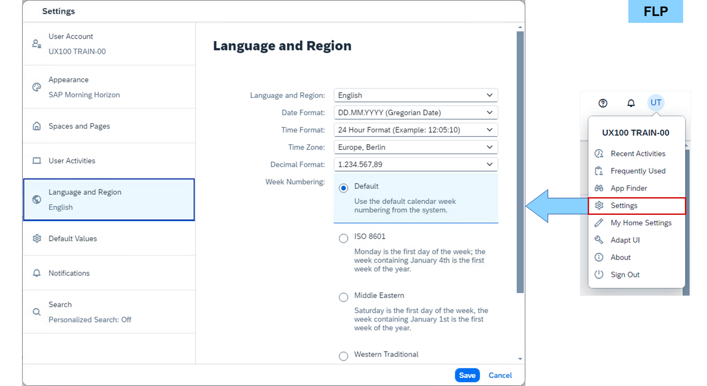
Depending on the configuration of the FLP for the user, the following settings can be changed:
  * Selection of design theme
  * Switch between spaces and home page
  * Activation of user profiling
  * Settings around language and region
  * Maintenance of default values
  * Appearance and behavior of notifications
  * Configuration of personalized search

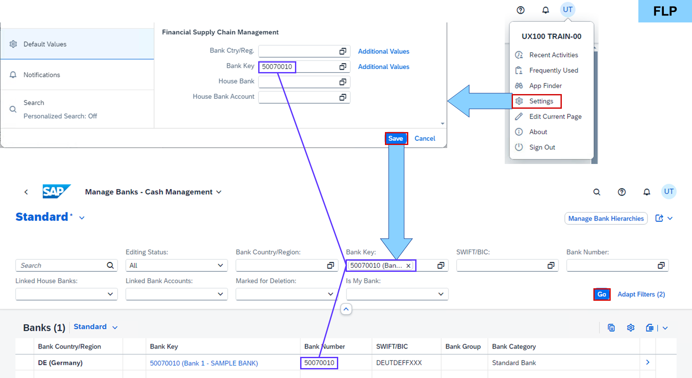
The default values in the FLP settings can be used to set initial values for selection fields when starting applications. The only exception is ABAP transactions, which still rely on the SET-/GET-parameters in SU3/SU01 transaction.
When a user starts the FLP the first time, all SET-/GET-parameters from his back-end user account are copied to the default values. This should make it easier for new users previously working in SAP GUI to step into SAP Fiori. Unfortunately, this only happens once.
The default values can be single, several or even a range of values. The changes of single values are copied to the SET-/GET-parameters, but not the additional values or ranges. It is recommended to only use the default values in SAP Fiori. For more details, please read SAP Note [2519765](https://me.sap.com/notes/2519765) – _Synchronization of Fiori User Default Values with Backend SET-/GET-Parameters_.
## Change Settings in the SAP Fiori Launchpad
### Business Example
You want to change settings in the _SAP Fiori launchpad_.
Note
This exercise requires an SAP Learning system. Login information is provided by your system setup guide.
### Task 1: Change Settings in the SAP Fiori Launchpad
Exercise[Start Exercise](https://learnsap.enable-now.cloud.sap/pub/mmcp/index.html?show=project!PR_8E2053404066FCBA:uebung)
#### Steps
  1. In the _SAP Fiori launchpad_ of your SAP S/4HANA (S4H) system, change its theme to one of your choice.
    1. In the _SAP Fiori launchpad_ of your S4H, choose your user in the upper right-hand corner.
    2. Choose _Settings_.
    3. In the _Settings_ window, choose _Appearance_.
    4. Select a _Theme_ of your choice.
    5. Choose _Save_.
#### Result
The new theme is applied to the _SAP Fiori launchpad_.
  2. Change the language of the _SAP Fiori launchpad_ to one of your choice.
    1. Choose your user in the upper right corner.
    2. Choose _Settings_.
    3. In the _Settings_ window, choose _Language and Region_.
    4. Select a _Language and Region_ of your choice.
    5. Choose _Save_.
#### Result
The _SAP Fiori launchpad_ reloads in the selected language.

## Structure
Since SAP S/4HANA 2020, the spaces concept can be used to structure the _SAP Fiori launchpad_. A space is visualized as a ribbon or tab at the top of the FLP and defines a frame for one or more pages. A page consists of sections showing tiles in the same way as groups have done before.
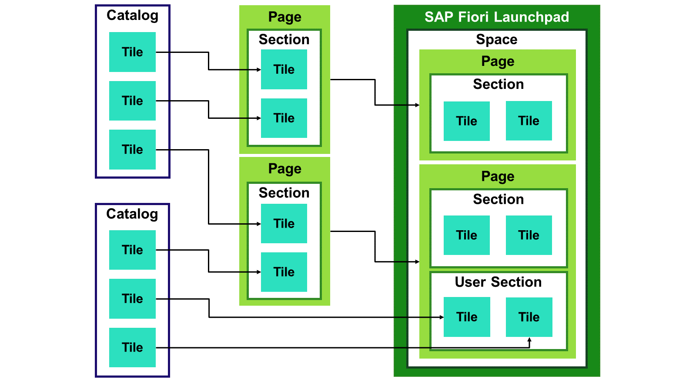
Tiles are organized in catalogs in the system. These catalogs hold all technical information to start an application. To show a tile in the FLP, it is embedded in a page. Pages are then assigned to spaces, which define the structure of the FLP for a user.
Spaces and pages are defined centrally in the system, but only spaces can be assigned to roles. Sections are an integral part of pages and can also be created by the user in their launchpad.
Hint
You can activate spaces in the _SAP Fiori launchpad_ settings under _Spaces and Pages_.
Note
Since SAP S/4HANA 2021 FPS01, the _SAP Fiori launchpad_ home page concept using groups is deprecated. For more information, please read SAP Note [3500249](https://me.sap.com/notes/3500249) – _SAP S/4HANA Cloud Private Edition and SAP S/4HANA: Replacement of Groups (deprecated) by Spaces and Pages_.
Let's see how the _SAP Fiori launchpad_ can be further personalized. Applications require an app descriptor if they are to be called from the _SAP Fiori launchpad_.
Watch the video to learn about the SAP Fiori app descriptor.
Settings
## Personalization of My Home
The first version of _My Home_ in SAP Fiori 1.0 was a business group part of the only existing page. With the introduction of SAP Fiori spaces, _My Home_ grew to an SAP Fiori page, where the user could create sections and add tiles in various sizes. With SAP Horizon, a completely reworked _My Home_ was introduced including many new personalization options.
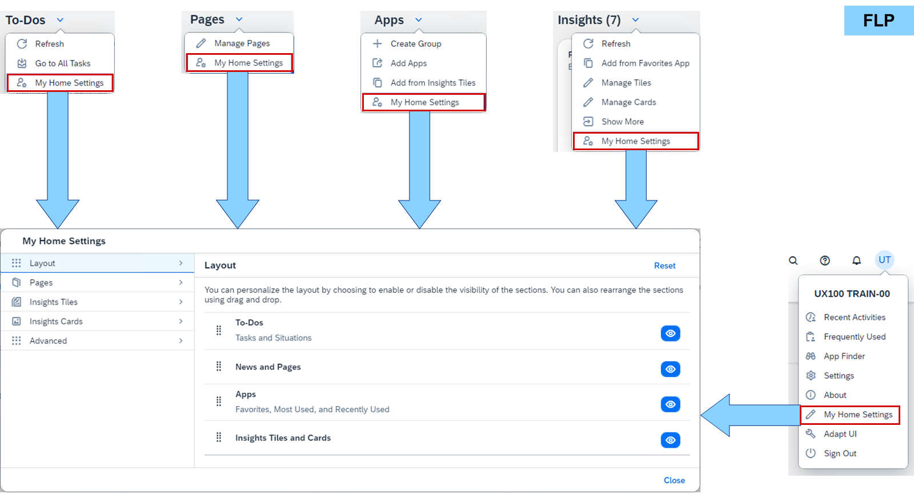
_My Home_ consists of four sections:
  * _To-Dos_
  * _Pages_
  * _Apps_
  * _Insights_

Next to each section header, a small arrow opens a menu offering more functions for the section and access to the _My Home Settings_. The _My Home Settings_ button in the _User Actions Menu_ leads to the same popup.
In _Layout_ , the four sections can be rearranged or hidden. _Pages_ , _Insights Tiles_ , and _Insight Cards_ allow you to define the elements seen in _My Home_. In _Advanced_ , it is possible to export and import the personalized content.
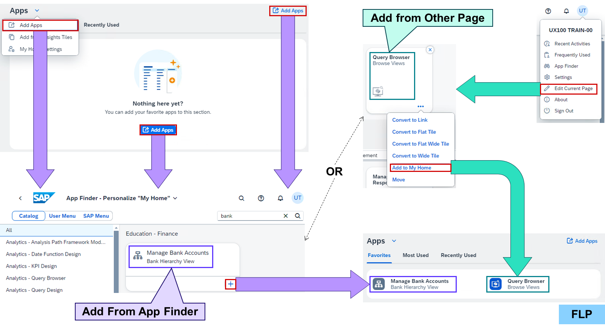
The only section missing in the _My Home Settings_ is _Apps_. Apps are managed directly in _My Home_. You can add apps as favorites in two ways:
  1. Choose _Add Apps_ in the _Apps_ section to open the app finder and select an app from a catalog.
  2. On an _SAP Fiori page_ assigned to your user in FLP, choose _Edit Current Page_ in the _User Actions Menu_ and choose _Add to My Home_ in the context menu of a tile.

The first way comes in handy if you browse all apps assigned to you without concerning, if the app is already part of any page. It is a search for functionality rather than process. The second way instead allows you to bring an app in the foreground, which may be the start of a bigger process the user regularly runs from a page. It is about getting faster access to this process.
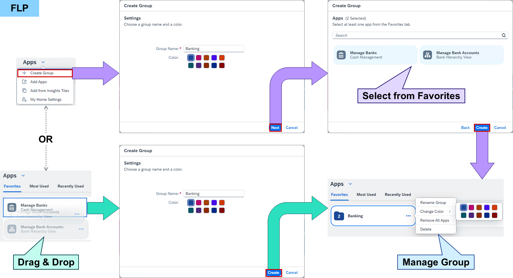
App favorites can be organized in app groups in the _Apps_ section. There are two ways to achieve this. The prerequisite for both ways is that the apps are already added as favorite:
  1. Choose _Create Group_ in the context menu of the _Apps_ section, enter a group name and color, and select the apps from the list of favorites.
  2. Drag and drop an app favorite onto another one and enter a group name and color.

After the app group was created, extra apps can be added or removed and the name and color can be changed via the context menu of the app group. The _Delete_ button deletes the app group and favorites. The _Remove All Apps_ button instead deletes the app group but keeps the apps as favorites.
## Personalize My Home
### Business Example
You want to adapt the sections, pages, and apps of your _My Home_ of the _SAP Fiori launchpad_.
Note
This exercise requires an SAP Learning system. Login information is provided by your system setup guide.
### Task 1: Adapt My Home
Exercise[Start Exercise](https://learnsap.enable-now.cloud.sap/pub/mmcp/index.html?show=project!PR_DFBC19C74447BF8C:uebung)
#### Steps
  1. In the _SAP Fiori launchpad_ of your SAP S/4HANA (S4H) system, in your _My Home_ , hide the _Insights Tiles and Cards_ section.
    1. In the _SAP Fiori launchpad_ of your S4H, in your _My Home_ , choose your user in the upper right-hand corner.
    2. Choose _My Home Settings_.
    3. In the _My Home Settings_ popup, for _Insights Tiles and Cards_ , choose _Hide_ on the right.
    4. Choose _Close_.
#### Result
The _Insights Tiles and Cards_ section disappeared.
  2. In your _My Home_ , hide all pages of the _Line of Business_ space.
    1. In your _My Home_ , choose _More_ (arrow pointing down) next to _Pages_.
    2. Choose _Manage Pages_.
    3. In the _My Home Settings_ popup, choose _Hide_ for all pages part of _Line of Business_.
    4. Choose _Close_.
#### Result
All pages from _Line of Business_ disappeared from the _Pages_ section.
  3. In your _My Home_ , create the group _Banking_ consisting of the tiles for the apps _Manage Bank Accounts_ and _Manage Banks_.
    1. In your _My Home_ , choose _Add Apps_ on the right.
    2. In the _Search in catalog_ field, enter **bank** and choose _Search_.
    3. Select the "+" icon of the _Manage Bank Accounts_ and _Manage Banks_ tile.
    4. Choose _Navigate to Home_ (SAP Logo).
    5. Drag and drop the _Manage Banks_ on the _Manage Bank Accounts_ tile.
    6. In the _Create Group_ popup, in the _Create Group_ field, enter **Banking**.
    7. Select a color of your choice.
    8. Choose _Create_.
    9. In the _Banking_ popup, choose _Close_.
#### Result
The _Banking_ group with two apps was created in the _Apps_ section.
  4. In your _My Home_ , add the tile for the app _Query Browser_ as favorite originating from the _General_ page of the _Cross Topic_ space.
    1. In your _My Home_ , choose the _General_ page.
    2. Choose your user in the upper right-hand corner.
    3. Choose _Edit Current Page_.
    4. For the _Query Browser_ tile, choose _Tile Actions_ (three dots).
    5. Choose _Add to My Home_.
    6. Choose _Close_ in the lower right.
    7. Choose _My Home_.
#### Result
The _Query Browser_ is now part of the favorite apps.

## Personalization of Pages
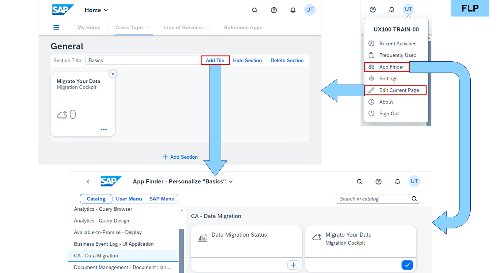
To enter the action mode for personalization of a page, choose _Edit Current Page_ in the _User Actions Menu_ of the FLP. In this mode, sections can be added, hidden, and deleted. Tiles can be removed and new ones can be created and rearranged. When adding a new tile to a section in the action mode or choosing _App Finder_ in the _User Actions Menu_ , the app finder is shown. Here, the user can choose tiles from all catalogs assigned to their user role.
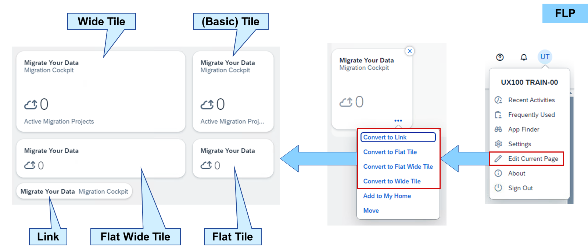
There are five different tile sizes possible on pages, showing less information the smaller the tile gets:
  * (Basic) Tile
  * Wide tile (since SAP S/4HANA 2021 FPS01)
  * Flat tile (since SAP S/4HANA 2021)
  * Flat wide tile (since SAP S/4HANA 2021)
  * Link (tile)

(Basic) Tiles and wide tiles have the same height, show all available information, and are arranged in the same line(s). Analytical and news tiles are special types of (wide) tiles showing even more information.
Flat (wide) tiles only show the title, icon, and preview data. They are arranged in their own line(s) separated from (wide) tiles.
Links are the smallest "tiles" showing only the title and subtitle. They are arranged in their own line(s) separated from all other tiles. They are quite useful to save space on the screen, especially if no preview data is available or needed.
Hint
You can transport FLP and application personalization data to another system. The /UIF/MIGRATE_FES_PERSO report allows you to collect the personalization data and writes these to transport requests. For more information, please read SAP Note [2789848](https://me.sap.com/notes/2789848) – _Migration report for homepage and application personalization_.
## Classic UI Integration
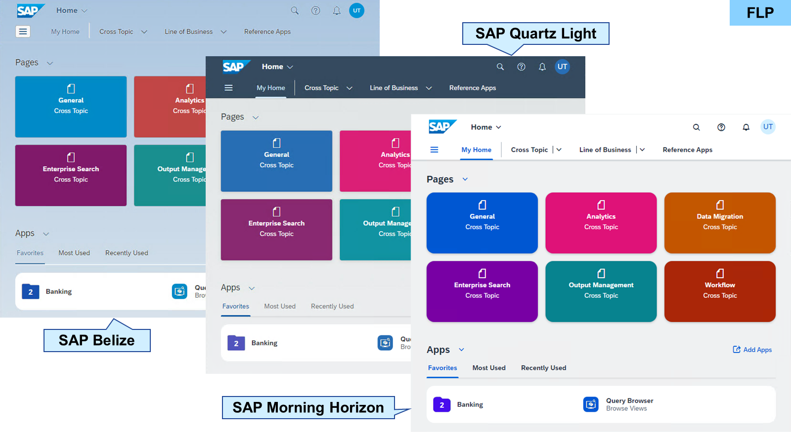
The SAP Fiori themes SAP Belize (Deep) (introduced with SAP Fiori 2.0), SAP Quartz Light/Dark (introduced with SAP Fiori 3), and SAP Fiori Morning/Evening Horizon are not only a design for HTML-apps like SAPUI5, but also for applications running in SAP GUI. Beside changing colors and font, using one of these themes in SAP GUI does also change the structure of the UI.
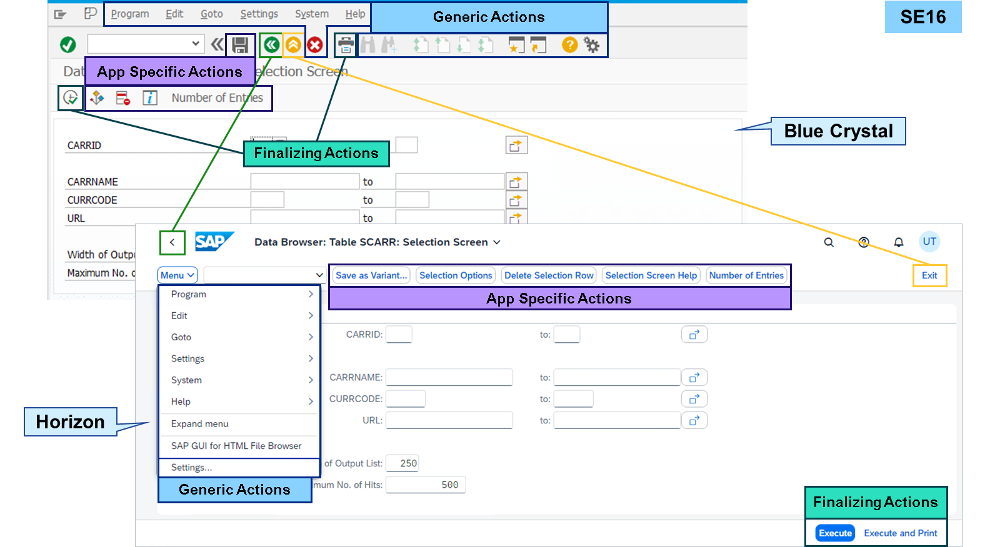
Well-known functions such as SAVE or BACK change their position according to the rules of SAP Fiori. Finalizing actions are defined in the SAP Fiori design guidelines to be visible in the lower-right corner or the BACK button must be in the upper left corner. This all works out-of-the-box by using the SAP Belize or SAP Quartz theme with SAP GUI.
SAP Belize is available as of _SAP GUI for HTML_ with SAP Kernel 7.49 and _SAP GUI for Windows 7.50_ , but only if the user connects to an SAP S/4HANA 1610 or a newer SAP S/4HANA release. With _SAP GUI for Windows 7.60_ , SAP Belize is available for all SAP products.
SAP Quartz is available as of _SAP GUI for HTML_ with SAP S/4HANA 1909 and _SAP GUI for Windows 7.70_. A full documentation of all designs for SAP GUI and their prerequisites is available in SAP Note [710719](https://me.sap.com/notes/710719) – _SAP GUI family and visual designs ("themes")_.
Hint
In _SAP GUI for Windows 7.70_ , it is also possible to replace _Microsoft Internet Explorer_ with _Microsoft Edge_ as the default HTML-control. For more information about this topic, read SAP Note [2913405](https://me.sap.com/notes/2913405) – _SAP GUI for Windows: Dependencies to browsers / browser controls_.
SAP Horizon is available as of _SAP GUI for HTML_ with SAP S/4HANA 2023 and will be available with _SAP GUI for Windows 8.10_.
### SAP Easy Access Menu
Adding transactions to the FLP has been possible since the release of SAP Fiori 1.0. However, in SAP Fiori 2.0, with the automatic adaptation of the design and behavior of SAP GUI to SAP Fiori, it is even more attractive.
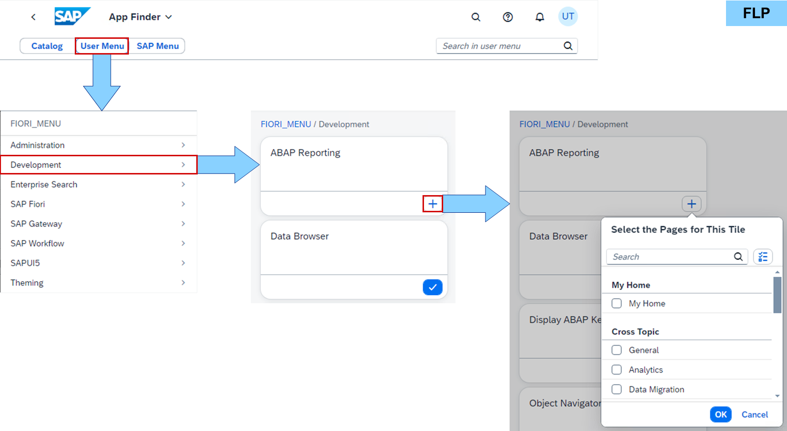
The easiest way to add transactions is by accessing the _User Menu_ or _SAP Menu_ of a mapped ABAP system. The mapping must be done by an administrator. However, once this is complete, creating a tile for an ABAP transaction is as easy as adding any other app to the FLP.
## Personalize SAP Fiori Pages
### Business Example
You want to add tiles and sections to pages of the _SAP Fiori launchpad_.
Note
This exercise requires an SAP Learning system. Login information is provided by your system setup guide.
### Task 1: Add Tiles and Sections in SAP Fiori Pages
Exercise[Start Exercise](https://learnsap.enable-now.cloud.sap/pub/mmcp/index.html?show=project!PR_F873721EF858A896:uebung)
#### Steps
  1. In the _SAP Fiori launchpad_ of your SAP S/4HANA (S4H) system, add the _Data Migration Status_ app as the first tile on the _Cross Topic_ → _General_ page.
    1. In the _SAP Fiori launchpad_ of your S4H, choose the _Cross Topic_ → _Data Migration_ anchor.
    2. Choose your user in the upper right-hand corner.
    3. Choose _Edit Current Page_.
    4. Choose _Add Tile_.
    5. In the _Search in catalog_ field, enter **Migration** and choose _Search_.
    6. Select the "+" icon of the _Data Migration Status_ tile.
    7. Choose _Back_ twice.
    8. Drag and drop the _Data Migration Status_ tile at the first position in the section.
    9. Choose _Close_ in the lower right.
  2. Edit the _Cross Topic_ → _General_ page and create the section **Basics** at the top. Add the _News_ tile of the _Education - Cross-Application_ catalog to it.
    1. Choose the _Cross Topic_ → _General_ anchor.
    2. Choose your user in the upper right-hand corner.
    3. Choose _Edit Current Page_.
    4. Choose any _Add Section_.
    5. In the _Section Title_ field, enter **Basics**.
    6. Drag and drop the _Basics_ section at the top of the page.
    7. Choose _Add Tile_ for the _Basics_ section.
    8. In the list of catalogs on the left-hand side, choose _Education - Cross-Application_.
    9. Select the "+" icon of the news tile.
    10. Choose _Back_ twice.
    11. Choose _Close_ in the lower right.
  3. Start the _Data Browser_ (SE16) in your S4H via a new link in your _Basics_ section.
    1. Choose your user in the upper right-hand corner.
    2. Choose _App Finder_.
    3. Choose _User Menu_ at the top.
    4. In the list of folders on the left, choose _Development_.
    5. Select the "+" icon of the _Data Browser_ tile.
    6. In the _Select the Pages for This Tile_ popup, select _Cross Topic_ → _General_ and choose _OK_.
    7. Choose _Back_.
    8. Drag and drop the _Data Browser_ tile in the _Basics_ section.
    9. Choose your user in the upper right corner.
    10. Choose _Edit Current Page_.
    11. Choose the three points in the lower right of the _Data Browser_ tile.
    12. Choose _Convert to Link_.
    13. Choose _Close_ in the lower-right corner.
    14. Choose the _Data Browser_ link.
    15. Operate the app as you wish.


### Introducing SAP Fiori

*Source: https://learning.sap.com/courses/learning-the-basics-of-sap-fiori/introducing-sap-fiori_c3915ced-ffd1-4127-a822-e217ff45fd72*

Objectives
After completing this lesson, you will be able to:
  * Identify the dimensions of SAP Fiori
  * Explain the principles of SAP Fiori

## The Concept

SAP Fiori is a design language that brings great user experiences to enterprise applications based on SAP User Experience. It works seamlessly on desktops, tablets, and smartphones.
At the point of SAPPHIRE in 2013, the first 25 apps for managers and employees with request and approval functions had been released. Since then the number of apps has increased greatly. SAP Fiori 2.0 was introduced with SAP S/4HANA 1610, taking the idea of SAP Fiori to the next level. Today SAP Fiori 3 is the current target design, which evolves the SAP Fiori design language for all SAP products to fully support the Intelligent Suite.

The three dimensions in which SAP Fiori is defined are design, principles, and technology. In each dimension, rules and guidelines from optic, handling, interactions, and architectures to technologies in development and the system landscape are in place to define what SAP Fiori really is.
## The Design

People often think of user experience (UX) as something emotional rather than rational, making it difficult to create a business case for investing in good UX. But in fact good UX does have a monetary value, on top of the clear human value of making people happier.
### Monetary Value
A good UX helps improve **productivity**. People can get more done, because they are more effective. The system guides them with intelligence to what needs their attention most. Another important aspect is data quality: Incorrectly entered data costs a lot later on in the process. Ensuring good data quality right from the beginning saves later data corrections.
Easy-to-use software hardly needs any training, so you can **save** significant training costs and subsequent support desk costs.
If you include your end users in the implementation and ensure that the UX suits their needs up front, you **decrease** the number of change requests from users. Changes to a deployed UI are more expensive than changes made beforehand. Also user errors are reduced, decreasing costs due to poor data quality and support desk costs.
### Human Value
On top of these quantifiable benefits, a good UX brings clear human value benefits – which are particularly important when companies want to attract the best talents. Who does not want to work with cool modern tools rather than unattractive ones? A good UX **increases** user satisfaction allows inclusion of all employees, and helps ensure that people within the company actually use the software rather than keeping data separate on their desktop.
Providing your business units with software with a good UX helps **strengthen** your relationship with them, since you are providing software that their teams enjoy using. If the apps are used by customers, then a good UX helps build and increase customer loyalty.
Note
SAP offers the SAP UX Value Calculator to gauge potential savings and gather arguments that can be used to convince peers and managers to invest in a better user experience:
<https://apphaus.sap.com/resource/calculate-the-value-of-ux>
Watch the video to get an overview of design thinking.

All details of the SAP Fiori design are available as guidelines for general use. You can find all aspects of the SAP Fiori design starting with the five core design principles up to floorplans of pages and details for UI elements. There are also several resources available for download, such as the SAP icon font or font 72, to empower customers to design their own apps.
Since May 2016, SAP Fiori is also available for Apple iOS. Apple is a strong partner, especially in terms of design. There is a close cooperation between Apple and SAP to provide not only a merged design but also guidance and tools for developers to develop native apps for iOS. In addition, a growing number of apps is developed by this cooperation leveraging the features of Apple mobile devices.
Since June 2018, SAP Fiori is also available for Google Android. It provides a merged design and guidance for developers to develop native apps for Android. However, in contrast to SAP Fiori for iOS, no ready-to-use apps are provided to end users.
Since July 2023, SAP follows a human-centered AI approach, meaning that SAP looks at the users’ needs holistically, which includes aspects like building trust in addition to functional insights and guidance. User guidance can be provided by a graphical UI as well as using a conversational UI. Basically both allow the user to interact with the system and receive guidance. This guidance can be:
  * **Predictive** by analyzing historical data and making predictions or forecasts.
  * **Proactive** by providing insights relevant for the activity the user is doing in the system.
  * **Reactive** by helping users react to external triggers or events suggesting options for dealing with the situation.

Since June 2025, the SAP Fiori design guidelines are the all-encompassing SAP Design System guidelines. This broadens the scope of SAP Fiori to be the core design at SAP for all digital content including and empowered by AI.
To access SAP Design System guidelines, visit <https://www.sap.com/design-system>.
## The Principles

In the second dimension, SAP Fiori offers a unified user experience for various clients. Users should have a consistent, coherent, simple, intuitive, and delightful user experience on all devices to be able to work better and more efficiently. The five design principles of SAP Fiori are at the core of every SAP Fiori app to fulfill these goals. The role-based approach is, therefore, the biggest change in comparison with classic user interfaces.
SAP Fiori has changed user experience and empowered users to use role-based applications as compared to functional-based applications. Watch the video to learn how SAP Fiori has changed user experience from functional-based to role-based.
## The Technology
Watch the video to see the evolution of SAP Fiori.
Settings

In summary, the goal of SAP Fiori is to provide a consistent, intelligent, integrated, and collaborative user experience across all products. This is also known as SAP's customer experience goal.
## Browse the SAP Fiori Design Resources
### Business Example
You want to collect information and resources around SAP Fiori design.
### Task 1: Browse the SAP Community Page of SAP Fiori
#### Steps
  1. In a Web browser, open the _SAP Community_ (<https://community.sap.com/>) and examine the topics page of SAP Fiori.
    1. Open <https://community.sap.com/> in a browser of your choice.
    2. Choose _Topics_ at the top of the page.
    3. In the _Filter Topics_ field, enter **fiori**.
    4. Choose _SAP Fiori_ in the result list.
    5. Examine the SAP Fiori community page.
  2. In the SAP Community page for SAP Fiori, search for and open the SAP Fiori design guidelines using your SAP account.
    1. Scroll down to the _Design_ pane.
    2. In the _Design_ pane, choose the _SAP Fiori design guidelines_ link.
#### Result
The link is forwarded to the _SAP Design System_ portal.

### Task 2: Browse the SAP Design System Guidelines
#### Steps
  1. In the _SAP Design System_ portal (<https://www.sap.com/design-system>), search for the design principles of _SAP Fiori for Web_.
    1. In the _SAP Design System_ portal, choose _Web overview_ below _SAP Fiori for Web_.
    2. In the navigation bar on the left, choose _Discover_ → _SAP Design System_ → _Vision and Mission_.
    3. Choose the _Design Principles_ tile.
#### Result
The _Design Principles_ are displayed.
  2. In the _SAP Design System_ portal, search for the components of _My Home_ in SAP S/4HANA.
    1. In the navigation bar on the left, choose _Discover_ → _SAP Products_ → _SAP S/4HANA_.
    2. Choose the _SAP S/4HANA Product Home Page – My Home_ tile.
    3. Choose _Components_ on the right.
#### Result
The components of _My Home_ in SAP S/4HANA are displayed.
  3. In the _SAP Design System_ portal, search for design documentation of the UI element used to show messages in the object page floorplan.
    1. In the navigation bar on the left, choose _Page Types_ → _Floorplans_ → _Object Page_.
    2. Choose _Message Handling_ on the right.
    3. Choose the _message strip_ link in the text.
#### Result
The design documentation of the _Message Strip_ is displayed.
  4. In the _SAP Design System_ portal, search for the download options of font 72.
    1. In the navigation bar on the left, choose _Resources_ → _Download Fonts_.
    2. Choose _Font 72_ on the right.
#### Result
The download options of font 72 are displayed.


### Using SAP Fiori Launchpad

*Source: https://learning.sap.com/courses/learning-the-basics-of-sap-fiori/using-sap-fiori-launchpad_a9103226-f903-4afb-b471-c07be29c59e3*

Objectives
After completing this lesson, you will be able to:
  * Identify the features of the SAP Fiori launchpad
  * Identify the clients and integration options for SAP Fiori

## Evolution
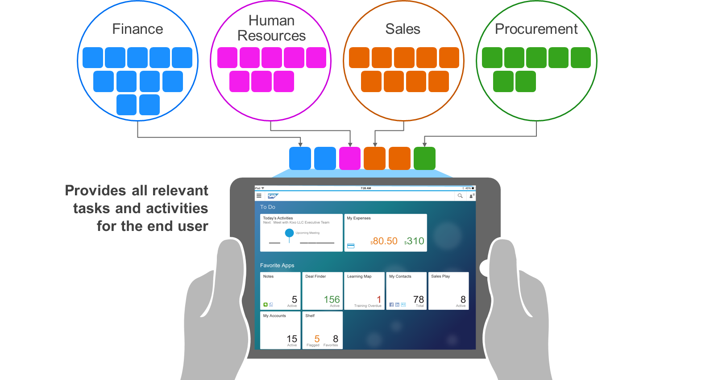
The SAP Fiori launchpad (FLP) offers a coherent user experience across different enterprise solutions by utilizing the capabilities of the user role to combine the decomposed apps in one surface. Each app represents one individual step for one specific role. Therefore, several apps combined represent a complete process covering different enterprise solutions and systems. This is a shift from monolithic solutions to activity-based apps and a role-based simplification of business processes.
### From SAP Fiori 1.0 to SAP Fiori 2.0 to SAP Fiori 3
SAP Fiori is continuously evolving and the evolution continues.
Watch the video to learn how SAP Fiori shifted the approach from monolithic solutions to activity-based apps and a role-based simplification of business processes.
### SAP Fiori Horizon
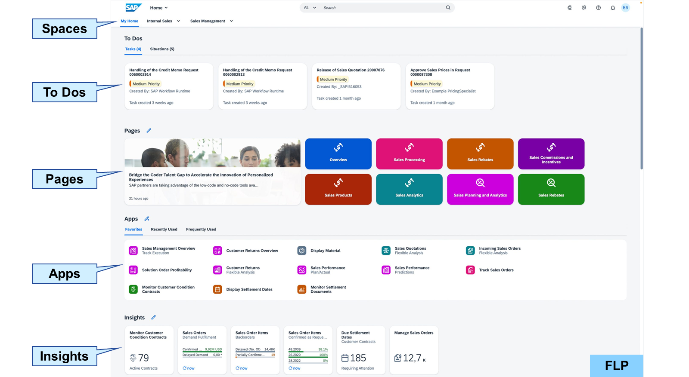
With SAP S/4HANA Cloud 2208, SAP Fiori Horizon is available to customers. SAP decided to no longer count the version of SAP Fiori. Instead, the name of the design theme is used. But it is not just a new theme, it includes new features and functions for the FLP, too. The theme itself is called Horizon and introduces signature design elements to provide a better focus on important parts on the screen.
A new feature is the completely reworked _My Home_ page. It provides several sections with new options of what the user can see and start in the FLP.
  * Tasks and situations are shown as _To Dos_.
  * _Pages_ can be accessed directly without opening the space first.
  * Recently or frequently used _Apps_ and favorites can be started directly.
  * Users can define _Insights_ into analytical data as tiles or cards.

All sections of the _My Home_ page can be personalized by the user.
Note
For more information about this topic, see:
  * SAP Fiori (Community)
<https://pages.community.sap.com/topics/fiori>
  * Introducing SAP Fiori Launchpad for SAP S/4HANA Cloud (Learning Video)
<https://learning.sap.com/videos/introducing-sap-fiori-launchpad-for-sap-s-4hana-cloud>

## Features

The features in the _User Actions Menu_ can be configured per user role. The options for personalization can be reduced to disallowing everything or extended to adapting apps at runtime. The recent activities and frequently used apps can also be deactivated.
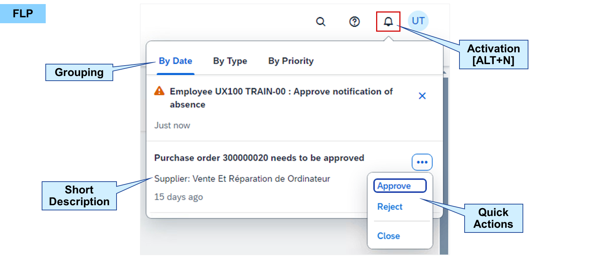
The notifications area can be enabled per user role in the _SAP Fiori launchpad_. Notifications are created by notification providers and can be based on SAP Workflow or the ABAP notification framework. They can offer quick actions and are able to start a suitable app showing details for the notification topic.
## Accessibility
_SAP Fiori launchpad_ provides more features such as context-sensitive User Assistance, Quick Tour, and keyboard shortcut.
We will explore each feature in detail. To begin with, let's look at how SAP Fiori provides context-sensitive assistance to users.
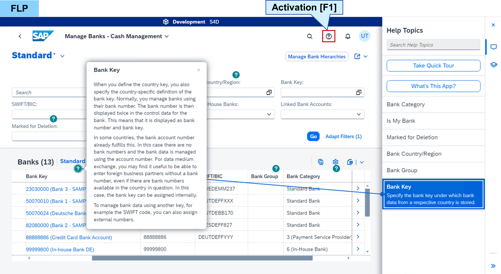
_SAP Fiori launchpad (FLP)_ offers help functionality that includes a guided tour for an app. This context-sensitive User Assistance can be started via the question mark in the upper right corner or by pressing F1. A help panel consisting of help topics shows up to the right of the app as well as bubbles pointing out the key elements inside the app. By selecting a topic or a bubble, an information pop-up appears, offering more information about the functionality.
The help content for this User Assistance is provided by the SAP Content Server hosted by SAP, an SAP Enable Now Manager hosted by the customer, or a mixture of both. This also includes access to learning material available in the Learning Center.
Watch the video to get an overview of the Quick Tour pop-up.
Watch the video to explore the keyboard navigation of SAP Fiori Launchpad.
Settings
## Client Integration
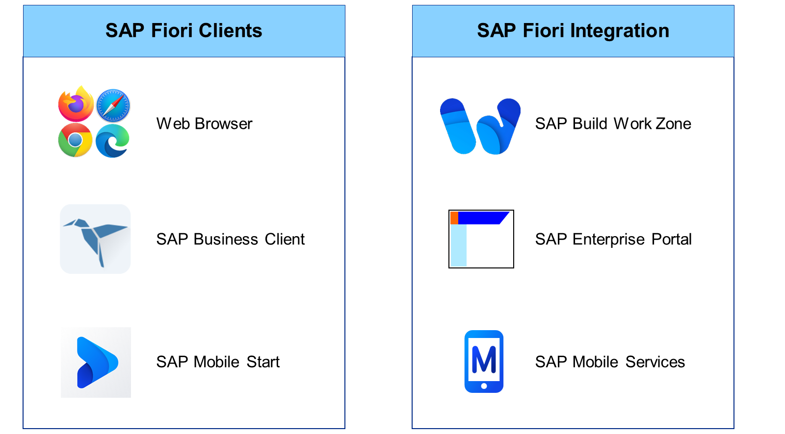
There are three clients available to access SAP Fiori:

Web Browser

Any HTML5-ready browser can be used.

SAP Business Client

As of _SAP Business Client 6.0_ , you can create _SAP Fiori launchpad_ system connections.

SAP Mobile Start
    You can access SAP Build Work Zone, standard edition web sites providing apps based on cloud and on-premise SAP solutions.
You can also integrate SAP Fiori in other system areas to add more values like logon features or increased distribution range. Details and benefits of these integration options are discussed later or considered in more depth in other trainings:
  * SAP Build Work Zone
  * SAP Enterprise Portal
  * SAP Mobile Services

Now, let's explore each client in detail.
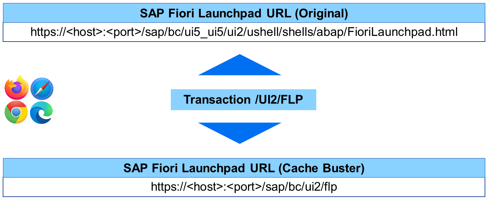
The original way to start an FLP is to enter the URL https://<host>:<port>/sap/bc/ui5_ui5/ui2/ushell/shells/abap/FioriLaunchpad.html in an HTML5-ready browser. This URL has been available since the beginning of SAP Fiori. Over time, SAP added more options to start the launchpad.
Many customers access SAP software via a logon to an Application Server ABAP (AS ABAP). Therefore, the transaction /UI2/FLP is added. With this transaction, you can log on automatically with the credentials you used to log on to the AS ABAP. This approach is for users working in both worlds, ABAP transactions and SAP Fiori web apps, if no business client is available.
Note
By default, transaction /UI2/FLP starts the FLP via the Internet Communication Manager (ICM) process of your application server instance. An entry in the database table HTTPURLLOC can be used to call a reverse proxy, such as SAP Web Dispatcher.
The current URL to start the FLP is https://<host>:<port>/sap/bc/ui2/flp. This URL is much shorter than the original one so it is easier to memorize. Even more important is the cache buster feature. This technique causes web browsers to load content from the server rather than from the browser cache if activated. The cache buster for SAP Fiori uses versioned URLs containing tokens to signal the browser that new resources are available on the server. Instead of forbidding caching or setting a lifetime for the resources, the system invalidates the cache only when resources are actually updated on the server.
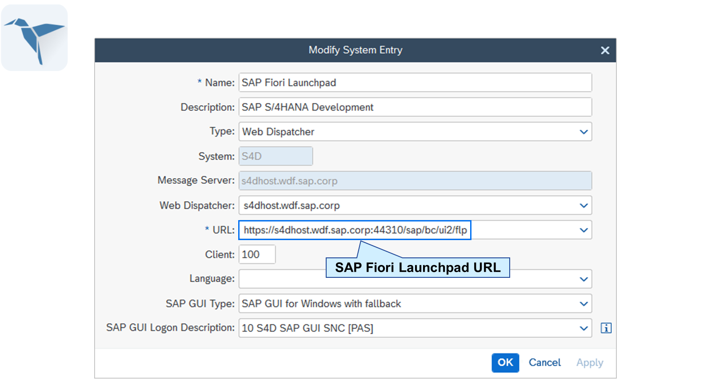
_SAP Business Client_ makes it possible to access SAP GUI and web applications in one client software. Therefore, in _SAP Business Client 6.0_ , the ability to add system connections for FLP was introduced. The benefit is the end user only needs one tool to access all the functions of an AS ABAP. It is even possible to start ABAP transactions in the FLP, which opens a new SAP GUI tab in the _SAP Business Client_. SAP Logon is completely integrated in _SAP Business Client_.
Hint
For _SAP Business Client 6.0_ , the term NetWeaver was dropped from the name. Previous releases are still called _SAP NetWeaver Business Client (NWBC)_.

_SAP Mobile Start_ was introduced in August 2021. It is a mobile application for Apple iOS and Google Android integrated with SAP S/4HANA and further SAP solutions, leveraging the SAP Business Technology Platform (BTP). The SAP Build Work Zone, standard edition, Notification service, and Mobile Services of BTP work together to provide web sites and apps for mobile usage. SAP Mobile Start integrates with mobile operating system features like notifications, spotlight search, and widgets running on smartphones, watches, and tablets.
## Prepare the SAP Learning System
### Business Example
In your SAP Learning system, you want to log in to the _SAP Secure Login Client_.
Note
This exercise requires an SAP Learning system. Login information is provided by your system setup guide.
### Task 1: Prepare the SAP Learning System
Exercise[Start Exercise](https://learnsap.enable-now.cloud.sap/pub/mmcp/index.html?show=project!PR_4AA0D78C4DC713B1:uebung)
#### Steps
  1. Log in to your SAP Learning system.
    1. Follow your system setup guide.
  2. In your SAP Learning system, log in to the _SAP Secure Login Client_.
    1. In the Windows taskbar, choose _SAP Secure Login Client_.
    2. In the _SAP Secure Login Client_ window, right-click _SAP AS Java Authentication_ and choose _Log In…_.
    3. In the _User name_ field, enter your user name.
    4. In the _Password_ field, enter your password.
    5. Choose _OK_.
#### Result
You can now log into your SAP S/4HANA system using SAP Logon, SAP Business Client, or a Web browser via Single Sign-On (SSO).

## Operate SAP Fiori Launchpad
### Business Example
You want to start the _SAP Fiori launchpad_ of your SAP S/4HANA system in a Web browser and in the _SAP Business Client_.
You want to operate the _User Actions Menu_ and the _Notification Area_ of the _SAP Fiori launchpad_.
Note
This exercise requires an SAP Learning system. Login information is provided by your system setup guide.
### Task 1: Start the SAP Fiori Launchpad in Different Clients
Exercise[Start Exercise](https://learnsap.enable-now.cloud.sap/pub/mmcp/index.html?show=project!PR_FE403F9A4087A085:uebung)
#### Steps
  1. Start the _SAP Fiori launchpad_ of your SAP S/4HANA (S4H) system in a Web browser and check the _Quick Tour_.
    1. In the Windows start menu, choose a Web browser.
    2. In the Web browser favorites, choose the _SAP Fiori launchpad_ of your S4H.
    3. Check the content of the _Quick Tour_.
    4. Close the _Quick Tour_ popup.
  2. Start the _SAP Fiori launchpad_ of your S4H in the _SAP Business Client_ and examine the system entry.
    1. In the Windows start menu, choose _SAP Business Client_.
    2. In _SAP Business Client_ , select the _SAP Fiori launchpad_ of your S4H.
    3. Choose _Edit_.
    4. Examine the system entry.
    5. Choose _Cancel_.
    6. Choose _Log On_.

### Task 2: Check and Operate SAP Fiori Reference Apps
Exercise[Start Exercise](https://learnsap.enable-now.cloud.sap/pub/mmcp/index.html?show=project!PR_192E761E3776D1A9:uebung)
#### Steps
  1. Examine the _SAP Fiori launchpad_ information dialog box for the SAP Fiori reference app _Shop_.
    1. In the _SAP Fiori launchpad_ , choose the _Reference Apps_ anchor.
    2. Choose the _Shop_ tile.
    3. Choose your user in the upper right corner.
    4. Choose _About_.
    5. Examine the app information.
    6. Choose _OK_.
  2. Buy a product in the SAP Fiori reference app _Shop_ and access your purchase order via the notification in the _SAP Fiori launchpad_.
Note
Your user is also allowed to handle purchase orders of other users so be careful to only work with your purchase orders.
    1. In the SAP Fiori reference app _Shop_ , select a product of your choice and choose _Add to Cart_.
    2. In the upper right corner of the screen, choose _Shopping Cart_.
    3. Choose _Go to Checkout_.
    4. Choose _Buy Now_.
    5. In the upper right corner of the screen, choose _Notifications_.
    6. Select the most recent _Purchase order_.
Hint
If the purchase order does not show your product, select the purchase order of your user on the left. Remember that your user is allowed to handle all users.


### Exploring SAP Fiori Data Handling

*Source: https://learning.sap.com/courses/learning-the-basics-of-sap-fiori/exploring-sap-fiori-data-handling_c0701c78-f545-4219-8ace-beb7d28cdd09*

Objectives
After completing this lesson, you will be able to:
  * Execute SAP Fiori data handling.
  * Operate SAP Fiori search.

## Interaction Floorplan
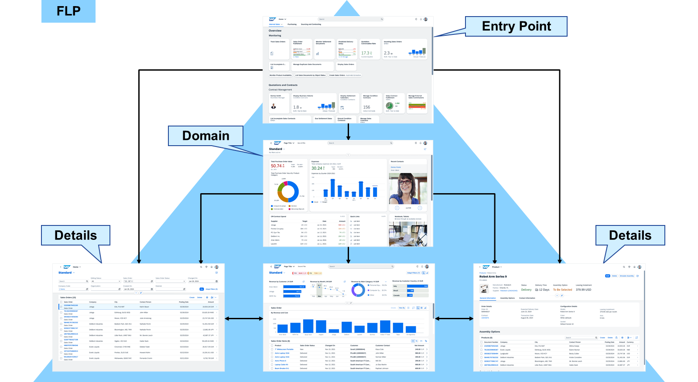
The SAP Fiori interaction pyramid visualizes the connection between different layers of apps. The overall content scope becomes more focused with each interaction step. The FLP used as an entry point contains all favorite apps of a user. An overview page focuses on the domain-specific key tasks and contains only the most frequently used apps for a role. A pool of apps shows the details and offer actions for certain business objects with object pages standing in the center of cross-app navigation.
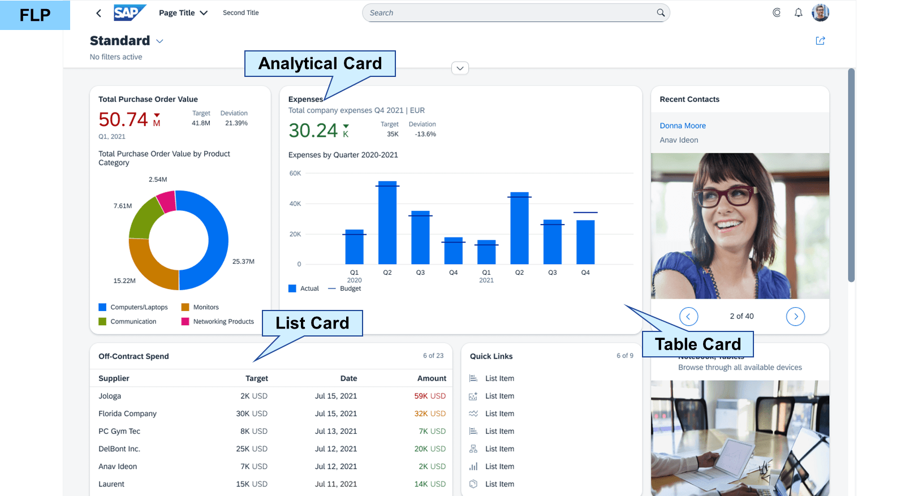
The overview page (OVP) is a data-driven SAP Fiori app type and floorplan. It provides all the information that a user needs in a single page, based on the specific domain or role of the user. It enables the user to focus on the most important tasks and view, filter, and react to information quickly. Each task or topic is represented by a card (or content container). Different types of cards enable the visualization of information in an attractive and efficient way.
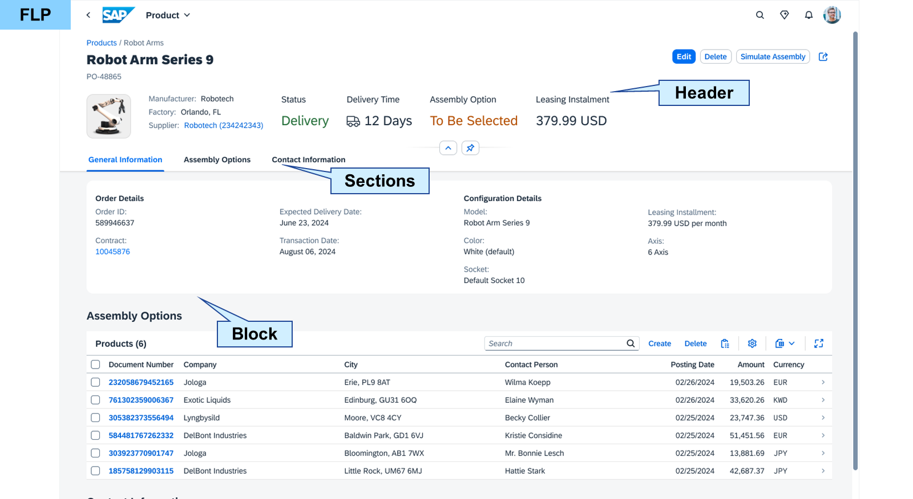
The object page enables the user to display, create, or edit a business object. It comes with a flexible header; a choice of anchor or tab navigation; and a flexible, responsive layout. These features make it adaptable for a wide range of use cases. The object page, similar to the overview page, is based on _SAP Fiori elements_ technology and uses an annotated view of app data.
## SAP Fiori Search
SAP Fiori offers a powerful search to find contents in the _SAP Fiori launchpad (FLP)_. Using any database, you can search for text fragments of SAP Fiori tiles. However, when using SAP HANA, all business data of the back-end server (BES) can be searched quickly.
To access the SAP Fiori search, open the _Search_ field at the top of the FLP, select a data area, and enter any value of a dataset in the BES. You can use the wildcard * as a placeholder.
Watch the video to see how to use the SAP Fiori Search.
## Operate SAP Fiori Search
### Business Example
You want to search for business data using the SAP Fiori search, navigate to dependent business objects, and save the result as a tile in the _SAP Fiori launchpad_.
Note
This exercise requires an SAP Learning system. Login information is provided by your system setup guide.
### Task 1: Navigate SAP Fiori Search
Exercise[Start Exercise](https://learnsap.enable-now.cloud.sap/pub/mmcp/index.html?show=project!PR_6D897154FB0D8E83:uebung)
#### Steps
  1. Search for all banks in **Germany** in the _SAP Fiori launchpad_ of your SAP S/4HANA (S4H) system.
    1. In the _SAP Fiori launchpad_ of your S4H, choose _Search_ in the upper right-hand corner.
    2. In the _Search In_ dropdown, choose _Banks_.
    3. In the _Search_ field, enter ***** and choose **Enter**.
    4. Choose _Show filters_ in the upper left.
    5. In the _Filter By_ pane, choose _Germany_ as _Country_.
    6. Examine the _Results_ screen.
  2. Display the G/L account balances of the house bank account of **Bank 1** for the currency _EUR_.
    1. On the _Results_ screen, choose _Bank 1 - SAMPLE BANK 50070010_.
    2. In the _House Banks_ table, choose _DEBK1_.
    3. In the _House Bank Accounts_ table of _DEBK1_ , look for _EUR_ in the _Currency_ column.
    4. Choose the _G/L Account_ _11001000_.
    5. In the popup, choose _Display G/L Account Balances_.
    6. In the _Fiscal Year of Ledger_ field, enter the current year and choose **Enter**.
#### Result
There are no balances for this G/L account in the current year.

### Task 2: Save an App as Tile
Exercise[Start Exercise](https://learnsap.enable-now.cloud.sap/pub/mmcp/index.html?show=project!PR_A53F6F326BA876A5:uebung)
#### Steps
  1. In the _SAP Fiori launchpad_ spaces of your S4H, save the balances of the G/L account _11001000_ as a tile in your _My Home_ page. Add **Bank 1 Giro** as _Subtitle_ for the tile.
    1. In the _SAP Fiori launchpad_ of your S4H, in the _Display G/L Account Balances_ , in the upper right-hand corner, choose _Share_ → _Save as Tile_.
    2. In the _Subtitle_ field, enter **Bank 1 Giro**.
    3. For the _Pages_ field, open the value help.
    4. In the _Pages_ popup, select _My Home_ and choose _Apply_.
    5. Choose _Save_.
    6. Choose _Navigate to Home_.
    7. In the _Apps_ section, choose the _Display G/L Account Balances (Bank 1 Giro)_ tile.
    8. Continue to operate the SAP Fiori search as you wish.

[Continue to quiz](https://learning.sap.com/courses/learning-the-basics-of-sap-fiori/end-user-perspective_430105f0-e770-31b0-bdd7-8fab5d5399e0)


### Quiz

*Source: https://learning.sap.com/courses/learning-the-basics-of-sap-fiori/end-user-perspective_430105f0-e770-31b0-bdd7-8fab5d5399e0*

It's time to put what you've learned to the test, get 8 right to pass this unit.
1.
### Of which sections does the SAP Fiori My Homeconsist?
There are four correct answers.
Apps
Notifications
To-Dos
Insights Tiles and Cards
News and Pages
2.
### For data-driven navigation, which navigation targets can data objects offer?
There are two correct answers.
Data objects
Functions
Processes
Data elements
3.
### Which personalization elements can be assigned to user roles?
There are three correct answers.
SAP Fiori group
SAP Fiori tile
SAP Fiori catalog
SAP Fiori space
SAP Fiori page
4.
### Which SAP Fiori themes change the structure of ABAP transactions automatically?
There are three correct answers.
Belize
Blue Crystal
Horizon
Quartz
Signature
5.
### How can you add apps to the SAP Fiori My Home?
There are two correct answers.
From app finder
From notifications area
From other page
From outer space
6.
### Which element has the application as target?
Choose the correct answer.
SAP Fiori user role
SAP Fiori catalog
SAP Fiori tile
SAP Fiori app descriptor
7.
### What are the main principles of SAP Fiori?
There are five correct answers.
Role-based
Adaptive
Simple
Coherent
Delightful
8.
### Which platforms support the integration of SAP Fiori?
There are three correct answers.
SAP Enterprise Portal
SAP Process Integration
SAP HANA Enterprise Cloud
SAP Build Work Zone
SAP Mobile Services
9.
### Which dimensions define SAP Fiori?
There are three correct answers.
Design
Performance
Principles
Technology
10.
### Which clients can be used for SAP Fiori?
There are two correct answers.
Web browser
SAP Logon
SAP Easy Access
SAP Business Client
Submit answers[Next unit](https://learning.sap.com/courses/learning-the-basics-of-sap-fiori/explaining-user-interfaces_c2d82120-6a0c-49d2-b872-8b5352c0dfad)


### Technology

*Source: https://learning.sap.com/courses/learning-the-basics-of-sap-fiori/explaining-user-interfaces_c2d82120-6a0c-49d2-b872-8b5352c0dfad*

Objectives
After completing this lesson, you will be able to:
  * Explain UI technologies used in SAP Fiori
  * Explain SAPUI5 development.
  * Use SAP Business Application Studio for SAPUI5 Development.
  * Use Visual Studio Code for SAPUI5 development.

## UI Technologies
Watch the video to explore the tools and technologies in SAP UI.

Most SAP Fiori apps are web apps built using SAPUI5 as UI technology. SAPUI5 is based on HTML5 and can be consumed on every device using a browser. The recommended development environment for SAPUI5 is the _SAP Business Application Studio_.
SAP Fiori also supports native apps. These apps are developed in the native programming language used on a device, allowing a better integration. Apple and SAP are cooperating to develop native apps for iOS using _Apple Xcode_ as the development environment. The open source language Swift, which was originally created by Apple, serves as programming language (see <https://swift.org>). You can also develop native apps for Android using Java as the programming language in the _Android Studio_. In contrast to the cooperation with Apple, apps are not shipped by Google or SAP.
Cross platform SAP Fiori apps are developed using "low-level" code like metadata or scripts. The "low-level" code is dynamically interpreted to render a native mobile UI. The SAP Mobile Services provide the SAP Mobile Development Kit (MDK) for creating and interpreting "low-level" code. The MDK is integrated in the _SAP Business Application Studio_.
## HTML5

With SAPUI5 as a basis for web apps, browsers need a certain minimum release to process all code elements used in HTML5 and JavaScript. _Google Chrome_ and _Microsoft Edge_ both support HTML5 from the beginning. _Mozilla Firefox_ and _Apple Safari_ were updated to support it.
Caution
Although _Microsoft Internet Explorer_ has officially supported HTML5 since version 8, it is recommended to switch to _Microsoft Edge_. Microsoft and SAP announced the end of support for _Internet Explorer_.
For more information about this topic, please read SAP Note [1672817](https://me.sap.com/notes/1672817) – _Browser: Microsoft Legacy Edge and Internet Explorer Support Policy Note_.

Hypertext Markup Language 5 (HTML5) is a markup language used to structure webpages. In combination with Cascading Style Sheets 3 (CSS3) for the layout, these webpages can be visualized using a browser. For dynamic interactions in webpages, the programming language JavaScript is used. JavaScript code is organized in libraries from which it can be reused in other webpages. jQuery is a well-known library in the area of HTML5 that offers best practices.
## SAPUI5

SAPUI5 was originally built on top of jQuery and added additional HTML5 browser rendering libraries. All extensions to jQuery aimed to make webpages SAP product standard-compliant in visualizing and handling. Today, most of the original jQuery libraries are replaced by SAP ones.
The original theme of SAPUI5, created in CSS3, was Gold Reflection. Today, SAPUI5 is closely coupled with SAP Fiori design implementing all supported themes in CSS3.
SAPUI5 extensibility options allow a wide range of adaptations:
  * Include custom JavaScript, HTML, and CSS in SAPUI5-based pages
  * Include custom JavaScript libraries
  * Create composite controls from existing SAPUI5 controls
  * Create new libraries and controls

Asynchronous JavaScript and XML (AJAX) was first implemented at SAP with _Web Dynpro_ , and it is also used in SAPUI5 to present a native-like handling of web apps. Apps developed with SAPUI5 present a consistent user experience and are responsive across browsers and devices including smartphones, tablets, and desktops. The user interface (UI) controls automatically adapt themselves to the capabilities of each device.
SAPUI5 is the SAP user interface development toolkit for HTML5. Let's try to better understand SAPUI5.
Besides SAPUI5, SAP also provides OpenUI5 as a delivery of the UI development toolkit. The core containing all central functionality and the most commonly used control libraries are identical in both deliveries. Although very closely related, they have their differences:

OpenUI5

OpenUI5 is open source, free to use, released under the Apache 2.0 license. OpenUI5 provides all the important features needed to build feature-rich Web applications. The source is available on <https://github.com/SAP/openui5/>.
If you find a bug or have an idea for a new feature, you can propose a GitHub issue or a change. Please read the guidelines first: <https://github.com/SAP/openui5/blob/master/CONTRIBUTING.md>.
For more information, please visit <https://openui5.org/>.

SAPUI5

SAPUI5 is not a separate SAP product with a separate license. It is integrated in many SAP products. The first one was the AS ABAP 7.4, which included SAPUI5 in the UI technologies component SAP_UI.
The additional libraries in SAPUI5 include more controls on top of OpenUI5, like charts and smart controls. The exact feature range of SAPUI5 also depends on the platform.
For more information, please visit <https://ui5.sap.com/>.
Technically, you can switch between OpenUI5 and SAPUI5 (provided you have a product where SAPUI5 is included). Please check first, which SAPUI5 version is needed. The version numbers of OpenUI5 and SAPUI5 might differ on patch level (last number).

A library bundles a set of controls and related types to make them consumable by Web applications. There are predefined and standard libraries with many commonly used controls:
  * Responsive controls (sap.m)
  * Smart controls (sap.ui.comp)
  * Core controls (sap.ui.core)
  * Layout controls (sap.ui.layout)
  * Table control for desktop (sap.ui.table)

The core library (technically, this is the sap.ui.core library) defines a core set of types that can be used in other libraries. Developers can create their own custom UI libraries, making it easy-to-use their own controls alongside predefined controls.

TypeScript is an extension of JavaScript that adds type information to the language. It helps developers catch errors early through type checking and by providing code assist in supporting code editors, for example through code completion and inline documentation. It increases development efficiency.
TypeScript is not much different from JavaScript. In fact, it is a super-set of JavaScript that adds some language features on top. As a simple example, if a variable is specified as number, then it is not possible to assign a string (which would be possible in JavaScript). The same is possible for more complex structures and classes. This type information is used by the code editor to help you writing code:
  * Error messages while you code
  * Code completion
  * Inline documentation
  * Easier refactoring and maintenance

Web browsers cannot execute TypeScript. Hence, a transpilation step is needed. It converts the code to JavaScript basically by stripping away all the type information and minimizing the code. This also means that the type safety and everything that TypeScript provides is purely focused on development time, not the runtime of the code. Nevertheless, the original source code can be made available to browsers using "source maps". During debugging, you can see the original TypeScript code you wrote.
SAPUI5 itself is written in JavaScript without any type information. But all the types of the SAPUI5 APIs are declared in separate type definition files. In the development environments provided by SAP, these type definitions are already added as dependencies and the transpilation step is also already set up.
### Model View Controller (MVC)

The Model View Controller (MVC) concept separates the tasks in an application into three programmatic elements:

Model

Holds the data of the app and/or connection to the data source organized as OData, JSON, XML, or resource bundle.

View

Holds the user interface consisting of UI5 controls organized in libraries.

Controller

Holds the logic of the application as TypeScript or JavaScript reacting on messages from models and views and updating these.
In SAP Fiori, views are defined using XML. The only SAP Fiori app that uses HTML is the _SAP Fiori launchpad_ , which provides a frame for the XML-based views. Controllers are developed using JavaScript and are either bound to a view or standalone to be used by multiple views. Data binding can be used on the views to connect to data in the models.
### SAPUI5 Versions
SAPUI5 provides updates on a regular basis through maintenance and innovation versions.
Watch the video to get an overview of SAPUI5 versions.

In an on-premise scenario, the SAPUI5 libraries are stored in the SAP_UI software component of an Application Server (AS) ABAP. The customer is responsible to keep this up-to-date.
In a cloud scenario, the SAPUI5 libraries are loaded from the Content Delivery Network (CDN) of SAP. SAPUI5 and OpenUI5 versions are removed from the CDN one year after their end of maintenance. In addition, patches of versions in maintenance, which are older than one year, are removed.
Caution
Once a version is removed, applications using this version will break. To avoid a potential security risk, update the applications to a more recent version:
SAP Note [3001696](https://me.sap.com/notes/3001696) - _Removed outdated SAPUI5 versions from SAPUI5 CDN - Fiori applications might stop functioning._
A full list of all SAPUI5 versions including their end of maintenance can be found under <https://ui5.sap.com/versionoverview.html>.
Which SAPUI5 versions are available on an AS ABAP is provided via https://<host>:<port>/sap/public/bc/ui5_ui5/index.html.
The version a running app is using is visible in the technical information dialog opened via CTRL+ALT+SHIFT+P on Microsoft Windows or via CTRL+ALT+OPTION+P on Apple Mac.
Note
For more information about this topic, see:
  * Developing UIs with SAPUI5 (Classroom Training)
<https://training.sap.com/course/ux400>
  * Developing SAPUI5 Applications (Learning Journey)
<https://learning.sap.com/learning-journeys/develop-sapui5-applications>
  * Patching SAP Fiori (SAPUI5) (Learning Video)
<https://learning.sap.com/videos/patching-sap-fiori-sapui5->

## SAPUI5 Development Tools
Time to look at SAPUI5 development tools. These include _SAP Business Application Studio_ and _Visual Studio Code_.
Let's compare the two tools.

Since 2020, SAP provides the _SAP Business Application Studio (BAS)_ , back then based on Theia, an open source project by Eclipse. Since 2022, it is based on Code OSS, an open source project by Microsoft. It is provided in the SAP BTP as a service subscription and brings its own runtime. It provides preconfigured environments, so-called _Dev Spaces_ , with preinstalled runtimes and tools tailored for key scenarios. These are based on extensions such as the _SAP Fiori tools_ extension.
Another tool where the _SAP Fiori tools_ extension can be included is _Visual Studio (VS) Code_. It is developed by Microsoft based on the open source IDE Code OSS. Although not based on Theia, it is fully compatible. SAP offers the _SAP Fiori tools_ beside others free of charge in the extensions marketplace of _VS Code_. _VS Code_ can be downloaded under <https://code.visualstudio.com/>.
Note
Between 2014 and 2019, SAP provided the _SAP Web Integrated Development Environment (IDE)_ based on Orion, an open source project by Eclipse. Today, it is recommended to use the SAP BAS instead.

Developing an SAP Fiori web app means developing SAPUI5 using the _SAP Fiori tools_ extension in SAP BAS or _VS Code_. A project in the development environments can connect and, therefore, represents an SAP Fiori app delivered and managed in an Application Server (AS) ABAP as _Business Server Page (BSP)_. The BSP serves as a container for SAPUI5 apps, although BSP was originally developed based on HTML4. The tools in the _ABAP Workbench_ (SE80) have not been updated for this new role of BSP. The complexity of SAPUI5 is better handled in a pure web-based environment.
The Cloud Connector is a standalone software that is available free of charge to connect the services in the SAP BTP with the on-premise systems in the customer network. Once installed in the customer network, it establishes a secure SSL Virtual Private Network (VPN) connection to the SAP BTP. Therefore, it is not needed for _VS Code_. The Cloud Connector is available for download under <https://tools.hana.ondemand.com/>.

In the _ABAP Workbench_ (SE80), SAPUI5 artifacts can be displayed by opening the surrounding BSP application. This allows some administrative functions like assigning the BSP to a transport request or to another package. It is also possible to view the unformatted source code in the files, but it is not suitable to edit any artifacts.
All HTTP services of an AS ABAP are organized in the _HTTP Service Hierarchy Maintenance_ (SICF). The HTTP service to run an SAPUI5 application can be found under /sap/bc/ui5_ui5 in the Internet Communication Framework (ICF). Applications without an own namespace are organized in the subfolder sap. The name of the service is equal to the name of the BSP application.
The HTTP service to run a BSP application can be found under /sap/bc/bsp. This does also mean that for a BSP housing an SAPUI5 application, the same applies. But these services are inoperable because there is no actual BSP application connected. These services can be ignored and therefore deactivated.
## SAP Business Application Studio

When starting the _SAP Business Application Studio (BAS)_ , the _Get Started_ page is shown. It offers buttons to start the development by creating, cloning, importing, or just opening projects. On the left side, side panels can be opened to jump to different parts of the development. The upper ones originate from Code OSS, the lower ones were included by SAP, like the one for SAP Fiori.

The SAP BAS is hosted as a service subscription in a subaccount of the SAP Business Technology Platform (BTP). A subscription is standalone and runs without the need of a runtime environment or any other service. The entitlement, the right to provision and consume a resource, must be available in the subaccount.
From the _Service Marketplace_ in the _SAP BTP Cockpit_ of a subaccount, a service can be created by choosing a service plan. Creating the SAP BAS does not need any additional data and results in a service subscription in _Instances and Subscriptions_.

For operating the SAP BAS, certain authorizations are needed. These are organized in the following role collections:

Business_Application_Studio_Administrator
    Allows administrators to manage (export and delete) user data.

Business_Application_Studio_Developer
    Allows developers to load and develop applications.

Business_Application_Studio_Extension_Deployer
    Allows extension developers to deploy simple extensions.
Assigning a role collection can be done in the _SAP BTP cockpit_ under _Security_ → _Users_. Select the user and choose _Assign Role Collection_ on the right. Then, select the role collections you want to assign.
For the role collections to be available, the service must be successfully subscribed.
Watch the video to see how to create a dev space in SAP Business Application Studio.
Settings

Although the SAP BAS offers several buttons and menu entries to start a tool of the _SAP Fiori tools_ , the most comprehensive list of tools can be accessed in the _Command Palette_. Choose _Help_ → _Show All Commands_ in the menu or use Control+Shift+P to show and run commands. Entering **fiori** in the _Command Palette_ provides a list with all _SAP Fiori tools_ to start from including generators and templates.
## Operate SAP Business Application Studio
### Business Example
You want to explore the features of _SAP Business Application Studio (BAS)_.
Note
This exercise requires an account on SAP Business Technology Platform. The login information is provided by your system setup guide of your SAP Learning system.
### Task 1: Prepare the SAP Business Application Studio for Operation
Exercise[Start Exercise](https://learnsap.enable-now.cloud.sap/pub/mmcp/index.html?show=project!PR_1DD9921AE783C184:uebung)
#### Steps
  1. Log on to SAP Business Technology Platform (BTP) using your SAP BTP account.
    1. In the Windows start menu, choose a Web browser.
    2. In the Web browser favorites, choose a suitable _SAP BTP Cockpit_ in the _SAP Business Technology Platform_ folder or enter <https://emea.cockpit.btp.cloud.sap/>.
    3. Log on using your SAP BTP account.
  2. In the _SAP BTP Cockpit_ of your subaccount, create a service subscription for the _SAP Business Application Studio (BAS)_ with the service plan **standard-edition**.
    1. In the _SAP BTP Cockpit_ , choose your subaccount.
    2. On the left-hand side, choose _Services_ → _Service Marketplace_.
    3. In the _Search_ field, enter **studio**.
    4. Choose _SAP Business Application Studio_.
    5. Choose _Create_ at the top right-hand corner.
    6. In the _New Instance and Subscription_ popup, select the _Plan_**standard-edition** and choose _Create_.
    7. In the _Creation Progress_ popup, choose _View Subscription_.
    8. Wait until the _Status_ changes into _Subscribed_.
  3. In the _SAP BTP Cockpit_ of your subaccount, assign the _Business_Application_Studio_Administrator_ and _Business_Application_Studio_Developer_ role collections to your user.
    1. In the _SAP BTP Cockpit_ of your subaccount, choose _Security_ → _Users_ on the left-hand side.
    2. Choose your user.
    3. Choose _Collapse the first column_ (the arrow in the separator).
    4. Choose _Assign Role Collection_.
    5. In the _Assign Role Collection_ popup, in the _Search_ field, enter **studio**.
    6. Select _Business_Application_Studio_Administrator_ and _Business_Application_Studio_Developer_.
    7. Choose _Assign Role Collection_.

### Task 2: Examine the Guides and Templates in the SAP Business Application Studio
Exercise[Start Exercise](https://learnsap.enable-now.cloud.sap/pub/mmcp/index.html?show=project!PR_6342C020597683A4:uebung)
#### Steps
  1. Start the BAS of your subaccount and create the dev space **FioriDev**.
Note
If the error is shown that the web page is not available, log off and close your browser sessions. Then log on again and repeat this step.
    1. In the _SAP BTP Cockpit_ of your subaccount, choose _Services_ → _Instances and Subscriptions_ on the left-hand side.
    2. Choose _SAP Business Application Studio_.
Note
If the error that the web page is not available appears, log off and close your browser sessions. Then log on again and repeat the step.
    3. Choose _Create Dev Space_.
    4. In the _Dev Space name_ field, enter **FioriDev**.
    5. Choose _SAP Fiori_ on the left-hand side.
    6. Choose _Create Dev Space_.
    7. Wait until the status changes to _RUNNING_.
  2. In the BAS, examine the available templates and guides for SAP Fiori.
    1. In the BAS, choose the _FioriDev_ dev space.
    2. On the _Get Started_ page, choose _New project from Template_.
Note
If the _Get Started_ page does not appear automatically, choose _Help_ → _Get Started_.
    3. Examine the available templates.
    4. Choose **Ctrl+Shift+P**.
    5. In the _Command Palette_ at the top, enter **fiori**.
    6. Choose _Fiori: Open Guided Development_ from the list.
    7. Examine the available guides.
Note
The warning symbol behind every guide just means that there is no project to apply changes to, yet.

## SAP Extensions in Visual Studio Code

When starting the _Visual Studio Code (VS Code)_ , the _Welcome_ page is shown. It offers buttons to start the development by creating, cloning, importing, or just opening projects. On the left side, side panels can be opened to jump to different parts of the development. The upper ones originate from Code OSS. The lower ones are based on installed extensions, like the one for SAP Fiori.

The _Extensions_ side panel grants access to the extension marketplace for _VS Code_. Assuming that an internet connection is available, a search for all existing extensions can be performed. You can read the documentation, install or uninstall, enable or disable, change settings, and check for updates. The search field also supports tags. Entering **@** in the search field shows a list of possible search criteria like categories.
Hint
If you choose the vendor of an extension like _SAP SE_ in the UI, **publisher:"SAP"** is put in the search field and all extensions of this vendor are shown.
_SAP Fiori tools_ are an extensions pack consisting of seven extensions. It is recommended to install the whole extension pack with all included extensions in the same version. Other extensions may be valuable to support the development of SAP Fiori like the _UI5 Language Assistant_.
### SAP Fiori Tools in Visual Studio Code

The _VS Code_ only offers a few buttons and menu entries to start a tool of the _SAP Fiori tools_ directly. The most comprehensive list of tools can be accessed in the _Command Palette_. Choose _Help_ → _Show All Commands_ in the menu or use Control+Shift+P to show and run commands. Entering **fiori** in the _Command Palette_ provides a list with all _SAP Fiori tools_ to start from including generators and templates.

The _SAP Business Application Studio toolkit_ extension allows you to connect and access dev spaces of _SAP Business Application Studio (BAS)_ in _VS Code_. It can be found and installed in the extension marketplace.
The extension adds the _SAP BAS Desktop Client_ as a side panel. For the connection, the URL to access the _SAP BAS_ is needed. The logon uses a Web browser window asking for your credentials and establishing an SSH connection in a new _VS Code_ window. You can access and change the connection details choosing the blue SSH URL at the bottom of the window.
Accessing a dev space in _VS Code_ loads all extensions of the dev space in the local _VS Code_ window. This includes extensions, which are not available in the extension marketplace. In addition, you can add more extensions from the extension marketplace.
Caution
If you install third-party extensions while using a remote connection to _SAP BAS_ , the third-party may be able to access your data from the dev space.
You can start and stop dev spaces, open the dev space manager, and connect to multiple dev spaces of different accounts. All settings are saved in the dev spaces but are used locally in _VS Code_.
## Operate SAP Fiori Tools in Visual Studio Code
### Business Example
You want to explore the features of _SAP Fiori tools_ in _Visual Studio Code_.
Note
This exercise requires an SAP Learning system. Please consult your system setup guide on how to initialize _Visual Studio Code_.
### Task 1: Examine and Operate SAP Fiori Tools in Visual Studio Code
Exercise[Start Exercise](https://learnsap.enable-now.cloud.sap/pub/mmcp/index.html?show=project!PR_18D922F872D82582:uebung)
#### Steps
  1. Start _Visual Studio Code_ and check the status and details of the _SAP Fiori tools - Extension Pack_.
    1. In the Windows start menu, choose _Visual Studio Code_.
    2. Choose _Extensions_ on the left-hand side.
    3. In the _Search Extensions in Marketplace_ field, enter **fiori tools**.
    4. Choose _SAP Fiori Tools - Extension Pack_.
    5. Examine the details.
  2. In the _SAP Fiori tools_ in _Visual Studio Code_ , examine the available templates and guides for SAP Fiori.
    1. Choose **Ctrl+Shift+P**.
    2. In the _Command Palette_ at the top, enter **fiori**.
    3. Choose _Fiori: Open Application Generator_ from the list.
Note
When starting for the first time, you may need to wait for the @sap/generator-fiori to finish installation.
    4. Examine the available templates.
    5. Choose **Ctrl+Shift+P**.
    6. In the _Command Palette_ at the top, enter **fiori**.
    7. Choose _Fiori: Open Guided Development_ from the list.
    8. Examine the available guides.
Note
The warning symbol behind every guide just means that there is no project to apply changes to, yet.

## Access SAP Business Application Studio in Visual Studio Code
### Business Example
You want to access your _SAP Business Application Studio_ in _Visual Studio Code_.
Note
This exercise requires an SAP Learning system and an account on the SAP Business Technology Platform. The login information is provided by your system setup guide including a guide on how to initialize _Visual Studio Code_.
### Prerequisites
The dev space was created in exercise **Operate SAP Business Application Studio**.
### Task 1: Examine the SAP Business Application Studio Toolkit and Access a Dev Space in Visual Studio Code
Exercise[Start Exercise](https://learnsap.enable-now.cloud.sap/pub/mmcp/index.html?show=project!PR_A3EF20A9C4F66984:uebung)
#### Steps
  1. Start _Visual Studio Code_ and check the status and details of the _SAP Business Application Studio toolkit_.
    1. In the Windows start menu, choose _Visual Studio Code_.
    2. Choose _Extensions_ on the left-hand side.
    3. In the _Search Extensions in Marketplace_ field, enter **sap business**.
    4. Choose _SAP Business Application Studio toolkit_.
    5. Examine the details.
  2. In the _SAP Business Application Studio Desktop Client_ , connect to your _SAP Business Application Studio_ and access your _FioriDev_ dev space.
    1. In your _Visual Studio Code_ , choose _SAP Business Application Studio Desktop Client_ on the left.
    2. Choose _Connect Landscape_.
    3. In the _Landscape url_ field, enter the URL of your _SAP Business Application Studio_ and choose **Enter**.
#### Example
https://dev-jw6tkqi9.eu10cf.applicationstudio.cloud.sap
    4. Select your landscape and choose _Log in_ at the end of the line.
    5. In the _Visual Studio Code_ popup asking for permission, choose _Allow_.
    6. In the _Visual Studio Code_ popup asking to open the external website, choose _Open_.
    7. In the Web browser, log on using your SAP BTP account running your _SAP Business Application Studio_.
    8. Close the Web browser.
    9. In _Visual Studio Code_ , select the _FioriDev_ dev space.
    10. If the dev space is stopped, choose _Start dev space_ at the end of the line.
    11. Choose _Open in new window_ at the end of the line.
#### Result
The dev space opens in a new window of _Visual Studio Code_.


### Explaining Data Services

*Source: https://learning.sap.com/courses/learning-the-basics-of-sap-fiori/explaining-data-services_d3477b9d-aa60-43fd-90b3-9ef71ccf75f8*

Objectives
After completing this lesson, you will be able to:
  * Explain the OData protocol.
  * Operate an OData Service for handling data.
  * Operate SAP Gateway for handling data.

## OData Standard
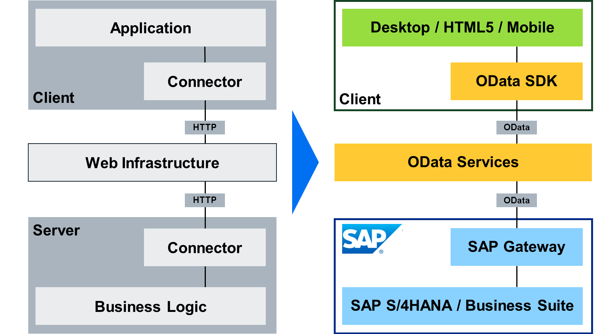
One important aspect of the architecture of the World Wide Web is the use of abstract interfaces for component communication. These abstract interfaces are presented as connectors. A client and a server each use a connector component. There is a contract between both connectors that defines the application protocol. It defines the documents, their format, and the behavior. Any protocol can be chosen. By using the connector concept, both client and server are largely independent and exchangeable. Each connector translates the documents exchanged on the communication channel to the internal representations both on the server and on the client side, and vice versa.
The OData protocol defines such a contract by specifying a uniform protocol that has the necessary qualities. For instance, a connector attached to an SAP back-end system translates between ABAP APIs and OData entities. SAP Gateway is such a connector.
On the other side, a client connector translates between OData entities and the APIs of the consumer platform. The connector is specified here. As a consequence, any client platform with libraries supporting the contracted OData format can communicate with any server supporting the same contract.
OData follows the Representational State Transfer (REST) architecture design paradigm in the sense that the protocol transfers representations of the state of resources. The term resource denotes data that is addressable and accessible. The standard address representation or resource is the Uniform Resource Identifier (URI). A client requests a resource from a server by sending a request to a URI. The server processes the request by translating the URI to internal address data to access or manipulate the data, and then assemble the response.
### Open Data Protocol
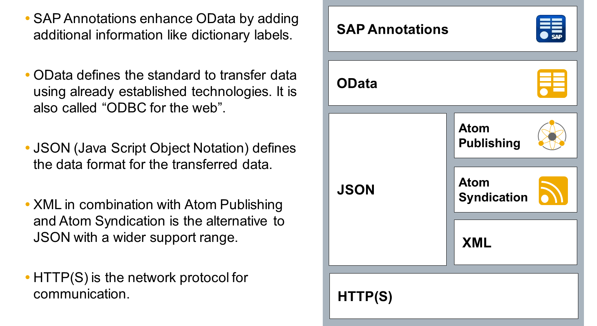
OData is an open standard originally developed by Microsoft but now managed by the Oasis Organization. It is based on the Atom Publishing and Atom Syndication standards, which, in turn, are based on XML (Extensible Markup Language) and HTTP(S) (HyperText Transfer Protocol (Secure)). JSON (JavaScript Object Notation) is an alternative to XML to structure data.
The objective of the OData protocol is to provide a vendor-neutral, web-based API that fully complies with the design principles of Representational State Transfer (REST). OData provides database-like access to server-side resources. In this context, OData is also called **ODBC for the Web**.
Note
Open Database Connectivity (ODBC) is a widespread database access method.
OData is also extensible. This enables SAP to supplement the data types used by OData with extra information from the ABAP Data Dictionary. Another example is metadata-driven development for Web and mobile like SAP Fiori elements.
OData is available in version 2 (V2), version 3 (V3), and version 4 (V4). The versions are built on each other extending the previous version by adding new features. Most OData services are based on V2. SAP Gateway supports OData V2 since AS ABAP 7.00 and OData V4 since AS ABAP 7.50. OData V3 was skipped in SAP Gateway and is therefore not supported.
## OData Model
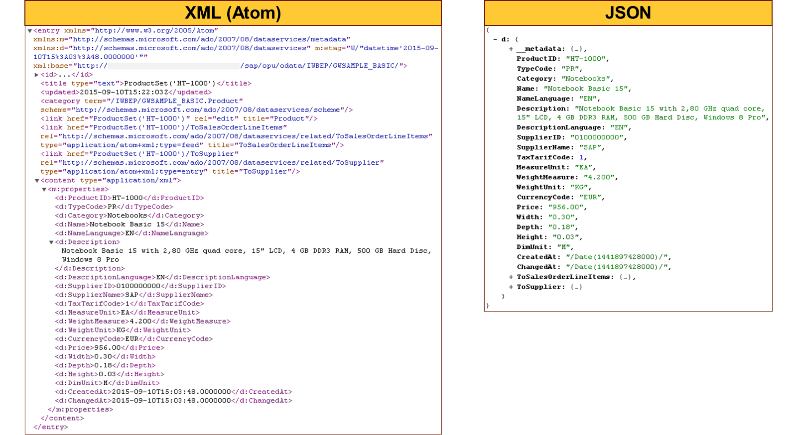
In current real-life applications, JSON (JavaScript Object Notation) is used instead of Atom and XML for structuring data. It needs considerably less meta-information, which reduces the amount of data transferred greatly. Atom and XML, in contrast, are used precisely because of the extensive meta-information when it comes to development.
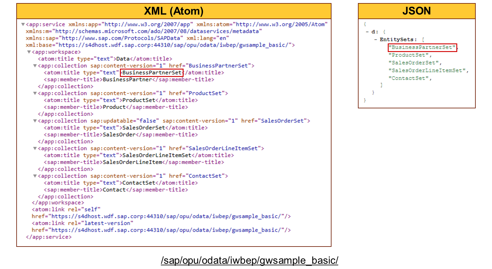
Each OData service is represented by a URI, called the service root URI. A URI is a uniform resource identifier, which is a string of characters used to identify a resource by name and address. This type of identification enables interaction with representations of the resource across a network using specific protocols like OData.
Note
The URL (Unified Resource Locator) is a subtype of a URI identifying a resource just by its address.
To consume an OData service for read, you just need a browser and the OData service base URI. The service document is the highest-level description of an SAP Gateway service. It shows the basic information about the available data. From here, it is possible to call further information on the service, and of course the data itself, by adding URI parameters.
To get data from the service, add the name of an entity set of the service to the base URI. You get a list of entities of that type, which could be the content of a database table.
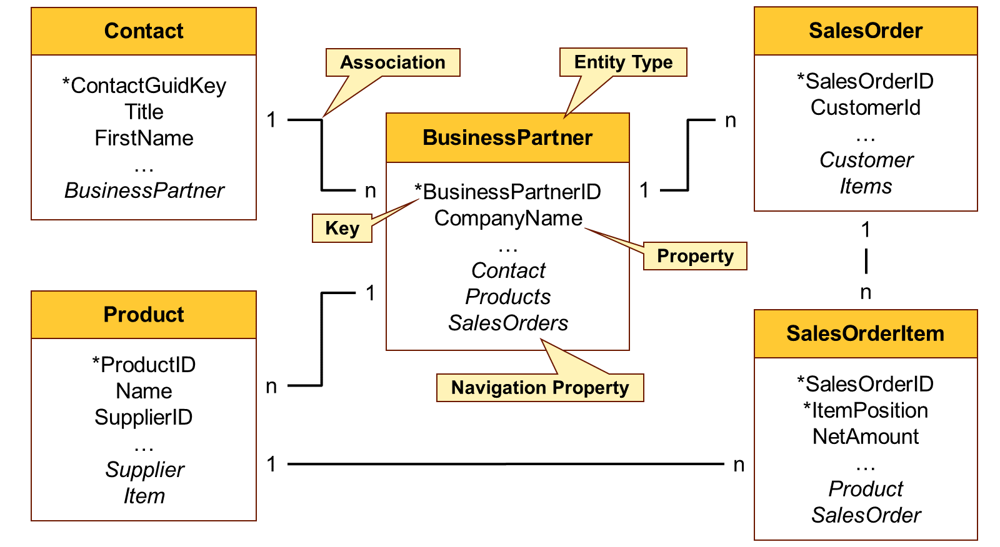
The entities of an OData service are defined in an Entity Data Model (EDM). Entity types define properties and navigations to other entity types. These associations define relation constraints based on key properties of the entity types. A navigation property is then used to actively navigate between entities during runtime. For every entity type, at least one entity set is defined. These are shown in the service document and used to request data from the OData service.
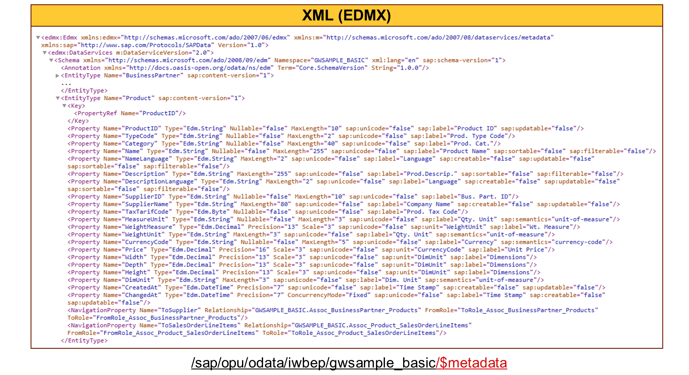
By adding the OData option $metadata to the service root URI, the metadata document of the service is shown. The whole EDM is defined here and available at runtime. Application developers and all the wizards in development environments create their applications based on this information.
Note
The metadata document is only available as XML.
## How to Examine the Data Model of an OData Service
### Business Example
You want to examine the data model of an OData service in a web browser.
Watch the video to see how to examine the data model of an OData Service.
## OData Operations
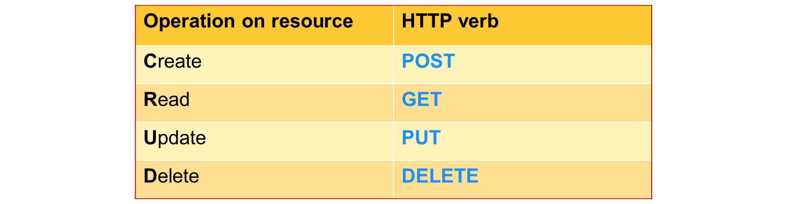
One of the main features of OData is that it uses the existing HTTP verbs GET, PUT, POST, and DELETE at addressable resources identified in the URI. Conceptually, OData is a way of performing database-style create, read, update, and delete operations on resources through HTTP verbs.
By building URIs based on the rules of OData, a wide variety of data requests can be performed. These requests can often be mapped directly to SQL requests accessing data in a database.
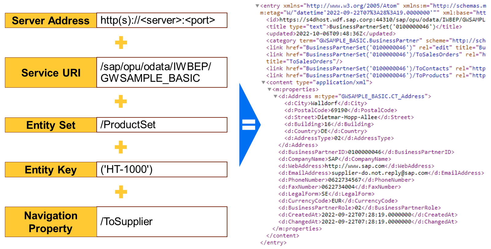
Calling the service URI of an OData service in a GET request, results in the service document. Adding the name of an entity set to the base URI, results in a list or set of all entities. This is called a query request.
Adding the unique key of an entity in brackets to a query request results in a single entity having this key. Character-based keys must be put in apostrophes. This is called a read request.
Adding a navigation property of the entity type to a read request separated by a slash results in a single entity or a set of entities depending on the multiplicity of the association. This is called a navigation request.
## OData Query Language

OData specifies a simple, yet powerful query language that allows a client to request arbitrary filtering, sorting, paging, and so on. A client is able to express, via query string parameters, the amount, and order of the data that an OData service returns for the resource identified by the URI. The names of all query string parameters defined by OData are prefixed with a "$" character.
First, the structure of the data transferred from the server to the client can be formatted, for example, in JSON or XML. The data volume can be reduced by filtering data sets and by selecting the relevant data properties only. Paging is another way to reduce data traffic. Sorting guarantees the right sequence of the entities within a requested entity set. A client can also instruct the server to include associated data entries in the response, which is called inlining. This technique avoids subsequent read operations.
The versions of OData are additive. New versions include features of previous versions in the same way as they were used back then. But they are enhanced with additional features. This also counts for query options. One exception here is "counting" because the two ways to count in OData V2 were combined in just one in OData V4.
In OData V4, data can also be searched and computed. Both require a specific implementation depending on the application scenario.
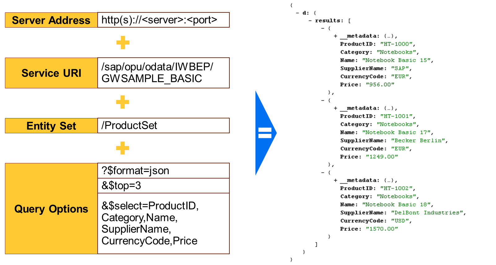
An OData request consists of a server address, service URI, entity set, and additional query options. There are many combinations of query options possible. A full documentation is available at <http://www.odata.org>.
## How to Query Data of an OData Service
### Business Example
You want to query data of an OData service in a web browser using query options.
Watch the video to see how to query data of an OData Service.
Settings
## SAP Gateway Foundation
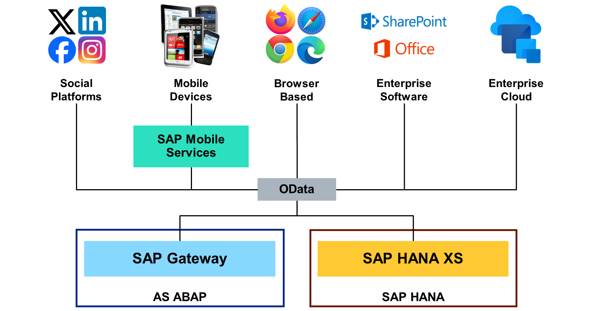
SAP offers various OData providers. SAP Gateway (up to the end of 2014 known as SAP NetWeaver Gateway) provides a single entry point to access business data of ABAP-based systems such as the SAP Business Suite or SAP S/4HANA. The SAP HANA Extended Applications Services (XS) has the same role in SAP HANA – just to name another important OData provider.
Caution
SAP Gateway must not be confused with the kernel’s **gateway** process used for communication via RFC.
By using OData, business data can be shared among multiple environments and platforms. SAP knowledge is not required for the consumption of the data. Usually client-based applications consume SAP Gateway services and interact directly with the user. Applications in a Web browser are a common example.
However, it is also possible for an SAP Gateway service to be used as an API (Application Programming Interface) by a server-based application. Additional servers can be added to the communication path to enhance the possibilities for client and server. For mobile devices, the SAP Mobile Services add additional value to the applications.
For AS ABAP 7.00 to 7.31, SAP Gateway consists of individual add-ons that provide the OData functionality. These can be divided into the following areas:

Runtime
    Provides the OData and thus the SAP Gateway service externally via the URI.

Design Time

Contains the development environment and programs for processing the requests to the service.
First introduced in AS ABAP 7.40 and finalized in AS ABAP 7.51, all add-ons are merged in the software component SAP_GWFND (SAP Gateway Foundation). This offers everything needed for the OData runtime and design time.
Note
Some SAP Gateway add-ons may still exist in an AS ABAP 7.51 after an upgrade. These are deprecated and should be uninstalled. Either their functions are now part of software component SAP_GWFND or they are no longer supported.
### SAP Gateway Deployment Options
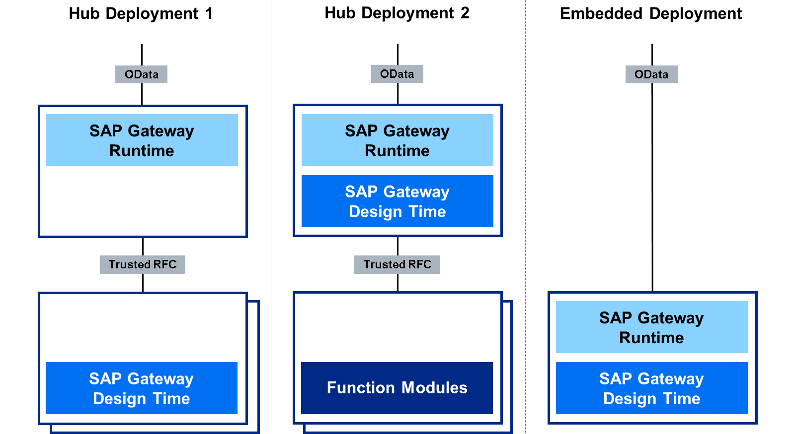
There are three possible deployment options for SAP Gateway (hub is a synonym for front-end server (FES)):

Hub deployment with development in back-end server (BES)
    A hub deployment offers the possibility of routing and composition of multiple back-end systems. It is the single point of access to back-end systems when using OData. This increases security and flexibility in operation.     This is the recommended setup for SAP Business Suite.

Hub deployment with development in front-end server (FES)
    When developing in the FES, data is only read via RFC-enabled function modules from the BES, which enables access to data of a BES not able to provide an OData service on its own. This grants more freedom in selecting a system as data source.     This is the recommended setup for integrating multiple BES with different releases.

Embedded deployment
    When developing in the BES, the application source code has direct access to the definition of the data and other repository objects. This increases performance and efficiency in development.     This is the recommended setup for SAP S/4HANA.
## SAP Gateway Tools
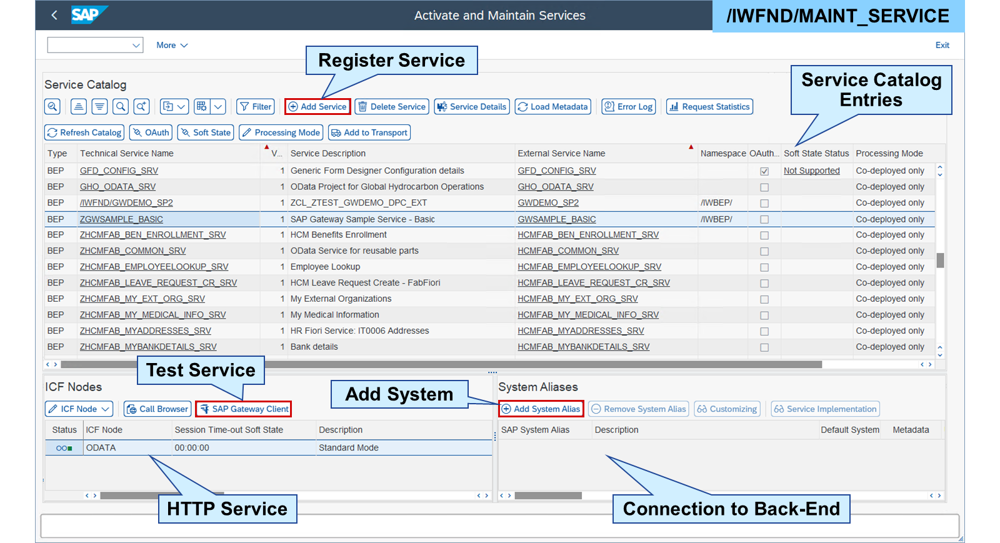
The _SAP Gateway Service Maintenance_ (transaction /IWFND/MAINT_SERVICE) provides a list of all the OData V2 services registered in the system. Complete management of the SAP Gateway services is carried out here. The transaction is divided into three areas:
  * _Service Catalog_ (service name, description, and many other settings)
  * _ICF Nodes_ (maintenance of the ICF services and testing of the service)
Hint
Since SAP_GWFND 7.58, an ICF node is optional for calling an SAP Gateway service. The OData V2 services are then directly linked to the node /sap/opu/odata.
  * _System Aliases_ (maintenance of the connection to the back-end)
Hint
For services not connecting to other systems, the _Processing Mode_ is set to **Co-deployed only** and no system alias is assigned.

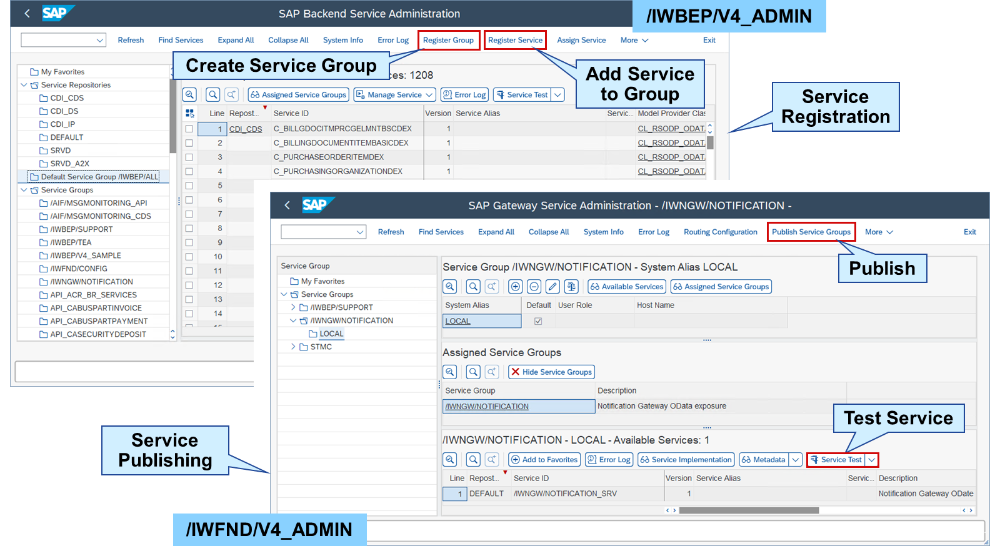
OData V4 services are not registered as single instances. Instead, a service group consisting of multiple services is published. These service groups are created using the _SAP Backend Service Administration_ (transaction /IWBEP/V4_ADMIN) and shipped by SAP or created by developers.
The _SAP Gateway Service Administration_ (transaction /IWFND/V4_ADMIN) is used to publish service groups so that the services inside can be consumed in applications.
Hint
The default service group /IWBEP/ALL consists of all SAP Gateway services in the BES. This makes it easier for developers to test their services in a development system. It should never be published on a productive system.
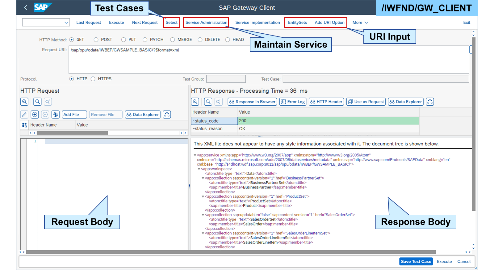
Using the _SAP Gateway Client_ (transaction /IWFND/GW_CLIENT), all functions of an OData service can be tested. For a read request, it is enough to enter the request URI and execute. For a create, update, and delete request, more adjustments must be made, for example, a request body filled with data must be created. All adjustments can be saved as test cases for later usage.
The _SAP Gateway Client_ can handle data formats like XML (Atom) and JSON for both OData V2 and V4 services.
Apart from these transactions, there are several more for SAP Gateway. All transactions are connected to each other via buttons and menu entries. Therefore, you can jump from the service maintenance to the client and back.
## Test an SAP Gateway Service Based on OData V2
### Business Example
You want to examine and test an SAP Gateway service based on OData V2 using SAP Gateway Service Maintenance and the SAP Gateway Client.
Note
This exercise requires an SAP Learning system. Login information is provided by your system setup guide.
### Task 1: Check the Registration of an OData V2 Service in SAP Gateway
Exercise[Start Exercise](https://learnsap.enable-now.cloud.sap/pub/mmcp/index.html?show=project!PR_609EACEBF09380BD:uebung)
#### Steps
  1. Log on to your SAP S/4HANA (S4H) system using _SAP GUI_.
    1. In the _SAP Business Client_ or _SAP Logon_ , select the SAP GUI SNC system entry of your S4H.
    2. Choose _Log On_.
  2. In the _SAP Gateway Service Maintenance_ of your S4H, examine the registration of the OData V2 service **ZEPM_REF_APPS_SHOP_SRV**.
    1. On the _SAP Easy Access_ screen, search for _Activate and Maintain Services_ or start transaction /IWFND/MAINT_SERVICE.
    2. Choose _Filter_.
    3. In the _Technical Service Name_ field, enter ***epm_ref*** and choose _Continue_.
    4. Choose the _Technical Service Name_**ZEPM_REF_APPS_SHOP_SRV**.
    5. Confirm that the status of the ICF Node _ODATA_ is initial.
    6. Confirm that the _Processing Mode_ is _Co-deployed only_ and no system alias is assigned.

### Task 2: Test an OData V2 Service in the SAP Gateway Client
Exercise[Start Exercise](https://learnsap.enable-now.cloud.sap/pub/mmcp/index.html?show=project!PR_A640FB6B9667DD90:uebung)
#### Steps
  1. In the _SAP Gateway Client_ of your S4H, call the service document of the OData V2 service **ZEPM_REF_APPS_SHOP_SRV**.
    1. In the _ICF Nodes_ panel, choose _SAP Gateway Client_.
    2. In the _SAP Gateway Client_ , select _HTTPS_ as _Protocol_.
    3. Choose _Execute_.
#### Result
In the _HTTP Response_ , the service document is shown as XML.
  2. Call the service metadata document of the OData V2 service **ZEPM_REF_APPS_SHOP_SRV**.
    1. In the _SAP Gateway Client_ , choose _Add URI Option_.
    2. In the _Add URI Option_ popup, double-click _$metadata_.
    3. Choose _Execute_.
#### Result
In the _HTTP Response_ , the service metadata document is shown as XML.
  3. Display all products of the OData V2 service **ZEPM_REF_APPS_SHOP_SRV**.
    1. In the _SAP Gateway Client_ , choose _Entity Set_.
    2. In the _Entity Sets_ popup, double-click _Products_.
    3. Choose _Execute_.
#### Result
In the _HTTP Response_ , a list of products is shown as XML.
  4. Display the first two products in the format JSON of the OData V2 service **ZEPM_REF_APPS_SHOP_SRV**.
    1. In the _SAP Gateway Client_ , choose _Add URI Option_.
    2. In the _Add URI Option_ popup, double-click _$format=json_.
    3. Choose _Add URI Option_.
    4. In the _Add URI Option_ popup, double-click _$top=2_.
    5. Choose _Execute_.
#### Result
In the _HTTP Response_ , the first two products are shown as JSON.

## Test an SAP Gateway Service Based on OData V4
### Business Example
You want to examine and test an SAP Gateway service based on OData V4 using SAP Gateway Service Administration and the SAP Gateway Client.
Note
This exercise requires an SAP Learning system. Login information is provided by your system setup guide.
### Task 1: Check the Publication of an OData V4 Service Group in SAP Gateway
Exercise[Start Exercise](https://learnsap.enable-now.cloud.sap/pub/mmcp/index.html?show=project!PR_465259A8AE724D93:uebung)
#### Steps
  1. Log on to your SAP S/4HANA (S4H) system using _SAP GUI_.
    1. In the _SAP Business Client_ or _SAP Logon_ , select the SAP GUI SNC system entry of your S4H.
    2. Choose _Log On_.
  2. In the _SAP Gateway Service Administration_ of your S4H, examine the publication of the OData V4 service group **/IWNGW/NOTIFICATION**.
    1. On the _SAP Easy Access_ screen, search for _SAP Gateway Service Administration_ or start transaction /IWFND/V4_ADMIN.
    2. Expand _Service Groups_ on the left.
    3. Double-click the service group _/IWNGW/NOTIFICATION_.
    4. Confirm that the only system alias is _LOCAL_.
    5. Confirm that the only service in the group is _/IWNGW/NOTIFICATION_SRV_.

### Task 2: Test an OData V4 Service in the SAP Gateway Client
Exercise[Start Exercise](https://learnsap.enable-now.cloud.sap/pub/mmcp/index.html?show=project!PR_FD50D071C36CBA8E:uebung)
#### Steps
  1. In the _SAP Gateway Client_ of your S4H, call the service metadata document of the OData V4 service **/IWNGW/NOTIFICATION_SRV** in the _SAP Gateway Client_ on your S4H.
    1. In the services table, select _/IWNGW/NOTIFICATION_SRV_.
    2. Choose _Service Test_.
    3. In the _SAP Gateway Client_ , select _HTTPS_ as _Protocol_.
#### Result
In the _HTTP Response_ , the service metadata document is shown as XML.
  2. Call the service document of the OData V4 service **/IWNGW/NOTIFICATION_SRV**.
    1. In the _SAP Gateway Client_ , in the _Request URI_ field, delete $metadata?sap-statistics=true.
    2. Choose _Execute_.
#### Result
In the _HTTP Response_ , the service document is shown as JSON.
  3. Display all notifications of the OData V4 service **/IWNGW/NOTIFICATION_SRV**.
Hint
You can create notifications by ordering or rating a product in the _Shop_ reference app in the _SAP Fiori launchpad_.
    1. In the _SAP Gateway Client_ , choose _Entity Set_.
    2. In the _Entity Sets_ popup, double-click _Notifications_.
    3. Choose _Execute_.
#### Result
In the _HTTP Response_ , a list of notifications is shown as JSON.
  4. Display the _CreatedAt_ , _SensitiveText_ , and _Actor_ of the first two notifications of the OData V4 service **/IWNGW/NOTIFICATION_SRV**.
    1. In the _SAP Gateway Client_ , choose _Add URI Option_.
    2. In the _Add URI Option_ popup, double-click _$top=2_.
    3. In the _Request URI_ field, add &$select=CreatedAt,SensitiveText,Actor to the URI.
#### Example
/sap/opu/odata4/iwngw/notification/default/iwngw/notification_srv/0001/Notifications?$top=2&$select=CreatedAt,SensitiveText,Actor
    4. Choose _Execute_.
#### Result
In the _HTTP Response_ , the first two notifications with _Id_ , _CreatedAt_ , _SensitiveText_ , and _Actor_ are shown as JSON.


### Explaining Application Types

*Source: https://learning.sap.com/courses/learning-the-basics-of-sap-fiori/explaining-application-types_cbee34f0-8b7c-41b7-9be0-e8f7a733441b*

Objectives
After completing this lesson, you will be able to:
  * Compare application types based on utilized technologies
  * Use SAP Fiori Apps Reference Library for searching product features of apps
  * Create SAP Fiori App Analyses based on utilization of apps.

## Application Types
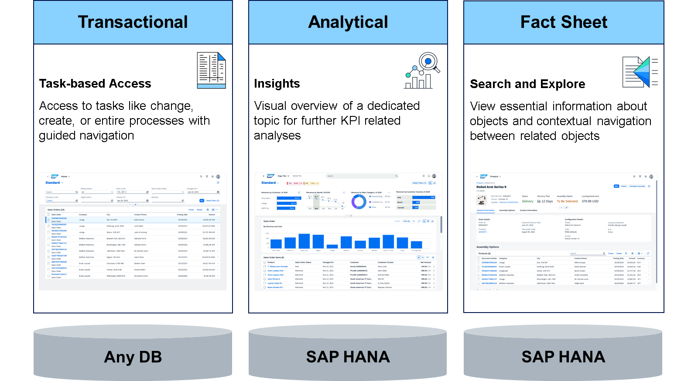
All SAP Fiori apps utilize the technologies SAPUI5 and SAP Gateway. The three types of SAP Fiori apps are different in terms of their usage of additional technologies:

Transactional Apps

  * Usage of ABAP to provide the classic approach for functions of a business system
  * Available for SAP S/4HANA and SAP Business Suite on any database

Analytical Apps

  * Usage of analytical capabilities of SAP HANA to provide insights in business data
  * Available for SAP S/4HANA and SAP Business Suite powered by SAP HANA

Fact Sheet Apps

  * Usage of Enterprise Search capabilities of SAP HANA to provide search results
  * Available for SAP S/4HANA and SAP Business Suite powered by SAP HANA

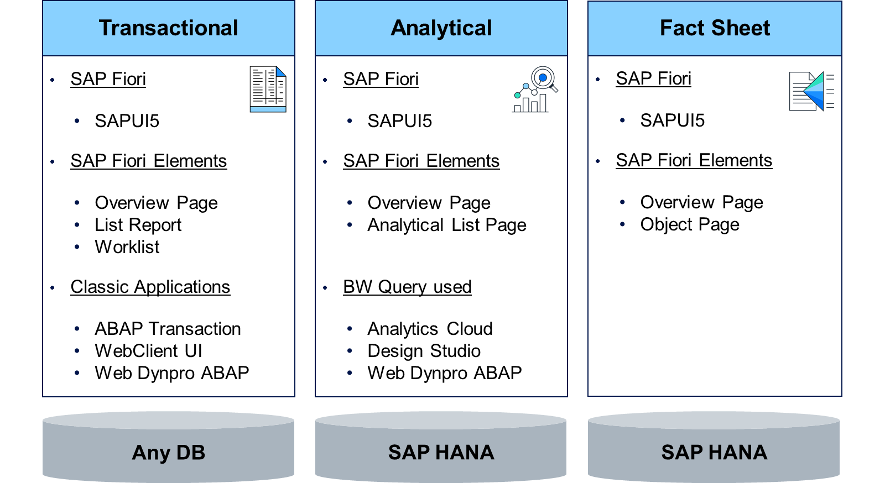
_SAPUI5_ is used in all application types for development. This can be done by implementing JavaScript code directly or by defining metadata, which generates JavaScript code at runtime. These apps are called SAP Fiori elements. The complete UI is controlled by metadata annotations in _SAPUI5_ , _SAP Gateway_ , or CDS views.

List Report
    Enables users to view and work with items (objects) organized in list (table) format.

Object Page
    Provides functionality to view, edit, and create (business) objects.

Overview Page
    Visualizes large amount of data in cards with different formats for different types of content.

Analytical List Page
    Identifies relevant areas within data sets or significant single instances using data visualization and business intelligence.

Worklist
    Displays a collection of items that a user must process.
In addition, classic applications are part of transactional apps. These are ABAP transactions, _Web Dynpro ABAP_ , and _WebClient UI Framework_ applications, which already existed before SAP Fiori was announced. Customers can choose which classic applications they want to have in their _SAP Fiori launchpad_ using the configuration and customizing of SAP Fiori.
SAP Business Warehouse (BW) queries can be used as a foundation for SAP Fiori applications. These applications are created through SAP Analytics Cloud, the tool _Design Studio_ , or by developing _Web Dynpro ABAP_ applications.
Caution
Most Design Studio apps are obsolete since SAP S/4HANA 2021 and will be deleted from the system in SAP S/4HANA 2022. The successor apps are already available as Web Dynpro ABAP applications. For more details, please read SAP Note [3081996](https://me.sap.com/notes/3081996) – _Deprecation of SAP Design Studio Apps in SAP S/4HANA 2021_.
## Transactional Examples
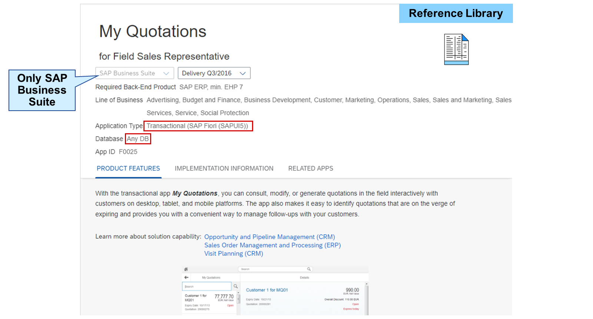
All transactional apps perform transactional tasks, such as creating a leave request for an employee or managing quotations. SAP Fiori transactional apps represent simplified views and interactions with existing business processes and solutions. They generally run on any database except if they are developed and shipped with SAP S/4HANA.
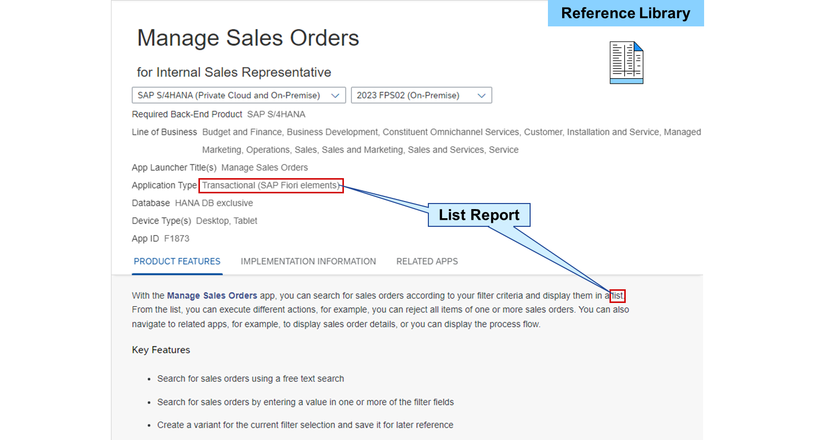
Transactional apps can be generated based on _SAP Fiori elements_. These are dynamic _SAPUI5_ apps controlled by metadata annotations in _SAPUI5_ , _SAP Gateway_ , or CDS views. The most common transactional _SAP Fiori element_ is the list report.
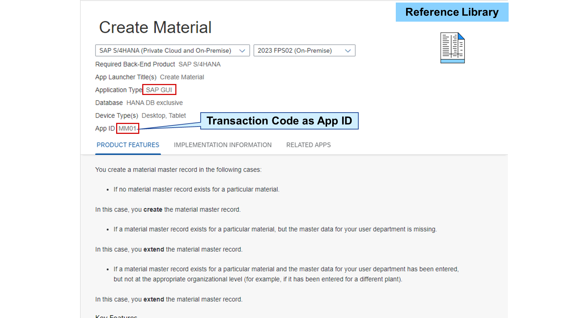
Since the release of SAP S/4HANA 1610, SAP GUI transactions can be found in the _SAP Fiori apps reference library_. Due to SAP Fiori 2.0 and the SAP Belize theme, they are an official part of SAP Fiori. The transactions are limited to those targeting end users and those available in SAP S/4HANA 1610 or later.
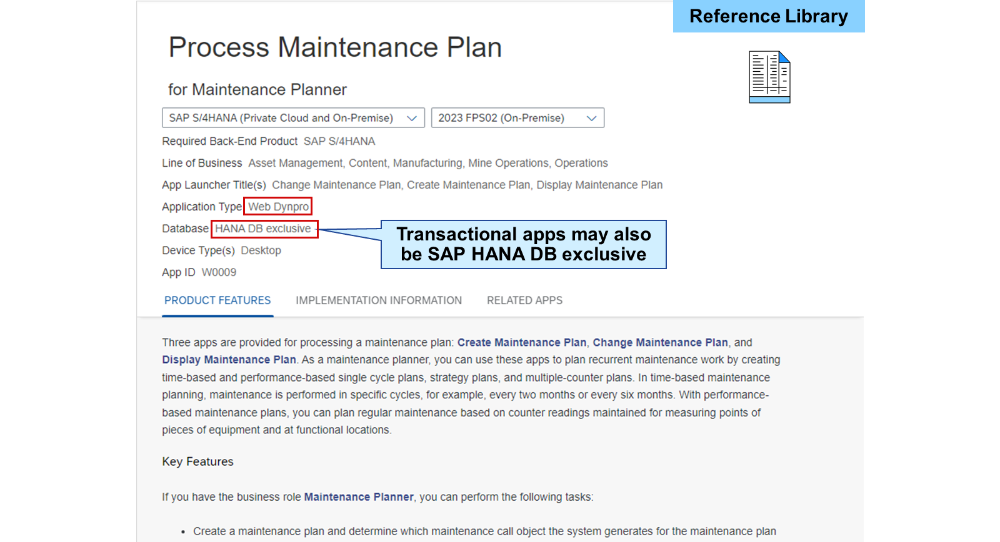
Similar to the SAP GUI transactions, transactional _Web Dynpro ABAP_ applications are also part of SAP Fiori since SAP Fiori 2.0. All transactions and _Web Dynpro_ applications are shown as exclusive to the SAP HANA database in the _SAP Fiori apps reference library_. The reason for this is that the documented release is SAP S/4HANA 1610 or later – and this one is exclusive to the SAP HANA database.
## Analytical Examples
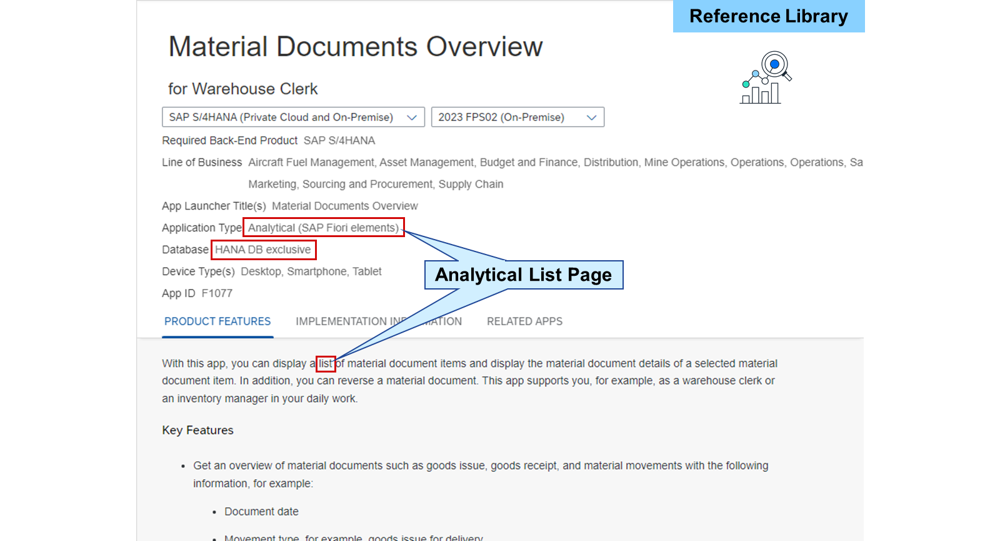
Analytical apps give a role-based insight into real-time operations of your business by collecting and displaying key figures directly in your browser. They can be SAP Smart Business applications or other analytical, predictive, and planning applications. Analytical apps combine the data and analytical power of SAP HANA with the integration and interface components of SAP Business Suite or SAP S/4HANA. They provide real-time information on large volume data in a simplified front end for enterprise control. With SAP Smart Business, you can closely monitor your most important Key Performance Indicators (KPIs) in real time and react immediately to changes in market conditions or operations.
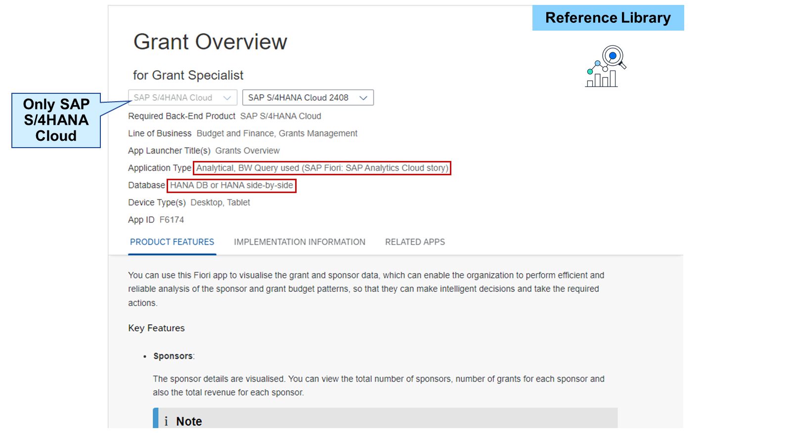
As the analytics and planning solution within SAP Business Technology Platform (BTP), SAP Analytics Cloud supports trusted insights and integrated planning processes enterprise-wide. It is a single solution for business intelligence and collaborative enterprise planning, augmented with the predictive analytics and machine learning.
SAP Fiori apps based on SAP Analytics Cloud are only shipped for SAP S/4HANA Cloud by SAP. But like all SAP BTP services, SAP Analytics Cloud can be integrated with on-premise systems like SAP S/4HANA. Two kinds of SAP Analytics Cloud apps are shipped:

Data Analyzer

The _Data Analyzer_ provides ad-hoc query analysis for end-users based on SAP Analytics Cloud models, SAP Business Warehouse (BW) queries, and SAP HANA live views. It allows end-users to navigate, analyze, and filter data as an insight.

Story

A _Story_ is where you bring data and visualizations together to tell the story of your business or organization and help you discover insights hidden within your data. A _Story_ can also be referred to as a dashboard.
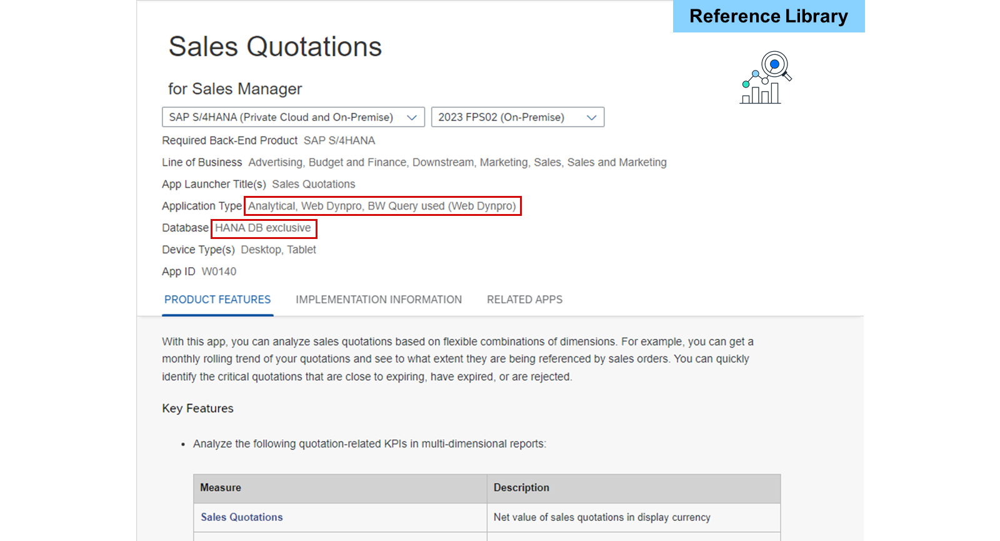
Web Dynpro ABAP applications are stateful, which means that the state of the client application is saved on the server for a certain time. This allows ongoing analysis by just selecting the data once and saving it in the application memory. It is especially helpful when the pure selection of the data costs much runtime but the user does not want to wait after each adjustment of the analysis.
## Fact Sheet Examples
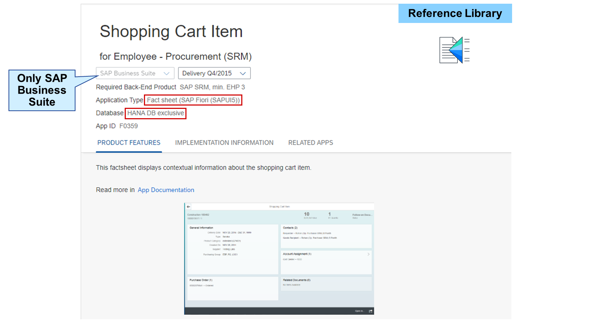
Fact sheet apps display contextual information and key facts about central objects used in business operations. Fact sheets are designed to be intuitive and harmonized. From a fact sheet area (tile), you can drill down into its details. You can easily navigate from one fact sheet to its related fact sheets. For example, you can navigate from a document to the related business partner or the master data.
From fact sheets, you can start transactions by navigating to transactional apps, or by accessing the back-end system directly. For example, from a document fact sheet, you can access the back-end system to display document details or edit the document in SAP GUI or _Web Dynpro_.
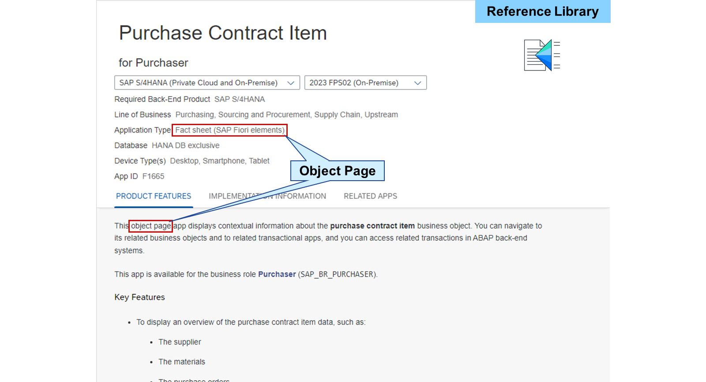
Object pages can change or create the data found via search directly in the app without opening other applications. The changes are performed in place. Fact sheet and object pages do not have tiles delivered by SAP. That is a task for customizing or configuration, or for the user when saving their search result as a tile.
## SAP Fiori Apps Reference Library
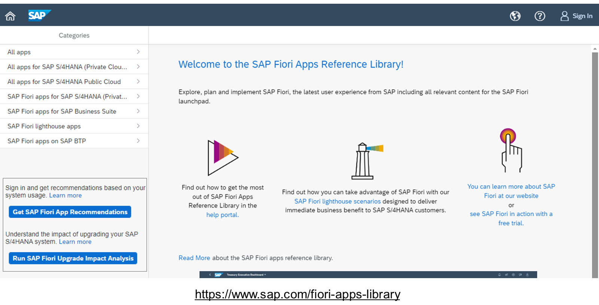
SAP Fiori is foremost a collection of apps representing the new user experience of SAP and the face of SAP S/4HANA. SAP Fiori apps can be categorized by line of business, industry, and most important user role, as well as technical foundation.
All available apps can be explored using the _SAP Fiori apps reference library_. See <https://www.sap.com/fiori-apps-library>.
Watch the video to see how to filter apps in the SAP Fiori apps reference library.
Watch the video to see how to find apps via App ID.
Hint
The _App ID_ of a transaction is its transaction code.
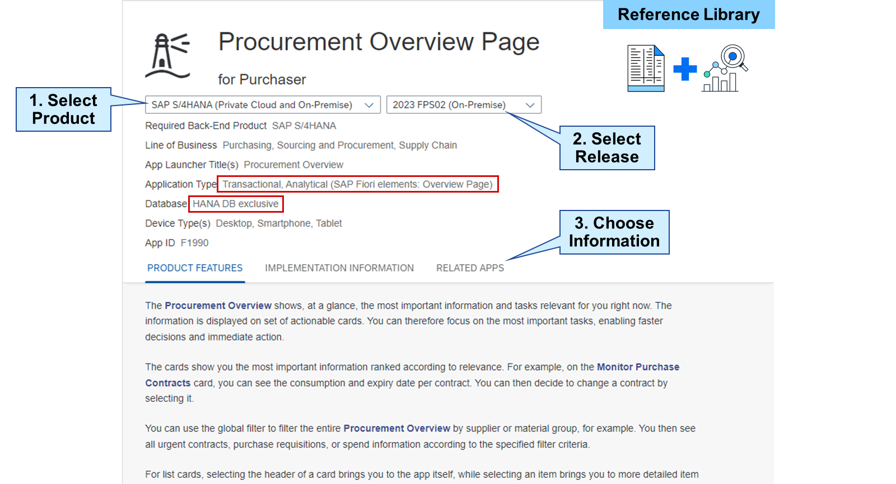
In the details for an SAP Fiori app, you should first set the product suite followed by the release at the top of the page. Although an app is available in several products and releases, the implementation can differ between these. The header information, product features, implementation information, and related apps change depending on the selected product and release.
This is an example of an overview page. It is based on _SAP Fiori elements_ technology and uses annotated views of app data. Thus, the app content can be tailored to the domain or role.
The overview page acts as a UI framework for organizing multiple cards on a single page. Each card can deliver transactional, analytical, or search data. Therefore, overview pages are often a mixture of application types.
## Operate SAP Fiori Apps Reference Library
### Business Example
You want to open the _SAP Fiori apps reference library_ and search for product features of apps using filters.
### Task 1: Search Product Features of Apps
#### Steps
  1. In a Web browser, open the _SAP Fiori apps reference library_ (<https://www.sap.com/fiori-apps-library>).
Note
If you are using an SAP Learning system, you may use the favorite _SAP Fiori_ → _SAP Fiori Apps Reference Library_.
    1. Open <https://www.sap.com/fiori-apps-library> in a browser of your choice.
    2. Decide on the cookie settings.
  2. Open the product features of the SAPUI5 app _Post General Journal Entries_. Use the following information:
| Field  | Value  |
| --- | --- |
| _Back-End Product_  | **SAP S/4HANA**  |
| _Line of Business_  | **Budget and Finance**  |
| _Application Type_  | **Transactional**  |
    1. In the _SAP Fiori apps reference library_ , choose _SAP Fiori apps for SAP S/4HANA (Private Cloud and On-Premise)_.
    2. Choose _by Line of Business_.
    3. Choose _Budget and Finance_.
    4. Choose _Filter_.
    5. In the _Filter_ popup, open the _Application Type_ dropdown.
    6. Select _SAP Fiori - Transactional_.
    7. Close the _Application Type_ dropdown.
    8. Open the value help for _UI Technology_.
    9. In the _Select: UI Technology_ popup, select _SAP Fiori (SAPUI5)_ and choose _OK_.
    10. Choose _Go_.
    11. In the _Search_ field, enter **general journal** and choose **Enter**.
    12. Choose _Post G/L Document / Post General Journal Entries_.
    13. Examine the product features of _Post General Journal Entries_.
  3. Open the product features of the successor of the _Sales Order Fulfillment Issues_ app for _SAP Business Suite_ in the newest _SAP S/4HANA_. Use the following information:
| Field  | Value  |
| --- | --- |
| _Back-End Product_  | **SAP ERP**  |
| _Application Type_  | **Analytical**  |
    1. Choose _Home_.
    2. Choose _SAP Fiori apps for SAP Business Suite_.
    3. Choose _by Back-End Product_.
    4. In the _Search by Back-End Product_ field, enter **erp**.
    5. Choose _SAP ERP_.
    6. Choose _Filter_.
    7. In the _Filter_ popup, open the _Application Type_ dropdown.
    8. Select _SAP Fiori - Analytical_.
    9. Close the _Application Type_ dropdown.
    10. Choose _Go_.
    11. In the _Search_ field, enter **sales** and choose **Enter**.
    12. Choose _Sales Order Fulfillment Issues_.
    13. Examine the product features of _Sales Order Fulfillment Issues_ for SAP Business Suite.
    14. Beneath the heading, open the _SAP Business Suite_ dropdown.
    15. Choose _SAP S/4HANA_.
#### Result
The app is deprecated and was last shipped with SAP S/4HANA 2021 FPS02.
    16. Choose the _Related Apps_ tab.
    17. Choose _Sales Order Fulfillment Issues (Version 2) (SAP S/4HANA (Private Cloud and On-Premise))_.
    18. Choose the _Product Features_ tab
    19. Examine the product features of _Sales Order Fulfillment Issues (Version 2)_.
  4. Open the product features of the _Create Material_ app. Use the following information:
| Field  | Value  |
| --- | --- |
| _Roles_  | **Master Data Specialist — Product Data**  |
| _Application Type_  | **SAP GUI**  |
    1. Choose _Home_.
    2. Choose _All Apps_.
    3. Choose _Filter_ at the bottom.
    4. In the _Filter_ popup, open the _Application Type_ dropdown.
    5. Select _SAP GUI_.
    6. Close the _Application Type_ dropdown.
    7. Open the value help for _Role_.
    8. In the _Select: Role_ popup, in the _Search_ field, enter **product data** and choose _Go_.
    9. Select _Master Data Specialist - Product Data_ and choose _OK_.
    10. Choose _Go_.
    11. In the _Search_ field, enter **create** and choose **Enter**.
    12. Choose _Create Material, Create Material & (MM01)_.
    13. Examine the product features of _Create Material_.

## SAP Fiori App Analyses
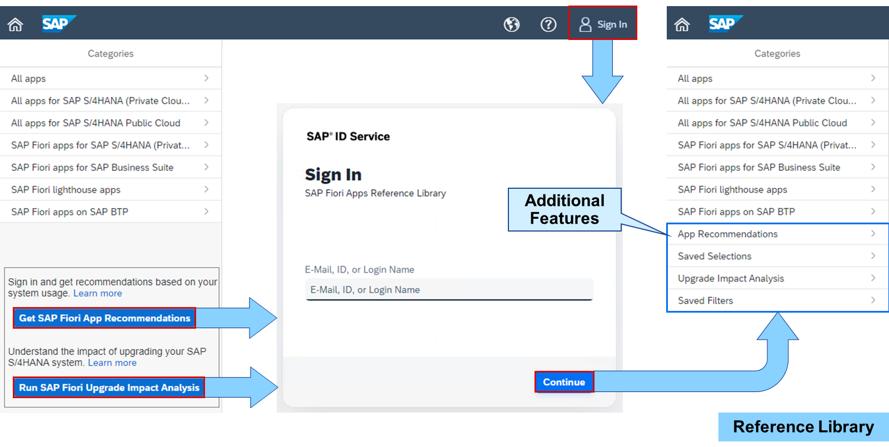
The _SAP Fiori apps reference library_ offers additional features when signing-in with an SAP user. For example, you can save filters and selections or navigate to related resources like the _Maintenance Planer_. In addition, you can:
  * Identify the impact an upgrade will have on SAP Fiori apps
  * Get recommendations for SAP Fiori apps

by analyzing the usage of an existing system landscape.
Watch the video to get an overview of SAP Fiori Upgrade Impact Analysis.
Settings
### SAP Fiori App Recommendations Analysis
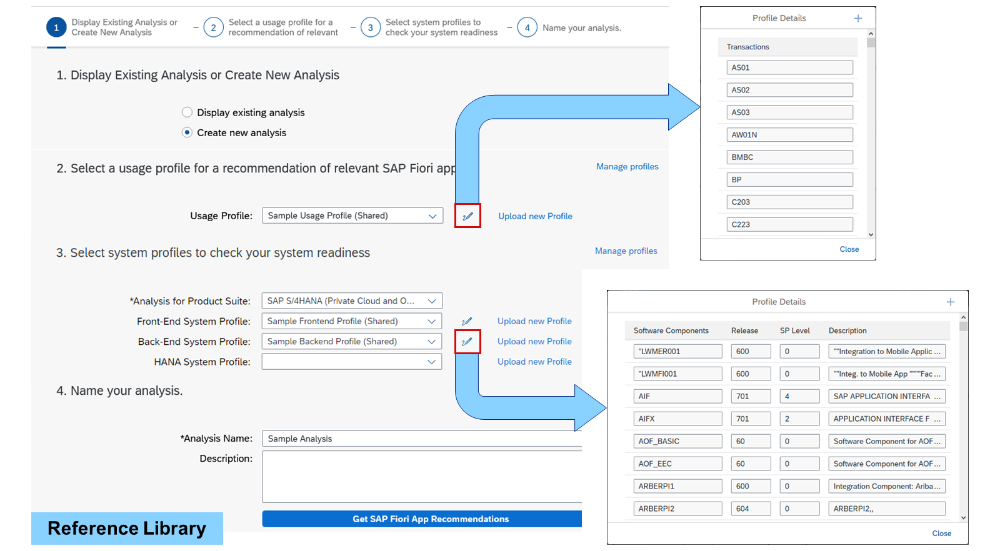
The _SAP Fiori App Recommendations_ analysis can be started on the main page by choosing _Get SAP Fiori App Recommendations_. It needs a usage and system profiles as input:

Usage Profile
    A usage profile is a list of the most used transactions in a system. These can be collected based on end-user feedback or by tracing the used transactions in the system, for example, through the _Workload Monitor_ (ST03).

System Profile
    A system profile is a list of installed software components in an SAP system. These can be collected using the system information of a system or functions of the SAP Solution Manager, for example, the _Landscape Management Database (LMDB)_.
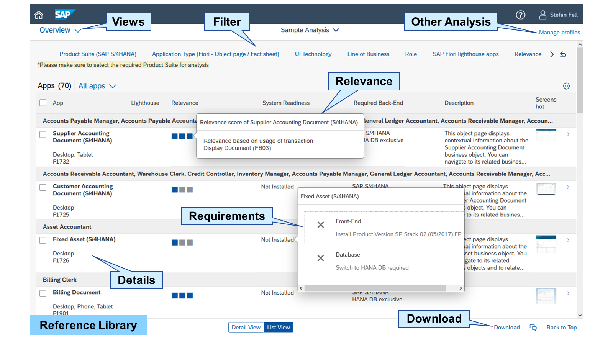
The analysis results in a table of apps with information about their relevance and system requirements depending on the usage and system profiles. The table can be filtered in many ways, for example, by application types, line of business, or roles. Views can be created to save changes to the layout of the table. The following views are predefined:
  * _Overview_
  * _Installation Details_
  * _Fiori Launchpad Content_
  * _Configuration Details_

Details of each app can be accessed by just clicking on one entry in the table or you can switch from the list view to the detail view, which jumps to a filtered view of the _SAP Fiori apps reference library_.
## Create SAP Fiori App Recommendations
### Business Example
You want to open the _SAP Fiori apps reference library_ and operate the _SAP Fiori App Recommendations_.
This exercise requires an SAP account.
### Task 1: Create an SAP Fiori App Recommendations Analysis
#### Steps
  1. In a Web browser, log on to the _SAP Fiori apps reference library_ (<https://www.sap.com/fiori-apps-library>) using your SAP account.
Note
If you are using an SAP Learning system, you may use the favorite _SAP Fiori_ → _SAP Fiori Apps Reference Library_.
    1. Open <https://www.sap.com/fiori-apps-library> in a browser of your choice.
    2. Decide on the cookie settings.
    3. In the top right, choose _Sign In_.
    4. Log on using your SAP account.
  2. Create a new analysis **Sample Analysis (UX100)** for the product suite **SAP S/4HANA** using the **Sample Usage Profile (Shared)**.
    1. On the home page, choose _Get SAP Fiori App Recommendations_.
    2. Select _Create new analysis_.
    3. Choose _Step 2_.
    4. In the _Usage Profile_ dropdown, select **Sample Usage Profile (Shared)**.
    5. Choose _Step 3_.
    6. In the _Analysis for Product Suite_ dropdown, select **SAP S/4HANA (Private Cloud and On-Premise)**.
    7. In the _Front-End System Profile_ dropdown, select **Sample Frontend Profile (Share)**.
    8. In the _Back-End System Profile_ dropdown, select **Sample Backend Profile (Shared)**.
    9. Choose _Step 4_.
    10. In the _Analysis Name_ field, enter **Sample Analysis (UX100)**.
    11. Choose _Get SAP Fiori App Recommendations_.
  3. Filter the list of apps of your analysis by _Application Type_ _Fiori - Analytical_ and _Role_ _Accounts Payable Accountant_. Switch to the detail view and examine the feedback options.
    1. Choose _Application Type_.
    2. In the popup, select _Fiori - Analytical_ and choose _OK_.
    3. Choose _Role_.
    4. In the popup, select _Accounts Payable Accountant_ and choose _OK_.
    5. Choose _Detail View_ at the bottom.
    6. Choose the speech balloons in the lower right corner and mention the feedback options.

[Continue to quiz](https://learning.sap.com/courses/learning-the-basics-of-sap-fiori/technology_c7774c6f-fd9a-376b-b158-20eca37aa74e)


### Quiz

*Source: https://learning.sap.com/courses/learning-the-basics-of-sap-fiori/technology_c7774c6f-fd9a-376b-b158-20eca37aa74e*

It's time to put what you've learned to the test, get 8 right to pass this unit.
1.
### Where do you register SAP Gateway services?
There are two correct answers.
OData V2 services are registered in the service catalog.
OData V2 services are registered in a service group.
OData V4 services are registered in a service group.
OData V4 services are registered in the service catalog.
2.
### Which apps are meant by the term classic applications?
There are two correct answers.
ABAP reports
ABAP transactions
Web Dynpro Java applications
Web Dynpro ABAP applications
3.
### What is used as a container for SAPUI5 apps in the ABAP repository?
Choose the correct answer.
Internet Communication Framework (ICF)
Business Application Studio (BAS)
Business Server Pages (BSP)
4.
### What does CRUD stand for?
There are four correct answers.
Create
Read
Update
Delete
5.
### Which OData option grants access to the service definition?
Choose the correct answer.
$expand
$metadata
$format
6.
### Which UI-technologies can be provided by the ABAP platform?
There are three correct answers.
Web Dynpro
SAPUI5
Swift
Dynpro
7.
### What do you need to add to an OData request to get the first two entities of a data set?
Choose the correct answer.
&top=2
$top=2
&count=2
$count=2
8.
### In which areas is the SAP Gateway Service Maintenance (/IWFND/MAINT_SERVICE) divided?
There are three correct answers.
Service Catalog
ICF Nodes
System Aliases
Implementation
RFC Connections
9.
### What is the central frame application of SAP Fiori?
Choose the correct answer.
SAP Business Application Studio
SAP Fiori launchpad
SAP Fiori tools
10.
### What is JavaScript Object Notation (JSON)?
Choose the correct answer.
Data format
Network protocol
Language extension
Submit answers[Next unit](https://learning.sap.com/courses/learning-the-basics-of-sap-fiori/describing-abap-platform_ac4d4abd-4761-4080-b707-e23a54b709c5)


### Architecture

*Source: https://learning.sap.com/courses/learning-the-basics-of-sap-fiori/describing-abap-platform_ac4d4abd-4761-4080-b707-e23a54b709c5*

Objectives
After completing this lesson, you will be able to:
  * Explain landscape of SAP Fiori for ABAP Platform.
  * Explain applications based on SAP Gateway projects.

## Landscape of SAP Fiori for ABAP Platform
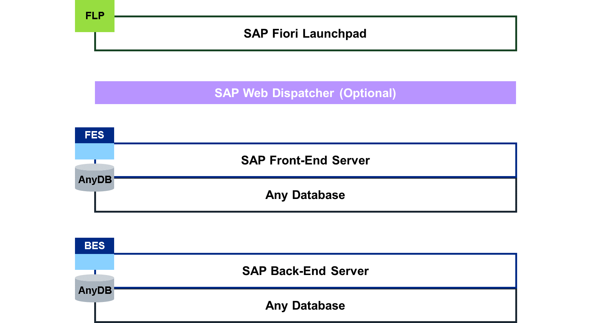
The system landscape for SAP Fiori consists mainly of a Front-End Server (FES) and a Back-End Server (BES). These are system roles of an Application Server (AS) ABAP or ABAP Platform in this landscape. The back-end server is an SAP Business Suite or an SAP S/4HANA holding applications and data of any area based on an AS ABAP 7.40 or higher. The front-end server is a basic AS ABAP 7.40 or higher without any business products installed. Both systems can run on any database.
Note
Since release 7.53, Application Server ABAP is renamed ABAP Platform. The reason was the availability of SAP Business Technology Platform (BTP), ABAP environment.
Although the _SAP Fiori launchpad (FLP)_ running in any client is able to communicate with the FES directly, it is recommended to use an SAP Web Dispatcher or another reverse proxy between FLP and FES in external facing scenarios and also internally. The reason is that for some features of the FLP multiple systems must be reached, which is forbidden in web communication with good reason. A reverse proxy offers a single point of communication holding routing rules to forward requests to the correct target systems.
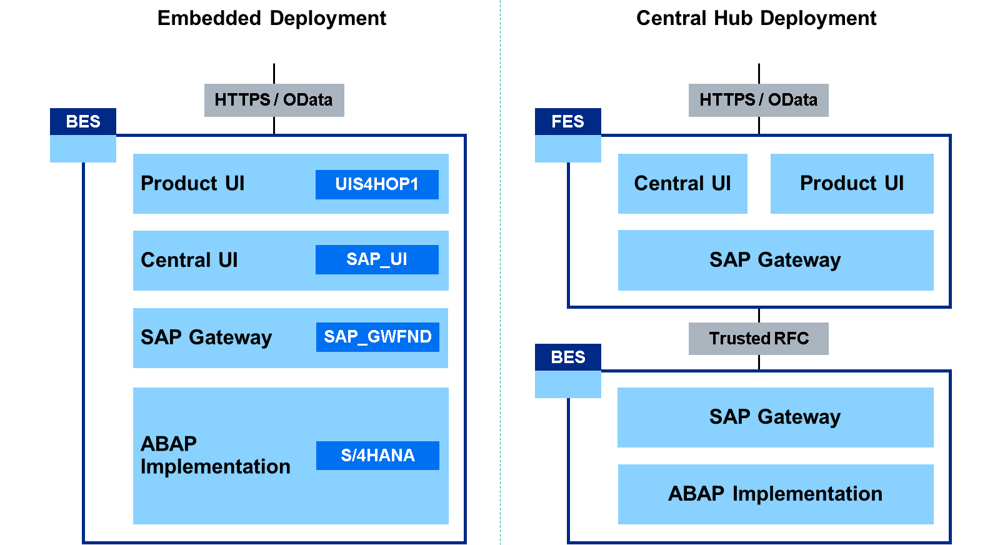
In some scenarios, it is not necessary to operate separated front-end and back-end servers. It can even be counterproductive to do so. Therefore, you can deploy all components of SAP Fiori in one system, in an embedded deployment.
| Embedded Deployment  | Central Hub Deployment  |
| --- | --- |
| The tasks of the FES for providing SAP Fiori are embedded in the BES. There is only one system.  | The FES and BES are two separated systems splitting the tasks in providing SAP Fiori.  |
SAP Gateway, the only component in FES and BES, is the only part where you have to check carefully, which settings are in which system. As soon as there are multiple systems that want to provide SAP Fiori apps, the FES has many benefits in organizational and security terms.
Note
The recommended deployment option for SAP Business Suite is the central hub scenario. SAP FES 2023 is the last front-end server version, which is supported, and thus has end of maintenance in alignment with SAP Business Suite.
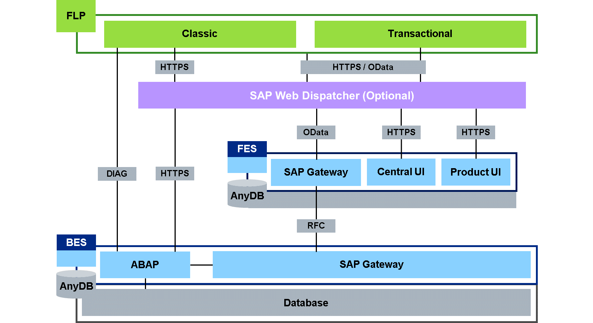
The SAP Fiori system landscape for a BES on any database supports transactional apps based on SAPUI5 and classic apps based on _Web Dynpro_ and ABAP transactions. Mandatory components of the FES are the SAP Gateway for OData communication, the central UI for general SAP Fiori functions, and product UIs for the apps. The SAP Gateway and ABAP code for the business logic of the apps are in the BES.
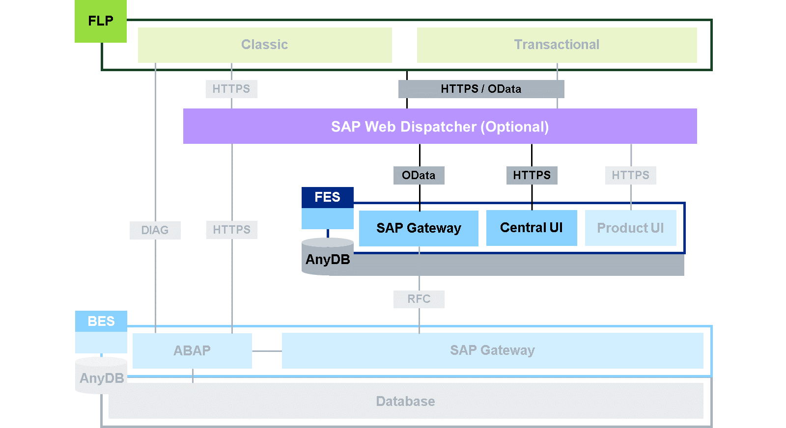
To use any SAP Fiori app, a running FLP is needed. The FLP is part of the central UI including all views, functions, and tools for personalization, customizing, and configuration of the contents. When thinking about personalization, this is performed by the user in a running FLP. Therefore, the FLP must read and write data from and to the FES using OData, not only for personalization, but also in other areas.
There is no communication to the BES by the FLP. All general settings for SAP Fiori are saved in the FES to be independent from the BES. Although this is not visible in the diagram, having multiple back ends is usual for many customers. Having only one place (system) for SAP Fiori settings is a huge benefit.
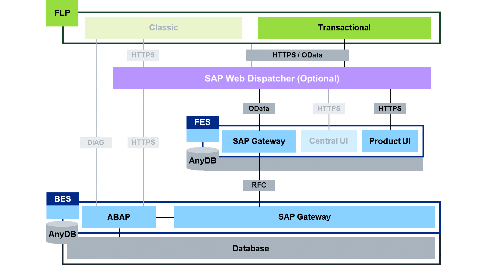
Disregarding the need for a running FLP, transactional apps consist of SAPUI5 apps and SAP Gateway services. SAPUI5 apps are saved in the ABAP repository as BSPs and delivered using product-specific UI add-ons. These are installed on the FES. The SAP Gateway services are delivered as part of updates of the BES solution and are written in ABAP.
The registration of the Gateway services is performed on the FES by the customer. So, when transactional apps need data, an OData request is performed via the SAP Web Dispatcher to the registration of the Gateway service on the FES. From there, the SAP Gateway framework creates an RFC request to the implementation of the SAP Gateway service on the BES. In the implementation, ABAP code is used to access the data in the database.
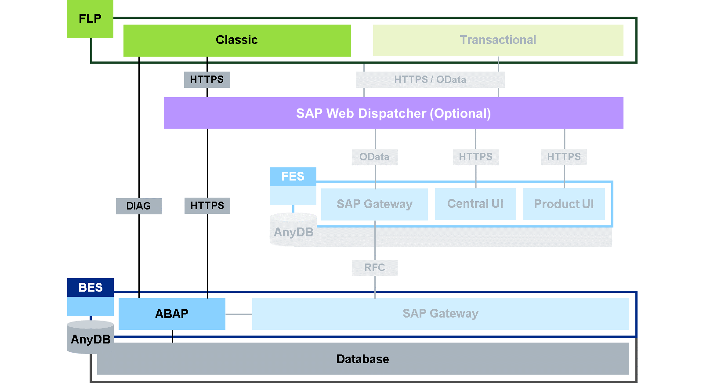
Classic applications are part of the BES solution and have no interaction with the FES besides the FLP itself. The UI and data directly originate from the ABAP code on the BES. The only task of the FES is to provide the connection information to the BES when a navigation request — such as clicking a tile — is initiated in the FLP. This connection information must be set in the FES by an administrator.
## Debug ABAP Transactions in SAP Fiori Launchpad
### Business Example
You want to debug an ABAP transaction in the _SAP Fiori launchpad_.
Note
This exercise requires an SAP Learning system. Login information is provided by your system setup guide.
### Task 1: Enter Function Debugging in GUI for HTML
Exercise[Start Exercise](https://learnsap.enable-now.cloud.sap/pub/mmcp/index.html?show=project!PR_305FA0A654423BA:uebung)
#### Steps
  1. In a Web browser, open the _Data Browser_ (SE16) in your _SAP Fiori launchpad_. Activate the OK code field in the SAP GUI for HTML settings. Try to switch to debugging at runtime when selecting data from the database table **SCARR**.
    1. In the _SAP Fiori launchpad_ of your S4H, open the _Data Browser_ (SE16).
Note
If you do not have a tile or link, you can find it via the _User Menu_ in the _App Finder_.
    2. Choose _Menu_ → _Settings..._.
    3. In the menu on the left, choose _Interaction Design_ → _Visualization_.
    4. Activate the _Show OK Code field_ switch.
    5. Choose _Save_.
    6. In the _Table Name_ field, enter **SCARR**.
    7. Choose _Table Contents_.
    8. In the _OK code_ field in the upper left, enter **/h** and choose **Enter**.
Hint
You can also choose _More_ → _System_ → _Utilities_ → _Debug Dynpro_.
#### Result
In the footer, the error message _Action not possible in SAP GUI for HTML. Use external debugging._ appears.
    9. In the error message in the footer, choose _View Details_.
    10. Examine the error details.

### Task 2: Enter Function Debugging in GUI for Windows
Exercise[Start Exercise](https://learnsap.enable-now.cloud.sap/pub/mmcp/index.html?show=project!PR_A57162CD6235C592:uebung)
#### Steps
  1. Enable the _SAP GUI OK code_ in the _SAP Business Client_.
    1. Open the _SAP Business Client_.
    2. In the upper left corner, choose _Customize and Control SAP Business Client (three lines)_ → _Settings_ → _SAP GUI Interoperability_.
    3. Select _Enable SAP GUI OK code_.
    4. Choose _OK_.
    5. In the _SAP GUI OK Code Info_ , choose _OK_.
    6. Close the _SAP Business Client_.
  2. In the _SAP Business Client_ , open the _Data Browser_ (SE16) in your _SAP Fiori launchpad_. Switch to debugging at runtime when selecting data from the database table **SCARR**.
    1. Open the _SAP Business Client_.
    2. In the _SAP Business Client_ , double-click the _SAP Fiori launchpad_ entry of your SAP S/4HANA (S4H) system.
    3. Open the _Data Browser_ (SE16).
Note
If you do not have a tile or link, you can find it via the _User Menu_ in the _App Finder_.
    4. In the _Table Name_ field, enter **SCARR**.
    5. Choose _Table Contents_.
    6. In the _OK code_ field in the upper left, enter **/h** and choose **Enter**.
Hint
You can also choose _Menu_ → _System_ → _Utilities_ → _Debug Dynpro_.
#### Result
In the footer, the success message _Debugging switched on_ appears.
    7. Choose _Execute_.
    8. In the _ABAP Debugger_ , examine the ABAP code.
    9. Choose _Continue_.
#### Result
A list of carries is displayed.

## Installation of SAP Fiori Apps
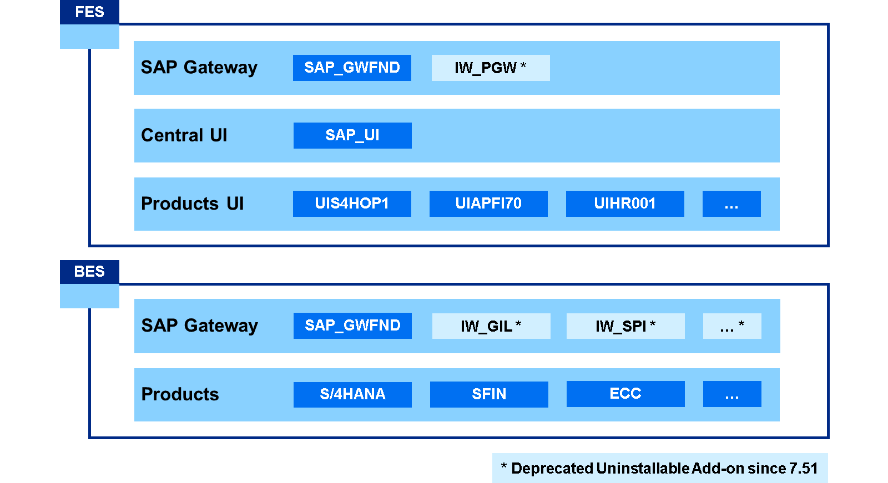
Looking more closely at software components and products, SAP Gateway consists mainly of the software component SAP_GWFND in the FES and BES. This is part of every AS ABAP since 7.40. Up to 7.50, more features of SAP Gateway may be needed depending on the apps. When using SAP Workflow in SAP Fiori 1.0, the add-on IW_PGW is needed in the FES. When using data models of the Generic Interaction Layer (GENIL), the add-on IW_GIL is needed in the BES. When using Service Provider Infrastructure (SPI), IW_SPI is needed, and so on. All these SAP Gateway add-ons are deprecated since 7.51 and SAP Fiori 2.0 and can be uninstalled. Either the functionality was integrated in SAP_GWFND (for example, SAP Workflow) or it is no longer needed in SAP S/4HANA 1610.
The central UI consists of the software component SAP_UI, which is part of every AS ABAP since 7.40 and holds all UI technologies in the system, not just SAP Fiori.
The product-specific UI add-ons hold not one but all SAPUI5 apps of one solution area. The type and the release should fit to the solution implemented in the BES.
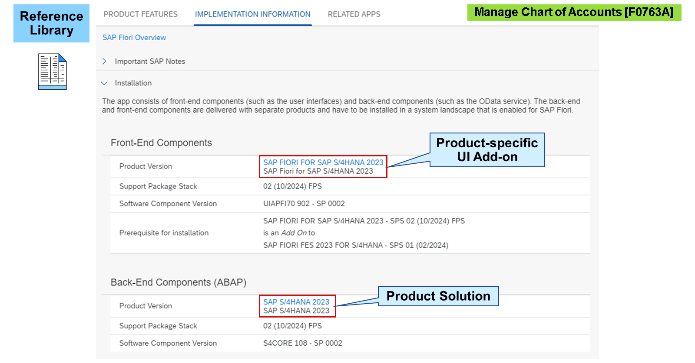
In this example of the _SAP Fiori apps reference library_ , you see the product-specific UI add-on must be installed on the FES and the update of the product solution is needed on the BES. The product-specific UI add-on is an add-on to the SAP Fiori FES 2023 for S/4HANA, consisting not only of this app, but all apps for SAP S/4HANA 2023. The update of the BES is the Feature Package Stack (FPS) 02 for SAP S/4HANA 2023. All SAP Fiori applications are installed in such a way.
## Applications Based on SAP Gateway Projects
An SAP Gateway service consists of ABAP classes and customizing elements in the BES, and a service catalog entry in the FES.
Watch this video explaining the architecture of an SAP Gateway service.
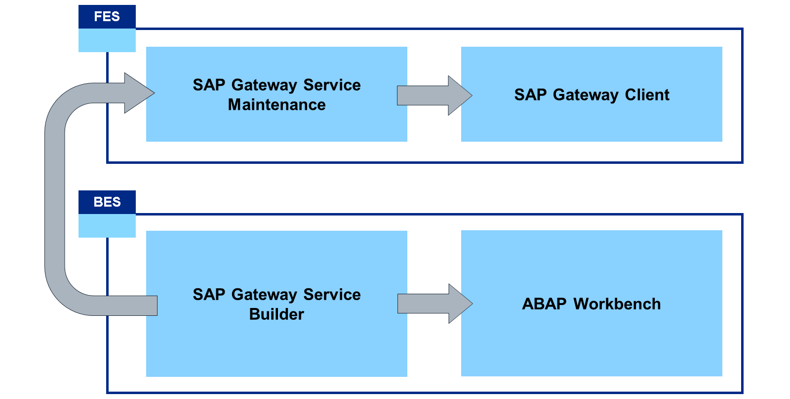
All SAP Gateway transactions are connected to each other via navigation. The following are the most important transactions for SAP Gateway:

SAP Gateway Service Maintenance (/IWFND/MAINT_SERVICE)

Central SAP Gateway service management in the FES

SAP Gateway Client (/IWFND/GW_CLIENT)

SAP Gateway service test environment in the FES

SAP Gateway Service Builder (SEGW)

Central SAP Gateway development environment in the BES

ABAP Workbench (SE80)

Central ABAP development environment in the BES
Let's look at the transaction _SAP Gateway Service Builder_ (SEGW) in detail.
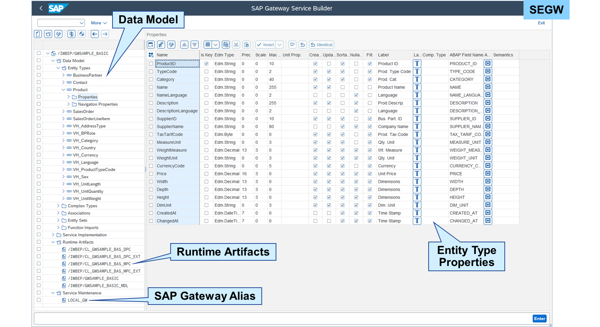
The transaction _SAP Gateway Service Builder_ (SEGW) uses projects to bundle all artifacts of a service in one central place, which helps to organize the service development and modeling process. Since projects consolidate all related data, developers can easily work on multiple projects in parallel and reuse data between projects before generating and activating the actual service.
Note
For more information about this topic, see:
Building OData Services with SAP Gateway (Online Course)
<https://learning.sap.com/courses/building-odata-services-with-sap-gateway>
## Debug Apps Based on SAP Gateway Projects
### Business Example
You want to examine an SAP Gateway project of an SAP Fiori app and debug a GET_ENTITYSET-method.
Note
This exercise requires an SAP Learning system. Login information is provided by your system setup guide.
### Task 1: Examine an SAP Gateway Project
Exercise[Start Exercise](https://learnsap.enable-now.cloud.sap/pub/mmcp/index.html?show=project!PR_B0E9DD1A209E19B9:uebung)
#### Steps
  1. Log on to your SAP S/4HANA (S4H) system using _SAP GUI_.
    1. In the _SAP Business Client_ or _SAP Logon_ , choose the SAP GUI SNC system entry of your S4H.
    2. Choose _Log On_.
  2. Examine the **EPM_REF_APPS_SHOP** project in the _SAP Gateway Service Builder_ (SEGW) on your S4H.
    1. In the _SAP Easy Access_ screen, search for _SAP Gateway Service Builder_ or start transaction SEGW.
    2. Choose _Open Project_.
    3. In the _Project_ field, enter **EPM_REF***.
    4. Open the value help (**F4**).
    5. Double-click the _Project_**EPM_REF_APPS_SHOP**.
    6. Choose _Execute_ (**F8**).
    7. Examine the EPM_REF_APPS_SHOP project.

### Task 2: Debug the ABAP Code of an SAPUI5 App in the SAP Fiori Launchpad
Exercise[Start Exercise](https://learnsap.enable-now.cloud.sap/pub/mmcp/index.html?show=project!PR_8C13C73FADFE67B8:uebung)
#### Steps
  1. Set an external breakpoint in the method **PRODUCTS_GET_ENTITYSET** of the class EPM_REF_APPS_SHOP on your S4H.
    1. In the _SAP Gateway Service Builder_ , double-click _Runtime Artifacts_ of the _EPM_REF_APPS_SHOP_ project.
    2. Right-click _CL_EPM_REF_APPS_SHOP_DPC_ and choose _Go to ABAP Workbench_.
    3. Double-click the _PRODUCTS_GET_ENTITYSET_ method.
    4. In the menu, choose _Set/Delete External Breakpoint_.
  2. Start the SAP Fiori reference app _Shop_ in your _SAP Fiori launchpad_ and examine the code in the ABAP Debugger.
    1. In the _SAP Fiori launchpad_ , choose the _Shop_ tile in the _Reference Apps_ page.
    2. In the _ABAP Debugger_ , choose _Single Step_.
    3. Examine the ABAP code.
    4. In the menu, choose _Breakpoints_ → _Delete all BPs_.
    5. Choose _Continue_.


### Describing SAP S/4HANA

*Source: https://learning.sap.com/courses/learning-the-basics-of-sap-fiori/describing-sap-s-4hana_b1260c05-e47c-4e46-914d-3b4cf1cde5d5*

Objectives
After completing this lesson, you will be able to:
  * Explain landscape of SAP Fiori for SAP S/4HANA.
  * Explain SAP S/4HANA Embedded Analytics
  * Explain SAP HANA Enterprise Search.

## SAP S/4HANA
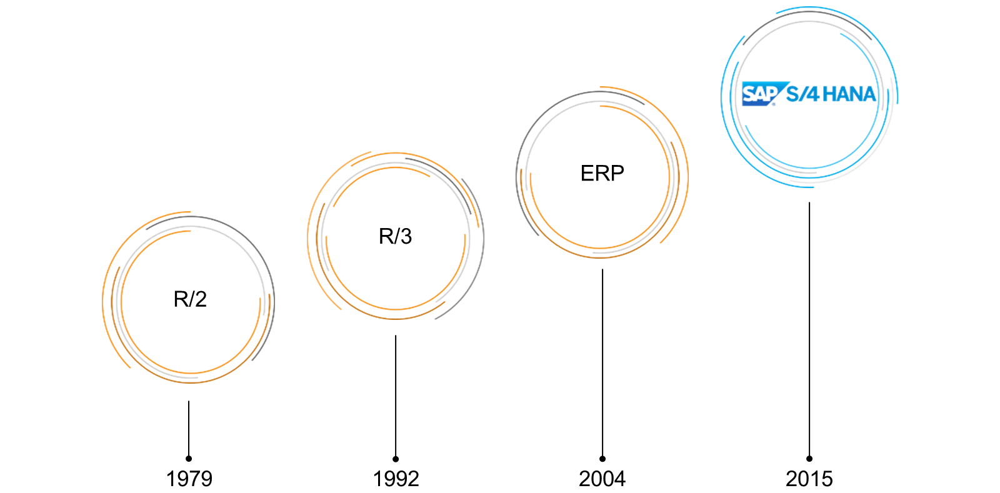
In SAP R/2, SAP started to deliver screens to specialists in order to enter information into the system. These users were experts in their fields, highly skilled, and well-trained to use the system. Today, even the operation of an MRP Run is more like controlling a machine or using an interface to a business function than an intuitive and self-explaining UI.
With SAP S/4HANA, SAP is executing the vision to empower every customer employee to use SAP business software. The "S" in S/4HANA stands for Suite, the "4" stands for fourth generation. The complete name is SAP Business Suite 4 (for) SAP HANA (S/4HANA).
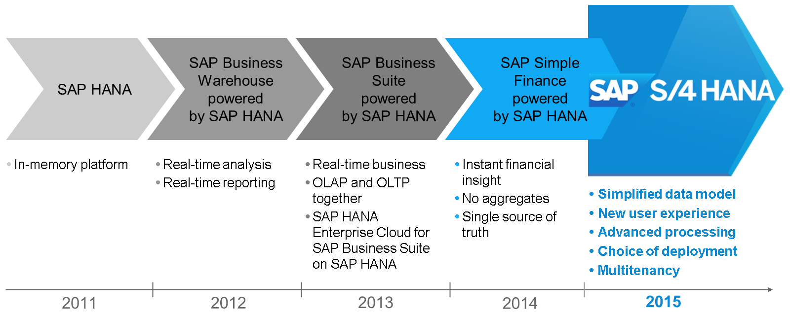
SAP S/4HANA is the next-generation business suite to help lines of business and industries to run simply, with all that only SAP HANA can do. SAP S/4HANA combines recent innovations (SAP HANA platform and SAP Fiori UX) with over 40 years of experience in mastering complex industry challenges in a new suite that caters to a digital, networked economy. The first part of SAP S/4HANA that was available was SAP Simple Finance, the first optimized solution.
SAP S/4HANA delivers the simplicity that users must succeed.
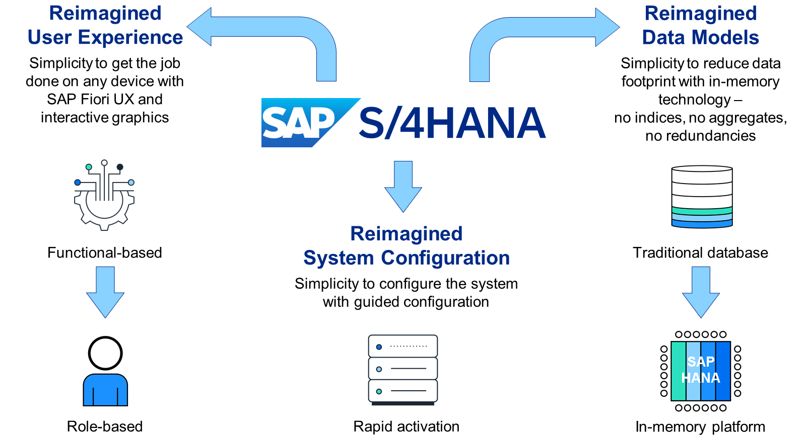
From an IT value perspective, SAP S/4HANA creates unique opportunities to dramatically simplify the landscape and reduce the total cost of ownership (TCO), with SAP HANA as the great simplifier. Business users can leverage a simple and role-based user experience based on modern design principles, minimizing training efforts while increasing productivity. Rapid activation eases the creation of settings in areas from system administration to application customizing. Enterprises can now significantly reduce their data footprint and work with larger data sets in one system to reduce hardware and operational costs and save time.
### SAP S/4HANA Key Facts
The following are key facts about SAP S/4HANA:
  * Faster analytics and reporting
  * Fewer process steps
  * ERP, CRM, SRM, SCM, and PLM co-deployed
  * All data: social, text, geo, graph, and processing
  * No locking, parallelism
  * Actual data (25%) and historical (75%)
  * Smaller total data footprint
  * SAP Fiori UX for any device

### Data Footprint Reduction
One of the key features of SAP S/4HANA includes smaller total data footprint. Watch the video to understand how SAP HANA reduces its data footprint.
## Landscape of SAP Fiori for SAP S/4HANA
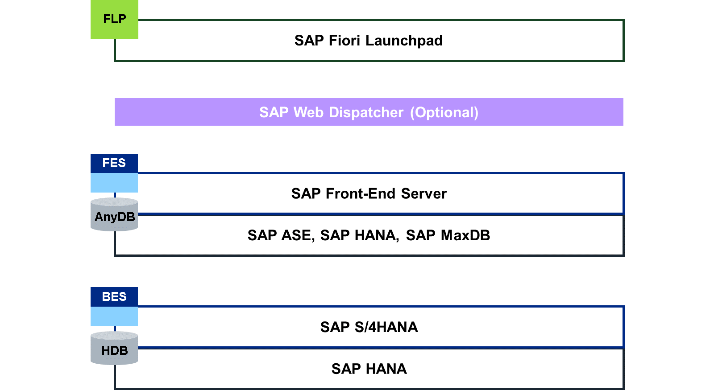
The general system roles in the SAP Fiori system landscape do not change when moving to SAP S/4HANA. The _SAP Fiori launchpad_ running in a client still connects to the FES via the SAP Web Dispatcher. What changes are the capabilities of the BES, which now has optimized code for SAP HANA as an SAP S/4HANA. General information about the FES can be found in the SAP Note [2590653](https://me.sap.com/notes/2590653) – _SAP Fiori front-end server deployment for SAP S/4HANA_.
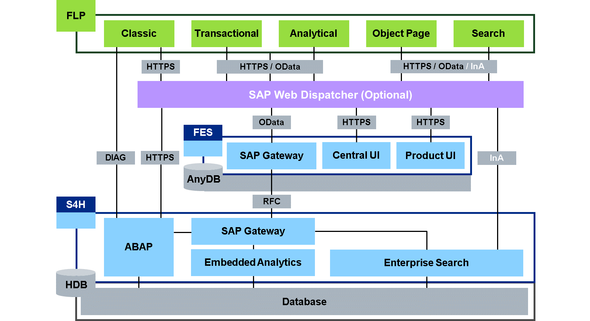
All application types are available for SAP S/4HANA (S4H). The important difference to the SAP Business Suite is that there is only one architecture type for all application types. All applications act like transactional apps communicating via SAP Gateway over the FES with the BES now an S4H. Only the classic applications and in some scenarios the SAP Fiori search connect directly to the S4H.
The hub deployment option will be supported also for SAP S/4HANA 2025. Nevertheless, there might be restrictions regarding the availability of future new features. Some features might only be available in the embedded deployment due to technical reasons.
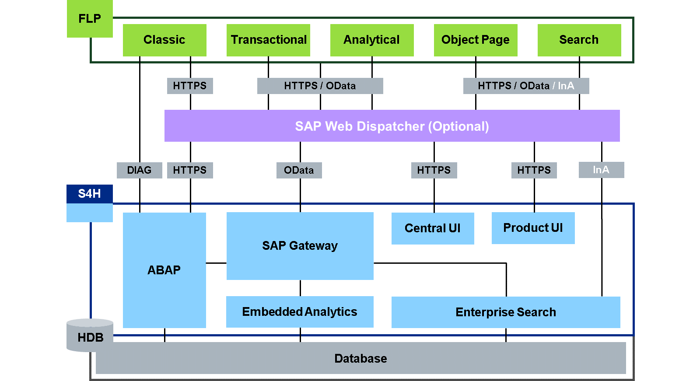
The recommended deployment option for SAP S/4HANA is the embedded deployment. The main reason is that with SAP S/4HANA all data and functions reside in one system. A hub system for routing requests to certain back-ends is no longer needed. In addition, many configuration steps for SAP Fiori get easier when having everything in one system.
Note
For more details, please check the document "SAP Fiori Deployment Options and System Landscape Recommendations": <https://www.sap.com/documents/2018/02/f0148939-f27c-0010-82c7-eda71af511fa.html>
## SAP S/4HANA Embedded Analytics
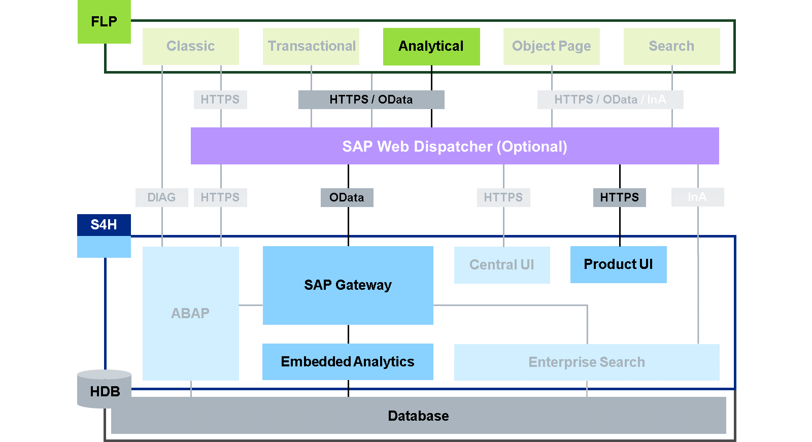
The UIs for analytical apps are part of the same product-specific UI add-ons that provide transactional apps. SAP Gateway again manages the OData services for the apps, but the source is now different. ABAP Core Data Services (CDS) Views are the basis for all analytical applications in S4H. ABAP CDS Views are able to integrate with SAP S/4HANA Embedded Analytics, which originated from SAP Business Warehouse (BW).
Note
When using ABAP CDS Views, there is no need to access data views via the SAP HANA Extended Application Services (XS) like in the SAP Business Suite.
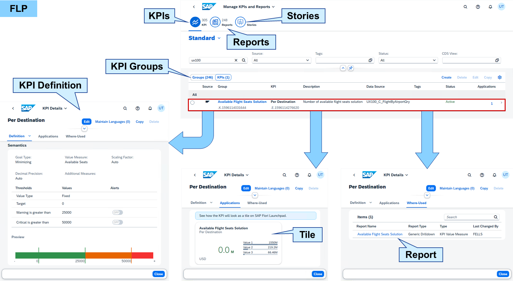
The area of business analytics specifically used in SAP Fiori is called SAP Smart Business. The core element there is the Key Performance Indicator (KPI). A KPI is built on top of ABAP CDS Views and defines data source, semantics, and tiles. Related KPIs can be managed in groups.
A report (formally known as drill-down) is the visualization of a KPI offering predefined ways for the user to interact with the data. Customers can organize multiple reports in stories, for example, to tell the story of a product.
Since SAP S/4HANA 1909, _Manage KPIs and Reports [F2814]_ is the central app for managing KPIs, reports, and stories. It is the successor of the _KPI Workspace [F0818]_ , introduced in SAP S/4HANA 1511 and deprecated since SAP S/4HANA 2020.
Note
A predecessor of the _KPI Workspace_ having the same name was already available in SAP Business Suite. The main difference is that not ABAP CDS Views but SAP HANA XS OData services are used as data source. This results in different and extra steps in managing KPIs such as authorizations.
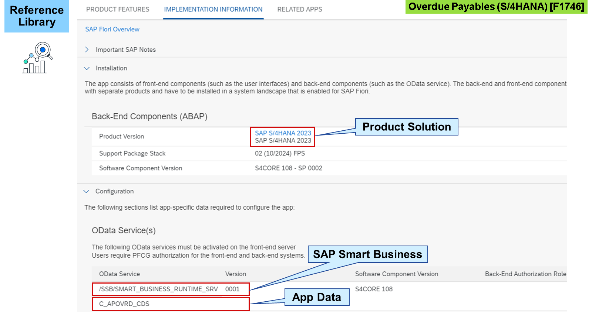
In this example from the _SAP Fiori apps reference library_ , you see the SAP S/4HANA 2023 as the product solution. Generic drill-down apps like this one need the /SSB/SMART_BUSINESS_RUNTIME_SRVOData service for generating the visualization. In addition, there is an OData service for the actual app data containing "CDS" in its name.
Hint
SAP Gateway services ending in "_CDS" are based directly on an ABAP CDS View. Omitting "_CDS" leaves the view name behind.
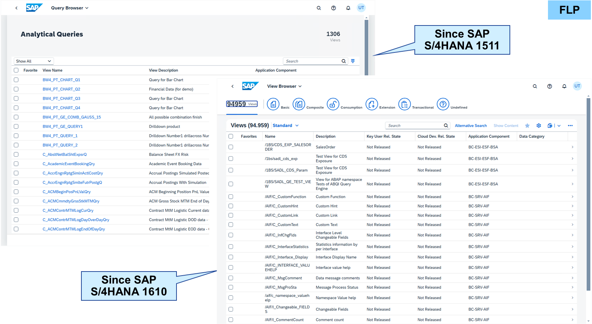
The entry points for users to create their own evaluations are the _Query Browser [F1068]_ available since SAP S/4HANA 1511 and the _View Browser [2170]_ available since SAP S/4HANA 1610. Both show a list of ABAP CDS Views, which are available in the system. The difference is that the _Query Browser_ limits the list on pure analytical views whereas the _View Browser_ is used by more advanced users offering a list of all ABAP CDS Views. Not only the consumption views providing data for applications but all views of the whole virtual data model (VDM) are visible. This enables a more detailed view on the data source but also demands more knowledge of the topic.
No matter which browser is used, after selecting an ABAP CDS View as data source, the _Custom Analytical Queries [F1572]_ app can be started to actually define a query handling dimension, tables, and charts. The result can be saved as a tile to access the query directly in the _SAP Fiori launchpad_.
Note
For more information about this topic, see:
  * SAP S/4HANA Embedded Analytics Foundation (Classroom Training):
<https://training.sap.com/course/s4h400>
  * Discovering SAP S/4HANA embedded analytics (Online Course):
<https://learning.sap.com/courses/discovering-sap-s-4hana-embedded-analytics>

## How to Find Apps for Managing Embedded Analytics
### Business Example
You want to analyze apps managing Embedded Analytics in the _SAP Fiori apps reference library_ and _SAP Fiori launchpad_.
Watch the video to see how to find apps for managing Embedded Analytics.
## Open a Query for Analysis
### Business Example
You want to search for views as a source for analytical queries and create an analysis in the _View Browser_ app.
Note
This exercise requires an SAP Learning system. Login information is provided by your system setup guide.
### Task 1: Examine a Query in the View Browser
Exercise[Start Exercise](https://learnsap.enable-now.cloud.sap/pub/mmcp/index.html?show=project!PR_B8D5CD101CE8182:uebung)
#### Steps
  1. In the _SAP Fiori launchpad_ of your SAP S/4HANA (S4H) system, check in the _View Browser_ if the consumption view _UX100_C_FlightByAirportQry_ can be used for analytical queries.
    1. In the _SAP Fiori launchpad_ of your S4H, open the _Cross Topic_ → _Analytics_ page.
    2. Choose the _View Browser_ tile.
    3. In the _Search_ field, enter **ux100** and choose **Enter**.
    4. Choose _Consumption_ at the top.
    5. Choose the view _UX100_C_FlightByAirportQry_.
    6. Choose the _Annotation_ anchor.
    7. Check that the value for _ANALYTICS.QUERY_ is _true_.

### Task 2: Save a Query as Tile
Exercise[Start Exercise](https://learnsap.enable-now.cloud.sap/pub/mmcp/index.html?show=project!PR_92B31B4200367489:uebung)
#### Steps
  1. In the _View Browser_ , show the content of the _UX100_C_FlightByAirportQry_ view. Change the graphical display to show the seats information per airline and plane type.
    1. In the _View Browser_ , choose _Show Content_ in the upper right.
    2. Drag and drop _Airline_ and _Plane Type_ from _Available Fields_ to _Rows_.
    3. Drag and drop _Departure Airport_ and _Destination Airport_ from _Rows_ to _Available Fields_.
    4. Choose _Graphical Display_.
    5. Examine the _Graphical Display_.
  2. In the _View Browser_ , save a suitable visualization as tile in your _My Home_ page.
    1. In the _View Browser_ , choose _Share_ → _Save as Tile_ in the upper right corner.
    2. In the _Save as Tile_ popup, in the _Title_ field, enter **Flight Seats**.
    3. In the _Subtitle_ field, enter **Airline / Plane Type**.
    4. For the _Pages_ dropdown, select **My Home**.
    5. Choose _Save_.
    6. Choose _Navigate to Home_.
    7. In the _Apps_ section, choose the _Flight Seats_ tile.
    8. Continue to operate the app as you wish.

## SAP HANA Enterprise Search
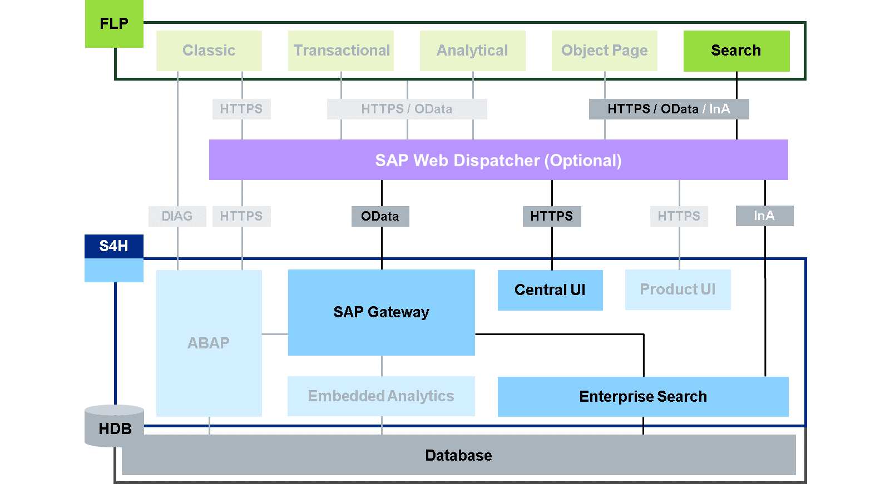
When users want to search for data in the _SAP Fiori launchpad_ , the SAP Fiori search accesses the SAP HANA enterprise search, a successor of the SAP NetWeaver enterprise search. The protocol used for a direct network communication is the SAP proprietary Information Access (InA) protocol, which has some parallels to OData but is specialized for search requests and responses. Since SAP S/4HANA 1809, you can also use the SAP Gateway service ESH_SEARCH_SRV instead. So both, InA and OData are suitable ways of accessing the SAP HANA enterprise search depending on the network landscape.
Hint
Just by registering ESH_SEARCH_SRV, all search requests of the SAP Fiori search are routed through this service.
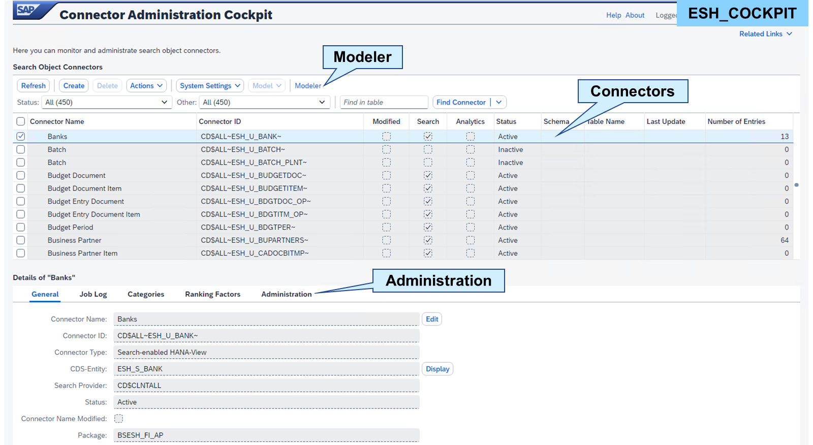
Fact sheet apps use search models developed for SAP HANA enterprise search. These search models use the search capabilities of SAP HANA and, therefore, do not run on an SAP Search and Classification (TREX) used by SAP NetWeaver enterprise search. The administration and handling is mainly the same when using SAP HANA or TREX. The following important transactions and applications work for both search engines:

Connector Administration Cockpit (ESH_COCKPIT)
    Connector administration cockpit for connectors of search models to the search engine

Search and Analytics Modeler (ESH_MODELER)
    Modeler for search and analytic for managing search object connector models

Enterprise Search Test (ESH_TEST_SEARCH)
    Test environment for enterprise search checking consistency of connectors and search results

Search and Operational Analytics Implementation Guide (ESH_IMG)
    Area of the Implementation Guide (IMG) containing administration and configuration of the enterprise search
Search models are shipped by SAP and are the basis for search connectors used by apps. Search connectors are indexed (generated) once the search models are available in a system. Therefore, the search connector ID contains the system and client in which it was generated.
Hint
If you encounter duplicates of search connectors in the _SAP Fiori launchpad_ search, please read SAP Note [3007113](https://me.sap.com/notes/3007113) – _Connector name in Fiori search shows word 'Duplicate'_ for possible solutions.
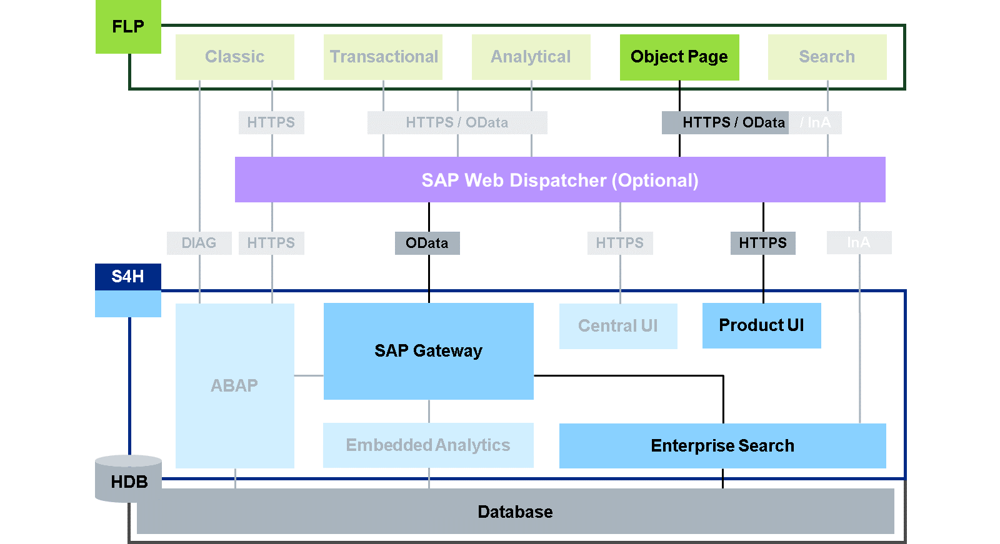
The UIs for object pages are part of the same product-specific UI add-ons that provide transactional and analytical apps. SAP Gateway manages again the OData services for the apps. ABAP Core Data Services (CDS) Views are the basis for all object pages in S4H. ABAP CDS Views utilize the search capabilities of the SAP HANA database by integrating with the SAP HANA enterprise search. That results in generated so-called CDS-based enterprise search (ES) connectors. Similar to the search connectors based on search models, they can be managed in the _Connector Administration Cockpit_. But the details about the source tables, views, and fields are not visible.
Hint
When using ABAP CDS Views, there is no need to access search connectors directly via InA such as in the SAP Business Suite.
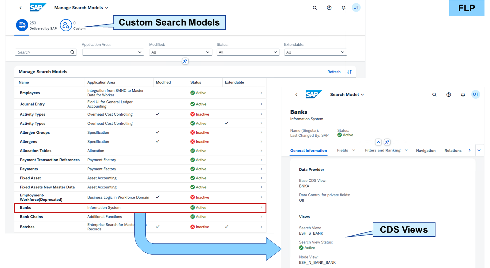
These details are available in the _Manage Search Models [F3036]_ app since SAP S/4HANA 1909. There, everything concerning a CDS-based ES-connector can be viewed such as fields, filters, relations, or even the source code of the ABAP CDS View.
Note
For more information about CDS-based ES-connectors, please read SAP Note [2399860](https://me.sap.com/notes/2399860) – _ES: Behavior of CDS-based search connectors_.
### Processing CDS-based Enterprise Search Connectors
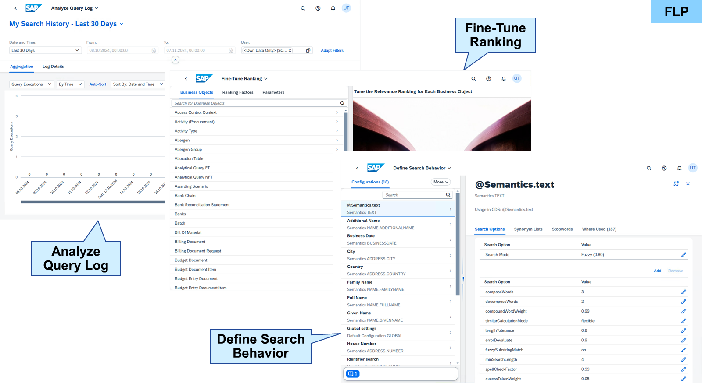
Since SAP S/4HANA 1809, more SAP Fiori apps are available for managing the processing of CDS-based ES-connectors:

Analyze Query Log [F2571]
    Evaluate log data containing user activities collected during searches, graphically in bar charts, or in tables.

Define Search Behavior (Synonyms) [F2700]
    Display search configurations of business objects, create synonym and stop-word lists, and display where-used lists for configuration settings.

Fine-Tune (Search) Ranking [F2777]
    Create and edit ranking factors and boosts, and test their effects immediately in a simulation.
Let's look at an example of SAP Fiori object page based on CDS view.
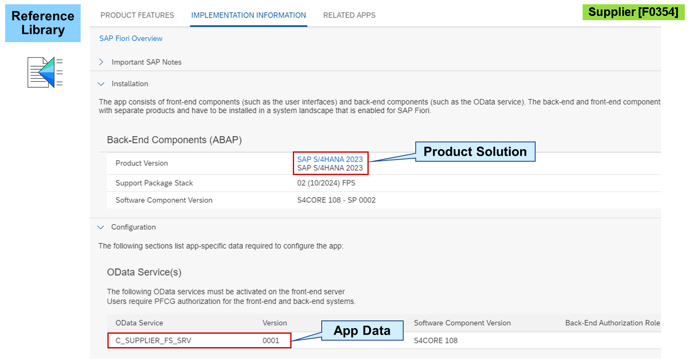
In this example from the _SAP Fiori apps reference library_ , you see the SAP S/4HANA 2023 as a product solution. In addition, there is an OData service but without "CDS" in its name. Not every OData service using ABAP CDS Views is showing this in its name.
Hint
SAP Gateway services ending in "_SRV" are based on SAP Gateway projects. Omitting "_SRV" leaves the project name behind – in most cases. Developers may break this rule.
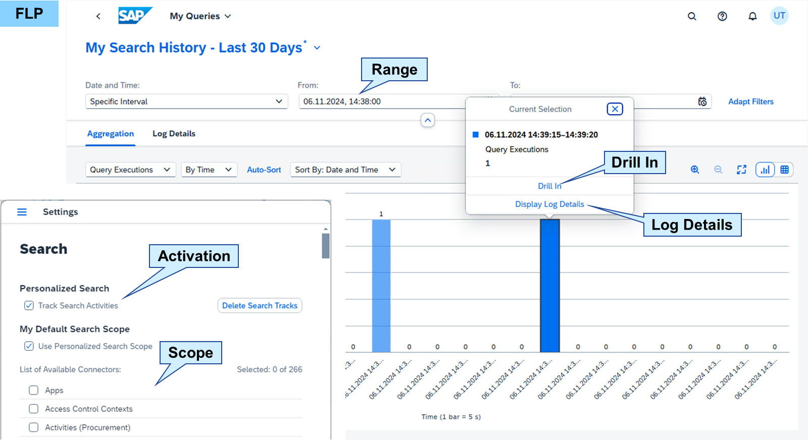
Users of the _SAP Fiori launchpad_ can activate a personalized search in the FLP settings by selecting _Track Search Activities_ under _Search_. In addition, it is possible to limit the personalized search scope to a selectable number of search connectors.
After activation, all search requests of the user in the SAP Fiori search are logged and made available via the _My Queries [F3719]_ app. Users can view and evaluate their search activities and search terms either graphically in a bar chart or as a table. By default, the personalized search is deactivated and the history can be cleared at any time. These defaults for collecting user-specific data can be managed via the _Configure Personalized Search [F2800]_ app.
Note
For more information about this topic, see:
SAP Fiori – System Administration (Classroom Training)
<https://training.sap.com/course/ux200>
## How to Find Apps for Managing Enterprise Search
### Business Example
You want to analyze apps managing enterprise search in the _SAP Fiori apps reference library_ and _SAP Fiori launchpad_.
Watch the video to see how to find apps for managing Enterprise Search.
Settings
## Activate and Examine Personalized Search Queries
### Business Example
You want to activate the _Personalized Search_ for your user in the _SAP Fiori launchpad_ and examine the search queries in the _My Queries_ app.
Note
This exercise requires an SAP Learning system. Login information is provided by your system setup guide.
### Task 1: Activate Tracking for Search Activities
Exercise[Start Exercise](https://learnsap.enable-now.cloud.sap/pub/mmcp/index.html?show=project!PR_DF9972D8B6C72FA9:uebung)
#### Steps
  1. In the _SAP Fiori launchpad_ of your SAP S/4HANA (S4H) system, activate the tracking of search activities for your user.
    1. In the _SAP Fiori launchpad_ of your S4H, choose your user in the upper right corner.
    2. Choose _Settings_.
    3. Choose _Search_.
    4. Select the _Track Search Activities_ checkbox.
    5. Choose _Save_.

### Task 2: Examine the Search History
Exercise[Start Exercise](https://learnsap.enable-now.cloud.sap/pub/mmcp/index.html?show=project!PR_405085622D2C0B88:uebung)
#### Steps
  1. Perform multiple searches in the SAP Fiori search. Examples are cost centers with **1010** , material BOM with **pump** , or G/L accounts with **building**.
    1. Choose _Search_ at the top.
    2. In the _Search In_ dropdown, choose _Cost Centers_.
    3. In the _Search_ field, enter **1010** and choose **Enter**.
    4. In the _Search In_ dropdown, choose _Material BOM_.
    5. In the _Search_ field, enter **pump** and choose **Enter**.
    6. In the _Search In_ dropdown, choose _GL Account_.
    7. In the _Search_ field, enter **building** and choose **Enter**.
    8. Choose _Navigate to Home_.
  2. In the _My Queries_ app, examine the search history of your user for today. Use the options _Drill In_ and _Display Log Details_ in the diagrams.
    1. Open the _Cross Topic_ → _General_ page.
    2. Choose the _My Queries_ tile.
    3. In the _Date and Time_ dropdown, choose **Today**.
    4. In the diagram, click the largest bar.
    5. Choose _Drill In_.
    6. In the diagram, click a bar of your choice.
    7. Choose _Display Log Details_.
    8. Continue to operate the SAP Fiori search and _My Queries_ as you wish.

## Configuration Parameters for SAP Fiori Search
These customizing parameters can be used to configure the SAP Fiori search in the _SAP Fiori launchpad_ :

DEFAULT_SEARCH_SCOPE_APPS

Specify the default search scope as "Apps" (true) or "All" (false).
true/false (default)

SEARCH

Specify whether the search option is displayed in the launchpad shell header bar.
true (default)/false

SEARCH_BUSINESS_OBJECTS

Specify if business objects are included in the search scope.
true (default)/false

SEARCH_SCOPE_WITHOUT_ALL

Specify whether the "All" connector is removed from the search bar.
true/false (default)


### Explaining SAP Fiori Development

*Source: https://learning.sap.com/courses/learning-the-basics-of-sap-fiori/explaining-sap-fiori-development_e7330fcf-e183-495b-8485-1b53b23595d6*

Objectives
After completing this lesson, you will be able to:
  * Explain ABAP programming models.
  * Use ABAP Development Tools.
  * Explain SAP Fiori elements.

## ABAP Programming Models
The three phases of the development of an SAP Fiori application are data modeling, service building, and UI development.
Watch the video explaining the key steps of SAP Fiori development.

Since SAP NetWeaver 7.0, it is possible to use SAP Gateway to build OData services that access arbitrary business data through existing ABAP frameworks (function modules, RFC, BAPI, SPI…). This can either be done through service development or through service generation using _SAP Gateway Service Builder_.
For the UI part, SAPUI5 apps are deployed as Business Server Pages (BSP) in the FES and run in the _SAP Fiori launchpad (FLP)_.
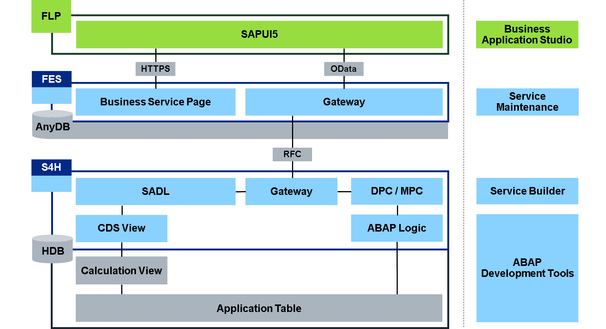
Since SAP NetWeaver 7.40, it is possible to use CDS views as data source. SAP Gateway uses the Service Adaptation Definition Language (SADL) to access CDS views. There, everything is defined to **read** data from application tables, so no additional (ABAP) code must be written by any developer.
Requests that perform changes can be implemented using code-based implementation of the create, update, and delete method in the data provider extension (DPC_EXT) class. In addition since 7.50, CDS views referenced as data source in the _SAP Gateway Service Builder_ can be combined with code-based implementation.
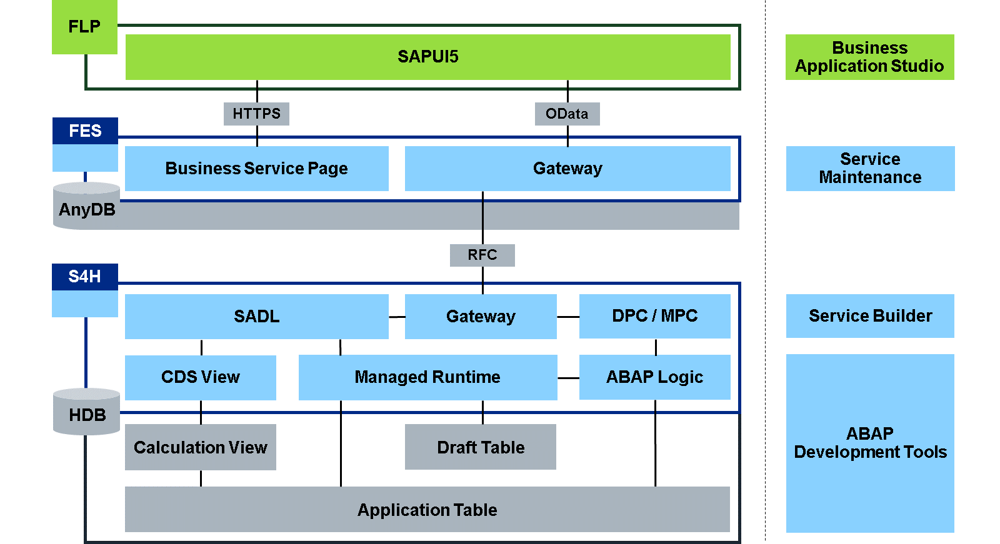
Since SAP NetWeaver 7.51 SP01, a first managed runtime is supported that leverages the Business Objects Processing Framework (BOPF). The business objects (ABAP classes) are generated based on appropriate annotations in the CDS view. They are implemented using code-based implementations to call existing APIs performing change requests to business data. This model is called ABAP Programming Model for SAP Fiori (CDS-based BOPF).
Since ABAP Platform 7.54, an enhanced managed runtime is available that leverages CDS behaviors. Therefore, the business objects of CDS-based BOPF are replaced by behavior definitions (ABAP interfaces) and behavior implementations (ABAP classes). This model is called ABAP RESTful Application Programming Model (RAP).
Code-based implementation can still be used to call existing custom code or if CDS views are not suitable to solve the business scenario.
Note
For more information about this topic, see:
  * Acquiring Core ABAP Skills (Learning Journey)
<https://learning.sap.com/learning-journeys/acquiring-core-abap-skills>
  * Introduction to Application Programming on SAP S/4HANA (Classroom Training)
<https://training.sap.com/course/s4dev>

## ABAP Development Tools for On-Premise
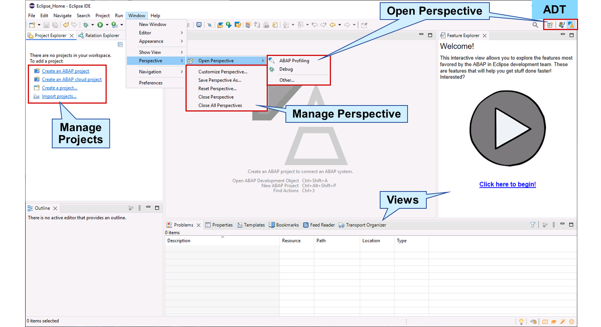
The _ABAP Development Tools (ADT)_ are a collection of plug-ins for _Eclipse_ supporting development projects reaching beyond pure ABAP. _Eclipse_ is a development environment, originally conceived for Java, that offers a framework for which vendors - including SAP - can provide plug-ins that support development in any given language.
Because different languages and platforms have different requirements, developers need a different set of tools within the same Eclipse window. Such a set of tools is called a perspective combining views and functions suiting for one purpose. There are views showing the source code, structural outline, properties, errors, and many more. Every perspective can be customized, new ones can be created, or existing ones can be reset to the last saved state.
The development objects or source code is organized in projects. Each project defines the frame for the (development) task. The files comprising this task are saved in a local folder.
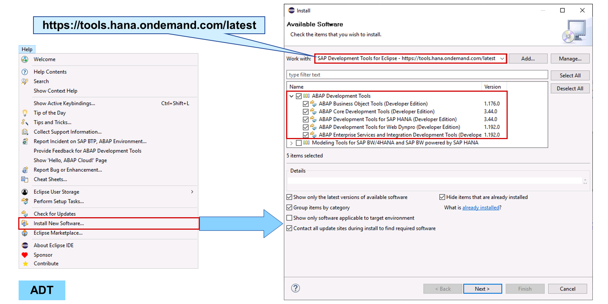
To install the plug-ins of ADT, proceed as follows:
  1. Get an installation of _Eclipse_ from <https://www.eclipse.org/downloads/packages> (for example, _Eclipse IDE for Java Developers_).
  2. In _Eclipse_ , choose _Help_ → _Install New Software..._.
  3. Enter the URI <https://tools.hana.ondemand.com/latest>.
  4. Choose **Enter** to display the available features.
  5. Select _ABAP Development Tools_ and choose _Next_.
  6. On the next wizard page, you get an overview of the features to be installed. Choose _Next_.
  7. Confirm the license agreements and choose _Finish_ to start the installation.

### ABAP Project
An ABAP project is like any other project in _Eclipse_ a folder with files comprising the development task. For ABAP these are the connection information to an ABAP system. ABAP is a server language, so all source code is saved in an ABAP repository of the ABAP platform.
Watch the video to see how to create ABAP project in ABAP development tools.
Settings
The developer needs suitable user authorizations to work via ADT in an ABAP system. A list of roles and authorization objects is available in the following guide:
<https://help.sap.com/doc/2e65ad9a26c84878b1413009f8ac07c3/202210.000/en-US/config_guide_system_backend_abap_development_tools.pdf>
To enable ABAP developers to share HTTP links between themselves, activate the /sap/bc/adt ICF service. The receiver of the link can then render the target development object in his or her default Web browser.
To make documentation available to ABAP developers connected to an AS ABAP **lower** 7.55, activate the following ICF-services:
  * /sap/bc/abap/docu
  * /sap/bc/abap/toolsdocu
  * /sap/public/bc/abap/docu
  * /sap/public/bc/abap/toolsdocu

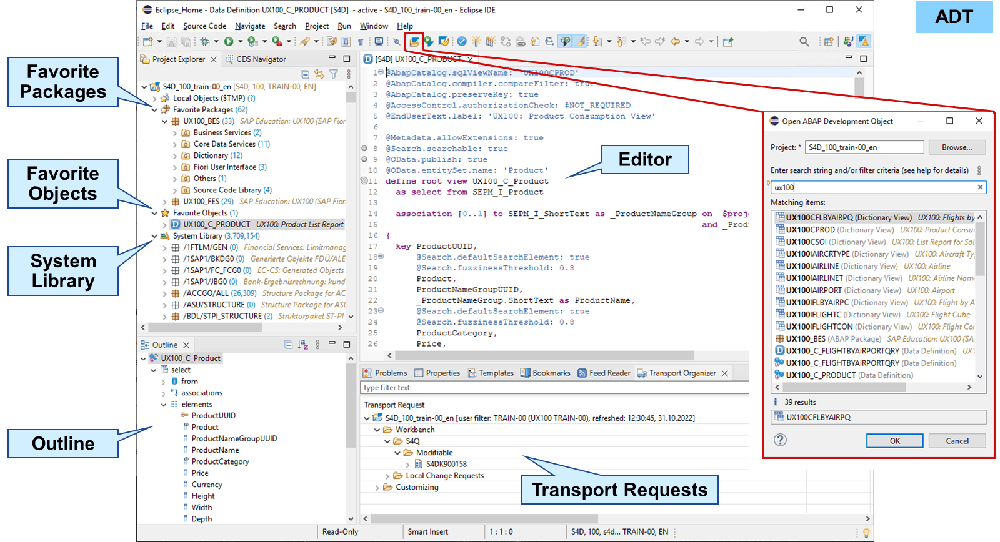
Expanding the _System Library_ in an ABAP project allows direct access to all development objects of an ABAP repository. Especially when accessing an SAP S/4HANA system, this can be quite overwhelming. Therefore, the developer can define favorite packages and objects in an ABAP project.
The _Open ABAP Development Object_ button provides a simple search for development objects based on their names. By choosing a development object from the list, it is opened in the suitable editor and connected views like _Outline_ or _Problems_.
Many more views allow additional information around developing ABAP. One important one is the _Transport Organizer_ view to open assigned transport requests or create new ones.
## Development Paradigm Shift
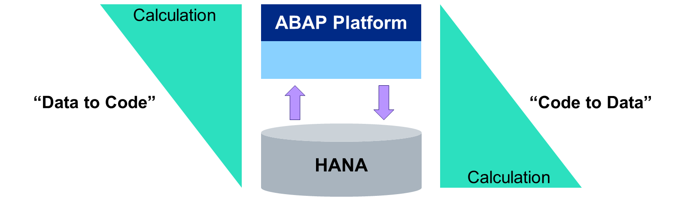
SAP HANA is more than just a database. SAP HANA can perform calculations on a data level much faster than any previous technology, including ABAP programs. In the SAP Business Suite, the data was brought to the code. It was read from the database and processed in ABAP. With SAP HANA, it is more efficient to bring the code to the data, by pushing down calculations from the ABAP Platform in SAP HANA and only returning the results.
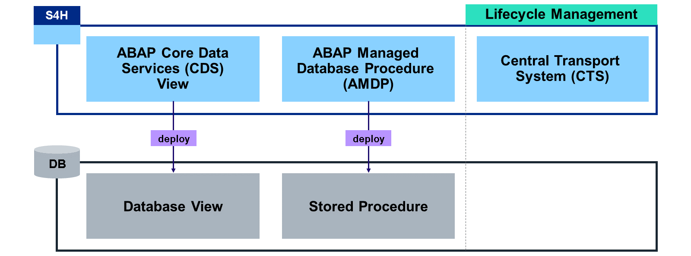
Moving calculations to the database to benefit from its features is not new to SAP HANA. Stored procedures could be used previously for calculations in many databases. However, they were rarely used in ABAP. They only run in the database they are developed in and are not transportable. With SAP S/4HANA, the ABAP repository was extended with two new database objects: ABAP Core Data Services (CDS) Views and ABAP Managed Database Procedures (AMDP). ABAP CDS Views are deployed as SAP HANA views in the SAP HANA Database (HDB), and the AMDPs are deployed as stored procedures. This is comparable to deploying a transparent table of the ABAP repository as a database table in any DB.
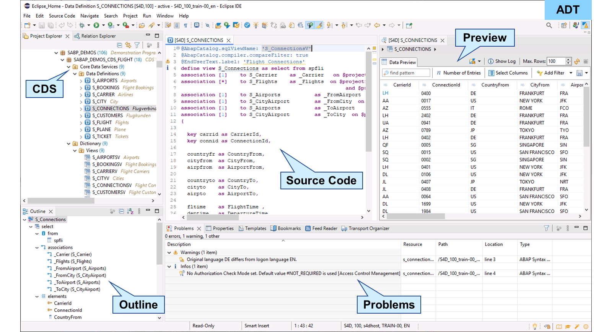
CDS views are the next generation data definition and access for database-centric applications. CDS views provide a cross-platform unified abstraction layer - similar to OData for UI abstraction. For SAP S/4HANA, ABAP CDS views are used. Using CDS views provides a maximum transparency for different programing models. ABAP CDS views provide a consistent lifecycle management and extensibility as with all other ABAP artifacts and are transported using the correction and transport system.
On the one hand, ABAP CDS Views are classic database views compatible with any DB. On the other hand, they include side elements such as annotations, which can only be interpreted by an SAP HANA database. Although CDS Views are stored in the ABAP repository, they can only be viewed using transaction SE80 in the SAP GUI. CDS Views are developed using _ABAP Development Tools (ADT)_ in _Eclipse_.
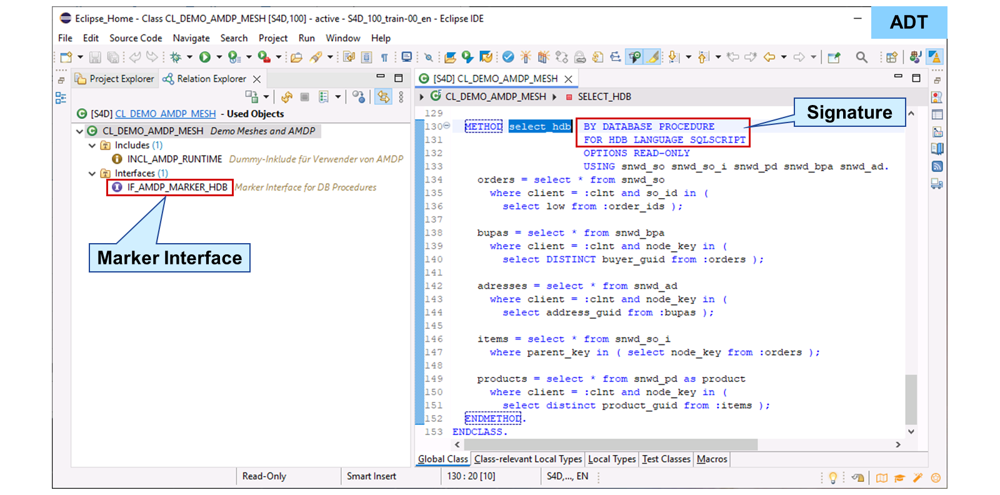
Like CDS Views, AMDPs are developed using ADT and can only be viewed using transaction SE80 in SAP GUI. An AMDP is a global class method containing SQLScript as the programming language. The set of SQL extensions for the SAP HANA database that allow developers to push data intensive logic into the database is called SQLScript. Conceptually, SQLScript is related to stored procedures as defined in the SQL standard, but SQLScript is designed to provide superior optimization possibilities. SQLScript is used in cases where CDS Views are not sufficient, for example, for complex selections or calculations.
AMDPs can be identified by the syntax BY DATABASE PROCEDURE FOR HDB LANGUAGE SQLSCRIPT behind the method name. Classes containing AMDPs implement the marker interface IF_AMDP_MARKER_HDB.
Note
For more information about this topic, see:
  * Data Modelling in ABAP Dictionary and ABAP CDS (Classroom Training)
<https://training.sap.com/course/s4d430>
  * Building Data Models with the ABAP Dictionary and ABAP Core Data (Online Course)
<https://learning.sap.com/courses/building-data-models-with-the-abap-dictionary-and-abap-core-data-services>

## Test ABAP CDS Views
### Business Example
You want to examine and test a DDL SQL and ABAP CDS view in the _ABAP Development Tools_ (_Eclipse_).
Note
This exercise requires an SAP Learning system. Login information is provided by your system setup guide.
### Task 1: Log on an SAP S/4HANA System in Eclipse
Exercise[Start Exercise](https://learnsap.enable-now.cloud.sap/pub/mmcp/index.html?show=project!PR_AB420EC3BF52C28B:uebung)
#### Steps
  1. Start _Eclipse_ and create an ABAP project connecting to your SAP S/4HANA (S4H) system.
    1. In the Windows start menu, choose _Eclipse IDE_.
    2. Close the _Welcome_ screen.
    3. Choose _Open Perspective_ in the upper right corner.
    4. Select _ABAP_ and choose _Open_.
    5. Choose _New_ → _ABAP Project_.
    6. In the _Connection Settings_ popup, in the _System ID_ field, enter the SID of your S4H.
    7. Select the _Activate Secure Network Communication (SNC)_ checkbox.
    8. Choose _Next >_.
    9. In the _Client_ field, enter the client of your S4H.
    10. In the _User_ field, enter your user.
    11. Choose _Finish_.

### Task 2: Examine and Test an ABAP CDS View
Exercise[Start Exercise](https://learnsap.enable-now.cloud.sap/pub/mmcp/index.html?show=project!PR_7833AF6D1B1E808A:uebung)
#### Steps
  1. Examine and test the CDS view **UX100_C_Product** in Eclipse on your S4H.
    1. In _Eclipse_ , choose _Navigate_ → _Open ABAP Development Object..._.
    2. In the _Search_ field, enter **ux100_c_product**.
    3. Select _UX100_C_Product (Data Definition)_ and choose _OK_.
    4. Examine the CDS view.
    5. Choose _Run_ → _Run As_ → _ABAP Application_.
#### Result
A list of products is displayed.

## SAP Fiori Elements
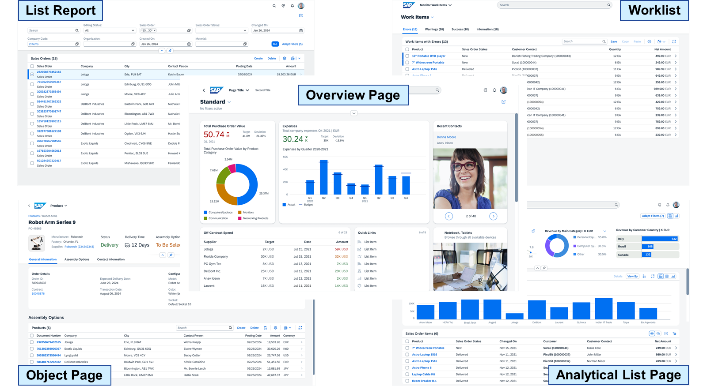
SAP Fiori elements is a metadata-driven development of SAPUI5 applications and distinguishes the following floorplans:

List Report
    Allows users to view and work with items (objects) organized in list (table) format.

Object Page
    Provides functionality to view, edit, and create (business) objects.

Overview Page
    Visualizes large amount of data in cards with different formats for different types of content.

Analytical List Page
    Identifies relevant areas within data sets or significant single instances using data visualization and business intelligence.

Worklist
    Displays a collection of items that a user must process.
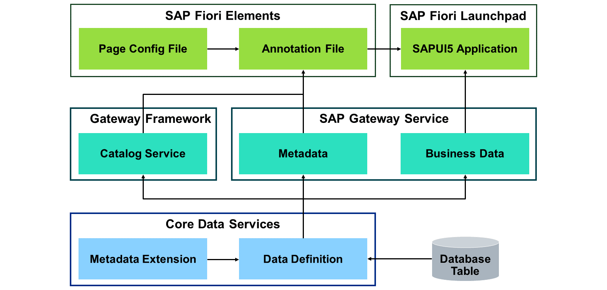
The main source of the metadata for SAP Fiori elements is metadata extensions in the Core Data Services (CDS). Although you can add UI-annotations directly in data definitions, it is recommended to separate the definition of the UI from the data model definition.
The metadata of the SAP Gateway service providing the business data provides the parts of the UI definition suitable to the OData standard. On top of that the /IWFND/CATALOGSERVICE of the SAP Gateway framework provides all other parts, which are not allowed to be part of the metadata of an OData service.
In the SAPUI5 development environment, you can enrich the UI definition by adding annotations in the annotation.xml or by mapping page config files. These JSON-files describe certain parts of the UI in more detail.
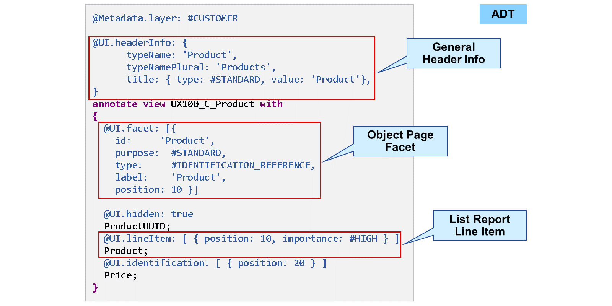
This example shows the definition of a list report combined with an object page. At the top, some general header information for both SAP Fiori elements is set. Then an object page facet is created defining a frame for the data. The ProductUUID is hidden from the user. Product is the semantic key defined as line item in the list report. Finally, Price is set as an identifier in the object page.
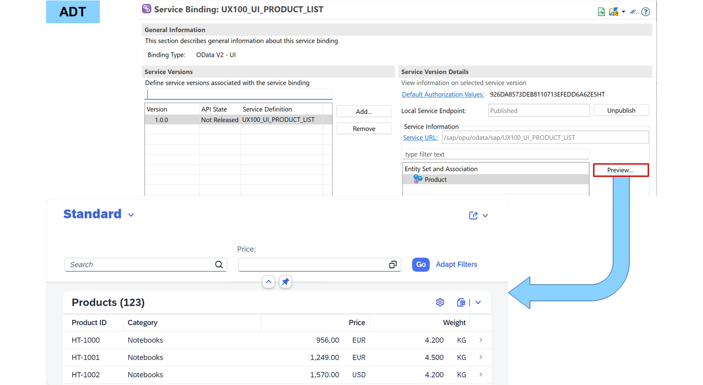
Without using any SAPUI5 development environments, a preview of the list report can be provided via a service binding in the _ABAP Development Tools (ADT)_. This preview directly runs on the ABAP system that the ADT is connected to but does not perform any deployment. Only the UI-annotations in data definitions and metadata extensions are considered, the metadata available on the ABAP-level.
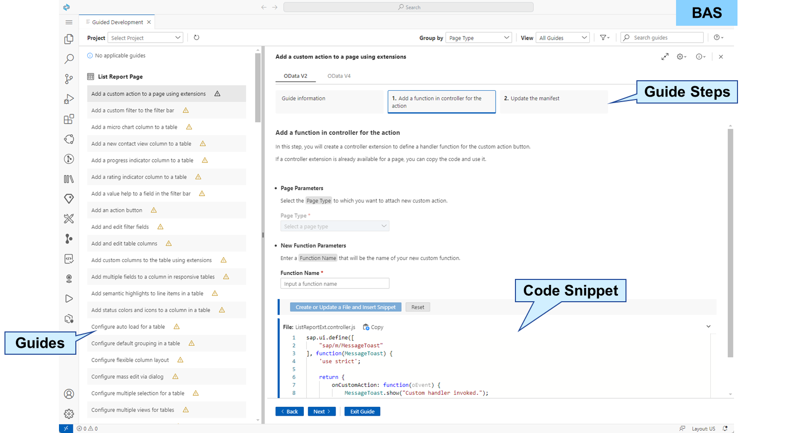
The _SAP Fiori tools_ as part of the _SAP Business Application Studio_ and available in _Visual Studio Code_ are the recommended tool for developing the SAP Fiori elements artifacts on UI-level. The _Guided Development_ of the _SAP Fiori tools_ offers many guides to add more features to the application. A guide offers a documentation of steps, screenshots of the expected result, code snippets, and often a wizard for applying the feature directly in an application in the workspace.
Note
For more information about this topic, see:
Creating an SAP Fiori Elements App Based on an OData V4 RAP Service (Online Course)
<https://learning.sap.com/courses/getting-started-with-creating-an-sap-fiori-elements-app-based-on-an-odata-v4-rap-service>
## Test SAP Fiori Elements List Report
### Business Example
You want to examine the source of an SAP Fiori elements list report and test it in the _SAP Fiori launchpad_.
Note
This exercise requires an SAP Learning system. Login information is provided by your system setup guide.
### Task 1: Examine the Source Code of a List Report
Exercise[Start Exercise](https://learnsap.enable-now.cloud.sap/pub/mmcp/index.html?show=project!PR_2E18128F92C744A9:uebung)
#### Steps
  1. In _Eclipse_ connected to your SAP S/4HANA (S4H) system, examine the UI-definition in the metadata extension of the _UX100_C_PRODUCT_ data definition.
    1. In _Eclipse_ connected to your S4H, open the _UX100_C_PRODUCT_ data definition.
    2. In the _Outline_ , right-click _UX100_C_PRODUCT_.
    3. Choose _Get Where-used List_.
    4. In the _Search_ view, double-click _UX100_M_PRODUCT (Metadata Extension)_.
    5. Examine the @UI-tags in the metadata extension.
  2. Check the source name of the data exposed by the _UX100_UI_PRODUCT_LIST_ service definition. Examine the data provided by the list report preview of the _UX100_UI_PRODUCT_LIST_ service binding.
    1. In the _Search_ view, double-click _UX100_UI_PRODUCT_LIST (Service Definition)_.
    2. Check the exposed data source name.
    3. In the _Outline_ , right-click _UX100_UI_PRODUCT_LIST_.
    4. Choose _Get Where-used List_.
    5. In the _Search_ view, double-click _UX100_UI_PRODUCT_LIST (Service Binding)_.
    6. In the _Entity Set and Association_ list, select _Product_.
    7. Choose _Preview..._.
    8. In the _Select a certificate_ popup, select your certificate and choose _OK_.
    9. In the list report, choose _Go_.
    10. Examine the list of products.

### Task 2: Test a List Report in the SAP Fiori Launchpad
Exercise[Start Exercise](https://learnsap.enable-now.cloud.sap/pub/mmcp/index.html?show=project!PR_4AB0CE8A50453C8F:uebung)
#### Steps
  1. In the _SAP Fiori launchpad_ of your S4H, test the _Display Products_ app of the _UX100 - SAP Fiori Elements_ catalog.
    1. In the _SAP Fiori launchpad_ of your S4H, choose _Home_ in the upper left corner.
    2. In the _Navigation Menu_ , choose _UX100 - SAP Fiori Elements_ from the list of catalogs.
    3. Choose _Display Products_.
    4. Choose _Go_.
    5. Operate the app as you wish.

[Continue to quiz](https://learning.sap.com/courses/learning-the-basics-of-sap-fiori/architecture_88ae48ea-70c6-30f6-b4d8-6124433a3d58)


### Quiz

*Source: https://learning.sap.com/courses/learning-the-basics-of-sap-fiori/architecture_88ae48ea-70c6-30f6-b4d8-6124433a3d58*

It's time to put what you've learned to the test, get 8 right to pass this unit.
1.
### The implementation of SAP Fiori apps is delivered by SAP as product-specific add-ons.
Choose the correct answer.
True
False
2.
### What is the data source definition for the SAP Fiori search?
Choose the correct answer.
Search behaviors
Search connectors
Search ranking
3.
### What is the data source definition for object pages?
Choose the correct answer.
HANA CDS View
Search connector
ABAP CDS View
Search model
4.
### Which areas were reimagined in SAP S/4HANA?
There are three correct answers.
User experience
User management
System configuration
Network communication
Database models
5.
### What is used in SAP S/4HANA to read data from the database?
There are two correct answers.
ABAP Core Data Services
ABAP Managed Database Procedures
HANA Core Data Services
Open Structured Query Language
6.
### Which elements provide analytical evaluations in SAP S/4HANA Embedded Analytics?
There are two correct answers.
Reports
Key Performance Indicators
Guides
Extractions
7.
### SAP S/4HANA is the fourth generation of the SAP Business Suite based on SAP HANA renewing enterprise business.
Choose the correct answer.
True
False
8.
### Which system holds the SAP Fiori launchpad in a hub deployment?
Choose the correct answer.
Front-End Server
Web Dispatcher
Back-End Server
9.
### Which are floorplans in SAP Fiori elements?
There are three correct answers.
Object Page
Master Detail Page
List Report
Overview Page
Dynamic Page
10.
### Which ABAP repository element contains the service logic?
Choose the correct answer.
Technical Service
Technical Model
Data Provider Class
Model Provider Class
Submit answers[Next unit](https://learning.sap.com/courses/learning-the-basics-of-sap-fiori/managing-sap-fiori-content_f7774ceb-cd83-45ff-b3ea-ad21e45a52b5)


### Content Management

*Source: https://learning.sap.com/courses/learning-the-basics-of-sap-fiori/managing-sap-fiori-content_f7774ceb-cd83-45ff-b3ea-ad21e45a52b5*

Objective
After completing this lesson, you will be able to manage SAP Fiori content.
## Content Assignment

The settings for the _SAP Fiori launchpad (FLP)_ are organized in the three layers:
  * The basic layer configuration consists of settings valid for all clients of an AS ABAP.
  * The layer customizing builds on the configuration and fine tunes the settings per client.
  * End users can then personalize these settings in their personalization layer.

Every layer can only change the elements made available by their sublevel or reduce elements for usage in the next layer. Users can only personalize apps that were originally provided in the configuration layer and made available in the customizing layer.
Catalogs are the basis of the SAP Fiori content in the FLP.
Watch the video to understand how content is defined in all three layers of settings available for FLP.

The personalization is performed by each user in the FLP. For Configuration and customizing, each element of the SAP Fiori content has its own tool. The only exception is the _SAP Fiori launchpad designer_ , which can handle groups, technical and business catalogs alike:

Role Maintenance (PFCG)
    ABAP transaction for roles available for decades

SAP Fiori Launchpad Designer (FLPD)
    Standalone SAPUI5 application for groups, technical and business catalogs available since SAP_UI 7.40

SAP Fiori Launchpad Content Manager (FLPCM)
    ABAP transaction for business catalogs available since SAP_UI 7.53

SAP Fiori Launchpad Application Manager (FLPAM)
    Web Dynpro ABAP application for technical catalogs available since SAP_UI 7.55

Manage Launchpad Spaces
    SAPUI5 app in the FLP for spaces available since SAP_UI 7.55

Manage Launchpad Pages
    SAPUI5 app in the FLP for pages available since SAP_UI 7.55
Note
For more information about this topic, see:
Bringing Apps Onto SAP Fiori Launchpad for SAP S/4HANA Cloud and SAP S/4HANA Cloud Private Edition (Learning Video)
<https://learning.sap.com/videos/bringing-apps-onto-sap-fiori-launchpad-for-sap-s-4hana-cloud-and-sap-s-4hana-cloud-private-edition>
## Role Maintenance
Let's start with Role Maintenance (PFCG), an ABAP transaction for roles available for decades.

Since SAP_UI 7.55, the SAP_FLP_ADMIN role includes all tools for maintaining SAP Fiori. The core is the two catalogs SAP_BASIS_BC_UI_FLA and SAP_BASIS_BC_UI_FLD. These enable the user to maintain SAP Fiori via the _SAP Fiori launchpad_.

To make it even easier, a space and a group providing tiles for all tools are also part of the SAP_FLP_ADMIN role. In addition, plenty of other ABAP transactions around SAP Fiori are provided in the SAP easy access menu.
Note
The SAP_FLP_ADMIN single role replaces the SAP_UI2_ADMIN composite role.
Watch this video to learn more about Role Maintenance.
Settings
## Create Business Roles
### Business Example
You want to assign an SAP Fiori catalog, group, and space to a business role.

Solution:

SAP_BR_UX100_S_FLP_ADMIN (Role)
Note
This exercise requires an SAP Learning system. Login information is provided by your system setup guide.
Note
Whenever the values or object names in this exercise include ##, replace ## with the number of your user.
### Task 1: Create a Business Role and Assign a User to the Role
Exercise[Start Exercise](https://learnsap.enable-now.cloud.sap/pub/mmcp/index.html?show=project!PR_7B4AF9D831A554BE:uebung)
#### Steps
  1. Log on to your SAP S/4HANA (S4H) system using _SAP GUI_.
    1. In the _SAP Business Client_ or _SAP Logon_ , choose the SAP GUI SNC system entry of your S4H.
    2. Choose _Log On_.
  2. In the _Role Maintenance_ (PFCG) of your S4H, create the role **Z_##_BR_FLP_ADMIN**. Assign the _Z_##_BR_FLP_ADMIN_ role to your user.
    1. In the _SAP Easy Access_ menu of your S4H, search for _Role Maintenance_ or start transaction PFCG.
    2. In the _Role_ field, enter **Z_##_BR_FLP_ADMIN**.
    3. Choose _Create Single Role_.
    4. In the _Description_ field, enter **SAP Fiori Launchpad Administration ##**.
    5. Choose _Save_.
    6. Choose the _User_ tab.
    7. In the _User ID_ field, enter your user.
    8. Choose _Save_.

### Task 2: Assign Catalogs to a Business Role and Test it in the SAP Fiori Launchpad
Exercise[Start Exercise](https://learnsap.enable-now.cloud.sap/pub/mmcp/index.html?show=project!PR_454C776D138B0882:uebung)
#### Steps
  1. In the _Role Maintenance_ (PFCG) of your S4H, add the _SAP_BASIS_BC_UI_FLA_ and _SAP_BASIS_BC_UI_FLD_ catalogs to the menu of the _Z_##_BR_FLP_ADMIN_ role.
    1. In the _Role Maintenance_ (PFCG), choose the _Menu_ tab.
    2. Expand the _Insert Node_ button.
Hint
The initial value written on the _Insert Node_ button is _Transaction_.
    3. Choose _SAP Fiori Launchpad_ → _Launchpad Catalog_.
    4. In the _Catalog ID_ field, enter ***basis*** and use the value help.
    5. In the popup, double-click _SAP_BASIS_BC_UI_FLA_.
    6. Choose _Continue_.
    7. Choose the _Insert Node_ button.
Hint
The value written on the _Insert Node_ button is _Launchpad Catalog_.
    8. In the _Catalog ID_ field, enter ***basis*** and use the value help.
    9. In the popup, double-click _SAP_BASIS_BC_UI_FLD_.
    10. Choose _Continue_.
    11. Choose _Save_.
  2. Check if the _User Interface - Fiori Launchpad Admin_ and _User Interface - Fiori Launchpad Design_ catalogs are part of the _SAP Fiori launchpad_ of your S4H.
    1. Start or reload the _SAP Fiori launchpad_ of your S4H in the client of your choice.
    2. Choose _Home_ in the upper left corner.
    3. In the _All My Apps_ popup, choose _User Interface - Fiori Launchpad Admin_ from the list of catalogs.
    4. Examine the apps on the right.
    5. In the _Navigation Menu_ , choose _User Interface - Fiori Launchpad Design_ from the list of catalogs.
    6. Examine the apps on the right.

### Task 3: Assign a Space to a Business Role and Test it in the SAP Fiori Launchpad
Exercise[Start Exercise](https://learnsap.enable-now.cloud.sap/pub/mmcp/index.html?show=project!PR_1855D0EB4C47079B:uebung)
#### Steps
  1. In the _Role Maintenance_ (PFCG) of your S4H, add the _SAP_BASIS_SP_UI_FLP_ space to the menu of the _Z_##_BR_FLP_ADMIN_ role.
    1. In the _Role Maintenance_ (PFCG), choose the _Menu_ tab.
    2. Expand the _Insert Node_ button.
Hint
The initial value written on the _Insert Node_ button is _Launchpad Catalog_.
    3. Choose _SAP Fiori Launchpad_ → _Launchpad Space_.
    4. In the _Space ID_ field, enter ***basis*** and use the value help.
    5. In the popup, double-click _SAP_BASIS_SP_UI_FLP_.
    6. Choose _Continue_.
    7. Choose _Save_.
  2. Check if the _Fiori Launchpad_ space is part of the _SAP Fiori launchpad_ spaces of your S4H.
    1. Start or reload the _SAP Fiori launchpad_ spaces of your S4H in the client of your choice.
    2. Choose the _Fiori Launchpad_ space at the top.
#### Result
Tiles of apps for managing the _SAP Fiori launchpad_ content are displayed.

### Task 4: Assign a Group to a Business Role and Test it in the SAP Fiori Launchpad
Exercise[Start Exercise](https://learnsap.enable-now.cloud.sap/pub/mmcp/index.html?show=project!PR_B03A524B68D5CCAE:uebung)
#### Steps
  1. In the _Role Maintenance_ (PFCG) of your S4H, add the _SAP_BASIS_BCG_UI_FLP_ group to the menu of the _Z_##_BR_FLP_ADMIN_ role.
    1. In the _Role Maintenance_ (PFCG), choose the _Menu_ tab.
    2. Expand the _Insert Node_ button.
Hint
The initial value written on the _Insert Node_ button is _Launchpad Space_.
    3. Choose _SAP Fiori Launchpad_ → _Launchpad Group_.
    4. In the _Group ID_ field, enter ***basis*** and use the value help.
    5. In the popup, double-click _SAP_BASIS_BCG_UI_FLP_.
    6. Choose _Continue_.
    7. Choose _Save_.
  2. Check if the _Fiori Launchpad_ group is part of the _SAP Fiori launchpad_ home page of your S4H.
    1. Start or reload the _SAP Fiori launchpad_ spaces of your S4H in the client of your choice.
    2. Choose your user in the upper right-hand corner.
    3. Choose _Settings_.
    4. In the _Settings_ popup, choose _Spaces and Pages_.
    5. Deselect the _Use Spaces_ checkbox and choose _Save_.
    6. Choose the _Fiori Launchpad_ anchor at the top.
#### Result
Tiles of apps for managing the _SAP Fiori launchpad_ content are displayed.


### Creating SAP Fiori Spaces and Pages

*Source: https://learning.sap.com/courses/learning-the-basics-of-sap-fiori/creating-sap-fiori-spaces-and-pages_a13f2740-7386-4c78-9f37-4248268a8b35*

Objective
After completing this lesson, you will be able to create SAP Fiori spaces and pages.
## Manage Launchpad Spaces

_Manage Launchpad Spaces_ is an _SAP Fiori launchpad (FLP)_ app based on SAPUI5. It shows all spaces delivered by SAP and allows customers to create their own spaces.

When creating or changing a space, a customizing transport request is mandatory. It is not possible to do any local customizing not assigned to a transport request. Every space has an ID, description, title, and at least one page. When customers create their own space, they can assign pages by SAP or their own pages. Customer space IDs must start with Z or Y and should contain the abbreviation SP for space.
The sort order of spaces in the FLP can be controlled with the launchpad configuration parameter SPACES_SORT_CRITERION. They can be sorted by space ID or by space title (default). If this sorting is not sufficient, you can add a priority value to a customer space from -100 to 100 in the _General Data_ tab of the _Manage Launchpad Spaces_ app: The lower the value, the further left the space is shown in the navigation bar.
Note
If you want to sort the order of spaces in the FLP in an SAP S/4HANA 2020, please read SAP Note [3012443](https://me.sap.com/notes/3012443) – _SAP Fiori Spaces: How to sort spaces via technical keys_.
## Manage Launchpad Pages
_Manage Launchpad Pages_ is an _SAP Fiori launchpad (FLP)_ app based on SAPUI5.
Let's watch a video to learn about Manage Launchpad Pages.
Settings

Before adding apps to a page, the corresponding space should be assigned to a role. Business catalogs can be derived from this role to appear as sources for tiles in a page in _Manage Launchpad Pages_. This means, tiles can easily be assigned to the page and previewed.
It is also possible to select business catalogs manually in _Manage Launchpad Pages_. Hidden behind the _…_ button, all business catalogs can be selected as sources for tiles for the page. Tiles added in this way show the warning _Out of role context_ and will not be displayed in the preview. The prerequisite for the user to see the tile in the FLP is that the corresponding business catalog is also part of the user master record. In other words, the source catalog of the tile must be assigned to any role also assigned to the user.
### Best Practices for Spaces and Pages

Providing spaces and pages to users should support them in easily finding and accessing their most important content. So, it is important to limit the number of tiles to a meaningful level. These are the [best practices for managing spaces and pages](https://help.sap.com/docs/ABAP_PLATFORM_NEW/a7b390faab1140c087b8926571e942b7/3885563c3c054af3a68220029e5a8fc3.html):
  * A business role should only have one space, because both are targeting one business topic.
  * A space should consist of one to five pages providing one business task on one page.
  * A page should consist of two to five sections ordered from insight (top-left) to action (bottom right) tasks.
  * A section should consist of three to seven tiles ordered in a logical way based on the topic.
  * In total there should not be more than 25 tiles per page to keep it manageable.

Note
For more information about this topic, see:
Creating SAP Fiori Launchpad Layouts for Custom Business Roles (Learning Video)
<https://learning.sap.com/videos/creating-sap-fiori-launchpad-layouts-for-custom-business-roles>
## Create SAP Fiori Spaces and Pages
### Business Example
You want to create an SAP Fiori space and page and add tiles and links from business catalogs.

Solution:
    SAP_UX100_SP_S_RESEARCH (Space)     SAP_UX100_PG_S_ENGINEERING (Page)
Note
This exercise requires an SAP Learning system. Login information is provided by your system setup guide.
Note
Whenever the values or object names in this exercise include ##, replace ## with the number of your user.
### Prerequisites
Role with catalogs and space were assigned to your user in the exercise **Create Business Roles**.
### Task 1: Create a Business Role and Assign a User and Business Catalog to the Role
Exercise[Start Exercise](https://learnsap.enable-now.cloud.sap/pub/mmcp/index.html?show=project!PR_AAA8E4DEFC270B86:uebung)
#### Steps
  1. In your SAP S/4HANA (S4H) system, create the role **Z_##_BR_TRAINING** in the _Role Maintenance_ (PFCG). Assign the _Z_##_BR_TRAINING_ role to your user.
    1. In the _SAP Easy Access_ menu of your S4H, search for _Role Maintenance_ or start transaction PFCG.
    2. In the _Role_ field, enter **Z_##_BR_TRAINING**.
    3. Choose _Create Single Role_.
    4. In the _Description_ field, enter **Training ##**.
    5. Choose _Save_.
    6. Choose the _User_ tab.
    7. In the _User ID_ field, enter your user.
    8. Choose _Save_.
  2. Add the _SAP_PLM_BC_RECIPE_MAINT_ catalog to the menu of the _Z_##_BR_TRAINING_ role.
    1. Choose the _Menu_ tab.
    2. Expand the _Insert Node_ button.
Hint
The initial value written on the _Insert Node_ button is _Transaction_.
    3. Choose _SAP Fiori Launchpad_ → _Launchpad Catalog_.
    4. In the _Catalog ID_ field, enter ***recipe*** and use the value help.
    5. In the popup, double-click _SAP_PLM_BC_RECIPE_MAINT_.
    6. Choose _Continue_.
    7. Choose _Save_.

### Task 2: Create a Space and Page in the Manage Launchpad Spaces App
Exercise[Start Exercise](https://learnsap.enable-now.cloud.sap/pub/mmcp/index.html?show=project!PR_5582A98F4C26A18D:uebung)
#### Steps
  1. In the _SAP Fiori launchpad_ of your S4H, start the _Manage Launchpad Spaces_ app. Create a space and page using the following values:
| Field  | Value  |
| --- | --- |
| _Space ID_  | **Z_##_SP_RESEARCH**  |
| _Space Description_  | **Research and Development ##**  |
| _Space Title_  | **Research ##**  |
| _Page ID_  | **Z_##_PG_ENGINEERING**  |
| _Page Description_  | **Engineering Overview ##**  |
| _Page Title_  | **Engineering ##**  |
    1. In the _SAP Fiori launchpad_ of your S4H, choose the _Manage Launchpad Spaces_ tile.
    2. Choose _Create_.
    3. In the _Create Space_ popup, enter the following values:
| Field  | Value  |
| --- | --- |
| _Space ID_  | **Z_##_SP_RESEARCH**  |
| _Space Description_  | **Research and Development ##**  |
| _Space Title_  | **Research ##**  |
    4. Select the _Also create page_ checkbox.
    5. In the new fields in the _Create Space_ popup, enter the following values:
| Field  | Value  |
| --- | --- |
| _Page ID_  | **Z_##_PG_ENGINEERING**  |
| _Page Description_  | **Engineering Overview ##**  |
| _Page Title_  | **Engineering ##**  |
    6. In the _Transport_ field, select the transport request provided to you.
    7. Choose _Create_.
    8. Choose _Save_.
    9. Choose _Navigate to Home_.

### Task 3: Assign the Space to the Business Role in the Role Maintenance
Exercise[Start Exercise](https://learnsap.enable-now.cloud.sap/pub/mmcp/index.html?show=project!PR_F6F3AF69CB53C886:uebung)
#### Steps
  1. In the _Role Maintenance_ (PFCG) of your S4H, add the _Z_##_SP_RESEARCH_ space to the menu of the _Z_##_BR_TRAINING_ role.
    1. In the _Role Maintenance_ (PFCG) of your S4H, edit your **Z_##_BR_TRAINING** role.
    2. Choose the _Menu_ tab.
    3. Expand the _Insert Node_ button.
Hint
The initial value written on the _Insert Node_ button is _Launchpad Catalog_.
    4. Choose _SAP Fiori Launchpad_ → _Launchpad Space_.
    5. In the _Space ID_ field, enter **z_##*** and use the value help.
    6. In the popup, double-click _Z_##_SP_RESEARCH_.
    7. Choose _Continue_.
    8. Choose _Save_.

### Task 4: Create Sections and Add Tiles and Links to the Page in the Manage Launchpad Pages App
Exercise[Start Exercise](https://learnsap.enable-now.cloud.sap/pub/mmcp/index.html?show=project!PR_985F3DBF03FF598F:uebung)
#### Steps
  1. In the _SAP Fiori launchpad_ of your S4H, start the _Manage Launchpad Pages_ app. Edit the _Z_##_PG_ENGINEERING_ page.
    1. In the _SAP Fiori launchpad_ of your S4H, choose the _Manage Launchpad Pages_ tile.
    2. In the _Search_ field, enter **z_##** and choose **Enter**.
    3. Choose _Edit_ for the _Z_##_PG_ENGINEERING_ page.
Hint
The _Edit_ button is the pencil at the end of the line.
  2. Name the already available section **Recipes**. Add the apps _My Recipe Overview_ as tile and _Manage Recipes_ as link to the section.
    1. In the _Section Title_ , enter **Recipes**.
    2. For the _My Recipe Overview_ app, choose _Add_.
    3. For the _Manage Recipes_ app, expand the _Add_ button.
    4. Choose _Add as Link_.
  3. Create the section **Substances** and add the _Manage Raw Substances_ app from the _SAP_PLM_BC_RD_RAW_SUBST_ catalog as tile to it.
    1. Choose _Add Section_.
    2. In the empty _Section Title_ , enter **Substances**.
    3. Choose _More_ (the three points at the top right).
    4. Choose _Select Catalogs_.
    5. In the _Search_ field, enter **raw** and choose **Enter**.
    6. Select _SAP_PLM_BC_RD_RAW_SUBST_ and choose _Select_.
    7. Drag and drop the _Manage Raw Substances_ app to the _Substances_ section.
    8. Choose _Save_.
    9. Choose _Page Preview_ at the top right.
Note
The tile for the app _Manage Raw Substances_ is not shown because it is not part of the _Z_##_BR_TRAINING_ role the space is assigned to.
    10. Choose _Close Preview_.
    11. Choose _Navigate to Home_.
  4. Check if the _Research ##_ space with all tiles and links are part of the _SAP Fiori launchpad_ spaces of your S4H.
    1. Reload the _SAP Fiori launchpad_ spaces of your S4H.
    2. Choose the _Research ##_ space at the top.
Note
The tile for the app _Manage Raw Substances_ is shown because the _SAP_PLM_BC_RD_RAW_SUBST_ catalog is already assigned to the user via another role (_SAP_BR_EDUC_PLM_ENGINEER_).
    3. Operate the apps as you wish.

## Configuration Parameters for SAP Fiori Spaces
These customizing parameters can be used to configure the SAP Fiori spaces in the _SAP Fiori launchpad_ :

SPACES

Specify whether users can enable spaces and pages.
true/false (default)

SPACES_ENABLE_USER

Specify whether users can switch between spaces and classic home page.
true/false (default)

SPACES_MYHOME

Specify whether the _My Home_ is enabled for the users.
true (default)/false

SPACES_NAVIGATION_BAR_PERSONALIZATION

Specify whether the users are allowed to personalize the navigation bar.

SPACES_SORT_CRITERION

Specify how the spaces are sorted for the users in the navigation bar.
title (default)/id


### Merging SAP Fiori Spaces and Pages

*Source: https://learning.sap.com/courses/learning-the-basics-of-sap-fiori/merging-sap-fiori-spaces-and-pages*

Objective
After completing this lesson, you will be able to merge SAP Fiori spaces and pages.
## Merge Launchpad Spaces
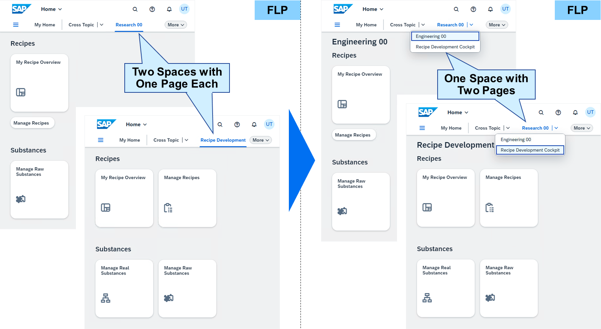
Sometimes users have several spaces with similar title and similar content, because they have similar roles assigned. For example, the sales manager and the sales accountant have overlapping tasks and therefore apps in their spaces. Such spaces can be merged to combine their pages in one transient space at runtime. This means that the merged space is not visible in the _Manage Launchpad Spaces_ app, but just for the user in the FLP having all spaces assigned.
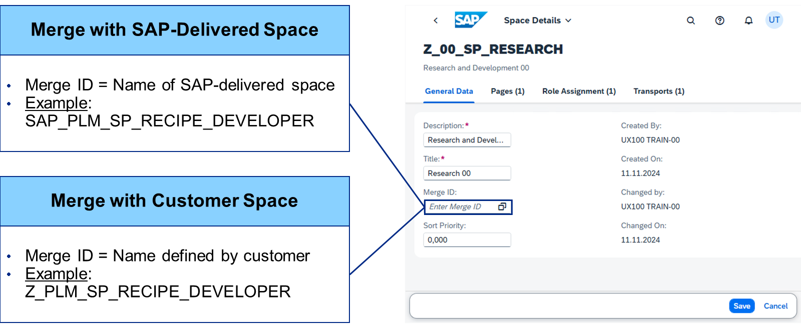
Customer spaces can be merged with other customer spaces or with an SAP space. For the second one, you enter the name of the SAP space in the _Merge ID_ field in the _General Data_ tab of the customer space. When merging customer spaces, you can define an own name for the merged space and enter it as _Merge ID_ in all spaces you want to merge.
Hint
The space title is defined by the space with the lowest sort priority.
## Merge Launchpad Pages
Let's watch a video to learn about Merging Launchpad Pages.
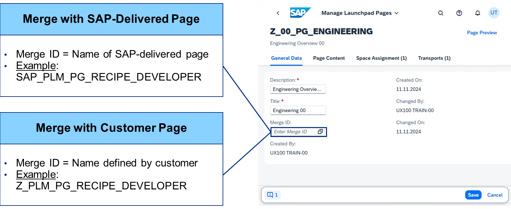
Customer pages can be merged with other customer pages or with an SAP page. For the second one, you enter the name of the SAP page in the _Merge ID_ field in the _General Data_ tab of the customer page. When merging customer pages, you can define an own name for the merged page and enter it as _Merge ID_ in all pages you want to merge.
You can only merge pages, which are in the same space. Transient spaces merged at runtime count, too. This allows you to add additional apps to an SAP space without modifying it:
  1. Define a customer page and add apps to it.
  2. Define a customer space. and add the customer page to the it.
  3. Merge the customer space with an SAP space.
  4. Merge the customer page with an SAP page of the SAP space.

Users having the customer and SAP space assigned only see one space with one page with all apps of both pages.
Note
The page title is defined by the first page in the space. If more than one space is involved, the first page in the space with the lowest sort priority defines the page title.
## Merge SAP Fiori Spaces and Pages
### Business Example
You want to merge an SAP Fiori space and page with an SAP-delivered space and page.

Solution:
    SAP_UX100_SP_S_MERGE (Space)     SAP_UX100_PG_S_MERGE (Page)
Note
This exercise requires an SAP Learning system. Login information is provided by your system setup guide.
Note
Whenever the values or object names in this exercise include ##, replace ## with the number of your user.
### Prerequisites
Role, space, and page were created in the exercise **Create SAP Fiori Spaces and Pages**.
### Task 1: Assign an SAP-Delivered Space to the Business Role
Exercise[Start Exercise](https://learnsap.enable-now.cloud.sap/pub/mmcp/index.html?show=project!PR_93319C907D9BA68A:uebung)
#### Steps
  1. In the _Role Maintenance_ (PFCG) of your S4H, add the _SAP_PLM_SP_RECIPE_DEVELOPER_ space to the menu of the _Z_##_BR_TRAINING_ role.
    1. In the _Role Maintenance_ (PFCG) of your S4H, edit your **Z_##_BR_TRAINING** role.
    2. Choose the _Menu_ tab.
    3. Expand the _Insert Node_ button.
Hint
The initial value written on the _Insert Node_ button is _Launchpad Catalog_.
    4. Choose _SAP Fiori Launchpad_ → _Launchpad Space_.
    5. In the _Space ID_ field, enter ***recipe*** and use the value help.
    6. In the pop-up, double-click _SAP_PLM_SP_RECIPE_DEVELOPER_.
    7. Choose _Continue_.
    8. Choose _Save_.
  2. Check the tiles of the _Recipe Development_ space in the _SAP Fiori launchpad_ spaces of your S4H.
    1. Reload the _SAP Fiori launchpad_ spaces of your S4H.
    2. Choose the _Recipe Development_ space at the top.
#### Result
The section _Recipes_ with _My Recipe Overview_ and _Manage Recipes_ and the section _Substances_ with _Manage Real Substances_ and _Manage Raw Substances_ are displayed.

### Task 2: Merge a Customer Space with an SAP-Delivered Space
Exercise[Start Exercise](https://learnsap.enable-now.cloud.sap/pub/mmcp/index.html?show=project!PR_FA877FA31BFFC9AA:uebung)
#### Steps
  1. In the _SAP Fiori launchpad_ of your S4H, start the _Manage Launchpad Spaces_ app. Edit the _Z_##_SP_RESEARCH_ space.
    1. In the _SAP Fiori launchpad_ of your S4H, choose the _Manage Launchpad Spaces_ tile.
    2. In the _Search_ field, enter **z_##** and choose **Enter**.
    3. Choose _Edit_ for the _Z_##_SP_RESEARCH_ page.
Hint
The _Edit_ button is the pencil at the end of the line.
  2. Merge the _Z_##_SP_RESEARCH_ space with the **SAP_PLM_SP_RECIPE_DEVELOPER** space.
    1. Choose the _General Data_ tab.
    2. In the _Merge ID_ field, enter **SAP_PLM_SP_RECIPE_DEVELOPER**.
    3. Choose _Save_.
    4. Choose _Navigate to Home_.
  3. Search the _Recipe Development_ space and its _Recipe Development Cockpit_ page in the _SAP Fiori launchpad_ spaces of your S4H.
    1. Reload the _SAP Fiori launchpad_ spaces of your S4H.
    2. Search the _Recipe Development_ space.
#### Result
The _Recipe Development_ space is gone.
    3. Expand the _Research ##_ space.
    4. Choose _Recipe Development Cockpit_.
#### Result
The _Recipe Development Cockpit_ page of the _Recipe Development_ space is now merged in the _Research ##_ space.

### Task 3: Merge a Customer Page with an SAP-Delivered Page
Exercise[Start Exercise](https://learnsap.enable-now.cloud.sap/pub/mmcp/index.html?show=project!PR_D2A00DBB899C45B3:uebung)
#### Steps
  1. In the _SAP Fiori launchpad_ of your S4H, start the _Manage Launchpad Pages_ app. Edit the _Z_##_PG_ENGINEERING_ page.
    1. In the _SAP Fiori launchpad_ of your S4H, choose the _Manage Launchpad Pages_ tile.
    2. In the _Search_ field, enter **z_##** and choose **Enter**.
    3. Choose _Edit_ for the _Z_##_PG_ENGINEERING_ page.
Hint
The _Edit_ button is the pencil at the end of the line.
  2. Merge the _Z_##_PG_ENGINEERING_ page with the **SAP_PLM_PG_RECIPE_DEVELOPER** page.
    1. Choose the _General Data_ tab.
    2. In the _Merge ID_ field, enter **SAP_PLM_PG_RECIPE_DEVELOPER**.
    3. Choose _Save_.
    4. Choose _Navigate to Home_.
  3. Search the _Recipe Development_ space and its _Recipe Development Cockpit_ page in the _SAP Fiori launchpad_ spaces of your S4H.
    1. Reload the _SAP Fiori launchpad_ spaces of your S4H.
    2. Choose _Research ##_.
#### Result
_Manage Recipes_ is displayed as link as defined in _Research ##_ and _Manage Real Substances_ was added in _Substances_ as defined in _SAP_PLM_PG_RECIPE_DEVELOPER_.


### Managing SAP Fiori Catalogs

*Source: https://learning.sap.com/courses/learning-the-basics-of-sap-fiori/managing-sap-fiori-catalogs_ab64715f-a452-43c4-9d99-ae95ec3403fa*

Objective
After completing this lesson, you will be able to manage SAP Fiori catalogs
## Content Model for SAP S/4HANA

In personalization, spaces and pages just visualize tiles or links for calling an application. In customizing and configuration, catalogs define app descriptors consisting of tiles and target mappings. Target Mappings hold all the information needed to actually start an application.
Watch the video explaining the content model since SAP S/4HANA 2023.
The following table outlines the elements that can be distinguished in the content model since SAP S/4HANA 2023:
| Element  | Short  | Naming Schema  | Description  |
| --- | --- | --- | --- |
| Business Role  | BR  | SAP_BR_<role>  | Role for topic  |
| Space  | SP  | SAP_<area>_SP_<topic>  | Tiles for topic  |
| Page  | PG  | SAP_<area>_PG_<task>  | Tiles for daily task  |
| Business Catalog  | BC  | SAP_<area>_BC_<duty>  | Tiles for duty  |
| Standard Catalog  | TC  | SAP_TC_<area>_<subarea>_COMMON  | App descriptors for area  |
| Back-End Catalog  | TC  | SAP_TC_<area>_<subarea>_BE_APPS  | App descriptors for area  |
Time to look at an example of the content model from the _SAP Fiori apps reference library_.
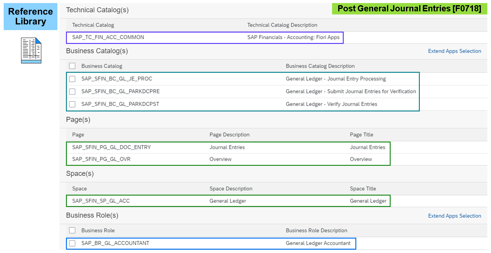
In this example from the _SAP Fiori apps reference library_ , you see content model elements under _Technical Configuration_ , starting with TC and continuing with BCs, PGs, SP, and BR. The names of the BCs describe the duties, the names of the PGs describe the topics, and the name of the SP and BR is the end users role.
## SAP Fiori Launchpad Content Manager
Let's watch a video to learn about the SAP Fiori launchpad content manager.
Settings
## Catalog Management
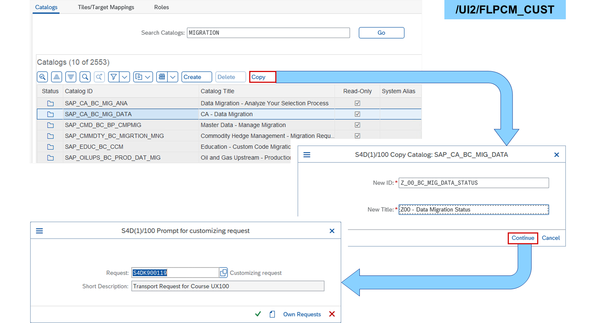
Business catalogs can easily be copied in the _SAP Fiori launchpad content manager_ by selecting a catalog and choosing _Copy_. A customizing or workbench request is mandatory. If you select a technical catalog as copy source, a business catalog will be created. For customer catalogs, the new ID must begin with a Z or Y.
Note
It is recommended to prefix the title of the new catalog with the (solution) area separated from the title by a dash. This groups all business catalogs of the same area together in the app finder of the FLP.
The copied catalog consists of references to tiles and target mappings of the source catalog. It is a good starting point when defining own catalogs to start with referencing a catalog shipped by SAP. If SAP ships a new version of a catalog, all references immediately use the new version.
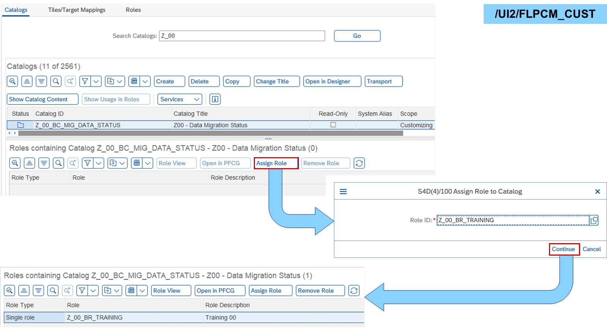
Since SAP S/4HANA 2023, it is possible to assign catalogs to existing roles in the FLPCM directly without opening the PFCG first. The button is visible when showing the usage of a catalog in roles.
## Copy SAP Fiori Catalogs
### Business Example
You want to create an SAP Fiori business catalog by searching and copying an existing one using the _SAP Fiori launchpad content manager_.

Solution:
    SAP_UX100_BC_S_MIG_DATA_STATUS (Business Catalog)
Note
This exercise requires an SAP Learning system. Login information is provided by your system setup guide.
Note
Whenever the values or object names in this exercise include ##, replace ## with the number of your user.
### Prerequisites
The role was created in the exercise **Create SAP Fiori Spaces and Pages**.
### Task 1: Navigate in the SAP Fiori Launchpad Content Manager
Exercise[Start Exercise](https://learnsap.enable-now.cloud.sap/pub/mmcp/index.html?show=project!PR_8C0679E1250E139D:uebung)
#### Steps
  1. In the _SAP Fiori launchpad content manager_ for customizing of your SAP S/4HANA (S4H) system, search for an app about data migration status and check its details.
    1. In the _SAP Easy Access_ menu of your S4H, search for _FLP Content Manager: Client-Specific_ or start transaction /UI2/FLPCM_CUST.
    2. In the _SAP Fiori launchpad content manager_ for customizing, choose the _Tiles/Target Mappings_ tab.
    3. In the _Search Tiles/Target Mappings_ field, enter **data migration** and choose _Go_.
    4. In the _Tile / Target Mapping Combinations_ table, select the _Title/Subtitle/Information_**Data Migration Status**.
    5. Choose _Details_ (Magnifier).
#### Result
All details about the _Data Migration Status_ app are displayed.
    6. In the _Details_ window, choose _Close window_.
  2. For the _Data Migration Status_ app, check its usage in roles. Check the details of the _Configuration Expert - Data Migration_ role.
    1. With _Data Migration Status_ selected, choose _Show Usage in Roles_.
    2. In the _Roles_ table, select the _SAP_BR_CONFIG_EXPERT_DATA_MIG_ role.
    3. Choose _Role View_.
    4. In the _Roles_ table, choose _Open in PFCG_.
#### Result
The _SAP_BR_CONFIG_EXPERT_DATA_MIG_ consists of two catalogs, one space, and one group about data migration.
    5. Choose _Exit_ twice.
  3. Display the content of the central business catalog for data migration.
    1. In the _SAP Fiori launchpad content manager_ for customizing, in the _Catalogs assigned to role SAP_BR_CONFIG_EXPERT_DATA_MIG_ table, select the _SAP_CA_BC_MIG_DATA_ catalog.
    2. Choose _Catalog View_.
    3. If the catalog content is not displayed, choose _Show Catalog Content_.
#### Result
The _SAP_CA_BC_MIG_DATA_ catalog consists of four app descriptors.

### Task 2: Copy and Edit a Catalog in the SAP Fiori Launchpad Content Manager
Exercise[Start Exercise](https://learnsap.enable-now.cloud.sap/pub/mmcp/index.html?show=project!PR_868440F97A2F0F9A:uebung)
#### Steps
  1. In the _SAP Fiori launchpad content manager_ for customizing of your S4H, copy the _SAP_CA_BC_MIG_DATA_ catalog using ID **Z_##_BC_MIG_DATA** and title **Z## - Data Migration Status**.
    1. In the _SAP Fiori launchpad content manager_ for customizing, select the _SAP_CA_BC_MIG_DATA_ catalog.
    2. Choose _Copy_.
    3. In the _New ID_ field, enter **Z_##_BC_MIG_DATA_STATUS**.
    4. In the _New Title_ field, enter **Z## - Data Migration Status**.
    5. Choose _Continue_.
    6. Choose the transport request provided to you.
  2. In the _Z_##_BC_MIG_DATA_STATUS_ catalog, remove the tile and target mapping for the migration cockpit.
    1. In the _Search Catalogs_ field, enter **z_##** and choose _Go_.
    2. In the _Catalogs_ table, select _Z_##_BC_MIG_DATA_STATUS_.
    3. In the _Content in Catalog Z_##_BC_MIG_DATA_STATUS_ table, select _Migrate Your Data - Migration Cockpit / Active Migration Projects_.
    4. Choose _Remove Tiles/Target Mappings_.
    5. In the _Remove References from Catalog_ popup, choose _Continue_.

### Task 3: Assign the Catalog to a Role and Test it in the SAP Fiori Launchpad
Exercise[Start Exercise](https://learnsap.enable-now.cloud.sap/pub/mmcp/index.html?show=project!PR_E4B763C35E1D29D:uebung)
#### Steps
  1. In the _SAP Fiori launchpad content manager_ of your S4H, assign the _Z_##_BC_MIG_DATA_STATUS_ catalog to the _Z_##_BR_TRAINING_ role.
    1. In the _SAP Fiori launchpad content manager_ for customizing, select the _Z_##_BC_MIG_DATA_STATUS_ catalog.
    2. Choose _Show Usage in Roles_.
    3. In the _Roles containing Catalog Z_##_BC_MIG_DATA_STATUS_ table, choose _Assign Role_.
    4. In the _Assign Role to Catalog_ popup, for the _Role ID_ field, open the value help.
    5. In the popup, in the _Single Role_ field, enter **z_##***.
    6. Double-click _Z_##_BR_TRAINING_.
    7. In the _Assign Role to Catalog_ popup, choose _Continue_.
  2. In the _SAP Fiori launchpad_ spaces of your S4H, add the _Data Migration Status_ tile from the _Z## - Data Migration Status_ catalog to your _My Home_ and test it.
    1. Start or reload the _SAP Fiori launchpad_ spaces of your S4H in the client of your choice.
    2. Choose your user in the upper right corner.
    3. In the _User Actions Menu_ , choose _App Finder_.
    4. In the list of catalogs on the left, choose _Z## - Data Migration Status_.
    5. Choose the plus of the _Data Migration Status_ tile.
    6. In the _Select Pages for This Tile_ popup, select _My Home_ and choose _OK_.
    7. Choose _Navigate to Home_.
    8. Choose _Data Migration Status_.
    9. Operate the app as you wish.


### Editing Business Catalogs

*Source: https://learning.sap.com/courses/learning-the-basics-of-sap-fiori/edit-business-catalogs*

Objective
After completing this lesson, you will be able to edit business catalogs.
## SAP Fiori Launchpad Designer
Let's watch a video to learn about the SAP Fiori launchpad designer.
## News Tile

The news tile is a double tile available since the beginning of SAP Fiori. It cycles through the messages of up to 10 news feeds and starts an SAPUI5 app showing all messages as a list. You can adjust the article refresh cycle (for cycling through the messages) and refresh interval (for requesting new messages), and if a default image from the mime repository should be used rather than one from the news feed(s).
The following restrictions apply to the news feeds:
  * External feeds must be cross-origin resource sharing (CORS) compliant.
  * Internal feeds must originate from the same server and port as the _SAP Fiori launchpad_.
Note
A reverse proxy like the SAP Web Dispatcher allows the definition of routing rules to overcome this limitation.
  * The URL format should follow the https://<server>:<port> pattern.
Note
The URLs using feed:// are not supported.
  * The UI5 URL validation requires the tilde "~" character to be replaced by the sequence "~".


An empty news tile is delivered by SAP in the business catalog /UI2/SAPNewsTile as a template. Copy the catalog in the FLPCM or FLPD to the customer namespace and edit it in the FLPD.
To copy a catalog in the FLPD, drag the catalog from the list of catalogs to the then appearing drop area _New Catalog with References_. After copying, just click on the news tile to edit it.
## Edit Business Catalogs
### Business Example
You want to create an SAP Fiori business catalog by copying an existing one in the _SAP Fiori launchpad content manager_ and edit it using the _SAP Fiori launchpad designer_.

Solution:
    SAP_UX100_BC_S_NEWS (Business Catalog)
Note
This exercise requires an SAP Learning system. Login information is provided by your system setup guide.
Note
Whenever the values or object names in this exercise include ##, replace ## with the number of your user.
### Prerequisites
The role was created in the exercise **Create SAP Fiori Spaces and Pages**.
### Task 1: Copy the News Catalog in the SAP Fiori Launchpad Content Manager
Exercise[Start Exercise](https://learnsap.enable-now.cloud.sap/pub/mmcp/index.html?show=project!PR_52B3E4782862E1B3:uebung)
#### Steps
  1. In the _SAP Fiori launchpad content manager_ for customizing of your S4H, copy the _/UI2/SAPNewsTile_ catalog using ID **Z_##_BC_NEWS** and title **Z## - News Tile**.
    1. In the _SAP Easy Access_ menu of your S4H, search for _FLP Content Manager: Client-Specific_ or start transaction /UI2/FLPCM_CUST.
    2. In the _SAP Fiori launchpad content manager_ for customizing, in the _Search Catalogs_ field, enter **news**.
    3. Select the _/UI2/SAPNewsTile_ catalog.
    4. Choose _Copy_.
    5. In the _New ID_ field, enter **Z_##_BC_NEWS**.
    6. In the _New Title_ field, enter **Z## - News Tile**.
    7. Choose _Continue_.
    8. Choose the transport request provided to you.

### Task 2: Edit a News Tile in the SAP Fiori Launchpad Designer
Exercise[Start Exercise](https://learnsap.enable-now.cloud.sap/pub/mmcp/index.html?show=project!PR_EA5ABD6F5477C6B9:uebung)
#### Steps
  1. In the _SAP Fiori launchpad content manager_ for customizing of your SAP S/4HANA (S4H) system, open the _Z_##_BC_NEWS_ in the _SAP Fiori launchpad designer_ for customizing and assign a transport request in the settings.
Note
Close the _SAP Fiori launchpad content manager_ to release the lock.
    1. In the _SAP Fiori launchpad content manager_ for customizing of your S4H, select the _Z_##_BC_NEWS_ catalog.
    2. Choose _Open in Designer_.
    3. Close the _SAP Fiori launchpad content manager_.
    4. In the _SAP Fiori launchpad designer_ for customizing, choose _Settings_ (gearwheel) in the upper right corner.
    5. In the _Assign Transport Request_ popup, deselect the _None (Local Object)_ checkbox.
    6. In the _Customizing Request_ dropdown, select the transport request provided to you.
    7. Choose _OK_.
  2. In the _SAP Fiori launchpad designer_ for customizing of your S4H, add **https://blog.sap-press.com/rss.xml** as feed to the _News Tile_ of your **Z## - News Tile** catalog.
Caution
If you get an error when saving the catalog, close the _SAP Fiori launchpad content manager_ to release the lock.
    1. In the _SAP Fiori launchpad designer_ for customizing of your S4H, choose the _News Tile_ showing the text _No articles to display_.
    2. In the _Feed #1_ field, enter **https://blog.sap-press.com/rss.xml**.
    3. Choose _Save_.
    4. In the _Confirmation_ popup about breaking the reference, choose _OK_.
Caution
If you get an error when saving the catalog, close the _SAP Fiori launchpad content manager_ to release the lock.

### Task 3: Assign the News Catalog to a Role and Test it in the SAP Fiori Launchpad
Exercise[Start Exercise](https://learnsap.enable-now.cloud.sap/pub/mmcp/index.html?show=project!PR_97DFEE461546DABA:uebung)
#### Steps
  1. In the _SAP Fiori launchpad content manager_ for customizing of your S4H, assign the _Z_##_BC_NEWS_ catalog to the _Z_##_BR_TRAINING_ role.
    1. In the _SAP Fiori launchpad content manager_ for customizing, select the _Z_##_BC_NEWS_ catalog.
    2. Choose _Show Usage in Roles_.
    3. In the _Roles containing Catalog Z_##_BC_NEWS_ table, choose _Assign Role_.
    4. In the _Assign Role to Catalog_ popup, for the _Role ID_ field, open the value help.
    5. In the popup, in the _Single Role_ field, enter **z_##***.
    6. Double-click _Z_##_BR_TRAINING_.
    7. In the _Assign Role to Catalog_ popup, choose _Continue_.
  2. In the _SAP Fiori launchpad_ spaces of your S4H, add the news tile from the _Z## - News Tile_ catalog to the _General_ page of the _Cross Topic_ space and test it.
    1. Start or reload the _SAP Fiori launchpad_ spaces of your S4H in the client of your choice.
    2. Choose your user in the upper right corner.
    3. In the _User Actions Menu_ , choose _App Finder_.
    4. In the list of catalogs on the left, choose _Z## - News Tile_.
    5. Choose the plus of the news tile.
    6. In the _Select the Pages for This Tile_ popup, select _Cross Topic_ → _General_ and choose _OK_.
    7. Choose _Navigate to Home_.
    8. Choose the _Cross Topic_ space.
    9. Choose the news tile.
    10. Operate the app as you wish.


### Creating Business Catalogs

*Source: https://learning.sap.com/courses/learning-the-basics-of-sap-fiori/creating-business-catalogs_d633c222-3ab4-4e10-8fb8-8db1d2688541*

Objective
After completing this lesson, you will be able to create business catalogs.
## Intent-Based Navigation
The most important part of a tile is its navigation information, which contains an intent that connects to a target mapping.
Watch this video to learn about intent-based navigation.
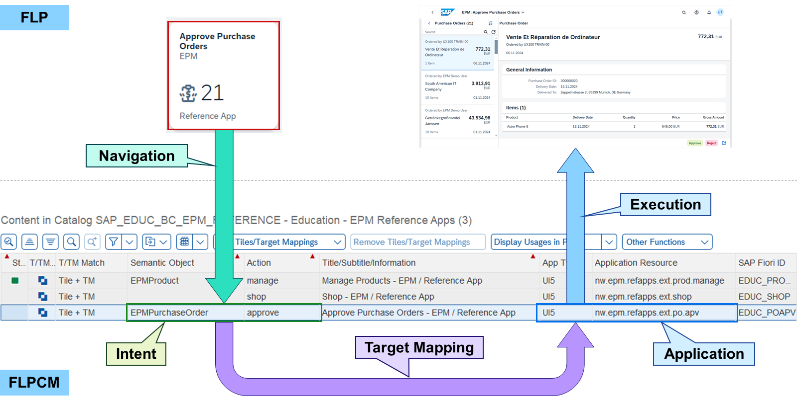
Target mappings contain the information about which app to start, with what parameters, and on what device types. They are identified by its intent, the combination of semantic object and action. If the user chooses a tile, the intent-based navigation defined in the tile is started. The suitable target mapping then calls the target app that is defined.
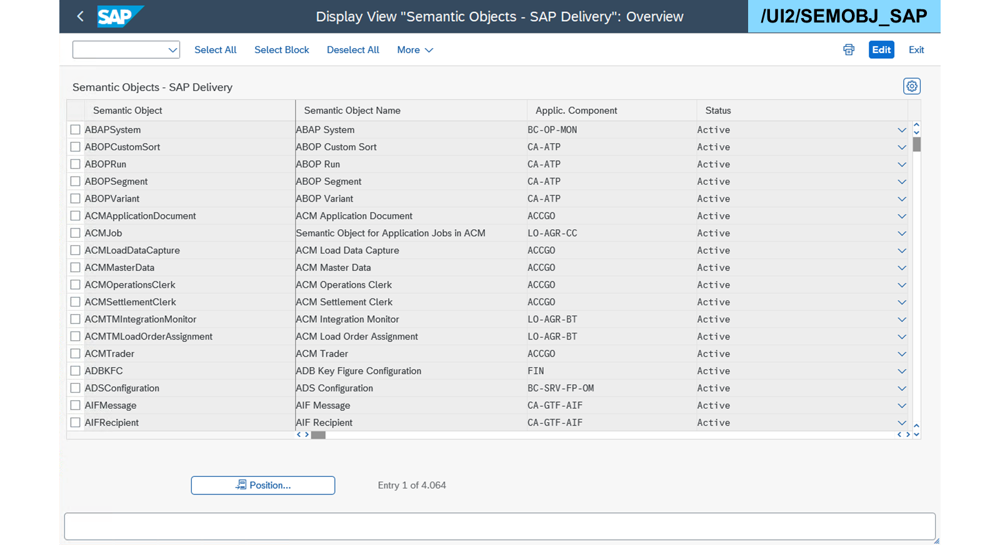
A semantic object represents a business entity such as a customer, a sales order, or a product. Using semantic objects bundles applications that reflect a specific scenario. They allow referring to business entities in a standardized way, abstracting from concrete implementations. A list of all semantic objects delivered by SAP can be accessed using the transaction /UI2/SEMOBJ_SAP. If customers want to define their own semantic objects, they can do so using the transaction /UI2/SEMOBJ. By defining an entry with the same key, customers can overwrite the attributes of a semantic object delivered by SAP.
## References in Catalogs
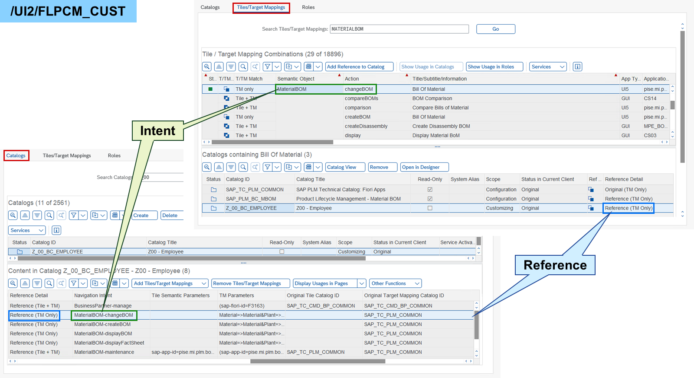
SAP delivers numerous catalogs containing many tiles and target mappings. All definitions are tested and distinguished, for example, the different device types the app is working in or include dynamic information in the tiles. All of these can also be referenced in other catalogs such as a new one created by a customer.
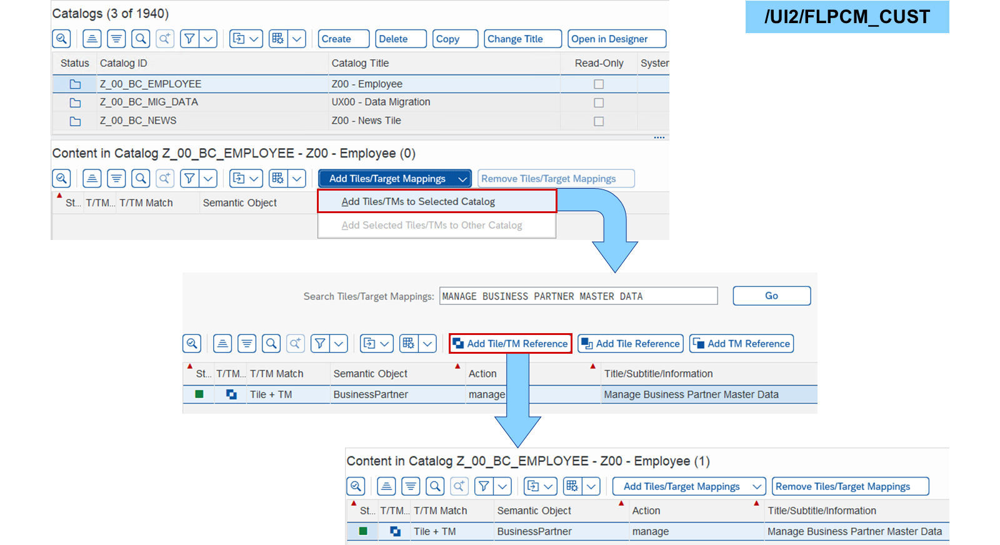
To create a reference to a tile and target mapping in the _SAP Fiori launchpad content manager_ , choose _Add Tiles/Target Mappings_ in the target catalog. In the next screen, search for the app you want to reference in all catalogs of the system. You can create a reference just for the tile, the target mapping, or both.
## Reference Tiles and Target Mappings
### Business Example
You want to create an SAP Fiori business catalog and reference tiles and target mappings from other catalogs.

Solution:
    SAP_UX100_BC_S_EMPLOYEE (Business Catalog)
Note
This exercise requires an SAP Learning system. Login information is provided by your system setup guide.
Note
Whenever the values or object names in this exercise include ##, replace ## with the number of your user.
### Prerequisites
The role was created in the exercise **Create SAP Fiori Spaces and Pages**.
### Task 1: Create a Business Catalog in the SAP Fiori Launchpad Content Manager
Exercise[Start Exercise](https://learnsap.enable-now.cloud.sap/pub/mmcp/index.html?show=project!PR_733425A4F4662E9E:uebung)
#### Steps
  1. In the _SAP Fiori launchpad content manager_ for customizing of your SAP S/4HANA (S4H) system, create the catalog **Z_##_BC_EMPLOYEE** with the title **Z## - Employee**.
    1. In the _SAP Easy Access_ menu of your S4H, search for _FLP Content Manager: Client-Specific_ or start transaction /UI2/FLPCM_CUST.
    2. Choose _Create_.
    3. In the _Create Catalog_ popup, in the _New ID_ field, enter **Z_##_BC_EMPLOYEE**.
    4. In the _New Title_ field, enter **Z## - Employee**.
    5. Choose _Continue_.
    6. Choose the transport request provided to you.

### Task 2: Reference Tiles and Target Mappings in the SAP Fiori Launchpad Content Manager
Exercise[Start Exercise](https://learnsap.enable-now.cloud.sap/pub/mmcp/index.html?show=project!PR_6547326F8EF8398D:uebung)
#### Steps
  1. In the _SAP Fiori launchpad content manager_ for customizing of your S4H, in your _Z## - Employee_ catalog, add the tile and target mapping for the app _Manage Business Partner Master Data_.
    1. In the _SAP Fiori launchpad content manager_ for customizing of your S4H, in the _Content in Catalog Z_##_BC_EMPLOYEE_ table, choose _Add Tiles/Target Mappings_ → _Add Tiles/TMs to Selected Catalog_.
    2. In the _Search Tiles/Target Mappings_ field, enter **business partner master** and choose _Go_.
    3. In the _Tiles/Target Mappings Combinations_ table, select the _Action_**manage**.
    4. Choose _Add Tile/TM Reference_.
  2. To your _Z## - Employee_ catalog, add all tiles and target mappings that meet the following conditions:
| Condition  | Value  |
| --- | --- |
| Technical Catalog  | SAP_TC_PLM_COMMON  |
| Semantic Object  | MaterialBOM  |
| SAP Fiori ID  | F1813  |
    1. In the _Search Catalogs_ field, enter **tc_plm** and choose _Go_.
    2. Select _SAP_TC_PLM_COMMON_.
    3. In the _Content in Catalog SAP_TC_PLM_COMMON_ table, choose _Set Filter..._ (Funnel).
    4. In the _Filter_ popup, in the _Column Set_ , double-click _Semantic Object_.
    5. Choose _Define Values_.
    6. For the _Semantic Object_ field, open the value help.
    7. In the popup, double-click _MaterialBOM_.
    8. Choose _Execute_ (Check mark).
    9. Select the _SAP Fiori ID_ column.
    10. Choose _Sort in Ascending Order_.
    11. Select all lines with _SAP Fiori ID_ _F1813_.
    12. Choose _Add Tiles/Target Mappings_ → _Add Selected Tiles/TMs to Other Catalog_.
    13. In the _Search Catalogs_ field, enter **z_##** and choose _Go_.
    14. Select _Z_##_BC_EMPLOYEE_.
    15. Choose _Add Tile/TM Reference_.
    16. In the _Content in Catalog Z_##_BC_EMPLOYEE_ table, choose _Set Filter..._ → _Delete Filter_.

### Task 3: Assign the Employee Catalog to a Role and Test it in the SAP Fiori launchpad
Exercise[Start Exercise](https://learnsap.enable-now.cloud.sap/pub/mmcp/index.html?show=project!PR_9AD42E02BE7EFFAC:uebung)
#### Steps
  1. In the _SAP Fiori launchpad content manager_ for customizing of your S4H, assign the _Z_##_BC_EMPLOYEE_ catalog to the _Z_##_BR_TRAINING_ role.
    1. In the _SAP Fiori launchpad content manager_ for customizing, select the _Z_##_BC_EMPLOYEE_ catalog.
    2. Choose _Show Usage in Roles_.
    3. In the _Roles containing Catalog Z_##_BC_EMPLOYEE_ table, choose _Assign Role_.
    4. In the _Assign Role to Catalog_ popup, for the _Role ID_ field, open the value help.
    5. In the popup, in the _Single Role_ field, enter **z_##***.
    6. Double-click _Z_##_BR_TRAINING_.
    7. In the _Assign Role to Catalog_ popup, choose _Continue_.
  2. In the _SAP Fiori launchpad_ spaces of your S4H, add the _Manage Business Partner Master Data_ and _Maintain Bill Of Material_ tiles from the _Z## - Employee_ catalog to your _My Home_ and test them.
    1. Start or reload the _SAP Fiori launchpad_ spaces of your S4H in the client of your choice.
    2. Choose your user in the upper right corner.
    3. In the _User Actions Menu_ , choose _App Finder_.
    4. In the list of catalogs on the left, choose _Z## - Employee_.
    5. Choose the plus of the _Maintain Bill Of Material_ tile.
    6. In the _Select Pages for This Tile_ popup, select _My Home_ and choose _OK_.
    7. Choose the plus of the _Manage Business Partner Master Data_ tile.
    8. In the _Select Pages for This Tile_ popup, select _My Home_ and choose _OK_.
    9. Choose _Navigate to Home_.
    10. Operate the apps as you wish.


### Adapting Technical Catalogs

*Source: https://learning.sap.com/courses/learning-the-basics-of-sap-fiori/creating-target-mappings_d1c22426-3f4a-44f1-aea8-810992c4833d*

Objective
After completing this lesson, you will be able to adapt technical catalogs.
## SAP Fiori Launchpad Application Manager
Let's watch the video to learn about the SAP Fiori launchpad application manager.
## Catalog and Application Types

With the introduction of the _SAP Fiori launchpad application manager (FLPAM)_ , catalog types were also introduced. Until then, business and technical catalogs were just semantic interpretations of SAP Fiori catalogs. These are now called none-typed catalogs, defining tiles and target mappings per client (customizing) or cross-client (configuration). The transport object type is Web Dynpro Component Configuration (WDCC) and the according tool is the _SAP Fiori launchpad designer (FLPD)_.
Before the introduction of catalog types, only the back-end catalog differed in its structure on a technical level, by defining app descriptors instead of separated tiles and target mappings. Back-end catalogs are always cross-client (configuration) and are available since SAP_UI 7.51. The transport object type is User Interface App Descriptors (UIAD) tagged with the catalog name, and the corresponding tool is the _Mass Maintenance for App Descriptors_.
With SAP_UI 7.55 SP01, most technical catalogs are standard catalogs. They are always cross-client (configuration) and define app descriptors instead of separated tiles and target mappings. The transport object type is User Interface App Catalog (UIAC) consisting of User Interface App Descriptors (UIAD) and the according tool is the FLPAM. UIAC is a development object visible in development tools (ADT, SE80) making it easier to find and organize catalogs, for example, in transport requests. Therefore, it is recommend using standard catalogs as soon as possible.
Although also introduced with SAP_UI 7.55 SP01, replicable catalogs were reserved for use in a future release then. They are nearly identical to standard catalogs (UIAC with UIAD in FLPAM) but are replicable like the back-end catalogs. With SAP_UI 7.58, the replicable catalogs were deprecated. There are still some delivered by SAP, but it is no longer possible to create new ones.

In parallel to catalog types, application types were introduced as cross-client setting. In an embedded deployment, all application types are allowed in technical catalogs. In a central hub deployment, standard catalogs consist of SAPUI5 Fiori apps (for BTP), URL apps, and tiles without target mappings in the front-end server (FES). Back-end catalogs in the back-end server (BES) consist of Web Dynpro ABAP applications, WebClient UI applications, and ABAP transactions. The transaction /UI2/APPDESC_GET in the FES is used to replicate back-end catalogs from BES as remote catalogs to the FES.

Catalog and application types are defined cross-client via the implementation guide. Transaction /UI2/CUST can be used to access the UI parts of the implementation guide directly. For an embedded deployment, it is recommended not to define any application type. This allows the use of any application type in technical catalogs.

For an embedded deployment, **Standard Catalog** is recommended as the only catalog type. This means, only standard catalogs can be defined in the FLPAM. When setting **Standard Catalog** and **Replicable Catalog** , FLPAM offers the catalog types as a dropdown during creation.
## Technical Catalog Adaptation

The adaptation mode in the FLPAM allows you to make (limited) adaptations in the launchpad app descriptor items (LADI) of SAP-delivered technical catalogs. The changes are directly available in all references in business catalogs.
Switching to the adaptation mode adds the _Adaptation_ tab to the details of a LADI. Enlarge the tab and choose _Edit_ : You can now select the _Adapt_ checkbox for each property you want and enter your adaptation in the input field behind. Adapted values can be translated using the SE63.
Note
Logging in to a certain language allows you to adapt directly in the target language.
By using the transaction /UI2/FLPAM_ADAPT or the suitable tile in the SAP_BASIS_BC_UI_FLA catalog, the FLPAM can be started directly in the adaptation mode. This may come in handy if users should only be allowed to adapt, but not to change or create technical catalogs.
## Adapt Technical Catalogs
### Business Example
You want to adapt a tile in a standard catalog shipped by SAP using the adaptation mode of the _SAP Fiori launchpad application manager_.

Template:
    SAP_TC_UX100_T_ADAPTATION (Standard Catalog)
Note
This exercise requires an SAP Learning system. Login information is provided by your system setup guide.
Note
Whenever the values or object names in this exercise include ##, replace ## with the number of your user.
### Prerequisites
A business catalog was created in exercise **Reference Tiles and Target Mappings**.
### Task 1: Reference a Template App in the SAP Fiori Launchpad Content Manager and Add it to Your My Home
Exercise[Start Exercise](https://learnsap.enable-now.cloud.sap/pub/mmcp/index.html?show=project!PR_78733FA87EA561A3:uebung)
#### Steps
  1. In the _SAP Fiori launchpad content manager_ for customizing of your SAP S/4HANA (S4H) system, add the tile and target mapping for the app _My Benefits ##_ from the catalog _SAP_TC_UX100_T_ADAPTATION_.
    1. In the _SAP Easy Access_ menu of your S4H, search for _FLP Content Manager: Client-Specific_ or start transaction /UI2/FLPCM_CUST.
    2. In the _SAP Fiori launchpad content manager_ for customizing of your S4H, in the _Search Catalogs_ field, enter **tc_ux100** and choose _Go_.
    3. Select the _SAP_TC_UX100_T_ADAPTATION_ catalog.
    4. In the _Content in Catalog SAP_TC_UX100_T_ADAPTATION_ table, select the _Action_**display##**.
    5. Choose _Add Tiles/Target Mappings_ → _Add Selected Tiles/TMs to Other Catalog_.
    6. In the _Search Catalogs_ field, enter **z_##** and choose _Go_.
    7. Select _Z_##_BC_EMPLOYEE_.
    8. Choose _Add Tile/TM Reference_.
  2. In the _SAP Fiori launchpad_ spaces of your S4H, add the _My Benefits ##_ tile from the _Z## - Employee_ catalog to your _My Home_.
    1. Start or reload the _SAP Fiori launchpad_ spaces of your S4H in the client of your choice.
    2. Choose your user in the upper right corner.
    3. In the _User Actions Menu_ , choose _App Finder_.
    4. In the list of catalogs on the left, choose _Z## - Employee_.
    5. Choose the plus of the _My Benefits ##_ tile.
    6. In the _Select Pages for This Tile_ popup, select _My Home_ and choose _OK_.
    7. Choose _Navigate to Home_.
#### Result
The _My Benefits ##_ is now part of the favorite apps.

### Task 2: Adapt the Tile Title of an App in the SAP Fiori Launchpad Application Manager
Exercise[Start Exercise](https://learnsap.enable-now.cloud.sap/pub/mmcp/index.html?show=project!PR_8AFBB61331F27AB7:uebung)
#### Steps
  1. In the _SAP Fiori launchpad application manager_ for customizing of your S4H, open the _SAP_TC_UX100_T_ADAPTATION_ catalog in adaptation mode and change the title of _My Benefits ##_ to **Benefit Plans ##**.
Note
Only one user can adapt a catalog at a time.
Note
If you do not see a list of catalogs but just two input fields, execute the last task of the exercise **Create Replicable Catalogs** :
Allow Standard and Replicable Catalogs as Catalog Types in an ABAP System.
    1. In the _SAP Fiori launchpad content manager_ for customizing of your S4H, select the _SAP_TC_UX100_T_ADAPTATION_ catalog.
    2. Choose _Open in SAP Fiori Launchpad App Manager_.
    3. In the _SAP Fiori launchpad application manager_ , select the _Action_**display##**.
    4. Choose _Switch to Adaptation Mode_.
    5. In the _Details_ section, choose the _Adaptation_ tab.
    6. Choose _Maximize_ on the right.
    7. Choose _Edit_ at the top.
    8. In the _Select Transport Request_ popup, choose the transport request provided to you.
    9. Choose _OK_.
    10. In the _Adapt_ column, select the checkbox for _Title_.
    11. In the _New Field Value_ field behind the checkbox, enter **Benefit Plans ##**.
    12. Choose _Save_.
    13. Choose _Leave Adaptation Mode_.
#### Result
For the _Benefit Plans ##_ app, the checkbox _Adapted_ is set.
  2. In the _SAP Fiori launchpad_ spaces of your S4H, check if there is a tile _Benefit Plans ##_ in your _My Home_.
    1. Start or reload the _SAP Fiori launchpad_ spaces of your S4H in the client of your choice.
    2. Check your favorites in your _My Home_.
#### Result
The _My Benefits ##_ was renamed to _Benefit Plans ##_.


### Creating Technical Catalogs

*Source: https://learning.sap.com/courses/learning-the-basics-of-sap-fiori/creating-technical-catalogs_aaedcee4-2e13-4ab5-b2f3-21402b9fdf87*

Objective
After completing this lesson, you will be able to create technical catalogs.
## Technical Catalog Maintenance
Watch the video to understand more about technical catalog maintenance.
## SAPUI5 App Descriptor Elements
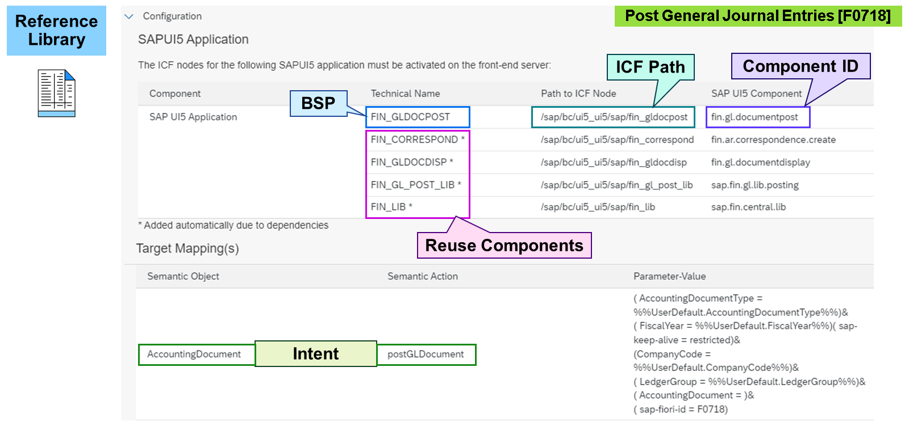
In this example from the _SAP Fiori apps reference library_ , you see the technical name known as Business Server Page (BSP) of the SAPUI5 application, the ICF path, and the SAPUI5 component ID. For the target mapping, you see the semantic object and action forming the intent.
SAPUI5 apps can consist of multiple SAPUI5 components. One central component is the core of the app and represents the starting point. All other components are referenced or reused in this central component. The idea is that these other components consist of features and functions also valid or even needed for other apps. Therefore, these components are called reuse components.
Hint
The _SAP Fiori apps reference library_ offers an own filter for reuse components.
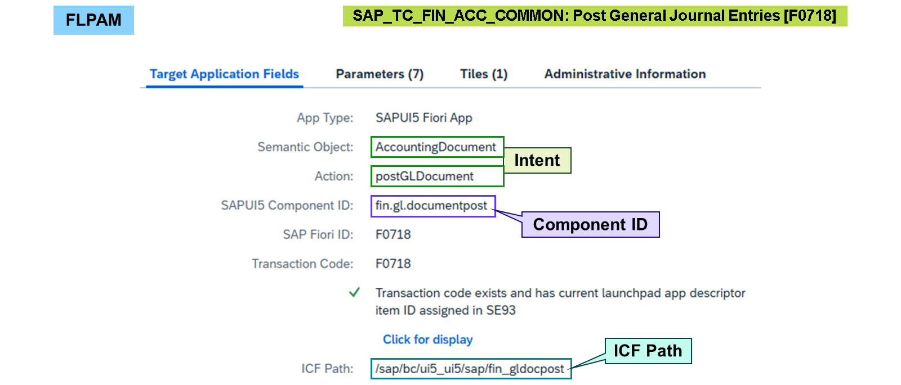
In the _SAP Fiori launchpad application manager (FLPAM)_ , the intent, component ID, and ICF path can be found in the _Target Application Fields_ of an app descriptor. The application type _SAPUI5 Fiori App_ is set as the target.
### ICF Path
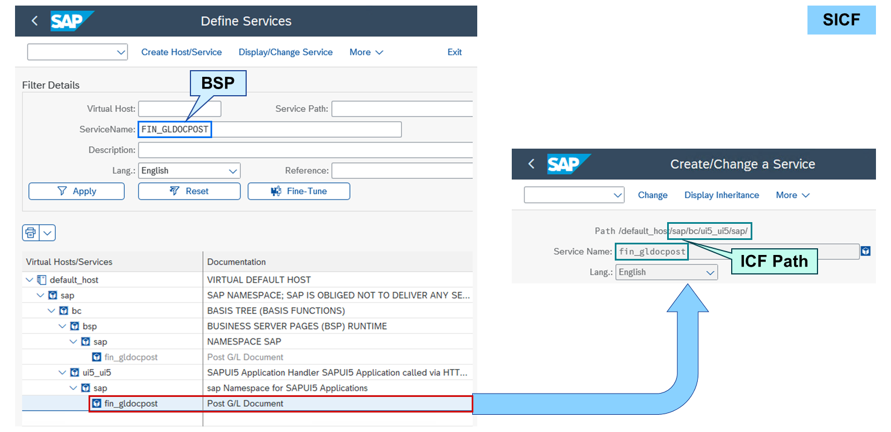
In the SICF, the BSP name can be used as a filter for the _Service Name_. There will be two hits: One under the node _ui5_ui5_ and another one under the node _bsp_ , which can be ignored.
### SAPUI5 Component
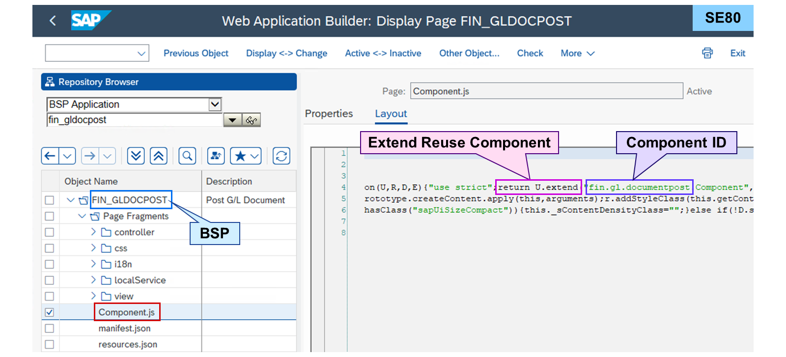
An SAPUI5 app is saved as a BSP in the FES. The central file of an SAP Fiori app based on SAPUI5 is Component.js. Here, in most cases, a reuse component is extended using return <component>.extend. The path behind this statement is the component ID.
Hint
The same statement is used to extend apps delivered by SAP in the customer namespace.
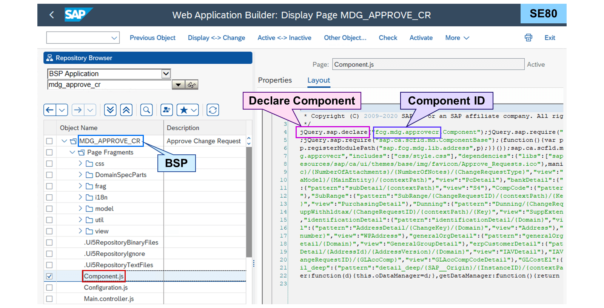
If the first statement in the Component.js is jQuery.sap.declare, the app consists of this one component and no other component is reused. There is no return <component>.extend. So, in that case, the component ID is behind of jQuery.sap.declare.
### Transaction Code
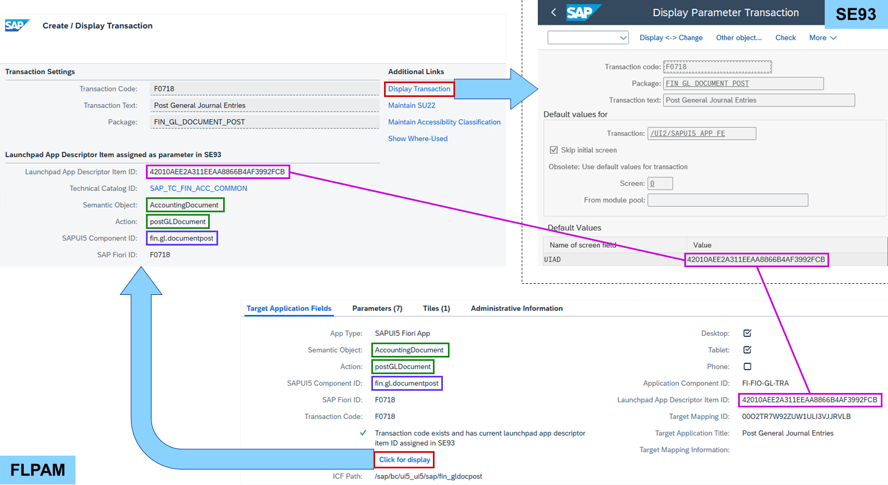
Since SAP S/4HANA 2021, it is possible to create and assign transaction codes to app descriptors. This allows you to expose your FLP content to _SAP Build Work Zone, standard edition_ and use the transaction codes as app IDs.
For launchpad app descriptor items of type _SAPUI5 Fiori App_ , you can create the transaction code in the FLPAM using the _Click for creation_ hyperlink. In read-only mode, this hyperlink changes to _Click for display_. Using these transactions allows customers to define their own app IDs in the customer namespace. Therefore, customer transactions must start with Z.
For Web Dynpro, Web Client UI, and URL apps, the transaction codes must be created manually in the SE93:
| Parameter  | Value  |
| --- | --- |
| _Transaction Type_  | **Transaction with parameters**  |
| _Default values for Transaction_  |  **/UI2/UIAD_APP** (Web Dynpro, Web Client UI) **/UI2/REMOTE_APP_FE** (URL)  |
| _GUI Support_  |  **SAP GUI for Java** **SAP GUI for Windows**  |
| _Default Values - Name of screen field_  | **UIAD**  |
| _Default Values - Value_  | (Launchpad App Descriptor Item ID)  |
## Tile Types
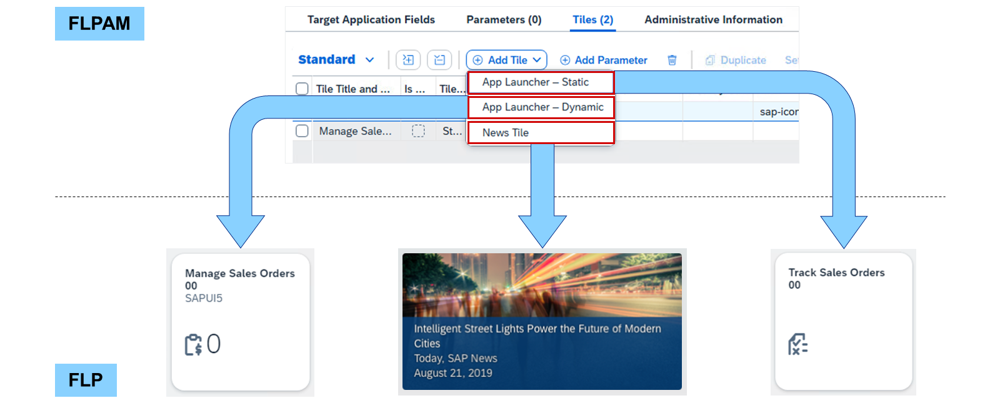
There are three different types of tile in SAP Fiori:
  * The _App Launcher – Static_ or just static tile consists of a title and subtitle, an icon, keywords for search, and general information.
  * The _App Launcher – Dynamic_ or just dynamic tile has, in addition, the possibility to show a dynamic number. This number originates from an OData service request, providing a natural number such as a number of data sets. The refresh interval of the number can also be set.
  * The _News_ tile has the special purpose of showing news from Really Simple Syndication (RSS) feeds. It is twice as large as the other two tiles and shows a preview of the feeds listed in its tile definition. When you choose the tile, the news app starts showing all elements of the underlying RSS feeds.
Note
For more information about the news tile, please read SAP Note [2990265](https://me.sap.com/notes/2990265) – _News Tile application not displaying existing configured feed urls after moving to higher release or after the SP upgrade_.

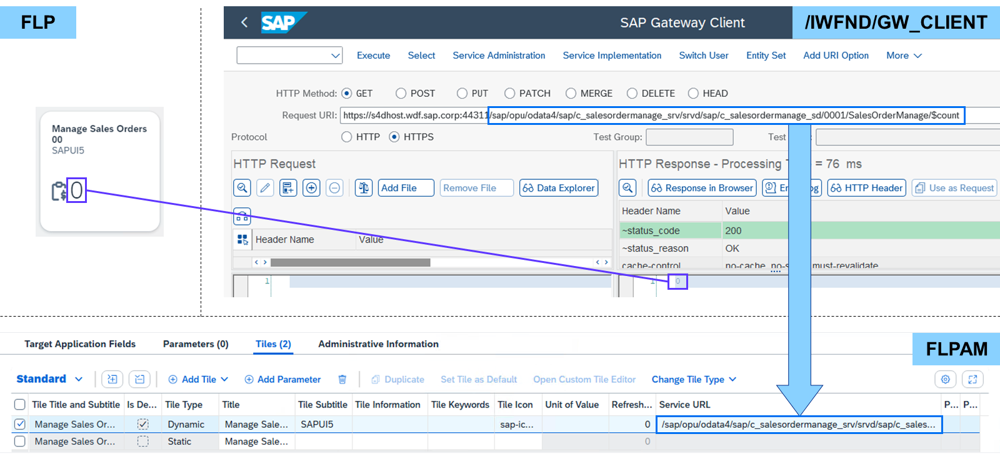
There is no check for correctness of the OData service URL of a dynamic tile in the FLPAM. Therefore, you should test the URL in another tool before copying it in the _Service URL_ field.
Open the _SAP Gateway Client_ (/IWFND/GW_CLIENT) and enter the OData request in the _Request URI_ field, which should provide the data for the tile. If the status code is 200 and meaning full data is shown in the response body, you may copy and paste the URI without the server and port in the _Service URL_ field of the tile.
## How to Research Configuration Details in SAP Fiori Apps Reference Library
### Business Example
You want to open the _SAP Fiori apps reference library_ and search for technical details of apps used to define app descriptors in standard catalogs.
Watch the video to see how to research configuration details in the _SAP Fiori apps reference library_.
Settings
## Create Standard Catalogs
### Business Example
You want to create a standard catalog with app descriptors for SAPUI5 applications.

Solution:
    SAP_TC_UX100_S_SD_COMMON (Standard Catalog)
Note
This exercise requires an SAP Learning system. Login information is provided by your system setup guide.
Note
Whenever the values or object names in this exercise include ##, replace ## with the number of your user.
### Prerequisites
A business catalog was created in exercise **Reference Tiles and Target Mappings**.
### Task 1: Search an App in a Standard Catalog in the SAP Fiori Launchpad Application Manager
Exercise[Start Exercise](https://learnsap.enable-now.cloud.sap/pub/mmcp/index.html?show=project!PR_EC19B0C0716F3DA4:uebung)
#### Steps
  1. In the _SAP Fiori launchpad application manager_ of your SAP S/4HANA (S4H) system, search for the _Track Sales Orders_ app in the **SAP_TC_CEC_SD_COMMON** catalog. Note down the _SAP Fiori ID_.
SAP Fiori ID:_______________________________________________________________
Note
If you do not see a list of catalogs but just two input fields, execute the last task of the exercise **Create Replicable Catalogs** :
Allow Standard and Replicable Catalogs as Catalog Types in an ABAP System.
    1. In the _SAP Fiori launchpad_ of your S4H, choose the _Launchpad App Manager_ tile or start transaction /UI2/FLPAM.
    2. In the _Technical Catalog ID_ field, enter ***cec*** and choose _Go_.
    3. In the _Technical Catalogs_ table, choose the _SAP_TC_CEC_SD_COMMON_ catalog.
    4. Choose _Search_ (Magnifier) on the top right.
    5. In the _Search for_ field, enter **track sales orders** and choose **Enter**.
    6. Note down the _SAP Fiori ID_**F2577**.
    7. Close the Web browser tab.

### Task 2: Create a Standard Catalog and Copy an App Descriptor in the SAP Fiori Launchpad Application Manager
Exercise[Start Exercise](https://learnsap.enable-now.cloud.sap/pub/mmcp/index.html?show=project!PR_97B85454C7C04AAC:uebung)
#### Steps
  1. In the _SAP Fiori launchpad application manager_ of your S4H, create the empty standard catalog **Z_##_TC_SD_COMMON** with title **Z## - Sales and Distribution** as local object.
    1. In the _SAP Fiori launchpad application manager_ , choose _New Technical Catalog_.
    2. In the _Technical Catalog ID_ field, enter **Z_##_TC_SD_COMMON**.
    3. In the _Technical Catalog Title_ field, enter **Z## - Sales and Distribution**.
    4. From the _Technical Catalog Type_ dropdown, select **Standard Catalog**.
    5. Select _Create empty technical catalog only_.
    6. Choose _Local Object_.
  2. Copy the _Track Sales Orders_ app to your _Z_##_TC_SD_COMMON_ catalog using the _SAP Fiori ID_ that you noted down. Change the action to **trackStatus##** and the tile title to **Track Sales Orders ##**.
    1. In the _Search Term_ field, enter **z_##** and choose _Go_.
    2. In the _Technical Catalogs_ table, choose _Z_##_TC_SD_COMMON_.
    3. Choose _Copy from Other Technical Catalog_.
    4. In the _Select Transport Request_ popup, choose _Local Object_.
    5. In the _Copy from Other Technical Catalog_ popup, choose _Adapt Filters_.
    6. In the _Adapt Filters_ popup, select _SAP Fiori ID_ and choose _OK_.
    7. In the _SAP Fiori ID_ field, enter **F2577** and choose _Go_.
    8. Select the _Semantic Object_**SalesOrder** with _Action_**trackStatus** and choose _Copy_.
#### Result
The warning _Transaction code exists but has a different launchpad app descriptor item ID assigned in SE93_. Unless you change the target application, this is fine.
    9. Close the warning message.
    10. In the _Action_ field, enter **trackStatus##**.
    11. In the _Details_ section, choose the _Tiles_ tab.
    12. In the _Title_ field, enter **Track Sales Orders ##**.
    13. Choose the _Target Application Fields_ tab.
    14. Choose _Save_.

### Task 3: Create an App Descriptor for an SAPUI5 Application in the SAP Fiori Launchpad Application Manager
Exercise[Start Exercise](https://learnsap.enable-now.cloud.sap/pub/mmcp/index.html?show=project!PR_1033F1D92F541D86:uebung)
#### Steps
  1. In the _SAP Fiori launchpad application manager_ of your S4H, add an SAPUI5 Fiori app descriptor for the _Manage Sales Orders - Version 2_ app in your _Z_##_TC_SD_COMMON_ catalog using the following values:
| Field  | Value  |
| --- | --- |
| _Semantic Object_  | **SalesOrder**  |
| _Action_  | **manage##**  |
| _App Type_  | **SAPUI5 Fiori App**  |
| _SAPUI5 Component ID_  | **cus.sd.salesorderv2.manage**  |
| _ICF Path_  | **/sap/bc/ui5_ui5/sap/sd_sov2_mans1**  |
    1. In the _SAP Fiori launchpad application manager_ of your S4H, choose _Add App_ → _SAPUI5 Fiori App_.
    2. In the _Target Application Fields_ tab, enter the following values:
| Field  | Value  |
| --- | --- |
| _Semantic Object_  | **SalesOrder**  |
| _Action_  | **manage##**  |
    3. Open the value help for _SAPUI5 Component ID_.
    4. In the popup, in the _SAPUI5 Component ID_ field, enter **cus.sd.salesorder*** and choose _Go_.
    5. Select _Manage Sales Orders - Version 2_.
    6. Choose _Save_.
#### Result
The warning _Transaction code is not entered_ is displayed. This is solved in the next step.
    7. Close the warning message.
  2. For the _Manage Sales Orders ##_ app, create the transaction code **Z##_F3893**.
    1. Choose _Edit_ in the upper left.
    2. In the _SAP Fiori ID_ field, enter **Z##_F3893**.
    3. For the _Transaction Code_ , choose _Click for creation_.
    4. In the _Warning_ popup, choose _OK_.
    5. In the _Create / Display Transaction_ window, choose _Create Transaction_.
    6. Close the _Create / Display Transaction_ window.
    7. Choose _Save_.

### Task 4: Create a Dynamic Tile in an App Descriptor in the SAP Fiori Launchpad Application Manager
Exercise[Start Exercise](https://learnsap.enable-now.cloud.sap/pub/mmcp/index.html?show=project!PR_8F42423D4923BB9B:uebung)
#### Steps
  1. In the _SAP Fiori launchpad application manager_ of your S4H, add a dynamic tile as default to your _Manage Sales Orders ##_ app using the following values:
| Field  | Value  |
| --- | --- |
| _Title_  | **Manage Sales Orders ##**  |
| _Tile Subtitle_  | **SAPUI5**  |
| _Tile Icon_  | **sales-order**  |
| _Service Root URI_  | **/sap/opu/odata4/sap/c_salesordermanage_srv/srvd/sap/c_salesordermanage_sd/0001/SalesOrderManage/$count**  |
    1. In the _SAP Fiori launchpad application manager_ of your S4H, in the _Details: SalesOrder-manage##_ pane, choose the _Tiles_ tab.
    2. In the _Tiles_ table, choose _Add Tile_ → _App – Launcher Dynamic_.
    3. In the new table entry, enter the following values:
| Field  | Value  |
| --- | --- |
| _Title_  | **Manage Sales Orders ##**  |
| _Tile Subtitle_  | **SAPUI5**  |
    4. For the _Tile Icon_ field, open the value help.
    5. In the popup, in the _Search_ field, enter **sales**.
    6. Select _sales-order_.
    7. Choose _Set Tile as Default_.
    8. Choose _Save_.
  2. To create a valid _Service URL_ for the dynamic tile, request the number of sales orders provided by the OData V4 services _C_SALESORDERMANAGE_SD_ of the service group _C_SALESORDERMANAGE_SRV_ in the _SAP Gateway Client_.
    1. In the _SAP Easy Access_ screen, search for _SAP Gateway Service Administration_ or start transaction /IWFND/V4_ADMIN.
    2. Expand _Service Groups_ on the left.
    3. Double-click _C_SALESORDERMANAGE_SRV_.
    4. In the _C_SALESORDERMANAGE_SRV_ table, select _C_SALESORDERMANAGE_SD_.
    5. Choose _Service Test_.
    6. In the _SAP Gateway Client_ , select _HTTPS_ as _Protocol_.
    7. Choose _Entity Set_.
    8. In the _Entity Sets_ popup, double-click _SalesOrderManage_.
    9. In the _Request URI_ field, replace ?sap-statistics with **/$count**.
    10. Choose _Execute_.
#### Result
There are **0** sales orders.
  3. Insert the valid request URI in the _Service URL_ field of the dynamic tile.
    1. In the _SAP Fiori launchpad application manager_ of your S4H, in the _Z_##_TC_SD_COMMON_ catalog, choose _Edit_ in the upper left.
    2. For the dynamic tile of your _Manage Sales Orders ##_ app, in the _Service URL_ field, enter **/sap/opu/odata4/sap/c_salesordermanage_srv/srvd/sap/c_salesordermanage_sd/0001/SalesOrderManage/$count**.
Hint
Copy the URI from the _SAP Gateway Client_ omitting the server information.
    3. Choose _Save_.

### Task 5: Reference Tiles and Target Mappings in a Business Catalog and Test it in the SAP Fiori Launchpad
Exercise[Start Exercise](https://learnsap.enable-now.cloud.sap/pub/mmcp/index.html?show=project!PR_804CA62C952208C:uebung)
#### Steps
  1. In the _SAP Fiori launchpad content manager_ for customizing of your S4H, create a reference for tiles and target mappings of _Track Sales Orders ##_ and _Manage Sales Order ##_ of the _Z_##_TC_SD_COMMON_ catalog in your catalog _Z_##_BC_EMPLOYEE_.
    1. Re-/Start the _SAP Fiori launchpad content manager_ for customizing of your S4H.
    2. In the _Search Catalogs_ field, enter **z_##** and choose _Go_.
    3. In the _Catalogs_ table, select the _Z_##_TC_SD_COMMON_ catalog.
    4. In the _Content in Catalog Z_##_TC_SD_COMMON_ table, select the _Track Sales Orders ##_ and _Manage Sales Order ##_ apps.
    5. Choose _Add Tiles/Target Mappings_ → _Add Selected Tiles/TMs to Other Catalog_.
    6. In the _Search Catalogs_ field, enter **z_##** and choose _Go_.
    7. In the _Catalogs_ table, select the _Z_##_BC_EMPLOYEE_ catalog.
    8. Choose _Add Tile/TM Reference_.
  2. In the _SAP Fiori launchpad_ spaces of your S4H, add the _Track Sales Orders ##_ and _Manage Sales Orders ##_ tiles from the _Z## - Employee_ catalog to the _General_ page of the _Cross Topic_ space and test them.
    1. Start or reload the _SAP Fiori launchpad_ spaces of your S4H in the client of your choice.
    2. Choose your user in the upper right corner.
    3. In the _User Actions Menu_ , choose _App Finder_.
    4. In the list of catalogs on the left, choose _Z## - Employee_.
    5. Choose the plus of the _Manage Sales Orders ##_ tile.
    6. In the _Select Pages for This Tile_ popup, select _Cross Topic_ → _General_ and choose _OK_.
    7. Choose the plus of the _Track Sales Orders ##_ tile.
    8. In the _Select Pages for This Tile_ popup, select _Cross Topic_ → _General_ and choose _OK_.
    9. Choose _Navigate to Home_.
    10. Choose _Cross Topic_ → _General_.
    11. Operate the apps as you wish.


### Creating Replicable Catalogs

*Source: https://learning.sap.com/courses/learning-the-basics-of-sap-fiori/creating-replicable-catalogs_d1507705-2068-4216-ad0d-0078df478459*

Objective
After completing this lesson, you will be able to create replicable catalogs.
## Replicable Catalog Maintenance
Watch the video to understand how back-end catalogs are created.
Settings
Back-end catalogs are called _None-typed Replicable Catalogs_ , because no catalog type is defined in the system and they must be replicated to a front-server to be usable as source for business catalogs. A replication is a kind of extraction of the app descriptors as tiles and target mappings in a remote catalog. Independent of the deployment scenario, a system alias for classic applications must be assigned to the back-end or replicable catalog for the replication to work.
## System Alias for Classic Applications

System aliases for classic applications are delivered by SAP and distinguished by solution area. They are viewable in the maintenance view **/UI2/V_SYSALIAS** using the _View Maintenance_ (transaction SM30). For each one an RFC (<alias>_RFC) and HTTPS (<alias>_HTTPS) destination should be created in the _Configuration of RFC Connections_ ( transaction SM59).
If several aliases point to the same system such as an SAP S/4HANA, the maintenance view **/UI2/V_ALIASMAP** can be used to map these aliases to a target system alias, which can be defined freely.

If customers want to define their own aliases, they can define them in the maintenance view **/UI2/VC_SYSALIAS**. These can also be mapped to a target system alias using the maintenance view **/UI2/V_ALIASMAP** or an RFC (<alias>_RFC) and HTTPS (<alias>_HTTPS) destination should be created in the SM59.
Since SAP Fiori rapid activation in an embedded deployment, the destinations FIORI_CLASSIC_UI_RFC and FIORI_CLASSIC_UI_HTTPS are generated in SM59. An empty target system alias for a source system alias in **/UI2/V_ALIASMAP** is then sufficient to forward the request correctly.
## Catalog Replication

Each back-end and replicable catalog needs a system alias for classic applications assigned. It is needed for the replication to the front-end server. System alias assignments for back-end catalogs delivered by SAP can be found in the maintenance view **/UI2/V_ALIASCAT**. Customers can assign system aliases to their back-end catalogs in the maintenance view **/UI2/VC_ALIASCAT**.

To replicate back-end and replicable catalogs to the front-end server (FES), SAP provides the following transactions:

/UI2/APPDESC_GET
    Replicates all back-end and replicable catalogs referenced in selected business catalogs.

/UI2/APPDESC_GET_ALL
    Replicates all back-end and replicable catalogs for all system aliases.

/UI2/APPDESC_GET_DEV
    Replicates selected back-end and replicable catalogs for selected system alias.
The transactions are called on the FES. In all transactions, you can choose between a full or delta replication. A _Testmode_ allows a test run before replicating anything.
Hint
The transaction /UI2/APPDESC_GET_DEV was introduced in SAP S/4HANA 2020. If it is not available in your system, start the report /UI2/GET_APP_DESCR_REMOTE_DEV via transaction SA38.
## Create Replicable Catalogs
### Business Example
You want to use the _SAP Fiori launchpad application manager_ to create a back-end catalog with app descriptors for ABAP transactions.

Solution:
    SAP_TC_UX100_S_CMD_BE_APPS (Replicable Catalog)
Note
This exercise requires an SAP Learning system. Login information is provided by your system setup guide.
Note
Whenever the values or object names in this exercise include ##, replace ## with the number of your user.
### Prerequisites
The business catalog was created in the exercise **Reference Tiles and Target Mappings**.
### Task 1: Allow Back-End Catalogs as Catalog Types in an ABAP System
Exercise[Start Exercise](https://learnsap.enable-now.cloud.sap/pub/mmcp/index.html?show=project!PR_9F841FA15466108F:uebung)
#### Steps
  1. In the _Customizing of UI Technologies_ of your SAP S/4HANA (S4H) system, check which catalog types are allowed.
    1. In the _SAP Easy Access_ screen, search for _Customizing of UI Technologies_ or start transaction /UI2/CUST.
    2. Expand _SAP Fiori_ → _Setting Up Launchpad Content_ → _Setting Up Technical Catalogs_.
    3. For _Maintain Allowed Catalog Types for Launchpad App Manager_ , choose _IMG - Activity_ (Clock with check mark).
    4. In the _Information_ popup, choose _Continue_.
#### Result
The allowed catalog types are displayed.
  2. If there is any catalog type set in the table, delete all entries. This will only allow back-end catalogs.
Note
Only one user can set the catalog types at a time.
    1. Choose _Select All_.
    2. Choose _Delete_.
    3. In the _Information_ popup, choose _Continue_.
    4. Choose _Save_.
    5. Choose the transport request provided to you.

### Task 2: Create a Back-End Catalog and App Descriptor in the SAP Fiori Launchpad Application Manager
Exercise[Start Exercise](https://learnsap.enable-now.cloud.sap/pub/mmcp/index.html?show=project!PR_6B09C6B9EC26C9D:uebung)
#### Steps
  1. In the _SAP Fiori launchpad application manager_ of your S4H, create the back-end catalog **Z_##_TC_CMD_BE_APPS** as local object.
    1. In the _SAP Fiori launchpad_ of your S4H, choose the _Launchpad App Manager_ tile or start transaction /UI2/FLPAM.
#### Result
The warning _Only back-end app types are allowed in the system_.
    2. In the _Technical Catalog ID_ field, enter **Z_##_TC_CMD_BE_APPS**.
    3. Choose _Continue_.
    4. Choose _Edit_.
    5. In the _Select Transport Request_ popup, choose _Local Object_.
  2. Insert the transaction _Display Material_ (MM03) with the semantic object **Material** and action **display##** in your catalog. Add a static tile with _Title_**Display Material ##**.
    1. Choose _Other Functions_ → _Multiselect Transactions_.
    2. In the _Select Transactions_ popup, in the _Transaction Code_ field, enter **mm0*** and choose _Go_.
    3. In the list of _Items_ , select the checkbox for _MM03_ and choose _OK_.
    4. In the _Semantic Object_ field, enter **Material**.
    5. In the _Action_ field, enter **display##**.
    6. In the _Details_ pane, choose the _Tiles_ tab under the table.
    7. In the _Title_ field, replace the _&_ with **##**.
    8. Choose _Save_.

### Task 3: Assign an Alias to the Back-End Catalog and Replicate it
Exercise[Start Exercise](https://learnsap.enable-now.cloud.sap/pub/mmcp/index.html?show=project!PR_F24E954550E548B0:uebung)
#### Steps
  1. In the View Maintenance (SM30) of your S4H, assign the alias **S4CMD** and add transaction codes to your catalog **Z_##_TC_CMD_BE_APPS** (**Z## - Customer Master Data: Replication**) in the view **/UI2/VC_ALIASCAT**.
Note
Only one user can assign an alias to a catalog at a time.
    1. In the _SAP Easy Access_ menu of your S4H, search for _View Maintenance_ or start transaction SM30.
    2. In the _Table/View_ field, enter **/UI2/VC_ALIASCAT**.
    3. Choose _Edit_.
    4. In the _Information_ popup, choose _Continue_.
    5. Choose _New Entries_ and enter the following values:
| Field  | Value  |
| --- | --- |
| _Catalog ID_  | **Z_##_TC_CMD_BE_APPS**  |
| _Alias_  | **S4CMD**  |
| _Add TCode_  | **checked**  |
| _Catalog Title_  | **Z## - Customer Master Data (Replication)**  |
    6. Choose _Save_.
    7. Choose the transport request provided to you.
    8. Choose _Exit_.
  2. In _Replication of App Descriptor_ (/UI2/APPDESC_GET_DEV) of your S4H, replicate your catalog **Z_##_TC_CMD_BE_APPS** to your S4H using the alias **S4CMD**
    1. In the _SAP Easy Access_ menu of your S4H, search for _Replication of App Descriptor_ or start transaction /UI2/APPDESC_GET_DEV.
    2. In the _Replication System Alias_ field, enter **S4CMD**.
    3. In the _Back-End Technical Catalog ID_ field, enter **Z_##_TC_CMD_BE_APPS**.
    4. From the _Replication Mode_ dropdown, select **Full replication**.
    5. Deselect the _Testmode_ checkbox.
    6. Choose _Execute_.
#### Result
The catalog _Z_##_TC_CMD_BE_APPS_ was extracted successfully.

### Task 4: Reference the Tile and Target Mapping in a Business Catalog and Test it in the SAP Fiori Launchpad
Exercise[Start Exercise](https://learnsap.enable-now.cloud.sap/pub/mmcp/index.html?show=project!PR_EF2F75FDA19ABB9D:uebung)
#### Steps
  1. In the _SAP Fiori launchpad content manager_ for customizing of your S4H, create a reference for tile and target mapping of _Display Material ##_ of the _Z_##_TC_CMD_BE_APPS_ catalog in your catalog _Z_##_BC_EMPLOYEE_.
    1. In the _SAP Easy Access_ menu of your S4H, search for _FLP Content Manager: Client-Specific_ or start transaction /UI2/FLPCM_CUST.
    2. In the _Search Catalogs_ field, enter **z_##** and choose _Go_.
    3. In the _Catalogs_ table, select the _Z_##_TC_CMD_BE_APPS_ catalog.
    4. In the _Content_ table, select the _Display Material ##_ app.
    5. Choose _Add Tiles/Target Mappings_ → _Add Selected Tiles/TMs to Other Catalog_.
    6. In the _Search Catalogs_ field, enter **z_##** and choose _Go_.
    7. In the _Catalogs_ table, select the _Z_##_BC_EMPLOYEE_ catalog.
    8. Choose _Add Tile/TM Reference_.
  2. In the _SAP Fiori launchpad_ spaces of your S4H, add the _Display Material ##_ tile from the _Z## - Employee_ catalog to the _General_ page of the _Cross Topic_ space and test it.
    1. Start or reload the _SAP Fiori launchpad_ spaces of your S4H in the client of your choice.
    2. Choose your user in the upper right corner.
    3. In the _User Actions Menu_ , choose _App Finder_.
    4. In the list of catalogs on the left, choose _Z## - Employee_.
    5. Choose the plus of the _Display Material ##_ tile.
    6. In the _Select Pages for This Tile_ popup, select _Cross Topic_ → _General_ and choose _OK_.
    7. Choose _Navigate to Home_.
    8. Choose _Cross Topic_ → _General_.
    9. Operate the app as you wish.

### Task 5: Allow Standard and Replicable Catalogs as Catalog Types in an ABAP System
Exercise[Start Exercise](https://learnsap.enable-now.cloud.sap/pub/mmcp/index.html?show=project!PR_931012280B8CAD96:uebung)
#### Steps
  1. In the _Customizing of UI Technologies_ of your SAP S/4HANA (S4H) system, check which catalog types are allowed.
    1. In the _SAP Easy Access_ screen, search for _Customizing of UI Technologies_ or start transaction /UI2/CUST.
    2. Expand _SAP Fiori_ → _Setting Up Launchpad Content_ → _Setting Up Technical Catalogs_.
    3. For _Maintain Allowed Catalog Types for Launchpad App Manager_ , choose _IMG - Activity_ (Clock with check mark).
    4. In the _Information_ popup, choose _Continue_.
#### Result
The allowed catalog types are displayed.
  2. If there is no catalog type set in the table, add _Standard Catalog_ and _Replicable Catalog_ to the list.
Note
Only one user can set the catalog types at a time.
    1. Choose _New Entries_.
    2. In the first dropdown of the _Type_ column, select _Standard Catalog_.
    3. In the second dropdown of the _Type_ column, select _Replicable Catalog_.
    4. Choose _Save_.
    5. If asked, choose the transport request provided to you.

[Continue to quiz](https://learning.sap.com/courses/learning-the-basics-of-sap-fiori/content-management)


### Quiz

*Source: https://learning.sap.com/courses/learning-the-basics-of-sap-fiori/content-management*

It's time to put what you've learned to the test, get 8 right to pass this unit.
1.
### What are the catalog types in SAP Fiori?
There are three correct answers.
Replicable
Custom
Standard
Front-end
Back-end
2.
### Which element groups SAP Fiori apps based on business duty?
Choose the correct answer.
Business Role
Space
Business Catalog
Technical Catalog
3.
### What needs to be assigned to a back-end catalog for the replication to a front-end server?
Choose the correct answer.
HTTP connection
RFC connection
Gateway alias
System alias
4.
### You can only merge pages, which are in the same space.
Choose the correct answer.
True
False
5.
### No catalog type must be set to enable back-end catalog maintenance in the SAP Fiori launchpad application manager.
Choose the correct answer.
True
False
6.
### Which elements of SAP Fiori can be assigned to business roles?
There are three correct answers.
Spaces
Pages
Business Catalog Groups
Technical Catalogs
Business Catalogs
7.
### Which tool can be used to edit tiles in a business catalog?
Choose the correct answer.
SAP Fiori launchpad designer
SAP Fiori launchpad content manager
SAP Fiori launchpad application manager
8.
### What can be used as a target in a target mapping?
There are four correct answers.
Web Dynpro application
Generic URL
ABAP Transaction
SAPUI5 application
9.
### What do you enter as Merge ID in a customer space, if you want to merge the space with an SAP-delivered one?
Choose the correct answer.
The name of the SAP-delivered space
The name of the customer space
The name of the transient space
10.
### The SAP Fiori launchpad designer can only be used for customizing.
Choose the correct answer.
True
False
Submit answers[Next unit](https://learning.sap.com/courses/learning-the-basics-of-sap-fiori/migrating-sap-fiori-groups)


### Content Migration

*Source: https://learning.sap.com/courses/learning-the-basics-of-sap-fiori/migrating-sap-fiori-groups*

Objective
After completing this lesson, you will be able to migrate SAP Fiori Groups.
## Group Migration to Spaces
SAP Fiori groups are deprecated. Let's watch some more details about migrating your groups to spaces:
Settings
### Create Pages from Groups App

_Create Pages from Groups_ is an FLP app based on SAPUI5. It allows to search for groups based on their ID and name or based on roles the groups are assigned to. Every group in the groups table can be expanded to show details like the tiles and links of the group including their intent and source catalog. The columns of the table can be adjusted using the settings button above the table.
Hint
If the icon for expanding a group is not visible, increase the size of the table, for example, via the button in the upper right corner.

To add a group as section to a page, select a group from the _Groups_ table on the left and drag and drop it on the _Page Sections_ table on the right. Once a group was added, it stays on the right until deleted or the app is closed. Other groups can be searched and displayed on the left and again added as page section. Choose _Move Up_ or _Move Down_ to sort the sections.
When the page sections look fine, a new page can be created migrating all added groups to sections in the new page including all tiles and links. The page can then be opened in the _Manage Launchpad Pages_ app to start editing. Finally, adding the page to a space can be done in the _Manage Launchpad Spaces_ app.
## Create SAP Fiori Pages from Groups
### Business Example
You want to include an SAP Fiori group as section on a new SAP Fiori page.

Template:
    SAP_UX100_BCG_T_MIGRATION (Group)

Solution:
    SAP_UX100_SP_S_FINANCE (Space)     SAP_UX100_PG_S_FIN_MANAGER (Page)
Note
This exercise requires an SAP Learning system. Login information is provided by your system setup guide.
Note
Whenever the values or object names in this exercise include ##, replace ## with the number of your user.
### Prerequisites
The role was created in exercise **Create SAP Fiori Spaces and Pages**.
### Task 1: Create a Space and Assign it to a Role
Exercise[Start Exercise](https://learnsap.enable-now.cloud.sap/pub/mmcp/index.html?show=project!PR_3FB9B07380A276AE:uebung)
#### Steps
  1. In _SAP Fiori launchpad_ of your SAP S/4HANA (S4H) system, start the _Manage Launchpad Spaces_ app. Create a space using the following values:
| Field  | Value  |
| --- | --- |
| _Space ID_  | **Z_##_SP_FINANCE**  |
| _Space Description_  | **Financial Management ##**  |
| _Space Title_  | **Finance ##**  |
    1. In _SAP Fiori launchpad_ of your S4H, choose the _Manage Launchpad Spaces_ tile.
    2. Choose _Create_.
    3. In the _Create Space_ popup, enter the following values:
| Field  | Value  |
| --- | --- |
| _Space ID_  | **Z_##_SP_FINANCE**  |
| _Space Description_  | **Financial Management ##**  |
| _Space Title_  | **Finance ##**  |
    4. In the _Transport_ field, select the transport request provided to you.
    5. Choose _Create_.
    6. Choose _Save_.
    7. Choose _Navigate to Home Page_.
  2. In the _Role Maintenance_ (PFCG) of your S4H, add the _Z_##_SP_FINANCE_ space to the menu of the _Z_##_BR_TRAINING_ role.
    1. In the _Role Maintenance_ (PFCG) of your S4H, edit your **Z_##_BR_TRAINING** role.
    2. Choose the _Menu_ tab.
    3. Expand the _Insert Node_ button.
Hint
The initial value written on the _Insert Node_ button is _Launchpad Catalog_.
    4. Choose _SAP Fiori Launchpad_ → _Launchpad Space_.
    5. In the _Space ID_ field, enter **z_##*** and use the value help.
    6. In the dialog box, double-click _Z_##_SP_FINANCE_.
    7. Choose _Continue_.
    8. Choose _Save_.

### Task 2: Include a Group as a Section in a New Page
Exercise[Start Exercise](https://learnsap.enable-now.cloud.sap/pub/mmcp/index.html?show=project!PR_25DAEB64424422B2:uebung)
#### Steps
  1. In _SAP Fiori launchpad_ of your S4H, start the _Create Launchpad Pages from Groups_ app. Include the _SAP_UX100_BCG_T_MIGRATION_ group as a section in a new page with the following values:
| Field  | Value  |
| --- | --- |
| _Page ID_  | **Z_##_PG_FIN_MANAGER**  |
| _Page Description_  | **Financial Manager ##**  |
| _Page Title_  | **Manager ##**  |
    1. In _SAP Fiori launchpad_ of your S4H, start the _Create Launchpad Pages from Groups_ app.
    2. In the _Group ID_ field, enter ***ux100***.
    3. Choose _Go_ on the right-hand side.
    4. In the _Groups_ table, select _SAP_UX100_BCG_T_MIGRATION_.
    5. Drag and drop _SAP_UX100_BCG_T_MIGRATION_ from _Groups_ to _Page Sections_.
    6. Choose _Create Page_.
    7. In the _Create Page_ popup, enter the following values:
| Field  | Value  |
| --- | --- |
| _Page ID_  | **Z_##_PG_FIN_MANAGER**  |
| _Page Description_  | **Financial Manager ##**  |
| _Page Title_  | **Manager ##**  |
    8. Choose _Save_.
  2. In the _Manage Launchpad Pages_ app, check the content of the _Z_##_PG_FIN_MANAGER_ page.
    1. Start the _Manage Launchpad Pages_ app.
    2. In the _Search_ field, enter **z_##** and choose **Enter**.
    3. Choose the _Z_##_PG_FIN_MANAGER_ page.
    4. Check the tiles of the section _Financial Management ##_.

### Task 3: Test the Page in the SAP Fiori Launchpad
Exercise[Start Exercise](https://learnsap.enable-now.cloud.sap/pub/mmcp/index.html?show=project!PR_12BD9200B67A378D:uebung)
#### Steps
  1. In _SAP Fiori launchpad_ of your S4H, assign the _Z_##_PG_FIN_MANAGER_ page to the _Z_##_SP_FINANCE_ space.
    1. In _SAP Fiori launchpad_ of your S4H, on the _Z_##_PG_FIN_MANAGER_ page, choose the _Space Assignment_ tab.
    2. Choose _Manage Launchpad Spaces_.
    3. Choose _Z_##_SP_FINANCE_.
    4. Choose _Edit_.
    5. In the _Search for pages_ field, enter **z_##**.
    6. For the _Z_##_PG_FIN_MANAGER_ page, choose _Add_.
    7. Choose _Save_.
  2. Check if the _Finance ##_ space with all tiles and links are part of the _SAP Fiori launchpad_ spaces of your S4H.
    1. Reload the _SAP Fiori launchpad_ spaces of your S4H.
    2. Choose the _Finance ##_ space at the top.
    3. Operate the apps as you wish.


### Migrating None-Typed Technical Catalogs

*Source: https://learning.sap.com/courses/learning-the-basics-of-sap-fiori/migrating-none-typed-technical-catalogs*

Objective
After completing this lesson, you will be able to migrate None-Typed Technical Catalogs.
## Process of Technical Catalog Migration
With the introduction of standard catalogs, none-typed catalogs should no longer be used as technical source. Let's watch some more details about migrating your none-typed catalogs to standard catalogs:
Settings

SAP provides a _Migration of Technical Catalogs_ tool set and a migration process. The process consists of three core phases and a preparation pre-phase. Each phase is linked to a catalog status:

Preparation
    None-typed technical catalogs must fulfill a number of requirements before they can be migrated. Catalogs not ready for migration require manual cleanup. For more details, please read SAP Note [3397026](https://me.sap.com/notes/3397026) – _SAP Fiori Launchpad - Technical Catalog Migration - Content Cleanup Risks_.

Phase 1
    Catalogs listed as ready for migration can be migrated right away by creating a standard catalog. Some catalogs may require further assignments like setting a default tile, something which is not possible in a none-typed catalog.

Phase 2
    If catalogs are ready for text migration, the none-typed catalogs have translated texts. These are migrated in this phase to the new standard catalogs. The phase is skipped if no texts exist. If the texts are not in the development but a separate translation system, this phase must be performed there.

Phase 3
    At this point in time, the migrated catalogs and their texts exist twice in the system. To solve this, the source catalogs, which are ready for catalog deletion, must be deleted.
After phase 3, the migration is finished. Standard catalogs created via this migration process get the status Migration Finished.

The entry point for technical catalog migration is the _Migration of Technical Catalogs_ (/UI2/MGR_TC) transaction. Beside a documentation of the migration process, it provides a table of catalogs and their tiles and target mappings in the system, which can be filtered by the migration status.
The catalog table shows for each catalog its status concerning the migration process like ready or not ready for migration. If a catalog is not relevant for migration, it does not provide any original tiles or target mappings. Hence, it is a business catalog consisting of references.
The tiles and target mappings table provides details like semantic object and action and, most importantly, details about the migration issues, why a catalog is not ready for migration. To solve these issues, the catalog must be edited in other tools like the _SAP Fiori launchpad content manager (FLPCM)_.
## Technical Catalog Migration
### Preparation: Clean Up Catalogs
There could be several reasons, why a catalog is not ready for migration. These are some of the more common issues:

Content Error
    The content checks for typed catalogs are more restrictive as for none-typed catalogs. A warning in a none-typed one could be an error in a typed one. For the details of the error, open the catalog in the FLPCM and choose _Other Functions_ → _Show Status Details_ for the erroneous tile/target mapping.

Not Original

All tiles and target mappings in the catalog must be originals, not references to other catalogs. Either delete the references or save them as originals deleting the reference source. Not deleting the reference source will lead to a content error.
Caution
By deleting the reference source, all potential references in other catalogs will be lost. These references should be rerouted to the new originals before deleting the old ones.

Unsupported ID

The catalog ID must meet the following criteria:
  * maximum length of 35 characters
  * begins with "Z", "Y", or an editable customer namespace
  * only contains permissible characters:
    * Uppercase letters (A-Z)
    * Numbers (0-9)
    * Underscore (_)
    * Slash (/) in the beginning and the end of a namespace

Because the catalog ID cannot be changed, the catalog must be copied using an ID meeting all of the criteria above. After copying, the new catalog will only consist of references to the tiles and target mappings of the old catalog. Therefore, these references must be saved as originals in the new catalog and the old originals must be deleted. Keeping the old originals will lead to a content error.
Caution
By deleting the old originals, all references in business catalogs will be lost. These references should be rerouted to the new originals before deleting the old ones.

Custom Tile
    Typed catalogs only support static, dynamic, and analytical tiles from SAP Smart Business (SSB). Custom tiles like the news tile cannot be migrated and must be deleted.

LPD_CUST Target Mapping

The very first way to define a target mapping was by using the LPD_CUST transaction. For several reasons, such target mappings should no longer be used. But it may still happen that theses target mappings are still in use – because there were so many of them. LPD_CUST target mappings cannot be migrated and must be changed to a transaction, Web Dynpro, URL, or SAPUI5 target mapping.
For more details, please read SAP Note [2614740](https://me.sap.com/notes/2614740) – _Fiori Launchpad Designer - Usage of Application Type "SAP Fiori App using LPD_CUST" in Target Mapping Configuration is Deprecated_. 
To create a new target mapping based on an LPD_CUST one, you must first find the suitable information in LPD_CUST. The URL and (component) ID for an SAPUI5 target mapping are defined in a _Launchpad Instance_ of a _Launchpad Role_ and referenced in the FLPD via an _Application Alias_ :
  1. In the FLPD, open the LPD_CUST target mapping.
  2. In LPD_CUST, search for the _Launchpad Role_ and _Launchpad Instance_ of the target mapping.
  3. In the _Launchpad Role_ in LPD_CUST, open the applications and choose _Show Advanced (Optional) Parameters_ searching for the _Application Alias_ of the target mapping.

When you have found the suitable application in LPD_CUST, change the _Application Type_ of the target mapping to **SAPUI5 Fiori App** and enter the URL and (component) ID from LPD_CUST. For the _Title_ , you can reuse the title of the application in LPD_CUST.
### Phase 1: Catalog Creation

For catalogs with status "Ready for Migration" and "Ready for Migration - Assignment Required", the /UI2/MGR_TC offers the _Create New Catalog_ button. This leads to a list of resolved and unresolved intents of the selected catalog.
In none-typed catalogs, tiles and target mappings are separate things only connected via the intent. But in a typed catalog, tiles and target mappings form a launchpad application descriptor item (LADI) or app descriptor. There could be zero to many tiles and zero to one target mapping in an app descriptor. This view already connected the existing tiles and target mappings based on their intent, but you can still assign or unassign tiles to/from target mappings. If there are multiple tiles assigned to one target mapping, one tile must be set as default.
When all problems are resolved, you can create a new standard catalog by choosing _Complete New Catalog Creation_. You will be asked for a workbench request. After this, the catalog will enter phase 2.
Note
The catalog must not be locked in an existing workbench request. It must be assigned to a new one for the purpose of migration.
### Phase 2: Text Migration and Phase 3: Catalog Deletion

The new catalog at this point only contains the texts in the master language. If the catalog now has the status "Ready for Text Migration", translations in other languages exist and should also be migrated. Choosing _Migrate Translated Texts_ opens transaction /UI2/MGR_TC_TEXT. The catalog is already selected and you can execute the migration in a test mode checking for problems. If there are no problems, you can migrate the texts.
If development and translation are in different systems, release the workbench request after each phase:
  1. Complete the catalog creation, release the workbench request, and transport the request including the new typed catalog to the translations system.
  2. In the translation system, migrate the translated texts using /UI2/MGR_TC_TEXT. Release the workbench request, and transport the request in the development system.

If the catalog has the status "Ready for Catalog Deletion", the whole none-typed catalog and the typed one including all available translated texts exist in parallel. Choosing _Delete Old Catalog_ opens transaction /UI2/MGR_TC_FINALIZE. The catalog is already selected and you can execute the deletion in a test mode checking for problems. If there are no problems, you can delete the none-typed catalog and finalize the migration.
## Prepare None-Typed Catalogs for Migration
### Business Example
You want to prepare the none-typed catalogs as templates in the SAP Learning system for the exercise **Create Standard Catalog from None-Typed Technical Catalog**.

Template:
    SAP_TC_UX100_T_MIGRATION (None-Typed Technical Catalog)
Note
This exercise requires an SAP Learning system. Login information is provided by your system setup guide.
Note
Whenever the values or object names in this exercise include ##, replace ## with the number of your user.
### Task 1: Create an ABAP Package for the Template Catalogs
Exercise[Start Exercise](https://learnsap.enable-now.cloud.sap/pub/mmcp/index.html?show=project!PR_1254FB8803E6D8B1:uebung)
#### Steps
  1. In the _ABAP Workbench_ of your SAP S/4HANA (S4H) system, create the **ZUX100_##_FES** package and assign it to a new workbench request **Prepare Migration ##**.
    1. In the _SAP Easy Access_ of your S4H, search for _ABAP Workbench_ or start transaction SE80.
    2. In the _Object Category_ dropdown, in the navigation area, select **Package**.
    3. In the _Object Name_ field, in the navigation area, enter **ZUX100_##_FES** and choose **Enter**.
    4. In the _Create Package_ popup, choose _Yes_.
    5. Enter a short description of your choice.
    6. In the _Application Component_ field, enter **CA**.
    7. Choose _Continue_.
    8. In the _Prompt for transportable workbench request_ popup, choose _Create Request_.
    9. In the _Create Request_ popup, in the _Short Description_ field, enter **Prepare Migration ##**.
    10. Choose _Save_.
    11. In the _Prompt for transportable workbench request_ popup, choose _Continue_.

### Task 2: Copy the Template Catalog in the SAP Fiori Launchpad Designer
Exercise[Start Exercise](https://learnsap.enable-now.cloud.sap/pub/mmcp/index.html?show=project!PR_7DDC456B773AB38F:uebung)
#### Steps
  1. In the _SAP Fiori launchpad designer_ for configuration of your S4H, set the **ZUX100_##_FES** package and the workbench request assigned to you in the settings.
    1. In the _SAP Easy Access_ menu of your S4H, search for _Fiori Lpd. Designer (cross-client)_ or start transaction /UI2/FLPD_CONF.
    2. In the _SAP Fiori launchpad designer_ for configuration, choose _Settings_ (gear wheel) in the upper right.
    3. In the _Assign Transport Request_ popup, in the _Workbench Request_ dropdown, select the **Prepare Migration ##** transport request.
    4. In the _Package Name_ field, enter **ZUX100_##_FES**.
    5. Choose _OK_.
  2. Copy the _SAP_TC_UX100_T_MIGRATION_ catalog using ID **Z_##_TC_MIGRATION** and title **Z## - Technical Migration**.
    1. Choose _Catalogs_ in the upper left.
    2. In the _Search for catalogs_ field, enter **ux100** and choose **Enter**.
    3. Click and hold the _UX100 - Template: Migration (SAP_TC_UX100_T_MIGRATION)_ catalog.
    4. Drag and drop the catalog in the _New Catalog with References_ area.
    5. In the _Title_ field of the _Copy Catalog_ popup, enter **Z## - Technical Migration**.
    6. In the _ID_ field, enter **Z_##_TC_MIGRATION**.
    7. Choose _Copy_.

### Task 3: Save the Template Tiles as Originals
Exercise[Start Exercise](https://learnsap.enable-now.cloud.sap/pub/mmcp/index.html?show=project!PR_2E7E0B866C00B5BA:uebung)
#### Steps
  1. In the _SAP Fiori launchpad designer_ for configuration of your S4H, save the _My Benefits (SAPUI5 - Dynamic Tile)_ tile as original adding **##** to the _Action_ of the intent.
    1. In the _SAP Fiori launchpad designer_ for configuration of your S4H, choose the first _Tiles_ at the top of the page.
    2. Choose the _My Benefits (SAPUI5 - Dynamic Tile)_ tile.
    3. In the _Action_ field, enter **displayUX100Mig##**.
    4. Choose _Save_.
    5. In the _Confirmation_ popup about breaking the reference, choose _OK_.
  2. Save the _Display Sales Order(Transaction)_ tile as original adding **##** to the _Action_ of the intent.
    1. Choose the _Display Sales Order(Transaction)_ tile.
    2. In the _Action_ field, enter **displayUX100Mig##**.
    3. Choose _Save_.
    4. In the _Confirmation_ popup about breaking the reference, choose _OK_.
  3. Save the _Sales Volume (Web Dynpro)_ tile as original adding **##** to the _Action_ of the intent.
    1. Choose the _Sales Volume (Web Dynpro)_ tile.
    2. In the _Action_ field, enter **analyzeRevenueUX100Mig##**.
    3. Choose _Save_.
    4. In the _Confirmation_ popup about breaking the reference, choose _OK_.
  4. Save the _My Leave Request (LPD_CUST)_ tile as original adding **##** to the _Action_ of the intent.
    1. Choose the _My Leave Request (LPD_CUST)_ tile.
    2. In the _Action_ field, enter **manageUX100Mig##**.
    3. Choose _Save_.
    4. In the _Confirmation_ popup about breaking the reference, choose _OK_.
  5. Save the _My Benefits (SAPUI5 - Static Tile)_ tile as original adding **##** to the _Action_ of the intent.
    1. Choose the _My Benefits (SAPUI5 - Static Tile)_ tile.
    2. In the _Action_ field, enter **displayUX100Mig##**.
    3. Choose _Save_.
    4. In the _Confirmation_ popup about breaking the reference, choose _OK_.

### Task 4: Save the Template Target Mappings as Originals
Exercise[Start Exercise](https://learnsap.enable-now.cloud.sap/pub/mmcp/index.html?show=project!PR_A72D30004B83E692:uebung)
#### Steps
  1. In the _SAP Fiori launchpad designer_ for configuration of your S4H, save the target mapping for the _LeaveRequest_ semantic object as original adding **##** to the _Action_ of the intent.
    1. In the _SAP Fiori launchpad designer_ for configuration of your S4H, choose _Target Mappings_ at the top of the page.
    2. Select the _Semantic Object_**LeaveRequest**.
    3. Choose _Configure_.
    4. In the _Action_ field, enter **manageUX100Mig##**.
    5. Choose _Save_.
    6. In the _Confirmation_ popup about breaking the reference, choose _OK_.
  2. Save the target mapping for the _BillingDocument_ semantic object as original adding **##** to the _Action_ of the intent.
    1. Select the _Semantic Object_**BillingDocument**.
    2. Choose _Configure_.
    3. In the _Action_ field, enter **analyzeRevenueUX100Mig##**.
    4. Choose _Save_.
    5. In the _Confirmation_ popup about breaking the reference, choose _OK_.
  3. Save the target mapping for the _SalesOrder_ semantic object as original adding **##** to the _Action_ of the intent.
    1. Select the _Semantic Object_**SalesOrder**.
    2. Choose _Configure_.
    3. In the _Action_ field, enter **displayUX100Mig##**.
    4. Choose _Save_.
    5. In the _Confirmation_ popup about breaking the reference, choose _OK_.
  4. Save the target mapping for the _BenefitPlan_ semantic object as original adding **##** to the _Action_ of the intent.
    1. Select the _Semantic Object_**BenefitPlan**.
    2. Choose _Configure_.
    3. In the _Action_ field, enter **displayUX100Mig##**.
    4. Choose _Save_.
    5. In the _Confirmation_ popup about breaking the reference, choose _OK_.

### Task 5: Create a Business Catalog Referencing the Technical Catalog
Exercise[Start Exercise](https://learnsap.enable-now.cloud.sap/pub/mmcp/index.html?show=project!PR_39F38DFBF4F28B3:uebung)
#### Steps
  1. In the _SAP Fiori launchpad designer_ for configuration of your S4H, copy the _Z_##_TC_MIGRATION_ catalog using ID **Z_##_BC_MIGRATION** and title **Z## - Business Migration**.
    1. Choose _Catalogs_ in the upper left.
    2. In the _Search for catalogs_ field, enter **z_##** and choose **Enter**.
    3. Click and hold the _Z## - Technical Migration (Z_##_TC_MIGRATION)_ catalog.
    4. Drag and drop the catalog in the _New Catalog with References_ area.
    5. In the _Title_ field of the _Copy Catalog_ popup, enter **Z## - Business Migration**.
    6. In the _ID_ field, enter **Z_##_BC_MIGRATION**.
    7. Choose _Copy_.

## Create Standard Catalog from None-Typed Technical Catalog
### Business Example
You want to migrate a none-typed technical catalog to a standard catalog. For that you use the _Migration of Technical Catalogs_ transaction solving problems and creating a new standard catalog taking the original tiles and target mappings of the none-typed technical catalog.
Note
This exercise requires an SAP Learning system. Login information is provided by your system setup guide.
Note
Whenever the values or object names in this exercise include ##, replace ## with the number of your user.
### Prerequisites
Package, workbench request, and template catalogs were created in exercise **Prepare None-Typed Catalogs for Migration**.
### Task 1: Check the Migration Status of Customer Catalogs
Exercise[Start Exercise](https://learnsap.enable-now.cloud.sap/pub/mmcp/index.html?show=project!PR_66BA93AD4E5C0BAB:uebung)
#### Steps
  1. In the _Migration of Technical Catalogs_ of your SAP S/4HANA (S4H) system, search for your migration catalogs created in exercise **Prepare None-Typed Catalogs for Migration**.
    1. In the _SAP Easy Access_ menu of your S4H, search for _Migration of Technical Catalogs_ or start transaction /UI2/MGR_TC.
    2. In the _Catalog ID_ field, enter **z_##*migration***.
    3. Choose _Execute_.
    4. In the _Migration Status_ dropdown, select **All Front-end Catalogs**.
#### Result
The catalogs _Z_##_BC_MIGRATION_ and _Z_##_TC_MIGRATION_ are displayed.
  2. Check the catalogs that are not relevant for migration.
    1. In the _Migration Status_ dropdown, select **Not Relevant for Migration**.
    2. In the _Catalogs_ table, select _Z_##_BC_MIGRATION_.
#### Result
The _Z_##_BC_MIGRATION_ catalog does not contain any original tiles or target mappings.
  3. Check the catalogs that are not ready for migration.
    1. In the _Migration Status_ dropdown, select **Not Ready for Migration**.
    2. In the _Catalogs_ table, select _Z_##_TC_MIGRATION_.
#### Result
The _Z_##_TC_MIGRATION_ catalog cannot be migrated due to a target mapping created in LPD_CUST.

### Task 2: Change an LPD_CUST Target Mapping to an SAPUI5 Fiori App
Exercise[Start Exercise](https://learnsap.enable-now.cloud.sap/pub/mmcp/index.html?show=project!PR_402CB15F42D44A93:uebung)
#### Steps
  1. Open the _Z_##_TC_MIGRATION_ catalog in the _SAP Fiori launchpad designer_ for configuration of your S4H. Check if the **ZUX100_##_FES** package and the **Prepare Migration ##** workbench request are assigned in the settings.
    1. In the _Migration Status_ dropdown, choose _Open in Designer_.
    2. In the _SAP Fiori launchpad designer_ for configuration, choose _Settings_ (gear wheel) in the upper right.
    3. In the _Assign Transport Request_ popup, in the _Workbench Request_ dropdown, assure that the **Prepare Migration ##** transport request is set.
    4. In the _Package Name_ field, assure that **ZUX100_##_FES** is set.
    5. Choose _OK_.
  2. For the target mapping of navigation type _SAP Fiori App using LPD_CUST_ , check the _Launchpad Role_.
    1. Choose _Target Mappings_ at the top of the page.
    2. Select _SAP Fiori App using LPD_CUST_.
    3. Choose _Configure_.
#### Result
The _Launchpad Role_ is **UX100HRS**.
  3. In the _Launchpad customizing_ (LPD_CUST) of your S4H, for the launchpad role _UX100HRS_ , check the _URL_ and _SAPUI5.component_ of the _My Leave Request_ application.
    1. In the _SAP Easy Access_ menu of your S4H, search for _Launchpad customizing_ or start transaction LPD_CUST.
    2. In the _Launchpad customizing_ , choose _Find..._.
    3. In the _Find_ popup, in the _Search Term_ field, enter **UX100HRS** and choose **Enter**.
    4. Choose _Cancel_.
    5. Double-click _UX100HRS_.
    6. Select _My Leave Request_.
#### Result
The _URL_ is **/sap/bc/ui5_ui5/sap/hcmfab_leav_man**.
    7. Choose **Show Advanced (Optional) Parameters**.
#### Result
The _SAPUI5.component_ in the _Additional Information_ field is **hcm.fab.myleaverequest**.
  4. In the _SAP Fiori launchpad designer_ for configuration of your S4H, change the target mapping of navigation type _SAP Fiori App using LPD_CUST_ to one of type **SAPUI5 Fiori App** using the following values:
| Field  | Value  |
| --- | --- |
| _Title_  | **My Leave Request**  |
| _URL_  | **/sap/bc/ui5_ui5/sap/hcmfab_leav_man**  |
| _ID_  | **hcm.fab.myleaverequest**  |
    1. In the _SAP Fiori launchpad designer_ for configuration, configure the target mapping of navigation type _SAP Fiori App using LPD_CUST_.
    2. In the _Application Type_ dropdown, select **SAPUI5 Fiori App**.
    3. In the new fields, enter the following values:
| Field  | Value  |
| --- | --- |
| _Title_  | **My Leave Request**  |
| _URL_  | **/sap/bc/ui5_ui5/sap/hcmfab_leav_man**  |
| _ID_  | **hcm.fab.myleaverequest**  |
    4. Choose _Save_.
  5. In the _Transport Organizer_ (SE09) of your S4H, release the **Prepare Migration ##** workbench request directly.
    1. In the _SAP Easy Access_ menu of your S4H, search for _Transport Organizer_ or start transaction SE09.
    2. In the _User_ field, enter **train-##**.
    3. Choose _Display_.
    4. Expand the _Prepare Migration ##_ workbench request.
    5. Select the _Development/Correction_.
    6. Choose _(More_ → _) Release Directly_.
    7. Select the _Prepare Migration ##_.
    8. Choose _(More_ → _) Release Directly_.
    9. Choose _Refresh_.

### Task 3: Create a Standard Catalog and Assign a Default Tile
Exercise[Start Exercise](https://learnsap.enable-now.cloud.sap/pub/mmcp/index.html?show=project!PR_FCE6DEED2515CB9B:uebung)
#### Steps
  1. In the _Migration of Technical Catalogs_ of your S4H, refresh the table showing catalogs not ready for migration and show all front-end catalogs.
    1. In the _Migration of Technical Catalogs_ , choose _Refresh Content_ above the _Catalogs_ table.
    2. In the _Migration Status_ dropdown, select **All Front-end Catalogs**.
#### Result
The status of the _Z_##_TC_MIGRATION_ catalog changed to yellow.
  2. Check the catalogs that are ready for migration but require an assignment.
    1. In the _Migration Status_ dropdown, select **Ready for Migration - Assignment Required**.
    2. In the _Catalogs_ table, select _Z_##_TC_MIGRATION_.
#### Result
The _Z_##_TC_MIGRATION_ catalog can be migrated, but manual actions are required before the migration.
  3. Create a new catalog based on _Z_##_TC_MIGRATION_ , set the dynamic tile as default for _My Benefits_ , and assign it to a new workbench request **Catalog Migration ##**.
    1. Choose _Create New Catalog_.
    2. In the _Tiles with Selected Intent_ table, select the dynamic tile.
    3. Choose _Set as Default Tile_.
    4. Choose _Complete New Catalog Creation_.
    5. In the _Enter Transport Request_ popup, choose _Create Request_.
    6. In the _Select Request Type_ popup, select _Workbench Request_ and choose _Copy_.
    7. In the _Create Request_ popup, in the _Short Description_ field, enter **Catalog Migration ##**.
    8. Choose _Save_.
    9. In the _Enter Transport Request_ popup, choose _Continue_.
  4. Refresh the table showing catalogs ready for migration but require an assignment and check the status of the _Z_##_TC_MIGRATION_ catalog.
    1. Choose _Refresh Content_ above the _Catalogs_ table.
    2. In the _Migration Status_ dropdown, select **All Front-end Catalogs**.
#### Result
The status of the _Z_##_TC_MIGRATION_ catalog changed to phase two.
    3. In the _Migration Status_ dropdown, select **Ready for Text Migration**.
#### Result
No catalog has translated text and needs text migration.

### Task 4: Delete the Old None-Typed Catalog and Open the New Standard Catalog
Exercise[Start Exercise](https://learnsap.enable-now.cloud.sap/pub/mmcp/index.html?show=project!PR_56FEBECC364671A5:uebung)
#### Steps
  1. In the _Migration of Technical Catalogs_ of your S4H, delete the old _Z_##_TC_MIGRATION_ catalog assigning the _Catalog Migration ##_ workbench request.
    1. In the _Migration of Technical Catalogs_ of your S4H, in the _Migration Status_ dropdown, select **Ready for Catalog Deletion**.
    2. In the _Catalogs_ table, select _Z_##_TC_MIGRATION_.
    3. Choose _Delete Old Catalog_.
    4. In the _Delete Old Catalog_ popup, choose _Yes_.
    5. In the _Migration of Technical Catalogs - Finalization (Phase 3)_ , deselect _Test mode_.
    6. Choose _Execute_.
    7. In the _Prompt for workbench request_ popup, choose _Own Requests_.
    8. Double-click _Catalog Migration ##_.
    9. Choose _Continue_.
    10. Choose _Exit_ twice.
  2. In the _Migration of Technical Catalogs_ of your S4H, refresh the table showing catalogs ready for deletion and show all front-end catalogs.
    1. In the _Migration of Technical Catalogs_ , choose _Refresh Content_ above the _Catalogs_ table.
    2. In the _Migration Status_ dropdown, select **All Front-end Catalogs**.
#### Result
The status of the _Z_##_TC_MIGRATION_ catalog changed to finished.
  3. Open the _Z_##_TC_MIGRATION_ catalog in the _SAP Fiori launchpad application manager_.
    1. In the _Migration Status_ dropdown, select **Migration Finished**.
    2. In the _Catalogs_ table, select _Z_##_TC_MIGRATION_.
    3. Choose _Open SAP Fiori Launchpad App Manager_.
#### Result
The app descriptors of the _Z_##_TC_MIGRATION_ standard catalog are displayed.

[Continue to quiz](https://learning.sap.com/courses/learning-the-basics-of-sap-fiori/content-migration)


### Quiz

*Source: https://learning.sap.com/courses/learning-the-basics-of-sap-fiori/content-migration*

It's time to put what you've learned to the test, get 3 right to pass this unit.
1.
### What could cause an unresolved intent during migration?
Choose the correct answer.
Lost tile reference
Missing default tile
Empty news tile
2.
### What are phases of the migration process for technical catalogs?
There are three correct answers.
Text translation
Catalog deletion
Catalog creation
Catalog migration
Text migration
3.
### SAP Fiori groups can be added as sections to an existing SAP Fiori page by using the in the Create Pages from Groups app.
Choose the correct answer.
True
False
Submit answers[Next unit](https://learning.sap.com/courses/learning-the-basics-of-sap-fiori/activating-sap-fiori-content-using-rapid-activation_e5061480-a49d-4007-ba78-9f60b89369e9)


### Content Administration

*Source: https://learning.sap.com/courses/learning-the-basics-of-sap-fiori/activating-sap-fiori-content-using-rapid-activation_e5061480-a49d-4007-ba78-9f60b89369e9*

Objective
After completing this lesson, you will be able to activate SAP Fiori Content using Rapid Activation.
## Rapid Activation
Rapid activation for SAP Fiori is available to speed up the activation time for SAP Fiori content.
Watch the video to get an overview of rapid activation.

The first part of rapid activation for SAP Fiori is about setting up the foundation for SAP Fiori followed by activating SAP Fiori apps shipped by SAP. The SAP Note [2902673](https://me.sap.com/notes/2902673) – _Rapid Activation for SAP Fiori in SAP S/4HANA - Overview_ offers links to the composite notes for each release of SAP S/4HANA documenting every step of the activation. The following task lists are the main steps:

SAP_GW_FIORI_ERP_ONE_CLNT_SETUP
    The technical setup for SAP Gateway, SAPUI5, and _SAP Fiori launchpad_ in one client makes it possible to start the _SAP Fiori launchpad_.

SAP_FIORI_FOUNDATION_S4
    The initial setup for _SAP Fiori launchpad_ and SAP Fiori apps in SAP S/4HANA makes it possible to use all features of SAP Fiori.

SAP_FIORI_CONTENT_ACTIVATION
    The content activation for business roles shipped by SAP makes it possible to use all SAP Fiori apps defined in the business role.

The second part of rapid activation for SAP Fiori is about setting up customer-specific catalogs and roles including authorizations. The task list SAP_FIORI_FCM_CONTENT_ACTIVATION activates the content of business roles created by customers in the same way as SAP_FIORI_CONTENT_ACTIVATION does it for business roles shipped by SAP. Both task lists can be run multiple times for multiple business roles. In fact, it is better to activate role by role, rather than activating everything at once. After each task-list run, key-users responsible for the roles can be invited to test their business processes.
Since SAP S/4HANA 2023 FPS01, the task list SAP_FIORI_FCM_CATALOG_ACTIVATION allows you to activate the content of business catalogs. This makes rapid activation for SAP Fiori even more flexible.
### Task Manager for Technical Configuration

The _Task Manager for Technical Configuration_ (transaction STC01) offers many task lists for a wide variation of technical configuration tasks in an ABAP system. First, search for a task list suitable for the configuration. Second, fill in all parameters in all steps of the task list. Some steps are mandatory, some can be skipped, and some can be activated in addition. Every step is documented and is often connected to other steps. Such dependencies are automatically checked. Finally, the task list can be run in a dialog process or in the background. Start long-running task-list runs in the background.

All task list runs are logged in the _Task List Run Monitor_ (transaction STC02). Every detail of a task list run from the past and the result of task list runs running in the background can be checked. Errors can be examined and the task list run can be continued after solving the root cause of the error.

Since SAP S/4HANA 2023 FPS01, the task lists SAP_FIORI_FCM_CONTENT_ACTIVATION and SAP_FIORI_FCM_CATALOG_ACTIVATION can be launched directly from the _SAP Fiori Launchpad Content Manager_. Select the role or the catalog and choose _Services_ → _Activate Services (STC02)_. This opens the task list run with the role or catalog already selected.
Note
For more information about this topic, see:
  * SAP Fiori – System Administration (Classroom Training)
<https://training.sap.com/course/ux200>
  * Activating SAP Fiori Launchpad Using SAP Fiori Foundation Task List (Learning Video)
<https://learning.sap.com/videos/activating-sap-fiori-launchpad-using-sap-fiori-foundation-task-list>
  * Activating SAP Fiori Content in Custom Business Roles in SAP S/4HANA Cloud Private Edition and SAP S/4HANA (Learning Video)
<https://learning.sap.com/videos/activating-sap-fiori-content-in-custom-business-roles-in-sap-s-4hana-cloud-private-edition-and-sap-s-4hana>

## How to Activate SAP Fiori Content
### Business Example
You want to operate rapid activation to activate all services of apps assigned via catalogs to a business role.
Watch the video to see how to activate SAP Fiori content.
## Analyze SAP Fiori Task Lists
### Business Example
You want to examine the _Task List Run Monitor_ for SAP Fiori task list runs.
Note
This exercise requires an SAP Learning system. Login information is provided by your system setup guide.
### Task 1: Analyze the SAP_FIORI_FOUNDATION_S4 Task List
Exercise[Start Exercise](https://learnsap.enable-now.cloud.sap/pub/mmcp/index.html?show=project!PR_2EC07F14A36A6089:uebung)
#### Steps
  1. In the _Task List Run Monitor_ (STC02) of your SAP S/4HANA (S4H) system, examine a run of the _SAP_FIORI_FOUNDATION_S4_ task list. Answer the following questions:
     * Which report is called to replicate back-end catalogs?
     * Which transaction is called to configure help settings?
     * Which SAP Gateway services are registered for the system alias FIORI_MENU?
    1. In the _SAP Easy Access_ menu of your S4H, search for _Task List Run Monitor_ or start transaction STC02.
    2. In the _Task List_ field, enter ***fiori*** and open the value help.
    3. In the dialog box, choose _Start Search_.
    4. In the table, double-click _SAP_FIORI_FOUNDATION_S4_.
    5. In the _Created By_ field, delete the user.
    6. Choose _Start Search_.
    7. In the table, double-click one _SAP_FIORI_FOUNDATION_S4_ task list run.
    8. In the line _Replicate backend catalog for System Aliases_ , choose _Show Task Documentation_ :
#### Result
The report to replicate back-end catalogs is /UI2/GET_APP_DESCR_REMOTE_ALL.
    9. When finished reading, close the popup.
    10. In the line _Configure Help Settings (SHELP_CONFIG)_ , choose _Show Task Documentation_ :
#### Result
The transaction SHELP_CONFIG is called to configure help settings.
    11. When finished reading, close the popup.
    12. In the line _Activate Gateway OData Services Foundation (/IWFND/MAINT_SERVICE)_ , choose _Show Task Documentation_ :
#### Result
The SAP Gateway services /UI2/EASY_ACCESS_MENU and /UI2/USER_MENU are registered for the system alias FIORI_MENU.
    13. When finished reading, close the popup.

### Task 2: Analyze the SAP_FIORI_CONTENT_ACTIVATION Task List
Exercise[Start Exercise](https://learnsap.enable-now.cloud.sap/pub/mmcp/index.html?show=project!PR_EDF83C22DB16F299:uebung)
#### Steps
  1. In the _Task List Run Monitor_ (STC02) of your S4H, examine a run of the _SAP_FIORI_CONTENT_ACTIVATION_ task list. Display the list of selected business roles of the according task.
    1. In the _SAP Easy Access_ menu of your S4H, search for _Task List Run Monitor_ or start transaction STC02.
    2. In the _Task List_ field, enter ***fiori*** and open the value help.
    3. In the dialog box, choose _Start Search_.
    4. In the table, double-click _SAP_FIORI_CONTENT_ACTIVATION_.
    5. In the _Created By_ field, delete the user.
    6. Choose _Start Search_.
    7. In the table, double-click one _SAP_FIORI_CONTENT_ACTIVATION_ task list run.
    8. In the line _Confirm/Select Roles for FLP content activation_ , choose _Display Parameters_.
    9. Choose _Sort selected Roles_ :
#### Result
The list of selected business catalogs is displayed.
    10. Choose _Back_.
Hint
If a popup asks you if you want to save the selection, choose _No_.
    11. Operate the app as you wish.


### Describing Basic Roles for SAP Fiori

*Source: https://learning.sap.com/courses/learning-the-basics-of-sap-fiori/describing-basic-roles-for-sap-fiori_e86f4df9-b918-4566-a5da-c29406b06c5a*

Objective
After completing this lesson, you will be able to describe Basic Roles for SAP Fiori.
## Predefined Roles
SAP ships foundation role templates for users and administrators of the SAP Fiori launchpad (FLP).
Watch the video to understand predefined roles.
### Additional Role Templates
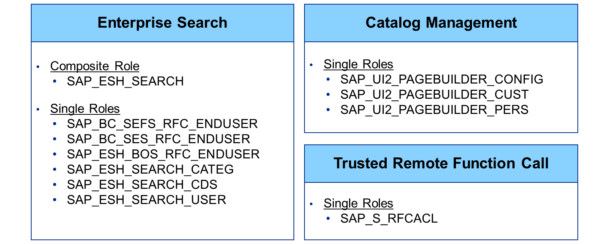
Being authorized to use the FLP does not mean that any app can be started or data can be searched. To do that, additional roles and authorizations are in place. The topic authorizations must be taken seriously. SAP recommends approaching authorization specialists or to educate oneself specifically in the SAP S/4HANA authorization concept.
Note
For more information about this topic, see:
  * Authorization Concept for SAP Fiori on SAP S/4HANA (Classroom Training)
<https://training.sap.com/course/adm945>
  * Exploring the Authorization Concept for SAP Fiori on SAP S/4HANA (Online Course)
<https://learning.sap.com/courses/exploring-the-authorization-concept-for-sap-fiori-on-sap-s-4hana>

## Enroll a User to SAP Fiori Launchpad
### Business Example
You want to enable a user to work with the _SAP Fiori launchpad_.
Note
This exercise requires an SAP Learning system. Login information is provided by your system setup guide.
Note
Whenever the values or object names in this exercise include ##, replace ## with the number of your user.
### Prerequisites
The services were activated in the demonstration **How to Activate SAP Fiori Content**.
### Task 1: Create a User and Assign a Business Catalog
Exercise[Start Exercise](https://learnsap.enable-now.cloud.sap/pub/mmcp/index.html?show=project!PR_E79D0403A9076182:uebung)
#### Steps
  1. In the _User Maintenance_ (SU01) of your SAP S/4HANA (S4H) system, create the user **FLP_USER_##**. Assign the _SAP_BR_UX100_RAPID_ACTIVATION_ role to the user.
    1. In the _SAP Easy Access_ menu of your S4H, search for _User Maintenance_ or start transaction SU01.
    2. In the _User_ field, enter **FLP_USER_##**.
    3. Choose _User_.
    4. In the _Last name_ field, enter your name.
    5. Choose the _Logon Data_ tab.
    6. In the _New Password_ and _Repeat Password_ fields, enter a password.
    7. Choose the _Roles_ tab.
    8. Open the value help of a _Role_ cell in the table.
    9. In the _Single Role_ field, enter ***rapid***.
    10. Choose _Start Search_.
    11. Select the _Single Role_**SAP_BR_UX100_RAPID_ACTIVATION** and choose _Copy_.
    12. Choose _Save_.
  2. Open the _SAP Fiori launchpad_ spaces of your S4H in _Microsoft Edge_ or _Google Chrome_ and examine the error in the _App Finder_.
    1. Start the _SAP Fiori launchpad_ spaces of your S4H in _Microsoft Edge_ or _Google Chrome_.
Caution
No other session must be active of the chosen Web browser.
    2. In the _Select a Certificate_ popup, choose _Cancel_.
    3. Log on with **FLP_USER_##** and the password you created in the step before.
    4. Change the password to a new password.
    5. Choose your user in the upper right corner.
    6. In the _User Actions Menu_ , choose _App Finder_.
#### Result
The error _Failed to load catalogs_ appears.

### Task 2: Assign the Z_FIORI_FOUNDATION_USER Role to the New User
Exercise[Start Exercise](https://learnsap.enable-now.cloud.sap/pub/mmcp/index.html?show=project!PR_C8A89EB418746793:uebung)
#### Steps
  1. In the _User Maintenance_ (SU01) of your S4H, assign the _Z_FIORI_FOUNDATION_USER_ composite role to the _FLP_USER_##_ user.
    1. In the _User Maintenance_ (SU01) of your S4H, choose _Change_ for the **FLP_USER_##** user.
    2. Choose the _Roles_ tab.
    3. Open the value help of a _Role_ cell in the table.
    4. Choose _Composite Roles_.
    5. In the _Composite Role_ field, enter ***fiori***.
    6. Choose _Start Search_.
    7. Select the _Composite Role_**Z_FIORI_FOUNDATION_USER** and choose _Copy_ (Check mark).
    8. Choose _Save_.
  2. In the _SAP Fiori launchpad_ of your S4H running in _Microsoft Edge_ or _Google Chrome_ , add the _Display Sales Order Items_ tile to your _My Home_ and start the app.
    1. Reload the _App Finder_ in the _SAP Fiori launchpad_ spaces of your S4H in _Microsoft Edge_ or _Google Chrome_.
Note
If you closed the Web browser, log on again to the _SAP Fiori launchpad_ with user **FLP_USER_##** and open the _App Finder_.
    2. Choose the plus of the _Display Sales Order Items_ tile.
#### Result
The message _"Display Sales Order Items" added to "My Home"_.
    3. Choose _Navigate to Home_.
    4. Choose the _Display Sales Order Items_ tile.


### Configuring SAP Fiori Launchpad

*Source: https://learning.sap.com/courses/learning-the-basics-of-sap-fiori/configuring-sap-fiori-launchpad_be40d546-d8f8-4a6b-b69f-7c77e1a0e9e1*

Objective
After completing this lesson, you will be able to configure SAP Fiori launchpad.
## Configuration Options
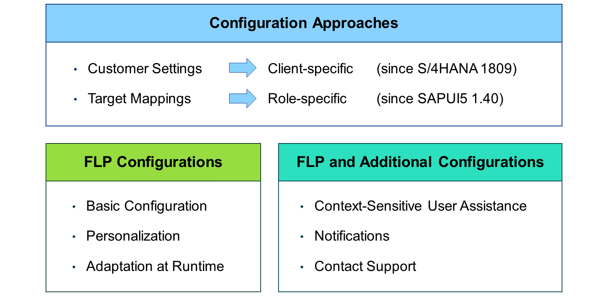
The _SAP Fiori launchpad (FLP)_ has many configuration options. There are several basic configurations and also advanced configurations needing other additional technical settings elsewhere. The configurations depend on the release of the software component SAP_UI. There are two approaches to configure the FLP:

Customer settings
    Define customer settings using the transaction /UI2/FLP_CUS_CONF. This is recommended since SAP S/4HANA 1809. These settings are valid for one system client.

Target Mapping
    Define target mappings in catalogs. This is recommended since SAPUI5 1.40. These catalogs can then be assigned to users via roles as usual.
Note
Originally, it was also possible to create and upload a configuration file as a third option. This option is deprecated since SAPUI5 1.40 and was removed with SAP S/4HANA 2022.
To configure the additional settings needed for context-sensitive user assistance, notifications, and contact support, consult the SAP online documentation for your system release or ask your system administrator.
### SAP Fiori Launchpad Customer Settings
Watch the video to understand SAP Fiori Launchpad Customer Settings.
Note
The transaction /UI2/FLP_SYS_CONF allows the configuration of the FLP for all clients. However, these settings are saved in the SAP namespace. They count as modifications, including all the drawbacks.
### SAP Fiori Launchpad Configuration via Custom Catalog

Target mappings for configuring the FLP can be created in any catalog. However, it is recommended that you use a separate one without any tiles or target mappings for apps. The semantic object for the FLP is **Shell** , followed by an action depending on the FLP part. The action **bootConfig** is meant for general settings of the FLP. The application type is **SAPUI5 Fiori App** , followed by a freely selectable component ID. The settings themselves are created using parameters of the target mapping and depend on the system release. A full list of available settings per system release can be found in the _SAP Fiori launchpad_ documentation on <https://help.sap.com/docs/SAP_FIORI_LAUNCHPAD>.
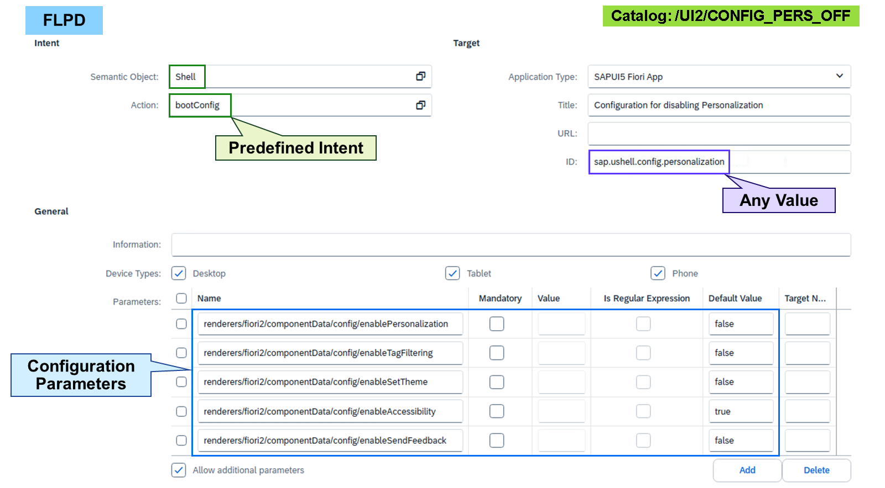
For some configuration areas, SAP delivers predefined catalogs that already consist of target mappings with parameters. These catalogs can be assigned directly to roles to enable a certain feature set, or they can be copied in the customer namespace to change the default values to meet someone's needs. Depending on the release, these catalogs are delivered as business or technical catalogs and must be handled accordingly.
For example, assigning the _/UI2/CONFIG_PERS_OFF_ business catalog to a role deactivates the personalization options of the FLP for all users assigned to the role. Only accessibility features are still possible and the _My Home_ page in spaces can still be changed. But there is no access anymore to the app finder.
Hint
The _My Home_ page in spaces can be deactivated by setting **SPACES_MYHOME** to **false** in the /UI2/FLP_CUS_CONF transaction.
Note
For more information about this topic, see:
Configuring the SAP Fiori Launchpad for SAP S/4HANA (Learning Video)
<https://learning.sap.com/videos/configuring-the-sap-fiori-launchpad-for-sap-s-4hana>
## How to Configure SAP Fiori Launchpad
### Business Example
You want to move buttons from the user actions menu to the page header of the _SAP Fiori launchpad_.
Watch the video to see how to configure the SAP Fiori Launchpad.
Settings
## Deactivate Personalization
### Business Example
You want to manage the personalization options of the _SAP Fiori launchpad_ for a certain group of users.

Solution:
    SAP_BR_UX100_S_RESTRICTED (Role)     SAP_UX100_BC_S_PERS_OFF (Catalog)
Note
This exercise requires an SAP Learning system. Login information is provided by your system setup guide.
Note
Whenever the values or object names include ##, replace ## with the number of your user.
### Task 1: Copy and Edit the Catalog for Disabling Personalization
Exercise[Start Exercise](https://learnsap.enable-now.cloud.sap/pub/mmcp/index.html?show=project!PR_66D17DAF4B062D94:uebung)
#### Steps
  1. In the _SAP Fiori launchpad content manager_ for customizing of your SAP S/4HANA (S4H) system, copy the _/UI2/CONFIG_PERS_OFF_ catalog using ID **Z_##_BC_PERS_OFF** and title **Z## - Disable Personalization**.
    1. In the _SAP Easy Access_ menu of your S4H, search for _FLP Content Manager: Client-Specific_ or start transaction /UI2/FLPCM_CUST.
    2. In the _Search Catalogs_ field, enter **pers** and choose _Go_.
    3. Select the _/UI2/CONFIG_PERS_OFF_ catalog.
    4. Choose _Copy_.
    5. In the _New ID_ field, enter **Z_##_BC_PERS_OFF**.
    6. In the _New Title_ field, enter **Z## - Disable Personalization**.
    7. Choose _Continue_.
    8. Choose the transport request provided to you.
  2. In the _SAP Fiori launchpad content manager_ for customizing of your S4H, open the _Z_##_BC_PERS_OFF_ in the _SAP Fiori launchpad designer_ for customizing and assign a transport request in the settings.
Note
Close the _SAP Fiori launchpad content manager_ to release the lock.
    1. In the _SAP Fiori launchpad content manager_ for customizing, select the _Z_##_BC_PERS_OFF_ catalog.
    2. Choose _Open in Designer_.
    3. Close the _SAP Fiori launchpad content manager_.
    4. In the _SAP Fiori launchpad designer_ for customizing, choose _Settings_ (gearwheel) in the upper right corner.
    5. In the _Assign Transport Request_ popup, deselect the _None (Local Object)_ checkbox.
    6. In the _Customizing Request_ dropdown, select the transport request provided to you.
    7. Choose _OK_.

### Task 2: Edit Parameters of a Target Mapping in the SAP Fiori Launchpad Designer
Exercise[Start Exercise](https://learnsap.enable-now.cloud.sap/pub/mmcp/index.html?show=project!PR_843F249630CA6280:uebung)
#### Steps
  1. In the _SAP Fiori launchpad designer_ for customizing of your S4H, in the target mapping for the _Shell_ semantic object of the _Z_##_PERS_OFF_ catalog, change the default value of the _renderers/fiori2/componentData/config/enableSetTheme_ parameter to **true**.
Caution
If you get an error when saving the catalog, close the _SAP Fiori launchpad content manager_ to release the lock.
    1. In the _SAP Fiori launchpad designer_ for customizing of your S4H, in the _Z_##_BC_PERS_OFF_ catalog, choose _Target Mappings_ at the top of the page.
    2. Select the _Semantic Object_**Shell** with _Action_**bootConfig** .
    3. Choose _Configure_.
    4. Enlarge the width of the _Name_ column of the _Parameters_ table until you can fully read the names.
    5. In the _Default Value_ cell of the _renderers/fiori2/componentData/config/enableSetTheme_ parameter, enter **true**.
    6. Choose _Save_.
    7. In the _Confirmation_ popup about breaking the reference, choose _OK_.
Caution
If you get an error when saving the catalog, close the _SAP Fiori launchpad content manager_ to release the lock.

### Task 3: Create a Business Role, Add the Catalog, and Test it in the SAP Fiori Launchpad
Exercise[Start Exercise](https://learnsap.enable-now.cloud.sap/pub/mmcp/index.html?show=project!PR_9817501C3B51CC8A:uebung)
#### Steps
  1. Create the role **Z_##_BR_RESTRICTED** in the _Role Maintenance_ (PFCG) of your S4H. Assign the role to your user.
    1. In the _SAP Easy Access_ menu of your S4H, search for _Role Maintenance_ or start transaction PFCG.
    2. In the _Role_ field, enter **Z_##_BR_RESTRICTED**.
    3. Choose _Create Single Role_.
    4. In the _Description_ field, enter **Restricted ##**.
    5. Choose _Save_.
    6. Choose the _User_ tab.
    7. In the _User ID_ field, enter your user.
    8. Choose _Save_.
  2. Add the _Z_##_BC_PERS_OFF_ catalog to the menu of the _Z_##_BR_RESTRICTED_ role in the Role Maintenance (PFCG) of your S4H.
    1. Choose the _Menu_ tab.
    2. Expand the _Insert Node_ button.
Hint
The initial value written on the _Insert Node_ button is _Transaction_.
    3. Choose _SAP Fiori Launchpad_ → _Launchpad Catalog_.
    4. In the _Catalog ID_ field, enter **z_##*** and use the value help.
    5. In the popup, double-click _Z_##_BC_PERS_OFF_.
    6. Choose _Continue_.
Note
If _Warnings and/or errors happened during evaluation of the catalog details_ appears in a pop-up, choose _No_ to continue.
    7. Choose _Save_.
  3. Test if the personalization in the _SAP Fiori launchpad_ spaces of your S4H is disabled and changing the theme is still possible.
Note
To enable personalization again for later exercises, go back to transaction PFCG and remove your user from the role _Z_##_BR_RESTRICTED_.
    1. Start or reload the _SAP Fiori launchpad_ of your S4H in the client of your choice.
    2. Choose the _Cross Topic_ space.
    3. Choose your user in the upper right corner.
#### Result
The _App Finder_ button disappeared and the _Edit Current Page_ button is renamed to _Add Tiles to My Home_.
    4. In the _User Actions Menu_ , choose _Settings_.
    5. Choose _Appearance_.
    6. Select a _Theme_ of your choice.
    7. Choose _Save_.
Note
To enable personalization again for later exercises, go back to transaction PFCG and remove your user from the role _Z_##_BR_RESTRICTED_.


### Troubleshooting SAP Fiori Launchpad

*Source: https://learning.sap.com/courses/learning-the-basics-of-sap-fiori/troubleshooting-sap-fiori-launchpad_cf4420a3-330c-4837-821f-674061305253*

Objective
After completing this lesson, you will be able to maintain SAP Fiori Launchpad Content
## Maintenance Transactions

SAP Fiori is part of the _SAP Reference Implementation Guide (IMG)_. Transaction /UI2/CUST can be used to access only the UI-relevant parts of the IMG. The main parts for SAP Fiori are as follows:
  * _Initial Setup_ for system administrators
  * _SAP Fiori Launchpad Settings_ for content and system administrators
  * _Setting Up Launchpad Content_ for business specialists, content administrators, and developers
  * _Setting Up Launchpad Layout and Structure_ for business specialists and content administrators
  * _Setting Up Roles_ for content administrators, business specialists, and authorization specialists
  * _Launchpad Support Tools_ for business specialists, content administrators, and developers
  * _Launchpad Data Administration_ for content and system administrators
  * _Exposing Content to SAP BTP_ for business specialists and content administrators
Note
The SAP BTP service handling SAP Fiori content is called SAP Build Work Zone, standard edition.

### Overview Roles, Spaces, Pages

Since SAP S/4HANA 2021, transaction /UI2/RSP_LIST provides an overview of spaces and pages per business role. With that it is possible to get a list of the tiles the users see in their _SAP Fiori launchpad (FLP)_ spaces. It is possible to research the apps and their origin catalogs or if there are pages assigned but hidden.

Since SAP S/4HANA 2020, transaction /UI2/FLPCA shows all content assigned to business roles. This is very useful for getting an overview of everything a user gets in the _SAP Fiori launchpad (FLP)_ when assigning roles:
  * Sort by catalogs to show the content in the app finder.
  * Sort by semantic object to show the intent-based navigation links.
  * Sort by services to show the technical prerequisites.
  * Sort by successor transaction to show deprecated apps.

Note
You can either search for services or successor apps but not both at the same time.

An important support tool for the FLP configuration is transaction /UI2/FLC. It checks the consistency of delivered and customized catalogs and groups for configuration and customizing. It quickly identifies problems in target mappings and tiles concerning elements of the intent-based navigation and parameters.

Transaction /UI2/FLIA also shows errors and problems in target mappings, but it goes deeper. It offers a full intent analysis for semantic objects and actions per role and user. Through this analysis, duplicated intents pointing to different targets can also be found. A full intent resolution analysis takes some time, depending on the number of semantic objects and actions in the system. It is recommended to restrict the analysis to the assigned roles of a user.

Since SAP S/4HANA 2023, every change to a technical catalog or an app descriptor can be seen in transaction /UI2/FLPAM_LOG. The changes were already being logged before in the _Application Log_ (SLG1 with object FLPAM). But the new transaction makes it easier to find the relevant information by offering more selection options and a better visibility.

There are many other transactions available for logging, tracing, cache handling, cleanup, and so on, in the areas of SAP Fiori, SAPUI5, and SAP Gateway. There is no need to know them all by heart. Transaction /UI2/CUST organizes all of them as a tree in the implementation guide.
Note
For more information about this topic, please read SAP Note [2116090](https://me.sap.com/notes/2116090) – _UI Addon, SAP_UI: Information for customers for efficient incident analysis_.
## App Support
Let's watch the video to get an overview of App Support activation.Activating App Support
## Check SAP Fiori Launchpad Content
### Business Example
You want to operate the _Overview Roles, Spaces, Pages_ (/UI2/RSP_LIST), _SAP Fiori Launchpad Content Aggregator_ (/UI2/FLPCA), _SAP Fiori Launchpad Checks_ (/UI2/FLC), and _SAP Fiori Launchpad Intent Analysis_ (/UI2/FLIA) transactions.
Note
This exercise requires an SAP Learning system. Login information is provided by your system setup guide.
Note
Whenever the values or object names in this exercise include ##, replace ## with the number of your user.
### Prerequisites
The standard catalog was created in the exercise **Create Standard Catalogs**.
### Task 1: Operate Overview Roles, Spaces, Pages
Exercise[Start Exercise](https://learnsap.enable-now.cloud.sap/pub/mmcp/index.html?show=project!PR_74F7BC38ECE29F:uebung)
#### Steps
  1. In the _Overview Roles, Spaces, Pages_ (/UI2/RSP_LIST) of your SAP S/4HANA (S4H) system, check if any pages are hidden in your roles.
    1. In the _SAP Easy Access_ menu of your S4H, search for _Overview Roles, Spaces, Pages_ or start transaction /UI2/RSP_LIST.
    2. In the _Roles_ field, enter **z_##***.
    3. Choose _Execute_.
    4. Examine the _Hidden_ column.
#### Result
No page should be hidden.

### Task 2: Operate SAP Fiori Launchpad Content Aggregator
Exercise[Start Exercise](https://learnsap.enable-now.cloud.sap/pub/mmcp/index.html?show=project!PR_92C89578E0D421A4:uebung)
#### Steps
  1. In the _Fiori Launchpad Content Aggregator_ (/UI2/FLPCA) of your SAP S/4HANA (S4H) system, check the status of the OData V2 services used by apps in your roles.
    1. In the _SAP Easy Access_ menu of your S4H, search for _Fiori Launchpad Content Aggregator_ or start transaction /UI2/FLPCA.
    2. In the _Role Filter_ field, enter **z_##***.
    3. Select the _Display OData V2 Services_ checkbox.
    4. Choose _Execute_.
    5. Scroll the table to the right.
    6. Select the _OData v2 Service Name_ column and choose _Sort in Descending Order_.
    7. Examine the _OData v2 Service Status_ column.
#### Result
All services should be active.

### Task 3: Operate SAP Fiori Launchpad Checks
Exercise[Start Exercise](https://learnsap.enable-now.cloud.sap/pub/mmcp/index.html?show=project!PR_70A4F9821279368E:uebung)
#### Steps
  1. In the _Fiori Launchpad Checks_ (/UI2/FLC) of your S4H, check the SAP Fiori customizing of your user for errors.
    1. In the _SAP Easy Access_ menu of your S4H, search for _Fiori Launchpad Checks_ or start transaction /UI2/FLC.
    2. Select the _Analyze Roles_ checkbox.
    3. In the _Role_ field, enter *****.
    4. Select the _Only Roles Assigned to User_ checkbox.
    5. In the _User_ field, enter **TRAIN-##**.
    6. Choose _Execute_.
    7. Select the _Status_ column and choose _Sort in Descending Order_.
    8. Scroll the table to the right and examine the errors in the _Message_ column.
  2. In the _Fiori Launchpad Checks_ (/UI2/FLC) of your S4H, examine all details of the _Z_##_BR_TRAINING_ role.
    1. In the _Fiori Launchpad Checks_ (/UI2/FLC) of your S4H, choose _Back_.
    2. In the _Role_ field, enter **z_##*** and use the value help.
    3. In the popup, double-click _Z_##_BR_TRAINING_.
    4. Deselect the _Only Roles Assigned to User_ checkbox.
    5. Choose _Execute_.
    6. In the table header, choose _Choose Layout..._.
    7. In the popup, choose _2SAP_ALL_.
    8. Search and examine everything that you created by scrolling through the table.

### Task 4: Operate SAP Fiori Launchpad Intent Analysis
Exercise[Start Exercise](https://learnsap.enable-now.cloud.sap/pub/mmcp/index.html?show=project!PR_A6652BA2B03F75B6:uebung)
#### Steps
  1. In the _Fiori Launchpad Intent Analysis_ (/UI2/FLIA) of your S4H, examine the target mappings of your user you created.
    1. In the _SAP Easy Access_ menu of your S4H, search for _Fiori Launchpad Intent Analysis_ or start transaction /UI2/FLIA.
    2. In the _Intent_ field, enter ***-*##**.
    3. Select the _Restrict to Assigned Roles_ checkbox.
    4. In the _Analyze for User ..._ field, enter **TRAIN-##**.
    5. Choose _Execute_.
    6. Examine the target mappings that you created.

[Continue to quiz](https://learning.sap.com/courses/learning-the-basics-of-sap-fiori/content-administration_92d63e1b-177a-38eb-a1ce-2f42267be62b)


### Quiz

*Source: https://learning.sap.com/courses/learning-the-basics-of-sap-fiori/content-administration_92d63e1b-177a-38eb-a1ce-2f42267be62b*

It's time to put what you've learned to the test, get 6 right to pass this unit.
1.
### Which foundation roles are shipped by SAP since SAP S/4HANA 2020?
There are two correct answers.
SAP_UI2_ADMIN
SAP_UI2_USER
SAP_FLP_ADMIN
SAP_FLP_USER
2.
### Which ABAP transactions can be used to analyze the intents used in target mappings?
There are three correct answers.
/UI2/FLT
/UI2/FLIA
/UI2/FLC
/UI2/FLP
/UI2/FLPCA
3.
### What is the namespace for SAP Gateway front-end transactions?
Choose the correct answer.
IWFND
IWBEP
IWPGW
4.
### Assigning users to a foundation role grants them full access to the SAP Fiori launchpad.
Choose the correct answer.
True
False
5.
### Which approaches are available to configure the SAP Fiori launchpad?
There are two correct answers.
Cross-client settings using a configuration file
Client-specific settings using transaction /UI2/FLP_CUS_CONF
Role-based settings using target mappings
6.
### Which task lists for SAP Fiori are run only once per ABAP system release?
There are two correct answers.
SAP_FIORI_FOUNDATION_S4
SAP_FIORI_CONTENT_ACTIVATION
SAP_FIORI_FCM_CONTENT_ACTIVATION
SAP_GW_FIORI_ERP_ONE_CLNT_SETUP
7.
### What is the starting point for activating apps with rapid activation for SAP Fiori?
Choose the correct answer.
Business apps
Business catalogs
Business roles
Submit answers[Next unit](https://learning.sap.com/courses/learning-the-basics-of-sap-fiori/using-the-ui-theme-designer_e269f16a-7009-4467-9b6f-4d3dd689da32)


### Adaptation

*Source: https://learning.sap.com/courses/learning-the-basics-of-sap-fiori/using-the-ui-theme-designer_e269f16a-7009-4467-9b6f-4d3dd689da32*

Objective
After completing this lesson, you will be able to use the UI Theme Designer.
## Adaption of Themes
_UI Theme Designer_ is a browser-based editor.
Watch this video to learn more about _UI Theme Designer_.

The _UI Theme Designer_ supports all web-based SAP applications and clients based on HTML4 and HTML5. It is available in three channels:

(SAP NetWeaver) Application Server ABAP
    Transaction /UI5/THEME_DESIGNER

SAP Enterprise Portal
     _Content Administration_ → _Portal Display_ → _Portal Themes_ → _UI Theme Designer_

SAP Business Technology Platform
     _SAP Fiori launchpad_ → _User Actions Menu_ → _Theme Manager_ → _Launch Theme Designer_
Prerequisites, installation, and configuration are available in the SAP Note [1852401](https://me.sap.com/notes/1852401) – _UI Theme Designer for SAP NetWeaver AS ABAP (main SAP Note)_.
Hint
When creating themes for the Unified Rendering, it is recommended to always use the latest version. Please check SAP Note [2090746](https://me.sap.com/notes/2090746) – _WD ABAP: Unified Rendering Update with TCI - Instructions and Related SAP Notes._ for details.
To design a theme, refer to the following procedure.

All themes have a base theme (CSS files). For SAP Fiori 3, this is SAP Quartz Light. After choosing a template application to visualize the changes, the new theme is built upon a set of theme-related (specific style) CSS files. The theme generator merges the base theme with the specific style into the final theme.
SAPUI5 uses LESS to handle the CSS parameters and allows some additional features. LESS can be considered a preprocessor that results in the final version of the CSS. Find out more at <http://lesscss.org/>.

The available base themes depend on the release of the system providing the UI theme designer.
SAP delivers the following themes for SAPUI5:

SAP Morning / Evening Horizon

  * Theme released for SAP Fiori with Horizon
  * Initial shipment in SAP S/4HANA Cloud 2202 / SAPUI5 1.102
  * Uses own typeface "72"

SAP Quartz Dark

  * Theme released for SAP Fiori 3
  * Initial shipment in SAP S/4HANA Cloud 2002 / SAPUI5 1.72
  * Uses own typeface "72"

SAP Quartz Light

  * Theme released for SAP Fiori 3
  * Initial shipment in SAP Cloud Platform 1904 / SAPUI5 1.65
  * Uses own typeface "72"

SAP Belize (Deep)

  * Theme released for SAP Fiori 2.0
  * Initial shipment in software component SAP_UI 7.51 / SAPUI5 1.44
  * Uses typefaces Arial Regular and Bold

SAP High Contrast Black / White

  * Theme released for accessibility purpose
  * Initial shipment in software component SAP_UI 7.40 / SAPUI5 1.28
  * Flavors for SAP Belize, Quartz, and Horizon

SAP Blue Crystal – Deprecated

  * Theme released for SAP Fiori
  * Initial shipment in software component SAP_UI 7.40 / SAPUI5 1.28
  * Uses typefaces Arial Regular and Bold

SAP Gold Reflection – Deprecated

  * Theme released for non-Fiori standalone apps
  * Initial shipment in SAPUI5 1.0
  * Not working with SAP Fiori

## Maintenance of Themes

The _Theme Tool_ manages the themes in the theme repository of an Application Server (AS) ABAP. Themes can be viewed, imported, exported, and deleted, as well as transported to the follow-up system. This is also the easiest way to get a URI pointing to a certain theme. Start the tool using the following transaction: /UI5/THEME_TOOL.
Watch the video to see how to set central theme parameters for the SAP Fiori launchpad. Setting Central Theme Parameter
### Theme Parameter Values
| Theme  | Parameter Value  |
| --- | --- |
| SAP Belize  | sap_belize  |
| SAP Belize Dark  | sap_belize_plus  |
| SAP High Contrast Black (Belize)  | sap_belize_hcb  |
| SAP High Contrast White (Belize)  | sap_belize_hcw  |
| SAP Quartz Light  | sap_fiori_3  |
| SAP Quartz Dark  | sap_fiori_3_dark  |
| SAP High Contrast Black (Quartz)  | sap_fiori_3_hcb  |
| SAP High Contrast White (Quartz)  | sap_fiori_3_hcw  |
| SAP Morning Horizon  | sap_horizon  |
| SAP Evening Horizon  | sap_horizon_dark  |
| SAP High Contrast Black (Horizon)  | sap_horizon_hcb  |
| SAP High Contrast White (Horizon)  | sap_horizon_hcw  |
## Create SAP Fiori Themes
### Business Example
You want to create and test a theme for _SAP Fiori launchpad_ using the _UI Theme Designer_.
Note
This exercise requires an SAP Learning system. Login information is provided by your system setup guide.
Note
Whenever the values or object names in this exercise include ##, replace ## with the number of your user.
### Task 1: Create a Theme and Define a Color Palette in the UI Theme Designer
Exercise[Start Exercise](https://learnsap.enable-now.cloud.sap/pub/mmcp/index.html?show=project!PR_38617B38D782CDB3:uebung)
#### Steps
  1. In the _UI Theme Designer_ of your SAP S/4HANA (S4H) system, create a theme based on the **SAP Morning Horizon** theme.
    1. In the _SAP Easy Access_ menu of your S4H, search for _UI Theme Designer_ or start transaction /UI5/THEME_DESIGNER.
    2. In the _UI Theme Designer_ , choose _Create a New Theme_.
    3. In the _Base Theme_ menu, choose _SAP Morning Horizon_.
    4. Choose _Create Theme_.
  2. Add the _SAP Fiori launchpad_ of your SAP S/4HANA (S4H) system as preview.
    1. Choose the _+_ next to _Preview Pages_.
    2. In the _Link to Application_ field, enter **/sap/bc/ui2/flp**.
    3. In the _Name of Application_ field, enter **SAP Fiori Launchpad**.
    4. Choose _Add_.
  3. Define a color palette parameter called **CornPoppyRed** in your theme with the hexadecimal value **E00025**.
    1. Choose the _Palette_ tab in the upper right.
    2. In the _Enter parameter ID_ field, enter **CornPoppyRed**.
    3. For the _Parameter color_ field, open the value help.
    4. In the _Hex_ field, enter **e00025**.
    5. Choose _OK_.
    6. Choose _Add palette parameter_ (_+_ next to the value help).

### Task 2: Design a Theme in the UI Theme Designer
Exercise[Start Exercise](https://learnsap.enable-now.cloud.sap/pub/mmcp/index.html?show=project!PR_11F2265F085AABB2:uebung)
#### Steps
  1. In the _UI Theme Designer_ of your S4H, change the main _Brand Color_ in your theme to **CornPoppyRed**.
    1. In the _UI Theme Designer_ of your S4H, choose the _Quick_ tab.
    2. For the _Brand Color_ field in the _Main_ group, open the value help.
    3. In the _Palette_ pane, choose _CornPoppyRed_.
    4. Note the change of the _Link Color_.
  2. Set the FioriMeadow.jpg image from the course folder on the training share as _Background Image/Gradient_ of the _Shell Canvas_ for your theme.
Note
Course folders on the training share can be found at S:\Courses.
    1. Choose the _Detailed_ tab.
    2. For the _Background Image_ field in the _Shell Canvas_ group, open the value help.
    3. Choose _Drop image files here or press to browse_.
    4. Select S:\Courses\UX100_24\FioriMeadow.jpg.
    5. Choose _Open_.
    6. Choose _OK_.
  3. Change the _sapShellColor_ in your theme to **CornPoppyRed**.
    1. Choose the _Expert_ tab.
    2. Select the filter _Colors_.
    3. In the _Search_ field, enter **shellc** and choose **Enter**.
    4. For the _sapShellColor_ field, open the value help.
    5. In the _Palette_ pane, choose _CornPoppyRed_.
    6. Note the change of many other colors.

### Task 3: Build and Preview a Theme in the UI Theme Designer
Exercise[Start Exercise](https://learnsap.enable-now.cloud.sap/pub/mmcp/index.html?show=project!PR_D834F5B1147BB87:uebung)
#### Steps
  1. In the _UI Theme Designer_ of your S4H, save and build your theme as **CornPoppy##** with the description **Corn Poppy Meadow ##**. Run a preview of your theme in the _UI Theme Designer_.
    1. In the _UI Theme Designer_ of your S4H, in the menu, choose _Theme_ → _Save As…_.
    2. In the _Theme ID_ field, enter **CornPoppy##**.
    3. In the _Title_ field, enter **Corn Poppy Meadow ##**.
    4. Choose _Save_.
    5. In the menu, choose _Theme_ → _Save & Build_.
    6. Choose _Preview built theme in a new window_ (Triangle above the preview).

## Configuration Parameters for SAP Fiori Themes
These customizing parameters can be used to configure the themes in the _SAP Fiori launchpad_ :

DARK_MODE

Specify if users can enable the dark mode.
true (default)/false

THEMING_DEFAULT_THEME

Specify the default theme for the users.
sap_horizon (default)

THEMING_HIDE_SAP_THEMES

Specify whether the SAP themes are removed from the _Settings_.
true/false (default)

USERSETTINGS_SET_THEME

Specify whether users can select a different theme in the _Settings_.
true (default)/false


### Adapting SAP Fiori UIs at Runtime

*Source: https://learning.sap.com/courses/learning-the-basics-of-sap-fiori/adapting-sap-fiori-uis-at-runtime_db9cbc8a-2660-49b3-8e0d-2ceb9416ac8d*

Objective
After completing this lesson, you will be able to use SAP Fiori runtime authoring
## Adaptation at Runtime
Watch the video to see how SAP Fiori UIs can be adapted at runtime.
## Key User Extensibility

Since SAP S/4HANA 2023, to create an adaptation of an app as a key user, the following steps must be performed. The prerequisite is that the original app and the RTA plugin are assigned to the user master record of the key user and the key user has the authorization to create adaptations:
  1. In the FLP, start the original app and enter the adaptation mode. Then create an app variant of the original app and save the app variant ID.
  2. In the FLPAM, define an app descriptor for the app variant. You may copy the app descriptor of the original app to a standard catalog and replace the SAPUI5 component ID with the app variant ID.
Note
Keeping the intent of the original app, replaces the original app with the variant for all assigned users. If you still want to access the original app in the FLP, change the intent to a unique value.
  3. In the FLPCM, assign the target mapping of the app variant to a role. It is recommended to first reference the target mapping in a business catalog and assign the business catalog to the role.
  4. In the FLP, start the app variant and enter the adaptation mode. Then adapt the app variant as you like and save it.
  5. In the FLP, activate the adaptations as a new version. After that, you may publish the app variant version and assign it to a transport request.

Versions of app variants were introduced in SAP S/4HANA 2023. Before this release, the key user directly adapted the original app and then saved it as an app variant. Compared to the list above, the order was _1._ → _4._ → _2._ → _3._. Without a version, the app variant was directly assigned to a transport request.

By choosing _More Actions_ → _App Variants_ → _Save As_ , an app variant can be created. You can save multiple variants of one application and also of other variants. Each variant has an app variant ID, which can be used in the FLPAM (in older releases FLPD) to create a target mapping starting the app with this variant. The target mapping can be created by copying the original target mapping of the app and exchanging the SAPUI5 component ID with the app variant ID.

After the adaptations to an app have been saved in a variant, they can be activated as a new version. This sets this variant as the active version for all users in the system replacing the original app or any previously active version. You can switch to an older version by activating it as a new version.
With the active version being selected, the _Publish_ button can be used to assign it to a transport request. A customizing or workbench request can be selected to decide, if the adaptations should be available client-specific or cross-client in the follow-up system.
Note
For more information about this topic, see:
  * Extensibility for SAP S/4HANA (Classroom Training)
<https://training.sap.com/course/s4d425>
  * Getting Started with In-App Extensibility in SAP S/4HANA (Online Course)
<https://learning.sap.com/courses/getting-started-with-in-app-extensibility-in-sap-s-4hana>
  * Adapting the UI of List Report Apps with SAP Fiori for SAP S/4HANA (Learning Video)
<https://learning.sap.com/videos/adapting-the-ui-of-list-report-apps-with-sap-fiori-for-sap-s-4hana>

## How to Define a Target Mapping for an App Variant in FLPD
### Business Example
You want to define a target mapping for an app variant using the _SAP Fiori launchpad_ for customizing.
### Prerequisites
The business catalog was created in the exercise **Reference Tiles and Target Mappings** and the ap variant was created in exercise **Adapt SAP Fiori at Runtime**.
If the _SAP Fiori application manager (FLPAM)_ is not available in your system, watch the video to see how to create a business catalog and assign the app variant to a target mapping in the _SAP Fiori launchpad designer (FLPD)_.
Settings
## Adapt SAP Fiori at Runtime
### Business Example
You want to adapt an SAP Fiori app in the _SAP Fiori launchpad_ at runtime and save the changes as an app variant.
Note
This exercise requires an SAP Learning system. Login information is provided by your system setup guide.
Note
Whenever the values or object names in this exercise include ##, replace ## with the number of your user.
### Prerequisites
The business catalog was created in the exercise **Reference Tiles and Target Mappings**.
### Task 1: Activate Runtime Adaptation for a User
Exercise[Start Exercise](https://learnsap.enable-now.cloud.sap/pub/mmcp/index.html?show=project!PR_8BB2541994BA9F88:uebung)
#### Steps
  1. In the _User Maintenance_ (SU01) of your SAP S/4HANA (S4H) system, add the role **SAP_UI_FLEX_KEY_USER** to your user.
    1. In the _SAP Easy Access_ menu of your S4H, search for _User Maintenance_ or start transaction SU01.
    2. In the _User_ field, enter your user.
    3. Choose _Change_.
    4. Choose the _Roles_ tab.
    5. In the _Role_ column, open the value help for an empty field.
    6. In the _Single Role_ field, enter ***ui_flex*** and choose **Enter**.
    7. Select the _Single Role_**SAP_UI_FLEX_KEY_USER** and choose _Copy_ (Check mark).
    8. Choose _Save_.

### Task 2: Create an App Variant by Using Runtime Adaptation
Exercise[Start Exercise](https://learnsap.enable-now.cloud.sap/pub/mmcp/index.html?show=project!PR_1B77CBE7FE213885:uebung)
#### Steps
  1. In the _SAP Fiori launchpad_ of your S4H, open the object page for the sample bank _Deutsche Bank 24_ using the SAP Fiori search of your S4H.
    1. Start or reload the _SAP Fiori launchpad_ of your S4H in the client of your choice.
    2. Choose _Search_ in the upper right.
    3. In the _Search_ menu, choose _Banks_.
    4. In the _Search_ field, enter **24** and choose **Enter**.
    5. Choose _Deutsche Bank 24_.
  2. Create the app variant **Core Bank Data ##** and copy the app variant ID in the clipboard.
    1. In the object page for banks, choose your user in the upper right corner.
    2. In the _User Actions Menu_ , choose _Adapt UI_.
    3. Choose _More Actions_ (Three lines).
    4. Choose _App Variants_ → _Save As_.
    5. In the _Save as New App Variant_ popup, in the _Title_ field, enter **Core Bank Data ##**.
    6. Choose _Save_.
    7. In the _Information_ popup, choose _Copy ID and Close_.
Hint
You may want to paste the variant ID in a text file.

### Task 3: Define an App Descriptor for the App Variant in the SAP Fiori Launchpad Application Manager
Exercise[Start Exercise](https://learnsap.enable-now.cloud.sap/pub/mmcp/index.html?show=project!PR_E9B6C9AC46C3D388:uebung)
#### Steps
  1. In the _SAP Fiori launchpad application manager_ of your S4H, create the empty standard catalog **Z_##_TC_FIN_ADAPTED** with title **Z## - Financials Adaptation** as local object.
Note
If you do not see a list of catalogs but just two input fields, execute the last task of the exercise **Create Replicable Catalogs** :
Allow Standard and Replicable Catalogs as Catalog Types in an ABAP System.
    1. In the _SAP Fiori launchpad application manager_ , choose _New Technical Catalog_.
    2. In the _Technical Catalog ID_ field, enter **Z_##_TC_FIN_ADAPTED**.
    3. In the _Technical Catalog Title_ field, enter **Z## - Financials Adaptation**.
    4. From the _Technical Catalog Type_ dropdown, select **Standard Catalog**.
    5. Select _Create empty technical catalog only_.
    6. Choose _Local Object_.
  2. Copy the _Track Sales Orders_ app to your _Z_##_TC_FIN_ADAPTED_ catalog using the _SAP Fiori ID_**F1760**.
    1. In the _Search Term_ field, enter **z_##** and choose _Go_.
    2. In the _Technical Catalogs_ table, choose _Z_##_TC_FIN_ADAPTED_.
    3. Choose _Copy from Other Technical Catalog_.
    4. In the _Select Transport Request_ popup, choose _Local Object_.
    5. In the _Copy from Other Technical Catalog_ popup, choose _Adapt Filters_.
    6. In the _Adapt Filters_ popup, select _SAP Fiori ID_ and choose _OK_.
    7. In the _SAP Fiori ID_ field, enter **F1760** and choose _Go_.
    8. Select the _Semantic Object_**Bank** with _Action_**displayFactSheet** and choose _Copy_.
#### Result
The warning _Transaction code exists but has a different launchpad app descriptor item ID assigned in SE93_. This is solved in the next steps.
    9. Close the warning message.
  3. Paste the variant ID from the clipboard in the _SAPUI5 Component ID_ field. Change the action to **displayFactSheet##** and the _Target Application Title_ to **Show Bank ##**.
    1. In the _SAPUI5 Component ID_ field, paste the variant ID from the clipboard.
    2. In the _Action_ field, enter **displayFactSheet##**.
    3. In the _Target Application Title_ field, enter **Show Bank ##**.
    4. Choose _Save_.
#### Result
The changes are saved but the warning that the transaction code already exists is shown. This is solved in the next step.
  4. For the _Bank_ app, create the transaction code **Z##_F1760** with **Show Bank ##** as text.
    1. Choose _Edit_ in the upper left.
    2. In the _Transaction Code_ field, enter **Z##_F1760** and choose **Enter**.
    3. For the _Transaction Code_ , choose _Click for creation_.
    4. In the _Warning_ popup, choose _OK_.
    5. In the _Create / Display Transaction_ window, in the _Transaction Text_ field, enter **Show Bank ##**.
    6. Choose _Create Transaction_.
    7. Close the _Create / Display Transaction_ window.
    8. Choose _Save_.

### Task 4: Reference the Target Mapping of the App Variant in a Business Catalog
Exercise[Start Exercise](https://learnsap.enable-now.cloud.sap/pub/mmcp/index.html?show=project!PR_B6A198F95B286F82:uebung)
#### Steps
  1. In the _SAP Fiori launchpad content manager_ of your S4H, create a reference for target mapping of _Show Bank ##_ of the _Z_##_TC_FIN_ADAPTED_ catalog in your catalog _Z_##_BC_EMPLOYEE_.
    1. Re-/Start the _SAP Fiori launchpad content manager_ of your S4H.
    2. In the _Search Catalogs_ field, enter **z_##** and choose _Go_.
    3. In the _Catalogs_ table, select the _Z_##_TC_FIN_ADAPTED_ catalog.
    4. In the _Content in Catalog Z_##_TC_FIN_ADAPTED_ table, select the _Show Bank ##_ app.
    5. Choose _Add Tiles/Target Mappings_ → _Add Selected Tiles/TMs to Other Catalog_.
    6. In the _Search Catalogs_ field, enter **z_##** and choose _Go_.
    7. In the _Catalogs_ table, select the _Z_##_BC_EMPLOYEE_ catalog.
    8. Choose _Add TM Reference_.
  2. Reload your _SAP Fiori launchpad_ of your S4H and search for the bank _Deutsche Bank 24_. Choose _Show Bank ##_ in the search result.
    1. Reload the _SAP Fiori launchpad_ of your S4H in the client of your choice.
    2. Choose _Search_ in the upper right.
    3. In the _Search_ menu, choose _Banks_.
    4. In the _Search_ field, enter **24** and choose **Enter**.
    5. Choose _Show Bank ##_.

### Task 5: Adapt the App Variant in the SAP Fiori Launchpad
Exercise[Start Exercise](https://learnsap.enable-now.cloud.sap/pub/mmcp/index.html?show=project!PR_2BDBB4AC9023D9B4:uebung)
#### Steps
  1. In the _UI Adaptation_ mode of the object page for banks, change the _Control Data_ group heading to **Core Data** , add the _Bank Country_ and _City_ fields to the _Address_ group, and remove the _Bank Branch_ and _Region_ fields.
    1. In the object page for banks, choose your user in the upper right corner.
    2. In the _User Actions Menu_ , choose _Adapt UI_.
    3. Right-click on _Control Data_ and choose _Rename_.
    4. Change the heading to **Core Data** and choose **Enter**.
    5. Right-click on _Address_ and choose _Add: Field_.
    6. In the _Available Content: Fields_ popup, select _Bank Country/Region_ and _City_ and choose _OK_.
    7. Right-click on _Bank Branch_ and choose _Remove_.
    8. Right-click on _Region_ and choose _Remove_.
    9. Choose _Save Draft_ (Floppy disk).
  2. Check your changes by using the _Navigation_ and _Visualization_ modes.
    1. Choose _Navigation_ at the top.
#### Result
Several buttons disappeared in the header bar.
    2. Choose the _House Banks_ tab.
    3. Choose the _General Information_ tab.
#### Result
In _Navigation_ mode, you can interact with the app.
    4. Choose _Visualization_ at the top.
    5. Choose the blue marker above _Core Data_.
    6. Choose the blue marker above _Address_.
#### Result
In the _Visualization_ mode, you can see where changes have been made.
    7. Choose _UI Adaptation_ at the top.
  3. Activate your changes as the new version **Core Bank V1**.
    1. Choose _Activate New Version_.
    2. In the _Activate New Version_ popup, in the _Enter a version title_ field, enter **Core Bank V1**.
    3. Choose _Confirm_.
    4. Choose _Exit_.


### Extending SAP Fiori Launchpad

*Source: https://learning.sap.com/courses/learning-the-basics-of-sap-fiori/extending-sap-fiori-launchpad_f5f3c83e-fdb1-46fc-89c5-fe123bb2b9c8*

Objective
After completing this lesson, you will be able to extend SAP Fiori launchpad.
## SAP Fiori Launchpad Plug-Ins
Watch this video for an overview on possible extensions.
Developing a plug-in involves the following steps:
  1. Implementing the plug-in
  2. Activating and configuring the plug-in

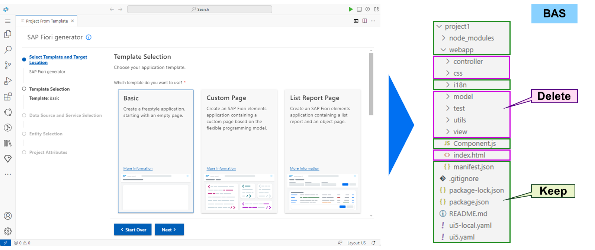
To start developing an FLP plug-in, generate an SAPUI5 freestyle application in the _SAP Business Application Studio (BAS)_. Then delete all unsupported or unnecessary folders and files.
The next step is to define the SAPUI5 project as an FLP plug-in. This is done in the manifest.json file:
Code Snippet
Copy codeSwitch to dark mode

```

1234567891011121314151617181920212223242526272829303132

{
  "_version": "1.37.0",
  "sap.app": {
    "id": "project1",
    "type": "component",
    "i18n": "i18n/i18n.properties",
    "applicationVersion": {
      "version": "0.0.1"
    },
    "title": "{{appTitle}}",
    "description": "{{appDescription}}",
    "resources": "resources.json",
    "sourceTemplate": {
      "id": "@sap/generator-fiori:basic",
      "version": "1.6.7",
      "toolsId": "4ef10253-5957-4a76-863b-06d7fd654689"
    }
  },
  "sap.ui": {
    "technology": "UI5",
    "deviceTypes": {
      "desktop": true,
      "tablet": true,
      "phone": true
    }
  },
  "sap.flp": {
    "type": "plugin"
  }
}

```

Generally, there are no views in a plug-in. All changes to the FLP are defined by accessing the renderer of the FLP in the Component.js file. This enables the FLP to load and instantiate the plug-ins automatically during startup. A typical initial Component.js looks like this:
Code Snippet
Copy codeSwitch to dark mode

```

1234567891011121314151617181920212223242526272829303132333435363738394041424344454647484950

sap.ui.define([
  "sap/ui/core/Component",
  "sap/m/Button",
  "sap/m/Bar",
  "sap/m/MessageToast"
], function (Component, Button, Bar, MessageToast) {

  return Component.extend("project1.Component", {

    metadata: {
      "manifest": "json"
    },

    _getRenderer: function () {
      var that = this,
          oDeferred = new jQuery.Deferred(),
          oRenderer;

      that._oShellContainer =
          jQuery.sap.getObject("sap.ushell.Container");
      if (!that._oShellContainer) {
        oDeferred.reject(
          "Illegal state: shell container not available;
           it must be executed in a unified shell runtime context.");
      } else {
        oRenderer = that._oShellContainer.getRenderer();
        if (oRenderer) {
          oDeferred.resolve(oRenderer);
        } else {
          // renderer not initialized yet
          // listen to rendererCreated event
          that._onRendererCreated = function (oEvent) {
            oRenderer = oEvent.getParameter("renderer");
            if (oRenderer) {
              oDeferred.resolve(oRenderer);
            } else {
              oDeferred.reject("Illegal state: shell renderer
                                not available after recieving
                                'rendererLoaded' event.");
            }
          };
          that._oShellContainer.attachRendererCreatedEvent(
            that._onRendererCreated);
        }
      }
      return oDeferred.promise();
    }
  });
});

```

In the FLP documentation on <https://help.sap.com>, many code snippets are available as template. A code changing the shell header looks like this:
Code Snippet
Copy codeSwitch to dark mode

```

123456789101112131415

...

init: function () {
  var rendererPromise = this._getRenderer();

  /**
   * Set header title
   */
  rendererPromise.then(function (oRenderer) {
      oRenderer.setHeaderTitle("SAP Education");
  });
},

...

```

The SAP Note [3085381](https://me.sap.com/notes/3085381) – _Developing SAP Fiori launchpad plug-ins with SAP Fiori Tools_ provides a full description of the process.
Note
Plug-ins are loaded and instantiated asynchronously. When multiple plug-ins are loaded, do not assume any specific instantiation order of the components.
Every plug-in must be defined in transaction /UI2/FLP_CONF_DEF before it can be activated via customizing.
Watch the video to see how plug-ins can be activated via customizing.
## Activate a Plug-In for the SAP Fiori Launchpad
### Business Example
You want to extend the _SAP Fiori launchpad_ by adding a plugin to the configuration.

Solution
    SAP_UX100_BC_S_FLP_PLUGIN (Business Catalog)     SAP_UX100_TC_S_FLP_PLUGINS (Standard Catalog)
Note
This exercise requires an SAP Learning system. Login information is provided by your system setup guide.
Note
Whenever the values or object names in this exercise include ##, replace ## with the number of your user.
### Prerequisites
The role was created in the exercise **Create SAP Fiori Spaces and Pages**.
### Task 1: Examine a Plug-In in the Definition of FLP Settings
Exercise[Start Exercise](https://learnsap.enable-now.cloud.sap/pub/mmcp/index.html?show=project!PR_84378CEA111F149B:uebung)
#### Steps
  1. In the _Definition of FLP Settings_ (/UI2/FLP_CONF_DEF) of your SAP S/4HANA (S4H) system, check the technical information of the _UX100_FLP_PLUG_ FLP plug-in and note down the _UI5 Component ID_ and _URL_.
UI5 Component ID:____________________________________________________________
URL:________________________________________________________________________
    1. In the _SAP Easy Access_ menu of your S4H, search for _Definition of FLP Settings_ or start transaction /UI2/FLP_CONF_DEF.
    2. Double-click _Define Launchpad Plug-Ins_ on the left.
    3. Double-click _UX100_FLP_PLUG_ in the _Launchpad Plug-in ID_ column.
    4. Note down the _UI5 Component ID_**sap.ux100.flp.plugin** and _URL_**/sap/bc/ui5_ui5/sap/ux100_flp_plug**.

### Task 2: Create an App Descriptor for an SAP Fiori Launchpad Plug-In
Exercise[Start Exercise](https://learnsap.enable-now.cloud.sap/pub/mmcp/index.html?show=project!PR_EDF799B0ED7CB7B7:uebung)
#### Steps
  1. In the _SAP Fiori launchpad application manager_ of your S4H, create the empty standard catalog **Z_##_TC_FLP_PLUGINS** with title **Z## - SAP Fiori Launchpad Plugins** as local object.
    1. In the _SAP Fiori launchpad_ of your S4H, choose the _Launchpad App Manager_ tile or start transaction /UI2/FLPAM.
    2. In the _SAP Fiori launchpad application manager_ , choose _New Technical Catalog_.
    3. In the _Technical Catalog ID_ field, enter **Z_##_TC_FLP_PLUGINS**.
    4. In the _Technical Catalog Title_ field, enter **Z## - SAP Fiori Launchpad Plugins**.
    5. From the _Technical Catalog Type_ dropdown, select **Standard Catalog**.
    6. Select _Create empty technical catalog only_.
    7. Choose _Local Object_.
  2. Add an SAPUI5 Fiori app descriptor for the _UX100_FLP_PLUG_ plug-in in your _Z_##_TC_FLP_PLUGINS_ catalog using the following values:
| Field  | Value  |
| --- | --- |
| _Semantic Object_  | **Shell**  |
| _Action_  | **plugin**  |
| _SAPUI5 Component ID_  | **sap.ux100.flp.plugin**  |
| _ICF Path_  | **/sap/bc/ui5_ui5/sap/ux100_flp_plug**  |
| _Suppress Tile_  | **checked**  |
    1. In the _Search Term_ field, enter **z_##** and choose _Go_.
    2. In the _Technical Catalogs_ table, choose _Z_##_TC_FLP_PLUGINS_.
    3. Choose _Edit_ in the upper left.
    4. In the _Select Transport Request_ popup, choose _Local Object_.
    5. Choose _Add App_ → _SAPUI5 Fiori App_.
    6. In the _Target Application Fields_ tab, enter the following values:
| Field  | Value  |
| --- | --- |
| _Semantic Object_  | **Shell**  |
| _Action_  | **plugin**  |
| _SAPUI5 Component ID_  | **sap.ux100.flp.plugin**  |
| _ICF Path_  | **/sap/bc/ui5_ui5/sap/ux100_flp_plug**  |
| _Suppress Tile_  | **checked**  |
    7. Choose _Save_.
#### Result
The warning _Transaction code is not entered_ is displayed. This is solved in the next step.
    8. Close the warning message.
  3. For the app descriptor, create the transaction code **Z##_FLPPLUG** with **FLP Plugin ##** as text.
    1. Choose _Edit_ in the upper left.
    2. In the _SAP Fiori ID_ field, enter **Z##_FLPPLUG**.
    3. For the _Transaction Code_ , choose _Click for creation_.
    4. In the _Warning_ popup, choose _OK_.
    5. In the _Create / Display Transaction_ window, in the _Transaction Text_ field, enter **FLP Plugin ##**.
    6. Choose _Create Transaction_.
    7. Close the _Create / Display Transaction_ window.
    8. Choose _Save_.

### Task 3: Copy the Catalog, Assign It to a Role, and Test the Plug-In in the SAP Fiori Launchpad
Exercise[Start Exercise](https://learnsap.enable-now.cloud.sap/pub/mmcp/index.html?show=project!PR_C20B753EA72C9DA6:uebung)
#### Steps
  1. In the _SAP Fiori launchpad content manager_ for customizing of your S4H, copy the _Z_##_TC_FLP_PLUGINS_ catalog using ID **Z_##_BC_FLP_PLUGIN** and title **Z## - SAP Fiori Launchpad Plugin**.
    1. In the _SAP Easy Access_ menu of your S4H, search for _SAP Fiori launchpad content manager_ or start transaction /UI2/FLPCM_CUST.
    2. In the _SAP Fiori launchpad content manager_ for customizing, select the _Z_##_TC_FLP_PLUGINS_ catalog.
    3. Choose _Copy_.
    4. In the _New ID_ field, enter **Z_##_BC_FLP_PLUGIN**.
    5. In the _New Title_ field, enter **Z## - SAP Fiori Launchpad Plugin**.
    6. Choose _Continue_.
    7. Choose the transport request provided to you.
  2. In the _SAP Fiori launchpad content manager_ of your S4H, assign the _Z_##_BC_MIG_DATA_STATUS_ catalog to the _Z_##_BC_FLP_PLUGIN_ role.
    1. In the _SAP Fiori launchpad content manager_ for customizing, select the _Z_##_BC_FLP_PLUGIN_ catalog.
    2. Choose _Show Usage in Roles_.
    3. In the _Roles containing Catalog Z_##_BC_FLP_PLUGIN_ table, choose _Assign Role_.
    4. In the _Assign Role to Catalog_ popup, for the _Role ID_ field, open the value help.
    5. In the popup, in the _Single Role_ field, enter **z_##***.
    6. Double-click _Z_##_BR_TRAINING_.
    7. In the _Assign Role to Catalog_ popup, choose _Continue_.
  3. Search for changes in the _SAP Fiori launchpad_ of your S4H.
    1. Start or reload the _SAP Fiori launchpad_ of your S4H in the client of your choice.
    2. Choose _Important Information_ in the footer.
    3. Choose _Add bookmark_ in the header on the left.
    4. Choose your user in the upper right corner.
    5. In the _User Actions Menu_ , choose _Help for FLP page_.
    6. Choose any tile starting an SAPUI5 application.
    7. Choose your user in the upper right corner.
    8. In the _User Actions Menu_ , choose _Help for App page_.

[Continue to quiz](https://learning.sap.com/courses/learning-the-basics-of-sap-fiori/adaptation_9f8fd9cb-6b9c-30fa-b63b-d21d4d68faec)


### Quiz

*Source: https://learning.sap.com/courses/learning-the-basics-of-sap-fiori/adaptation_9f8fd9cb-6b9c-30fa-b63b-d21d4d68faec*

It's time to put what you've learned to the test, get 6 right to pass this unit.
1.
### How can you activate an extension for the SAP Fiori launchpad (FLP)?
There are two correct answers.
FLP Content Manager (/UI2/FLPCM_CUST)
Target Mapping (/UI2/FLPD_CUST)
Customer settings (/UI2/FLP_CUS_CONF)
Definition of FLP settings (/UI2/FLP_CONF_DEF)
2.
### How can you enable adaptation at runtime for SAP Fiori apps?
There are three correct answers.
Target mapping to runtime authoring plugin
SAP Fiori catalog SAP_CA_BC_SSB
User role SAP_UI_FLEX_KEY_USER
SAP Fiori catalog /UIF/SAP_RTA_PLUGIN
User role SAP_S_RFCACL
3.
### Which system environments offer the UI theme designer?
There are three correct answers.
SAP Enterprise Portal
SAP Application Server ABAP
SAP Business Technology Platform
SAP Application Server Java
SAP Business Intelligence
4.
### Themes for the SAP Fiori launchpad are saved in the theme repository of the front-end server.
Choose the correct answer.
True
False
5.
### What is used to extend the SAP Fiori launchpad?
Choose the correct answer.
SAPUI5 controls
SAPUI5 widgets
SAPUI5 plugins
6.
### Which design template is used for SAP Fiori 3?
Choose the correct answer.
SAP Belize
SAP BlueCrystal
SAP Quartz
7.
### SAP Fiori apps can be adapted by opening them in the UI Adaptation app.
Choose the correct answer.
True
False
Submit answers[Go to Course](https://learning.sap.com/courses/learning-the-basics-of-sap-fiori)


### LIVE SESSION
Learning the Basics of SAP Fiori

*Source: https://learning.sap.com/live-sessions/learning-the-basics-of-sap-fiori*

Live SessionGet StartedSubscription
### Learning the Basics of SAP Fiori
Various dates and times
Online
2 hours
View schedule
.png&w=3840&q=75)
### Overview
This live session will provide you with an overview of the technologies used with SAP Fiori.
### Learning objectives
After participating in this live session, you will be able to:
  * Work with SAP Fiori applications
  * Understand the architecture and principles of SAP Fiori
  * Configure and customize SAP Fiori
  * Adapt and mobilize SAP Fiori applications
  * Integrate SAP Fiori in different environments

### Your current experience in this topic
Beginner
Intermediate
Advanced
### Roles
Developer, Consultant, Architect, Administrator
View schedule
On this page:
Schedule
Find new events
## Live Session schedule
| Description  | Date / Time  |   |
| --- | --- | --- |
|
#### Description
Learning the Basics of SAP Fiori  |
#### Date / Time
August 11, 2026, 12:30 - 14:30 Asia/Calcutta  | Register  |
|
#### Description
Learning the Basics of SAP Fiori  |
#### Date / Time
August 11, 2026, 19:30 - 21:30 Asia/Calcutta  | Register  |
|
#### Description
Learning the Basics of SAP Fiori  |
#### Date / Time
October 27, 2026, 13:30 - 15:30 Asia/Calcutta  | Register  |
|
#### Description
Learning the Basics of SAP Fiori  |
#### Date / Time
October 27, 2026, 20:30 - 22:30 Asia/Calcutta  | Register  |
## Discover new Live Sessions
Unlock the expertise of top SAP professionals through live sessions. Elevate your knowledge with specialized SAP courses and build valuable connections with peers and industry professionals.
[Explore more](https://learning.sap.com/live-sessions)

