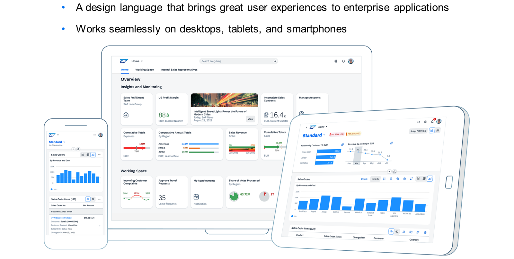
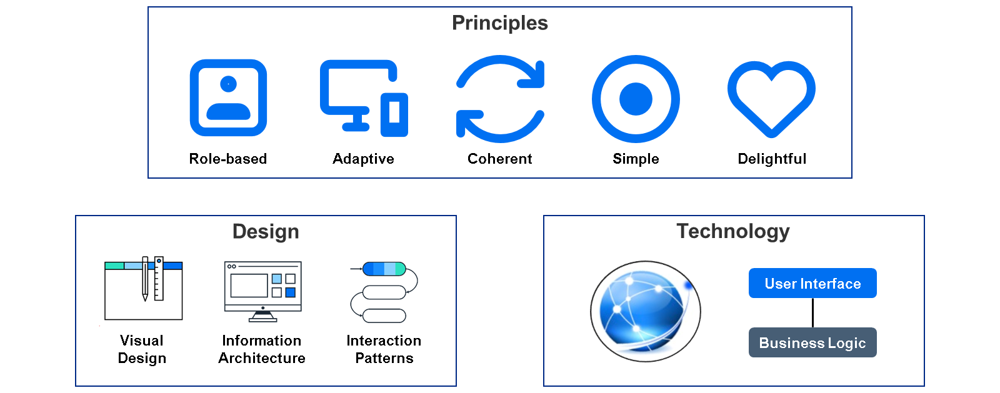
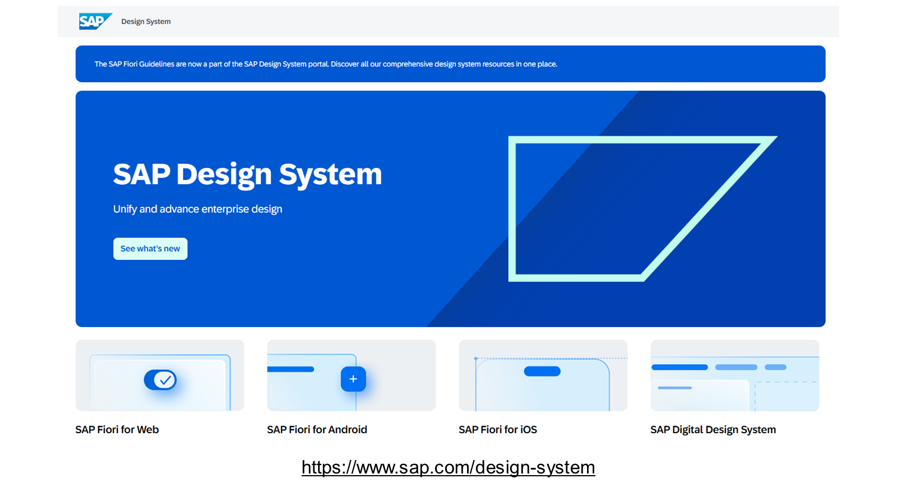
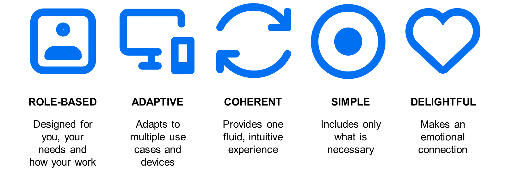
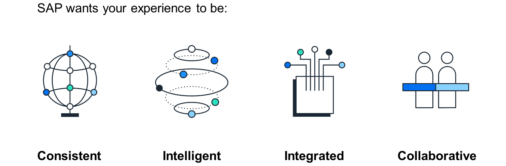

# Introducing SAP Fiori

*Source: https://learning.sap.com/courses/learning-the-basics-of-sap-fiori/introducing-sap-fiori_c3915ced-ffd1-4127-a822-e217ff45fd72*

Objectives
After completing this lesson, you will be able to:
  * Identify the dimensions of SAP Fiori
  * Explain the principles of SAP Fiori

## The Concept

SAP Fiori is a design language that brings great user experiences to enterprise applications based on SAP User Experience. It works seamlessly on desktops, tablets, and smartphones.
At the point of SAPPHIRE in 2013, the first 25 apps for managers and employees with request and approval functions had been released. Since then the number of apps has increased greatly. SAP Fiori 2.0 was introduced with SAP S/4HANA 1610, taking the idea of SAP Fiori to the next level. Today SAP Fiori 3 is the current target design, which evolves the SAP Fiori design language for all SAP products to fully support the Intelligent Suite.

The three dimensions in which SAP Fiori is defined are design, principles, and technology. In each dimension, rules and guidelines from optic, handling, interactions, and architectures to technologies in development and the system landscape are in place to define what SAP Fiori really is.
## The Design

People often think of user experience (UX) as something emotional rather than rational, making it difficult to create a business case for investing in good UX. But in fact good UX does have a monetary value, on top of the clear human value of making people happier.
### Monetary Value
A good UX helps improve **productivity**. People can get more done, because they are more effective. The system guides them with intelligence to what needs their attention most. Another important aspect is data quality: Incorrectly entered data costs a lot later on in the process. Ensuring good data quality right from the beginning saves later data corrections.
Easy-to-use software hardly needs any training, so you can **save** significant training costs and subsequent support desk costs.
If you include your end users in the implementation and ensure that the UX suits their needs up front, you **decrease** the number of change requests from users. Changes to a deployed UI are more expensive than changes made beforehand. Also user errors are reduced, decreasing costs due to poor data quality and support desk costs.
### Human Value
On top of these quantifiable benefits, a good UX brings clear human value benefits – which are particularly important when companies want to attract the best talents. Who does not want to work with cool modern tools rather than unattractive ones? A good UX **increases** user satisfaction allows inclusion of all employees, and helps ensure that people within the company actually use the software rather than keeping data separate on their desktop.
Providing your business units with software with a good UX helps **strengthen** your relationship with them, since you are providing software that their teams enjoy using. If the apps are used by customers, then a good UX helps build and increase customer loyalty.
Note
SAP offers the SAP UX Value Calculator to gauge potential savings and gather arguments that can be used to convince peers and managers to invest in a better user experience:
<https://apphaus.sap.com/resource/calculate-the-value-of-ux>
Watch the video to get an overview of design thinking.

All details of the SAP Fiori design are available as guidelines for general use. You can find all aspects of the SAP Fiori design starting with the five core design principles up to floorplans of pages and details for UI elements. There are also several resources available for download, such as the SAP icon font or font 72, to empower customers to design their own apps.
Since May 2016, SAP Fiori is also available for Apple iOS. Apple is a strong partner, especially in terms of design. There is a close cooperation between Apple and SAP to provide not only a merged design but also guidance and tools for developers to develop native apps for iOS. In addition, a growing number of apps is developed by this cooperation leveraging the features of Apple mobile devices.
Since June 2018, SAP Fiori is also available for Google Android. It provides a merged design and guidance for developers to develop native apps for Android. However, in contrast to SAP Fiori for iOS, no ready-to-use apps are provided to end users.
Since July 2023, SAP follows a human-centered AI approach, meaning that SAP looks at the users’ needs holistically, which includes aspects like building trust in addition to functional insights and guidance. User guidance can be provided by a graphical UI as well as using a conversational UI. Basically both allow the user to interact with the system and receive guidance. This guidance can be:
  * **Predictive** by analyzing historical data and making predictions or forecasts.
  * **Proactive** by providing insights relevant for the activity the user is doing in the system.
  * **Reactive** by helping users react to external triggers or events suggesting options for dealing with the situation.

Since June 2025, the SAP Fiori design guidelines are the all-encompassing SAP Design System guidelines. This broadens the scope of SAP Fiori to be the core design at SAP for all digital content including and empowered by AI.
To access SAP Design System guidelines, visit <https://www.sap.com/design-system>.
## The Principles

In the second dimension, SAP Fiori offers a unified user experience for various clients. Users should have a consistent, coherent, simple, intuitive, and delightful user experience on all devices to be able to work better and more efficiently. The five design principles of SAP Fiori are at the core of every SAP Fiori app to fulfill these goals. The role-based approach is, therefore, the biggest change in comparison with classic user interfaces.
SAP Fiori has changed user experience and empowered users to use role-based applications as compared to functional-based applications. Watch the video to learn how SAP Fiori has changed user experience from functional-based to role-based.
## The Technology
Watch the video to see the evolution of SAP Fiori.
Settings

In summary, the goal of SAP Fiori is to provide a consistent, intelligent, integrated, and collaborative user experience across all products. This is also known as SAP's customer experience goal.
## Browse the SAP Fiori Design Resources
### Business Example
You want to collect information and resources around SAP Fiori design.
### Task 1: Browse the SAP Community Page of SAP Fiori
#### Steps
  1. In a Web browser, open the _SAP Community_ (<https://community.sap.com/>) and examine the topics page of SAP Fiori.
    1. Open <https://community.sap.com/> in a browser of your choice.
    2. Choose _Topics_ at the top of the page.
    3. In the _Filter Topics_ field, enter **fiori**.
    4. Choose _SAP Fiori_ in the result list.
    5. Examine the SAP Fiori community page.
  2. In the SAP Community page for SAP Fiori, search for and open the SAP Fiori design guidelines using your SAP account.
    1. Scroll down to the _Design_ pane.
    2. In the _Design_ pane, choose the _SAP Fiori design guidelines_ link.
#### Result
The link is forwarded to the _SAP Design System_ portal.

### Task 2: Browse the SAP Design System Guidelines
#### Steps
  1. In the _SAP Design System_ portal (<https://www.sap.com/design-system>), search for the design principles of _SAP Fiori for Web_.
    1. In the _SAP Design System_ portal, choose _Web overview_ below _SAP Fiori for Web_.
    2. In the navigation bar on the left, choose _Discover_ → _SAP Design System_ → _Vision and Mission_.
    3. Choose the _Design Principles_ tile.
#### Result
The _Design Principles_ are displayed.
  2. In the _SAP Design System_ portal, search for the components of _My Home_ in SAP S/4HANA.
    1. In the navigation bar on the left, choose _Discover_ → _SAP Products_ → _SAP S/4HANA_.
    2. Choose the _SAP S/4HANA Product Home Page – My Home_ tile.
    3. Choose _Components_ on the right.
#### Result
The components of _My Home_ in SAP S/4HANA are displayed.
  3. In the _SAP Design System_ portal, search for design documentation of the UI element used to show messages in the object page floorplan.
    1. In the navigation bar on the left, choose _Page Types_ → _Floorplans_ → _Object Page_.
    2. Choose _Message Handling_ on the right.
    3. Choose the _message strip_ link in the text.
#### Result
The design documentation of the _Message Strip_ is displayed.
  4. In the _SAP Design System_ portal, search for the download options of font 72.
    1. In the navigation bar on the left, choose _Resources_ → _Download Fonts_.
    2. Choose _Font 72_ on the right.
#### Result
The download options of font 72 are displayed.
