# Technology

*Source: https://learning.sap.com/courses/learning-the-basics-of-sap-fiori/explaining-user-interfaces_c2d82120-6a0c-49d2-b872-8b5352c0dfad*

Objectives
After completing this lesson, you will be able to:
  * Explain UI technologies used in SAP Fiori
  * Explain SAPUI5 development.
  * Use SAP Business Application Studio for SAPUI5 Development.
  * Use Visual Studio Code for SAPUI5 development.

## UI Technologies
Watch the video to explore the tools and technologies in SAP UI.

Most SAP Fiori apps are web apps built using SAPUI5 as UI technology. SAPUI5 is based on HTML5 and can be consumed on every device using a browser. The recommended development environment for SAPUI5 is the _SAP Business Application Studio_.
SAP Fiori also supports native apps. These apps are developed in the native programming language used on a device, allowing a better integration. Apple and SAP are cooperating to develop native apps for iOS using _Apple Xcode_ as the development environment. The open source language Swift, which was originally created by Apple, serves as programming language (see <https://swift.org>). You can also develop native apps for Android using Java as the programming language in the _Android Studio_. In contrast to the cooperation with Apple, apps are not shipped by Google or SAP.
Cross platform SAP Fiori apps are developed using "low-level" code like metadata or scripts. The "low-level" code is dynamically interpreted to render a native mobile UI. The SAP Mobile Services provide the SAP Mobile Development Kit (MDK) for creating and interpreting "low-level" code. The MDK is integrated in the _SAP Business Application Studio_.
## HTML5
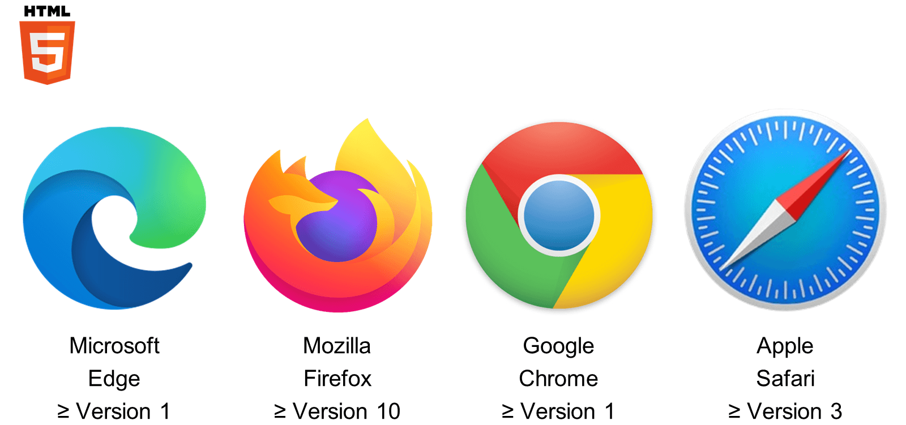
With SAPUI5 as a basis for web apps, browsers need a certain minimum release to process all code elements used in HTML5 and JavaScript. _Google Chrome_ and _Microsoft Edge_ both support HTML5 from the beginning. _Mozilla Firefox_ and _Apple Safari_ were updated to support it.
Caution
Although _Microsoft Internet Explorer_ has officially supported HTML5 since version 8, it is recommended to switch to _Microsoft Edge_. Microsoft and SAP announced the end of support for _Internet Explorer_.
For more information about this topic, please read SAP Note [1672817](https://me.sap.com/notes/1672817) – _Browser: Microsoft Legacy Edge and Internet Explorer Support Policy Note_.
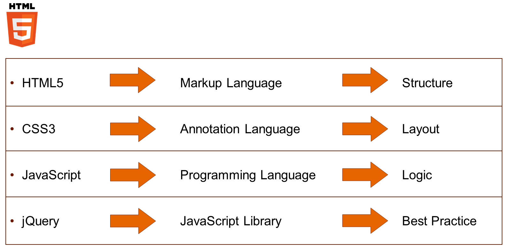
Hypertext Markup Language 5 (HTML5) is a markup language used to structure webpages. In combination with Cascading Style Sheets 3 (CSS3) for the layout, these webpages can be visualized using a browser. For dynamic interactions in webpages, the programming language JavaScript is used. JavaScript code is organized in libraries from which it can be reused in other webpages. jQuery is a well-known library in the area of HTML5 that offers best practices.
## SAPUI5
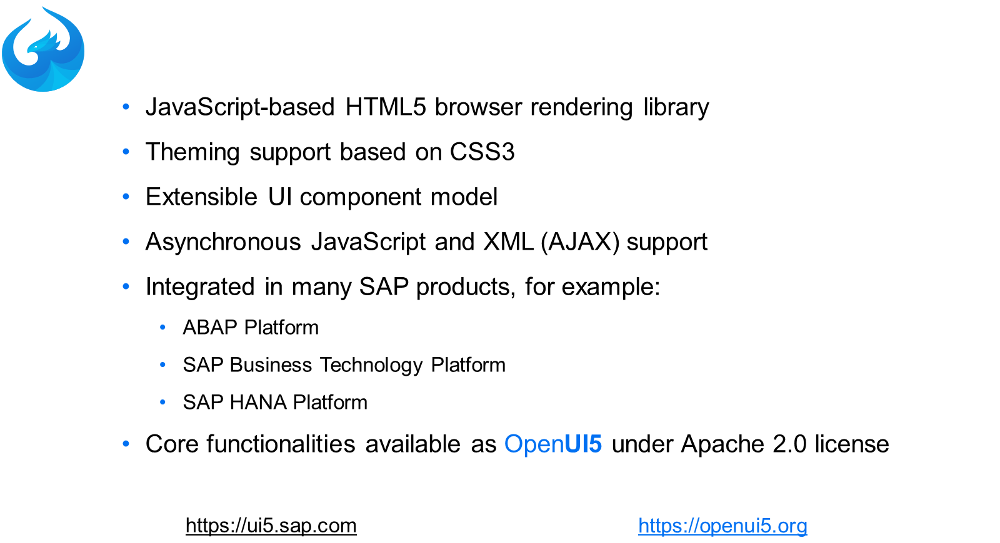
SAPUI5 was originally built on top of jQuery and added additional HTML5 browser rendering libraries. All extensions to jQuery aimed to make webpages SAP product standard-compliant in visualizing and handling. Today, most of the original jQuery libraries are replaced by SAP ones.
The original theme of SAPUI5, created in CSS3, was Gold Reflection. Today, SAPUI5 is closely coupled with SAP Fiori design implementing all supported themes in CSS3.
SAPUI5 extensibility options allow a wide range of adaptations:
  * Include custom JavaScript, HTML, and CSS in SAPUI5-based pages
  * Include custom JavaScript libraries
  * Create composite controls from existing SAPUI5 controls
  * Create new libraries and controls

Asynchronous JavaScript and XML (AJAX) was first implemented at SAP with _Web Dynpro_ , and it is also used in SAPUI5 to present a native-like handling of web apps. Apps developed with SAPUI5 present a consistent user experience and are responsive across browsers and devices including smartphones, tablets, and desktops. The user interface (UI) controls automatically adapt themselves to the capabilities of each device.
SAPUI5 is the SAP user interface development toolkit for HTML5. Let's try to better understand SAPUI5.
Besides SAPUI5, SAP also provides OpenUI5 as a delivery of the UI development toolkit. The core containing all central functionality and the most commonly used control libraries are identical in both deliveries. Although very closely related, they have their differences:

OpenUI5

OpenUI5 is open source, free to use, released under the Apache 2.0 license. OpenUI5 provides all the important features needed to build feature-rich Web applications. The source is available on <https://github.com/SAP/openui5/>.
If you find a bug or have an idea for a new feature, you can propose a GitHub issue or a change. Please read the guidelines first: <https://github.com/SAP/openui5/blob/master/CONTRIBUTING.md>.
For more information, please visit <https://openui5.org/>.

SAPUI5

SAPUI5 is not a separate SAP product with a separate license. It is integrated in many SAP products. The first one was the AS ABAP 7.4, which included SAPUI5 in the UI technologies component SAP_UI.
The additional libraries in SAPUI5 include more controls on top of OpenUI5, like charts and smart controls. The exact feature range of SAPUI5 also depends on the platform.
For more information, please visit <https://ui5.sap.com/>.
Technically, you can switch between OpenUI5 and SAPUI5 (provided you have a product where SAPUI5 is included). Please check first, which SAPUI5 version is needed. The version numbers of OpenUI5 and SAPUI5 might differ on patch level (last number).
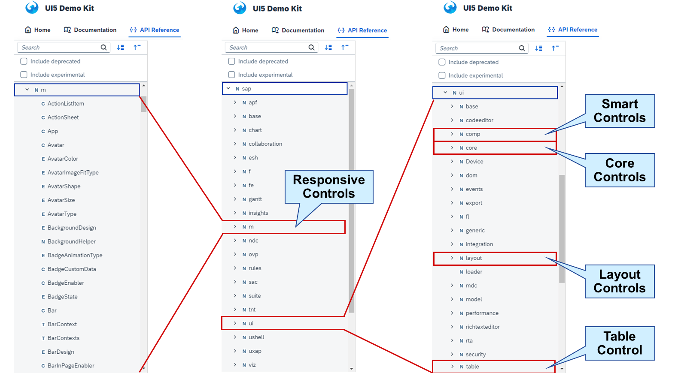
A library bundles a set of controls and related types to make them consumable by Web applications. There are predefined and standard libraries with many commonly used controls:
  * Responsive controls (sap.m)
  * Smart controls (sap.ui.comp)
  * Core controls (sap.ui.core)
  * Layout controls (sap.ui.layout)
  * Table control for desktop (sap.ui.table)

The core library (technically, this is the sap.ui.core library) defines a core set of types that can be used in other libraries. Developers can create their own custom UI libraries, making it easy-to-use their own controls alongside predefined controls.
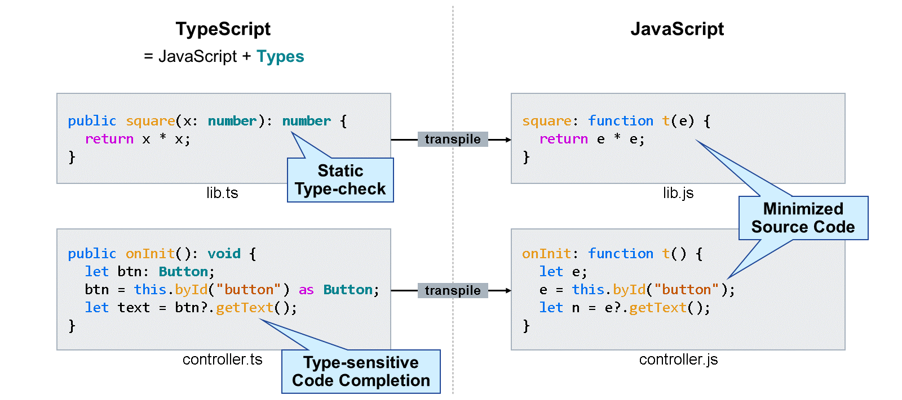
TypeScript is an extension of JavaScript that adds type information to the language. It helps developers catch errors early through type checking and by providing code assist in supporting code editors, for example through code completion and inline documentation. It increases development efficiency.
TypeScript is not much different from JavaScript. In fact, it is a super-set of JavaScript that adds some language features on top. As a simple example, if a variable is specified as number, then it is not possible to assign a string (which would be possible in JavaScript). The same is possible for more complex structures and classes. This type information is used by the code editor to help you writing code:
  * Error messages while you code
  * Code completion
  * Inline documentation
  * Easier refactoring and maintenance

Web browsers cannot execute TypeScript. Hence, a transpilation step is needed. It converts the code to JavaScript basically by stripping away all the type information and minimizing the code. This also means that the type safety and everything that TypeScript provides is purely focused on development time, not the runtime of the code. Nevertheless, the original source code can be made available to browsers using "source maps". During debugging, you can see the original TypeScript code you wrote.
SAPUI5 itself is written in JavaScript without any type information. But all the types of the SAPUI5 APIs are declared in separate type definition files. In the development environments provided by SAP, these type definitions are already added as dependencies and the transpilation step is also already set up.
### Model View Controller (MVC)
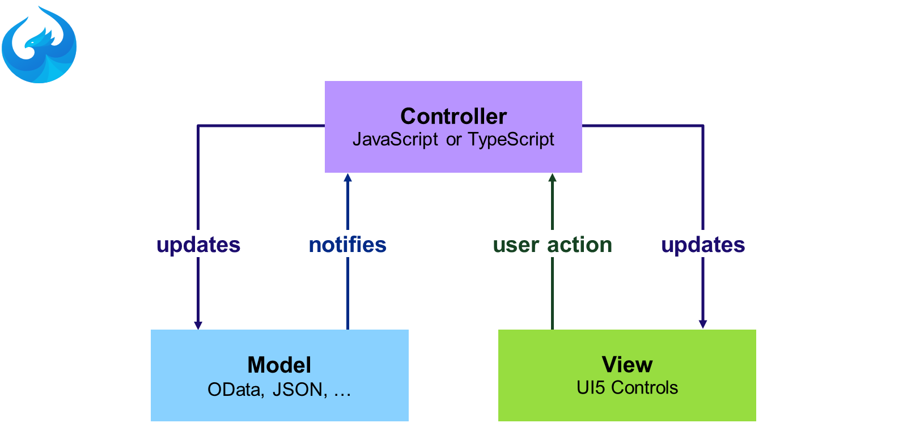
The Model View Controller (MVC) concept separates the tasks in an application into three programmatic elements:

Model

Holds the data of the app and/or connection to the data source organized as OData, JSON, XML, or resource bundle.

View

Holds the user interface consisting of UI5 controls organized in libraries.

Controller

Holds the logic of the application as TypeScript or JavaScript reacting on messages from models and views and updating these.
In SAP Fiori, views are defined using XML. The only SAP Fiori app that uses HTML is the _SAP Fiori launchpad_ , which provides a frame for the XML-based views. Controllers are developed using JavaScript and are either bound to a view or standalone to be used by multiple views. Data binding can be used on the views to connect to data in the models.
### SAPUI5 Versions
SAPUI5 provides updates on a regular basis through maintenance and innovation versions.
Watch the video to get an overview of SAPUI5 versions.
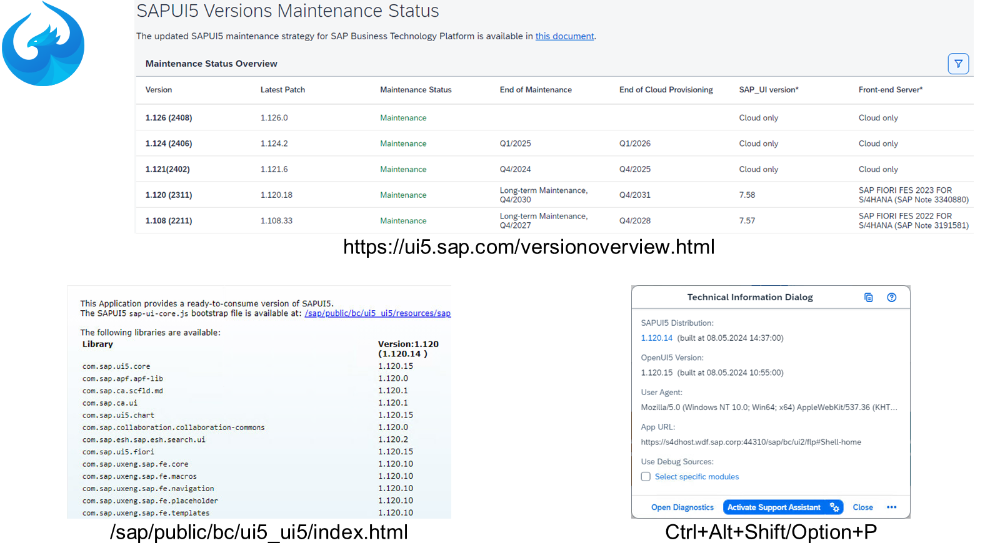
In an on-premise scenario, the SAPUI5 libraries are stored in the SAP_UI software component of an Application Server (AS) ABAP. The customer is responsible to keep this up-to-date.
In a cloud scenario, the SAPUI5 libraries are loaded from the Content Delivery Network (CDN) of SAP. SAPUI5 and OpenUI5 versions are removed from the CDN one year after their end of maintenance. In addition, patches of versions in maintenance, which are older than one year, are removed.
Caution
Once a version is removed, applications using this version will break. To avoid a potential security risk, update the applications to a more recent version:
SAP Note [3001696](https://me.sap.com/notes/3001696) - _Removed outdated SAPUI5 versions from SAPUI5 CDN - Fiori applications might stop functioning._
A full list of all SAPUI5 versions including their end of maintenance can be found under <https://ui5.sap.com/versionoverview.html>.
Which SAPUI5 versions are available on an AS ABAP is provided via https://<host>:<port>/sap/public/bc/ui5_ui5/index.html.
The version a running app is using is visible in the technical information dialog opened via CTRL+ALT+SHIFT+P on Microsoft Windows or via CTRL+ALT+OPTION+P on Apple Mac.
Note
For more information about this topic, see:
  * Developing UIs with SAPUI5 (Classroom Training)
<https://training.sap.com/course/ux400>
  * Developing SAPUI5 Applications (Learning Journey)
<https://learning.sap.com/learning-journeys/develop-sapui5-applications>
  * Patching SAP Fiori (SAPUI5) (Learning Video)
<https://learning.sap.com/videos/patching-sap-fiori-sapui5->

## SAPUI5 Development Tools
Time to look at SAPUI5 development tools. These include _SAP Business Application Studio_ and _Visual Studio Code_.
Let's compare the two tools.
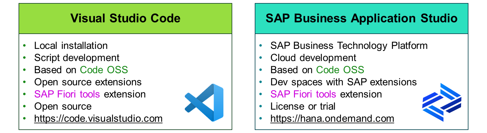
Since 2020, SAP provides the _SAP Business Application Studio (BAS)_ , back then based on Theia, an open source project by Eclipse. Since 2022, it is based on Code OSS, an open source project by Microsoft. It is provided in the SAP BTP as a service subscription and brings its own runtime. It provides preconfigured environments, so-called _Dev Spaces_ , with preinstalled runtimes and tools tailored for key scenarios. These are based on extensions such as the _SAP Fiori tools_ extension.
Another tool where the _SAP Fiori tools_ extension can be included is _Visual Studio (VS) Code_. It is developed by Microsoft based on the open source IDE Code OSS. Although not based on Theia, it is fully compatible. SAP offers the _SAP Fiori tools_ beside others free of charge in the extensions marketplace of _VS Code_. _VS Code_ can be downloaded under <https://code.visualstudio.com/>.
Note
Between 2014 and 2019, SAP provided the _SAP Web Integrated Development Environment (IDE)_ based on Orion, an open source project by Eclipse. Today, it is recommended to use the SAP BAS instead.
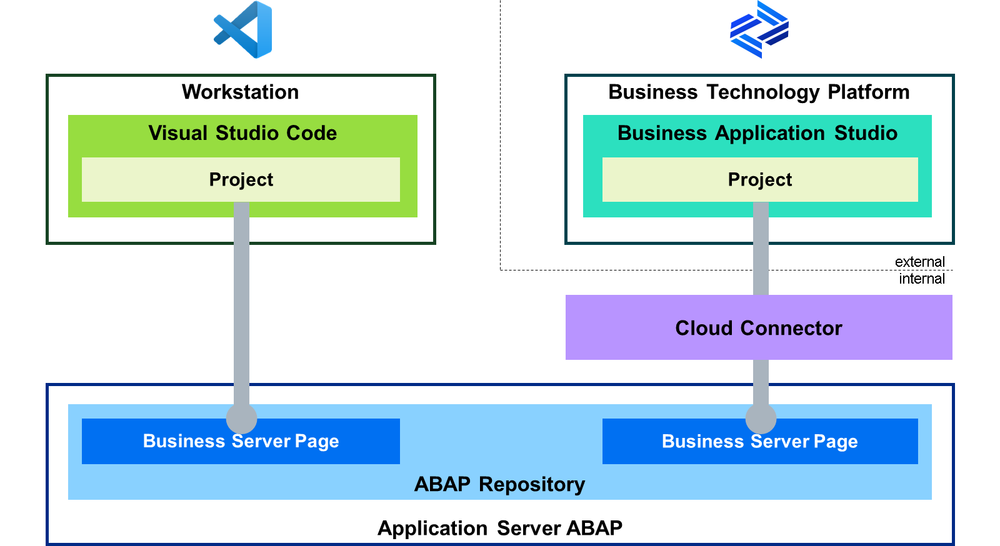
Developing an SAP Fiori web app means developing SAPUI5 using the _SAP Fiori tools_ extension in SAP BAS or _VS Code_. A project in the development environments can connect and, therefore, represents an SAP Fiori app delivered and managed in an Application Server (AS) ABAP as _Business Server Page (BSP)_. The BSP serves as a container for SAPUI5 apps, although BSP was originally developed based on HTML4. The tools in the _ABAP Workbench_ (SE80) have not been updated for this new role of BSP. The complexity of SAPUI5 is better handled in a pure web-based environment.
The Cloud Connector is a standalone software that is available free of charge to connect the services in the SAP BTP with the on-premise systems in the customer network. Once installed in the customer network, it establishes a secure SSL Virtual Private Network (VPN) connection to the SAP BTP. Therefore, it is not needed for _VS Code_. The Cloud Connector is available for download under <https://tools.hana.ondemand.com/>.
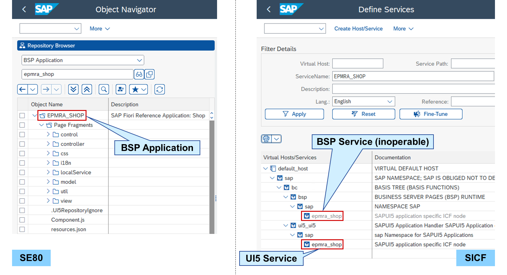
In the _ABAP Workbench_ (SE80), SAPUI5 artifacts can be displayed by opening the surrounding BSP application. This allows some administrative functions like assigning the BSP to a transport request or to another package. It is also possible to view the unformatted source code in the files, but it is not suitable to edit any artifacts.
All HTTP services of an AS ABAP are organized in the _HTTP Service Hierarchy Maintenance_ (SICF). The HTTP service to run an SAPUI5 application can be found under /sap/bc/ui5_ui5 in the Internet Communication Framework (ICF). Applications without an own namespace are organized in the subfolder sap. The name of the service is equal to the name of the BSP application.
The HTTP service to run a BSP application can be found under /sap/bc/bsp. This does also mean that for a BSP housing an SAPUI5 application, the same applies. But these services are inoperable because there is no actual BSP application connected. These services can be ignored and therefore deactivated.
## SAP Business Application Studio
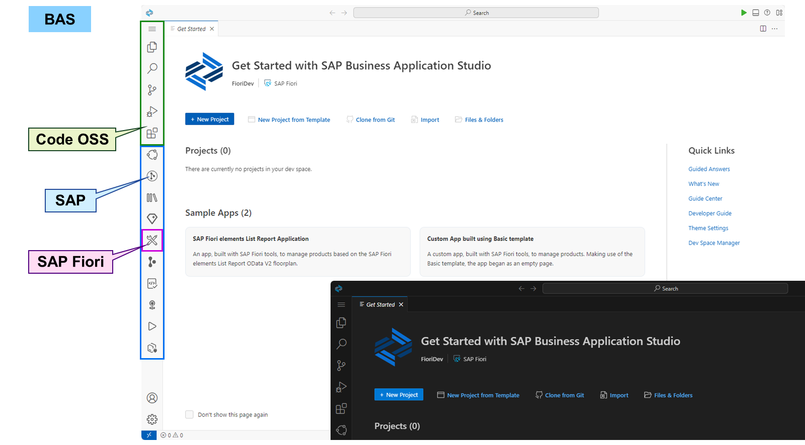
When starting the _SAP Business Application Studio (BAS)_ , the _Get Started_ page is shown. It offers buttons to start the development by creating, cloning, importing, or just opening projects. On the left side, side panels can be opened to jump to different parts of the development. The upper ones originate from Code OSS, the lower ones were included by SAP, like the one for SAP Fiori.
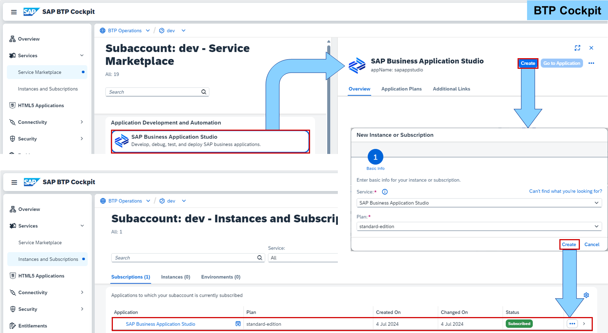
The SAP BAS is hosted as a service subscription in a subaccount of the SAP Business Technology Platform (BTP). A subscription is standalone and runs without the need of a runtime environment or any other service. The entitlement, the right to provision and consume a resource, must be available in the subaccount.
From the _Service Marketplace_ in the _SAP BTP Cockpit_ of a subaccount, a service can be created by choosing a service plan. Creating the SAP BAS does not need any additional data and results in a service subscription in _Instances and Subscriptions_.
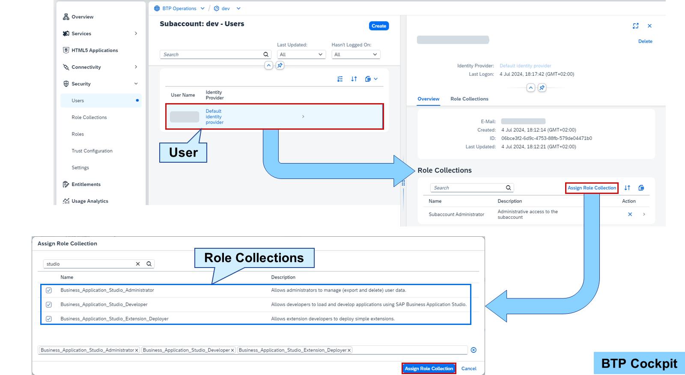
For operating the SAP BAS, certain authorizations are needed. These are organized in the following role collections:

Business_Application_Studio_Administrator
    Allows administrators to manage (export and delete) user data.

Business_Application_Studio_Developer
    Allows developers to load and develop applications.

Business_Application_Studio_Extension_Deployer
    Allows extension developers to deploy simple extensions.
Assigning a role collection can be done in the _SAP BTP cockpit_ under _Security_ → _Users_. Select the user and choose _Assign Role Collection_ on the right. Then, select the role collections you want to assign.
For the role collections to be available, the service must be successfully subscribed.
Watch the video to see how to create a dev space in SAP Business Application Studio.
Settings
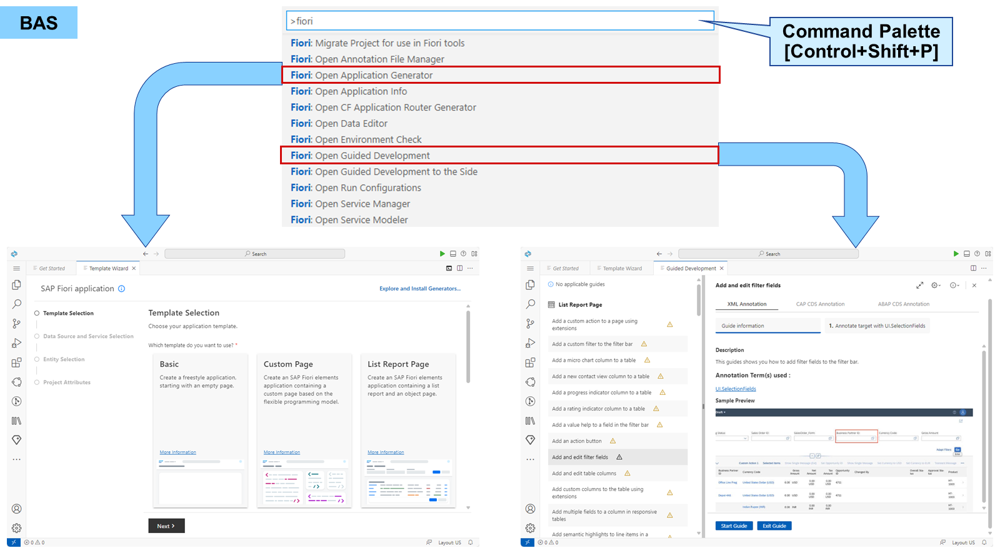
Although the SAP BAS offers several buttons and menu entries to start a tool of the _SAP Fiori tools_ , the most comprehensive list of tools can be accessed in the _Command Palette_. Choose _Help_ → _Show All Commands_ in the menu or use Control+Shift+P to show and run commands. Entering **fiori** in the _Command Palette_ provides a list with all _SAP Fiori tools_ to start from including generators and templates.
## Operate SAP Business Application Studio
### Business Example
You want to explore the features of _SAP Business Application Studio (BAS)_.
Note
This exercise requires an account on SAP Business Technology Platform. The login information is provided by your system setup guide of your SAP Learning system.
### Task 1: Prepare the SAP Business Application Studio for Operation
Exercise[Start Exercise](https://learnsap.enable-now.cloud.sap/pub/mmcp/index.html?show=project!PR_1DD9921AE783C184:uebung)
#### Steps
  1. Log on to SAP Business Technology Platform (BTP) using your SAP BTP account.
    1. In the Windows start menu, choose a Web browser.
    2. In the Web browser favorites, choose a suitable _SAP BTP Cockpit_ in the _SAP Business Technology Platform_ folder or enter <https://emea.cockpit.btp.cloud.sap/>.
    3. Log on using your SAP BTP account.
  2. In the _SAP BTP Cockpit_ of your subaccount, create a service subscription for the _SAP Business Application Studio (BAS)_ with the service plan **standard-edition**.
    1. In the _SAP BTP Cockpit_ , choose your subaccount.
    2. On the left-hand side, choose _Services_ → _Service Marketplace_.
    3. In the _Search_ field, enter **studio**.
    4. Choose _SAP Business Application Studio_.
    5. Choose _Create_ at the top right-hand corner.
    6. In the _New Instance and Subscription_ popup, select the _Plan_**standard-edition** and choose _Create_.
    7. In the _Creation Progress_ popup, choose _View Subscription_.
    8. Wait until the _Status_ changes into _Subscribed_.
  3. In the _SAP BTP Cockpit_ of your subaccount, assign the _Business_Application_Studio_Administrator_ and _Business_Application_Studio_Developer_ role collections to your user.
    1. In the _SAP BTP Cockpit_ of your subaccount, choose _Security_ → _Users_ on the left-hand side.
    2. Choose your user.
    3. Choose _Collapse the first column_ (the arrow in the separator).
    4. Choose _Assign Role Collection_.
    5. In the _Assign Role Collection_ popup, in the _Search_ field, enter **studio**.
    6. Select _Business_Application_Studio_Administrator_ and _Business_Application_Studio_Developer_.
    7. Choose _Assign Role Collection_.

### Task 2: Examine the Guides and Templates in the SAP Business Application Studio
Exercise[Start Exercise](https://learnsap.enable-now.cloud.sap/pub/mmcp/index.html?show=project!PR_6342C020597683A4:uebung)
#### Steps
  1. Start the BAS of your subaccount and create the dev space **FioriDev**.
Note
If the error is shown that the web page is not available, log off and close your browser sessions. Then log on again and repeat this step.
    1. In the _SAP BTP Cockpit_ of your subaccount, choose _Services_ → _Instances and Subscriptions_ on the left-hand side.
    2. Choose _SAP Business Application Studio_.
Note
If the error that the web page is not available appears, log off and close your browser sessions. Then log on again and repeat the step.
    3. Choose _Create Dev Space_.
    4. In the _Dev Space name_ field, enter **FioriDev**.
    5. Choose _SAP Fiori_ on the left-hand side.
    6. Choose _Create Dev Space_.
    7. Wait until the status changes to _RUNNING_.
  2. In the BAS, examine the available templates and guides for SAP Fiori.
    1. In the BAS, choose the _FioriDev_ dev space.
    2. On the _Get Started_ page, choose _New project from Template_.
Note
If the _Get Started_ page does not appear automatically, choose _Help_ → _Get Started_.
    3. Examine the available templates.
    4. Choose **Ctrl+Shift+P**.
    5. In the _Command Palette_ at the top, enter **fiori**.
    6. Choose _Fiori: Open Guided Development_ from the list.
    7. Examine the available guides.
Note
The warning symbol behind every guide just means that there is no project to apply changes to, yet.

## SAP Extensions in Visual Studio Code
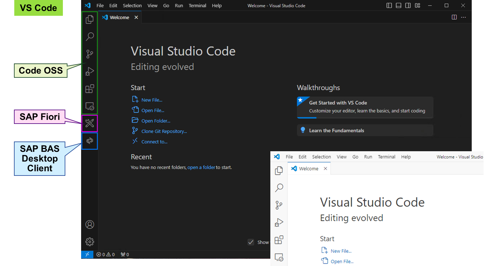
When starting the _Visual Studio Code (VS Code)_ , the _Welcome_ page is shown. It offers buttons to start the development by creating, cloning, importing, or just opening projects. On the left side, side panels can be opened to jump to different parts of the development. The upper ones originate from Code OSS. The lower ones are based on installed extensions, like the one for SAP Fiori.
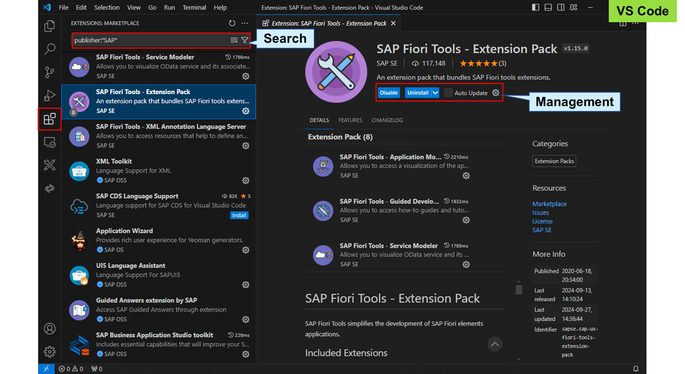
The _Extensions_ side panel grants access to the extension marketplace for _VS Code_. Assuming that an internet connection is available, a search for all existing extensions can be performed. You can read the documentation, install or uninstall, enable or disable, change settings, and check for updates. The search field also supports tags. Entering **@** in the search field shows a list of possible search criteria like categories.
Hint
If you choose the vendor of an extension like _SAP SE_ in the UI, **publisher:"SAP"** is put in the search field and all extensions of this vendor are shown.
_SAP Fiori tools_ are an extensions pack consisting of seven extensions. It is recommended to install the whole extension pack with all included extensions in the same version. Other extensions may be valuable to support the development of SAP Fiori like the _UI5 Language Assistant_.
### SAP Fiori Tools in Visual Studio Code
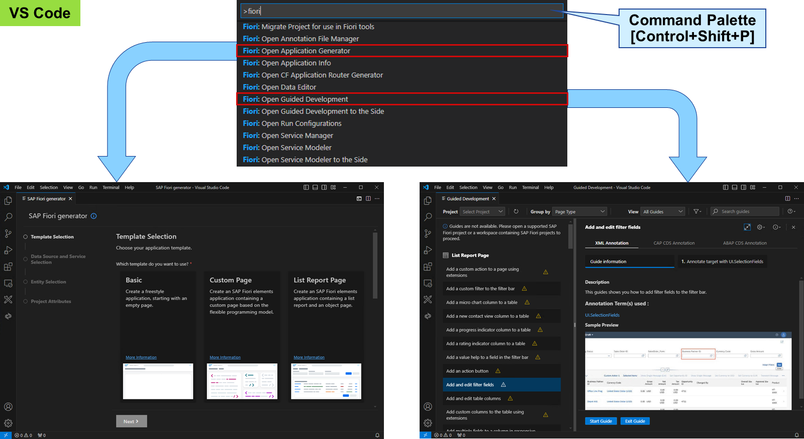
The _VS Code_ only offers a few buttons and menu entries to start a tool of the _SAP Fiori tools_ directly. The most comprehensive list of tools can be accessed in the _Command Palette_. Choose _Help_ → _Show All Commands_ in the menu or use Control+Shift+P to show and run commands. Entering **fiori** in the _Command Palette_ provides a list with all _SAP Fiori tools_ to start from including generators and templates.
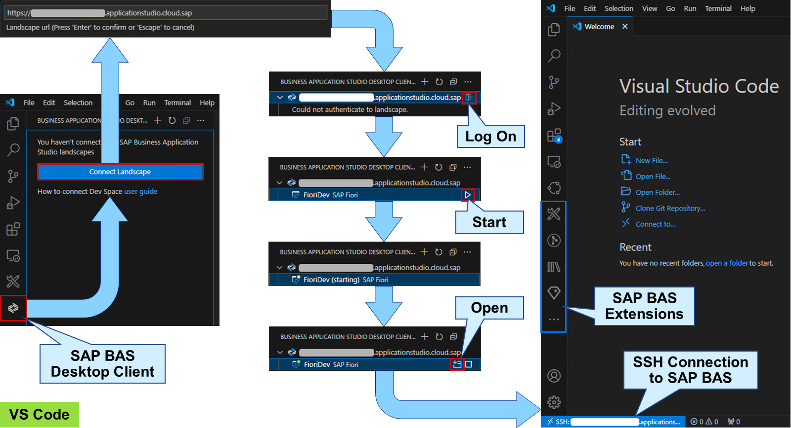
The _SAP Business Application Studio toolkit_ extension allows you to connect and access dev spaces of _SAP Business Application Studio (BAS)_ in _VS Code_. It can be found and installed in the extension marketplace.
The extension adds the _SAP BAS Desktop Client_ as a side panel. For the connection, the URL to access the _SAP BAS_ is needed. The logon uses a Web browser window asking for your credentials and establishing an SSH connection in a new _VS Code_ window. You can access and change the connection details choosing the blue SSH URL at the bottom of the window.
Accessing a dev space in _VS Code_ loads all extensions of the dev space in the local _VS Code_ window. This includes extensions, which are not available in the extension marketplace. In addition, you can add more extensions from the extension marketplace.
Caution
If you install third-party extensions while using a remote connection to _SAP BAS_ , the third-party may be able to access your data from the dev space.
You can start and stop dev spaces, open the dev space manager, and connect to multiple dev spaces of different accounts. All settings are saved in the dev spaces but are used locally in _VS Code_.
## Operate SAP Fiori Tools in Visual Studio Code
### Business Example
You want to explore the features of _SAP Fiori tools_ in _Visual Studio Code_.
Note
This exercise requires an SAP Learning system. Please consult your system setup guide on how to initialize _Visual Studio Code_.
### Task 1: Examine and Operate SAP Fiori Tools in Visual Studio Code
Exercise[Start Exercise](https://learnsap.enable-now.cloud.sap/pub/mmcp/index.html?show=project!PR_18D922F872D82582:uebung)
#### Steps
  1. Start _Visual Studio Code_ and check the status and details of the _SAP Fiori tools - Extension Pack_.
    1. In the Windows start menu, choose _Visual Studio Code_.
    2. Choose _Extensions_ on the left-hand side.
    3. In the _Search Extensions in Marketplace_ field, enter **fiori tools**.
    4. Choose _SAP Fiori Tools - Extension Pack_.
    5. Examine the details.
  2. In the _SAP Fiori tools_ in _Visual Studio Code_ , examine the available templates and guides for SAP Fiori.
    1. Choose **Ctrl+Shift+P**.
    2. In the _Command Palette_ at the top, enter **fiori**.
    3. Choose _Fiori: Open Application Generator_ from the list.
Note
When starting for the first time, you may need to wait for the @sap/generator-fiori to finish installation.
    4. Examine the available templates.
    5. Choose **Ctrl+Shift+P**.
    6. In the _Command Palette_ at the top, enter **fiori**.
    7. Choose _Fiori: Open Guided Development_ from the list.
    8. Examine the available guides.
Note
The warning symbol behind every guide just means that there is no project to apply changes to, yet.

## Access SAP Business Application Studio in Visual Studio Code
### Business Example
You want to access your _SAP Business Application Studio_ in _Visual Studio Code_.
Note
This exercise requires an SAP Learning system and an account on the SAP Business Technology Platform. The login information is provided by your system setup guide including a guide on how to initialize _Visual Studio Code_.
### Prerequisites
The dev space was created in exercise **Operate SAP Business Application Studio**.
### Task 1: Examine the SAP Business Application Studio Toolkit and Access a Dev Space in Visual Studio Code
Exercise[Start Exercise](https://learnsap.enable-now.cloud.sap/pub/mmcp/index.html?show=project!PR_A3EF20A9C4F66984:uebung)
#### Steps
  1. Start _Visual Studio Code_ and check the status and details of the _SAP Business Application Studio toolkit_.
    1. In the Windows start menu, choose _Visual Studio Code_.
    2. Choose _Extensions_ on the left-hand side.
    3. In the _Search Extensions in Marketplace_ field, enter **sap business**.
    4. Choose _SAP Business Application Studio toolkit_.
    5. Examine the details.
  2. In the _SAP Business Application Studio Desktop Client_ , connect to your _SAP Business Application Studio_ and access your _FioriDev_ dev space.
    1. In your _Visual Studio Code_ , choose _SAP Business Application Studio Desktop Client_ on the left.
    2. Choose _Connect Landscape_.
    3. In the _Landscape url_ field, enter the URL of your _SAP Business Application Studio_ and choose **Enter**.
#### Example
https://dev-jw6tkqi9.eu10cf.applicationstudio.cloud.sap
    4. Select your landscape and choose _Log in_ at the end of the line.
    5. In the _Visual Studio Code_ popup asking for permission, choose _Allow_.
    6. In the _Visual Studio Code_ popup asking to open the external website, choose _Open_.
    7. In the Web browser, log on using your SAP BTP account running your _SAP Business Application Studio_.
    8. Close the Web browser.
    9. In _Visual Studio Code_ , select the _FioriDev_ dev space.
    10. If the dev space is stopped, choose _Start dev space_ at the end of the line.
    11. Choose _Open in new window_ at the end of the line.
#### Result
The dev space opens in a new window of _Visual Studio Code_.
