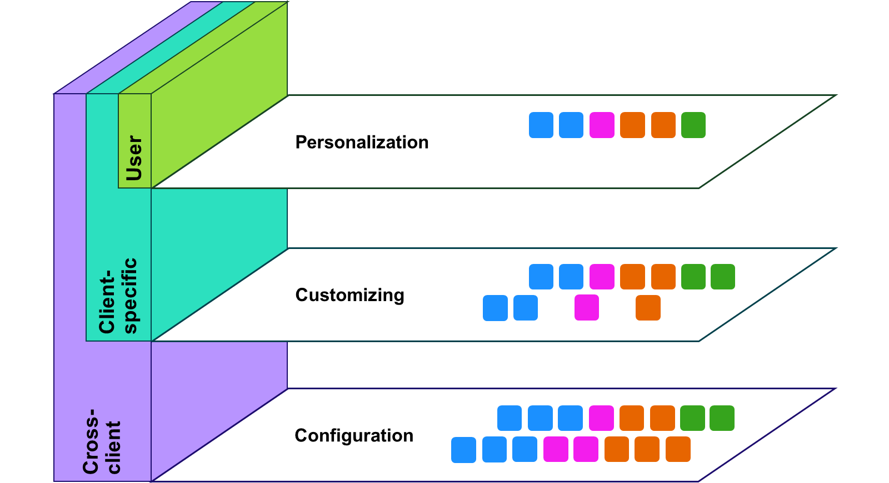
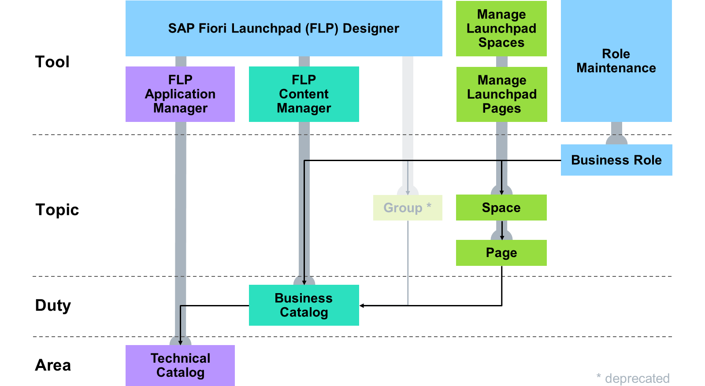
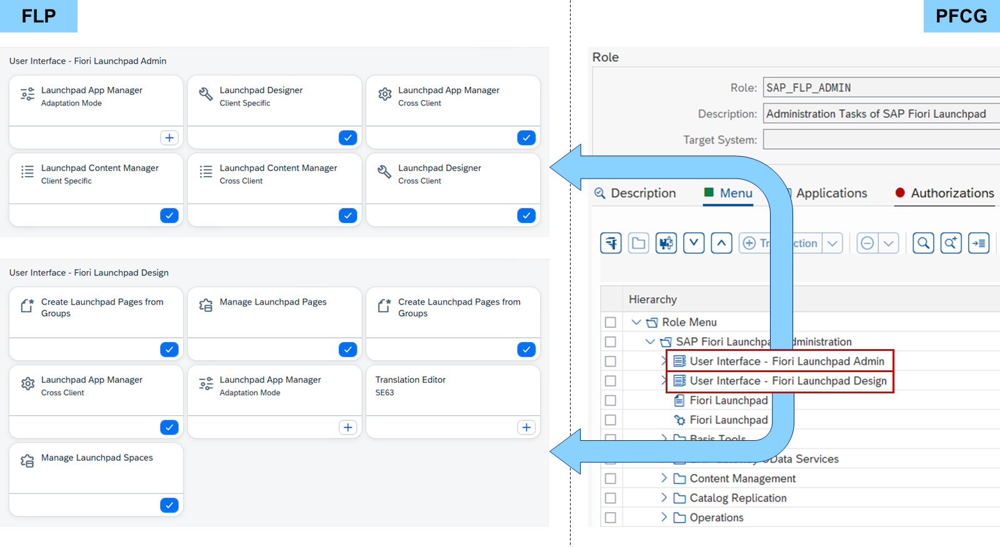
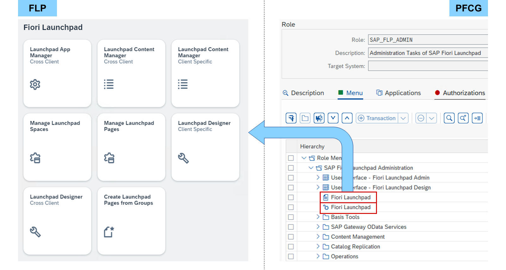

# Content Management

*Source: https://learning.sap.com/courses/learning-the-basics-of-sap-fiori/managing-sap-fiori-content_f7774ceb-cd83-45ff-b3ea-ad21e45a52b5*

Objective
After completing this lesson, you will be able to manage SAP Fiori content.
## Content Assignment

The settings for the _SAP Fiori launchpad (FLP)_ are organized in the three layers:
  * The basic layer configuration consists of settings valid for all clients of an AS ABAP.
  * The layer customizing builds on the configuration and fine tunes the settings per client.
  * End users can then personalize these settings in their personalization layer.

Every layer can only change the elements made available by their sublevel or reduce elements for usage in the next layer. Users can only personalize apps that were originally provided in the configuration layer and made available in the customizing layer.
Catalogs are the basis of the SAP Fiori content in the FLP.
Watch the video to understand how content is defined in all three layers of settings available for FLP.

The personalization is performed by each user in the FLP. For Configuration and customizing, each element of the SAP Fiori content has its own tool. The only exception is the _SAP Fiori launchpad designer_ , which can handle groups, technical and business catalogs alike:

Role Maintenance (PFCG)
    ABAP transaction for roles available for decades

SAP Fiori Launchpad Designer (FLPD)
    Standalone SAPUI5 application for groups, technical and business catalogs available since SAP_UI 7.40

SAP Fiori Launchpad Content Manager (FLPCM)
    ABAP transaction for business catalogs available since SAP_UI 7.53

SAP Fiori Launchpad Application Manager (FLPAM)
    Web Dynpro ABAP application for technical catalogs available since SAP_UI 7.55

Manage Launchpad Spaces
    SAPUI5 app in the FLP for spaces available since SAP_UI 7.55

Manage Launchpad Pages
    SAPUI5 app in the FLP for pages available since SAP_UI 7.55
Note
For more information about this topic, see:
Bringing Apps Onto SAP Fiori Launchpad for SAP S/4HANA Cloud and SAP S/4HANA Cloud Private Edition (Learning Video)
<https://learning.sap.com/videos/bringing-apps-onto-sap-fiori-launchpad-for-sap-s-4hana-cloud-and-sap-s-4hana-cloud-private-edition>
## Role Maintenance
Let's start with Role Maintenance (PFCG), an ABAP transaction for roles available for decades.

Since SAP_UI 7.55, the SAP_FLP_ADMIN role includes all tools for maintaining SAP Fiori. The core is the two catalogs SAP_BASIS_BC_UI_FLA and SAP_BASIS_BC_UI_FLD. These enable the user to maintain SAP Fiori via the _SAP Fiori launchpad_.

To make it even easier, a space and a group providing tiles for all tools are also part of the SAP_FLP_ADMIN role. In addition, plenty of other ABAP transactions around SAP Fiori are provided in the SAP easy access menu.
Note
The SAP_FLP_ADMIN single role replaces the SAP_UI2_ADMIN composite role.
Watch this video to learn more about Role Maintenance.
Settings
## Create Business Roles
### Business Example
You want to assign an SAP Fiori catalog, group, and space to a business role.

Solution:

SAP_BR_UX100_S_FLP_ADMIN (Role)
Note
This exercise requires an SAP Learning system. Login information is provided by your system setup guide.
Note
Whenever the values or object names in this exercise include ##, replace ## with the number of your user.
### Task 1: Create a Business Role and Assign a User to the Role
Exercise[Start Exercise](https://learnsap.enable-now.cloud.sap/pub/mmcp/index.html?show=project!PR_7B4AF9D831A554BE:uebung)
#### Steps
  1. Log on to your SAP S/4HANA (S4H) system using _SAP GUI_.
    1. In the _SAP Business Client_ or _SAP Logon_ , choose the SAP GUI SNC system entry of your S4H.
    2. Choose _Log On_.
  2. In the _Role Maintenance_ (PFCG) of your S4H, create the role **Z_##_BR_FLP_ADMIN**. Assign the _Z_##_BR_FLP_ADMIN_ role to your user.
    1. In the _SAP Easy Access_ menu of your S4H, search for _Role Maintenance_ or start transaction PFCG.
    2. In the _Role_ field, enter **Z_##_BR_FLP_ADMIN**.
    3. Choose _Create Single Role_.
    4. In the _Description_ field, enter **SAP Fiori Launchpad Administration ##**.
    5. Choose _Save_.
    6. Choose the _User_ tab.
    7. In the _User ID_ field, enter your user.
    8. Choose _Save_.

### Task 2: Assign Catalogs to a Business Role and Test it in the SAP Fiori Launchpad
Exercise[Start Exercise](https://learnsap.enable-now.cloud.sap/pub/mmcp/index.html?show=project!PR_454C776D138B0882:uebung)
#### Steps
  1. In the _Role Maintenance_ (PFCG) of your S4H, add the _SAP_BASIS_BC_UI_FLA_ and _SAP_BASIS_BC_UI_FLD_ catalogs to the menu of the _Z_##_BR_FLP_ADMIN_ role.
    1. In the _Role Maintenance_ (PFCG), choose the _Menu_ tab.
    2. Expand the _Insert Node_ button.
Hint
The initial value written on the _Insert Node_ button is _Transaction_.
    3. Choose _SAP Fiori Launchpad_ → _Launchpad Catalog_.
    4. In the _Catalog ID_ field, enter ***basis*** and use the value help.
    5. In the popup, double-click _SAP_BASIS_BC_UI_FLA_.
    6. Choose _Continue_.
    7. Choose the _Insert Node_ button.
Hint
The value written on the _Insert Node_ button is _Launchpad Catalog_.
    8. In the _Catalog ID_ field, enter ***basis*** and use the value help.
    9. In the popup, double-click _SAP_BASIS_BC_UI_FLD_.
    10. Choose _Continue_.
    11. Choose _Save_.
  2. Check if the _User Interface - Fiori Launchpad Admin_ and _User Interface - Fiori Launchpad Design_ catalogs are part of the _SAP Fiori launchpad_ of your S4H.
    1. Start or reload the _SAP Fiori launchpad_ of your S4H in the client of your choice.
    2. Choose _Home_ in the upper left corner.
    3. In the _All My Apps_ popup, choose _User Interface - Fiori Launchpad Admin_ from the list of catalogs.
    4. Examine the apps on the right.
    5. In the _Navigation Menu_ , choose _User Interface - Fiori Launchpad Design_ from the list of catalogs.
    6. Examine the apps on the right.

### Task 3: Assign a Space to a Business Role and Test it in the SAP Fiori Launchpad
Exercise[Start Exercise](https://learnsap.enable-now.cloud.sap/pub/mmcp/index.html?show=project!PR_1855D0EB4C47079B:uebung)
#### Steps
  1. In the _Role Maintenance_ (PFCG) of your S4H, add the _SAP_BASIS_SP_UI_FLP_ space to the menu of the _Z_##_BR_FLP_ADMIN_ role.
    1. In the _Role Maintenance_ (PFCG), choose the _Menu_ tab.
    2. Expand the _Insert Node_ button.
Hint
The initial value written on the _Insert Node_ button is _Launchpad Catalog_.
    3. Choose _SAP Fiori Launchpad_ → _Launchpad Space_.
    4. In the _Space ID_ field, enter ***basis*** and use the value help.
    5. In the popup, double-click _SAP_BASIS_SP_UI_FLP_.
    6. Choose _Continue_.
    7. Choose _Save_.
  2. Check if the _Fiori Launchpad_ space is part of the _SAP Fiori launchpad_ spaces of your S4H.
    1. Start or reload the _SAP Fiori launchpad_ spaces of your S4H in the client of your choice.
    2. Choose the _Fiori Launchpad_ space at the top.
#### Result
Tiles of apps for managing the _SAP Fiori launchpad_ content are displayed.

### Task 4: Assign a Group to a Business Role and Test it in the SAP Fiori Launchpad
Exercise[Start Exercise](https://learnsap.enable-now.cloud.sap/pub/mmcp/index.html?show=project!PR_B03A524B68D5CCAE:uebung)
#### Steps
  1. In the _Role Maintenance_ (PFCG) of your S4H, add the _SAP_BASIS_BCG_UI_FLP_ group to the menu of the _Z_##_BR_FLP_ADMIN_ role.
    1. In the _Role Maintenance_ (PFCG), choose the _Menu_ tab.
    2. Expand the _Insert Node_ button.
Hint
The initial value written on the _Insert Node_ button is _Launchpad Space_.
    3. Choose _SAP Fiori Launchpad_ → _Launchpad Group_.
    4. In the _Group ID_ field, enter ***basis*** and use the value help.
    5. In the popup, double-click _SAP_BASIS_BCG_UI_FLP_.
    6. Choose _Continue_.
    7. Choose _Save_.
  2. Check if the _Fiori Launchpad_ group is part of the _SAP Fiori launchpad_ home page of your S4H.
    1. Start or reload the _SAP Fiori launchpad_ spaces of your S4H in the client of your choice.
    2. Choose your user in the upper right-hand corner.
    3. Choose _Settings_.
    4. In the _Settings_ popup, choose _Spaces and Pages_.
    5. Deselect the _Use Spaces_ checkbox and choose _Save_.
    6. Choose the _Fiori Launchpad_ anchor at the top.
#### Result
Tiles of apps for managing the _SAP Fiori launchpad_ content are displayed.
