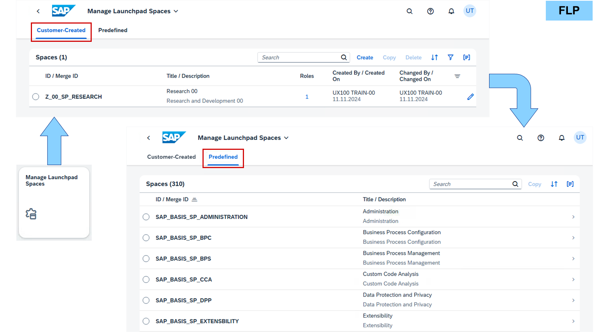
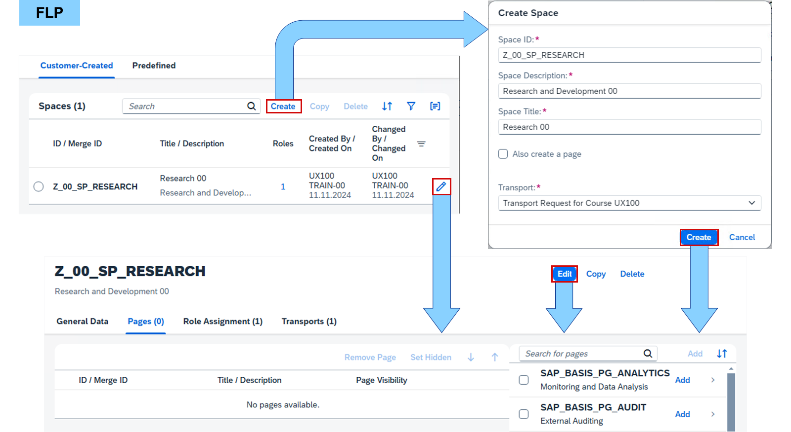
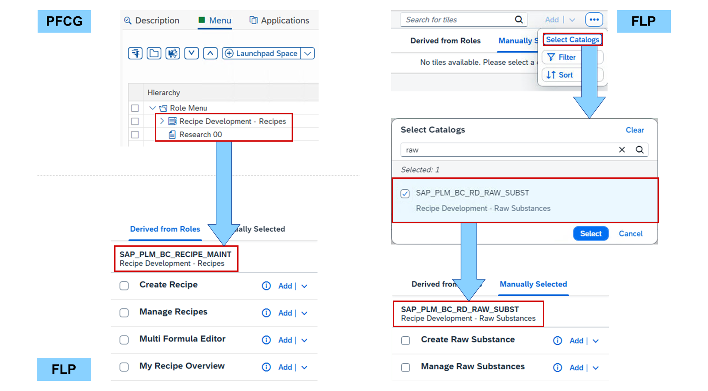
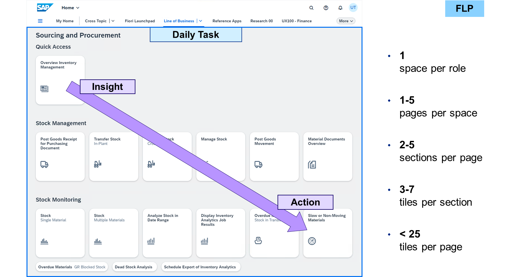

# Creating SAP Fiori Spaces and Pages

*Source: https://learning.sap.com/courses/learning-the-basics-of-sap-fiori/creating-sap-fiori-spaces-and-pages_a13f2740-7386-4c78-9f37-4248268a8b35*

Objective
After completing this lesson, you will be able to create SAP Fiori spaces and pages.
## Manage Launchpad Spaces

_Manage Launchpad Spaces_ is an _SAP Fiori launchpad (FLP)_ app based on SAPUI5. It shows all spaces delivered by SAP and allows customers to create their own spaces.

When creating or changing a space, a customizing transport request is mandatory. It is not possible to do any local customizing not assigned to a transport request. Every space has an ID, description, title, and at least one page. When customers create their own space, they can assign pages by SAP or their own pages. Customer space IDs must start with Z or Y and should contain the abbreviation SP for space.
The sort order of spaces in the FLP can be controlled with the launchpad configuration parameter SPACES_SORT_CRITERION. They can be sorted by space ID or by space title (default). If this sorting is not sufficient, you can add a priority value to a customer space from -100 to 100 in the _General Data_ tab of the _Manage Launchpad Spaces_ app: The lower the value, the further left the space is shown in the navigation bar.
Note
If you want to sort the order of spaces in the FLP in an SAP S/4HANA 2020, please read SAP Note [3012443](https://me.sap.com/notes/3012443) – _SAP Fiori Spaces: How to sort spaces via technical keys_.
## Manage Launchpad Pages
_Manage Launchpad Pages_ is an _SAP Fiori launchpad (FLP)_ app based on SAPUI5.
Let's watch a video to learn about Manage Launchpad Pages.
Settings

Before adding apps to a page, the corresponding space should be assigned to a role. Business catalogs can be derived from this role to appear as sources for tiles in a page in _Manage Launchpad Pages_. This means, tiles can easily be assigned to the page and previewed.
It is also possible to select business catalogs manually in _Manage Launchpad Pages_. Hidden behind the _…_ button, all business catalogs can be selected as sources for tiles for the page. Tiles added in this way show the warning _Out of role context_ and will not be displayed in the preview. The prerequisite for the user to see the tile in the FLP is that the corresponding business catalog is also part of the user master record. In other words, the source catalog of the tile must be assigned to any role also assigned to the user.
### Best Practices for Spaces and Pages

Providing spaces and pages to users should support them in easily finding and accessing their most important content. So, it is important to limit the number of tiles to a meaningful level. These are the [best practices for managing spaces and pages](https://help.sap.com/docs/ABAP_PLATFORM_NEW/a7b390faab1140c087b8926571e942b7/3885563c3c054af3a68220029e5a8fc3.html):
  * A business role should only have one space, because both are targeting one business topic.
  * A space should consist of one to five pages providing one business task on one page.
  * A page should consist of two to five sections ordered from insight (top-left) to action (bottom right) tasks.
  * A section should consist of three to seven tiles ordered in a logical way based on the topic.
  * In total there should not be more than 25 tiles per page to keep it manageable.

Note
For more information about this topic, see:
Creating SAP Fiori Launchpad Layouts for Custom Business Roles (Learning Video)
<https://learning.sap.com/videos/creating-sap-fiori-launchpad-layouts-for-custom-business-roles>
## Create SAP Fiori Spaces and Pages
### Business Example
You want to create an SAP Fiori space and page and add tiles and links from business catalogs.

Solution:
    SAP_UX100_SP_S_RESEARCH (Space)     SAP_UX100_PG_S_ENGINEERING (Page)
Note
This exercise requires an SAP Learning system. Login information is provided by your system setup guide.
Note
Whenever the values or object names in this exercise include ##, replace ## with the number of your user.
### Prerequisites
Role with catalogs and space were assigned to your user in the exercise **Create Business Roles**.
### Task 1: Create a Business Role and Assign a User and Business Catalog to the Role
Exercise[Start Exercise](https://learnsap.enable-now.cloud.sap/pub/mmcp/index.html?show=project!PR_AAA8E4DEFC270B86:uebung)
#### Steps
  1. In your SAP S/4HANA (S4H) system, create the role **Z_##_BR_TRAINING** in the _Role Maintenance_ (PFCG). Assign the _Z_##_BR_TRAINING_ role to your user.
    1. In the _SAP Easy Access_ menu of your S4H, search for _Role Maintenance_ or start transaction PFCG.
    2. In the _Role_ field, enter **Z_##_BR_TRAINING**.
    3. Choose _Create Single Role_.
    4. In the _Description_ field, enter **Training ##**.
    5. Choose _Save_.
    6. Choose the _User_ tab.
    7. In the _User ID_ field, enter your user.
    8. Choose _Save_.
  2. Add the _SAP_PLM_BC_RECIPE_MAINT_ catalog to the menu of the _Z_##_BR_TRAINING_ role.
    1. Choose the _Menu_ tab.
    2. Expand the _Insert Node_ button.
Hint
The initial value written on the _Insert Node_ button is _Transaction_.
    3. Choose _SAP Fiori Launchpad_ → _Launchpad Catalog_.
    4. In the _Catalog ID_ field, enter ***recipe*** and use the value help.
    5. In the popup, double-click _SAP_PLM_BC_RECIPE_MAINT_.
    6. Choose _Continue_.
    7. Choose _Save_.

### Task 2: Create a Space and Page in the Manage Launchpad Spaces App
Exercise[Start Exercise](https://learnsap.enable-now.cloud.sap/pub/mmcp/index.html?show=project!PR_5582A98F4C26A18D:uebung)
#### Steps
  1. In the _SAP Fiori launchpad_ of your S4H, start the _Manage Launchpad Spaces_ app. Create a space and page using the following values:
| Field  | Value  |
| --- | --- |
| _Space ID_  | **Z_##_SP_RESEARCH**  |
| _Space Description_  | **Research and Development ##**  |
| _Space Title_  | **Research ##**  |
| _Page ID_  | **Z_##_PG_ENGINEERING**  |
| _Page Description_  | **Engineering Overview ##**  |
| _Page Title_  | **Engineering ##**  |
    1. In the _SAP Fiori launchpad_ of your S4H, choose the _Manage Launchpad Spaces_ tile.
    2. Choose _Create_.
    3. In the _Create Space_ popup, enter the following values:
| Field  | Value  |
| --- | --- |
| _Space ID_  | **Z_##_SP_RESEARCH**  |
| _Space Description_  | **Research and Development ##**  |
| _Space Title_  | **Research ##**  |
    4. Select the _Also create page_ checkbox.
    5. In the new fields in the _Create Space_ popup, enter the following values:
| Field  | Value  |
| --- | --- |
| _Page ID_  | **Z_##_PG_ENGINEERING**  |
| _Page Description_  | **Engineering Overview ##**  |
| _Page Title_  | **Engineering ##**  |
    6. In the _Transport_ field, select the transport request provided to you.
    7. Choose _Create_.
    8. Choose _Save_.
    9. Choose _Navigate to Home_.

### Task 3: Assign the Space to the Business Role in the Role Maintenance
Exercise[Start Exercise](https://learnsap.enable-now.cloud.sap/pub/mmcp/index.html?show=project!PR_F6F3AF69CB53C886:uebung)
#### Steps
  1. In the _Role Maintenance_ (PFCG) of your S4H, add the _Z_##_SP_RESEARCH_ space to the menu of the _Z_##_BR_TRAINING_ role.
    1. In the _Role Maintenance_ (PFCG) of your S4H, edit your **Z_##_BR_TRAINING** role.
    2. Choose the _Menu_ tab.
    3. Expand the _Insert Node_ button.
Hint
The initial value written on the _Insert Node_ button is _Launchpad Catalog_.
    4. Choose _SAP Fiori Launchpad_ → _Launchpad Space_.
    5. In the _Space ID_ field, enter **z_##*** and use the value help.
    6. In the popup, double-click _Z_##_SP_RESEARCH_.
    7. Choose _Continue_.
    8. Choose _Save_.

### Task 4: Create Sections and Add Tiles and Links to the Page in the Manage Launchpad Pages App
Exercise[Start Exercise](https://learnsap.enable-now.cloud.sap/pub/mmcp/index.html?show=project!PR_985F3DBF03FF598F:uebung)
#### Steps
  1. In the _SAP Fiori launchpad_ of your S4H, start the _Manage Launchpad Pages_ app. Edit the _Z_##_PG_ENGINEERING_ page.
    1. In the _SAP Fiori launchpad_ of your S4H, choose the _Manage Launchpad Pages_ tile.
    2. In the _Search_ field, enter **z_##** and choose **Enter**.
    3. Choose _Edit_ for the _Z_##_PG_ENGINEERING_ page.
Hint
The _Edit_ button is the pencil at the end of the line.
  2. Name the already available section **Recipes**. Add the apps _My Recipe Overview_ as tile and _Manage Recipes_ as link to the section.
    1. In the _Section Title_ , enter **Recipes**.
    2. For the _My Recipe Overview_ app, choose _Add_.
    3. For the _Manage Recipes_ app, expand the _Add_ button.
    4. Choose _Add as Link_.
  3. Create the section **Substances** and add the _Manage Raw Substances_ app from the _SAP_PLM_BC_RD_RAW_SUBST_ catalog as tile to it.
    1. Choose _Add Section_.
    2. In the empty _Section Title_ , enter **Substances**.
    3. Choose _More_ (the three points at the top right).
    4. Choose _Select Catalogs_.
    5. In the _Search_ field, enter **raw** and choose **Enter**.
    6. Select _SAP_PLM_BC_RD_RAW_SUBST_ and choose _Select_.
    7. Drag and drop the _Manage Raw Substances_ app to the _Substances_ section.
    8. Choose _Save_.
    9. Choose _Page Preview_ at the top right.
Note
The tile for the app _Manage Raw Substances_ is not shown because it is not part of the _Z_##_BR_TRAINING_ role the space is assigned to.
    10. Choose _Close Preview_.
    11. Choose _Navigate to Home_.
  4. Check if the _Research ##_ space with all tiles and links are part of the _SAP Fiori launchpad_ spaces of your S4H.
    1. Reload the _SAP Fiori launchpad_ spaces of your S4H.
    2. Choose the _Research ##_ space at the top.
Note
The tile for the app _Manage Raw Substances_ is shown because the _SAP_PLM_BC_RD_RAW_SUBST_ catalog is already assigned to the user via another role (_SAP_BR_EDUC_PLM_ENGINEER_).
    3. Operate the apps as you wish.

## Configuration Parameters for SAP Fiori Spaces
These customizing parameters can be used to configure the SAP Fiori spaces in the _SAP Fiori launchpad_ :

SPACES

Specify whether users can enable spaces and pages.
true/false (default)

SPACES_ENABLE_USER

Specify whether users can switch between spaces and classic home page.
true/false (default)

SPACES_MYHOME

Specify whether the _My Home_ is enabled for the users.
true (default)/false

SPACES_NAVIGATION_BAR_PERSONALIZATION

Specify whether the users are allowed to personalize the navigation bar.

SPACES_SORT_CRITERION

Specify how the spaces are sorted for the users in the navigation bar.
title (default)/id
