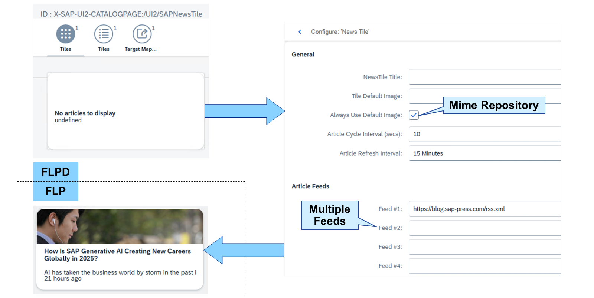
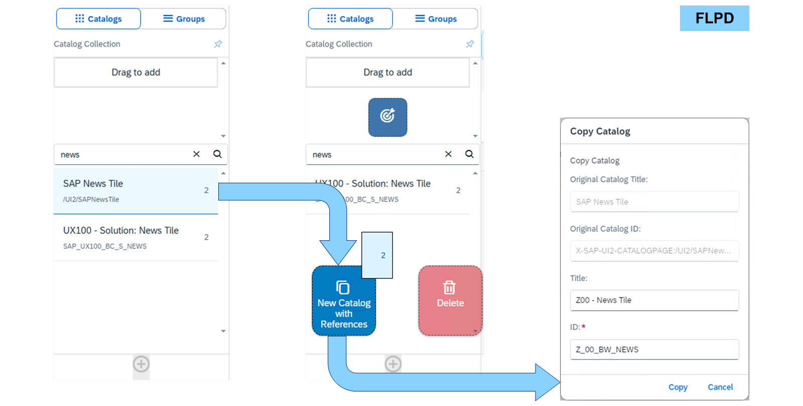

# Editing Business Catalogs

*Source: https://learning.sap.com/courses/learning-the-basics-of-sap-fiori/edit-business-catalogs*

Objective
After completing this lesson, you will be able to edit business catalogs.
## SAP Fiori Launchpad Designer
Let's watch a video to learn about the SAP Fiori launchpad designer.
## News Tile

The news tile is a double tile available since the beginning of SAP Fiori. It cycles through the messages of up to 10 news feeds and starts an SAPUI5 app showing all messages as a list. You can adjust the article refresh cycle (for cycling through the messages) and refresh interval (for requesting new messages), and if a default image from the mime repository should be used rather than one from the news feed(s).
The following restrictions apply to the news feeds:
  * External feeds must be cross-origin resource sharing (CORS) compliant.
  * Internal feeds must originate from the same server and port as the _SAP Fiori launchpad_.
Note
A reverse proxy like the SAP Web Dispatcher allows the definition of routing rules to overcome this limitation.
  * The URL format should follow the https://<server>:<port> pattern.
Note
The URLs using feed:// are not supported.
  * The UI5 URL validation requires the tilde "~" character to be replaced by the sequence "~".

An empty news tile is delivered by SAP in the business catalog /UI2/SAPNewsTile as a template. Copy the catalog in the FLPCM or FLPD to the customer namespace and edit it in the FLPD.
To copy a catalog in the FLPD, drag the catalog from the list of catalogs to the then appearing drop area _New Catalog with References_. After copying, just click on the news tile to edit it.
## Edit Business Catalogs
### Business Example
You want to create an SAP Fiori business catalog by copying an existing one in the _SAP Fiori launchpad content manager_ and edit it using the _SAP Fiori launchpad designer_.

Solution:
    SAP_UX100_BC_S_NEWS (Business Catalog)
Note
This exercise requires an SAP Learning system. Login information is provided by your system setup guide.
Note
Whenever the values or object names in this exercise include ##, replace ## with the number of your user.
### Prerequisites
The role was created in the exercise **Create SAP Fiori Spaces and Pages**.
### Task 1: Copy the News Catalog in the SAP Fiori Launchpad Content Manager
Exercise[Start Exercise](https://learnsap.enable-now.cloud.sap/pub/mmcp/index.html?show=project!PR_52B3E4782862E1B3:uebung)
#### Steps
  1. In the _SAP Fiori launchpad content manager_ for customizing of your S4H, copy the _/UI2/SAPNewsTile_ catalog using ID **Z_##_BC_NEWS** and title **Z## - News Tile**.
    1. In the _SAP Easy Access_ menu of your S4H, search for _FLP Content Manager: Client-Specific_ or start transaction /UI2/FLPCM_CUST.
    2. In the _SAP Fiori launchpad content manager_ for customizing, in the _Search Catalogs_ field, enter **news**.
    3. Select the _/UI2/SAPNewsTile_ catalog.
    4. Choose _Copy_.
    5. In the _New ID_ field, enter **Z_##_BC_NEWS**.
    6. In the _New Title_ field, enter **Z## - News Tile**.
    7. Choose _Continue_.
    8. Choose the transport request provided to you.

### Task 2: Edit a News Tile in the SAP Fiori Launchpad Designer
Exercise[Start Exercise](https://learnsap.enable-now.cloud.sap/pub/mmcp/index.html?show=project!PR_EA5ABD6F5477C6B9:uebung)
#### Steps
  1. In the _SAP Fiori launchpad content manager_ for customizing of your SAP S/4HANA (S4H) system, open the _Z_##_BC_NEWS_ in the _SAP Fiori launchpad designer_ for customizing and assign a transport request in the settings.
Note
Close the _SAP Fiori launchpad content manager_ to release the lock.
    1. In the _SAP Fiori launchpad content manager_ for customizing of your S4H, select the _Z_##_BC_NEWS_ catalog.
    2. Choose _Open in Designer_.
    3. Close the _SAP Fiori launchpad content manager_.
    4. In the _SAP Fiori launchpad designer_ for customizing, choose _Settings_ (gearwheel) in the upper right corner.
    5. In the _Assign Transport Request_ popup, deselect the _None (Local Object)_ checkbox.
    6. In the _Customizing Request_ dropdown, select the transport request provided to you.
    7. Choose _OK_.
  2. In the _SAP Fiori launchpad designer_ for customizing of your S4H, add **https://blog.sap-press.com/rss.xml** as feed to the _News Tile_ of your **Z## - News Tile** catalog.
Caution
If you get an error when saving the catalog, close the _SAP Fiori launchpad content manager_ to release the lock.
    1. In the _SAP Fiori launchpad designer_ for customizing of your S4H, choose the _News Tile_ showing the text _No articles to display_.
    2. In the _Feed #1_ field, enter **https://blog.sap-press.com/rss.xml**.
    3. Choose _Save_.
    4. In the _Confirmation_ popup about breaking the reference, choose _OK_.
Caution
If you get an error when saving the catalog, close the _SAP Fiori launchpad content manager_ to release the lock.

### Task 3: Assign the News Catalog to a Role and Test it in the SAP Fiori Launchpad
Exercise[Start Exercise](https://learnsap.enable-now.cloud.sap/pub/mmcp/index.html?show=project!PR_97DFEE461546DABA:uebung)
#### Steps
  1. In the _SAP Fiori launchpad content manager_ for customizing of your S4H, assign the _Z_##_BC_NEWS_ catalog to the _Z_##_BR_TRAINING_ role.
    1. In the _SAP Fiori launchpad content manager_ for customizing, select the _Z_##_BC_NEWS_ catalog.
    2. Choose _Show Usage in Roles_.
    3. In the _Roles containing Catalog Z_##_BC_NEWS_ table, choose _Assign Role_.
    4. In the _Assign Role to Catalog_ popup, for the _Role ID_ field, open the value help.
    5. In the popup, in the _Single Role_ field, enter **z_##***.
    6. Double-click _Z_##_BR_TRAINING_.
    7. In the _Assign Role to Catalog_ popup, choose _Continue_.
  2. In the _SAP Fiori launchpad_ spaces of your S4H, add the news tile from the _Z## - News Tile_ catalog to the _General_ page of the _Cross Topic_ space and test it.
    1. Start or reload the _SAP Fiori launchpad_ spaces of your S4H in the client of your choice.
    2. Choose your user in the upper right corner.
    3. In the _User Actions Menu_ , choose _App Finder_.
    4. In the list of catalogs on the left, choose _Z## - News Tile_.
    5. Choose the plus of the news tile.
    6. In the _Select the Pages for This Tile_ popup, select _Cross Topic_ → _General_ and choose _OK_.
    7. Choose _Navigate to Home_.
    8. Choose the _Cross Topic_ space.
    9. Choose the news tile.
    10. Operate the app as you wish.
