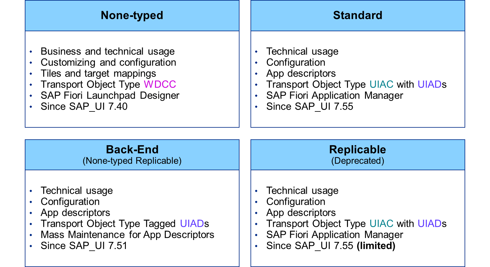
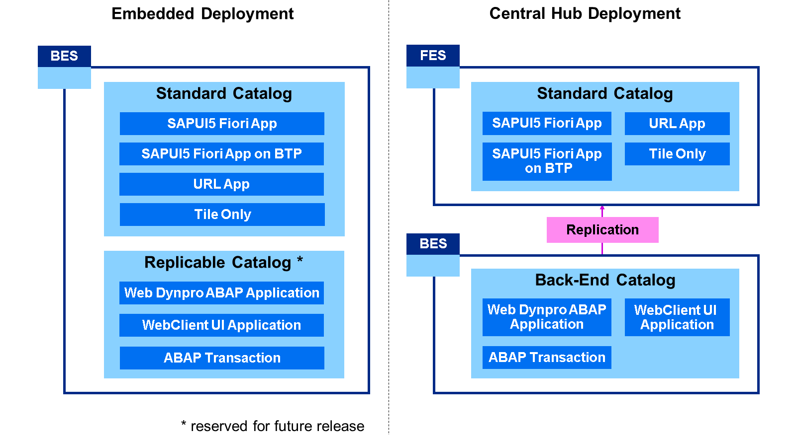
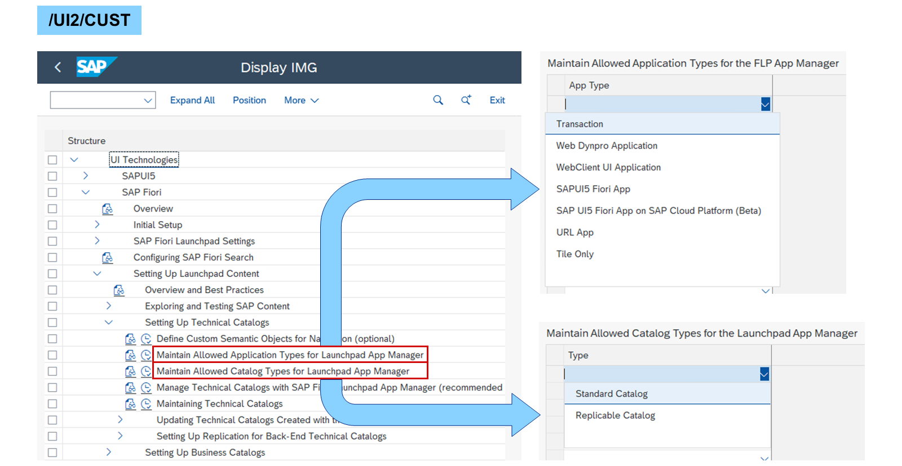
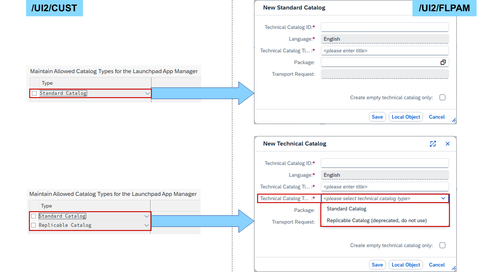
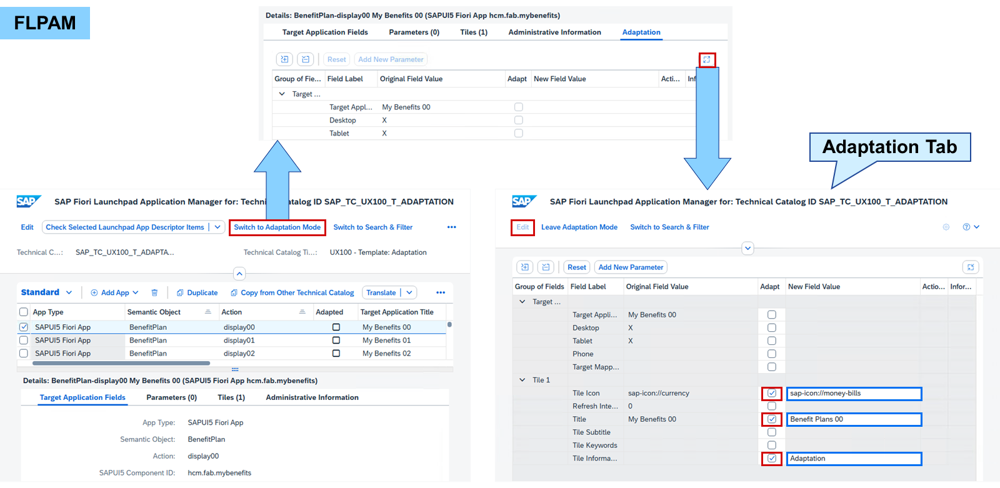

# Adapting Technical Catalogs

*Source: https://learning.sap.com/courses/learning-the-basics-of-sap-fiori/creating-target-mappings_d1c22426-3f4a-44f1-aea8-810992c4833d*

Objective
After completing this lesson, you will be able to adapt technical catalogs.
## SAP Fiori Launchpad Application Manager
Let's watch the video to learn about the SAP Fiori launchpad application manager.
## Catalog and Application Types

With the introduction of the _SAP Fiori launchpad application manager (FLPAM)_ , catalog types were also introduced. Until then, business and technical catalogs were just semantic interpretations of SAP Fiori catalogs. These are now called none-typed catalogs, defining tiles and target mappings per client (customizing) or cross-client (configuration). The transport object type is Web Dynpro Component Configuration (WDCC) and the according tool is the _SAP Fiori launchpad designer (FLPD)_.
Before the introduction of catalog types, only the back-end catalog differed in its structure on a technical level, by defining app descriptors instead of separated tiles and target mappings. Back-end catalogs are always cross-client (configuration) and are available since SAP_UI 7.51. The transport object type is User Interface App Descriptors (UIAD) tagged with the catalog name, and the corresponding tool is the _Mass Maintenance for App Descriptors_.
With SAP_UI 7.55 SP01, most technical catalogs are standard catalogs. They are always cross-client (configuration) and define app descriptors instead of separated tiles and target mappings. The transport object type is User Interface App Catalog (UIAC) consisting of User Interface App Descriptors (UIAD) and the according tool is the FLPAM. UIAC is a development object visible in development tools (ADT, SE80) making it easier to find and organize catalogs, for example, in transport requests. Therefore, it is recommend using standard catalogs as soon as possible.
Although also introduced with SAP_UI 7.55 SP01, replicable catalogs were reserved for use in a future release then. They are nearly identical to standard catalogs (UIAC with UIAD in FLPAM) but are replicable like the back-end catalogs. With SAP_UI 7.58, the replicable catalogs were deprecated. There are still some delivered by SAP, but it is no longer possible to create new ones.

In parallel to catalog types, application types were introduced as cross-client setting. In an embedded deployment, all application types are allowed in technical catalogs. In a central hub deployment, standard catalogs consist of SAPUI5 Fiori apps (for BTP), URL apps, and tiles without target mappings in the front-end server (FES). Back-end catalogs in the back-end server (BES) consist of Web Dynpro ABAP applications, WebClient UI applications, and ABAP transactions. The transaction /UI2/APPDESC_GET in the FES is used to replicate back-end catalogs from BES as remote catalogs to the FES.

Catalog and application types are defined cross-client via the implementation guide. Transaction /UI2/CUST can be used to access the UI parts of the implementation guide directly. For an embedded deployment, it is recommended not to define any application type. This allows the use of any application type in technical catalogs.

For an embedded deployment, **Standard Catalog** is recommended as the only catalog type. This means, only standard catalogs can be defined in the FLPAM. When setting **Standard Catalog** and **Replicable Catalog** , FLPAM offers the catalog types as a dropdown during creation.
## Technical Catalog Adaptation

The adaptation mode in the FLPAM allows you to make (limited) adaptations in the launchpad app descriptor items (LADI) of SAP-delivered technical catalogs. The changes are directly available in all references in business catalogs.
Switching to the adaptation mode adds the _Adaptation_ tab to the details of a LADI. Enlarge the tab and choose _Edit_ : You can now select the _Adapt_ checkbox for each property you want and enter your adaptation in the input field behind. Adapted values can be translated using the SE63.
Note
Logging in to a certain language allows you to adapt directly in the target language.
By using the transaction /UI2/FLPAM_ADAPT or the suitable tile in the SAP_BASIS_BC_UI_FLA catalog, the FLPAM can be started directly in the adaptation mode. This may come in handy if users should only be allowed to adapt, but not to change or create technical catalogs.
## Adapt Technical Catalogs
### Business Example
You want to adapt a tile in a standard catalog shipped by SAP using the adaptation mode of the _SAP Fiori launchpad application manager_.

Template:
    SAP_TC_UX100_T_ADAPTATION (Standard Catalog)
Note
This exercise requires an SAP Learning system. Login information is provided by your system setup guide.
Note
Whenever the values or object names in this exercise include ##, replace ## with the number of your user.
### Prerequisites
A business catalog was created in exercise **Reference Tiles and Target Mappings**.
### Task 1: Reference a Template App in the SAP Fiori Launchpad Content Manager and Add it to Your My Home
Exercise[Start Exercise](https://learnsap.enable-now.cloud.sap/pub/mmcp/index.html?show=project!PR_78733FA87EA561A3:uebung)
#### Steps
  1. In the _SAP Fiori launchpad content manager_ for customizing of your SAP S/4HANA (S4H) system, add the tile and target mapping for the app _My Benefits ##_ from the catalog _SAP_TC_UX100_T_ADAPTATION_.
    1. In the _SAP Easy Access_ menu of your S4H, search for _FLP Content Manager: Client-Specific_ or start transaction /UI2/FLPCM_CUST.
    2. In the _SAP Fiori launchpad content manager_ for customizing of your S4H, in the _Search Catalogs_ field, enter **tc_ux100** and choose _Go_.
    3. Select the _SAP_TC_UX100_T_ADAPTATION_ catalog.
    4. In the _Content in Catalog SAP_TC_UX100_T_ADAPTATION_ table, select the _Action_**display##**.
    5. Choose _Add Tiles/Target Mappings_ → _Add Selected Tiles/TMs to Other Catalog_.
    6. In the _Search Catalogs_ field, enter **z_##** and choose _Go_.
    7. Select _Z_##_BC_EMPLOYEE_.
    8. Choose _Add Tile/TM Reference_.
  2. In the _SAP Fiori launchpad_ spaces of your S4H, add the _My Benefits ##_ tile from the _Z## - Employee_ catalog to your _My Home_.
    1. Start or reload the _SAP Fiori launchpad_ spaces of your S4H in the client of your choice.
    2. Choose your user in the upper right corner.
    3. In the _User Actions Menu_ , choose _App Finder_.
    4. In the list of catalogs on the left, choose _Z## - Employee_.
    5. Choose the plus of the _My Benefits ##_ tile.
    6. In the _Select Pages for This Tile_ popup, select _My Home_ and choose _OK_.
    7. Choose _Navigate to Home_.
#### Result
The _My Benefits ##_ is now part of the favorite apps.

### Task 2: Adapt the Tile Title of an App in the SAP Fiori Launchpad Application Manager
Exercise[Start Exercise](https://learnsap.enable-now.cloud.sap/pub/mmcp/index.html?show=project!PR_8AFBB61331F27AB7:uebung)
#### Steps
  1. In the _SAP Fiori launchpad application manager_ for customizing of your S4H, open the _SAP_TC_UX100_T_ADAPTATION_ catalog in adaptation mode and change the title of _My Benefits ##_ to **Benefit Plans ##**.
Note
Only one user can adapt a catalog at a time.
Note
If you do not see a list of catalogs but just two input fields, execute the last task of the exercise **Create Replicable Catalogs** :
Allow Standard and Replicable Catalogs as Catalog Types in an ABAP System.
    1. In the _SAP Fiori launchpad content manager_ for customizing of your S4H, select the _SAP_TC_UX100_T_ADAPTATION_ catalog.
    2. Choose _Open in SAP Fiori Launchpad App Manager_.
    3. In the _SAP Fiori launchpad application manager_ , select the _Action_**display##**.
    4. Choose _Switch to Adaptation Mode_.
    5. In the _Details_ section, choose the _Adaptation_ tab.
    6. Choose _Maximize_ on the right.
    7. Choose _Edit_ at the top.
    8. In the _Select Transport Request_ popup, choose the transport request provided to you.
    9. Choose _OK_.
    10. In the _Adapt_ column, select the checkbox for _Title_.
    11. In the _New Field Value_ field behind the checkbox, enter **Benefit Plans ##**.
    12. Choose _Save_.
    13. Choose _Leave Adaptation Mode_.
#### Result
For the _Benefit Plans ##_ app, the checkbox _Adapted_ is set.
  2. In the _SAP Fiori launchpad_ spaces of your S4H, check if there is a tile _Benefit Plans ##_ in your _My Home_.
    1. Start or reload the _SAP Fiori launchpad_ spaces of your S4H in the client of your choice.
    2. Check your favorites in your _My Home_.
#### Result
The _My Benefits ##_ was renamed to _Benefit Plans ##_.
