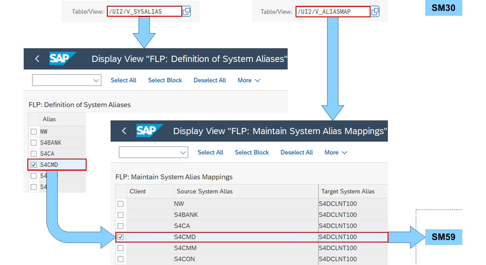
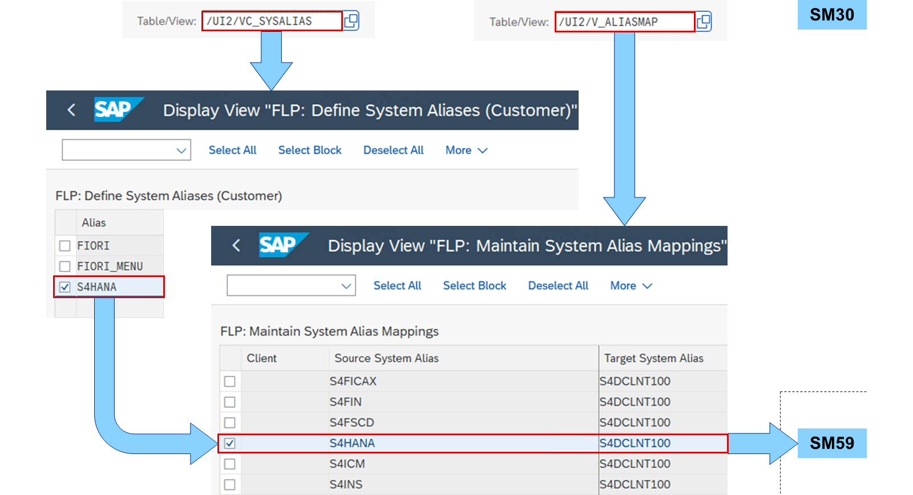
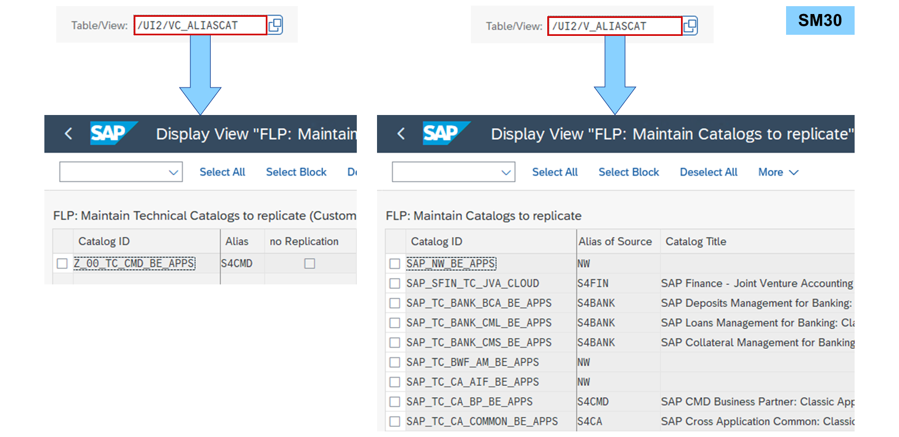
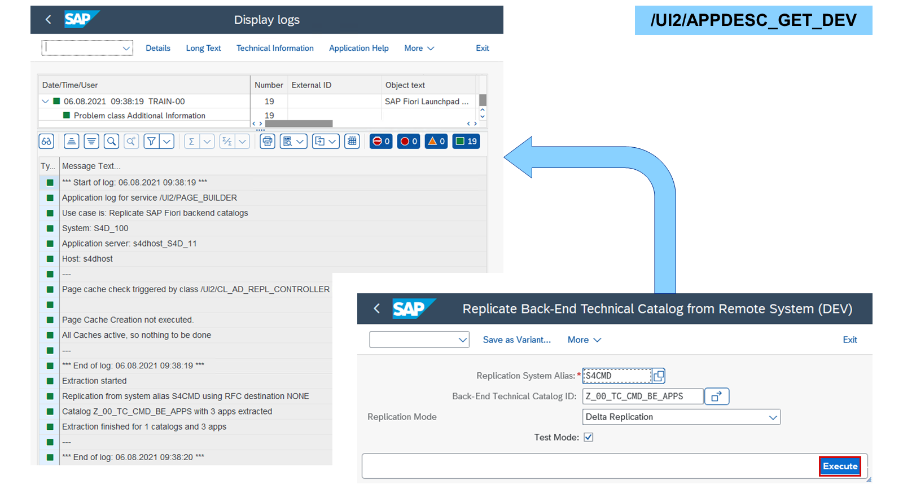

# Creating Replicable Catalogs

*Source: https://learning.sap.com/courses/learning-the-basics-of-sap-fiori/creating-replicable-catalogs_d1507705-2068-4216-ad0d-0078df478459*

Objective
After completing this lesson, you will be able to create replicable catalogs.
## Replicable Catalog Maintenance
Watch the video to understand how back-end catalogs are created.
Settings
Back-end catalogs are called _None-typed Replicable Catalogs_ , because no catalog type is defined in the system and they must be replicated to a front-server to be usable as source for business catalogs. A replication is a kind of extraction of the app descriptors as tiles and target mappings in a remote catalog. Independent of the deployment scenario, a system alias for classic applications must be assigned to the back-end or replicable catalog for the replication to work.
## System Alias for Classic Applications

System aliases for classic applications are delivered by SAP and distinguished by solution area. They are viewable in the maintenance view **/UI2/V_SYSALIAS** using the _View Maintenance_ (transaction SM30). For each one an RFC (<alias>_RFC) and HTTPS (<alias>_HTTPS) destination should be created in the _Configuration of RFC Connections_ ( transaction SM59).
If several aliases point to the same system such as an SAP S/4HANA, the maintenance view **/UI2/V_ALIASMAP** can be used to map these aliases to a target system alias, which can be defined freely.

If customers want to define their own aliases, they can define them in the maintenance view **/UI2/VC_SYSALIAS**. These can also be mapped to a target system alias using the maintenance view **/UI2/V_ALIASMAP** or an RFC (<alias>_RFC) and HTTPS (<alias>_HTTPS) destination should be created in the SM59.
Since SAP Fiori rapid activation in an embedded deployment, the destinations FIORI_CLASSIC_UI_RFC and FIORI_CLASSIC_UI_HTTPS are generated in SM59. An empty target system alias for a source system alias in **/UI2/V_ALIASMAP** is then sufficient to forward the request correctly.
## Catalog Replication

Each back-end and replicable catalog needs a system alias for classic applications assigned. It is needed for the replication to the front-end server. System alias assignments for back-end catalogs delivered by SAP can be found in the maintenance view **/UI2/V_ALIASCAT**. Customers can assign system aliases to their back-end catalogs in the maintenance view **/UI2/VC_ALIASCAT**.

To replicate back-end and replicable catalogs to the front-end server (FES), SAP provides the following transactions:

/UI2/APPDESC_GET
    Replicates all back-end and replicable catalogs referenced in selected business catalogs.

/UI2/APPDESC_GET_ALL
    Replicates all back-end and replicable catalogs for all system aliases.

/UI2/APPDESC_GET_DEV
    Replicates selected back-end and replicable catalogs for selected system alias.
The transactions are called on the FES. In all transactions, you can choose between a full or delta replication. A _Testmode_ allows a test run before replicating anything.
Hint
The transaction /UI2/APPDESC_GET_DEV was introduced in SAP S/4HANA 2020. If it is not available in your system, start the report /UI2/GET_APP_DESCR_REMOTE_DEV via transaction SA38.
## Create Replicable Catalogs
### Business Example
You want to use the _SAP Fiori launchpad application manager_ to create a back-end catalog with app descriptors for ABAP transactions.

Solution:
    SAP_TC_UX100_S_CMD_BE_APPS (Replicable Catalog)
Note
This exercise requires an SAP Learning system. Login information is provided by your system setup guide.
Note
Whenever the values or object names in this exercise include ##, replace ## with the number of your user.
### Prerequisites
The business catalog was created in the exercise **Reference Tiles and Target Mappings**.
### Task 1: Allow Back-End Catalogs as Catalog Types in an ABAP System
Exercise[Start Exercise](https://learnsap.enable-now.cloud.sap/pub/mmcp/index.html?show=project!PR_9F841FA15466108F:uebung)
#### Steps
  1. In the _Customizing of UI Technologies_ of your SAP S/4HANA (S4H) system, check which catalog types are allowed.
    1. In the _SAP Easy Access_ screen, search for _Customizing of UI Technologies_ or start transaction /UI2/CUST.
    2. Expand _SAP Fiori_ → _Setting Up Launchpad Content_ → _Setting Up Technical Catalogs_.
    3. For _Maintain Allowed Catalog Types for Launchpad App Manager_ , choose _IMG - Activity_ (Clock with check mark).
    4. In the _Information_ popup, choose _Continue_.
#### Result
The allowed catalog types are displayed.
  2. If there is any catalog type set in the table, delete all entries. This will only allow back-end catalogs.
Note
Only one user can set the catalog types at a time.
    1. Choose _Select All_.
    2. Choose _Delete_.
    3. In the _Information_ popup, choose _Continue_.
    4. Choose _Save_.
    5. Choose the transport request provided to you.

### Task 2: Create a Back-End Catalog and App Descriptor in the SAP Fiori Launchpad Application Manager
Exercise[Start Exercise](https://learnsap.enable-now.cloud.sap/pub/mmcp/index.html?show=project!PR_6B09C6B9EC26C9D:uebung)
#### Steps
  1. In the _SAP Fiori launchpad application manager_ of your S4H, create the back-end catalog **Z_##_TC_CMD_BE_APPS** as local object.
    1. In the _SAP Fiori launchpad_ of your S4H, choose the _Launchpad App Manager_ tile or start transaction /UI2/FLPAM.
#### Result
The warning _Only back-end app types are allowed in the system_.
    2. In the _Technical Catalog ID_ field, enter **Z_##_TC_CMD_BE_APPS**.
    3. Choose _Continue_.
    4. Choose _Edit_.
    5. In the _Select Transport Request_ popup, choose _Local Object_.
  2. Insert the transaction _Display Material_ (MM03) with the semantic object **Material** and action **display##** in your catalog. Add a static tile with _Title_**Display Material ##**.
    1. Choose _Other Functions_ → _Multiselect Transactions_.
    2. In the _Select Transactions_ popup, in the _Transaction Code_ field, enter **mm0*** and choose _Go_.
    3. In the list of _Items_ , select the checkbox for _MM03_ and choose _OK_.
    4. In the _Semantic Object_ field, enter **Material**.
    5. In the _Action_ field, enter **display##**.
    6. In the _Details_ pane, choose the _Tiles_ tab under the table.
    7. In the _Title_ field, replace the _&_ with **##**.
    8. Choose _Save_.

### Task 3: Assign an Alias to the Back-End Catalog and Replicate it
Exercise[Start Exercise](https://learnsap.enable-now.cloud.sap/pub/mmcp/index.html?show=project!PR_F24E954550E548B0:uebung)
#### Steps
  1. In the View Maintenance (SM30) of your S4H, assign the alias **S4CMD** and add transaction codes to your catalog **Z_##_TC_CMD_BE_APPS** (**Z## - Customer Master Data: Replication**) in the view **/UI2/VC_ALIASCAT**.
Note
Only one user can assign an alias to a catalog at a time.
    1. In the _SAP Easy Access_ menu of your S4H, search for _View Maintenance_ or start transaction SM30.
    2. In the _Table/View_ field, enter **/UI2/VC_ALIASCAT**.
    3. Choose _Edit_.
    4. In the _Information_ popup, choose _Continue_.
    5. Choose _New Entries_ and enter the following values:
| Field  | Value  |
| --- | --- |
| _Catalog ID_  | **Z_##_TC_CMD_BE_APPS**  |
| _Alias_  | **S4CMD**  |
| _Add TCode_  | **checked**  |
| _Catalog Title_  | **Z## - Customer Master Data (Replication)**  |
    6. Choose _Save_.
    7. Choose the transport request provided to you.
    8. Choose _Exit_.
  2. In _Replication of App Descriptor_ (/UI2/APPDESC_GET_DEV) of your S4H, replicate your catalog **Z_##_TC_CMD_BE_APPS** to your S4H using the alias **S4CMD**
    1. In the _SAP Easy Access_ menu of your S4H, search for _Replication of App Descriptor_ or start transaction /UI2/APPDESC_GET_DEV.
    2. In the _Replication System Alias_ field, enter **S4CMD**.
    3. In the _Back-End Technical Catalog ID_ field, enter **Z_##_TC_CMD_BE_APPS**.
    4. From the _Replication Mode_ dropdown, select **Full replication**.
    5. Deselect the _Testmode_ checkbox.
    6. Choose _Execute_.
#### Result
The catalog _Z_##_TC_CMD_BE_APPS_ was extracted successfully.

### Task 4: Reference the Tile and Target Mapping in a Business Catalog and Test it in the SAP Fiori Launchpad
Exercise[Start Exercise](https://learnsap.enable-now.cloud.sap/pub/mmcp/index.html?show=project!PR_EF2F75FDA19ABB9D:uebung)
#### Steps
  1. In the _SAP Fiori launchpad content manager_ for customizing of your S4H, create a reference for tile and target mapping of _Display Material ##_ of the _Z_##_TC_CMD_BE_APPS_ catalog in your catalog _Z_##_BC_EMPLOYEE_.
    1. In the _SAP Easy Access_ menu of your S4H, search for _FLP Content Manager: Client-Specific_ or start transaction /UI2/FLPCM_CUST.
    2. In the _Search Catalogs_ field, enter **z_##** and choose _Go_.
    3. In the _Catalogs_ table, select the _Z_##_TC_CMD_BE_APPS_ catalog.
    4. In the _Content_ table, select the _Display Material ##_ app.
    5. Choose _Add Tiles/Target Mappings_ → _Add Selected Tiles/TMs to Other Catalog_.
    6. In the _Search Catalogs_ field, enter **z_##** and choose _Go_.
    7. In the _Catalogs_ table, select the _Z_##_BC_EMPLOYEE_ catalog.
    8. Choose _Add Tile/TM Reference_.
  2. In the _SAP Fiori launchpad_ spaces of your S4H, add the _Display Material ##_ tile from the _Z## - Employee_ catalog to the _General_ page of the _Cross Topic_ space and test it.
    1. Start or reload the _SAP Fiori launchpad_ spaces of your S4H in the client of your choice.
    2. Choose your user in the upper right corner.
    3. In the _User Actions Menu_ , choose _App Finder_.
    4. In the list of catalogs on the left, choose _Z## - Employee_.
    5. Choose the plus of the _Display Material ##_ tile.
    6. In the _Select Pages for This Tile_ popup, select _Cross Topic_ → _General_ and choose _OK_.
    7. Choose _Navigate to Home_.
    8. Choose _Cross Topic_ → _General_.
    9. Operate the app as you wish.

### Task 5: Allow Standard and Replicable Catalogs as Catalog Types in an ABAP System
Exercise[Start Exercise](https://learnsap.enable-now.cloud.sap/pub/mmcp/index.html?show=project!PR_931012280B8CAD96:uebung)
#### Steps
  1. In the _Customizing of UI Technologies_ of your SAP S/4HANA (S4H) system, check which catalog types are allowed.
    1. In the _SAP Easy Access_ screen, search for _Customizing of UI Technologies_ or start transaction /UI2/CUST.
    2. Expand _SAP Fiori_ → _Setting Up Launchpad Content_ → _Setting Up Technical Catalogs_.
    3. For _Maintain Allowed Catalog Types for Launchpad App Manager_ , choose _IMG - Activity_ (Clock with check mark).
    4. In the _Information_ popup, choose _Continue_.
#### Result
The allowed catalog types are displayed.
  2. If there is no catalog type set in the table, add _Standard Catalog_ and _Replicable Catalog_ to the list.
Note
Only one user can set the catalog types at a time.
    1. Choose _New Entries_.
    2. In the first dropdown of the _Type_ column, select _Standard Catalog_.
    3. In the second dropdown of the _Type_ column, select _Replicable Catalog_.
    4. Choose _Save_.
    5. If asked, choose the transport request provided to you.

[Continue to quiz](https://learning.sap.com/courses/learning-the-basics-of-sap-fiori/content-management)
