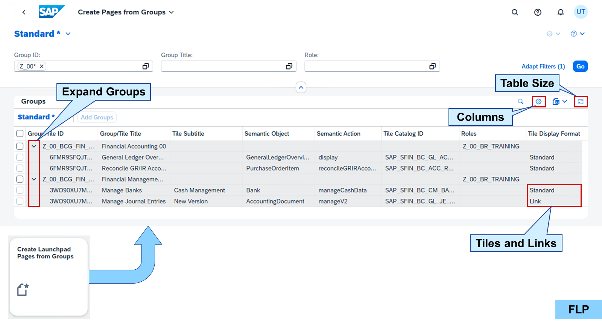
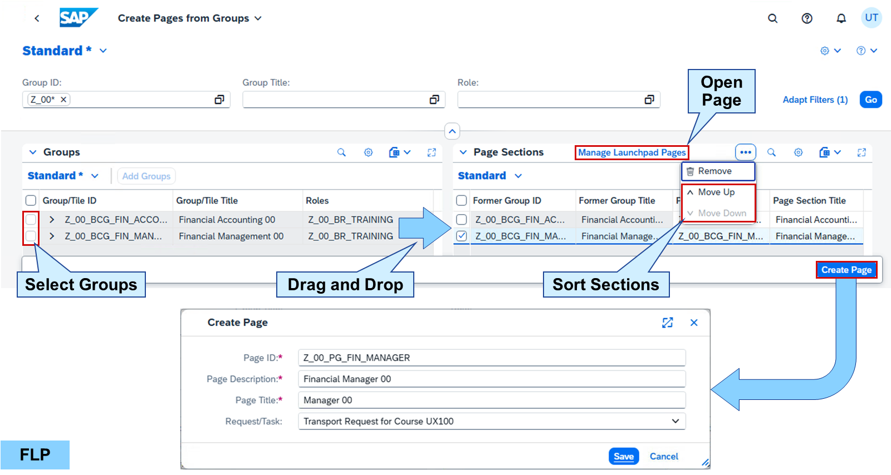

# Content Migration

*Source: https://learning.sap.com/courses/learning-the-basics-of-sap-fiori/migrating-sap-fiori-groups*

Objective
After completing this lesson, you will be able to migrate SAP Fiori Groups.
## Group Migration to Spaces
SAP Fiori groups are deprecated. Let's watch some more details about migrating your groups to spaces:
Settings
### Create Pages from Groups App

_Create Pages from Groups_ is an FLP app based on SAPUI5. It allows to search for groups based on their ID and name or based on roles the groups are assigned to. Every group in the groups table can be expanded to show details like the tiles and links of the group including their intent and source catalog. The columns of the table can be adjusted using the settings button above the table.
Hint
If the icon for expanding a group is not visible, increase the size of the table, for example, via the button in the upper right corner.

To add a group as section to a page, select a group from the _Groups_ table on the left and drag and drop it on the _Page Sections_ table on the right. Once a group was added, it stays on the right until deleted or the app is closed. Other groups can be searched and displayed on the left and again added as page section. Choose _Move Up_ or _Move Down_ to sort the sections.
When the page sections look fine, a new page can be created migrating all added groups to sections in the new page including all tiles and links. The page can then be opened in the _Manage Launchpad Pages_ app to start editing. Finally, adding the page to a space can be done in the _Manage Launchpad Spaces_ app.
## Create SAP Fiori Pages from Groups
### Business Example
You want to include an SAP Fiori group as section on a new SAP Fiori page.

Template:
    SAP_UX100_BCG_T_MIGRATION (Group)

Solution:
    SAP_UX100_SP_S_FINANCE (Space)     SAP_UX100_PG_S_FIN_MANAGER (Page)
Note
This exercise requires an SAP Learning system. Login information is provided by your system setup guide.
Note
Whenever the values or object names in this exercise include ##, replace ## with the number of your user.
### Prerequisites
The role was created in exercise **Create SAP Fiori Spaces and Pages**.
### Task 1: Create a Space and Assign it to a Role
Exercise[Start Exercise](https://learnsap.enable-now.cloud.sap/pub/mmcp/index.html?show=project!PR_3FB9B07380A276AE:uebung)
#### Steps
  1. In _SAP Fiori launchpad_ of your SAP S/4HANA (S4H) system, start the _Manage Launchpad Spaces_ app. Create a space using the following values:
| Field  | Value  |
| --- | --- |
| _Space ID_  | **Z_##_SP_FINANCE**  |
| _Space Description_  | **Financial Management ##**  |
| _Space Title_  | **Finance ##**  |
    1. In _SAP Fiori launchpad_ of your S4H, choose the _Manage Launchpad Spaces_ tile.
    2. Choose _Create_.
    3. In the _Create Space_ popup, enter the following values:
| Field  | Value  |
| --- | --- |
| _Space ID_  | **Z_##_SP_FINANCE**  |
| _Space Description_  | **Financial Management ##**  |
| _Space Title_  | **Finance ##**  |
    4. In the _Transport_ field, select the transport request provided to you.
    5. Choose _Create_.
    6. Choose _Save_.
    7. Choose _Navigate to Home Page_.
  2. In the _Role Maintenance_ (PFCG) of your S4H, add the _Z_##_SP_FINANCE_ space to the menu of the _Z_##_BR_TRAINING_ role.
    1. In the _Role Maintenance_ (PFCG) of your S4H, edit your **Z_##_BR_TRAINING** role.
    2. Choose the _Menu_ tab.
    3. Expand the _Insert Node_ button.
Hint
The initial value written on the _Insert Node_ button is _Launchpad Catalog_.
    4. Choose _SAP Fiori Launchpad_ → _Launchpad Space_.
    5. In the _Space ID_ field, enter **z_##*** and use the value help.
    6. In the dialog box, double-click _Z_##_SP_FINANCE_.
    7. Choose _Continue_.
    8. Choose _Save_.

### Task 2: Include a Group as a Section in a New Page
Exercise[Start Exercise](https://learnsap.enable-now.cloud.sap/pub/mmcp/index.html?show=project!PR_25DAEB64424422B2:uebung)
#### Steps
  1. In _SAP Fiori launchpad_ of your S4H, start the _Create Launchpad Pages from Groups_ app. Include the _SAP_UX100_BCG_T_MIGRATION_ group as a section in a new page with the following values:
| Field  | Value  |
| --- | --- |
| _Page ID_  | **Z_##_PG_FIN_MANAGER**  |
| _Page Description_  | **Financial Manager ##**  |
| _Page Title_  | **Manager ##**  |
    1. In _SAP Fiori launchpad_ of your S4H, start the _Create Launchpad Pages from Groups_ app.
    2. In the _Group ID_ field, enter ***ux100***.
    3. Choose _Go_ on the right-hand side.
    4. In the _Groups_ table, select _SAP_UX100_BCG_T_MIGRATION_.
    5. Drag and drop _SAP_UX100_BCG_T_MIGRATION_ from _Groups_ to _Page Sections_.
    6. Choose _Create Page_.
    7. In the _Create Page_ popup, enter the following values:
| Field  | Value  |
| --- | --- |
| _Page ID_  | **Z_##_PG_FIN_MANAGER**  |
| _Page Description_  | **Financial Manager ##**  |
| _Page Title_  | **Manager ##**  |
    8. Choose _Save_.
  2. In the _Manage Launchpad Pages_ app, check the content of the _Z_##_PG_FIN_MANAGER_ page.
    1. Start the _Manage Launchpad Pages_ app.
    2. In the _Search_ field, enter **z_##** and choose **Enter**.
    3. Choose the _Z_##_PG_FIN_MANAGER_ page.
    4. Check the tiles of the section _Financial Management ##_.

### Task 3: Test the Page in the SAP Fiori Launchpad
Exercise[Start Exercise](https://learnsap.enable-now.cloud.sap/pub/mmcp/index.html?show=project!PR_12BD9200B67A378D:uebung)
#### Steps
  1. In _SAP Fiori launchpad_ of your S4H, assign the _Z_##_PG_FIN_MANAGER_ page to the _Z_##_SP_FINANCE_ space.
    1. In _SAP Fiori launchpad_ of your S4H, on the _Z_##_PG_FIN_MANAGER_ page, choose the _Space Assignment_ tab.
    2. Choose _Manage Launchpad Spaces_.
    3. Choose _Z_##_SP_FINANCE_.
    4. Choose _Edit_.
    5. In the _Search for pages_ field, enter **z_##**.
    6. For the _Z_##_PG_FIN_MANAGER_ page, choose _Add_.
    7. Choose _Save_.
  2. Check if the _Finance ##_ space with all tiles and links are part of the _SAP Fiori launchpad_ spaces of your S4H.
    1. Reload the _SAP Fiori launchpad_ spaces of your S4H.
    2. Choose the _Finance ##_ space at the top.
    3. Operate the apps as you wish.
