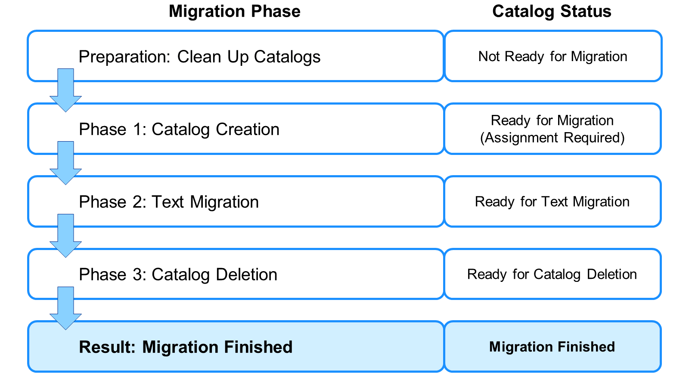
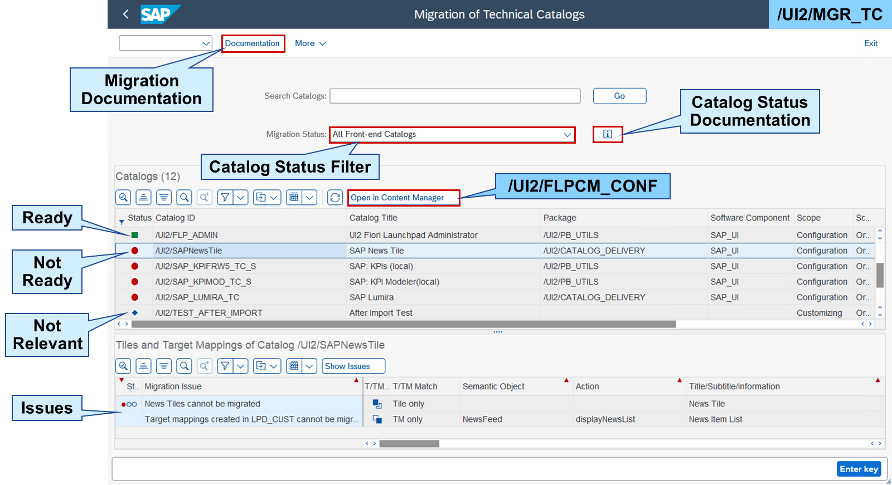
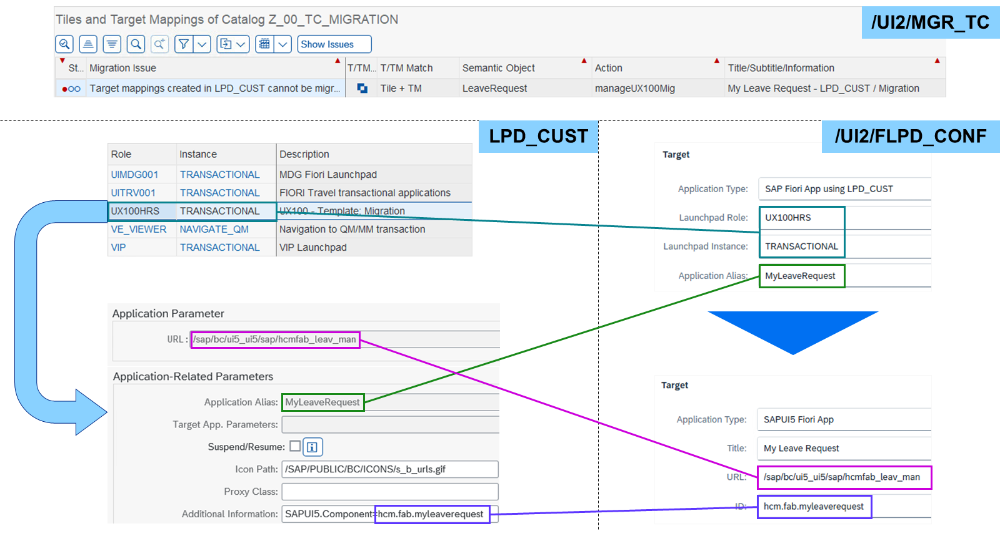
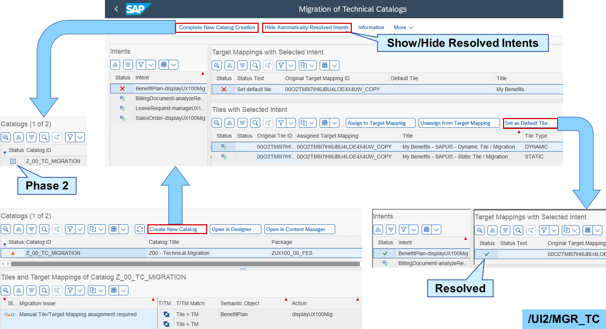
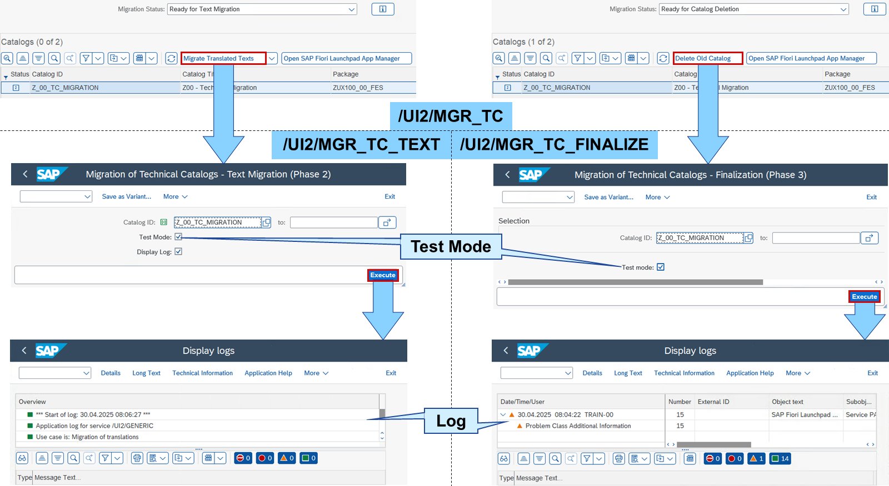

# Migrating None-Typed Technical Catalogs

*Source: https://learning.sap.com/courses/learning-the-basics-of-sap-fiori/migrating-none-typed-technical-catalogs*

Objective
After completing this lesson, you will be able to migrate None-Typed Technical Catalogs.
## Process of Technical Catalog Migration
With the introduction of standard catalogs, none-typed catalogs should no longer be used as technical source. Let's watch some more details about migrating your none-typed catalogs to standard catalogs:
Settings

SAP provides a _Migration of Technical Catalogs_ tool set and a migration process. The process consists of three core phases and a preparation pre-phase. Each phase is linked to a catalog status:

Preparation
    None-typed technical catalogs must fulfill a number of requirements before they can be migrated. Catalogs not ready for migration require manual cleanup. For more details, please read SAP Note [3397026](https://me.sap.com/notes/3397026) – _SAP Fiori Launchpad - Technical Catalog Migration - Content Cleanup Risks_.

Phase 1
    Catalogs listed as ready for migration can be migrated right away by creating a standard catalog. Some catalogs may require further assignments like setting a default tile, something which is not possible in a none-typed catalog.

Phase 2
    If catalogs are ready for text migration, the none-typed catalogs have translated texts. These are migrated in this phase to the new standard catalogs. The phase is skipped if no texts exist. If the texts are not in the development but a separate translation system, this phase must be performed there.

Phase 3
    At this point in time, the migrated catalogs and their texts exist twice in the system. To solve this, the source catalogs, which are ready for catalog deletion, must be deleted.
After phase 3, the migration is finished. Standard catalogs created via this migration process get the status Migration Finished.

The entry point for technical catalog migration is the _Migration of Technical Catalogs_ (/UI2/MGR_TC) transaction. Beside a documentation of the migration process, it provides a table of catalogs and their tiles and target mappings in the system, which can be filtered by the migration status.
The catalog table shows for each catalog its status concerning the migration process like ready or not ready for migration. If a catalog is not relevant for migration, it does not provide any original tiles or target mappings. Hence, it is a business catalog consisting of references.
The tiles and target mappings table provides details like semantic object and action and, most importantly, details about the migration issues, why a catalog is not ready for migration. To solve these issues, the catalog must be edited in other tools like the _SAP Fiori launchpad content manager (FLPCM)_.
## Technical Catalog Migration
### Preparation: Clean Up Catalogs
There could be several reasons, why a catalog is not ready for migration. These are some of the more common issues:

Content Error
    The content checks for typed catalogs are more restrictive as for none-typed catalogs. A warning in a none-typed one could be an error in a typed one. For the details of the error, open the catalog in the FLPCM and choose _Other Functions_ → _Show Status Details_ for the erroneous tile/target mapping.

Not Original

All tiles and target mappings in the catalog must be originals, not references to other catalogs. Either delete the references or save them as originals deleting the reference source. Not deleting the reference source will lead to a content error.
Caution
By deleting the reference source, all potential references in other catalogs will be lost. These references should be rerouted to the new originals before deleting the old ones.

Unsupported ID

The catalog ID must meet the following criteria:
  * maximum length of 35 characters
  * begins with "Z", "Y", or an editable customer namespace
  * only contains permissible characters:
    * Uppercase letters (A-Z)
    * Numbers (0-9)
    * Underscore (_)
    * Slash (/) in the beginning and the end of a namespace

Because the catalog ID cannot be changed, the catalog must be copied using an ID meeting all of the criteria above. After copying, the new catalog will only consist of references to the tiles and target mappings of the old catalog. Therefore, these references must be saved as originals in the new catalog and the old originals must be deleted. Keeping the old originals will lead to a content error.
Caution
By deleting the old originals, all references in business catalogs will be lost. These references should be rerouted to the new originals before deleting the old ones.

Custom Tile
    Typed catalogs only support static, dynamic, and analytical tiles from SAP Smart Business (SSB). Custom tiles like the news tile cannot be migrated and must be deleted.

LPD_CUST Target Mapping

The very first way to define a target mapping was by using the LPD_CUST transaction. For several reasons, such target mappings should no longer be used. But it may still happen that theses target mappings are still in use – because there were so many of them. LPD_CUST target mappings cannot be migrated and must be changed to a transaction, Web Dynpro, URL, or SAPUI5 target mapping.
For more details, please read SAP Note [2614740](https://me.sap.com/notes/2614740) – _Fiori Launchpad Designer - Usage of Application Type "SAP Fiori App using LPD_CUST" in Target Mapping Configuration is Deprecated_. 
To create a new target mapping based on an LPD_CUST one, you must first find the suitable information in LPD_CUST. The URL and (component) ID for an SAPUI5 target mapping are defined in a _Launchpad Instance_ of a _Launchpad Role_ and referenced in the FLPD via an _Application Alias_ :
  1. In the FLPD, open the LPD_CUST target mapping.
  2. In LPD_CUST, search for the _Launchpad Role_ and _Launchpad Instance_ of the target mapping.
  3. In the _Launchpad Role_ in LPD_CUST, open the applications and choose _Show Advanced (Optional) Parameters_ searching for the _Application Alias_ of the target mapping.

When you have found the suitable application in LPD_CUST, change the _Application Type_ of the target mapping to **SAPUI5 Fiori App** and enter the URL and (component) ID from LPD_CUST. For the _Title_ , you can reuse the title of the application in LPD_CUST.
### Phase 1: Catalog Creation

For catalogs with status "Ready for Migration" and "Ready for Migration - Assignment Required", the /UI2/MGR_TC offers the _Create New Catalog_ button. This leads to a list of resolved and unresolved intents of the selected catalog.
In none-typed catalogs, tiles and target mappings are separate things only connected via the intent. But in a typed catalog, tiles and target mappings form a launchpad application descriptor item (LADI) or app descriptor. There could be zero to many tiles and zero to one target mapping in an app descriptor. This view already connected the existing tiles and target mappings based on their intent, but you can still assign or unassign tiles to/from target mappings. If there are multiple tiles assigned to one target mapping, one tile must be set as default.
When all problems are resolved, you can create a new standard catalog by choosing _Complete New Catalog Creation_. You will be asked for a workbench request. After this, the catalog will enter phase 2.
Note
The catalog must not be locked in an existing workbench request. It must be assigned to a new one for the purpose of migration.
### Phase 2: Text Migration and Phase 3: Catalog Deletion

The new catalog at this point only contains the texts in the master language. If the catalog now has the status "Ready for Text Migration", translations in other languages exist and should also be migrated. Choosing _Migrate Translated Texts_ opens transaction /UI2/MGR_TC_TEXT. The catalog is already selected and you can execute the migration in a test mode checking for problems. If there are no problems, you can migrate the texts.
If development and translation are in different systems, release the workbench request after each phase:
  1. Complete the catalog creation, release the workbench request, and transport the request including the new typed catalog to the translations system.
  2. In the translation system, migrate the translated texts using /UI2/MGR_TC_TEXT. Release the workbench request, and transport the request in the development system.

If the catalog has the status "Ready for Catalog Deletion", the whole none-typed catalog and the typed one including all available translated texts exist in parallel. Choosing _Delete Old Catalog_ opens transaction /UI2/MGR_TC_FINALIZE. The catalog is already selected and you can execute the deletion in a test mode checking for problems. If there are no problems, you can delete the none-typed catalog and finalize the migration.
## Prepare None-Typed Catalogs for Migration
### Business Example
You want to prepare the none-typed catalogs as templates in the SAP Learning system for the exercise **Create Standard Catalog from None-Typed Technical Catalog**.

Template:
    SAP_TC_UX100_T_MIGRATION (None-Typed Technical Catalog)
Note
This exercise requires an SAP Learning system. Login information is provided by your system setup guide.
Note
Whenever the values or object names in this exercise include ##, replace ## with the number of your user.
### Task 1: Create an ABAP Package for the Template Catalogs
Exercise[Start Exercise](https://learnsap.enable-now.cloud.sap/pub/mmcp/index.html?show=project!PR_1254FB8803E6D8B1:uebung)
#### Steps
  1. In the _ABAP Workbench_ of your SAP S/4HANA (S4H) system, create the **ZUX100_##_FES** package and assign it to a new workbench request **Prepare Migration ##**.
    1. In the _SAP Easy Access_ of your S4H, search for _ABAP Workbench_ or start transaction SE80.
    2. In the _Object Category_ dropdown, in the navigation area, select **Package**.
    3. In the _Object Name_ field, in the navigation area, enter **ZUX100_##_FES** and choose **Enter**.
    4. In the _Create Package_ popup, choose _Yes_.
    5. Enter a short description of your choice.
    6. In the _Application Component_ field, enter **CA**.
    7. Choose _Continue_.
    8. In the _Prompt for transportable workbench request_ popup, choose _Create Request_.
    9. In the _Create Request_ popup, in the _Short Description_ field, enter **Prepare Migration ##**.
    10. Choose _Save_.
    11. In the _Prompt for transportable workbench request_ popup, choose _Continue_.

### Task 2: Copy the Template Catalog in the SAP Fiori Launchpad Designer
Exercise[Start Exercise](https://learnsap.enable-now.cloud.sap/pub/mmcp/index.html?show=project!PR_7DDC456B773AB38F:uebung)
#### Steps
  1. In the _SAP Fiori launchpad designer_ for configuration of your S4H, set the **ZUX100_##_FES** package and the workbench request assigned to you in the settings.
    1. In the _SAP Easy Access_ menu of your S4H, search for _Fiori Lpd. Designer (cross-client)_ or start transaction /UI2/FLPD_CONF.
    2. In the _SAP Fiori launchpad designer_ for configuration, choose _Settings_ (gear wheel) in the upper right.
    3. In the _Assign Transport Request_ popup, in the _Workbench Request_ dropdown, select the **Prepare Migration ##** transport request.
    4. In the _Package Name_ field, enter **ZUX100_##_FES**.
    5. Choose _OK_.
  2. Copy the _SAP_TC_UX100_T_MIGRATION_ catalog using ID **Z_##_TC_MIGRATION** and title **Z## - Technical Migration**.
    1. Choose _Catalogs_ in the upper left.
    2. In the _Search for catalogs_ field, enter **ux100** and choose **Enter**.
    3. Click and hold the _UX100 - Template: Migration (SAP_TC_UX100_T_MIGRATION)_ catalog.
    4. Drag and drop the catalog in the _New Catalog with References_ area.
    5. In the _Title_ field of the _Copy Catalog_ popup, enter **Z## - Technical Migration**.
    6. In the _ID_ field, enter **Z_##_TC_MIGRATION**.
    7. Choose _Copy_.

### Task 3: Save the Template Tiles as Originals
Exercise[Start Exercise](https://learnsap.enable-now.cloud.sap/pub/mmcp/index.html?show=project!PR_2E7E0B866C00B5BA:uebung)
#### Steps
  1. In the _SAP Fiori launchpad designer_ for configuration of your S4H, save the _My Benefits (SAPUI5 - Dynamic Tile)_ tile as original adding **##** to the _Action_ of the intent.
    1. In the _SAP Fiori launchpad designer_ for configuration of your S4H, choose the first _Tiles_ at the top of the page.
    2. Choose the _My Benefits (SAPUI5 - Dynamic Tile)_ tile.
    3. In the _Action_ field, enter **displayUX100Mig##**.
    4. Choose _Save_.
    5. In the _Confirmation_ popup about breaking the reference, choose _OK_.
  2. Save the _Display Sales Order(Transaction)_ tile as original adding **##** to the _Action_ of the intent.
    1. Choose the _Display Sales Order(Transaction)_ tile.
    2. In the _Action_ field, enter **displayUX100Mig##**.
    3. Choose _Save_.
    4. In the _Confirmation_ popup about breaking the reference, choose _OK_.
  3. Save the _Sales Volume (Web Dynpro)_ tile as original adding **##** to the _Action_ of the intent.
    1. Choose the _Sales Volume (Web Dynpro)_ tile.
    2. In the _Action_ field, enter **analyzeRevenueUX100Mig##**.
    3. Choose _Save_.
    4. In the _Confirmation_ popup about breaking the reference, choose _OK_.
  4. Save the _My Leave Request (LPD_CUST)_ tile as original adding **##** to the _Action_ of the intent.
    1. Choose the _My Leave Request (LPD_CUST)_ tile.
    2. In the _Action_ field, enter **manageUX100Mig##**.
    3. Choose _Save_.
    4. In the _Confirmation_ popup about breaking the reference, choose _OK_.
  5. Save the _My Benefits (SAPUI5 - Static Tile)_ tile as original adding **##** to the _Action_ of the intent.
    1. Choose the _My Benefits (SAPUI5 - Static Tile)_ tile.
    2. In the _Action_ field, enter **displayUX100Mig##**.
    3. Choose _Save_.
    4. In the _Confirmation_ popup about breaking the reference, choose _OK_.

### Task 4: Save the Template Target Mappings as Originals
Exercise[Start Exercise](https://learnsap.enable-now.cloud.sap/pub/mmcp/index.html?show=project!PR_A72D30004B83E692:uebung)
#### Steps
  1. In the _SAP Fiori launchpad designer_ for configuration of your S4H, save the target mapping for the _LeaveRequest_ semantic object as original adding **##** to the _Action_ of the intent.
    1. In the _SAP Fiori launchpad designer_ for configuration of your S4H, choose _Target Mappings_ at the top of the page.
    2. Select the _Semantic Object_**LeaveRequest**.
    3. Choose _Configure_.
    4. In the _Action_ field, enter **manageUX100Mig##**.
    5. Choose _Save_.
    6. In the _Confirmation_ popup about breaking the reference, choose _OK_.
  2. Save the target mapping for the _BillingDocument_ semantic object as original adding **##** to the _Action_ of the intent.
    1. Select the _Semantic Object_**BillingDocument**.
    2. Choose _Configure_.
    3. In the _Action_ field, enter **analyzeRevenueUX100Mig##**.
    4. Choose _Save_.
    5. In the _Confirmation_ popup about breaking the reference, choose _OK_.
  3. Save the target mapping for the _SalesOrder_ semantic object as original adding **##** to the _Action_ of the intent.
    1. Select the _Semantic Object_**SalesOrder**.
    2. Choose _Configure_.
    3. In the _Action_ field, enter **displayUX100Mig##**.
    4. Choose _Save_.
    5. In the _Confirmation_ popup about breaking the reference, choose _OK_.
  4. Save the target mapping for the _BenefitPlan_ semantic object as original adding **##** to the _Action_ of the intent.
    1. Select the _Semantic Object_**BenefitPlan**.
    2. Choose _Configure_.
    3. In the _Action_ field, enter **displayUX100Mig##**.
    4. Choose _Save_.
    5. In the _Confirmation_ popup about breaking the reference, choose _OK_.

### Task 5: Create a Business Catalog Referencing the Technical Catalog
Exercise[Start Exercise](https://learnsap.enable-now.cloud.sap/pub/mmcp/index.html?show=project!PR_39F38DFBF4F28B3:uebung)
#### Steps
  1. In the _SAP Fiori launchpad designer_ for configuration of your S4H, copy the _Z_##_TC_MIGRATION_ catalog using ID **Z_##_BC_MIGRATION** and title **Z## - Business Migration**.
    1. Choose _Catalogs_ in the upper left.
    2. In the _Search for catalogs_ field, enter **z_##** and choose **Enter**.
    3. Click and hold the _Z## - Technical Migration (Z_##_TC_MIGRATION)_ catalog.
    4. Drag and drop the catalog in the _New Catalog with References_ area.
    5. In the _Title_ field of the _Copy Catalog_ popup, enter **Z## - Business Migration**.
    6. In the _ID_ field, enter **Z_##_BC_MIGRATION**.
    7. Choose _Copy_.

## Create Standard Catalog from None-Typed Technical Catalog
### Business Example
You want to migrate a none-typed technical catalog to a standard catalog. For that you use the _Migration of Technical Catalogs_ transaction solving problems and creating a new standard catalog taking the original tiles and target mappings of the none-typed technical catalog.
Note
This exercise requires an SAP Learning system. Login information is provided by your system setup guide.
Note
Whenever the values or object names in this exercise include ##, replace ## with the number of your user.
### Prerequisites
Package, workbench request, and template catalogs were created in exercise **Prepare None-Typed Catalogs for Migration**.
### Task 1: Check the Migration Status of Customer Catalogs
Exercise[Start Exercise](https://learnsap.enable-now.cloud.sap/pub/mmcp/index.html?show=project!PR_66BA93AD4E5C0BAB:uebung)
#### Steps
  1. In the _Migration of Technical Catalogs_ of your SAP S/4HANA (S4H) system, search for your migration catalogs created in exercise **Prepare None-Typed Catalogs for Migration**.
    1. In the _SAP Easy Access_ menu of your S4H, search for _Migration of Technical Catalogs_ or start transaction /UI2/MGR_TC.
    2. In the _Catalog ID_ field, enter **z_##*migration***.
    3. Choose _Execute_.
    4. In the _Migration Status_ dropdown, select **All Front-end Catalogs**.
#### Result
The catalogs _Z_##_BC_MIGRATION_ and _Z_##_TC_MIGRATION_ are displayed.
  2. Check the catalogs that are not relevant for migration.
    1. In the _Migration Status_ dropdown, select **Not Relevant for Migration**.
    2. In the _Catalogs_ table, select _Z_##_BC_MIGRATION_.
#### Result
The _Z_##_BC_MIGRATION_ catalog does not contain any original tiles or target mappings.
  3. Check the catalogs that are not ready for migration.
    1. In the _Migration Status_ dropdown, select **Not Ready for Migration**.
    2. In the _Catalogs_ table, select _Z_##_TC_MIGRATION_.
#### Result
The _Z_##_TC_MIGRATION_ catalog cannot be migrated due to a target mapping created in LPD_CUST.

### Task 2: Change an LPD_CUST Target Mapping to an SAPUI5 Fiori App
Exercise[Start Exercise](https://learnsap.enable-now.cloud.sap/pub/mmcp/index.html?show=project!PR_402CB15F42D44A93:uebung)
#### Steps
  1. Open the _Z_##_TC_MIGRATION_ catalog in the _SAP Fiori launchpad designer_ for configuration of your S4H. Check if the **ZUX100_##_FES** package and the **Prepare Migration ##** workbench request are assigned in the settings.
    1. In the _Migration Status_ dropdown, choose _Open in Designer_.
    2. In the _SAP Fiori launchpad designer_ for configuration, choose _Settings_ (gear wheel) in the upper right.
    3. In the _Assign Transport Request_ popup, in the _Workbench Request_ dropdown, assure that the **Prepare Migration ##** transport request is set.
    4. In the _Package Name_ field, assure that **ZUX100_##_FES** is set.
    5. Choose _OK_.
  2. For the target mapping of navigation type _SAP Fiori App using LPD_CUST_ , check the _Launchpad Role_.
    1. Choose _Target Mappings_ at the top of the page.
    2. Select _SAP Fiori App using LPD_CUST_.
    3. Choose _Configure_.
#### Result
The _Launchpad Role_ is **UX100HRS**.
  3. In the _Launchpad customizing_ (LPD_CUST) of your S4H, for the launchpad role _UX100HRS_ , check the _URL_ and _SAPUI5.component_ of the _My Leave Request_ application.
    1. In the _SAP Easy Access_ menu of your S4H, search for _Launchpad customizing_ or start transaction LPD_CUST.
    2. In the _Launchpad customizing_ , choose _Find..._.
    3. In the _Find_ popup, in the _Search Term_ field, enter **UX100HRS** and choose **Enter**.
    4. Choose _Cancel_.
    5. Double-click _UX100HRS_.
    6. Select _My Leave Request_.
#### Result
The _URL_ is **/sap/bc/ui5_ui5/sap/hcmfab_leav_man**.
    7. Choose **Show Advanced (Optional) Parameters**.
#### Result
The _SAPUI5.component_ in the _Additional Information_ field is **hcm.fab.myleaverequest**.
  4. In the _SAP Fiori launchpad designer_ for configuration of your S4H, change the target mapping of navigation type _SAP Fiori App using LPD_CUST_ to one of type **SAPUI5 Fiori App** using the following values:
| Field  | Value  |
| --- | --- |
| _Title_  | **My Leave Request**  |
| _URL_  | **/sap/bc/ui5_ui5/sap/hcmfab_leav_man**  |
| _ID_  | **hcm.fab.myleaverequest**  |
    1. In the _SAP Fiori launchpad designer_ for configuration, configure the target mapping of navigation type _SAP Fiori App using LPD_CUST_.
    2. In the _Application Type_ dropdown, select **SAPUI5 Fiori App**.
    3. In the new fields, enter the following values:
| Field  | Value  |
| --- | --- |
| _Title_  | **My Leave Request**  |
| _URL_  | **/sap/bc/ui5_ui5/sap/hcmfab_leav_man**  |
| _ID_  | **hcm.fab.myleaverequest**  |
    4. Choose _Save_.
  5. In the _Transport Organizer_ (SE09) of your S4H, release the **Prepare Migration ##** workbench request directly.
    1. In the _SAP Easy Access_ menu of your S4H, search for _Transport Organizer_ or start transaction SE09.
    2. In the _User_ field, enter **train-##**.
    3. Choose _Display_.
    4. Expand the _Prepare Migration ##_ workbench request.
    5. Select the _Development/Correction_.
    6. Choose _(More_ → _) Release Directly_.
    7. Select the _Prepare Migration ##_.
    8. Choose _(More_ → _) Release Directly_.
    9. Choose _Refresh_.

### Task 3: Create a Standard Catalog and Assign a Default Tile
Exercise[Start Exercise](https://learnsap.enable-now.cloud.sap/pub/mmcp/index.html?show=project!PR_FCE6DEED2515CB9B:uebung)
#### Steps
  1. In the _Migration of Technical Catalogs_ of your S4H, refresh the table showing catalogs not ready for migration and show all front-end catalogs.
    1. In the _Migration of Technical Catalogs_ , choose _Refresh Content_ above the _Catalogs_ table.
    2. In the _Migration Status_ dropdown, select **All Front-end Catalogs**.
#### Result
The status of the _Z_##_TC_MIGRATION_ catalog changed to yellow.
  2. Check the catalogs that are ready for migration but require an assignment.
    1. In the _Migration Status_ dropdown, select **Ready for Migration - Assignment Required**.
    2. In the _Catalogs_ table, select _Z_##_TC_MIGRATION_.
#### Result
The _Z_##_TC_MIGRATION_ catalog can be migrated, but manual actions are required before the migration.
  3. Create a new catalog based on _Z_##_TC_MIGRATION_ , set the dynamic tile as default for _My Benefits_ , and assign it to a new workbench request **Catalog Migration ##**.
    1. Choose _Create New Catalog_.
    2. In the _Tiles with Selected Intent_ table, select the dynamic tile.
    3. Choose _Set as Default Tile_.
    4. Choose _Complete New Catalog Creation_.
    5. In the _Enter Transport Request_ popup, choose _Create Request_.
    6. In the _Select Request Type_ popup, select _Workbench Request_ and choose _Copy_.
    7. In the _Create Request_ popup, in the _Short Description_ field, enter **Catalog Migration ##**.
    8. Choose _Save_.
    9. In the _Enter Transport Request_ popup, choose _Continue_.
  4. Refresh the table showing catalogs ready for migration but require an assignment and check the status of the _Z_##_TC_MIGRATION_ catalog.
    1. Choose _Refresh Content_ above the _Catalogs_ table.
    2. In the _Migration Status_ dropdown, select **All Front-end Catalogs**.
#### Result
The status of the _Z_##_TC_MIGRATION_ catalog changed to phase two.
    3. In the _Migration Status_ dropdown, select **Ready for Text Migration**.
#### Result
No catalog has translated text and needs text migration.

### Task 4: Delete the Old None-Typed Catalog and Open the New Standard Catalog
Exercise[Start Exercise](https://learnsap.enable-now.cloud.sap/pub/mmcp/index.html?show=project!PR_56FEBECC364671A5:uebung)
#### Steps
  1. In the _Migration of Technical Catalogs_ of your S4H, delete the old _Z_##_TC_MIGRATION_ catalog assigning the _Catalog Migration ##_ workbench request.
    1. In the _Migration of Technical Catalogs_ of your S4H, in the _Migration Status_ dropdown, select **Ready for Catalog Deletion**.
    2. In the _Catalogs_ table, select _Z_##_TC_MIGRATION_.
    3. Choose _Delete Old Catalog_.
    4. In the _Delete Old Catalog_ popup, choose _Yes_.
    5. In the _Migration of Technical Catalogs - Finalization (Phase 3)_ , deselect _Test mode_.
    6. Choose _Execute_.
    7. In the _Prompt for workbench request_ popup, choose _Own Requests_.
    8. Double-click _Catalog Migration ##_.
    9. Choose _Continue_.
    10. Choose _Exit_ twice.
  2. In the _Migration of Technical Catalogs_ of your S4H, refresh the table showing catalogs ready for deletion and show all front-end catalogs.
    1. In the _Migration of Technical Catalogs_ , choose _Refresh Content_ above the _Catalogs_ table.
    2. In the _Migration Status_ dropdown, select **All Front-end Catalogs**.
#### Result
The status of the _Z_##_TC_MIGRATION_ catalog changed to finished.
  3. Open the _Z_##_TC_MIGRATION_ catalog in the _SAP Fiori launchpad application manager_.
    1. In the _Migration Status_ dropdown, select **Migration Finished**.
    2. In the _Catalogs_ table, select _Z_##_TC_MIGRATION_.
    3. Choose _Open SAP Fiori Launchpad App Manager_.
#### Result
The app descriptors of the _Z_##_TC_MIGRATION_ standard catalog are displayed.

[Continue to quiz](https://learning.sap.com/courses/learning-the-basics-of-sap-fiori/content-migration)
