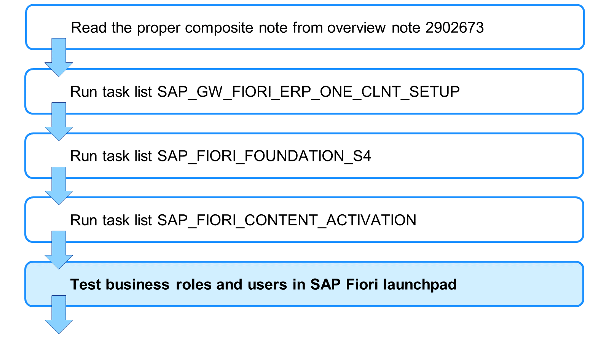
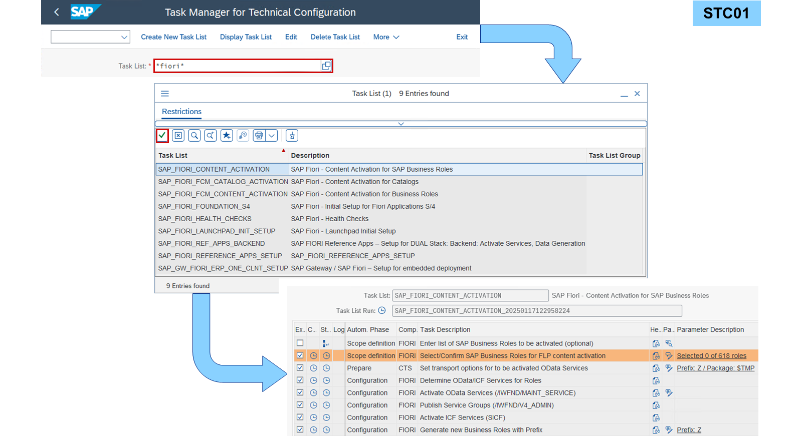
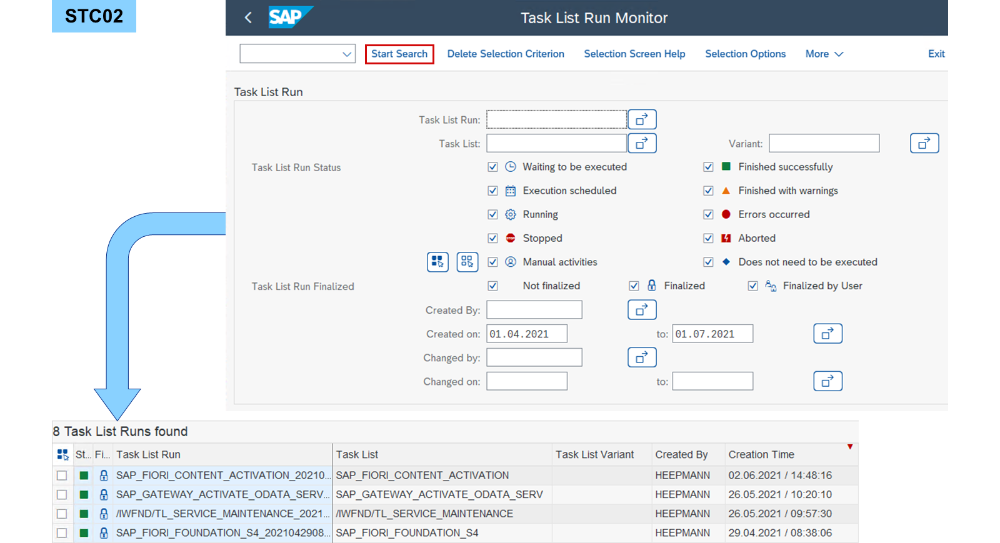
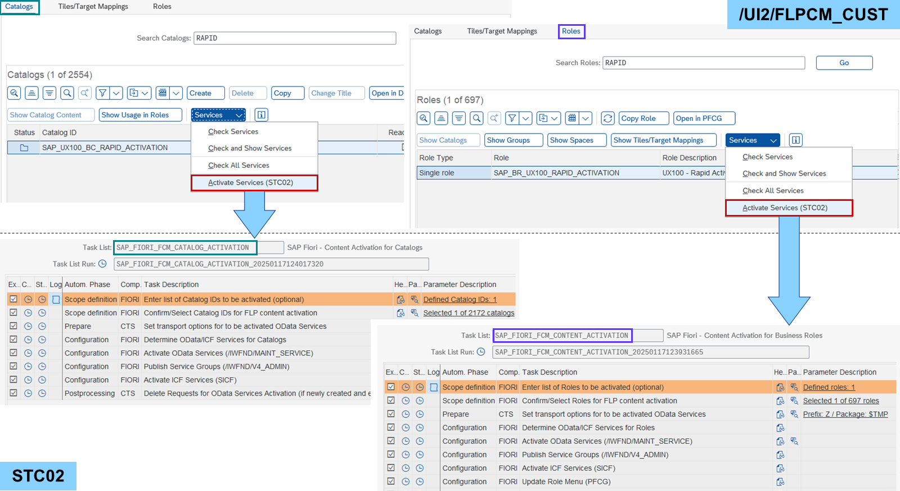

# Content Administration

*Source: https://learning.sap.com/courses/learning-the-basics-of-sap-fiori/activating-sap-fiori-content-using-rapid-activation_e5061480-a49d-4007-ba78-9f60b89369e9*

Objective
After completing this lesson, you will be able to activate SAP Fiori Content using Rapid Activation.
## Rapid Activation
Rapid activation for SAP Fiori is available to speed up the activation time for SAP Fiori content.
Watch the video to get an overview of rapid activation.

The first part of rapid activation for SAP Fiori is about setting up the foundation for SAP Fiori followed by activating SAP Fiori apps shipped by SAP. The SAP Note [2902673](https://me.sap.com/notes/2902673) – _Rapid Activation for SAP Fiori in SAP S/4HANA - Overview_ offers links to the composite notes for each release of SAP S/4HANA documenting every step of the activation. The following task lists are the main steps:

SAP_GW_FIORI_ERP_ONE_CLNT_SETUP
    The technical setup for SAP Gateway, SAPUI5, and _SAP Fiori launchpad_ in one client makes it possible to start the _SAP Fiori launchpad_.

SAP_FIORI_FOUNDATION_S4
    The initial setup for _SAP Fiori launchpad_ and SAP Fiori apps in SAP S/4HANA makes it possible to use all features of SAP Fiori.

SAP_FIORI_CONTENT_ACTIVATION
    The content activation for business roles shipped by SAP makes it possible to use all SAP Fiori apps defined in the business role.

The second part of rapid activation for SAP Fiori is about setting up customer-specific catalogs and roles including authorizations. The task list SAP_FIORI_FCM_CONTENT_ACTIVATION activates the content of business roles created by customers in the same way as SAP_FIORI_CONTENT_ACTIVATION does it for business roles shipped by SAP. Both task lists can be run multiple times for multiple business roles. In fact, it is better to activate role by role, rather than activating everything at once. After each task-list run, key-users responsible for the roles can be invited to test their business processes.
Since SAP S/4HANA 2023 FPS01, the task list SAP_FIORI_FCM_CATALOG_ACTIVATION allows you to activate the content of business catalogs. This makes rapid activation for SAP Fiori even more flexible.
### Task Manager for Technical Configuration

The _Task Manager for Technical Configuration_ (transaction STC01) offers many task lists for a wide variation of technical configuration tasks in an ABAP system. First, search for a task list suitable for the configuration. Second, fill in all parameters in all steps of the task list. Some steps are mandatory, some can be skipped, and some can be activated in addition. Every step is documented and is often connected to other steps. Such dependencies are automatically checked. Finally, the task list can be run in a dialog process or in the background. Start long-running task-list runs in the background.

All task list runs are logged in the _Task List Run Monitor_ (transaction STC02). Every detail of a task list run from the past and the result of task list runs running in the background can be checked. Errors can be examined and the task list run can be continued after solving the root cause of the error.

Since SAP S/4HANA 2023 FPS01, the task lists SAP_FIORI_FCM_CONTENT_ACTIVATION and SAP_FIORI_FCM_CATALOG_ACTIVATION can be launched directly from the _SAP Fiori Launchpad Content Manager_. Select the role or the catalog and choose _Services_ → _Activate Services (STC02)_. This opens the task list run with the role or catalog already selected.
Note
For more information about this topic, see:
  * SAP Fiori – System Administration (Classroom Training)
<https://training.sap.com/course/ux200>
  * Activating SAP Fiori Launchpad Using SAP Fiori Foundation Task List (Learning Video)
<https://learning.sap.com/videos/activating-sap-fiori-launchpad-using-sap-fiori-foundation-task-list>
  * Activating SAP Fiori Content in Custom Business Roles in SAP S/4HANA Cloud Private Edition and SAP S/4HANA (Learning Video)
<https://learning.sap.com/videos/activating-sap-fiori-content-in-custom-business-roles-in-sap-s-4hana-cloud-private-edition-and-sap-s-4hana>

## How to Activate SAP Fiori Content
### Business Example
You want to operate rapid activation to activate all services of apps assigned via catalogs to a business role.
Watch the video to see how to activate SAP Fiori content.
## Analyze SAP Fiori Task Lists
### Business Example
You want to examine the _Task List Run Monitor_ for SAP Fiori task list runs.
Note
This exercise requires an SAP Learning system. Login information is provided by your system setup guide.
### Task 1: Analyze the SAP_FIORI_FOUNDATION_S4 Task List
Exercise[Start Exercise](https://learnsap.enable-now.cloud.sap/pub/mmcp/index.html?show=project!PR_2EC07F14A36A6089:uebung)
#### Steps
  1. In the _Task List Run Monitor_ (STC02) of your SAP S/4HANA (S4H) system, examine a run of the _SAP_FIORI_FOUNDATION_S4_ task list. Answer the following questions:
     * Which report is called to replicate back-end catalogs?
     * Which transaction is called to configure help settings?
     * Which SAP Gateway services are registered for the system alias FIORI_MENU?
    1. In the _SAP Easy Access_ menu of your S4H, search for _Task List Run Monitor_ or start transaction STC02.
    2. In the _Task List_ field, enter ***fiori*** and open the value help.
    3. In the dialog box, choose _Start Search_.
    4. In the table, double-click _SAP_FIORI_FOUNDATION_S4_.
    5. In the _Created By_ field, delete the user.
    6. Choose _Start Search_.
    7. In the table, double-click one _SAP_FIORI_FOUNDATION_S4_ task list run.
    8. In the line _Replicate backend catalog for System Aliases_ , choose _Show Task Documentation_ :
#### Result
The report to replicate back-end catalogs is /UI2/GET_APP_DESCR_REMOTE_ALL.
    9. When finished reading, close the popup.
    10. In the line _Configure Help Settings (SHELP_CONFIG)_ , choose _Show Task Documentation_ :
#### Result
The transaction SHELP_CONFIG is called to configure help settings.
    11. When finished reading, close the popup.
    12. In the line _Activate Gateway OData Services Foundation (/IWFND/MAINT_SERVICE)_ , choose _Show Task Documentation_ :
#### Result
The SAP Gateway services /UI2/EASY_ACCESS_MENU and /UI2/USER_MENU are registered for the system alias FIORI_MENU.
    13. When finished reading, close the popup.

### Task 2: Analyze the SAP_FIORI_CONTENT_ACTIVATION Task List
Exercise[Start Exercise](https://learnsap.enable-now.cloud.sap/pub/mmcp/index.html?show=project!PR_EDF83C22DB16F299:uebung)
#### Steps
  1. In the _Task List Run Monitor_ (STC02) of your S4H, examine a run of the _SAP_FIORI_CONTENT_ACTIVATION_ task list. Display the list of selected business roles of the according task.
    1. In the _SAP Easy Access_ menu of your S4H, search for _Task List Run Monitor_ or start transaction STC02.
    2. In the _Task List_ field, enter ***fiori*** and open the value help.
    3. In the dialog box, choose _Start Search_.
    4. In the table, double-click _SAP_FIORI_CONTENT_ACTIVATION_.
    5. In the _Created By_ field, delete the user.
    6. Choose _Start Search_.
    7. In the table, double-click one _SAP_FIORI_CONTENT_ACTIVATION_ task list run.
    8. In the line _Confirm/Select Roles for FLP content activation_ , choose _Display Parameters_.
    9. Choose _Sort selected Roles_ :
#### Result
The list of selected business catalogs is displayed.
    10. Choose _Back_.
Hint
If a popup asks you if you want to save the selection, choose _No_.
    11. Operate the app as you wish.
