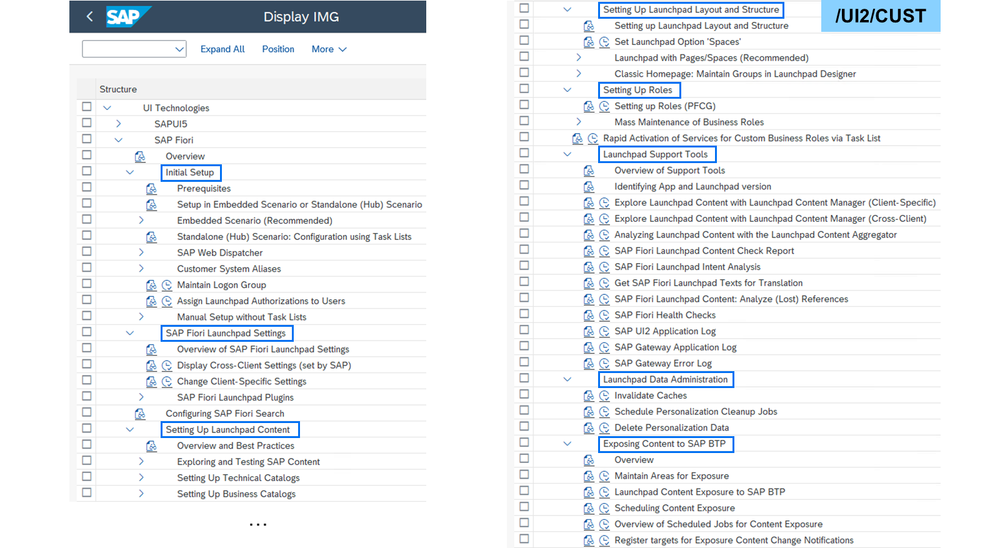
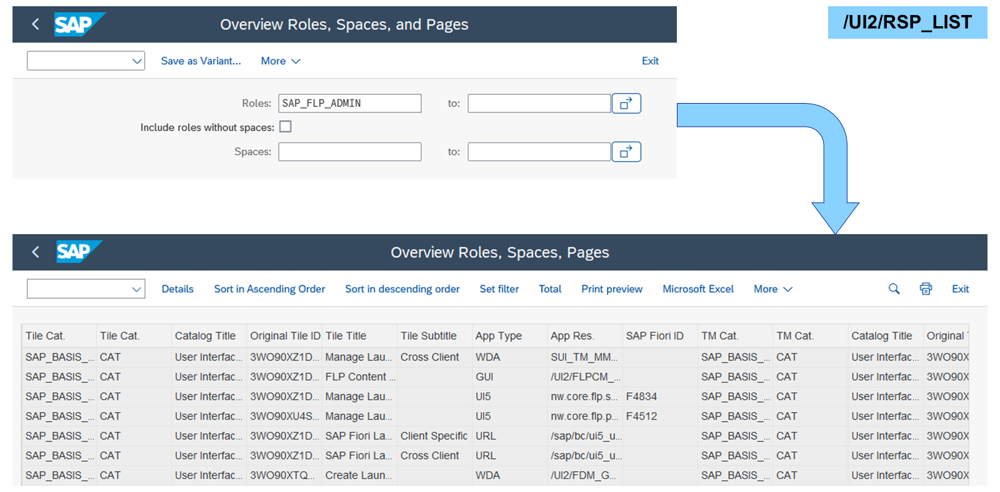
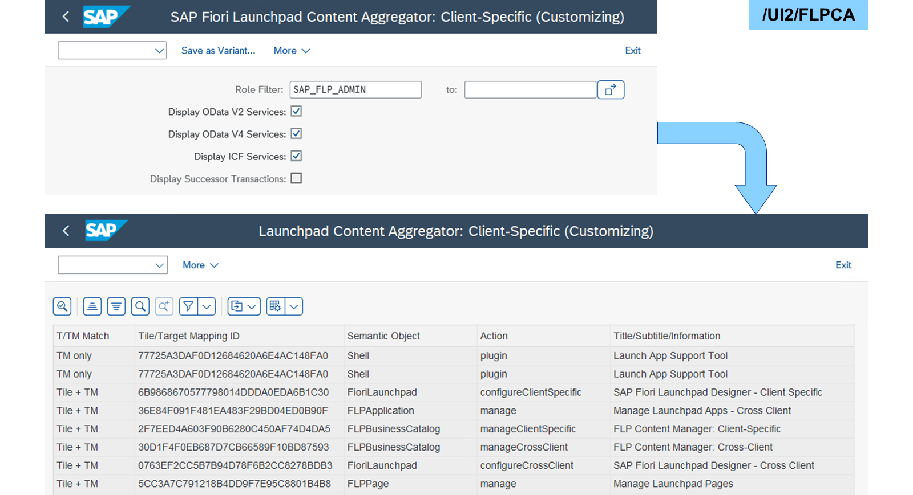
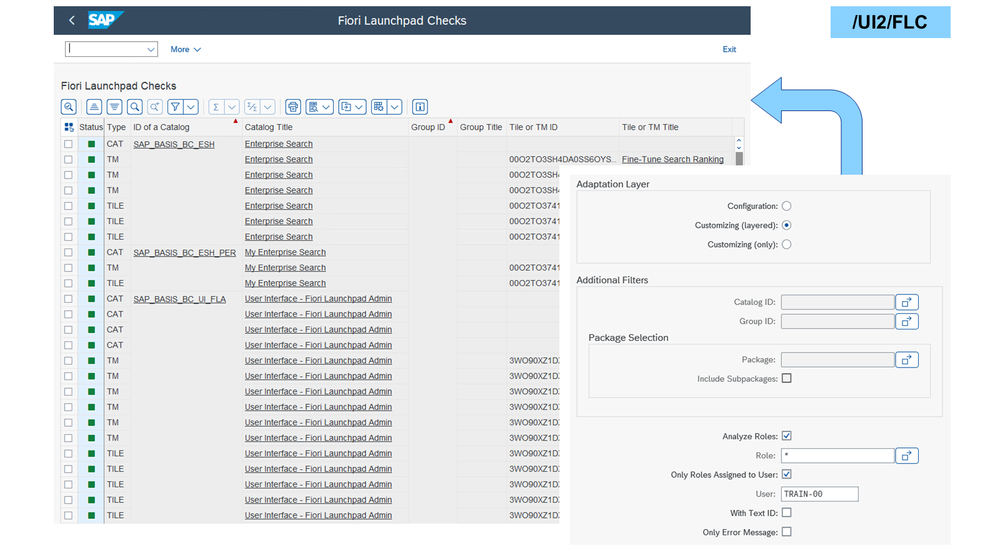
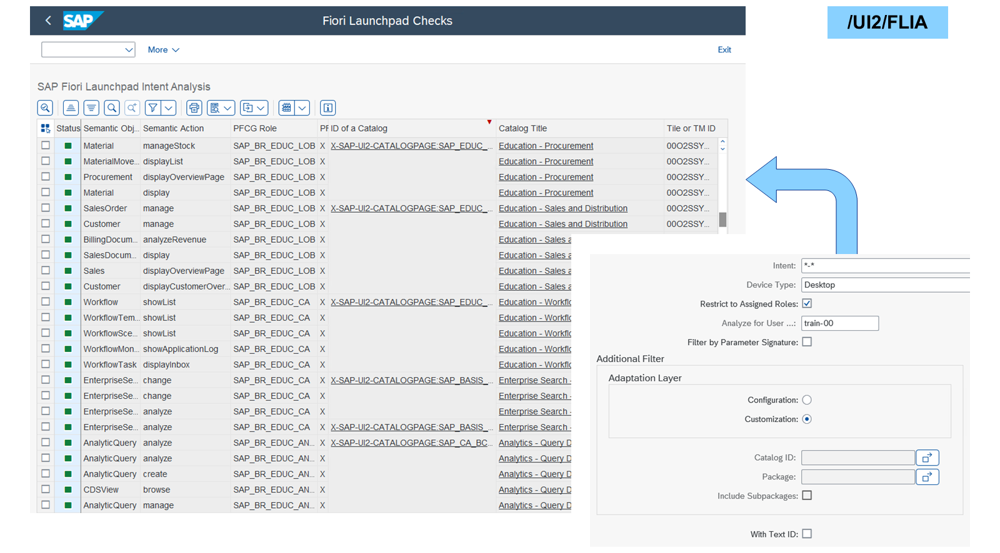
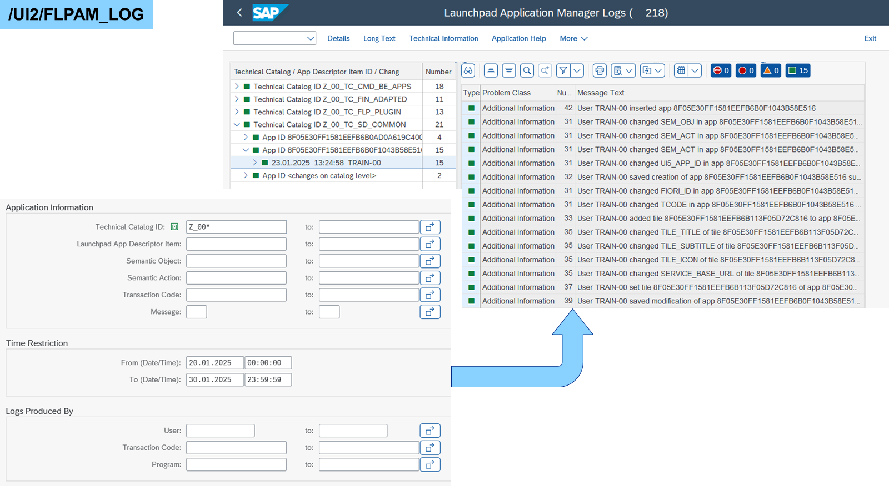
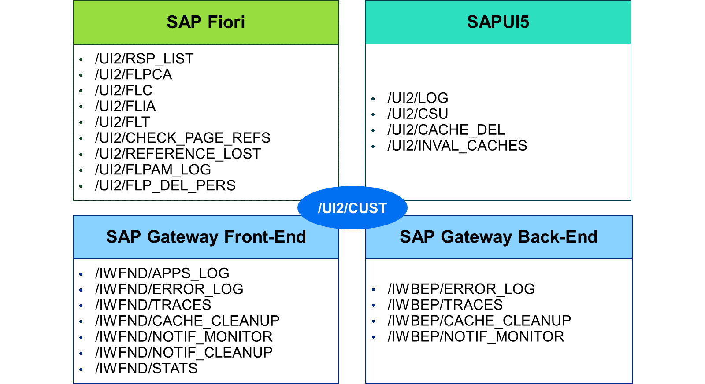

# Troubleshooting SAP Fiori Launchpad

*Source: https://learning.sap.com/courses/learning-the-basics-of-sap-fiori/troubleshooting-sap-fiori-launchpad_cf4420a3-330c-4837-821f-674061305253*

Objective
After completing this lesson, you will be able to maintain SAP Fiori Launchpad Content
## Maintenance Transactions

SAP Fiori is part of the _SAP Reference Implementation Guide (IMG)_. Transaction /UI2/CUST can be used to access only the UI-relevant parts of the IMG. The main parts for SAP Fiori are as follows:
  * _Initial Setup_ for system administrators
  * _SAP Fiori Launchpad Settings_ for content and system administrators
  * _Setting Up Launchpad Content_ for business specialists, content administrators, and developers
  * _Setting Up Launchpad Layout and Structure_ for business specialists and content administrators
  * _Setting Up Roles_ for content administrators, business specialists, and authorization specialists
  * _Launchpad Support Tools_ for business specialists, content administrators, and developers
  * _Launchpad Data Administration_ for content and system administrators
  * _Exposing Content to SAP BTP_ for business specialists and content administrators
Note
The SAP BTP service handling SAP Fiori content is called SAP Build Work Zone, standard edition.

### Overview Roles, Spaces, Pages

Since SAP S/4HANA 2021, transaction /UI2/RSP_LIST provides an overview of spaces and pages per business role. With that it is possible to get a list of the tiles the users see in their _SAP Fiori launchpad (FLP)_ spaces. It is possible to research the apps and their origin catalogs or if there are pages assigned but hidden.

Since SAP S/4HANA 2020, transaction /UI2/FLPCA shows all content assigned to business roles. This is very useful for getting an overview of everything a user gets in the _SAP Fiori launchpad (FLP)_ when assigning roles:
  * Sort by catalogs to show the content in the app finder.
  * Sort by semantic object to show the intent-based navigation links.
  * Sort by services to show the technical prerequisites.
  * Sort by successor transaction to show deprecated apps.

Note
You can either search for services or successor apps but not both at the same time.

An important support tool for the FLP configuration is transaction /UI2/FLC. It checks the consistency of delivered and customized catalogs and groups for configuration and customizing. It quickly identifies problems in target mappings and tiles concerning elements of the intent-based navigation and parameters.

Transaction /UI2/FLIA also shows errors and problems in target mappings, but it goes deeper. It offers a full intent analysis for semantic objects and actions per role and user. Through this analysis, duplicated intents pointing to different targets can also be found. A full intent resolution analysis takes some time, depending on the number of semantic objects and actions in the system. It is recommended to restrict the analysis to the assigned roles of a user.

Since SAP S/4HANA 2023, every change to a technical catalog or an app descriptor can be seen in transaction /UI2/FLPAM_LOG. The changes were already being logged before in the _Application Log_ (SLG1 with object FLPAM). But the new transaction makes it easier to find the relevant information by offering more selection options and a better visibility.

There are many other transactions available for logging, tracing, cache handling, cleanup, and so on, in the areas of SAP Fiori, SAPUI5, and SAP Gateway. There is no need to know them all by heart. Transaction /UI2/CUST organizes all of them as a tree in the implementation guide.
Note
For more information about this topic, please read SAP Note [2116090](https://me.sap.com/notes/2116090) – _UI Addon, SAP_UI: Information for customers for efficient incident analysis_.
## App Support
Let's watch the video to get an overview of App Support activation.Activating App Support
## Check SAP Fiori Launchpad Content
### Business Example
You want to operate the _Overview Roles, Spaces, Pages_ (/UI2/RSP_LIST), _SAP Fiori Launchpad Content Aggregator_ (/UI2/FLPCA), _SAP Fiori Launchpad Checks_ (/UI2/FLC), and _SAP Fiori Launchpad Intent Analysis_ (/UI2/FLIA) transactions.
Note
This exercise requires an SAP Learning system. Login information is provided by your system setup guide.
Note
Whenever the values or object names in this exercise include ##, replace ## with the number of your user.
### Prerequisites
The standard catalog was created in the exercise **Create Standard Catalogs**.
### Task 1: Operate Overview Roles, Spaces, Pages
Exercise[Start Exercise](https://learnsap.enable-now.cloud.sap/pub/mmcp/index.html?show=project!PR_74F7BC38ECE29F:uebung)
#### Steps
  1. In the _Overview Roles, Spaces, Pages_ (/UI2/RSP_LIST) of your SAP S/4HANA (S4H) system, check if any pages are hidden in your roles.
    1. In the _SAP Easy Access_ menu of your S4H, search for _Overview Roles, Spaces, Pages_ or start transaction /UI2/RSP_LIST.
    2. In the _Roles_ field, enter **z_##***.
    3. Choose _Execute_.
    4. Examine the _Hidden_ column.
#### Result
No page should be hidden.

### Task 2: Operate SAP Fiori Launchpad Content Aggregator
Exercise[Start Exercise](https://learnsap.enable-now.cloud.sap/pub/mmcp/index.html?show=project!PR_92C89578E0D421A4:uebung)
#### Steps
  1. In the _Fiori Launchpad Content Aggregator_ (/UI2/FLPCA) of your SAP S/4HANA (S4H) system, check the status of the OData V2 services used by apps in your roles.
    1. In the _SAP Easy Access_ menu of your S4H, search for _Fiori Launchpad Content Aggregator_ or start transaction /UI2/FLPCA.
    2. In the _Role Filter_ field, enter **z_##***.
    3. Select the _Display OData V2 Services_ checkbox.
    4. Choose _Execute_.
    5. Scroll the table to the right.
    6. Select the _OData v2 Service Name_ column and choose _Sort in Descending Order_.
    7. Examine the _OData v2 Service Status_ column.
#### Result
All services should be active.

### Task 3: Operate SAP Fiori Launchpad Checks
Exercise[Start Exercise](https://learnsap.enable-now.cloud.sap/pub/mmcp/index.html?show=project!PR_70A4F9821279368E:uebung)
#### Steps
  1. In the _Fiori Launchpad Checks_ (/UI2/FLC) of your S4H, check the SAP Fiori customizing of your user for errors.
    1. In the _SAP Easy Access_ menu of your S4H, search for _Fiori Launchpad Checks_ or start transaction /UI2/FLC.
    2. Select the _Analyze Roles_ checkbox.
    3. In the _Role_ field, enter *****.
    4. Select the _Only Roles Assigned to User_ checkbox.
    5. In the _User_ field, enter **TRAIN-##**.
    6. Choose _Execute_.
    7. Select the _Status_ column and choose _Sort in Descending Order_.
    8. Scroll the table to the right and examine the errors in the _Message_ column.
  2. In the _Fiori Launchpad Checks_ (/UI2/FLC) of your S4H, examine all details of the _Z_##_BR_TRAINING_ role.
    1. In the _Fiori Launchpad Checks_ (/UI2/FLC) of your S4H, choose _Back_.
    2. In the _Role_ field, enter **z_##*** and use the value help.
    3. In the popup, double-click _Z_##_BR_TRAINING_.
    4. Deselect the _Only Roles Assigned to User_ checkbox.
    5. Choose _Execute_.
    6. In the table header, choose _Choose Layout..._.
    7. In the popup, choose _2SAP_ALL_.
    8. Search and examine everything that you created by scrolling through the table.

### Task 4: Operate SAP Fiori Launchpad Intent Analysis
Exercise[Start Exercise](https://learnsap.enable-now.cloud.sap/pub/mmcp/index.html?show=project!PR_A6652BA2B03F75B6:uebung)
#### Steps
  1. In the _Fiori Launchpad Intent Analysis_ (/UI2/FLIA) of your S4H, examine the target mappings of your user you created.
    1. In the _SAP Easy Access_ menu of your S4H, search for _Fiori Launchpad Intent Analysis_ or start transaction /UI2/FLIA.
    2. In the _Intent_ field, enter ***-*##**.
    3. Select the _Restrict to Assigned Roles_ checkbox.
    4. In the _Analyze for User ..._ field, enter **TRAIN-##**.
    5. Choose _Execute_.
    6. Examine the target mappings that you created.

[Continue to quiz](https://learning.sap.com/courses/learning-the-basics-of-sap-fiori/content-administration_92d63e1b-177a-38eb-a1ce-2f42267be62b)
