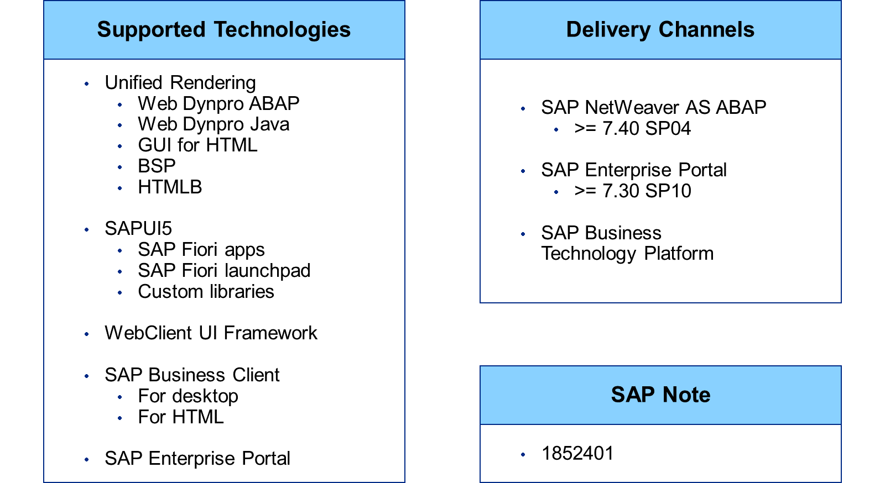
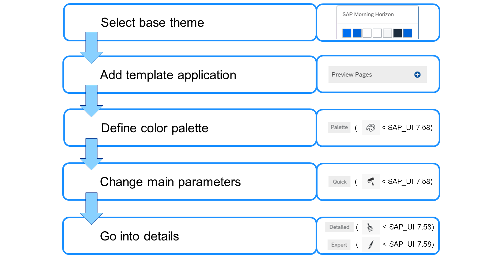
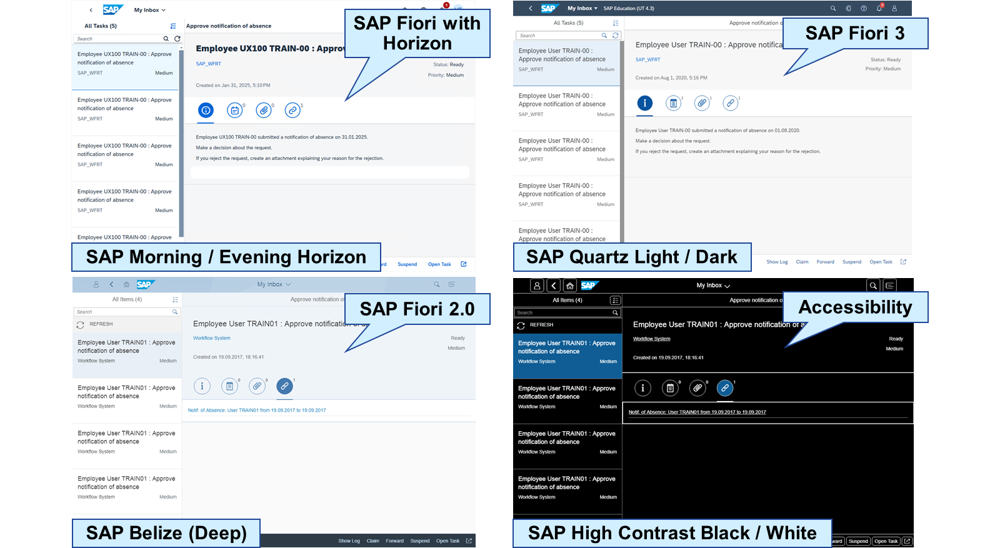
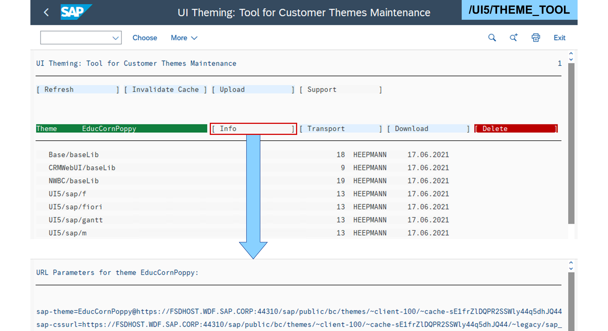

# Adaptation

*Source: https://learning.sap.com/courses/learning-the-basics-of-sap-fiori/using-the-ui-theme-designer_e269f16a-7009-4467-9b6f-4d3dd689da32*

Objective
After completing this lesson, you will be able to use the UI Theme Designer.
## Adaption of Themes
_UI Theme Designer_ is a browser-based editor.
Watch this video to learn more about _UI Theme Designer_.

The _UI Theme Designer_ supports all web-based SAP applications and clients based on HTML4 and HTML5. It is available in three channels:

(SAP NetWeaver) Application Server ABAP
    Transaction /UI5/THEME_DESIGNER

SAP Enterprise Portal
     _Content Administration_ → _Portal Display_ → _Portal Themes_ → _UI Theme Designer_

SAP Business Technology Platform
     _SAP Fiori launchpad_ → _User Actions Menu_ → _Theme Manager_ → _Launch Theme Designer_
Prerequisites, installation, and configuration are available in the SAP Note [1852401](https://me.sap.com/notes/1852401) – _UI Theme Designer for SAP NetWeaver AS ABAP (main SAP Note)_.
Hint
When creating themes for the Unified Rendering, it is recommended to always use the latest version. Please check SAP Note [2090746](https://me.sap.com/notes/2090746) – _WD ABAP: Unified Rendering Update with TCI - Instructions and Related SAP Notes._ for details.
To design a theme, refer to the following procedure.

All themes have a base theme (CSS files). For SAP Fiori 3, this is SAP Quartz Light. After choosing a template application to visualize the changes, the new theme is built upon a set of theme-related (specific style) CSS files. The theme generator merges the base theme with the specific style into the final theme.
SAPUI5 uses LESS to handle the CSS parameters and allows some additional features. LESS can be considered a preprocessor that results in the final version of the CSS. Find out more at <http://lesscss.org/>.

The available base themes depend on the release of the system providing the UI theme designer.
SAP delivers the following themes for SAPUI5:

SAP Morning / Evening Horizon

  * Theme released for SAP Fiori with Horizon
  * Initial shipment in SAP S/4HANA Cloud 2202 / SAPUI5 1.102
  * Uses own typeface "72"

SAP Quartz Dark

  * Theme released for SAP Fiori 3
  * Initial shipment in SAP S/4HANA Cloud 2002 / SAPUI5 1.72
  * Uses own typeface "72"

SAP Quartz Light

  * Theme released for SAP Fiori 3
  * Initial shipment in SAP Cloud Platform 1904 / SAPUI5 1.65
  * Uses own typeface "72"

SAP Belize (Deep)

  * Theme released for SAP Fiori 2.0
  * Initial shipment in software component SAP_UI 7.51 / SAPUI5 1.44
  * Uses typefaces Arial Regular and Bold

SAP High Contrast Black / White

  * Theme released for accessibility purpose
  * Initial shipment in software component SAP_UI 7.40 / SAPUI5 1.28
  * Flavors for SAP Belize, Quartz, and Horizon

SAP Blue Crystal – Deprecated

  * Theme released for SAP Fiori
  * Initial shipment in software component SAP_UI 7.40 / SAPUI5 1.28
  * Uses typefaces Arial Regular and Bold

SAP Gold Reflection – Deprecated

  * Theme released for non-Fiori standalone apps
  * Initial shipment in SAPUI5 1.0
  * Not working with SAP Fiori

## Maintenance of Themes

The _Theme Tool_ manages the themes in the theme repository of an Application Server (AS) ABAP. Themes can be viewed, imported, exported, and deleted, as well as transported to the follow-up system. This is also the easiest way to get a URI pointing to a certain theme. Start the tool using the following transaction: /UI5/THEME_TOOL.
Watch the video to see how to set central theme parameters for the SAP Fiori launchpad. Setting Central Theme Parameter
### Theme Parameter Values
| Theme  | Parameter Value  |
| --- | --- |
| SAP Belize  | sap_belize  |
| SAP Belize Dark  | sap_belize_plus  |
| SAP High Contrast Black (Belize)  | sap_belize_hcb  |
| SAP High Contrast White (Belize)  | sap_belize_hcw  |
| SAP Quartz Light  | sap_fiori_3  |
| SAP Quartz Dark  | sap_fiori_3_dark  |
| SAP High Contrast Black (Quartz)  | sap_fiori_3_hcb  |
| SAP High Contrast White (Quartz)  | sap_fiori_3_hcw  |
| SAP Morning Horizon  | sap_horizon  |
| SAP Evening Horizon  | sap_horizon_dark  |
| SAP High Contrast Black (Horizon)  | sap_horizon_hcb  |
| SAP High Contrast White (Horizon)  | sap_horizon_hcw  |
## Create SAP Fiori Themes
### Business Example
You want to create and test a theme for _SAP Fiori launchpad_ using the _UI Theme Designer_.
Note
This exercise requires an SAP Learning system. Login information is provided by your system setup guide.
Note
Whenever the values or object names in this exercise include ##, replace ## with the number of your user.
### Task 1: Create a Theme and Define a Color Palette in the UI Theme Designer
Exercise[Start Exercise](https://learnsap.enable-now.cloud.sap/pub/mmcp/index.html?show=project!PR_38617B38D782CDB3:uebung)
#### Steps
  1. In the _UI Theme Designer_ of your SAP S/4HANA (S4H) system, create a theme based on the **SAP Morning Horizon** theme.
    1. In the _SAP Easy Access_ menu of your S4H, search for _UI Theme Designer_ or start transaction /UI5/THEME_DESIGNER.
    2. In the _UI Theme Designer_ , choose _Create a New Theme_.
    3. In the _Base Theme_ menu, choose _SAP Morning Horizon_.
    4. Choose _Create Theme_.
  2. Add the _SAP Fiori launchpad_ of your SAP S/4HANA (S4H) system as preview.
    1. Choose the _+_ next to _Preview Pages_.
    2. In the _Link to Application_ field, enter **/sap/bc/ui2/flp**.
    3. In the _Name of Application_ field, enter **SAP Fiori Launchpad**.
    4. Choose _Add_.
  3. Define a color palette parameter called **CornPoppyRed** in your theme with the hexadecimal value **E00025**.
    1. Choose the _Palette_ tab in the upper right.
    2. In the _Enter parameter ID_ field, enter **CornPoppyRed**.
    3. For the _Parameter color_ field, open the value help.
    4. In the _Hex_ field, enter **e00025**.
    5. Choose _OK_.
    6. Choose _Add palette parameter_ (_+_ next to the value help).

### Task 2: Design a Theme in the UI Theme Designer
Exercise[Start Exercise](https://learnsap.enable-now.cloud.sap/pub/mmcp/index.html?show=project!PR_11F2265F085AABB2:uebung)
#### Steps
  1. In the _UI Theme Designer_ of your S4H, change the main _Brand Color_ in your theme to **CornPoppyRed**.
    1. In the _UI Theme Designer_ of your S4H, choose the _Quick_ tab.
    2. For the _Brand Color_ field in the _Main_ group, open the value help.
    3. In the _Palette_ pane, choose _CornPoppyRed_.
    4. Note the change of the _Link Color_.
  2. Set the FioriMeadow.jpg image from the course folder on the training share as _Background Image/Gradient_ of the _Shell Canvas_ for your theme.
Note
Course folders on the training share can be found at S:\Courses.
    1. Choose the _Detailed_ tab.
    2. For the _Background Image_ field in the _Shell Canvas_ group, open the value help.
    3. Choose _Drop image files here or press to browse_.
    4. Select S:\Courses\UX100_24\FioriMeadow.jpg.
    5. Choose _Open_.
    6. Choose _OK_.
  3. Change the _sapShellColor_ in your theme to **CornPoppyRed**.
    1. Choose the _Expert_ tab.
    2. Select the filter _Colors_.
    3. In the _Search_ field, enter **shellc** and choose **Enter**.
    4. For the _sapShellColor_ field, open the value help.
    5. In the _Palette_ pane, choose _CornPoppyRed_.
    6. Note the change of many other colors.

### Task 3: Build and Preview a Theme in the UI Theme Designer
Exercise[Start Exercise](https://learnsap.enable-now.cloud.sap/pub/mmcp/index.html?show=project!PR_D834F5B1147BB87:uebung)
#### Steps
  1. In the _UI Theme Designer_ of your S4H, save and build your theme as **CornPoppy##** with the description **Corn Poppy Meadow ##**. Run a preview of your theme in the _UI Theme Designer_.
    1. In the _UI Theme Designer_ of your S4H, in the menu, choose _Theme_ → _Save As…_.
    2. In the _Theme ID_ field, enter **CornPoppy##**.
    3. In the _Title_ field, enter **Corn Poppy Meadow ##**.
    4. Choose _Save_.
    5. In the menu, choose _Theme_ → _Save & Build_.
    6. Choose _Preview built theme in a new window_ (Triangle above the preview).

## Configuration Parameters for SAP Fiori Themes
These customizing parameters can be used to configure the themes in the _SAP Fiori launchpad_ :

DARK_MODE

Specify if users can enable the dark mode.
true (default)/false

THEMING_DEFAULT_THEME

Specify the default theme for the users.
sap_horizon (default)

THEMING_HIDE_SAP_THEMES

Specify whether the SAP themes are removed from the _Settings_.
true/false (default)

USERSETTINGS_SET_THEME

Specify whether users can select a different theme in the _Settings_.
true (default)/false
