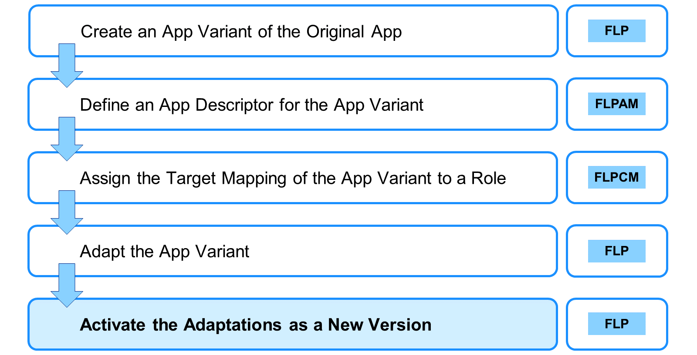
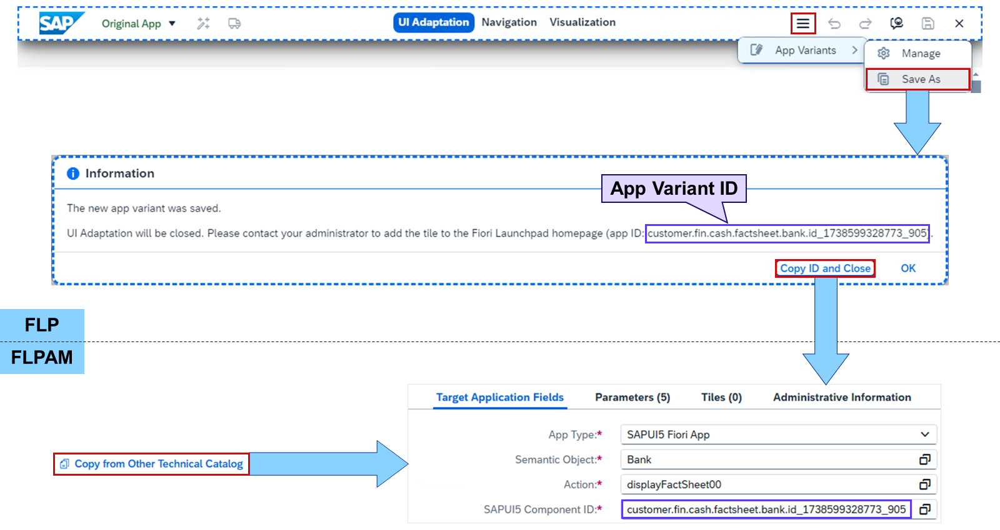
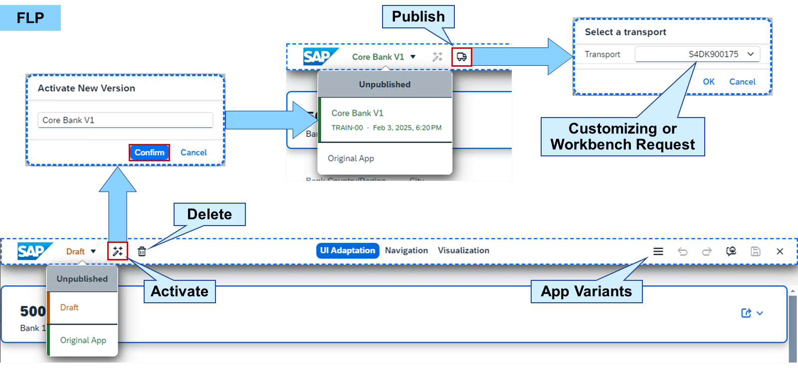

# Adapting SAP Fiori UIs at Runtime

*Source: https://learning.sap.com/courses/learning-the-basics-of-sap-fiori/adapting-sap-fiori-uis-at-runtime_db9cbc8a-2660-49b3-8e0d-2ceb9416ac8d*

Objective
After completing this lesson, you will be able to use SAP Fiori runtime authoring
## Adaptation at Runtime
Watch the video to see how SAP Fiori UIs can be adapted at runtime.
## Key User Extensibility

Since SAP S/4HANA 2023, to create an adaptation of an app as a key user, the following steps must be performed. The prerequisite is that the original app and the RTA plugin are assigned to the user master record of the key user and the key user has the authorization to create adaptations:
  1. In the FLP, start the original app and enter the adaptation mode. Then create an app variant of the original app and save the app variant ID.
  2. In the FLPAM, define an app descriptor for the app variant. You may copy the app descriptor of the original app to a standard catalog and replace the SAPUI5 component ID with the app variant ID.
Note
Keeping the intent of the original app, replaces the original app with the variant for all assigned users. If you still want to access the original app in the FLP, change the intent to a unique value.
  3. In the FLPCM, assign the target mapping of the app variant to a role. It is recommended to first reference the target mapping in a business catalog and assign the business catalog to the role.
  4. In the FLP, start the app variant and enter the adaptation mode. Then adapt the app variant as you like and save it.
  5. In the FLP, activate the adaptations as a new version. After that, you may publish the app variant version and assign it to a transport request.

Versions of app variants were introduced in SAP S/4HANA 2023. Before this release, the key user directly adapted the original app and then saved it as an app variant. Compared to the list above, the order was _1._ → _4._ → _2._ → _3._. Without a version, the app variant was directly assigned to a transport request.

By choosing _More Actions_ → _App Variants_ → _Save As_ , an app variant can be created. You can save multiple variants of one application and also of other variants. Each variant has an app variant ID, which can be used in the FLPAM (in older releases FLPD) to create a target mapping starting the app with this variant. The target mapping can be created by copying the original target mapping of the app and exchanging the SAPUI5 component ID with the app variant ID.

After the adaptations to an app have been saved in a variant, they can be activated as a new version. This sets this variant as the active version for all users in the system replacing the original app or any previously active version. You can switch to an older version by activating it as a new version.
With the active version being selected, the _Publish_ button can be used to assign it to a transport request. A customizing or workbench request can be selected to decide, if the adaptations should be available client-specific or cross-client in the follow-up system.
Note
For more information about this topic, see:
  * Extensibility for SAP S/4HANA (Classroom Training)
<https://training.sap.com/course/s4d425>
  * Getting Started with In-App Extensibility in SAP S/4HANA (Online Course)
<https://learning.sap.com/courses/getting-started-with-in-app-extensibility-in-sap-s-4hana>
  * Adapting the UI of List Report Apps with SAP Fiori for SAP S/4HANA (Learning Video)
<https://learning.sap.com/videos/adapting-the-ui-of-list-report-apps-with-sap-fiori-for-sap-s-4hana>

## How to Define a Target Mapping for an App Variant in FLPD
### Business Example
You want to define a target mapping for an app variant using the _SAP Fiori launchpad_ for customizing.
### Prerequisites
The business catalog was created in the exercise **Reference Tiles and Target Mappings** and the ap variant was created in exercise **Adapt SAP Fiori at Runtime**.
If the _SAP Fiori application manager (FLPAM)_ is not available in your system, watch the video to see how to create a business catalog and assign the app variant to a target mapping in the _SAP Fiori launchpad designer (FLPD)_.
Settings
## Adapt SAP Fiori at Runtime
### Business Example
You want to adapt an SAP Fiori app in the _SAP Fiori launchpad_ at runtime and save the changes as an app variant.
Note
This exercise requires an SAP Learning system. Login information is provided by your system setup guide.
Note
Whenever the values or object names in this exercise include ##, replace ## with the number of your user.
### Prerequisites
The business catalog was created in the exercise **Reference Tiles and Target Mappings**.
### Task 1: Activate Runtime Adaptation for a User
Exercise[Start Exercise](https://learnsap.enable-now.cloud.sap/pub/mmcp/index.html?show=project!PR_8BB2541994BA9F88:uebung)
#### Steps
  1. In the _User Maintenance_ (SU01) of your SAP S/4HANA (S4H) system, add the role **SAP_UI_FLEX_KEY_USER** to your user.
    1. In the _SAP Easy Access_ menu of your S4H, search for _User Maintenance_ or start transaction SU01.
    2. In the _User_ field, enter your user.
    3. Choose _Change_.
    4. Choose the _Roles_ tab.
    5. In the _Role_ column, open the value help for an empty field.
    6. In the _Single Role_ field, enter ***ui_flex*** and choose **Enter**.
    7. Select the _Single Role_**SAP_UI_FLEX_KEY_USER** and choose _Copy_ (Check mark).
    8. Choose _Save_.

### Task 2: Create an App Variant by Using Runtime Adaptation
Exercise[Start Exercise](https://learnsap.enable-now.cloud.sap/pub/mmcp/index.html?show=project!PR_1B77CBE7FE213885:uebung)
#### Steps
  1. In the _SAP Fiori launchpad_ of your S4H, open the object page for the sample bank _Deutsche Bank 24_ using the SAP Fiori search of your S4H.
    1. Start or reload the _SAP Fiori launchpad_ of your S4H in the client of your choice.
    2. Choose _Search_ in the upper right.
    3. In the _Search_ menu, choose _Banks_.
    4. In the _Search_ field, enter **24** and choose **Enter**.
    5. Choose _Deutsche Bank 24_.
  2. Create the app variant **Core Bank Data ##** and copy the app variant ID in the clipboard.
    1. In the object page for banks, choose your user in the upper right corner.
    2. In the _User Actions Menu_ , choose _Adapt UI_.
    3. Choose _More Actions_ (Three lines).
    4. Choose _App Variants_ → _Save As_.
    5. In the _Save as New App Variant_ popup, in the _Title_ field, enter **Core Bank Data ##**.
    6. Choose _Save_.
    7. In the _Information_ popup, choose _Copy ID and Close_.
Hint
You may want to paste the variant ID in a text file.

### Task 3: Define an App Descriptor for the App Variant in the SAP Fiori Launchpad Application Manager
Exercise[Start Exercise](https://learnsap.enable-now.cloud.sap/pub/mmcp/index.html?show=project!PR_E9B6C9AC46C3D388:uebung)
#### Steps
  1. In the _SAP Fiori launchpad application manager_ of your S4H, create the empty standard catalog **Z_##_TC_FIN_ADAPTED** with title **Z## - Financials Adaptation** as local object.
Note
If you do not see a list of catalogs but just two input fields, execute the last task of the exercise **Create Replicable Catalogs** :
Allow Standard and Replicable Catalogs as Catalog Types in an ABAP System.
    1. In the _SAP Fiori launchpad application manager_ , choose _New Technical Catalog_.
    2. In the _Technical Catalog ID_ field, enter **Z_##_TC_FIN_ADAPTED**.
    3. In the _Technical Catalog Title_ field, enter **Z## - Financials Adaptation**.
    4. From the _Technical Catalog Type_ dropdown, select **Standard Catalog**.
    5. Select _Create empty technical catalog only_.
    6. Choose _Local Object_.
  2. Copy the _Track Sales Orders_ app to your _Z_##_TC_FIN_ADAPTED_ catalog using the _SAP Fiori ID_**F1760**.
    1. In the _Search Term_ field, enter **z_##** and choose _Go_.
    2. In the _Technical Catalogs_ table, choose _Z_##_TC_FIN_ADAPTED_.
    3. Choose _Copy from Other Technical Catalog_.
    4. In the _Select Transport Request_ popup, choose _Local Object_.
    5. In the _Copy from Other Technical Catalog_ popup, choose _Adapt Filters_.
    6. In the _Adapt Filters_ popup, select _SAP Fiori ID_ and choose _OK_.
    7. In the _SAP Fiori ID_ field, enter **F1760** and choose _Go_.
    8. Select the _Semantic Object_**Bank** with _Action_**displayFactSheet** and choose _Copy_.
#### Result
The warning _Transaction code exists but has a different launchpad app descriptor item ID assigned in SE93_. This is solved in the next steps.
    9. Close the warning message.
  3. Paste the variant ID from the clipboard in the _SAPUI5 Component ID_ field. Change the action to **displayFactSheet##** and the _Target Application Title_ to **Show Bank ##**.
    1. In the _SAPUI5 Component ID_ field, paste the variant ID from the clipboard.
    2. In the _Action_ field, enter **displayFactSheet##**.
    3. In the _Target Application Title_ field, enter **Show Bank ##**.
    4. Choose _Save_.
#### Result
The changes are saved but the warning that the transaction code already exists is shown. This is solved in the next step.
  4. For the _Bank_ app, create the transaction code **Z##_F1760** with **Show Bank ##** as text.
    1. Choose _Edit_ in the upper left.
    2. In the _Transaction Code_ field, enter **Z##_F1760** and choose **Enter**.
    3. For the _Transaction Code_ , choose _Click for creation_.
    4. In the _Warning_ popup, choose _OK_.
    5. In the _Create / Display Transaction_ window, in the _Transaction Text_ field, enter **Show Bank ##**.
    6. Choose _Create Transaction_.
    7. Close the _Create / Display Transaction_ window.
    8. Choose _Save_.

### Task 4: Reference the Target Mapping of the App Variant in a Business Catalog
Exercise[Start Exercise](https://learnsap.enable-now.cloud.sap/pub/mmcp/index.html?show=project!PR_B6A198F95B286F82:uebung)
#### Steps
  1. In the _SAP Fiori launchpad content manager_ of your S4H, create a reference for target mapping of _Show Bank ##_ of the _Z_##_TC_FIN_ADAPTED_ catalog in your catalog _Z_##_BC_EMPLOYEE_.
    1. Re-/Start the _SAP Fiori launchpad content manager_ of your S4H.
    2. In the _Search Catalogs_ field, enter **z_##** and choose _Go_.
    3. In the _Catalogs_ table, select the _Z_##_TC_FIN_ADAPTED_ catalog.
    4. In the _Content in Catalog Z_##_TC_FIN_ADAPTED_ table, select the _Show Bank ##_ app.
    5. Choose _Add Tiles/Target Mappings_ → _Add Selected Tiles/TMs to Other Catalog_.
    6. In the _Search Catalogs_ field, enter **z_##** and choose _Go_.
    7. In the _Catalogs_ table, select the _Z_##_BC_EMPLOYEE_ catalog.
    8. Choose _Add TM Reference_.
  2. Reload your _SAP Fiori launchpad_ of your S4H and search for the bank _Deutsche Bank 24_. Choose _Show Bank ##_ in the search result.
    1. Reload the _SAP Fiori launchpad_ of your S4H in the client of your choice.
    2. Choose _Search_ in the upper right.
    3. In the _Search_ menu, choose _Banks_.
    4. In the _Search_ field, enter **24** and choose **Enter**.
    5. Choose _Show Bank ##_.

### Task 5: Adapt the App Variant in the SAP Fiori Launchpad
Exercise[Start Exercise](https://learnsap.enable-now.cloud.sap/pub/mmcp/index.html?show=project!PR_2BDBB4AC9023D9B4:uebung)
#### Steps
  1. In the _UI Adaptation_ mode of the object page for banks, change the _Control Data_ group heading to **Core Data** , add the _Bank Country_ and _City_ fields to the _Address_ group, and remove the _Bank Branch_ and _Region_ fields.
    1. In the object page for banks, choose your user in the upper right corner.
    2. In the _User Actions Menu_ , choose _Adapt UI_.
    3. Right-click on _Control Data_ and choose _Rename_.
    4. Change the heading to **Core Data** and choose **Enter**.
    5. Right-click on _Address_ and choose _Add: Field_.
    6. In the _Available Content: Fields_ popup, select _Bank Country/Region_ and _City_ and choose _OK_.
    7. Right-click on _Bank Branch_ and choose _Remove_.
    8. Right-click on _Region_ and choose _Remove_.
    9. Choose _Save Draft_ (Floppy disk).
  2. Check your changes by using the _Navigation_ and _Visualization_ modes.
    1. Choose _Navigation_ at the top.
#### Result
Several buttons disappeared in the header bar.
    2. Choose the _House Banks_ tab.
    3. Choose the _General Information_ tab.
#### Result
In _Navigation_ mode, you can interact with the app.
    4. Choose _Visualization_ at the top.
    5. Choose the blue marker above _Core Data_.
    6. Choose the blue marker above _Address_.
#### Result
In the _Visualization_ mode, you can see where changes have been made.
    7. Choose _UI Adaptation_ at the top.
  3. Activate your changes as the new version **Core Bank V1**.
    1. Choose _Activate New Version_.
    2. In the _Activate New Version_ popup, in the _Enter a version title_ field, enter **Core Bank V1**.
    3. Choose _Confirm_.
    4. Choose _Exit_.
