# UI Development with SAP Fiori

*Source: https://learning.sap.com/courses/ui-development-with-sap-fiori*

## Contents

- **UI Development with SAP Fiori**
  - Start learning
  - Quiz
  - SAP Fiori Launchpad
  - Understanding the Technical Perspective of SAP Fiori Launchpad
  - Quiz
  - SAP Fiori Launchpad Configuration
  - Implementing the CrossApplicationNavigation Service
  - Quiz
  - Applying SAP Fiori Design Guidelines
  - Quiz
  - Utilizing SAPUI5 Flexibility
  - Implementing View Extension, Modification, and Replacement
  - Quiz
  - PRACTICE SYSTEM
Hands-on Practice for UI Development with SAP Fiori


---

## UI Development with SAP Fiori

### Start learning

*Source: https://learning.sap.com/courses/ui-development-with-sap-fiori/deconstructing-the-golden-rules-of-sapui5-development_a5937529-71dd-4804-9da0-6fcaa4308a91*

Objective
After completing this lesson, you will be able to apply the golden rules of SAPUI5 development to develop SAP Fiori apps
## Golden Rules of SAPUI5 Development
In this lesson, you'll see how developers can benefit from applying the golden rules of SAPUI5 development while building SAP Fiori apps.
Before introducing you to the golden rules, we have organized these rules into groups to make them easier to understand and apply when developing SAP Fiori apps.
| How to Design and Build SAP Fiori App?  |
  * SAP Fiori apps must have an approved UX design
  * SAP Fiori UIs are built with SAPUI5

 |
| --- | --- |
| How to Use OData services in SAP Fiori?  |
  * SAP Fiori apps are based on OData services
  * SAP Fiori UIs and OData Services must be defined in different software components
  * One SAP Fiori app - One OData service

 |
| Why Use Declarative Design for SAP Fiori Apps?  |  Every SAP Fiori app is defined by a set of metadata  |
| Why Use UI Theme Designer to Apply Corporate Design?  |  No custom CSS is allowed for SAP Fiori apps  |
| How to Make SAP Fiori Apps Platform Independent?  |
  * Every SAP Fiori app must run as a web app and must run in the SAP Fiori Launchpad
  * Every SAP Fiori app must run on mobile devices in the native app paradigm

 |
Let's go through each golden rule in detail.
### How to Design and Build SAP Fiori App?
We will start with golden rules that will help developers design and build SAP Fiori apps.
| SAP Fiori Apps Must Have an Approved UX Design |
| --- |
|
  * Use the Design-led Development process as it is valid for all UI scenarios.
  * Ensure there is a common and holistic understanding of the end-user tasks to be solved and the app that should be built before starting.
  * Ensure that the design complies with the Fiori Design Guidelines (or your own).
  * Ensure that the designs only use existing controls and patterns.

 |
| SAP Fiori UIs Are Built with SAPUI5 |
| --- |
|
  * Use SAPUI5 UI technology to build new SAP Fiori applications.
  * Use Smart Templates (metadata driven UIs) and, if possible, SAP Fiori Elements and the SAP ABAP RESTful Application Programming Model for standard SAP S/4HANA applications.
  * Use UI5 freestyle for pixel perfect applications that do not follow a pattern-like approach.
  * Use Smart controls to create applications following pattern-like approach. To provide smart behaviour, smart controls interprets OData metadata.
  * Use a combination of UI5 freestyle and Smart Controls for pixel perfect applications that only have minor deviations from Smart Template applications.
  * Use technologies like SAP Web Dynpro ABAP, SAP Floorplan Manager and SAP Web GUI for existing apps that are not built from scratch.

 |
### How to Use OData services in SAP Fiori?
Next, we will cover the set of golden rules that are related to OData services.
| SAP Fiori Apps Are Based on OData Services |
| --- |
|
  * An OData service is required for each app.
  * Other considerations for building SAP Fiori apps include:
    * An app must be able to use several OData services.
    * An app must be able to indirectly view reusable app parts.
    * An app must be able to direct data binding at run-time derived from metadata.
    * An SAP Fiori app also relies on the central UI2 services.
    * An SAP Fiori app uses one central reuse service to provide message long texts.
    * An SAP Fiori app may use a separate service to implement value helps.

 |
| SAP Fiori UIs and OData Services Must Be Defined in Different Software Components |
| --- |
|
  * The system landscape for SAP Fiori Apps supports two different deployment options: embedded deployment and hub deployment.
  * The UI, the gateway, and the business back end are deployed on the business back-end system in the Embedded deployment.
  * The UI and the gateway are deployed on a different system from the business back-end system in the hub deployment.
  * The mandate is to package all UI relevant artefact in a separate software component to support Hub deployment, it is mandatory.
  * The OData service development package should be treated as an add-on.

 |
| One SAP Fiori App - One OData Service |
| --- |
|
  * There is a one-to-one relationship between the OData service and the app.
  * The individual entity-relationship model is tailored to the data needs of the SAP Fiori app.
  * All, and only, the data needed by the application are delivered by one OData-service.
  * The 1:1 relationship between SAP Fiori app and Odata service simplifies the life-cycle of an SAP Fiori app and its data access.

 |
### Why Use Declarative Design for SAP Fiori Apps?
Let's move on to the next rule.
| Every SAP Fiori App is defined by a Set of Metadata |
| --- |
|
  * SAP Fiori apps define their set of metadata in an app descriptor (manifest.json) file.
  * App descriptors make it easy to orchestrate and automate the development delivery.
  * App descriptors are mandatory for SAP Fiori apps.

 |
### Why Use UI Theme Designer to Apply Corporate Design?
Next, we will cover why UI Theme Designer is essential to SAP Fiori app development.
| No Custom CSS Is Allowed For SAP Fiori Apps |
| --- |
|
  * Note that HTML/CSS generated by UI5 is not part of the public API and may change in patch and minor releases.
  * Do not override UI5 with CSS in SAP apps as it bears the risk of breaking the application on updating UI5.
  * Use the standard CSS classes of SAPUI5, such as for margins, paddings, or visibility on various devices.
  * Make use of the UI theme designer.

 |
### How to Make SAP Fiori Apps Platform Independent?
It is time to talk about rules related to platform independence in SAP Fiori apps.
You need to consider following rules to make your SAP Fiori apps platform independent.
| Every SAP Fiori App Must Run as a Web App and Must Run in the SAP Fiori Launchpad |
| --- |
|
  * SAP Fiori apps must be implemented as self-contained UI5 Components.
  * Avoid:
    * Using absolute URLs generated in the front- or back-end.
    * Using private UI5 properties or functions.
    * Calling UI2 services directly instead of using the APIs.
    * Using platform-specific functionality without an availability check.
    * Using private UI5 properties or functions.
    * Using generated IDs for accessing UI-controls.
  * SAP Fiori apps must build in platform independence.
  * SAP Fiori apps must run from out of the box without platform specific adjustments. It is usually a bug in the app when an app does not run on a particular platform.
  * SAP Fiori apps must be implemented as self-contained UI5 Components.
    * noShellIndex.html: local, isolated test without shell services
    * FioriSandbox.html: local, integrated test with mock shell services
    * FioriLaunchpad.html: productive usage

 |
| Every SAP Fiori App Must Run on Mobile Devices in the Native App Paradigm |
| --- |
|
  * The SAP Fiori apps can run on a mobile device within the browser, SAP Mobile Start and as self-contained native-packaged apps.
  * An SAP Fiori app must run inside SAP Mobile Start or be deployed as a Packaged App if it wants to benefit from native features.
  * The most generic way apps can run on mobile devices and still have access to native features is by running the app inside the SAP mobile start.
  * The SAP Fiori apps can be pre-packaged as self-contained native apps. All static web resources are bundled into a Cordova container.

 |
[Continue to quiz](https://learning.sap.com/courses/ui-development-with-sap-fiori/applying-the-golden-rules-of-sapui5-development_98a83c7e-e65d-3219-abd3-7678b0a51ec1)


### Quiz

*Source: https://learning.sap.com/courses/ui-development-with-sap-fiori/applying-the-golden-rules-of-sapui5-development_98a83c7e-e65d-3219-abd3-7678b0a51ec1*

It's time to put what you've learned to the test, get 3 right to pass this unit.
1.
### What is the idea behind the golden rule of having one common UX?
Choose the correct answer.
Having a common UX reduces training costs and increases the quality of data.
Having a common UX reduces the overall total cost of ownership.
Having a common UX reduces development costs.
2.
### Why is it advisable to not use a custom CSS file in your SAP UI5 applications?
Choose the correct answer.
SAPUI5 has problems with custom CSS.
Having one central design created with the theme designer is very efficient. When something needs to be changed at the client interface, it is easier to handle.
Time spent designing modified CSS is expensive.
3.
### Which of the following should you avoid with regard to the golden rule "Every SAP Fiori app must run as a web app"?
There are four correct answers.
Absolute URLs generated in front or back-end.
Using SAPUI5
Hard dependencies between apps
Calling UI2 services directly instead of using APIs
Use of platform-specific functionality without availability check
Submit answers[Next unit](https://learning.sap.com/courses/ui-development-with-sap-fiori/understanding-the-sap-fiori-launchpad_d5c9eec8-ad89-4d9f-b754-0ae2f273ca7a)


### SAP Fiori Launchpad

*Source: https://learning.sap.com/courses/ui-development-with-sap-fiori/understanding-the-sap-fiori-launchpad_d5c9eec8-ad89-4d9f-b754-0ae2f273ca7a*

Objective
After completing this lesson, you will be able to understand the SAP Fiori launchpad
## SAP Fiori Launchpad
Julie has built the SAP Fiori app that complies with all SAP Fiori guidelines and is based on user requirements.
So what comes next?
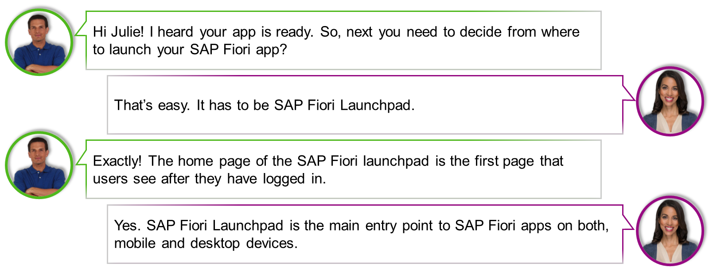
Marco and Julie both agree that SAP Fiori apps need to be launched from SAP Fiori Launchpad. Let's see why and how?
### General Concepts of the SAP Fiori launchpad
The SAP Fiori launchpad home page is the first page that users see after they have logged in. It is the main entry point to SAP Fiori apps on both, mobile or desktop devices.
The launchpad home page presents tiles that allow the launch of apps, and may show additional information. The page can be personalized. Tiles can be added or removed and bundled in groups.
The home page is provided by the SAP Fiori launchpad. Apps use this home page and do not design their own.
Apps can use the following services offered by the SAP Fiori launchpad:
  * Settings (apps only): Each app can provide app-specific settings to the launchpad.
  * User Preferences: This service provides details about the user currently logged in to the app. In addition, it offers theme selection.
  * Contact Support: You can offer a Contact Support option as a channel for user incidents. Note, that this option is only available if the customer configures the support setup.
  * Give Feedback: This service allows users to give feedback on the app. Note, that this option is only available if the customer configures the feedback setup.
  * About (apps only): This option is automatically available for all apps. It provides technical details about the app.

Apps can use the following services offered by the SAP Fiori launchpad:
  * Log In / SSO / Log Out: All aspects of logging in and out are handled by the launchpad. If single-sign-on (SSO) is used, no user password is required. If SSO is not used, the launchpad provides a login screen.
  * Save as Tile: This service allows users to save a snapshot of the app as a tile on the launchpad. The tile bookmarks the current state of the app.
  * Navigation: SAP Fiori Launchpad handles all navigation between apps.

SAP Fiori 3.0 is the next significant step in our evolution of user experience for business applications: an award-winning new design concept along with a delightful new visual theme and fully new SAP Fiori Launchpad user experience.
Key capabilities include:
  * New delightful visual theme: SAP Quartz
  * SAP Fiori 3 SAP Fiori launchpad does not use viewports anymore
  * Notifications – with connection to SAP Business Workflow and My Inbox
  * Merged header: only one header bar, giving more space for each app
  * New SAP Fiori elements: overview page, list report, object page, analytical list page

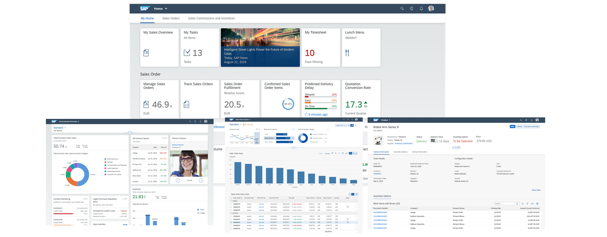
The figure shows possibilities of SAP Fiori 3.0.
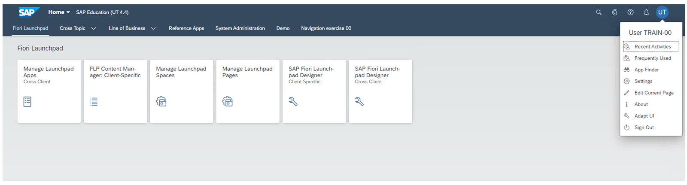
You can find details on how to configure the notification center at:
<https://blogs.sap.com/2017/02/13/leading-s4hana-ux-notification-center-part-1-activation/>
<https://blogs.sap.com/2017/02/14/leading-s4hana-ux-notification-center-part-2-providing-notifications/>
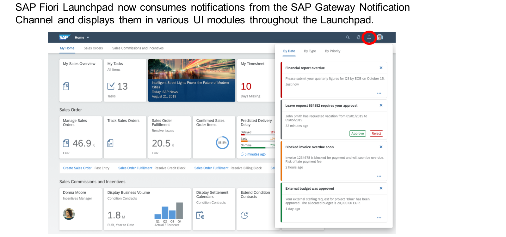
Business notifications can be opened by choosing the respective icon.
The launchpad groups related apps on tab bars to display one group at a time on the homepage.
The launchpad now offers contextual help.
Lets users get started quickly and stay up-to-date easily.
User assistance is part of the attractive, simple, and enjoyable user experience.
  * Instant: exactly when the user needs it
  * Context-sensitive: exactly what is needed
  * Seamless: within the target application
  * Productivity: interactive user guidance

A tile is a container that represents an app on the SAP Fiori launchpad home page. All apps have at least one tile, except for fact sheets, (though users can also save fact sheets as tiles if they want). Tiles are only used for launching apps and presenting them on the launchpad.
Tiles can contain an icon, a title, an informative text, numbers, and charts.
The number of visible tiles on the launchpad home page depends on the screen resolution.
Tiles can be grouped
There is a variety of types of tiles:
  * KPI Tile
  * Comparison Chart Tile
  * Mini-Charts like Bullet Chart, Trend Chart, Column Chart
  * Basic Launch Tile
  * Monitoring Tile
  * SAP Jam Tile
  * Feed Tile

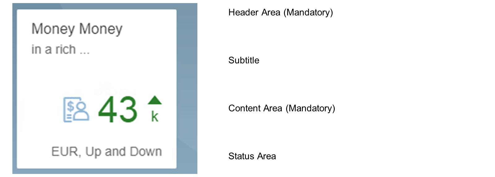
A tile consists of:
  * Header Area (Mandatory)
  * Subtitle
  * Content Area (Mandatory)
  * Status Area

An app finder is available to search for a specific app.
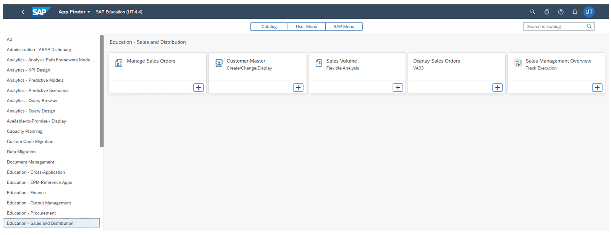


### Understanding the Technical Perspective of SAP Fiori Launchpad

*Source: https://learning.sap.com/courses/ui-development-with-sap-fiori/understanding-the-technical-perspective-of-sap-fiori-launchpad_ae357036-ef3e-43fb-9602-6c9f77b5384a*

Objective
After completing this lesson, you will be able to understand the technical perspective of SAP Fiori launchpad
## Technical Perspective of SAP Fiori Launchpad
### The SAP Fiori Launchpad - Technical Perspective
The user can access the tile catalog directly from the launchpad home page. They find all tiles they are allowed to use. The tiles are grouped into catalogs. A search field and a group selection help is available, to assist in finding the tile that is actually required.
The tile catalog has two functions:
  * Tiles that are used most often can be added to the _Home_ page.
  * Tiles, that are used more seldom, can be accessed directly from the catalog, without adding them to the _Home_ page.

The tile catalog is provided by the SAP Fiori launchpad.
Note
Apps use this tile catalog and do not design their own.
To fully understand how SAP Fiori Launchpad supports SAP Fiori apps, lets look at the architecture of SAP Fiori Launchpad.

  * ( a ) FioriLaunchpad.html: FioriLaunchpad.html is at the center of the SAP Fiori Launchpad architecture and act as the central point of entry to the SAP Fiori Apps.
  * ( b ) Runtime Configuration - The Launchpad gets the RuntimeConfiguration from the SAP-system, containing the configuration provided by the SAP-system.
  * ( c ) Shell Container - The so-called Shell Container is responsible for providing all relevant services like personalization or navigation to applications that are executed inside the SAP Fiori Launchpad.
  * ( d ) Application Container - SAP Fiori applications are executed inside the so-called application container.
  * ( e ) Shell Services - Each application can access the platform-independent shell service through the API of the shell container. Services that need platform-specific data handling or connection management use platform-specific adapters.

[Continue to quiz](https://learning.sap.com/courses/ui-development-with-sap-fiori/sap-fiori-launchpad_3fe7dda0-949c-3373-b129-b97465abbf45)


### Quiz

*Source: https://learning.sap.com/courses/ui-development-with-sap-fiori/sap-fiori-launchpad_3fe7dda0-949c-3373-b129-b97465abbf45*

It's time to put what you've learned to the test, get 3 right to pass this unit.
1.
### Which of the following components are part of the SAP Fiori launchpad?
There are three correct answers.
Shell services
UI2 services
Shell container
Runtime container
Runtime configuration
2.
### Which types of services are known or supported by the SAP Fiori launchpad?
There are two correct answers.
Platform-specific services
UI5 services
Platform-independent services
UI2 Services
3.
### What areas are mandatory in the tile layout?
There are two correct answers.
Subtitle
Header Area
Content Area
Status Area
KPI Area
4.
### Which factors are key to the user experience with user assistance?
There are three correct answers.
Instant
Context-sensitive
confusing
Seamless
Error prone
Submit answers[Next unit](https://learning.sap.com/courses/ui-development-with-sap-fiori/understanding-the-sap-fiori-launchpad-configuration)


### SAP Fiori Launchpad Configuration

*Source: https://learning.sap.com/courses/ui-development-with-sap-fiori/understanding-the-sap-fiori-launchpad-configuration*

Objective
After completing this lesson, you will be able to understand the SAP Fiori launchpad configuration
## SAP Fiori Launchpad Configuration
After looking at the technical aspects of the SAP Fiori Launchpad, we will now recap how the different objects the SAP Fiori Launchpad configuration are related.
Each User of the SAP Fiori Launchpad is assigned to various Business Roles, based on the assignment the user see Tiles or Links in the SAP Fiori Launchpad. The following figure gives you an overview of the different objects and how they are related.
The configuration of the SAP Fiori launchpad is shown in the figure, Configuration Steps.

The SAP Fiori 3 spaces concept gives your users stable, well-structured, and personalizable access to their important apps.
A space represents an area of work, typically corresponding to one or more business roles. You can structure each space using one or more pages for various work contexts, and optionally use sections to further group the work within a page.
SAP S/4HANA Cloud comes with space and page templates per business role, making it easy for customers to structure the layout of the SAP Fiori launchpad for their end users. This layout remains stable, even if a user is assigned to more roles later.
For on-premise customers, spaces and pages is supported by the SAP Fiori front-end server 2020 for S/4HANA, which supports S/4HANA releases 1809, 1909 and 2020. Example spaces are only provided for the S/4HANA 2020 on-premise release.
Users can easily personalize their pages, by adding or removing tiles, or adding or removing sections.
Rather than looking at this on a slide, let me show you what it looks like in the system. But before I do that, let me briefly explain how the spaces approach improves on the previous home page approach.
For more, see <https://blogs.sap.com/2020/11/06/sap-fiori-for-sap-s-4hana-best-practices-for-structuring-spaces-and-pages/>
It's important to understand how the objects on the SAP Fiori launchpad relate to eachother.

Configure the tile by creating a target mapping, a semantic object, and a resulting action.

A tile in the SAP Fiori launchpad doesn't point directly to an SAP Fiori app
A tile points to a target mapping in conjunction with a semantic object and an action.
With this so called **intent** the SAP Fiori Launchpad can resolve the navigation target. The navigation concept is called **intent-based navigation**.
When you create, update, or delete a catalog or a tile, all these actions have to be captured.
If you launch the SAP Fiori launchpad designer in a customization scope, these actions are captured under the customizing request.

To start a configuration in SAP Fiori Launchpad Designer you need to create a transport request and assign it to a system (SE01)
  * Customizing (CUST)
This layer can be used for testing or other purposes.
  * Workbench (CONF)
All content that you want to deliver to customers must be created in the CONF layer.

Running in customization scope:
<https://server:port/sap/bc/ui5_ui5/sap/arsrvc_upd_admin/main.html?scope=CUST>
You can use transaction /UI2/FLPD_CUST to start the SAP Launchpad Designer in customizing mode.
Running in configuration scope:
<https://server:port/sap/bc/ui5_ui5/sap/arsrvc_upd_admin/main.html?scope=CONF>
You can also use transaction /UI2/FLPD_CONF to start the SAP Launchpad Designer in configuration mode.

In the Launchpad Designer, you need to assign whatever changes you make to one of the requests you created in the Gateway system.
Choose the _Tool_ icon to open the assignment dialog.

### To Create a New SAP Fiori Catalog
  1. Choose the  at the bottom of the screen.
  2. Enter the name and ID of your catalog. (The ID must be in capital letters).
  3. Choose _Save_.


Run transaction PFCG and create a new role.
Add a new role of type _SAP Fiori Tile Catalog_.

To create dynamic tiles, it is important to understand the anatomy of a tile.

With this in mind, it is possible to build a service that provides structured information that can be shown on the tile dynamically.
When using dynamic tiles, you need to keep in mind that requests to get tile data create network traffic. The load created, in some cases, may be a heavy load on the system. This might lead to weak performance.
It is also possible to implement a complete dynamic tile.

Implement an OData service in the back-end system
Register the OData service on the front-end server.

For the second step, configure the dynamic tile. Make sure the result of the service invocation is in the JSON format.

## Semantic Objects
Semantic objects can be created using the transaction /ui2/semobj.

The figure shows the configuration of four semantic objects. Please be careful using the transaction **/ui2/semobj** , changes are not client specific. After the configuration of the semantic object the semantic object can be used during the target mapping configuration

As you can see in the figure, the configuration of the target mapping contains the semantic object as created before. The action **display** was chosen from the list of predefined actions. It is very important to understand that the value of the action has no direct influence on the behavior of the application. In the example here the configured application does not start in the display-mode. But the developer can fetch later during runtime the action value and influence the behavior of the application by code e.g. start the application in display mode.
As you also can see in the target mapping we only add the application id of the SAPUI5 application to the target mapping configuration.
After the target mapping configuration we have to create tile.

The figure shows a tile configuration. As you can see we are using the semantic object and action that was previously assigned to a specific application during the target mapping configuration. As you also see is that in the field Target URL the value **#UX410NavStart00-display** is shown. This hash value will be used to address the target application during navigation.
The following section will cover how to configure tiles and target mappings in the SAP Fiori Launchpad.
### Create Tiles and Target Mappings
Exercise[Start Exercise](https://learnsap.enable-now.cloud.sap/pub/mmcp/index.html?show=project!PR_312B960D7F11E1BF:uebung)


### Implementing the CrossApplicationNavigation Service

*Source: https://learning.sap.com/courses/ui-development-with-sap-fiori/implementing-the-crossapplicationnavigation-service_fb4e7db5-b59c-43a4-8a41-8a1f34a0bda1*

Objective
After completing this lesson, you will be able to implement the CrossApplicationNavigation service to navigate between SAP Fiori applications
## Cross Application Navigation
### Using the CrossApplicationNavigation-Service
After the recap of the target mapping and the tile configuration, we want to take a look on how to implement navigation using the class [sap.ushell.services.CrossApplicationNavigation](https://ui5.sap.com/#/api/sap.ushell.services.CrossApplicationNavigation).
The **CrossApplicationNavigation** service is used to navigate from one SAP Fiori application to another. We will next see how to implement navigation using the class [sap.ushell.services.CrossApplicationNavigation](https://ui5.sap.com/#/api/sap.ushell.services.CrossApplicationNavigation) and how to use CrossApplicationNavigation service in custom SAP Fiori Application implemented as SAPUI5-freestyle application.
Let's look at the code snippet that triggers navigation using the CrossApplicationNavigation service.
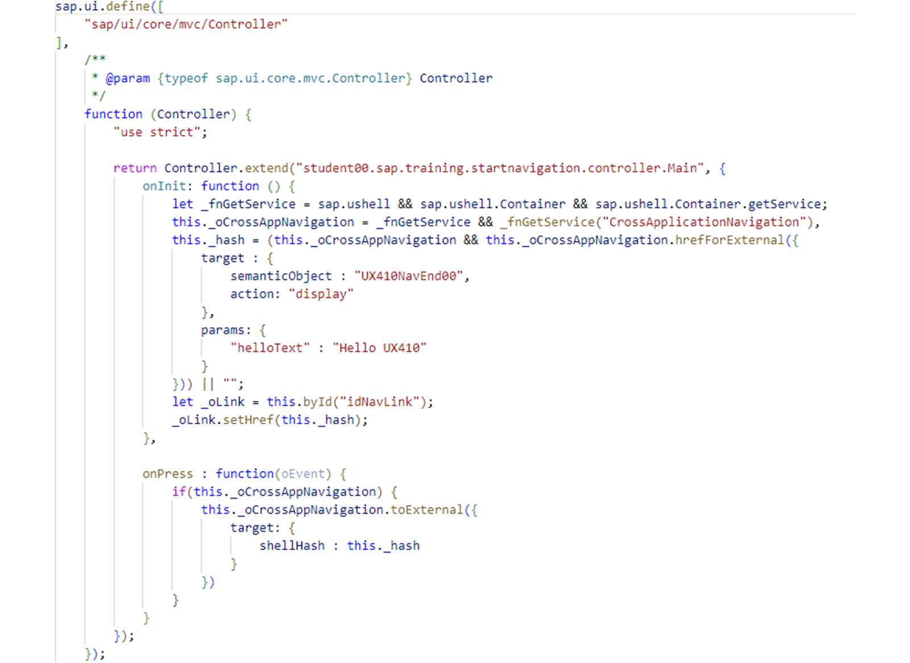
The code snippet shows how to use the sap.ushell.services.CrossApplicationNavigation. In the display onInit implementation, we will check in the first line of code whether the application is running in the SAP Fiori Launchpad or not.
Remember one of the golden SAPUI5 rules was Every SAP Fiori app must run as a web app. This says that it should also be possible to run the application outside of the SAP Fiori Launchpad, of course we limited features, but it runs.
If the reference to **sap.ushell.Container.getService** can be resolved, the reference to the **getService** function is stored in the variable **_fnGetService**. Next we can call the function and pass the value CrossApplicationNavigation as a parameter. In the third line of the implementation we call the function hrefForExternal and pass the name of the semantic object and the action to the function as parameter.
The parameter _hash will contain the calculated hash. In the shown example the value is **#UX410NavEnd00-display**. And this is the value that was created automatically during target mapping configuration.
The implementation of the **onPress** function in the code snippet will trigger the navigation directly.
As you can see in the implementation, it is also possible to pass simple key-value pairs as navigation parameter to the target. The target application is able to fetch these data and work with them.
Next, we will look at the code snippet that shows how to work with navigation parameters.
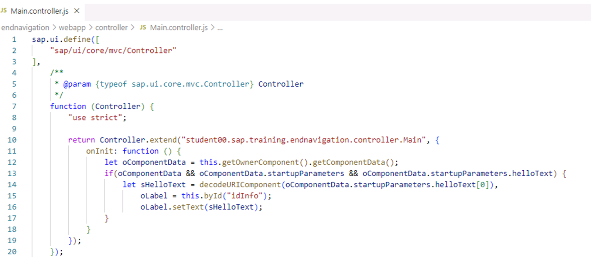
In the code snippet, you can see how to handle parameters that were passed during intent-based navigation. The navigation parameters sent by the navigation initiator will be stored in the parameter startupParameters of the target application. In our example the first application passed a parameter with the name helloText and the value Hello UX410. Please have in mind that the parameter helloText is handled as an array inside the target application.
### Navigating in SAP Fiori Using the CrossApplicationNavigation Service
Time to look at an end-to-end example to explain implementation of CrossApplicationNavigation service.
Let's say that the user has two applications in the SAP Fiori Launchpad. These applications are named startnavigation and endnavigation. To complete a business process, the user has to navigate, after the user has completed the first task of the process, to another application, pass arguments to that second application, and proceed in the second application.
We will next look at a series of videos explaining the usage of CrossApplicationNavigation service to navigate from the startnavigation application to the endnavigation application.
Watch the first video to see how to implement the link and button controls to navigate from the startnavigation application to the endnavigation application.
The following code shows how to implement the onInit function to check if the application is running the SAP Fiori Launchpad.
Code Snippet
Copy codeSwitch to dark mode

```

1234567891011121314151617181920212223242526272829303132

sap.ui.define([
        "sap/ui/core/mvc/Controller"
    ],
        /**
        * @param {typeof sap.ui.core.mvc.Controller} Controller
        */
        function (Controller) {
            "use strict";

            return Controller.extend(
               "student##.sap.training.startnavigation.controller.Main", {

          onInit: function () {
  this._fnGetService = sap.ushell &&
       sap.ushell.Container &&
       sap.ushell.Container.getService;
  this._oCrossAppNavigation = this._fnGetService &&
       this._fnGetService("CrossApplicationNavigation");

  this._hash = (this._oCrossAppNavigation&&
       this._oCrossAppNavigation.hrefForExternal({

    target : {
      semanticObject : "UX410NavEnd00",
      action: "display"
    }

  })) || "";

  let _oLink = this.byId("idNavLink");
  _oLink.setHref(this._hash);
}

```

The following code shows how to implement the onPress event handler in the controller Main.controller.js of the Main view of project startnavigation.
Code Snippet
Copy codeSwitch to dark mode

```

123456789

onPress : function(oEvent) {
    if(this._oCrossAppNavigation) {
     var oHref = this._oCrossAppNavigation.toExternal({
      target : {
       shellHash : this._hash
      }
    })
  }
}

```

Watch the next video to see how to extend your implementation of the startnavigation application and pass a parameter to the navigation target.
Settings
The following code shows how to pass parameters to the navigation target.
Code Snippet
Copy codeSwitch to dark mode

```

12345678910111213141516171819

onInit: function () {
  this._fnGetService = sap.ushell &&
       sap.ushell.Container &&
       sap.ushell.Container.getService;
  this._oCrossAppNavigation = this._fnGetService &&
       this._fnGetService("CrossApplicationNavigation");

  this._hash = (this._oCrossAppNavigation&&
                this._oCrossAppNavigation.hrefForExternal({
    target : {
      semanticObject : "UX410NavEnd00",
      action: "display"
    }

  })) || "";

  let _oLink = this.byId("idNavLink");
  _oLink.setHref(this._hash);
}

```

Watch the last video in the series to see how to extend your implementation of the endnavigation application to fetch a parameter passed from another application.
The following code shows how to extend the endnavigation Application to fetch a parameter passed from another application.
Code Snippet
Copy codeSwitch to dark mode

```

1234567891011121314151617181920

sap.ui.define([
  "sap/ui/core/mvc/Controller"
],

  function (Controller) {
    "use strict";

    return Controller.extend(
        "student##.sap.training.endnavigation.controller.Main", {
      onInit: function () {
        var oComponentData = this.getOwnerComponent().getComponentData();
        if(oComponentData && oComponentData.startupParameters &&
           oComponentData.startupParameters.helloText) {
        var sHelloText = oComponentData.startupParameters.helloText[0];
        var oLabel = this.byId("idInfo");
        oLabel.setText(sHelloText);
      }
    }
  });
});

```

## How to Navigate in SAP Fiori
For the steps and data of this demonstration, refer to the exercise **Navigate in SAP Fiori**.
## Navigate in SAP Fiori
Note
SAP Business Technology Platform and its tools are cloud services. Due to the nature of cloud software, naming of fields and buttons as well as steps may differ from the exercise solution.
Caution
Please be aware that in some code blocks, the code of previous implementation steps is not shown. In the following steps, please do not delete any code that you have added in previous steps.
Note
In the following exercises please replace ## with your user group.
Hint
Don't bother with the errors about missing id shown by the code editor. IDs are mandatory if you want your application to be enabled for UI Adaptation. If this is not the case, you can simply set the FlexEnabled property to False in the manifest.json file.
### Business Example
In the SAP Fiori Launchpad the user has two applications. To complete a business process the user has to navigate, after the user has completed the first task of the process to another application, pass arguments to that second application and proceed in the second application.
### Task 1: Create a SAPUI5 Project for the first application
#### Steps
  1. Create a new project with a deployment configuration using the SAP Fiori application – project generator.
#### Project properties
| Parameter  | Value  |
| --- | --- |
| Project type  | SAP Fiori application  |
| Template Type  | SAP Fiori  |
| Template  | Basic  |
| Data source  | None  |
| View  | Main  |
| Module name  | startnavigation  |
| Application namespace  | student##.sap.training  |
#### Deployment configuration
| Parameter  | Value  |
| --- | --- |
| Target  | **ABAP**  |
| Destination  | **S4D_100**  |
| Name  | **ZUX410NavStar##**  |
| Description  | **UX410 navigation starter ##**  |
| Package  | **ZTRAIN_##**  |
| Transport Request  | Transport assigned to your user, see transaction SE01  |
    1. Start the SAP Business Application Studio.
    2. To create a new project at the _Welcome_ page, choose the tile _Start from template_.
    3. Choose _SAP Fiori application_ from the list of available templates and choose _Start_.
    4. Choose **SAP Fiori** as _Template Type_
    5. Select the _Basic_ template and choose _Next_.
    6. Select **None** from the _Data source_ list and choose _Next_.
    7. Insert **Main** as _view name_ and choose _Next_.
    8. Insert **startnavigation** as _module name_ and **student##.sap.training** as _namespace_.
    9. Select _Yes_ at the Add deployment configuration and choose _Next_.
    10. Select **ABAP** as target and choose the destination **S4D_100** from the list of available destinations
    11. Insert **ZUX410NavStar##** as name for the _ABAP Repository_.
    12. Insert the description **UX410 navigation starter ##** into the description field.
    13. insert **ZTRAIN_##** as _package_ and insert the transport request assigned to your user. You can use transaction SE01 at the S4D-system to find the transport assigned to your user.
    14. Choose _Finish_.
  2. Remove the generated routing pattern _:?query:_ to replace it with an empty string.
    1. Open the file manifest.json.
    2. Scroll down to the routes configuration.
    3. Remove the string literal :?query: to replace it with an empty string.
  3. Implement the basic _startnavigation_ project by adding a new sap.ui.layout.VerticalLayout control to the page control of the Main.view.xml and add a sap.m.Link and a sap.m.Button control to UI controls to the VerticalLayout control. Add the following attributes to the newly added controls.
#### Properties of sap.m.Link control
| Attribute  | Value  |
| --- | --- |
| id  | **idNavLink**  |
| text  | **Navigate to Fiori-app with link**  |
#### Properties of sap.m.Button control
| Attribute  | Value  |
| --- | --- |
| press  | **onPress**  |
| text  | **Navigate to Fiori-app using event handler**  |
    1. Open the file Main.view.xml.
    2. Add an XML-namespace alias with the value **layout** and assign the value **sap.ui.layout**.
    3. Add an sap.ui.layout.VerticalLayout to the content aggregation of the generated sap.m.Page control.
    4. Add a control of type sap.m.Link to the VerticalLayout control and assign the attributes listed in the first table.
    5. Add a control of type sap.m.Button and assign the button attributes listed in the second table.
    6. Your view implementation should now look like the following figure:
Code Snippet
Copy codeSwitch to dark mode

```

123456789101112131415161718

<
mvc:View controllerName="student##.sap.training.startnavigation.controller.Main"
xmlns:mvc="sap.ui.core.mvc" displayBlock="true"
xmlns="sap.m"
xmlns:layout="sap.ui.layout">
    <Page id="page" title="{i18n>title}">
        <content>
            <layout:VerticalLayout id="_IDGenVerticalLayout1">
                <Link id="idNavLink"
                      text="Navigate to Fiori-app with link"/>
                <Button id="_IDGenButton1"
                        press="onPress"
                        text="Navigate to Fiori-app using event handler"/>
            </layout:VerticalLayout>
        </content>
    </Page>
</mvc:View>

```

  4. Build and deploy the _startnavigation_ project to the connected SAP system _S4D_100_ using the npm run deploy command.
    1. Select the project and from the context menu choose _Open in Terminal_.
    2. Insert in the console the command **npm run deploy**.
    3. Confirm to start the deployment.
  5. Close all tabs in Business Application Studio.

### Task 2: Create a SAPUI5 project for the second application
#### Steps
  1. Create a new project with a deployment configuration using the SAP Fiori application – project generator.
#### Project properties
| Property  | Value  |
| --- | --- |
| Template Type  | SAP Fiori Generator  |
| Template  | Basic  |
| Data source  | None  |
| View  | **Main**  |
| Module name  | **endnavigation**  |
| Application namespace  | **student##.sap.training**  |
#### Deployment configuration
| Property  | Value  |
| --- | --- |
| Target  | ABAP  |
| Destination  | S4D_100  |
| Name  | **ZUX410NavEnd##**  |
| Package  | **ZTRAIN_##**  |
| Transport Request  | Transport assigned to your user, see transaction SE01  |
| Description  | **UX410 navigation end ##**  |
#### .env content
| Property  | Value  |
| --- | --- |
| UI5_USERNAME  | **TRAIN-##**  |
| UI5_PASSWORD  | Password of SAP user TRAIN-##  |
    1. If not still open, start the SAP Business Application Studio.
    2. Choose the link _New Project from template_ in the Get Started Page of the SAP Business Application Studio or go to the menu entry _File_ → _New Project from Template_ .
    3. Choose **SAP Fiori Generator** as _Template Type_.
    4. Select the _Basic_ template and choose _Next_.
    5. Select **None** from the _Data source_ list and choose _Next_.
    6. Insert **Main** as _view name_ and choose _Next_.
    7. Insert **endnavigation** as _module name_ and **student##.sap.training** as _namespace_.
    8. Select _Yes_ at the Add deployment configuration and choose _Next_.
    9. Select **ABAP** as target and choose the destination **S4D_100** from the list of available destinations.
    10. Insert **ZUX410NavEnd##** as name .
    11. Insert the description **UX410 navigation end ##** into the description field.
    12. Insert **ZTRAIN_##** as package and insert the transport request assigned to your user. You can use transaction SE01 at the S4D-system to find the transport assigned to your user.
    13. Choose _Finish_.
  2. Remove the generated routing pattern _:?query:_ to replace it with an empty string.
    1. Open the file manifest.json.
    2. Scroll down to the routes configuration.
    3. Remove the string literal :?query: to replace it with an empty string.
  3. Implement the basic **endnavigation** project by adding a new sap.ui.layout.VerticalLayoutcontrol to the page control of Main.view.xml and insert the following UI controls to the VerticalLayout.
#### sap.m.Label Control Properties
| Attribute  | Value  |
| --- | --- |
| id  | **idinfo**  |
| text  | **Hello world**  |
    1. Open the file Main.view.xml.
    2. Add an XML-namespace alias with the value **layout** and assign the value **sap.ui.layout**.
    3. Add a control of type sap.ui.layout.VerticalLayout to the content aggregation of the generated sap.m.Page control.
    4. Add a control sap.m.Label to the VerticalLayout control and assign the attributes listed in the table. Your implementation should now look like the following figure:
Code Snippet
Copy codeSwitch to dark mode

```

123456789101112

<mvc:View controllerName="student##.sap.training.endnavigation.controller.Main"
    xmlns:mvc="sap.ui.core.mvc" displayBlock="true"
    xmlns="sap.m"
    xmlns:layout="sap.ui.layout">
    <Page id="page" title="{i18n>title}">
        <content>
            <layout:VerticalLayout>
              <Label id="idInfo" text="Hello world"/>
            </layout:VerticalLayout>
        </content>
    </Page>
</mvc:View>

```

  4. Build and deploy the _endnavigation_ project to the connected SAP system _S4D_100_ using the npm run deploy command.
    1. Select the project and from the Context menu, choose _Open in Terminal_.
    2. Insert in the console the command **npm run deploy**.
    3. Confirm to start the deployment.
    4. IIf you are asked to insert your credentials insert user **TRAIN-##** and your password

### Task 3: Configure Two Tiles in the SAP Fiori Launchpad
#### Steps
  1. Create two semantic objects in the _S4D_ system using the following details.
#### Semantic Object Configuration
| Semantic Object  | Semantic Object Name  | Semantic Object Description  |
| --- | --- | --- |
| UX410NavStart##  | UX410NavStart##  | Semantic Object for start app##  |
| UX410NavEnd##  | UX410NavEnd##  | Semantic Object for end app##  |
    1. Start _SAP GUI_ and log in to _S4D_ system using your user **TRAIN-##** login details.
    2. From the user menu of the _SAP Fiori_ → _Configuration_ , choose _Define Semantic Object – Customer_ or use the transaction code /UI2/SEMOBJ.
Add the prefix **/n** if you start the transaction using the transaction code.
    3. Select _Edit_ to switch to edit mode.
    4. Confirm the cross-client message.
If a message informs you that the table is currently locked by another user, this means that another course participant is currently running the transaction for their exercise. Confirm the message, wait until the other participant has finished, and then try again.
    5. Choose _New Entries_ on the toolbar.
    6. Add the semantic object configuration with the data from the Table: Semantic Object, Name and Description.
    7. Save your changes and assign them to your transport request.
    8. Confirm the transport assignment dialog and close the transaction.
It is important to close the transaction as soon as you have finished your configuration. If you do not leave, you will lock the table.
  2. Create a Catalog in the _S4D_ system with the _Launchpad Content Manager_ app using the attributes from the following table:
#### Catalog Configuration
| Property  | Value  |
| --- | --- |
| Title  | **UX410_BC_##**  |
| ID  | **ZUX410_BC_##**  |
    1. Open Chrome navigator.
    2. In the favorites bar, choose _10 Development_ → _s4dhost_ → _10 S4D SAP Fiori Launchpad_
    3. Enter your credentials and login. You can save your password for future logins.
    4. If the _Quick Tour_ Popup opens, close it.
    5. Navigate to _SAP Fiori Launchpad_ space and start the Launchpad _Content Manager_ app.
Note
It may take some time to open.
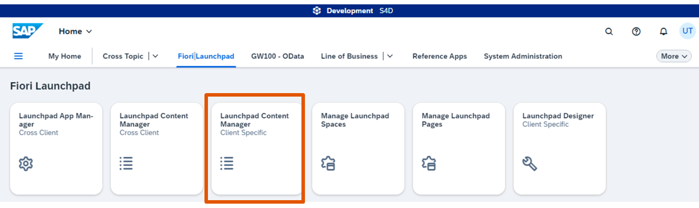
    6. Choose _Create_ after the app starts.
    7. Insert the values from the Catalog configuration table and choose _Continue_.
    8. Choose an assigned transport request and confirm the dialog.
  3. Create a tile mapping for application _ZUX410NavStar##_ using _SAP Fiori Launchpad Designer_ and the configuration properties shown in the following table.
#### Target mapping configuration for Start-navigation App
| Property  | Value  |
| --- | --- |
| Semantic Object  | **UX410NavStart##**  |
| Action  | **display**  |
| Application Type  | SAPUI5 Fiori App  |
| Title  | **UX410 start navigation**  |
| URL  | **/sap/bc/ui5_ui5/sap/zux410navstar##**  |
| ID  | **student##.sap.training.startnavigation**  |
Hint
If you get an error when creating the target mapping, refreshing your browser tab should get rid of the issue.
    1. Refresh the _Launchpad Content Manager_ app if it's still opened, or open it again.
    2. Search for your newly created catalog in the _Launchpad Content Manager_ app.
    3. Choose _Open in Designer_.
    4. Select the _Target Mapping_ icon inside the new catalog.
    5. Select _Create Target Mapping_.
    6. Insert the properties from the table into the form.
    7. Choose _Save_.
  4. Create a new tile mapping for application _ZUX410NavEnd##_ using the configuration properties shown in the following table:
#### Target mapping configuration for End-navigation App
| Property  | Value  |
| --- | --- |
| Semantic Object  | **UX410NavEnd##**  |
| Action  | **display**  |
| Application Type  | SAPUI5 Fiori App  |
| Title  | **UX410 end navigation**  |
| URL  | **/sap/bc/ui5_ui5/sap/zux410navend##**  |
| ID  | **student##.sap.training.endnavigation**  |
    1. Select _Create Target Mapping_.
    2. Insert the properties from the table into the form.
    3. Choose _Save_.
  5. Create two static tiles in your catalog with the following attributes:
#### Title Configuration for Start
| Attribute  | Value  |
| --- | --- |
| Title  | **Navigation start**  |
| Subtitle  | **Group ##**  |
| Semantic Object:  | **UX410NavStart##**  |
| Action  | **display**  |
#### Title Navigation for End
| Attribute  | Value  |
| --- | --- |
| Title  | **Navigation end**  |
| Subtitle  | **Group ##**  |
| Semantic Object:  | **UX410NavEnd##**  |
| Action  | **display**  |
    1. Choose the first _Tiles_ icon and select the tile with the _plus_ sign.
    2. Choose _App Launcher – Static_.
    3. Enter the values as provided in the table.
    4. Save your changes.
    5. Repeat to create a tile for the second target.
    6. Close the SAP _Fiori Launchpad Designer_ tab and Exit the _Content Manager_ app.
  6. Create a new Launchpad Space including a new Launchpad Page with the following properties
#### Properties of Space/Page configuration
| Property  | Value  |
| --- | --- |
| Space ID  | **ZSPACE_##**  |
| Space Description  | **Space of group ##**  |
| Space Title  | **Navigation exercise ##**  |
| Page ID  | **ZPAGE_##**  |
| Page Description  | **Page of group ##**  |
| Page Title  | **Navigation exercise ##**  |
| Transport  | Use the transport assigned to your user  |
    1. Start the _Manage Launchpad Spaces_ App from the _SAP Fiori Launchpad_.
    2. Click the _Create_ Button in the toolbar of the _Spaces_ table
    3. Select the _Also create a page_ option
    4. Insert the values of the above table
    5. Click _Create_.
  7. Assign the SAP Fiori catalog _UX410_BC_##_ to the page _ZPAGE_##_ and use **Navigation exercise ##** as Section Title and add the tiles from the catalog to the page.
    1. Click on the newly created page and select _Edit_.
    2. Insert the value **Navigation exercise ##** in the _Section Title_ input field.
    3. Select the three dots on the right side of the page toolbar and click on the button labeled _Catalogs_.
    4. Search in the upcoming dialog for catalog **UX410_BC_##**.
    5. Select the catalog and press _Select_.
    6. Press on each tile the button labeled _Add_ to add the tile to the page
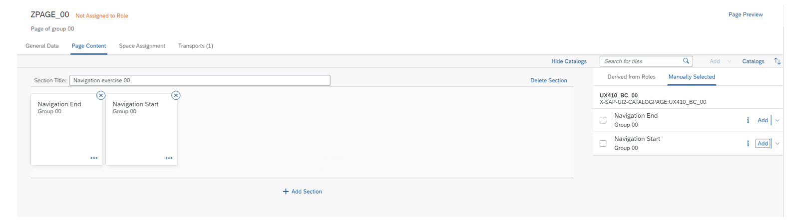
    7. Press _Save_.
  8. Set the page visibility to Visible
    1. Go back to the Space configuration of your newly created space _ZSPACE_##_.
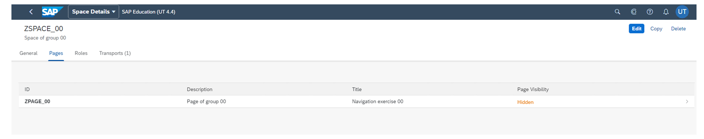
    2. Press the _Edit_ button to enter the edit mode
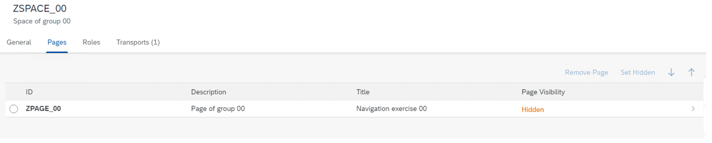
    3. Mark the page as selected by choosing the radio button
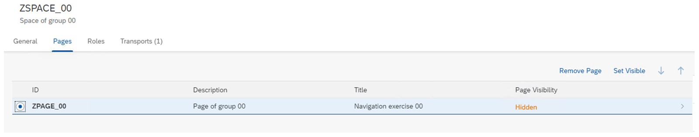
    4. Press the _Set Visible_ button.
    5. Press _Save_.
    6. Go back to the SAP Fiori Launchpad _Home_ page.
  9. Create a new single role with the name **Z_BR_UX410_##** and add the space _ZSPACE_##_ to the role. Assign your user **TRAIN-##** to the role _Z_BR_UX410_##_.
    1. Open the SAP GUI and logon to the S4D-system
    2. Start transaction PFCG.
    3. Insert the value **Z_BR_UX410_##** in the input field and press _Single Role_.
    4. Click _Menu_ and confirm that you want to save your changes.
    5. Choose from the _Transaction_ DropDown Field _SAP Fiori Launchpad_ → _Launchpad Catalog_.
    6. Search for your catalog **ZUX410_BC_##** , select the catalog and confirm the dialog.
    7. Choose from the _Launchpad Catalog_ DropDown Field _SAP Fiori Launchpad_ → _Launchpad Space_.
    8. Insert in the upcoming dialog the space id **ZSPACE_##** or use the F4-value help to search for it and press _Continue_.
    9. Select the _User_ tab and assign your **TRAIN-##** user to the role
    10. Press _Save_.
  10. Test your configuration.
    1. Open _SAP Fiori Launchpad_ or Refresh the browser page if it's already opened.
    2. Select the _Navigation exercise ##_ space.
    3. Click on the tiles and verify that the applications are shown
  11. Close the SAP Fiori Launchpad.

### Task 4: Use the CrossApplicationNavigation Service
Implement the link and button controls to navigate from the _Navigation start_ application to the _Navigation end_ application.
#### Steps
  1. Implement the onInit function so it checks that the application is running the SAP Fiori Launchpad. Obtain a reference to the CrossApplicationNavigation service ShellContainer and store the reference in a member variable. Create the navigation link to the intent UX410NavEnd## - display created in the previous task and assign the navigation link to the href attribute of the sap.m.Link control that was created in the previous task.
    1. Start the SAP Business Application Studio and Open the Dev Space _UX410_.
    2. Open the Main.controller.js file of the _startnavigation_ project.
    3. If not already created, create an empty implementation of the onInit function.
    4. Implement theonInit function to check whether the application is running the SAP Fiori Launchpad. Obtain a reference to the CrossApplicationNavigation Service and assign the reference to a member variable.
Code Snippet
Copy codeSwitch to dark mode

```

1234567891011121314151617

sap.ui.define([
    "sap/ui/core/mvc/Controller"
],
    function (Controller) {
        "use strict";

        return Controller.extend(
           "student##.sap.training.startnavigation.controller.Main", {

          onInit: function () {
            this._fnGetService = sap.ushell &&
                  sap.ushell.Container &&
                  sap.ushell.Container.getService;
            this._oCrossAppNavigation = this._fnGetService &&
                  this._fnGetService("CrossApplicationNavigation");
         });
    });

```

    5. Invoke the function hrefForExternal and pass the value UX410NavEnd## as semanticObject and the value display as action.
    6. Obtain a reference to the sap.m.Link control implemented in the Main.view.xml view and assign the return value to a local variable.
    7. Call the setHref function on the sap.m.Link reference and pass the hash to the function.
    8. Your code should now look like the following :
Code Snippet
Copy codeSwitch to dark mode

```

1234567891011121314151617181920

onInit: function () {
  this._fnGetService = sap.ushell &&
       sap.ushell.Container &&
       sap.ushell.Container.getService;
  this._oCrossAppNavigation = this._fnGetService &&
       this._fnGetService("CrossApplicationNavigation");

  this._hash = (this._oCrossAppNavigation&&
                this._oCrossAppNavigation.hrefForExternal({
    target : {
      semanticObject : "UX410NavEnd00",
      action: "display"
    }

  })) || "";

  let _oLink = this.byId("idNavLink");
  _oLink.setHref(this._hash);
}

```

  2. Implement the onPress event handler in the controller Main.controller.js of the _Main_ view of project _startnavigation_. Use the reference to the CrossApplicationNavigation service that was obtained in the onInit function. Call the toExternal function on the reference and pass the value UX410NavEnd##as semantic object and the value display as action to the function.
    1. If not already open, open the Main.controller.js file in the _controller_ folder of the _startnavigation_ project.
    2. Add an empty implementation for the eventhandler function _onPress_ right after the onInit implementation.
    3. Check that the reference to the CrossApplicationNavigationservice is available. If the reference is available call the toExternal function on the reference and pass the target configuration with attribute shellHash to the function. Assign to shellHash the hash-string stored in the member variable that was obtained in the onInit function.
    4. Save your changes. Your implementation should now look like the following:
Code Snippet
Copy codeSwitch to dark mode

```

12345678910

onPress : function(oEvent) {
  if(this._oCrossAppNavigation) {
    var oHref = this._oCrossAppNavigation.toExternal({
      target : {
        shellHash : this._hash
      }
    })
  }
}

```

  3. Deploy the _startnavigation_ project to the S4D-system.
    1. Select the _startnavigation_ application and choose from the context menu _Open in Terminal_.
    2. Enter **npm run deploy** and follow the instructions.
  4. Log on to the _SAP Fiori launchpad_ to test your implementation. Start your application and try the link and button to test the navigation.
    1. Select the bookmark in Google Chrome to start the _SAP Fiori launchpad_.
    2. Enter your log on credentials.
    3. Start the _startnavigation_ application.
    4. Choose the link to initiate the navigation.
    5. Navigate back to the _startnavigation_ application using the back button of the _SAP Fiori launchpad_.
    6. Select the button control to navigate.

### Task 5: Passing Parameters to the Navigation Target
#### Steps
  1. Extend your implementation of the _startnavigation_ application and pass a parameter with the name **helloText** during the navigation. Assign the string **Hello UX410** to the helloText parameter.
    1. If not still open, start the SAP Business Application Studio and open the Dev Space _UX410_.
    2. Open the Main.controller.js file of the project _startnavigation_.
    3. Enhance the onInit function of your controller by passing the configuration objectparams to the hrefForExternal function and assign the parameter helloText with value **Hello UX410** to the parameter.
Code Snippet
Copy codeSwitch to dark mode

```

1234567891011121314151617181920212223

onInit: function () {
  this._fnGetService = sap.ushell &&
        sap.ushell.Container &&
        sap.ushell.Container.getService;
  this._oCrossAppNavigation = this._fnGetService &&
        this._fnGetService("CrossApplicationNavigation");

  this._hash = (this._oCrossAppNavigation&&
                this._oCrossAppNavigation.hrefForExternal({
    target : {
      semanticObject : "UX410NavEnd00",
      action: "display"
    },
    params : {
      "helloText" : "Hello UX410"
    }

  })) || "";

  let _oLink = this.byId("idNavLink");
  _oLink.setHref(this._hash);
}

```

  2. Deploy the updated _startnavigation_ project.
    1. Select the _startnavigation_ project and choose from the context menu the _Open in Terminal_ option.
    2. Enter **npm run deploy** and follow the instructions.

### Task 6: Extend the endnavigation Application to Fetch a Parameter Passed from Another Application
Extend your _endnavigation_ application so that when the user navigates from the _startnavigation_ application to the _endnavigation_ application, the passed parameter is fetched from the component and shown inside the UI.
#### Steps
  1. Implement the onInit function of the Main.controller.js file of the _endnavigation_ project. Read the helloText parameter that is passed by the _startnavigation_ application and assign the parameter value to the text attribute of the label that is part of the Main.view.xml implementation.
    1. Open the file Main.controller.js of the _endnavigation_ project.
    2. Implement an empty onInit function inside the controller implementation.
    3. Obtain the component data and assign the component data to a local variable with the name oComponentData.
Code Snippet
Copy codeSwitch to dark mode

```

123456789101112131415161718

sap.ui.define([
  "sap/ui/core/mvc/Controller"
],

  function (Controller) {
    "use strict";

    return Controller.extend(
        "student##.sap.training.endnavigation.controller.Main", {
      onInit: function () {
        var oComponentData =
            this.getOwnerComponent().getComponentData();

      }
    }
  });
});

```

    4. Check if the startupParameters of the component contains the parameter helloText. If the parameter is available obtain the value of the parameter and assign it to local variable.
Code Snippet
Copy codeSwitch to dark mode

```

12345678

onInit: function () {
  var oComponentData = this.getOwnerComponent().getComponentData();
  if(oComponentData && oComponentData.startupParameters &&
       oComponentData.startupParameters.helloText) {
    var sHelloText = oComponentData.startupParameters.helloText[0];
  }
}

```

    5. Obtain a reference to a UI control of type sap.m.Label with ID idInfo and assign the reference to a local variable. Call the setText function on the object and pass the start-up parameter value to the text attribute of the UI control.
Code Snippet
Copy codeSwitch to dark mode

```

12345678910

onInit: function () {
  var oComponentData = this.getOwnerComponent().getComponentData();
  if(oComponentData && oComponentData.startupParameters &&
     oComponentData.startupParameters.helloText) {
    var sHelloText = oComponentData.startupParameters.helloText[0];
    var oLabel = this.byId("idInfo");
    oLabel.setText(sHelloText);
  }
}

```

  2. Deploy the updated _endnavigation_ project.
    1. Select the _endnavigation_ and choose from the context menu the _Open in Terminal_ option.
    2. Enter **npm run deploy** and follow the instructions.
  3. Logon to the SAP Fiori Launchpad to test your implementation. Open the _startnavigation_ app and test the navigation implementation.
    1. Start the _SAP Fiori launchpad_ using the bookmark in Google Chrome.
    2. Enter your details to log in.
    3. Start the _startapplication_ application.
    4. Choose the link to initiate the navigation.
    5. Navigate back to the _startapplication_ application using the back button of the SAP Fiori Launchpad.
    6. Select the button control to navigate.

[Continue to quiz](https://learning.sap.com/courses/ui-development-with-sap-fiori/sap-fiori-launchpad-configuration_db1c61d4-e7ff-3d95-82a0-c8016ab0ca97)


### Quiz

*Source: https://learning.sap.com/courses/ui-development-with-sap-fiori/sap-fiori-launchpad-configuration_db1c61d4-e7ff-3d95-82a0-c8016ab0ca97*

It's time to put what you've learned to the test, get 3 right to pass this unit.
1.
### Which of the following make up the configuration of a tile for launching an SAP Fiori app of type SAPUI5 in the SAP Fiori launchpad designer?
There are three correct answers.
Semantic object
Launchpad creation via LPD_CUST
Target Mapping
Tile configuration
Tile implementation
2.
### What application in the SAP Fiori launchpad helps the user to find applications that are available to the user?
Choose the correct answer.
Tile Finder
Application Finder
Fiori Designer
Fiori Appsearch
3.
### What transaction is used to create an semantic object for customer configuration?
Choose the correct answer.
/UI5/LPD_CUST
/UI2/SEMOBJ
/UI5/SEMOBJ
pfcg
su01
4.
### What information is passed to the Cross Application Navigation service to define the target application ?
There are two correct answers.
Semantic Object
Action
Application URL
Application ID
Submit answers[Next unit](https://learning.sap.com/courses/ui-development-with-sap-fiori/working-with-sap-fiori-design-guidelines_ab11c169-54de-4f51-87b9-f61c8a5198be)


### Applying SAP Fiori Design Guidelines

*Source: https://learning.sap.com/courses/ui-development-with-sap-fiori/working-with-sap-fiori-design-guidelines_ab11c169-54de-4f51-87b9-f61c8a5198be*

Objective
After completing this lesson, you will be able to apply SAP Fiori design guidelines to provide consistent user experience
## SAP Fiori Layouts
### Introduction to SAP Fiori Layouts
Do you recall the golden rule of SAPUI5 development that says "SAP Fiori apps must have an approved UX design."?
After understanding the user and business needs, it comes to the design of the application. The first decision that designers and developers have to make is what overall layout should be used.
This depends a lot on the way the information needs to be presented in the app and how the user will access this information.
Julie meets Carmen to gather more details about the app.
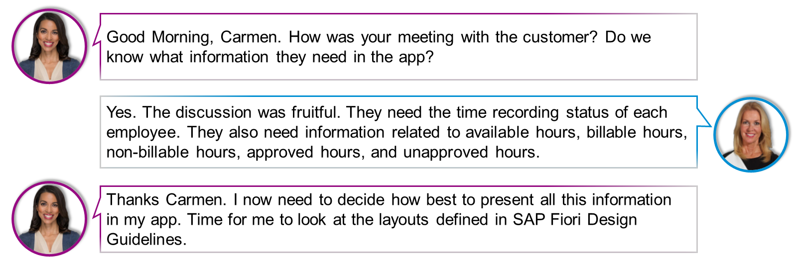
The SAP Fiori Design Guidelines knows two main layouts and three layout variants.
Main layouts are:
  * Dynamic Page
  * Flexible Column Layouts

Layout variants are:
  * Comparison Pattern
  * Multi Instance
  * Semantic Page

In this lesson we will focus on the two main layouts.
Settings
### When to use dynamic page layout
Use the dynamic page layout if you are building a freestyle application that uses the dynamic page header and footer toolbar features of SAP Fiori (versions 1.40 and higher)
Do not use the dynamic page layout if you are planning any of the following scenarios:
  * Use SAP Fiori elements, such as the list report, analytical list page, overview page, or object page. These elements already incorporate the dynamic page layout.
  * Implement an initial page or object page floorplan. These floorplans already incorporate snapping header and footer toolbar features. The behavior is similar to the dynamic page, but the technical foundation is different.
  * Display a small amount of information. In this case, use a dialog instead. If you cannot avoid using the dynamic page layout, use letterboxing to mitigate the issue.

### When to use flexible page layout
Use the flexible-column layout if you want to create a master-detail or master-detail-detail scenario in which the user can drill down or navigate.
Do not use the flexible-column layout if you are planning any of the following scenarios:
  * You want to build a workbench or tools layout. The flexible-column layout is not meant to provide a main column with additional side columns on the left and right or either. If you want to display additional content to enrich the main content and to help users better perform their tasks, use the dynamic side content instead.
  * You want to create a dashboard with context-independent pages.
  * You want to open multiple instances of the same object type. Use the multi-instance-handling floorplan instead.
  * You want to split a single object into multiple columns, or display only a small amount of information.
  * You want to embed the SAP Fiori launchpad or overview page into one of the columns.

### Things to Remember
The following table should help to decide what layout should be used and what type of question you asked yourself for making a decision.
| Question  | Template  |
| --- | --- |
| Is viewing, inspecting, or editing details on one or several elements from a list of elements an important user requirement?  | If so, use the flexible column layout pattern, for example a tracking app.  |
| Is inspecting the status of one or more objects important?  | If so, use the flexible column layout pattern, for example a tracking app.  |
| Are the objects you are inspecting so complex that you require charts to illustrate a point quickly?  | If so, you should use a dynamic page app with charts.  |
### Connect with Marco Rossi
Now that you've learned about the SAP Fiori layouts, put on your thinking cap and help Marco make the right decision in this use case activity.
## SAP Fiori Floorplans
### Introduction to SAP Fiori Floorplans
Floorplans are usually based on the dynamic page. Floorplans serve specific use cases and therefore come with a specific combination of UI elements in the header, content area, and footer toolbar.
Choosing the right floorplan is not always easy. Roughly speaking, SAP Fiori offers floorplans that:
  * Allow navigation to work on one object: **initial page**
  * List several objects: **list report** , **analytical list report** , **worklist**
  * Manage an object: **object page** , **wizard**
  * Provide an overview of information and tasks: **overview page**

The majority of floorplans are covered in the course: SAP Fiori Elements Development. There are 2 floorplans that cannot be developed using SAP Fiori elements, these are the Initial Page and the Wizard. The following two sections will cover these floorplans,
In the section that follows, there is a summary table that will direct you to any additional information you may need.
### The Initial Page Floorplan
The initial page floorplan is used when the user needs to navigate to a single object.
An interaction or starting point, is a single input field that directs the user to the object they are looking for in a few steps.
An input field might be value help, or a search as you type field.
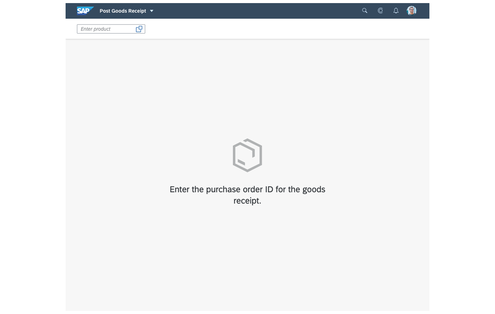
The screen uses initial page floorplan to show single input field for entering a purchase order ID.
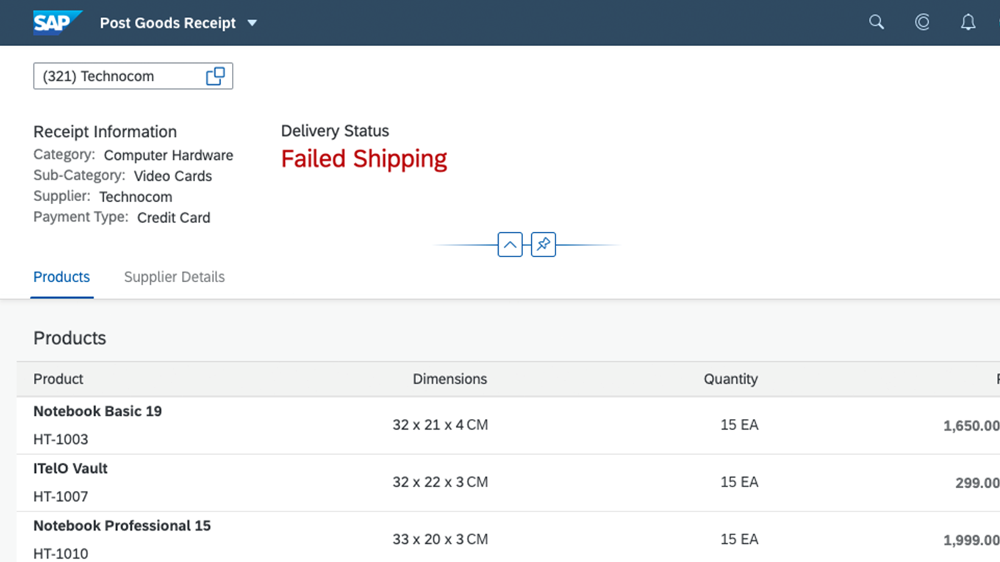
The screen uses initial page floorplan to show the result of searching for the respective purchase order ID.
Do not use this floorplan when you want to show more than one object. In this case, the list report floorplan is a more appropriate solution.
In the following code, the handleValueHelp method is used to display the standard value help dialog for selecting a purchase order in the initial screen.
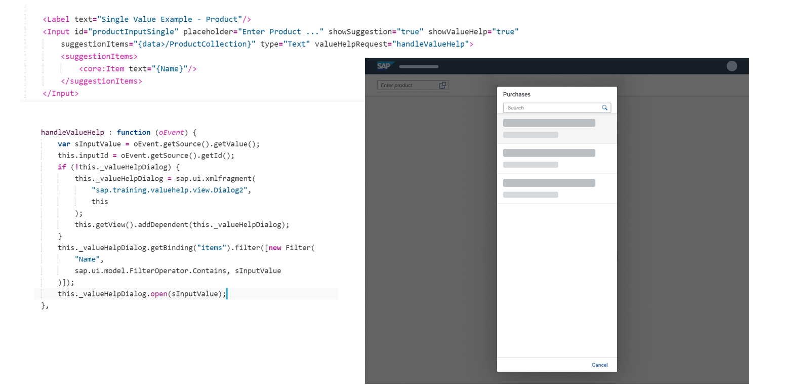
You can also define a specific table structure for the suggestion pane as in the following code.
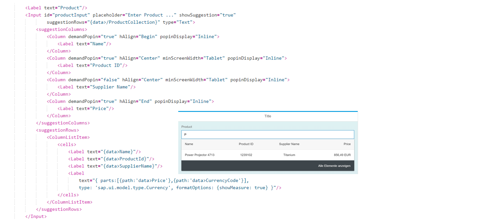
You could also define your own search dialog with a specific fragment and methods to handle Search, Confirm and Cancel user actions.
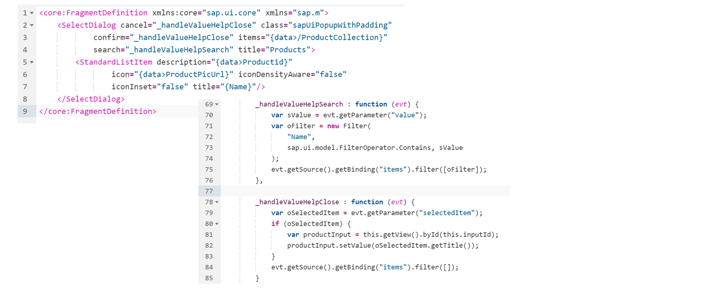
### The Wizard floorplan
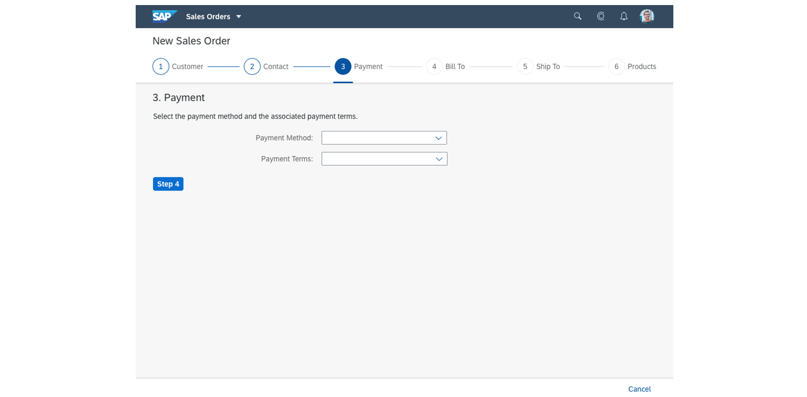
When to use the wizard floorplans
  * The wizard aims to help users by dividing large or complex tasks into segments. Use the wizard if the user has to accomplish a long task (such as filling out a long questionnaire) or a task that is unfamiliar to the user.
  * The flow should consist of a minimum of 3 and a maximum of 8 steps.
  * The wizard can be used for both create and edit scenarios. If your application contains both, consider using the same method for both scenarios – either the wizard, or another create or edit screen, (edit flow or object page).

When not to use the wizard floorplans
  * If you have a task with only 2 steps or a format that the user is familiar with, for example, it is part of their daily routine, do not use the wizard as it only adds unnecessary clicks to the process.
  * If your process needs more than 8 steps, the wizard will not support those steps as the process is too long and can be confusing for the user. In this case, you should consider restructuring the task.
  * Consider if the classic edit screens (edit flow or object page), are more suitable for your use case.

Structure of the wizard floorplan walk-through screen.
  1. After calling the wizard, the first step of the floorplan appears.
  2. When all necessary fields are completed, a button labelled Step # appears.
  3. When completing the last step, a button labelled _Review_ appears.
  4. The footer of the wizard holds the cancel button with standard SAP Fiori cancel behaviour.
  5. It is possible to have a save or draft button when the form is very long

Displayed is the structure of the wizard floorplan summary page. The review button takes the user to the screen displaying the data.
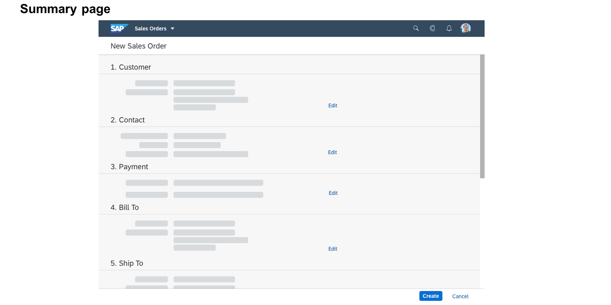
### Summary Table
In this table, you can see each Floorplan summarized. Please refer to the following learning journey for more details: Develop SAPUI5 Applications > SAP Fiori Elements Development.
#### Floorplan Summary Table
| Floorplan  | Description  | SAP Documentation  |
| --- | --- | --- |
| Initial  | Allow navigation to work on one object.  | <https://experience.sap.com/fiori-design-web/initial-page-floorplan/>  |
| List Report  | List several objects.  | <https://experience.sap.com/fiori-design-web/list-report-floorplan-sap-fiori-element/>  |
| Worklist  | Display a collection of items and process them or delegate them to someone else.  | <https://experience.sap.com/fiori-design-web/work-list/>  |
| Object Page  | Display all the information of a simple or complex object with different facets in a responsive way.  | <https://experience.sap.com/fiori-design-web/object-page/>  |
| Wizard  | Guide the user step by step through the data editing.  | <https://experience.sap.com/fiori-design-web/wizard/>  |
| Overview Page  | Provide an overview of information and tasks  | <https://experience.sap.com/fiori-design-web/overview-page/>  |
### Connect with Marco Rossi
Now that you've learned about the SAP Fiori floorplans, put on your thinking cap and help Marco make the right decision in this use case activity.
[Continue to quiz](https://learning.sap.com/courses/ui-development-with-sap-fiori/applying-sap-fiori-design-guidelines_aad4ebc8-85b6-392b-89d4-974bdebde8ab)


### Quiz

*Source: https://learning.sap.com/courses/ui-development-with-sap-fiori/applying-sap-fiori-design-guidelines_aad4ebc8-85b6-392b-89d4-974bdebde8ab*

It's time to put what you've learned to the test, get 1 right to pass this unit.
1.
### You use the flexible-column layout when you want to split a single object into multiple columns, or display only a small amount of information.
Choose the correct answer.
True
False
Submit answers[Next unit](https://learning.sap.com/courses/ui-development-with-sap-fiori/extending-sap-fiori-apps-with-sapui5-flexibility_e572b71c-269c-4b5b-b250-3a6e8f33dbe5)


### Utilizing SAPUI5 Flexibility

*Source: https://learning.sap.com/courses/ui-development-with-sap-fiori/extending-sap-fiori-apps-with-sapui5-flexibility_e572b71c-269c-4b5b-b250-3a6e8f33dbe5*

Objective
After completing this lesson, you will be able to extend SAP Fiori apps using the SAPUI5 Flexibility functionality
## SAPUI5 Flexibility Introduction
Julie is a junior developer of the SAP Fiori Development team. She has built an SAPUI5 app which is being used by multiple customers with different requirements. Julie has received a customer request to make some changes to the app such as add, hide or rearrange fields, or rename labels. She needs some help and consults Michael, the senior developer of the team.

In this lesson, we will focus on SAPUI5 flexibility.
### What is SAPUI5 Flexibility?
SAPUI5 flexibility enables functions for different user groups to adapt SAPUI5 applications in a simple and modification-free way. Available on ABAP platform, SAP Cloud services in the Cloud Foundry environment. Replaces the extensibility concept by broadening the adaptability of SAPUI5 application and simultaneous increase of maintainability and simplicity.
Watch this video to learn more about SAPUI5 Flexibility.
The flexibility of SAPUI5 is based on three pillars:
  * Ensures **lifecycle-stable and modification-free** UI changes based on deltas.
  * Facilitates **cost-efficient UI change process** for extending apps.
  * Provides **intuitive tooling** tailored to the needs of special target groups.

### Features of SAPUI5 Flexibility
UI adaptation is a feature of SAPUI5 flexibility that allows key users without technical knowledge and developers to easily make UI changes in a WYSIWYG manner.

SAPUI5 flexibility allows UI adjustments by creating app variants from existing applications. The UI of the applications can therefore be adapted separately without touching the original app.

Further details on the App Variant concept can be found at the following link: [App Variants: All You Need to Know](https://help.sap.com/viewer/a7b390faab1140c087b8926571e942b7/201809.002/en-US/af47058ad66144579db6a990f3b7b919.html).
### Working with an Adaption Project
In SAP Business Application Studio, an adaptation project lets customers and SAP developers create an app variant for an existing application, adapt them via SAPUI5 Visual Editor, store created projects to Git, and deploy to the system. The SAPUI5 Visual Editor is a design-time editor in SAP BAS providing capabilities to adapt existing SAPUI5 applications without altering its base code.

The SAPUI5 Visual Editor allows the following:

Extension

of standard SAP Fiori applications as app variants (semantic/property changes, view/controller/i18n extension).

Creation

of views (control variants – flex variant management).
Watch this short video to learn more about the SAPUI5 Adaptation Project.
### Different Aspects of Extension
There are different layers and types for extend an SAP Fiori application. The following figure shows the different aspects where extension is possible.

As you can see in the above image it is possible to extend or replace the OData service an application.
On the level of view controllers developer an extend existing controller implementations modification free. Also possible is to replace the complete implementation of an controller or just some functions. This is called **Controller Extension** or **Controller Replacement**.
It is possible to implement so called **Extension Points** in the base application. Extending such points is called **View Extension**. It is also possible to change only the value of UI-controls this is called **View Modification.**. If the implementation of a view from the base application does not fit at all, it is possible to replace the complete implementation. This process is called **View Replacement**.
### Example of Extensions in SAP Fiori App
The SAP Fiori App Reference Library gives detailed information on the provided extensibility features for SAP Fiori standard apps.

The above figures shows the _Implementation Information_ section of the standard SAP Fiori Application **Create Sales Orders**. Details can be found at [SAP Fiori Apps Reference Library > Create Sales Orders](https://fioriappslibrary.hana.ondemand.com/sap/fix/externalViewer/#/detail/Apps\('F0018'\)/W13)
### Stable IDs
It is very important to know that not every control of an application can be modified, only controls with a stable Id can be addressed by the flexibility tools to change the behavior of the control.
  * Stable IDs are used to identify UI-controls during processing.
  * Use of stable Ids:
    * At the id property on each level of UI-controls. This means also layout controls should have an stable id.
    * At the viewId property in the routing configuration on the level of target-configuration for routing.
  * Use semantic names for your IDs to make it easier to identify them later.

If you want to be able to create application variants based on your own implemented applications you must ensure that your base application is working with stable IDs. Only when an visual aspect has an stable ID it can be adapted by the adaption project.
It is also important to encounter also the sequence of the instantiation. If the parent of a aspect with an stable ID does not have an stable ID, it will make is impossible to identify the aspect with the stable ID.
For further details on stable IDs please take a look into the SAPUI5 documentation [Stable IDs: All You Need to Know](https://ui5.sap.com/#/topic/f51dbb78e7d5448e838cdc04bdf65403)and [Use Stable IDs](https://ui5.sap.com/#/topic/79e910e6a0d949c7acb051b33170bebc)


### Implementing View Extension, Modification, and Replacement

*Source: https://learning.sap.com/courses/ui-development-with-sap-fiori/implementing-view-extension-modification-and-replacement_e990e88c-9483-48d6-98fd-cf60c97adf73*

Objective
After completing this lesson, you will be able to extend apps by implementing view extension, modifications, and replacement
## View Extension, Modification, and Replacement
### Prepare the Base Application
### Enable Application Extension
To enable extensions on a SAPUI5 application, a number of steps need to be performed in this base application :
  * In the manifest.json file, you need to set the flexEnabled property to **true** and ensure all the extendable views have ids.
  * In the views, you need to make sure each control has a stable id.
  * In the views also, you need to create extension points.
  * In the controller, you need to configure metadata for the methods you want the developer to extend.

### Setup manifest.json File
Your manifest.json file need to have the correct settings for flexEnabled property and viewID target properties.
You can refer to the following code snippet for more details.
Code Snippet
Copy codeSwitch to dark mode

```

1234567891011121314151617181920212223242526272829303132

//Extract from manifest.json
...
"sap.ui5": {
  "flexEnabled": true,
  "dependencies": {
...

  "targets": {
    "Overview": {
      "viewType": "XML",
      "viewId": "overview",
      "viewName": "Overview",
      "viewLevel": 1
    },
    "NotFound": {
      "viewType": "XML",
      "viewName": "NotFound",
      "controlAggregation": "midColumnPages"
    },
    "Carrier": {
      "viewType": "XML",
      "viewId": "carrier",
      "viewName": "Carrier",
      "viewLevel": 2,
      "controlAggregation": "midColumnPages"
    }
  }
...

```

### Add Extension Points
Extension points can be used in XML templating to extend the standard with custom content. The extension point has a default content which is used unless the extension point is replaced via customizing.

To add an extension point into an application add the control sap.ui.core.ExtensionPoint as shown in the figure and assign the name of the extension point to the name attribute.
The extension point name can result from a binding, including an expression binding which evaluates to a constant. If the extension point is to be replaced by an XML fragment, the extension point element is replaced by the fragment's XML DOM and preprocessing takes place on the DOM as well. All currently available variable names and aliases are inherited into the fragment as usual. You get the same debug output as for fragment instructions, and you see the customized fragment name there.
The view also needs to have stable IDs for all controls.
You can refer to the following code snippet for more details.
Code Snippet
Copy codeSwitch to dark mode

```

12345678910111213141516171819202122232425262728

<mvc:View xmlns:core="sap.ui.core" xmlns:mvc="sap.ui.core.mvc" xmlns="sap.m" xmlns:f="sap.f" xmlns:layout="sap.ui.layout"
  xmlns:uxap="sap.uxap" controllerName="student00.sap.training.dynamicpage.controller.Carrier"
  xmlns:html="http://www.w3.org/1999/xhtml" id="idView">

  <uxap:ObjectPageLayout id="dynamicPageId" showTitleInHeaderContent="true" alwaysShowContentHeader="false"
        preserveHeaderStateOnScroll="false" headerContentPinnable="true" isChildPage="true" enableLazyLoading="false">
    <uxap:headerTitle>
      <uxap:ObjectPageDynamicHeaderTitle id="idHeaderTitle">
        <uxap:expandedHeading>
          <Title text="{Carrname}"/>
        </uxap:expandedHeading>
      <uxap:snappedHeading>
      <Title text="{Carrname}"/>
    </uxap:snappedHeading>
    <uxap:expandedContent>
      <FlexBox alignItems="Start" justifyContent="SpaceBetween" id="idCarrierDetails">
        <items>
          <layout:HorizontalLayout allowWrapping="true">
            <layout:VerticalLayout class="sapUiMediumMarginEnd">
              <ObjectAttribute title="{i18n>urlLabelText}" text="{Url}"/>
            </layout:VerticalLayout>
          </layout:HorizontalLayout>
        </items>
      </FlexBox>
    <core:ExtensionPoint name="ux410_extension" />
    <Button text="{i18n>txtCarrierData}" press="onShowCarrierData"/>
    ....

```

### Configure metadata
To extend the controller of the base application the developer has to define marker interface in the respective controller of the base application. Therefore the developer adds the methods section to the metadata configuration in the base application.

This figure for example shows how the configuration looks like. As you can see in the implementation, a function with the name onShowCarrierData is added to the methods configuration part of the metadata. This function is declared as a public function that is not final. This means it can be overridden.
Code Snippet
Copy codeSwitch to dark mode

```

1234567891011121314151617181920

sap.ui.define([
    "sap/ui/core/mvc/Controller"
  ],
/**
* @param {typeof sap.ui.core.mvc.Controller} Controller
*/
  function (Controller) {
    "use strict";
     return Controller.extend("student00.sap.training.dynamicpage.controller.Carrier", {

      metadata : {
        methods: {
          onShowCarrierData: {
            public:true,
            final:false
          }
        }
      },
...

```

Watch the video to see how to add view extension and controller extensions
### Create Adaption Project

SAPUI5 Adaptation Project allows developers to extend SAP Fiori application in SAP Business Application Studio in a modification free way.
Watch the video to see how to create an adaptation project.
The file manifest.appdescr_variant is the manifest-file for the application variant, it contains the App id of the application variant. It also contains the configuration of the changes in section content. In the following code you can see, that there is a model extension for the i18n-model. This i18n-extension is generated by default and can be used to override Texts from the base application or add new i18n-texts.
The following code shows the manifest.appdescr_variant file. This file contains the basic configuration information of a concrete application variant.
Code Snippet
Copy codeSwitch to dark mode

```

123456789101112131415161718192021222324252627282930313233343536

{
  "fileName": "manifest",
  "layer": "CUSTOMER_BASE",
  "fileType": "appdescr_variant",
  "reference": "student00.sap.training.dynamicpage",
  "id": "customer.ZUX410APP00Extension",
  "namespace": "apps/student00.sap.training.dynamicpage/appVariants/customer.ZUX410APP00Extension/",
  "content": [
    {
      "changeType": "appdescr_app_setTitle",
      "content": {},
      "texts": {
        "i18n": "i18n/i18n.properties"
      }
    },
    {
      "changeType": "appdescr_ui5_addNewModelEnhanceWith",
      "content": {
        "modelId": "i18n",
        "bundleUrl": "i18n/i18n.properties",
        "supportedLocales": [
          ""
        ],
        "fallbackLocale": ""
      }
    },
    {
      "changeType": "appdescr_ui5_setMinUI5Version",
      "content": {
        "minUI5Version": "1.96.16"
       }
    }
  ]
}

```

### Create Application Variant
Now that an Adaption Project is created, we will look closer into how we can create a variant of an application by modifying, extending or replacing aspects of the base application by using SAPUI5 Adaptation Editor.

Watch the video to see how to create an application variant using SAPUI5 Visual Editor.
Settings
### Extend View Implementation
As already mentioned it is possible to extend views from the base application using the SAPUI5 Adaptation Editor.

You can add view extension or controller extensions to enhance or replace the aspects of the base application. For this, you use extension points.

An Extension Point is like an anchor where the developer can add additional visual aspects. The developer of the base application defines where they think an extension might be imaginable. Extension Points are supported from SAPUI5 1.78 in the Business Application Studio. The extension is implemented as an sap.ui.core.Fragment.
We will now look at how to implement fragment for extension point.
For adding custom implementation for an extension point the SAPUI5 Adaptation Editor will create a stub implementation of a fragment.
The following screenshot shows such a generated file.

The developer can now add custom code into the generated file. Bear in mind that you must always work with stable IDs.
The following code shows implementation of fragment extension.
Code Snippet
Copy codeSwitch to dark mode

```

123456789101112

<core:FragmentDefinition xmlns:core='sap.ui.core' xmlns='sap.m' xmlns:layout="sap.ui.layout" id="idFragment">
  <FlexBox alignItems="Start" justifyContent="SpaceBetween" id="idCarrierDetailsEx">
    <items>
      <layout:HorizontalLayout allowWrapping="true" id="idHLayout">
        <layout:VerticalLayout class="sapUiMediumMarginEnd" id="idVLayout">
          <ObjectAttribute title="{i18n>currLabelText}" text="{Currcode}" id="idOA1"/>
          <ObjectAttribute title="{i18n>urlLabelText}" text="{Url}" id="idOA2"/>
        </layout:VerticalLayout>
      </layout:HorizontalLayout>
    </items>
  </FlexBox>
</core:FragmentDefinition>

```

Additionally a new change-file is generated and contains the configuration.
Next, let's look at how to extend controller of base application.
To create a controller extension the SAPUI5 Adaptation Editor is used. The following code shows such a generated controller extension file.

Now the developer can add his own implementation. The screenshot shows the controller extension for the onShowCarrierDatafunction.

As you can see in the above controller extension implementation. The metadata section contains the configuration for the onShowCarrierDatafunction
Using the sap.ui.core.mvc.OverrideExecution enumeration, it is possible to describe if the function should be overwritten or enhanced.
The following code shows implementation of controller extension.
Code Snippet
Copy codeSwitch to dark mode

```

123456789101112131415161718192021222324252627282930

sap.ui.define([
    'sap/ui/core/mvc/ControllerExtension',
    'sap/ui/core/mvc/OverrideExecution',
    'sap/m/MessageBox'
  ],
  function (ControllerExtension, OverrideExecution, MessageBox) {
    "use strict";
    return ControllerExtension.extend("customer.ZUX410APP00Extension.mycarrierextension", {

      metadata: {
        methods: {
          onShowCarrierData : {
            public:true,
            final: false,
            overrideExecution: OverrideExecution.Instead
          }
        }
      },
      override : {
        onShowCarrierData : function(oEvent) {
          MessageBox.show("You are currently viewing the data of carrier " +
                           this.getView().getBindingContext().getProperty("Carrname"), {
            icon: MessageBox.Icon.Information,
            title: "Carrier data"
          });
        }
      }
   });
});

```

### Explore Change Files
Adaptions added or configured in the visual editor are stored as _.change_ files.

The development artifacts are stored in the _changes_ folder located in the _project.Controller-extensions_ are stored in the _coding_ subfolder, view enhancements are stored in the _fragments_ subfolder.
Please be aware that each time a property is changed a new _.changes_ file is generated. Even when a property, for example, _visible_ , is change from true to false and back, two files where generated. So, before you change a property make sure that the change is really needed.
For view modifications no SAPUI5-code is generated, only a _.change_ file is created.
The following snippets are showing change files for different types of changes.
Code Snippet
Copy codeSwitch to dark mode

```

12345678910111213141516171819202122232425262728293031323334353637

{
  "fileName": "id_1677228143911_69_propertyChange",
  "fileType": "change",
  "changeType": "propertyChange",
  "moduleName": "",
  "reference": "customer.ZUX410APP00Extension",
  "packageName": "$TMP",
  "content": {
    "property": "visible",
    "newValue": false
  },
  "selector": {
    "id": "carrier--idCarrierDetails",
    "type": "sap.m.FlexBox",
    "idIsLocal": true
  },
  "layer": "CUSTOMER_BASE",
  "texts": {},
  "namespace": "apps/student00.sap.training.dynamicpage/changes/",
  "projectId": "customer.ZUX410APP00Extension",
  "creation": "2023-02-24T08:42:24.302Z",
  "originalLanguage": "FR",
  "support": {
    "generator": "sap.ui.rta.command",
    "service": "",
    "user": "",
    "sapui5Version": "1.96.14",
    "sourceChangeFileName": "",
    "compositeCommand": "",
    "command": "property"
  },
  "oDataInformation": {},
  "dependentSelector": {},
  "jsOnly": false,
  "variantReference": "",
  "appDescriptorChange": false
}

```

Code Snippet
Copy codeSwitch to dark mode

```

1234567891011121314151617181920212223242526272829303132333435363738

{
  "fileName": "id_1677228336195_70_addXMLAtExtensionPoint",
  "fileType": "change",
  "changeType": "addXMLAtExtensionPoint",
  "moduleName": "customer/ZUX410APP00Extension/changes/fragments/myextension.fragment.xml",
  "reference": "customer.ZUX410APP00Extension",
  "packageName": "$TMP",
  "content": {
    "fragmentPath": "fragments/myextension.fragment.xml"
  },
  "selector": {
    "name": "ux410_extension",
    "viewSelector": {
      "id": "carrier",
      "idIsLocal": true
    }
  },
  "layer": "CUSTOMER_BASE",
  "texts": {},
  "namespace": "apps/customer.ZUX410APP00Extension/changes/",
  "projectId": "customer.ZUX410APP00Extension",
  "creation": "2023-02-24T08:45:36.229Z",
  "originalLanguage": "FR",
  "support": {
    "generator": "sap.ui.rta.command",
    "service": "",
    "user": "",
    "sapui5Version": "1.96.14",
    "sourceChangeFileName": "",
    "compositeCommand": "id_1677228336196_71_composite",
    "command": "addXMLAtExtensionPoint"
  },
  "oDataInformation": {},
  "dependentSelector": {},
  "jsOnly": false,
  "variantReference": "",
  "appDescriptorChange": false
}

```

Code Snippet
Copy codeSwitch to dark mode

```

1234

#Make sure you provide a unique prefix to the newly added keys in this file, to avoid overriding of SAP Fiori application keys.
#XTIT: Application name
customer.ZUX410APP00Extension_sap.app.title=Extension App 00
txtCarrierData=Show Carrier

```

### Replace the Underlying Service of the Application
As mentioned at the beginning, it is also possible to exchange the underlaying OData-Service of the application or to add e.g. custom services.

When you invoke the context menu on your adaptation project, you can access action items to replace the underlying service or to add custom OData-services to the adaption project.
### Deploy the New Application Variant
The adaption project provides the deployment functionality.

To deploy a new application variant, select the file manifest.appdescr_variant from your adaption project an choose from the context menu _Open Deployment Wizard._. Choose in the upcoming screen, if necessary the target system, insert your user name and password and press _Next_. Then, insert the name of your package and press _Finish_ to start the deployment.
After the deployment we can take a look on the deployed application variant. All changes in the application variant are stored in Layered Repository (LREP). You can use Transaction SUI_SUPPORT to get details of the repository files.

After executing the transaction we can search using the transport request number for your deployed variant files.

Having this detail the administrator can now create a new target mapping to the application variant. If you wan to hide the base application in general add the URL parameter sap-appvar-id with the namespace of your application variant to the target mapping of the base application.
[Continue to quiz](https://learning.sap.com/courses/ui-development-with-sap-fiori/utilizing-sapui5-flexibility_c2ba570c-db64-349e-8865-3a07449e1375)


### Quiz

*Source: https://learning.sap.com/courses/ui-development-with-sap-fiori/utilizing-sapui5-flexibility_c2ba570c-db64-349e-8865-3a07449e1375*

It's time to put what you've learned to the test, get 2 right to pass this unit.
1.
### What UI control can be used to define a hook to extend an application?
Choose the correct answer.
sap.m.Extend
sap.ui.core.Extend
sap.ui.core.ExtensionPoint
sap.comp.ExtendControl
2.
### What ways are there, of extending or modifying a SAPUI5 view?
There are three correct answers.
View extension
View enhancement
View replacement
View modification
Submit answers[Go to Course](https://learning.sap.com/courses/ui-development-with-sap-fiori)


### PRACTICE SYSTEM
Hands-on Practice for UI Development with SAP Fiori

*Source: https://learning.sap.com/practice-systems/ui-development-with-sap-fiori*

Practice SystemSubscription
### Hands-on Practice for UI Development with SAP Fiori
SAP S/4HANA 2021 + SAP BTP Business Application Studio
UX410
Get system access

### Overview
This practice system is preconfigured with the data you need to carry out exercises from the course UI Development with SAP Fiori or to experiment on your own with SAP S/4HANA 2021 + SAP BTP Business Application Studio.
### Access Includes
  * 24/7 Access
  * System setup guide
  * Guided exercises
  * Support

Get system access
## Related
[Browse All](https://learning.sap.com/practice-systems)
[
  * Subscription

Practice System Hands-on Practice for SAP Fiori Elements Development SAP Fiori Elements Development
  * SAP S/4HANA 2021 + SAP BTP Business Application Studio
  * •
  * UX403

](https://learning.sap.com/practice-systems/sap-fiori-elements-development)
[
  * Subscription

Practice System Hands-on Practice for Advanced SAP UI5 Development Advanced SAP UI5 Development
  * SAP S/4HANA 2021 + SAP BTP Business Application Studio
  * •
  * UX402

](https://learning.sap.com/practice-systems/advanced-sap-ui5-development)
[
  * Subscription

Practice System Hands-on Practice for Developing UIs with SAPUI5 Developing UIs with SAPUI5
  * SAP S/4HANA 2021 + SAP BTP Business Application Studio
  * •
  * UX400

](https://learning.sap.com/practice-systems/developing-uis-with-sapui5)
## Any questions?
Find answers to some of the most common questions that our learners ask.
[Access FAQs ](https://learning.sap.com/helpcenter/learninghub-subscription/practice-systems)
.jpg&w=3840&q=75)
