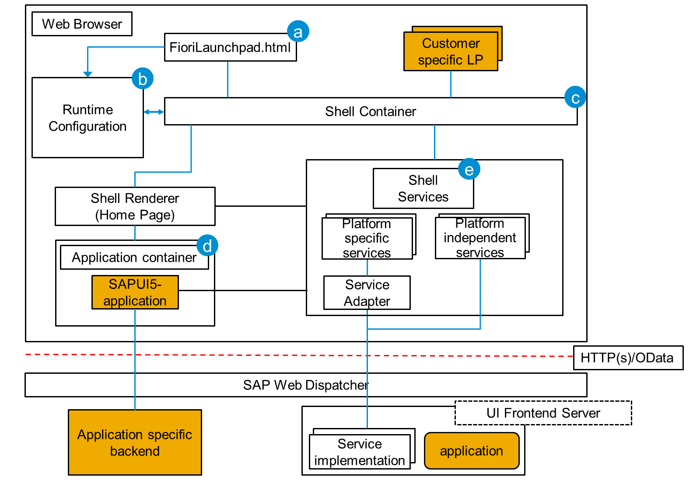

# Understanding the Technical Perspective of SAP Fiori Launchpad

*Source: https://learning.sap.com/courses/ui-development-with-sap-fiori/understanding-the-technical-perspective-of-sap-fiori-launchpad_ae357036-ef3e-43fb-9602-6c9f77b5384a*

Objective
After completing this lesson, you will be able to understand the technical perspective of SAP Fiori launchpad
## Technical Perspective of SAP Fiori Launchpad
### The SAP Fiori Launchpad - Technical Perspective
The user can access the tile catalog directly from the launchpad home page. They find all tiles they are allowed to use. The tiles are grouped into catalogs. A search field and a group selection help is available, to assist in finding the tile that is actually required.
The tile catalog has two functions:
  * Tiles that are used most often can be added to the _Home_ page.
  * Tiles, that are used more seldom, can be accessed directly from the catalog, without adding them to the _Home_ page.

The tile catalog is provided by the SAP Fiori launchpad.
Note
Apps use this tile catalog and do not design their own.
To fully understand how SAP Fiori Launchpad supports SAP Fiori apps, lets look at the architecture of SAP Fiori Launchpad.

  * ( a ) FioriLaunchpad.html: FioriLaunchpad.html is at the center of the SAP Fiori Launchpad architecture and act as the central point of entry to the SAP Fiori Apps.
  * ( b ) Runtime Configuration - The Launchpad gets the RuntimeConfiguration from the SAP-system, containing the configuration provided by the SAP-system.
  * ( c ) Shell Container - The so-called Shell Container is responsible for providing all relevant services like personalization or navigation to applications that are executed inside the SAP Fiori Launchpad.
  * ( d ) Application Container - SAP Fiori applications are executed inside the so-called application container.
  * ( e ) Shell Services - Each application can access the platform-independent shell service through the API of the shell container. Services that need platform-specific data handling or connection management use platform-specific adapters.

[Continue to quiz](https://learning.sap.com/courses/ui-development-with-sap-fiori/sap-fiori-launchpad_3fe7dda0-949c-3373-b129-b97465abbf45)
