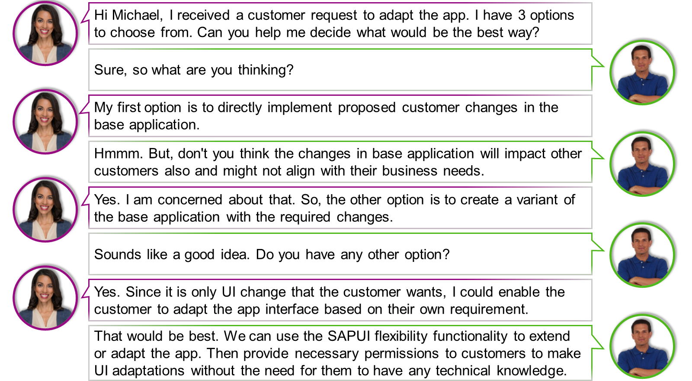
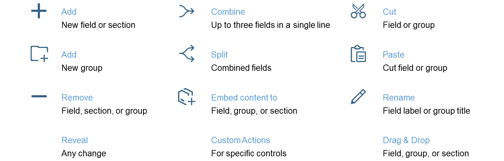
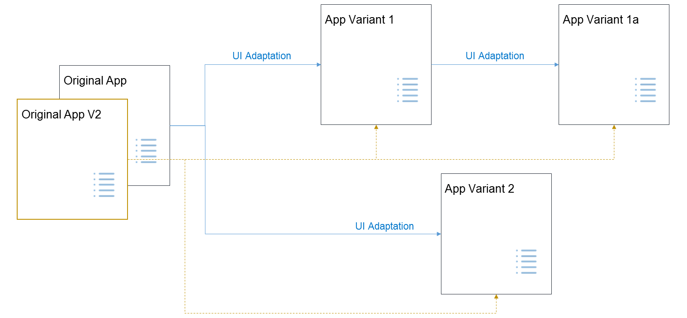
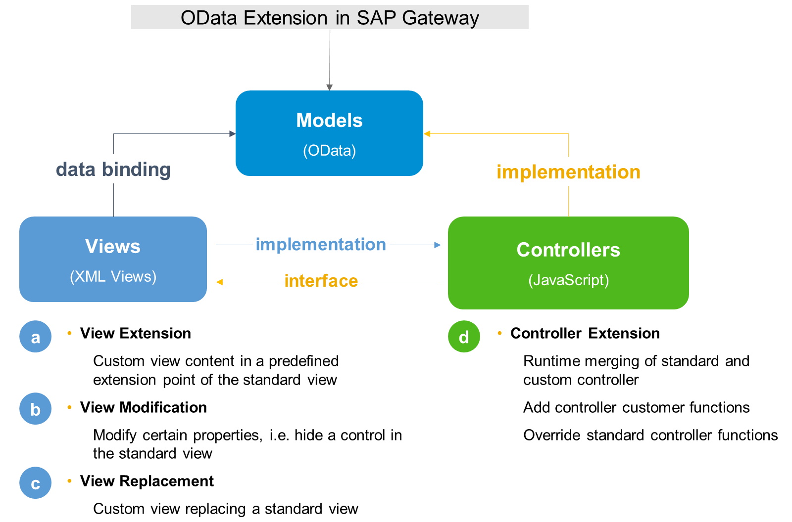
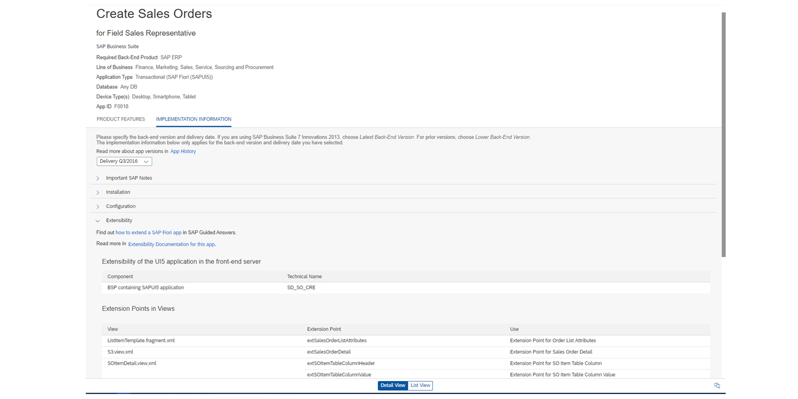

# Utilizing SAPUI5 Flexibility

*Source: https://learning.sap.com/courses/ui-development-with-sap-fiori/extending-sap-fiori-apps-with-sapui5-flexibility_e572b71c-269c-4b5b-b250-3a6e8f33dbe5*

Objective
After completing this lesson, you will be able to extend SAP Fiori apps using the SAPUI5 Flexibility functionality
## SAPUI5 Flexibility Introduction
Julie is a junior developer of the SAP Fiori Development team. She has built an SAPUI5 app which is being used by multiple customers with different requirements. Julie has received a customer request to make some changes to the app such as add, hide or rearrange fields, or rename labels. She needs some help and consults Michael, the senior developer of the team.

In this lesson, we will focus on SAPUI5 flexibility.
### What is SAPUI5 Flexibility?
SAPUI5 flexibility enables functions for different user groups to adapt SAPUI5 applications in a simple and modification-free way. Available on ABAP platform, SAP Cloud services in the Cloud Foundry environment. Replaces the extensibility concept by broadening the adaptability of SAPUI5 application and simultaneous increase of maintainability and simplicity.
Watch this video to learn more about SAPUI5 Flexibility.
The flexibility of SAPUI5 is based on three pillars:
  * Ensures **lifecycle-stable and modification-free** UI changes based on deltas.
  * Facilitates **cost-efficient UI change process** for extending apps.
  * Provides **intuitive tooling** tailored to the needs of special target groups.

### Features of SAPUI5 Flexibility
UI adaptation is a feature of SAPUI5 flexibility that allows key users without technical knowledge and developers to easily make UI changes in a WYSIWYG manner.

SAPUI5 flexibility allows UI adjustments by creating app variants from existing applications. The UI of the applications can therefore be adapted separately without touching the original app.

Further details on the App Variant concept can be found at the following link: [App Variants: All You Need to Know](https://help.sap.com/viewer/a7b390faab1140c087b8926571e942b7/201809.002/en-US/af47058ad66144579db6a990f3b7b919.html).
### Working with an Adaption Project
In SAP Business Application Studio, an adaptation project lets customers and SAP developers create an app variant for an existing application, adapt them via SAPUI5 Visual Editor, store created projects to Git, and deploy to the system. The SAPUI5 Visual Editor is a design-time editor in SAP BAS providing capabilities to adapt existing SAPUI5 applications without altering its base code.

The SAPUI5 Visual Editor allows the following:

Extension

of standard SAP Fiori applications as app variants (semantic/property changes, view/controller/i18n extension).

Creation

of views (control variants – flex variant management).
Watch this short video to learn more about the SAPUI5 Adaptation Project.
### Different Aspects of Extension
There are different layers and types for extend an SAP Fiori application. The following figure shows the different aspects where extension is possible.

As you can see in the above image it is possible to extend or replace the OData service an application.
On the level of view controllers developer an extend existing controller implementations modification free. Also possible is to replace the complete implementation of an controller or just some functions. This is called **Controller Extension** or **Controller Replacement**.
It is possible to implement so called **Extension Points** in the base application. Extending such points is called **View Extension**. It is also possible to change only the value of UI-controls this is called **View Modification.**. If the implementation of a view from the base application does not fit at all, it is possible to replace the complete implementation. This process is called **View Replacement**.
### Example of Extensions in SAP Fiori App
The SAP Fiori App Reference Library gives detailed information on the provided extensibility features for SAP Fiori standard apps.

The above figures shows the _Implementation Information_ section of the standard SAP Fiori Application **Create Sales Orders**. Details can be found at [SAP Fiori Apps Reference Library > Create Sales Orders](https://fioriappslibrary.hana.ondemand.com/sap/fix/externalViewer/#/detail/Apps\('F0018'\)/W13)
### Stable IDs
It is very important to know that not every control of an application can be modified, only controls with a stable Id can be addressed by the flexibility tools to change the behavior of the control.
  * Stable IDs are used to identify UI-controls during processing.
  * Use of stable Ids:
    * At the id property on each level of UI-controls. This means also layout controls should have an stable id.
    * At the viewId property in the routing configuration on the level of target-configuration for routing.
  * Use semantic names for your IDs to make it easier to identify them later.

If you want to be able to create application variants based on your own implemented applications you must ensure that your base application is working with stable IDs. Only when an visual aspect has an stable ID it can be adapted by the adaption project.
It is also important to encounter also the sequence of the instantiation. If the parent of a aspect with an stable ID does not have an stable ID, it will make is impossible to identify the aspect with the stable ID.
For further details on stable IDs please take a look into the SAPUI5 documentation [Stable IDs: All You Need to Know](https://ui5.sap.com/#/topic/f51dbb78e7d5448e838cdc04bdf65403)and [Use Stable IDs](https://ui5.sap.com/#/topic/79e910e6a0d949c7acb051b33170bebc)
