# Implementing View Extension, Modification, and Replacement

*Source: https://learning.sap.com/courses/ui-development-with-sap-fiori/implementing-view-extension-modification-and-replacement_e990e88c-9483-48d6-98fd-cf60c97adf73*

Objective
After completing this lesson, you will be able to extend apps by implementing view extension, modifications, and replacement
## View Extension, Modification, and Replacement
### Prepare the Base Application
### Enable Application Extension
To enable extensions on a SAPUI5 application, a number of steps need to be performed in this base application :
  * In the manifest.json file, you need to set the flexEnabled property to **true** and ensure all the extendable views have ids.
  * In the views, you need to make sure each control has a stable id.
  * In the views also, you need to create extension points.
  * In the controller, you need to configure metadata for the methods you want the developer to extend.

### Setup manifest.json File
Your manifest.json file need to have the correct settings for flexEnabled property and viewID target properties.
You can refer to the following code snippet for more details.
Code Snippet
Copy codeSwitch to dark mode

```

1234567891011121314151617181920212223242526272829303132

//Extract from manifest.json
...
"sap.ui5": {
  "flexEnabled": true,
  "dependencies": {
...

  "targets": {
    "Overview": {
      "viewType": "XML",
      "viewId": "overview",
      "viewName": "Overview",
      "viewLevel": 1
    },
    "NotFound": {
      "viewType": "XML",
      "viewName": "NotFound",
      "controlAggregation": "midColumnPages"
    },
    "Carrier": {
      "viewType": "XML",
      "viewId": "carrier",
      "viewName": "Carrier",
      "viewLevel": 2,
      "controlAggregation": "midColumnPages"
    }
  }
...

```

### Add Extension Points
Extension points can be used in XML templating to extend the standard with custom content. The extension point has a default content which is used unless the extension point is replaced via customizing.
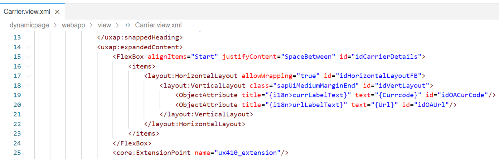
To add an extension point into an application add the control sap.ui.core.ExtensionPoint as shown in the figure and assign the name of the extension point to the name attribute.
The extension point name can result from a binding, including an expression binding which evaluates to a constant. If the extension point is to be replaced by an XML fragment, the extension point element is replaced by the fragment's XML DOM and preprocessing takes place on the DOM as well. All currently available variable names and aliases are inherited into the fragment as usual. You get the same debug output as for fragment instructions, and you see the customized fragment name there.
The view also needs to have stable IDs for all controls.
You can refer to the following code snippet for more details.
Code Snippet
Copy codeSwitch to dark mode

```

12345678910111213141516171819202122232425262728

<mvc:View xmlns:core="sap.ui.core" xmlns:mvc="sap.ui.core.mvc" xmlns="sap.m" xmlns:f="sap.f" xmlns:layout="sap.ui.layout"
  xmlns:uxap="sap.uxap" controllerName="student00.sap.training.dynamicpage.controller.Carrier"
  xmlns:html="http://www.w3.org/1999/xhtml" id="idView">

  <uxap:ObjectPageLayout id="dynamicPageId" showTitleInHeaderContent="true" alwaysShowContentHeader="false"
        preserveHeaderStateOnScroll="false" headerContentPinnable="true" isChildPage="true" enableLazyLoading="false">
    <uxap:headerTitle>
      <uxap:ObjectPageDynamicHeaderTitle id="idHeaderTitle">
        <uxap:expandedHeading>
          <Title text="{Carrname}"/>
        </uxap:expandedHeading>
      <uxap:snappedHeading>
      <Title text="{Carrname}"/>
    </uxap:snappedHeading>
    <uxap:expandedContent>
      <FlexBox alignItems="Start" justifyContent="SpaceBetween" id="idCarrierDetails">
        <items>
          <layout:HorizontalLayout allowWrapping="true">
            <layout:VerticalLayout class="sapUiMediumMarginEnd">
              <ObjectAttribute title="{i18n>urlLabelText}" text="{Url}"/>
            </layout:VerticalLayout>
          </layout:HorizontalLayout>
        </items>
      </FlexBox>
    <core:ExtensionPoint name="ux410_extension" />
    <Button text="{i18n>txtCarrierData}" press="onShowCarrierData"/>
    ....

```

### Configure metadata
To extend the controller of the base application the developer has to define marker interface in the respective controller of the base application. Therefore the developer adds the methods section to the metadata configuration in the base application.
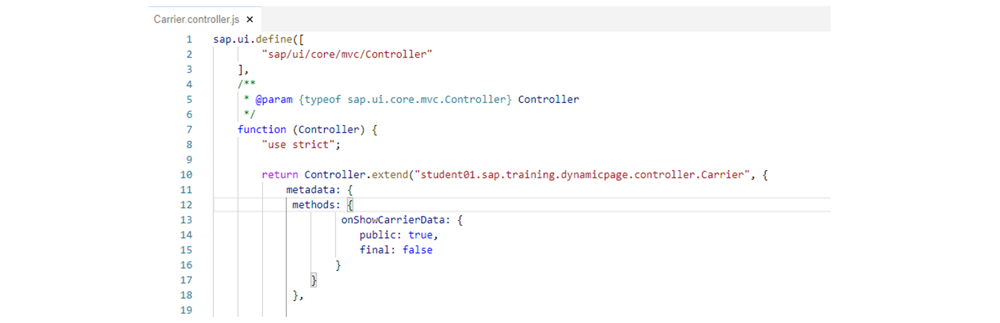
This figure for example shows how the configuration looks like. As you can see in the implementation, a function with the name onShowCarrierData is added to the methods configuration part of the metadata. This function is declared as a public function that is not final. This means it can be overridden.
Code Snippet
Copy codeSwitch to dark mode

```

1234567891011121314151617181920

sap.ui.define([
    "sap/ui/core/mvc/Controller"
  ],
/**
* @param {typeof sap.ui.core.mvc.Controller} Controller
*/
  function (Controller) {
    "use strict";
     return Controller.extend("student00.sap.training.dynamicpage.controller.Carrier", {

      metadata : {
        methods: {
          onShowCarrierData: {
            public:true,
            final:false
          }
        }
      },
...

```

Watch the video to see how to add view extension and controller extensions
### Create Adaption Project
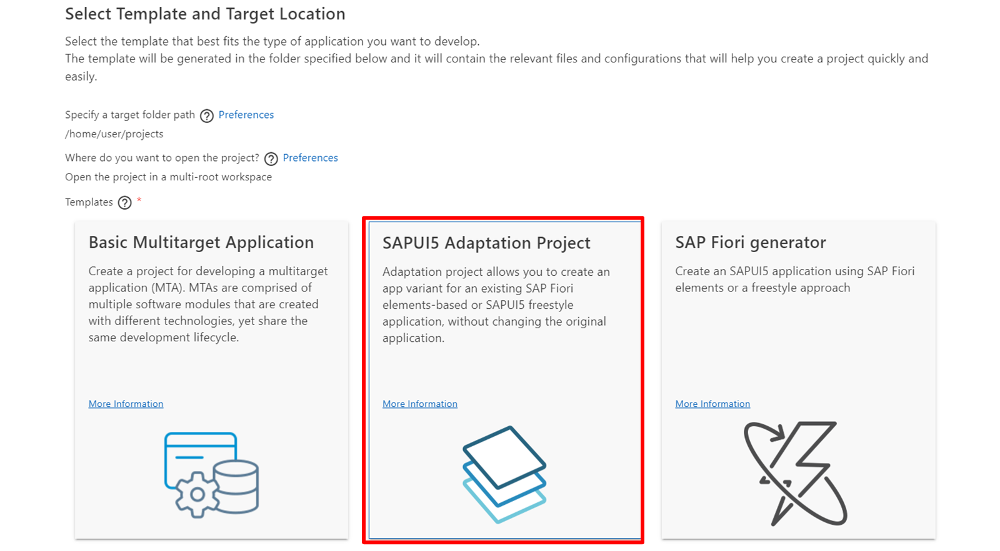
SAPUI5 Adaptation Project allows developers to extend SAP Fiori application in SAP Business Application Studio in a modification free way.
Watch the video to see how to create an adaptation project.
The file manifest.appdescr_variant is the manifest-file for the application variant, it contains the App id of the application variant. It also contains the configuration of the changes in section content. In the following code you can see, that there is a model extension for the i18n-model. This i18n-extension is generated by default and can be used to override Texts from the base application or add new i18n-texts.
The following code shows the manifest.appdescr_variant file. This file contains the basic configuration information of a concrete application variant.
Code Snippet
Copy codeSwitch to dark mode

```

123456789101112131415161718192021222324252627282930313233343536

{
  "fileName": "manifest",
  "layer": "CUSTOMER_BASE",
  "fileType": "appdescr_variant",
  "reference": "student00.sap.training.dynamicpage",
  "id": "customer.ZUX410APP00Extension",
  "namespace": "apps/student00.sap.training.dynamicpage/appVariants/customer.ZUX410APP00Extension/",
  "content": [
    {
      "changeType": "appdescr_app_setTitle",
      "content": {},
      "texts": {
        "i18n": "i18n/i18n.properties"
      }
    },
    {
      "changeType": "appdescr_ui5_addNewModelEnhanceWith",
      "content": {
        "modelId": "i18n",
        "bundleUrl": "i18n/i18n.properties",
        "supportedLocales": [
          ""
        ],
        "fallbackLocale": ""
      }
    },
    {
      "changeType": "appdescr_ui5_setMinUI5Version",
      "content": {
        "minUI5Version": "1.96.16"
       }
    }
  ]
}

```

### Create Application Variant
Now that an Adaption Project is created, we will look closer into how we can create a variant of an application by modifying, extending or replacing aspects of the base application by using SAPUI5 Adaptation Editor.
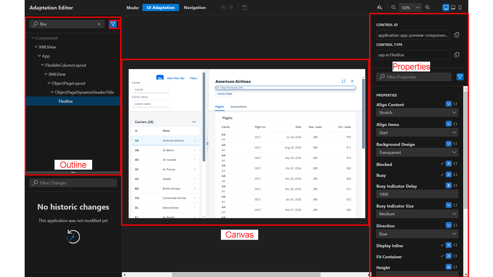
Watch the video to see how to create an application variant using SAPUI5 Visual Editor.
Settings
### Extend View Implementation
As already mentioned it is possible to extend views from the base application using the SAPUI5 Adaptation Editor.
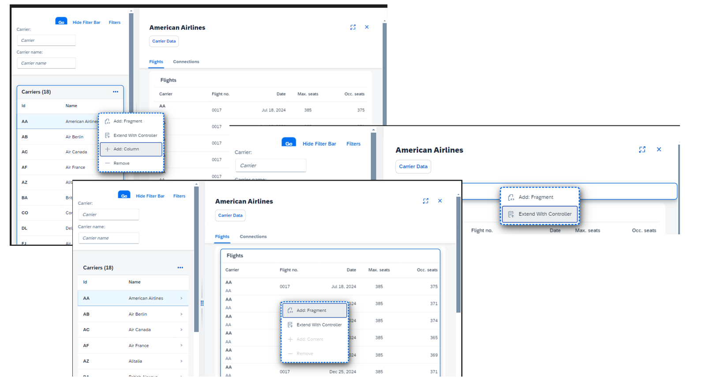
You can add view extension or controller extensions to enhance or replace the aspects of the base application. For this, you use extension points.
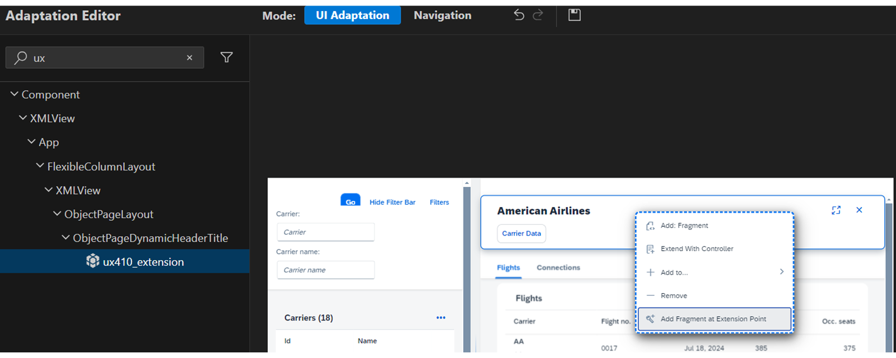
An Extension Point is like an anchor where the developer can add additional visual aspects. The developer of the base application defines where they think an extension might be imaginable. Extension Points are supported from SAPUI5 1.78 in the Business Application Studio. The extension is implemented as an sap.ui.core.Fragment.
We will now look at how to implement fragment for extension point.
For adding custom implementation for an extension point the SAPUI5 Adaptation Editor will create a stub implementation of a fragment.
The following screenshot shows such a generated file.
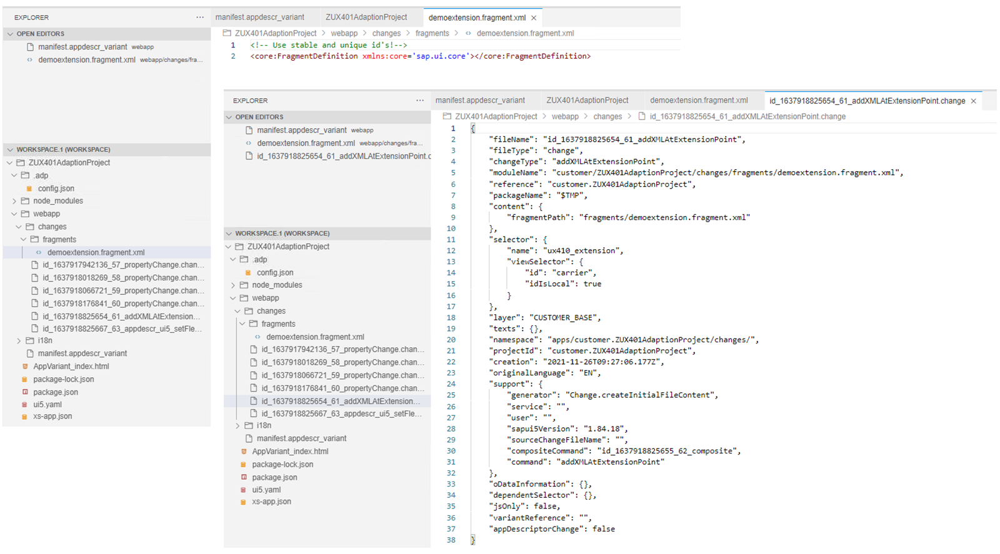
The developer can now add custom code into the generated file. Bear in mind that you must always work with stable IDs.
The following code shows implementation of fragment extension.
Code Snippet
Copy codeSwitch to dark mode

```

123456789101112

<core:FragmentDefinition xmlns:core='sap.ui.core' xmlns='sap.m' xmlns:layout="sap.ui.layout" id="idFragment">
  <FlexBox alignItems="Start" justifyContent="SpaceBetween" id="idCarrierDetailsEx">
    <items>
      <layout:HorizontalLayout allowWrapping="true" id="idHLayout">
        <layout:VerticalLayout class="sapUiMediumMarginEnd" id="idVLayout">
          <ObjectAttribute title="{i18n>currLabelText}" text="{Currcode}" id="idOA1"/>
          <ObjectAttribute title="{i18n>urlLabelText}" text="{Url}" id="idOA2"/>
        </layout:VerticalLayout>
      </layout:HorizontalLayout>
    </items>
  </FlexBox>
</core:FragmentDefinition>

```

Additionally a new change-file is generated and contains the configuration.
Next, let's look at how to extend controller of base application.
To create a controller extension the SAPUI5 Adaptation Editor is used. The following code shows such a generated controller extension file.
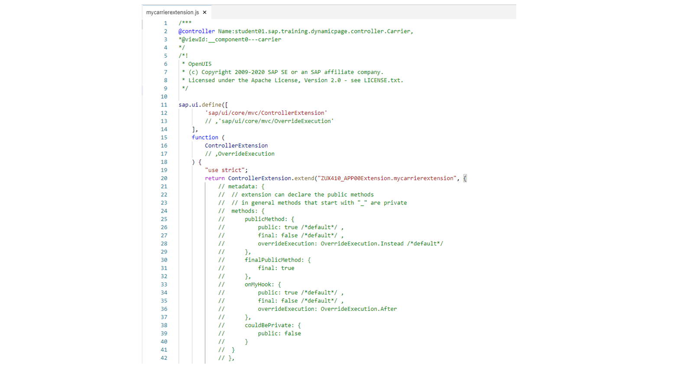
Now the developer can add his own implementation. The screenshot shows the controller extension for the onShowCarrierDatafunction.
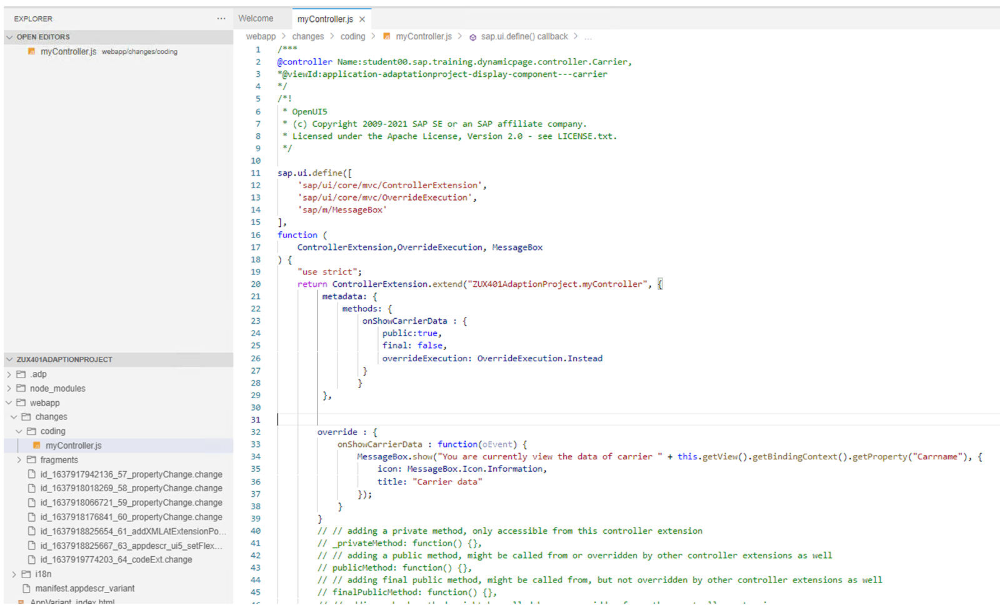
As you can see in the above controller extension implementation. The metadata section contains the configuration for the onShowCarrierDatafunction
Using the sap.ui.core.mvc.OverrideExecution enumeration, it is possible to describe if the function should be overwritten or enhanced.
The following code shows implementation of controller extension.
Code Snippet
Copy codeSwitch to dark mode

```

123456789101112131415161718192021222324252627282930

sap.ui.define([
    'sap/ui/core/mvc/ControllerExtension',
    'sap/ui/core/mvc/OverrideExecution',
    'sap/m/MessageBox'
  ],
  function (ControllerExtension, OverrideExecution, MessageBox) {
    "use strict";
    return ControllerExtension.extend("customer.ZUX410APP00Extension.mycarrierextension", {

      metadata: {
        methods: {
          onShowCarrierData : {
            public:true,
            final: false,
            overrideExecution: OverrideExecution.Instead
          }
        }
      },
      override : {
        onShowCarrierData : function(oEvent) {
          MessageBox.show("You are currently viewing the data of carrier " +
                           this.getView().getBindingContext().getProperty("Carrname"), {
            icon: MessageBox.Icon.Information,
            title: "Carrier data"
          });
        }
      }
   });
});

```

### Explore Change Files
Adaptions added or configured in the visual editor are stored as _.change_ files.
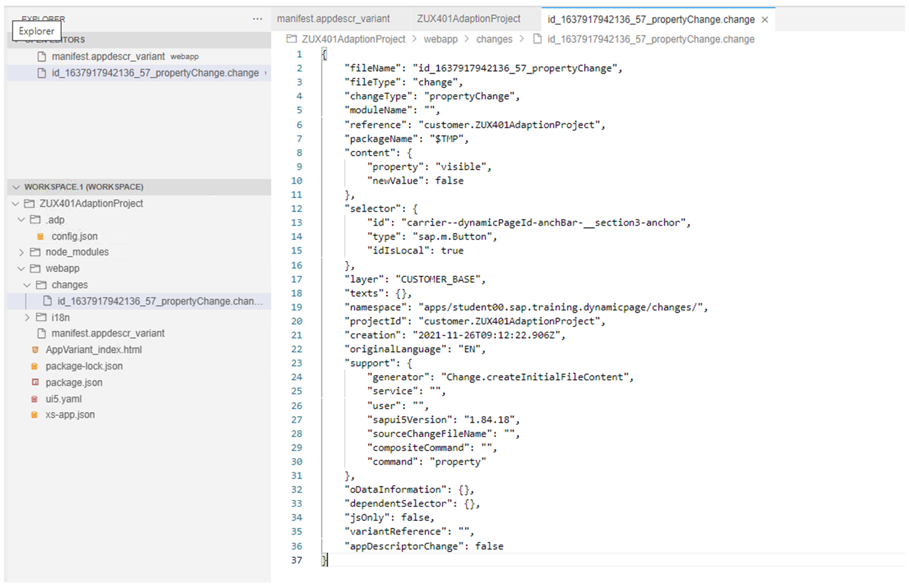
The development artifacts are stored in the _changes_ folder located in the _project.Controller-extensions_ are stored in the _coding_ subfolder, view enhancements are stored in the _fragments_ subfolder.
Please be aware that each time a property is changed a new _.changes_ file is generated. Even when a property, for example, _visible_ , is change from true to false and back, two files where generated. So, before you change a property make sure that the change is really needed.
For view modifications no SAPUI5-code is generated, only a _.change_ file is created.
The following snippets are showing change files for different types of changes.
Code Snippet
Copy codeSwitch to dark mode

```

12345678910111213141516171819202122232425262728293031323334353637

{
  "fileName": "id_1677228143911_69_propertyChange",
  "fileType": "change",
  "changeType": "propertyChange",
  "moduleName": "",
  "reference": "customer.ZUX410APP00Extension",
  "packageName": "$TMP",
  "content": {
    "property": "visible",
    "newValue": false
  },
  "selector": {
    "id": "carrier--idCarrierDetails",
    "type": "sap.m.FlexBox",
    "idIsLocal": true
  },
  "layer": "CUSTOMER_BASE",
  "texts": {},
  "namespace": "apps/student00.sap.training.dynamicpage/changes/",
  "projectId": "customer.ZUX410APP00Extension",
  "creation": "2023-02-24T08:42:24.302Z",
  "originalLanguage": "FR",
  "support": {
    "generator": "sap.ui.rta.command",
    "service": "",
    "user": "",
    "sapui5Version": "1.96.14",
    "sourceChangeFileName": "",
    "compositeCommand": "",
    "command": "property"
  },
  "oDataInformation": {},
  "dependentSelector": {},
  "jsOnly": false,
  "variantReference": "",
  "appDescriptorChange": false
}

```

Code Snippet
Copy codeSwitch to dark mode

```

1234567891011121314151617181920212223242526272829303132333435363738

{
  "fileName": "id_1677228336195_70_addXMLAtExtensionPoint",
  "fileType": "change",
  "changeType": "addXMLAtExtensionPoint",
  "moduleName": "customer/ZUX410APP00Extension/changes/fragments/myextension.fragment.xml",
  "reference": "customer.ZUX410APP00Extension",
  "packageName": "$TMP",
  "content": {
    "fragmentPath": "fragments/myextension.fragment.xml"
  },
  "selector": {
    "name": "ux410_extension",
    "viewSelector": {
      "id": "carrier",
      "idIsLocal": true
    }
  },
  "layer": "CUSTOMER_BASE",
  "texts": {},
  "namespace": "apps/customer.ZUX410APP00Extension/changes/",
  "projectId": "customer.ZUX410APP00Extension",
  "creation": "2023-02-24T08:45:36.229Z",
  "originalLanguage": "FR",
  "support": {
    "generator": "sap.ui.rta.command",
    "service": "",
    "user": "",
    "sapui5Version": "1.96.14",
    "sourceChangeFileName": "",
    "compositeCommand": "id_1677228336196_71_composite",
    "command": "addXMLAtExtensionPoint"
  },
  "oDataInformation": {},
  "dependentSelector": {},
  "jsOnly": false,
  "variantReference": "",
  "appDescriptorChange": false
}

```

Code Snippet
Copy codeSwitch to dark mode

```

1234

#Make sure you provide a unique prefix to the newly added keys in this file, to avoid overriding of SAP Fiori application keys.
#XTIT: Application name
customer.ZUX410APP00Extension_sap.app.title=Extension App 00
txtCarrierData=Show Carrier

```

### Replace the Underlying Service of the Application
As mentioned at the beginning, it is also possible to exchange the underlaying OData-Service of the application or to add e.g. custom services.
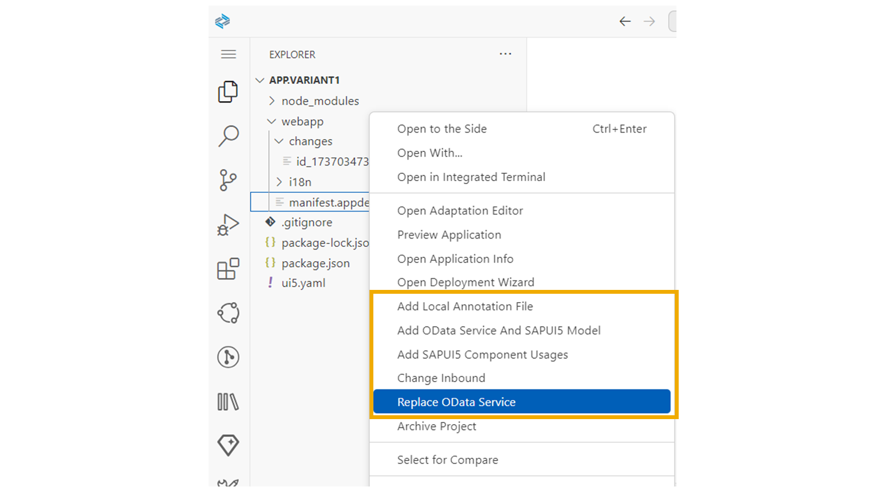
When you invoke the context menu on your adaptation project, you can access action items to replace the underlying service or to add custom OData-services to the adaption project.
### Deploy the New Application Variant
The adaption project provides the deployment functionality.
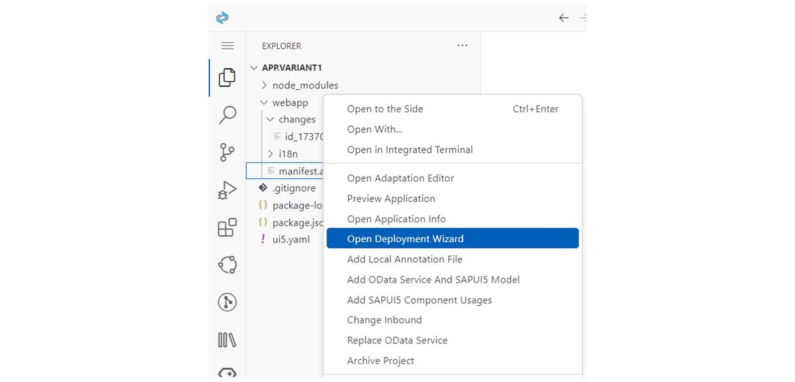
To deploy a new application variant, select the file manifest.appdescr_variant from your adaption project an choose from the context menu _Open Deployment Wizard._. Choose in the upcoming screen, if necessary the target system, insert your user name and password and press _Next_. Then, insert the name of your package and press _Finish_ to start the deployment.
After the deployment we can take a look on the deployed application variant. All changes in the application variant are stored in Layered Repository (LREP). You can use Transaction SUI_SUPPORT to get details of the repository files.
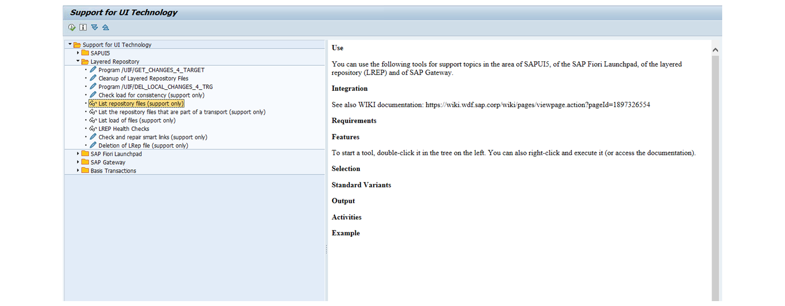
After executing the transaction we can search using the transport request number for your deployed variant files.
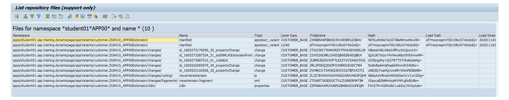
Having this detail the administrator can now create a new target mapping to the application variant. If you wan to hide the base application in general add the URL parameter sap-appvar-id with the namespace of your application variant to the target mapping of the base application.
[Continue to quiz](https://learning.sap.com/courses/ui-development-with-sap-fiori/utilizing-sapui5-flexibility_c2ba570c-db64-349e-8865-3a07449e1375)
